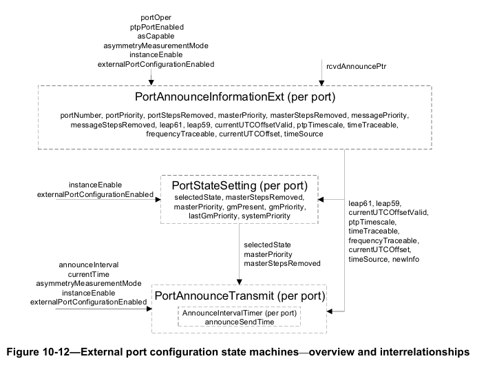
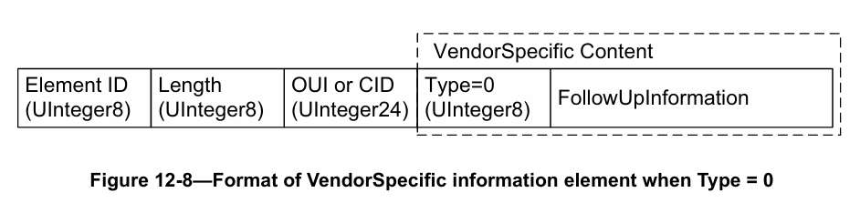

# IEEE 局域网和城域网标准——时间敏感型应用的定时与同步
## 1. 概述
### 1.1 范围
本标准规定了用于确保音频、视频、时间敏感型控制等时间敏感型应用在IEEE 802及类似介质等网络中满足同步要求的协议、规程和被管理对象。这包括在正常运行期间，以及网络组件的添加、移除、故障和网络重新配置后，对同步时间的维护。本标准规定了在IEEE标准802.1Q™-2018的语境下，如何在适用场景中使用IEEE 1588™规范。本标准不涉及与外部提供的定时信号（如协调世界时（UTC）、国际原子时（TAI）等公认定时标准）的同步，但也不排除此类同步。

### 1.2 目的
本标准使系统能够满足时间敏感型应用对抖动、漂移和时间同步的相应要求，包括涉及向多个终端站传输多个流的应用场景。为促进分组网络在这些应用中的广泛应用，在每个需要对时间敏感型应用数据进行映射或解映射，或执行时间敏感型功能的网络元素处，同步信息都是必需的组成部分之一。本标准借鉴了IEEE 1588工作组的成果，通过制定满足这些要求所需的额外规范，进一步完善相关技术体系。


## 2. 规范性引用文件
下列引用文件对于本标准的应用至关重要（即必须理解并使用这些文件；因此，每个引用文件均在正文中被引用，且其与本文件的关系也会予以说明）。对于注明日期的引用文件，仅所引用的版本适用；对于未注明日期的引用文件，其最新版本（包括所有修订版或勘误表）适用。

- IEEE 标准 754™-2008，《IEEE浮点数运算标准》。
- IEEE 标准 802®-2014，《IEEE局域网和城域网标准——概述与体系结构》。
- IEEE 标准 802c™-2017，《IEEE局域网和城域网标准——概述与体系结构——修订版2：本地介质访问控制（MAC）地址的使用》。
- IEEE 标准 802.1AC™-2016，《IEEE局域网和城域网标准——介质访问控制（MAC）服务定义》。
- IEEE 标准 802.1AX™-2014，《IEEE局域网和城域网标准——链路聚合》。
- IEEE 标准 802.1Q™-2018，《IEEE局域网和城域网标准——网桥和桥接网络》。
- IEEE 标准 802.3™-2018，《IEEE以太网标准》。
- IEEE 标准 802.11™-2016，《IEEE信息技术标准——系统间电信和信息交换——局域网和城域网——特定要求——第11部分：无线局域网介质访问控制（MAC）和物理层（PHY）规范》。
- IEEE 标准 1588™-2019，《IEEE网络化测量与控制系统精确时钟同步协议标准》。
- 国际地球自转和参考系服务（IERS）公报C（详见 https://www.iers.org/IERS/EN/Publications/Bulletins/bulletins.html）。
- 互联网工程任务组（IETF）请求注解（RFC）2863（2000年6月），《接口组管理信息库》，作者：K. 麦克洛格利（K. McCloghrie）、F. 卡斯滕霍尔茨（F. Kastenholz）。
- 互联网工程任务组（IETF）请求注解（RFC）3410（2002年12月），《互联网标准管理框架简介及适用性说明》，作者：J. 凯斯（J. Case）、R. 芒迪（R. Mundy）、D. 帕滕（D. Partain）、B. 斯图尔特（B. Stewart）。
- 互联网工程任务组（IETF）请求注解（RFC）3418（2002年12月），《简单网络管理协议（SNMP）管理信息库（MIB）》，编辑：R. 普雷苏恩（R. Presuhn）。
- 国际标准化组织（ISO）标准 80000-3:2006，《量和单位——第3部分：空间和时间》。
- 国际电信联盟电信标准化部门（ITU-T）建议G.984.3修订版2，《千兆比特无源光网络（G-PON）：传输汇聚层规范——日期分发及维护更新与说明》。
- 国际电信联盟电信标准化部门（ITU-T）建议G.9960，《统一高速有线家庭网络收发器——系统体系结构和物理层规范》[与国际电信联盟电信标准化部门（ITU-T）建议G.9961共同被称为“G.hn”]。
- 国际电信联盟电信标准化部门（ITU-T）建议G.9961，《统一高速有线家庭网络收发器数据链路层（DLL）》[与国际电信联盟电信标准化部门（ITU-T）建议G.9960共同被称为“G.hn”]。
- 同轴电缆多媒体联盟（MoCA）标准《MoCA®媒体访问控制/物理层规范版本2.0》，文档编号：MoCA-M/P-SPEC-V2.0-20100507。


## 3. 术语定义
为本标准之目的，适用下列术语和定义。对于本条款中未定义的术语，应查阅《IEEE标准词典在线》。

### 3.1 准确度（accuracy）
在一组测量中，被测时钟与参考时钟之间的时间或频率误差的平均值（详见IEEE标准1588-2019）。

### 3.2 网桥（Bridge）
指媒体访问控制网桥（MAC Bridge）或虚拟局域网感知网桥（VLAN-aware Bridge），详见IEEE标准802.1Q-2018的第5条规定。

### 3.3 时钟（clock）
一种能够测量自设定起始时刻起时间流逝情况的物理设备。

### 3.4 设备（device）
实现某种功能的实体，例如时钟、时间感知系统、端口等。

### 3.5 直接通信（direct communication）
两个精确时间协议实例（PTP Instance）之间进行IEEE 802.1AS信息通信，且无其他中间精确时间协议实例介入的方式。

### 3.6 终端站（end station）
连接到局域网（LAN）或城域网（MAN）的设备，可作为局域网或城域网上传输流量的源端和/或目的端。

### 3.7 事件消息（event message）
在从一个精确时间协议实例（PTP Instance）出栈和进入另一个精确时间协议实例（PTP Instance）时会进行时间戳标记的消息。
> 注：详见8.4.3条款。

### 3.8 分数频率偏差（fractional frequency offset）
被测时钟与参考时钟之间的分数偏差，用y表示，定义如下：
其中，$f_{m}$ 为被测时钟的频率，$f_{r}$ 为参考时钟的频率，且 $f_{m}$ 与 $f_{r}$ 的测量单位相同。

### 3.9 频率偏差（frequency offset）
被测频率与参考频率之间的偏差，定义为 $f_{m}-f_{r}$，其中 $f_{m}$ 为被测时钟的频率，$f_{r}$ 为参考时钟的频率，且 $f_{m}$ 与 $f_{r}$ 的测量单位相同。

### 3.10 通用消息（general message）
无需进行时间戳标记的消息。

### 3.11 通用精确时间协议通信路径（gPTP communication path）
通用精确时间协议（gPTP）域中的一段链路，可实现两个精确时间协议实例（PTP Instance）之间的直接通信。
> 注：详见8.1条款。

### 3.12 具备主时钟能力的精确时间协议实例（grandmaster-capable PTP Instance）
能够作为主时钟精确时间协议实例（Grandmaster PTP Instance）的精确时间协议实例（PTP Instance）。

### 3.13 主时钟（Grandmaster Clock）
在单个精确时间协议（PTP）域的语境下，指某个精确时间协议实例（PTP Instance）的同步时间，该实例是该域内所有其他精确时间协议实例（PTP Instance）实现时间同步所依据的时间源。

### 3.14 主时钟精确时间协议实例（Grandmaster PTP Instance）
包含主时钟（Grandmaster Clock）的精确时间协议实例（PTP Instance）。

### 3.15 局域网（local area network，LAN）
由设备组成的网络，无论部署在室内还是室外，覆盖有限的地理区域，例如一栋建筑物或一个园区。

### 3.16 本地时钟（local clock）
嵌入在相应实体（如精确时间协议实例、协调共享网络节点）中的自由运行时钟，可为该实体提供基于任意起始时刻的统一时间。

### 3.17 消息时间戳点（message timestamp point）
事件消息内部的一个点，作为进行时间戳标记的参考点。

### 3.18 消息类型（message type）
消息的类型即对应消息的名称，例如同步消息（Sync）、宣告消息（Announce）、定时测量帧（Timing Measurement Frame）等。

### 3.19 精度（precision）
对被测时钟与参考时钟之间时间或频率误差偏离平均值程度的一种度量（详见IEEE标准1588-2019）。

### 3.20 主参考源（primary reference）
可溯源至国际标准的时间和/或频率源。另见：溯源性（traceability）。

### 3.21 精确时间协议终端实例（PTP End Instance）
仅有一个精确时间协议端口（PTP Port）的精确时间协议实例（PTP Instance）。

### 3.22 精确时间协议实例（PTP Instance）
IEEE 802.1AS协议的一个实例，在单个时间感知系统中运行，且仅属于一个域。该实例实现IEEE标准802.1AS中规定的、适用于精确时间协议中继实例（PTP Relay Instance）或精确时间协议终端实例（PTP End Instance）的部分功能。
> 注：在IEEE标准802.1AS中，“精确时间协议实例（PTP Instance）”一词指符合该标准要求的IEEE 1588精确时间协议实例（IEEE 1588 PTP Instance）。

### 3.23 精确时间协议链路（PTP Link）
在一个域内，两个精确时间协议端口（PTP Port）之间采用IEEE标准802.1AS的对等延迟机制的网络段。该对等延迟机制用于测量此类链路的传播时间。
> 注：精确时间协议实例（PTP Instance）的精确时间协议端口（PTP Port）之间的精确时间协议链路（PTP Link）同时也是通用精确时间协议通信路径（gPTP Communication Path）（详见3.11条款）。

### 3.24 精确时间协议中继实例（PTP Relay Instance）
能够采用IEEE标准802.1AS协议，将在一个精确时间协议端口（PTP Port）接收到的同步时间传输至其他精确时间协议端口（PTP Port）的精确时间协议实例（PTP Instance）。
> 注：例如，精确时间协议中继实例（PTP Relay Instance）可包含在网桥、路由器或多端口终端站中。

### 3.25 公认定时标准（recognized timing standard）
一种外部于IEEE 1588精确时间协议（PTP）的公认标准时间源，其提供的时间可溯源至维护国际原子时（TAI）和协调世界时（UTC）时间尺度基准时钟的国际标准实验室。此类时间源的示例包括美国国家标准与技术研究院（NIST）时间服务器和全球导航卫星系统（GNSS）。

### 3.26 参考平面（reference plane）
精确时间协议实例（PTP Instance）的精确时间协议端口（PTP Port）与网络物理介质之间的边界。帧穿越此接口时会发生时间戳标记事件。

### 3.27 驻留时间（residence time）
精确时间协议实例（PTP Instance）接收时间同步事件消息至该实例在另一个精确时间协议端口（PTP Port）发送下一个后续时间同步事件消息之间的时间间隔时长。不同的精确时间协议端口（PTP Port）对应的驻留时间可能不同。该术语仅适用于syncLocked变量为TRUE的情况。
> 注1：关于syncLocked变量的定义，详见10.2.5.15条款。
> 注2：若精确时间协议实例（PTP Instance）的某个精确时间协议端口（PTP Port）在未接收时间同步事件消息的情况下发送了时间同步事件消息（例如，syncLocked变量为FALSE或发生同步接收超时（详见10.7.3.1条款）），则从最近一次接收时间同步事件消息到此次发送时间同步事件消息的时间间隔时长，在数学上与驻留时间等效，但通常不将该时间间隔称为驻留时间。

### 3.28 （时钟或时钟信号的）稳定性（stability (of a clock or clock signal)）
对（时钟或时钟信号的）频率误差随时间变化程度的一种度量。受老化及温度等各种环境因素的影响，频率误差通常会随时间发生变化。

### 3.29 同步时间（synchronized time）
事件相对于主时钟（Grandmaster Clock）的时间。
> 注：若主时钟精确时间协议实例（Grandmaster PTP Instance）或其时间基准发生变化，同步时间可能会出现相位和/或频率阶跃。

### 3.30 同步时钟（synchronized clocks）
在不考虑相对论效应的情况下，若两个时钟具有相同的起始时刻，且在任意时刻对同一事件的时间测量值之差不超过规定的不确定度，则这两个时钟实现了符合该不确定度要求的同步。
> 注：详见8.2.2条款。

### 3.31 频率同步时钟（syntonized clocks）
在不考虑相对论效应的情况下，若两个时钟的秒长相同（即两个时钟测量的时间推进速率在规定的不确定度范围内一致），则这两个时钟实现了符合该不确定度要求的频率同步。这两个时钟可能具有相同的起始时刻，也可能没有。

### 3.32 时间感知系统（time-aware system）
包含一个或多个精确时间协议实例（PTP Instance）和/或精确时间协议服务（如公共平均链路延迟服务）的设备。
> 注1：关于公共平均链路延迟服务的说明，详见11.2.17条款。
> 注2：一个时间感知系统（time-aware system）在同一域和/或不同域中可包含多个精确时间协议实例（PTP Instance）。

### 3.33 时间戳测量平面（timestamp measurement plane）
捕获时间戳的平面。若时间戳测量平面与参考平面（reference plane）不同，则需对时间戳进行入站延迟（ingressLatency）和/或出站延迟（egressLatency）修正。另见：参考平面（reference plane）。
> 注：关于出栈和入栈时的时间戳标记，详见8.4.3条款。

### 3.34 溯源性（traceability）
详见IEEE标准1588-2019的3.1.81条款。


## 4. 首字母缩写词和缩略语

| 首字母缩写词/缩略语 | 英文全称 | 中文全称 |
| --- | --- | --- |
| Ack | acknowledgment | 确认 |
| ADEV | Allan deviation | 阿伦偏差 |
| ARB | arbitrary | 任意的 |
| BC | Boundary Clock | 边界时钟 |
| BMC | best master clock | 最佳主时钟 |
| BMCA | best master clock algorithm | 最佳主时钟算法 |
| CID | Company identification (allocated by the IEEE) | 公司标识（由IEEE分配） |
| CMLDS | Common Mean Link Delay Service | 公共平均链路延迟服务 |
| CSN | coordinated shared network | 协调共享网络 |
| CTC | channel time clock | 信道时间时钟 |
| EPON | IEEE 802.3™ Ethernet Passive Optical Network, as specified in IEEE Std 802.3-2018 | 以太网无源光网络（IEEE 802.3™标准，详见IEEE标准802.3-2018） |
| FTM | Fine Timing Measurement | 精细定时测量 |
| G.hn | ITU-T G.9960 and ITU-T G.9961 | 国际电信联盟电信标准化部门G.9960和G.9961标准（统一高速有线家庭网络标准） |
| GM | Grandmaster | 主时钟 |
| GMT | Greenwich mean time | 格林尼治标准时间 |
| GNSS | global navigation satellite system | 全球导航卫星系统 |
| GPS | global positioning (satellite) system | 全球定位（卫星）系统 |
| gPTP | generalized precision time protocol (IEEE Std 802.1AS) | 通用精确时间协议（IEEE标准802.1AS） |
| IERS | International Earth Rotation and Reference Systems Service | 国际地球自转和参考系服务 |
| IP | Internet Protocol | 互联网协议 |
| ISS | Internal Sublayer Service | 内部子层服务 |
| LAN | local area network | 局域网 |
| LCI | location configuration information | 位置配置信息 |
| LLC | logical link control | 逻辑链路控制 |
| MAC | media access control | 介质访问控制 |
| MACsec | media access control security | 介质访问控制安全 |
| MIB | Management Information Base | 管理信息库 |
| MLME | IEEE 802.11™ MAC layer management entity | 媒体访问控制层管理实体（IEEE 802.11™标准） |
| MPCP | IEEE 802.3 multipoint control protocol | 多点控制协议（IEEE 802.3标准） |
| MPCPDU | IEEE 802.3 MPCP data unit | 多点控制协议数据单元（IEEE 802.3标准） |
| MD | media-dependent | 介质相关的 |
| NMS | Network Management System | 网络管理系统 |
| NTP | network time protocol | 网络时间协议 |
| OLT | IEEE 802.3 optical line terminal | 光线路终端（IEEE 802.3标准） |
| ONU | IEEE 802.3 optical network unit | 光网络单元（IEEE 802.3标准） |
| OSSP | organization-specific slow protocol | 特定组织慢速协议 |
| OUI | Organizationally Unique Identifier | 组织唯一标识符 |
| P2P | peer-to-peer | 对等（网络） |
| PICS | Protocol Implementation Conformance Statement | 协议实现一致性声明 |
| POSIX ® | portable operating system interface (see ISO/IEC 9945:2003 [B17]) | 可移植操作系统接口（详见ISO/IEC 9945:2003 [B17]） |
| PTP | IEEE 1588 precision time protocol | 精确时间协议（IEEE 1588标准） |
| PTPDEV | PTP deviation | 精确时间协议偏差 |
| RTT | round-trip time | 往返时间 |
| SI | international system of units | 国际单位制 |
| SMI | Structure of Management Information | 管理信息结构 |
| SMIv2 | Structure of Management Information version 2 | 管理信息结构版本2 |
| SNMP | Simple Network Management Protocol | 简单网络管理协议 |
| STA | station | 站点 |
| TAI | International Atomic Time | 国际原子时 |
| TC | Transparent Clock | 透明时钟 |
| TDEV | time deviation | 时间偏差 |
| TDM | time division multiplexing | 时分复用 |
| TDMA | time division multiple access | 时分多址 |
| TLV | type, length, value | 类型-长度-值 |
| TM | Timing Measurement | 定时测量 |
| UCT | unconditional transfer | 无条件转移 |
| UTC | Coordinated Universal Time | 协调世界时 |
| VLAN | virtual local area network | 虚拟局域网 |
| WLAN | wireless local area network | 无线局域网 |

## 5. Conformance（一致性）
本章规定了符合本标准的实现应具备的强制性能力和可选能力。

### 5.1 要求术语
为与现有 IEEE 标准和 IEEE 802.1 标准保持一致，对符合本标准的实现所提出的要求采用以下术语表述：

- a) “应”（shall）用于表示强制性要求。

- b) “可”（may）用于描述实现或管理层面的选择（“可”表示“被允许”，因此“可”和“可不”在含义上完全相同）。

- c) “宜”（should）用于表示推荐性选择（“宜”和“不宜”描述的行为均为允许的，但并非同等理想的选择）。

协议实现一致性声明（PICS）表格（见附录 A）反映了本标准中“应”“可”“宜”等词汇的使用情况。附录 A 本身中使用的“应”“可”“宜”，仅反映协议实现一致性声明（PICS）的使用要求，而非对本标准一致性的要求。

本标准通过使用“是”（is）、“不是”（is not）、“是（复数）”（are）、“不是（复数）”（are not）来表述定义和符合标准行为的逻辑结果，从而避免对正式要求进行不必要的重复和表面上的冗余。对于“可被允许但并非始终必需、不受实现者或管理者直接控制、或其一致性要求在其他地方详细说明”的行为，使用“能够”（can）进行描述；对于“在符合标准的实现或符合标准的实现系统中绝不会出现”的行为，使用“不能”（cannot）进行描述。“允许”（allow）一词用于替代“支持……的能力”（support the ability for）这一表述，“能力”（capability）一词表示“可配置为”（can be configured to）。

### 5.2 协议实现一致性声明（PICS）
声称其实现符合本标准的供应商，应填写附录 A 中提供的协议实现一致性声明（PICS）表格，并提供足以标识供应商和该实现的信息。

### 5.3 时间感知系统要求
时间感知系统的实现应至少支持一个 IEEE 1588 精确时间协议（PTP）实例（PTP Instance）。

### 5.4 PTP 实例（PTP Instance）的要求与选项
#### 5.4.1 要求摘要
PTP 实例（PTP Instance）的实现应满足以下要求：

- a) 实现第 8 章中规定的通用精确时间协议（gPTP）要求。
- b) 支持时间同步状态机的相关要求（10.1.2、10.2.1、10.2.2、10.2.3、10.2.4、10.2.5 和 10.2.6）。
- c) 至少支持一个 PTP 端口（PTP Port）。
- d) 在每个支持的 PTP 端口（PTP Port）上，实现端口同步同步接收状态机（PortSyncSyncReceive state machine）（10.2.8）。
- e) 实现时钟从机同步状态机（ClockSlaveSync state machine）（10.2.13）。
- f) 支持以下最佳主时钟算法（BMCA）要求：
  - 1) 实现最佳主时钟算法（BMCA）（10.3.2、10.3.3、10.3.4、10.3.5、10.3.6、10.3.8 和 10.3.10）。
  - 2) 对于 0 域，实现 externalPortConfigurationEnabled（外部端口配置使能）值为 FALSE（假）时的规范要求（10.3.1）。
  - 3) 实现端口宣告接收状态机（PortAnnounceReceive state machine）（10.3.11）。
  - 4) 实现端口宣告信息状态机（PortAnnounceInformation state machine）（10.3.12）。
  - 5) 实现端口状态选择状态机（PortStateSelection state machine）（10.3.13）。
  - 6) 在 0 域上，以最佳主时钟算法（BMCA）作为默认运行模式，且 externalPortConfiguration（外部端口配置）为 FALSE（假）。
  - 7) 在非 0 域上，至少实现 externalPortConfigurationEnabled（外部端口配置使能）的一种可能取值（即 FALSE（假），表示使用最佳主时钟算法（BMCA）；TRUE（真），表示使用外部端口配置）。
- g) 实现站点同步同步状态机（SiteSyncSync state machine）（10.2.7）。
- h) 实现与通用精确时间协议（gPTP）能力信令相关的状态机（10.4）。
- i) 对于所有消息的接收，以及除宣告消息（Announce）（见 10.6.3）和信令消息（Signaling）（见 10.6.4）之外所有消息的发送，支持 10.5、10.6 和 10.7 中规定的消息要求。
- j) 支持 B.1 和 B.2.4 中的性能要求。

#### 5.4.2 PTP 实例（PTP Instance）的选项
PTP 实例（PTP Instance）的实现宜满足以下要求：

- a) 支持 B.2.2 和 B.2.3 中的性能要求。

PTP 实例（PTP Instance）的实现可满足以下要求：

- b) 在至少一个 PTP 端口（PTP Port）上支持以下与介质无关的主时钟能力：
  - 1) 实现端口同步同步发送状态机（PortSyncSyncSend state machine）（10.2.12）。
  - 2) 实现端口宣告发送状态机（PortAnnounceTransmit state machine）（10.3.16）。
  - 3) 实现宣告间隔设置状态机（AnnounceIntervalSetting state machine）（10.3.17）。
  - 4) 对于宣告消息（Announce）的发送，支持 10.5、10.6 和 10.7 中规定的消息要求。
- c) 支持以下主时钟 PTP 实例（Grandmaster PTP Instance）能力：
  - 1) 支持 5.4.2 的 b) 项中规定的与介质无关的主时钟能力。
  - 2) 支持具备主时钟能力的 PTP 实例（grandmaster-capable PTP Instance）的相关要求（10.1.3）。
  - 3) 实现时钟主机同步发送状态机（ClockMasterSyncSend state machine）（10.2.9）。
  - 4) 实现时钟主机同步偏移状态机（ClockMasterSyncOffset state machine）（10.2.10）。
  - 5) 实现时钟主机接收状态机（ClockMasterReceive state machine）（10.2.11）。
- d) 作为 PTP 中继实例（PTP Relay Instance），支持多个 PTP 端口（PTP Port）（5.4.3）。
- e) 按照 10.5 和 10.6 中规定的消息要求，支持信令消息（Signaling）的发送。
- f) 支持多个 PTP 实例（PTP Instance）；此类支持可实现多个域（7.2.3）。
- g) 在至少一个端口上支持以下外部端口配置能力：
  - 1) 实现 externalPortConfigurationEnabled（外部端口配置使能）值为 TRUE（真）时的规范要求（10.3.1）。
  - 2) 实现端口宣告信息扩展状态机（PortAnnounceInformationExt state machine）（10.3.14）。
  - 3) 实现端口状态设置扩展状态机（PortStateSettingExt state machine）（10.3.15）。
- h) 实现同步间隔设置状态机（SyncIntervalSetting state machine）（10.3.18）。
- i) 实现第 9 章中规定的一个或多个应用接口；声称支持应用接口的 PTP 实例（PTP Instance），应说明其支持的应用接口类型。
- j) 支持第 14 章中规定的定时与同步管理。
- k) 支持远程管理协议的使用。声称支持远程管理的 PTP 实例（PTP Instance）应满足：
   - 1) 说明其支持的远程管理协议标准或规范（见 A.19）。
   - 2) 说明远程管理协议所使用的、支持被管理对象定义和编码的标准或规范（见 A.19）。
   - 3) 若将简单网络管理协议（SNMP）作为远程管理协议支持，则支持第 15 章中规定的、作为管理信息结构版本 2（SMIv2）管理信息库（MIB）模块的被管理对象定义。
- l) 在非 0 域上同时实现最佳主时钟算法（BMCA）和外部端口配置；若在非 0 域上同时实现这两种方式，则 externalPortConfigurationEnabled（外部端口配置使能）的默认值应为 FALSE（假）。

#### 5.4.3 PTP 中继实例（PTP Relay Instance）的要求
PTP 中继实例（PTP Relay Instance）的实现应满足以下要求：
	a) 支持多个 PTP 端口（PTP Port）。
	b) 支持 5.4 中规定的 PTP 实例（PTP Instance）要求。
	c) 支持 5.4.2 的 b) 项中规定的与介质无关的主时钟能力。

### 5.5 全双工 IEEE 802.3 链路的 MAC 特定定时与同步方法
对物理端口提供 IEEE 802.3 介质访问控制（MAC）服务的时间感知系统，其实现应满足以下要求：
	a) 支持全双工操作，符合 IEEE 标准 802.3-2018 的 4.2 章和附录 4A 的规定。
	b) 支持第 11 章中规定的要求。
	c) 实现同步间隔设置状态机（SyncIntervalSetting state machine）（10.3.18）。

对物理端口提供 IEEE 802.3 介质访问控制（MAC）服务的 PTP 实例（PTP Instance），其实现可满足以下要求：
	d) 支持 10.3.12、10.3.13、10.3.16、11.2.14、11.2.15、11.2.19 和 14.8.45 中规定的非对称测量模式。
	e) 支持 11.2.14 中规定的接收端单步能力（one-step capability on receive）。
	f) 支持 11.2.15 中规定的发送端单步能力（one-step capability on transmit）。
	g) 支持 11.2.16 中规定的单步发送操作设置状态机（OneStepTxOperSetting state machine）。
	h) 支持 11.2.19.3.4 中规定的传播延迟平均（propagation delay averaging）。

### 5.6 IEEE 标准 802.11-2016 的 MAC 特定定时与同步方法
对物理端口提供 IEEE 802.11 介质访问控制（MAC）服务的时间感知系统，其实现应满足以下要求：
- a) 支持第 12 章中规定的要求。
- b) 至少支持以下其中一项：
    - 1) 与介质相关的主时钟状态机（12.5.1）；
    - 2) 与介质相关的从机状态机（12.5.2）。

对物理端口提供 IEEE 802.11 介质访问控制（MAC）服务的 PTP 终端实例（PTP End Instance），其实现应满足以下要求：
- c) 至少支持 IEEE 标准 802.11-2016 中规定的 TIMINGMSMT（定时测量）或 FINETIMINGMSMT（精细定时测量）中的一项。

对物理端口提供 IEEE 802.11 介质访问控制（MAC）服务的 PTP 中继实例（PTP Relay Instance），其实现应满足以下要求：
- d) 支持 IEEE 标准 802.11-2016 中规定的 TIMINGMSMT（定时测量）要求。

对物理端口提供 IEEE 802.11 介质访问控制（MAC）服务的 PTP 中继实例（PTP Relay Instance），其实现宜满足以下要求：
- e) 支持 IEEE 标准 802.11-2016 中规定的 FINETIMINGMSMT（精细定时测量）。
> 注：为与仅支持定时测量（TM）的现有基于 TM 的 PTP 终端实例（PTP End Instance）保持向后兼容，要求 PTP 中继实例（PTP Relay Instance）支持 TM。允许 PTP 终端实例（PTP End Instance）支持 TM 或精细定时测量（FTM），或同时支持两者，这样符合本标准的 PTP 终端实例（PTP End Instance）可仅实现 FTM 标准，而这需要 PTP 中继实例（PTP Relay Instance）支持 FTM。

### 5.7 IEEE 802.3 EPON（以太网无源光网络）的 MAC 特定定时与同步方法
对物理端口提供 IEEE 802.3 以太网无源光网络（EPON）介质访问控制（MAC）服务的时间感知系统，其实现应满足以下要求：
- a) 支持 IEEE 标准 802.3-2018 中关于多点 MAC 控制（64.2 和 64.3）以及多点物理编码子层（PCS）和物理介质附加子层（PMA）扩展（第 65 章）的要求。
- b) 支持第 13 章中规定的要求。

### 5.8 协调共享网络（CSN）的 MAC 特定定时与同步方法
对物理端口提供协调共享网络（CSN）介质访问控制（MAC）服务的时间感知系统，其实现应满足以下要求：
- a) 支持第 16 章中规定的要求。
- b) 至少支持一个 MoCA（同轴电缆多媒体联盟）端口（16.6.2）或一个 ITU-T G.hn（国际电信联盟电信标准化部门 G.hn 标准）端口（16.6.3）。

## 6. Conventions（约定）
### 6.1 总则
本章定义了本标准中使用的各类约定和符号，即命名约定、服务规范方法与符号，以及数据类型定义。

### 6.2 服务规范方法与符号
服务接口的规范方法和符号在 IEEE 标准 802.1AC-2016 的第 7 章中进行了描述。

### 6.3 词法形式语法
词法形式指以下内容：
- 名称
- 数据类型

本标准采用以下列表中所示的词法形式约定：
- a) 类型名称：例如 ClockQuality（单词间无分隔符，每个单词的首字母大写）。
- b) 枚举成员和全局常量：例如 ATOMIC_CLOCK（单词间用下划线分隔，所有字母大写）。
- c) PTP 消息中的字段、结构实例和变量：例如 secondsField、clockQuality、clockIdentity（至少为双单词字段名，单词间无分隔符，首个单词首字母不大写，后续单词首字母大写）。
- d) 结构成员：例如 clockQuality.clockClass（单词间无分隔符，结构名后接句点，句点后接成员名）。
- e) 数据集名称：例如 defaultDS、parentDS、portDS、currentDS、timePropertiesDS（单词间无分隔符，首个单词首字母不大写，后续单词首字母大写，以“DS”结尾）。
- f) 数据集成员：例如 defaultDS.clockQuality.clockClass（数据集名后接句点，句点后接成员名，成员名后再接句点，最后接子成员名）。
- g) PTP 消息名称：例如 Sync、Pdelay_Req（单词间用下划线分隔，每个单词的首字母大写）。

当词法形式出现在正文中（而非类型或格式定义中）时，应根据正文语境将其理解为单数、复数或所有格形式。

### 6.4 数据类型与有线格式
#### 6.4.1 总则
为各类变量和消息字段指定的数据类型，定义了协议正确运行或解读 IEEE 1588 精确时间协议（PTP）、IEEE 802.11 消息内容所必需的逻辑属性。
> 注：只要内部表示不会改变通过 IEEE 802.1AS 协议通信可见的任何量的语义，也不会改变协议规定操作的语义，实现时可自由使用任何数据类型的内部表示方式。

#### 6.4.2 基本数据类型规范
所有非基本数据类型均源自表 6-1 中的基本类型。有符号整数采用二进制补码形式表示。

**表 6-1 基本数据类型（Table 6-1-Primitive data types）**
| 数据类型 | 定义 |
| --- | --- |
| Boolean | TRUE（真）或 FALSE（假） |
| EnumerationN | N 位枚举值 |
| UIntegerN | N 位无符号整数 |
| IntegerN | N 位有符号整数 |
| Nibble | 不解释为数字的 4 位字段 |
| Octet | 不解释为数字的 8 位字段 |
| OctetN | 不解释为数字的 N 字节字段（N > 1） |
| Float64（见注） | IEEE 754™ binary64（64 位双精度浮点格式） |

> 注：在本标准 2011 版中，Float64 数据类型被称为 Double（双精度）。该数据类型的语义未发生变化。

#### 6.4.3 派生数据类型规范
##### 6.4.3.1 ScaledNs
ScaledNs 类型以 $2^{-16}$ 纳秒为单位，表示时间和时间间隔的有符号值。
```typedef
typedef Integer96 ScaledNs;
```
例如：-2.5 纳秒表示为：
0xFFFF FFFF FFFF FFFF FFFD 8000

超出该数据类型最大范围的时间或时间间隔的正值或负值，分别编码为该数据类型的最大正值或最大负值。

##### 6.4.3.2 UScaledNs
UScaledNs 类型以 $2^{-16}$ 纳秒为单位，表示时间和时间间隔的无符号值。
```typedef
typedef UInteger96 UScaledNs;
```
例如：2.5 纳秒表示为：
0x0000 0000 0000 0000 0002 8000

超出该数据类型最大值的时间或时间间隔值，编码为该数据类型的最大正值。

##### 6.4.3.3 TimeInterval
TimeInterval 类型以 $2^{-16}$ 纳秒为单位，表示时间间隔。
```typedef
typedef Integer64 TimeInterval;
```
例如：2.5 纳秒表示为：
0x0000 0000 0002 8000

超出该数据类型最大范围的正时间间隔或负时间间隔，分别编码为该数据类型的最大正值和最大负值。

##### 6.4.3.4 Timestamp
Timestamp 类型表示相对于起始时刻的正时间。
```struct
struct Timestamp { 
    UInteger48 seconds; 
    UInteger32 nanoseconds; 
};
```
- seconds 成员：时间戳的整数部分，单位为秒。
- nanoseconds 成员：时间戳的小数部分，单位为纳秒。

nanoseconds 成员的值始终小于 $10^9$。

例如：
+2.000000001 秒表示为 seconds = 0x0000 0000 0002，nanoseconds = 0x0000 0001。

##### 6.4.3.5 ExtendedTimestamp
ExtendedTimestamp 类型表示相对于起始时刻的正时间。
```struct
struct ExtendedTimestamp { 
    UInteger48 seconds; 
    UInteger48 fractionalNanoseconds; 
};
```
- seconds 成员：时间戳的整数部分，单位为秒。
- fractionalNanoseconds 成员：时间戳的小数部分，单位为 $2^{-16}$ 纳秒。

fractionalNanoseconds 成员的值始终小于 $2^{16} \times 10^9$。

例如：
+2.000000001 秒表示为 seconds = 0x0000 0000 0002，fractionalNanoseconds = 0x0000 0001 0000。

##### 6.4.3.6 ClockIdentity
ClockIdentity 类型用于标识一个 PTP 实例（PTP Instance）。
```typedef
typedef Octet8 ClockIdentity;
```

##### 6.4.3.7 PortIdentity
PortIdentity 类型用于标识一个 PTP 实例（PTP Instance）的端口。
```struct
struct PortIdentity {
    ClockIdentity clockIdentity; 
    UInteger16 portNumber;
};
```

##### 6.4.3.8 ClockQuality
ClockQuality 类型表示时钟的质量。
```struct
struct ClockQuality
{ 
    UInteger8 clockClass; 
    Enumeration8 clockAccuracy;
    UInteger16 offsetScaledLogVariance;
};
```

#### 6.4.4 协议数据单元（PDU）格式
##### 6.4.4.1 总则
6.4.2 和 6.4.3 中定义的数据类型，应根据相应介质（例如 IEEE 标准 802.3-2018、IEEE 标准 802.11-2016）的映射规则以及 6.4.4 的规定，映射到有线介质上。

IEEE 802.1AS 协议数据单元（PDU）由第 10 章、第 11 章、第 12 章和第 13 章中定义或引用的消息组成，这些消息基于 6.4.2 和 6.4.3 中定义的数据类型。IEEE 802.1AS 协议数据单元（PDU）字段的内部顺序在 6.4.4.3 至 6.4.4.5 中规定。

##### 6.4.4.2 一个字节内的位编号
位的编号规则为：最高有效位为 7，最低有效位为 0。
> 注：此处描述的协议数据单元（PDU）一个字节内位的编号和顺序，与底层物理层上位的传输顺序无关。

##### 6.4.4.3 基本数据类型
6.4.2 中定义的数值型基本数据类型，其格式应满足：最高有效字节靠近协议数据单元（PDU）的起始位置，后续字节按有效位从高到低的顺序排列。

Boolean（布尔）数据类型中，TRUE（真）格式化为单个位，值为 1；FALSE（假）格式化为单个位，值为 0。

无论长度如何，枚举类型的格式都应等同于相同长度的无符号整数格式，例如 Enumeration16（16 位枚举）的格式应等同于 UInteger16（16 位无符号整数）类型的值格式。

##### 6.4.4.4 基本类型数组
所有数组的格式应满足：数组中数值索引最小的成员靠近协议数据单元（PDU）的起始位置，后续依次为索引值递增的成员，且无任何填充位。在字节数组中，数值索引最小的字节称为最高有效字节。

当使用包含多个字节的字段表示数值时，最高有效字节应靠近协议数据单元（PDU）的起始位置，后续依次为有效位递减的字节。

当单个字节包含多个基本数据类型的字段时，消息字段规范中定义的每个基本类型在该字节内的位位置应保持不变。例如，PTP 消息头的第一个字段为单个字节，由两个字段组成：一个是 Nibble（半字节）类型，占据第 4 位至第 7 位；另一个是 Enumeration4（4 位枚举）类型，占据第 0 位至第 3 位（见 11.4.2 和 10.6.2）。

##### 6.4.4.5 派生数据类型
定义为结构体（struct）的派生数据类型，其格式应满足：结构体的第一个成员靠近协议数据单元（PDU）的起始位置，后续依次为每个成员，且无任何填充位。每个成员应按照其自身的数据类型进行格式化。

定义为类型定义（typedef）的派生数据类型，应按照其引用的数据类型进行格式化。

## 7. 分组网络的时间同步模型
### 7.1 总则
本章提供了一个用于理解通用精确时间协议（gPTP）运行机制的模型，该协议规定了分组网络中时间感知系统的运行方式。尽管本标准基于 IEEE 标准 1588-2019 中描述的精确时间协议（PTP）（实际上，在特定配置下，本标准是 IEEE 标准 1588-2019 的一个恰当子集），但两者仍存在差异，这些差异在 7.5 节中进行总结。

尽管本标准被编写为一份独立文档，但了解 IEEE 标准 1588-2019 第 6 章中描述的 IEEE 1588 体系结构仍具有重要意义。

### 7.2 时间感知网络的体系结构
#### 7.2.1 总则
时间感知网络由多个相互连接的时间感知系统组成，这些系统支持本标准中定义的通用精确时间协议（gPTP）。这些时间感知系统可以是任何网络设备，例如网桥、路由器和终端站等。由具备通用精确时间协议（gPTP）能力的网络元素相互连接而成的一组时间感知系统，被称为通用精确时间协议（gPTP）网络。时间感知系统所支持的每个通用精确时间协议（gPTP）实例都属于一个通用精确时间协议（gPTP）域，且这些通用精确时间协议（gPTP）实例被视为该通用精确时间协议（gPTP）域的一部分。一个时间感知系统可支持多个通用精确时间协议（gPTP）域，因此可属于多个通用精确时间协议（gPTP）域。

在一个通用精确时间协议（gPTP）域中执行通用精确时间协议（gPTP）的单个时间感知系统实体，被称为 PTP 实例（PTP Instance）。一个时间感知系统可包含多个 PTP 实例（PTP Instance），每个实例分别与不同的通用精确时间协议（gPTP）域相关联。PTP 实例（PTP Instance）分为以下两类：
- a) PTP 终端实例（PTP End Instance）：若该实例不是主时钟 PTP 实例（Grandmaster PTP Instance），则它是时间信息的接收方；
- b) PTP 中继实例（PTP Relay Instance）：若该实例不是主时钟 PTP 实例（Grandmaster PTP Instance），则它从主时钟 PTP 实例（Grandmaster PTP Instance）（可能通过其他 PTP 中继实例（PTP Relay Instance）间接接收）接收时间信息，对局域网（LAN）和 PTP 中继实例（PTP Relay Instance）自身的延迟进行补偿修正，并重新传输修正后的信息。

本标准通过基于标准的流程，为以下网络类型定义了延迟测量机制：
- c) 使用全双工点对点链路的 IEEE 802.3 以太网（第 11 章）；
- d) IEEE 802.3 EPON（以太网无源光网络）链路（第 13 章）；
- e) IEEE 802.11 无线网络（第 12 章）；
- f) 通用协调共享网络（CSN，如 MoCA（同轴电缆多媒体联盟）网络和 G.hn（统一高速有线家庭网络）网络）（第 16 章）。

#### 7.2.2 由单个通用精确时间协议（gPTP）域组成的时间感知网络
图 7-1 展示了一个由单个通用精确时间协议（gPTP）域组成的时间感知网络示例，该网络采用了上述所有网络技术（即 7.2.1 节的 c）至 f）项）。在该示例中，多个本地网络上的终端站通过 EPON 接入网，连接到骨干网上的主时钟 PTP 实例（Grandmaster PTP Instance）。


**图 7-1 时间感知网络示例（Figure 7-1-Time-aware network example）**

> 注 1：本图中的所有“网桥”（bridges）和“路由器”（routers）均为时间感知系统的示例，每个设备都包含一个 PTP 中继实例（PTP Relay Instance）。
> 注 2：GM 表示主时钟 PTP 实例（Grandmaster PTP Instance）。

（图中包含的元素说明：1 级时钟源（clock source stratum 1）、当前主时钟（current GM）网桥（bridge）、骨干网（backbone network，采用光以太网技术）、全球导航卫星系统（GNSS）、潜在主时钟（potential GM）终端站（end station）、EPON 接入网（access network）、以太网（Ethernet）、无线网络（wireless）、路由器（router）、协调共享网络（CSN）、终端站（end station）、时钟目标（clock target）、本地网络（local network）等，各元素通过链路相互连接，形成完整的时间感知网络结构。）

任何具备时钟源能力的 PTP 实例（PTP Instance）都可成为潜在的主时钟 PTP 实例（Grandmaster PTP Instance），而一种选择机制——最佳主时钟算法（BMCA）可确保通用精确时间协议（gPTP）域内的所有 PTP 实例（PTP Instance）使用同一个主时钟 PTP 实例（Grandmaster PTP Instance）¹²。该最佳主时钟算法（BMCA）与 IEEE 标准 1588-2019 中使用的算法基本相同，但略有简化。在图 7-1 中，通过最佳主时钟算法（BMCA）流程，主时钟 PTP 实例（Grandmaster PTP Instance）被选定在网络骨干网上。

然而，若接入网发生故障，本地网络上的系统会自动切换到本地网络中的某个潜在主时钟 PTP 实例（Grandmaster PTP Instance），该实例的“质量”至少与其他潜在主时钟 PTP 实例（Grandmaster PTP Instance）相当。例如，在图 7-2 中，接入网链路已中断，一个拥有全球导航卫星系统（GNSS）参考源的潜在主时钟 PTP 实例（Grandmaster PTP Instance）成为了活跃的主时钟 PTP 实例（Grandmaster PTP Instance）。在此情况下，原本的一个通用精确时间协议（gPTP）域分裂为两个通用精确时间协议（gPTP）域。

最后需要说明的是，当一个时间感知系统支持多个域时，为与本标准 2011 版保持向后兼容，其支持的域中必须包含 0 域，但 0 域在该时间感知系统中不一定处于活跃状态。


**图 7-2 接入网链路故障后的图 7-1 时间感知网络（Figure 7-2-Time-aware network of Figure 7-1 after an access network link failure）**
> 注 1：本图中的所有“网桥”（bridges）和“路由器”（routers）均为时间感知系统的示例，每个设备都包含一个 PTP 中继实例（PTP Relay Instance）。
> 注 2：GM 表示主时钟 PTP 实例（Grandmaster PTP Instance）。

（图中元素与图 7-1 基本一致，但接入网（EPON）与骨干网的连接中断，原潜在主时钟终端站成为本地主时钟（local GM），负责为本地网络提供时间同步服务，形成独立的通用精确时间协议（gPTP）域。）

¹² 然而，在网络重新配置期间，当最佳主时钟算法（BMCA）流程执行时，可能会出现短暂时间内多个主时钟 PTP 实例（Grandmaster PTP Instance）同时处于活跃状态的情况。

#### 7.2.3 由多个通用精确时间协议（gPTP）域组成的时间感知网络
图 7-3 展示了一个由多个通用精确时间协议（gPTP）域组成的时间感知网络示例，该网络可用于工业应用场景。具体而言，在该示例中，网络包含两个时间尺度/域：0 域使用 PTP 时间尺度，1 域使用任意（ARB）时间尺度（见 8.2 节）。需要注意的是，在该示例中，1 域（蓝色短虚线区域内）的并非所有 PTP 实例（PTP Instance）都激活了 0 域，尽管为与本标准 2011 版保持向后兼容，每个时间感知系统都支持 0 域。

此外，要求属于同一域的所有 PTP 实例（PTP Instance）在其物理拓扑中相互之间存在直接连接（例如，不能通过未激活 0 域的时间感知系统，将时间从 0 域的一个 PTP 实例（PTP Instance）传输到 0 域的另一个 PTP 实例（PTP Instance））。同时，两个域均处于活跃状态的时间感知系统用内部斜线阴影表示，代表该系统包含两个独立且活跃的 PTP 实例（PTP Instance）。


**图 7-3 多通用精确时间协议（gPTP）域的时间感知网络示例（Figure 7-3-Time-aware network example for multiple gPTP domains）**

> 注：本图中的所有“网桥”（bridges）和“路由器”（routers）均为时间感知系统的示例，每个设备至少包含一个 PTP 中继实例（PTP Relay Instance）；终端站（end stations）也是时间感知系统的示例，每个终端站至少包含一个 PTP 终端实例（PTP End Instance）。

（图中包含两个域：0 域（使用 PTP 时间尺度）和 1 域（使用 ARB 时间尺度）。0 域的当前主时钟 PTP 实例（current Grandmaster PTP Instance in domain 0）为一个连接全球导航卫星系统（GNSS）的终端站，1 域的当前主时钟 PTP 实例（current Grandmaster PTP Instance in domain 1）为另一个终端站。网络中包含仅属于 0 域、仅属于 1 域以及同时属于两个域的时间感知系统，各系统通过链路连接，时钟目标（clock target）分布在不同位置，接收对应域的时间同步信息。）

与单域情况相同，可使用 7.2.1 节中提及的任意网络技术。每个域的主时钟 PTP 实例（Grandmaster PTP Instance）通过最佳主时钟算法（BMCA）选定；在多域场景下，每个域会独立调用一个最佳主时钟算法（BMCA）实例。

#### 7.2.4 包含冗余主时钟 PTP 实例（Grandmaster PTP Instance）和/或冗余路径的时间感知网络
##### 7.2.4.1 总则
冗余在复杂度、性能和成本方面分为多个级别。因此，不同应用对时间感知网络所需的冗余级别和/或冗余量可能存在很大差异。尽管如此，所有冗余解决方案都包含检测组件、修正组件和执行组件：
- 检测组件：用于检测异常工作状态；
- 修正组件：用于确定适当的纠正措施；
- 执行组件：用于执行解决检测到的问题所需的操作。

##### 7.2.4.2 本标准中规定的冗余（最佳主时钟算法（BMCA））
本标准提供了基础级别的冗余，具体如下：
- 检测组件：当当前主时钟 PTP 实例（Grandmaster PTP Instance）停止工作（即一段时间内未收到同步消息（Sync messages）和宣告消息（Announce messages）），或与主时钟 PTP 实例（Grandmaster PTP Instance）的链路中断（即立即失去同步消息（Sync messages）和宣告消息（Announce messages））时，检测组件被触发；
- 修正组件：触发最佳主时钟算法（BMCA）并发送宣告消息（Announce messages），以便选举新的主时钟 PTP 实例（Grandmaster PTP Instance）；
- 执行组件：当选的主时钟 PTP 实例（Grandmaster PTP Instance）开始发送宣告消息（Announce messages）和同步消息（Sync messages），所有 PTP 实例（PTP Instance）均接收该新主时钟 PTP 实例（Grandmaster PTP Instance）发送的消息。

##### 7.2.4.3 本标准中未完全规定的冗余
除提供基础级别的冗余外，本标准还支持更复杂的网络配置，这些配置可提供更高级别的主时钟 PTP 实例（Grandmaster PTP Instance）冗余和时钟路径冗余。图 7-4 至图 7-6 展示了此类网络的示例，这些网络通过提供更高级别的冗余来应对故障。实现和配置这些网络配置所需的信息包含在本标准中。

为利用这些故障纠正配置，需要新的故障检测类型。如前所述，本标准支持对“主时钟 PTP 实例（Grandmaster PTP Instance）完全故障且停止发送时钟信息”这类故障的检测。

其他类型的故障涉及主时钟（Grandmaster Clock）的不稳定性，例如时间跳变、过量抖动或漂移，以及主时钟（Grandmaster Clock）可能出现的其他各种损伤。本标准未规定识别此类故障的技术以及所需的相应纠正措施。但是，若采用其他技术或标准来检测和纠正此类故障，本标准提供了从这些错误中恢复的方法。

图 7-4 展示了一个网络示例，该网络实现了来自单个主时钟（GM）的两个冗余同步树，每个同步树位于不同的通用精确时间协议（gPTP）域中（共包含两个通用精确时间协议（gPTP）域）。


**图 7-4 同步路径冗余的时间感知网络示例（一个时钟源为两个域提供时间）（Figure 7-4-Time-aware network example for synchronization path redundancy, with one clock source providing time to two domains）**

> 注 1：本标准未规定每个终端站接收冗余同步消息（redundant sync msgs）时所采用的合并方法。
> 注 2：本图中的所有“网桥”（bridges）均为时间感知系统的示例，每个设备都包含 PTP 中继实例（PTP Relay Instance）；终端站（end stations）为时间感知系统的示例，每个终端站都包含 PTP 终端实例（PTP End Instance）。
> 注 3：GM 表示主时钟 PTP 实例（Grandmaster PTP Instance）。

（图中包含一个时钟源（clock source）和当前主时钟（current GM）终端站，该终端站连接两个冗余同步树（first redundant sync tree 和 second redundant sync tree），每个同步树由多个网桥（bridge）和终端站（end station）组成，时钟目标（clock target）分布在终端站上，接收对应同步树的时间同步信息。）

图 7-5 展示了一个包含两个冗余主时钟（GM）的网络示例，其中一个为主用主时钟（primary GM），另一个为备用主时钟（secondary GM），每个主时钟都有一个源自自身的冗余同步树。该示例支持热备用（hot-standby）运行模式。在该模式下，备用主时钟（secondary GM）必须与主用主时钟（primary GM）保持同步，因为如图所示，备用主时钟（secondary GM）是主用主时钟（primary GM）同步树的一部分。


**图 7-5 包含一个主用主时钟和一个热备用主时钟的主时钟冗余时间感知网络示例（两个主时钟分别位于两个通用精确时间协议（gPTP）域中）（Figure 7-5-Time-aware network example for GM redundancy with one primary GM and one hot-standby GM, which are separated in two gPTP domains）**
> 注 1：本标准未规定每个终端站接收冗余同步消息（redundant sync msgs）时所采用的合并方法。
> 注 2：本图中的所有“网桥”（bridges）均为时间感知系统的示例，每个设备都包含 PTP 中继实例（PTP Relay Instance）；终端站（end stations）为时间感知系统的示例，每个终端站都包含 PTP 终端实例（PTP End Instance）。
> 注 3：GM 表示主时钟 PTP 实例（Grandmaster PTP Instance）。

（图中包含两个时钟源（clock source），分别对应当前主时钟（current GM）终端站和热备用主时钟（hot-standby GM）终端站。主用主时钟的同步树（sync tree of the primary GM）和热备用主时钟的同步树（sync tree of the hot standby GM）各自包含多个网桥和终端站，时钟目标分布在终端站上，两个同步树相互独立且分别位于不同的通用精确时间协议（gPTP）域中。）

图 7-6 展示了另一个网络示例，该网络采用环形拓扑，同时利用了图 7-4 和图 7-5 中的冗余特性。

对于图 7-4、图 7-5 和图 7-6 示例中所示的技术，本标准未完全规定其检测组件、修正组件和执行组件。


**图 7-6 主时钟+同步路径冗余的时间感知网络示例（Figure 7-6-Time-aware network example for GM+synchronization path redundancy）**
> 注 1：本标准未规定每个终端站接收冗余同步消息（redundant sync msgs）时所采用的合并方法。
> 注 2：本图中的所有“网桥”（bridges）均为时间感知系统的示例，每个设备都包含 PTP 中继实例（PTP Relay Instance）；终端站（end stations）为时间感知系统的示例，每个终端站都包含 PTP 终端实例（PTP End Instance）。
> 注 3：GM 表示主时钟 PTP 实例（Grandmaster PTP Instance）。

（图中包含一个主用主时钟（current GM）终端站和一个热备用主时钟（hot-standby GM）终端站，每个主时钟都建立两个同步树（Two redundant sync trees rooted at the primary GM 和 Two redundant sync trees rooted at the hot-standby GM），四个同步树分别位于四个不同的通用精确时间协议（gPTP）域中。网络采用环形拓扑，包含多个网桥和终端站，时钟目标分布在终端站上，形成完整的主时钟和同步路径双重冗余结构。）

### 7.3 时间同步
#### 7.3.1 总则
通用精确时间协议（gPTP）中的时间同步方式（从抽象层面而言）与 IEEE 标准 1588-2019 中的方式相同：主时钟 PTP 实例（Grandmaster PTP Instance）向所有直接连接的 PTP 实例（PTP Instance）发送包含当前同步时间的信息。每个接收信息的 PTP 实例（PTP Instance）都必须对收到的同步时间进行修正，即加上信息从主时钟 PTP 实例（Grandmaster PTP Instance）传输到通用精确时间协议（gPTP）通信路径所需的传播时间。

若该 PTP 实例（PTP Instance）是 PTP 中继实例（PTP Relay Instance），则它必须将修正后的时间信息（包括对转发过程中延迟的额外修正）转发给所有其他连接的 PTP 实例（PTP Instance）。

要实现这一过程，必须精确掌握两个时间间隔：转发延迟（称为驻留时间（residence time））和同步时间信息在两个 PTP 实例（PTP Instance）之间的通用精确时间协议（gPTP）通信路径上的传输时间。驻留时间（residence time）的测量由 PTP 中继实例（PTP Relay Instance）本地完成，计算简便；而通用精确时间协议（gPTP）通信路径的延迟则取决于多种因素，包括介质相关特性和路径长度。

#### 7.3.2 延迟测量
每种类型的局域网（LAN）或通用精确时间协议（gPTP）通信路径，其传播时间测量方法各不相同，但均基于相同的原理：测量消息中某一已知部分从一个设备发送的时间，以及该消息的同一部分被另一个设备接收的时间；然后在相反方向发送另一条消息，并执行相同的测量，如图 7-7 所示。


**图 7-7 概念性介质延迟测量（Figure 7-7-Conceptual medium delay measurement）**
（图中包含 802.1AS 发起方（802.1AS initiator）和 802.1AS 响应方（802.1AS responder）两个设备。发起方在时间 t1 发送请求消息（request），响应方在时间 t2 接收该请求消息并发送响应消息（response (t2)），发起方在时间 t3 接收响应消息并发送后续消息（followup (t3)），响应方在时间 t4 接收后续消息。已知 t1、t2、t3、t4 四个时间点，通过公式 d=((t2-t1)+(t4-t3))/2 计算介质延迟 d。）

这一基本机制在各类局域网（LAN）中的应用方式如下：
- a) 全双工以太网局域网（LAN）：采用 IEEE 标准 1588-2019 中定义的两步对等（P2P）路径延迟算法，该算法使用的消息包括延迟请求消息（Pdelay_Req）、延迟响应消息（Pdelay_Resp）和延迟响应后续消息（Pdelay_Resp_Follow_Up）（见图 11-1）；
- b) IEEE 802.11 无线局域网（LAN）：采用 IEEE 标准 802.11-2016 中定义的定时测量（TM）流程或精细定时测量（FTM）流程。定时测量（TM）流程使用的消息为“定时测量帧”（Timing Measurement frame）及其对应的“确认帧”（Ack）（见图 12-1）；精细定时测量（FTM）流程使用的消息为“初始精细定时测量请求帧”（initial FTM request frame）、“精细定时测量帧”（Fine Timing Measurement frame）及其“确认帧”（Ack）（见图 12-2）；
- c) EPON 局域网（LAN）：采用发现流程，该流程使用的消息为“门控帧”（GATE）和“注册请求帧”（REGISTER_REQ）（见 IEEE 标准 802.3-2018 的第 64 章和第 77 章）；
- d) 协调共享网络（CSN）：要么采用与全双工以太网相同的机制，要么采用该类协调共享网络（CSN）特有的方法（类似 IEEE 802.11 网络和 EPON 采用各自特有方法的方式）（见图 16-5）。

#### 7.3.3 逻辑频率同步
前文所述的时间同步修正依赖于延迟和驻留时间（residence time）测量的准确性。若用于测量的时钟与主时钟（Grandmaster Clock）实现频率锁定（频率同步（syntonized）），则所有时间间隔测量都使用相同的时间基准。

由于实际调整振荡器频率（例如使用锁相环）的过程速度较慢，且容易出现增益峰值效应，因此 PTP 中继实例（PTP Relay Instance）可利用主时钟（Grandmaster Clock）频率比来修正时间间隔测量结果。

每个 PTP 实例（PTP Instance）在其每个 PTP 端口（PTP Port）上，测量该端口所连接链路另一端的 PTP 实例（PTP Instance）的时钟频率与其自身时钟频率的比值。主时钟（Grandmaster Clock）频率与本地时钟频率的累积比值，会附加在后续消息（Follow_Up message）的标准组织类型-长度-值（TLV）中（若启用了可选的单步处理（one-step processing），则附加在同步消息（Sync message）中）。

主时钟（Grandmaster Clock）相对于本地时钟的频率比用于计算同步时间，邻居设备相对于本地时钟的频率比用于修正传播时间测量结果。

累积邻居频率比以测量主时钟（Grandmaster Clock）频率比，主要基于以下两个原因：
  1) 若发生网络重新配置并选举出新的主时钟 PTP 实例（Grandmaster PTP Instance），由于通过延迟请求消息（Pdelay messages）会持续测量最近邻居的频率比，因此无需重新测量这些频率比。这样，在收到第一条后续消息（Follow_Up message）（或若启用了可选的单步处理（one-step processing），则收到第一条同步消息（Sync message））时，即可知晓相对于新主时钟（Grandmaster Clock）的频率偏移，从而缩短网络重新配置期间同步时间的瞬态误差持续时间，这对许多高端音频应用十分有利；
  2) 不存在增益峰值效应，因为某个 PTP 中继实例（PTP Relay Instance）的频率偏移误差及其导致的驻留时间（residence time）误差，不会直接影响下游 PTP 中继实例（PTP Relay Instance）的频率偏移。

#### 7.3.4 主时钟 PTP 实例（最佳主时钟）的选择与网络建立
所有 PTP 实例（PTP Instance）均参与最佳主时钟选择过程，以便 IEEE 802.1AS 协议确定同步生成树。该同步生成树可能与 IEEE 标准 802.1Q™ 快速生成树协议（RSTP）确定的转发生成树不同，因为快速生成树协议（RSTP）确定的生成树对于同步而言可能不是最优的，甚至可能无法满足同步需求，或者其节点拓扑与同步生成树的节点拓扑不同。

通用精确时间协议（gPTP）要求通用精确时间协议（gPTP）域内的所有系统均为时间感知系统，即该协议不会通过非时间感知系统（例如，那些符合 IEEE 标准 802.1Q-2018 要求，但不符合本标准要求的系统）传输定时信息。

时间感知系统在其每个 PTP 端口（PTP Port）上使用对等延迟机制，判断链路另一端或自身与延迟响应方（Pdelay responder）之间是否存在非时间感知系统。若在发送延迟请求消息（Pdelay_Req）后出现以下情况之一：
- a) 未收到响应；
- b) 收到多个响应；
- c) 测量到的传播延迟超过规定阈值；
则协议判定存在非时间感知系统或端到端透明时钟（TC）（见 IEEE 标准 1588-2019）。在此情况下，该 PTP 端口（PTP Port）所连接的链路被视为不具备运行通用精确时间协议（gPTP）的能力，最佳主时钟算法（BMCA）会忽略该链路。

然而，该 PTP 端口（PTP Port）会继续使用对等延迟机制（针对全双工 IEEE 802.3 链路）、多点控制协议（MPCP）消息（针对 EPON）或 IEEE 802.11 消息（针对 IEEE 802.11 链路）尝试测量传播延迟，并定期检查该链路是否具备运行 IEEE 802.1AS 协议的能力。

#### 7.3.5 能效
当网络中其他流量很少或没有流量时，以相对较高的速率发送 PTP 消息，会与降低能耗的目标产生冲突。本标准规定了一种方法，可请求邻居 PTP 端口（PTP Port）降低同步消息（Sync）（若未启用可选的单步处理（one-step processing），则还包括后续消息（Follow_Up））、对等延迟消息（peer delay）和宣告消息（Announce）的发送速率，同时告知邻居无需在该链路上计算邻居速率比和/或传播延迟。

时间感知系统可在进入低功耗模式时采用这种方法，但本标准未规定触发该操作的具体条件，仅规定了时间感知系统应执行的操作。

### 7.4 PTP 实例（PTP Instance）的体系结构
PTP 实例（PTP Instance）的模型如图 7-8 所示。


**图 7-8 PTP 实例模型（Figure 7-8-PTP Instance model）**
（图中展示了 PTP 实例（PTP Instance）的分层结构，从上到下依次为：时间感知高层应用（Time-aware higher-layer application，见第 9 章）、媒体无关层（media independent）和媒体相关层（media dependent）。媒体无关层包含时钟主机（ClockMaster）、时钟从机（ClockSlave）、站点同步（SiteSync）、端口同步（PortSync）、本地时钟（LocalClock）等逻辑实体；媒体相关层包含媒体相关同步发送（MDSyncSend）、媒体相关同步接收（MDSyncReceive）、逻辑链路控制（LLC）、媒体访问控制（MAC）、物理层（PHY）等实体。各实体之间通过内部接口（如 ISS）相互连接，形成完整的 PTP 实例功能结构。）

PTP 实例（PTP Instance）由以下主要部分组成：
- a) 若 PTP 实例（PTP Instance）包含使用或提供时间信息的应用程序，则这些应用程序通过第 9 章规定的应用接口与通用精确时间协议（gPTP）信息进行交互；
- b) 单个媒体无关部分：由时钟主机（ClockMaster）、时钟从机（ClockSlave）、站点同步（SiteSync）逻辑实体、一个或多个端口同步（PortSync）实体以及本地时钟（LocalClock）实体组成。最佳主时钟算法（BMCA）的执行，以及时间信息在逻辑端口与时钟从机（ClockSlave）、时钟主机（ClockMaster）之间的转发，由站点同步（SiteSync）实体完成；而时间同步修正所需的 PTP 端口（PTP Port）特定延迟计算，则由端口同步（PortSync）实体完成；
- c) 媒体相关端口：将从媒体无关层接收或发送到媒体无关层的抽象“媒体相关同步发送（MDSyncSend）”和“媒体相关同步接收（MDSyncReceive）”结构，转换为适用于该端口所连接的特定局域网（LAN）的对应结构和方法。

对于全双工以太网端口，使用 IEEE 1588 同步消息（Sync）和后续消息（Follow_Up）（若启用了可选的单步处理（one-step processing），则仅使用同步消息（Sync）），并在后续消息（Follow_Up）（或若启用了可选的单步处理（one-step processing），则在同步消息（Sync））中添加一个额外的类型-长度-值（TLV），用于在主时钟 PTP 实例（Grandmaster PTP Instance）发生变化时，传递速率比以及相位和频率变化信息。路径延迟通过 IEEE 1588 两步对等延迟机制测量，这在第 11 章中定义。

对于 IEEE 802.11 端口，通过媒体访问控制层管理实体（MAC Layer Management Entity）请求“定时测量（Timing Measurement）”或“精细定时测量（Fine Timing Measurement）”（如 IEEE 标准 802.11-2016 中定义）来传递定时信息，该过程还会发送全双工以太网后续消息（Follow_up message）中应包含的所有信息。定时测量（Timing Measurement）或精细定时测量（Fine Timing Measurement）的结果包含确定路径延迟所需的所有信息，这在第 12 章中定义。

对于 EPON，通过第 13 章中定义的“慢速协议（slow protocol）”传递定时信息。对于协调共享网络（CSN），使用与全双工以太网相同的通信系统，这在第 16 章中定义。

### 7.5 通用精确时间协议（gPTP，IEEE 标准 802.1AS）与精确时间协议（PTP，IEEE 标准 1588-2019）的差异
- a) 通用精确时间协议（gPTP）假定 PTP 实例（PTP Instance）之间的所有通信仅使用 IEEE 802 媒体访问控制（MAC）协议数据单元（PDU）和地址，而 IEEE 标准 1588-2019 支持多种第二层（L2）和第三至四层（L3-L4）通信方法；
- b) 通用精确时间协议（gPTP）规定了一个媒体无关子层，该子层简化了具有截然不同媒体访问协议的多种不同网络技术在单个定时域内的集成，并为每种介质规定了一个媒体相关子层。PTP 实例（PTP Instance）之间交换的信息经过通用化处理，可支持适用于特定网络技术的不同分组格式和管理方案。

另一方面，IEEE 标准 1588-2019 引入了一种基于媒体无关子层和媒体相关子层的新体系结构（见 IEEE 标准 1588-2019 的 6.5.2 节、图 5 和图 6），但该体系结构是可选的。IEEE 标准 1588-2008 [B10] 的体系结构不基于媒体无关层和媒体相关层，该体系结构在互联网协议版本 4（IPv4）、互联网协议版本 6（IPv6）、以太网局域网（LAN）以及多种工业自动化控制协议中仍被保留。

IEEE 标准 1588-2019 的意图是：基于媒体无关层和媒体相关层的新体系结构，将结合通用精确时间协议（gPTP）的规范，用于 IEEE 802.11 网络、IEEE 802.3 EPON 和协调共享网络（CSN）；对于定义了原生定时机制的传输方式，若使用这些原生定时机制，则必须采用该新体系结构；
c) 通用精确时间协议（gPTP）中仅包含两种类型的 PTP 实例（PTP Instance）：PTP 终端实例（PTP End Instance）和 PTP 中继实例（PTP Relay Instance）；而 IEEE 标准 1588-2019 包含普通时钟（Ordinary Clocks）、边界时钟（Boundary Clocks）、端到端透明时钟（end-to-end Transparent Clocks）和对等透明时钟（P2P Transparent Clocks）。

PTP 终端实例（PTP End Instance）对应于 IEEE 1588 普通时钟（Ordinary Clock）；PTP 中继实例（PTP Relay Instance）是 IEEE 1588 边界时钟（Boundary Clock）的一种类型，其运行方式被严格定义，以至于如 11.1.3 节所示，具有以太网端口的 PTP 中继实例（PTP Relay Instance）在同步执行方式上，可被证明与对等透明时钟（P2P Transparent Clock）在数学上等效。

此外，PTP 中继实例（PTP Relay Instance）可在某种模式下运行（即变量 syncLocked 为 TRUE（真）的模式；见 10.2.5.15 节），在该模式下，就时间同步消息的发送时机而言，PTP 中继实例（PTP Relay Instance）与对等透明时钟（P2P Transparent Clock）等效。时间感知系统测量链路延迟和驻留时间（residence time），并在修正字段中传递这些信息。

综上，PTP 中继实例（PTP Relay Instance）符合 IEEE 标准 1588-2019 中关于边界时钟（Boundary Clock）的规范，但不符合 IEEE 标准 1588-2019 中关于对等透明时钟（P2P Transparent Clock）的完整规范，原因如下：
1) 当 syncLocked 为 FALSE（假）时，PTP 中继实例（PTP Relay Instance）按照边界时钟（Boundary Clock）的规范发送同步消息（Sync）；
2) PTP 中继实例（PTP Relay Instance）会调用最佳主时钟算法（BMCA），并具有 PTP 端口（PTP Port）状态；
d) PTP 实例（PTP Instance）仅与其他 PTP 实例（PTP Instance）直接传递通用精确时间协议（gPTP）信息。也就是说，通用精确时间协议（gPTP）域仅由 PTP 实例（PTP Instance）组成，不能使用非 PTP 中继实例（non-PTP Relay Instances）来中继通用精确时间协议（gPTP）信息。

在 IEEE 标准 1588-2019 中，可在 IEEE 1588 域中使用非 IEEE 1588 感知中继器，但这会减慢定时收敛速度，并引入额外的抖动和漂移，这些抖动和漂移必须由任何 IEEE 1588 时钟进行滤波；
e) 对于全双工以太网链路，通用精确时间协议（gPTP）要求使用对等延迟机制，而 IEEE 标准 1588-2019 还允许使用端到端延迟测量；
f) 对于全双工以太网链路，通用精确时间协议（gPTP）要求使用两步处理（通过后续消息（Follow_Up）和延迟响应后续消息（Pdelay_Resp_Follow_Up）传递时间戳），同时提供一种可选的单步处理模式——在同步消息（Sync）传输过程中“实时”嵌入时间戳（通用精确时间协议（gPTP）未规定对等延迟消息的单步处理）。

IEEE 标准 1588-2019 允许根据特定子集的要求，选择使用两步处理或单步处理（适用于同步消息（Sync）和对等延迟消息）；
g) 通用精确时间协议（gPTP）域内的所有 PTP 实例（PTP Instance）均实现逻辑频率同步（syntonized）；换句话说，它们都使用相同的频率测量时间间隔。这通过 7.3.3 节中描述的过程实现，且该过程是强制性的。

IEEE 标准 1588-2019 中的频率同步（syntonization）是可选的。通用精确时间协议（gPTP）使用的频率同步（syntonization）方法在 IEEE 标准 1588-2019 中被列为可选方法，但该方法使用的类型-长度-值（TLV）是 IEEE 标准 1588-2019 中的标准化内容（该特性是 IEEE 标准 1588-2019 中的新增特性）；而通用精确时间协议（gPTP）使用的是 11.4.4.3 节中规定的组织扩展类型-长度-值（ORGANIZATION_EXTENSION TLV）；
h) 最后，本标准包含时间感知应用程序的正式接口定义（包括原语）（见第 9 章）。IEEE 标准 1588-2019 仅描述了外部接口，未描述具体的接口原语。

## 8. IEEE 802.1AS 概念与术语
### 8.1 通用精确时间协议（gPTP）域
通用精确时间协议（gPTP）域（以下简称“域”）由一个或多个符合本标准要求的PTP实例（PTP Instance）和链路组成，这些实例和链路按照IEEE 802.1AS协议的定义进行通信。通用精确时间协议（gPTP）域定义了通用精确时间协议（gPTP）消息通信、状态、操作、数据集和时间尺度的范围。

域由两个属性标识：域编号（domain number）和标准开发组织标识（sdoId）。域的标准开发组织标识（sdoId）是一个12位无符号整数，其结构分为两部分，具体如下：
- 高4位称为主标准开发组织标识（majorSdoId）；
- 低8位称为次标准开发组织标识（minorSdoId）。

时间感知系统应支持一个或多个域，每个域的域编号在0至127范围内且互不相同。时间感知系统必须支持域编号为0的域，且该域编号不得修改为非零值。除非本标准另有规定，否则任意给定域内通用精确时间协议（gPTP）的运行、时间尺度均独立于其他域的运行。

通用精确时间协议（gPTP）域的主标准开发组织标识（majorSdoId）值应为0x1，次标准开发组织标识（minorSdoId）值应为0x00。
> 注1：上述关于主标准开发组织标识（majorSdoId）和次标准开发组织标识（minorSdoId）的要求适用于通用精确时间协议（gPTP）域。公共平均链路延迟服务（CMLDS）的相关要求见11.2.17条款。

域编号（domainNumber）和标准开发组织标识（sdoId）均包含在所有PTP消息的公共头部中（见10.6.2.2条款）。
> 注2：在本标准2011版中，主标准开发组织标识（majorSdoId）属性被命名为传输特定标识（transportSpecific），其值在技术勘误1（Corrigendum 1）的10.5.2.2.1条款中规定为0x1。次标准开发组织标识（minorSdoId）属性在2011版中尚未存在，但其在公共头部中的位置为保留字段，该字段规定为发送时填0、接收时忽略。

除非另有说明，本文件其余部分的信息均按域提供。
> 注3：在稳定运行状态下，通用精确时间协议（gPTP）域内的所有PTP实例（PTP Instance）均能溯源至单个主时钟PTP实例（Grandmaster PTP Instance）。

### 8.2 时间尺度
#### 8.2.1 概述
通用精确时间协议（gPTP）域的时间尺度由主时钟（Grandmaster Clock）确立。通用精确时间协议（gPTP）支持两种类型的时间尺度：
- PTP时间尺度：起始时刻（epoch）为PTP起始时刻（见8.2.2条款），且时间尺度连续。时间测量单位为国际原子时（TAI）定义的秒（国际原子时（TAI）的定义见地球自转服务（Service de la Rotation Terrestre）[B28]，国际天文学联合会（IAU）[B27]对其有进一步阐述；有关国际原子时（TAI）的更多信息，见杰克利（Jekeli）[B22]、国际单位制（SI）手册[B14]以及佩蒂特和卢祖姆（Petit and Luzum）[B26]）。0域的时间尺度必须为PTP时间尺度。更多细节见IEEE标准1588-2019。
- 任意（ARB）时间尺度：起始时刻（epoch）为域启动时间，可通过管理流程设定。在两次管理流程调用之间，时间尺度连续；多次调用管理流程可能导致整体时间尺度出现不连续。时间测量单位由主时钟（Grandmaster Clock）确定，协议运行中使用的“秒”可能与国际单位制（SI）秒不同。

#### 8.2.2 起始时刻（epoch）
起始时刻（epoch）是通用精确时间协议（gPTP）域时间尺度的原点。

PTP起始时刻（PTP时间尺度的起始时刻）为1970年1月1日00:00:00国际原子时（TAI）。
> 注：可使用通用可移植操作系统接口（POSIX）算法，将自PTP起始时刻起经过的秒数转换为国际原子时（TAI）时间尺度下的ISO 8601:2004 [B15]日时间打印格式（另见ISO/IEC 9945:2003 [B17]）。

有关常见时间尺度之间转换的信息，见附录C。

#### 8.2.3 世界协调时（UTC）偏移量
当时间尺度为PTP时间尺度时，可利用当前世界协调时偏移量（currentUtcOffset）的值计算世界协调时（UTC）时间。当前世界协调时偏移量（currentUtcOffset）的计算公式如下：
currentUtcOffset = 国际原子时（TAI） - 世界协调时（UTC）

其中，差值“国际原子时（TAI） - 世界协调时（UTC）”由国际地球自转和参考系服务（IERS）公报C中规定的“世界协调时（UTC） - 国际原子时（TAI）”（即当前世界协调时偏移量（currentUtcOffset）的负值）推导得出。

当前主时钟PTP实例（Grandmaster PTP Instance）的当前世界协调时偏移量（currentUtcOffset）值，保存在时间属性数据集的currentUtcOffset成员中（见14.5.2条款）。
> 注1：截至2017年1月1日00:00世界协调时（UTC），世界协调时（UTC）比国际原子时（TAI）晚37秒，即“国际原子时（TAI） - 世界协调时（UTC）= +37秒”。此时，IEEE 802.1AS定义的当前世界协调时偏移量（currentUtcOffset）值为+37秒，该值在适用的国际地球自转和参考系服务（IERS）公报C中指定（见第2章；另见地球自转服务（Service de la Rotation Terrestre）[B28]和美国海军天文台（U.S. Naval Observatory）[B29]）。
> 注2：闰秒事件以及“世界协调时（UTC） - 国际原子时（TAI）”的数值会提前在国际地球自转和参考系服务（IERS）公报C中公布。美国海军天文台（U.S. Naval Observatory）[B29]保存了所有闰秒事件的列表，同时也对时间尺度、闰秒及相关时间问题进行了详细阐述。
> 注3：当前世界协调时偏移量（currentUtcOffset）的值表示国际原子时（TAI）与世界协调时（UTC）之间的差值。自1972年起，该差值仅允许为整数。由于闰秒的存在，世界协调时（UTC）无法用单个整数正确表示，但可采用ISO 8601:2004 [B15]打印格式表示。另见C.2条款，其中提供了使用可移植操作系统接口（POSIX）算法计算正确打印格式的示例。

当时间尺度为PTP时间尺度时，可结合时间属性数据集的currentUtcOffset、leap59和leap61成员值，以及对本地时区和是否实行夏令时、何时实行夏令时的了解，从通用精确时间协议（gPTP）域提供的时间中计算出本地时间。

当时间尺度为任意（ARB）时间尺度时，无法使用currentUtcOffset、leap59和leap61的值计算世界协调时（UTC）。

计算世界协调时（UTC）或其他任何时间的机制，不会改变PTP实例（PTP Instance）的同步时间（见3.29条款），即PTP实例（PTP Instance）的时间。

#### 8.2.4 通用精确时间协议（gPTP）域内的时间测量
通用精确时间协议（gPTP）域内的时间，应以该域时间尺度起始时刻起经过的时间来测量。

### 8.3 链路非对称性
本标准要求测量构成链路两个端点的时间感知系统之间的平均传播时间（也称为平均传播延迟）。测量过程如下：一个时间感知系统（发起方时间感知系统）向另一个时间感知系统（响应方时间感知系统）发送消息；之后，响应方时间感知系统向发起方时间感知系统返回消息。

发起方时间感知系统对其发送消息的离开时刻进行时间戳标记，并保存该时间戳值；响应方时间感知系统对接收该消息的到达时刻进行时间戳标记，并在后续消息中将该时间戳值传递给发起方时间感知系统；响应方时间感知系统对其发送响应消息（针对从发起方时间感知系统接收的消息）的离开时刻进行时间戳标记，并在后续消息中将该时间戳值传递给发起方时间感知系统；发起方时间感知系统对接收该响应消息的到达时刻进行时间戳标记，并保存该时间戳值。发起方时间感知系统在接收响应消息后，利用此时已获取的四个时间戳值，计算平均传播时间。

通常，两个方向的传播时间并不完全相同，这种差异程度用延迟非对称性（delay asymmetry）表示。两个方向的各自传播时间、平均传播时间与延迟非对称性之间的关系如下：设$t_{ir}$为从发起方到响应方的传播时间，$t_{ri}$为从响应方到发起方的传播时间，meanLinkDelay为平均传播时间（见10.2.5.8条款），delayAsymmetry为延迟非对称性。两个方向的传播时间如图8-1所示。


**图8-1 传播非对称性（Figure 8-1-Propagation asymmetry）**
（图中包含发起方时间感知系统（Initiator time-aware system）和响应方时间感知系统（Responder time-aware system），两者通过链路连接，箭头分别标注了从发起方到响应方的传播时间$t_{ir}$和从响应方到发起方的传播时间$t_{ri}$，直观展示了链路两个方向传播时间的非对称关系。）

平均传播时间（meanLinkDelay）是$t_{ir}$和$t_{ri}$的平均值，即$meanLinkDelay=(t_{ir}+t_{ri})/2$。延迟非对称性（delayAsymmetry）定义如下：
$t_{ir}$ = 平均传播时间（meanLinkDelay） - 延迟非对称性（delayAsymmetry）
$t_{ri}$ = 平均传播时间（meanLinkDelay） + 延迟非对称性（delayAsymmetry）

换句话说，当从响应方到发起方的传播时间大于从发起方到响应方的传播时间时，延迟非对称性（delayAsymmetry）定义为正值。

本标准未明确要求测量延迟非对称性（delayAsymmetry）；但如果对延迟非对称性（delayAsymmetry）进行建模，则必须按照本章规定的方式建模。
> 注1：时间感知系统在运行过程中可修改延迟非对称性（delayAsymmetry）的值（见14.8.10、14.16.8条款和附录G）。
> 注2：在系统实际运行期间（即非对称性测量模式（asymmetryMeasurementMode）为FALSE（假）；见10.2.5.2条款），时间感知系统的PTP端口（PTP Port）无法测量延迟非对称性（delayAsymmetry）的值；因此，必须在系统实际运行前，利用供应商提供的信息或额外测试单独确定延迟非对称性（delayAsymmetry）的值。本标准未规定测量非对称性的方法。可将这些值添加到系统配置中，以提高时间同步的准确性。非对称性导致的误差为$t_{ri}$与$t_{ir}$差值的一半，这些误差可能在连续跳数中累积，或者如果连续跳数的非对称性符号不同，也可能在连续跳数中相互抵消。

### 8.4 消息
#### 8.4.1 概述
所有通信均通过PTP消息和/或介质特定消息进行。

#### 8.4.2 消息属性
##### 8.4.2.1 概述
本标准中使用的所有消息均具有以下属性：
- a) 消息类别（Message class）
- b) 消息类型（Message type）

消息类别（Message class）属性在本章中定义，消息类型（Message type）属性在3.18条款中定义。部分消息具有额外属性，这些属性在定义相应消息的子条款中说明。

##### 8.4.2.2 消息类别
消息类别分为两类：事件消息类（event message class）和通用消息类（general message class）。事件消息（event message）在从PTP实例（PTP Instance）出栈和进入PTP实例（PTP Instance）时会进行时间戳标记；通用消息（general message）不进行时间戳标记。所有消息要么属于事件消息类，要么属于通用消息类。

#### 8.4.3 事件消息时间戳的生成
所有事件消息（event message）在出栈和入栈时均会进行时间戳标记。时间戳应为消息时间戳点（message timestamp point）经过参考平面（reference plane）（标记PTP实例（PTP Instance）与网络介质之间边界的平面）时，相对于本地时钟实体（LocalClock entity）（见10.1条款）的时间。

时间戳测量平面（timestamp measurement plane）（见3.33条款）的定义，以及下文规定的修正，使得传输延迟能够在极低的层级以特定方式测量——即使媒体访问控制（MAC）客户端可能观察到显著的非对称性和传输变化，这些延迟在通用精确时间协议（gPTP）看来仍是固定且对称的。例如，时间戳测量平面位于媒体访问控制（MAC）执行的所有重传和排队操作之下。
> 注1：如果某一实现使用消息时间戳点（message timestamp point）以外的点生成事件消息（event message）时间戳，则生成的时间戳应根据实际检测时间与消息时间戳点（message timestamp point）经过参考平面（reference plane）的时间之间的时间间隔（固定或其他形式）进行适当修正。若未进行这些修正，将导致PTP实例（PTP Instance）之间出现时间偏移。
> 注2：通常，时间戳可在远离参考平面（reference plane）的时间戳测量平面（timestamp measurement plane）生成。此外，时间戳测量平面（timestamp measurement plane）及其相对于参考平面（reference plane）的时间偏移，对于入站和出站事件消息（event message）而言可能不同。为满足本章要求，应对生成的时间戳进行这些偏移修正。图8-2展示了这些偏移。基于该模型，相应的修正如下：
> $$
> sTimestamp = egressMeasuredTimestamp + egressLatency
> $$
> 其中，相对于参考平面（reference plane）的时间戳（egressTimestamp和ingressTimestamp），分别通过相对于时间戳测量平面（timestamp measurement plane）的时间戳（egressMeasuredTimestamp和ingressMeasuredTimestamp），结合各自的延迟（egressLatency和ingressLatency）计算得出。若未进行这些修正，将导致从机时钟与主机时钟之间出现时间偏移。


**图8-2 消息时间戳点、参考平面、时间戳测量平面及延迟常数的定义（Figure 8-2-Definition of message timestamp point, reference plane, timestamp measurement plane, and latency constants）**
（图中展示了从高层（Higher layers）到物理层（PHY）的分层结构，包含媒体相关（MD）、媒体特定（MS）、逻辑链路控制（LLC）、媒体访问控制（MAC）、内部子层服务（ISS）等实体。标注了入站时间戳测量平面（Ingress timestamp measurement plane）、出站时间戳测量平面（Egress timestamp measurement plane）、参考平面（Reference plane），以及入站延迟（ingressLatency）、出站延迟（egressLatency）；同时标记了入站事件消息（Ingress event message）和出站事件消息（Egress event message）的消息时间戳点（Message timestamp point），清晰呈现了各平面与延迟常数的位置关系。）

#### 8.4.4 优先级
与其他流量（如尽力而为（best effort）流量）相比，IEEE 802.1AS消息应优先传输。
> 注1：如果IEEE 802.1AS消息在内部排队中未获得优先处理，其他流量的长时间突发可能导致超时，进而造成同步丢失。
> 注2：例如，可支持两个出站队列：一个出站队列用于传输非优先流量（如尽力而为（best effort）流量），另一个出站队列用于优先传输帧，包括IEEE 802.1AS消息。出站队列通常以硬件形式实现，但也可通过软件实现。
> 注3：若支持IEEE标准802.1Q-2018，则用于传输IEEE 802.1AS消息的出站队列使用的流量类别（见IEEE标准802.1Q-2018的3.268条款）应大于0。
> 注4：承载IEEE 802.1AS消息的帧既不进行虚拟局域网（VLAN）标记，也不进行优先级标记，即这些帧为未标记帧（见11.3.3条款）。

### 8.5 端口
#### 8.5.1 概述
通用精确时间协议（gPTP）域中的PTP实例（PTP Instance）通过物理端口与网络介质交互。通用精确时间协议（gPTP）定义了一种逻辑端口（即PTP端口（PTP Port）），使得即使在连接到共享介质的物理端口上，PTP实例（PTP Instance）之间的通信也能实现点对点。对于每个与该PTP实例（PTP Instance）通信的其他PTP实例（PTP Instance），会实例化一个由一个端口同步（PortSync）实体和一个媒体相关（MD）实体组成的逻辑端口。对于共享介质，单个物理端口可关联多个逻辑端口。

除非另有说明，否则“端口（port）”一词的每次出现均指逻辑端口。

#### 8.5.2 端口标识
##### 8.5.2.1 概述
PTP端口（PTP Port）通过PortIdentity类型（见6.4.3.7条款）的端口标识（port identity）进行标识，该值保存在端口数据集（portDS）的portIdentity成员中（见14.8.2条款）。端口标识（port identity）由以下两个属性组成：
- a) portIdentity.clockIdentity（时钟标识）
- b) portIdentity.portNumber（端口编号）

##### 8.5.2.2 时钟标识（clockIdentity）
时钟标识（clockIdentity）属性应符合IEEE标准1588-2019的7.5.2.2条款规定。

##### 8.5.2.3 端口编号（portNumber）
时间感知系统上PTP端口（PTP Port）的端口编号（portNumber）值应在1、2、……、0xFFFE范围内且互不相同。

端口编号（portNumber）值0分配给时钟主机（ClockMaster）与时钟源（ClockSource）实体之间的接口（见10.1条款和图10-1）；值0xFFFF为保留值。

##### 8.5.2.4 时钟标识（clockIdentity）与端口标识（portIdentity）值的排序
两个时钟标识（clockIdentity）值X和Y的比较方式如下：设x为将X的0至7字节按“第j+1字节紧跟在第j字节之后（即第j+1字节的有效位低于第j字节）”（j=0,1,…,6）的方式拼接而成的无符号整数；设y为将Y的0至7字节按“第j+1字节紧跟在第j字节之后（即第j+1字节的有效位低于第j字节）”（j=0,1,…,6）的方式拼接而成的无符号整数。则：
- a) 当且仅当x=y时，X=Y；
- b) 当且仅当x>y时，X>Y；
- c) 当且仅当x<y时，X<Y。

两个包含clockIdentity（时钟标识）和portNumber（端口编号）成员的端口标识（portIdentity）值A和B的比较方式如下：设a为按以下方式形成的无符号整数——先将A.clockIdentity的0至7字节按“第j+1字节紧跟在第j字节之后（即第j+1字节的有效位低于第j字节）”（j=0,1,…,6）的方式拼接，再拼接A.portNumber的0字节，最后拼接A.portNumber的1字节；设b为按以下方式形成的无符号整数——先将B.clockIdentity的0至7字节按“第j+1字节紧跟在第j字节之后（即第j+1字节的有效位低于第j字节）”（j=0,1,…,6）的方式拼接，再拼接B.portNumber的0字节，最后拼接B.portNumber的1字节。则：
- d) 当且仅当a=b时，A=B；
- e) 当且仅当a>b时，A>B；
- f) 当且仅当a<b时，A<B。

包含clockIdentity（时钟标识）和portNumber（端口编号）成员的端口标识（portIdentity）A与时钟标识（clockIdentity）B的比较方式如下：按照上述方式由端口标识（portIdentity）A形成无符号整数a；先构建一个端口标识（portIdentity）B'（其clockIdentity为B、portNumber为0），再按照上述方式由B'形成无符号整数b；然后按照本小节d）至f）项所述方式比较A和B。

### 8.6 PTP实例（PTP Instance）的特征描述
#### 8.6.1 PTP实例（PTP Instance）类型
通用精确时间协议（gPTP）域中使用的PTP实例（PTP Instance）分为以下两类：
- a) PTP终端实例（PTP End Instance）
- b) PTP中继实例（PTP Relay Instance）

所有PTP实例（PTP Instance）均通过时钟标识（clockIdentity）进行标识。

此外，PTP实例（PTP Instance）通过以下属性进行特征描述：
- c) 优先级1（priority1）
- d) 时钟等级（clockClass）
- e) 时钟准确度（clockAccuracy）
- f) 偏移缩放对数方差（offsetScaledLogVariance）
- g) 优先级2（priority2）
- h) 时钟标识（clockIdentity）
- i) 时间源（timeSource）
 - j) 端口数量（numberPorts）
> 注：属性c）至i）可视为与PTP实例（PTP Instance）的时钟主机（ClockMaster）实体相关联。

#### 8.6.2 PTP实例（PTP Instance）属性
##### 8.6.2.1 优先级1（priority1）
优先级1（priority1）用于执行最佳主时钟算法（BMCA）（见10.3条款）。优先级1（priority1）的值为0至255范围内的整数。最佳主时钟算法（BMCA）运行过程中优先级1（priority1）的排序（见10.3.4和10.3.5条款）规定如下：若时钟主机A（ClockMaster A）的优先级1（priority1）数值小于时钟主机B（ClockMaster B）的优先级1（priority1）数值，则时钟主机A（ClockMaster A）被视为更优。

不具备主时钟能力的PTP实例（PTP Instance），其优先级1（priority1）值应为255；具备主时钟能力的PTP实例（PTP Instance），其优先级1（priority1）值应小于255。值0保留用于管理操作，即仅可通过管理操作将优先级1（priority1）值设置为0。默认值应从表8-1列出的值中选择，具体选择哪个值由PTP实例（PTP Instance）的实现者决定。

**表8-1 不同介质对应的priority1默认值（Table 8-1-Default values for priority1, for the respective media）**

| PTP实例类型 | priority1默认值 |
| --- | --- |
| 属于网络核心/关键部分、且在网络正常运行期间预计不会关闭的PTP实例（例如，网桥、无线接入点，以及制造商指定作为主时钟PTP实例（Grandmaster PTP Instance）的具备主时钟能力的终端节点。（终端节点主时钟PTP实例并非网络的“核心”部分，但对通用精确时间协议（gPTP）运行至关重要。） | 246 |
| 符合以下任一条件的PTP实例：（A）可在任意时间关闭，因此不能视为网络核心/关键部分；（B）属于网络核心/关键部分、在网络正常运行期间预计不会关闭且具备主时钟能力，但制造商未指定其作为主时钟PTP实例（Grandmaster PTP Instance）。可关闭且已关闭的PTP实例仅影响其支持的功能，不会影响网络的其他功能（例如，台式计算机、固定式（重型或其他类型）终端节点、扬声器、接收器、放大器和电视机）。 | 248 |
| 可能在任意时间（物理上或其他方式）脱离网络的PTP实例（例如，设计为临时接入网络的PTP实例，如笔记本电脑、手机和电池供电的扬声器）。 | 250 |
| 不具备主时钟能力的PTP实例。 | 255 |

> 注1：多功能设备设计需格外注意，尤其是同时包含网桥（Bridge）的终端站（end station）。当终端站功能关闭时，多功能设备内部的网桥功能不得断电，否则通过网桥功能传输至其他网络设备的数据和控制信息（如通用精确时间协议（gPTP）信息）将中断。例如，包含网桥的电视机和/或放大器/接收器就属于此类设备。
> 注2：最佳主时钟算法（BMCA）（见10.3条款）在考虑其他属性之前先考虑优先级1（priority1）；因此，可通过优先级1（priority1）属性强制设定PTP实例（PTP Instance）在最佳主时钟选择中的期望排序。
> 注3：表8-1中优先级1（priority1）的设置可确保：具备主时钟能力的PTP实例（PTP Instance）始终比不具备主时钟能力的PTP实例（PTP Instance）更受最佳主时钟算法（BMCA）青睐。
> 注4：这些值的分配规则为：优先级1（priority1）值为246的PTP实例（PTP Instance），比优先级1（priority1）值为248或250的PTP实例（PTP Instance）更易被选为主时钟PTP实例（Grandmaster PTP Instance）。（优先级1（priority1）值为255的PTP实例（PTP Instance）永远不会被选为主时钟PTP实例（Grandmaster PTP Instance）。）
> 注5：这些默认值适用于“主时钟PTP实例（Grandmaster PTP Instance）的可用性是选择主时钟PTP实例（Grandmaster PTP Instance）的最重要标准”的应用场景。针对不以此为标准的特定应用而构建的PTP实例（PTP Instance），可通过管理操作修改优先级1（priority1）的值。

##### 8.6.2.2 时钟等级（clockClass）
时钟等级（clockClass）属性表示时钟主机（ClockMaster）作为主时钟PTP实例（Grandmaster PTP Instance）时所分发同步时间的溯源性。

时钟等级（clockClass）的值应按以下方式选择：
- a) 若defaultDS.gmCapable为TRUE（真）（见14.2.7条款），则：
    1) 时钟等级（clockClass）设置为反映本地时钟（LocalClock）与时钟源（ClockSource）实体组合特性的值；否则
    2) 若无法确定或未知反映本地时钟（LocalClock）与时钟源（ClockSource）实体组合特性的值，则时钟等级（clockClass）设置为248；
- b) 若defaultDS.gmCapable为FALSE（假），则时钟等级（clockClass）设置为255（见8.6.2.1条款）。

最佳主时钟算法（见10.3.4和10.3.5条款）运行过程中时钟等级（clockClass）的排序规定如下：比较时钟等级（clockClass）值时，若PTP实例A（PTP Instance A）的时钟等级（clockClass）值小于PTP实例B（PTP Instance B）的时钟等级（clockClass）值，则PTP实例A（PTP Instance A）被视为更优。

有关时钟等级（clockClass）的更多详细描述，见IEEE标准1588-2019的7.6.2.5条款。
> 注：PTP实例（PTP Instance）包含本地时钟（LocalClock）实体，该实体可为仅满足IEEE 802.3标准要求的自由运行石英晶体，也可为性能更优的时钟。本地系统中可能存在时钟源（ClockSource）实体（例如，从全球导航卫星系统（GNSS）获取定时信息并为时钟源（ClockSource）实体提供定时的设备）。若PTP实例（PTP Instance）作为主时钟PTP实例（Grandmaster PTP Instance），则其提供的时间由上述两个实体的组合特性决定，而时钟等级（clockClass）则反映该组合特性，具体规定见IEEE标准1588-2019的7.6.2.5条款。例如，当本地时钟（LocalClock）实体使用符合IEEE标准802.3-2018和本标准B.1条款要求的石英振荡器时，时钟等级（clockClass）设置为248；但如果存在全球导航卫星系统（GNSS）接收器且该接收器使PTP实例（PTP Instance）实现同步，则时钟等级（clockClass）设置为6，表明该PTP实例（PTP Instance）可溯源至主参考时间源（见IEEE标准1588-2019的7.6.2.5条款）。

##### 8.6.2.3 时钟准确度（clockAccuracy）
时钟准确度（clockAccuracy）属性表示时钟主机（ClockMaster）的预期时间准确度。

时钟准确度（clockAccuracy）的值应按以下方式选择：
- a) 时钟准确度（clockAccuracy）设置为反映本地时钟（LocalClock）与时钟源（ClockSource）实体组合特性的值；否则
- b) 若无法确定或未知反映本地时钟（LocalClock）与时钟源（ClockSource）实体组合特性的值，则时钟准确度（clockAccuracy）设置为254（十六进制表示为FE）。

最佳主时钟算法（见10.3.4和10.3.5条款）运行过程中时钟准确度（clockAccuracy）的排序规定如下：比较时钟准确度（clockAccuracy）值时，若PTP实例A（PTP Instance A）的时钟准确度（clockAccuracy）值小于PTP实例B（PTP Instance B）的时钟准确度（clockAccuracy）值，则PTP实例A（PTP Instance A）被视为更优。

有关时钟准确度（clockAccuracy）的更多详细描述，见IEEE标准1588-2019的7.6.2.6条款。

##### 8.6.2.4 偏移缩放对数方差（offsetScaledLogVariance）
偏移缩放对数方差（offsetScaledLogVariance）是对PTP方差估计值的缩放偏移表示。PTP方差用于表征时钟主机（ClockMaster）的精度和频率稳定性，其值为PTP偏差（PTPDEV）的平方（见B.1.3.2条款）。

偏移缩放对数方差（offsetScaledLogVariance）的值应按以下方式选择：
- a) 偏移缩放对数方差（offsetScaledLogVariance）设置为反映本地时钟（LocalClock）与时钟源（ClockSource）实体组合特性的值；否则
- b) 若无法确定或未知反映这些实体组合特性的值，则偏移缩放对数方差（offsetScaledLogVariance）设置为17258（十六进制表示为436A）。该值对应于观测间隔等于默认同步消息（Sync message）传输间隔（即观测间隔为0.125秒；见11.5.2.3和B.1.3.2条款）时的PTP偏差（PTPDEV）值。

最佳主时钟算法（见10.3.4和10.3.5条款）运行过程中偏移缩放对数方差（offsetScaledLogVariance）的排序规定如下：比较偏移缩放对数方差（offsetScaledLogVariance）值时，若PTP实例A（PTP Instance A）的偏移缩放对数方差（offsetScaledLogVariance）值小于PTP实例B（PTP Instance B）的偏移缩放对数方差（offsetScaledLogVariance）值，则PTP实例A（PTP Instance A）被视为更优。

有关PTP方差和偏移缩放对数方差（offsetScaledLogVariance）的更多详细描述，见IEEE标准1588-2019的7.6.3条款。（IEEE标准1588-2019的7.6.3.3条款详细描述了如何从PTP方差计算偏移缩放对数方差（offsetScaledLogVariance），并提供了示例。）

##### 8.6.2.5 优先级2（priority2）
优先级2（priority2）用于执行最佳主时钟算法（BMCA）（见10.3条款）。优先级2（priority2）的值应为0至255范围内的整数。最佳主时钟算法（BMCA）运行过程中优先级2（priority2）的排序与优先级1（priority1）的排序规则相同（见8.6.2.1条款）。

优先级2（priority2）的默认值应为247或248。PTP中继实例（PTP Relay Instance）的优先级2（priority2）默认值宜为247；PTP终端实例（PTP End Instance）的优先级2（priority2）默认值宜为248。有关优先级2（priority2）的更多详细描述，见IEEE标准1588-2019的7.6.2.4条款。
> 注：缩短主时钟PTP实例（Grandmaster PTP Instance）与从机PTP终端实例（slave PTP End Instance）之间的跳数，可提升IEEE 802.1AS的性能。当网络中最佳主时钟算法（BMCA）的其他属性均相同时，上述关于优先级2（priority2）的建议通过选择PTP中继实例（PTP Relay Instance）来减少跳数（而非仅依赖时钟标识（clockIdentity））。

##### 8.6.2.6 时钟标识（clockIdentity）
PTP实例（PTP Instance）的时钟标识（clockIdentity）值应符合8.5.2.2条款的规定。

##### 8.6.2.7 时间源（timeSource）
时间源（timeSource）是一个仅用于信息展示的属性，指示时钟主机（ClockMaster）使用的时间源类型，其值不用于主时钟PTP实例（Grandmaster PTP Instance）的选择。时间源（timeSource）的数据类型为TimeSource（一种8位枚举类型（Enumeration8））。TimeSource的取值见表8-2，这些取值代表不同类别。例如，全球定位系统（GPS）条目不仅包括美国国防部的GPS系统，还包括欧洲的伽利略（Galileo）系统以及其他现有和未来的全球导航卫星系统（GNSS）。

**表8-2 TimeSource枚举（Table 8-2-TimeSource enumeration）**

| 取值 | 时间源 | 描述 |
| --- | --- | --- |
| 0x10 | 原子钟（ATOMIC_CLOCK） | 任何基于原子共振获取频率、且已根据频率和时间国际标准校准的PTP实例，或直接连接此类设备的PTP实例。 |
| 0x20 | 全球定位系统（GPS）（见注1） | 任何与分发符合国际标准的时间和频率的卫星系统保持同步的PTP实例。 |
| 0x30 | 地面无线电（TERRESTRIAL_RADIO） | 任何通过分发符合国际标准的时间和频率的无线电分发系统保持同步的PTP实例。 |
| 0x40 | 精确时间协议（PTP） | 任何与通用精确时间协议（gPTP）域外、基于IEEE 1588精确时间协议（PTP）的时间源保持同步的PTP实例（见注2）。 |
| 0x50 | 网络时间协议（NTP） | 任何通过网络时间协议（NTP）与分发符合国际标准的时间和频率的服务器保持同步的PTP实例。 |
| 0x60 | 手动设置（HAND_SET） | 适用于所有通过人工接口、基于对国际标准时间源的观测将时间设置到声称的时钟准确度范围内的PTP实例。 |

**表8-2 TimeSource枚举（续）（Table 8-2-TimeSource enumeration (continued)）**

| 取值 | 时间源 | 描述 |
| --- | --- | --- |
| 0x90 | 其他（OTHER） | 任何未被其他取值涵盖的时间和/或频率源，或来源未知的时间和/或频率源。 |
| 0xA0 | 内部振荡器（INTERNAL_OSCILLATOR） | 任何频率不基于原子共振、未根据频率国际标准校准，且时间基于起始时刻（epoch）以任意或未知方式确定的自由运行振荡器的PTP实例。 |

> 注1：在本标准中，该取值指任何全球导航卫星系统（GNSS）或区域导航卫星系统（即不仅限于GPS）。
> 注2：例如，某个时钟同时实现通用精确时间协议（gPTP）域和独立的IEEE 1588（即精确时间协议（PTP））域，且通过该独立的IEEE 1588域实现同步，则该时钟在通用精确时间协议（gPTP）域中的时间源（timeSource）取值为PTP。

所有未使用的取值均为保留值。

有关时间源（timeSource）的更多详细描述，见IEEE标准1588-2019的7.6.2.8条款。

初始化值的选择方式如下：
- a) 若初始化时已知时间源（timeSource）（8.6.2.7条款和表8-2），则从表中推导其取值；否则
- b) 将取值设置为十六进制A0（即内部振荡器（INTERNAL_OSCILLATOR））。

##### 8.6.2.8 端口数量（numberPorts）
端口数量（numberPorts）表示PTP实例（PTP Instance）的PTP端口（PTP Port）数量。

## 9. 应用接口
### 9.1 接口概述
除非另有说明，本章内容均按域提供。

以下子条款定义了两类应用接口：一类是时钟源（ClockSource）实体与时钟主机（ClockMaster）实体之间的应用接口（见10.1.2条款）；另一类是时钟目标（ClockTarget）实体与时钟从机（ClockSlave）实体之间的四类应用接口（见10.1.2条款）。

时钟源（ClockSource）实体可作为通用精确时间协议（gPTP）域的外部定时源，该实体包含一个时钟（见3.3条款）或可访问某个时钟。时钟目标（ClockTarget）实体代表所有通过任一应用接口使用时钟从机（ClockSlave）实体提供信息的应用。
> 注1：时钟源（ClockSource）实体从时钟获取时间的方式，以及时钟目标（ClockTarget）使用应用接口提供信息的方式，均不在本标准的范围内。

这五类接口如图9-1所示：


**图9-1 应用接口（Figure 9-1-Application interfaces）**
（图中展示了时钟源（ClockSource）、时钟主机（ClockMaster）、时钟从机（ClockSlave）与时钟目标（ClockTarget）之间的五类接口连接关系，包括：

- 时钟源时间接口（ClockSourceTime）：时钟源通过ClockSourceTime.invoke向时钟主机提供时间；
- 时钟目标事件捕获接口（ClockTargetEventCapture）：时钟目标通过ClockTargetEventCapture.invoke发送事件信号，时钟从机通过ClockTargetEventCapture.result返回事件同步时间；
- 时钟目标触发生成接口（ClockTargetTriggerGenerate）：时钟目标通过ClockTargetTriggerGenerate.invoke指定事件同步时间，时钟从机通过ClockTargetTriggerGenerate.result触发事件或返回错误；
- 时钟目标时钟生成接口（ClockTargetClockGenerator）：时钟目标通过ClockTargetClockGenerator.invoke请求周期性时钟信号，时钟从机通过ClockTargetClockGenerator.result返回周期性结果；
- 时钟目标相位不连续接口（ClockTargetPhaseDiscontinuity）：时钟从机通过ClockTargetPhaseDiscontinuity.result向时钟目标提供主时钟相位/频率不连续信息。
同时标注了时钟从机时间（clockSlaveTime）的传递路径。）

五类接口的具体说明如下：
- a) 时钟源时间接口（ClockSourceTime interface）：为PTP实例（PTP Instance）提供外部定时；
- b) 时钟目标事件捕获接口（ClockTargetEventCapture interface）：返回时钟目标（ClockTarget）实体发出信号的事件的同步时间；
- c) 时钟目标触发生成接口（ClockTargetTriggerGenerate interface）：在时钟目标（ClockTarget）实体指定的同步时间触发事件信号；
- d) 时钟目标时钟生成接口（ClockTargetClockGenerator interface）：生成周期性结果序列，其相位和速率由时钟目标（ClockTarget）实体指定；
- e) 时钟目标相位不连续接口（ClockTargetPhaseDiscontinuity interface）：提供应用可用于判断主时钟（Grandmaster Clock）相位或频率是否发生不连续的信息。
> 注2：本章描述的应用接口是行为模型，而非应用程序接口（API）。除本小节a）至e）项所述接口外，还可存在其他应用接口，但本章不对此类接口进行描述。此外，某一特定接口可存在多个实例。

### 9.2 时钟源时间接口（ClockSourceTime interface）
#### 9.2.1 概述
时钟源（ClockSource）实体通过该接口向PTP实例（PTP Instance）的时钟主机（ClockMaster）实体提供时间。时钟源（ClockSource）实体调用ClockSourceTime.invoke函数，该函数会提供调用时相对于时钟源（ClockSource）的时间。

#### 9.2.2 ClockSourceTime.invoke函数参数
```
ClockSourceTime.invoke {
    domainNumber,    // 域编号
    sourceTime,       // 源时间
    timeBaseIndicator,// 时基指示器
    lastGmPhaseChange,// 上一次主时钟相位变化
    lastGmFreqChange  // 上一次主时钟频率变化
}
```

##### 9.2.2.1 域编号（domainNumber，UInteger8类型）
该参数表示时钟源（ClockSource）实体为其提供时间的通用精确时间协议（gPTP）域的域编号。

##### 9.2.2.2 源时间（sourceTime，ExtendedTimestamp类型）
sourceTime的值为时钟源（ClockSource）实体调用本函数时的时间。

##### 9.2.2.3 时基指示器（timeBaseIndicator，UInteger16类型）
时基指示器（timeBaseIndicator）是由时钟源（ClockSource）实体设置的二进制值。当时钟源（ClockSource）实体的时基发生变化时，该值会随之改变；且仅当发生相位或频率变化时，时钟源（ClockSource）实体才应改变时基指示器（timeBaseIndicator）的值。
> 注：尽管向时钟源（ClockSource）实体提供时间的时钟可能丢失（即PTP实例（PTP Instance）可能进入保持模式），但时钟源（ClockSource）实体本身不会丢失。若时间源丢失，时钟源（ClockSource）实体需确保时基指示器（timeBaseIndicator）发生变化。

##### 9.2.2.4 上一次主时钟相位变化（lastGmPhaseChange，ScaledNs类型）
lastGmPhaseChange的值为最近一次时基指示器（timeBaseIndicator）变化时发生的相位变化（即源时间（sourceTime）的变化），初始值为0。

##### 9.2.2.5 上一次主时钟频率变化（lastGmFreqChange，Float64类型）
lastGmFreqChange的值为最近一次时基指示器（timeBaseIndicator）变化时发生的分数频率变化（即表示为纯分数的频率变化），初始值为0。

### 9.3 时钟目标事件捕获接口（ClockTargetEventCapture interface）
#### 9.3.1 概述
时钟目标（ClockTarget）实体通过该接口，请求获取其向PTP实例（PTP Instance）的时钟从机（ClockSlave）实体发出信号的事件的同步时间。

时钟目标（ClockTarget）实体调用ClockTargetEventCapture.invoke函数，向时钟从机（ClockSlave）实体发送事件信号；时钟从机（ClockSlave）实体调用ClockTargetEventCapture.result函数，返回事件相对于当前主时钟（Grandmaster Clock）的时间（若不存在具备主时钟能力的PTP实例（PTP Instance），则返回相对于本地时钟（LocalClock）的时间）。此外，ClockTargetEventCapture.result函数还会返回gmPresent参数，用于向时钟目标（ClockTarget）实体指示是否存在主时钟PTP实例（Grandmaster PTP Instance）。

#### 9.3.2 ClockTargetEventCapture.invoke参数
```
ClockTargetEventCapture.invoke {
    domainNumber    // 域编号
}
```

##### 9.3.2.1 域编号（domainNumber，UInteger8类型）
该参数表示被请求提供所发信号事件的同步时间的时钟从机（ClockSlave）实体的域编号。

#### 9.3.3 ClockTargetEventCapture.result参数
```
ClockTargetEventCapture.result {
    domainNumber,       // 域编号
    slaveTimeCallback,  // 从机时间回调
    gmPresent           // 主时钟存在标识
}
```

##### 9.3.3.1 域编号（domainNumber，UInteger8类型）
该参数表示提供所发信号事件的同步时间的时钟从机（ClockSlave）实体的域编号。

##### 9.3.3.2 从机时间回调（slaveTimeCallback，ExtendedTimestamp类型）
slaveTimeCallback的值为对应ClockTargetEventCapture.invoke函数被调用时，相对于主时钟（Grandmaster Clock）的时间。
> 注：在该抽象接口中，ClockTargetEventCapture.invoke函数的调用与时钟从机（ClockSlave）实体对该调用的检测是同步的。

##### 9.3.3.3 主时钟存在标识（gmPresent，Boolean类型）
gmPresent的值与全局变量gmPresent（见10.2.4.13条款）的值一致，该参数用于向时钟目标（ClockTarget）实体指示是否存在主时钟PTP实例（Grandmaster PTP Instance）。

### 9.4 时钟目标触发生成接口（ClockTargetTriggerGenerate interface）
#### 9.4.1 概述
时钟目标（ClockTarget）实体通过该接口，请求时钟从机（ClockSlave）实体在相对于主时钟（Grandmaster Clock）的指定时间发送结果。

时钟目标（ClockTarget）实体调用ClockTargetTriggerGenerate.invoke函数，指定事件的同步时间；时钟从机（ClockSlave）实体调用ClockTargetTriggerGenerate.result函数，要么在请求的同步时间触发事件，要么指示错误状态。

#### 9.4.2 ClockTargetTriggerGenerate.invoke参数
```
ClockTargetTriggerGenerate.invoke {
    domainNumber,       // 域编号
    slaveTimeCallback   // 从机时间回调
}
```

##### 9.4.2.1 域编号（domainNumber，UInteger8类型）
该参数表示被请求在指定时间触发事件的时钟从机（ClockSlave）实体的域编号。

##### 9.4.2.2 从机时间回调（slaveTimeCallback，ExtendedTimestamp类型）
若slaveTimeCallback非零，其值为对应ClockTargetTriggerGenerate.result函数（即触发操作）应被调用的同步时间；若slaveTimeCallback为零，则取消所有此前已调用但尚未返回ClockTargetTriggerGenerate.result函数的ClockTargetTriggerGenerate.invoke请求。

#### 9.4.3 ClockTargetTriggerGenerate.result参数
```
ClockTargetTriggerGenerate.result {
    domainNumber,     // 域编号
    errorCondition,   // 错误状态
    gmPresent         // 主时钟存在标识
}
```

##### 9.4.3.1 域编号（domainNumber，UInteger8类型）
该参数表示在指定时间触发事件的时钟从机（ClockSlave）实体的域编号。

##### 9.4.3.2 错误状态（errorCondition，Boolean类型）
若值为FALSE（假），表示ClockTargetTriggerGenerate.result函数已在对应ClockTargetTriggerGenerate.invoke函数中包含的、相对于主时钟（Grandmaster Clock）的时间点被调用；若值为TRUE（真），表示ClockTargetTriggerGenerate.result函数无法在对应ClockTargetTriggerGenerate.invoke函数中包含的同步时间点被调用。
> 注：例如，若请求的slaveTimeCallback早于对应ClockTargetTriggerGenerate.invoke函数被调用时的同步时间，或同步时间发生不连续导致请求的slaveTimeCallback被跳过，则调用ClockTargetTriggerGenerate.result函数时errorCondition值为TRUE（真）。

##### 9.4.3.3 主时钟存在标识（gmPresent，Boolean类型）
gmPresent的值与全局变量gmPresent（见10.2.4.13条款）的值一致，该参数用于向时钟目标（ClockTarget）实体指示是否存在主时钟PTP实例（Grandmaster PTP Instance）。

#### 9.4.4 时钟目标触发生成接口（ClockTargetTriggerGenerate interface）定义
调用ClockTargetTriggerGenerate.invoke函数后，时钟从机（ClockSlave）实体会将slaveTimeCallback参数的值存储到内部变量中（覆盖该变量此前的任何值），直至同步时间（若gmPresent为FALSE（假），则为本地时钟（LocalClock）时间）等于该变量的值——此时会调用ClockTargetTriggerGenerate.result函数，且errorCondition值为FALSE（假）。

若无法在slaveTimeCallback指定的时间调用ClockTargetTriggerGenerate.result函数（例如，调用ClockTargetTriggerGenerate.invoke函数时，slaveTimeCallback早于同步时间（或gmPresent为FALSE（假）时的本地时钟（LocalClock）时间）），则调用ClockTargetTriggerGenerate.result函数时errorCondition值为TRUE（真）。

若调用ClockTargetTriggerGenerate.invoke函数时slaveTimeCallback=0（该值早于任何同步时间），则用于取消未完成的请求。

### 9.5 时钟目标时钟生成接口（ClockTargetClockGenerator interface）
#### 9.5.1 概述
时钟目标（ClockTarget）实体通过该接口，请求时钟从机（ClockSlave）实体提供具有指定周期和相位的周期性时钟信号。

时钟目标（ClockTarget）实体调用ClockTargetClockGenerator.invoke函数，请求时钟从机（ClockSlave）实体生成周期性时钟信号；时钟从机（ClockSlave）实体在期望时钟信号的关键时刻，调用ClockTargetClockGenerator.result函数。

#### 9.5.2 ClockTargetClockGenerator.invoke参数
```
ClockTargetClockGenerator.invoke {
    domainNumber,             // 域编号
    clockPeriod,              // 时钟周期
    slaveTimeCallbackPhase    // 从机时间回调相位
}
```

##### 9.5.2.1 域编号（domainNumber，UInteger8类型）
该参数表示被请求提供周期性时钟信号的时钟从机（ClockSlave）实体的域编号。

##### 9.5.2.2 时钟周期（clockPeriod，TimeInterval类型）
clockPeriod的值为连续两次调用ClockTargetClockGenerator.result函数的时间间隔。若该值为零或负数，会终止通过该应用接口生成的所有现有周期性时钟信号。

##### 9.5.2.3 从机时间回调相位（slaveTimeCallbackPhase，ExtendedTimestamp类型）
slaveTimeCallbackPhase的值通过指定当前使用的时间尺度上的某个点，描述生成时钟信号的相位——使得ClockTargetClockGenerator.result函数的调用时刻（同步时间）与slaveTimeCallbackPhase的差值为n×clockPeriod（其中n为整数）。
> 注：slaveTimeCallbackPhase的值可早于或晚于调用ClockTargetClockGenerator.invoke函数时的同步时间；使用未来的slaveTimeCallbackPhase值，并不意味着周期性时钟信号的启动会延迟到该同步时间。

#### 9.5.3 ClockTargetClockGenerator.result参数
```
ClockTargetClockGenerator.result {
    domainNumber,        // 域编号
    slaveTimeCallback    // 从机时间回调
}
```

##### 9.5.3.1 域编号（domainNumber，UInteger8类型）
该参数表示提供周期性时钟信号的时钟从机（ClockSlave）实体的域编号。

##### 9.5.3.2 从机时间回调（slaveTimeCallback，ExtendedTimestamp类型）
slaveTimeCallback的值为当前事件的同步时间。

### 9.6 时钟目标相位不连续接口（ClockTargetPhaseDiscontinuity interface）
#### 9.6.1 概述
该接口将来自主时钟PTP实例（Grandmaster PTP Instance）的不连续信息发送给终端站内部的应用。时钟从机（ClockSlave）实体通过该接口向时钟目标（ClockTarget）实体提供足够信息，使时钟目标（ClockTarget）实体能够判断是否发生了相位或频率不连续。

时钟从机（ClockSlave）实体在时钟从机同步状态机（ClockSlaveSync state machine）的SEND_SYNC_INDICATION模块（见10.2.13条款和图10-9）中，调用ClockTargetPhaseDiscontinuity.result函数。调用时机为：时钟从机同步状态机（ClockSlaveSync state machine）计算出所需信息后，且接收到端口同步同步（PortSyncSync）结构时。

#### 9.6.2 ClockTargetPhaseDiscontinuity.result参数
```
ClockTargetPhaseDiscontinuity.result {
    domainNumber,          // 域编号
    gmIdentity,            // 主时钟标识
    gmTimeBaseIndicator,   // 主时钟时基指示器
    lastGmPhaseChange,     // 上一次主时钟相位变化
    lastGmFreqChange       // 上一次主时钟频率变化
}
```

##### 9.6.2.1 域编号（domainNumber，UInteger8类型）
该参数表示提供不连续信息的时钟从机（ClockSlave）实体的域编号。

##### 9.6.2.2 主时钟标识（gmIdentity，ClockIdentity类型）
若gmPresent（见10.2.4.13条款）为TRUE（真），则gmIdentity的值为当前主时钟PTP实例（Grandmaster PTP Instance）的时钟标识（ClockIdentity）；若gmPresent为FALSE（假），则gmIdentity的值为0x0。

##### 9.6.2.3 主时钟时基指示器（gmTimeBaseIndicator，UInteger16类型）
gmTimeBaseIndicator的值为当前主时钟PTP实例（Grandmaster PTP Instance）的时基指示器（timeBaseIndicator）。

##### 9.6.2.4 上一次主时钟相位变化（lastGmPhaseChange，ScaledNs类型）
该值为从主时钟PTP实例（Grandmaster PTP Instance）接收的全局参数lastGmPhaseChange（见10.2.4.16条款）的值。

##### 9.6.2.5 上一次主时钟频率变化（lastGmFreqChange，Float64类型）
该值为从主时钟PTP实例（Grandmaster PTP Instance）接收的参数lastGmFreqChange（见10.2.4.17条款）的值。

## 10. 媒体无关层规范
### 10.1 概述
#### 10.1.1 总则
除非另有说明，本章内容均按域提供。

#### 10.1.2 运行模型
PTP 实例（PTP Instance）包含最佳主时钟选择功能和同步功能，这些功能既涉及特定 PTP 端口（PTP Port）的特性，也涉及 PTP 实例（PTP Instance）整体的特性。功能分布在多个实体中，这些实体共同描述了符合标准的实现的行为，且功能通过多个状态机来规范。

PTP 实例（PTP Instance）媒体无关层的模型如图 10-1 所示，整体包含一个站点同步（SiteSync）实体、时钟主机（ClockMaster）实体和时钟从机（ClockSlave）实体，每个 PTP 端口（PTP Port）还对应一个端口同步（PortSync）实体。此外，PTP 实例（PTP Instance）的每个 PTP 端口（PTP Port）都包含一个媒体相关（MD）实体，该实体属于媒体相关层，其执行的媒体相关功能在对应媒体的章节中描述。

除实体外，图 10-1 还展示了实体之间通过端口同步同步（PortSyncSync）、媒体相关同步发送（MDSyncSend）和媒体相关同步接收（MDSyncReceive）结构（分别见 10.2.2.3、10.2.2.1 和 10.2.2.2）传递的信息。

站点同步（SiteSync）、时钟主机（ClockMaster）、时钟从机（ClockSlave）和端口同步（PortSync）实体均包含多个协同工作的状态机，这些状态机将在本章后续内容中描述（媒体相关（MD）实体的状态机在对应媒体相关章节中描述）。时钟主机（ClockMaster）实体通过应用接口从外部时间源（即时钟源（ClockSource）实体，见 9.2 节）接收信息，并将信息提供给站点同步（SiteSync）实体；时钟从机（ClockSlave）实体从站点同步（SiteSync）实体接收主时钟（Grandmaster Clock）时间同步信息和当前主时钟 PTP 实例（Grandmaster PTP Instance）信息，并通过一个或多个应用服务接口，将这些信息提供给外部应用（即时钟目标（ClockTarget）实体，见 9.3 至 9.6 节）。

站点同步（SiteSync）实体执行与 PTP 实例（PTP Instance）整体相关的最佳主时钟选择部分，即利用每个 PTP 端口（PTP Port）接收的最佳主时钟信息，确定哪个 PTP 端口（PTP Port）接收的信息最优，并更新所有端口的状态（PTP 端口（PTP Port）状态的相关说明见 10.3.1.1 条款）；同时，将从从机端口（SlavePort）接收的同步信息，分发给所有状态为主机端口（MasterPort）的端口（见 10.3.1.1 条款）。

从机端口（SlavePort）的端口同步（PortSync）实体，从其所在链路另一端的 PTP 实例（PTP Instance）接收最佳主时钟选择信息，并将该信息与自身当前掌握的最佳主时钟信息进行比较，再将比较结果转发给站点同步（SiteSync）实体；同时，还从该 PTP 端口（PTP Port）关联的媒体相关（MD）实体接收时间同步信息，并转发给站点同步（SiteSync）实体。

主机端口（MasterPort）的端口同步（PortSync）实体，向该 PTP 端口（PTP Port）的媒体相关（MD）实体发送最佳主时钟选择信息和时间同步信息，再由媒体相关（MD）实体发送相应消息。
> 注：本章不要求连接到同一通用精确时间协议（gPTP）通信路径（见 3.11 条款）的 PTP 实例（PTP Instance）的端口同步（PortSync）实体之间存在一一对应关系，即多个 PTP 实例（PTP Instance）可连接到使用共享介质的通用精确时间协议（gPTP）通信路径，并满足本章要求。但媒体相关章节可能会有额外要求，将该介质的通用精确时间协议（gPTP）通信路径限制为点对点链路；在此情况下，每条链路恰好对应两个端口同步（PortSync）实体，可视为存在一一对应关系。例如，11 章中规定的全双工点对点媒体相关层就是如此。此外，一条或多条通用精确时间协议（gPTP）通信路径在逻辑上可采用点对点方式，但实际可能经过同一共享介质。

时间同步状态机在 10.2 节中描述，最佳主时钟选择状态机在 10.3 节中描述，宣告消息（Announce message）的属性和格式在 10.5 和 10.6 节中描述，协议的定时特性在 10.7 节中描述。


**图 10-1 PTP 实例媒体无关层模型（Figure 10-1-Model for media-independent layer of PTP Instance）**
（图中展示了从应用接口功能（application interface functions，见第 9 章）到物理层（PHY）的分层结构，包含时钟源（ClockSource）、时钟目标（ClockTarget）、时钟主机（ClockMaster）、时钟从机（ClockSlave）、站点同步（SiteSync）、本地时钟（LocalClock）、端口同步（PortSync）、媒体相关（MD）、媒体特定（MS）、逻辑链路控制（LLC）、内部子层服务（ISS）、媒体访问控制（MAC）等实体。各实体通过端口同步同步（PortSyncSync）、媒体相关同步发送（MDSyncSend）、媒体相关同步接收（MDSyncReceive）结构传递信息，清晰呈现了媒体无关层的功能模块与数据流向。）

#### 10.1.2.1 本地时钟（LocalClock）实体
本地时钟（LocalClock）实体是一个自由运行的本地时钟（见 3.16 条款），以任意起始时刻（epoch）为基准，为 PTP 实例（PTP Instance）提供统一时间。每个 PTP 实例（PTP Instance）都包含一个本地时钟（LocalClock）实体，其要求在 B.1 节中规定。所有时间戳均以本地时钟（LocalClock）实体为基准（见 8.4.3 条款），同时本地时钟（LocalClock）实体还提供当前时间（currentTime）的值（见 10.2.4.12 条款），该值用于状态机中各类计时器的设定。
> 注：本地时钟（LocalClock）实体的起始时刻（epoch）可设为 PTP 实例（PTP Instance）的上电时间。

#### 10.1.3 具备主时钟能力的 PTP 实例（Grandmaster-capable PTP Instance）
PTP 实例（PTP Instance）可具备主时钟能力。实现时可通过管理接口，提供将 PTP 实例（PTP Instance）配置为具备主时钟能力的功能。
> 注 1：被管理对象 gmCapable 为只读属性（见表 14-1），可通过设置读写属性的被管理对象 priority1（见表 14-1）的值来配置 gmCapable。若 priority1 的值为 255，则：
> a) gmCapable 设为 FALSE（假）（见 8.6.2.1 条款）；
> b) 只读属性的被管理对象 clockClass 设为 255（见 8.6.2.2 条款）。
> 注 2：不具备主时钟能力的 PTP 实例（PTP Instance）永远无法成为通用精确时间协议（gPTP）域的主时钟 PTP 实例（Grandmaster PTP Instance），但此类 PTP 实例（PTP Instance）仍包含最佳主时钟选择功能，会调用最佳主时钟选择算法，并传递从当前主时钟 PTP 实例（Grandmaster PTP Instance）接收的同步信息。

### 10.2 时间同步状态机
#### 10.2.1 概述
PTP 实例（PTP Instance）中的时间同步功能通过多个协同工作的状态机来规范。图 10-2 展示了这些状态机、它们的局部变量、相互关系，以及用于状态机之间通信的全局变量和结构，并标注了状态机与媒体相关层、本地时钟（LocalClock）实体的交互关系。

对于不具备主时钟能力的 PTP 实例（PTP Instance）（见 8.6.2.1 和 10.1.3 条款），时钟主机同步接收（ClockMasterSyncReceive）、时钟主机同步偏移（ClockMasterSyncOffset）和时钟主机同步发送（ClockMasterSyncSend）状态机为可选状态机。不具备主时钟能力的 PTP 实例（PTP Instance）中也可存在这些状态机，但如果该 PTP 实例（PTP Instance）不具备主时钟能力，站点同步同步（SiteSyncSync）状态机不会使用这些状态机（通过时钟主机同步发送（ClockMasterSyncSend）状态机）提供的任何信息。

图 10-2 中的媒体无关层状态机如下：
- a) 时钟主机同步接收状态机（ClockMasterSyncReceive，每个 PTP 实例一个实例）：从时钟源（ClockSource）实体接收 ClockSourceTime.invoke 函数调用，接收本地时钟（LocalClock）实体时钟滴答的通知（见 10.2.4.18 条款），更新主机时间（masterTime），并将主机时间（masterTime）提供给时钟主机同步偏移（ClockMasterSyncOffset）和时钟主机同步发送（ClockMasterSyncSend）状态机；
- b) 时钟主机同步偏移状态机（ClockMasterSyncOffset，每个 PTP 实例一个实例）：从时钟从机（ClockSlave）实体接收同步接收时间（syncReceiptTime），从时钟主机同步接收（ClockMasterSyncReceive）状态机接收主机时间（masterTime）；若该 PTP 实例（PTP Instance）不是主时钟 PTP 实例（Grandmaster PTP Instance），则计算主机时间（masterTime）与同步接收时间（syncReceiptTime）之间的相位偏移和频率偏移，并将频率偏移和相位偏移提供给时钟主机同步发送（ClockMasterSyncSend）状态机；
- c) 时钟主机同步发送状态机（ClockMasterSyncSend，每个 PTP 实例一个实例）：从时钟主机同步接收（ClockMasterSyncReceive）状态机接收主机时间（masterTime），从时钟主机同步偏移（ClockMasterSyncOffset）状态机接收主机时间（masterTime）与同步接收时间（syncReceiptTime）之间的相位偏移和频率偏移，并通过端口同步同步（PortSyncSync）结构，将主机时间（即同步时间）以及相位偏移和频率偏移提供给站点同步（SiteSync）实体；
- d) 端口同步同步接收状态机（PortSyncSyncReceive，每个 PTP 实例的每个 PTP 端口一个实例）：从对应 PTP 端口的媒体相关（MD）实体接收时间同步信息，计算累积速率比（accumulated rateRatio），计算同步接收超时时间（syncReceiptTimeoutTime），并将这些信息发送给站点同步（SiteSync）实体；
- e) 站点同步同步状态机（SiteSyncSync，每个 PTP 实例一个实例）：从当前从机端口（SlavePort）的端口同步（PortSync）实体或时钟主机（ClockMaster）实体，接收时间同步信息、累积速率比（accumulated rateRatio）和同步接收超时时间（syncReceiptTimeoutTime），并将这些信息发送给所有端口的端口同步（PortSync）实体和时钟从机（ClockSlave）实体；


**图 10-2 时间同步状态机——概述与相互关系（Figure 10-2-Time-synchronization state machines-overview and interrelationships）**
（图中展示了多个时间同步状态机的连接关系，包括时钟主机同步接收（ClockMasterSyncReceive）、时钟主机同步偏移（ClockMasterSyncOffset）、时钟主机同步发送（ClockMasterSyncSend）、端口同步同步接收（PortSyncSyncReceive）、站点同步同步（SiteSyncSync）、端口同步同步发送（PortSyncSyncSend）、时钟从机同步（ClockSlaveSync）状态机，标注了各状态机使用的局部变量（如 masterTime、localTime 等）和全局变量（如 currentTime、gmPresent 等），以及与本地时钟（LocalClock）实体、媒体相关（MD）实体的交互（媒体相关同步接收（MDSyncReceive）、媒体相关同步发送（MDSyncSend））。）

- f) 端口同步同步发送状态机（PortSyncSyncSend，每个 PTP 实例的每个 PTP 端口一个实例）：从站点同步（SiteSync）实体接收时间同步信息，请求对应 PTP 端口的媒体相关（MD）实体发送时间同步事件消息（time-synchronization event message），从媒体相关（MD）实体接收该事件消息的同步事件出栈时间戳（syncEventEgressTimestamp），利用从站点同步（SiteSync）实体接收的最新时间同步信息和该时间戳，计算将由媒体相关（MD）实体通过通用消息（例如，用于全双工 IEEE 802.3 媒体）或后续事件消息（例如，用于 IEEE 802.11 媒体）发送的时间同步信息，并将该计算后的信息发送给媒体相关（MD）实体；
- g) 时钟从机同步状态机（ClockSlaveSync，每个 PTP 实例一个实例）：从站点同步（SiteSync）实体接收时间同步信息，计算时钟从机时间（clockSlaveTime）和同步接收时间（syncReceiptTime），设置同步接收本地时间（syncReceiptLocalTime）、主时钟时基指示器（gmTimeBaseIndicator）、上一次主时钟相位变化（lastGmPhaseChange）和上一次主时钟频率变化（lastGmFreqChange），将时钟从机时间（clockSlaveTime）发送给时钟主机（ClockMaster）实体，并通过时钟目标相位不连续接口（ClockTargetPhaseDiscontinuity interface，见 9.6 节）向时钟目标（ClockTarget）实体提供信息，使该实体能够判断是否发生了相位或频率不连续。

#### 10.2.2 状态机之间传递的数据结构
以下子条款描述时间同步状态机之间传递的数据结构。

##### 10.2.2.1 媒体相关同步发送（MDSyncSend）
###### 10.2.2.1.1 总则
该结构包含 PTP 端口（PTP Port）的端口同步（PortSync）实体向该端口的媒体相关（MD）实体发送的信息，用于请求媒体相关（MD）实体发送时间同步信息。结构中包含反映该 PTP 实例（PTP Instance）接收的最新时间同步信息的内容，用于确定该 PTP 端口（PTP Port）将发送的时间同步事件消息（time-synchronization event message）以及可能的独立通用消息（general message）的内容。

```struct
MDSyncSend { 
    domainNumber,          // 域编号
    followUpCorrectionField, // 后续修正字段
    sourcePortIdentity,    // 源端口标识
    logMessageInterval,    // 日志消息间隔
    preciseOriginTimestamp, // 精确源时间戳
    upstreamTxTime,        // 上游发送时间
    rateRatio,             // 速率比
    gmTimeBaseIndicator,   // 主时钟时基指示器
    lastGmPhaseChange,     // 上一次主时钟相位变化
    lastGmFreqChange       // 上一次主时钟频率变化
}
```

结构成员的定义见以下子条款。

###### 10.2.2.1.2 域编号（domainNumber，UInteger8 类型）
该参数表示发送此结构的通用精确时间协议（gPTP）域的域编号。
> 注：由于发送和接收此结构的状态机均按域划分，且每个状态机都默认知晓其运行所在域的编号，因此域编号（domainNumber）成员并非必需。

###### 10.2.2.1.3 后续修正字段（followUpCorrectionField，ScaledNs 类型）
后续修正字段（followUpCorrectionField）包含从主时钟 PTP 实例（Grandmaster PTP Instance）捕获精确源时间戳（preciseOriginTimestamp）起累积的时间，该时间等于主时钟 PTP 实例（Grandmaster PTP Instance）发送所接收的时间同步事件消息的时刻（精确到最近的纳秒）与上游 PTP 实例（PTP Instance）发送该事件消息的时刻之间的时间差（以主时钟（Grandmaster Clock）为基准）。

后续修正字段（followUpCorrectionField）的值等于该 PTP 端口（PTP Port）的端口同步（PortSync）实体最近接收的端口同步同步（PortSyncSync）结构中 followUpCorrectionField 成员的值（见 10.2.2.3.5 条款）。

###### 10.2.2.1.4 源端口标识（sourcePortIdentity，PortIdentity 类型）
源端口标识（sourcePortIdentity）是该 PTP 端口（PTP Port）的端口标识（portIdentity）（见 8.5.2 条款）。

###### 10.2.2.1.5 日志消息间隔（logMessageInterval，Integer8 类型）
日志消息间隔（logMessageInterval）是该 PTP 端口（PTP Port）的当前日志同步间隔（currentLogSyncInterval）的值（见 10.7.2.3 条款）。

###### 10.2.2.1.6 精确源时间戳（preciseOriginTimestamp，Timestamp 类型）
精确源时间戳（preciseOriginTimestamp）是主时钟 PTP 实例（Grandmaster PTP Instance）的时钟主机（ClockMaster）实体的源时间（sourceTime）（截断所有小数纳秒部分），对应主时钟 PTP 实例（Grandmaster PTP Instance）发送所接收的时间同步信息的时刻。

精确源时间戳（preciseOriginTimestamp）的值等于该 PTP 端口（PTP Port）的端口同步（PortSync）实体最近接收的端口同步同步（PortSyncSync）结构中 preciseOriginTimestamp 成员的值（见 10.2.2.3.8 条款）。

###### 10.2.2.1.7 上游发送时间（upstreamTxTime，UScaledNs 类型）
上游发送时间（upstreamTxTime）由以下公式计算得出：
$$
upstreamTxTime = syncEventIngressTimestamp -\frac{ meanLinkDelay }{ neighborRateRatio }​
$$

| 参数 | 说明 |
| --- | --- |
| syncEventIngressTimestamp | 对应此 PTP 实例（PTP Instance）的从机端口（SlavePort）接收时间同步信息的时刻 |
| meanLinkDelay | 见 10.2.5.8 条款定义 |
| neighborRateRatio | 见 10.2.5.7 条款定义 |
| upstreamTxTime | 等于该 PTP 端口（PTP Port）的端口同步（PortSync）实体最近接收的端口同步同步（PortSyncSync）结构中 upstreamTxTime 成员的值（见 10.2.2.3.9 条款） |

###### 10.2.2.1.8 速率比（rateRatio，Float64 类型）
速率比（rateRatio）的值等于该 PTP 端口（PTP Port）的端口同步（PortSync）实体最近接收的端口同步同步（PortSyncSync）结构中 rateRatio 成员的值（见 10.2.2.3.10 条款），等于主时钟（Grandmaster Clock）频率与该 PTP 实例（PTP Instance）的本地时钟（LocalClock）实体频率的比值（见 10.2.8.1.4 条款）。

###### 10.2.2.1.9 主时钟时基指示器（gmTimeBaseIndicator，UInteger16 类型）
主时钟时基指示器（gmTimeBaseIndicator）是当前主时钟 PTP 实例（Grandmaster PTP Instance）的时钟源（ClockSource）实体的时基指示器（timeBaseIndicator），其值等于所接收的时间同步信息中的 gmTimeBaseIndicator。

主时钟时基指示器（gmTimeBaseIndicator）的值等于该 PTP 端口（PTP Port）的端口同步（PortSync）实体最近接收的端口同步同步（PortSyncSync）结构中 gmTimeBaseIndicator 成员的值（见 10.2.2.3.11 条款）。

###### 10.2.2.1.10 上一次主时钟相位变化（lastGmPhaseChange，ScaledNs 类型）
上一次主时钟相位变化（lastGmPhaseChange）是当前主时钟 PTP 实例（Grandmaster PTP Instance）成为主时钟 PTP 实例（Grandmaster PTP Instance）时，当前主时钟（Grandmaster Clock）时间与之前主时钟（Grandmaster Clock）时间的差值，或最近一次主时钟时基指示器（gmTimeBaseIndicator）变化时当前主时钟（Grandmaster Clock）时间的阶跃变化值，其值等于所接收的时间同步信息中的 lastGmPhaseChange。

上一次主时钟相位变化（lastGmPhaseChange）的值等于该 PTP 端口（PTP Port）的端口同步（PortSync）实体最近接收的端口同步同步（PortSyncSync）结构中 lastGmPhaseChange 成员的值（见 10.2.2.3.12 条款）。

###### 10.2.2.1.11 上一次主时钟频率变化（lastGmFreqChange，Float64 类型）
上一次主时钟频率变化（lastGmFreqChange）是当前主时钟 PTP 实例（Grandmaster PTP Instance）成为主时钟 PTP 实例（Grandmaster PTP Instance）时，当前主时钟（Grandmaster Clock）相对于之前主时钟（Grandmaster Clock）的分数频率偏移，或相对于最近一次主时钟时基指示器（gmTimeBaseIndicator）变化前自身的分数频率偏移，其值等于所接收的时间同步信息中的 lastGmFreqChange。

上一次主时钟频率变化（lastGmFreqChange）的值等于该 PTP 端口（PTP Port）的端口同步（PortSync）实体最近接收的端口同步同步（PortSyncSync）结构中 lastGmFreqChange 成员的值（见 10.2.2.3.13 条款）。

##### 10.2.2.2 媒体相关同步接收（MDSyncReceive）
###### 10.2.2.2.1 总则
该结构包含 PTP 端口（PTP Port）的媒体相关（MD）实体向该端口的端口同步（PortSync）实体发送的信息，为端口同步（PortSync）实体提供主机时钟定时信息，以及补偿了上游链路传播时间的时间同步事件消息（time-synchronization event message）接收时间戳。

当 PTP 端口（PTP Port）的媒体相关（MD）实体接收时间同步信息后，会将该结构发送给端口同步（PortSync）实体，端口同步（PortSync）实体再将这些信息提供给站点同步（SiteSync）实体。端口同步（PortSync）实体的端口同步同步接收（PortSyncSyncReceive）状态机使用这些信息计算主时钟（Grandmaster Clock）相对于本地时钟（LocalClock）的速率比（rateRatio），并将其传递给站点同步（SiteSync）实体，随后站点同步（SiteSync）实体将该信息传递给其他端口同步（PortSync）实体，用于计算主机时钟定时信息。

```struct
MDSyncReceive {
    domainNumber,          // 域编号
    followUpCorrectionField, // 后续修正字段
    sourcePortIdentity,    // 源端口标识
    logMessageInterval,    // 日志消息间隔
    preciseOriginTimestamp, // 精确源时间戳
    upstreamTxTime,        // 上游发送时间
    rateRatio,             // 速率比
    gmTimeBaseIndicator,   // 主时钟时基指示器
    lastGmPhaseChange,     // 上一次主时钟相位变化
    lastGmFreqChange       // 上一次主时钟频率变化
}
```

结构成员的定义见以下子条款。

###### 10.2.2.2.2 域编号（domainNumber，UInteger8 类型）
该参数表示发送此结构的通用精确时间协议（gPTP）域的域编号。
> 注：由于发送和接收此结构的状态机均按域划分，且每个状态机都默认知晓其运行所在域的编号，因此域编号（domainNumber）成员并非必需。

###### 10.2.2.2.3 后续修正字段（followUpCorrectionField，ScaledNs 类型）
后续修正字段（followUpCorrectionField）包含主时钟 PTP 实例（Grandmaster PTP Instance）发送所接收的时间同步信息的时刻（精确到最近的纳秒）与上游 PTP 实例（PTP Instance）发送该信息的时刻之间的时间差（以主时钟（Grandmaster Clock）为基准）。
> 注 1：后续修正字段（followUpCorrectionField）与精确源时间戳（preciseOriginTimestamp）的总和，对应上游 PTP 实例（PTP Instance）发送最近接收的网络同步信息对应的时间同步事件消息（time-synchronization event message）的同步时间。
> 注 2：对于使用独立事件消息和通用消息的媒体（例如，11 章中描述的全双工点对点媒体），与最近接收的网络同步信息对应的事件消息，是与最近接收的通用消息对应的事件消息；对于将基于事件消息时间戳的同步信息放入下一条事件消息的媒体（例如，第 12 章中描述的 IEEE 802.11 媒体），与最近接收的网络同步信息对应的事件消息是前一条事件消息，此时当前事件消息中的时间同步信息指向前一条事件消息。

###### 10.2.2.2.4 源端口标识（sourcePortIdentity，PortIdentity 类型）
源端口标识（sourcePortIdentity）是该 PTP 端口（PTP Port）接收的时间同步事件消息（time-synchronization event message）的 sourcePortIdentity 值，即发送该事件消息的上游主机端口（MasterPort）的端口标识（portIdentity）。

###### 10.2.2.2.5 日志消息间隔（logMessageInterval，Integer8 类型）
日志消息间隔（logMessageInterval）是该 PTP 端口（PTP Port）接收的时间同步事件消息（time-synchronization event message）的 logMessageInterval 值，即发送该事件消息的上游主机端口（MasterPort）的当前日志同步间隔（currentLogSyncInterval）（见 10.7.2.3 条款）。

###### 10.2.2.2.6 精确源时间戳（preciseOriginTimestamp，Timestamp 类型）
精确源时间戳（preciseOriginTimestamp）是主时钟 PTP 实例（Grandmaster PTP Instance）的时钟主机（ClockMaster）实体的源时间（sourceTime）（截断所有小数纳秒部分），对应主时钟 PTP 实例（Grandmaster PTP Instance）发送时间同步事件消息（time-synchronization event message）的时刻。

###### 10.2.2.2.7 上游发送时间（upstreamTxTime，UScaledNs 类型）
上游发送时间（upstreamTxTime）由以下公式计算得出：
$$
upstreamTxTime = syncEventIngressTimestamp -\frac{ meanLinkDelay }{ neighborRateRatio }
$$

| 参数 | 说明 |
| --- | --- |
| syncEventIngressTimestamp | 对应此 PTP 实例（PTP Instance）的从机端口（SlavePort）（即该 PTP 端口）接收时间同步信息的时刻 |
| meanLinkDelay | 见 10.2.5.8 条款定义 |
| neighborRateRatio | 见 10.2.5.7 条款定义 |

###### 10.2.2.2.8 速率比（rateRatio，Float64 类型）
速率比（rateRatio）是所接收的时间同步信息中的 rateRatio 值，等于主时钟（Grandmaster Clock）频率与该 PTP 端口（PTP Port）所连接链路另一端的 PTP 实例（PTP Instance）的本地时钟（LocalClock）实体频率的比值，即发送最近接收的时间同步事件消息（time-synchronization event message）的 PTP 实例（PTP Instance）的本地时钟（LocalClock）实体频率（见 10.2.8.1.4 条款）。

###### 10.2.2.2.9 主时钟时基指示器（gmTimeBaseIndicator，UInteger16 类型）
主时钟时基指示器（gmTimeBaseIndicator）是当前主时钟 PTP 实例（Grandmaster PTP Instance）的时钟源（ClockSource）实体的时基指示器（timeBaseIndicator），其值等于所接收的时间同步信息中的 gmTimeBaseIndicator。

###### 10.2.2.2.10 上一次主时钟相位变化（lastGmPhaseChange，ScaledNs 类型）
上一次主时钟相位变化（lastGmPhaseChange）是当前主时钟 PTP 实例（Grandmaster PTP Instance）成为主时钟 PTP 实例（Grandmaster PTP Instance）时，当前主时钟（Grandmaster Clock）时间与之前主时钟（Grandmaster Clock）时间的差值，或最近一次主时钟时基指示器（gmTimeBaseIndicator）变化时当前主时钟（Grandmaster Clock）时间的阶跃变化值，其值等于所接收的时间同步信息中的 lastGmPhaseChange。

###### 10.2.2.2.11 上一次主时钟频率变化（lastGmFreqChange，Float64 类型）
上一次主时钟频率变化（lastGmFreqChange）是当前主时钟 PTP 实例（Grandmaster PTP Instance）成为主时钟 PTP 实例（Grandmaster PTP Instance）时，当前主时钟（Grandmaster Clock）相对于之前主时钟（Grandmaster Clock）的分数频率偏移，或相对于最近一次主时钟时基指示器（gmTimeBaseIndicator）变化前自身的分数频率偏移，其值等于所接收的时间同步信息中的 lastGmFreqChange。

##### 10.2.2.3 端口同步同步（PortSyncSync）
###### 10.2.2.3.1 总则
该结构由端口同步（PortSync）实体和时钟主机（ClockMaster）实体发送给站点同步（SiteSync）实体，也由站点同步（SiteSync）实体发送给端口同步（PortSync）实体和时钟从机（ClockSlave）实体。

当由端口同步（PortSync）实体或时钟主机（ClockMaster）实体发送时，该结构为站点同步（SiteSync）实体提供主机时钟定时信息、补偿了上游链路传播时间的时间同步事件消息（time-synchronization event message）接收时间戳，以及若未收到后续同步消息（Sync message）则同步接收超时发生的时刻。站点同步（SiteSync）实体使用这些信息计算主时钟（Grandmaster Clock）相对于本地时钟（LocalClock）的速率比（rateRatio），并将其传递给其他端口同步（PortSync）实体，用于计算主机时钟定时信息。

当由站点同步（SiteSync）实体发送给端口同步（PortSync）实体或时钟从机（ClockSlave）实体时，该结构包含计算将纳入待发送的时间同步事件消息（time-synchronization event message）和通用消息（general message）相应字段的同步信息所需的内容，也包含计算时钟从机（ClockSlave）实体将提供给时钟目标（ClockTarget）实体的同步时间所需的内容。

```struct
PortSyncSync {
    domainNumber,          // 域编号
    localPortNumber,       // 本地端口编号
    syncReceiptTimeoutTime, // 同步接收超时时间
    followUpCorrectionField, // 后续修正字段
    sourcePortIdentity,    // 源端口标识
    logMessageInterval,    // 日志消息间隔
    preciseOriginTimestamp, // 精确源时间戳
    upstreamTxTime,        // 上游发送时间
    rateRatio,             // 速率比
    gmTimeBaseIndicator,   // 主时钟时基指示器
    lastGmPhaseChange,     // 上一次主时钟相位变化
    lastGmFreqChange       // 上一次主时钟频率变化
}
```

以下子条款定义端口同步同步（PortSyncSync）结构由端口同步（PortSync）实体或时钟主机（ClockMaster）实体发送给站点同步（SiteSync）实体时的参数。若该结构由站点同步（SiteSync）实体发送给端口同步（PortSync）实体或时钟从机（ClockSlave）实体，则其成员值从最近接收的、且接收该结构的 PTP 端口（PTP Port）状态为从机端口（SlavePort）的端口同步同步（PortSyncSync）结构中复制而来。

###### 10.2.2.3.2 域编号（domainNumber，UInteger8 类型）
该参数表示发送此结构的通用精确时间协议（gPTP）域的域编号。
> 注：由于发送和接收此结构的状态机均按域划分，且每个状态机都默认知晓其运行所在域的编号，因此域编号（domainNumber）成员并非必需。

###### 10.2.2.3.3 本地端口编号（localPortNumber，UInteger16 类型）
若该结构由端口同步（PortSync）实体发送，则本地端口编号（localPortNumber）是发送该结构的端口同步（PortSync）实体所属 PTP 端口（PTP Port）的端口编号；若由时钟主机（ClockMaster）实体发送，则本地端口编号（localPortNumber）为 0。

###### 10.2.2.3.4 同步接收超时时间（syncReceiptTimeoutTime，UScaledNs 类型）
若该结构由端口同步（PortSync）实体发送，则同步接收超时时间（syncReceiptTimeoutTime）是本地时间（即自由运行的本地时钟时间）的取值，若在该时间前未收到后续时间同步事件消息（time-synchronization event message），则发生同步接收超时；若由时钟主机（ClockMaster）实体发送，则同步接收超时时间（syncReceiptTimeoutTime）为十六进制 FFFFFFFFFFFFFFFF（见 10.2.9.2.1 条款的 h）项）。

###### 10.2.2.3.5 后续修正字段（followUpCorrectionField，ScaledNs 类型）
若该结构由端口同步（PortSync）实体发送，则后续修正字段（followUpCorrectionField）是触发发送该结构的媒体相关同步接收（MDSyncReceive）结构中 followUpCorrectionField 成员的值（见 10.2.2.2.2 条款）；若由时钟主机（ClockMaster）实体发送，则后续修正字段（followUpCorrectionField）是时钟主机（ClockMaster）时间的纳秒小数部分。

###### 10.2.2.3.6 源端口标识（sourcePortIdentity，PortIdentity 类型）
若该结构由端口同步（PortSync）实体发送，则源端口标识（sourcePortIdentity）是触发发送该结构的媒体相关同步接收（MDSyncReceive）结构中 sourcePortIdentity 成员的值（见 10.2.2.2.4 条款）；若由时钟主机（ClockMaster）实体发送，则源端口标识（sourcePortIdentity）的 clockIdentity 成员为该 PTP 实例（PTP Instance）的时钟标识（clockIdentity），portNumber 成员为 0。

###### 10.2.2.3.7 日志消息间隔（logMessageInterval，Integer8 类型）
若该结构由端口同步（PortSync）实体发送，则日志消息间隔（logMessageInterval）是触发发送该结构的媒体相关同步接收（MDSyncReceive）结构中 logMessageInterval 成员的值（见 10.2.2.2.5 条款）；若由时钟主机（ClockMaster）实体发送，则日志消息间隔（logMessageInterval）是时钟主机日志同步间隔（clockMasterLogSyncInterval）的值（见 10.7.2.4 条款）。

###### 10.2.2.3.8 精确源时间戳（preciseOriginTimestamp，Timestamp 类型）
若该结构由端口同步（PortSync）实体发送，则精确源时间戳（preciseOriginTimestamp）是触发发送该结构的媒体相关同步接收（MDSyncReceive）结构中 preciseOriginTimestamp 成员的值（见 10.2.2.2.6 条款）；若由时钟主机（ClockMaster）实体发送，则精确源时间戳（preciseOriginTimestamp）是时钟主机（ClockMaster）时间截断到下一个较小纳秒的值。

###### 10.2.2.3.9 上游发送时间（upstreamTxTime，UScaledNs 类型）
若该结构由端口同步（PortSync）实体发送，则上游发送时间（upstreamTxTime）是触发发送该结构的媒体相关同步接收（MDSyncReceive）结构中 upstreamTxTime 成员的值（见 10.2.2.2.7 条款）；若由时钟主机（ClockMaster）实体发送，则上游发送时间（upstreamTxTime）是对应时钟主机（ClockMaster）时间的本地时钟（LocalClock）时间。

###### 10.2.2.3.10 速率比（rateRatio，Float64 类型）
若该结构由端口同步（PortSync）实体发送，则速率比（rateRatio）是触发发送该结构的媒体相关同步接收（MDSyncReceive）结构中 rateRatio 成员的值（见 10.2.2.2.8 条款），等于主时钟（Grandmaster Clock）频率与该 PTP 端口（PTP Port）所连接链路另一端的 PTP 实例（PTP Instance）的本地时钟（LocalClock）实体频率的比值，即发送最近接收的时间同步事件消息（time-synchronization event message）的 PTP 实例（PTP Instance）的本地时钟（LocalClock）实体频率（见 10.2.8.1.4 条款）；若由时钟主机（ClockMaster）实体发送，则速率比（rateRatio）等于主时钟速率比（gmRateRatio）（见 10.2.4.14 条款）。

###### 10.2.2.3.11 主时钟时基指示器（gmTimeBaseIndicator，UInteger16 类型）
若该结构由端口同步（PortSync）实体发送，则主时钟时基指示器（gmTimeBaseIndicator）是触发发送该结构的媒体相关同步接收（MDSyncReceive）结构中 gmTimeBaseIndicator 成员的值（见 10.2.2.2.9 条款）；若由时钟主机（ClockMaster）实体发送，则主时钟时基指示器（gmTimeBaseIndicator）等于时钟源时基指示器（clockSourceTimeBaseIndicator）（见 10.2.4.8 条款）。

###### 10.2.2.3.12 上一次主时钟相位变化（lastGmPhaseChange，ScaledNs 类型）
若该结构由端口同步（PortSync）实体发送，则上一次主时钟相位变化（lastGmPhaseChange）是触发发送该结构的媒体相关同步接收（MDSyncReceive）结构中 lastGmPhaseChange 成员的值（见 10.2.2.2.9 条款）；若由时钟主机（ClockMaster）实体发送，则上一次主时钟相位变化（lastGmPhaseChange）等于时钟源相位偏移（clockSourcePhaseOffset）（见 10.2.4.7 条款）。

###### 10.2.2.3.13 上一次主时钟频率变化（lastGmFreqChange，Float64 类型）
若该结构由端口同步（PortSync）实体发送，则上一次主时钟频率变化（lastGmFreqChange）是触发发送该结构的媒体相关同步接收（MDSyncReceive）结构中 lastGmFreqChange 成员的值（见 10.2.2.2.9 条款）；若由时钟主机（ClockMaster）实体发送，则上一次主时钟频率变化（lastGmFreqChange）等于时钟源频率偏移（clockSourceFreqOffset）（见 10.2.4.6 条款）。

#### 10.2.3 时间同步状态机使用的全局变量概述
10.2.4 和 10.2.5 条款定义了时间同步状态机使用的全局变量，其作用域如下：
- 每个 PTP 实例（即每个域）；
- 每个 PTP 实例的每个 PTP 端口；
- 公共平均链路延迟服务（CMLDS）使用的实例（见 11.2.17 条款）（即变量在所有链路端口（LinkPort）间共享）；
- 公共平均链路延迟服务（CMLDS）使用的、每个链路端口（LinkPort）的实例。

表 10-1 汇总了 10.2.4 和 10.2.5 条款中每个全局变量的作用域。

**表 10-1 时间同步状态机使用的全局变量作用域汇总（见表 10.2.4 和 10.2.5 条款）（Table 10-1-Summary of scope of global variables used by time synchronization state machines (see 10.2.4 and 10.2.5)）**

| 变量名 | 定义条款 | 每个 PTP 实例（即每个域） | 每个 PTP 实例的每个 PTP 端口 | 公共平均链路延迟服务（CMLDS）使用的实例（即变量在所有链路端口间共享） | 公共平均链路延迟服务（CMLDS）使用的、每个链路端口的实例 |
| --- | --- | --- | --- | --- | --- |
| BEGIN | 10.2.4.1 | 是 | 否 | 是 | 否 |
| clockMasterSyncInterval | 10.2.4.2 | 是 | 否 | 否 | 否 |
| clockSlaveTime | 10.2.4.3 | 是 | 否 | 否 | 否 |
| syncReceiptTime | 10.2.4.4 | 是 | 否 | 否 | 否 |
| syncReceiptLocalTime | 10.2.4.5 | 是 | 否 | 否 | 否 |
| clockSourceFreqOffset | 10.2.4.6 | 是 | 否 | 否 | 否 |
| clockSourcePhaseOffset | 10.2.4.7 | 是 | 否 | 否 | 否 |
| clockSourceTimeBaseIndicator | 10.2.4.8 | 是 | 否 | 否 | 否 |
| clockSourceTimeBaseIndicatorOld | 10.2.4.9 | 是 | 否 | 否 | 否 |
| clockSourceLastGmPhaseChange | 10.2.4.10 | 是 | 否 | 否 | 否 |
| clockSourceLastGmFreqChange | 10.2.4.11 | 是 | 否 | 否 | 否 |
| currentTime | 10.2.4.12 | 是 | 否 | 否 | 否 |
| gmPresent | 10.2.4.13 | 是 | 否 | 否 | 否 |
| gmRateRatio | 10.2.4.14 | 是 | 否 | 否 | 否 |
| gmTimeBaseIndicator | 10.2.4.15 | 是 | 否 | 否 | 否 |
| lastGmPhaseChange | 10.2.4.16 | 是 | 否 | 否 | 否 |
| lastGmFreqChange | 10.2.4.17 | 是 | 否 | 否 | 否 |
| localClockTickInterval | 10.2.4.18 | 是 | 否 | 否 | 否 |
| localTime | 10.2.4.19 | 是 | 否 | 否 | 否 |
| selectedState | 10.2.4.20 | 是 | 否 | 否 | 否 |
| masterTime | 10.2.4.21 | 是 | 否 | 否 | 否 |
| thisClock | 10.2.4.22 | 是 | 否 | 是 | 否 |
| parentLogSyncInterval | 10.2.4.23 | 是 | 否 | 否 | 否 |
| instanceEnable | 10.2.4.24 | 是 | 否 | 否 | 否 |
| syncReceiptTimeoutTime | 10.2.4.25 | 是 | 否 | 否 | 否 |
| asCapable | 10.2.5.1 | 否 | 是 | 否 | 否 |
| asymmetryMeasurementMode | 10.2.5.2 | 否 | 是 a | 否 | 是 |
| syncReceiptTimeoutTimeInterval | 10.2.5.3 | 否 | 是 | 否 | 否 |
| currentLogSyncInterval | 10.2.5.4 | 否 | 是 | 否 | 否 |
| initialLogSyncInterval | 10.2.5.5 | 否 | 是 | 否 | 否 |
| syncInterval | 10.2.5.6 | 否 | 是 | 否 | 否 |

a 该“每个 PTP 实例的每个 PTP 端口”的变量实例仅存在于 0 域。
b 每个物理端口存在一个该变量实例，与该物理端口关联的所有 PTP 端口（PTP Port）和链路端口（LinkPort）均可访问该实例。

（表 10-1 后续内容因篇幅限制未完全展示，包含 neighborRateRatio、meanLinkDelay 等其余变量的作用域信息，遵循相同的作用域分类逻辑。）

#### 10.2.4 每个 PTP 实例的全局变量
##### 10.2.4.1 BEGIN
由系统初始化控制的布尔变量（Boolean）。若 BEGIN 为 TRUE（真），则所有状态机（包括每个 PTP 端口（PTP Port）的状态机）持续执行其初始状态。见 IEEE 标准 802.1Q-2018 的附录 E。

##### 10.2.4.2 clockMasterSyncInterval
该变量存储时钟主机（ClockMaster）实体向站点同步（SiteSync）实体连续提供时间同步信息的平均时间间隔，其值为 $1000000000 \times 2^{clockMasterLogSyncInterval}$ 纳秒（其中，clockMasterLogSyncInterval 是时钟主机（ClockMaster）实体连续提供时间同步信息的平均时间间隔的以 2 为底的对数（见 10.7.2.4 条款））。clockMasterSyncInterval 的数据类型为 UScaledNs。

##### 10.2.4.3 clockSlaveTime
从机端维护的同步时间，精度与本地时钟（LocalClock）实体一致（即时钟从机（ClockSlave）实体每经过一个本地时钟滴答间隔（localClockTickInterval）（见 10.2.4.18 条款）计算一次新值）。clockSlaveTime 的数据类型为 ExtendedTimestamp。

##### 10.2.4.4 syncReceiptTime
时钟从机（ClockSlave）实体在接收端口同步同步（PortSyncSync）结构中包含的时间同步信息时计算的同步时间。syncReceiptTime 的数据类型为 ExtendedTimestamp。

##### 10.2.4.5 syncReceiptLocalTime
与同步接收时间（syncReceiptTime）对应的当前时间（currentTime）值（即相对于本地时钟（LocalClock）实体的时间）。syncReceiptLocalTime 的数据类型为 UScaledNs。

##### 10.2.4.6 clockSourceFreqOffset
时钟源（ClockSource）实体频率相对于当前主时钟（Grandmaster Clock）频率的分数频率偏移。clockSourceFreqOffset 的数据类型为 Float64。

##### 10.2.4.7 clockSourcePhaseOffset
时钟源（ClockSource）实体提供的时间减去同步时间的差值。clockSourcePhaseOffset 的数据类型为 ScaledNs。

##### 10.2.4.8 clockSourceTimeBaseIndicator
由时钟主机（ClockMaster）实体设置的全局变量，其值等于 ClockSourceTime.invoke 应用接口函数的时基指示器（timeBaseIndicator）参数（见 9.2.2.3 条款）。ClockSourceTime.invoke 的时基指示器（timeBaseIndicator）参数由时钟源（ClockSource）实体设置，且当时基发生变化时，时钟源（ClockSource）实体会修改该参数。clockSourceTimeBaseIndicator 的数据类型为 UInteger16。

##### 10.2.4.9 clockSourceTimeBaseIndicatorOld
值等于时钟源时基指示器（clockSourceTimeBaseIndicator）之前取值的全局变量。clockSourceTimeBaseIndicatorOld 的数据类型为 UInteger16。

##### 10.2.4.10 clockSourceLastGmPhaseChange
由时钟主机（ClockMaster）实体设置的全局变量，其值等于 ClockSourceTime.invoke 应用接口函数的上一次主时钟相位变化（lastGmPhaseChange）参数（见 9.2.2.4 条款）。该参数由时钟源（ClockSource）实体设置，且当时基发生变化时，时钟源（ClockSource）实体会修改该参数。clockSourceLastGmPhaseChange 的数据类型为 ScaledNs。

##### 10.2.4.11 clockSourceLastGmFreqChange
由时钟主机（ClockMaster）实体设置的全局变量，其值等于 ClockSourceTime.invoke 应用接口函数的上一次主时钟频率变化（lastGmFreqChange）参数（见 9.2.2.5 条款）。该参数由时钟源（ClockSource）实体设置，且当时基发生变化时，时钟源（ClockSource）实体会修改该参数。clockSourceLastGmFreqChange 的数据类型为 Float64。

##### 10.2.4.12 currentTime
相对于本地时钟（LocalClock）实体时钟的当前时间值。currentTime 的数据类型为 UScaledNs。

##### 10.2.4.13 gmPresent
指示域内是否存在具备主时钟能力的 PTP 实例（PTP Instance）的布尔变量（Boolean）。若值为 TRUE（真），表示存在具备主时钟能力的 PTP 实例（PTP Instance）；若值为 FALSE（假），表示不存在具备主时钟能力的 PTP 实例（PTP Instance）。

##### 10.2.4.14 gmRateRatio
时钟源（ClockSource）实体频率与本地时钟（LocalClock）实体频率的测量比值。gmRateRatio 的数据类型为 Float64。

##### 10.2.4.15 gmTimeBaseIndicator
通过端口同步同步（PortSyncSync）结构提供给时钟从机同步（ClockSlaveSync）状态机的最新主时钟时基指示器（gmTimeBaseIndicator）值。gmTimeBaseIndicator 的数据类型为 UInteger16。

##### 10.2.4.16 lastGmPhaseChange
通过端口同步同步（PortSyncSync）结构提供给时钟从机同步（ClockSlaveSync）状态机的最新上一次主时钟相位变化（lastGmPhaseChange）值。lastGmPhaseChange 的数据类型为 ScaledNs。

##### 10.2.4.17 lastGmFreqChange
通过端口同步同步（PortSyncSync）结构提供给时钟从机同步（ClockSlaveSync）状态机的最新上一次主时钟频率变化（lastGmFreqChange）值。lastGmFreqChange 的数据类型为 Float64。

##### 10.2.4.18 localClockTickInterval
本地时钟（LocalClock）实体两次连续关键时刻（即“时钟滴答”）之间的时间间隔。localClockTickInterval 的数据类型为 TimeInterval。

##### 10.2.4.19 localTime
从时钟源（ClockSource）实体最近一次接收 ClockSourceTime.invoke 函数（见 9.2 节）时，或本地时钟（LocalClock）实体最近一次更新其时间时的当前时间（currentTime）值。localTime 的数据类型为 UScaledNs。

##### 10.2.4.20 selectedState
长度为端口数量（numberPorts）+1（见 8.6.2.8 条款）的 2 位枚举（Enumeration2）数组。selectedState[j] 的值等于端口编号（portNumber）为 j 的 PTP 端口（PTP Port）的 PTP 端口状态（见表 10-2）。

##### 10.2.4.21 masterTime
时钟主机（ClockMaster）实体基于从时钟源（ClockSource）实体和本地时钟（LocalClock）实体接收的信息维护的时间。masterTime 的数据类型为 ExtendedTimestamp。

##### 10.2.4.22 thisClock
当前 PTP 实例（PTP Instance）的时钟标识（clockIdentity）。thisClock 的数据类型为 ClockIdentity。

##### 10.2.4.23 parentLogSyncInterval
从机端口（SlavePort）接收的最新日志消息间隔（logMessageInterval）值。若该 PTP 实例（PTP Instance）是主时钟 PTP 实例（Grandmaster PTP Instance），则该值为时钟主机日志同步间隔（clockMasterLogSyncInterval）（见 10.7.2.4 条款）。parentLogSyncInterval 的数据类型为 Integer8。

##### 10.2.4.24 instanceEnable
用于在所有为该域启用的端口（即 portOper 和 ptpPortEnabled 均为 TRUE（真）的端口）上启用通用精确时间协议（gPTP）的每个域布尔变量（Boolean）。将 instanceEnable 设置为 FALSE（假）会使所有每个域状态机进入初始状态。
> 注：instanceEnable 对 MDPdelayReq（见 11.2.19 条款）和 MDPdelayResp（见 11.2.20 条款）状态机的运行无影响，因为这些状态机不是按域划分的（即每条链路的每个状态机仅存在一个实例，适用于所有域）。

##### 10.2.4.25 syncReceiptTimeoutTime
最近接收的端口同步同步（PortSyncSync）结构中 syncReceiptTimeoutTime 成员的值。syncReceiptTimeoutTime 的数据类型为 UScaledNs。

#### 10.2.5 每个端口的全局变量
##### 10.2.5.1 asCapable
布尔变量（Boolean），当且仅当确定该 PTP 实例（PTP Instance）与该 PTP 端口（PTP Port）所连接链路另一端的 PTP 实例（PTP Instance）可通过 IEEE 802.1AS 协议互操作时，其值为 TRUE（真）。因此：
- a) 该 PTP 实例（PTP Instance）能够执行 IEEE 802.1AS 协议；
- b) 链路另一端的 PTP 实例（PTP Instance）能够执行 IEEE 802.1AS 协议；
- c) 该 PTP 实例（PTP Instance）与链路另一端的 PTP 实例（PTP Instance）之间不存在非 IEEE 802.1AS 系统，即不存在会导致无法满足 B.3 节端到端时间同步性能要求的显著损伤。

asCapable 的判断方式因媒体而异，在对应媒体相关章节中描述。

每个 PTP 实例（即每个域）的每个 PTP 端口（PTP Port）都存在一个该变量实例。
> 注：每个端口的全局变量 asCapableAcrossDomains（见 11.2.13.12 条款）在所有域间共享且可访问，由 MDPdelayReq 状态机（见 11.2.19 条款）计算得出。对于全双工点对点链路（见 11 章），设置每个域的 asCapable 实例时会使用 asCapableAcrossDomains。

##### 10.2.5.2 asymmetryMeasurementMode
存储被管理对象 asymmetryMeasurementMode（见 14.8.45 条款）值的布尔变量（Boolean）。对于全双工 IEEE 802.3 媒体，若正在对该端口所连接的链路执行非对称性测量，则其值为 TRUE（真），否则为 FALSE（假）；对于所有其他媒体，其值为 FALSE（假）。

所有域（即每个端口的所有 PTP 实例）共享一个该变量实例，所有域均可访问该变量。

##### 10.2.5.3 syncReceiptTimeoutTimeInterval
若在该时间间隔内未接收时间同步信息，则发生同步接收超时的时间间隔。syncReceiptTimeoutTimeInterval 的值等于同步接收超时次数（syncReceiptTimeout）（见 10.7.3.1 条款）乘以该 PTP 端口（PTP Port）所连接链路另一端的 PTP 端口（PTP Port）的同步间隔（syncInterval）（见 10.2.5.6 条款）。链路另一端的 PTP 端口（PTP Port）的同步间隔（syncInterval）值，由接收的同步消息（Sync message）的日志消息间隔（logMessageInterval）（见 10.6.2.2.14 条款）计算得出。syncReceiptTimeoutTimeInterval 的数据类型为 UScaledNs。

##### 10.2.5.4 currentLogSyncInterval
连续发送时间同步事件消息（time-synchronization event message）的平均时间间隔（以秒为单位）的当前以 2 为底的对数值（见 10.7.2.3 条款），由同步间隔设置状态机（SyncIntervalSetting state machine）（见 10.3.18 条款）设置。currentLogSyncInterval 的数据类型为 Integer8。

##### 10.2.5.5 initialLogSyncInterval
连续发送时间同步事件消息（time-synchronization event message）的平均时间间隔（以秒为单位）的初始以 2 为底的对数值（见 10.7.2.3 条款）。initialLogSyncInterval 的数据类型为 Integer8。

##### 10.2.5.6 syncInterval
存储该 PTP 端口（PTP Port）的平均时间同步事件消息（time-synchronization event message）传输间隔的变量，由同步间隔设置状态机（SyncIntervalSetting state machine）（见 10.3.18 条款）设置。syncInterval 的数据类型为 UScaledNs。

##### 10.2.5.7 neighborRateRatio
该端口所连接链路另一端的时间感知系统的本地时钟（LocalClock）实体频率与该时间感知系统的本地时钟（LocalClock）实体频率的测量比值。neighborRateRatio 的数据类型为 Float64。

所有域（即每个端口的所有 PTP 实例）共享一个该变量实例，所有域均可访问该变量。

##### 10.2.5.8 meanLinkDelay
该端口所连接链路的测量平均传播延迟（见 8.3 节），以链路另一端的时间感知系统的本地时钟（LocalClock）实体为基准（即采用链路另一端的时间感知系统的时基表示）。meanLinkDelay 的数据类型为 UScaledNs。

所有域（即每个端口的所有 PTP 实例）共享一个该变量实例，所有域均可访问该变量。
> 注：在本标准 2011 版中，变量 meanLinkDelay 被命名为 neighborPropDelay。

##### 10.2.5.9 delayAsymmetry
该端口所连接链路的传播延迟非对称性。若未对传播延迟非对称性建模，则 delayAsymmetry 为 0。delayAsymmetry 的数据类型为 ScaledNs。

公共平均链路延迟服务（CMLDS）（见 11.2.17 条款）存在一个该变量实例，使用特定实例对等延迟机制的每个域也存在一个该变量实例。公共平均链路延迟服务（CMLDS）的该变量实例以本地时钟为基准；使用特定实例对等延迟机制的域的该变量实例以主时钟时基为基准。

##### 10.2.5.10 computeNeighborRateRatio
由链路延迟间隔设置状态机（LinkDelayIntervalSetting state machine）（见 11.2.21 条款）设置的布尔变量（Boolean），指示该端口是否计算邻居速率比（neighborRateRatio）。

所有域（即每个端口的所有 PTP 实例）共享一个该变量实例，所有域均可访问该变量。

##### 10.2.5.11 computeMeanLinkDelay
由链路延迟间隔设置状态机（LinkDelayIntervalSetting state machine）（见 11.2.21 条款）设置的布尔变量（Boolean），指示该端口是否计算平均链路延迟（meanLinkDelay）。

所有域（即每个端口的所有 PTP 实例）共享一个该变量实例，所有域均可访问该变量。

##### 10.2.5.12 portOper
布尔变量（Boolean），当且仅当端口处于工作状态且能够发送和接收消息时，其值为 TRUE（真）。

所有域（即每个端口的所有 PTP 实例）共享一个该变量实例，所有域均可访问该变量。本定义中的“端口（port）”指物理端口。
> 注 1：portOper 是指示符而非控制项，反映底层介质的运行状态，不由通用精确时间协议（gPTP）进行管理设置。
> 注 2：在本标准 2011 版中，变量 portOper 被命名为 portEnabled，这一变化体现在多个状态机中。
> 注 3：portOper 与 MAC_Operational（见 IEEE 标准 802.1AC-2016）相同。
> 注 4：当为逻辑端口引用 portOper 时，实际引用的是该逻辑端口对应的物理端口的 portOper。

##### 10.2.5.13 ptpPortEnabled
布尔变量（Boolean），若要在该 PTP 端口（PTP Port）上启用时间同步，则通过管理方式将其设置为 TRUE（真）。
> 注 1：ptpPortEnabled 的值预期通过管理接口设置（见 14.8.4 条款）。PTP 端口（PTP Port）可启用数据传输但不启用同步传输。
> 注 2：在本标准 2011 版中，变量 ptpPortEnabled 被命名为 pttPortEnabled，仅变量名称发生变化，定义和功能与 2011 版相同，这一名称变化体现在多个状态机中。

##### 10.2.5.14 thisPort
当前端口的端口编号（portNumber）。thisPort 的数据类型为 UInteger16。

##### 10.2.5.15 syncLocked
由端口同步同步发送状态机（PortSyncSyncSend state machine）（见 10.2.12.3 条款）设置的布尔变量（Boolean）。当该 PTP 端口（PTP Port）作为主机端口（MasterPort）运行时，若 syncLocked 为 TRUE（真），则该端口应在从机端口（SlavePort）接收同步消息（Sync）后尽快发送同步消息（Sync）（忽略同步间隔（syncInterval））；若为 FALSE（假），则该端口应使用同步间隔（syncInterval）设定的定时发送同步消息（Sync）。

##### 10.2.5.16 neighborGptpCapable
由通用精确时间协议能力接收状态机（GptpCapableReceive state machine）（见 10.4.2 条款）设置的布尔变量（Boolean），指示该 PTP 端口（PTP Port）的邻居（即该 PTP 端口（PTP Port）所连接链路另一端的 PTP 端口（PTP Port））是否能够调用通用精确时间协议（gPTP）。

##### 10.2.5.17 syncSlowdown
布尔变量（Boolean），若同步间隔设置状态机（SyncIntervalSetting state machine）（见 10.3.18.3 条款的图 10-20）接收到请求增大同步间隔（见 10.7.2.3 条款）的类型-长度-值（TLV），则其值设为 TRUE（真），否则设为 FALSE（假）。

当 syncSlowdown 设为 TRUE（真）时，端口同步同步发送状态机（PortSyncSyncSend state machine）（见图 10-8）继续以旧速率（即较快速率）发送时间同步事件消息（见 11.4.3、12.1、12.2 和 13.3.1 条款），直至发送的时间同步事件消息数量达到同步接收超时次数（syncReceiptTimeout）（见 10.7.3.1 条款），但时间同步事件消息的相应时间同步事件消息传输间隔字段（见 11.4.2.9、12.7、图 12-8 和 13.3.1.2.10 条款）设为新的同步间隔（即对应较慢速率）。发送完同步接收超时次数（syncReceiptTimeout）的同步消息（Sync message）后，后续时间同步事件消息以新速率（即较慢速率）发送，且时间同步事件消息的相应时间同步事件消息传输间隔字段设为新的同步间隔。

当 syncSlowdown 设为 FALSE（假）时，端口同步同步发送状态机（PortSyncSyncSend state machine）立即以新速率（即较慢速率）发送时间同步事件消息。
> 注：若时间同步事件消息（见 11.4.3、12.1、12.2 和 13.3.1 条款）的接收方请求降低速率，在收到该字段值已更改的时间同步事件消息前，接收方会继续使用从所接收时间同步事件消息的相应时间同步事件消息传输间隔字段（见 11.4.2.9、12.7、图 12-8 和 13.3.1.2.10 条款）获取的上游同步间隔值。若在请求降低时间同步事件消息速率后，发送给接收方的连续时间同步事件消息中多达同步接收超时次数（syncReceiptTimeout）的消息丢失，若发送方立即更改到较慢速率，可能会发生同步接收超时。将时间同步事件消息发送速率降低的操作延迟同步接收超时次数（syncReceiptTimeout）的消息发送，可避免此类超时。

##### 10.2.5.18 oldSyncInterval
当通过包含消息间隔请求类型-长度-值（TLV）的信令消息（Signaling message）请求新的时间同步事件消息传输间隔时，存储之前同步间隔值的变量。oldSyncInterval 的数据类型为 UScaledNs。

##### 10.2.5.19 gPtpCapableMessageSlowdown
布尔变量（Boolean），若通用精确时间协议能力间隔设置状态机（GptpCapableIntervalSetting state machine）（见 10.3.17.3 条款的图 10-19）接收到请求增大通用精确时间协议能力消息间隔（见 10.7.2.5 条款）的类型-长度-值（TLV），则其值设为 TRUE（真），否则设为 FALSE（假）。

当 gPtpCapableMessageSlowdown 设为 TRUE（真）时，通用精确时间协议能力传输状态机（GptpCapableTransmit state machine）（见 10.4.1.3 条款的图 10-21）继续以旧速率（即较快速率）发送包含通用精确时间协议能力类型-长度-值（gPTP-capable TLV）的信令消息（Signaling message），直至发送的此类信令消息数量达到通用精确时间协议能力接收超时次数（gPtpCapableReceiptTimeout）（见 10.7.3.3 条款），但通用精确时间协议能力类型-长度-值（gPTP-capable TLV）的日志通用精确时间协议能力消息间隔（logGptpCapableMessageInterval）字段（见 10.6.4.5.6 条款）设为新的通用精确时间协议能力消息间隔（即对应较慢速率）。发送完通用精确时间协议能力接收超时次数（gPtpCapableReceiptTimeout）的包含通用精确时间协议能力类型-长度-值（gPTP-capable TLV）的信令消息后，后续此类信令消息以新速率（即较慢速率）发送，且通用精确时间协议能力类型-长度-值（gPTP-capable TLV）的日志通用精确时间协议能力消息间隔（logGptpCapableMessageInterval）字段设为新的通用精确时间协议能力消息间隔。

当 gPtpCapableSlowdown 设为 FALSE（假）时，通用精确时间协议能力传输状态机（GptpCapableTransmit state machine）立即以新速率（即较慢速率）发送包含通用精确时间协议能力类型-长度-值（gPTP-capable TLV）的信令消息。
> 注：若包含通用精确时间协议能力类型-长度-值（gPTP-capable TLV）的信令消息的接收方请求降低速率，在收到通用精确时间协议能力接收超时次数（gPtpCapableReceiptTimeout）的此类信令消息前，接收方会继续使用旧的通用精确时间协议能力消息间隔值，通过通用精确时间协议能力接收状态机（GptpCapableReceive state machine）（见 10.4.2 条款）判断其邻居是否不再能够调用通用精确时间协议（gPTP）。若在请求降低速率后，发送给接收方的包含通用精确时间协议能力类型-长度-值（gPTP-capable TLV）的连续信令消息中多达通用精确时间协议能力接收超时次数（gPtpCapableReceiptTimeout）的消息丢失，若发送方立即更改到较慢速率，可能会判定发送方不再能够调用通用精确时间协议（gPTP）。将包含通用精确时间协议能力类型-长度-值（gPTP-capable TLV）的信令消息发送速率降低的操作延迟通用精确时间协议能力接收超时次数（gPtpCapableReceiptTimeout）的消息发送，可避免此类超时。

##### 10.2.5.20 gPtpCapableMessageInterval
该变量的值表示连续发送携带通用精确时间协议能力类型-长度-值（gPTP-capable TLV）的信令消息（Signaling message）的平均时间（以秒为单位）（见10.7.2.5和10.6.4.4条款）。gPtpCapableMessageInterval的数据类型为UScaledNs。

##### 10.2.5.21 oldGptpCapableMessageInterval
当通过包含通用精确时间协议能力消息间隔请求类型-长度-值（TLV）的信令消息（Signaling message）请求新的发送间隔时，用于保存之前连续发送携带通用精确时间协议能力类型-长度-值（gPTP-capable TLV）的信令消息（Signaling message）的间隔值（见10.2.5.20条款）的变量。oldGptpCapableMessageInterval的数据类型为UScaledNs。

##### 10.2.5.22 currentLogGptpCapableMessageInterval
连续发送携带通用精确时间协议能力类型-长度-值（gPTP-capable TLV）的信令消息（Signaling message）的平均时间间隔（以秒为单位）的当前以2为底的对数值（见10.6.4.4条款）。该值由通用精确时间协议能力间隔设置状态机（GptpCapableIntervalSetting state machine）（见10.4.3条款）设置。currentGptpCapableMessageInterval的数据类型为Integer8。

##### 10.2.5.23 initialLogGptpCapableMessageInterval
连续发送携带通用精确时间协议能力类型-长度-值（gPTP-capable TLV）的信令消息（Signaling message）的平均时间间隔（以秒为单位）的初始以2为底的对数值（见10.6.4.4条款）。initialLogGptpCapableMessageInterval的数据类型为Integer8。

#### 10.2.6 多个状态机共用的函数
##### 10.2.6.1 random()
返回一个均匀分布的伪随机数，数据类型为UInteger16（即该函数返回一个在[0, 2¹⁶–1]范围内均匀分布的伪随机整数）。

#### 10.2.7 站点同步同步（SiteSyncSync）状态机
##### 10.2.7.1 状态机变量
以下变量用于10.2.7.3条款中图10-3的状态图：
- 10.2.7.1.1 rcvdPSSyncSSS：布尔变量，当从端口同步（PortSync）实体的端口同步同步接收（PortSyncSyncReceive）状态机或时钟主机（ClockMaster）实体的时钟主机同步发送（ClockMasterSyncSend）状态机接收到端口同步同步（PortSyncSync）结构（见10.2.2.3条款）时，通知当前状态机，该变量由当前状态机重置。
- 10.2.7.1.2 rcvdPSSyncPtrSSS：指向rcvdPSSyncSSS所指示的已接收端口同步同步（PortSyncSync）结构的指针。
- 10.2.7.1.3 txPSSyncPtrSSS：指向状态机发送的端口同步同步（PortSyncSync）结构的指针。

##### 10.2.7.2 状态机函数
- 10.2.7.2.1 setPSSyncSend（rcvdPSSyncPtrSSS）：创建待发送的端口同步同步（PortSyncSync）结构，并返回指向该结构的指针，其成员从rcvdPSSyncPtrSSS指向的已接收端口同步同步（PortSyncSync）结构中复制。
- 10.2.7.2.2 txPSSync（txPSSyncPtrSSS）：将txPSSyncPtrSSS指向的端口同步同步（PortSyncSync）结构的副本，传输到该PTP实例（PTP Instance）的每个端口同步（PortSync）实体的端口同步同步发送（PortSyncSyncSend）状态机和时钟从机（ClockSlave）实体的时钟从机同步（ClockSlaveSync）状态机。

##### 10.2.7.3 状态图
站点同步同步（SiteSyncSync）状态机应实现图10-3状态图、10.2.7.1条款规定的局部变量、10.2.7.2条款规定的函数、10.2.2.3条款规定的结构，以及10.2.4至10.2.6条款规定的相关全局变量和函数所指定的功能。

该状态机从当前从机端口（SlavePort）的端口同步（PortSync）实体（端口同步同步接收（PortSyncSyncReceive）状态机）或时钟主机（ClockMaster）实体（时钟主机同步发送（ClockMasterSyncSend）状态机）接收时间同步信息、累积速率比（accumulated rateRatio）和同步接收超时时间（syncReceiptTimeoutTime）。若信息由端口同步（PortSync）实体发送，状态机还会接收上游PTP实例（PTP Instance）上向该PTP实例（PTP Instance）发送信息的PTP端口（PTP Port）的端口标识（portIdentity）（若信息由时钟主机（ClockMaster）实体发送，端口标识（portIdentity）为时钟主机（ClockMaster）实体的标识，即其clockIdentity等于该PTP实例（PTP Instance）的clockIdentity，portNumber为0）。状态机向所有端口的端口同步（PortSync）实体和时钟从机（ClockSlave）实体发送端口同步同步（PortSyncSync）结构。


**图10-3 站点同步同步（SiteSyncSync）状态机（Figure 10-3—SiteSyncSync state machine）**
（状态图包含INITIALIZING（初始化）和RECEIVING_SYNC（接收同步）两个状态：
- INITIALIZING状态：当BEGIN为真或instanceEnable为假时进入，设置rcvdPSSyncSSS为假；当rcvdPSSyncSSS为真、接收端口的selectedState为SlavePort且gmPresent为真时，切换至RECEIVING_SYNC状态。
- RECEIVING_SYNC状态：设置rcvdPSSyncSSS为假，调用setPSSyncSend函数创建txPSSyncPtrSSS，调用txPSSync函数发送结构，将parentLogSyncInterval设为接收结构的logMessageInterval；当再次满足rcvdPSSyncSSS为真、接收端口的selectedState为SlavePort且gmPresent为真时，重复执行上述操作。）

#### 10.2.8 端口同步同步接收（PortSyncSyncReceive）状态机
##### 10.2.8.1 状态机变量
以下变量用于10.2.8.3条款中图10-4的状态图：
- 10.2.8.1.1 rcvdMDSyncPSSR：布尔变量，当从同一PTP端口（PTP Port）的媒体相关（MD）实体接收到媒体相关同步接收（MDSyncReceive）结构（见10.2.2.1条款）时，通知当前状态机，该变量由当前状态机重置。
- 10.2.8.1.2 rcvdMDSyncPtrPSSR：指向rcvdMDSyncPSSR所指示的已接收媒体相关同步接收（MDSyncReceive）结构的指针。
- 10.2.8.1.3 txPSSyncPtrPSSR：指向状态机发送的端口同步同步（PortSyncSync）结构的指针。
- 10.2.8.1.4 rateRatio：Float64类型变量，存储主时钟（Grandmaster Clock）频率与本地时钟（LocalClock）实体频率的比值，该频率比通过以下方式计算：
- a) 在主时钟PTP实例（Grandmaster PTP Instance）的时钟主机发送（ClockMasterSend）状态机中，测量主时钟PTP实例（Grandmaster PTP Instance）处主时钟（Grandmaster Clock）频率与本地时钟（LocalClock）频率的比值，并将rateRatio初始化为该值；
- b) 在每个PTP实例（PTP Instance）的端口同步同步接收（PortSyncSyncReceive）状态机中，累积该PTP端口（PTP Port）所连接链路远端PTP实例（PTP Instance）的本地时钟（LocalClock）实体相对于该PTP实例（PTP Instance）的本地时钟（LocalClock）实体的频率偏移。

##### 10.2.8.2 状态机函数
- 10.2.8.2.1 setPSSyncPSSR（rcvdMDSyncPtrPSSR、syncReceiptTimeoutTimeInterval、rateRatio）：创建待发送的端口同步同步（PortSyncSync）结构，并返回指向该结构的指针，其成员设置如下：
- a) localPortNumber设为thisPort；
- b) domainNumber、followUpCorrectionField、sourcePortIdentity、logMessageInterval、preciseOriginTimestamp和upstreamTxTime从rcvdMDSyncPtrPSSR指向的已接收媒体相关同步接收（MDSyncReceive）结构中复制；
- c) syncReceiptTimeoutTime设为currentTime加上syncReceiptTimeoutTimeInterval（见10.2.5.3条款）；
- d) 将函数参数rateRatio设为局部变量rateRatio（在调用setPSSyncPSSR之前计算，见图10-4），然后将端口同步同步（PortSyncSync）结构的rateRatio成员设为该函数参数rateRatio。
- 10.2.8.2.2 txPSSyncPSSR（txPSSyncPtrPSSR）：将txPSSyncPtrPSSR指向的端口同步同步（PortSyncSync）结构的副本传输到该PTP实例（PTP Instance）的站点同步同步（SiteSyncSync）状态机。

##### 10.2.8.3 状态图
端口同步同步接收（PortSyncSyncReceive）状态机应实现图10-4状态图、10.2.8.1条款规定的局部变量、10.2.8.2条款规定的函数、10.2.2.1和10.2.2.3条款规定的结构，以及10.2.4至10.2.6条款规定的相关全局变量和函数所指定的功能。

该状态机从同一PTP端口（PTP Port）的媒体相关（MD）实体接收时间同步信息、累积速率比（accumulated rateRatio）和同步接收超时时间（syncReceiptTimeoutTime），在rateRatio中加入该PTP端口（PTP Port）所连接链路远端上游PTP实例（PTP Instance）的本地时钟（LocalClock）实体相对于该PTP实例（PTP Instance）的本地时钟（LocalClock）实体的分数频率偏移，计算同步接收超时时间（syncReceiptTimeoutTime），并将这些信息发送到站点同步（SiteSync）实体（站点同步同步（SiteSyncSync）状态机）。


**图10-4 端口同步同步接收（PortSyncSyncReceive）状态机（Figure 10-4—PortSyncSyncReceive state machine）**
（状态图包含DISCARD（丢弃）和RECEIVED_SYNC（已接收同步）两个状态：
- DISCARD状态：当BEGIN为真、instanceEnable为假，或rcvdMDSyncPSSR为真但portOper、ptpPortEnabled、asCapable中任一为假时进入，设置rcvdMDSyncPSSR为假；当rcvdMDSyncPSSR为真且portOper、ptpPortEnabled、asCapable均为真时，切换至RECEIVED_SYNC状态。
- RECEIVED_SYNC状态：将rateRatio设为接收结构的rateRatio，设置rcvdMDSyncPSSR为假，计算TEMP=16+接收结构的logMessageInterval，rateRatio加上（neighborRateRatio-1.0），调用setPSSyncPSSR函数创建txPSSyncPtrPSSR，计算syncReceiptTimeoutTimeInterval=syncReceiptTimeout×10⁹×2^TEMP，调用txPSSyncPSSR函数发送结构；当再次满足rcvdMDSyncPSSR为真且portOper、ptpPortEnabled、asCapable均为真，且非对称性测量模式（asymmetryMeasurementMode）为假、接收结构的sourcePortIdentity等于gmPriority.sourcePortIdentity时，重复执行上述操作。）

#### 10.2.9 时钟主机同步发送（ClockMasterSyncSend）状态机
##### 10.2.9.1 状态机变量
以下变量用于10.2.9.3条款中图10-5的状态图：
- 10.2.9.1.1 syncSendTime：相对于本地时钟（LocalClock）实体的时间（以秒为单位），表示下次通过端口同步同步（PortSyncSync）结构向站点同步（SiteSync）实体发送同步信息的时刻。syncSendTime的数据类型为UScaledNs。
- 10.2.9.1.2 txPSSyncPtrCMSS：指向状态机发送的端口同步同步（PortSyncSync）结构的指针。

##### 10.2.9.2 状态机函数
- 10.2.9.2.1 setPSSyncCMSS（gmRateRatio）：创建待发送的端口同步同步（PortSyncSync）结构，并返回指向该结构的指针，其成员设置如下：
- a) localPortNumber设为0；
- b) preciseOriginTimestamp设为masterTime（截断所有小数纳秒部分）；
- c) followUpCorrectionField设为以下两项之和：
     1) masterTime.fractionalNanoseconds的纳秒小数部分；
     2) gmRateRatio×（currentTime - localTime）；
- d) sourcePortIdentity的clockIdentity成员设为该PTP实例（PTP Instance）的clockIdentity；
- e) sourcePortIdentity的portNumber成员设为0；
     
     > 注1：该参数与localPortNumber存在冗余，保留两者是为了让站点同步（SiteSync）实体能够以相同方式处理从端口同步（PortSync）实体或时钟主机（ClockMaster）实体接收的端口同步同步（PortSyncSync）结构。
- f) logMessageInterval设为clockMasterLogSyncInterval；
- g) upstreamTxTime设为localTime；
- h) syncReceiptTimeoutTime设为十六进制FFFFFFFFFFFFFFFF，表示无同步接收超时；
     
     > 注2：时钟主机（ClockMaster）实体不接收同步消息（Sync message），因此不存在同步接收超时的概念。
- i) rateRatio设为gmRateRatio；
- j) gmTimeBaseIndicator设为clockSourceTimeBaseIndicator；
- k) lastGmPhaseChange设为clockSourcePhaseOffset；
- l) lastGmFreqChange设为clockSourceFreqOffset；
-- m) domainNumber设为该通用精确时间协议（gPTP）域的域编号。
- 10.2.9.2.2 txPSSyncCMSS（txPSSyncPtrCMSS）：将txPSSyncPtrCMSS指向的端口同步同步（PortSyncSync）结构的副本传输到站点同步（SiteSync）状态机。
- 10.2.9.2.3 computeClockMasterSyncInterval()：计算clockMasterSyncInterval（见10.2.4.2条款）的值，公式为1000000000×2^clockMasterLogSyncInterval纳秒，其中clockMasterLogSyncInterval是PTP实例（PTP Instance）所有PTP端口（PTP Port）的currentLogSyncInterval的最小值（见10.7.2.4条款）。

##### 10.2.9.3 状态图
时钟主机同步发送（ClockMasterSyncSend）状态机应实现图10-5状态图、10.2.9.1条款规定的局部变量、10.2.9.2条款规定的函数、10.2.2.3条款规定的结构，以及10.2.4至10.2.6条款规定的相关全局变量和函数所指定的功能。

该状态机从时钟主机同步接收（ClockMasterSyncReceive）状态机接收masterTime和clockSourceTimeBaseIndicator，从时钟主机同步偏移（ClockMasterSyncOffset）状态机接收masterTime与syncReceiptTime之间的相位和频率偏移，并通过端口同步同步（PortSyncSync）结构将masterTime（即同步时间）以及相位和频率偏移提供给站点同步（SiteSync）实体。


**图10-5 时钟主机同步发送（ClockMasterSyncSend）状态机（Figure 10-5—ClockMasterSyncSend state machine）**
（状态图包含INITIALIZING（初始化）和SEND_SYNC_INDICATION（发送同步指示）两个状态：
- INITIALIZING状态：当BEGIN为真或instanceEnable为假时进入，调用computeClockMasterSyncInterval函数计算clockMasterSyncInterval，设置syncSendTime=currentTime+clockMasterSyncInterval；当currentTime≥syncSendTime时，切换至SEND_SYNC_INDICATION状态。
- SEND_SYNC_INDICATION状态：调用setPSSyncCMSS函数创建txPSSyncPtrCMSS，调用txPSSyncCMSS函数发送结构，再次调用computeClockMasterSyncInterval函数更新clockMasterSyncInterval，设置syncSendTime=currentTime+clockMasterSyncInterval；当currentTime≥syncSendTime时，重复执行上述操作。）

时钟主机同步发送（ClockMasterSyncSend）状态机对于不具备主时钟能力的PTP实例（PTP Instance）是可选的（见8.6.2.1、10.1.3和10.2.1条款）。不具备主时钟能力的PTP实例（PTP Instance）中也可存在该状态机，但如果该PTP实例（PTP Instance）不具备主时钟能力，站点同步同步（SiteSyncSync）状态机不会使用该状态机提供的任何信息。

#### 10.2.10 时钟主机同步偏移（ClockMasterSyncOffset）状态机
##### 10.2.10.1 状态机变量
以下变量用于10.2.10.3条款中图10-6的状态图：
- 10.2.10.1.1 rcvdSyncReceiptTime：布尔变量，当时钟从机（ClockSlave）实体更新syncReceiptTime时通知当前状态机，该变量由当前状态机重置。

##### 10.2.10.2 状态机函数
- 10.2.10.2.1 computeClockSourceFreqOffset()：使用时钟主机同步接收（ClockMasterSyncReceive）状态机（见10.2.11条款）计算的连续masterTime值和时钟从机同步（ClockSlaveSync）状态机（见10.2.13条款）计算的连续syncReceiptTime值，计算并返回clockSourceFreqOffset（见10.2.4.6条款），返回值的数据类型为Float64。只要满足B.2.4条款规定的性能要求，任何使用该信息计算clockSourceFreqOffset的方案都是可接受的。
  
  > 注：例如，clockSourceFreqOffset可估算为时钟源（ClockSource）实体测量的时间间隔时长与根据时钟从机时间（ClockSlaveTime）值计算的同一时间间隔时长的比值减1。

##### 10.2.10.3 状态图
时钟主机同步偏移（ClockMasterSyncOffset）状态机应实现图10-6状态图、10.2.10.1条款规定的局部变量、10.2.10.2条款规定的函数，以及10.2.4至10.2.6条款规定的相关全局变量和函数所指定的功能。

该状态机从时钟从机同步（ClockSlaveSync）状态机接收syncReceiptTime，从时钟主机同步接收（ClockMasterSyncReceive）状态机接收masterTime。若该PTP实例（PTP Instance）当前不是主时钟PTP实例（Grandmaster PTP Instance）（即selectedState[0]等于PassivePort），则计算clockSourcePhaseOffset和clockSourceFrequency offset。

时钟主机同步偏移（ClockMasterSyncOffset）状态机对于不具备主时钟能力的PTP实例（PTP Instance）是可选的（见8.6.2.1、10.1.3和10.2.1条款）。不具备主时钟能力的PTP实例（PTP Instance）中也可存在该状态机，但如果该PTP实例（PTP Instance）不具备主时钟能力，站点同步同步（SiteSyncSync）状态机不会使用该状态机通过时钟主机同步发送（ClockMasterSyncSend）状态机提供的任何信息。


**图10-6 时钟主机同步偏移（ClockMasterSyncOffset）状态机（Figure 10-6—ClockMasterSyncOffset state machine）**
（状态图包含INITIALIZING（初始化）和SEND_SYNC_INDICATION（发送同步指示）两个状态：
- INITIALIZING状态：当BEGIN为真或instanceEnable为假时进入，设置rcvdSyncReceiptTime为假；当rcvdSyncReceiptTime为真时，切换至SEND_SYNC_INDICATION状态。
- SEND_SYNC_INDICATION状态：设置rcvdSyncReceiptTime为假；若selectedState[0]等于PassivePort，则clockSourcePhaseOffset=masterTime.seconds - syncReceiptTime，调用computeClockSourceFreqOffset函数计算clockSourceFreqOffset；否则，若clockSourceTimeBaseIndicator不等于clockSourceTimeBaseIndicatorOld，则clockSourcePhaseOffset=clockSourceLastGmPhaseChange，clockSourceFreqOffset=clockSourceLastGmFreqChange；当rcvdSyncReceiptTime为真时，重复执行上述操作。）

#### 10.2.11 时钟主机同步接收（ClockMasterSyncReceive）状态机
##### 10.2.11.1 状态机变量
以下变量用于10.2.11.3条款中图10-7的状态图：
- 10.2.11.1.1 rcvdClockSourceReq：布尔变量，当时钟源（ClockSource）实体调用ClockSourceTime.invoke原语，导致该实体向当前状态机发送sourceTime时，通知当前状态机，该变量由当前状态机重置。
- 10.2.11.1.2 rcvdClockSourceReqPtr：指向已接收的ClockSourceTime.invoke函数参数的指针。
- 10.2.11.1.3 rcvdLocalClockTickCMSR：布尔变量，当本地时钟（LocalClock）实体更新其时间时通知当前状态机，该变量由当前状态机重置。

##### 10.2.11.2 状态机函数
- 10.2.11.2.1 computeGmRateRatio()：使用连续ClockSourceTime.invoke函数（见9.2.2.1条款）传递的sourceTime值和相应的localTime值（见10.2.4.19条款），计算gmRateRatio（见10.2.4.14条款）。只要满足B.2.4条款规定的性能要求，任何结合连续ClockSourceTime.invoke函数传递的其他信息和相应localTime值计算gmRateRatio的方案都是可接受的。
  > 注：例如，gmRateRatio可估算为向该PTP实例（PTP Instance）提供时间的时钟源（ClockSource）实体的经过时间与该PTP实例（PTP Instance）的本地时钟（LocalClock）实体的经过时间的比值。该比值可通过以下方式计算：选取从接收第0个ClockSourceTime.invoke函数到接收第N个ClockSourceTime.invoke函数的时间间隔（其中连续接收的ClockSourceTime.invoke函数从0到N编号），localTimej为接收编号为j的ClockSourceTime.invoke函数时的localTime值，则比值为：
  > $$
  > \frac{ ClockSource.invoke.sourceTime _{N}- ClockSource.invoke.sourceTime _{0}}{ localTime _{N}- localTime _{0}}
  > $$
- 10.2.11.2.2 updateMasterTime()：基于从时钟源（ClockSource）实体和本地时钟（LocalClock）实体接收的信息，更新全局变量masterTime（见10.2.4.21条款）。应用程序需负责对masterTime进行适当滤波。例如，当ClockSource实体调用ClockSourceTime.invoke函数时，可将masterTime设为该函数的sourceTime成员；当rcvdLocalClockTickCMSR为真时，可将masterTime增加localClockTickInterval（见10.2.4.18条款）乘以gmRateRatio（见10.2.4.14条款）。

##### 10.2.11.3 状态图
时钟主机同步接收（ClockMasterSyncReceive）状态机应实现图10-7状态图、10.2.11.1条款规定的局部变量、10.2.11.2条款规定的函数，以及10.2.4至10.2.6条款规定的相关全局变量和函数所指定的功能。

该状态机通过ClockSourceTime.invoke函数接收时钟源（ClockSource）实体的信息，接收本地时钟（LocalClock）实体的信息，更新全局变量masterTime，还计算gmRateRatio（即时钟源（ClockSource）实体频率与本地时钟（LocalClock）实体频率的比值）。


**图10-7 时钟主机同步接收（ClockMasterSyncReceive）状态机（Figure 10-7—ClockMasterSyncReceive state machine）**
（状态图包含INITIALIZING（初始化）和RECEIVE_SOURCE_TIME（接收源时间）两个状态：

- INITIALIZING状态：当BEGIN为真或instanceEnable为假时进入，设置clockSourceTimeBaseIndicatorOld=0、masterTime=localTime=0.0、rcvdClockSourceReq=假、rcvdLocalClockTickCMSR=假；当rcvdClockSourceReq为真或rcvdLocalClockTickCMSR为真时，切换至RECEIVE_SOURCE_TIME状态。
- RECEIVE_SOURCE_TIME状态：调用updateMasterTime函数更新masterTime，设置localTime=currentTime；若rcvdClockSourceReq为真，则调用computeGmRateRatio函数计算gmRateRatio，更新clockSourceTimeBaseIndicatorOld为clockSourceTimeBaseIndicator，将clockSourceTimeBaseIndicator设为接收请求的timeBaseIndicator，将clockSourceLastGmPhaseChange设为接收请求的lastGmPhaseChange，将clockSourceLastGmFreqChange设为接收请求的lastGmFreqChange；设置rcvdClockSourceReq=假、rcvdLocalClockTickCMSR=假；当rcvdClockSourceReq为真或rcvdLocalClockTickCMSR为真时，重复执行上述操作。）

时钟主机同步接收（ClockMasterSyncReceive）状态机对于不具备主时钟能力的PTP实例（PTP Instance）是可选的（见8.6.2.1、10.1.3和10.2.1条款）。不具备主时钟能力的PTP实例（PTP Instance）中也可存在该状态机，但如果该PTP实例（PTP Instance）不具备主时钟能力，站点同步同步（SiteSyncSync）状态机不会使用该状态机通过时钟主机同步发送（ClockMasterSyncSend）状态机提供的任何信息。

#### 10.2.12 端口同步同步发送（PortSyncSyncSend）状态机
##### 10.2.12.1 状态机变量
以下变量用于10.2.12.3条款中图10-8的状态图：
- 10.2.12.1.1 rcvdPSSyncPSSS：布尔变量，当从PTP实例（PTP Instance）的站点同步（SiteSync）实体的站点同步同步（SiteSyncSync）状态机接收到端口同步同步（PortSyncSync）结构（见10.2.2.3条款）时，通知当前状态机，该变量由当前状态机重置。
- 10.2.12.1.2 rcvdPSSyncPtrPSSS：指向rcvdPSSyncPSSS所指示的已接收端口同步同步（PortSyncSync）结构的指针。
- 10.2.12.1.3 lastPreciseOriginTimestamp：最近接收的端口同步同步（PortSyncSync）结构的preciseOriginTimestamp成员，数据类型为Timestamp。
- 10.2.12.1.4 lastFollowUpCorrectionField：最近接收的端口同步同步（PortSyncSync）结构的followUpCorrectionField成员，数据类型为ScaledNs。
- 10.2.12.1.5 lastRateRatio：最近接收的端口同步同步（PortSyncSync）结构的rateRatio成员，数据类型为Float64。
- 10.2.12.1.6 lastUpstreamTxTime：最近接收的端口同步同步（PortSyncSync）结构的upstreamTxTime成员，数据类型为UScaledNs。
- 10.2.12.1.7 lastSyncSentTime：最近发送媒体相关同步发送（MDSyncSend）结构时的currentTime值（即相对于本地时钟（LocalClock）实体的时间），数据类型为UScaledNs。
  
  > 注：lastSyncSentTime是抽象媒体相关同步发送（MDSyncSend）结构的发送时间，而非对应同步消息（Sync message）（或等效消息）在物理链路上的发送时间。
- 10.2.12.1.8 lastRcvdPortNum：最近接收时间同步信息的PTP端口（PTP Port）的portNumber，数据类型为UInteger16。
- 10.2.12.1.9 lastGmTimeBaseIndicator：最近接收的端口同步同步（PortSyncSync）结构的gmTimeBaseIndicator，数据类型为UInteger16。
- 10.2.12.1.10 lastGmPhaseChangePSSS：最近接收的端口同步同步（PortSyncSync）结构的lastGmPhaseChange，数据类型为ScaledNs。
- 10.2.12.1.11 lastGmFreqChangePSSS：最近接收的端口同步同步（PortSyncSync）结构的lastGmFreqChange，数据类型为Float64。
- 10.2.12.1.12 txMDSyncPtr：指向发送到该PTP端口（PTP Port）的媒体相关（MD）实体的媒体相关同步发送（MDSyncSend）结构的指针。
- 10.2.12.1.13 numberSyncTransmissions：同步间隔设置状态机（SyncIntervalSetting state machine）（见图10-20）将syncSlowdown（见10.2.5.17条款）设为真后，连续发送同步消息（Sync message）的次数计数，数据类型为UInteger8。
- 10.2.12.1.14 interval1：存储syncInterval或oldSyncInterval的局部变量，数据类型为UScaledNs。

##### 10.2.12.2 状态机函数
- 10.2.12.2.1 setMDSync()：创建媒体相关同步发送（MDSyncSend）结构，并返回指向该结构的指针，其成员设置如下：
- a) sourcePortIdentity设为该PTP端口（PTP Port）的portIdentity（见8.5.2条款）；
- b) logMessageInterval设为该PTP端口（PTP Port）的currentLogSyncInterval值（见10.7.2.3条款）；
- c) preciseOriginTimestamp设为lastPreciseOriginTimestamp（见10.2.12.1.3条款）；
- d) rateRatio设为lastRateRatio（见10.2.12.1.5条款）；
- e) followUpCorrectionField设为lastFollowUpCorrectionField（见10.2.12.1.4条款）；
- f) upstreamTxTime设为lastUpstreamTxTime（见10.2.12.1.6条款）；
- g) gmTimeBaseIndicator设为lastGmTimeBaseIndicator（见10.2.12.1.9条款）；
- h) 结构的lastGmPhaseChange成员设为lastGmPhaseChangePSSS（见10.2.12.1.10条款）；
- i) 结构的lastGmFreqChange成员设为lastGmFreqChangePSSS（见10.2.12.1.11条款）；
 - j) domainNumber设为该通用精确时间协议（gPTP）域的域编号（见8.1条款）。
- 10.2.12.2.2 txMDSync(txMDSyncPtr)：将txMDSyncPtr指向的媒体相关同步发送（MDSyncSend）结构传输到该PTP端口（PTP Port）的媒体相关（MD）实体。

##### 10.2.12.3 状态图
端口同步同步发送（PortSyncSyncSend）状态机应实现图10-8状态图、10.2.12.1条款规定的局部变量、10.2.12.2条款规定的函数、10.2.2.1至10.2.2.3条款规定的结构，以及10.2.4至10.2.6条款规定的相关全局变量和函数所指定的功能。

该状态机从站点同步同步（SiteSyncSync）状态机接收时间同步信息（若该PTP实例（PTP Instance）不是主时钟PTP实例（Grandmaster PTP Instance），则对应从从机端口（SlavePort）接收的最新同步信息；若该PTP实例（PTP Instance）是主时钟PTP实例（Grandmaster PTP Instance），则对应从时钟主机同步发送（ClockMasterSyncSend）状态机接收的信息）。若该PTP端口（PTP Port）是主机端口（MasterPort），则状态机向媒体相关（MD）实体发送时间同步信息。


**图10-8 端口同步同步发送（PortSyncSyncSend）状态机（Figure 10-8—PortSyncSyncSend state machine）**
（状态图包含TRANSMIT_INIT（传输初始化）、SYNC_RECEIPT_TIMEOUT（同步接收超时）、SEND_MD_SYNC（发送媒体相关同步）、AGED（过期）、UPDATE（更新）、CURRENT（当前）等状态：
- TRANSMIT_INIT状态：当BEGIN为真、instanceEnable为假，或rcvdPSSyncPSSS为真但portOper、ptpPortEnabled、asCapable中任一为假时进入，设置rcvdPSSyncPSSS=假、syncSlowdown=假、numberSyncTransmissions=0；当rcvdPSSyncPSSS为真、接收端口的localPortNumber不等于thisPort、portOper、ptpPortEnabled、asCapable均为真且selectedState[thisPort]为MasterPort时，切换至SEND_MD_SYNC状态。
- SEND_MD_SYNC状态：若rcvdPSSyncPSSS为真，更新lastRcvdPortNum、lastPreciseOriginTimestamp等参数，设置syncReceiptTimeoutTime，判断syncLocked；设置rcvdPSSyncPSSS=假、lastSyncSentTime=currentTime，调用setMDSync函数创建txMDSyncPtr，调用txMDSync函数发送结构；根据syncSlowdown状态更新interval1和numberSyncTransmissions；当满足（rcvdPSSyncPSSS为真且syncLocked且接收端口localPortNumber不等于thisPort）或（syncLocked为假且currentTime-lastSyncSentTime≥interval1且lastRcvdPortNum不等于thisPort），且portOper、ptpPortEnabled、asCapable均为真且selectedState[thisPort]为MasterPort时，重复执行上述操作；当currentTime≥syncReceiptTimeoutTime且syncLocked为假时，切换至SYNC_RECEIPT_TIMEOUT状态。
- 其他状态根据相应条件切换，如AGED状态在信息过期时进入，UPDATE状态在需要更新端口优先级和步骤数时进入。）

#### 10.2.13 时钟从机同步（ClockSlaveSync）状态机
##### 10.2.13.1 状态机变量
以下变量用于10.2.13.3条款中图10-9的状态图：
- 10.2.13.1.1 rcvdPSSyncCSS：布尔变量，当从站点同步（SiteSync）实体的站点同步同步（SiteSyncSync）状态机接收到端口同步同步（PortSyncSync）结构时，通知当前状态机，该变量由当前状态机重置。
- 10.2.13.1.2 rcvdLocalClockTickCSS：布尔变量，当本地时钟（LocalClock）实体更新其时间时通知当前状态机，该变量由当前状态机重置。
- 10.2.13.1.3 rcvdPSSyncPtrCSS：指向已接收的端口同步同步（PortSyncSync）结构的指针。

##### 10.2.13.2 状态机函数
- 10.2.13.2.1 updateSlaveTime()：基于从站点同步（SiteSync）实体和本地时钟（LocalClock）实体接收的信息，更新全局变量clockSlaveTime（见10.2.4.3条款）。应用程序需负责对slaveTime进行适当滤波（示例见B.3和B.4条款）。例如，clockSlaveTime可按以下方式设置：
- a) 每次接收端口同步同步（PortSyncSync）结构后，在本地时钟（LocalClock）每次更新时，将clockSlaveTime设为syncReceiptTime；
- b) 在其他所有本地时钟（LocalClock）更新时，将clockSlaveTime增加localClockTickInterval（见10.2.4.18条款）乘以之前接收的端口同步同步（PortSyncSync）结构的rateRatio成员。
  若不存在具备主时钟能力的PTP实例（PTP Instance）（即gmPresent为假），则将clockSlaveTime设为本地时钟（LocalClock）提供的时间。当rcvdLocalClockTickCSS为真时调用该函数。
- 10.2.13.2.2 invokeApplicationInterfaceFunction（functionName）：调用名称为functionName的应用接口函数。对于时钟从机同步（ClockSlaveSync）状态机，functionName为clockTargetPhaseDiscontinuity.result（见9.6.2条款）。

##### 10.2.13.3 状态图
时钟从机同步（ClockSlaveSync）状态机应实现图10-9状态图、10.2.13.1条款规定的局部变量、10.2.13.2条款规定的函数，以及10.2.4至10.2.6条款规定的相关全局变量和函数所指定的功能。

该状态机从站点同步同步（SiteSyncSync）状态机接收端口同步同步（PortSyncSync）结构，计算syncReceiptTime和clockSlaveTime，设置syncReceiptLocalTime（即与syncReceiptTime对应的相对于本地时钟（LocalClock）实体的时间）、GmTimeBaseIndicator、lastGmPhaseChange和lastGmFreqChange，将clockSlaveTime提供给时钟主机同步偏移（ClockMasterSyncOffset）状态机，并通过时钟目标相位不连续接口（ClockTargetPhaseDiscontinuity interface；见9.6条款）向时钟目标（ClockTarget）实体提供信息，使该实体能够判断是否发生了相位或频率不连续。

时钟从机同步（ClockSlaveSync）状态机中使用的每个PTP端口（PTP Port）全局变量，根据rcvdPSSyncPtrCSS->localPortNumber确定，规则如下：
- a) 若rcvdPSSyncPtrCSS->localPortNumber>0，则使用端口编号为rcvdPSSyncPtrCSS->localPortNumber的PTP端口（PTP Port）的每个PTP端口（PTP Port）全局变量；
- b) 若rcvdPSSyncPtrCSS->localPortNumber==0，则使用的每个PTP端口（PTP Port）全局变量的取值固定如下：
    1) meanLinkDelay = 0


**图10-9 时钟从机同步（ClockSlaveSync）状态机（Figure 10-9—ClockSlaveSync state machine）**
（状态图包含INITIALIZING（初始化）和SEND_SYNC_INDICATION（发送同步指示）两个状态：

- INITIALIZING状态：当BEGIN为真或instanceEnable为假时进入，设置rcvdPSSyncCSS=假；当rcvdPSSyncCSS为真或rcvdLocalClockTickCSS为真时，切换至SEND_SYNC_INDICATION状态。
- SEND_SYNC_INDICATION状态：若rcvdPSSyncCSS为真，计算syncReceiptTime=rcvdPSSyncPtrCSS->preciseOriginTimestamp + rcvdPSSyncPtrCSS->followUpCorrectionField + meanLinkDelay×(rcvdPSSyncPtrCSS->rateRatio/neighborRateRatio) + delayAsymmetry，计算syncReceiptLocalTime=rcvdPSSyncPtrCSS->upstreamTxTime + meanLinkDelay/neighborRateRatio + delayAsymmetry/rcvdPSSyncPtrCSS->rateRatio，更新gmTimeBaseIndicator、lastGmPhaseChange、lastGmFreqChange，调用invokeApplicationInterfaceFunction函数触发ClockTargetPhaseDiscontinuity.result；若rcvdLocalClockTickCSS为真，调用updateSlaveTime函数更新clockSlaveTime；设置rcvdPSSyncCSS=假、rcvdLocalClockTickCSS=假；当rcvdPSSyncCSS为真或rcvdLocalClockTickCSS为真时，重复执行上述操作。）

### 10.3 最佳主时钟选择、外部端口配置和宣告间隔设置状态机
#### 10.3.1 最佳主时钟选择和外部端口配置概述
##### 10.3.1.1 总则
设置通用精确时间协议（gPTP）域的主时钟PTP实例（Grandmaster PTP Instance）和时间同步生成树有两种方法：
- a) 使用最佳主时钟算法（BMCA）确定通用精确时间协议（gPTP）域的主时钟PTP实例（Grandmaster PTP Instance），并以该主时钟PTP实例（Grandmaster PTP Instance）为根构建时间同步生成树。此时，网络会自动配置，即通过最佳主时钟算法（BMCA）的结果设置PTP端口（PTP Port）状态；
- b) 配置PTP端口（PTP Port）状态，以强制指定期望的主时钟PTP实例（Grandmaster PTP Instance），并以该主时钟PTP实例（Grandmaster PTP Instance）为根构建期望的时间同步生成树。

PTP端口（PTP Port）状态定义见表10-2。

**表10-2 PTP端口（PTP Port）状态定义（Table 10-2—PTP Port state definitions）**

| PTP端口状态 | 描述 |
| --- | --- |
| 主机端口（MasterPort） | 连接到P的通用精确时间协议（gPTP）通信路径。PTP实例（PTP Instance）的任意PTP端口P，若比该PTP实例（PTP Instance）的其他任何PTP端口更靠近根，则为HostPort。 |
| 从机端口（SlavePort） | PTP实例（PTP Instance）中唯一最靠近根PTP实例（PTP Instance）的PTP端口。若根具备主时钟能力，则从机端口（SlavePort）也最靠近主时钟PTP实例（Grandmaster PTP Instance）。PTP实例（PTP Instance）不在从机端口（SlavePort）上发送同步消息（Sync message）或宣告消息（Announce message）。 |
| 被动端口（PassivePort） | PTP实例（PTP Instance）中状态既非主机端口（MasterPort）、从机端口（SlavePort）也非禁用端口（DisabledPort）的任意PTP端口。 |
| 禁用端口（DisabledPort） | PTP实例（PTP Instance）中portOper、ptpPortEnabled和asCapable变量未全部为真的任意PTP端口。 |

> 注：PTP端口（PTP Port）状态按每个PTP端口（PTP Port）和每个域（即每个PTP实例（PTP Instance））划分（见8.1条款）。

每个PTP实例（PTP Instance）全局变量externalPortConfigurationEnabled指示使用方法a)还是方法b)：值为真表示使用方法b)，值为假表示使用方法a)（见10.3.9.24条款），数据类型为布尔（Boolean）。为保持向后兼容性，方法a)是默认运行模式（即externalPortConfigurationEnabled为假），且在0域上实现。对于非0域，适用以下规定：
- c) 至少实现方法a)或方法b)中的一种；
- d) 可同时实现两种方法；
- e) 若同时实现两种方法，externalPortConfigurationEnabled的默认值为假。

一旦某个PTP端口（PTP Port）发送宣告消息（Announce message），该PTP端口（PTP Port）后续发送的定时信息（见7.4条款）均源自该宣告消息中指示的主时钟PTP实例（Grandmaster PTP Instance）。
> 注：状态为被动端口（PassivePort）的PTP端口（PTP Port）接收的同步消息（Sync message）及相关后续消息（Follow_Up message）中包含的信息会被丢弃；站点同步同步（SiteSyncSync）状态机（见10.2.7条款）仅使用状态为从机端口（SlavePort）的PTP端口（PTP Port）接收的信息。

PTP实例（PTP Instance）的主从层级示例见图10-10。主时钟PTP实例（Grandmaster PTP Instance）的所有端口状态均为主机端口（MasterPort）；其他所有PTP实例（PTP Instance）均恰好有一个从机端口（SlavePort）。时间同步生成树由PTP实例（PTP Instance）和两端PTP端口（PTP Port）状态均非被动端口（PassivePort）的链路组成。


**图10-10 PTP实例（PTP Instance）主从层级示例（Figure 10-10—Example master/slave hierarchy of PTP Instances）**
（图中展示了主时钟PTP终端实例（Grandmaster PTP End Instance）、多个PTP中继实例（PTP Relay Instance）和PTP终端实例（PTP End Instance）的连接关系，标注了各PTP端口（PTP Port）的状态：M（MasterPort，主机端口）、S（SlavePort，从机端口）、P（PassivePort，被动端口）、D（DisabledPort，禁用端口）。主时钟PTP终端实例的端口均为M；PTP中继实例通过S端口接收上游同步信息，通过M端口向下游发送同步信息，部分端口为P或D；PTP终端实例通过S端口接收同步信息，实现时间同步。）

##### 10.3.1.2 最佳主时钟算法概述
在最佳主时钟算法（BMCA）（即10.3.1.1条款的方法a)）中，时间感知系统的PTP实例（PTP Instance）之间通过宣告消息（Announce message）（见10.5和10.6条款）交换最佳主时钟选择信息。每个宣告消息（Announce message）包含时间同步生成树向量信息，该信息标识一个PTP实例（PTP Instance）作为时间同步生成树的根；若该PTP实例（PTP Instance）具备主时钟能力，则同时标识为主时钟PTP实例（Grandmaster PTP Instance）。

每个PTP实例（PTP Instance）利用其接收的宣告消息（Announce message）中包含的信息及自身信息，判断其已知的PTP实例（PTP Instance）中哪些应作为生成树的根；若具备主时钟能力，则同时判断哪些应作为主时钟PTP实例（Grandmaster PTP Instance）。在构建时间同步生成树的过程中，与每个PTP端口（PTP Port）和PTP实例（PTP Instance）整体相关的状态机，会为每个PTP实例（PTP Instance）的每个PTP端口（PTP Port）分配表10-2中的一种PTP端口（PTP Port）状态。
> 注：本标准中描述的最佳主时钟算法（BMCA）是符合IEEE标准1588-2019的9.3条款规定的默认最佳主时钟算法（BMCA），也等效于IEEE标准802.1Q-2018中描述的快速生成树协议（RSTP）的子集（但IEEE标准802.1Q-2018中描述的完整快速生成树协议（RSTP）与IEEE标准1588-2019中描述的完整最佳主时钟算法（BMCA）不等效）。此处对最佳主时钟算法（BMCA）的描述采用了IEEE标准802.1Q-2018中快速生成树协议（RSTP）描述的形式化表述。

##### 10.3.1.3 外部端口配置概述
在外部端口配置（即10.3.1.1条款的方法b)）中，外部实体确定同步生成树，并相应设置PTP端口（PTP Port）状态。外部实体确定同步生成树的方法不在本标准范围内。但与最佳主时钟算法（BMCA）类似，宣告消息（Announce message）用于在生成树中从一个PTP实例（PTP Instance）向另一个PTP实例（PTP Instance）传输时间同步生成树信息和主时钟PTP实例（Grandmaster PTP Instance）时间属性信息。外部实体通过将externalPortConfigurationPortDS.desiredState成员的值设置为期望状态，来设置PTP端口（PTP Port）的状态。

#### 10.3.2 系统标识（systemIdentity）
PTP实例（PTP Instance）的系统标识（systemIdentity）属性是一个UInteger112类型（即14字节无符号整数），由以下属性按从最高有效字节到最低有效字节的顺序拼接而成：
- a) priority1（1字节，见8.6.2.1条款）；
- b) clockClass（1字节，见8.6.2.2和6.4.3.8条款）；
- c) clockAccuracy（1字节，见8.6.2.3和6.4.3.8条款）；
- d) offsetScaledLogVariance（2字节，见8.6.2.4和6.4.3.8条款）；
- e) priority2（1字节，见8.6.2.5条款）；
- f) clockIdentity（8字节，见8.5.2.2和6.4.3.6条款）。

系统标识（systemIdentity）属性的定义是为了方便比较两个PTP实例（PTP Instance），以在使用最佳主时钟算法（BMCA）（即10.3.1.1条款的方法a)）时确定哪个PTP实例（PTP Instance）更适合作为根，以及该PTP实例（PTP Instance）是否具备主时钟能力（即priority1的值小于255，见8.6.2.1条款）。

两个PTP实例（PTP Instance）的比较方式如下：设PTP实例A（PTP Instance A）的systemIdentity为$S_A$，PTP实例B（PTP Instance B）的systemIdentity为$S_B$；设A的clockIdentity为$C_A$，B的clockIdentity为$C_B$。则：
- 若$C_A \neq C_B$（即A和B代表不同的PTP实例（PTP Instance））：
- g) 当且仅当$S_A < S_B$时，A比B更优；
- h) 当且仅当$S_B < S_A$时，B比A更优；
- 若$C_A = C_B$（即A和B代表相同的PTP实例（PTP Instance））：
- i) $S_A < S_B$表示与B相比，A代表该PTP实例（PTP Instance）的升级；或者等效地，与A相比，B代表该PTP实例（PTP Instance）的降级；
 - j) $S_B < S_A$表示与A相比，B代表该PTP实例（PTP Instance）的升级；或者等效地，与B相比，A代表该PTP实例（PTP Instance）的降级；
 - k) $S_A = S_B$表示A和B代表的PTP实例（PTP Instance）未发生变化。

本小节的比较g)和h)表明，在systemIdentity中属性的排序方式下，当比较两个属性a)至e)完全相同的不同PTP实例（PTP Instance）时，clockIdentity用作决胜因素。

比较g)和h)还表明，具备主时钟能力的PTP实例（PTP Instance）始终比不具备主时钟能力的PTP实例（PTP Instance）更优，因为具备主时钟能力的PTP实例（PTP Instance）的priority1值小于255，而不具备主时钟能力的PTP实例（PTP Instance）的priority1值等于255（见8.6.2.1条款）。

在最佳主时钟算法（BMCA）中，A和B代表不同PTP实例（PTP Instance）与代表相同PTP实例（PTP Instance）的情况会分开处理。比较不同的PTP实例（PTP Instance）时，更优的PTP实例（PTP Instance）会被选为候选主时钟PTP实例（Grandmaster PTP Instance）；但如果A和B代表属性已发生变化的相同PTP实例（PTP Instance），则在后续与其他PTP实例（PTP Instance）的比较中，该PTP实例（PTP Instance）会被视为具有最新属性。

#### 10.3.3 跳数（stepsRemoved）
每个PTP实例（PTP Instance）都有一个关联的跳数（stepsRemoved）。对于根PTP实例（PTP Instance）（因此，当根具备主时钟能力时，也为主时钟PTP实例（Grandmaster PTP Instance）），跳数（stepsRemoved）为0；对于其他所有PTP实例（PTP Instance），跳数（stepsRemoved）是从根到该PTP实例（PTP Instance）的通用精确时间协议（gPTP）通信路径的数量。
> 注：例如，与主时钟PTP实例（Grandmaster PTP Instance）位于同一条通用精确时间协议（gPTP）通信路径上的从机端口（SlavePort），其跳数（stepsRemoved）值为1，表示只需经过一条路径。

在对其他优先级更高的属性（即priority1、clockClass、clockAccuracy、offsetScaledLogVariance、priority2）的比较未确定某个PTP端口（PTP Port）更优后，会比较PTP实例（PTP Instance）不同端口的跳数（stepsRemoved）属性。在参与比较跳数（stepsRemoved）属性的端口中，跳数（stepsRemoved）最小的PTP实例（PTP Instance）的PTP端口（PTP Port）被分配为该PTP实例（PTP Instance）的从机端口（SlavePort）（根PTP实例（PTP Instance）没有从机端口（SlavePort））。该最小跳数（stepsRemoved）也被视为该PTP实例（PTP Instance）的跳数（stepsRemoved）。若一个PTP实例（PTP Instance）有两个或多个端口的跳数（stepsRemoved）相同，则选择端口编号（portNumber）最小的PTP端口（PTP Port）作为从机端口（SlavePort）。

#### 10.3.4 时间同步生成树优先级向量
PTP实例（PTP Instance）之间通过宣告消息（Announce message）发送最佳主时钟选择信息，该信息以时间同步生成树优先级向量的形式组织。时间同步生成树优先级向量是最佳主时钟算法（BMCA）确定时间同步生成树和主时钟PTP实例（Grandmaster PTP Instance）的基础。

优先级向量由以下属性按从最高有效字节到最低有效字节的顺序拼接而成：
- a) 根系统标识（rootSystemIdentity，14字节，见10.3.2条款）；
- b) 跳数（stepsRemoved，2字节，见10.3.3条款）；
- c) 源端口标识（sourcePortIdentity，即发送方PTP实例（PTP Instance）的portIdentity，10字节，见8.5.2和10.6.2条款）；
- d) 接收方PTP端口（PTP Port）的端口编号（portNumber，2字节，见8.5.2.3条款）。

优先级向量的前两个组件在整个通用精确时间协议（gPTP）域内有效，通过宣告消息（Announce message）传播，并通过调用最佳主时钟算法（BMCA）状态机进行更新；第三个组件为每条通用精确时间协议（gPTP）通信路径或每个PTP实例（PTP Instance）逐跳分配，因此仅具有本地意义，用于在时间同步生成树优先级向量其他方面均相同时作为决胜因素；第四个组件不在宣告消息（Announce message）中传递，仅在PTP实例（PTP Instance）内部作为决胜因素。

所有时间同步生成树优先级向量的集合是全序的。对于所有组件，数值越小表示越优，且前面列表中的组件优先级更高。此外，如前所述，反映具备主时钟能力的根PTP实例（PTP Instance）的优先级向量，始终比反映不具备主时钟能力的根PTP实例（PTP Instance）的优先级向量更优。

每个PTP端口（PTP Port）通过宣告消息（Announce message）从更靠近根的端口接收优先级向量后，会对一个或多个组件进行增量调整，得到一个更差的优先级向量。这种“接收信息-调整信息-传递信息”的过程，可通过已接收的消息优先级向量和一组优先级向量来描述——这些优先级向量用于辅助计算每个PTP端口（PTP Port）的优先级向量，以便在后续宣告消息（Announce message）中传输给更远离根的PTP实例（PTP Instance）。

#### 10.3.5 优先级向量计算
端口优先级向量（portPriorityVector）是PTP端口（PTP Port）在完成宣告消息（Announce message）接收和任何待处理信息更新后所持有的时间同步生成树优先级向量：

消息优先级向量（messagePriorityVector）是已接收的宣告消息（Announce message）中传递的时间同步生成树优先级向量。对于PTP实例S（PTP Instance S）通过端口编号为$PN_S$的PTP端口$P_S$，从端口标识为$P_M$的主机端口（MasterPort）（属于声明根系统标识（rootSystemIdentity）为$R_M$、跳数（stepsRemoved）为$SR_M$的PTP实例M（PTP Instance M））接收宣告消息（Announce message）的情况，消息优先级向量（messagePriorityVector）定义为：
$$
messagePriorityVector = \{R_M : SR_M : P_M : PN_S\}
$$
当且仅当以下条件成立时，该消息优先级向量（messagePriorityVector）优于端口优先级向量（portPriorityVector），并将替换端口优先级向量（portPriorityVector）：消息优先级向量（messagePriorityVector）比端口优先级向量（portPriorityVector）更优，或者宣告消息（Announce message）是从与端口优先级向量（portPriorityVector）相同的主机PTP实例（PTP Instance）和主机端口（MasterPort）发送的。即：
$$
portPriorityVector = \{rootSystemIdentity : stepsRemoved : sourcePortIdentity : portNumber\}
$$

$$
\begin{align*}
&((R_M < rootSystemIdentity)) \| \\
&((R_M == rootSystemIdentity) \&\& (SR_M == stepsRemoved) \&\& \\
&(P_M == sourcePortIdentity \text{（当前主机PTP实例的sourcePortIdentity）}) \&\& \\
&(PN_S < portNumber)) \| \\
&((R_M == rootSystemIdentity) \&\& (SR_M < stepsRemoved))
\end{align*}
$$

主时钟路径优先级向量（gmPathPriorityVector）可通过对已接收的端口优先级向量（portPriorityVector）的跳数（stepsRemoved）组件加1计算得出：
$$
gmPathPriorityVector = \{R_M : SR_M + 1 : P_M : PN_S\}
$$
对于系统标识为$S_S$、clockIdentity为$C_S$的PTP实例S（PTP Instance S），系统优先级向量（systemPriorityVector）是指：若S被选为根，则该PTP实例（PTP Instance）的状态为主机端口（MasterPort）的端口在宣告消息（Announce message）中使用的消息优先级向量（此时从机端口（SlavePort）的portIdentity设为发送方PTP端口（PTP Port）的portIdentity）：

PTP实例S（PTP Instance S）的主时钟优先级向量（gmPriorityVector）是以下集合中的最优向量：系统优先级向量（systemPriorityVector），以及所有主机PTP实例（PTP Instance）portIdentity的clockIdentity不等于S的clockIdentity的主时钟路径优先级向量（gmPathPriorityVector）。若系统优先级向量（systemPriorityVector）是最优的，则S被选为根；当最优主时钟路径优先级向量（gmPathPriorityVector）是上述PTP端口$PN_S$的主时钟路径优先级向量（gmPathPriorityVector）时，则：
$$
gmPriorityVector = 
\begin{cases} 
\{S_S : 0 : \{C_S : 0\} : 0\} & \text{若S比} R_M \text{更优} \\
\{R_M : SR_M + 1 : P_M : PN_S\} & \text{若S比} R_M \text{更差}
\end{cases}
$$
PTP实例S（PTP Instance S）上PTP端口Q的主机优先级向量（masterPriorityVector），是将主时钟优先级向量（gmPriorityVector）中主机portIdentity的clockIdentity替换为S的clockIdentity$C_S$，并将主机portIdentity的端口编号和接收方PTP端口（PTP Port）的端口编号替换为Q的端口编号$PN_Q$后得到的向量：

若主机优先级向量（masterPriorityVector）比端口优先级向量（portPriorityVector）更优，则该PTP端口（PTP Port）将成为所连接通用精确时间协议（gPTP）通信路径的主机端口（MasterPort），且端口优先级向量（portPriorityVector）将被更新。PTP端口（PTP Port）发送的宣告消息（Announce message）中的消息优先级向量（messagePriorityVector）信息，始终包含该PTP端口（PTP Port）主机优先级向量（masterPriorityVector）的前三个组件。
> 注：刻意采用“数值越小表示信息越优”的规则，是因为对于任意给定的通用精确时间协议（gPTP）通信路径，会从多个潜在选项中选择最靠近根的主机端口（MasterPort）（即路径成本组件数值最小的主机端口（MasterPort））。采用以下一致约定可简化优先级向量的比较：数值越小表示信息越优；在可能的情况下，将优先级更高的组件编码在宣告消息（Announce message）字节序列的前面；单个组件编码中前面的字节优先级更高。这样，组成优先级向量的拼接字节可视为单个多字节编码的数字进行比较，无需考虑编码组件之间的边界。

> 为避免因“两个数值中较小者表示更优选项”（即其他因素相同时选择较小值）而产生混淆，本章采用以下一致术语：数值的相对大小描述为“最小（least）”“较小（lesser）”“相等（equal）”和“较大（greater）”，其比较表述为“小于（less than）”“等于（equal to）”或“大于（greater than）”；而时间同步生成树优先级的相对高低描述为“最优（best）”“更优（better）”“相同（the same）”“不同（different）”和“更差（worse）”，其比较表述为“比……更优（better than）”“与……相同（the same as）”“与……不同（different from）”和“比……更差（worse than）”。运算符“<”和“==”分别表示“小于”和“等于”。“更高级（superior）”和“更低级（inferior）”用于非单纯基于优先级的比较，例如主机端口（MasterPort）的优先级向量可替换同一PTP端口（PTP Port）之前在宣告消息（Announce message）中传输的向量。

#### 10.3.6 PTP端口（PTP Port）状态分配
##### 10.3.6.1 使用最佳主时钟算法（BMCA）时的PTP端口（PTP Port）状态分配
最佳主时钟算法（BMCA）为每个PTP端口（PTP Port）分配以下PTP端口（PTP Port）状态之一：主机端口（MasterPort）、从机端口（SlavePort）、被动端口（PassivePort）或禁用端口（DisabledPort）。

若portOper为假（见10.2.5.12条款）、ptpPortEnabled为假（见10.2.5.13条款）或asCapable为假（见10.2.5.1条款），则分配禁用端口（DisabledPort）状态。

对于portOper、ptpPortEnabled和asCapable均为真的PTP端口（PTP Port），其PTP端口（PTP Port）状态根据时间同步生成树端口优先级向量（portPriorityVector）的来源和相对优先级分配，规则如下：
- a) 若PTP实例（PTP Instance）不是根，则主时钟优先级向量（gmPriorityVector）的来源是从机端口（SlavePort）；
- b) 端口优先级向量（portPriorityVector）等于其主机优先级向量（masterPriorityVector）的每个PTP端口（PTP Port），状态为主机端口（MasterPort）；
- c) 除从机端口（SlavePort）外，端口优先级向量（portPriorityVector）从其他PTP实例（PTP Instance）或该PTP实例（PTP Instance）的其他PTP端口（PTP Port）接收的每个PTP端口（PTP Port），状态为被动端口（PassivePort）。

##### 10.3.6.2 使用外部端口配置时的PTP端口（PTP Port）状态分配
若使用外部端口配置，外部实体会按本小节描述的方式为每个PTP端口（PTP Port）分配主机端口（MasterPort）、从机端口（SlavePort）、被动端口（PassivePort）或禁用端口（DisabledPort）状态之一。

若portOper为假（见10.2.5.12条款）、ptpPortEnabled为假（见10.2.5.13条款）或asCapable为假（见10.2.5.1条款），则分配禁用端口（DisabledPort）状态。

外部实体通过成员externalPortConfigurationPortDS.desiredState（见14.12.2条款）将相应PTP端口（PTP Port）的状态设置为主机端口（MasterPort）、从机端口（SlavePort）或被动端口（PassivePort）。设置该成员后，其值会复制到每个PTP端口（PTP Port）的局部变量portStateInd（见10.3.15.1.5条款）。若该PTP端口（PTP Port）的portOper、ptpPortEnabled和asCapable均为真，则通过将该成员的值复制到selectedState数组（见10.2.4.20条款）中对应该PTP端口（PTP Port）的元素，将PTP端口（PTP Port）状态设为externalPortConfigurationPortDS.desiredState的值。

#### 10.3.7 最佳主时钟选择、外部端口配置和宣告间隔设置状态机概述
##### 10.3.7.1 最佳主时钟选择状态机概述
PTP实例（PTP Instance）中的最佳主时钟选择功能通过多个协同工作的状态机来规范。图10-11本身并非状态机，而是展示了这些状态机、它们的局部变量、相互关系、性能参数，以及用于状态机之间通信的全局变量和结构。
> 注：最佳主时钟算法（BMCA）状态机均由媒体无关层（即站点同步（SiteSync）和端口同步（PortSync）实体）调用；媒体相关层（即媒体相关（MD）实体）仅将从同一PTP端口（PTP Port）的端口同步（PortSync）实体接收的宣告消息（Announce message）传递给下一层（例如IEEE 802.3、IEEE 802.11），宣告消息（Announce message）的生成和消费由端口同步（PortSync）实体负责。

图10-11中的媒体无关层状态机如下：
- a) 端口宣告接收状态机（PortAnnounceReceive，每个PTP实例（PTP Instance）的每个PTP端口（PTP Port）一个实例）：从同一PTP端口（PTP Port）的媒体相关（MD）实体接收宣告信息（Announce information），判断宣告消息（Announce message）是否合格；若合格，则设置rcvdMsg变量。该状态机由PTP端口（PTP Port）的端口同步（PortSync）实体调用；
- b) 端口宣告信息状态机（PortAnnounceInformation，每个PTP实例（PTP Instance）的每个PTP端口（PTP Port）一个实例）：从端口宣告接收状态机（PortAnnounceReceive）接收新的合格宣告信息（Announce information），判断该宣告信息（Announce information）是否比其当前掌握的最佳主时钟信息更优；当从端口状态选择状态机（PortStateSelection）接收更新后的PTP端口（PTP Port）状态信息，或发生宣告接收超时（announce receipt timeout），或（当gmPresent为真时）发生同步接收超时（sync receipt timeout）时，更新当前最佳主时钟信息。该状态机由PTP端口（PTP Port）的端口同步（PortSync）实体调用；
- c) 端口状态选择状态机（PortStateSelection，每个PTP实例（PTP Instance）一个实例）：更新PTP实例（PTP Instance）每个PTP端口（PTP Port）的主时钟路径优先级向量（gmPathPriorityVector）、PTP实例（PTP Instance）的主时钟优先级向量（gmPriorityVector）和每个PTP端口（PTP Port）的主机优先级向量（masterPriorityVector）；确定每个PTP端口（PTP Port）的PTP端口（PTP Port）状态；更新gmPresent。该状态机由PTP实例（PTP Instance）的站点同步（SiteSync）实体调用；
- d) 端口宣告传输状态机（PortAnnounceTransmit，每个PTP实例（PTP Instance）的每个PTP端口（PTP Port）一个实例）：若PTP端口（PTP Port）状态为主机端口（MasterPort），则当宣告间隔（announce interval）到期、PTP端口（PTP Port）状态已更新、且端口优先级（portPriority）和端口跳数（portStepsRemoved）信息已用新确定的主机优先级（masterPriority）和主机跳数（masterStepsRemoved）信息更新时，向媒体相关（MD）实体发送宣告信息（Announce information）。该状态机由PTP端口（PTP Port）的端口同步（PortSync）实体调用，也适用于外部端口配置场景。


**图10-11 最佳主时钟选择状态机——概述与相互关系（Figure 10-11—Best master clock selection state machines—overview and interrelationships）**
（图中展示了端口宣告接收（PortAnnounceReceive）、端口宣告信息（PortAnnounceInformation）、端口状态选择（PortStateSelection）、端口宣告传输（PortAnnounceTransmit）状态机的连接关系，标注了各状态机使用的输入变量（如portOper、ptpPortEnabled、asCapable等）、输出变量（如rcvdMsg、selectedState等），以及状态机之间的数据流（如从PortAnnounceReceive到PortAnnounceInformation的rcvdMsg信号）。同时包含同步接收超时计时器（SyncReceiptTimeoutTimer）、宣告接收超时计时器（AnnounceReceiptTimeoutTimer）、宣告间隔计时器（AnnounceIntervalTimer）等辅助组件，明确了全局变量（如gmPresent、selectedState）的传递路径。）

##### 10.3.7.2 外部端口配置状态机概述
PTP实例（PTP Instance）中的外部端口配置功能通过多个协同工作的状态机来规范。图10-12本身并非状态机，而是展示了这些状态机、它们的局部变量、相互关系、性能参数，以及用于状态机之间通信的全局变量和结构。



**图10-12 外部端口配置状态机——概述与相互关系（Figure 10-12—External port configuration state machines—overview and interrelationships）**
（图中展示了端口宣告信息扩展（PortAnnounceInformationExt）、端口状态设置扩展（PortStateSettingExt）、端口宣告传输（PortAnnounceTransmit）状态机的连接关系，标注了各状态机的输入变量（如externalPortConfigurationEnabled、portOper等）和输出变量（如selectedState、masterPriority等）。端口宣告传输状态机与最佳主时钟选择场景共用，通过接收端口状态设置扩展状态机的selectedState信号，实现宣告信息的定时发送。）

> 注：外部端口配置状态机均由媒体无关层调用，且按每个PTP端口（PTP Port）划分（即由对应PTP端口（PTP Port）的端口同步（PortSync）实体调用）；媒体相关层（即媒体相关（MD）实体）仅将从同一PTP端口（PTP Port）的端口同步（PortSync）实体接收的宣告消息（Announce message）传递给下一层（例如IEEE 802.3、IEEE 802.11），宣告消息（Announce message）的生成和消费由端口同步（PortSync）实体负责。

图10-12中的媒体无关层状态机如下：
- a) 端口宣告信息扩展状态机（PortAnnounceInformationExt，每个PTP实例（PTP Instance）的每个PTP端口（PTP Port）一个实例）：接收并存储在宣告消息（Announce message）中接收的新宣告信息（Announce information）；
- b) 端口状态设置扩展状态机（PortStateSettingExt，每个PTP实例（PTP Instance）一个实例）：将PTP端口（PTP Port）的期望PTP端口（PTP Port）状态复制到对应的selectedState数组元素，更新gmPresent，计算masterStepsRemoved，将时间属性信息存储到相应全局变量，计算主时钟优先级向量（gmPriorityVector）和主机优先级向量（masterPriorityVector）；
- c) 端口宣告传输状态机（PortAnnounceTransmit，每个PTP实例（PTP Instance）的每个PTP端口（PTP Port）一个实例）：若PTP端口（PTP Port）状态为主机端口（MasterPort），则当宣告间隔（announce interval）到期、PTP端口（PTP Port）状态已更新、且端口优先级（portPriority）和端口跳数（portStepsRemoved）信息已用新确定的主机优先级（masterPriority）和主机跳数（masterStepsRemoved）信息更新时，向媒体相关（MD）实体发送宣告信息（Announce information）。该状态机由PTP端口（PTP Port）的端口同步（PortSync）实体调用，也适用于最佳主时钟算法（BMCA）场景。

##### 10.3.7.3 宣告间隔设置状态机概述
额外的宣告间隔设置状态机（AnnounceIntervalSetting state machine）接收包含消息间隔请求类型-长度-值（TLV）（见10.6.4.3条款）的信令消息（Signaling message），并设置用于表示连续宣告消息（Announce message）之间平均间隔时长的全局变量。

#### 10.3.8 最佳主时钟选择、外部端口配置和宣告间隔设置状态机使用的全局变量概述
10.3.9和10.3.10条款定义了最佳主时钟选择、外部端口配置和宣告间隔设置状态机使用的全局变量，其作用域如下：
- 每个PTP实例（即每个域）；
- 每个PTP实例的每个PTP端口；
- 公共平均链路延迟服务（CMLDS）使用的实例（见11.2.17条款）（即变量在所有链路端口（LinkPort）间共享）；
- 公共平均链路延迟服务（CMLDS）使用的、每个链路端口（LinkPort）的实例。

表10-3汇总了10.3.9和10.3.10条款中每个全局变量的作用域。

**表10-3 最佳主时钟选择、外部端口配置和宣告间隔设置状态机使用的全局变量作用域汇总（见表10.3.9和10.3.10条款）（Table 10-3—Summary of scope of global variables used by best master clock selection, external port configuration, and announce interval setting state machines (see 10.3.9 and 10.3.10)）**

| 变量名 | 定义条款 | 每个PTP实例（即每个域） | 每个PTP实例的每个PTP端口 | 公共平均链路延迟服务（CMLDS）使用的实例（即变量在所有链路端口间共享） | 公共平均链路延迟服务（CMLDS）使用的、每个链路端口的实例 |
| --- | --- | --- | --- | --- | --- |
| reselect | 10.3.9.1 | 是 | 否 | 否 | 否 |
| selected | 10.3.9.2 | 是 | 否 | 否 | 否 |
| masterStepsRemoved | 10.3.9.3 | 是 | 否 | 否 | 否 |
| leap61 | 10.3.9.4 | 是 | 否 | 否 | 否 |
| leap59 | 10.3.9.5 | 是 | 否 | 否 | 否 |
| currentUtcOffsetValid | 10.3.9.6 | 是 | 否 | 否 | 否 |
| ptpTimescale | 10.3.9.7 | 是 | 否 | 否 | 否 |
| timeTraceable | 10.3.9.8 | 是 | 否 | 否 | 否 |
| frequencyTraceable | 10.3.9.9 | 是 | 否 | 否 | 否 |
| currentUtcOffset | 10.3.9.10 | 是 | 否 | 否 | 否 |
| timeSource | 10.3.9.11 | 是 | 否 | 否 | 否 |
| sysLeap61 | 10.3.9.12 | 是 | 否 | 否 | 否 |
| sysLeap59 | 10.3.9.13 | 是 | 否 | 否 | 否 |
| sysCurrentUtcOffsetValid | 10.3.9.14 | 是 | 否 | 否 | 否 |
| sysPtpTimescale | 10.3.9.15 | 是 | 否 | 否 | 否 |
| sysTimeTraceable | 10.3.9.16 | 是 | 否 | 否 | 否 |
| sysFrequencyTraceable | 10.3.9.17 | 是 | 否 | 否 | 否 |
| sysCurrentUtcOffset | 10.3.9.18 | 是 | 否 | 否 | 否 |
| sysTimeSource | 10.3.9.19 | 是 | 否 | 否 | 否 |
| systemPriority | 10.3.9.20 | 是 | 否 | 否 | 否 |
| gmPriority | 10.3.9.21 | 是 | 否 | 否 | 否 |
| lastGmPriority | 10.3.9.22 | 是 | 否 | 否 | 否 |
| pathTrace | 10.3.9.23 | 是 | 否 | 否 | 否 |
| externalPortConfigurationEnabled | 10.3.9.24 | 是 | 否 | 否 | 否 |
| lastAnnouncePort | 10.3.9.25 | 是 | 否 | 否 | 否 |
| announceReceiptTimeoutTimeInterval | 10.3.10.1 | 否 | 是 | 否 | 否 |
| announceSlowdown | 10.3.10.2 | 否 | 是 | 否 | 否 |
| oldAnnounceInterval | 10.3.10.3 | 否 | 是 | 否 | 否 |
| infoIs | 10.3.10.4 | 否 | 是 | 否 | 否 |
| masterPriority | 10.3.10.5 | 否 | 是 | 否 | 否 |
| currentLogAnnounceInterval | 10.3.10.6 | 否 | 是 | 否 | 否 |
| initialLogAnnounceInterval | 10.3.10.7 | 否 | 是 | 否 | 否 |
| announceInterval | 10.3.10.8 | 否 | 是 | 否 | 否 |
| messageStepsRemoved | 10.3.10.9 | 否 | 是 | 否 | 否 |
| newInfo | 10.3.10.10 | 否 | 是 | 否 | 否 |
| portPriority | 10.3.10.11 | 否 | 是 | 否 | 否 |
| portStepsRemoved | 10.3.10.12 | 否 | 是 | 否 | 否 |
| rcvdAnnouncePtr | 10.3.10.13 | 否 | 是 | 否 | 否 |
| rcvdMsg | 10.3.10.14 | 否 | 是 | 否 | 否 |
| updtInfo | 10.3.10.15 | 否 | 是 | 否 | 否 |
| annLeap61 | 10.3.10.16 | 否 | 是 | 否 | 否 |
| annLeap59 | 10.3.10.17 | 否 | 是 | 否 | 否 |
| annCurrentUtcOffsetValid | 10.3.10.18 | 否 | 是 | 否 | 否 |
| annPtpTimescale | 10.3.10.19 | 否 | 是 | 否 | 否 |
| annTimeTraceable | 10.3.10.20 | 否 | 是 | 否 | 否 |
| annFrequencyTraceable | 10.3.10.21 | 否 | 是 | 否 | 否 |
| annCurrentUtcOffset | 10.3.10.22 | 否 | 是 | 否 | 否 |
| annTimeSource | 10.3.10.23 | 否 | 是 | 否 | 否 |
| receivedPathTrace | 10.3.10.24 | 否 | 是 | 否 | 否 |

#### 10.3.9 每个PTP实例的全局变量
##### 10.3.9.1 reselect
长度为端口数量（numberPorts）+1（见8.6.2.8条款）的布尔数组（Boolean array）。将reselect[j]（其中0 ≤ j ≤ numberPorts）设为真，会导致端口状态选择状态机（PortStateSelection state machine）的状态选择块（STATE_SELECTION block）（见10.3.13条款）重新进入，进而更新PTP实例（PTP Instance）每个PTP端口（PTP Port）的PTP端口（PTP Port）状态（通过函数updtStatesTree()；见10.3.13.2.4条款）。该变量仅用于最佳主时钟算法（BMCA），不适用于显式端口状态配置选项。

##### 10.3.9.2 selected
长度为端口数量（numberPorts）+1（见8.6.2.8条款）的布尔数组（Boolean array）。在所有端口的PTP端口（PTP Port）状态更新后，selected[j]（其中0 ≤ j ≤ numberPorts）立即设为真。该值向端口宣告信息状态机（PortAnnounceInformation state machine）（见10.3.12条款）指示：可更新每个PTP端口（PTP Port）的端口优先级向量（portPriorityVector）和其他变量。该变量同时用于最佳主时钟算法（BMCA）和显式端口状态配置选项，但它的值不影响显式端口状态配置选项（见10.3.16.3条款的注）。
> 注：reselect和selected数组的第0个元素未实际使用，仅在函数clearReselectTree()将整个数组设为0时会将reselect[0]设为假，函数setSelectedTree()将整个数组设为真时会将selected[0]设为真。这样做仅为方便，使数组元素j可与PTP端口j对应。此外，需注意selectedState[0]未被使用（见10.2.4.20条款）。

##### 10.3.9.3 masterStepsRemoved
所有端口的PTP端口（PTP Port）状态更新后，PTP实例（PTP Instance）的跳数（stepsRemoved）值（masterStepsRemoved的计算细节见10.3.13.2.4条款）。masterStepsRemoved的数据类型为UInteger16。该变量同时用于最佳主时钟算法（BMCA）和显式端口状态配置选项。

##### 10.3.9.4 leap61
布尔变量（Boolean），若相对于当前主时钟（Grandmaster Clock），当前UTC日的最后一分钟包含61秒，则其值为真；否则为假。该变量同时用于最佳主时钟算法（BMCA）和显式端口状态配置选项。

##### 10.3.9.5 leap59
布尔变量（Boolean），若相对于当前主时钟（Grandmaster Clock），当前UTC日的最后一分钟包含59秒，则其值为真；否则为假。该变量同时用于最佳主时钟算法（BMCA）和显式端口状态配置选项。

##### 10.3.9.6 currentUtcOffsetValid
布尔变量（Boolean），若相对于当前主时钟（Grandmaster Clock），当前UTC偏移（currentUtcOffset）（见10.3.9.10条款）已知为正确，则其值为真；否则为假。该变量同时用于最佳主时钟算法（BMCA）和显式端口状态配置选项。

##### 10.3.9.7 ptpTimescale
布尔变量（Boolean），若当前主时钟（Grandmaster Clock）的时间尺度为PTP（见8.2.1条款），则其值为真；若时间尺度为ARB，则为假。该变量同时用于最佳主时钟算法（BMCA）和显式端口状态配置选项。

##### 10.3.9.8 timeTraceable
布尔变量（Boolean），若相对于当前主时钟（Grandmaster Clock），时钟从机时间（clockSlaveTime）（即从机端维护的同步时间（见10.2.4.3条款））和当前UTC偏移（currentUtcOffset）（见10.3.9.10条款）均可追溯到主参考源，则其值为真；若其中一项或两项均不可追溯到主参考源，则为假。该变量同时用于最佳主时钟算法（BMCA）和显式端口状态配置选项。

##### 10.3.9.9 frequencyTraceable
布尔变量（Boolean），若决定时钟从机时间（clockSlaveTime）的频率（即本地时钟实体（LocalClockEntity）的频率乘以端口同步同步接收状态机（PortSyncSyncReceive state machine）最近计算的速率比（rateRatio）（见10.2.8.1.4条款））可追溯到主参考源，则其值为真；否则为假。该变量同时用于最佳主时钟算法（BMCA）和显式端口状态配置选项。

##### 10.3.9.10 currentUtcOffset
已知时，TAI时间与UTC时间的差值（即TAI时间减去UTC时间），以秒为单位，且相对于当前主时钟（Grandmaster Clock）；否则，该值无意义（见10.3.9.6条款）。currentUtcOffset的数据类型为Integer16。该变量同时用于最佳主时钟算法（BMCA）和显式端口状态配置选项。
> 注：例如，2006年1月1日00:00:00 UTC与2006年1月1日00:00:33 TAI表示同一时刻，此时currentUtcOffset的值为33秒。

##### 10.3.9.11 timeSource
当前主时钟PTP实例（Grandmaster PTP Instance）的时间源（timeSource）属性值。timeSource的数据类型为TimeSource（见8.6.2.7条款）。该变量同时用于最佳主时钟算法（BMCA）和显式端口状态配置选项。

##### 10.3.9.12 sysLeap61
布尔变量（Boolean），若相对于该PTP实例（PTP Instance）的时钟主机（ClockMaster）实体，当前UTC日的最后一分钟包含61秒，则其值为真；否则为假。该变量同时用于最佳主时钟算法（BMCA）和显式端口状态配置选项。

##### 10.3.9.13 sysLeap59
布尔变量（Boolean），若相对于该PTP实例（PTP Instance）的时钟主机（ClockMaster）实体，当前UTC日的最后一分钟包含59秒，则其值为真；否则为假。该变量同时用于最佳主时钟算法（BMCA）和显式端口状态配置选项。

##### 10.3.9.14 sysCurrentUtcOffsetValid
布尔变量（Boolean），若相对于该PTP实例（PTP Instance）的时钟主机（ClockMaster）实体，当前UTC偏移（currentUtcOffset）（见10.3.9.10条款）已知为正确，则其值为真；否则为假。该变量同时用于最佳主时钟算法（BMCA）和显式端口状态配置选项。

##### 10.3.9.15 sysPtpTimescale
布尔变量（Boolean），若该PTP实例（PTP Instance）的时钟主机（ClockMaster）实体的时间尺度为PTP（见8.2.1条款），则其值为真；若时间尺度为ARB，则为假。该变量同时用于最佳主时钟算法（BMCA）和显式端口状态配置选项。

##### 10.3.9.16 sysTimeTraceable
布尔变量（Boolean），若相对于该PTP实例（PTP Instance）的时钟主机（ClockMaster）实体，主机时间（masterTime）（即该PTP实例（PTP Instance）的时钟主机（ClockMaster）实体维护的时间（见10.2.4.21条款））和当前UTC偏移（currentUtcOffset）（见10.3.9.10条款）均可追溯到主参考源，则其值为真；若其中一项或两项均不可追溯到主参考源，则为假。该变量同时用于最佳主时钟算法（BMCA）和显式端口状态配置选项。

##### 10.3.9.17 sysFrequencyTraceable
布尔变量（Boolean），若决定该PTP实例（PTP Instance）的时钟主机（ClockMaster）实体的主机时间（masterTime）的频率（即本地时钟实体（LocalClockEntity）的频率乘以时钟主机同步接收状态机（ClockMasterSyncReceive state machine）最近计算的主时钟速率比（gmRateRatio）（见10.2.4.14和10.2.11条款））可追溯到主参考源，则其值为真；否则为假。该变量同时用于最佳主时钟算法（BMCA）和显式端口状态配置选项。

##### 10.3.9.18 sysCurrentUtcOffset
已知时，TAI时间与UTC时间的差值（即TAI时间减去UTC时间），以秒为单位，且相对于该PTP实例（PTP Instance）的时钟主机（ClockMaster）实体；否则，该值无意义（见10.3.9.14条款）。sysCurrentUtcOffset的数据类型为Integer16。该变量同时用于最佳主时钟算法（BMCA）和显式端口状态配置选项。
> 注：关于符号约定的更多细节，见10.3.9.10条款的注。

##### 10.3.9.19 sysTimeSource
该PTP实例（PTP Instance）的时钟主机（ClockMaster）实体的时间源（timeSource）属性值（见8.6.2.7条款）。sysTimeSource的数据类型为TimeSource。

##### 10.3.9.20 systemPriority
该PTP实例（PTP Instance）的系统优先级向量（systemPriority vector）。systemPriority的数据类型为UInteger224（见10.3.5条款）。

##### 10.3.9.21 gmPriority
PTP实例（PTP Instance）当前的主时钟优先级向量（gmPriorityVector）。gmPriority的数据类型为UInteger224（见10.3.5条款）。

##### 10.3.9.22 lastGmPriority
PTP实例（PTP Instance）在最近一次调用端口状态选择状态机（PortStateSelection state machine）之前的上一个主时钟优先级向量（gmPriorityVector）。lastGmPriority的数据类型为UInteger224（见10.3.4条款）。该变量仅用于最佳主时钟算法（BMCA），不适用于显式端口状态配置选项。

##### 10.3.9.23 pathTrace
存储连续接收、处理和发送宣告消息（Announce message）的PTP实例（PTP Instance）的时钟标识（clockIdentities）的数组。pathTrace的数据类型为ClockIdentity[N]，其中N是宣告信息（Announce information）已遍历的PTP实例（PTP Instance）数量（包括主时钟PTP实例（Grandmaster PTP Instance））。该变量同时用于最佳主时钟算法（BMCA）和显式端口状态配置选项。
> 注1：N等于跳数（stepsRemoved）+1（见10.6.3.2.6条款）。pathTrace数组的大小可在每次接收宣告消息（Announce message）后变化，最大大小取决于对应媒体的限制。例如，全双工IEEE 802.3媒体的N最大值为179，这是由以下条件得出：宣告消息（Announce message）中的PTP字节数为68 + 8N（其中N是pathTrace数组中的条目数（见10.6.3.1条款和表10-11）），而全双工IEEE 802.3媒体的最大负载大小为1500字节。令68 + 8N = 1500，解得N = 179。
> 注2：路径跟踪（path trace）功能的当前行为在10.3.11.2.1和10.3.16.2.1条款中说明，具体如下：
> - 10.3.11.2.1条款（端口宣告接收状态机（PortAnnounceReceive state machine）的qualifyAnnounce()函数描述）的c)项指出：若存在路径跟踪类型-长度-值（TLV），且路径序列（pathSequence）数组字段的某一元素等于处理该类型-长度-值（TLV）的时钟的clockIdentity，则该宣告消息（Announce message）不合格；
> - 10.3.11.2.1条款（qualifyAnnounce()函数）的d)项指出：若宣告消息（Announce message）合格且存在路径跟踪类型-长度-值（TLV），则将该类型-长度-值（TLV）的路径序列（pathSequence）数组复制到本小节描述的pathTrace数组，并将处理该宣告消息（Announce message）的PTP实例（PTP Instance）的clockIdentity追加到该数组；若不存在路径跟踪类型-长度-值（TLV），则pathTrace数组为空；
> - 10.3.16.2.1条款（端口宣告传输状态机（PortAnnounceTransmit state machine）的txAnnounce()函数描述）的f)项指出：仅当pathTrace数组非空且追加该类型-长度-值（TLV）不会导致媒体相关层帧超过任何对应最大大小时，才会在发送宣告消息（Announce message）前构建路径跟踪类型-长度-值（TLV）并将其追加到宣告消息（Announce message）；若追加该类型-长度-值（TLV）会导致超过对应最大帧大小或pathTrace数组为空，则不追加该类型-长度-值（TLV）。

> 由本注中描述的qualifyAnnounce()和txAnnounce()函数的行为可知，一旦将clockIdentity追加到类型-长度-值（TLV）会导致承载宣告消息（Announce message）的帧超过其最大大小，路径跟踪（path trace）功能将不再使用（即不将路径跟踪类型-长度-值（TLV）追加到宣告消息（Announce message），且pathTrace数组为空）。
> 注3：一旦宣告消息（Announce message）的跳数（stepsRemoved）达到255，该宣告消息（Announce message）将不合格（见10.3.11.2.1条款的b)项）。

##### 10.3.9.24 externalPortConfigurationEnabled
指示PTP端口（PTP Port）状态是外部配置还是由最佳主时钟算法（BMCA）确定的变量，数据类型为布尔（Boolean）。值为真表示PTP端口（PTP Port）状态由外部配置；值为假表示PTP端口（PTP Port）状态由最佳主时钟算法（BMCA）确定。该变量同时用于最佳主时钟算法（BMCA）和外部端口配置选项。

##### 10.3.9.25 lastAnnouncePort
最近接收宣告消息（Announce message）的PTP端口（PTP Port）的端口编号（portNumber）。该变量用于外部端口配置选项的端口宣告信息扩展（PortAnnounceInformationExt）和端口状态设置扩展（PortStateSettingExt）状态机，不适用于最佳主时钟算法（BMCA）。lastAnnouncePort的数据类型为UInteger16。

#### 10.3.10 每个端口的全局变量
##### 10.3.10.1 announceReceiptTimeoutTimeInterval
若在该时间间隔内未接收宣告消息（Announce message），则发生宣告接收超时（announce receipt timeout）的时间间隔。announceReceiptTimeoutTimeInterval的值等于宣告接收超时次数（announceReceiptTimeout）（见10.7.3.2条款）乘以该PTP端口（PTP Port）所连接链路另一端的PTP端口（PTP Port）的宣告间隔（announceInterval）（见10.3.10.8条款）。链路另一端的PTP端口（PTP Port）的宣告间隔（announceInterval）值，由接收的宣告消息（Announce message）的日志消息间隔（logMessageInterval）（见10.6.2.2.14条款）计算得出。announceReceiptTimeoutTimeInterval的数据类型为UScaledNs。该变量仅用于最佳主时钟算法（BMCA），不适用于显式端口状态配置选项。

##### 10.3.10.2 announceSlowdown
布尔变量（Boolean），若宣告间隔设置状态机（AnnounceIntervalSetting state machine）（见10.3.17.3条款的图10-19）接收到请求增大宣告消息（Announce message）传输间隔（见10.7.2.2条款）的类型-长度-值（TLV），则其值设为真，否则设为假。

当announceSlowdown设为真时，端口宣告传输状态机（PortAnnounceTransmit state machine）（见图10-18）继续以旧速率（即较快速率）发送宣告消息（Announce message），直至发送的宣告消息（Announce message）数量达到宣告接收超时次数（announceReceiptTimeout）（见10.7.3.2条款），但PTP公共头部（PTP common header）的日志消息间隔（logMessageInterval）字段设为新的宣告间隔（即对应较慢速率）。发送完宣告接收超时次数（announceReceiptTimeout）的宣告消息（Announce message）后，后续宣告消息（Announce message）以新速率（即较慢速率）发送，且PTP公共头部（PTP common header）的日志消息间隔（logMessageInterval）字段设为新的宣告间隔。

当announceSlowdown设为假时，端口宣告传输状态机（PortAnnounceTransmit state machine）立即以新速率（即较慢速率）发送宣告消息（Announce message）。该变量同时用于最佳主时钟算法（BMCA）和显式端口状态配置选项。
> 注：若宣告消息（Announce message）的接收方请求降低速率，在收到日志消息间隔（logMessageInterval）字段值已更改的宣告消息（Announce message）前，接收方会继续使用从所接收宣告消息（Announce message）的日志消息间隔（logMessageInterval）字段获取的上游宣告间隔（announceInterval）值。若在请求降低宣告消息（Announce message）速率后，发送给接收方的连续宣告消息（Announce message）中多达（宣告接收超时次数（announceReceiptTimeout）-1）条消息丢失，若发送方立即更改到较慢速率，可能会发生宣告接收超时。将宣告消息（Announce message）发送速率降低的操作延迟宣告接收超时次数（announceReceiptTimeout）的消息发送，可确保仅在丢失至少宣告接收超时次数（announceReceiptTimeout）的宣告消息（Announce message）后，才会发生宣告接收超时。需注意，在高丢包率的网络中，即使如此，在高丢包场景下仍可能发生宣告接收超时；但仅在丢失至少宣告接收超时次数（announceReceiptTimeout）的宣告消息（Announce message）后，才会触发宣告接收超时条件。

##### 10.3.10.3 oldAnnounceInterval
当通过包含消息间隔请求类型-长度-值（TLV）的信令消息（Signaling message）请求新的宣告间隔（announce interval）时，用于保存之前宣告间隔值的变量。oldAnnounceInterval的数据类型为UScaledNs。该变量同时用于最佳主时钟算法（BMCA）和显式端口状态配置选项。

##### 10.3.10.4 infoIs
取值为Received（已接收）、Mine（自身）、Aged（过期）或Disabled（禁用）的2位枚举（Enumeration2），用于指示PTP端口（PTP Port）的时间同步生成树信息的来源和状态：
- a) 若infoIs为Received（已接收），表示PTP端口（PTP Port）已从所连接通用精确时间协议（gPTP）通信路径的主机PTP实例（PTP Instance）接收当前信息（即未发生宣告接收超时（announce receipt timeout），且若gmPresent为真，也未发生同步接收超时（sync receipt timeout））；
- b) 若infoIs为Mine（自身），表示PTP端口（PTP Port）的信息源自该PTP实例（PTP Instance）的从机端口（SlavePort）（加上从机端口（SlavePort）的跳数（stepsRemoved）），包括从机端口（SlavePort）为端口编号（portNumber）为0的PTP端口（PTP Port）（即该PTP实例（PTP Instance）是通用精确时间协议（gPTP）域的根）的情况；
- c) 若infoIs为Aged（过期），表示已发生宣告接收超时（announce receipt timeout），或（当gmPresent为真时）已发生同步接收超时（sync receipt timeout）；
- d) 若portOper、ptpPortEnabled和asCapable未全部为真，infoIs为Disabled（禁用）。

该变量仅用于最佳主时钟算法（BMCA），不适用于显式端口状态配置选项。

##### 10.3.10.5 masterPriority
PTP端口（PTP Port）的主机优先级向量（masterPriorityVector）。masterPriority的数据类型为UInteger224（见10.3.4条款）。该变量同时用于最佳主时钟算法（BMCA）和显式端口状态配置选项。

##### 10.3.10.6 currentLogAnnounceInterval
连续发送宣告消息（Announce message）的平均时间间隔（以秒为单位）的当前以2为底的对数值（见10.7.2.2条款）。该值由宣告间隔设置状态机（AnnounceIntervalSetting state machine）（见10.3.17条款）设置。currentLogAnnounceInterval的数据类型为Integer8。该变量同时用于最佳主时钟算法（BMCA）和显式端口状态配置选项。

##### 10.3.10.7 initialLogAnnounceInterval
连续发送宣告消息（Announce message）的平均时间间隔（以秒为单位）的初始以2为底的对数值（见10.7.2.2条款）。initialLogAnnounceInterval的数据类型为Integer8。该变量同时用于最佳主时钟算法（BMCA）和显式端口状态配置选项。

##### 10.3.10.8 announceInterval
存储PTP端口（PTP Port）的平均宣告消息（Announce message）传输间隔的变量。该值由宣告间隔设置状态机（AnnounceIntervalSetting state machine）（见10.3.17条款）设置。announceInterval的数据类型为UScaledNs。该变量同时用于最佳主时钟算法（BMCA）和显式端口状态配置选项。

##### 10.3.10.9 messageStepsRemoved
已接收的宣告信息（Announce information）中包含的跳数（stepsRemoved）值。messageStepsRemoved的数据类型为UInteger16。该变量同时用于最佳主时钟算法（BMCA）和显式端口状态配置选项。

##### 10.3.10.10 newInfo
布尔变量（Boolean），设为真时触发PTP端口（PTP Port）发送宣告信息（Announce information）；具体而言，当宣告间隔（announce interval）到期、PTP端口（PTP Port）状态已更新、且端口优先级（portPriority）和端口跳数（portStepsRemoved）信息已用新确定的主机优先级（masterPriority）和主机跳数（masterStepsRemoved）信息更新时，该变量设为真。该变量同时用于最佳主时钟算法（BMCA）和显式端口状态配置选项。

##### 10.3.10.11 portPriority
PTP端口（PTP Port）的端口优先级向量（portPriorityVector）。portPriority的数据类型为UInteger224（见10.3.4条款）。该变量仅用于最佳主时钟算法（BMCA），不适用于显式端口状态配置选项。

##### 10.3.10.12 portStepsRemoved
PTP端口（PTP Port）的跳数（stepsRemoved）值。在masterStepsRemoved更新后，portStepsRemoved设为masterStepsRemoved（见10.3.9.3条款）。portStepsRemoved的数据类型为UInteger16。该变量同时用于最佳主时钟算法（BMCA）和显式端口状态配置选项。

##### 10.3.10.13 rcvdAnnouncePtr
指向包含已接收宣告消息（Announce message）字段的结构的指针。该变量同时用于最佳主时钟算法（BMCA）和显式PTP端口（PTP Port）状态配置选项。

##### 10.3.10.14 rcvdMsg
布尔变量（Boolean），若已接收的宣告消息（Announce message）合格，则为真；否则为假。该变量仅用于最佳主时钟算法（BMCA），不适用于显式端口状态配置选项。

##### 10.3.10.15 updtInfo
布尔变量（Boolean），设为真时指示端口宣告信息状态机（PortAnnounceInformation state machine）（见10.3.12条款）应将新确定的主机优先级（masterPriority）和主机跳数（masterStepsRemoved）分别复制到端口优先级（portPriority）和端口跳数（portStepsRemoved）。该变量同时用于最佳主时钟算法（BMCA）和显式端口状态配置选项，但它的值不影响显式端口状态配置选项（见10.3.16.3条款的注）。

##### 10.3.10.16 annLeap61
存储已接收宣告消息（Announce message）的leap61标志（见10.6.2.2.8条款）的全局变量。annLeap61的数据类型为Boolean。该变量同时用于最佳主时钟算法（BMCA）和显式端口状态配置选项。

##### 10.3.10.17 annLeap59
存储已接收宣告消息（Announce message）的leap59标志（见10.6.2.2.8条款）的全局变量。annLeap59的数据类型为Boolean。该变量同时用于最佳主时钟算法（BMCA）和显式端口状态配置选项。

##### 10.3.10.18 annCurrentUtcOffsetValid
存储已接收宣告消息（Announce message）的currentUtcOffsetValid标志（见10.6.2.2.8条款）的全局变量。annCurrentUtcOffsetValid的数据类型为Boolean。该变量同时用于最佳主时钟算法（BMCA）和显式端口状态配置选项。

##### 10.3.10.19 annPtpTimescale
存储已接收宣告消息（Announce message）的ptpTimescale标志（见10.6.2.2.8条款）的全局变量。annPtpTimescale的数据类型为Boolean。该变量同时用于最佳主时钟算法（BMCA）和显式端口状态配置选项。

##### 10.3.10.20 annTimeTraceable
存储已接收宣告消息（Announce message）的timeTraceable标志（见10.6.2.2.8条款）的全局变量。annTimeTraceable的数据类型为Boolean。该变量同时用于最佳主时钟算法（BMCA）和显式端口状态配置选项。

##### 10.3.10.21 annFrequencyTraceable
存储已接收宣告消息（Announce message）的frequencyTraceable标志（见10.6.2.2.8条款）的全局变量。annFrequencyTraceable的数据类型为Boolean。该变量同时用于最佳主时钟算法（BMCA）和显式端口状态配置选项。

##### 10.3.10.22 annCurrentUtcOffset
存储已接收宣告消息（Announce message）的currentUtcOffset字段（见10.6.3.2.1条款）的全局变量。annCurrentUtcOffset的数据类型为Integer16。该变量同时用于最佳主时钟算法（BMCA）和显式端口状态配置选项。

##### 10.3.10.23 annTimeSource
存储已接收宣告消息（Announce message）的timeSource字段（见10.6.3.2.1条款）的全局变量。annTimeSource的数据类型为TimeSource（见8.6.2.7条款）。该变量同时用于最佳主时钟算法（BMCA）和显式端口状态配置选项。

##### 10.3.10.24 receivedPathTrace
存储最近接收的宣告消息（Announce message）的路径跟踪类型-长度-值（TLV）的路径序列（pathSequence）数组字段的数组。receivedPathTrace的数据类型为clockIdentity[N]，其中N是路径序列（pathSequence）数组字段中的条目数。

#### 10.3.11 端口宣告接收（PortAnnounceReceive）状态机
##### 10.3.11.1 状态机变量
以下变量用于10.3.11.3条款中图10-13的状态图：
- 10.3.11.1.1 rcvdAnnouncePAR：布尔变量，当从同一PTP端口（PTP Port）的媒体相关（MD）实体接收宣告消息（Announce message）信息时，通知当前状态机，该变量由当前状态机重置。

##### 10.3.11.2 状态机函数
- 10.3.11.2.1 qualifyAnnounce（rcvdAnnouncePtr）：对rcvdAnnouncePtr指向的已接收宣告消息（Announce message）进行合格性判断，规则如下：
- a) 若宣告消息（Announce message）由当前PTP实例（PTP Instance）发送（即sourcePortIdentity.clockIdentity（见10.6.2.2.11和8.5.2条款）等于thisClock（见10.2.4.22条款）），则该宣告消息（Announce message）不合格，返回假；
- b) 若跳数（stepsRemoved）字段值大于或等于255，则该宣告消息（Announce message）不合格，返回假；
- c) 若存在路径跟踪类型-长度-值（TLV），且该路径跟踪类型-长度-值（TLV）的路径序列（pathSequence）数组字段的某一元素等于thisClock（即当前PTP实例（PTP Instance）的clockIdentity（见10.2.4.22条款）），则该宣告消息（Announce message）不合格，返回假；
- d) 否则，该宣告消息（Announce message）合格，返回真。若存在路径跟踪类型-长度-值（TLV），则将其保存到每个端口的全局变量receivedPathTrace；若不存在路径跟踪类型-长度-值（TLV），则将每个端口的全局变量receivedPathTrace设为空数组。

##### 10.3.11.3 状态图
端口宣告接收（PortAnnounceReceive）状态机应实现图10-13状态图、10.3.11.1条款规定的局部变量、10.3.11.2条款规定的函数，以及10.2.4、10.2.5、10.3.9、10.3.10和11.2.13条款规定的相关全局变量所指定的功能。若externalPortConfigurationEnabled为真，则不使用该状态机。

该状态机从同一PTP端口（PTP Port）的媒体相关（MD）实体接收宣告信息（Announce information），判断宣告消息（Announce message）是否合格；若合格，则设置rcvdMsg变量。


**图10-13 端口宣告接收（PortAnnounceReceive）状态机（Figure 10-13—PortAnnounceReceive state machine）**
（状态图包含DISCARD（丢弃）和RECEIVE（接收）两个状态：
- DISCARD状态：当BEGIN为真、instanceEnable为假，或rcvdAnnouncePAR为真但portOper、ptpPortEnabled、asCapable中任一为假，且externalPortConfigurationEnabled为假时进入，设置rcvdAnnouncePAR=假、rcvdMsg=假；当rcvdAnnouncePAR为真且portOper、ptpPortEnabled、asCapable均为真时，切换至RECEIVE状态。
- RECEIVE状态：调用qualifyAnnounce函数判断宣告消息是否合格，将结果赋值给rcvdMsg，设置rcvdAnnouncePAR=假；当rcvdAnnouncePAR为真且portOper、ptpPortEnabled、asCapable均为真但rcvdMsg为假时，切换至DISCARD状态。）

#### 10.3.12 端口宣告信息（PortAnnounceInformation）状态机
##### 10.3.12.1 状态机变量
以下变量用于10.3.12.3条款中图10-14的状态图：
- 10.3.12.1.1 announceReceiptTimeoutTime：用于保存宣告接收超时（announce receipt timeout）发生时刻的变量，数据类型为UScaledNs。
- 10.3.12.1.2 messagePriorityPAI：与已接收宣告信息（Announce information）对应的消息优先级向量（messagePriorityVector），数据类型为UInteger224（见10.3.4条款）。
- 10.3.12.1.3 rcvdInfo：存储rcvInfo()函数（见10.3.12.2.1条款）返回值的2位枚举（Enumeration2）。

##### 10.3.12.2 状态机函数
- 10.3.12.2.1 rcvInfo（rcvdAnnouncePtr）：从rcvdAnnouncePtr（见10.3.10.13条款）指向的宣告信息（Announce information）中解码消息优先级向量（messagePriorityVector）（见10.3.4和10.3.5条款）和跳数（stepsRemoved）字段（见10.6.3.2.6条款），然后：
- a) 将消息优先级向量（messagePriorityVector）和跳数（stepsRemoved）字段值分别存储到messagePriorityPAI和messageStepsRemoved，然后：
     1) 若已接收消息传递的PTP端口（PTP Port）状态为主机端口（MasterPort），且消息优先级向量（messagePriorityVector）与该PTP端口（PTP Port）的端口优先级向量（portPriorityVector）相同，则返回RepeatedMasterInfo；
     2) 若已接收消息传递的PTP端口（PTP Port）状态为主机端口（MasterPort），且消息优先级向量（messagePriorityVector）优于该PTP端口（PTP Port）的端口优先级向量（portPriorityVector），则返回SuperiorMasterInfo；
     3) 若已接收消息传递的PTP端口（PTP Port）状态为主机端口（MasterPort），且消息优先级向量（messagePriorityVector）劣于该PTP端口（PTP Port）的端口优先级向量（portPriorityVector），则返回InferiorMasterInfo；
     4) 否则，返回OtherInfo。

> 注：根据10.3.5条款，当且仅当消息优先级向量（messagePriorityVector）比端口优先级向量（portPriorityVector）更优，或宣告消息（Announce message）是从与端口优先级向量（portPriorityVector）相同的主机PTP实例（PTP Instance）和主机端口（MasterPort）发送时，消息优先级向量（messagePriorityVector）优于该PTP端口（PTP Port）的端口优先级向量（portPriorityVector）。在本小节的a)1)至a)4)中，rcvInfo()函数会先检查消息优先级向量（messagePriorityVector）与端口优先级向量（portPriorityVector）是否相同（且已接收消息传递的PTP端口（PTP Port）状态为主机端口（MasterPort）），再检查消息优先级向量（messagePriorityVector）是否优于端口优先级向量（portPriorityVector）。这样排序的原因是：若消息优先级向量（messagePriorityVector）与端口优先级向量（portPriorityVector）相同，需返回RepeatedMasterInfo；而在其他消息优先级向量（messagePriorityVector）从与端口优先级向量（portPriorityVector）相同的主机PTP实例（PTP Instance）和主机端口（MasterPort）发送的情况下（若先检查“优于”条件，会在需要返回RepeatedMasterInfo时错误返回SuperiorMasterInfo），需返回SuperiorMasterInfo。

- 10.3.12.2.2 recordOtherAnnounceInfo()：保存该PTP端口（PTP Port）已接收的宣告消息（Announce message）的标志（leap61、leap59、currentUtcOffsetValid、ptpTimescale、timeTraceable、frequencyTraceable）和字段（currentUtcOffset、timeSource），这些值分别保存到每个PTP端口（PTP Port）的全局变量annLeap61、annLeap59、annCurrentUtcOffsetValid、annPtpTimescale、annTimeTraceable、annFrequencyTraceable、annCurrentUtcOffset、annTimeSource（见10.3.10.16至10.3.10.23条款）。

##### 10.3.12.3 状态图
端口宣告信息（PortAnnounceInformation）状态机应实现图10-14状态图、10.3.12.1条款规定的局部变量、10.3.12.2条款规定的函数，以及10.2.4、10.2.5、10.3.9、10.3.10和11.2.13条款规定的相关全局变量所指定的功能。仅当externalPortConfigurationEnabled为假时使用该状态机（若该变量为真，则使用端口宣告信息扩展（PortAnnounceInformationExt）状态机）。

该状态机从同一PTP端口（PTP Port）的端口宣告接收（PortAnnounceReceive）状态机（见10.3.11条款）接收新的合格宣告信息（Announce information），判断该宣告信息（Announce information）是否比其当前掌握的最佳主时钟信息更优；当从端口状态选择状态机（PortStateSelection state machine）（见10.3.13条款）接收更新后的PTP端口（PTP Port）状态信息，或发生宣告接收超时（announce receipt timeout），或（当gmPresent为真时）发生同步接收超时（sync receipt timeout）时，更新当前最佳主时钟信息。


**图10-14 端口宣告信息（PortAnnounceInformation）状态机（Figure 10-14—PortAnnounceInformation state machine）**
（状态图包含SUPERIOR_MASTER_PORT（更优主机端口）、REPEATED_MASTER_PORT（重复主机端口）、DISABLED（禁用）、INFERIOR_MASTER_OR_OTHER_PORT（更差主机或其他端口）、AGED（过期）、UPDATE（更新）、RECEIVE（接收）、CURRENT（当前）等状态：
- SUPERIOR_MASTER_PORT状态：当rcvdInfo为SuperiorMasterInfo且asymmetryMeasurementMode为假时进入，将portPriority设为messagePriority，portStepsRemoved设为接收宣告消息的stepsRemoved，调用recordOtherAnnounceInfo函数，计算announceReceiptTimeoutTimeInterval和announceReceiptTimeoutTime，根据useMgtSettableLogSyncInterval设置TEMP和syncReceiptTimeoutTimeInterval，设置infoIs=Received、reselect=真、selected=假、rcvdMsg=假、rcvdAnnouncePtr=假；满足对应条件时切换至其他状态。
- 其他状态（如REPEATED_MASTER_PORT、DISABLED等）根据rcvdInfo值、端口状态（portOper、ptpPortEnabled、asCapable）、超时情况等条件触发状态切换，执行相应操作（如更新超时时间、重置变量、复制优先级和跳数信息等）。）

#### 10.3.13 端口状态选择（PortStateSelection）状态机
##### 10.3.13.1 状态机变量
以下变量用于10.3.13.3条款中图10-15的状态图：
- 10.3.13.1.1 systemIdentityChange：布尔变量，当该PTP实例（PTP Instance）的系统标识（systemIdentity）（见10.3.2条款）发生变化时，通知当前状态机，该变量由当前状态机重置。当priority1、clockClass、clockAccuracy、offsetScaledLogVariance、priority2中至少一个属性发生变化（例如，由于管理操作、时钟源（ClockSource）降级或丢失）时，系统标识（systemIdentity）发生变化。系统标识（systemIdentity）还包含clockIdentity属性，但该属性不会变化。
- 10.3.13.1.2 asymmetryMeasurementModeChange：布尔变量，当任何端口的每个端口变量asymmetryMeasurementMode（见10.2.5.2条款）发生变化时，通知当前状态机，该变量由当前状态机重置。所有域（每个端口）共享一个asymmetryMeasurementModeChange实例，所有域均可访问该变量。

##### 10.3.13.2 状态机函数
- 10.3.13.2.1 updtStateDisabledTree()：将selectedState数组（见10.2.4.20条款）的所有元素设为禁用端口（DisabledPort）；将lastGmPriority设为全1；将pathTrace数组（见10.3.9.23条款）设为仅包含thisClock（见10.2.4.22条款）一个元素。
- 10.3.13.2.2 clearReselectTree()：将reselect数组（见10.3.9.1条款）的所有元素设为假。
- 10.3.13.2.3 setSelectedTree()：将selected数组（见10.3.9.2条款）的所有元素设为真。
- 10.3.13.2.4 updtStatesTree()：执行以下操作（优先级向量的细节见10.3.4和10.3.5条款）：
- a) 对于每个具有端口优先级向量（portPriorityVector）且未发生宣告接收超时（announce receipt timeout）、（若gmPresent为真）也未发生同步接收超时（sync receipt timeout）的PTP端口（PTP Port），计算其主时钟路径优先级向量（gmPathPriorityVector）；
- b) 将gmPriority（见10.3.9.21条款）保存到lastGmPriority（见10.3.9.22条款），计算PTP实例（PTP Instance）的主时钟优先级向量（gmPriorityVector）并保存到gmPriority，该向量是系统优先级向量（systemPriorityVector）（针对该PTP实例（PTP Instance））和每个主机端口（MasterPort）的clockIdentity不等于thisClock（见10.2.4.22条款）的PTP端口（PTP Port）的主时钟路径优先级向量（gmPathPriorityVector）组成的集合中的最优向量；
- c) 按以下方式设置每个PTP实例（PTP Instance）的全局变量leap61、leap59、currentUtcOffsetValid、ptpTimescale、timeTraceable、frequencyTraceable、currentUtcOffset、timeSource：
     1) 若主时钟优先级向量（gmPriorityVector）设为某端口的主时钟路径优先级向量（gmPathPriorityVector），则将leap61、leap59、currentUtcOffsetValid、ptpTimescale、timeTraceable、frequencyTraceable、currentUtcOffset、timeSource分别设为该PTP端口（PTP Port）的annLeap61、annLeap59、annCurrentUtcOffsetValid、annPtpTimescale、annTimeTraceable、annFrequencyTraceable、annCurrentUtcOffset、annTimeSource；
     2) 若主时钟优先级向量（gmPriorityVector）设为系统优先级向量（systemPriorityVector），则将leap61、leap59、currentUtcOffsetValid、ptpTimescale、timeTraceable、frequencyTraceable、currentUtcOffset、timeSource分别设为sysLeap61、sysLeap59、sysCurrentUtcOffsetValid、sysPtpTimescale、sysTimeTraceable、sysFrequencyTraceable、sysCurrentUtcOffset、sysTimeSource；
- d) 计算每个PTP端口（PTP Port）的主机优先级向量（masterPriorityVector）；
- e) 计算masterStepsRemoved，其值等于以下二者之一：
     1) 若主时钟优先级向量（gmPriorityVector）不是系统优先级向量（systemPriorityVector），则为与主时钟优先级向量（gmPriorityVector）关联的PTP端口（PTP Port）的messageStepsRemoved（见10.3.10.9条款）加1；
     2) 若主时钟优先级向量（gmPriorityVector）是系统优先级向量（systemPriorityVector），则为0；
- f) 为PTP端口j（j=1,2,…,numberPorts）分配PTP端口（PTP Port）状态，并将selectedState[j]设为该状态，规则如下：
     1) 若PTP端口（PTP Port）已禁用（infoIs == Disabled），则selectedState[j]设为禁用端口（DisabledPort）；
     2) 若asymmetryMeasurementMode为真，则selectedState[j]设为被动端口（PassivePort），且updtInfo设为假；
     3) 若已发生宣告接收超时（announce receipt timeout）或（gmPresent为真时）已发生同步接收超时（sync receipt timeout）（infoIs = Aged），则selectedState[j]设为主机端口（MasterPort），且updtInfo设为真；
     4) 若端口优先级向量（portPriorityVector）源自该PTP实例（PTP Instance）的其他PTP端口（PTP Port）或该PTP实例（PTP Instance）自身（作为根）（infoIs == Mine），则selectedState[j]设为主机端口（MasterPort）；此外，若端口优先级向量（portPriorityVector）与主机优先级向量（masterPriorityVector）不同，或端口跳数（portStepsRemoved）与masterStepsRemoved不同，则updtInfo设为真；
     5) 若端口优先级向量（portPriorityVector）是从宣告消息（Announce message）中接收的、未发生宣告接收超时（announce receipt timeout）或（gmPresent为真时）同步接收超时（sync receipt timeout）（infoIs == Received），且主时钟优先级向量（gmPriorityVector）当前源自该端口优先级向量（portPriorityVector），则selectedState[j]设为从机端口（SlavePort），且updtInfo设为假；将该端口的每个端口全局变量receivedPathTrace复制到每个PTP实例（PTP Instance）的全局数组pathTrace；若pathTrace非空，则将thisClock追加到pathTrace；
     6) 若端口优先级向量（portPriorityVector）是从宣告消息（Announce message）中接收的、未发生宣告接收超时（announce receipt timeout）或（gmPresent为真时）同步接收超时（sync receipt timeout）（infoIs == Received），主时钟优先级向量（gmPriorityVector）当前不源自该端口优先级向量（portPriorityVector），主机优先级向量（masterPriorityVector）不优于该端口优先级向量（portPriorityVector），且端口优先级向量（portPriorityVector）的sourcePortIdentity组件不反映该PTP实例（PTP Instance）的其他PTP端口（PTP Port），则selectedState[j]设为被动端口（PassivePort），且updtInfo设为假；
     7) 若端口优先级向量（portPriorityVector）是从宣告消息（Announce message）中接收的、未发生宣告接收超时（announce receipt timeout）或（gmPresent为真时）同步接收超时（sync receipt timeout）（infoIs == Received），主时钟优先级向量（gmPriorityVector）当前不源自该端口优先级向量（portPriorityVector），主机优先级向量（masterPriorityVector）不优于该端口优先级向量（portPriorityVector），且端口优先级向量（portPriorityVector）的sourcePortIdentity组件反映该PTP实例（PTP Instance）的其他PTP端口（PTP Port），则selectedState[j]设为被动端口（PassivePort），且updtInfo设为假；
     8) 若端口优先级向量（portPriorityVector）是从宣告消息（Announce message）中接收的、未发生宣告接收超时（announce receipt timeout）或（gmPresent为真时）同步接收超时（sync receipt timeout）（infoIs == Received），主时钟优先级向量（gmPriorityVector）当前不源自该端口优先级向量（portPriorityVector），且主机优先级向量（masterPriorityVector）优于该端口优先级向量（portPriorityVector），则selectedState[j]设为主机端口（MasterPort），且updtInfo设为真；
- g) 按以下方式更新gmPresent：
     1) 若主时钟优先级向量（gmPriorityVector）的根系统标识（rootSystemIdentity）的priority1字段小于255，则gmPresent设为真；
     2) 若主时钟优先级向量（gmPriorityVector）的根系统标识（rootSystemIdentity）的priority1字段等于255，则gmPresent设为假；
- h) 为PTP端口0（见8.5.2.3条款）分配PTP端口（PTP Port）状态，并将selectedState[0]设为以下值：
     1) 若存在端口编号j（j=1,2,…,numberPorts）的PTP端口（PTP Port）的selectedState[j]设为从机端口（SlavePort），则selectedState[0]设为被动端口（PassivePort）；
     2) 若所有端口编号j（j=1,2,…,numberPorts）的PTP端口（PTP Port）的selectedState[j]均未设为从机端口（SlavePort），则selectedState[0]设为从机端口（SlavePort）；
- i) 若主时钟优先级向量（gmPriorityVector）的系统标识（systemIdentity）（见10.3.2条款）的clockIdentity成员等于thisClock（见10.2.4.22条款）（即当前PTP实例（PTP Instance）是主时钟PTP实例（Grandmaster PTP Instance）），则将pathTrace数组设为仅包含thisClock（见10.2.4.22条款）一个元素。

##### 10.3.13.3 状态图
端口状态选择（PortStateSelection）状态机应实现图10-15状态图、10.3.13.1条款规定的函数，以及10.2.4、10.2.5、10.3.9、10.3.10和11.2.13条款规定的相关全局变量所指定的功能。仅当externalPortConfigurationEnabled为假时使用该状态机（若该变量为真，则使用端口状态设置扩展（PortStateSettingExt）状态机）。

该状态机更新PTP实例（PTP Instance）每个PTP端口（PTP Port）的主时钟路径优先级向量（gmPathPriorityVector）、PTP实例（PTP Instance）的主时钟优先级向量（gmPriorityVector）和每个PTP端口（PTP Port）的主机优先级向量（masterPriorityVector），确定每个PTP端口（PTP Port）的PTP端口（PTP Port）状态，并更新gmPresent。


**图10-15 端口状态选择（PortStateSelection）状态机（Figure 10-15—PortStateSelection state machine）**
（状态图包含INIT_BRIDGE（桥初始化）和STATE_SELECTION（状态选择）两个状态：
- INIT_BRIDGE状态：当BEGIN为真或instanceEnable为假，且externalPortConfigurationEnabled为假时进入，调用updtStateDisabledTree函数；满足条件时切换至STATE_SELECTION状态。
- STATE_SELECTION状态：设置systemIdentityChange=假、asymmetryMeasurementModeChange=假，调用clearReselectTree函数、setSelectedTree函数、updtStatesTree函数；当systemIdentityChange为真、asymmetryMeasurementModeChange为真，或reselect数组中任一元素为真时，重复执行上述操作。）

#### 10.3.14 端口宣告信息扩展（PortAnnounceInformationExt）状态机
##### 10.3.14.1 状态机变量
以下变量用于10.3.14.3条款中图10-16的状态图：
- 10.3.14.1.1 rcvdAnnouncePAIE：布尔变量，当从同一PTP端口（PTP Port）的媒体相关（MD）实体接收宣告消息（Announce message）信息时，通知当前状态机，该变量由当前状态机重置。
- 10.3.14.1.2 messagePriorityPAIE：与已接收宣告信息（Announce information）对应的消息优先级向量（messagePriorityVector），数据类型为UInteger224（见10.3.4条款）。

##### 10.3.14.2 状态机函数
- 10.3.14.2.1 rcvInfoExt（rcvdAnnouncePtr）：从rcvdAnnouncePtr（见10.3.10.13条款）指向的宣告信息（Announce information）中解码消息优先级向量（messagePriorityVector）（见10.3.4和10.3.5条款）和跳数（stepsRemoved）字段（见10.6.3.2.6条款），然后将消息优先级向量（messagePriorityVector）和跳数（stepsRemoved）字段值分别存储到messagePriorityPAIE和messageStepsRemoved。若宣告消息（Announce message）中存在路径跟踪类型-长度-值（TLV）且该PTP端口（PTP Port）的端口状态（portState）为从机端口（SlavePort），则将该类型-长度-值（TLV）的路径序列（pathSequence）数组字段复制到全局数组pathTrace，并将thisClock追加到pathTrace（即添加到数组末尾）。
- 10.3.14.2.2 recordOtherAnnounceInfo()：保存该PTP端口（PTP Port）已接收的宣告消息（Announce message）的标志（leap61、leap59、currentUtcOffsetValid、ptpTimescale、timeTraceable、frequencyTraceable）和字段（currentUtcOffset、timeSource），这些值分别保存到每个PTP端口（PTP Port）的全局变量annLeap61、annLeap59、annCurrentUtcOffsetValid、annPtpTimescale、annTimeTraceable、annFrequencyTraceable、annCurrentUtcOffset、annTimeSource（见10.3.10.16至10.3.10.23条款）。

##### 10.3.14.3 状态图
端口宣告信息扩展（PortAnnounceInformationExt）状态机应实现图10-16状态图、10.3.14.1条款规定的局部变量、10.3.14.2条款规定的函数，以及10.2.4、10.2.5、10.3.9、10.3.10和11.2.13条款规定的相关全局变量所指定的功能。仅当externalPortConfigurationEnabled为真时使用该状态机（若该变量为假，则使用10.3.12.3条款的端口宣告信息（PortAnnounceInformation）状态机）。

该状态机从同一PTP端口（PTP Port）的媒体相关（MD）实体接收宣告信息（Announce information），并保存这些信息。


**图10-16 端口宣告信息扩展（PortAnnounceInformationExt）状态机（Figure 10-16—PortAnnounceInformationExt state machine）**
（状态图包含INITIALIZE（初始化）和RECEIVE（接收）两个状态：
- INITIALIZE状态：当portOper、ptpPortEnabled、asCapable中任一为假，或BEGIN为真、instanceEnable为假，且externalPortConfigurationEnabled为真时进入，设置rcvdAnnouncePAIE=假；当portOper、ptpPortEnabled、asCapable均为真且rcvdAnnouncePAIE为真时，切换至RECEIVE状态。
- RECEIVE状态：调用recordOtherAnnounceInfo函数、rcvInfoExt函数，将portStepsRemoved设为messageStepsRemoved+1（messageStepsRemoved由rcvInfoExt函数设置）；当portOper、ptpPortEnabled、asCapable均为真且rcvdAnnouncePAIE为真时，重复执行上述操作。）

#### 10.3.15 端口状态设置扩展（PortStateSettingExt）状态机
##### 10.3.15.1 状态机变量
以下变量用于10.3.15.3条款中图10-17的状态图：
- 10.3.15.1.1 disabledExt：布尔变量，当该PTP端口（PTP Port）的portOper、ptpPortEnabled、asCapable中至少一个变量从真变为假时，通知当前状态机（即设为真），该变量由当前状态机重置。
- 10.3.15.1.2 reenabledExt：布尔变量，当该PTP端口（PTP Port）的portOper、ptpPortEnabled、asCapable中所有为假的变量均变为真时，通知当前状态机（即设为真），该变量由当前状态机重置。
- 10.3.15.1.3 asymmetryMeasurementModeChangeThisPort：布尔变量，当该端口的每个端口变量asymmetryMeasurementMode（见10.2.5.2条款）发生变化时，通知当前状态机，该变量由当前状态机重置。所有域（每个端口）共享一个asymmetryMeasurementModeChangeThisPort实例，所有域均可访问该变量。
- 10.3.15.1.4 rcvdPortStateInd：布尔变量，当该PTP端口（PTP Port）的PTP端口（PTP Port）状态已通过外部设置时，通知当前状态机（即设为真），该变量由当前状态机重置。
- 10.3.15.1.5 portStateInd：指示已设置的PTP端口（PTP Port）状态的2位枚举（Enumeration2），取值为HostPort（主机端口）、SlavePort（从机端口）、PassivePort（被动端口）。
  
  > 注：可通过将portOper或ptpPortEnabled设为假，将PTP端口（PTP Port）状态通过外部设置为DisabledPort（禁用端口）；当asCapable变为假时，PTP端口（PTP Port）状态也会设为DisabledPort（禁用端口）。

##### 10.3.15.2 状态机函数
- 10.3.15.2.1 resetStateTree(j)：将selectedState[j]（见10.2.4.20条款）设为externalPortConfigurationPortDS.desiredState；若该PTP实例（PTP Instance）的所有PTP端口（PTP Port）均未将PTP端口（PTP Port）状态设为SlavePort（从机端口），则将pathTrace数组（见10.3.9.23条款）设为仅包含thisClock（见10.2.4.22条款）一个元素。
- 10.3.15.2.2 updtPortState(j)：对PTP端口j执行以下操作（优先级向量的细节见10.3.4和10.3.5条款）：
- a) 按以下方式设置每个PTP实例（PTP Instance）的全局变量leap61、leap59、currentUtcOffsetValid、ptpTimescale、timeTraceable、frequencyTraceable、currentUtcOffset、timeSource：
     1) 若该PTP实例（PTP Instance）中除PTP端口0（见8.5.2.3条款）外的任一PTP端口（PTP Port）的PTP端口（PTP Port）状态为SlavePort（从机端口），则将leap61、leap59、currentUtcOffsetValid、ptpTimescale、timeTraceable、frequencyTraceable、currentUtcOffset、timeSource分别设为该PTP端口（PTP Port）的annLeap61、annLeap59、annCurrentUtcOffsetValid、annPtpTimescale、annTimeTraceable、annFrequencyTraceable、annCurrentUtcOffset、annTimeSource；
     2) 若该PTP实例（PTP Instance）中除PTP端口0外的所有PTP端口（PTP Port）的PTP端口（PTP Port）状态均不为SlavePort（从机端口），则将leap61、leap59、currentUtcOffsetValid、ptpTimescale、timeTraceable、frequencyTraceable、currentUtcOffset、timeSource分别设为sysLeap61、sysLeap59、sysCurrentUtcOffsetValid、sysPtpTimescale、sysTimeTraceable、sysFrequencyTraceable、sysCurrentUtcOffset、sysTimeSource；
- b) 按以下方式计算masterStepsRemoved：
     1) 若该PTP实例（PTP Instance）中除PTP端口0外的任一PTP端口（PTP Port）的PTP端口（PTP Port）状态为SlavePort（从机端口），则将masterStepsRemoved设为该PTP端口（PTP Port）的portStepsRemoved；
     2) 若该PTP实例（PTP Instance）中除PTP端口0外的所有PTP端口（PTP Port）的PTP端口（PTP Port）状态均不为SlavePort（从机端口），则将masterStepsRemoved设为0；
- c) 为PTP端口j分配PTP端口（PTP Port）状态，并将selectedState[j]设为该状态，规则如下：
     1) 若disabledExt为真，则selectedState[j]设为DisabledPort（禁用端口）；
     2) 否则，若asymmetryMeasurementMode为真，则selectedState[j]设为PassivePort（被动端口）；
     3) 否则，selectedState[j]设为portStateInd；
- d) 按以下方式更新gmPresent：
     1) 若该PTP实例（PTP Instance）中除PTP端口0外的任一PTP端口（PTP Port）的PTP端口（PTP Port）状态为SlavePort（从机端口），且该从机端口（SlavePort）的messagePriorityPAIE的rootSystemIdentity的priority1字段小于255，则gmPresent设为真；
     2) 若该PTP实例（PTP Instance）中除PTP端口0外的任一PTP端口（PTP Port）的PTP端口（PTP Port）状态为SlavePort（从机端口），且该从机端口（SlavePort）的messagePriorityPAIE的rootSystemIdentity的priority1字段等于255，则gmPresent设为假；
     3) 若该PTP实例（PTP Instance）中除PTP端口0外的所有PTP端口（PTP Port）的PTP端口（PTP Port）状态均不为SlavePort（从机端口），则若该PTP实例（PTP Instance）的priority1小于255，gmPresent设为真；若priority1等于255，gmPresent设为假；
- e) 为PTP端口0分配PTP端口（PTP Port）状态，并将selectedState[0]设为以下值：
     1) 若selectedState[j]设为SlavePort（从机端口），则selectedState[0]设为PassivePort（被动端口）；
     2) 若selectedState[j]未设为SlavePort（从机端口），且所有不等于0或j的k对应的selectedState[k]均不等于SlavePort（从机端口），则selectedState[0]设为SlavePort（从机端口）；
- f) 按以下方式计算主时钟优先级向量（gmPriorityVector）：
     1) 若selectedState[j]设为SlavePort（从机端口），则主时钟优先级向量（gmPriorityVector）设为该PTP端口j的messagePriorityPAIE；
     2) 若selectedState[j]未设为SlavePort（从机端口），且所有不等于0或j的k对应的selectedState[k]均不等于SlavePort（从机端口），则主时钟优先级向量（gmPriorityVector）设为系统优先级向量（systemPriorityVector）；
- g) 计算该PTP端口j的主机优先级向量（masterPriorityVector）；
- h) 若该PTP实例（PTP Instance）的所有PTP端口（PTP Port）均未将PTP端口（PTP Port）状态设为SlavePort（从机端口），则将pathTrace数组设为仅包含thisClock（见10.2.4.22条款）一个元素。

##### 10.3.15.3 状态图
端口状态设置扩展（PortStateSettingExt）状态机应实现图10-17状态图、10.3.15.1条款规定的局部变量、10.3.15.2条款规定的函数，以及10.2.4、10.2.5、10.3.9、10.3.10和11.2.13条款规定的相关全局变量所指定的功能。仅当externalPortConfigurationEnabled为真时使用该状态机（若该变量为假，则使用10.3.13.3条款的端口状态选择（PortStateSelection）状态机）。每个PTP端口（PTP Port）运行一个独立的该状态机实例（与端口状态选择（PortStateSelection）状态机不同，后者在PTP实例（PTP Instance）中仅运行一个实例，并对所有端口执行操作）。


**图10-17 端口状态设置扩展（PortStateSettingExt）状态机（Figure 10-17—PortStateSettingExt state machine）**
（状态图包含INITIALIZE（初始化）和STATE_SETTING（状态设置）两个状态：
- INITIALIZE状态：当BEGIN为真或instanceEnable为假，且externalPortConfigurationEnabled为真时进入，调用resetStateTree函数（参数为thisPort）；当rcvdPortStateInd为真、disabledExt为真、reenabledExt为真或asymmetryMeasurementModeChangeThisPort为真时，切换至STATE_SETTING状态。
- STATE_SETTING状态：调用updtPortState函数（参数为thisPort），设置disabledExt=假、asymmetryMeasurementModeChangeThisPort=假、reenabledExt=假、rcvdPortStateInd=假；当rcvdPortStateInd为真、disabledExt为真、reenabledExt为真或asymmetryMeasurementModeChangeThisPort为真时，重复执行上述操作。）

该状态机更新PTP实例（PTP Instance）的主时钟优先级向量（gmPriorityVector）和每个PTP端口（PTP Port）的主机优先级向量（masterPriorityVector），确定每个PTP端口（PTP Port）的PTP端口（PTP Port）状态，并更新gmPresent。
> 注：使用外部端口配置机制可能导致网络配置错误，例如，使一个或多个PTP实例（PTP Instance）拥有多个从机端口（SlavePort）。本标准不涉及检测和纠正此类配置错误的内容。

#### 10.3.16 端口宣告传输（PortAnnounceTransmit）状态机
##### 10.3.16.1 状态机变量
以下变量用于10.3.16.3条款中图10-18的状态图：
- 10.3.16.1.1 announceSendTime：相对于本地时钟（LocalClock）的时间，指示下次发送宣告信息（Announce information）的时刻，数据类型为UScaledNs。
- 10.3.16.1.2 numberAnnounceTransmissions：宣告间隔设置状态机（AnnounceIntervalSetting state machine）（见10.3.17.3条款的图10-19）将announceSlowdown（见10.3.10.2条款）设为真后，连续发送宣告消息（Announce message）的次数计数，数据类型为UInteger8。
- 10.3.16.1.3 interval2：存储announceInterval或oldAnnounceInterval的局部变量，数据类型为UScaledNs。

##### 10.3.16.2 状态机函数
- 10.3.16.2.1 txAnnounce（）：向该PTP端口（PTP Port）的媒体相关（MD）实体发送宣告信息（Announce information），宣告信息（Announce information）的设置规则如下：
- a) 消息优先级向量（messagePriorityVector）的组件设为该PTP端口（PTP Port）的主机优先级向量（masterPriorityVector）对应组件的值；
- b) 宣告消息（Announce message）的grandmasterIdentity、grandmasterClockQuality、grandmasterPriority1、grandmasterPriority2字段设为消息优先级向量（messagePriorityVector）的对应组件；
- c) 宣告消息（Announce message）的跳数（stepsRemoved）字段设为masterStepsRemoved；
- d) 宣告消息（Announce message）的标志（leap61、leap59、currentUtcOffsetValid、ptpTimescale、timeTraceable、frequencyTraceable）和字段（currentUtcOffset、timeSource），分别设为全局变量leap61、leap59、currentUtcOffsetValid、ptpTimescale、timeTraceable、frequencyTraceable、currentUtcOffset、timeSource的值（见10.3.9.4至10.3.9.11条款）；
- e) 宣告消息（Announce message）的sequenceId字段按10.5.7条款的规定设置；
- f) 构建路径跟踪类型-长度-值（TLV）（见10.6.3.3条款），其pathSequence字段（见10.6.3.3.4条款）设为pathTrace数组（见10.3.9.23条款）。若将该路径跟踪类型-长度-值（TLV）追加到宣告消息（Announce message）不会导致媒体相关层帧超过任何对应最大大小，则将该类型-长度-值（TLV）追加到宣告消息（Announce message）；否则，不追加。若pathTrace数组为空，则不追加路径跟踪类型-长度-值（TLV）。路径跟踪功能的描述见10.3.9.23条款。

##### 10.3.16.3 状态图
端口宣告传输（PortAnnounceTransmit）状态机应实现图10-18状态图、10.3.16.1条款规定的局部变量、10.3.16.2条款规定的函数，以及10.2.4、10.2.5、10.3.9、10.3.10和11.2.13条款规定的相关全局变量所指定的功能。

当宣告间隔（announce interval）到期、PTP端口（PTP Port）状态已更新、且端口优先级（portPriority）和端口跳数（portStepsRemoved）信息已用新确定的主机优先级（masterPriority）和主机跳数（masterStepsRemoved）信息更新时，该状态机向媒体相关（MD）实体发送宣告信息（Announce information）。
> 注：当使用外部端口配置选项时（即externalPortConfigurationEnabled为真（见10.3.9.24条款）），变量updtInfo和selected的值不影响端口宣告传输（PortAnnounceTransmit）状态机的运行，因为条件中的（selected && !updtInfo）|| externalPortConfigurationEnabled在externalPortConfigurationEnabled为真时结果为真。


**图10-18 端口宣告传输（PortAnnounceTransmit）状态机（Figure 10-18—PortAnnounceTransmit state machine）**
（状态图包含TRANSMIT_INIT（传输初始化）、TRANSMIT_PERIODIC（周期性传输）、IDLE（空闲）、TRANSMIT_ANNOUNCE（发送宣告）等状态：
- TRANSMIT_INIT状态：当BEGIN为真或instanceEnable为假时进入，设置numberAnnounceTransmissions=假、announceSlowdown=假、newInfo=真；满足条件时切换至TRANSMIT_PERIODIC状态。
- TRANSMIT_PERIODIC状态：设置newInfo=假，调用txAnnounce函数发送宣告信息；根据announceSlowdown状态更新interval2和numberAnnounceTransmissions（若announceSlowdown为真且numberAnnounceTransmissions≥announceReceiptTimeout，则更新interval2为announceInterval，重置numberAnnounceTransmissions和announceSlowdown；否则，使用oldAnnounceInterval并递增计数）；设置announceSendTime=currentTime+interval2；当currentTime≥announceSendTime且满足（selected && !updtInfo）|| externalPortConfigurationEnabled时，重复执行上述操作；满足对应条件时切换至IDLE状态。
- IDLE状态：当newInfo为真且selectedState为MasterPort，且满足（selected && !updtInfo）|| externalPortConfigurationEnabled且asymmetryMeasurementMode为假时，切换至TRANSMIT_ANNOUNCE状态；当currentTime≥announceSendTime且满足（selected && !updtInfo）|| externalPortConfigurationEnabled时，切换至TRANSMIT_PERIODIC状态。）

#### 10.3.17 宣告间隔设置（AnnounceIntervalSetting）状态机
##### 10.3.17.1 状态机变量
以下变量用于10.3.17.3条款中图10-19的状态图：
- 10.3.17.1.1 rcvdSignalingMsg2：布尔变量，当接收包含消息间隔请求类型-长度-值（TLV）（见10.6.4.3条款）的信令消息（Signaling message）时，通知当前状态机，该变量由当前状态机重置。
- 10.3.17.1.2 rcvdSignalingPtrAIS：指向包含已接收的、包含消息间隔请求类型-长度-值（TLV）（见10.6.4.3条款）的信令消息（Signaling message）字段值的结构的指针。
- 10.3.17.1.3 logSupportedAnnounceIntervalMax：宣告间隔的最大支持以2为底的对数值，数据类型为Integer8。
- 10.3.17.1.4 logSupportedClosestLongerAnnounceInterval：宣告间隔的以2为底的对数值，满足logSupportedClosestLongerAnnounceInterval > logRequestedAnnounceInterval，且在数值上最接近logRequestedAnnounceInterval（其中logRequestedAnnounceInterval是函数computeLogAnnounceInterval()（见10.3.17.2.2条款）的参数），数据类型为Integer8。
- 10.3.17.1.5 computedLogAnnounceInterval：用于存储函数computeLogAnnounceInterval()结果的变量，数据类型为Integer8。

##### 10.3.17.2 状态机函数
- 10.3.17.2.1 isSupportedLogAnnounceInterval（logAnnounceInterval）：布尔函数，若参数logAnnounceInterval指定的宣告间隔被该PTP端口（PTP Port）支持，则返回真；否则返回假。参数logAnnounceInterval与消息间隔请求类型-长度-值（TLV）的logAnnounceInterval字段（见10.6.4.3.8条款）具有相同的数据类型和格式。
- 10.3.17.2.2 computeLogAnnounceInterval（logRequestedAnnounceInterval）：Integer8类型函数，基于logRequestedAnnounceInterval计算并返回logAnnounceInterval。此处定义该函数是为了避免在状态机图中嵌入其调用的详细代码，定义如下：

```c
Integer8 computeLogAnnounceInterval (logRequestedAnnounceInterval)
{
    Integer8 logRequestedAnnounceInterval;
    Integer8 logSupportedAnnounceIntervalMax, logSupportedClosestLongerAnnounceInterval;
    
    if (isSupportedLogAnnounceInterval (logRequestedAnnounceInterval))
    {
        // 支持请求的宣告间隔，返回该值
        return (logRequestedAnnounceInterval);
    }
    else
    {
        if (logRequestedAnnounceInterval > logSupportedAnnounceIntervalMax)
        {
            // 返回支持的最快速率，即使快于请求速率
            return (logSupportedAnnounceIntervalMax);
        }
        else
        {
            // 返回支持的、仍慢于请求速率的最快速率
            return (logSupportedClosestLongerAnnounceInterval);
        }
    }
}
```

##### 10.3.17.3 状态图
宣告间隔设置（AnnounceIntervalSetting）状态机应实现图10-19状态图、10.3.17.1条款规定的局部变量、10.3.17.2条款规定的函数、10.6条款规定的消息、10.2.5和10.3.10条款规定的相关全局变量、14.8条款规定的相关被管理对象，以及10.7条款规定的相关定时属性所指定的功能。

该状态机负责在初始化时，以及在接收包含消息间隔请求类型-长度-值（TLV）（见10.6.4.3条款）的信令消息（Signaling message）时，设置用于表示连续宣告消息（Announce message）之间平均间隔时长的全局变量。


**图10-19 宣告间隔设置（AnnounceIntervalSetting）状态机（Figure 10-19—AnnounceIntervalSetting state machine）**
（状态图包含NOT_ENABLED（未启用）、INITIALIZE（初始化）、SET_INTERVALS（设置间隔）三个状态：
- NOT_ENABLED状态：当BEGIN为真、instanceEnable为假、portOper为假、ptpPortEnabled为假，或useMgtSettableLogAnnounceInterval为真时进入；若useMgtSettableLogAnnounceInterval为真，则将currentLogAnnounceInterval设为mgtSettableLogAnnounceInterval，计算TEMP=16+currentLogAnnounceInterval，announceInterval=10⁹×2^TEMP；当portOper、ptpPortEnabled均为真且useMgtSettableLogAnnounceInterval为假时，切换至INITIALIZE状态。
- INITIALIZE状态：将currentLogAnnounceInterval设为initialLogAnnounceInterval，计算TEMP=16+initialLogAnnounceInterval，announceInterval=10⁹×2^TEMP，设置rcvdSignalingMsg2=假、oldAnnounceInterval=announceInterval、announceSlowdown=假；当rcvdSignalingMsg2为真时，切换至SET_INTERVALS状态。
- SET_INTERVALS状态：若useMgtSettableLogAnnounceInterval为假，则根据rcvdSignalingPtrAIS->LogAnnounceInterval的值执行不同操作（值为-128时不改变间隔，值为126时设为初始值，其他值调用computeLogAnnounceInterval函数计算并更新）；计算TEMP=16+computedLogAnnounceInterval，announceInterval=10⁹×2^TEMP；若announceInterval < oldAnnounceInterval，则announceSlowdown=真，否则announceSlowdown=假；设置rcvdSignalingMsg2=假；当rcvdSignalingMsg2为真时，重复执行上述操作。）

#### 10.3.18 同步间隔设置（SyncIntervalSetting）状态机
##### 10.3.18.1 状态机变量
以下变量用于10.3.18.3条款中图10-20的状态图：
- 10.3.18.1.1 rcvdSignalingMsg3：布尔变量，当接收包含消息间隔请求类型-长度-值（TLV）（见10.6.4.3条款）的信令消息（Signaling message）时，通知当前状态机，该变量由当前状态机重置。
- 10.3.18.1.2 rcvdSignalingPtrSIS：指向包含已接收的、包含消息间隔请求类型-长度-值（TLV）（见10.6.4.3条款）的信令消息（Signaling message）字段值的结构的指针。
- 10.3.18.1.3 logSupportedSyncIntervalMax：同步间隔的最大支持以2为底的对数值，数据类型为Integer8。
- 10.3.18.1.4 logSupportedClosestLongerSyncInterval：同步间隔的以2为底的对数值，满足logSupportedClosestLongerSyncInterval > logRequestedSyncInterval，且在数值上最接近logRequestedSyncInterval（其中logRequestedSyncInterval是函数computeLogSyncInterval()（见10.3.18.2.2条款）的参数），数据类型为Integer8。
- 10.3.18.1.5 computedLogSyncInterval：用于存储函数computeLogSyncInterval()结果的变量，数据类型为Integer8。

##### 10.3.18.2 状态机函数
- 10.3.18.2.1 isSupportedLogSyncInterval（logSyncInterval）：布尔函数，若参数logSyncInterval指定的同步间隔被该PTP端口（PTP Port）支持，则返回真；否则返回假。参数logSyncInterval与消息间隔请求类型-长度-值（TLV）的syncInterval字段（见10.6.4.3.7条款）具有相同的数据类型和格式。
- 10.3.18.2.2 computeLogSyncInterval（logRequestedSyncInterval）：Integer8类型函数，基于logRequestedSyncInterval计算并返回logSyncInterval。此处定义该函数是为了避免在状态机图中嵌入其调用的详细代码，定义如下：

```c
Integer8 computeLogSyncInterval (logRequestedSyncInterval)
{
    Integer8 logRequestedSyncInterval;
    Integer8 logSupportedSyncIntervalMax, logSupportedClosestLongerSyncInterval;
    
    if (isSupportedLogSyncInterval (logRequestedSyncInterval))
    {
        // 支持请求的同步间隔，返回该值
        return (logRequestedSyncInterval);
    }
    else
    {
        if (logRequestedSyncInterval > logSupportedSyncIntervalMax)
        {
            // 返回支持的最快速率，即使快于请求速率
            return (logSupportedSyncIntervalMax);
        }
        else
        {
            // 返回支持的、仍慢于请求速率的最快速率
            return (logSupportedClosestLongerSyncInterval);
        }
    }
}
```

##### 10.3.18.3 状态图
同步间隔设置（SyncIntervalSetting）状态机应实现图10-20状态图、10.3.18.1条款规定的局部变量、10.3.18.2条款规定的函数、10.6条款规定的消息、10.2.5条款规定的相关全局变量、14.8条款规定的相关被管理对象，以及10.7条款规定的相关定时属性所指定的功能。

该状态机负责在初始化时，以及在接收包含消息间隔请求类型-长度-值（TLV）（见10.6.4.3条款）的信令消息（Signaling message）时，设置用于表示连续同步消息（Sync message）之间平均间隔时长的全局变量。


**图10-20 同步间隔设置（SyncIntervalSetting）状态机（Figure 10-20—SyncIntervalSetting state machine）**
（状态图包含NOT_ENABLED（未启用）、INITIALIZE（初始化）、SET_INTERVAL（设置间隔）三个状态：
- NOT_ENABLED状态：当BEGIN为真、instanceEnable为假、portOper为假、ptpPortEnabled为假，或useMgtSettableLogSyncInterval为真时进入；若useMgtSettableLogSyncInterval为真，则将currentLogSyncInterval设为mgtSettableLogSyncInterval，计算TEMP=16+currentLogSyncInterval，syncInterval=10⁹×2^TEMP；当portOper、ptpPortEnabled均为真且useMgtSettableLogSyncInterval为假时，切换至INITIALIZE状态。
- INITIALIZE状态：将currentLogSyncInterval设为initialLogSyncInterval，计算TEMP=16+initialLogSyncInterval，syncInterval=10⁹×2^TEMP，设置rcvdSignalingMsg3=假、oldSyncInterval=syncInterval、syncSlowdown=假；当rcvdSignalingMsg3为真时，切换至SET_INTERVAL状态。
- SET_INTERVAL状态：若useMgtSettableLogSyncInterval为假，则根据rcvdSignalingPtrSIS->logTimeSyncInterval的值执行不同操作（值为-128时不改变间隔，值为126时设为初始值，其他值调用computeLogSyncInterval函数计算并更新）；计算TEMP=16+computedLogTimeSyncInterval，syncInterval=10⁹×2^TEMP；若syncInterval < oldSyncInterval，则syncSlowdown=真，否则syncSlowdown=假；设置rcvdSignalingMsg3=假；当rcvdSignalingMsg3为真时，重复执行上述操作。）

### 10.4 与通用精确时间协议（gPTP）能力信令相关的状态机
#### 10.4.1 通用精确时间协议能力传输（GptpCapableTransmit）状态机
##### 10.4.1.1 状态机变量
以下变量用于10.4.1.3条款中图10-21的状态图：
- 10.4.1.1.1 intervalTimer：用于保存通用精确时间协议能力消息间隔计时器设置时刻的变量（见图10-21），当该计时器到期时，发送包含通用精确时间协议能力类型-长度-值（gPTP-capable TLV）的信令消息（Signaling message），数据类型为UScaledNs。
- 10.4.1.1.2 txSignalingMsgPtr：指向包含待发送的、包含通用精确时间协议能力类型-长度-值（gPTP-capable TLV）（见10.6.4.4条款）的信令消息（Signaling message）字段值的结构的指针。
- 10.4.1.1.3 interval3：存储gPtpCapableMessageInterval或oldGptpCapableMessageInterval的局部变量，数据类型为UScaledNs。
- 10.4.1.1.4 numberGptpCapableMessageTransmissions：通用精确时间协议能力间隔设置状态机（GptpCapableIntervalSetting state machine）（见10.4.3.3条款的图10-23）将gPtpCapableMessageSlowdown（见10.2.5.19条款）设为真后，连续发送包含通用精确时间协议能力类型-长度-值（gPTP-capable TLV）的信令消息（Signaling message）的次数计数，数据类型为UInteger8。

##### 10.4.1.2 状态机函数
- 10.4.1.2.1 setGptpCapableTlv()：创建包含待发送的、包含通用精确时间协议能力类型-长度-值（gPTP-capable TLV）的信令消息（Signaling message）参数的结构（见10.6.4条款），并返回指向该结构的指针，参数设置规则如下：
- a) logGptpCapableMessageInterval设为被管理对象currentLogGptpCapableMessageInterval的值（见14.8.28条款）；
- b) 其余参数按10.6.4和10.6.4.4条款的规定设置。

##### 10.4.1.3 状态图
通用精确时间协议能力传输（GptpCapableTransmit）状态机应实现图10-21状态图、10.4.1.1条款规定的局部变量、10.4.1.2条款规定的函数、10.6.4和10.6.4.4条款规定的相关参数，以及10.7条款规定的相关定时属性所指定的功能。

该状态机负责设置每个包含通用精确时间协议能力类型-长度-值（gPTP-capable TLV）的信令消息（Signaling message）的参数，并使这些信令消息（Signaling message）以固定速率发送。


**图10-21 通用精确时间协议能力传输（GptpCapableTransmit）状态机（Figure 10-21—GptpCapableTransmit state machine）**
（状态图包含NOT_ENABLED（未启用）、INITIALIZE（初始化）、TRANSMIT_TLV（发送类型-长度-值）三个状态：
- NOT_ENABLED状态：当BEGIN为真、instanceEnable为假、domainEnabled为假、portOper为假或ptpPortEnabled为假时进入；当portOper、ptpPortEnabled均为真时，切换至INITIALIZE状态。
- INITIALIZE状态：设置gPtpCapableMessageSlowdown=假、numberGptpCapableMessageTransmissions=0、intervalTimer=currentTime；当currentTime≥intervalTimer时，切换至TRANSMIT_TLV状态。
- TRANSMIT_TLV状态：调用setGptpCapableTlv函数创建txSignalingMsgPtr，调用txGptpCapableSignalingMsg函数发送信令消息；根据gPtpCapableMessageSlowdown状态更新interval3和numberGptpCapableMessageTransmissions（若gPtpCapableMessageSlowdown为真且numberGptpCapableMessageTransmissions≥gPtpCapableReceiptTimeout，则更新interval3为gPtpCapableMessageInterval，重置numberGptpCapableMessageTransmissions和gPtpCapableMessageSlowdown；否则，使用oldGptpCapableMessageInterval并递增计数）；设置intervalTimer += interval3；当currentTime≥intervalTimer时，重复执行上述操作。）

#### 10.4.2 通用精确时间协议能力接收（GptpCapableReceive）状态机
##### 10.4.2.1 状态机变量
以下变量用于10.4.2.2条款中图10-22的状态图：
- 10.4.2.1.1 rcvdGptpCapableTlv：布尔变量，当接收包含通用精确时间协议能力类型-长度-值（gPTP-capable TLV）的信令消息（Signaling message）时，通知当前状态机，该变量由当前状态机重置。
- 10.4.2.1.2 rcvdSignalingMsgPtr：指向包含已接收的、由rcvdGptpCapableTlv指示的信令消息（Signaling message）（见10.4.2.1.1条款）字段值的结构的指针。
- 10.4.2.1.3 gPtpCapableReceiptTimeoutTimeInterval：若在该时间间隔内未接收包含通用精确时间协议能力类型-长度-值（gPTP-capable TLV）的信令消息（Signaling message），则判定该PTP端口（PTP Port）的邻居不再调用通用精确时间协议（gPTP）的时间间隔，数据类型为UScaledNs。
- 10.4.2.1.4 timeoutTime：用于保存判定该PTP端口（PTP Port）的邻居不再调用通用精确时间协议（gPTP）的时刻（若未接收包含通用精确时间协议能力类型-长度-值（gPTP-capable TLV）的信令消息（Signaling message））的变量，数据类型为UScaledNs。

##### 10.4.2.2 状态图
通用精确时间协议能力接收（GptpCapableReceive）状态机应实现图10-22状态图、10.4.2.1条款规定的局部变量、10.6.4和10.6.4.4条款规定的相关参数，以及10.7条款规定的相关定时属性所指定的功能。

该状态机负责在接收包含通用精确时间协议能力类型-长度-值（gPTP-capable TLV）的信令消息（Signaling message）时，将neighborGptpCapable设为真，并设置超时时间（超过该时间后，neighborGptpCapable设为假）。

**图10-22 通用精确时间协议能力接收（GptpCapableReceive）状态机（Figure 10-22—GptpCapableReceive state machine）**
（状态图包含NOT_ENABLED（未启用）、INITIALIZE（初始化）、RECEIVED_TLV（已接收类型-长度-值）三个状态：
- NOT_ENABLED状态：当BEGIN为真、instanceEnable为假、domainEnabled为假、portOper为假或ptpPortEnabled为假时进入；当portOper、ptpPortEnabled均为真时，切换至INITIALIZE状态。
- INITIALIZE状态：设置neighborGptpCapable=假；当rcvdGptpCapableTlv为真时，切换至RECEIVED_TLV状态。
- RECEIVED_TLV状态：计算TEMP=16 + rcvdSignalingMsgPtr->logGptpCapableMessageInterval，gPtpCapableReceiptTimeoutInterval=gPtpCapableReceiptTimeout×10⁹×2^TEMP，设置neighborGptpCapable=真、timeoutTime=currentTime + gPtpCapableReceiptTimeoutInterval；当currentTime≥timeoutTime时，切换至INITIALIZE状态；当rcvdGptpCapableTlv为真时，重复执行上述操作。）

#### 10.4.3 通用精确时间协议能力间隔设置（GptpCapableIntervalSetting）状态机
##### 10.4.3.1 状态机变量
以下变量用于10.4.3.3条款中图10-23的状态图：
- 10.4.3.1.1 rcvdSignalingMsg4：布尔变量，当接收包含通用精确时间协议能力消息间隔请求类型-长度-值（TLV）（见10.6.4.5条款）的信令消息（Signaling message）时，通知当前状态机，该变量由当前状态机重置。
- 10.4.3.1.2 rcvdSignalingPtrGIS：指向包含已接收的、包含通用精确时间协议能力消息间隔请求类型-长度-值（TLV）（见10.6.4.5条款）的信令消息（Signaling message）字段值的结构的指针。
- 10.4.3.1.3 logSupportedGptpCapableMessageIntervalMax：通用精确时间协议能力消息间隔的最大支持以2为底的对数值，数据类型为Integer8。
- 10.4.3.1.4 logSupportedClosestLongerGptpCapableMessageInterval：通用精确时间协议能力消息间隔的以2为底的对数值，满足logSupportedClosestLongerGptpCapableMessageInterval > logRequestedGptpCapableMessageInterval，且在数值上最接近logRequestedGptpCapableMessageInterval（其中logRequestedGptpCapableMessageInterval是函数computeLogGptpCapableMessageInterval()（见10.4.3.2.2条款）的参数），数据类型为Integer8。
- 10.4.3.1.5 computedLogGptpCapableMessageInterval：用于存储函数computeLogGptpCapableMessageInterval()结果的变量，数据类型为Integer8。

##### 10.4.3.2 状态机函数
- 10.4.3.2.1 isSupportedLogGptpCapableMessageInterval（logGptpCapableMessageInterval）：布尔函数，若参数logGptpCapableMessageInterval指定的通用精确时间协议能力消息间隔被该PTP端口（PTP Port）支持，则返回真；否则返回假。参数logGptpCapableMessageInterval与通用精确时间协议能力消息间隔请求类型-长度-值（TLV）的logGptpCapableMessageInterval字段（见10.6.4.5.6条款）具有相同的数据类型和格式。
- 10.4.3.2.2 computeLogGptpCapableMessageInterval（logRequestedGptpCapableMessageInterval）：Integer8类型函数，基于logRequestedGptpCapableMessageInterval计算并返回logGptpCapableMessageInterval。此处定义该函数是为了避免在状态机图中嵌入其调用的详细代码，定义如下：

```c
Integer8 computeLogGptpCapableMessageInterval (logRequestedGptpCapableMessageInterval)
{
    Integer8 logRequestedGptpCapableMessageInterval;
    Integer8 logSupportedGptpCapableMessageIntervalMax, logSupportedClosestLongerGptpCapableMessageInterval;
    
    if (isSupportedLogGptpCapableMessageInterval (logRequestedGptpCapableMessageInterval))
    {
        // 支持请求的通用精确时间协议能力消息间隔，返回该值
        return (logRequestedGptpCapableMessageInterval);
    }
    else
    {
        if (logRequestedGptpCapableMessageInterval > logSupportedGptpCapableMessageIntervalMax)
        {
            // 返回支持的最快速率，即使快于请求速率
            return (logSupportedGptpCapableMessageIntervalMax);
        }
        else
        {
            // 返回支持的、仍慢于请求速率的最快速率
            return (logSupportedClosestLongerGptpCapableMessageInterval);
        }
    }
}
```

##### 10.4.3.3 状态图
通用精确时间协议能力间隔设置（GptpCapableIntervalSetting）状态机应实现图10-23状态图、10.4.3.1条款规定的局部变量、10.4.3.2条款规定的函数、10.6条款规定的消息、10.2.5条款规定的相关全局变量、14.8条款规定的相关被管理对象，以及10.7条款规定的相关定时属性所指定的功能。

该状态机负责在初始化时，以及在接收包含通用精确时间协议能力消息间隔请求类型-长度-值（TLV）（见10.6.4.5条款）的信令消息（Signaling message）时，设置用于表示连续包含通用精确时间协议能力类型-长度-值（gPTP-capable TLV）的信令消息（Signaling message）之间平均间隔时长的全局变量。

**图10-23 通用精确时间协议能力间隔设置（GptpCapableIntervalSetting）状态机（Figure 10-23—GptpCapableIntervalSetting state machine）**
（状态图包含NOT_ENABLED（未启用）、INITIALIZE（初始化）、SET_INTERVAL（设置间隔）三个状态：
- NOT_ENABLED状态：当BEGIN为真、instanceEnable为假、portOper为假、ptpPortEnabled为假，或useMgtSettableLogGptpCapableMessageInterval为真时进入；若useMgtSettableLogGptpCapableMessageInterval为真，则将currentLogGptpCapableMessageInterval设为mgtSettableLogGptpCapableMessageInterval，计算TEMP=16+currentLogGptpCapableMessageInterval，gPtpCapableMessageInterval=10⁹×2^TEMP；当portOper、ptpPortEnabled均为真且useMgtSettableLogGptpCapableMessageInterval为假时，切换至INITIALIZE状态。
- INITIALIZE状态：将currentLogGptpCapableMessageInterval设为initialLogGptpCapableMessageInterval，计算TEMP=16+InitialLogGptpCapableMessageInterval，gPtpCapableMessageInterval=10⁹×2^TEMP，设置rcvdSignalingMsg4=假、oldGptpCapableMessageInterval=gPtpCapableMessageInterval、gPtpCapableMessageSlowdown=假；当rcvdSignalingMsg4为真时，切换至SET_INTERVAL状态。
- SET_INTERVAL状态：若useMgtSettableLogGptpCapableMessageInterval为假，则根据rcvdSignalingPtrGIS->logGptpCapableMessageInterval的值执行不同操作（值为-128时不改变间隔，值为126时设为初始值，其他值调用computeLogGptpCapableMessageInterval函数计算并更新）；计算TEMP=16+computedLogGptpCapableMessageInterval，gPtpCapableMessageInterval=10⁹×2^TEMP；若gPtpCapableMessageInterval < oldGptpCapableMessageInterval，则gPtpCapableMessageSlowdown=真，否则gPtpCapableMessageSlowdown=假；设置rcvdSignalingMsg4=假；当rcvdSignalingMsg4为真时，重复执行上述操作。）

### 10.5 消息属性
#### 10.5.1 总则
本小节描述宣告消息（Announce message）和信令消息（Signaling message）的媒体无关属性（这些属性未在8.4.2条款中描述，且其描述并非适用于本标准中所有消息），同时描述所有时间同步事件消息（time-synchronization event message）的媒体无关属性。

#### 10.5.2 消息类别
宣告消息（Announce message）属于通用消息（general message），即无需时间戳；该消息提供发送方PTP实例（PTP Instance）和主时钟PTP实例（Grandmaster PTP Instance）的状态和特性信息，接收方PTP实例（PTP Instance）执行最佳主时钟算法（BMCA）时会使用这些信息。

信令消息（Signaling message）属于通用消息（general message），即无需时间戳；该消息通过一个或多个类型-长度-值（TLV）在PTP实例（PTP Instance）之间传递信息、请求和/或命令。
> 注：在本标准中，信令消息（Signaling message）由PTP实例（PTP Instance）的某个端口发送，用于请求链路另一端的端口按期望间隔发送时间同步事件消息（time-synchronization event message）、链路延迟测量消息（link delay measurement message）或宣告消息（Announce message），指示链路另一端的端口是否应计算邻居速率比（neighborRateRatio）和/或平均链路延迟（meanLinkDelay），以及指示PTP端口（PTP Port）是否能够接收并正确处理一步同步消息（one-step Sync message）。消息间隔请求类型-长度-值（TLV）定义用于承载这些信息（见10.6.4.3条款）。该功能的一种应用场景是：允许处于节能模式的时间感知系统通过发送信令消息（Signaling message）的端口保持与通用精确时间协议（gPTP）域的连接。

#### 10.5.3 地址
除非媒体相关条款（见12.2和16.2条款）另有规定，否则宣告消息（Announce message）和信令消息（Signaling message）的目的地址应为表10-4中规定的保留组播地址。

**表10-4 宣告消息（Announce message）和信令消息（Signaling message）的目的地址（Table 10-4—Destination address for Announce and Signaling messages）**

| 目的地址 |
| --- |
| 01-80-C2-00-00-0E |

> 注：该地址源自IEEE标准802.1Q-2018的表8-1、表8-2和表8-3。

> 注：根据IEEE 802.1Q协议，目的地址为表10-4中地址的帧永远不会被转发。该地址由IEEE 802.1AS和其他IEEE 802.1协议共享使用。

**表10-5 宣告消息（Announce message）和信令消息（Signaling message）的以太网类型（EtherType）（Table 10-5—EtherType for Announce and Signaling messages）**

| 以太网类型（EtherType） |
| --- |
| 88-F7 |

#### 10.5.4 以太网类型（EtherType）
宣告消息（Announce message）和信令消息（Signaling message）的以太网类型（EtherType）应为表10-5中规定的以太网类型（EtherType）。
> 注：所有PTP消息均使用该以太网类型（EtherType）。

#### 10.5.5 子类型
宣告消息（Announce message）和信令消息（Signaling message）的子类型由majorSdoId字段（见10.6.2.2.1条款）指示。
> 注：所有PTP消息的子类型均由majorSdoId字段指示。

#### 10.5.6 源端口标识（sourcePortIdentity）
宣告消息（Announce message）、信令消息（Signaling message）和所有时间同步消息（time-synchronization message）均包含sourcePortIdentity字段（见10.6.2.2.11条款），该字段标识发送相应消息的出端口（egress port）（见8.5条款）。

#### 10.5.7 序列号（Sequence Number）
PTP实例（PTP Instance）的每个端口同步（PortSync）实体，为该PTP端口（PTP Port）的媒体相关（MD）实体发送的宣告消息（Announce message）和信令消息（Signaling message）这两种消息类型，分别维护独立的序列号池（sequenceId pool）。

每个宣告消息（Announce message）和信令消息（Signaling message）均包含sequenceId字段（见10.6.2.2.12条款），该字段承载消息序列号。对于发送方PTP端口（PTP Port）发送的宣告消息（Announce message），其sequenceId应为前一个宣告消息（Announce message）的sequenceId加1（受sequenceId字段使用的UInteger16数据类型循环限制）；对于发送方PTP端口（PTP Port）发送的信令消息（Signaling message），其sequenceId应为前一个信令消息（Signaling message）的sequenceId加1（受sequenceId字段使用的UInteger16数据类型循环限制）。

### 10.6 消息格式
#### 10.6.1 总则
PTP消息（宣告消息（Announce message）和信令消息（Signaling message））均包含头部（header）、主体（body），若存在后缀（suffix），则后缀包含一个或多个类型-长度-值（TLV）（见本标准的10.6.2、10.6.3、10.6.4条款，以及IEEE标准1588-2019的第14章）。除非另有规定，保留字段（reserved field）应全0发送，接收方忽略这些字段。字段的数据类型应为每个子条款标题中括号内指示的类型。

10.6条款定义路径跟踪类型-长度-值（path trace TLV）（由宣告消息（Announce message）承载，见10.6.3.2.8条款）和消息间隔请求类型-长度-值（message interval request TLV）（由信令消息（Signaling message）承载，见10.6.4.3条款）。

本标准不使用PTP管理消息（PTP Management Messages），这些消息在IEEE标准1588-2019中规定。

IEEE标准1588-2019规定了多种带有相关类型-长度-值（TLV）的可选功能，本标准的实现可支持这些可选功能。IEEE标准1588-2019还规定：若边界时钟（Boundary Clock）接收到附加在宣告消息（Announce message）上的、自身不支持的类型-长度-值（TLV），则应传播这些类型-长度-值（TLV）（见IEEE标准1588-2019的14.2.2.2条款和表52）。表10-6列出了这些类型-长度-值（TLV）。IEEE标准1588-2019中的“传播类型-长度-值（Propagate TLV）”要求表示：传播类型-长度-值（Propagate TLV）通过PTP中继实例（PTP Relay Instance）传播（例如，从处于从机状态（Slave state）的入端口（ingress PTP Port）传播到处于主机状态（Master state）的出端口（egress PTP Port），即使PTP中继实例（PTP Relay Instance）不支持该类型-长度-值（TLV））。若PTP中继实例（PTP Relay Instance）不支持相应的可选功能，则应原样传播该类型-长度-值（TLV）。

若PTP实例（PTP Instance）无法解析非转发类型-长度-值（non-forwarding TLV），则应忽略该类型-长度-值（TLV），并尝试解析下一个类型-长度-值（TLV）（见IEEE标准1588-2019的14.1条款）。
> 注：每种媒体特有的开销会添加到每个消息中。

**表10-6 IEEE标准1588-2019的传播类型-长度-值（Propagate TLV）（Table 10-6—Propagate TLVs of IEEE Std 1588-2019）**

| 类型-长度-值类型（tlvType）值 | 十六进制值 | 定义该类型-长度-值（TLV）的条款 |
| --- | --- | --- |
| PATH_TRACE（路径跟踪） | 0008 | IEEE标准1588-2019的16.2条款，本标准10.6.3.3条款要求使用 |
| ALTERNATE_TIME_OFFSET_INDICATOR（备用时间偏移指示器） | 0009 | IEEE标准1588-2019的16.3条款 |
| ORGANIZATION_EXTENSION_PROPAGATE（组织扩展传播） | 4000 | IEEE标准1588-2019的14.3条款 |
| ENHANCED_ACCURACY_METRICS（增强精度度量） | 4001 | IEEE标准1588-2019的16.12条款 |
| 保留给IEEE 1588工作组分配用于传播的类型-长度-值（TLV） | 4002–7EFF |  |
| 实验值（见IEEE标准1588-2019的4.2.9条款） | 7FF0–7FFF |  |

#### 10.6.2 头部（Header）
##### 10.6.2.1 总则头部规范（General header specifications）
所有PTP消息的公共头部（common header）应符合表10-7和10.6.2.2条款的规定。

**表10-7 PTP消息头部（Table 10-7—PTP message header）**
<table>
  <thead>
    <tr>
      <th colspan="8" style="text-align: center;">Bits</th>
      <th colspan="2" style="text-align: center;">Octets</th>
      <th>Octet</th>
    </tr>
    <tr>
      <th style="text-align: center;">7</th>
      <th style="text-align: center;">6</th>
      <th style="text-align: center;">5</th>
      <th style="text-align: center;">4</th>
      <th style="text-align: center;">3</th>
      <th style="text-align: center;">2</th>
      <th style="text-align: center;">1</th>
      <th style="text-align: center;">0</th>
      <th style="text-align: center;"></th>
      <th style="text-align: center;"></th>
      <th style="text-align: center;"></th>
    </tr>
  </thead>
  <tbody>
    <tr>
      <td colspan="4" style="text-align: center;">messageField</td>
      <td colspan="4" style="text-align: center;">messageType</td>
      <td colspan="2" style="text-align: center;">1</td>
      <td>0</td>
    </tr>
    <tr>
      <td colspan="4" style="text-align: center;">minorVersionPTP</td>
      <td colspan="4" style="text-align: center;">versionPTP</td>
      <td colspan="2" style="text-align: center;">2</td>
      <td>1</td>
    </tr>
    <tr>
      <td colspan="8" style="text-align: center;">messageLength</td>
      <td colspan="2" style="text-align: center;">2</td>
      <td>2</td>
    </tr>
    <tr>
      <td colspan="8" style="text-align: center;">domainNumber</td>
      <td colspan="2" style="text-align: center;">1</td>
      <td>4</td>
    </tr>
    <tr>
      <td colspan="8" style="text-align: center;">minorSdoId</td>
      <td colspan="2" style="text-align: center;">1</td>
      <td>5</td>
    </tr>
    <tr>
      <td colspan="8" style="text-align: center;">flag</td>
      <td colspan="2" style="text-align: center;">2</td>
      <td>6</td>
    </tr>
    <tr>
      <td colspan="8" style="text-align: center;">correctionField</td>
      <td colspan="2" style="text-align: center;">8</td>
      <td>8</td>
    </tr>
    <tr>
      <td colspan="8" style="text-align: center;">messageTypeSpecific</td>
      <td colspan="2" style="text-align: center;">4</td>
      <td>16</td>
    </tr>
    <tr>
      <td colspan="8" style="text-align: center;">sourcePortIdentity</td>
      <td colspan="2" style="text-align: center;">10</td>
      <td>20</td>
    </tr>
    <tr>
      <td colspan="8" style="text-align: center;">sequenceId</td>
      <td colspan="2" style="text-align: center;">2</td>
      <td>30</td>
    </tr>
    <tr>
      <td colspan="8" style="text-align: center;">controlField</td>
      <td colspan="2" style="text-align: center;">2</td>
      <td>32</td>
    </tr>
    <tr>
      <td colspan="8" style="text-align: center;">logMessageInterval</td>
      <td colspan="2" style="text-align: center;">1</td>
      <td>33</td>
    </tr>
  </tbody>
</table>


##### 10.6.2.2 头部字段规范（Header field specifications）
###### 10.6.2.2.1 majorSdoId（四位半字节（Nibble））
对于通用精确时间协议（gPTP）域发送的所有PTP消息，其值在8.1条款中规定；对于公共平均链路延迟服务（CMLDS）发送的所有PTP消息，其值在11.2.17条款中规定。若接收的PTP消息的该值不是上述条款规定的值之一，则应忽略该消息。

###### 10.6.2.2.2 messageType（4位枚举（Enumeration4））
该值指示消息类型，定义见表10-8。

**表10-8 messageType字段的值（Table 10-8—Values for messageType field）**

| 消息类型 | 消息类别 | 值 |
| --- | --- | --- |
| 宣告消息（Announce） | 通用消息（General） | 0xB |
| 信令消息（Signaling） | 通用消息（General） | 0xC |

> 注：仅用于特定媒体的其他PTP消息的messageType字段值，在相应的媒体相关条款中定义。

messageType字段的最高位将该字段分为事件消息（event message）和通用消息（general message）两类：事件消息的该位为0，通用消息的该位为1。

###### 10.6.2.2.3 minorVersionPTP（4位无符号整数（UInteger4））
对于发送的消息，该值应为1（见IEEE标准1588-2019的7.5.4和13.3.2.5条款）；对于接收的消息，忽略该值。
> 注：minorVersionPTP仅用于告知本标准包含的PTP协议子集所使用的IEEE 1588 PTP次要版本号。

###### 10.6.2.2.4 versionPTP（4位无符号整数（UInteger4））
对于发送的消息，该值应为2（见IEEE标准1588-2019的7.5.4和13.3.2.4条款）；对于接收的消息，若该值不是2，则应忽略整个消息。
> 注：versionPTP指示本标准包含的PTP协议子集所使用的IEEE 1588 PTP版本号。

###### 10.6.2.2.5 messageLength（16位无符号整数（UInteger16））
该值为构成PTP消息的总字节数，计数的字节从头部的第一个字节开始，到最后一个类型-长度-值（TLV）的最后一个字节结束；若不存在类型-长度-值（TLV），则到本条款定义的消息的最后一个字节结束。
> 注：例如，后续消息（Follow_Up message）（见11.4.4条款）包含PTP头部（34字节）、精确源时间戳（preciseOriginTimestamp，10字节）和后续信息类型-长度-值（Follow_Up information TLV，32字节），则messageLength字段的值为34+10+32=76。

###### 10.6.2.2.6 domainNumber（8位无符号整数（UInteger8））
该值为8.1条款规定的通用精确时间协议（gPTP）域的域编号。

###### 10.6.2.2.7 minorSdoId（8位无符号整数（UInteger8））
对于通用精确时间协议（gPTP）域发送的所有PTP消息，其值在8.1条款中规定；对于公共平均链路延迟服务（CMLDS）发送的所有PTP消息，其值在11.2.17条款中规定。若接收的PTP消息的该值不是上述条款规定的值之一，则应忽略该消息。

###### 10.6.2.2.8 flags（2字节（Octet2））
数组位的值定义见表10-9；对于表10-9中未定义该位的消息类型，该位的值应设为假。

**表10-9 标志位（flag bits）的值（Table 10-9—Values of flag bits）**

| 字节（Octet） | 位（Bit） | 消息类型 | 名称（Name） | 值（Value） |
| --- | --- | --- | --- | --- |
| 0 | 0 | 宣告消息（Announce） | leap61 | 全局变量leap61的值（见10.3.9.4条款） |
| 0 | 1 | 宣告消息（Announce） | leap59 | 全局变量leap59的值（见10.3.9.5条款） |
| 0 | 2 | 所有 | unicastFlag（单播标志） | 本标准中未使用，全0发送，接收时忽略 |
| 0 | 3 | 所有 | Reserved（保留） | IEEE标准1588-2019中未使用，全0发送，接收时忽略 |
| 0 | 4 | 所有 | PTP profileSpecific 1（PTP配置文件特定1） | 本标准中未使用，全0发送，接收时忽略 |
| 0 | 5 | 所有 | PTP profileSpecific 2（PTP配置文件特定2） | 本标准中未使用，全0发送，接收时忽略 |
| 0 | 6 | 所有 | Reserved（保留） | 本标准中未使用，全0发送，接收时忽略 |
| 0 | 7 | 所有 | Reserved（保留） | 本标准中未使用，全0发送，接收时忽略 |
| 1 | 0 | 宣告消息（Announce） | currentUtcOffsetValid（当前UTC偏移有效） | 全局变量currentUtcOffsetValid的值（见10.3.9.6条款） |
| 1 | 1 | 宣告消息（Announce） | ptpTimescale（PTP时间尺度） | 全局变量ptpTimescale的值（见10.3.9.7条款） |
| 1 | 2 | 宣告消息（Announce） | timeTraceable（时间可追溯） | 全局变量timeTraceable的值（见10.3.9.8条款） |
| 1 | 3 | 宣告消息（Announce） | frequencyTraceable（频率可追溯） | 全局变量frequencyTraceable的值（见10.3.9.9条款） |
| 1 | 4 | 所有 | Reserved（保留） | IEEE标准1588-2019中未使用，全0发送，接收时忽略 |
| 1 | 5 | 所有 | Reserved（保留） | IEEE标准1588-2019中未使用，全0发送，接收时忽略 |
| 1 | 6 | 所有 | Reserved（保留） | IEEE标准1588-2019中未使用，全0发送，接收时忽略 |
| 1 | 7 | 所有 | Reserved（保留） | 本标准中未使用，全0发送，接收时忽略 |

###### 10.6.2.2.9 correctionField（64位整数（Integer64））
该值为0。

###### 10.6.2.2.10 messageTypeSpecific（4字节（Octet4））
messageTypeSpecific字段的值根据messageType字段的值变化，描述见表10-10。

**表10-10 messageTypeSpecific的语义（Table 10-10—messageTypeSpecific semantics）**

| messageType的值 | 描述 |
| --- | --- |
| 后续消息（Follow_Up）、延迟响应后续消息（Pdelay_Resp_Follow_Up）、宣告消息（Announce）、信令消息（Signaling）、管理消息（Management） | 对于通用消息（General message）类别，该字段为保留字段，全0发送，接收时忽略 |
| 同步消息（Sync）、延迟请求消息（Delay_Req）、延迟响应消息（Pdelay_Resp） | 对于事件消息（Event message）类别，该字段可用于PTP实例（PTP Instance）及其端口的内部实现，本小节规定了具体方式 |

仅对于事件消息（Event message），messageTypeSpecific字段的四个字节可用于PTP实例（PTP Instance）及其端口的内部实现。例如，若时钟由多个未同步的硬件组件组成，messageTypeSpecific可用于在组件之间（如物理层芯片和时钟处理器）传输内部时间戳。

messageTypeSpecific字段不用于本标准的功能，且在不同时钟之间无意义。对于所有messageType值，在每个PTP端口（PTP Port）的线上格式（on-the-wire format）中，messageTypeSpecific字段应全0发送，接收时忽略。

###### 10.6.2.2.11 sourcePortIdentity（端口标识（PortIdentity））
该值为发送PTP消息的PTP端口（PTP Port）的PTP端口标识（portIdentity）属性（见8.5.2条款）。

###### 10.6.2.2.12 sequenceId（16位无符号整数（UInteger16））
sequenceId字段的分配规则见10.5.7条款。

###### 10.6.2.2.13 controlField（8位无符号整数（UInteger8））
该值为0。

###### 10.6.2.2.14 logMessageInterval（8位整数（Integer8））
对于宣告消息（Announce message），该值为发送该宣告消息（Announce message）的PTP端口（PTP Port）的currentLogAnnounceInterval值（见10.3.10.6条款）；对于信令消息（Signaling message），该值全1（0x7F）发送，接收时忽略。

#### 10.6.3 宣告消息（Announce message）
##### 10.6.3.1 总则宣告消息规范（General Announce message specifications）
宣告消息（Announce message）主体（body）的字段应符合表10-11和10.6.3.2条款的规定。

**表10-11 宣告消息（Announce message）字段（Table 10-11—Announce message fields）**

<table>
  <thead>
    <tr>
      <th colspan="8" style="text-align: center;">Bits</th>
      <th style="text-align: center;">Octets</th>
      <th style="text-align: center;">Offset</th>
    </tr>
    <tr>
      <th style="text-align: center;">7</th>
      <th style="text-align: center;">6</th>
      <th style="text-align: center;">5</th>
      <th style="text-align: center;">3</th>
      <th style="text-align: center;">2</th>
      <th style="text-align: center;">1</th>
      <th style="text-align: center;">0</th>
      <th style="text-align: center;"></th>
      <th style="text-align: center;"></th>
      <th style="text-align: center;"></th>
    </tr>
  </thead>
  <tbody>
    <tr>
      <td colspan="8" style="text-align: center;">header (see 10.6.2)</td>
      <td>34</td>
      <td>0</td>
    </tr>
    <tr>
      <td colspan="8" style="text-align: center;">reserved</td>
      <td style="text-align: center;">10</td>
      <td style="text-align: center;">34</td>
    </tr>
    <tr>
      <td colspan="8" style="text-align: center;">currentUtcOffset</td>
      <td style="text-align: center;">2</td>
      <td style="text-align: center;">44</td>
    </tr>
    <tr>
      <td colspan="8" style="text-align: center;">reserved</td>
      <td style="text-align: center;">1</td>
      <td style="text-align: center;">46</td>
    </tr>
    <tr>
      <td colspan="8" style="text-align: center;">grandmasterPriority1</td>
      <td style="text-align: center;">1</td>
      <td style="text-align: center;">47</td>
    </tr>
    <tr>
      <td colspan="8" style="text-align: center;">grandmasterClockQuality</td>
      <td style="text-align: center;">4</td>
      <td style="text-align: center;">48</td>
    </tr>
    <tr>
      <td colspan="8" style="text-align: center;">grandmasterPriority2</td>
      <td style="text-align: center;">1</td>
      <td style="text-align: center;">52</td>
    </tr>
    <tr>
      <td colspan="8" style="text-align: center;">grandmasterIdentity</td>
      <td style="text-align: center;">8</td>
      <td style="text-align: center;">53</td>
    </tr>
    <tr>
      <td colspan="8" style="text-align: center;">stepsRemoved</td>
      <td style="text-align: center;">2</td>
      <td style="text-align: center;">61</td>
    </tr>
    <tr>
      <td colspan="8" style="text-align: center;">timeSource</td>
      <td style="text-align: center;">1</td>
      <td style="text-align: center;">63</td>
    </tr>
    <tr>
      <td colspan="8" style="text-align: center;">path trace TLV</td>
      <td style="text-align: center;">4-8N</td>
      <td style="text-align: center;">64</td>
    </tr>
  </tbody>
</table>

##### 10.6.3.2 宣告消息（Announce message）字段规范（Announce message field specifications）
###### 10.6.3.2.1 currentUtcOffset（16位整数（Integer16））
该值为发送宣告消息（Announce message）的PTP实例（PTP Instance）的currentUtcOffset值（见10.3.9.10条款）。

###### 10.6.3.2.2 grandmasterPriority1（8位无符号整数（UInteger8））
该值为发送宣告消息（Announce message）的PTP实例（PTP Instance）的主时钟优先级向量（gmPriorityVector）的rootSystemIdentity的priority1组件值（见10.3.5条款）。

###### 10.6.3.2.3 grandmasterClockQuality（时钟质量（ClockQuality））
该值为由发送宣告消息（Announce message）的PTP实例（PTP Instance）的主时钟优先级向量（gmPriorityVector）的rootSystemIdentity的clockClass、clockAccuracy、offsetScaledLogVariance构成的时钟质量（ClockQuality）（见10.3.5条款）。

###### 10.6.3.2.4 grandmasterPriority2（8位无符号整数（UInteger8））

该值为发送宣告消息（Announce message）的PTP实例（PTP Instance）的主时钟优先级向量（gmPriorityVector）的根系统标识（rootSystemIdentity）中 priority2 组件的值（见 10.3.5 条款）。

###### 10.6.3.2.5 grandmasterIdentity（时钟标识（ClockIdentity））
该值为发送宣告消息（Announce message）的PTP实例（PTP Instance）的主时钟优先级向量（gmPriorityVector）的根系统标识（rootSystemIdentity）中 clockIdentity 组件的值（见 10.3.5 条款）。

###### 10.6.3.2.6 stepsRemoved（16位无符号整数（UInteger16））
该值为发送宣告消息（Announce message）的PTP实例（PTP Instance）的 masterStepsRemoved 值（见 10.3.9.3 条款）。

###### 10.6.3.2.7 timeSource（时间源（TimeSource））
该值为发送宣告消息（Announce message）的PTP实例（PTP Instance）的 timeSource 值（见 8.6.2.7 和 10.3.9.11 条款）。

###### 10.6.3.2.8 路径跟踪类型-长度-值（Path trace TLV）
宣告消息（Announce message）承载路径跟踪类型-长度-值（TLV），其定义见 10.6.3.3 条款。

##### 10.6.3.3 路径跟踪类型-长度-值（Path trace TLV）定义
###### 10.6.3.3.1 总则
路径跟踪类型-长度-值（TLV）的字段应符合表 10-12 以及 10.6.4.3.2 至 10.6.4.3.9 条款的规定。该类型-长度-值（TLV）及其用法在 IEEE 标准 1588-2019 中定义（见 IEEE 标准 1588-2019 的 16.2 条款和表 52）。

**表 10-12 路径跟踪类型-长度-值（Path trace TLV）（Table 10-12—Path trace TLV）**

<table>
  <thead>
    <tr>
      <th colspan="8" style="text-align: center;">Bits</th>
      <th style="text-align: center;">Octets</th>
      <th style="text-align: center;">Offset from start of TLV</th>
    </tr>
    <tr>
      <th style="text-align: center;">7</th>
      <th style="text-align: center;">6</th>
      <th style="text-align: center;">5</th>
      <th style="text-align: center;">4</th>
      <th style="text-align: center;">3</th>
      <th style="text-align: center;">2</th>
      <th style="text-align: center;">1</th>
      <th style="text-align: center;">0</th>
      <th style="text-align: center;"></th>
      <th style="text-align: center;"></th>
    </tr>
  </thead>
  <tbody>
    <tr>
      <td colspan="8" style="text-align: center;">tlvType</td>
      <td style="text-align: center;">2</td>
      <td style="text-align: center;">0</td>
    </tr>
    <tr>
      <td colspan="8" style="text-align: center;">lengthField</td>
      <td style="text-align: center;">2</td>
      <td style="text-align: center;">2</td>
    </tr>
    <tr>
      <td colspan="8" style="text-align: center;">pathSequence</td>
      <td style="text-align: center;">8N</td>
      <td style="text-align: center;">4</td>
    </tr>
  </tbody>
</table>

###### 10.6.3.3.2 tlvType（16位枚举（Enumeration16））
tlvType 字段的值为 0x8。
> 注：该值表示该类型-长度-值（TLV）为路径跟踪类型-长度-值（TLV），符合 IEEE 标准 1588-2019 的 16.2.5.1 条款和表 52 的规定。该标准中规定路径跟踪类型-长度-值（TLV）的 tlvType 为 PATH_TRACE，值为 0x8。

###### 10.6.3.3.3 lengthField（16位无符号整数（UInteger16））
lengthField 的值为 8N。

###### 10.6.3.3.4 pathSequence（时钟标识数组（ClockIdentity[N]））
pathSequence 的值为一个时钟标识（ClockIdentity）数组，数组元素为连续接收并发送宣告消息（Announce message）的 PTP 实例（PTP Instance）的时钟标识（clockIdentities）。其中 N 为宣告信息（Announce information）已遍历的 PTP 实例（PTP Instance）数量，包括主时钟 PTP 实例（Grandmaster PTP Instance）。
> 注：N 等于跳数（stepsRemoved）+1（见 10.6.3.2.6 条款）。随着宣告信息（Announce information）遍历的 PTP 实例（PTP Instance）数量增加，pathSequence 数组的大小会逐一增加。

#### 10.6.4 信令消息（Signaling message）
##### 10.6.4.1 总则信令消息规范（General Signaling message specifications）
信令消息（Signaling message）主体（body）的字段应符合表 10-13 和 10.6.4.2 条款的规定。

**表 10-13 信令消息（Signaling message）字段（Table 10-13—Signaling message fields）**
<table>
  <caption>Table 10-13—Signaling message fields</caption>
  <thead>
    <tr>
      <th colspan="8" style="text-align: center;">Bits</th>
      <th style="text-align: center;">Octets</th>
      <th style="text-align: center;">Offset</th>
    </tr>
    <tr>
      <th style="text-align: center;">7</th>
      <th style="text-align: center;">6</th>
      <th style="text-align: center;">5</th>
      <th style="text-align: center;">4</th>
      <th style="text-align: center;">3</th>
      <th style="text-align: center;">2</th>
      <th style="text-align: center;">1</th>
      <th style="text-align: center;">0</th>
      <th style="text-align: center;"></th>
      <th style="text-align: center;"></th>
    </tr>
  </thead>
  <tbody>
    <tr>
      <td colspan="8" style="text-align: center;">header (see 10.6.2)</td>
      <td style="text-align: center;">34</td>
      <td style="text-align: center;">0</td>
    </tr>
    <tr>
      <td colspan="8" style="text-align: center;">targetPortIdentity</td>
      <td style="text-align: center;">10</td>
      <td style="text-align: center;">34</td>
    </tr>
    <tr>
      <td colspan="8" style="text-align: center;">message interval request TLV, gPTP-capable TLV, or gPTP-capable message interval request TLV</td>
      <td style="text-align: center;">16</td>
      <td style="text-align: center;">44</td>
    </tr>
  </tbody>
</table>

##### 10.6.4.2 信令消息（Signaling message）字段规范（Signaling message field specifications）
###### 10.6.4.2.1 targetPortIdentity（端口标识（PortIdentity））
targetPortIdentity.clockIdentity 的值为全 1（即 0xFFFFFFFFFFFFFFFF），targetPortIdentity.portNumber 的值为全 1（即 0xFFFF）。

###### 10.6.4.2.2 消息间隔请求类型-长度-值（Message interval request TLV）或通用精确时间协议能力类型-长度-值（gPTP-capable TLV）
信令消息（Signaling message）仅承载以下类型-长度-值（TLV）中的一种：消息间隔请求类型-长度-值（TLV）（定义见 10.6.4.3 条款）或通用精确时间协议能力类型-长度-值（TLV）（定义见 10.6.4.4 条款），不可同时承载两种。若需发送两种类型-长度-值（TLV），则需发送两条信令消息（Signaling message）。

##### 10.6.4.3 消息间隔请求类型-长度-值（Message interval request TLV）定义
###### 10.6.4.3.1 总则
消息间隔请求类型-长度-值（TLV）的字段应符合表 10-14 以及 10.6.4.3.2 至 10.6.4.3.9 条款的规定。该类型-长度-值（TLV）是信令消息（Signaling message）的标准组织扩展类型-长度-值（TLV），符合 IEEE 标准 1588-2019 的 14.3 条款的规定。

**表 10-14 消息间隔请求类型-长度-值（Message interval request TLV）（Table 10-14—Message interval request TLV）**

<table>
  <thead>
    <tr>
      <th colspan="8" style="text-align: center;">Bits</th>
      <th style="text-align: center;">Octets</th>
      <th style="text-align: center;">Offset from start of TLV</th>
    </tr>
    <tr>
      <th style="text-align: center;">7</th>
      <th style="text-align: center;">6</th>
      <th style="text-align: center;">5</th>
      <th style="text-align: center;">4</th>
      <th style="text-align: center;">3</th>
      <th style="text-align: center;">2</th>
      <th style="text-align: center;">1</th>
      <th style="text-align: center;">0</th>
      <th style="text-align: center;"></th>
      <th style="text-align: center;"></th>
    </tr>
  </thead>
  <tbody>
    <tr>
      <td colspan="8" style="text-align: center;">tlvType</td>
      <td style="text-align: center;">2</td>
      <td style="text-align: center;">0</td>
    </tr>
    <tr>
      <td colspan="8" style="text-align: center;">lengthField</td>
      <td style="text-align: center;">2</td>
      <td style="text-align: center;">2</td>
    </tr>
    <tr>
      <td colspan="8" style="text-align: center;">organizationId</td>
      <td style="text-align: center;">3</td>
      <td style="text-align: center;">4</td>
    </tr>
    <tr>
      <td colspan="8" style="text-align: center;">organizationSubType</td>
      <td style="text-align: center;">3</td>
      <td style="text-align: center;">7</td>
    </tr>
    <tr>
      <td colspan="8" style="text-align: center;">logLinkDelayInterval</td>
      <td style="text-align: center;">1</td>
      <td style="text-align: center;">10</td>
    </tr>
    <tr>
      <td colspan="8" style="text-align: center;">logTimeSyncInterval</td>
      <td style="text-align: center;">1</td>
      <td style="text-align: center;">11</td>
    </tr>
    <tr>
      <td colspan="8" style="text-align: center;">logAnnounceInterval</td>
      <td style="text-align: center;">1</td>
      <td style="text-align: center;">12</td>
    </tr>
    <tr>
      <td colspan="8" style="text-align: center;">flags</td>
      <td style="text-align: center;">1</td>
      <td style="text-align: center;">13</td>
    </tr>
    <tr>
      <td colspan="8" style="text-align: center;">reserved</td>
      <td style="text-align: center;">2</td>
      <td style="text-align: center;">14</td>
    </tr>
  </tbody>
</table>

###### 10.6.4.3.2 tlvType（16位枚举（Enumeration16））
tlvType 字段的值为 0x3。
> 注：该值表示该类型-长度-值（TLV）为厂商和标准组织扩展类型-长度-值（TLV），符合 IEEE 标准 1588-2019 的 14.3.2.1 条款和表 52 的规定。该标准中规定组织扩展类型-长度-值（TLV）的 tlvType 为 ORGANIZATION_EXTENSION，值为 0x3。

###### 10.6.4.3.3 lengthField（16位无符号整数（UInteger16））
lengthField 的值为 12。

###### 10.6.4.3.4 organizationId（3字节（Octet3））
organizationId 的值为 00-80-C2。

###### 10.6.4.3.5 organizationSubType（24位枚举（Enumeration24））
organizationSubType 的值为 2。

###### 10.6.4.3.6 logLinkDelayInterval（8位整数（Integer8））
该值为发送此类型-长度-值（TLV）的端口期望的、链路另一端端口发送连续延迟请求消息（Pdelay_Req message）的平均时间间隔（以秒为单位）的以 2 为底的对数值。logLinkDelayInterval 的格式和允许值与初始日志延迟请求间隔（initialLogPdelayReqInterval）（见 11.5.2.2 条款）的格式和允许值相同。

值 127、126 和 -128 的含义定义见表 10-15。

**表 10-15 logLinkDelayInterval 特殊值的含义（Table 10-15—Interpretation of special values of logLinkDelayInterval）**

| 值 | 对接收此类型-长度-值（TLV）的 PTP 实例（PTP Instance）的指令 |
| --- | --- |
| 127 | 指示接收此类型-长度-值（TLV）的端口停止发送链路延迟测量消息（link delay measurement message） |
| 126 | 指示接收此类型-长度-值（TLV）的端口将 currentLogPdelayReqInterval 设置为 initialLogPdelayReqInterval 的值（见 11.5.2.2 条款） |
| -128 | 指示接收此类型-长度-值（TLV）的端口不改变连续延迟请求消息（Pdelay_Req message）之间的平均时间间隔 |
| [–127, –25] 和 [25, 125] 范围内的所有值 | 保留 |

###### 10.6.4.3.7 logTimeSyncInterval（8位整数（Integer8））
该值为发送此类型-长度-值（TLV）的 PTP 端口（PTP Port）期望的、链路另一端 PTP 端口（PTP Port）发送连续时间同步事件消息（time-synchronization event message）的平均时间间隔（以秒为单位）的以 2 为底的对数值。logTimeSyncInterval 的格式和允许值与初始日志同步间隔（initialLogSyncInterval）（见 10.7.2.3、11.5.2.3、12.8 和 13.9.2 条款）的格式和允许值相同。

值 127、126 和 -128 的含义定义见表 10-16。

**表 10-16 logTimeSyncInterval 特殊值的含义（Table 10-16—Interpretation of special values of logTimeSyncInterval）**

| 值 | 对接收此类型-长度-值（TLV）的 PTP 实例（PTP Instance）的指令 |
| --- | --- |
| 127 | 指示接收此类型-长度-值（TLV）的 PTP 端口（PTP Port）停止发送时间同步事件消息（time-synchronization event message） |
| 126 | 指示接收此类型-长度-值（TLV）的 PTP 端口（PTP Port）将 currentLogSyncInterval 设置为 initialLogSyncInterval 的值（见 10.7.2.3、11.5.2.3、12.8 和 13.9.2 条款） |
| -128 | 指示接收此类型-长度-值（TLV）的 PTP 端口（PTP Port）不改变连续时间同步事件消息（time-synchronization event message）之间的平均时间间隔 |
| [–127, –25] 和 [25, 125] 范围内的所有值 | 保留 |

当 PTP 端口（PTP Port）发送包含此类型-长度-值（TLV）的信令消息（Signaling message）时，该 PTP 端口（PTP Port）的同步接收超时时间间隔（syncReceiptTimeoutTimeInterval）（见 10.2.5.3 条款）应设置为同步接收超时次数（syncReceiptTimeout）（见 10.7.3.1 条款）乘以 logTimeSyncInterval 对应的间隔（以秒为单位）。

###### 10.6.4.3.8 logAnnounceInterval（8位整数（Integer8））
该值为发送此类型-长度-值（TLV）的 PTP 端口（PTP Port）期望的、链路另一端 PTP 端口（PTP Port）发送连续宣告消息（Announce message）的平均时间间隔（以秒为单位）的以 2 为底的对数值。logAnnounceInterval 的格式和允许值与初始日志宣告间隔（initialLogAnnounceInterval）（见 10.7.2.2 条款）的格式和允许值相同。

值 127、126 和 -128 的含义定义见表 10-17。

**表 10-17 logAnnounceInterval 特殊值的含义（Table 10-17—Interpretation of special values of logAnnounceInterval）**

| 值 | 对接收此类型-长度-值（TLV）的 PTP 实例（PTP Instance）的指令 |
| --- | --- |
| 127 | 指示接收此类型-长度-值（TLV）的 PTP 端口（PTP Port）停止发送宣告消息（Announce message） |
| 126 | 指示接收此类型-长度-值（TLV）的 PTP 端口（PTP Port）将 currentLogAnnounceInterval 设置为 initialLogAnnounceInterval 的值（见 10.7.2.2 条款） |
| -128 | 指示接收此类型-长度-值（TLV）的 PTP 端口（PTP Port）不改变连续宣告消息（Announce message）之间的平均时间间隔 |
| [–127, –25] 和 [25, 125] 范围内的所有值 | 保留 |

当 PTP 端口（PTP Port）发送包含此类型-长度-值（TLV）的信令消息（Signaling message）时，该 PTP 端口（PTP Port）的宣告接收超时时间间隔（announceReceiptTimeoutTimeInterval）（见 10.3.10.1 条款）应设置为宣告接收超时次数（announceReceiptTimeout）（见 10.7.3.2 条款）乘以 logAnnounceInterval 对应的间隔（以秒为单位）。

###### 10.6.4.3.9 flags（字节（Octet））
该字节的第 0 至 2 位定义见表 10-18，取值为真（TRUE）或假（FALSE）；表 10-18 中未定义的位应设为假（FALSE），接收时忽略。

**表 10-18 消息间隔请求类型-长度-值（TLV）的 flags 字段位定义（Table 10-18—Definitions of bits of flags field of message interval request TLV）**

| 位（Bit） | 名称（Name） |
| --- | --- |
| 0 | computeNeighborRateRatio（计算邻居速率比） |
| 1 | computeMeanLinkDelay（计算平均链路延迟） |
| 2 | oneStepReceiveCapable（一步接收能力） |

> 注：对于全双工点对点链路（见第 11 章），若发送此类型-长度-值（TLV）的 PTP 端口（PTP Port）在后续对延迟请求消息（Pdelay_Req message）的响应（延迟响应消息（Pdelay_Resp）和延迟响应后续消息（Pdelay_Resp_Follow_Up））中无法提供有效的定时信息，则预计该 PTP 端口（PTP Port）会将位 0 和/或位 1 设为假（FALSE）；同样，若发送此类型-长度-值（TLV）的 PTP 端口（PTP Port）能够接收并正确处理一步同步消息（one-step Sync message），则预计该端口会将位 2 设为真（TRUE）。

##### 10.6.4.4 通用精确时间协议能力类型-长度-值（gPTP-capable TLV）定义
###### 10.6.4.4.1 总则
通用精确时间协议能力类型-长度-值（TLV）的字段应符合表 10-19 以及 10.6.4.4.2 至 10.6.4.4.7 条款的规定。该类型-长度-值（TLV）是信令消息（Signaling message）的标准组织扩展类型-长度-值（TLV），符合 IEEE 标准 1588-2019 的 14.3 条款的规定。

**表 10-19 通用精确时间协议能力类型-长度-值（gPTP-capable TLV）（Table 10-19—gPTP-capable TLV）**

<table>
  <thead>
    <tr>
      <th colspan="8" style="text-align: center;">Bits</th>
      <th style="text-align: center;">Octets</th>
      <th style="text-align: center;">Offset from start of TLV</th>
    </tr>
    <tr>
      <th style="text-align: center;">7</th>
      <th style="text-align: center;">6</th>
      <th style="text-align: center;">5</th>
      <th style="text-align: center;">4</th>
      <th style="text-align: center;">3</th>
      <th style="text-align: center;">2</th>
      <th style="text-align: center;">1</th>
      <th style="text-align: center;">0</th>
      <th style="text-align: center;"></th>
      <th style="text-align: center;"></th>
    </tr>
  </thead>
  <tbody>
    <tr>
      <td colspan="8" style="text-align: center;">tlvType</td>
      <td style="text-align: center;">2</td>
      <td style="text-align: center;">0</td>
    </tr>
    <tr>
      <td colspan="8" style="text-align: center;">lengthField</td>
      <td style="text-align: center;">2</td>
      <td style="text-align: center;">2</td>
    </tr>
    <tr>
      <td colspan="8" style="text-align: center;">organizationId</td>
      <td style="text-align: center;">3</td>
      <td style="text-align: center;">4</td>
    </tr>
    <tr>
      <td colspan="8" style="text-align: center;">organizationSubType</td>
      <td style="text-align: center;">3</td>
      <td style="text-align: center;">7</td>
    </tr>
    <tr>
      <td colspan="8" style="text-align: center;">logGptpCapableMessageInterval</td>
      <td style="text-align: center;">1</td>
      <td style="text-align: center;">10</td>
    </tr>
    <tr>
      <td colspan="8" style="text-align: center;">flags</td>
      <td style="text-align: center;">1</td>
      <td style="text-align: center;">11</td>
    </tr>
    <tr>
      <td colspan="8" style="text-align: center;">reserved</td>
      <td style="text-align: center;">4</td>
      <td style="text-align: center;">12</td>
    </tr>
  </tbody>
</table>

###### 10.6.4.4.2 tlvType（16位枚举（Enumeration16））
tlvType 字段的值为 0x8000。
> 注：该值表示该类型-长度-值（TLV）为不传播的厂商和标准组织扩展类型-长度-值（TLV），符合 IEEE 标准 1588-2019 的 14.3.2.1 条款和表 52 的规定。该标准中规定不传播的组织扩展类型-长度-值（TLV）的 tlvType 为 ORGANIZATION_EXTENSION_DO_NOT_PROPAGATE，值为 0x8000。

###### 10.6.4.4.3 lengthField（16位无符号整数（UInteger16））
lengthField 的值为 12。

###### 10.6.4.4.4 organizationId（3字节（Octet3））
organizationId 的值为 00-80-C2。

###### 10.6.4.4.5 organizationSubType（24位枚举（Enumeration24））
organizationSubType 的值为 4。

###### 10.6.4.4.6 logGptpCapableMessageInterval（8位整数（Integer8））
logGptpCapableMessageInterval 的值为通用精确时间协议能力消息间隔（以秒为单位）的平均时间间隔的以 2 为底的对数值（见 10.7.2.1 和 10.7.2.5 条款）。

###### 10.6.4.4.7 flags（字节（Octet））
标志位（flag bits）应全 0 发送，接收时忽略。

##### 10.6.4.5 通用精确时间协议能力消息间隔请求类型-长度-值（gPTP-capable message interval request TLV）定义
###### 10.6.4.5.1 总则
通用精确时间协议能力消息间隔请求类型-长度-值（TLV）的字段应符合表 10-20 以及 10.6.4.5.2 至 10.6.4.5.6 条款的规定。该类型-长度-值（TLV）是信令消息（Signaling message）的标准组织扩展类型-长度-值（TLV），符合 IEEE 标准 1588-2019 的 14.3 条款的规定。

**表 10-20 通用精确时间协议能力消息间隔请求类型-长度-值（gPTP-capable message interval request TLV）（Table 10-20—gPTP-capable message interval request TLV）**

<table>
  <thead>
    <tr>
      <th colspan="8" style="text-align: center;">Bits</th>
      <th style="text-align: center;">Octets</th>
      <th style="text-align: center;">Offset from start of TLV</th>
    </tr>
    <tr>
      <th style="text-align: center;">7</th>
      <th style="text-align: center;">6</th>
      <th style="text-align: center;">5</th>
      <th style="text-align: center;">4</th>
      <th style="text-align: center;">3</th>
      <th style="text-align: center;">2</th>
      <th style="text-align: center;">1</th>
      <th style="text-align: center;">0</th>
      <th style="text-align: center;"></th>
      <th style="text-align: center;"></th>
    </tr>
  </thead>
  <tbody>
    <tr>
      <td colspan="8" style="text-align: center;">tlvType</td>
      <td style="text-align: center;">2</td>
      <td style="text-align: center;">0</td>
    </tr>
    <tr>
      <td colspan="8" style="text-align: center;">lengthField</td>
      <td style="text-align: center;">2</td>
      <td style="text-align: center;">2</td>
    </tr>
    <tr>
      <td colspan="8" style="text-align: center;">organizationId</td>
      <td style="text-align: center;">3</td>
      <td style="text-align: center;">4</td>
    </tr>
    <tr>
      <td colspan="8" style="text-align: center;">organizationSubType</td>
      <td style="text-align: center;">3</td>
      <td style="text-align: center;">7</td>
    </tr>
    <tr>
      <td colspan="8" style="text-align: center;">logGptpCapableMessageInterval</td>
      <td style="text-align: center;">1</td>
      <td style="text-align: center;">10</td>
    </tr>
    <tr>
      <td colspan="8" style="text-align: center;">reserved</td>
      <td style="text-align: center;">3</td>
      <td style="text-align: center;">11</td>
    </tr>
  </tbody>
</table>

###### 10.6.4.5.2 tlvType（16位枚举（Enumeration16））
tlvType 字段的值为 0x8000。
> 注：该值表示该类型-长度-值（TLV）为不传播的厂商和标准组织扩展类型-长度-值（TLV），符合 IEEE 标准 1588-2019 的 14.3.2.1 条款和表 52 的规定。该标准中规定不传播的组织扩展类型-长度-值（TLV）的 tlvType 为 ORGANIZATION_EXTENSION_DO_NOT_PROPAGATE，值为 0x8000。

###### 10.6.4.5.3 lengthField（16位无符号整数（UInteger16））
lengthField 的值为 10。

###### 10.6.4.5.4 organizationId（3字节（Octet3））
organizationId 的值为 00-80-C2。

###### 10.6.4.5.5 organizationSubType（24位枚举（Enumeration24））
organizationSubType 的值为 5。

###### 10.6.4.5.6 logGptpCapableMessageInterval（8位整数（Integer8））
该值为发送此类型-长度-值（TLV）的 PTP 端口（PTP Port）期望的、链路另一端 PTP 端口（PTP Port）发送连续包含通用精确时间协议能力类型-长度-值（gPTP-capable TLV）的信令消息（Signaling message）（见 10.6.4.4 条款）的平均时间间隔（以秒为单位）的以 2 为底的对数值。logGptpCapableMessageInterval 的格式和允许值与初始日志通用精确时间协议能力消息间隔（initialLogGptpCapableMessageInterval）（见 10.7.2.5 条款）的格式和允许值相同。

值 127、126 和 -128 的含义定义见表 10-21。

**表 10-21 logGptpCapableMessageInterval 特殊值的含义（Table 10-21—Interpretation of special values of logGptpCapableMessageInterval）**

| 值 | 对接收此类型-长度-值（TLV）的 PTP 实例（PTP Instance）的指令 |
| --- | --- |
| 127 | 指示接收此类型-长度-值（TLV）的 PTP 端口（PTP Port）停止发送包含通用精确时间协议能力类型-长度-值（gPTP-capable TLV）的信令消息（Signaling message） |
| 126 | 指示接收此类型-长度-值（TLV）的 PTP 端口（PTP Port）将 currentLogGptpCapableMessageInterval 设置为 initialLogGptpCapableMessageInterval 的值（见 10.7.2.4 条款） |
| -128 | 指示接收此类型-长度-值（TLV）的 PTP 端口（PTP Port）不改变连续包含通用精确时间协议能力类型-长度-值（gPTP-capable TLV）的信令消息（Signaling message）之间的平均时间间隔 |
| [–127, –25] 和 [25, 125] 范围内的所有值 | 保留 |

当 PTP 端口（PTP Port）发送包含此类型-长度-值（TLV）的信令消息（Signaling message）时，该 PTP 端口（PTP Port）的通用精确时间协议能力接收超时时间间隔（gPtpCapableReceiptTimeoutTimeInterval）（见 10.3.10.1 条款）应设置为通用精确时间协议能力接收超时次数（gPtpCapableReceiptTimeout）（见 10.7.3.3 条款）乘以 logGptpCapableMessageInterval 对应的间隔（以秒为单位）。

### 10.7 协议定时特性
#### 10.7.1 总则
本小节规定媒体无关子层状态机的定时和超时属性。

#### 10.7.2 消息传输间隔
##### 10.7.2.1 总则间隔规范（General interval specification）
连续宣告消息（Announce message）之间的平均时间间隔（称为宣告间隔（announce interval））应符合 10.7.2.2 条款的规定。

全双工点对点、IEEE 802.11 和 CSN 链路中连续时间同步事件消息（time-synchronization event message）之间的平均时间间隔，以及 IEEE 802.3 EPON 链路中连续包含时间同步信息的通用消息（general message）之间的平均时间间隔（称为同步间隔（sync interval））应符合 10.7.2.3 条款的规定。

连续包含通用精确时间协议能力类型-长度-值（gPTP-capable TLV）的信令消息（Signaling message）之间的平均时间间隔（称为通用精确时间协议能力消息间隔（gPTP-capable message interval））应符合 10.7.2.5 条款的规定。

##### 10.7.2.2 宣告消息（Announce message）传输间隔
宣告间隔（以秒为单位）的以 2 为底的对数值承载在宣告消息（Announce message）的 logMessageInterval 字段中。

当 useMgtSettableLogAnnounceInterval（见 14.8.14 条款）为假（FALSE）时：
- initialLogAnnounceInterval 指定 PTP 端口（PTP Port）初始化时的宣告间隔，以及当接收包含 logAnnounceInterval 字段值为 126 的消息间隔请求类型-长度-值（TLV）时（见宣告间隔设置状态机（AnnounceIntervalSetting state machine），10.3.17 条款），宣告间隔应设置的值；
- currentLogAnnounceInterval 指定当前的宣告间隔；
- initialLogAnnounceInterval 的默认值为 0；
- 所有 PTP 端口（PTP Port）均支持值 127，当 currentLogAnnounceInterval 为此值时，PTP 端口（PTP Port）不发送宣告消息（Announce message）（见 10.3.17 条款）；
- PTP 端口（PTP Port）可支持除表 10-17 中指示的保留值外的其他值；
- PTP 端口（PTP Port）忽略对不支持值的请求（见 10.3.17 条款）；
- initialLogAnnounceInterval 和 currentLogAnnounceInterval 是每个 PTP 端口（PTP Port）的属性。

当 useMgtSettableLogAnnounceInterval 为真（TRUE）时，currentLogAnnounceInterval 设置为 mgtSettableLogAnnounceInterval（见 14.8.15 条款），initialLogAnnounceInterval 被忽略。

宣告消息（Announce message）的传输应满足：消息传输间隔（以秒为单位）的算术平均值在 $2^{currentLogAnnounceInterval}$ 的 ±30% 范围内；此外，PTP 端口（PTP Port）发送的宣告消息（Announce message）中，至少 90% 的消息间隔在 $2^{currentLogAnnounceInterval}$ 的 ±30% 范围内。为避免触发宣告接收超时（announceReceiptTimeout）事件，连续宣告消息（Announce message）之间的间隔不应超过 $2^{portDS.logAnnounceInterval}$ 的两倍。端口宣告传输状态机（PortAnnounceTransmit state machine）（见 10.3.16 条款）符合这些要求，即此处的要求与端口宣告传输状态机（PortAnnounceTransmit state machine）的要求可同时满足。
> 注 1：需采集一定数量的消息间隔样本，才能验证 PTP 端口（PTP Port）是否满足这些要求。算术平均值为消息间隔样本之和除以样本数量。有关统计分析的更多详细讨论，见 Papoulis [B25]。
> 注 2：若 useMgtSettableLogAnnounceInterval 为假（FALSE），则 initialLogAnnounceInterval 的值为 PTP 端口（PTP Port）初始化时连续宣告消息（Announce message）之间的平均时间间隔；可通过多种方式更改连续宣告消息（Announce message）之间的平均时间间隔（例如，PTP 端口（PTP Port）接收包含消息间隔请求类型-长度-值（TLV）的信令消息（Signaling message）（见 10.6.4.3 条款）），当前值存储在 currentLogAnnounceInterval 中；也可将连续宣告消息（Announce message）之间的平均时间间隔重置为初始值（例如，通过包含 logAnnounceInterval 字段值为 126 的消息间隔请求类型-长度-值（TLV）（见 10.6.4.3.8 条款））。
> 注 3：若 PTP 端口（PTP Port）通过发送包含消息间隔请求类型-长度-值（TLV）的信令消息（Signaling message）（见 10.6.4 和 10.3.17 条款），请求链路另一端的 PTP 端口（PTP Port）将其 currentLogAnnounceInterval 设置为特定值，则可通过检查后续接收的宣告消息（Announce message）的 logMessageInterval 字段，判断该请求是否被执行。

##### 10.7.2.3 时间同步事件消息（time-synchronization event message）传输间隔
同步间隔（以秒为单位）的以 2 为底的对数值承载在时间同步消息（time-synchronization message）的 logMessageInterval 字段中。

当 useMgtSettableLogSyncInterval（见 14.8.19 条款）为假（FALSE）时：
- initialLogSyncInterval 指定 PTP 端口（PTP Port）初始化时的同步间隔，以及当接收包含 logTimeSyncInterval 字段值为 126 的消息间隔请求类型-长度-值（TLV）时（见同步间隔设置状态机（SyncIntervalSetting state machine），10.3.18 条款），同步间隔应设置的值；
- initialLogSyncInterval 的默认值与媒体相关，在相应的媒体相关条款中规定；
- initialLogSyncInterval 是每个 PTP 端口（PTP Port）的属性。

currentLogSyncInterval 指定当前的同步间隔，是每个 PTP 端口（PTP Port）的属性。

当 useMgtSettableLogSyncInterval 为真（TRUE）时，currentLogSyncInterval 设置为 mgtSettableLogSyncInterval（见 14.8.20 条款），initialLogSyncInterval 被忽略。

当 syncLocked 的值为假（FALSE）时，时间同步消息（time-synchronization message）的传输应满足：消息传输间隔（以秒为单位）的算术平均值在 $2^{currentLogSyncInterval}$ 的 ±30% 范围内；此外，PTP 端口（PTP Port）发送的时间同步消息（time-synchronization message）中，至少 90% 的消息间隔在 $2^{currentLogSyncInterval}$ 的 ±30% 范围内。为避免触发同步接收超时（syncReceiptTimeout）事件，连续时间同步消息（time-synchronization message）之间的间隔不应超过 $2^{portDS.logSyncInterval}$ 的两倍。端口同步同步发送状态机（PortSyncSyncSend state machine）（见 10.2.12 条款）符合这些要求，即此处的要求与端口同步同步发送状态机（PortSyncSyncSend state machine）的要求可同时满足。
> 注 1：需采集一定数量的消息间隔样本，才能验证 PTP 端口（PTP Port）是否满足这些要求。算术平均值为消息间隔样本之和除以样本数量。有关统计分析的更多详细讨论，见 Papoulis [B25]。
> 注 2：若 useMgtSettableLogSyncInterval 为假（FALSE），则 initialLogSyncInterval 的值为 PTP 端口（PTP Port）初始化时的同步间隔；可通过多种方式更改同步间隔（例如，PTP 端口（PTP Port）接收包含消息间隔请求类型-长度-值（TLV）的信令消息（Signaling message）（见 10.6.4.3 条款）），当前值存储在 currentLogSyncInterval 中；也可将同步间隔重置为初始值（例如，通过包含 logTimeSyncInterval 字段值为 126 的消息间隔请求类型-长度-值（TLV）（见 10.6.4.3.7 条款））。

##### 10.7.2.4 时钟主机（ClockMaster）实体提供同步信息的间隔
clockMasterLogSyncInterval 指定时钟主机（ClockMaster）实体向站点同步（SiteSync）实体连续提供时间同步信息的平均时间间隔，其值小于或等于该 PTP 实例（PTP Instance）所有端口的 currentLogSyncInterval（见 10.7.2.3 条款）的最小值。clockMasterLogSyncInterval 是每个 PTP 实例（PTP Instance）的内部变量。

##### 10.7.2.5 发送包含通用精确时间协议能力类型-长度-值（gPTP-capable TLV）的信令消息（Signaling message）的间隔
通用精确时间协议能力消息间隔（以秒为单位）的以 2 为底的对数值承载在通用精确时间协议能力类型-长度-值（gPTP-capable TLV）的 logGptpCapableMessageInterval 字段中，默认值为 0，取值范围为 -24 至 24，[–128, 127] 范围内的其他值均为保留值。

当 useMgtSettableLogGptpCapableMessageInterval（见 14.8.14 条款）为假（FALSE）时，initialLogGptpCapableMessageInterval 指定以下内容：
- a) PTP 端口（PTP Port）初始化时的通用精确时间协议能力消息间隔；
- b) 当接收包含 logGptpCapableMessageInterval 字段值为 126 的通用精确时间协议能力类型-长度-值（TLV）时（见通用精确时间协议能力消息间隔设置状态机（GptpCapableMessageIntervalSetting state machine），10.4.3 条款），通用精确时间协议能力消息间隔应设置的值。

currentLogGptpCapableMessageInterval 指定当前的通用精确时间协议能力消息间隔：
- 所有 PTP 端口（PTP Port）均支持值 127，当 currentLogGptpCapableMessageInterval 为此值时，PTP 端口（PTP Port）不发送包含通用精确时间协议能力类型-长度-值（gPTP-capable TLV）的信令消息（Signaling message）（见 10.4.3 条款）；
- PTP 端口（PTP Port）可支持除表 10-21 中指示的保留值外的其他值；
- PTP 端口（PTP Port）应忽略对不支持值的请求（见 10.4.3 条款）；
- initialLogGptpCapableMessageInterval 和 currentLogGptpCapableMessageInterval 是每个 PTP 端口（PTP Port）的属性。

当 useMgtSettableLogGptpCapableMessageInterval 为真（TRUE）时，currentLogGptpCapableMessageInterval 设置为 mgtSettableLogGptpCapableMessageInterval（见 14.8.15 条款），initialLogGptpCapableMessageInterval 被忽略。
> 注 1：若 useMgtSettableLogGptpCapableMessageInterval 为假（FALSE），则 initialLogGptpCapableMessageInterval 的值为 PTP 端口（PTP Port）初始化时连续包含通用精确时间协议能力类型-长度-值（gPTP-capable TLV）的信令消息（Signaling message）之间的平均时间间隔；可通过多种方式更改该平均时间间隔（例如，PTP 端口（PTP Port）接收包含通用精确时间协议能力类型-长度-值（gPTP-capable TLV）的信令消息（Signaling message）（见 10.6.4.4 条款）），当前值存储在 currentLogGptpCapableMessageInterval 中；也可将该平均时间间隔重置为初始值（例如，通过包含 logGptpCapableMessageInterval 字段值为 126 的通用精确时间协议能力消息间隔请求类型-长度-值（TLV）（见 10.6.4.5.6 条款））。
> 注 2：若 PTP 端口（PTP Port）通过发送包含通用精确时间协议能力消息间隔请求类型-长度-值（TLV）的信令消息（Signaling message）（见 10.6.4 和 10.6.4.5 条款），请求链路另一端的 PTP 端口（PTP Port）将其 currentLogGptpCapableMessageInterval 设置为特定值，则可通过检查后续接收的包含通用精确时间协议能力类型-长度-值（gPTP-capable TLV）的信令消息（Signaling message）的 logGptpCapableMessageInterval 字段，判断该请求是否被执行。
> 注 3：通用精确时间协议能力传输状态机（GptpCapableTransmit state machine）确保连续发送包含通用精确时间协议能力类型-长度-值（gPTP-capable TLV）的信令消息（Signaling message）之间的时间（以秒为单位）不小于 $2^{currentLogGptpCapableMessageInterval}$，这与延迟请求消息（Pdelay_Req message）的传输方式一致（见 11.5.2.2 条款的注 3）。

#### 10.7.3 超时
##### 10.7.3.1 同步接收超时次数（syncReceiptTimeout）
该属性的值告知从机端口（SlavePort）：在未接收同步信息的情况下，需等待多少个同步间隔（sync interval），才能认定主机（Master）不再发送同步信息，并在适当时运行最佳主时钟算法（BMCA）。从机端口（SlavePort）在 syncReceiptTimeout 个同步间隔（sync interval）内未接收同步信息的情况称为同步接收超时（sync receipt timeout）。

syncReceiptTimeout 的默认值为 3，是每个 PTP 端口（PTP Port）的属性。

##### 10.7.3.2 宣告接收超时次数（announceReceiptTimeout）
该属性的值告知从机端口（SlavePort）：在未接收宣告消息（Announce message）的情况下，需等待多少个宣告间隔（announce interval），才能认定主机（Master）不再发送宣告消息（Announce message），并在适当时运行最佳主时钟算法（BMCA）。从机端口（SlavePort）在 announceReceiptTimeout 个宣告间隔（announce interval）内未接收宣告消息（Announce message）的情况称为宣告接收超时（announce receipt timeout）。

announceReceiptTimeout 的默认值为 3，是每个 PTP 端口（PTP Port）的属性。

##### 10.7.3.3 通用精确时间协议能力接收超时次数（gPtpCapableReceiptTimeout）
该属性的值告知 PTP 端口（PTP Port）：在未从邻居接收包含通用精确时间协议能力类型-长度-值（gPTP-capable TLV）的信令消息（Signaling message）的情况下，需等待多少个通用精确时间协议能力消息间隔（gPTP-capable message interval），才能判定其邻居不再调用通用精确时间协议（gPTP）。
> 注：判定邻居不再调用通用精确时间协议（gPTP）后，PTP 端口（PTP Port）会将 asCapable 设置为假（FALSE）。

gPtpCapableReceiptTimeout 的默认值为 9，取值范围为 1 至 255。

## 11. 全双工点对点链路的媒体相关层规范
### 11.1 概述
#### 11.1.1 总则
连接到全双工点对点PTP链路的端口，采用PTP对等延迟协议测量该PTP链路上的传播延迟，传播延迟测量概述见11.1.2条款。同步信息通过PTP的同步消息（Sync）和后续消息（Follow_Up）传输，同步信息传输概述见11.1.3条款。全双工点对点媒体的媒体相关（MD）实体模型概述见11.1.4条款。

#### 11.1.2 传播延迟测量
采用对等延迟机制测量全双工点对点PTP链路上的传播延迟，如图11-1所示。该机制与IEEE标准1588-2019中描述的对等延迟机制一致，专门适用于两步PTP端口¹⁴，且请求接收时间戳（requestReceiptTimestamp）与响应源时间戳（responseOriginTimestamp）需分开发送[参见IEEE标准1588-2019的11.4.2条款c）8）项]。全双工点对点PTP链路两端的每个端口都会独立执行测量，最终两端端口均能获取传播延迟值。这使得11.1.3条款所述的时间同步信息可不受同步消息（Sync message）传输方向的限制进行传输。即使端口因用于消除环形拓扑的非PTP算法（如快速生成树协议）而被阻塞，仍会执行传播延迟测量。这能确保在网络重新配置后，要么不会丢失同步，要么能更快地重新同步——因为传播延迟已预先可知，无需在重新配置时重新测量初始值。

由于传播延迟测量采用的时间戳基于PTP链路两端各端口的本地时钟（LocalClock）实体，且最终得到的平均延迟以响应方时基表示（见11.2.19.3.4条款），因此无需在每个域中单独测量PTP链路的平均延迟（各域的平均延迟相同）。此外，邻居速率比（neighborRateRatio，见10.2.5.7条款）表示响应方与请求方本地时钟频率的比值，在所有域中也保持一致。因此，传播延迟和邻居速率比的测量与域无关：只需调用相应状态机的单个实例（无需按域调用多个实例），测量结果即可供所有域使用。测量所用的PTP消息（即延迟请求消息（Pdelay_Req）、延迟响应消息（Pdelay_Resp）和延迟响应后续消息（Pdelay_Resp_Follow_Up），见11.4.5至11.4.7条款）的域编号（domainNumber）字段设为0，但该值未被实际使用。

在图11-1中，传播延迟测量由PTP链路一端的时间感知系统发起，该时间感知系统被称为对等延迟发起方（peer delay initiator）；为实现测量，链路另一端的时间感知系统则作为对等延迟响应方（peer delay responder）。反向方向也会执行类似测量，此时发起方与响应方的角色互换，且图11-1中消息的传输方向反转。

¹⁴ 两步PTP端口的定义参见IEEE标准1588-2019的3.1.86条款。


**图11-1 采用对等延迟机制的传播延迟测量（Figure 11-1—Propagation delay measurement using peer-to-peer delay mechanism）**
（图中展示了对等延迟发起方（Peer delay initiator）与对等延迟响应方（Peer delay responder）之间的消息交互流程：发起方发送延迟请求消息（Pdelay_Req）并记录时间戳$t_1$；响应方接收该消息并记录时间戳$t_2$，随后发送延迟响应消息（Pdelay_Resp）并记录时间戳$t_3$，同时在延迟响应后续消息（Pdelay_Resp_Follow_Up）中携带$t_2$和$t_3$；发起方接收延迟响应消息时记录时间戳$t_4$，最终利用$t_1$、$t_2$、$t_3$、$t_4$计算传播延迟。图中还标注了发起方已知的时间戳（$t_1$、$t_2$、$t_4$）和响应方已知的时间戳（$t_1$、$t_2$、$t_3$、$t_4$）。）

传播延迟测量的流程如下：发起方发送延迟请求消息（Pdelay_Req）并生成时间戳$t_1$；响应方接收该消息并记录时间戳$t_2$，随后返回延迟响应消息（Pdelay_Resp）并记录时间戳$t_3$；响应方在延迟响应消息（Pdelay_Resp）中携带$t_2$，在延迟响应后续消息（Pdelay_Resp_Follow_Up）中携带$t_3$；发起方接收延迟响应消息时生成时间戳$t_4$，并利用这四个时间戳按公式（11-1）计算平均传播延迟（即平均链路延迟（meanLinkDelay），见8.3条款）。

公式（11-1）中，$D$表示测量得到的平均传播延迟，其他参数的定义见图11-1。

需注意，此处测量的是平均传播延迟。PTP链路的非对称性按8.3条款所述建模，任何未修正的非对称性都会导致传输的同步时间值产生误差。

平均传播延迟的测量精度取决于$t_1$、$t_2$、$t_3$、$t_4$的测量精度。此外，公式（11-1）默认发起方与响应方的时间戳基于同频时钟。实际应用中，$t_1$和$t_4$基于发起方时间感知系统的本地时钟（LocalClock）实体测量，$t_2$和$t_3$基于响应方时间感知系统的本地时钟（LocalClock）实体测量。若需以响应方时基表示传播延迟测量结果，需将公式（11-1）中的$(t_4 - t_1)$项乘以响应方相对于发起方的速率比；同理，若需以发起方时基表示，需将$(t_3 - t_2)$项乘以发起方相对于响应方的速率比；若需以主时钟（Grandmaster Clock）时基表示，则需将每个项乘以主时钟相对于该项所属时基的速率比。若未进行上述修正，当以响应方时基测量时，会产生大小为$0.5y(t_4 - t_1)$的误差（其中$y$为发起方相对于响应方的频率偏移）；当以发起方时基测量时，会产生大小为$0.5y(t_3 - t_2)$的误差（其中$y$为发起方相对于响应方的频率偏移）。

时间测量粒度（见B.1.2条款）也可能导致传播延迟测量产生误差。例如，若时间测量粒度为40ns（符合B.1.2条款的规定），则时间戳$t_1$、$t_2$、$t_3$和/或$t_4$可能出现40ns的阶跃变化。此时，测量得到的传播延迟$D$会产生20ns的变化（若多个时间戳均出现40ns阶跃变化，则变化量为20ns的整数倍）。但实际传播延迟并未发生20ns的变化，该误差由时间测量粒度导致。通过对连续测量的传播延迟值进行平均，可减小这种影响并提高测量精度，例如采用指数平均滤波器，如公式（11-2）所示。

公式（11-2）中：
- $D_k$为第$k$次传播延迟测量值；
- $D_{avg,k}$为第$k$次计算得到的平均传播延迟；
- $k$为传播延迟测量（即对等延迟消息交互）的索引。

其中，$a$为指数加权因子，可设置为：经过$m$次测量后，历史传播延迟测量值的权重降至$1/e$，如公式（11-3）所示。

上述平均器需进行初始化，一种方法是：在积累$M$次测量样本前，采用截至当前测量的所有样本的简单平均值（即样本值之和除以样本数量）；当$k>M$时，再采用公式（11-2）计算；当$k≤M$时，平均传播延迟按公式（11-4）计算。

$$D_{avg,k}=\frac{(k-1)D_{avg,k-1}+D_{k-1}}{k} \quad (11-4)$$

响应方相对于发起方的速率比即邻居速率比（neighborRateRatio，见10.2.5.7条款），由MDPdelayReq状态机（见11.2.19条款）的computePdelayRateRatio()函数（见11.2.19.3.3条款）通过$t_3$和$t_4$的连续值计算得出。如computePdelayRateRatio()的描述所述，只要满足B.2.4条款的性能要求，任何采用该信息的计算方案均为可接受方案，11.2.19.3.3条款的注1给出了一个示例方案。

#### 11.1.3 时间同步信息传输
PTP实例通过同步消息（Sync）和后续消息（Follow_Up）（或仅通过同步消息）传输时间同步信息，如图11-2所示。该机制在数学上等效于IEEE标准1588-2019中描述的、基于频率同步的对等透明时钟（peer-to-peer Transparent Clock）机制（见IEEE标准1588-2019的10.1、10.3、11.1和11.4条款）。不过，基于频率同步的对等透明时钟与边界时钟（Boundary Clock）的同步传输过程，在数学和功能上是等效的。两种时钟的主要功能差异在于：边界时钟参与最佳主时钟选择并调用最佳主时钟算法（BMCA），而对等透明时钟不参与最佳主时钟选择且不调用最佳主时钟算法（BMCA）（且两种时钟的实现方式可能不同）。

图11-2展示了三个相邻的PTP实例，分别标记为$i-1$、$i$和$i+1$。同步信息从PTP实例$i-1$采用两步时间传输方式传输到PTP实例$i$，再从PTP实例$i$采用一步时间传输方式传输到PTP实例$i+1$。PTP实例$i-1$在本地时钟（LocalClock）实体的$t_{s,i-1}$时刻，向PTP实例$i$发送同步消息（Sync）；由于采用两步时间传输方式，PTP实例$i-1$会在后续时刻向PTP实例$i$发送关联的后续消息（Follow_Up），该消息包含精确源时间戳（preciseOriginTimestamp）、修正字段（correctionField$_{i-1}$）和速率比（rateRatio$_{i-1}$）。其中，精确源时间戳（preciseOriginTimestamp）表示主时钟（Grandmaster Clock）最初发送该同步信息的时间，此处未标注索引（因同步消息和后续消息在网络中传输时，该值通常保持不变）；修正字段（correctionField$_{i-1}$）表示发送同步消息时的同步时间（即与本地时间$t_{s,i-1}$对应的同步时间）与精确源时间戳（preciseOriginTimestamp）的差值，精确源时间戳与修正字段之和即为与$t_{s,i-1}$对应的同步时间；速率比（rateRatio$_{i-1}$）表示主时钟频率与PTP实例$i-1$的本地时钟（LocalClock）实体频率的比值。


**图11-2 时间同步信息传输（Figure 11-2—Transport of time-synchronization information）**
（图中展示了三个时间感知系统（Time-aware system $i-1$、$i$、$i+1$）之间的时间同步信息传输：时间感知系统$i-1$的主机端口（master port）采用两步模式（oneStepTXOper == FALSE），在$t_{s,i-1}$时刻发送同步消息（Sync），后续发送后续消息（Follow_Up）；时间感知系统$i$的从机端口（slave port）在$t_{r,i}$时刻接收同步消息，主机端口采用一步模式（oneStepTXOper == TRUE），在$t_{s,i}$时刻发送同步消息（Sync）；时间感知系统$i+1$的从机端口在$t_{r,i+1}$时刻接收同步消息，实现时间同步。）

PTP实例$i$在其本地时钟实体的$t_{r,i}$时刻接收来自PTP实例$i-1$的同步消息（Sync），记录该消息的接收时间戳$t_{r,i}$，并在后续时刻接收关联的后续消息（Follow_Up）。

PTP实例$i$最终会在其本地时钟实体的$t_{s,i}$时刻发送新的同步消息（Sync），且$t_{s,i}$发生在接收来自PTP实例$i-1$的后续消息（Follow_Up）之后。PTP实例$i$需计算修正字段（correctionField$_{i}$）——即与$t_{s,i}$对应的同步时间和精确源时间戳（preciseOriginTimestamp）的差值。为完成该计算，需先计算$t_{s,i-1}$与$t_{s,i}$之间的时间间隔（以主时钟时基表示），该间隔等于以下两项之和：
- a) PTP实例$i-1$与$i$之间PTP链路的传播延迟（以主时钟时基表示）；
- b) $t_{s,i}$与$t_{r,i}$的差值（即驻留时间（residence time），以主时钟时基表示）。

PTP实例$i-1$与$i$之间PTP链路的平均传播延迟（以PTP实例$i-1$的本地时钟实体为基准）等于平均链路延迟（meanLinkDelay，见10.2.5.8条款），需乘以速率比（rateRatio$_{i-1}$）才能转换为以主时钟时基表示的传播延迟；总传播延迟等于平均传播延迟加上延迟非对称性（delayAsymmetry，见8.3和10.2.5.9条款）——延迟非对称性已以主时钟时基表示。驻留时间（$t_{s,i} - t_{r,i}$）需乘以速率比（rateRatio$_{i}$）才能转换为以主时钟时基表示的驻留时间。

在11.2.14和11.2.15条款的状态机中，上述计算的组织方式略有不同：无需显式将PTP链路传播延迟转换为以主时钟时基表示，而是计算PTP实例$i$中与$t_{s,i-1}$对应的本地时间（即媒体相关同步接收（MDSyncReceive）结构的upstreamTxTime成员，见10.2.2.2.7条款；需注意$t_{s,i-1}$以PTP实例$i-1$的本地时钟实体为基准）。upstreamTxTime等于同步事件入栈时间戳（syncEventIngressTimestamp）减去以PTP实例$i$的本地时钟实体为基准的PTP链路传播延迟。其中，以PTP实例$i$的本地时钟实体为基准的PTP链路传播延迟等于以下两项之和：
c) 平均链路延迟（meanLinkDelay，见10.2.5.8条款）除以邻居速率比（neighborRateRatio，见10.2.5.7条款）；
d) 延迟非对称性（delayAsymmetry，见10.2.5.9条款）除以速率比（rateRatio$_{i}$）。

延迟非对称性（delayAsymmetry）除以速率比（rateRatio$_{i}$）的操作，需在rateRatio$_{i}$更新后执行。upstreamTxTime的计算由MDSyncReceiveSM状态机的setMDSyncReceiveMDSR()函数（见11.2.14.2.1条款）完成。当PTP实例$i$向PTP实例$i+1$发送同步消息（Sync）时，按e）项所示计算PTP链路传播延迟与驻留时间之和（以主时钟时基表示）：
e) $(t_{s,i} - upstreamTxTime) \times rateRatio_{i}$

与本条款d）项类似，该计算需在rateRatio$_{i}$更新后执行。将e）项的结果与修正字段（correctionField$_{i-1}$）相加，即可得到修正字段（correctionField$_{i}$）。e）项和correctionField$_{i}$的计算由MDSyncSendSM状态机的setFollowUp()函数（见11.2.15.2.3条款）完成，修正字段（correctionField$_{i}$）会嵌入到PTP实例$i$发送的同步消息（Sync）中。

以主时钟时基表示的平均传播延迟，与以所连接PTP链路另一端PTP实例时基或当前PTP实例时基表示的平均传播延迟之间的差异通常可忽略不计。前者可通过后者乘以主时钟频率与所连接PTP链路另一端PTP实例的本地时钟实体频率的比值得到，该比值与1的偏差不超过200ppm。例如，若所连接PTP链路另一端PTP实例的本地时钟实体相对于主时钟的最坏频率偏移为200ppm，且测量得到的传播时间为100ns，则两种时基下传播延迟$D$的差异仅为20ps。此示例中，PTP链路延迟非对称性的对应差异也可忽略不计——因PTP链路延迟非对称性的量级与平均传播时间相当或更小。但驻留时间的差异通常不可忽略，因其数值可能大得多（见B.2.2条款）。

本条款第一段指出，基于频率同步的对等透明时钟与边界时钟的同步传输过程在数学和功能上等效，原因如下：本条款所述的计算过程，本质是计算PTP实例发送同步消息（Sync）时的同步时间。即使PTP实例$i$在未接收新同步消息（Sync）的情况下发送同步消息（例如发生同步接收超时，见10.7.3.1条款），也会执行相同的计算——此时PTP实例$i$会使用从PTP实例$i-1$接收的最新时间同步信息（该信息早于PTP实例$i$发送最新同步消息的时间）。发送同步消息时对应的同步时间，等于精确源时间戳（preciseOriginTimestamp）与修正字段（correctionField）之和。通常，边界时钟会将除纳秒小数部分外的整个值存入精确源时间戳（preciseOriginTimestamp），而透明时钟会保留精确源时间戳并更新修正字段，但两种情况下，这两个字段之和均等于发送同步消息时的同步时间。

主时钟频率与PTP实例$i$的本地时钟实体频率的比值（rateRatio$_{i}$），等于PTP实例$i-1$的速率比（rateRatio$_{i-1}$）乘以PTP实例$i-1$的本地时钟实体频率与PTP实例$i$的本地时钟实体频率的比值（即邻居速率比（neighborRateRatio，见10.2.5.7条款））。若邻居速率比（neighborRateRatio）足够小，rateRatio$_{i}$近似等于rateRatio$_{i-1}$与（neighborRateRatio - 1）之和，其中（neighborRateRatio - 1）表示PTP实例$i-1$相对于PTP实例$i$的频率偏移。该计算由端口同步同步接收（PortSyncSyncReceive）状态机（见10.2.8条款）完成。

> 注：PTP实例的主机端口发送时间同步信息，与从机端口接收时间同步信息之间，可能存在严格同步，也可能不存在。若主机端口与从机端口的日志消息间隔（logMessageInterval）相同，且主机端口工作在“同步锁定”（syncLocked）模式（见10.2.5.15条款），则从机端口接收相应定时事件消息后，主机端口会尽快发送定时事件消息；若主机端口与从机端口的日志消息间隔（logMessageInterval）不同，则主机端口发送定时事件消息时，无需与从机端口同步。

#### 11.1.4 运行模型
每个PTP实例的每个PTP端口，对应一个媒体相关（MD）实体。该实体包含所有媒体通用的功能（见第10章）和PTP链路对应媒体的特定功能，全双工点对点链路的特定功能在本章描述。

> 注：全双工点对点IEEE 802.3链路属于本章规定的链路类别。

支持全双工点对点链路的时间感知系统的PTP实例模型如图11-3所示，该模型假设每个PTP端口对应一个全双工点对点媒体相关（MD）实体。图11-3中的媒体无关实体描述见10.1.2条款。

8.4.3条款给出了时间戳生成的通用媒体无关描述，11.3.2.1条款给出了PTP事件消息时间戳生成的具体描述。当PTP事件消息的时间戳测量点（见3.17条款）穿过时间戳测量平面（见3.33条款）时，会以本地时钟（LocalClock）实体为基准生成时间戳；随后需修正该时间戳的入栈延迟（ingressLatency）或出栈延迟（egressLatency）（见8.4.3条款），得到以参考平面（见3.26条款）为基准的时间戳，并将修正后的时间戳值提供给媒体相关（MD）实体。

11.2条款描述全双工点对点链路特有的媒体相关（MD）实体行为和详细状态机，第10章描述所有媒体通用的媒体相关（MD）实体行为。


**图11-3 支持全双工点对点链路的时间感知系统的PTP实例模型（Figure 11-3—Model for a PTP Instance of a time-aware system with full-duplex point-to-point links）**
（图中展示了时间感知系统PTP实例的分层结构，包含应用接口函数（Application interface functions，见第9章）、时钟源（ClockSource）、时钟目标（ClockTarget）、时钟主机（ClockMaster）、时钟从机（ClockSlave）、站点同步（SiteSync）、端口同步（PortSync）、本地时钟（LocalClock）、媒体相关（MD）、媒体特定（MS）、逻辑链路控制（LLC）、MAC中继（MAC relay）、MAC安全（MACsec）、内部子层服务（ISS）、802.3 MAC、802.3 PHY等模块。各模块通过端口同步同步（PortSyncSync）、媒体相关同步发送（MDSyncSend）、媒体相关同步接收（MDSyncReceive）等结构传递数据，清晰呈现了全双工点对点链路场景下PTP实例的功能模块与数据流向。）

### 11.2 全双工点对点链路特有的媒体相关（MD）实体状态机
#### 11.2.1 总则
本条款描述全双工点对点链路的媒体相关（MD）实体的媒体相关状态机。所有状态机均按端口划分（每个状态机实例均与一个媒体相关（MD）实体关联），具体状态机如下：
- a) MDSyncReceiveSM状态机（见图10-2，详细见图11-4）：接收同步消息（Sync）；若接收的信息为两步传输类型，还需接收后续消息（Follow_Up）；并将这些消息中携带的时间同步信息发送给同一PTP端口的端口同步（PortSync）实体。每个PTP端口的每个域，对应一个该状态机实例。
- b) MDSyncSendSM状态机（见图10-2，详细见图11-4）：从同一PTP端口的端口同步（PortSync）实体接收媒体相关同步发送（MDSyncSend）结构；发送同步消息（Sync）；若该PTP端口当前作为一步PTP端口运行，利用修正了出栈延迟（egressLatency）的同步事件出栈时间戳（syncEventEgressTimestamp）和媒体相关同步发送（MDSyncSend）结构中的信息，计算同步消息（Sync）所需的信息；若该PTP端口当前作为两步PTP端口运行，计算关联的后续消息（Follow_Up）所需的信息；若为两步PTP端口，还需发送后续消息（Follow_Up）。每个PTP端口的每个域，对应一个该状态机实例。


**图11-4 全双工点对点链路的媒体相关（MD）实体时间同步状态机细节（Figure 11-4—Detail of MD entity time-synchronization state machines for full-duplex point-to-point links）**
（图中展示了端口同步同步发送（PortSyncSyncSend）、媒体相关同步接收（MDSyncReceiveSM）、媒体相关同步发送（MDSyncSendSM）、端口同步同步接收（PortSyncSyncReceive）状态机的连接关系，标注了各状态机的输入变量（如followUpReceiptTimeoutTime、rcvdSync、rcvdFollowUp等）和输出变量（如txMDSyncReceivePtr、txSyncPtr等），以及状态机之间的数据流（如MDSyncReceive、MDSyncSend结构的传递）。）

c) MDPdelayReq状态机（见图11-5）：发送延迟请求消息（Pdelay_Req）；接收与发送的延迟请求消息对应的延迟响应消息（Pdelay_Resp）和延迟响应后续消息（Pdelay_Resp_Follow_Up）；利用连续的延迟响应消息（Pdelay_Resp）和延迟响应后续消息（Pdelay_Resp_Follow_Up）中携带的信息，计算所连接PTP链路另一端PTP实例的本地时钟（LocalClock）实体频率与当前PTP实例的本地时钟实体频率的比值；结合消息交互获取的信息和计算得到的频率比，计算所连接PTP链路的传播延迟。每个端口的所有域，共享一个该状态机实例。


**图11-5 对等延迟机制状态机——概述与相互关系（Figure 11-5—Peer-to-peer delay mechanism state machines—overview and interrelationships）**
（图中展示了MDPdelayReq和MDPdelayResp状态机的连接关系，标注了各状态机的输入变量（如pdelayIntervalTimer、rcvdPdelayResp、rcvdPdelayRespFollowUp等）和输出变量（如txPdelayReqPtr、txPdelayRespPtr、txPdelayRespFollowUpPtr等），以及状态机之间的消息交互（延迟请求消息（Pdelay_Req）、延迟响应消息（Pdelay_Resp）、延迟响应后续消息（Pdelay_Resp_Follow_Up）的传递）。）

d) MDPdelayResp状态机（见图11-5）：从所连接PTP链路另一端的媒体相关（MD）实体接收延迟请求消息（Pdelay_Req），并返回延迟响应消息（Pdelay_Resp）和延迟响应后续消息（Pdelay_Resp_Follow_Up）。每个端口的所有域，共享一个该状态机实例。
e) 同步间隔设置（SyncIntervalSetting）状态机（未图示）：接收包含消息间隔请求类型-长度-值（TLV）（见10.6.4.3条款）的信令消息（Signaling message），并设置用于表示连续同步消息（Sync message）之间平均间隔时长的全局变量。每个PTP端口的每个域，对应一个该状态机实例。
f) 链路延迟间隔设置（LinkDelayIntervalSetting）状态机（未图示）：接收包含消息间隔请求类型-长度-值（TLV）（见10.6.4.3条款）的信令消息（Signaling message），并设置用于表示连续延迟请求消息（Pdelay_Req message）之间平均间隔时长的全局变量。每个端口的所有域，共享一个该状态机实例。

图10-2、图11-4和图11-5本身并非状态机，而是用于展示状态机、状态机之间的相互关系、状态机通信所用的主要变量和消息、状态机的局部变量及性能参数。这些图未展示媒体相关层与逻辑链路控制（LLC）之间的服务接口原语。图11-5与图10-2类似：图10-2适用于通用时间同步协议，图11-5则仅适用于全双工点对点链路中测量传播延迟的对等延迟机制。相较于图10-2，图11-4更详细地展示了全双工点对点链路的MDSyncReceiveSM和MDSyncSendSM状态机。

11.2条款描述的状态机，会使用10.2.4条款规定的部分每个PTP实例全局系统变量、10.2.5条款规定的部分每个端口全局变量，以及10.2.6条款规定的函数。

#### 11.2.2 通用精确时间协议能力（asCapable）与跨域通用精确时间协议能力（asCapableAcrossDomains）的判定
每个PTP端口的每个域，对应一个全局变量asCapable（见10.2.5.1条款）实例；每个端口对应一个全局变量asCapableAcrossDomains（见11.2.13.12条款）实例，该实例在所有域间共享且可被所有域访问。

每个PTP端口的全局变量asCapable（见10.2.5.1条款），指示在当前域中，连接到该PTP端口的PTP链路上是否运行IEEE 802.1AS协议，以及是否能提供B.3条款所述的时间同步性能。asCapable由媒体无关的端口同步（PortSync）实体使用，但asCapable的判定过程与媒体相关。

每个端口的全局变量asCapableAcrossDomains，由MDPdelayReq状态机（见11.2.19条款和图11-9）设置。对于连接到全双工点对点PTP链路的端口，当且仅当通过对等延迟机制判定该端口满足以下条件时，asCapableAcrossDomains才设为真（TRUE）：
- a) 该端口正在与邻居交换对等延迟消息；
- b) 测量得到的延迟未超过平均链路延迟阈值（meanLinkDelayThresh）；
- c) 该端口不会针对单个延迟请求消息（Pdelay_Req）接收多个延迟响应消息（Pdelay_Resp）或延迟响应后续消息（Pdelay_Resp_Follow_Up）；
- d) 该端口不会从自身或同一PTP实例的其他PTP端口接收响应。

> 注1：若某PTP实例仅实现0域，且MDPdelayReq和MDPdelayResp状态机在0域上调用（见11.2.19条款），则asCapableAcrossDomains仍由MDPdelayReq状态机设置。

平均链路延迟阈值（meanLinkDelayThresh）的默认值应按表11-1规定设置。

**表11-1 各类链路的平均链路延迟阈值（meanLinkDelayThresh）值（Table 11-1—Value of meanLinkDelayThresh for various links）**

| 链路类型 | 平均链路延迟阈值（meanLinkDelayThresh）值（ns）（见注） |
| --- | --- |
| 100BASE-TX、1000BASE-T | 800 |
| 100BASE-FX、1000BASE-X | 0xFFFFFFFFFFFFFFFF（即全1） |

> 注：100BASE-TX和1000BASE-T链路的实际传播延迟预计小于上述对应阈值；若测量得到的平均传播延迟（即平均链路延迟（meanLinkDelay），见10.2.5.8条款）超过该阈值，则认为存在未实现通用精确时间协议（gPTP）的设备。100BASE-FX和1000BASE-X链路的实际传播延迟，可能与未实现通用精确时间协议（gPTP）的设备产生的延迟相当或更大，因此无法通过将测量传播延迟与阈值比较来检测此类设备，此时平均链路延迟阈值（meanLinkDelayThresh）设为最大可能值（即全1）。

每个PTP端口的每个域的全局变量asCapable，当且仅当满足以下条件时才设为真（TRUE）：
e) asCapableAcrossDomains的值为真（TRUE）；
f) 满足以下任一条件：
1) 该PTP端口的邻居通用精确时间协议能力（neighborGptpCapable）值为真（TRUE）；
2) 域编号（domainNumber）为0，且该PTP端口接收的对等延迟消息的标准开发组织标识（sdoId）值为0x100。

> 注2：条件f）2）确保与本标准2011版的向后兼容性。若符合本标准当前版本的PTP实例，通过全双工点对点PTP链路连接到符合本标准2011版的PTP实例，前者不会接收包含通用精确时间协议能力类型-长度-值（gPTP-capable TLV）的信令消息（Signaling message），也不会将neighborGptpCapable设为真（TRUE）。但只要条件e）成立，条件f）2）可确保该PTP端口和域（即0域）的asCapable仍设为真（TRUE）——因从符合2011版标准的时间感知系统接收的对等延迟消息，其标准开发组织标识（sdoId）设为0x100。

#### 11.2.3 MAC控制暂停操作（MAC Control PAUSE operation）的使用
PTP实例不得使用MAC控制暂停操作。

#### 11.2.4 基于优先级的流量控制（priority-based flow control）的使用
若PTP实例实现基于优先级的流量控制，则不得发送针对IEEE 802.1AS消息优先级码点（见8.4.4条款）的基于优先级的流量控制消息，也不得响应接收的此类消息。

#### 11.2.5 链路聚合（link aggregation）的使用
当通用精确时间协议（gPTP）协议数据单元（PDU）用于连接到IEEE 802.1AX™链路聚合组的物理端口时，应通过物理端口（聚合端口（Aggregation Ports））而非聚合器端口（Aggregator Port）发送和接收。采用IEEE标准802.1AX-2014的6.1.3和6.2.7条款所述的解析器/多路复用器（Parser/Multiplexer）功能，接收的通用精确时间协议（gPTP）协议数据单元（PDU）会被识别为控制帧，从入站数据流中分离并导向通用精确时间协议（gPTP）层；通用精确时间协议（gPTP）层输出的通用精确时间协议（gPTP）协议数据单元（PDU），由解析器/多路复用器整合到端口的数据流中。

假设链路聚合组中所有物理链路（聚合链路（Aggregation Links））的ptpPortEnabled均为真（TRUE），且所有物理链路均连接到相同的两个系统，则通用精确时间协议（gPTP）会测量每条物理链路的延迟，IEEE 802.1AS协议会选择其中一条物理链路用于从主时钟传输时间。

#### 11.2.6 状态机之间通信的服务接口原语和数据结构
以下子条款描述媒体相关（MD）实体的时间同步状态机之间通信的服务接口原语和数据结构，先描述服务接口原语，再描述数据结构。

#### 11.2.7 数据链路单元数据请求（DL-UNITDATA.request）
该服务接口原语由媒体相关（MD）实体调用，请求关联的逻辑链路控制（LLC）发送同步消息（Sync）、后续消息（Follow_Up）、延迟请求消息（Pdelay_Req）、延迟响应消息（Pdelay_Resp）或延迟响应后续消息（Pdelay_Resp_Follow_Up）。该原语的描述见ISO/IEC 8802-2:1998 [B16]的2.2.1.1.1条款。

#### 11.2.8 数据链路单元数据指示（DL-UNITDATA.indication）
该服务接口原语由逻辑链路控制（LLC）调用，向关联的媒体相关（MD）实体指示已接收同步消息（Sync）、后续消息（Follow_Up）、延迟请求消息（Pdelay_Req）、延迟响应消息（Pdelay_Resp）或延迟响应后续消息（Pdelay_Resp_Follow_Up）。该原语的描述见ISO/IEC 8802-2:1998 [B16]的2.2.1.1.1条款。

#### 11.2.9 媒体相关时间戳接收（MDTimestampReceive）
##### 11.2.9.1 总则
该结构提供刚发送或刚接收的事件消息的时间戳（以时间戳测量平面为基准），由PTP端口的媒体相关（MD）实体接收。媒体相关（MD）实体在使用该时间戳和/或将其传递给更高层实体前，需修正该时间戳的入栈延迟（ingressLatency）或出栈延迟（egressLatency）（见8.4.3条款）。

```struct
MDTimestampReceive{
    timestamp  // 时间戳
}
```

以下子条款定义该结构的成员。

##### 11.2.9.2 时间戳（timestamp，UScaledNs类型）
该时间戳是刚发送或接收的事件消息（即同步消息（Sync）、延迟请求消息（Pdelay_Req）、延迟响应消息（Pdelay_Resp））的时间戳值，以时间戳测量平面为基准。

#### 11.2.10 媒体相关同步接收（MDSyncReceive）
该结构的规定见10.2.2.2条款。

#### 11.2.11 媒体相关同步发送（MDSyncSend）
该结构的规定见10.2.2.1条款。

#### 11.2.12 媒体相关（MD）实体全局变量概述
11.2.13条款定义媒体相关（MD）实体状态机使用的全局变量，其作用域如下：
- 每个PTP实例的每个PTP端口；
- 每个PTP实例（即每个域）；
- 公共平均链路延迟服务（CMLDS）使用的实例（见11.2.17条款）（即变量在所有链路端口（LinkPort）间共享）；
- 公共平均链路延迟服务（CMLDS）使用的、每个链路端口（LinkPort）的实例。

表11-2汇总了11.2.13条款中每个全局变量的作用域。

**表11-2 时间同步状态机使用的全局变量作用域汇总（见表10.2.4和10.2.5条款）（Table 11-2—Summary of scope of global variables used by time synchronization state machines (see 10.2.4 and 10.2.5)）**

| 变量名 | 定义条款 | 每个PTP实例（即每个域） | 每个PTP实例的每个PTP端口 | 公共平均链路延迟服务（CMLDS）使用的实例（即变量在所有链路端口间共享） | 公共平均链路延迟服务（CMLDS）使用的、每个链路端口的实例 |
| --- | --- | --- | --- | --- | --- |
| currentLogPdelayReqInterval（当前日志延迟请求间隔） | 11.2.13.1 | 否 | 是a | 否 | 是 |
| initialLogPdelayReqInterval（初始日志延迟请求间隔） | 11.2.13.2 | 否 | 是a | 否 | 是 |
| pdelayReqInterval（延迟请求间隔） | 11.2.13.3 | 否 | 是a | 否 | 是 |
| allowedLostResponses（允许丢失的响应次数） | 11.2.13.4 | 否 | 是a | 否 | 是 |
| allowedFaults（允许的故障次数） | 11.2.13.5 | 否 | 是a | 否 | 是 |
| isMeasuringDelay（是否正在测量延迟） | 11.2.13.6 | 否 | 是a | 否 | 是 |
| meanLinkDelayThresh（平均链路延迟阈值） | 11.2.13.7 | 否 | 是a | 否 | 是 |
| syncSequenceId（同步消息序列号） | 11.2.13.8 | 否 | 是 | 否 | 否 |
| oneStepReceive（一步接收能力） | 11.2.13.9 | 否 | 是 | 否 | 否 |
| oneStepTransmit（一步发送能力） | 11.2.13.10 | 否 | 是 | 否 | 否 |
| oneStepTxOper（一步发送运行状态） | 11.2.13.11 | 否 | 是 | 否 | 否 |
| asCapableAcrossDomains（跨域通用精确时间协议能力） | 11.2.13.12 | 否 | 否 | 否 | 是 |

a 该“每个PTP实例的每个PTP端口”的变量实例仅存在于0域。

#### 11.2.13 媒体相关（MD）实体全局变量
##### 11.2.13.1 currentLogPdelayReqInterval（当前日志延迟请求间隔）
连续发送延迟请求消息（Pdelay_Req message）的平均时间间隔（以秒为单位）的当前以2为底的对数值（见11.5.2.2条款），由链路延迟间隔设置（LinkDelayIntervalSetting）状态机（见11.2.21条款）设置。currentLogPdelayReqInterval的数据类型为Integer8。每个端口的所有域共享一个该变量实例，所有域均可访问该变量。

##### 11.2.13.2 initialLogPdelayReqInterval（初始日志延迟请求间隔）
连续发送延迟请求消息（Pdelay_Req message）的平均时间间隔（以秒为单位）的初始以2为底的对数值（见11.5.2.2条款）。initialLogPdelayReqInterval的数据类型为Integer8。每个端口的所有域共享一个该变量实例，所有域均可访问该变量。

##### 11.2.13.3 pdelayReqInterval（延迟请求间隔）
存储与该媒体相关（MD）实体对应的端口的平均延迟请求消息（Pdelay_Req message）传输间隔的变量，由链路延迟间隔设置（LinkDelayIntervalSetting）状态机（见11.2.21条款）设置。pdelayReqInterval的数据类型为UScaledNs。每个端口的所有域共享一个该变量实例，所有域均可访问该变量。

##### 11.2.13.4 allowedLostResponses（允许丢失的响应次数）
若丢失响应的延迟请求消息（Pdelay_Req message）数量超过该值，则认为该端口未与邻居交换对等延迟消息。allowedLostResponses的数据类型为UInteger8。allowedLostResponses的默认值和取值范围见11.5.3条款。每个端口的所有域共享一个该变量实例，所有域均可访问该变量。

##### 11.2.13.5 allowedFaults（允许的故障次数）
若故障次数（即平均链路延迟（meanLinkDelay，见10.2.5.8条款）超过平均链路延迟阈值（meanLinkDelayThresh，见11.2.13.7条款）和/或邻居速率比（neighborRateRatio）计算无效（见11.2.19.2.10条款）的情况）超过该值，则跨域通用精确时间协议能力（asCapableAcrossDomains）设为假（FALSE），即认为该端口无法通过IEEE 802.1AS协议与邻居互操作（见10.2.5.1条款）。allowedFaults的数据类型为UInteger8。allowedFaults的默认值和取值范围见11.5.4条款。每个端口的所有域共享一个该变量实例，所有域均可访问该变量。

##### 11.2.13.6 isMeasuringDelay（是否正在测量延迟）
布尔变量（Boolean），若该端口正在测量PTP链路传播延迟，则值为真（TRUE）。对于全双工点对点PTP链路，若该端口从PTP链路另一端的端口接收延迟响应消息（Pdelay_Resp）和延迟响应后续消息（Pdelay_Resp_Follow_Up）（即采用对等延迟机制执行测量），则认为该端口正在测量PTP链路传播延迟。每个端口的所有域共享一个该变量实例，所有域均可访问该变量。

##### 11.2.13.7 meanLinkDelayThresh（平均链路延迟阈值）
若超过该传播时间阈值，则认为该端口无法参与IEEE 802.1AS协议。若平均链路延迟（meanLinkDelay，见10.2.5.8条款）超过平均链路延迟阈值（meanLinkDelayThresh），则跨域通用精确时间协议能力（asCapableAcrossDomains，见11.2.13.12条款）设为假（FALSE）。meanLinkDelayThresh的数据类型为UScaledNs。每个端口的所有域共享一个该变量实例，所有域均可访问该变量。

> 注：在本标准2011版中，变量meanLinkDelayThresh被命名为neighborPropDelayThresh。

##### 11.2.13.8 syncSequenceId（同步消息序列号）
该媒体相关（MD）实体下一个要发送的同步消息（Sync message）的序列号（sequenceId，见11.4.2.8条款）。syncSequenceId的数据类型为UInteger16。

##### 11.2.13.9 oneStepReceive（一步接收能力）
布尔变量（Boolean），若该PTP端口能够接收一步同步消息（one-step Sync message），则值为真（TRUE）。

##### 11.2.13.10 oneStepTransmit（一步发送能力）
布尔变量（Boolean），若该PTP端口能够发送一步同步消息（one-step Sync message），则值为真（TRUE）。

##### 11.2.13.11 oneStepTxOper（一步发送运行状态）
布尔变量（Boolean），若该PTP端口将发送一步同步消息（one-step Sync message）（见11.1.3条款），则值为真（TRUE）。

> 注：由于一步端口在发送同步消息（Sync message）时需“实时”修改同步消息字段（如修正字段（correctionField）），因此同步消息的修正字段（correctionField）修改通常通过硬件实现。时间感知系统的每个独立PTP实例运行在独立域中，并跟踪独立时间。若时间感知系统支持多个PTP实例，一步功能通常需为每个PTP实例配备硬件（例如，4个域需4个硬件组件），而两步功能可在所有PTP实例间共享硬件。

##### 11.2.13.12 asCapableAcrossDomains（跨域通用精确时间协议能力）
布尔变量（Boolean），当且仅当满足11.2.2条款的a）至d）项条件时，值为真（TRUE）。该布尔变量由MDPdelayReq状态机设置，用于判定端口的通用精确时间协议能力（asCapable）（见11.2.2条款）。每个端口的所有域共享一个该变量实例，所有域均可访问该变量。当仅一个域处于活跃状态时，asCapableAcrossDomains等效于变量asCapable（见10.2.5.1条款）。

#### 11.2.14 MDSyncReceiveSM状态机
##### 11.2.14.1 状态机变量
以下变量用于11.2.14.3条款中图11-6的状态图：
- 11.2.14.1.1 followUpReceiptTimeoutTime：用于保存若未在该时刻前接收关联的后续消息（Follow_Up message），则丢弃已接收同步消息（Sync message）所携带信息的时刻的变量，数据类型为UScaledNs。
- 11.2.14.1.2 rcvdSync：布尔变量，当接收同步消息（Sync message）时通知当前状态机，由当前状态机重置。
- 11.2.14.1.3 rcvdFollowUp：布尔变量，当接收后续消息（Follow_Up message）时通知当前状态机，由当前状态机重置。
- 11.2.14.1.4 rcvdSyncPtr：指向包含rcvdSync（见11.2.14.1.2条款）所指示的已接收同步消息（Sync message）字段值的结构的指针。
- 11.2.14.1.5 rcvdFollowUpPtr：指向包含rcvdFollowUp（见11.2.14.1.3条款）所指示的已接收后续消息（Follow_Up message）字段值的结构的指针。
- 11.2.14.1.6 txMDSyncReceivePtrMDSR：指向包含待发送的媒体相关同步接收（MDSyncReceive）结构参数值的结构的指针。
- 11.2.14.1.7 upstreamSyncInterval：发送已接收同步消息（Sync message）的上游PTP端口的同步间隔（见10.7.2.1条款），数据类型为UScaledNs。

##### 11.2.14.2 状态机函数
- 11.2.14.2.1 setMDSyncReceiveMDSR()：创建媒体相关同步接收（MDSyncReceive）结构，并返回指向该结构的指针，结构成员设置如下：
- a) 若最近接收的同步消息（Sync message）的两步标志（twoStepFlag）为真（TRUE），则后续修正字段（followUpCorrectionField）设为最近接收的同步消息（Sync message）的修正字段（correctionField，见11.4.2.6条款）与最近接收的后续消息（Follow_Up message）的修正字段（correctionField）之和；否则，后续修正字段（followUpCorrectionField）设为最近接收的同步消息（Sync message）的修正字段（correctionField）。
- b) 源端口标识（sourcePortIdentity）设为最近接收的同步消息（Sync message）（见11.4.3条款）的源端口标识（sourcePortIdentity，见11.4.2.7条款）。
- c) 日志消息间隔（logMessageInterval）设为最近接收的同步消息（Sync message）（见11.4.3条款）的日志消息间隔（logMessageInterval，见11.4.2.9条款）。
- d) 若最近接收的同步消息（Sync message）的两步标志（twoStepFlag）为真（TRUE），则精确源时间戳（preciseOriginTimestamp）设为最近接收的后续消息（Follow_Up message）的精确源时间戳（preciseOriginTimestamp，见11.4.4.2.1条款）；否则，精确源时间戳（preciseOriginTimestamp）设为最近接收的同步消息（Sync message）的源时间戳（originTimestamp，见11.4.3.2.1条款）。
- e) 速率比（rateRatio）设为（累积缩放速率偏移（cumulativeScaledRateOffset）×2⁻⁴¹）+1.0，其中累积缩放速率偏移（cumulativeScaledRateOffset）字段来自最近接收的后续信息类型-长度-值（Follow_Up information TLV）（见11.4.4.3.6条款）。
- f) 上游发送时间（upstreamTxTime）设为最近接收的同步消息（Sync message）（见11.4.3条款）的同步事件入栈时间戳（syncEventIngressTimestamp），减去连接到该PTP端口的PTP链路的平均传播时间（平均链路延迟（meanLinkDelay），见10.2.5.8条款）除以邻居速率比（neighborRateRatio，见10.2.5.7条款）；且当且仅当该状态机由特定实例对等延迟机制调用时，再减去该PTP端口的延迟非对称性（delayAsymmetry，见10.2.5.9条款）除以速率比（rateRatio）[见本条款e）项]。其中，同步事件入栈时间戳（syncEventIngressTimestamp）等于以时间戳测量平面为基准的测量时间戳值，减去入栈延迟（ingressLatency，见8.4.3条款）。上游发送时间（upstreamTxTime）的计算公式如下：
     - 由特定实例对等延迟机制调用的状态机：
       $$upstreamTxTime = syncEventIngressTimestamp - \frac{meanLinkDelay}{neighborRateRatio} - \frac{delayAsymmetry}{rateRatio}$$
     - 由公共平均链路延迟服务（CMLDS）调用的状态机：
       $$upstreamTxTime = syncEventIngressTimestamp - \frac{meanLinkDelay}{neighborRateRatio}$$

> 注1：平均传播时间除以邻居速率比（neighborRateRatio），是为了将其从所连接PTP链路另一端PTP实例的时基，转换为当前PTP实例的时基。若使用特定实例对等延迟机制（即端口数据集中的延迟机制（portDS.delayMechanism）为P2P），则延迟非对称性（delayAsymmetry）除以速率比（rateRatio），是为了将其从主时钟（Grandmaster Clock）时基转换为当前PTP实例的时基。随后，将第一个商从同步事件入栈时间戳（syncEventIngressTimestamp）中减去；若使用特定实例对等延迟机制，还需将第二个商从同步事件入栈时间戳（syncEventIngressTimestamp）中减去。同步事件入栈时间戳（syncEventIngressTimestamp）以当前PTP实例的时基为基准。更多细节见11.2.17.2条款。

> 注2：以主时钟（Grandmaster Clock）时基、所连接PTP链路另一端PTP实例时基和当前PTP实例时基表示的平均传播时间之间的差异通常可忽略不计，延迟非对称性（delayAsymmetry）的情况也类似（见11.2.19.3.4条款的注2）。

- g) 主时钟时基指示器（gmTimeBaseIndicator）设为最近接收的后续信息类型-长度-值（Follow_Up information TLV）（见11.4.4.3.7条款）的主时钟时基指示器（gmTimeBaseIndicator）。
- h) 上一次主时钟相位变化（lastGmPhaseChange）设为最近接收的后续信息类型-长度-值（Follow_Up information TLV）（见11.4.4.3.8条款）的上一次主时钟相位变化（lastGmPhaseChange）。
- i) 上一次主时钟频率变化（lastGmFreqChange）设为最近接收的后续信息类型-长度-值（Follow_Up information TLV）（见11.4.4.3.9条款）的缩放上一次主时钟频率变化（scaledLastGmFreqChange）乘以2⁻⁴¹。
 - j) 域编号（domainNumber）设为最近接收的同步消息（Sync message）（见11.4.3条款）的域编号（domainNumber）。

- 11.2.14.2.2 txMDSyncReceive（txMDSyncReceivePtrMDSR）：将媒体相关同步接收（MDSyncReceive）结构传输到该PTP端口的端口同步（PortSync）实体的端口同步同步接收（PortSyncSyncReceive）状态机。

##### 11.2.14.3 状态图
MDSyncReceiveSM状态机应实现图11-6状态图、11.2.14.1条款规定的局部变量、11.2.14.2条款规定的函数、10.2.2.2条款规定的结构、11.4条款规定的消息、11.2.13条款规定的媒体相关（MD）实体全局变量，以及10.2.4至10.2.6条款规定的相关全局变量和函数所指定的功能。该状态机接收同步消息（Sync message）；若接收的信息为两步传输类型，还需接收后续消息（Follow_Up message）；将时间同步信息填入媒体相关同步接收（MDSyncReceive）结构，并将该结构发送到该PTP端口的端口同步（PortSync）实体的端口同步同步接收（PortSyncSyncReceive）状态机。


**图11-6 MDSyncReceiveSM状态机（Figure 11-6—MDSyncReceiveSM state machine）**
（状态图包含丢弃（DISCARD）、等待后续消息（WAITING_FOR_FOLLOW_UP）、等待同步消息（WAITING_FOR_SYNC）等状态：
- 丢弃（DISCARD）状态：当BEGIN为真、instanceEnable为假，或接收同步消息（rcvdSync为真）但端口未启用（!portOper）、ptpPortEnabled为假、asCapable为假时进入，设置rcvdFollowUp=假、rcvdSync=假；当接收同步消息且端口启用、ptpPortEnabled为真、asCapable为真，且满足相应条件（如同步消息的twoStepFlag为假且支持一步接收（oneStepReceive为真），或twoStepFlag为真）时，切换至其他状态。
- 等待后续消息（WAITING_FOR_FOLLOW_UP）状态：接收同步消息后进入，计算上游同步间隔（upstreamSyncInterval）和后续接收超时时间（followUpReceiptTimeoutTime）；若在超时时间前接收后续消息（rcvdFollowUp为真）且序列号匹配，或超时（currentTime≥followUpReceiptTimeoutTime），或接收新的同步消息，执行相应操作（如创建MDSyncReceive结构并发送）并切换状态。
- 等待同步消息（WAITING_FOR_SYNC）状态：初始化rcvdSync和rcvdFollowUp为假；当接收同步消息且满足相应条件时，切换至其他状态。）

#### 11.2.15 MDSyncSendSM状态机
##### 11.2.15.1 状态机变量
以下变量用于11.2.15.3条款中图11-7的状态图：
- 11.2.15.1.1 rcvdMDSyncMDSS：布尔变量，当接收媒体相关同步发送（MDSyncSend）结构时通知当前状态机，由当前状态机重置。
- 11.2.15.1.2 txSyncPtr：指向包含待发送的同步消息（Sync message）字段值的结构的指针。
- 11.2.15.1.3 rcvdMDTimestampReceiveMDSS：布尔变量，当接收已发送同步消息（Sync message）的同步事件出栈时间戳（syncEventEgressTimestamp，见11.3.2.1条款）时通知当前状态机，由当前状态机重置。
- 11.2.15.1.4 rcvdMDTimestampReceivePtr：指向已接收的媒体相关时间戳接收（MDTimestampReceive）结构（见11.2.9条款）的指针。
- 11.2.15.1.5 txFollowUpPtr：指向包含待发送的后续消息（Follow_Up message）字段值的结构的指针。

##### 11.2.15.2 状态机函数
- 11.2.15.2.1 setSyncTwoStep()：创建包含待发送的同步消息（Sync message）字段（见11.4条款）参数的结构，并返回指向该结构的指针，参数设置如下：
- a) 修正字段（correctionField）设为0。
- b) 源端口标识（sourcePortIdentity）设为最近接收的媒体相关同步发送（MDSyncSend）结构（见10.2.2.1和11.2.11条款）的源端口标识（sourcePortIdentity）成员。
- c) 序列号（sequenceId）设为同步消息序列号（syncSequenceId，见11.2.13.8条款）。
- d) 日志消息间隔（logMessageInterval）设为最近接收的媒体相关同步发送（MDSyncSend）结构（见10.2.2.1和11.2.11条款）的日志消息间隔（logMessageInterval）成员。
- e) 当两步标志（twoStepFlag）为真（TRUE）时，其余字段按11.4.2和11.4.3条款的规定设置。

- 11.2.15.2.2 txSync（txSyncPtr）：从该媒体相关（MD）实体发送同步消息（Sync message），消息字段包含txSyncPtr（见11.2.15.1.2条款）指向的结构中的参数。

- 11.2.15.2.3 setFollowUp()：创建包含待发送的后续消息（Follow_Up message）字段（见11.4条款）参数的结构，并返回指向该结构的指针，参数设置如下：
- a) 后续修正字段（followUpCorrectionField）设为以下两项之和：
     1) 最近接收的媒体相关同步发送（MDSyncSend）结构（见10.2.2.1和11.2.11条款）的后续修正字段（followUpCorrectionField）成员；
     2) 速率比（rateRatio）×（同步事件出栈时间戳（syncEventEgressTimestamp）−上游发送时间（upstreamTxTime）），其中速率比（rateRatio）是最近接收的媒体相关同步发送（MDSyncSend）结构（见10.2.2.1和11.2.11条款）的速率比（rateRatio）成员，上游发送时间（upstreamTxTime）是最近接收的媒体相关同步发送（MDSyncSend）结构（见10.2.2.1和11.2.11条款）的上游发送时间（upstreamTxTime）成员，同步事件出栈时间戳（syncEventEgressTimestamp）是rcvdMDTimestampReceivePtr指向的时间戳，已修正出栈延迟（egressLatency，见8.4.3条款）。

> 注：若包含该端口同步（PortSync）实体的PTP实例是PTP中继实例（PTP Relay Instance），则（同步事件出栈时间戳（syncEventEgressTimestamp）−上游发送时间（upstreamTxTime））表示以上游PTP链路的本地时钟（LocalClock）实体为基准的驻留时间与PTP链路传播延迟之和；速率比（rateRatio）×（同步事件出栈时间戳（syncEventEgressTimestamp）−上游发送时间（upstreamTxTime））表示以主时钟（Grandmaster Clock）为基准的驻留时间与上游PTP链路传播延迟之和（上游发送时间（upstreamTxTime）的设置细节见11.2.14.2.1条款）。

- b) 源端口标识（sourcePortIdentity）设为最近接收的媒体相关同步发送（MDSyncSend）结构（见10.2.2.1和11.2.11条款）的源端口标识（sourcePortIdentity）成员。
- c) 序列号（sequenceId）设为同步消息序列号（syncSequenceId，见11.2.13.8条款）。
- d) 日志消息间隔（logMessageInterval）设为最近接收的媒体相关同步发送（MDSyncSend）结构（见10.2.2.1和11.2.11条款）的日志消息间隔（logMessageInterval）成员。
- e) 精确源时间戳（preciseOriginTimestamp）设为最近接收的媒体相关同步发送（MDSyncSend）结构（见10.2.2.1和11.2.11条款）的精确源时间戳（preciseOriginTimestamp）成员。
- f) 速率比（rateRatio）设为最近接收的媒体相关同步发送（MDSyncSend）结构（见10.2.2.1和11.2.11条款）的速率比（rateRatio）成员。
- g) 主时钟时基指示器（gmTimeBaseIndicator）设为最近接收的媒体相关同步发送（MDSyncSend）结构（见10.2.2.1和11.2.11条款）的主时钟时基指示器（gmTimeBaseIndicator）成员。
- h) 上一次主时钟相位变化（lastGmPhaseChange）设为最近接收的媒体相关同步发送（MDSyncSend）结构（见10.2.2.1和11.2.11条款）的上一次主时钟相位变化（lastGmPhaseChange）成员。
- i) 上一次主时钟频率变化（lastGmFreqChange）设为最近接收的媒体相关同步发送（MDSyncSend）结构（见10.2.2.1和11.2.11条款）的缩放上一次主时钟频率变化（scaledLastGmFreqChange）成员乘以2⁴¹。
 - j) 域编号（domainNumber）设为最近接收的媒体相关同步发送（MDSyncSend）结构（见10.2.2.1和11.2.11条款）的域编号（domainNumber）。
 - k) 其余字段按11.4.2和11.4.4条款的规定设置。

- 11.2.15.2.4 txFollowUp（txFollowUpPtr）：从该媒体相关（MD）实体发送后续消息（Follow_Up message），消息字段包含txFollowUpPtr（见11.2.15.1.5条款）指向的结构中的参数。

- 11.2.15.2.5 setSyncOneStep()：创建包含待发送的同步消息（Sync message）字段（见11.4条款）参数的结构，并返回指向该结构的指针，参数设置如下：
- a) 修正字段（correctionField）设为最近接收的媒体相关同步发送（MDSyncSend）结构（见10.2.2.1和11.2.11条款）的后续修正字段（followUpCorrectionField）成员。
- b) 源端口标识（sourcePortIdentity）设为最近接收的媒体相关同步发送（MDSyncSend）结构（见10.2.2.1和11.2.11条款）的源端口标识（sourcePortIdentity）成员。
- c) 序列号（sequenceId）设为同步消息序列号（syncSequenceId，见11.2.13.8条款）。
- d) 日志消息间隔（logMessageInterval）设为最近接收的媒体相关同步发送（MDSyncSend）结构（见10.2.2.1和11.2.11条款）的日志消息间隔（logMessageInterval）成员。
- e) 源时间戳（originTimestamp）设为最近接收的媒体相关同步发送（MDSyncSend）结构（见10.2.2.1和11.2.11条款）的精确源时间戳（preciseOriginTimestamp）成员。
- f) 速率比（rateRatio）设为最近接收的媒体相关同步发送（MDSyncSend）结构（见10.2.2.1和11.2.11条款）的速率比（rateRatio）成员。
- g) 主时钟时基指示器（gmTimeBaseIndicator）设为最近接收的媒体相关同步发送（MDSyncSend）结构（见10.2.2.1和11.2.11条款）的主时钟时基指示器（gmTimeBaseIndicator）成员。
- h) 上一次主时钟相位变化（lastGmPhaseChange）设为最近接收的媒体相关同步发送（MDSyncSend）结构（见10.2.2.1和11.2.11条款）的上一次主时钟相位变化（lastGmPhaseChange）成员。
- i) 上一次主时钟频率变化（lastGmFreqChange）设为最近接收的媒体相关同步发送（MDSyncSend）结构（见10.2.2.1和11.2.11条款）的缩放上一次主时钟频率变化（scaledLastGmFreqChange）成员乘以2⁴¹。
 - j) 域编号（domainNumber）设为最近接收的媒体相关同步发送（MDSyncSend）结构（见10.2.2.1和11.2.11条款）的域编号（domainNumber）。
 - k) 当两步标志（twoStepFlag）为假（FALSE）时，其余字段按11.4.2和11.4.3条款的规定设置。

- 11.2.15.2.6 modifySync()：在获取并已知同步事件出栈时间戳（syncEventEgressTimestamp）后，将以下值添加到已发送同步消息（Sync message）的修正字段（correctionField）中：
  $$rateRatio \times (syncEventEgressTimestamp - upstreamTxTime)$$

| 参数 | 说明 |
| --- | --- |
| rateRatio | 最近接收的媒体相关同步发送（MDSyncSend）结构（见10.2.2.1和11.2.11条款）的速率比（rateRatio）成员 |
| upstreamTxTime | 最近接收的媒体相关同步发送（MDSyncSend）结构（见10.2.2.1和11.2.11条款）的上游发送时间（upstreamTxTime）成员 |
| syncEventEgressTimestamp | rcvdMDTimestampReceivePtr指向的时间戳，已修正出栈延迟（egressLatency，见8.4.3条款） |

> 注：若包含该端口同步（PortSync）实体的PTP实例是PTP中继实例（PTP Relay Instance），则（同步事件出栈时间戳（syncEventEgressTimestamp）−上游发送时间（upstreamTxTime））表示以上游PTP链路的本地时钟（LocalClock）实体为基准的驻留时间与PTP链路传播延迟之和；速率比（rateRatio）×（同步事件出栈时间戳（syncEventEgressTimestamp）−上游发送时间（upstreamTxTime））表示以主时钟（Grandmaster Clock）为基准的驻留时间与上游PTP链路传播延迟之和（上游发送时间（upstreamTxTime）的设置细节见11.2.14.2.

##### 11.2.15.3 状态图
MDSyncSendSM状态机应实现图11-7状态图、11.2.15.1条款规定的局部变量、11.2.15.2条款规定的函数、11.2.9和10.2.2.1条款规定的结构、11.4条款规定的消息、11.2.13条款规定的媒体相关（MD）实体全局变量，以及10.2.4至10.2.6条款规定的相关全局变量和函数所指定的功能。该状态机从该PTP端口的端口同步（PortSync）实体的端口同步同步发送（PortSyncSyncSend）状态机接收媒体相关同步发送（MDSyncSend）结构，并发送同步消息（Sync message）及关联的后续消息（Follow_Up message）。


**图11-7 MDSyncSendSM状态机（Figure 11-7—MDSyncSendSM state machine）**
（状态图包含初始化（INITIALIZING）、发送一步同步消息（SEND_SYNC_ONE_STEP）、发送两步同步消息（SEND_SYNC_TWO_STEP）、设置修正字段（SET_CORRECTION_FIELD）、发送后续消息（SEND_FOLLOW_UP）等状态：
- 初始化（INITIALIZING）状态：当BEGIN为真、instanceEnable为假，或接收媒体相关同步发送（MDSyncSend）结构但端口未启用（!portOper）、ptpPortEnabled为假、asCapable为假时进入，设置rcvdMDSyncMDSS=假、rcvdMDTimestampReceiveMDSS=假，同步消息序列号（syncSequenceId）设为随机值；当接收媒体相关同步发送结构且端口启用、ptpPortEnabled为真、asCapable为真、非对称性测量模式（asymmetryMeasurementMode）为假，且一步发送运行状态（oneStepTxOper）为真或假时，分别切换至发送一步同步消息或发送两步同步消息状态。
- 发送一步同步消息（SEND_SYNC_ONE_STEP）状态：创建一步同步消息结构（setSyncOneStep()），发送同步消息（txSync()），同步消息序列号递增；当接收新的媒体相关同步发送结构且满足相应条件时，重复执行发送操作。
- 发送两步同步消息（SEND_SYNC_TWO_STEP）状态：创建两步同步消息结构（setSyncTwoStep()），发送同步消息，同步消息序列号递增；当接收同步事件出栈时间戳（rcvdMDTimestampReceiveMDSS为真）时，切换至发送后续消息状态。
- 发送后续消息（SEND_FOLLOW_UP）状态：创建后续消息结构（setFollowUp()），发送后续消息（txFollowUp()）；当接收新的媒体相关同步发送结构且满足相应条件时，切换回发送两步同步消息状态。
- 设置修正字段（SET_CORRECTION_FIELD）状态：调用modifySync()函数修改同步消息的修正字段；当接收新的媒体相关同步发送结构且满足相应条件时，切换至发送一步同步消息状态。）

#### 11.2.16 一步发送运行状态设置（OneStepTxOperSetting）状态机
##### 11.2.16.1 状态机变量
以下变量用于11.2.16.2条款中图11-8的状态图：
- 11.2.16.1.1 rcvdSignalingMsg4：布尔变量，当接收包含消息间隔请求类型-长度-值（TLV）（见10.6.4.3条款）的信令消息（Signaling message）时通知当前状态机，由当前状态机重置。
- 11.2.16.1.2 rcvdSignalingPtrOSTOS：指向包含已接收的、包含消息间隔请求类型-长度-值（TLV）（见10.6.4.3条款）的信令消息（Signaling message）字段值的结构的指针。

##### 11.2.16.2 状态图
OneStepTxOperSetting状态机应实现图11-8状态图、11.2.16.1条款规定的局部变量、10.6和11.4条款规定的消息、10.2.5和11.2.13条款规定的相关全局变量，以及14.8条款规定的相关被管理对象所指定的功能。该状态机负责设置与一步/两步运行模式相关的全局变量和被管理对象。


**图11-8 OneStepTxOperSetting状态机（Figure 11-8—OneStepTxOperSetting state machine）**
（状态图包含未启用（NOT_ENABLED）、初始化（INITIALIZE）、设置一步发送运行状态（SET_ONE_STEP_TX_OPER）等状态：
- 未启用（NOT_ENABLED）状态：当BEGIN为真、instanceEnable为假、端口未启用（!portOper）、ptpPortEnabled为假，或使用管理可设置一步发送运行状态（useMgtSettableOneStepTxOper）为真时进入；若使用管理可设置一步发送运行状态为真，则当前一步发送运行状态（currentOneStepTxOper）设为管理可设置一步发送运行状态（mgtSettableOneStepTxOper），一步发送运行状态（oneStepTxOper）设为当前一步发送运行状态与一步发送能力（oneStepTransmit）的逻辑与；当端口启用、ptpPortEnabled为真且不使用管理可设置一步发送运行状态时，切换至初始化状态。
- 初始化（INITIALIZE）状态：当前一步发送运行状态设为初始一步发送运行状态（initialOneStepTxOper），一步发送运行状态设为当前一步发送运行状态与一步发送能力的逻辑与；当接收信令消息（rcvdSignalingMsg4为真）时，切换至设置一步发送运行状态状态。
- 设置一步发送运行状态（SET_ONE_STEP_TX_OPER）状态：当前一步发送运行状态设为信令消息指针（rcvdSignalingMsgPtrOSTOS）的一步接收能力标志（flags.oneStepReceiveCapable），一步发送运行状态设为当前一步发送运行状态与一步发送能力的逻辑与；设置rcvdSignalingMsg4=假；当接收信令消息时，重复执行上述操作。）

#### 11.2.17 公共平均链路延迟服务（Common Mean Link Delay Service, CMLDS）
##### 11.2.17.1 总则
时间感知系统的每个端口均调用MDPdelayReq状态机（见11.2.19条款）和MDPdelayResp状态机（见11.2.20条款）的单个实例。若时间感知系统实现多个域，这两个状态机应提供本条款所述的公共平均链路延迟服务（CMLDS），用于测量连接到该端口的PTP链路的平均传播延迟和该端口的邻居速率比（即连接到该端口的PTP链路另一端的时间感知系统的本地时钟（LocalClock）实体频率与当前时间感知系统的本地时钟实体频率的比值）。公共平均链路延迟服务（CMLDS）将平均传播延迟和邻居速率比提供给所有活跃域。若时间感知系统仅实现一个域（该域的域编号（domainNumber）为0，见8.1条款），这两个状态机可提供公共平均链路延迟服务（CMLDS）；但若不提供（即仅提供特定实例对等延迟机制），则需在0域上调用这两个状态机。换言之，若域编号不为0，端口数据集的延迟机制（portDS.delayMechanism）（见14.8.5条款表14-8）不得设为P2P（对等模式）。

> 注1：上述条款中“时间感知系统仅实现一个域”的前提，隐含假设该时间感知系统的对应端口上仅运行IEEE 802.1AS这一种PTP配置文件，即该端口未实现其他PTP配置文件。若该端口上存在其他使用公共平均链路延迟服务（CMLDS）的PTP配置文件，则必须提供公共平均链路延迟服务（CMLDS）。

根据IEEE标准1588-2019，术语“链路端口（Link Port）”指公共平均链路延迟服务（CMLDS）的端口。对于端口数据集的延迟机制（portDS.delayMechanism）设为COMMON_P2P（公共对等模式）的PTP端口，其使用的公共平均链路延迟服务（CMLDS）由以下链路端口（Link Port）提供：该链路端口的公共平均链路延迟服务链路端口数据集（cmldsLinkPortDS）的端口标识（portIdentity）的端口编号（portNumber）（见14.16.2条款），等于该PTP端口的公共服务端口数据集（commonServicesPortDS）的公共平均链路延迟服务链路端口编号（cmldsLinkPortPortNumber）（见14.14.2条款）。

公共平均链路延迟服务（CMLDS）的主要标准开发组织标识（majorSdoId）值为0x2，次要标准开发组织标识（minorSdoId）值为0x00，因此公共平均链路延迟服务（CMLDS）的标准开发组织标识（sdoId）值为0x200。

> 注2：上述对主要标准开发组织标识（majorSdoId）和次要标准开发组织标识（minorSdoId）的要求适用于公共平均链路延迟服务（CMLDS）；通用精确时间协议（gPTP）域（包括特定实例对等延迟消息）的要求见8.1条款。

若调用公共平均链路延迟服务（CMLDS）的PTP端口，接收到主要标准开发组织标识（majorSdoId）为0x1、次要标准开发组织标识（minorSdoId）为0x00且域编号（domainNumber）为0的延迟请求消息（Pdelay_Req message），则该PTP端口应使用特定实例对等延迟机制，返回与该延迟请求消息对应的特定实例对等延迟消息（即延迟响应消息（Pdelay_Resp）和延迟响应后续消息（Pdelay_Resp_Follow_Up））。这些特定实例消息的主要标准开发组织标识（majorSdoId）为0x1、次要标准开发组织标识（minorSdoId）为0x00且域编号（domainNumber）为0。

> 注3：上述要求确保：
> - a) 与符合本标准2011版的时间感知系统的向后兼容性；
> - b) 与仅实现一个域且在0域上调用MDPdelayReq和MDPdelayResp状态机的时间感知系统的兼容性。

> 注4：通常，一个端口可能接收：
> - a) 公共平均链路延迟服务（CMLDS）的对等延迟消息；
> - b) 0域的特定实例对等延迟消息（标准开发组织标识（sdoId）为0x100）；
> - c) 若邻居端口上存在其他使用特定实例对等延迟的PTP配置文件，则还可能接收这些配置文件的对等延迟消息。
> 若端口调用公共平均链路延迟服务（CMLDS），则响应a)类消息；若端口调用通用精确时间协议（gPTP）0域，则响应b)类消息；若端口调用其他相应PTP配置文件，则响应c)类消息。

当至少一个启用的PTP端口（即portOper和ptpPortEnabled均为真（TRUE））的端口数据集的延迟机制（portDS.delayMechanism）（见14.8.5条款）设为COMMON_P2P（公共对等模式），且该PTP端口与链路端口（Link Port）对应同一个物理端口（见14.1条款）时，链路端口（Link Port）上的公共平均链路延迟服务（CMLDS）应启用。若链路端口（Link Port）上的公共平均链路延迟服务（CMLDS）已启用，则公共平均链路延迟服务链路端口启用状态（cmldsLinkPortEnabled）为真（TRUE）；否则为假（FALSE）。

##### 11.2.17.2 特定实例对等延迟机制与公共平均链路延迟服务（CMLDS）在平均链路延迟计算和延迟非对称性影响上的差异
MDPdelayReq状态机（见11.2.19条款）、MDPdelayResp状态机（见11.2.20条款）和MDSyncReceiveSM状态机（见11.2.14条款）在计算平均链路延迟和处理延迟非对称性（delayAsymmetry）影响时，会因使用特定实例对等延迟机制还是公共平均链路延迟服务（CMLDS）而有所不同，具体差异如下：
- a) 特定实例对等延迟机制计算两个方向的平均链路延迟，并在MDSyncReceive状态机的setMDSyncReceiveMDSR()函数计算上游发送时间（upstreamTxTime）时单独添加延迟非对称性（delayAsymmetry）；而公共平均链路延迟服务（CMLDS）会在计算得到的平均链路延迟中修正延迟非对称性，因此无需单独添加（见11.2.14# IEEE 标准 802.1AS-2020 局域网和城域网标准——时间敏感型应用的定时与同步条款）；
- b) 特定实例对等延迟机制将发送的延迟请求消息（Pdelay_Req message）的修正字段（correctionField）设为0；而公共平均链路延迟服务（CMLDS）将其设为-延迟非对称性（-delayAsymmetry）（见11.2.19.3.1条款）；
- c) 特定实例对等延迟机制将延迟响应消息（Pdelay_Resp message）的修正字段（correctionField）设为对应延迟请求消息（Pdelay_Req message）的延迟请求事件入栈时间戳（pdelayReqEventIngressTimestamp）的纳秒小数部分；而公共平均链路延迟服务（CMLDS）将其设为对应延迟请求消息的延迟请求事件入栈时间戳（pdelayReqEventIngressTimestamp）的纳秒小数部分的负值（见11.2.20.3.1条款）；
- d) 特定实例对等延迟机制将延迟响应后续消息（Pdelay_Resp_Follow_Up message）的修正字段（correctionField）设为延迟响应事件出栈时间戳（pdelayRespEventEgressTimestamp）的纳秒小数部分；而公共平均链路延迟服务（CMLDS）将其设为对应延迟请求消息（Pdelay_Req message）的修正字段（correctionField）与延迟响应事件出栈时间戳（pdelayRespEventEgressTimestamp）的纳秒小数部分之和（见11.2.20.3.3条款）；
- e) 在计算平均链路延迟（即公式（11-5）中的$D$）时，若使用特定实例对等延迟机制，需将延迟响应消息（Pdelay_Resp message）的修正字段（correctionField）除以$2^{16}$后加到$t_2$的计算中；若使用公共平均链路延迟服务（CMLDS），则需将其从$t_2$的计算中减去（见11.2.19.3.4条款）；
- f) 在计算邻居速率比（neighborRateRatio）时，当且仅当使用公共平均链路延迟服务（CMLDS），才需对修正响应事件时间戳（correctedResponderEventTimestamp）进行延迟非对称性（delayAsymmetry）修正。原因是：使用公共平均链路延迟服务（CMLDS）时，延迟非对称性（delayAsymmetry）已从延迟请求消息（Pdelay_Req message）的修正字段（correctionField）中减去，且延迟响应后续消息（Pdelay_Resp_Follow_Up message）的修正字段（correctionField）设为延迟请求消息的修正字段与延迟响应事件出栈时间戳（pdelayRespEventEgressTimestamp）的纳秒小数部分之和；而使用特定实例对等延迟机制时，延迟请求消息的修正字段（correctionField）设为0（见11.2.19.3.1、11.2.19.3.3和11.2.20.3.3条款）。

为确保向后兼容性，本标准中特定实例对等延迟机制的计算方式与IEEE标准802.1AS-2011保持一致。但由于公共平均链路延迟服务（CMLDS）可能被通用精确时间协议（gPTP）节点中除IEEE 802.1AS包含的PTP配置文件外的其他PTP配置文件使用，本标准中公共平均链路延迟服务（CMLDS）的计算方式必须与IEEE标准1588-2019保持一致。因此，特定实例对等延迟机制与公共平均链路延迟服务（CMLDS）的计算方式存在差异。

#### 11.2.18 公共平均链路延迟服务（CMLDS）全局变量
##### 11.2.18.1 cmldsLinkPortEnabled（公共平均链路延迟服务链路端口启用状态）
每个链路端口（Link Port）的布尔变量（Boolean），若至少有一个使用该链路端口（Link Port）上调用的公共平均链路延迟服务（CMLDS）的PTP端口，其端口数据集的延迟机制（portDS.delayMechanism）设为COMMON_P2P（公共对等模式）且端口数据集的PTP端口启用状态（portDS.ptpPortEnabled）为真（TRUE），则该变量值为真（TRUE）；否则为假（FALSE）。

#### 11.2.19 MDPdelayReq状态机
##### 11.2.19.1 总则
该状态机作为公共平均链路延迟服务（CMLDS）的一部分被调用，每个端口的所有域共享一个该状态机实例。因此，11.2.19.2条款的状态机变量、11.2.19.3条款的状态机函数，以及10.2.5、11.2.13和11.2.18条款的相关全局变量，每个端口的所有域也均共享一个实例。该状态机使用的变量或调用的函数均不特定于单个域，但所有这些对象或实体的单个实例均可被所有域访问。

> 注：该状态机使用变量跨域通用精确时间协议能力（asCapableAcrossDomains，见11.2.13.12条款）；当仅一个域处于活跃状态时，跨域通用精确时间协议能力（asCapableAcrossDomains）等效于变量通用精确时间协议能力（asCapable）。

##### 11.2.19.2 状态机变量
以下变量用于11.2.19.4条款中图11-9的状态图：
- 11.2.19.2.1 pdelayIntervalTimer（延迟请求间隔计时器）：用于保存延迟请求间隔计时器启动时刻的变量，当该计时器到期时发送延迟请求消息（Pdelay_Req message），数据类型为UScaledNs；
- 11.2.19.2.2 rcvdPdelayResp（已接收延迟响应）：布尔变量（Boolean），当接收延迟响应消息（Pdelay_Resp message）时通知当前状态机，由当前状态机重置；
- 11.2.19.2.3 rcvdPdelayRespPtr（已接收延迟响应指针）：指向包含rcvdPdelayResp（见11.2.19.2.2条款）所指示的已接收延迟响应消息（Pdelay_Resp message）字段值的结构的指针；
- 11.2.19.2.4 rcvdPdelayRespFollowUp（已接收延迟响应后续消息）：布尔变量（Boolean），当接收延迟响应后续消息（Pdelay_Resp_Follow_Up message）时通知当前状态机，由当前状态机重置；
- 11.2.19.2.5 rcvdPdelayRespFollowUpPtr（已接收延迟响应后续消息指针）：指向包含rcvdPdelayRespFollowUp（见11.2.19.2.4条款）所指示的已接收延迟响应后续消息（Pdelay_Resp_Follow_Up message）字段值的结构的指针；
- 11.2.19.2.6 txPdelayReqPtr（待发送延迟请求指针）：指向包含待发送的延迟请求消息（Pdelay_Req message）字段值的结构的指针；
- 11.2.19.2.7 rcvdMDTimestampReceiveMDPReq（已接收媒体相关时间戳（延迟请求））：布尔变量（Boolean），当接收已发送延迟请求消息（Pdelay_Req message）的延迟请求事件出栈时间戳（pdelayReqEventEgressTimestamp，见11.3.2.1条款）时通知当前状态机，由当前状态机重置；
- 11.2.19.2.8 pdelayReqSequenceId（延迟请求消息序列号）：用于保存该媒体相关（MD）实体下一个待发送的延迟请求消息（Pdelay_Req message）的序列号（sequenceId）的变量，数据类型为UInteger16；
- 11.2.19.2.9 lostResponses（丢失的响应次数）：该端口发送的、未收到延迟响应消息（Pdelay_Resp message）和/或延迟响应后续消息（Pdelay_Resp_Follow_Up message）的连续延迟请求消息（Pdelay_Req message）的计数，数据类型为UInteger16；
- 11.2.19.2.10 neighborRateRatioValid（邻居速率比有效）：布尔变量（Boolean），指示函数computePdelayRateRatio()（见11.2.19.3.3条款）是否成功计算邻居速率比（neighborRateRatio，见10.2.5.7条款）；
- 11.2.19.2.11 detectedFaults（检测到的故障次数）：连续故障（故障定义见11.5.4条款）的计数；
- 11.2.19.2.12 portEnabled0（端口启用状态0）：布尔变量（Boolean），若该状态机由特定实例对等延迟机制调用，其值等于PTP端口启用状态（ptpPortEnabled，见10.2.5.13条款）；若由公共平均链路延迟服务（CMLDS）调用，其值等于公共平均链路延迟服务链路端口启用状态（cmldsLinkPortEnabled，见11.2.18.1条款）；
- 11.2.19.2.13 s（符号变量）：整数变量（Integer8），若该状态机由特定实例对等延迟机制调用，其值为+1；若由公共平均链路延迟服务（CMLDS）调用，其值为-1。

##### 11.2.19.3 状态机函数
- 11.2.19.3.1 setPdelayReq()：创建包含待发送的延迟请求消息（Pdelay_Req message）参数（见11.4条款）的结构，并返回指向该结构的指针txPdelayReqPtr（见11.2.19.2.6条款），参数设置如下：
- a) 源端口标识（sourcePortIdentity）设为与该媒体相关（MD）实体对应的端口的端口标识（见8.5.2条款）；
- b) 序列号（sequenceId）设为延迟请求消息序列号（pdelayReqSequenceId，见11.2.19.2.8条款）；
- c) 修正字段（correctionField）设为：
     1) 若该状态机由特定实例对等延迟机制调用，值为0；
     2) 若该状态机由公共平均链路延迟服务（CMLDS）调用，值为-延迟非对称性（-delayAsymmetry）（即延迟非对称性的负值）；
- d) 其余参数按11.4.2和11.4.5条款的规定设置。

- 11.2.19.3.2 txPdelayReq（txPdelayReqPtr）：从媒体相关（MD）实体发送延迟请求消息（Pdelay_Req message），消息包含txPdelayReqPtr（见11.2.19.2.6条款）指向的结构中的参数。

- 11.2.19.3.3 computePdelayRateRatio()：利用连续的延迟响应消息（Pdelay_Resp message）和延迟响应后续消息（Pdelay_Resp_Follow_Up message）传递的以下信息，计算邻居速率比（neighborRateRatio，见10.2.5.7条款）：
- a) 各延迟响应消息（Pdelay_Resp message）的延迟响应事件入栈时间戳（pdelayRespEventIngressTimestamp，见11.3.2.1条款）值；
- b) 修正响应事件时间戳（correctedResponderEventTimestamp）值（数据类型为UScaledNs），通过将已接收的延迟响应后续消息（Pdelay_Resp_Follow_Up message）的以下字段相加得到：
     1) 响应源时间戳（responseOriginTimestamp）字段的秒（seconds）字段乘以$10^9$；
     2) 响应源时间戳（responseOriginTimestamp）参数的纳秒（nanoseconds）字段；
     3) 修正字段（correctionField）除以$2^{16}$；
     4) 当且仅当该状态机由公共平均链路延迟服务（CMLDS）调用时，加上延迟非对称性（delayAsymmetry）。

> 注1：若在计算邻居速率比（neighborRateRatio）的时间间隔内延迟非对称性（delayAsymmetry）未发生变化，则当该状态机由公共平均链路延迟服务（CMLDS）调用时，无需减去延迟非对称性（delayAsymmetry）——因为在计算早期和后期修正响应事件时间戳（correctedResponderEventTimestamp）的差值时，延迟非对称性会被抵消。

只要满足B.2.4条款规定的性能要求，任何使用上述信息（以及连续的延迟响应消息和延迟响应后续消息传递的其他信息）计算邻居速率比（neighborRateRatio）的方案均为可接受方案。若成功计算邻居速率比（neighborRateRatio），则布尔变量邻居速率比有效（neighborRateRatioValid，见11.2.19.2.10条款）设为真（TRUE）；若未成功计算（例如，媒体相关（MD）实体尚未与对等端交换足够数量的对等延迟消息），则邻居速率比有效（neighborRateRatioValid）设为假（FALSE）。

> 注2：例如，邻居速率比（neighborRateRatio）可估算为连接到该端口的PTP链路另一端的时间感知系统的本地时钟（LocalClock）实体的经过时间，与当前时间感知系统的本地时钟（LocalClock）实体的经过时间的比值。该比值可通过以下方式计算：选取一组已接收的延迟响应消息（Pdelay_Resp message）和延迟响应后续消息（Pdelay_Resp_Follow_Up message），与间隔$N$个延迟请求消息（Pdelay_Req message）传输间隔后接收的另一组延迟响应消息和延迟响应后续消息，计算两者之间的时间间隔，即：
> $$neighborRateRatio = \frac{correctedResponderEventTimestamp_N - correctedResponderEventTimestamp_0}{pdelayRespEventIngressTimestamp_N - pdelayRespEventIngressTimestamp_0}$$
> 其中，$N$是两组已接收消息（第一组和第二组）之间间隔的延迟请求消息（Pdelay_Req message）传输间隔数，已接收的连续延迟响应消息和延迟响应后续消息从0到$N$编号，第一组编号为0。

> 注3：该函数需处理以下情况：未收到针对某条延迟请求消息（Pdelay_Req message）的延迟响应消息（Pdelay_Resp message）和/或延迟响应后续消息（Pdelay_Resp_Follow_Up message）；以及在一个延迟请求消息（Pdelay_Req message）传输间隔内收到多条延迟响应消息（Pdelay_Resp message）。

- 11.2.19.3.4 computePropTime()：计算与该媒体相关（MD）实体连接的PTP链路的平均传播延迟$D$，并返回该值。$D$由公式（11-5）给出：
  $$D = \frac{r \cdot (t_4 - t_1) - (t_3 - t_2)}{2} \quad (11-5)$$
  其中：
  - $t_4$：媒体相关（MD）实体发送的延迟请求消息（Pdelay_Req message）对应的延迟响应消息（Pdelay_Resp message）的延迟响应事件入栈时间戳（pdelayRespEventIngressTimestamp，见11.3.2.1条款），单位为纳秒；延迟响应事件入栈时间戳等于以时间戳测量平面为基准的测量时间戳值，减去入栈延迟（ingressLatency，见8.4.3条款）；
  - $t_1$：P2P端口实体发送的延迟请求消息（Pdelay_Req message）的延迟请求事件出栈时间戳（pdelayReqEventEgressTimestamp，见11.3.2.1条款），单位为纳秒；
  - $t_2$：媒体相关（MD）实体发送的延迟请求消息（Pdelay_Req message）对应的延迟响应消息（Pdelay_Resp message）的以下三项之和：1）请求接收时间戳（requestReceiptTimestamp）的纳秒（ns）字段；2）请求接收时间戳（requestReceiptTimestamp）的秒（seconds）字段乘以$10^9$；3）修正字段（correctionField）乘以符号变量$s$（见11.2.19.2.13条款）后除以2（即修正字段以“纳秒+纳秒小数”表示）；
  - $t_3$：媒体相关（MD）实体发送的延迟请求消息（Pdelay_Req message）对应的延迟响应后续消息（Pdelay_Resp_Follow_Up message）的以下三项之和：1）响应源时间戳（responseOriginTimestamp）的纳秒（ns）字段；2）响应源时间戳（responseOriginTimestamp）的秒（seconds）字段乘以$10^9$；3）修正字段（correctionField）除以$2^{16}$（即修正字段以“纳秒+纳秒小数”表示）；
  - $r$：该媒体相关（MD）实体的当前邻居速率比（neighborRateRatio，见10.2.5.7条款）。

如11.1.2条款所述，可通过公式（11-2）、（11-3）和（11-4）对传播延迟进行平均。此时，使用公式（11-5）计算的连续传播延迟值作为输入，代入公式（11-2）或（11-4），该函数返回计算得到的平均传播延迟。

> 注1：公式（11-5）定义的$D$是以所连接PTP链路另一端的时间感知系统的时基为基准的平均传播延迟；在从同步事件入栈时间戳（syncEventIngressTimestamp）中减去该值以计算上游发送时间（upstreamTxTime）时（见11.2.14.2.1条款f）项），需除以邻居速率比（neighborRateRatio，见10.2.5.7条款），将其转换为当前时间感知系统的时基。

> 注2：以主时钟（Grandmaster Clock）时基表示的平均传播延迟，与以所连接PTP链路另一端的时间感知系统时基表示的平均传播延迟之间的差异通常可忽略不计。原因是：前者可通过后者乘以主时钟频率与所连接PTP链路另一端的时间感知系统的本地时钟（LocalClock）实体频率的比值得到，该比值与1的偏差不超过200ppm。例如，若所连接PTP链路另一端的时间感知系统的本地时钟（LocalClock）实体相对于主时钟的最坏频率偏移为200ppm，且测量得到的传播时间为100ns，则两种时基下$D$的差异仅为20ps。

> 注3：IEEE标准1588-2019中公式（11-5）的计算组织方式与本标准不同。使用上述$t_2$和$t_3$的定义，公式（11-5）可重写为公式（11-6）。其中，各项均按上述$t_1$、$t_2$、$t_3$和$t_4$的定义以纳秒为单位表示。在IEEE标准1588-2019中，$t_2$的纳秒小数部分从延迟响应消息（Pdelay_Resp message）的修正字段（correctionField）中减去，而非如本标准中那样相加；但随后在公式（11-6）中，延迟响应消息的修正字段（correctionField）会被减去，两个负号相互抵消。因此，本标准与IEEE标准1588-2019中$D$的计算在数学上等效。为实现与IEEE标准1588-2019的互操作性，公共平均链路延迟服务（CMLDS）必须采用IEEE标准1588-2019中的计算组织方式（见11.2.17.2条款）。

##### 11.2.19.4 状态图
MDPdelayReq状态机应实现图11-9状态图、11.2.19.2条款规定的局部变量、11.2.19.3条款规定的函数、11.4条款规定的消息，以及11.2.13、11.2.18和10.2.4至10.2.6条款规定的相关全局变量和函数所指定的功能。该状态机负责以下操作：
- a) 发送延迟请求消息（Pdelay_Req message）并重启延迟请求间隔计时器（pdelayIntervalTimer）；
- b) 检测对等机制是否正在运行；
- c) 检测是否未收到与已发送延迟请求消息（Pdelay_Req message）对应的延迟响应消息（Pdelay_Resp message）和/或延迟响应后续消息（Pdelay_Resp_Follow_Up message）；
- d) 检测在一个延迟请求消息（Pdelay_Req message）传输间隔内是否收到多条延迟响应消息（Pdelay_Resp message）（见11.5.2.2条款）；
- e) 当收到延迟响应消息（Pdelay_Resp message）和延迟响应后续消息（Pdelay_Resp_Follow_Up message）时，计算所连接PTP链路的传播时间；
- f) 计算所连接PTP链路另一端的时间感知系统的本地时钟（LocalClock）实体频率与当前时间感知系统的本地时钟（LocalClock）实体频率的比值。

> 注1：所连接PTP链路另一端的时间感知系统的本地时钟（LocalClock）实体频率与当前时间感知系统的本地时钟（LocalClock）实体频率的比值（即邻居速率比（neighborRateRatio）），在丢失延迟响应消息（Pdelay_Resp message）和/或延迟响应后续消息（Pdelay_Resp_Follow_Up message）时，仍保留其最近的值。

> 注2：通常，延迟响应消息（Pdelay_Resp message）应在发送延迟请求消息（Pdelay_Req message）后的“延迟响应周转时间+2倍平均传播延迟”时间间隔内收到。但若收到延迟响应消息的时间间隔超过该值，可能导致时间同步性能下降（见11.1.2和B.2.3条款），但对等延迟协议仍可正常运行。对等延迟发起方（peer delay initiator）应能在发送延迟请求消息后的“当前延迟请求消息（Pdelay_Req message）传输间隔”（见11.5.2.2条款）内接收并处理延迟响应消息（Pdelay_Resp message）和延迟响应后续消息（Pdelay_Resp_Follow_Up message）。


**图11-9 MDPdelayReq状态机（Figure 11-9—MDPdelayReq state machine）**
（状态图包含重置（RESET）、未启用（NOT_ENABLED）、初始发送延迟请求（INITIAL_SEND_PDELAY_REQ）、发送延迟请求（SEND_PDELAY_REQ）、等待延迟响应（WAITING_FOR_PDELAY_RESP）、等待延迟响应后续消息（WAITING_FOR_PDELAY_RESP_FOLLOW_UP）、等待延迟间隔计时器（WAITING_FOR_PDELAY_INTERVAL_TIMER）等状态：
- 重置（RESET）状态：初始化相关变量，设置丢失的响应次数（lostResponses）等参数；
- 未启用（NOT_ENABLED）状态：当端口未启用（!portOper）或端口启用状态0（!portEnabled0）时进入，若丢失的响应次数（lostResponses）不超过允许丢失的响应次数（allowedLostResponses），则递增丢失的响应次数；否则，设置是否正在测量延迟（isMeasuringDelay）为假（FALSE）、跨域通用精确时间协议能力（asCapableAcrossDomains）为假（FALSE）；当端口启用且端口启用状态0为真（TRUE）时，切换至初始发送延迟请求状态；
- 初始发送延迟请求（INITIAL_SEND_PDELAY_REQ）状态：初始化已接收延迟响应（rcvdPdelayResp）、已接收延迟响应后续消息（rcvdPdelayRespFollowUp）等变量，邻居速率比（neighborRateRatio）设为1.0，延迟请求消息序列号（pdelayReqSequenceId）设为随机值，创建并发送延迟请求消息（Pdelay_Req message），启动延迟请求间隔计时器（pdelayIntervalTimer），重置丢失的响应次数（lostResponses）、检测到的故障次数（detectedFaults），设置是否正在测量延迟（isMeasuringDelay）和跨域通用精确时间协议能力（asCapableAcrossDomains）为假（FALSE）；当当前时间与延迟请求间隔计时器的差值大于等于延迟请求间隔（pdelayReqInterval）时，切换至发送延迟请求状态；
- 发送延迟请求（SEND_PDELAY_REQ）状态：延迟请求消息序列号（pdelayReqSequenceId）递增，创建并发送延迟请求消息，重置延迟请求间隔计时器；当接收延迟请求事件出栈时间戳（rcvdMDTimestampReceiveMDPReq为真）时，切换至等待延迟响应状态；
- 等待延迟响应（WAITING_FOR_PDELAY_RESP）状态：重置已接收延迟请求事件出栈时间戳（rcvdMDTimestampReceiveMDPReq）；若当前时间与延迟请求间隔计时器的差值大于等于延迟请求间隔，或收到延迟响应消息但序列号、请求方端口标识不匹配，切换至发送延迟请求状态；若收到延迟响应消息且序列号、请求方端口标识匹配，切换至等待延迟响应后续消息状态；
- 等待延迟响应后续消息（WAITING_FOR_PDELAY_RESP_FOLLOW_UP）状态：重置已接收延迟响应（rcvdPdelayResp）；若收到延迟响应后续消息且序列号、源端口标识匹配，切换至等待延迟间隔计时器状态；若当前时间与延迟请求间隔计时器的差值大于等于延迟请求间隔，或收到延迟响应消息且序列号匹配，切换至发送延迟请求状态；
- 等待延迟间隔计时器（WAITING_FOR_PDELAY_INTERVAL_TIMER）状态：重置已接收延迟响应后续消息（rcvdPdelayRespFollowUp），丢失的响应次数（lostResponses）设为0；若非对称性测量模式（asymmetryMeasurementMode）为假（FALSE），则：若需计算邻居速率比（computeNeighborRateRatio），调用computePdelayRateRatio()函数计算邻居速率比（neighborRateRatio）；若需计算平均链路延迟（computeMeanLinkDelay），调用computePropTime()函数计算平均链路延迟（meanLinkDelay）；设置是否正在测量延迟（isMeasuringDelay）为真（TRUE）；若平均链路延迟（meanLinkDelay）不超过平均链路延迟阈值（meanLinkDelayThresh）、延迟响应消息的源端口标识的时钟标识（rcvdPdelayRespPtr->sourcePortIdentity.clockIdentity）不等于当前时钟标识（thisClock）且邻居速率比有效（neighborRateRatioValid）为真（TRUE），则跨域通用精确时间协议能力（asCapableAcrossDomains）设为真（TRUE），检测到的故障次数（detectedFaults）设为0；否则，若延迟响应消息的源端口标识的时钟标识不等于当前时钟标识，跨域通用精确时间协议能力和是否正在测量延迟设为假（FALSE），检测到的故障次数设为0；若检测到的故障次数（detectedFaults）不超过允许的故障次数（allowedFaults），则递增检测到的故障次数；否则，跨域通用精确时间协议能力和是否正在测量延迟设为假（FALSE），检测到的故障次数设为0；当当前时间与延迟请求间隔计时器的差值大于等于延迟请求间隔时，切换至发送延迟请求状态。）

#### 11.2.20 MDPdelayResp状态机
##### 11.2.20.1 总则
该状态机作为公共平均链路延迟服务（CMLDS）的一部分被调用，每个端口的所有域共享一个该状态机实例。因此，11.2.20.2条款的状态机变量、11.2.20.3条款的状态机函数，以及10.2.5、11.2.13和11.2.18条款的相关全局变量，每个端口的所有域也均共享一个实例。该状态机使用的变量或调用的函数均不特定于单个域，但所有这些对象或实体的单个实例均可被所有域访问。

##### 11.2.20.2 状态机变量
以下变量用于11.2.20.4条款中图11-10的状态图：
- 11.2.20.2.1 rcvdPdelayReq（已接收延迟请求）：布尔变量（Boolean），当接收延迟请求消息（Pdelay_Req message）时通知当前状态机，由当前状态机重置；
- 11.2.20.2.2 rcvdMDTimestampReceiveMDPResp（已接收媒体相关时间戳（延迟响应））：布尔变量（Boolean），当接收已发送延迟响应消息（Pdelay_Resp message）的延迟响应事件出栈时间戳（pdelayRespEventEgressTimestamp，见11.3.2.1条款）时通知当前状态机，由当前状态机重置；
- 11.2.20.2.3 txPdelayRespPtr（待发送延迟响应指针）：指向包含待发送的延迟响应消息（Pdelay_Resp message）字段值的结构的指针；
- 11.2.20.2.4 txPdelayRespFollowUpPtr（待发送延迟响应后续消息指针）：指向包含待发送的延迟响应后续消息（Pdelay_Resp_Follow_Up message）字段值的结构的指针；
- 11.2.20.2.5 portEnabled1（端口启用状态1）：布尔变量（Boolean），若该状态机由特定实例对等延迟机制调用，其值等于PTP端口启用状态（ptpPortEnabled，见10.2.5.13条款）；若由公共平均链路延迟服务（CMLDS）调用，其值等于公共平均链路延迟服务链路端口启用状态（cmldsLinkPortEnabled，见11.2.18.1条款）。

##### 11.2.20.3 状态机函数
- 11.2.20.3.1 setPdelayResp()：创建包含待发送的延迟响应消息（Pdelay_Resp message）参数（见11.4条款）的结构，并返回指向该结构的指针txPdelayRespPtr（见11.2.20.2.3条款），参数设置如下：
- a) 源端口标识（sourcePortIdentity）设为与该媒体相关（MD）实体对应的端口的端口标识（见8.5.2条款）；
- b) 序列号（sequenceId）设为对应延迟请求消息（Pdelay_Req message）的序列号（sequenceId）字段；
- c) 请求接收时间戳（requestReceiptTimestamp）设为对应延迟请求消息（Pdelay_Req message）的延迟请求事件入栈时间戳（pdelayReqEventIngressTimestamp，见11.3.2条款），截断纳秒小数部分；
- d) 修正字段（correctionField）设为：
     1) 若该状态机由特定实例对等延迟机制调用，值为对应延迟请求消息（Pdelay_Req message）的延迟请求事件入栈时间戳（pdelayReqEventIngressTimestamp）的纳秒小数部分；
     2) 若该状态机由公共平均链路延迟服务（CMLDS）调用，值为对应延迟请求消息（Pdelay_Req message）的延迟请求事件入栈时间戳（pdelayReqEventIngressTimestamp）的纳秒小数部分的负值；
- e) 请求方端口标识（requestingPortIdentity）设为对应延迟请求消息（Pdelay_Req message）的源端口标识（sourcePortIdentity）字段；
- f) 其余参数按11.4.2和11.4.6条款的规定设置。

- 11.2.20.3.2 txPdelayResp（txPdelayRespPtr）：从媒体相关（MD）实体发送延迟响应消息（Pdelay_Resp message），消息包含txPdelayRespPtr（见11.2.20.2.3条款）指向的结构中的参数。

- 11.2.20.3.3 setPdelayRespFollowUp()：创建包含待发送的延迟响应后续消息（Pdelay_Resp_Follow_Up message）参数（见11.4条款）的结构，并返回指向该结构的指针txPdelayRespFollowUpPtr（见11.2.20.2.4条款），参数设置如下：
- a) 源端口标识（sourcePortIdentity）设为与该媒体相关（MD）实体对应的端口的端口标识（见8.5.2条款）；
- b) 序列号（sequenceId）设为对应延迟请求消息（Pdelay_Req message）的序列号（sequenceId）字段；
- c) 响应源时间戳（responseOriginTimestamp）设为对应延迟响应消息（Pdelay_Resp message）的延迟响应事件出栈时间戳（pdelayRespEventEgressTimestamp，见11.3.2条款），截断纳秒小数部分；
- d) 修正字段（correctionField）设为：
     1) 若该状态机由特定实例对等延迟机制调用，值为对应延迟响应消息（Pdelay_Resp message）的延迟响应事件出栈时间戳（pdelayRespEventEgressTimestamp）的纳秒小数部分；
     2) 若该状态机由公共平均链路延迟服务（CMLDS）调用，值为对应延迟请求消息（Pdelay_Req message）的修正字段（correctionField）与对应延迟响应消息（Pdelay_Resp message）的延迟响应事件出栈时间戳（pdelayRespEventEgressTimestamp）的纳秒小数部分之和；
- e) 请求方端口标识（requestingPortIdentity）设为对应延迟请求消息（Pdelay_Req message）的源端口标识（sourcePortIdentity）字段；
- f) 其余参数按11.4.2和11.4.6条款的规定设置。

- 11.2.20.3.4 txPdelayRespFollowUp（txPdelayRespFollowUpPtr）：从P2P端口实体发送延迟响应后续消息（Pdelay_Resp_Follow_Up message），消息包含txPdelayRespFollowUpPtr（见11.2.20.2.4条款）指向的结构中的参数。

##### 11.2.20.4 状态图
MDPdelayResp状态机应实现图11-10状态图、11.2.20.2条款规定的局部变量、11.2.20.3条款规定的函数、11.4条款规定的消息，以及10.2.4至10.2.6、11.2.13和11.2.18条款规定的相关全局变量和函数所指定的功能。该状态机负责响应从所连接PTP链路另一端的媒体相关（MD）实体接收的延迟请求消息（Pdelay_Req message），返回延迟响应消息（Pdelay_Resp message）和延迟响应后续消息（Pdelay_Resp_Follow_Up message）。


**图11-10 MDPdelayResp状态机（Figure 11-10—MDPdelayResp state machine）**
（状态图包含未启用（NOT_ENABLED）、初始等待延迟请求（INITIAL_WAITING_FOR_PDELAY_REQ）、等待延迟请求（WAITING_FOR_PDELAY_REQ）、已发送延迟响应等待时间戳（SENT_PDELAY_RESP_WAITING_FOR_TIMESTAMP）等状态：
- 未启用（NOT_ENABLED）状态：当BEGIN为真、instanceEnable为假、端口未启用（!portOper）或端口启用状态1（!portEnabled1）时进入；当端口启用状态1为真（TRUE）时，切换至初始等待延迟请求状态；
- 初始等待延迟请求（INITIAL_WAITING_FOR_PDELAY_REQ）状态：设置已接收媒体相关时间戳（延迟响应）（rcvdMDTimestampReceiveMDPResp）为假（FALSE）；当接收延迟请求消息（rcvdPdelayReq为真）时，切换至等待延迟请求状态；
- 等待延迟请求（WAITING_FOR_PDELAY_REQ）状态：当接收延迟请求消息（rcvdPdelayReq为真）时，创建并发送延迟响应消息（Pdelay_Resp message），切换至已发送延迟响应等待时间戳状态；
- 已发送延迟响应等待时间戳（SENT_PDELAY_RESP_WAITING_FOR_TIMESTAMP）状态：重置已接收延迟请求（rcvdPdelayReq）；当接收延迟响应事件出栈时间戳（rcvdMDTimestampReceiveMDPResp为真）时，创建并发送延迟响应后续消息（Pdelay_Resp_Follow_Up message），重置已接收媒体相关时间戳（延迟响应）（rcvdMDTimestampReceiveMDPResp），切换至等待延迟请求状态。）

#### 11.2.21 链路延迟间隔设置（LinkDelayIntervalSetting）状态机
##### 11.2.21.1 总则
该状态机是公共平均链路延迟服务（CMLDS）的一部分，时间感知系统的每个端口对应一个该状态机实例（用于公共服务）。

##### 11.2.21.2 状态机变量
以下变量用于11.2.21.4条款中图11-11的状态图：
- 11.2.21.2.1 rcvdSignalingMsg1（已接收信令消息1）：布尔变量（Boolean），当接收包含消息间隔请求类型-长度-值（TLV）（见10.6.4.3条款）的信令消息（Signaling message）时通知当前状态机，由当前状态机重置；
- 11.2.21.2.2 rcvdSignalingPtrLDIS（已接收信令消息指针（链路延迟间隔设置））：指向包含已接收的、包含消息间隔请求类型-长度-值（TLV）（见10.6.4.3条款）的信令消息（Signaling message）字段值的结构的指针；
- 11.2.21.2.3 portEnabled3（端口启用状态3）：布尔变量（Boolean），若该状态机由特定实例对等延迟机制调用，其值等于PTP端口启用状态（ptpPortEnabled，见10.2.5.13条款）；若由公共平均链路延迟服务（CMLDS）调用，其值等于公共平均链路延迟服务链路端口启用状态（cmldsLinkPortEnabled，见11.2.18.1条款）；
- 11.2.21.2.4 logSupportedPdelayReqIntervalMax（支持的最大日志延迟请求间隔）：延迟请求间隔（Pdelay_Req interval）的最大支持以2为底的对数值，数据类型为Integer8；
- 11.2.21.2.5 logSupportedClosestLongerPdelayReqInterval（支持的最接近且更长的日志延迟请求间隔）：延迟请求间隔（Pdelay_Req interval）的以2为底的对数值，满足“支持的最接近且更长的日志延迟请求间隔>请求的日志延迟请求间隔”，且在数值上最接近请求的日志延迟请求间隔（其中“请求的日志延迟请求间隔”是函数computeLogPdelayReqInterval()（见11.2.21.3.2条款）的参数），数据类型为Integer8；
- 11.2.21.2.6 computedLogPdelayReqInterval（计算的日志延迟请求间隔）：用于保存函数computeLogPdelayReqInterval()结果的变量，数据类型为Integer8。

##### 11.2.21.3 状态机函数
- 11.2.21.3.1 isSupportedLogPdelayReqInterval（logPdelayReqInterval）：布尔函数（Boolean function），若参数logPdelayReqInterval指定的延迟请求间隔（Pdelay_Req interval）被该PTP端口支持，则返回真（TRUE）；否则返回假（FALSE）。参数logPdelayReqInterval与消息间隔请求类型-长度-值（TLV）的日志链路延迟间隔（logLinkDelayInterval）字段（见10.6.4.3.6条款）具有相同的数据类型和格式。

- 11.2.21.3.2 computeLogPdelayReqInterval（logRequestedPdelayReqInterval）：Integer8类型函数，基于请求的日志延迟请求间隔（logRequestedPdelayReqInterval）计算并返回日志延迟请求间隔（logPdelayReqInterval）。此处定义该函数是为了避免在状态机图中嵌入其调用的详细代码，定义如下：

```c
Integer8 computeLogPdelayReqInterval (logRequestedPdelayReqInterval)
{
    Integer8 logRequestedPdelayReqInterval;
    Integer8 logSupportedPdelayReqIntervalMax, logSupportedClosestLongerPdelayReqInterval;
    
    if (isSupportedLogPdelayReqInterval (logRequestedPdelayReqInterval))
    {
        // 支持请求的延迟请求间隔，返回该值
        return (logRequestedPdelayReqInterval);
    }
    else
    {
        if (logRequestedPdelayReqInterval > logSupportedPdelayReqIntervalMax)
        {
            // 返回支持的最快速率，即使快于请求速率
            return (logSupportedPdelayReqIntervalMax);
        }
        else
        {
            // 返回支持的、仍慢于请求速率的最快速率
            return (logSupportedClosestLongerPdelayReqInterval);
        }
    }
}
```

##### 11.2.21.4 状态图
链路延迟间隔设置（LinkDelayIntervalSetting）状态机应实现图11-11状态图、11.2.21.2条款规定的局部变量、11.2.21.3条款规定的函数、10.6和11.4条款规定的消息、10.2.5、11.2.13和11.2.18条款规定的相关全局变量、14.8和14.14条款规定的相关被管理对象，以及10.7和11.5条款规定的相关定时属性所指定的功能。该状态机负责在初始化时，以及在接收包含消息间隔请求类型-长度-值（TLV）（见10.6.4.3条款）的信令消息（Signaling message）时，设置用于表示连续延迟请求消息（Pdelay_Req message）之间平均间隔时长的全局变量，以及控制是否计算平均链路延迟（meanLinkDelay）和邻居速率比（neighborRateRatio）的全局变量。

> 注：若存在多个配置文件，且该状态机接收的携带消息间隔请求类型-长度-值（TLV）（见10.6.4.3条款）的信令消息（Signaling message）指向公共平均链路延迟服务（CMLDS）（即信令消息的标准开发组织标识（sdoId）值为0x200），则忽略该信令消息。


**图11-11 链路延迟间隔设置（LinkDelayIntervalSetting）状态机（Figure 11-11—LinkDelayIntervalSetting state machine）**
（状态图包含未启用（NOT_ENABLED）、初始化（INITIALIZE）、设置间隔（SET_INTERVAL）等状态：
- 未启用（NOT_ENABLED）状态：当BEGIN为真、端口启用状态3（!portEnabled3）、端口未启用（!portOper）、使用管理可设置日志延迟请求间隔（useMgtSettableLogPdelayReqInterval）、使用管理可设置计算邻居速率比（useMgtSettableComputeNeighborRateRatio）或使用管理可设置计算平均链路延迟（useMgtSettableComputeMeanLinkDelay）时进入；若使用管理可设置日志延迟请求间隔为真（TRUE），则当前日志延迟请求间隔（currentLogPdelayReqInterval）设为管理可设置日志延迟请求间隔（mgtSettableLogPdelayReqInterval），计算TEMP=16+currentLogPdelayReqInterval，延迟请求间隔（pdelayReqInterval）=10⁹×2^TEMP；若使用管理可设置计算邻居速率比为真（TRUE），则当前计算邻居速率比（currentComputeNeighborRateRatio）设为管理可设置计算邻居速率比（mgtSettableComputeNeighborRateRatio），计算邻居速率比（computeNeighborRateRatio）设为当前计算邻居速率比；若使用管理可设置计算平均链路延迟为真（TRUE），则当前计算平均链路延迟（currentComputeMeanLinkDelay）设为管理可设置计算平均链路延迟（mgtSettableComputeMeanLinkDelay），计算平均链路延迟（computeMeanLinkDelay）设为当前计算平均链路延迟；当端口启用且端口启用状态3为真（TRUE）时，切换至初始化状态；
- 初始化（INITIALIZE）状态：若不使用管理可设置日志延迟请求间隔，当前日志延迟请求间隔设为初始日志延迟请求间隔（initialLogPdelayReqInterval），计算TEMP=16+initialLogPdelayReqInterval，延迟请求间隔=10⁹×2^TEMP；若不使用管理可设置计算邻居速率比，计算邻居速率比和当前计算邻居速率比设为初始计算邻居速率比（initialComputeNeighborRateRatio）；若不使用管理可设置计算平均链路延迟，计算平均链路延迟和当前计算平均链路延迟设为初始计算平均链路延迟（initialComputeMeanLinkDelay）；设置已接收信令消息1（rcvdSignalingMsg1）为假（FALSE）；当接收信令消息1（rcvdSignalingMsg1为真）时，切换至设置间隔状态；
- 设置间隔（SET_INTERVAL）状态：若不使用管理可设置日志延迟请求间隔且支持请求的日志延迟请求间隔（isSupportedLogPdelayReqInterval（rcvdSignalingPtrLDIS->linkDelayInterval）），则根据信令消息指针（rcvdSignalingPtrLDIS）的链路延迟间隔（linkDelayInterval）值执行不同操作：值为-128时不改变间隔；值为126时将间隔设为初始值；其他值则计算TEMP=16+rcvdSignalingPtrLDIS->linkDelayInterval，延迟请求间隔=10⁹×2^TEMP，当前日志延迟请求间隔设为rcvdSignalingPtrLDIS->linkDelayInterval；若不使用管理可设置计算邻居速率比，计算邻居速率比和当前计算邻居速率比设为信令消息指针的标志（flags）的计算邻居速率比（computeNeighborRateRatio）；若不使用管理可设置计算平均链路延迟，计算平均链路延迟和当前计算平均链路延迟设为信令消息指针的标志的计算平均链路延迟（computeMeanLinkDelay）；设置已接收信令消息1（rcvdSignalingMsg1）为假（FALSE）；当接收信令消息1（rcvdSignalingMsg1为真）时，重复执行上述操作。）

### 11.3 消息属性
#### 11.3.1 总则
本条款描述同步消息（Sync）、后续消息（Follow_Up）、延迟请求消息（Pdelay_Req）、延迟响应消息（Pdelay_Resp）和延迟响应后续消息（Pdelay_Resp_Follow_Up）的属性，这些属性未在8.4.2条款中描述。

#### 11.3.2 各类消息包含的消息类型
##### 11.3.2.1 事件消息类（Event message class）
事件消息类包含以下消息类型：
- a) 同步消息（Sync）：同步消息（Sync message）包含源自时钟主机（ClockMaster）实体的时间同步信息。当同步消息（Sync message）到达与媒体相关（MD）实体对应的PTP端口的参考平面时，会触发一个事件——本地时钟（LocalClock）会为该事件分配一个时间戳（同步事件入栈时间戳（syncEventIngressTimestamp）或同步事件出栈时间戳（syncEventEgressTimestamp）），时间戳基于本地时钟（LocalClock）的时间。同步事件入栈时间戳（syncEventIngressTimestamp）和同步事件出栈时间戳（syncEventEgressTimestamp）以时间戳测量平面为基准；媒体相关（MD）实体需分别修正其入栈延迟（ingressLatency）或出栈延迟（egressLatency）（见8.4.3条款）。同步消息（Sync message）之后会跟随一条后续消息（Follow_Up message），该后续消息包含的同步信息部分基于“同步事件出栈时间戳（syncEventEgressTimestamp）+出栈延迟（egressLatency）”之和（见8.4.3条款）。

- b) 延迟请求消息（Pdelay_Req）：作为对等延迟机制（见11.2.19条款和图11-9）的一部分，媒体相关（MD）实体向另一个媒体相关（MD）实体发送延迟请求消息（Pdelay_Req message），以确定两者之间PTP链路的延迟。当延迟请求消息（Pdelay_Req message）到达媒体相关（MD）实体端口的参考平面时，会触发一个事件——本地时钟（LocalClock）会为该事件分配一个时间戳（延迟请求事件入栈时间戳（pdelayReqEventIngressTimestamp）或延迟请求事件出栈时间戳（pdelayReqEventEgressTimestamp）），时间戳基于本地时钟（LocalClock）的时间。延迟请求事件入栈时间戳（pdelayReqEventIngressTimestamp）和延迟请求事件出栈时间戳（pdelayReqEventEgressTimestamp）以时间戳测量平面为基准；媒体相关（MD）实体需分别修正其入栈延迟（ingressLatency）或出栈延迟（egressLatency）（见8.4.3条款）。

- c) 延迟响应消息（Pdelay_Resp）：媒体相关（MD）实体在接收延迟请求消息（Pdelay_Req message）后，向另一个媒体相关（MD）实体发送延迟响应消息（Pdelay_Resp message）。延迟响应消息（Pdelay_Resp message）包含其响应的延迟请求消息（Pdelay_Req message）的延迟请求事件入栈时间戳（pdelayReqEventIngressTimestamp）。当延迟响应消息（Pdelay_Resp message）到达媒体相关（MD）实体端口的参考平面时，会触发一个事件——本地时钟（LocalClock）会为该事件分配一个时间戳（延迟响应事件入栈时间戳（pdelayRespEventIngressTimestamp）或延迟响应事件出栈时间戳（pdelayRespEventEgressTimestamp）），时间戳基于本地时钟（LocalClock）的时间。延迟响应事件入栈时间戳（pdelayRespEventIngressTimestamp）和延迟响应事件出栈时间戳（pdelayRespEventEgressTimestamp）以时间戳测量平面为基准；媒体相关（MD）实体需分别修正其入栈延迟（ingressLatency）或出栈延迟（egressLatency）（见8.4.3条款）。延迟响应消息（Pdelay_Resp message）之后会跟随一条延迟响应后续消息（Pdelay_Resp_Follow_Up message），该消息包含“延迟响应事件出栈时间戳（pdelayRespEventEgressTimestamp）+出栈延迟（egressLatency）”之和（见8.4.3条款）。

事件消息（Event message）应按照8.4.3条款的规定分配上述时间戳。

##### 11.3.2.2 通用消息类（General message class）
通用消息类包含以下消息类型：
- a) 后续消息（Follow_Up）：后续消息（Follow_Up message）传递与其关联的同步消息（Sync message）的同步事件出栈时间戳（syncEventEgressTimestamp）值。
- b) 延迟响应后续消息（Pdelay_Resp_Follow_Up）：延迟响应后续消息（Pdelay_Resp_Follow_Up message）传递与其关联的延迟响应消息（Pdelay_Resp message）的延迟响应事件出栈时间戳（pdelayRespEventEgressTimestamp）值。

通用消息（General message）无需分配时间戳。

#### 11.3.3 VLAN标签（VLAN tag）
承载IEEE 802.1AS消息的帧不得包含VLAN标签或优先级标签（见IEEE标准802.1Q-2018的3.184条款）。

#### 11.3.4 地址（Addresses）
同步消息（Sync）、后续消息（Follow_Up）、延迟请求消息（Pdelay_Req）、延迟响应消息（Pdelay_Resp）和延迟响应后续消息（Pdelay_Resp_Follow_Up）的目的地址，应为表11-3规定的保留组播地址。

**表11-3 同步消息（Sync）、后续消息（Follow_Up）、延迟请求消息（Pdelay_Req）、延迟响应消息（Pdelay_Resp）和延迟响应后续消息（Pdelay_Resp_Follow_Up）的目的地址（Table 11-3—Destination address for Sync, Follow_Up, Pdelay_Req, Pdelay_Resp, and Pdelay_Resp_Follow_Up messages）**

| 目的地址 |
| --- |
| 01-80-C2-00-00-0E |

> 注：该地址源自IEEE标准802.1Q-2018的表8-1、表8-2和表8-3。

所有同步消息（Sync）、后续消息（Follow_Up）、延迟请求消息（Pdelay_Req）、延迟响应消息（Pdelay_Resp）和延迟响应后续消息（Pdelay_Resp_Follow_Up），均应使用对应出栈物理端口的MAC地址作为源地址。

#### 11.3.5 以太网类型（EtherType）
同步消息（Sync）、后续消息（Follow_Up）、延迟请求消息（Pdelay_Req）、延迟响应消息（Pdelay_Resp）和延迟响应后续消息（Pdelay_Resp_Follow_Up）的以太网类型（EtherType），应为表11-4规定的以太网类型（EtherType）。

**表11-4 同步消息（Sync）、后续消息（Follow_Up）、延迟请求消息（Pdelay_Req）、延迟响应消息（Pdelay_Resp）和延迟响应后续消息（Pdelay_Resp_Follow_Up）的以太网类型（EtherType）（Table 11-4—EtherType for Sync, Follow_Up, Pdelay_Req, Pdelay_Resp, and Pdelay_Resp_Follow_Up messages）**

| 以太网类型（EtherType） |
| --- |
| 88-F7 |

#### 11.3.6 子类型（Subtype）
同步消息（Sync）、后续消息（Follow_Up）、延迟请求消息（Pdelay_Req）、延迟响应消息（Pdelay_Resp）和延迟响应后续消息（Pdelay_Resp_Follow_Up）的子类型，由主要标准开发组织标识（majorSdoId）字段（见10.6.2.2.1条款）指示。

> 注：所有PTP消息的子类型均由主要标准开发组织标识（majorSdoId）字段指示。

#### 11.3.7 源端口标识（Source port identity）
同步消息（Sync）、后续消息（Follow_Up）、延迟请求消息（Pdelay_Req）、延迟响应消息（Pdelay_Resp）和延迟响应后续消息（Pdelay_Resp_Follow_Up）均包含源端口标识（sourcePortIdentity）字段（见11.4.2.7条款），该字段标识发送对应消息的出栈端口（见8.5条款）。

#### 11.3.8 序列号（Sequence number）
每个媒体相关（MD）实体应为同步消息（Sync）和延迟请求消息（Pdelay_Req）这两种消息类型，分别维护独立的序列号池（sequenceId pool）。

每条同步消息（Sync）和延迟请求消息（Pdelay_Req）均包含序列号（sequenceId）字段（见11.4.2.8条款），该字段承载消息序列号。发送端口发送的同步消息（Sync）的序列号（sequenceId），应为前一条同步消息（Sync）的序列号（sequenceId）加1（受序列号（sequenceId）字段使用的UInteger16数据类型的循环限制）；发送端口发送的延迟请求消息（Pdelay_Req）的序列号（sequenceId），应为前一条延迟请求消息（Pdelay_Req）的序列号（sequenceId）加1（受UInteger16数据类型的循环限制）。

以下消息类型无需维护独立的序列号池：
- a) 延迟响应消息（Pdelay_Resp）；
- b) 后续消息（Follow_Up）；
- c) 延迟响应后续消息（Pdelay_Resp_Follow_Up）。

对于上述例外消息类型，其序列号（sequenceId）值的规定见表11-7（见11.4.2.8条款）。

#### 11.3.9 事件消息时间戳测量点（Event message timestamp point）
PTP事件消息（Event message）的消息时间戳测量点，应为帧起始定界符（start of frame delimiter）之后的第一个符号的起始位置。

### 11.4 消息格式
#### 11.4.1 总则
PTP消息（同步消息（Sync）、后续消息（Follow_Up）、延迟请求消息（Pdelay_Req）、延迟响应消息（Pdelay_Resp）和延迟响应后续消息（Pdelay_Resp_Follow_Up））均包含头部（header）、主体（body）；若存在后缀（suffix），则后缀包含一个或多个类型-长度-值（TLV）（见本标准的10.6.2、11.4.3、11.4.4、11.4.5、11.4.6、11.4.7条款，以及IEEE标准1588-2019的第14章）。除非另有规定，保留字段（reserved field）应全0发送，接收方忽略这些字段。字段的数据类型在每个子条款标题的括号中指示。

11.4.4.3条款定义后续信息类型-长度-值（Follow_Up information TLV）：若对应同步消息（Sync message）为两步传输类型（即同步消息（Sync message）的两步标志（twoStepFlag）为真（TRUE），见10.6.2.2.8条款），则后续信息类型-长度-值（Follow_Up information TLV）由后续消息（Follow_Up message）承载；若同步消息（Sync message）为一步传输类型（即两步标志（twoStepFlag）为假（FALSE）），则由同步消息（Sync message）承载。后续信息类型-长度-值（Follow_Up information TLV）是后续消息（Follow_Up message）或同步消息（Sync message）的第一个类型-长度-值（TLV）。类型-长度-值（TLV）的解析和转发要求见10.6.1条款。

> 注：每条消息均需添加标准以太网头部和帧校验序列（FCS）（共18字节）。

#### 11.4.2 头部（Header）
##### 11.4.2.1 总则
同步消息（Sync）、后续消息（Follow_Up）、延迟请求消息（Pdelay_Req）、延迟响应消息（Pdelay_Resp）和延迟响应后续消息（Pdelay_Resp_Follow_Up）的公共头部（common header）应符合10.6.2条款的规定，但以下子条款另有说明的除外。

##### 11.4.2.2 消息类型（messageType，Enumeration4类型）
该值指示消息类型，定义见表11-5。

**表11-5 消息类型（messageType）字段的值（Table 11-5—Values for messageType field）**

| 消息类型 | 消息类 | 值 |
| --- | --- | --- |
| 同步消息（Sync） | 事件消息（Event） | 0x0 |
| 延迟请求消息（Pdelay_Req） | 事件消息（Event） | 0x2 |
| 延迟响应消息（Pdelay_Resp） | 事件消息（Event） | 0x3 |
| 后续消息（Follow_Up） | 通用消息（General） | 0x8 |
| 延迟响应后续消息（Pdelay_Resp_Follow_Up） | 通用消息（General） | 0xA |

> 注：除用于宣告消息（Announce message）的0xB和用于信令消息（Signaling message）的0xC（见10.6.2.2.2条款）外，消息类型（messageType）字段的其他值在本标准中未使用。

消息标识（message ID）字段的最高位将该字段分为事件消息（Event message）和通用消息（General message）两类：事件消息的该位为0，通用消息的该位为1。

> 注：消息类型（messageType）字段后紧邻的保留半字节（reserved nibble），用于消息类型（messageType）字段的未来扩展。

##### 11.4.2.3 消息长度（messageLength，UInteger16类型）
该值为构成PTP消息的总字节数，计数的字节从头部的第一个字节开始，到最后一个类型-长度-值（TLV）的最后一个字节结束；若不存在类型-长度-值（TLV），则到本条款定义的消息的最后一个字节结束。

> 注：示例见10.6.2.2.5条款。

##### 11.4.2.4 域编号（domainNumber，UInteger8类型）
延迟请求消息（Pdelay_Req）、延迟响应消息（Pdelay_Resp）和延迟响应后续消息（Pdelay_Resp_Follow_Up）的域编号（domainNumber）应设为0；其他所有PTP消息的域编号（domainNumber）按10.6.2.2.6条款的规定设置。

##### 11.4.2.5 标志（flags，Octet2类型）
该数组的位值定义见表10-9。

##### 11.4.2.6 修正字段（correctionField，Integer64类型）
修正字段（correctionField）的值按表11-6的规定设置，单位为纳秒（ns），且乘以$2^{16}$。例如，2.5ns表示为0x0000000000028000。

若该字段除最高位外的所有位均为1，则表示修正值过大，无法用该字段表示。

**表11-6 修正字段（correctionField）的值（Table 11-6—Value of correctionField）**

| 消息类型 | 值 |
| --- | --- |
| 后续消息（Follow_Up）、一步PTP端口发送的同步消息（Sync）（见11.1.3和11.2.13.9条款） | 纳秒小数部分修正（见10.2.9条款和图10-5）、两步PTP端口发送的同步消息（Sync message）的精确源时间戳（preciseOriginTimestamp）字段（若有）与当前同步时间的差值（见11.2.15.2.3条款和图11-7），以及非对称性修正（见8.3、11.2.14.2.1和11.2.15.2.3条款；延迟非对称性（delayAsymmetry）用于11.2.14.2.1条款中上游发送时间（upstreamTxTime）的计算，上游发送时间（upstreamTxTime）用于11.2.15.2.3条款中修正字段（correctionField）的增量计算）之和。 |
| 延迟响应消息（Pdelay_Resp）、延迟响应后续消息（Pdelay_Resp_Follow_Up） | 若消息由特定实例对等延迟机制发送，则为纳秒小数部分修正（见图11-9和图11-10）；<br>若消息由公共平均链路延迟服务（CMLDS）调用的状态机发送，则：延迟响应消息（Pdelay_Resp）的修正字段为纳秒小数部分修正的负值（见11.2.20.3.1条款、图11-9和图11-10）；延迟响应后续消息（Pdelay_Resp_Follow_Up）的修正字段为对应延迟请求消息（Pdelay_Req message）的修正字段与对应延迟响应消息（Pdelay_Resp message）的延迟响应事件出栈时间戳（pdelayRespEventEgressTimestamp）的纳秒小数部分之和。 |
| 两步PTP端口发送的同步消息（Sync）、延迟请求消息（Pdelay_Req）、宣告消息（Announce）、信令消息（Signaling） | 若消息由特定实例对等延迟机制发送，则值为0（见10.6.2.2.9条款）；<br>若消息由公共平均链路延迟服务（CMLDS）发送，则：两步PTP端口发送的同步消息（Sync）、宣告消息（Announce）、信令消息（Signaling）的值为0；延迟请求消息（Pdelay_Req）的值为-延迟非对称性（-delayAsymmetry）（见11.2.19.3.1条款）。 |

> 注：IEEE标准1588-2019描述了延迟请求消息（Pdelay_Req）和延迟响应消息（Pdelay_Resp）的非对称性修正，但对等延迟机制计算的是平均传播延迟。在通用精确时间协议（gPTP）通信路径为全双工点对点PTP链路的场景下，这些修正会在平均传播延迟计算中相互抵消，因此无需额外处理。

##### 11.4.2.7 源端口标识（sourcePortIdentity，PortIdentity类型）
该值为发送对应消息的出栈端口的端口标识（portIdentity，见8.5.2条款）。

##### 11.4.2.8 序列号（sequenceId，UInteger16类型）
消息发起方按11.3.8条款的规定分配序列号（sequenceId）值，但后续消息（Follow_Up）、延迟响应消息（Pdelay_Resp）和延迟响应后续消息（Pdelay_Resp_Follow_Up）除外。上述例外消息类型的序列号（sequenceId）字段值，在表11-7引用的图的状态图中定义。

**表11-7 序列号（sequenceId）值例外情况的引用（Table 11-7—References for sequenceId value exceptions）**

| 消息类型 | 引用 |
| --- | --- |
| 后续消息（Follow_Up） | 见11.2.15条款和图11-7 |
| 延迟响应消息（Pdelay_Resp） | 见11.2.20条款和图11-10 |
| 延迟响应后续消息（Pdelay_Resp_Follow_Up） | 见11.2.20条款和图11-10 |

##### 11.4.2.9 日志消息间隔（logMessageInterval，Integer8类型）
同步消息（Sync）和后续消息（Follow_Up）的日志消息间隔（logMessageInterval）值，等于当前日志同步间隔（currentLogSyncInterval，见10.2.5.4和10.7.2.3条款）；延迟请求消息（Pdelay_Req）的日志消息间隔（logMessageInterval）值，等于当前日志延迟请求间隔（currentLogPdelayReqInterval）；延迟响应消息（Pdelay_Resp）和延迟响应后续消息（Pdelay_Resp_Follow_Up）的日志消息间隔（logMessageInterval）值设为0x7F，接收方忽略该值。

#### 11.4.3 同步消息（Sync message）
##### 11.4.3.1 同步消息（Sync message）通用规范
若同步消息（Sync message）的PTP公共头部的两步标志（twoStepFlag，见表10-9）为真（TRUE），则同步消息（Sync message）的字段应符合表11-8的规定；若两步标志（twoStepFlag）为假（FALSE），则同步消息（Sync message）的字段应符合表11-9和11.4.3.2条款的规定。

**表11-8 两步标志（twoStepFlag）为真（TRUE）时的同步消息（Sync message）字段（Table 11-8—Sync message fields if twoStep flag is TRUE）**

<table>
  <caption>Table 11-8—Sync message fields if twoStep flag is TRUE</caption>
  <thead>
    <tr>
      <th colspan="8" style="text-align: center;">Bits</th>
      <th style="text-align: center;">Octets</th>
      <th style="text-align: center;">Offset</th>
    </tr>
    <tr>
      <th style="text-align: center;">7</th>
      <th style="text-align: center;">6</th>
      <th style="text-align: center;">5</th>
      <th style="text-align: center;">4</th>
      <th style="text-align: center;">3</th>
      <th style="text-align: center;">2</th>
      <th style="text-align: center;">1</th>
      <th style="text-align: center;">0</th>
      <th style="text-align: center;"></th>
      <th style="text-align: center;"></th>
    </tr>
  </thead>
  <tbody>
    <tr>
      <td colspan="8" style="text-align: center;">header (see 11.4.2)</td>
      <td style="text-align: center;">34</td>
      <td style="text-align: center;">0</td>
    </tr>
    <tr>
      <td colspan="8" style="text-align: center;">reserved</td>
      <td style="text-align: center;">10</td>
      <td style="text-align: center;">34</td>
    </tr>
  </tbody>
</table>

**表11-9 两步标志（twoStepFlag）为假（FALSE）时的同步消息（Sync message）字段（Table 11-9—Sync message fields if twoStep flag is FALSE）**

<table>
  <caption>Table 11-9—Sync message fields if twoStep flag is FALSE</caption>
  <thead>
    <tr>
      <th colspan="8" style="text-align: center;">Bits</th>
      <th style="text-align: center;">Octets</th>
      <th style="text-align: center;">Offset</th>
    </tr>
    <tr>
      <th style="text-align: center;">7</th>
      <th style="text-align: center;">6</th>
      <th style="text-align: center;">5</th>
      <th style="text-align: center;">4</th>
      <th style="text-align: center;">3</th>
      <th style="text-align: center;">2</th>
      <th style="text-align: center;">1</th>
      <th style="text-align: center;">0</th>
      <th style="text-align: center;"></th>
      <th style="text-align: center;"></th>
    </tr>
  </thead>
  <tbody>
    <tr>
      <td colspan="8" style="text-align: center;">header (see 11.4.2)</td>
      <td style="text-align: center;">34</td>
      <td style="text-align: center;">0</td>
    </tr>
    <tr>
      <td colspan="8" style="text-align: center;">originTimestamp</td>
      <td style="text-align: center;">10</td>
      <td style="text-align: center;">34</td>
    </tr>
    <tr>
      <td colspan="8" style="text-align: center;">Follow_Up information TLV</td>
      <td style="text-align: center;">32</td>
      <td style="text-align: center;">44</td>
    </tr>
  </tbody>
</table>

##### 11.4.3.2 两步标志（twoStepFlag）为假（FALSE）时的同步消息（Sync message）字段规范
###### 11.4.3.2.1 源时间戳（originTimestamp，Timestamp类型）
源时间戳（originTimestamp）字段的值，为同步消息（Sync message）由主时钟PTP实例（Grandmaster PTP Instance）发送时，该主时钟PTP实例的时钟主机（ClockMaster）实体的源时间（sourceTime），其中纳秒小数部分已截断（见10.2.9条款）。

同步消息（Sync message）的修正字段（correctionField）与源时间戳（originTimestamp）字段之和，等于发送同步消息（Sync message）的PTP实例处“与同步事件出栈时间戳（syncEventEgressTimestamp）对应的同步时间”，且包含纳秒小数部分。

###### 11.4.3.2.2 后续信息类型-长度-值（Follow_Up information TLV）
同步消息（Sync message）承载后续信息类型-长度-值（Follow_Up information TLV），该类型-长度-值（TLV）的定义见11.4.4.3条款，且必须是固定字段后的第一个类型-长度-值（TLV）。

#### 11.4.4 后续消息（Follow_Up message）
##### 11.4.4.1 后续消息（Follow_Up message）通用规范
后续消息（Follow_Up message）的字段应符合表11-10和11.4.4.2条款的规定。
**表11-10 后续消息（Follow_Up message）字段（Table 11-10—Follow_Up message fields）**
<table>
  <thead>
    <tr>
      <th colspan="8" style="text-align: center;">Bits</th>
      <th style="text-align: center;">Octets</th>
      <th style="text-align: center;">Offset</th>
    </tr>
    <tr>
      <th style="text-align: center;">7</th>
      <th style="text-align: center;">6</th>
      <th style="text-align: center;">5</th>
      <th style="text-align: center;">4</th>
      <th style="text-align: center;">3</th>
      <th style="text-align: center;">2</th>
      <th style="text-align: center;">1</th>
      <th style="text-align: center;">0</th>
      <th style="text-align: center;"></th>
      <th style="text-align: center;"></th>
    </tr>
  </thead>
  <tbody>
    <tr>
      <td colspan="8" style="text-align: center;">header (see 11.4.2)</td>
      <td style="text-align: center;">34</td>
      <td style="text-align: center;">0</td>
    </tr>
    <tr>
      <td colspan="8" style="text-align: center;">preciseOriginTimestamp</td>
      <td style="text-align: center;">10</td>
      <td style="text-align: center;">34</td>
    </tr>
    <tr>
      <td colspan="8" style="text-align: center;">Follow_Up information TLV</td>
      <td style="text-align: center;">32</td>
      <td style="text-align: center;">44</td>
    </tr>
  </tbody>
</table>

##### 11.4.4.2 后续消息（Follow_Up message）字段规范
###### 11.4.4.2.1 精确源时间戳（preciseOriginTimestamp，Timestamp类型）
精确源时间戳（preciseOriginTimestamp）字段的值，为关联的同步消息（Sync message）由主时钟PTP实例（Grandmaster PTP Instance）发送时，该主时钟PTP实例的时钟主机（ClockMaster）实体的源时间（sourceTime），其中纳秒小数部分已截断（见10.2.9条款）。

后续消息（Follow_Up message）与关联的同步消息（Sync message）的修正字段（correctionField）之和，再加上后续消息（Follow_Up message）的精确源时间戳（preciseOriginTimestamp）字段，等于发送关联同步消息（Sync message）的PTP实例处“与同步事件出栈时间戳（syncEventEgressTimestamp）对应的同步时间”，且包含纳秒小数部分。

###### 11.4.4.2.2 后续信息类型-长度-值（Follow_Up information TLV）
后续消息（Follow_Up message）承载后续信息类型-长度-值（Follow_Up information TLV），该类型-长度-值（TLV）的定义见11.4.4.3条款，且必须是固定字段后的第一个类型-长度-值（TLV）。

##### 11.4.4.3 后续信息类型-长度-值（Follow_Up information TLV）定义
###### 11.4.4.3.1 总则
后续信息类型-长度-值（Follow_Up information TLV）的字段应符合表11-11，以及11.4.4.3.2至11.4.4.3.9条款的规定。该类型-长度-值（TLV）是后续消息（Follow_Up message）的标准组织扩展类型-长度-值（TLV），符合IEEE标准1588-2019的14.3条款。

> 注：后续信息类型-长度-值（Follow_Up information TLV）与IEEE标准1588-2019的累积速率比类型-长度-值（CUMULATIVE_RATE_RATIO TLV）（见IEEE标准1588-2019的16.10条款和表52）不同。尽管两种类型-长度-值（TLV）均承载累积速率偏移信息，但后续信息类型-长度-值（Follow_Up information TLV）还额外承载主时钟（Grandmaster Clock）时基、最近相位变化和最近频率变化的信息；通用精确时间协议（gPTP）不使用累积速率比类型-长度-值（CUMULATIVE_RATE_RATIO TLV）。

**表11-11 后续信息类型-长度-值（Follow_Up information TLV）（Table 11-11—Follow_Up information TLV）**

<table>
  <thead>
    <tr>
      <th colspan="8" style="text-align: center;">Bits</th>
      <th style="text-align: center;">Octets</th>
      <th style="text-align: center;">Offset</th>
    </tr>
    <tr>
      <th style="text-align: center;">7</th>
      <th style="text-align: center;">6</th>
      <th style="text-align: center;">5</th>
      <th style="text-align: center;">4</th>
      <th style="text-align: center;">3</th>
      <th style="text-align: center;">2</th>
      <th style="text-align: center;">1</th>
      <th style="text-align: center;">0</th>
      <th style="text-align: center;"></th>
      <th style="text-align: center;"></th>
    </tr>
  </thead>
  <tbody>
    <tr>
      <td colspan="8" style="text-align: center;">tlvType</td>
      <td style="text-align: center;">2</td>
      <td style="text-align: center;">0</td>
    </tr>
    <tr>
      <td colspan="8" style="text-align: center;">lengthField</td>
      <td style="text-align: center;">2</td>
      <td style="text-align: center;">2</td>
    </tr>
    <tr>
      <td colspan="8" style="text-align: center;">organizationId</td>
      <td style="text-align: center;">3</td>
      <td style="text-align: center;">4</td>
    </tr>
    <tr>
      <td colspan="8" style="text-align: center;">organizationSubType</td>
      <td style="text-align: center;">3</td>
      <td style="text-align: center;">7</td>
    </tr>
    <tr>
      <td colspan="8" style="text-align: center;">cumulativeScaledRateOffset</td>
      <td style="text-align: center;">4</td>
      <td style="text-align: center;">10</td>
    </tr>
    <tr>
      <td colspan="8" style="text-align: center;">gmTimeBaseIndicator</td>
      <td style="text-align: center;">2</td>
      <td style="text-align: center;">14</td>
    </tr>
    <tr>
      <td colspan="8" style="text-align: center;">lastGmPhaseChange</td>
      <td style="text-align: center;">12</td>
      <td style="text-align: center;">16</td>
    </tr>
    <tr>
      <td colspan="8" style="text-align: center;">scaledLastGmFreqChange</td>
      <td style="text-align: center;">4</td>
      <td style="text-align: center;">28</td>
    </tr>
  </tbody>
</table>

###### 11.4.4.3.2 类型-长度-值类型（tlvType，Enumeration16类型）
类型-长度-值类型（tlvType）字段的值为0x3。

> 注：该值表示该类型-长度-值（TLV）为厂商和标准组织扩展类型-长度-值（TLV），符合IEEE标准1588-2019的14.3.2.1条款和表52；该标准中规定组织扩展类型-长度-值（TLV）的类型-长度-值类型（tlvType）为ORGANIZATION_EXTENSION，值为0x3。

###### 11.4.4.3.3 长度字段（lengthField，UInteger16类型）
长度字段（lengthField）的值为28。

###### 11.4.4.3.4 组织标识（organizationId，Octet3类型）
组织标识（organizationId）的值为00-80-C2。

###### 11.4.4.3.5 组织子类型（organizationSubType，Enumeration24类型）
组织子类型（organizationSubType）的值为1。

###### 11.4.4.3.6 累积缩放速率偏移（cumulativeScaledRateOffset，Integer32类型）
累积缩放速率偏移（cumulativeScaledRateOffset）的值等于$\lfloor (rateRatio - 1.0) \times 2^{41} \rfloor$（其中$\lfloor \cdot \rfloor$表示向下取整到最近的有符号整数），$rateRatio$为发送该消息的PTP实例中“主时钟（Grandmaster Clock）频率与本地时钟（LocalClock）实体频率的比值”。

> 注：上述缩放方式可表示的分数频率偏移范围为$[-(2^{-10} - 2^{-41}), 2^{-10} - 2^{-41}]$，粒度为$2^{-41}$；该范围约为$[-9.766 \times 10^{-4}, 9.766 \times 10^{-4}]$（即±976.6ppm）。

###### 11.4.4.3.7 主时钟时基指示器（gmTimeBaseIndicator，UInteger16类型）
主时钟时基指示器（gmTimeBaseIndicator）的值，为当前主时钟PTP实例（Grandmaster PTP Instance）的时钟源（ClockSource）实体的时基指示器（timeBaseIndicator）（见9.2.2.3条款）。

> 注：时基指示器（timeBaseIndicator）由时钟源（ClockSource）实体通过ClockSourceTime.invoke函数提供给时钟主机（ClockMaster）实体（见9.2.2.3条款）。

###### 11.4.4.3.8 上一次主时钟相位变化（lastGmPhaseChange，ScaledNs类型）
上一次主时钟相位变化（lastGmPhaseChange）的值，为“当前主时钟（Grandmaster Clock）时间减去上一个主时钟（Grandmaster Clock）时间”，计算时刻为当前主时钟PTP实例（Grandmaster PTP Instance）成为主时钟PTP实例的时刻；该值从“触发媒体相关（MD）实体发送后续消息（Follow_Up message）的媒体相关同步发送（MDSyncSend）结构”的上一次主时钟相位变化（lastGmPhaseChange）成员复制而来（见11.2.11条款）。

###### 11.4.4.3.9 缩放上一次主时钟频率变化（scaledLastGmFreqChange，Integer32类型）
缩放上一次主时钟频率变化（scaledLastGmFreqChange）的值，为“当前主时钟（Grandmaster Clock）相对于上一个主时钟（Grandmaster Clock）的分数频率偏移”（计算时刻为当前主时钟PTP实例成为主时钟PTP实例的时刻），或“当前主时钟（Grandmaster Clock）在其上一次时基指示器（gmTimeBaseIndicator）变化前相对于自身的分数频率偏移”，乘以$2^{41}$后向下取整到最近的有符号整数；该值通过以下方式获取：将“触发媒体相关（MD）实体发送后续消息（Follow_Up message）的媒体相关同步发送（MDSyncSend）结构”的上一次主时钟频率变化（lastGmFreqChange）成员（见11.2.11条款）乘以$2^{41}$，再向下取整到最近的有符号整数。

> 注：上述缩放方式可表示的分数频率偏移范围为$[-(2^{-10} - 2^{-41}), 2^{-10} - 2^{-41}]$，粒度为$2^{-41}$；该范围约为$[-9.766 \times 10^{-4}, 9.766 \times 10^{-4}]$（即±976.6ppm）。

#### 11.4.5 延迟请求消息（Pdelay_Req message）
延迟请求消息（Pdelay_Req message）的字段应符合表11-12的规定。

**表11-12 延迟请求消息（Pdelay_Req message）字段（Table 11-12—Pdelay_Req message fields）**
<!-- Table 11-12—Pdelay_Req message fields -->
<table>
  <thead>
    <tr>
      <th colspan="8" style="text-align: center;">Bits</th>
      <th style="text-align: center;">Octets</th>
      <th style="text-align: center;">Offset</th>
    </tr>
    <tr>
      <th style="text-align: center;">7</th>
      <th style="text-align: center;">6</th>
      <th style="text-align: center;">5</th>
      <th style="text-align: center;">4</th>
      <th style="text-align: center;">3</th>
      <th style="text-align: center;">2</th>
      <th style="text-align: center;">1</th>
      <th style="text-align: center;">0</th>
      <th style="text-align: center;"></th>
      <th style="text-align: center;"></th>
    </tr>
  </thead>
  <tbody>
    <tr>
      <td colspan="8" style="text-align: center;">header (see 11.4.2)</td>
      <td style="text-align: center;">34</td>
      <td style="text-align: center;">0</td>
    </tr>
    <tr>
      <td colspan="8" style="text-align: center;">reserved</td>
      <td style="text-align: center;">10</td>
      <td style="text-align: center;">34</td>
    </tr>
    <tr>
      <td colspan="8" style="text-align: center;">reserved</td>
      <td style="text-align: center;">10</td>
      <td style="text-align: center;">44</td>
    </tr>
  </tbody>
</table>

#### 11.4.6 延迟响应消息（Pdelay_Resp message）
##### 11.4.6.1 延迟响应消息（Pdelay_Resp message）通用规范
延迟响应消息（Pdelay_Resp message）的字段应符合表11-13和11.4.6.2条款的规定。
**表11-13 延迟响应消息（Pdelay_Resp message）字段（Table 11-13—Pdelay_Resp message fields）**
<table>
  <thead>
    <tr>
      <th colspan="8" style="text-align: center;">Bits</th>
      <th style="text-align: center;">Octets</th>
      <th style="text-align: center;">Offset</th>
    </tr>
    <tr>
      <th style="text-align: center;">7</th>
      <th style="text-align: center;">6</th>
      <th style="text-align: center;">5</th>
      <th style="text-align: center;">4</th>
      <th style="text-align: center;">3</th>
      <th style="text-align: center;">2</th>
      <th style="text-align: center;">1</th>
      <th style="text-align: center;">0</th>
      <th style="text-align: center;"></th>
      <th style="text-align: center;"></th>
    </tr>
  </thead>
  <tbody>
    <tr>
      <td colspan="8" style="text-align: center;">header (see 11.4.2)</td>
      <td style="text-align: center;">34</td>
      <td style="text-align: center;">0</td>
    </tr>
    <tr>
      <td colspan="8" style="text-align: center;">requestReceiptTimestamp</td>
      <td style="text-align: center;">10</td>
      <td style="text-align: center;">34</td>
    </tr>
    <tr>
      <td colspan="8" style="text-align: center;">requestingPortIdentity</td>
      <td style="text-align: center;">10</td>
      <td style="text-align: center;">44</td>
    </tr>
  </tbody>
</table>

##### 11.4.6.2 延迟响应消息（Pdelay_Resp message）字段规范
###### 11.4.6.2.1 请求接收时间戳（requestReceiptTimestamp，Timestamp类型）
该值为关联的延迟请求消息（Pdelay_Req message）的延迟请求事件入栈时间戳（pdelayReqEventIngressTimestamp）的秒（seconds）和纳秒（nanoseconds）部分（见11.2.19条款）。

###### 11.4.6.2.2 请求方端口标识（requestingPortIdentity，PortIdentity类型）
该值为关联的延迟请求消息（Pdelay_Req message）的源端口标识（sourcePortIdentity）字段的值（见11.4.5条款）。

#### 11.4.7 延迟响应后续消息（Pdelay_Resp_Follow_Up message）
##### 11.4.7.1 延迟响应后续消息（Pdelay_Resp_Follow_Up message）通用规范
延迟响应后续消息（Pdelay_Resp_Follow_Up message）的字段应符合表11-14和11.4.7.2条款的规定。
**表11-14 延迟响应后续消息（Pdelay_Resp_Follow_Up message）字段（Table 11-14—Pdelay_Resp_Follow_Up message fields）**

<table>
  <thead>
    <tr>
      <th colspan="8" style="text-align: center;">Bits</th>
      <th style="text-align: center;">Octets</th>
      <th style="text-align: center;">Offset</th>
    </tr>
    <tr>
      <th style="text-align: center;">7</th>
      <th style="text-align: center;">6</th>
      <th style="text-align: center;">5</th>
      <th style="text-align: center;">4</th>
      <th style="text-align: center;">3</th>
      <th style="text-align: center;">2</th>
      <th style="text-align: center;">1</th>
      <th style="text-align: center;">0</th>
      <th style="text-align: center;"></th>
      <th style="text-align: center;"></th>
    </tr>
  </thead>
  <tbody>
    <tr>
      <td colspan="8" style="text-align: center;">header (see 11.4.2)</td>
      <td style="text-align: center;">34</td>
      <td style="text-align: center;">0</td>
    </tr>
    <tr>
      <td colspan="8" style="text-align: center;">responseOriginTimestamp</td>
      <td style="text-align: center;">10</td>
      <td style="text-align: center;">34</td>
    </tr>
    <tr>
      <td colspan="8" style="text-align: center;">requestingPortIdentity</td>
      <td style="text-align: center;">10</td>
      <td style="text-align: center;">44</td>
    </tr>
  </tbody>
</table>

##### 11.4.7.2 延迟响应后续消息（Pdelay_Resp_Follow_Up message）字段规范
###### 11.4.7.2.1 响应源时间戳（responseOriginTimestamp，Timestamp类型）
该值为关联的延迟响应消息（Pdelay_Resp message）的延迟响应事件出栈时间戳（pdelayRespEventEgressTimestamp）的秒（seconds）和纳秒（nanoseconds）部分（见11.4.6.2条款）。

###### 11.4.7.2.2 请求方端口标识（requestingPortIdentity，PortIdentity类型）
该值为关联的延迟请求消息（Pdelay_Req message）的源端口标识（sourcePortIdentity）字段的值（见11.4.5条款）。

### 11.5 协议定时特性
#### 11.5.1 总则
本条款规定本章所述媒体相关子层的定时属性。

#### 11.5.2 消息传输间隔
##### 11.5.2.1 传输间隔通用规范
连续延迟请求消息（Pdelay_Req message）之间的平均时间间隔，以“该时间间隔（秒）的以2为底的对数值”表示，该对数属性的规定见11.5.2.2条款。

连续同步消息（Sync message）之间的平均时间间隔，应符合10.7.2.1、10.7.2.3和11.5.2.3条款的规定。

##### 11.5.2.2 延迟请求消息（Pdelay_Req message）传输间隔
当使用管理可设置日志延迟请求间隔（useMgtSettableLogPdelayReqInterval，见14.16.12条款）为假（FALSE）时，初始日志延迟请求间隔（initialLogPdelayReqInterval）规定以下内容：
- a) 端口初始化时，通过PTP链路发送的连续延迟请求消息（Pdelay_Req message）之间的平均时间间隔；
- b) 当接收的消息间隔请求类型-长度-值（TLV）的日志链路延迟间隔（logLinkDelayIntervalField）设为126时（见11.2.21条款），连续延迟请求消息（Pdelay_Req message）之间的平均时间间隔应设置的值。

当前日志延迟请求间隔（currentLogPdelayReqInterval）规定连续延迟请求消息（Pdelay_Req message）之间的平均时间间隔的当前值。初始日志延迟请求间隔（initialLogPdelayReqInterval）的默认值为0；所有端口均支持值127，当当前日志延迟请求间隔（currentLogPdelayReqInterval）为此值时，端口不发送延迟请求消息（Pdelay_Req message）（见11.2.21条款）。端口可支持表10-15所示保留值以外的其他值，且应忽略对不支持值的请求（见11.2.21条款）。初始日志延迟请求间隔（initialLogPdelayReqInterval）和当前日志延迟请求间隔（currentLogPdelayReqInterval）均为每个端口的属性。

当使用管理可设置日志延迟请求间隔（useMgtSettableLogPdelayReqInterval）为真（TRUE）时，当前日志同步间隔（currentLogSyncInterval）设为管理可设置日志延迟请求间隔（mgtSettableLogPdelayReqInterval，见14.16.13条款），初始日志延迟请求间隔（initialLogPdelayReqInterval）被忽略。

> 注1：若使用管理可设置日志延迟请求间隔（useMgtSettableLogPdelayReqInterval）为假（FALSE），则初始日志延迟请求间隔（initialLogPdelayReqInterval）为端口初始化时连续延迟请求消息（Pdelay_Req message）之间的平均时间间隔；可通过多种方式修改该平均时间间隔（例如，端口接收携带消息间隔请求类型-长度-值（TLV）的信令消息（Signaling message）（见10.6.4.3条款）），当前值存储在当前日志延迟请求间隔（currentLogPdelayReqInterval）中；也可将该平均时间间隔重置为初始值（例如，通过日志链路延迟间隔（logLinkDelayInterval）字段值为126的消息间隔请求类型-长度-值（TLV）（见10.6.4.3.6条款））。

> 注2：端口可通过发送携带消息间隔请求类型-长度-值（TLV）的信令消息（Signaling message）（见10.6.4和11.2.21条款），请求所连接PTP链路另一端的端口将其当前日志延迟请求间隔（currentLogPdelayReqInterval）设为特定值；通过检查后续接收的延迟请求消息（Pdelay_Req message）的日志消息间隔（logMessageInterval）字段，可判断该请求是否被执行。

> 注3：MDPdelayReq状态机确保连续发送延迟请求消息（Pdelay_Req message）的时间间隔（秒）不小于$2^{currentLogPdelayReqInterval}$，这与IEEE标准1588-2019的要求一致——该标准要求“延迟请求消息（Pdelay_Req message）传输间隔的平均时间（秒）的以2为底的对数值”不小于“发送方PTP实例数据集的portDS.logMinPdelayReqInterval成员计算的间隔”。延迟请求消息（Pdelay_Req message）的发送由本地时钟（LocalClock）控制，而非同步时间（即主时钟（Grandmaster Clock）时间的估计值）；由于本地时钟（LocalClock）频率可能略高于主时钟（Grandmaster Clock）频率（例如，偏差100ppm，这是本地时钟（LocalClock）规定的频率精度（见B.1.1条款）），因此以同步时间为基准测量时，连续延迟请求消息（Pdelay_Req message）之间的时间间隔可能略小于$2^{currentLogPdelayReqInterval}$。

##### 11.5.2.3 同步消息（Sync message）传输间隔默认值
初始日志同步间隔（initialLogSyncInterval，见10.7.2.3条款）的默认值为-3；所有PTP端口均支持值127，当当前日志同步间隔（currentLogSyncInterval）为此值时，PTP端口不发送同步消息（Sync message）（见10.3.18条款）。PTP端口可支持表10-16所示保留值以外的其他值，且应忽略对不支持值的请求（见10.3.18条款）。

> 注：PTP端口可通过发送携带消息间隔请求类型-长度-值（TLV）的信令消息（Signaling message）（见10.6.4和10.3.18条款），请求所连接PTP链路另一端的PTP端口将其当前日志同步间隔（currentLogSyncInterval）设为特定值；通过检查后续接收的同步消息（Sync message）的日志消息间隔（logMessageInterval）字段，可判断该请求是否被执行。

#### 11.5.3 允许丢失的响应次数（allowedLostResponses）
变量允许丢失的响应次数（allowedLostResponses，见11.2.13.4条款）表示“未收到有效响应的延迟请求消息（Pdelay_Req message）数量的阈值”——若超过该阈值，则认为端口未与邻居交换对等延迟消息。允许丢失的响应次数（allowedLostResponses）的默认值为9，取值范围为1~255。

#### 11.5.4 允许的故障次数（allowedFaults）
变量允许的故障次数（allowedFaults，见11.2.13.5条款）表示“故障次数的阈值”——若超过该阈值，则跨域通用精确时间协议能力（asCapableAcrossDomains）设为假（FALSE），即认为端口无法通过IEEE 802.1AS协议与邻居互操作（见10.2.5.1条款）。本条款中的“故障”指以下情况：
- a) 计算得到的平均传播延迟（即平均链路延迟（meanLinkDelay，见10.2.5.8条款））超过阈值（平均链路延迟阈值（meanLinkDelayThresh，见11.2.13.7条款））；和/或
- b) 邻居速率比（neighborRateRatio）计算无效（见11.2.19.2.10条款）。

允许的故障次数（allowedFaults）的默认值为9，取值范围为1~255。

> 注：上述对允许的故障次数（allowedFaults）的描述使用变量跨域通用精确时间协议能力（asCapableAcrossDomains，见11.2.13.12条款）；当仅一个域处于活跃状态时，跨域通用精确时间协议能力（asCapableAcrossDomains）等效于变量通用精确时间协议能力（asCapable）。

### 11.6 邻居速率比（neighborRateRatio）计算控制
变量计算邻居速率比（computeNeighborRateRatio，见10.2.5.10条款）指示：当调用对等延迟机制时，该端口是否计算邻居速率比（neighborRateRatio）。

当使用管理可设置计算邻居速率比（useMgtSettableComputeNeighborRateRatio，见14.16.16条款）为假（FALSE）时，计算邻居速率比（computeNeighborRateRatio）初始化为初始计算邻居速率比（initialComputeNeighborRateRatio）的值。

当前计算邻居速率比（currentComputeNeighborRateRatio）规定计算邻居速率比（computeNeighborRateRatio）的当前值；初始计算邻居速率比（initialComputeNeighborRateRatio）的默认值为真（TRUE）。初始计算邻居速率比（initialComputeNeighborRateRatio）和当前计算邻居速率比（currentComputeNeighborRateRatio）均为每个端口的属性。

当使用管理可设置计算邻居速率比（useMgtSettableComputeNeighborRateRatio）为真（TRUE）时，当前计算邻居速率比（currentComputeNeighborRateRatio）设为管理可设置计算邻居速率比（mgtSettableComputeNeighborRateRatio，见14.16.17条款），初始计算邻居速率比（initialComputeNeighborRateRatio）被忽略。

> 注：若使用管理可设置计算邻居速率比（useMgtSettableComputeNeighborRateRatio）为假（FALSE），则初始计算邻居速率比（initialComputeNeighborRateRatio）决定端口初始化时对等延迟机制是否计算邻居速率比（neighborRateRatio）；可通过多种方式修改计算邻居速率比（computeNeighborRateRatio）的值（例如，端口接收携带消息间隔请求类型-长度-值（TLV）的信令消息（Signaling message）（见10.6.4.3条款）），当前值存储在当前计算邻居速率比（currentComputeNeighborRateRatio）中。

### 11.7 平均链路延迟（meanLinkDelay）计算控制
变量计算平均链路延迟（computeMeanLinkDelay，见10.2.5.10条款）指示：当调用对等延迟机制时，该端口是否计算平均链路延迟（meanLinkDelay）。

当使用管理可设置计算平均链路延迟（useMgtSettableComputeMeanLinkDelay，见14.16.20条款）为假（FALSE）时，计算平均链路延迟（computeMeanLinkDelay）初始化为初始计算平均链路延迟（initialComputeMeanLinkDelay）的值。

当前计算平均链路延迟（currentComputeMeanLinkDelay）规定计算平均链路延迟（computeMeanLinkDelay）的当前值；初始计算平均链路延迟（initialComputeMeanLinkDelay）的默认值为真（TRUE）。初始计算平均链路延迟（initialComputeMeanLinkDelay）和当前计算平均链路延迟（currentComputeMeanLinkDelay）均为每个端口的属性。

当使用管理可设置计算平均链路延迟（useMgtSettableComputeMeanLinkDelay）为真（TRUE）时，当前计算平均链路延迟（currentComputeMeanLinkDelay）设为管理可设置计算平均链路延迟（mgtSettableComputeMeanLinkDelay，见14.16.21条款），初始计算平均链路延迟（initialComputeMeanLinkDelay）被忽略。

> 注：若使用管理可设置计算平均链路延迟（useMgtSettableComputeMeanLinkDelay）为假（FALSE），则初始计算平均链路延迟（initialComputeMeanLinkDelay）决定端口初始化时对等延迟机制是否计算平均链路延迟（meanLinkDelay）；可通过多种方式修改计算平均链路延迟（computeMeanLinkDelay）的值（例如，端口接收携带消息间隔请求类型-长度-值（TLV）的信令消息（Signaling message）（见10.6.4.3条款）），当前值存储在当前计算平均链路延迟（currentComputeMeanLinkDelay）中。

## 12. IEEE 802.11 链路的媒体相关层规范
### 12.1 概述
#### 12.1.1 总则
在分组网络中，通过相邻PTP实例之间的时间测量，可在整个域内分发精确的同步时间。时间从时钟生成树的根节点（即主时钟PTP实例（Grandmaster PTP Instance））传输到树的叶节点，具体过程为：在生成树的下一级PTP实例中，通过连接PTP实例的链路进行测量，将时间从面向叶节点的“主机”端口（master port）递归传播到多个面向根节点的“从机”端口（slave port）。尽管在时间感知分组网络中时间语义保持一致，但主机端口向直接下游链路伙伴传输同步时间的方法，会因两个系统之间的链路类型不同而有所差异。

本章规定了在分组网络中，通过无线IEEE 802.11链路提供精确同步时间所需的接口原语和状态机。本章基于IEEE标准802.11-2016中定义的时间测量功能构建，且不区分具备接入点功能的站点和不具备接入点功能的站点。

#### 12.1.2 IEEE 802.11 时间测量（Timing Measurement）与精细时间测量（Fine Timing Measurement）流程
##### 12.1.2.1 总则
IEEE标准802.11-2016定义了一系列无线测量方法，包括“时间测量（Timing Measurement，TM）”和“精细时间测量（Fine Timing Measurement，FTM）”，可捕获关联无线局域网（WLAN）站点之间往返消息交互的发送时间和接收时间戳。

与全双工点对点链路定义的协议不同，本章不定义任何新帧或任何帧的传输方式，而是利用媒体访问控制层管理实体（MLME）接口：该接口不仅使IEEE 802.11层在发送和接收测量帧时记录时间戳，还能在IEEE 802.11 MLME层内部生成和处理测量帧，随后通过一组定义明确的服务原语，将来自MLME的时间戳信息提供给本媒体相关层。为方便读者理解，下文简要描述IEEE 802.11 MLME用于时间测量（TM）和精细时间测量（FTM）的协议和帧，并分别如图12-1和图12-2所示。

时间测量（TM）和精细时间测量（FTM）均通过往返帧交互实现：
- 对于时间测量（TM）：当调用MLME-TIMINGMSMT.request原语时，主机（master）会在IEEE 802.11 MLME内部生成往返测量的第一个帧；
- 对于精细时间测量（FTM）：当调用MLME-FINETIMINGMSMTRQ.request原语时，从机（slave）会在IEEE 802.11 MLME内部生成初始精细时间测量请求帧；主机成功接收该帧后，当调用MLME-FINETIMINGMSMT.request原语时，主机会在IEEE 802.11 MLME内部生成往返测量的第一个帧。

根据IEEE标准802.11-2016的规定，从机（slave）在接收时间测量（TM）帧或精细时间测量（FTM）帧后，会向主机（master）发送IEEE 802.11确认控制帧（Ack control frame）。在这两帧交互过程中，会捕获四个时间戳，具体如下：
- a) $t_1$：主机（master）发送请求帧的时刻（基于主机时基）；
- b) $t_2$：从机（slave）接收请求帧的时刻（基于从机时基）；
- c) $t_3$：从机（slave）发送确认控制帧的时刻（基于从机时基）；
- d) $t_4$：主机（master）接收确认控制帧的时刻（基于主机时基）。


**图12-1 IEEE 802.11链路的时间测量（TM）流程（Figure 12-1—Timing measurement procedure for IEEE 802.11 links）**
（图中展示了主机（Master）MLME与从机（Slave）MLME之间的时间测量交互：主机MLME调用MLME-TIMINGMSMT.request原语，发送时间测量帧（Timing Measurement Frame），记录发送时间戳$t_1$；从机MLME接收该帧，记录接收时间戳$t_2$，并返回确认帧（Ack），记录发送时间戳$t_3$；主机MLME接收确认帧，记录接收时间戳$t_4$，并通过MLME-TIMINGMSMT.confirm原语返回结果；后续会重复该过程，记录$t_1'$、$t_2'$、$t_3'$、$t_4'$等时间戳。）

> 注1：时间测量（TM）也可包含时间测量请求帧（Timing Measurement Request Frame），但本标准不使用该类型的帧。


**图12-2 IEEE 802.11链路的精细时间测量（FTM）流程（Figure 12-2—Fine Timing Measurement procedure for IEEE 802.11 links）**
（图中展示了主机（Master）MLME与从机（Slave）MLME之间的精细时间测量交互：从机MLME调用MLME-FINETIMINGMSMTRQ.request原语，发送初始精细时间测量请求帧（Initial FTM Request Frame）；主机MLME接收该帧，通过MLME-FINETIMINGMSMTRQ.indication原语通知，返回确认帧（Ack）；主机MLME调用MLME-FINETIMINGMSMT.request原语，发送精细时间测量帧（Fine Timing Measurement Frame），记录发送时间戳$t_1$；从机MLME接收该帧，通过MLME-FINETIMINGMSMT.indication原语通知，记录接收时间戳$t_2$，返回确认帧（Ack），记录发送时间戳$t_3$；主机MLME接收确认帧，记录接收时间戳$t_4$，通过MLME-FINETIMINGMSMT.confirm原语返回结果；后续会重复该过程，记录$t_1'$、$t_2'$、$t_3'$、$t_4'$等时间戳。）

需注意，与全双工点对点端口不同，IEEE 802.11端口不计算两个方向的链路延迟测量——因仅处于从机状态（Slave state）的PTP端口会使用该信息。若PTP端口从主机状态（Master state）切换为从机状态（例如，因选择新的主时钟PTP实例），可收集多个链路延迟测量值并进行平均或其他滤波处理，以达到期望的精度。

> 注2：如本标准所述，精细时间测量（FTM）可用于时间同步；此外，根据IEEE标准802.11-2016的规定，其还可用于定位服务。由于精细时间测量（FTM）一次仅支持一种配置，因此为时间同步设置该单一配置可能会禁用其之前为其他定位服务应用的配置；反之，为定位服务配置精细时间测量（FTM）的应用也可能禁用本标准对时间同步的使用。若实现方案需将精细时间测量（FTM）用于时间同步和其他应用，需协调精细时间测量（FTM）协议的使用。

如本标准所述，主机（master）为时间测量（TM）生成MLME-TIMINGMSMT.request原语，生成方式需满足10.7.2.3和12.8条款对时间同步消息间隔的要求。随后，主机（master）以满足这两个条款要求的速率，持续向从机（slave）发送时间测量帧（Timing Measurement frame），从机（slave）无需持续向主机（master）请求时间信息。

与之不同，对于精细时间测量（FTM），从机（slave）必须向主机（master）请求时间信息。精细时间测量帧（FTM frame）携带上一次测量的时间戳信息，从机（slave）会向主机（master）请求一组精细时间测量帧（FTM frame）。图12-2展示了一组精细时间测量帧的示例（该示例包含2个帧）。12.1.2.2条款将更详细地描述精细时间测量（FTM）流程，并如图12-3所示；在该部分描述中，重点关注帧的传输过程，为简化示例，图12-3中省略了服务原语。

##### 12.1.2.2 精细时间测量（FTM）详细描述
图12-3改编自IEEE标准802.11-2016的图11-37，更多关于精细时间测量（FTM）流程的细节见IEEE标准802.11-2016的11.24.6条款。该图示例为：发起站点（STA，即从机（slave））请求响应站点（即主机（master））尽快发送一组包含3个精细时间测量帧（FTM frame）的突发帧。从机（slave）通过向主机（master）发送初始精细时间测量请求帧（initial FTM Request），并将相应参数设置为适当值，来发起该请求。

本标准中与时间同步相关的精细时间测量（FTM）参数描述见12.6条款，所有精细时间测量（FTM）参数的详细描述见IEEE标准802.11-2016的9.4.2.168条款。在本示例中，“尽快（ASAP）”参数设为1，用于指示主机（master）尽快发送精细时间测量帧（FTM frame）；“突发次数指数（Number of Bursts Exponent）”参数设为0，用于指示仅发送一组突发帧。

图12-3为简化示意图：从机（slave）通过调用MLME-FINETIMINGMSMTRQ.request原语（包含精细时间测量（FTM）参数值），触发初始精细时间测量请求帧（initial FTM Request）的发送；主机（master）向从机（slave）发送确认帧（Ack），以指示已接收初始精细时间测量请求帧；随后，主机（master）应在接收初始精细时间测量请求帧后的10ms内，发送初始精细时间测量帧（initial FTM frame）。

初始精细时间测量帧（initial FTM frame）会向从机（slave）指示主机（master）是否能满足从机（slave）请求的参数值：若请求的参数得到批准，流程继续（图12-3展示了该情况）；若未得到批准，从机（slave）会发送新的初始精细时间测量请求帧，请求一组包含2个精细时间测量帧（FTM frame）的突发帧；若新请求得到批准，流程继续；若仍未得到批准，且主机（master）和从机（slave）均支持时间测量（TM），则使用时间测量（TM）；若此时从机（slave）或主机（master）（或两者）不支持时间测量（TM），则流程终止，且通用精确时间协议能力（asCapable）设为假（FALSE）（见12.4条款）。

> 注：IEEE标准802.11-2016规定了主机（master）不批准请求时的多种可选处理方式，本条款采用上述处理流程。

主机（master）发送的初始精细时间测量帧（图12-3中的initial FTM_1），在发送时记录时间戳$t_{1\_1}$，从机（slave）接收时记录时间戳$t_{2\_1}$。初始精细时间测量帧（initial FTM frame）包含用于携带上一个精细时间测量帧（FTM frame）及其对应确认帧（Ack）的$t_1$和$t_4$时间戳的字段，但由于该帧是突发帧中的第一个精细时间测量帧（FTM frame），因此这些字段设为0。从机（slave）向主机（master）返回确认帧（Ack），从机（slave）发送该帧时记录时间戳$t_{3\_1}$，主机（master）接收时记录时间戳$t_{4\_1}$。


**图12-3 精细时间测量（FTM）突发帧示意图（Figure 12-3—Illustration of Fine Timing Measurement burst）**
（图中展示了发起站点（Initiating STA，即从机）与响应站点（Responding STA，即主机）之间的精细时间测量突发帧交互：发起站点发送初始精细时间测量请求帧（initial FTM Request），响应站点返回确认帧（Ack）；响应站点在接收请求后建议10ms内发送初始精细时间测量帧（initial FTM_1(0,0)），记录发送时间戳$t_{1\_1}$，发起站点接收该帧记录$t_{2\_1}$，返回确认帧记录$t_{3\_1}$，响应站点接收确认帧记录$t_{4\_1}$；随后响应站点按不小于最小精细时间测量间隔（Min Delta FTM）的时间间隔，依次发送精细时间测量帧FTM_2(t1_1,t4_1)和FTM_3(t1_2,t4_2)，分别记录$t_{1\_2}$、$t_{2\_2}$、$t_{3\_2}$、$t_{4\_2}$和$t_{1\_3}$、$t_{2\_3}$、$t_{3\_3}$、$t_{4\_3}$等时间戳；图中还标注了突发持续时间（Burst Duration）和相关时间间隔要求。）

主机（master）在发送初始精细时间测量帧（initial FTM frame）后，需等待一段不小于从机（slave）请求的最小精细时间测量间隔（Min Delta FTM）的时间，再发送第二个精细时间测量帧（图12-3中的FTM_2）。该帧发送时记录时间戳$t_{1\_2}$，接收时记录时间戳$t_{2\_2}$，且携带初始精细时间测量帧（initial FTM frame）及其对应确认帧（Ack）的时间戳$t_{1\_1}$和$t_{4\_1}$的值。从机（slave）接收第二个精细时间测量帧（FTM_2）后，向主机（master）发送确认帧（Ack），该帧发送时记录时间戳$t_{3\_2}$，接收时记录时间戳$t_{4\_2}$。

最后，主机（master）在发送第二个精细时间测量帧（FTM_2）后，同样等待一段不小于从机（slave）请求的最小精细时间测量间隔（Min Delta FTM）的时间，向从机（slave）发送第三个精细时间测量帧（图12-3中的FTM_3）。与第二个精细时间测量帧（FTM_2）类似，该帧发送时记录时间戳$t_{1\_3}$，接收时记录时间戳$t_{2\_3}$，且携带第二个精细时间测量帧（FTM_2）及其对应确认帧（Ack）的时间戳$t_{1\_2}$和$t_{4\_2}$的值。从机（slave）接收第三个精细时间测量帧（FTM_3）后，向主机（master）发送确认帧（Ack），该帧发送时记录时间戳$t_{3\_3}$，接收时记录时间戳$t_{4\_3}$。

完成上述精细时间测量帧（FTM frame）和对应确认帧（Ack）的交互后，从机（slave）会获取以下时间信息：
- 初始精细时间测量帧（initial FTM frame）的发送和接收时间（$t_{1\_1}$、$t_{2\_1}$、$t_{3\_1}$、$t_{4\_1}$）；
- 第二个精细时间测量帧（FTM_2）的发送和接收时间（$t_{1\_2}$、$t_{2\_2}$、$t_{3\_2}$、$t_{4\_2}$）；
- 第三个精细时间测量帧（FTM_3）的接收时间（$t_{2\_3}$）及其对应确认帧（Ack）的发送时间（$t_{3\_3}$）。

从机（slave）可利用该信息（以及厂商特定信息元素（VendorSpecific information element）中包含的后续信息（FollowUpInformation），见12.7条款）实现与主机（master）的同步。在本标准中，使用延迟最小的精细时间测量帧（FTM frame）的时间戳：具体而言，从机（slave）计算$D_1 = t_{2\_1} - t_{1\_1}$和$D_2 = t_{2\_2} - t_{1\_2}$；若$D_1 < D_2$，则使用时间戳$t_{1\_1}$和$t_{2\_1}$（即$i=1$）；若$D_1 ≥ D_2$，则使用时间戳$t_{1\_2}$和$t_{2\_2}$（即$i=2$），以计算媒体相关同步接收（MDSyncReceive）结构的各个成员。第三个精细时间测量帧（FTM_3）及其对应确认帧（Ack）的时间戳不用于计算，仅用于传递第二个精细时间测量帧（FTM_2）及其对应确认帧（Ack）的时间戳。

若主机（master）未批准从机（slave）最初请求的参数（即请求一组包含3个精细时间测量帧（FTM frame）的突发帧），但批准了后续请求的“一组包含2个精细时间测量帧（FTM frame）的突发帧”参数，则从机（slave）仅能获取初始精细时间测量帧（initial FTM_1 frame）的完整时间戳集（$t_{1\_1}$、$t_{2\_1}$、$t_{3\_1}$、$t_{4\_1}$），此时从机（slave）使用该时间戳集计算媒体相关同步接收（MDSyncReceive）结构的各个成员。

通过上述精细时间测量（FTM）流程，从机（slave）可控制主机（master）发送时间同步信息的速率，这与时间测量（TM）、全双工IEEE 802.3、IEEE 802.3 EPON和CSN传输方式不同：在这些传输方式中，主机（master）向从机（slave）发送时间同步信息的过程由主机（master）控制——无论同步锁定（syncLocked，见10.2.5.15条款）为真（TRUE）（此时主机（master）接收上游信息后会立即发送）还是为假（FALSE）（此时发送过程与上游信息接收无关），均由主机（master）主导。

对于精细时间测量（FTM），从机（slave）以平均速率（等于当前同步消息间隔（currentLogSyncInterval，见12.8和14.8.18条款）的倒数）向主机（master）请求时间同步信息，且从机（slave）连续请求时间同步信息的实际间隔需满足10.7.2.3条款的要求。此外，主机端口的同步锁定（syncLocked）状态不影响主机（master）向从机（slave）发送时间同步信息的过程——从机（slave）对时间同步信息的请求，与包含主机端口的节点接收上游时间同步信息的过程是异步的。

#### 12.1.3 IEEE 802.11 链路的分层结构
媒体相关（MD）实体根据链路技术定制，负责将端口同步（PortSync）实体的媒体无关操作，转换为在链路上从主机端口向单个从机端口传输同步时间所需的媒体相关协议数据单元（PDU）或原语。对于IEEE 802.11链路，主机和从机的媒体相关（MD）实体之间存在一对一的对应关系——这意味着：若一个物理IEEE 802.11端口与多个站点关联，则每个关联均需单独实例化IEEE 802.1AS端口同步（PortSync）实体和媒体相关（MD）实体。

IEEE标准802.11-2016中定义的MLME-TIMINGMSMT和MLME-FINETIMINGMSMT服务原语，分别用于在主机（master）IEEE 802.11站点和关联的从机（slave）IEEE 802.11站点之间执行时间测量（Timing Measurement）和精细时间测量（Fine Timing Measurement）。图12-4展示了媒体相关（MD）实体与更高层和更低层实体的交互方式。

### 12.2 消息
所有媒体相关帧均由低层IEEE 802.11 MLME生成和处理，因此本章不定义任何媒体相关帧；此外，由于IEEE 802.11事件消息（event message）由MAC/PHY层记录时间戳，时间戳测量点也在IEEE标准802.11-2016中定义。

媒体无关消息（即宣告消息（Announce message）和信令消息（Signaling message））的传输使用无线局域网（WLAN）站点的单播地址，而非10.5.3条款中定义的组播地址。


**图12-4 具备IEEE 802.11链路的站点中的媒体相关实体与低层实体（Figure 12-4—Media-dependent and lower entities in stations with IEEE 802.11 links）**
（图中展示了具备IEEE 802.11链路的站点的分层结构：上层包含端口同步同步（PortSyncSync）、媒体相关同步发送（MDSyncSend）、媒体相关同步接收（MDSyncReceive）、端口同步（PortSync）状态机（分别标注802.11主机（master）和802.11从机（slave））；中层为媒体相关（MD）、媒体特定（MS）、逻辑链路控制（LLC）实体；低层包含内部子层服务（ISS）、IEEE 802.11 MLME、IEEE 802.11 MAC、IEEE 802.11 PHY实体；图中还标注了各层之间的接口原语，如MLME-TIMINGMSMT.request/indication/confirm、MLME-FINETIMINGMSMT.request/indication/confirm、MLME-FINETIMINGMSMTRQ.request等，清晰呈现了数据交互流程。）

### 12.3 时间测量（TM）与精细时间测量（FTM）能力判定
每个PTP端口的全局变量时间测量与精细时间测量支持（tmFtmSupport，见12.5.1.5条款）的位值应按表12-1的规定设置。

<table border="1" cellpadding="4" cellspacing="0">
  <caption>表12-1 时间测量与精细时间测量支持（tmFtmSupport）的位值（Table 12-1—Values of bits of tmFtmSupport）</caption>
  <thead>
    <tr>
      <th align="center">位（Bit）</th>
      <th align="center">名称（Name）</th>
      <th align="center">值（Value）</th>
    </tr>
  </thead>
  <tbody>
    <tr>
      <td align="center">0</td>
      <td align="center">时间测量支持（TM Support）</td>
      <td>若满足以下条件，则为真（TRUE）：<br>- a) 该端口支持时间测量（TM）；<br> b) IEEE标准802.11-2016的表9-135中定义的扩展能力信息元素（Extended Capabilities information element）的时间测量响应方（Timing Measurement responder）和发起方（initiator）位，指示对等IEEE 802.11站点具备参与时间测量（TM）协议的能力；<br>否则为假（FALSE）。</td>
    </tr>
    <tr>
      <td align="center">1</td>
      <td align="center">精细时间测量支持（FTM Support）</td>
      <td>若满足以下条件，则为真（TRUE）：<br>- a) 该端口支持精细时间测量（FTM）；<br>- b) IEEE标准802.11-2016的表9-135中定义的扩展能力信息元素（Extended Capabilities information element）的精细时间测量响应方（FTM responder）和发起方（initiator）位，指示对等IEEE 802.11站点具备参与精细时间测量（FTM）协议的能力；<br>否则为假（FALSE）。</td>
    </tr>
    <tr>
      <td align="center">2~7</td>
      <td align="center">保留（Reserved）</td>
      <td>保留位，值为假（FALSE）。</td>
    </tr>
  </tbody>
</table>

### 12.4 通用精确时间协议能力（asCapable）判定
每个PTP端口的每个域的全局变量通用精确时间协议能力（asCapable，见10.2.5.1条款），当且仅当满足以下条件时设为真（TRUE）（见12.5.1和12.5.2条款）：
- a) 时间测量与精细时间测量支持（tmFtmSupport）的值不为0；
- b) 邻居通用精确时间协议能力（neighborGptpCapable）为真（TRUE）；
- c) 满足以下任一条件：
    1) 时间测量与精细时间测量支持（tmFtmSupport）的位0为真（TRUE）；
    2) 时间测量与精细时间测量支持（tmFtmSupport）的位1为真（TRUE），且若该PTP端口为主机端口（master port），则其能支持（即批准）从机（slave）请求的参数——每组突发帧包含3个或2个精细时间测量帧（FTM frame）；
    3) 时间测量与精细时间测量支持（tmFtmSupport）的位1为真（TRUE），且若该PTP端口为从机端口（slave port），则链路另一端的主机端口（master port）能支持（即批准）从机（slave）请求的参数——每组突发帧包含3个或2个精细时间测量帧（FTM frame）。

若域编号（domainNumber）为0（支持本标准2011版需满足该条件）且时间测量与精细时间测量支持（tmFtmSupport）的位0为真（TRUE），则通用精确时间协议能力（asCapable）可设为真（TRUE）；在所有其他情况下，通用精确时间协议能力（asCapable）均应设为假（FALSE）。

> 注：上述条件确保与本标准2011版的向后兼容性。符合本标准2011版的时间感知系统不会处理通用精确时间协议能力类型-长度-值（gPTP-capable TLV），通用精确时间协议能力（asCapable）的判定方式按2011版标准的规定执行。若符合本标准当前版的时间感知系统的PTP实例，通过IEEE 802.11链路连接到符合2011版标准的节点，则该PTP实例不会接收包含通用精确时间协议能力类型-长度-值（gPTP-capable TLV）的信令消息（Signaling message），也不会将邻居通用精确时间协议能力（neighborGptpCapable）设为真（TRUE）。但本条款的c）1）项确保：对于该PTP端口和域（即0域），通用精确时间协议能力（asCapable）的设置方式仍与本标准2011版的规定一致。

### 12.5 状态机
#### 12.5.1 媒体相关主机（master）状态机
##### 12.5.1.1 概述
对于端口状态为HostPort（主机端口，见表10-2）的IEEE 802.11端口，其媒体相关（MD）实体的行为，从系统外部观察者的角度来看，应与严格实现图12-5和图12-6中的主机状态机（在12.5.1.2条款中分别记为主机状态机A和主机状态机B）、12.5.1.3条款规定的局部变量、12.5.1.4条款规定的函数、12.5.1.5条款规定的共享变量，以及12.5.1.6条款定义的原语的行为完全一致。

对于时间测量（TM）：当端口同步（PortSync）实体通过布尔变量rcvdMDSyncDot11MasterA（见12.5.1.3.8条款）指示请求时，主机状态机A负责发起时间测量；主机状态机A调用IEEE 802.11的MLME-TIMINGMSMT.request原语，并等待后续的MLME-TIMINGMSMT.confirm原语；从测量中收集本地时间戳信息（由confirm原语提供的$t_1$和$t_4$），并将该信息包含在后续请求中；有关时间戳的更多信息见8.4.3条款；时间测量（TM）不使用主机状态机B。

对于精细时间测量（FTM）：主机状态机A从端口同步（PortSync）实体接收并存储信息；主机状态机B接收由从机（slave）的初始精细时间测量请求（initial FTM request）触发的MLME-FINETIMINGMSMTRQ.indication原语；按12.4条款的规定设置通用精确时间协议能力（asCapable）；随后生成连续的MLME-FINETIMINGMSMT.request原语，向从机（slave）指示是否能批准请求的参数，并触发主机状态机A保存的信息发送给从机（slave）；接收由从机（slave）发送的确认帧（Ack）触发的MLME-FINETIMINGMSMT.confirm原语；从当前测量中收集本地时间戳信息（由confirm原语提供的$t_1$和$t_4$），并将该信息包含在后续的MLME-FINETIMINGMSMT.request原语中。

##### 12.5.1.2 状态图
> 注：在主机状态机B的突发持续时间（burstDuration）计算中，需将IEEE标准802.11-2016中的突发持续时间参数转换为UScaledNs（即单位为$2^{-16}$ns，见IEEE标准802.11-2016的6.3.3.2条款）；变量initReqParamsDot11MasterB.burstDuration – 2表示突发持续时间（以微秒为单位）的以2为底的对数值；此外，假设突发持续时间从接收初始精细时间测量请求帧（initial FTM request）时开始计算，但实际上，计时器由初始精细时间测量帧（initial FTM frame）中指示的部分时间同步功能（TSF）计时器值启动，该时刻略晚于接收初始精细时间测量请求帧的时刻。


**图12-5 主机状态机A（Figure 12-5—Master state machine A）**
（状态图说明：a）用于时间测量（TM），从端口同步（PortSync）实体接收信息并发送给从机（slave）；b）用于精细时间测量（FTM），从端口同步（PortSync）实体接收并存储信息；
状态图包含初始化（INITIALIZING）、验证后续信息（VALIDATE_FOLLOW_UP_INFO）、后续信息无效（FOLLOW_UP_INFO_INVALID）、发起请求等待确认或保存信息（INITIATE_REQUEST_WAIT_CONFIRM_OR_SAVE_INFO）、保存确认信息（SAVE_CONFIRM_INFO）等状态：
- 初始化（INITIALIZING）状态：当BEGIN为真、instanceEnable为假，或接收媒体相关同步发送（MDSyncSend）结构（rcvdMDSyncDot11MasterA为真）但端口未启用（!portOper）、ptpPortEnabled为假、asCapable为假时进入；若时间测量与精细时间测量支持（tmFtmSupport）为0x01，设置对话令牌（dialogToken）=0、确认参数（paramsFromConfirm）=NULL；设置rcvdMDSyncDot11MasterA=假；当接收媒体相关同步发送结构且端口启用、ptpPortEnabled为真、asCapable为真，且满足相应条件（如tmFtmSupport=0x01，或tmFtmSupport的位0为1且主机精细时间测量请求已批准（ftmReqGrantedMaster））时，切换至验证后续信息状态；
- 验证后续信息（VALIDATE_FOLLOW_UP_INFO）状态：计算后续信息有效（followUpInfoValid）——若确认参数（paramsFromConfirm）不为NULL、确认参数的对等MAC地址（paramsFromConfirm.peerMacAddress）等于从机MAC地址（dot11SlaveMac），且上一次请求的从机MAC地址（slaveMacOfLastRequest）等于从机MAC地址，则为真（TRUE）；否则为假（FALSE）；若后续信息有效，切换至发起请求等待确认或保存信息状态；否则切换至后续信息无效状态；
- 后续信息无效（FOLLOW_UP_INFO_INVALID）状态：设置请求参数的后续对话令牌（requestParams.FollowUpDialogToken）=0；切换至发起请求等待确认或保存信息状态；
- 发起请求等待确认或保存信息（INITIATE_REQUEST_WAIT_CONFIRM_OR_SAVE_INFO）状态：调用initiateRequestWaitConfirmOrSaveInfo()函数；当接收确认（rcvdConfirm）且满足相应条件（如tmFtmSupport=0x01，或tmFtmSupport的位0为1且ftmReqGrantedMaster）时，切换至保存确认信息状态；
- 保存确认信息（SAVE_CONFIRM_INFO）状态：调用saveConfirmInfo1()函数；当再次接收媒体相关同步发送结构且满足相应条件时，重复执行流程。）


**图12-6 主机状态机B（Figure 12-6—Master state machine B）**
（状态图说明：a）用于时间测量（TM），不调用；b）用于精细时间测量（FTM），从从机（slave）接收初始精细时间测量请求（initial FTM request），并在连续的精细时间测量帧（FTM frame）中向从机（slave）发送从上游接收的信息；
状态图包含初始化（INITIALIZING）、设置通用精确时间协议能力（SET_AS_CAPABLE）、验证后续信息（VALIDATE_FOLLOW_UP_INFO）、后续信息无效（FOLLOW_UP_INFO_INVALID）、发起请求等待确认（INITIATE_REQUEST_WAIT_CONFIRM）、保存确认信息（SAVE_CONFIRM_INFO）等状态：
- 初始化（INITIALIZING）状态：当BEGIN为真、instanceEnable为假、端口未启用（!portOper）、ptpPortEnabled为假，且时间测量与精细时间测量支持（tmFtmSupport）的位2为2时进入；设置对话令牌（dialogToken）=0、确认参数（paramsFromConfirm）=NULL、已接收初始指示（rcvdInitIndication）=假、asCapable=假；当端口未启用或ptpPortEnabled为假时，保持该状态；当接收初始指示（rcvdInitIndication为真）时，切换至设置通用精确时间协议能力状态；
- 设置通用精确时间协议能力（SET_AS_CAPABLE）状态：调用setAsCapable(&initReqParamsDot11MasterB)函数，设置已发送帧数（nframesSent）=1；计算突发持续时间结束时间（endOfBurstDurationTime）=当前时间（currentTime）+1000×(2^16)×250×2^A（其中A=initReqParamsDot11MasterB.burstDuration – 2）；当端口启用且ptpPortEnabled为真时，切换至验证后续信息状态；
- 验证后续信息（VALIDATE_FOLLOW_UP_INFO）状态：计算后续信息有效（followUpInfoValid）——若确认参数（paramsFromConfirm）不为NULL、确认参数的对等MAC地址等于从机MAC地址（dot11SlaveMac），且上一次请求的从机MAC地址（slaveMacOfLastRequest）等于从机MAC地址，则为真（TRUE）；否则为假（FALSE）；若后续信息有效，且满足“端口启用、ptpPortEnabled为真、当前时间≥下一次请求发送时间（nextRequestSendTime）、已发送帧数≤initReqParamsDot11MasterB.framesPerBurst、当前时间≤突发持续时间结束时间”，切换至发起请求等待确认状态；否则，若后续信息无效，切换至后续信息无效状态；
- 后续信息无效（FOLLOW_UP_INFO_INVALID）状态：设置请求参数的后续对话令牌（requestParams.FollowUpDialogToken）=0；切换至发起请求等待确认状态；
- 发起请求等待确认（INITIATE_REQUEST_WAIT_CONFIRM）状态：调用initiateRequestWaitConfirm()函数；当接收确认（rcvdConfirm为真）时，切换至保存确认信息状态；
- 保存确认信息（SAVE_CONFIRM_INFO）状态：调用saveConfirmInfo2()函数；当当前时间>突发持续时间结束时间，或已发送帧数>initReqParamsDot11MasterB.framesPerBurst时，返回初始化状态；否则，重复执行发起请求等待确认流程。）

##### 12.5.1.3 状态机局部变量
- 12.5.1.3.1 对话令牌（dialogToken）：8位无符号整数，用于在前后测量中标识特定测量。
- 12.5.1.3.2 后续信息有效（followUpInfoValid）：布尔变量，指示自上一次时间测量（TM）或精细时间测量（FTM）以来，后续信息（FollowUpInformation，如时间戳和速率比（rateRatio），见12.7条款）和链路伙伴是否未发生变化。
- 12.5.1.3.3 请求参数（requestParams）：结构，其成员包含MLME-TIMINGMSMT.request或MLME-FINETIMINGMSMT.request原语的字段值。
- 12.5.1.3.4 确认参数（paramsFromConfirm）：结构，其成员包含MLME-TIMINGMSMT.confirm或MLME-FINETIMINGMSMT.confirm原语的字段值。
- 12.5.1.3.5 从机MAC地址（dot11SlaveMac）：与当前端口关联的站点的MAC地址。
- 12.5.1.3.6 上一次请求的从机MAC地址（slaveMacOfLastRequest）：上一次请求的站点的MAC地址，用于验证后续信息（FollowUpInformation）。
- 12.5.1.3.7 驻留时间（residenceTime）：临时变量，存储“接收上一次同步信息的时刻与发送同步信息的时刻之间的时间间隔”的计算结果。
- 12.5.1.3.8 已接收媒体相关同步发送（rcvdMDSyncDot11MasterA）：布尔变量，当端口同步（PortSync）实体提供媒体相关同步发送（MDSyncSend）结构时，设为真（TRUE）。
- 12.5.1.3.9 已接收确认（rcvdConfirm）：布尔变量，当接收MLME-TIMINGMSMT.confirm或MLME-FINETIMINGMSMT.confirm原语时，设为真（TRUE）。
- 12.5.1.3.10 已发送帧数（nframesSent）：8位无符号整数，用于计数从机（slave）发送的帧数（同时计数接收的指示数）。
- 12.5.1.3.11 已接收初始指示（rcvdInitIndication）：布尔变量，当接收初始MLME-FINETIMINGMSMTRQ.indication原语时，设为真（TRUE）。
- 12.5.1.3.12 主机初始请求参数（initReqParamsDot11MasterB）：结构，其成员包含MLME-FINETIMINGMSMTRQ.indication原语的字段值。
- 12.5.1.3.13 突发持续时间结束时间（endOfBurstDurationTime）：UScaledNs类型变量，其值为当前突发帧的结束时间。
- 12.5.1.3.14 下一次请求发送时间（nextRequestSendTime）：UScaledNs类型变量，其值为预计接收从机（slave）下一次请求的MLME-FINETIMINGMSMTRQ.indication原语的时刻。

##### 12.5.1.4 状态机函数
- 12.5.1.4.1 设置请求参数（setRequestParams(&requestParams, MDSyncSend)）：为MLME-TIMINGMSMT或MLME-FINETIMINGMSMT请求原语的参数（见12.5.1.6条款）分配值，规则如下：
- a) 厂商特定信息元素（VendorSpecific information element）的后续信息（FollowUpInformation）成员的成员，按11.4.4条款的规定分配，但修正字段（correctionField）除外——对于时间测量（TM），修正字段由主机状态机A（见图12-5）的saveConfirmInfo1()函数分配；对于精细时间测量（FTM），修正字段由主机状态机B（见图12-6）的saveConfirmInfo2()函数分配；
- b) 厂商特定信息元素（VendorSpecific information element）的其他字段按以下规则分配：
     1) 元素ID（ElementID）分配为IEEE标准802.11-2016的表9-77（元素ID（Element IDs））中定义的221，指示该信息元素为厂商特定（Vendor Specific）类型；
     2) 长度（Length）字段设为80；
     > 注：该值等于11.4.4条款中定义的后续消息（Follow_Up）有效载荷的长度（包含公共头部），加上厂商唯一标识（OUI）或上下文标识（CID）字段的长度，以及类型（Type）字段的长度（见图12-8）。
     3) 厂商唯一标识（OUI）或上下文标识（CID）字段设为00-80-C2；
     4) 类型（Type）字段设为0；
- c) 最大$t_1$误差（Max t1 Error）和最大$t_4$误差（Max t4 Error）设为0；
- d) 对于精细时间测量帧（FTM frame），不包含位置配置信息（LCI）报告和位置民用报告（Location Civic Report）；其余成员保持不变。

- 12.5.1.4.2 设置通用精确时间协议能力（setAsCapable (&initReqParamsDot11MasterB)）：按12.4条款的规定确定通用精确时间协议能力（asCapable）的值，同时判断主机（master）是否能满足从机（slave）请求的参数；该函数仅用于精细时间测量（FTM）。

- 12.5.1.4.3 发起请求等待确认或保存信息（initiateRequestWaitConfirmOrSaveInfo()）：函数定义如下，用于主机状态机A；此处定义该函数是为了避免在状态机图中嵌入其调用的详细代码：

```c
initiateRequestWaitConfirmOrSaveInfo()
{
    rcvdMDSyncDot11MasterA = FALSE;
    if (tmFtmSupport == 0x01)
    {
        if ((++dialogToken % 256) == 0) 
            dialogToken++;
        requestParams.DialogToken = dialogToken;
        requestParams.PeerMACAddress = dot11SlaveMac;
        setRequestParams(&requestParams, MDSyncSend);
        slaveMacOfLastRequest = dot11SlaveMac;
        MLME-TIMINGMSMT.request(requestParams);
        requestParams.FollowUpDialogToken = 0; // 防止未接收确认的情况
    }
}
```

- 12.5.1.4.4 保存确认信息1（saveConfirmInfo1()）：函数定义如下，用于主机状态机A；此处定义该函数是为了避免在状态机图中嵌入其调用的详细代码：

```c
saveConfirmInfo1()
{
    MLME-TIMINGMSMT.confirm(&paramsFromConfirm);
    requestParams.FollowUpDialogToken = paramsFromConfirm.DialogToken;
    requestParams.T1 = paramsFromConfirm.T1;
    requestParams.T4 = paramsFromConfirm.T4;
    
    // 注：在时间测量（TM）中，T1的单位为10ns；upstreamTxTime的单位为2^(-16)ns
    K = 1; // K为时间测量（TM）的系数，值为1
    // 驻留时间 = 媒体相关同步发送（MDSyncSend）的速率比（rateRatio）×（确认参数的T1×10^K×2^16 - 媒体相关同步发送的upstreamTxTime）
    residenceTime = MDSyncSend.rateRatio * (paramsFromConfirm.T1 * pow(10, K) * pow(2, 16) - MDSyncSend.upstreamTxTime);
    // 厂商特定请求参数的修正字段 = 驻留时间 + 媒体相关同步发送的后续修正字段（followUpCorrectionField）
    requestParams.VendorSpecific.correctionField = residenceTime + MDSyncSend.followUpCorrectionField;
    
    // 注：T1和T4是来自同一本地时钟源的时间戳；需处理MLME-TIMINGMSMT.request和MLME-TIMINGMSMT.indication返回的32位时间戳的溢出问题
}
```

- 12.5.1.4.5 发起请求等待确认（initiateRequestWaitConfirm()）：函数定义如下，用于主机状态机B；此处定义该函数是为了避免在状态机图中嵌入其调用的详细代码：

```c
initiateRequestWaitConfirm()
{
    if ((++dialogToken % 256) == 0) 
        dialogToken++;
    if (nframesSent == initReqParamsDot11MasterB.framesPerBurst)
        dialogToken = 0;
    
    setRequestParams(&requestParams, MDSyncSend);
    requestParams.DialogToken = dialogToken;
    requestParams.PeerMACAddress = dot11SlaveMac;
    
    // 注：以下语句中，最小精细时间测量间隔（MinDeltaFTM）的单位为100微秒，需转换为UScaledNs（即单位为2^(-16)ns，见6.3.3.2条款）
    nextRequestSendTime = currentTime + initReqParamsDot11MasterB.MinDeltaFTM * (65536 * 10^5);
    MLME-FINETIMINGMSMT.request(requestParams);
    requestParams.FollowUpDialogToken = 0; // 防止未接收确认的情况
    slaveMacOfLastRequest = dot11SlaveMac;
}
```

- 12.5.1.4.6 保存确认信息2（saveConfirmInfo2()）：函数定义如下，用于主机状态机B；此处定义该函数是为了避免在状态机图中嵌入其调用的详细代码：

```c
saveConfirmInfo2()
{
    MLME-FINETIMINGMSMT.confirm(&paramsFromConfirm);
    requestParams.FollowUpDialogToken = paramsFromConfirm.DialogToken;
    requestParams.T1 = paramsFromConfirm.T1;
    requestParams.T4 = paramsFromConfirm.T4;
    
    // 注：在精细时间测量（FTM）中，T1的单位为0.1ns；upstreamTxTime的单位为2^(-16)ns
    K = -3; // K为时间测量（TM）的系数，值为1；为精细时间测量（FTM）的系数，值为-3
    // 驻留时间 = 媒体相关同步发送（MDSyncSend）的速率比（rateRatio）×（确认参数的T1×10^K×2^16 - 媒体相关同步发送的upstreamTxTime）
    residenceTime = MDSyncSend.rateRatio * (paramsFromConfirm.T1 * pow(10, K) * pow(2, 16) - MDSyncSend.upstreamTxTime);
    // 厂商特定请求参数的修正字段 = 驻留时间 + 媒体相关同步发送的后续修正字段（followUpCorrectionField）
    requestParams.VendorSpecific.correctionField = residenceTime + MDSyncSend.followUpCorrectionField;
    
    // 注：T1和T4是来自同一本地时钟源的时间戳；需处理MLME-FINETIMINGMSMT.request和MLME-FINETIMINGMSMT.indication返回的48位时间戳的溢出问题
    // 对于突发帧中的帧数计数，仅当接收确认（confirm）时，才将该帧计为已发送；IEEE标准802.11-2016负责处理未接收确认的情况
    nframesSent += 1;
}
```

##### 12.5.1.5 共享变量
- 12.5.1.5.1 媒体相关同步发送（MDSyncSend）：结构，定义见10.2.2.1条款。
- 12.5.1.5.2 端口运行状态（portOper）：布尔变量，定义见10.2.5.12条款。
- 12.5.1.5.3 PTP端口启用状态（ptpPortEnabled）：布尔变量，定义见10.2.5.13条款。
- 12.5.1.5.4 通用精确时间协议能力（asCapable）：布尔变量，值见12.4和10.2.5.1条款的规定。
- 12.5.1.5.5 时间测量与精细时间测量支持（tmFtmSupport）：字节（Octet）类型，其位值按布尔值解析，值见表12-1的规定。
- 12.5.1.5.6 主机精细时间测量请求已批准（ftmReqGrantedMaster）：布尔变量，若主机（master）批准当前初始精细时间测量请求（initial FTM request），则值为真（TRUE）；否则为假（FALSE）。

##### 12.5.1.6 主机原语
- 12.5.1.6.1 MLME-TIMINGMSMT.request：主机站点（master station）使用该原语发起时间测量（TM），同时传递主机（master）在上一次测量中捕获的时间戳$t_1$和$t_4$；该原语及其参数的规定见IEEE标准802.11-2016的6.3.57.2条款。
- 12.5.1.6.2 MLME-TIMINGMSMT.confirm：该原语指示时间测量（TM）请求已完成；该原语及其参数的规定见IEEE标准802.11-2016的6.3.57.3条款。
- 12.5.1.6.3 MLME-FINETIMINGMSMT.request：主机站点（master station）使用该原语发起精细时间测量（FTM），同时传递主机（master）在上一次测量中捕获的时间戳$t_1$和$t_4$；该原语及其参数的规定见IEEE标准802.11-2016的6.3.58.2条款。
- 12.5.1.6.4 MLME-FINETIMINGMSMT.confirm：该原语指示精细时间测量（FTM）请求已完成；该原语及其参数的规定见IEEE标准802.11-2016的6.3.58.3条款。
- 12.5.1.6.5 MLME-FINETIMINGMSMTRQ.indication：该原语向主机站点（master station）指示从机（slave）请求一组包含指定参数的精细时间测量帧（FTM frame）；该原语及其参数的规定见IEEE标准802.11-2016的6.3.70.3条款。

#### 12.5.2 媒体相关从机（slave）状态机
##### 12.5.2.1 概述
对于PTP端口状态为SlavePort（从机端口）或PassivePort（被动端口）（见10.3.6条款）的IEEE 802.11端口，其媒体相关（MD）实体的行为，从系统外部观察者的角度来看，应与严格实现12.5.2.2条款中的从机状态机、12.5.2.3条款规定的局部变量、12.5.2.4条款规定的函数、12.5.2.5条款规定的共享变量，以及12.5.2.6条款定义的原语的行为完全一致。

从机状态机负责以下操作：
- 从时间测量（TM）或精细时间测量（FTM）的指示（indication）中收集信息；
- 构建包含相关信息的媒体相关同步接收（MDSyncReceive）结构；
- 将该结构传递给端口同步（PortSync）实体进行后续处理。

为实现上述操作，从机状态机需：
- 保存从指示（indication）中接收的本地捕获时间戳（即$t_2$和$t_3$）；
- 将这些时间戳与未来指示（indication）中从主机端口（master port）发送的时间戳（即$t_1$和$t_4$）关联。

此外，对于精细时间测量（FTM），从机状态机还负责生成MLME-FINETIMINGMSMTRQ.request原语，触发向主机（master）发送初始精细时间测量请求帧（initial FTM request）。

##### 12.5.2.2 状态图
图12-7展示了从机状态机。尽管图中显示基于连续指示（indication）中的信息进行计算，但只要满足附录B的时钟性能要求，实现方案也可选择在更长的时间间隔内进行计算。


**图12-7 从机状态机（Figure 12-7—Slave state machine）**
（状态图包含初始化精细时间测量（INITIALIZING_FTM）、初始化时间测量（INITIALIZING_TM）、构建媒体相关同步接收结构（精细时间测量）（CONSTRUCT_MD_SYNC_RECEIVE_STRUCTURE_FTM）、构建媒体相关同步接收结构（时间测量）（CONSTRUCT_MD_SYNC_RECEIVE_STRUCTURE_TM）、精细时间测量突发帧大小3（FTM_BURST_SIZE_3）、精细时间测量突发帧大小2（FTM_BURST_SIZE_2）等状态：
- 初始化精细时间测量（INITIALIZING_FTM）状态：当BEGIN为真、instanceEnable为假，或端口未启用（!portOper）、ptpPortEnabled为假、asCapable为假，且时间测量与精细时间测量支持（tmFtmSupport）的位2为2时进入；设置上一次指示参数（previousIndParams）=NULL、已接收指示（rcvdIndication）=假、已接收帧数（nframesRcvd）=0；若从机精细时间测量请求已批准（ftmReqGrantedSlave），设置asCapable=真（TRUE）；当接收指示（rcvdIndication为真）且端口启用、ptpPortEnabled为真、asCapable为真，且已接收帧数<每组突发帧数（framesPerBurst）时，根据精细时间测量突发帧数（ftmsPerBurst）切换至相应状态；
- 初始化时间测量（INITIALIZING_TM）状态：当BEGIN为真、instanceEnable为假，或端口未启用、ptpPortEnabled为假、asCapable为假，且时间测量与精细时间测量支持（tmFtmSupport）=0x01时进入；设置上一次指示参数（previousIndParams）=NULL、已接收指示（rcvdIndication）=假；当接收指示（rcvdIndication为真）且端口启用、ptpPortEnabled为真、asCapable为真时，切换至构建媒体相关同步接收结构（时间测量）状态；
- 构建媒体相关同步接收结构（精细时间测量）（CONSTRUCT_MD_SYNC_RECEIVE_STRUCTURE_FTM）状态：当已接收帧数≥每组突发帧数且当前时间与上一次精细时间测量请求时间（lastFtmReqTime）的差值≥同步间隔（syncInterval），或精细时间测量请求未批准（!ftmReqGrantedSlave）且精细时间测量突发帧数≠3且时间测量与精细时间测量支持的位0=1，或当前时间>已接收指示超时时间（rcvdIndicationTimeoutTime）时进入；调用setTimes(&indParams)和constructMdSyncReceiveStructure()函数，已接收帧数递增；
- 构建媒体相关同步接收结构（时间测量）（CONSTRUCT_MD_SYNC_RECEIVE_STRUCTURE_TM）状态：当接收指示（rcvdIndication为真）且端口启用、ptpPortEnabled为真、asCapable为真时进入；调用constructMdSyncReceiveStructure()函数；
- 精细时间测量突发帧大小3（FTM_BURST_SIZE_3）状态：设置精细时间测量突发帧数（ftmsPerBurst）=3、上一次精细时间测量请求时间（lastFtmReqTime）=当前时间；调用MLME-FINETIMINGMSMTRQ.request原语；计算已接收指示超时时间（rcvdIndicationTimeoutTime）=当前时间+(10^7)×(2^16)（注：已接收指示超时时间间隔为10ms，当前时间单位为2^(-16)ns）；当接收指示（rcvdIndication为真）时，切换至构建媒体相关同步接收结构（精细时间测量）状态；
- 精细时间测量突发帧大小2（FTM_BURST_SIZE_2）状态：设置精细时间测量突发帧数（ftmsPerBurst）=2、上一次精细时间测量请求时间（lastFtmReqTime）=当前时间；调用MLME-FINETIMINGMSMTRQ.request原语；计算已接收指示超时时间（rcvdIndicationTimeoutTime）=当前时间+(10^7)×(2^16)；当接收指示（rcvdIndication为真）时，切换至构建媒体相关同步接收结构（精细时间测量）状态。）

##### 12.5.2.3 状态机局部变量
- 12.5.2.3.1 指示参数（indParams）：结构，根据使用的是时间测量（TM）还是精细时间测量（FTM），其成员分别包含MLME-TIMINGMSMT.indication原语或MLME-FINETIMINGMSMT.indication原语的字段值（定义见12.5.2.6条款）。
- 12.5.2.3.2 上一次指示参数（previousIndParams）：结构，成员与指示参数（indParams）的成员相同，用于保存上一次指示（indication）的参数。
- 12.5.2.3.3 已接收指示（rcvdIndication）：布尔变量，当接收MLME-TIMINGMSMT.indication或MLME-FINETIMINGMSMT.indication原语时，设为真（TRUE）。
- 12.5.2.3.4 重启（RESTART）：布尔变量，当使用精细时间测量（FTM）时，指示应发起新的突发帧。
- 12.5.2.3.5 已接收指示超时时间（rcvdIndicationTimeoutTime）：UScaledNs类型变量，其值为状态机停止等待下一个MLME-FINETIMINGMSMT.indication原语，并发起新突发帧的时刻。
- 12.5.2.3.6 已接收帧数（nframesRcvd）：8位无符号整数，用于计数主机（master）在突发帧中接收的帧数（同时计数从主机（master）接收的指示数）。
- 12.5.2.3.7 从机初始请求参数（initReqParamsDot11Slave）：结构，其成员包含MLME-FINETIMINGMSMTRQ.indication原语的字段值。
- 12.5.2.3.8 每组突发精细时间测量帧数（ftmsPerBurst）：精细时间测量（FTM）参数“每组突发精细时间测量帧数（FTMs per burst）”的值（见12.6条款），即主机（master）批准的突发帧中的精细时间测量帧（FTM frame）数量。
- 12.5.2.3.9 从机精细时间测量请求已批准（ftmReqGrantedSlave）：布尔变量，若主机（master）已批准相应的突发帧请求，值为真（TRUE）；否则为假（FALSE）。
- 12.5.2.3.10 $t_{1\_1}$、$t_{1\_2}$、$t_{2\_1}$、$t_{2\_2}$、$t_{2\_3}$、$t_{3\_1}$、$t_{3\_2}$、$t_{3\_3}$、$t_{4\_1}$、$t_{4\_2}$：临时局部变量，用于保存MLME-FINETIMINGMSMT.indication原语在指示参数（indParams）结构中返回的时间戳$t_1$、$t_2$、$t_3$、$t_4$的值。
- 12.5.2.3.11 $D_1$、$D_2$：临时局部变量，当主机（master）批准请求的3个精细时间测量帧（FTM frame）时，用于保存前两个精细时间测量帧（FTM frame）及其对应确认帧（Ack）的计算延迟值。

##### 12.5.2.4 状态机函数
- 12.5.2.4.1 设置从机媒体相关同步接收（setMDSyncReceiveDot11Slave(indParams)）：创建媒体相关同步接收（MDSyncReceive）结构并返回该结构；所有字段均从指示参数（indParams）的厂商特定信息元素（VendorSpecific information element）包含的后续信息（FollowUpInformation）中分配，分配方式与11.2.14.2.1条款一致。

- 12.5.2.4.2 向端口同步实体传递媒体相关同步接收结构（passMDSyncReceiveToPortSync()）：将媒体相关同步接收（MDSyncReceive）结构传递给该PTP端口的端口同步（PortSync）实体。

- 12.5.2.4.3 设置时间（setTimes (&indParams)）：从突发帧的多次精细时间测量帧（FTM frame）交互返回的连续指示参数（indParams）结构中提取时间戳值；将正确的时间（对应延迟最小的帧和确认帧（Ack））填入最终的指示参数（indParams）结构；该最终结构随后用于constructMdSyncReceiveStructure()函数。当主机（master）批准突发帧包含3个精细时间测量帧（FTM frame）时，需执行该流程；若主机（master）仅批准突发帧包含2个精细时间测量帧（FTM frame），则使用第二个帧的指示原语（indication primitive）返回的时间戳值。该函数用于从机状态机，此处定义该函数是为了避免在状态机图中嵌入其调用的详细代码：

```c
setTimes (&indParams)
{
    if (nframesRcvd == 1)
    {
        t2_1 = indParams.T2;
        t3_1 = indParams.T3;
    }
    if (nframesRcvd == 2)
    {
        t1_1 = indParams.T1;
        t2_2 = indParams.T2;
        t3_2 = indParams.T3;
        t4_1 = indParams.T4;
    }
    if (nframesRcvd == 3)
    {
        t1_2 = indParams.T1;
        t2_3 = indParams.T2;
        t3_3 = indParams.T3;
        t4_2 = indParams.T4;
        
        if (ftmsPerBurst == 3)
        {
            D1 = t2_1 - t1_1;
            D2 = t2_2 - t1_2;
            if (D2 <= D1)
            {
                indParams.T1 = t1_2;
                indParams.T2 = t2_2;
            }
            else
            {
                indParams.T1 = t1_1;
                indParams.T2 = t2_1;
            }
            
            D1 = t4_1 - t3_1;
            D2 = t4_2 - t3_2;
            if (D2 <= D1)
            {
                indParams.T3 = t3_2;
                indParams.T4 = t4_2;
            }
            else
            {
                indParams.T3 = t3_1;
                indParams.T4 = t4_1;
            }
        }
    }
}
```

- 12.5.2.4.4 构建媒体相关同步接收结构（constructMdSyncReceiveStructure()）：该函数构建媒体相关同步接收（MDSyncReceive）结构，定义如下；用于从机状态机，此处定义该函数是为了避免在状态机图中嵌入其调用的详细代码：

```c
constructMdSyncReceiveStructure()
{
    if (tmFtmSupport == 0x01)
    {
        MLME-TIMINGMSMT.indication(&indParams);
    }
    else if ((tmFtmSupport & 0x02) == 0x02)
    {
        MLME-FINETIMINGMSMT.indication(&indParams);
        nframesRcvd++;
        
        // 若已接收帧数等于从机初始请求参数的每组突发帧数，或当前时间>突发持续时间结束时间，则设置重启（RESTART）=1
        if ((nframesRcvd == initReqParamsDot11Slave.framesPerBurst) || (currentTime > endofBurstDurationTime))
            RESTART = 1;
    }
    
    // 若上一次指示参数不为NULL、上一次指示参数的对等MAC地址等于从机MAC地址，且指示参数的后续对话令牌不为0
    if ((previousIndParams != NULL) && (previousIndParams.PeerMacAddress == dot11SlaveMac) && (indParams.FollowUpDialogToken != 0))
    {
        // 计算邻居速率比（neighborRateRatio）=（指示参数的T1 - 上一次指示参数的T1）/（指示参数的T2 - 上一次指示参数的T2）
        neighborRateRatio = (indParams.T1 - previousIndParams.T1) / (indParams.T2 - previousIndParams.T2);
        // 注：也可使用其他方法计算邻居速率比（neighborRateRatio）
        
        // 设置系数K：时间测量（TM）的K=1，精细时间测量（FTM）的K=-3
        if (tmFtmSupport == 0x01)
            K = 1;
        else if ((tmFtmSupport & 0x02) == 0x02)
            K = -3;
        
        // 计算平均链路延迟（meanLinkDelay）=(((指示参数的T4 - 指示参数的T1) - 邻居速率比×(指示参数的T3 - 指示参数的T2)) / (2.0)) × 10^K
        meanLinkDelay = (((indParams.T4 - indParams.T1) - neighborRateRatio * (indParams.T3 - indParams.T2)) / 2.0) * pow(10, K);
        // 注：也可使用其他方法计算平均链路延迟（meanLinkDelay）
        
        // 创建媒体相关同步接收（MDSyncReceive）结构
        MDSyncReceive = setMDSyncReceiveDot11Slave(indParams);
        // 更新媒体相关同步接收结构的厂商特定速率比=媒体相关同步接收结构的厂商特定速率比 +（邻居速率比 - 1）
        MDSyncReceive.VendorSpecific.rateRatio += (neighborRateRatio - 1);
        // 计算媒体相关同步接收结构的厂商特定上游发送时间=指示参数的T2×2^16×10^K - 平均链路延迟×2^16 / 邻居速率比
        MDSyncReceive.VendorSpecific.upstreamTxTime = indParams.T2 * pow(2, 16) * pow(10, K) - meanLinkDelay * pow(2, 16) / neighborRateRatio;
        // 注：对指示参数（indParams）的时间戳误差（timestampError）参数执行的操作与实现方案相关，无统一规定
    }
    
    // 保存上一次指示参数，传递媒体相关同步接收结构，设置已接收指示为假
    previousIndParams = indParams;
    passMDSyncReceiveToPortSync(&MDSyncReceive);
    rcvdIndication = FALSE;
}
```

##### 12.5.2.5 状态机共享变量
- 12.5.2.5.1 媒体相关同步接收（MDSyncReceive）：结构，用于在媒体相关（MD）实体和端口同步（PortSync）实体之间传递信息，定义见10.2.2.2条款。
- 12.5.2.5.2 端口运行状态（portOper）：布尔变量，定义见10.2.5.12条款。
- 12.5.2.5.3 PTP端口启用状态（ptpPortEnabled）：布尔变量，定义见10.2.5.13条款。
- 12.5.2.5.4 通用精确时间协议能力（asCapable）：布尔变量，定义见12.4和10.2.5.1条款。
- 12.5.2.5.5 平均链路延迟（meanLinkDelay）：与关联无线局域网（WLAN）站点之间的链路延迟，定义见10.2.5.8条款。
- 12.5.2.5.6 邻居速率比（neighborRateRatio）：测量得到的“连接到该PTP端口的链路另一端的时间感知系统的本地时钟（LocalClock）实体频率”与“当前时间感知系统的本地时钟（LocalClock）实体频率”的比值，定义见10.2.5.7条款。
- 12.5.2.5.7 时间测量与精细时间测量支持（tmFtmSupport）：字节（Octet）类型，值见12.3条款的规定。

##### 12.5.2.6 从机原语
- 12.5.2.6.1 MLME-TIMINGMSMT.indication：从机站点（slave station）接收该原语——这是对等主机站点（master station）调用相应请求原语的必然结果，该原语携带与请求原语相同的参数，另加本地时间戳信息；该原语及其参数的规定见IEEE标准802.11-2016的6.3.57.4条款。
- 12.5.2.6.2 MLME-FINETIMINGMSMT.indication：从机站点（slave station）接收该原语——这是对等主机站点（master station）调用相应请求原语的必然结果，该原语携带与请求原语相同的参数，另加本地时间戳信息；该原语及其参数的规定见IEEE标准802.11-2016的6.3.58.4条款。
- 12.5.2.6.3 MLME-FINETIMINGMSMTRQ.request：从机（slave）使用该原语向主机（master）请求一组包含指定精细时间测量（FTM）参数的精细时间测量帧（FTM frame）；该原语及其参数的规定见IEEE标准802.11-2016的6.3.70.2条款。

### 12.6 精细时间测量（FTM）参数
本标准中与时间同步传输相关的精细时间测量（FTM）参数值，及其简要描述见表12-2；这些参数值携带在初始精细时间测量请求帧（initial FTM Request）中。这些参数及其他精细时间测量（FTM）参数的详细描述见IEEE标准802.11-2016的9.4.2.168条款。

突发持续时间（Burst Duration）和最小精细时间测量间隔（Min Delta FTM）这两个参数，取决于时间同步消息间隔（即当前日志同步间隔（currentLogSyncInterval），见10.7.2.3和12.8条款），其值见表12-3。表12-3中，突发持续时间（Burst Duration）的编码（即值及对应的持续时间（毫秒））源自IEEE标准802.11-2016的表9-257；最小精细时间测量间隔（Min Delta FTM）的编码值以100微秒为单位（见IEEE标准802.11-2016的9.4.2.168条款）。

<table border="1" cellpadding="4" cellspacing="0">
  <caption>表12-2 与时间同步传输相关的精细时间测量（FTM）参数（Table 12-2—FTM parameters relevant to time-synchronization transport）</caption>
  <thead>
    <tr>
      <th align="center">参数（Parameter）</th>
      <th align="center">值（Value）</th>
      <th align="center">描述（Description）</th>
    </tr>
  </thead>
  <tbody>
    <tr>
      <td align="center">每组突发精细时间测量帧数（FTMs per Burst）</td>
      <td>初始精细时间测量请求帧（initial FTM Request）中设为3；首次重试时设为2（若首次初始请求未被批准）；当突发次数指数（Number of Bursts Exponent）为0时保留</td>
      <td>请求的突发帧中包含的精细时间测量帧（FTM frame）及对应确认帧（Ack）的期望数量；见IEEE标准802.11-2016的9.4.2.168条款</td>
    </tr>
    <tr>
      <td align="center">突发次数指数（Number of Bursts Exponent）</td>
      <td>0</td>
      <td>指示突发帧的数量为2<sup>突发次数指数</sup>；设为0表示仅1组突发帧</td>
    </tr>
    <tr>
      <td align="center">尽快（ASAP）</td>
      <td>1</td>
      <td>指示主机（master）尽快发送精细时间测量帧（FTM frame）；见IEEE标准802.11-2016的9.4.2.168条款</td>
    </tr>
    <tr>
      <td align="center">突发持续时间（Burst Duration）</td>
      <td>见表12-3</td>
      <td>突发帧传输的最大持续时间；见IEEE标准802.11-2016的9.4.2.168条款</td>
    </tr>
    <tr>
      <td align="center">最小精细时间测量间隔（Min Delta FTM）</td>
      <td>见表12-3</td>
      <td>连续精细时间测量帧（FTM frame）之间的最小时间间隔；见IEEE标准802.11-2016的9.4.2.168条款</td>
    </tr>
  </tbody>
</table>

从机站点（slave STA）调用MLME-FINETIMINGMSMTRQ.request原语（即发送初始精细时间测量请求帧（initial FTM Request））时，应使用表12-2中规定的精细时间测量（FTM）参数值；从机站点（slave STA）调用该原语时，还应使用表12-3中规定的突发持续时间（Burst Duration）和最小精细时间测量间隔（Min Delta FTM）值。

表12-2和表12-3中精细时间测量（FTM）参数值的推导背景，见Garner [B4]文献。

<table border="1" cellpadding="4" cellspacing="0">
  <caption>表12-3 不同当前日志同步间隔（currentLogSyncInterval）对应的突发持续时间（Burst Duration）和最小精细时间测量间隔（Min Delta FTM）值（Table 12-3—Values of Burst Duration and Min Delta FTM, for each value of currentLogSyncInterval）</caption>
  <thead>
    <tr>
      <th align="center">当前日志同步间隔（currentLogSyncInterval）</th>
      <th align="center">标称消息速率（messages/s）</th>
      <th align="center">突发持续时间（Burst Duration）</th>
      <th align="center">最小精细时间测量间隔（Min Delta FTM）</th>
    </tr>
  </thead>
  <tbody>
    <tr>
      <td align="center">-24至-6（含边界值）</td>
      <td align="center">64至16777216</td>
      <td align="center">6（4毫秒）</td>
      <td align="center">6（0.6毫秒）</td>
    </tr>
    <tr>
      <td align="center">-5</td>
      <td align="center">32</td>
      <td align="center">8（16毫秒）</td>
      <td align="center">25（2.5毫秒）</td>
    </tr>
    <tr>
      <td align="center">-4</td>
      <td align="center">16</td>
      <td align="center">9（32毫秒）</td>
      <td align="center">50（5毫秒）</td>
    </tr>
    <tr>
      <td align="center">-3</td>
      <td align="center">8</td>
      <td align="center">10（64毫秒）</td>
      <td align="center">100（10毫秒）</td>
    </tr>
    <tr>
      <td align="center">-2至24（含边界值）</td>
      <td align="center">4</td>
      <td align="center">11（128毫秒）</td>
      <td align="center">200（20毫秒）</td>
    </tr>
  </tbody>
</table>

### 12.7 厂商特定信息元素（VendorSpecific information element）格式
IEEE 802.11 MLME的时间测量（TM）和精细时间测量（FTM）请求与指示原语，支持通过厂商特定信息元素（VendorSpecific information element）在站点之间透明传输数据。厂商特定内容（VendorSpecific Content）中的类型（Type）字段，用于标识类型（Type）字段之后的信息类型，如图12-8和表12-4所示。


**图12-8 类型（Type）=0时厂商特定信息元素（VendorSpecific information element）的格式（Figure 12-8—Format of VendorSpecific information element when Type = 0）**

<table border="1" cellpadding="4" cellspacing="0">
  <caption>表12-4 厂商特定信息元素（VendorSpecific information element）中类型（Type）字段的值（Table 12-4—Values of the Type field in the VendorSpecific information element）</caption>
  <thead>
    <tr>
      <th align="center">值（Value）</th>
      <th align="center">描述（Description）</th>
    </tr>
  </thead>
  <tbody>
    <tr>
      <td align="center">0</td>
      <td>类型（Type）字段后紧跟后续信息（FollowUpInformation）</td>
    </tr>
    <tr>
      <td align="center">1~255</td>
      <td>保留（Reserved）</td>
    </tr>
  </tbody>
</table>

应使用该机制从主机端口（master port）向关联的从机端口（slave port）传输端到端、与链路无关的定时信息，包括精确源时间戳（preciseOriginTimestamp）、速率比（rateRatio）、修正字段（correctionField）及后续消息（Follow-Up message）的其他字段（见12.5.1.4条款）。为保持一致性，所有这些字段均按与全双工点对点链路完全相同的格式，封装到后续信息（FollowUpInformation）字段中。

换言之，主机状态机通过该机制传输完整的后续消息（Follow_Up message）——包括公共头部的所有字段（见11.4.2和10.6.2条款）、精确源时间戳（preciseOriginTimestamp），以及后续信息类型-长度-值（Follow_Up information TLV）的所有字段（见11.4.4条款）。图12-8所示的类型（Type）字段，用于标识厂商特定信息元素（VendorSpecific information element）中厂商唯一标识（OUI）或上下文标识（CID）的该用途；表12-4列出了类型（Type）字段的取值。

### 12.8 同步消息间隔
#### 12.8.1 同步消息间隔通用规范
连续同步消息（synchronization message）之间的平均时间间隔，应符合10.7.2.1、10.7.2.3和12.8.2条款的规定。

#### 12.8.2 同步消息间隔默认值
初始日志同步间隔（initialLogSyncInterval，见10.7.2.3条款）的默认值为-3；所有PTP端口均支持值127，当当前日志同步间隔（currentLogSyncInterval）为此值时，PTP端口不发送同步消息（Sync message）（见10.3.18条款）。PTP端口可支持表10-16所示保留值以外的其他值，且应忽略对不支持值的请求（见10.3.18条款）。

信令消息（Signaling message）中携带的消息间隔请求类型-长度-值（TLV）（见10.6.4条款）的处理，应按10.3.18条款的同步间隔设置（SyncIntervalSetting）状态机（见图10-20）的规定执行，但需满足以下例外：
- 信令消息发送方将日志链路延迟间隔（logLinkDelayInterval，与IEEE 802.11端口无关）设为-128；
- 信令消息接收方忽略日志链路延迟间隔（logLinkDelayInterval）；
- 信令消息接收方忽略日志时间同步间隔（logTimeSyncInterval）的不支持值。

> 注1：对于时间测量（TM），从机端口（slave port）可通过发送包含消息间隔请求类型-长度-值（TLV）的信令消息（Signaling message）（见10.6.4和10.3.18条款），请求所连接链路另一端的PTP端口将其当前日志同步间隔（currentLogSyncInterval）设为特定值；通过检查后续MLME指示原语（indication primitive）的厂商特定信息元素（VendorSpecific information element）中包含的后续信息（FollowUpInformation）的日志消息间隔（logMessageInterval）字段，可判断该请求是否被执行。

> 注2：无法保证每对相邻的时间测量（TM）或精细时间测量（FTM）之间的时间间隔完全相同。由于媒体访问控制（MAC）协议（如介质访问延迟和/或分组重传）、关联站点的电源状态等因素，时间间隔可能存在一定变化。但需注意：无论调用TIMINGMSMT.request还是FINETIMINGMSMT.request原语，均不会在调用时刻捕获时间戳$t_1$，仅在请求生成的帧实际传输后才会捕获$t_1$。

## 13. IEEE 802.3 以太网无源光网络（EPON）链路接口的媒体相关层规范
### 13.1 概述
#### 13.1.1 总则
本章规定了在IEEE 802.3以太网无源光网络（EPON）链路上提供精确同步时间所需的服务接口原语、状态机和消息格式，实现方式基于IEEE标准802.3-2018的64.2.1.1、64.3.2.4、77.2.1.1和76.1.2条款中规定的定时流程与测量方法。在本章中，EPON链路指包含一个光线路终端（OLT）和关联光网络单元（ONU）的以太网无源光网络。

一个时间感知系统可包含多个OLT和/或ONU。时间感知系统的每个PTP实例最多使用一个ONU端口，但可向多个OLT端口提供定时服务（即时间感知系统的每个PTP实例最多作为一个EPON链路的时钟从机，却可作为多个EPON链路的时钟主机）。时间感知系统的两个不同PTP实例可使用不同的ONU端口。

#### 13.1.2 EPON定时流程描述
EPON中的定时流程依赖于OLT和ONU处的32位计数器（见IEEE标准802.3-2018的64.2.2.2和77.2.2.2条款）。EPON使用的32位计数器，即为使用相应OLT或ONU的PTP实例的本地时钟（LocalClock）实体。这些计数器每经过一个时间量子（time_quantum）便递增一次，时间量子等于16纳秒（见IEEE标准802.3-2018的64.2.2.1和77.2.2.1条款）。

IEEE标准802.3-2018定义了多点控制协议（MPCP），该协议是支持MAC客户端通过点对多点光网络通信的协议之一。当时钟主机（OLT）或时钟从机（ONU）传输MPCP数据单元（MPCPDU）时，其计数器值会映射到时间戳字段。IEEE标准802.3-2018的第64章和第77章规定了EPON定时机制。

#### 13.1.3 最佳主时钟选择（Best Master Selection）
##### 13.1.3.1 总则
一个EPON链路包含一个OLT和多个关联的ONU，其中OLT作为时钟主机（clock master），关联的ONU作为时钟从机（clock slave）。OLT作为请求方（requester）发起时间同步，ONU作为响应方（responder）参与时间同步。

换言之，无论ONU下游PTP实例的属性如何，调用最佳主时钟算法（BMCA）后，对于使用这些PTP端口的所有PTP实例，OLT的PTP端口状态会设为HostPort（主机端口），ONU的PTP端口状态会设为SlavePort（从机端口）（见10.3.1.1条款和表10-2）。这种行为通过IEEE标准1588-2019的17.5条款中定义的“可接受主时钟表（acceptable master table）”功能实现。

包含ONU端口的PTP实例应维护一个可配置表（acceptableMasterTable）和一个每个PTP端口的布尔变量（acceptableMasterTableEnabled）。acceptableMasterTable的数据类型为AcceptableMasterTable（见13.1.3.2条款）。

##### 13.1.3.2 可接受主时钟表（AcceptableMasterTable）
AcceptableMasterTable类型表示可接受主时钟（AcceptableMaster）条目的集合，结构定义如下：
```struct
AcceptableMasterTable{
    UInteger16 maxTableSize;        // 可接受主时钟表的最大容量
    UInteger16 actualTableSize;     // 可接受主时钟表的实际容量
    AcceptableMaster[actualTableSize] acceptableMaster;  // 可接受主时钟PTP端口列表
}
```
- maxTableSize成员：可接受主时钟表（AcceptableMasterTable）的最大容量；
- actualTableSize成员：可接受主时钟表（AcceptableMasterTable）的实际容量；
- acceptableMaster数组：包含可接受主时钟（AcceptableMaster）PTP端口的列表。

maxTableSize的值由实现方案决定，actualTableSize的值应小于或等于maxTableSize。可接受主时钟表（AcceptableMasterTable）支持配置，可包含的可接受主时钟（AcceptableMaster）条目数量最多为maxTableSize。

##### 13.1.3.3 可接受主时钟（AcceptableMaster）
AcceptableMaster类型表示在执行最佳主时钟算法（BMCA）时，可作为主机候选的PTP端口，结构定义如下：
```struct
AcceptableMaster{
    PortIdentity acceptablePortIdentity;  // 可接受主机端口的端口标识
    UInteger8 alternatePriority1;         // 可接受主机端口priority1属性的替代值（见13.1.3.4条款）
}
```
- acceptablePortIdentity成员：可接受主机端口的端口标识（PortIdentity）；
- alternatePriority1成员：可接受主机端口的priority1属性的替代值（见13.1.3.4条款）。

##### 13.1.3.4 可接受主时钟表功能
可接受主时钟表功能应按以下规则修改最佳主时钟算法（BMCA）的运行（见10.3条款）：
- a) 若某PTP端口的acceptableMasterTableEnabled为假（FALSE），则最佳主时钟算法（BMCA）按10.3条款的描述运行；
- b) 若某PTP端口的acceptableMasterTableEnabled为真（TRUE），则适用以下规则：
   1) 端口宣告接收（PortAnnounceReceive）状态机的qualifyAnnounce()函数（见10.3.11.2.1条款）替换为以下函数：
      ```c
      qualifyAnnounce (rcvdAnnouncePtr): 
      // 对rcvdAnnouncePtr指向的已接收宣告消息（Announce message）进行验证，规则如下：
      {
          // 规则i：若宣告消息由当前PTP实例发送（即sourcePortIdentity.clockIdentity（见10.6.2.2.11和8.5.2条款）等于thisClock（见10.2.4.22条款）），则该宣告消息不通过验证，返回假（FALSE）
          if (rcvdAnnouncePtr->sourcePortIdentity.clockIdentity == thisClock)
              return FALSE;
          // 规则ii：若stepsRemoved字段的值大于或等于255，则该宣告消息不通过验证，返回假（FALSE）
          if (rcvdAnnouncePtr->stepsRemoved >= 255)
              return FALSE;
          // 规则iii：若宣告消息的sourcePortIdentity与可接受主时钟表（AcceptableMasterTable）中任一条目的sourcePortIdentity均不相等，则返回假（FALSE）
          if (!isSourceInAcceptableMasterTable(rcvdAnnouncePtr->sourcePortIdentity, acceptableMasterTable))
              return FALSE;
          // 规则iv：若存在路径跟踪类型-长度-值（path trace TLV），且该类型-长度-值的pathSequence数组字段中任一元素等于thisClock（即当前PTP实例的clockIdentity，见10.2.4.22条款），则该宣告消息不通过验证，返回假（FALSE）
          if (rcvdAnnouncePtr->hasPathTraceTLV && isThisClockInPathSequence(rcvdAnnouncePtr->pathTraceTLV.pathSequence, thisClock))
              return FALSE;
          // 其他情况：宣告消息通过验证，返回真（TRUE）
          // 若存在路径跟踪类型-长度-值（path trace TLV），则将其保存到每个端口的全局变量receivedPathTrace中；若不存在，则将每个端口的全局变量receivedPathTrace设为空数组
          if (rcvdAnnouncePtr->hasPathTraceTLV)
              receivedPathTrace = rcvdAnnouncePtr->pathTraceTLV;
          else
              receivedPathTrace = emptyArray;
          return TRUE;
      }
      ```
   2) 若与已接收宣告消息（Announce message）的sourcePortIdentity对应的可接受主时钟（AcceptableMaster）数组元素的alternatePriority1成员为0，则该alternatePriority1成员对最佳主时钟算法（BMCA）的运行无影响；
   3) 若与已接收宣告消息（Announce message）的sourcePortIdentity对应的可接受主时钟（AcceptableMaster）数组元素的alternatePriority1成员大于0，则在调用最佳主时钟算法（BMCA）时，宣告消息的grandmasterPriority1字段值替换为该可接受主时钟（AcceptableMaster）数组元素的alternatePriority1值。

##### 13.1.3.5 可接受主时钟表功能的默认配置
连接到IEEE 802.3 EPON链路的PTP实例的可接受主时钟表功能，默认配置应符合以下规则：
- a) 若PTP实例不包含ONU端口，则默认的可接受主时钟表（acceptableMasterTable）为空（即actualTableSize成员为0，且无AcceptableMaster数组条目），每个PTP端口的acceptableMasterTableEnabled变量设为假（FALSE）；
- b) 若PTP实例包含ONU端口，则默认的可接受主时钟表（acceptableMasterTable）的AcceptableMaster数组包含一个元素（actualTableSize成员为1）：该元素的acceptablePortIdentity设为与ONU端口连接的OLT端口的端口标识（portIdentity），alternatePriority1设为244，每个PTP端口的acceptableMasterTableEnabled变量设为真（TRUE）。

> 注：这些默认设置确保：在所有PTP实例使用8.6.2.1条款表8-1规定的默认priority1值的情况下，包含ONU端口的PTP实例在调用最佳主时钟算法（BMCA）时，仅会考虑来自其连接的OLT的宣告消息（Announce message）。alternatePriority1值244确保在最佳主时钟算法（BMCA）的判定逻辑中，OLT优于ONU，从而使OLT端口状态设为HostPort（主机端口），ONU端口状态设为SlavePort（从机端口）。
> 
> 该PTP实例中所有未禁用且通用精确时间协议能力（asCapable）为真（TRUE）的其他PTP端口，其PTP端口状态要么为HostPort（主机端口），要么为PassivePort（被动端口）。若ONU下游的所有PTP实例的priority1均大于244，则每个未禁用且通用精确时间协议能力（asCapable）为真（TRUE）的非ONU端口所连接链路的另一端PTP端口，其状态要么为SlavePort（从机端口），要么为PassivePort（被动端口）；此时，下游网络部分通过EPON获取定时信息。
> 
> 但若下游某PTP实例的priority1小于244，或priority1等于244且基于其他属性优于ONU接收的宣告消息（Announce message）中包含的主时钟PTP实例信息，则ONU下游包含该更优PTP实例的网络部分，会从该更优下游PTP实例获取定时信息。此时，该网络部分与包含ONU的PTP实例连接的链路两端，其PTP端口状态均为HostPort（主机端口），且链路两端的PTP端口都会发送宣告消息（Announce message）。但包含ONU的PTP实例会忽略下游PTP实例发送的宣告消息（因这些宣告消息的sourcePortIdentity不在可接受主时钟表（acceptableMasterTable）中）；包含ONU的PTP实例发送的宣告消息，会用于下游PTP实例调用最佳主时钟算法（BMCA），但由于下游存在更优PTP实例，这些宣告消息无法反映最佳主时钟。

#### 13.1.4 EPON中的时间同步
EPON的下行方向（从OLT到ONU）传输采用时分复用（TDM）技术，上行方向（从ONU到OLT）传输采用时分多址（TDMA）技术。由于TDMA中的帧排队机制，下行延迟与上行延迟不同；此外，EPON物理层中上行和下行传输使用不同波长，也会导致延迟非对称——因折射率与频率相关，最终使上行和下行延迟存在差异。

EPON链路上的精确时间同步按以下流程运行：假设时钟主机（OLT）已获取精确同步时间，时钟主机告知时钟从机（ONU）：当时钟从机的计数器达到特定值时，精确同步时间应为多少。该信息可通过厂商特定慢协议（OSSP）消息传输（见IEEE标准802.3-2018的第57章）。

以下参考流程（如图13-1所示）可实现ONU的时钟从机与OLT的时钟主机同步：


**图13-1 IEEE 802.3 EPON时间同步接口（Figure 13-1—IEEE 802.3 EPON time-synchronization interfaces）**
（图中展示了作为请求方（requester）的时钟主机（OLT）与作为响应方（responder）的时钟从机（ONU）之间的时间同步接口：时钟主机发送OSSPDU.request原语，触发TIMESYNC消息传输；时钟从机接收TIMESYNC消息后，通过OSSPDU.indication原语获取同步信息，实现与时钟主机的同步。）

- a) 时钟主机选择本地MPCP计数器的一个值X作为定时基准，只要该值相对于MPCP计数器的当前周期有效，任何值均可选用；
- b) 时钟主机基于$ToD_{X,o}$，通过公式（13-1）计算$ToD_{X,i}$：
   $$ToD_{X,i} = ToD_{X,o} + RTT_i × \frac{n_{down}}{(n_{up} + n_{down})} × rateRatio \quad (13-1)$$
   其中：
   - $ToD_{X,i}$：时钟从机i的MPCP计数器达到“时间戳X减去onuLatencyFactor”值时的同步时间；
   - $ToD_{X,o}$：时钟主机的MPCP计数器达到“时间戳X加上oltLatencyFactor”值时的同步时间；
   - $RTT_i$：时钟主机测量的时钟从机i（即ONU i）的往返时间；
   - $n_{up}$：上行信道中光传播的有效折射率；
   - $n_{down}$：下行信道中光传播的有效折射率；
   - $rateRatio$：最近接收的媒体相关同步发送（MDSyncSend）结构的rateRatio成员。

   onuLatencyFactor和oltLatencyFactor分别由公式（13-2）和（13-3）给出：
   $$onuLatencyFactor = (onuIngressLatency + onuEgressLatency) × \frac{n_{down}}{(n_{up} + n_{down})} × rateRatio \quad (13-2)$$
   $$oltLatencyFactor = (oltIngressLatency + oltEgressLatency) × \frac{n_{down}}{(n_{up} + n_{down})} × rateRatio \quad (13-3)$$

   时钟主机和时钟从机发射器的传输波长最坏情况变化的影响，见ITU-T G.984.3修正案2（2009年11月）的附录VII。

- c) 时钟主机通过下行TIMESYNC消息，将值对$(X, ToD_{X,i})$发送给时钟从机i。

> 注：时钟从机接收下行TIMESYNC消息后，可计算本地MPCP计数器值等于S时的同步时间ToD，计算公式如下（其中$(A) \mod (B)$表示A对B取模）：
> $$ToD = ToD_{X,i} + (S - (X - onuLatencyFactor)) \mod (2^{32}) × 16\ \text{ns} × rateRatio$$
> 
> OSSP消息属于通用消息（见3.10条款），类似后续消息（Follow_Up）。需注意，上述同步时间值对应以MAC控制子层为基准的时间戳，时钟主机和时钟从机均需补偿自身的处理延迟（如8.4.3条款所述的入栈延迟（ingressLatency）和出栈延迟（egressLatency））。
> 
> $RTT_i$通过MPCPDU时间戳测量得到，时间戳按IEEE标准802.3-2018的64.2.1.1和77.2.1.1条款的规定嵌入帧结构。

### 13.2 消息属性
#### 13.2.1 消息类别
TIMESYNC消息属于通用消息（见3.10和8.4.2.2条款），仅在下行方向（从OLT到ONU）传输。

### 13.3 消息格式
#### 13.3.1 TIMESYNC消息
##### 13.3.1.1 TIMESYNC消息通用规范
TIMESYNC消息主体的字段应符合表13-1和13.3.1.2条款的规定。

##### 13.3.1.2 TIMESYNC消息字段规范
###### 13.3.1.2.1 目的地址（Destination address，6字节）
目的地址字段的值为01-80-C2-00-00-02（见IEEE标准802.3-2018的57A.3条款）。

###### 13.3.1.2.2 源地址（Source address，6字节）
源地址字段的值为与传输TIMESYNC消息的端口关联的单个MAC地址（见IEEE标准802.3-2018的57B.1.1条款）。

###### 13.3.1.2.3 长度/类型（Length/Type，2字节）
该字段的值为0x8809（见IEEE标准802.3-2018的57A.4条款）。

<table border="1" cellpadding="4" cellspacing="0">
  <caption>表13-1 TIMESYNC消息字段（Table 13-1—TIMESYNC message fields）</caption>
  <thead>
    <tr>
      <th colspan="8" align="center">位（Bits）</th>
      <th align="center">字节（Octets）</th>
      <th align="center">偏移量（Offset）</th>
    </tr>
    <tr>
      <th align="center">7</th>
      <th align="center">6</th>
      <th align="center">5</th>
      <th align="center">4</th>
      <th align="center">3</th>
      <th align="center">2</th>
      <th align="center">1</th>
      <th align="center">0</th>
      <th align="center">-</th>
      <th align="center">-</th>
    </tr>
  </thead>
  <tbody>
    <tr>
      <td colspan="8" align="center">目的地址（Destination Address）</td>
      <td align="center">6</td>
      <td align="center">0</td>
    </tr>
    <tr>
      <td colspan="8" align="center">源地址（Source Address）</td>
      <td align="center">6</td>
      <td align="center">6</td>
    </tr>
    <tr>
      <td colspan="8" align="center">长度/类型（Length/Type）</td>
      <td align="center">2</td>
      <td align="center">12</td>
    </tr>
    <tr>
      <td colspan="8" align="center">子类型（Subtype）</td>
      <td align="center">1</td>
      <td align="center">14</td>
    </tr>
    <tr>
      <td colspan="8" align="center">厂商唯一标识（OUI）或上下文标识（CID）</td>
      <td align="center">3</td>
      <td align="center">15</td>
    </tr>
    <tr>
      <td colspan="8" align="center">消息标识（Message Identifier）</td>
      <td align="center">2</td>
      <td align="center">18</td>
    </tr>
    <tr>
      <td colspan="8" align="center">X（定时基准时间戳）</td>
      <td align="center">4</td>
      <td align="center">20</td>
    </tr>
    <tr>
      <td colspan="8" align="center">$ToD_{X,i}$（同步时间）</td>
      <td align="center">10</td>
      <td align="center">24</td>
    </tr>
    <tr>
      <td colspan="8" align="center">源端口标识（sourcePortIdentity）</td>
      <td align="center">10</td>
      <td align="center">34</td>
    </tr>
    <tr>
      <td colspan="8" align="center">日志消息间隔（logMessageInterval）</td>
      <td align="center">1</td>
      <td align="center">44</td>
    </tr>
    <tr>
      <td colspan="8" align="center">速率比（rateRatio）</td>
      <td align="center">8</td>
      <td align="center">45</td>
    </tr>
    <tr>
      <td colspan="8" align="center">主时钟时基指示器（gmTimeBaseIndicator）</td>
      <td align="center">2</td>
      <td align="center">53</td>
    </tr>
    <tr>
      <td colspan="8" align="center">上一次主时钟相位变化（lastGmPhaseChange）</td>
      <td align="center">12</td>
      <td align="center">55</td>
    </tr>
    <tr>
      <td colspan="8" align="center">缩放上一次主时钟频率变化（scaledLastGmFreqChange）</td>
      <td align="center">4</td>
      <td align="center">67</td>
    </tr>
    <tr>
      <td colspan="8" align="center">域编号（domainNumber）</td>
      <td align="center">1</td>
      <td align="center">71</td>
    </tr>
    <tr>
      <td colspan="8" align="center">主要标准开发组织标识（majorSdoId）</td>
      <td align="center">1</td>
      <td align="center">72</td>
    </tr>
    <tr>
      <td colspan="8" align="center">次要标准开发组织标识（minorSdoId）</td>
      <td align="center">1</td>
      <td align="center">73</td>
    </tr>
    <tr>
      <td colspan="8" align="center">保留（reserved）</td>
      <td align="center">0</td>
      <td align="center">74</td>
    </tr>
    <tr>
      <td colspan="8" align="center">帧校验序列（FCS）</td>
      <td align="center">4</td>
      <td align="center">-</td>
    </tr>
  </tbody>
</table>

###### 13.3.1.2.4 子类型（Subtype，1字节）
该字段的值为0x0A（见IEEE标准802.3-2018的57A.4条款）。

###### 13.3.1.2.5 厂商唯一标识（OUI）或上下文标识（CID，3字节）
该字段包含用于标识厂商特定数据（Organization-Specific Data）的厂商唯一标识（OUI）或上下文标识（CID），值为00-80-C2（即分配给IEEE 802.1的厂商唯一标识）。

###### 13.3.1.2.6 消息标识（Message identifier，2字节）
该字段为TIMESYNC消息的标识，值为1。

###### 13.3.1.2.7 X（UInteger32类型）
X字段为13.1.4条款规定的、选作定时基准的时间戳值。

###### 13.3.1.2.8 $ToD_{X,i}$（Timestamp类型）
$ToD_{X,i}$表示时钟从机i的MPCP计数器达到“X减去onuLatencyFactor”值时的同步时间（见13.1.4条款），X的值包含在相应的TIMESYNC消息中。IEEE标准802.3-2018的64.2.1.1和77.2.1.1条款，分别详细描述了1G-EPON和10G-EPON中MPCP时钟的同步方式。

> 注：同步时间（本例中为实时时间（time of day））的纳秒小数部分，通常通过修正字段传输（见10.2.2.1.2、10.2.2.2.2和10.2.2.3.5条款），但EPON不传输该部分。

###### 13.3.1.2.9 源端口标识（sourcePortIdentity，PortIdentity类型）
该字段的值为最近从OLT的端口同步（PortSync）实体接收的媒体相关同步发送（MDSyncSend）结构的sourcePortIdentity成员（见10.2.2.1.4条款）。

###### 13.3.1.2.10 日志消息间隔（logMessageInterval，Integer8类型）
该字段的值为最近从OLT的端口同步（PortSync）实体接收的媒体相关同步发送（MDSyncSend）结构的logMessageInterval成员（见10.2.2.1.5条款），即该PTP端口的当前日志同步间隔（currentLogSyncInterval）值（见10.7.2.3条款）。

###### 13.3.1.2.11 速率比（rateRatio，Float64类型）
该字段的值为最近从OLT的端口同步（PortSync）实体接收的媒体相关同步发送（MDSyncSend）结构的rateRatio成员（见10.2.2.1.8条款）。

###### 13.3.1.2.12 主时钟时基指示器（gmTimeBaseIndicator，UInteger16类型）
该字段的值为最近从OLT的端口同步（PortSync）实体接收的媒体相关同步发送（MDSyncSend）结构的gmTimeBaseIndicator成员（见10.2.2.1.9条款）。

###### 13.3.1.2.13 上一次主时钟相位变化（lastGmPhaseChange，ScaledNs类型）
该字段的值为最近从OLT的端口同步（PortSync）实体接收的媒体相关同步发送（MDSyncSend）结构的lastGmPhaseChange成员（见10.2.2.1.10条款）。

###### 13.3.1.2.14 缩放上一次主时钟频率变化（scaledLastGmFreqChange，Integer32类型）
缩放上一次主时钟频率变化（scaledLastGmFreqChange）的值，为“当前主时钟（Grandmaster Clock）相对于上一个主时钟（Grandmaster Clock）的分数频率偏移”（计算时刻为当前主时钟PTP实例成为主时钟PTP实例的时刻），或“当前主时钟（Grandmaster Clock）在其上一次时基指示器（gmTimeBaseIndicator）变化前相对于自身的分数频率偏移”，乘以$2^{41}$后向下取整到最近的有符号整数。

该值的获取方式为：将“触发媒体相关（MD）实体发送TIMESYNC消息的媒体相关同步发送（MDSyncSend）结构”（见10.2.2.1条款）的上一次主时钟频率变化（lastGmFreqChange）成员乘以$2^{41}$，再向下取整到最近的有符号整数。

> 注：上述缩放方式可表示的分数频率偏移范围为$[-(2^{-10} - 2^{-41}), 2^{-10} - 2^{-41}]$，粒度为$2^{-41}$；该范围约为$[-9.766×10^{-4}, 9.766×10^{-4}]$（即±976.6ppm）。

###### 13.3.1.2.15 域编号（domainNumber，UInteger8类型）
该字段的值为通用精确时间协议（gPTP）的域编号（见8.1条款）。

###### 13.3.1.2.16 主要标准开发组织标识（majorSdoId，半字节（Nibble））
该值与通用精确时间协议（gPTP）域的所有已传输PTP消息在8.1条款中规定的主要标准开发组织标识（majorSdoId）值一致；若接收的TIMESYNC消息的该值不属于8.1条款规定的取值范围，则忽略该消息。

> 注：主要标准开发组织标识（majorSdoId）后紧邻的半字节（nibble）为保留字段（见10.6.1条款）。

###### 13.3.1.2.17 次要标准开发组织标识（minorSdoId，UInteger8类型）
该值与通用精确时间协议（gPTP）域的所有已传输PTP消息在8.1条款中规定的次要标准开发组织标识（minorSdoId）值一致；若接收的TIMESYNC消息的该值不属于8.1条款规定的取值范围，则忽略该消息。

###### 13.3.1.2.18 保留（reserved）
次要标准开发组织标识（minorSdoId）后的保留字段长度可变，传输时该字段长度应为0；接收时，忽略次要标准开发组织标识（minorSdoId）与帧校验序列（FCS）字段之间的所有字节。

###### 13.3.1.2.19 帧校验序列（FCS，4字节）
该字段为帧校验序列（见IEEE标准802.3-2018的57B.1.1条款）。

### 13.4 通用精确时间协议能力（asCapable）判定
每个PTP端口的每个域的全局变量通用精确时间协议能力（asCapable）的默认值为真（TRUE）。

若某PTP端口的邻居通用精确时间协议能力（neighborGptpCapable）为真（TRUE），则该PTP端口的每个域的全局变量通用精确时间协议能力（asCapable）设为真（TRUE）。

> 注：上述条件确保与本标准2011版的向后兼容性。符合本标准2011版的时间感知系统不会处理通用精确时间协议能力类型-长度-值（gPTP-capable TLV），通用精确时间协议能力（asCapable）的判定方式按2011版标准的规定执行。若符合本标准当前版的时间感知系统的PTP实例，通过EPON链路连接到符合2011版标准的节点，则该PTP实例不会接收包含通用精确时间协议能力类型-长度-值（gPTP-capable TLV）的信令消息（Signaling message），也不会将邻居通用精确时间协议能力（neighborGptpCapable）设为真（TRUE）。但上述规则确保：对于该PTP端口和域（即0域），通用精确时间协议能力（asCapable）的设置方式仍与本标准2011版的规定一致——因2011版标准中通用精确时间协议能力（asCapable）的默认值为真（TRUE）。

### 13.5 IEEE 802.3 EPON链路的分层结构
媒体相关（MD）实体与媒体相关，负责将媒体无关层转换为在EPON链路上从OLT向单个ONU传输同步时间所需的媒体相关协议数据单元（PDU）或原语。这意味着：若一个OLT端口与多个ONU关联，则每个关联的ONU均需一个IEEE 802.1AS端口同步（PortSync）实体和一个媒体相关（MD）实体。

厂商特定慢协议数据单元（OSSPDU）原语用于传输同步时间信息。图13-2展示了媒体相关（MD）实体与厂商特定慢协议（OSSP）子层的交互方式。


**图13-2 IEEE 802.3 EPON接口模型（Figure 13-2—IEEE 802.3 EPON interface model）**
（图中展示了IEEE 802.3 EPON接口的分层结构：上层包含端口同步同步（PortSyncSync，见第10章）、媒体相关同步接收（MDSyncReceive，见第10和11章）、端口同步（PortSync）、媒体相关同步发送（MDSyncSend，见第10和11章）、EPON从机状态机（EPON slave state machine）、EPON主机状态机（EPON master state machine）；中层为媒体相关（MD）、逻辑链路控制（LLC）、媒体特定（MS）实体；低层包含厂商特定慢协议（OSSP）、内部子层服务（ISS）、MAC、PHY实体；图中还标注了各层之间的接口原语（OSSPDU.request/indication），清晰呈现了数据交互流程。）

### 13.6 服务接口定义
#### 13.6.1 OSSPDU.request
##### 13.6.1.1 总则
该服务接口原语由时钟主机的媒体相关（MD）实体按同步间隔（见10.7.2.1条款）周期性生成，触发时钟主机向时钟从机传输TIMESYNC消息。原语的参数值通过TIMESYNC消息发送给时钟从机。

##### 13.6.1.2 OSSPDU.request参数
###### 13.6.1.2.1 原语语法
```struct
OSSPDU.request {
    X                          // 定时基准时间戳（见13.8.1.2.8条款）
    ToD_{X,i}                  // 时钟从机同步时间（见13.8.1.2.6条款）
    sourcePortIdentity         // 源端口标识（见13.3.1.2.9条款）
    logMessageInterval         // 日志消息间隔（见13.3.1.2.10条款）
    rateRatio                  // 速率比（见13.3.1.2.11条款）
    gmTimeBaseIndicator        // 主时钟时基指示器（见13.3.1.2.12条款）
    lastGmPhaseChange          // 上一次主时钟相位变化（见13.3.1.2.13条款）
    scaledLastGmFreqChange     // 缩放上一次主时钟频率变化（见13.3.1.2.14条款）
    domainNumber               // 域编号（见13.3.1.2.15条款）
    sdoId                      // 标准开发组织标识（见13.3.1.2.16和13.3.1.2.17条款）
}
```

###### 13.6.1.2.2 X（Integer32类型）
X字段为13.1.4条款规定的、选作定时基准的时间戳值。

###### 13.6.1.2.3 $ToD_{X,i}$（Timestamp类型）
$ToD_{X,i}$表示时钟从机i的MPCP计数器达到“X减去onuLatencyFactor”值时的同步时间（见13.1.4条款），X的值包含在相应的TIMESYNC消息中。IEEE标准802.3-2018的64.2.1.1和77.2.1.1条款，分别详细描述了1G-EPON和10G-EPON中MPCP时钟的同步方式。

###### 13.6.1.2.4 源端口标识（sourcePortIdentity，PortIdentity类型）
该参数标识该PTP端口的sourcePortIdentity值（见13.3.1.2.9条款）。

###### 13.6.1.2.5 日志消息间隔（logMessageInterval，Integer8类型）
该参数标识该PTP端口的当前日志同步间隔（currentLogSyncInterval）值（见13.3.1.2.10条款）。

###### 13.6.1.2.6 速率比（rateRatio，Float64类型）
该参数标识该PTP端口的速率比（rateRatio）值（见13.3.1.2.11条款）。

###### 13.6.1.2.7 主时钟时基指示器（gmTimeBaseIndicator，UInteger16类型）
该参数标识该PTP端口的主时钟时基指示器（gmTimeBaseIndicator）值（见13.3.1.2.12条款）。

###### 13.6.1.2.8 上一次主时钟相位变化（lastGmPhaseChange，ScaledNs类型）
该参数标识该PTP端口的上一次主时钟相位变化（lastGmPhaseChange）值（见13.3.1.2.13条款）。

###### 13.6.1.2.9 缩放上一次主时钟频率变化（scaledLastGmFreqChange，Integer32类型）
该参数标识该PTP端口的缩放上一次主时钟频率变化（scaledLastGmFreqChange）值（见13.3.1.2.14条款）。

###### 13.6.1.2.10 域编号（domainNumber，UInteger8类型）
该参数标识该通用精确时间协议（gPTP）实例的域编号（见13.3.1.2.15条款）。

###### 13.6.1.2.11 标准开发组织标识（sdoId，组合类型）
该参数标识该通用精确时间协议（gPTP）实例的标准开发组织标识（sdoId）（见13.3.1.2.16和13.3.1.2.17条款），由主要标准开发组织标识（majorSdoId）和次要标准开发组织标识（minorSdoId）组成。

##### 13.6.1.3 生成时机
当时钟主机处于MASTER状态时，该原语每$2^{currentLogSyncInterval}$秒生成一次，作为同步时间信息传输的第一阶段。

##### 13.6.1.4 接收效果
接收该原语后，会将TIMESYNC消息加入传输队列，等待传输。

> 注：即使TIMESYNC消息在选定时间X之后到达ONU，也不会影响本章定义的同步机制的正常运行。

#### 13.6.2 OSSPDU.indication
##### 13.6.2.1 总则
该服务接口原语由响应方（responder）在接收TIMESYNC消息时生成，将相应OSSPDU.request原语中包含的值提供给时钟从机（clock slave）。

##### 13.6.2.2 OSSPDU.indication参数
```struct
OSSPDU.indication {
    X                          // 定时基准时间戳（见13.3.1.2.7条款）
    ToD_{X,i}                  // 时钟从机同步时间（见13.3.1.2.8条款）
    sourcePortIdentity         // 源端口标识（见13.3.1.2.9条款）
    logMessageInterval         // 日志消息间隔（见13.3.1.2.10条款）
    rateRatio                  // 速率比（见13.3.1.2.11条款）
    gmTimeBaseIndicator        // 主时钟时基指示器（见13.3.1.2.12条款）
    lastGmPhaseChange          // 上一次主时钟相位变化（见13.3.1.2.13条款）
    scaledLastGmFreqChange     // 缩放上一次主时钟频率变化（见13.3.1.2.14条款）
    domainNumber               // 域编号（见13.3.1.2.15条款）
    sdoId                      // 标准开发组织标识（见13.3.1.2.16和13.3.1.2.17条款）
}
```

OSSPDU.indication的参数值设为最近接收的TIMESYNC消息的对应字段值，参数定义分别见13.3.1.2.7至13.3.1.2.17条款。

##### 13.6.2.3 生成时机
在同步时间信息传输阶段，接收TIMESYNC消息时生成该原语。

##### 13.6.2.4 接收效果
接收该原语后，媒体相关（MD）实体使用OSSPDU.indication的参数，计算需传输给该PTP端口的端口同步（PortSync）实体的媒体相关同步接收（MDSyncReceive）结构的参数。

### 13.7 媒体相关（MD）实体全局变量
#### 13.7.1 往返时间（$RTT_i$）
仅OLT的媒体相关（MD）实体使用该变量，$RTT_i$表示时钟主机与时钟从机之间的往返时间（RTT），数据类型为UInteger32。

> 注：往返时间（RTT）由MPCP按IEEE标准802.3-2018规定的机制测量和更新，并在测量和更新时存储；ONU不使用$RTT_i$，ONU的媒体相关（MD）实体中$RTT_i$设为0。

### 13.8 状态机
#### 13.8.1 请求方（requester）状态机
##### 13.8.1.1 功能
该状态机在请求方（requester）处生成和处理原语，用于在EPON链路上向响应方（responder）提供精确同步时间。

##### 13.8.1.2 状态机变量
以下变量用于13.8.1.4条款中图13-3的状态图：
- 13.8.1.2.1 下行有效折射率（ndown）：下行信道中光传播的有效折射率，数据类型为Float64；
- 13.8.1.2.2 上行有效折射率（nup）：上行信道中光传播的有效折射率，数据类型为Float64；
- 13.8.1.2.3 已接收EPON请求媒体相关同步发送（rcvdMDSyncEponReq）：布尔变量，当接收媒体相关同步发送（MDSyncSend）结构时通知当前状态机，由当前状态机重置；
- 13.8.1.2.4 EPON请求已接收媒体相关同步发送指针（rcvdMDSyncPtrEponReq）：指向已接收的媒体相关同步发送（MDSyncSend）结构的指针；
- 13.8.1.2.5 已注册（registered）：布尔变量，指示ONU是否已注册到EPON；
- 13.8.1.2.6 时钟从机同步时间（$ToD_{X,i}$）：时钟从机i的MPCP计数器达到“X（见13.8.1.2.8条款）减去onuLatencyFactor（见13.1.4条款）”值时的同步时间，数据类型为Timestamp；
- 13.8.1.2.7 时钟主机同步时间（$ToD_{X,o}$）：时钟主机的MPCP计数器达到“X（见13.8.1.2.8条款）加上oltLatencyFactor（见13.1.4条款）”值时的同步时间，数据类型为Timestamp；
- 13.8.1.2.8 定时基准时间戳（X）：选作基准时间的时间戳值（见13.1.4条款a）项），数据类型为UInteger32。

##### 13.8.1.3 状态机函数
###### 13.8.1.3.1 计算时钟主机同步时间（setToDXo()）
该函数计算状态机变量$ToD_{X,o}$（见13.8.1.2.7条款），等于以下三项之和：
- a) 最近接收的媒体相关同步发送（MDSyncSend）结构的精确源时间戳（preciseOriginTimestamp）成员；
- b) 最近接收的媒体相关同步发送（MDSyncSend）结构的后续修正字段（followUpCorrectionField）；
- c) 公式（13-4）的计算结果：
   $$rateRatio × (X × 16\ \text{ns} - upstreamTxTime) \quad (13-4)$$
   其中：
   - rateRatio：最近接收的媒体相关同步发送（MDSyncSend）结构的rateRatio成员；
   - upstreamTxTime：最近接收的媒体相关同步发送（MDSyncSend）结构的upstreamTxTime成员；
   - X：定义见13.8.1.2.8条款。

##### 13.8.1.4 状态图
请求方（requester）状态机应实现图13-3状态图、13.8.1.2条款规定的局部变量、13.8.1.3条款规定的函数、13.6条款规定的服务接口原语、10.2.2.1条款规定的结构、13.3条款规定的消息，以及10.2.5和13.7条款规定的相关全局变量所指定的功能。该状态机从该PTP端口的端口同步（PortSync）实体的端口同步同步发送（PortSyncSyncSend）状态机接收媒体相关同步发送（MDSyncSend）结构，传输OSSPDU.request原语，触发向响应方（ONU）发送TIMESYNC消息。


**图13-3 IEEE 802.3 EPON请求方（requester）状态机（Figure 13-3—State machine for IEEE 802.3 EPON requester）**
（状态图包含初始化（INIT）、发送请求（SEND_REQUEST）等状态：
- 初始化（INIT）状态：当BEGIN为真、instanceEnable为假，或接收媒体相关同步发送结构（rcvdMDSyncEponReq为真）但ONU未注册（!registered）、端口未启用（!portOper）、ptpPortEnabled为假、asCapable为假时进入；设置rcvdMDSyncEponReq=假；当ONU已注册、端口启用、ptpPortEnabled为真、asCapable为真且接收媒体相关同步发送结构时，切换至发送请求状态；
- 发送请求（SEND_REQUEST）状态：设置rcvdMDSyncEponReq=假；调用setToDXo()函数计算$ToD_{X,o}$；通过公式$ToD_{X,i} = ToD_{X,o} + RTT_i × rcvdMDSyncPtrEponReq->rateRatio × (n_{down}/(n_{down}+n_{up}))$计算$ToD_{X,i}$；调用MA_CONTROL.request(X, $ToD_{X,i}$)函数发送请求；当再次接收媒体相关同步发送结构且端口启用、ptpPortEnabled为真、asCapable为真、ONU已注册时，重复执行发送操作。）

#### 13.8.2 响应方（responder）状态机
##### 13.8.2.1 功能
该状态机响应请求方（requester）发送的TIMESYNC消息，处理由此生成的EPON特定原语。

##### 13.8.2.2 状态机变量
以下变量用于13.8.2.4条款中图13-4的状态图：
- 13.8.2.2.1 已接收OSSPDU指示（rcvdOSSPDUind）：布尔变量，当接收TIMESYNC消息且生成OSSPDU.indication原语时，通知响应方（responder）状态机；
- 13.8.2.2.2 EPON响应媒体相关同步接收传输指针（txMDSyncReceivePtrEponResp）：指向包含待传输的媒体相关同步接收（MDSyncReceive）结构参数值的结构的指针；
- 13.8.2.2.3 已接收OSSPDU指针（rcvdOSSPDUptr）：指向包含rcvdOSSPDUind（见13.8.2.2.1条款）所指示的OSSPDU.indication原语参数值的结构的指针。

##### 13.8.2.3 状态机函数
###### 13.8.2.3.1 创建EPON响应媒体相关同步接收结构（setMDSyncReceiveEponResp()）
该函数使用rcvdOSSPDUptr（见13.8.2.2.3条款）指向的结构的成员，创建媒体相关同步接收（MDSyncReceive）结构（见10.2.2.2条款），并返回指向该结构的指针，结构成员设置如下：

- a) 后续修正字段（followUpCorrectionField）设为0；

- b) 源端口标识（sourcePortIdentity）设为最近接收的TIMESYNC消息的sourcePortIdentity字段（见13.3.1.2.9条款）；

- c) 日志消息间隔（logMessageInterval）设为最近接收的TIMESYNC消息的logMessageInterval（见13.3.1.2.10条款）；

- d) 精确源时间戳（preciseOriginTimestamp）设为最近接收的TIMESYNC消息的$ToD_{X,i}$字段（见13.3.1.2.8条款）；

- e) 速率比（rateRatio）设为最近接收的TIMESYNC消息的rateRatio（见13.3.1.2.11条款）；

- f) 上游发送时间（upstreamTxTime）设为X乘以16纳秒，其中X为最近接收的TIMESYNC消息的X字段值（见13.3.1.2.7条款）；

- g) 主时钟时基指示器（gmTimeBaseIndicator）设为最近接收的TIMESYNC消息的gmTimeBaseIndicator（见13.3.1.2.12条款）；

- h) 上一次主时钟相位变化（lastGmPhaseChange）设为最近接收的TIMESYNC消息的lastGmPhaseChange（见13.3.1.2.13条款）；

- i) 上一次主时钟频率变化（lastGmFreqChange）设为最近接收的TIMESYNC消息的scaledLastGmFreqChange（见13.3.1.2.14条款）除以$2^{41}$；

 - j) 域编号（domainNumber）设为最近接收的TIMESYNC消息的domainNumber（见13.3.1.2.15条款）。

###### 13.8.2.3.2 传输媒体相关同步接收结构（txMDSyncReceive (txMDSyncReceivePtrEponResp)）
该函数将媒体相关同步接收（MDSyncReceive）结构传输到该PTP端口的端口同步（PortSync）实体的端口同步同步接收（PortSyncSyncReceive）状态机。

##### 13.8.2.4 状态图
响应方（responder）状态机应实现图13-4状态图、13.8.2.2条款规定的局部变量、13.8.2.3条款规定的函数、13.6条款规定的服务接口原语、10.2.2.2条款规定的结构、13.3条款规定的消息，以及10.2.5和13.7条款规定的相关全局变量所指定的功能。该状态机在接收请求方（OLT）发送的TIMESYNC消息时，接收OSSPDU.indication原语，并将媒体相关同步接收（MDSyncReceive）结构传输到该PTP端口的端口同步（PortSync）实体。


**图13-4 IEEE 802.3 EPON响应方（responder）状态机（Figure 13-4—State machine for IEEE 802.3 EPON responder）**
（状态图包含初始化（INIT）、等待TIMESYNC消息（WAIT_FOR_TIMESYNC）等状态：
- 初始化（INIT）状态：当BEGIN为真、instanceEnable为假，或接收媒体相关同步发送结构（rcvdMDSync为真）但ONU未注册（!registered）、端口未启用（!portOper）、ptpPortEnabled为假、asCapable为假时进入；设置rcvdOSSPDUind=假；当ONU已注册、端口启用、ptpPortEnabled为真、asCapable为真且接收OSSPDU指示（rcvdOSSPDUind为真）时，切换至等待TIMESYNC消息状态；
- 等待TIMESYNC消息（WAIT_FOR_TIMESYNC）状态：调用setMDSyncReceiveEponResp()函数创建媒体相关同步接收结构，调用txMDSyncReceive()函数传输该结构；设置rcvdOSSPDUind=假；当再次接收OSSPDU指示且端口启用、ptpPortEnabled为真、asCapable为真、ONU已注册时，重复执行上述操作。）

### 13.9 消息传输间隔
#### 13.9.1 传输间隔通用规范
连续TIMESYNC消息之间的平均时间间隔，应符合10.7.2.1、10.7.2.3和13.9.2条款的规定。

#### 13.9.2 TIMESYNC消息传输间隔默认值
初始日志同步间隔（initialLogSyncInterval，见10.7.2.4条款）的默认值为-3；所有PTP端口均支持值127，当当前日志同步间隔（currentLogSyncInterval）为此值时，PTP端口不发送TIMESYNC消息。PTP端口可支持表10-16所示保留值以外的其他值。

信令消息（Signaling message）中携带的消息间隔请求类型-长度-值（TLV）（见10.6.4条款）的处理，应按10.3.18条款的同步间隔设置（SyncIntervalSetting）状态机（见图10-20）的规定执行，但需满足以下例外：
- 信令消息发送方将日志链路延迟间隔（logLinkDelayInterval，与IEEE 802.3 EPON端口无关）设为128；
- 信令消息接收方忽略日志链路延迟间隔（logLinkDelayInterval）；
- 信令消息接收方忽略日志时间同步间隔（logTimeSyncInterval）的不支持值。

## 14. 定时与同步管理
### 14.1 总则
#### 14.1.1 数据集层级结构
本章定义了一组被管理对象及其功能，支持对时钟参数、定时与同步协议进行管理配置。

管理数据模型通常表示物理设备（即时间感知系统）的数据，物理设备的发现、管理地址和安全性规范通常由管理机制标准涵盖，不属于本标准范围。对于本标准的管理信息模型，其作用范围为时间感知系统内部包含的数据。从管理视角来看，时间感知系统包含一个或多个PTP实例的列表，列表中的每个条目均为对应PTP实例的一组被管理数据集。

每个被管理对象的一致性均为可选。本标准使用默认值即可正常运行，因此管理并非必需功能。由于管理机制不限于远程协议（如SNMP、NETCONF），也可采用带有简单接口的本地机制（如DIP开关），因此各产品可根据自身管理机制，确定对被管理对象的支持范围。

通用精确时间协议（gPTP）节点内的被管理数据集层级结构概述如下：

- a) 实例列表（instanceList[]）
   1) 默认参数数据集（defaultDS）
   2) 当前参数数据集（currentDS）
   3) 父时钟参数数据集（parentDS）
   4) 时间属性参数数据集（timePropertiesDS）
   5) 路径跟踪参数数据集（pathTraceDS）
   6) 可接受主时钟表参数数据集（acceptableMasterTableDS）
   7) 端口列表（portList[]）
      i) 端口参数数据集（portDS）

      ii) 端口描述参数数据集（descriptionPortDS）

      iii) 端口统计参数数据集（portStatisticsDS）

      iv) 端口可接受主时钟参数数据集（acceptableMasterPortDS）

      v) 端口外部配置参数数据集（externalPortConfigurationPortDS）

      vi) 非对称性测量模式参数数据集（asymmetryMeasurementModeDS）

      vii) 端口公共服务参数数据集（commonServicesPortDS）

- b) 公共服务（commonServices）
   1) 公共平均链路延迟服务（commonMeanLinkDelayService）

      i) 公共平均链路延迟服务默认数据集（cmldsDefaultDS）

      ii) 公共平均链路延迟服务链路端口列表（cmldsLinkPortList[]）

          - 公共平均链路延迟服务链路端口数据集（cmldsLinkPortDS）
    
          - 公共平均链路延迟服务链路端口统计数据集
          （cmldsLinkPortStatisticsDS）
    
          - 公共平均链路延迟服务非对称性测量模式数据集（cmldsAsymmetryMeasurementModeDS）
   2) 未来可扩展其他公共服务

实例列表（instanceList）使用在时间感知系统内每个PTP实例唯一的编号作为索引，该索引仅适用于管理上下文（即不用于PTP消息）。不得将PTP实例的域编号（domainNumber）用作实例列表（instanceList）的索引，因时间感知系统中可能存在多个使用相同域编号的PTP实例。

端口列表（portList）使用在PTP实例内每个逻辑端口（即PTP端口）唯一的编号作为索引（见8.5.1条款）。由于逻辑端口的端口编号（portNumber）取值范围为1、2、3……0xFFFE（见8.5.2.3条款），因此逻辑端口的端口列表（portList）索引与端口编号（portNumber）值不一定相同。在支持设备动态创建/删除的实现方案中，可动态创建或删除PTP实例和逻辑端口。除非另有说明，实例列表（instanceList[]）下的数据集和被管理对象，需为时间感知系统支持的每个PTP实例单独维护。

在实例列表（instanceList[]）及其每个成员的所有数据集之后，是公共服务的整体结构，该结构包含每个公共服务对应的子结构。目前仅定义一种公共服务（公共平均链路延迟服务（CMLDS）），其对应子结构为公共平均链路延迟服务（commonMeanLinkDelayService）结构；“未来可扩展其他公共服务”为未来可能定义的公共服务预留位置。公共平均链路延迟服务（commonMeanLinkDelayService）结构包含该服务所需的数据集和列表。

公共平均链路延迟服务（commonMeanLinkDelayService）结构包含公共平均链路延迟服务链路端口列表（cmldsLinkPortList），该列表为时间感知系统中运行该公共服务的公共平均链路延迟服务逻辑端口（即链路端口（Link Port），见11.2.17条款）列表。对于所有“存在可使用公共平均链路延迟服务（CMLDS）的PTP实例的PTP端口”（即该PTP实例的端口数据集的延迟机制（portDS.delayMechanism）可设为COMMON_P2P）的物理端口，均需实现公共平均链路延迟服务（即必须存在可执行的公共平均链路延迟服务程序）。因此，公共平均链路延迟服务链路端口列表（cmldsLinkPortList[]）必须包含所有此类物理端口对应的链路端口（Link Port）。

与PTP实例的端口列表（portList）类似，公共平均链路延迟服务链路端口列表（cmldsLinkPortList）使用调用公共平均链路延迟服务（CMLDS）的每个链路端口（Link Port）唯一的编号作为索引（见8.5.1条款）。由于逻辑端口（即PTP端口或公共平均链路延迟服务链路端口（CMLDS Link Port））的端口编号（portNumber）取值范围为1、2、3……0xFFFE（见8.5.2.3条款），因此公共平均链路延迟服务（CMLDS）逻辑端口的公共平均链路延迟服务链路端口列表（cmldsLinkPortList）索引与公共平均链路延迟服务链路端口数据集的端口标识的端口编号（cmldsLinkPortDS.portIdentity.portNumber）值不一定相同。在支持设备动态创建/删除的实现方案中，可动态创建或删除公共平均链路延迟服务链路端口（CMLDS Link Port）。

公共平均链路延迟服务数据集（Common Mean Link Delay Service Data Sets）无需为每个PTP实例单独维护：时间感知系统仅需维护一份公共服务的公共平均链路延迟服务默认数据集（commonServices.cmldsDefaultDS）；对于时间感知系统的每个链路端口（Link Port），仅需维护一份公共平均链路延迟服务链路端口列表（cmldsLinkPortList[]）下的每个数据集。

PTP实例可通过端口公共服务参数数据集（commonServicesPortDS），确定获取公共平均链路延迟服务（CMLDS）提供的信息时需使用的链路端口（Link Port）（见14.14条款）。

> 注：此层级结构旨在支持多种时间感知系统实现方案，示例如下：
> - a) 包含4个PTP中继实例（PTP Relay Instance）的时间感知系统，所有实例使用相同物理端口，但域编号（domainNumber）不同；
> - b) 表示带有交换机/路由器卡插槽的机箱的时间感知系统，每个交换机/路由器卡作为独立PTP实例，使用不同物理端口，且所有PTP实例可使用相同域编号。

#### 14.1.2 数据集描述
本管理资源包含以下对象：
- a) 默认参数数据集（defaultDS，见14.1.1条款，表14-1）：表示PTP实例（即PTP中继实例或PTP终端实例站点）的固有能力；

- b) 当前参数数据集（currentDS，见14.1.1条款，表14-2）：表示本地PTP实例相对于主时钟PTP实例（Grandmaster PTP Instance）的拓扑位置及其他信息；

- c) 父时钟参数数据集（parentDS，见14.1.1条款，表14-3）：表示本地PTP实例测量得到的、朝向主时钟PTP实例的上游PTP实例的能力；

- d) 时间属性参数数据集（timePropertiesDS，见14.1.1条款，表14-4）：表示本地PTP实例测量得到的主时钟PTP实例的能力；

- e) 路径跟踪参数数据集（pathTraceDS，见14.1.1条款，表14-5）：表示PTP实例当前可用的路径跟踪信息（见10.3.9.23条款）；

- f) 可接受主时钟表参数数据集（acceptableMasterTableDS，见14.1.1条款，表14-6）：表示时间感知系统的PTP实例使用EPON端口时所用的可接受主时钟表；

- g) 端口参数数据集（portDS，见14.1.1条款，表14-10）：表示特定PTP中继实例或PTP终端实例端口的时间感知能力；

- h) 端口描述参数数据集（descriptionPortDS，见14.1.1条款，表14-11）：包含F.2条款规定的本PTP配置文件的配置文件标识（profileIdentifier）；

- i) 端口统计参数数据集（portStatisticsDS，见14.1.1条款，表14-12）：表示特定PTP中继实例或PTP终端实例端口的时间感知能力相关统计信息和计数器；

 - j) 端口可接受主时钟参数数据集（acceptableMasterPortDS，见14.1.1条款，表14-13）：表示在PTP端口上启用/禁用可接受主时钟表功能的能力；

 - k) 端口外部配置参数数据集（externalPortConfigurationPortDS，见14.1.1条款，表14-14）：与外部端口配置选项配合使用，指示PTP端口的期望状态；

- l) 非对称性测量模式参数数据集（asymmetryMeasurementModeDS，见14.1.1条款，表14-15）：表示在PTP端口上启用/禁用非对称性补偿测量流程（见附录G）的能力；当不使用公共平均链路延迟服务（CMLDS）且仅存在一个通用精确时间协议（gPTP）域时，使用该数据集替代公共平均链路延迟服务非对称性测量模式数据集（cmldsAsymmetryMeasurementModeDS）；

- m) 端口公共服务参数数据集（commonServicesPortDS，见14.1.1条款，表14-16）：使PTP实例的PTP端口能够确定对应公共服务的哪个链路端口（Link Port）与该PTP端口对应；

- n) 公共平均链路延迟服务默认参数数据集（cmldsDefaultDS，见14.1.1条款，表14-18）：描述时间感知系统的公共平均链路延迟服务（CMLDS）的每系统属性；

- o) 公共平均链路延迟服务链路端口参数数据集（cmldsLinkPortDS，见14.1.1条款，表14-18）：表示时间感知系统的公共平均链路延迟服务（CMLDS）的时间感知链路端口（Link Port）能力；

 - p) 公共平均链路延迟服务链路端口统计参数数据集（cmldsLinkPortStatisticsDS，见14.1.1条款，表14-19）：表示时间感知系统的链路端口（Link Port）能力相关统计信息和计数器；

 - q) 公共平均链路延迟服务非对称性测量模式参数数据集（cmldsAsymmetryMeasurementModeDS，见14.1.1条款，表14-20）：表示在链路端口（Link Port）上启用/禁用非对称性补偿测量流程（见附录G）的能力。

> 注：端口参数数据集（portDS）、端口描述参数数据集（descriptionPortDS）、端口统计参数数据集（portStatisticsDS）和端口可接受主时钟参数数据集（acceptableMasterPortDS）对应PTP实例的逻辑PTP端口；PTP中继实例或PTP终端实例的物理端口可包含一个或多个逻辑端口（见8.5.1条款）。例如，PTP中继实例的物理端口可连接到包含一个逻辑端口的全双工点对点链路；又如，PTP中继实例的物理端口可连接到包含多个逻辑端口的CSN链路。

### 14.2 默认参数数据集（defaultDS）
#### 14.2.1 总则
默认参数数据集（defaultDS）表示PTP实例（即PTP中继实例或PTP终端实例）的固有能力。

#### 14.2.2 时钟标识（clockIdentity）
该值为PTP实例的时钟标识（clockIdentity，见8.5.2.2条款）。

#### 14.2.3 端口数量（numberPorts）
该值为PTP实例的PTP端口数量（见8.6.2.8条款），终端站点的该值为1。

#### 14.2.4 时钟质量（clockQuality）
##### 14.2.4.1 总则
该结构的数据类型为ClockQuality（见6.4.3.8条款）。

##### 14.2.4.2 时钟质量.时钟等级（clockQuality.clockClass）
该值为PTP实例的时钟等级（clockClass），需符合8.6.2.2条款对时钟等级（clockClass）的规定。

##### 14.2.4.3 时钟质量.时钟精度（clockQuality.clockAccuracy）
该值为PTP实例的时钟精度（clockAccuracy），需符合8.6.2.3条款对时钟精度（clockAccuracy）的规定。

##### 14.2.4.4 时钟质量.偏移缩放对数方差（clockQuality.offsetScaledLogVariance）
该值为PTP实例的偏移缩放对数方差（offsetScaledLogVariance），需符合8.6.2.4条款对偏移缩放对数方差（offsetScaledLogVariance）的规定。

#### 14.2.5 优先级1（priority1）
该值为PTP实例的优先级1（priority1）属性（见8.6.2.1条款）。

#### 14.2.6 优先级2（priority2）
该值为PTP实例的优先级2（priority2）属性（见8.6.2.5条款）。

#### 14.2.7 主时钟能力（gmCapable）
若PTP实例具备成为主时钟PTP实例（Grandmaster PTP Instance）的能力，该值为真（TRUE）；否则为假（FALSE）。

#### 14.2.8 当前UTC偏移（currentUtcOffset）
该值为相对于本PTP实例的时钟主机（ClockMaster）实体的TAI与UTC之间的偏移，等于全局变量系统当前UTC偏移（sysCurrentUtcOffset，见10.3.9.18条款），单位为秒。

默认值按以下规则选择：
- a) 若初始化时可从主参考源获取该值，则使用该值；

- b) 否则，使用PTP实例设计时国际地球自转服务（IERS）定义的TAI-UTC当前值（见IERS公报C）。

#### 14.2.9 当前UTC偏移有效（currentUtcOffsetValid）
若已知相对于本PTP实例的时钟主机（ClockMaster）实体的当前UTC偏移（currentUtcOffset）正确，该值为真（TRUE）；否则为假（FALSE），等于全局变量系统当前UTC偏移有效（sysCurrentUtcOffsetValid，见10.3.9.14条款）。

若已知当前UTC偏移（currentUtcOffset）的值正确，默认值为真（TRUE）；否则为假（FALSE）。

#### 14.2.10 闰秒59（leap59）
若该值为真（TRUE），表示相对于本PTP实例的时钟主机（ClockMaster）实体的当前UTC日的最后一分钟包含59秒，等于全局变量系统闰秒59（sysLeap59，见10.3.9.13条款）。

该值按以下规则选择：
- a) 若初始化时可从主参考源获取该值，则使用该值；

- b) 否则，设为假（FALSE）。

#### 14.2.11 闰秒61（leap61）
若该值为真（TRUE），表示相对于本PTP实例的时钟主机（ClockMaster）实体的当前UTC日的最后一分钟包含61秒，等于全局变量系统闰秒61（sysLeap61，见10.3.9.12条款）。

该值按以下规则选择：
- a) 若初始化时可从主参考源获取该值，则使用该值；

- b) 否则，设为假（FALSE）。

#### 14.2.12 时间可溯源（timeTraceable）
若相对于本PTP实例的时钟主机（ClockMaster）实体的时标和当前UTC偏移（currentUtcOffset）值可溯源至主参考标准，该值为真（TRUE）；否则为假（FALSE），等于全局变量系统时间可溯源（sysTimeTraceable，见10.3.9.16条款）。

该值按以下规则选择：
- a) 若初始化时时间和当前UTC偏移（currentUtcOffset）值可溯源至主参考标准，设为真（TRUE）；

- b) 否则，设为假（FALSE）。

#### 14.2.13 频率可溯源（frequencyTraceable）
若决定本PTP实例的时钟主机（ClockMaster）实体时标的频率可溯源至主标准，该值为真（TRUE）；否则为假（FALSE），等于全局变量系统频率可溯源（sysFrequencyTraceable，见10.3.9.17条款）。

该值按以下规则选择：
- a) 若初始化时频率可溯源至主参考标准，设为真（TRUE）；

- b) 否则，设为假（FALSE）。

#### 14.2.14 PTP时标（ptpTimescale）
若本PTP实例的时钟主机（ClockMaster）实体的时钟时标为PTP时标（见8.2条款），该值为真（TRUE）；否则为假（FALSE）。

#### 14.2.15 时间源（timeSource）
该值为主时钟（Grandmaster Clock）使用的时间源（见8.6.2.7条款）。

#### 14.2.16 域编号（domainNumber）
该值为时间感知系统支持的本通用精确时间协议（gPTP）实例的通用精确时间协议（gPTP）域的域编号（见8.1条款）。

> 注：域编号（domainNumber）为0的PTP实例存在约束，例如时标约束（见8.2.1条款）。

#### 14.2.17 标准开发组织标识（sdoId）
该值为时间感知系统支持的本通用精确时间协议（gPTP）实例的通用精确时间协议（gPTP）域的标准开发组织标识（sdoId，见8.1条款）。

> 注：8.1条款规定标准开发组织标识（sdoId）为12位无符号整数；为与IEEE标准1588-2019兼容，表14-1中被管理对象标准开发组织标识（sdoId）的数据类型为UInteger16；该被管理对象的取值范围限于12位，且本标准中PTP实例的通用精确时间协议（gPTP）域仅规定0x100这一个取值。

#### 14.2.18 外部端口配置启用（externalPortConfigurationEnabled）
该值为PTP实例的外部端口配置启用（externalPortConfigurationEnabled）属性（见10.3.9.24条款）。

#### 14.2.19 实例启用（instanceEnable）
该值为PTP实例的实例启用（instanceEnable）属性（见10.2.4.24条款）。

#### 14.2.20 默认参数数据集（defaultDS）表
时间感知系统的每个PTP实例对应一个默认参数数据集（defaultDS）表，详细信息见表14-1。

<table border="1" cellpadding="4" cellspacing="0">
  <caption>表14-1 默认参数数据集（defaultDS）表（Table 14-1—defaultDS table）</caption>
  <thead>
    <tr>
      <th align="center">名称（Name）</th>
      <th align="center">数据类型（Data type）</th>
      <th align="center">支持的操作<a></a>（Operations supported）</th>
      <th align="center">引用（References）</th>
    </tr>
  </thead>
  <tbody>
    <tr>
      <td align="center">clockIdentity（时钟标识）</td>
      <td align="center">ClockIdentity</td>
      <td align="center">R</td>
      <td align="center">14.2.2</td>
    </tr>
    <tr>
      <td align="center">numberPorts（端口数量）</td>
      <td align="center">UInteger16</td>
      <td align="center">R</td>
      <td align="center">14.2.3</td>
    </tr>
    <tr>
      <td align="center">clockQuality.clockClass（时钟质量.时钟等级）</td>
      <td align="center">UInteger8</td>
      <td align="center">R</td>
      <td align="center">14.2.4.2；IEEE标准1588-2019的7.6.2.5条款</td>
    </tr>
    <tr>
      <td align="center">clockQuality.clockAccuracy（时钟质量.时钟精度）</td>
      <td align="center">Enumeration8</td>
      <td align="center">R</td>
      <td align="center">14.2.4.3；IEEE标准1588-2019的7.6.2.6条款</td>
    </tr>
    <tr>
      <td align="center">clockQuality.offsetScaledLogVariance（时钟质量.偏移缩放对数方差）</td>
      <td align="center">UInteger16</td>
      <td align="center">R</td>
      <td align="center">14.2.4.4</td>
    </tr>
    <tr>
      <td align="center">priority1（优先级1）</td>
      <td align="center">UInteger8</td>
      <td align="center">RW</td>
      <td align="center">14.2.5</td>
    </tr>
    <tr>
      <td align="center">priority2（优先级2）</td>
      <td align="center">UInteger8</td>
      <td align="center">RW</td>
      <td align="center">14.2.6</td>
    </tr>
    <tr>
      <td align="center">gmCapable（主时钟能力）</td>
      <td align="center">Boolean</td>
      <td align="center">R</td>
      <td align="center">14.2.7</td>
    </tr>
    <tr>
      <td align="center">currentUtcOffset（当前UTC偏移）</td>
      <td align="center">Integer16</td>
      <td align="center">R</td>
      <td align="center">14.2.8</td>
    </tr>
    <tr>
      <td align="center">currentUtcOffsetValid（当前UTC偏移有效）</td>
      <td align="center">Boolean</td>
      <td align="center">R</td>
      <td align="center">14.2.9</td>
    </tr>
    <tr>
      <td align="center">leap59（闰秒59）</td>
      <td align="center">Boolean</td>
      <td align="center">R</td>
      <td align="center">14.2.10</td>
    </tr>
    <tr>
      <td align="center">leap61（闰秒61）</td>
      <td align="center">Boolean</td>
      <td align="center">R</td>
      <td align="center">14.2.11</td>
    </tr>
    <tr>
      <td align="center">timeTraceable（时间可溯源）</td>
      <td align="center">Boolean</td>
      <td align="center">R</td>
      <td align="center">14.2.12</td>
    </tr>
    <tr>
      <td align="center">frequencyTraceable（频率可溯源）</td>
      <td align="center">Boolean</td>
      <td align="center">R</td>
      <td align="center">14.2.13</td>
    </tr>
    <tr>
      <td align="center">ptpTimescale（PTP时标）</td>
      <td align="center">Boolean</td>
      <td align="center">R</td>
      <td align="center">14.2.14</td>
    </tr>
    <tr>
      <td align="center">timeSource（时间源）</td>
      <td align="center">TimeSource</td>
      <td align="center">R</td>
      <td align="center">14.2.15、表8-2</td>
    </tr>
    <tr>
      <td align="center">domainNumber（域编号）</td>
      <td align="center">UInteger8</td>
      <td align="center">RW</td>
      <td align="center">14.2.16</td>
    </tr>
    <tr>
      <td align="center">sdoId（标准开发组织标识）</td>
      <td align="center">UInteger16</td>
      <td align="center">R</td>
      <td align="center">14.2.17</td>
    </tr>
    <tr>
      <td align="center">externalPortConfigurationEnabled（外部端口配置启用）</td>
      <td align="center">Boolean</td>
      <td align="center">RW</td>
      <td align="center">14.2.18</td>
    </tr>
    <tr>
      <td align="center">instanceEnable（实例启用）</td>
      <td align="center">Boolean</td>
      <td align="center">RW</td>
      <td align="center">14.2.19</td>
    </tr>
  </tbody>
</table>
<sup>a</sup>R=只读访问；RW=读写访问。

### 14.3 当前参数数据集（currentDS）
#### 14.3.1 总则
当前参数数据集（currentDS）表示本地系统相对于主时钟PTP实例（Grandmaster PTP Instance）的位置及其他信息。

#### 14.3.2 跳数（stepsRemoved）
该值为本PTP实例与主时钟PTP实例（Grandmaster PTP Instance）之间经过的通用精确时间协议（gPTP）通信路径数量，规定见10.3.3条款。

#### 14.3.3 与主时钟偏移（offsetFromMaster）
该值为从机（slave）计算得到的、从机与主时钟（Grandmaster Clock）之间当前时间差的实现相关表示，规定见10.2.10条款，数据类型为TimeInterval，默认值由实现方案决定。

#### 14.3.4 上一次主时钟相位变化（lastGmPhaseChange）
该值（见10.2.4.16条款）为最近一次主时钟PTP实例（Grandmaster PTP Instance）或主时钟时基指示器（gmTimeBaseIndicator，见9.2.2.3条款）变化时发生的相位变化。

#### 14.3.5 上一次主时钟频率变化（lastGmFreqChange）
该值（见10.2.4.17条款）为最近一次主时钟PTP实例（Grandmaster PTP Instance）或主时钟时基指示器（gmTimeBaseIndicator，见9.2.2.3条款）变化时发生的频率变化。

#### 14.3.6 主时钟时基指示器（gmTimebaseIndicator）
该值为当前主时钟PTP实例（Grandmaster PTP Instance）的时基指示器（timeBaseIndicator）值（见9.2.2.3和9.6.2.3条款）。

#### 14.3.7 主时钟变化计数（gmChangeCount）
该统计计数器跟踪通用精确时间协议（gPTP）域内主时钟PTP实例（Grandmaster PTP Instance）的变化次数；当端口宣告信息（PortAnnounceInformation）状态机进入更优主时钟端口（SUPERIOR_MASTER_PORT）状态或非更优主时钟或其他端口（INFERIOR_MASTER_OR_OTHER_PORT）状态时（见10.3.12条款和图10-14），该计数器递增。

#### 14.3.8 上一次主时钟变化事件时间（timeOfLastGmChangeEvent）
该时间戳记录通用精确时间协议（gPTP）域内最近一次主时钟PTP实例（Grandmaster PTP Instance）变化时的系统运行时间（sysUpTime，见IETF RFC 3418）；当端口宣告信息（PortAnnounceInformation）状态机进入更优主时钟端口（SUPERIOR_MASTER_PORT）状态或非更优主时钟或其他端口（INFERIOR_MASTER_OR_OTHER_PORT）状态时（见10.3.12条款和图10-14），该时间戳更新。

#### 14.3.9 上一次主时钟相位变化事件时间（timeOfLastGmPhaseChangeEvent）
该时间戳记录因主时钟PTP实例（Grandmaster PTP Instance）或主时钟（Grandmaster Clock）时基变化，导致主时钟（Grandmaster Clock）相位最近一次变化时的系统运行时间（sysUpTime，见IETF RFC 3418）；当发生以下任一情况时，该时间戳更新：
- a) 端口宣告信息（PortAnnounceInformation）状态机进入更优主时钟端口（SUPERIOR_MASTER_PORT）状态或非更优主时钟或其他端口（INFERIOR_MASTER_OR_OTHER_PORT）状态（见10.3.12条款和图10-14）；

- b) 主时钟时基指示器（gmTimebaseIndicator）被管理对象（见14.3.6条款）变化，且最近接收的后续信息类型-长度-值（Follow_Up information TLV）的上一次主时钟相位变化（lastGmPhaseChange）字段非零。

#### 14.3.10 上一次主时钟频率变化事件时间（timeOfLastGmFreqChangeEvent）
该时间戳记录因主时钟PTP实例（Grandmaster PTP Instance）或主时钟（Grandmaster Clock）时基变化，导致主时钟（Grandmaster Clock）频率最近一次变化时的系统运行时间（sysUpTime，见IETF RFC 3418）；当发生以下任一情况时，该时间戳更新：
- a) 端口宣告信息（PortAnnounceInformation）状态机进入更优主时钟端口（SUPERIOR_MASTER_PORT）状态或非更优主时钟或其他端口
  （INFERIOR_MASTER_OR_OTHER_PORT）状态（见10.3.12条款和图10-14）；
- b) 主时钟时基指示器（gmTimebaseIndicator）被管理对象（见14.3.6条款）变化，且最近接收的后续信息类型-长度-值（Follow_Up information TLV）的上一次主时钟频率变化（lastGmFreqChange）字段非零。

#### 14.3.11 当前参数数据集（currentDS）表
时间感知系统的每个PTP实例对应一个当前参数数据集（currentDS）表，详细信息见表14-2。

<table border="1" cellpadding="4" cellspacing="0">
  <caption>表14-2 当前参数数据集（currentDS）表（Table 14-2—currentDS table）</caption>
  <thead>
    <tr>
      <th align="center">名称（Name）</th>
      <th align="center">数据类型（Data type）</th>
      <th align="center">支持的操作<a></a>（Operations supported）</th>
      <th align="center">引用（References）</th>
    </tr>
  </thead>
  <tbody>
    <tr>
      <td align="center">stepsRemoved（跳数）</td>
      <td align="center">UInteger16</td>
      <td align="center">R</td>
      <td align="center">14.3.2</td>
    </tr>
    <tr>
      <td align="center">offsetFromMaster（与主时钟偏移）</td>
      <td align="center">TimeInterval</td>
      <td align="center">R</td>
      <td align="center">14.3.3</td>
    </tr>
    <tr>
      <td align="center">lastGmPhaseChange（上一次主时钟相位变化）</td>
      <td align="center">ScaledNs</td>
      <td align="center">R</td>
      <td align="center">14.3.4</td>
    </tr>
    <tr>
      <td align="center">lastGmFreqChange（上一次主时钟频率变化）</td>
      <td align="center">Float64</td>
      <td align="center">R</td>
      <td align="center">14.3.5</td>
    </tr>
    <tr>
      <td align="center">gmTimebaseIndicator（主时钟时基指示器）</td>
      <td align="center">UInteger16</td>
      <td align="center">R</td>
      <td align="center">14.3.6</td>
    </tr>
    <tr>
      <td align="center">gmChangeCount（主时钟变化计数）</td>
      <td align="center">UInteger32</td>
      <td align="center">R</td>
      <td align="center">14.3.7</td>
    </tr>
    <tr>
      <td align="center">timeOfLastGmChangeEvent（上一次主时钟变化事件时间）</td>
      <td align="center">UInteger32（系统运行时间，IETF RFC 3418）</td>
      <td align="center">R</td>
      <td align="center">14.3.8</td>
    </tr>
    <tr>
      <td align="center">timeOfLastGmPhaseChangeEvent（上一次主时钟相位变化事件时间）</td>
      <td align="center">UInteger32（系统运行时间，IETF RFC 3418）</td>
      <td align="center">R</td>
      <td align="center">14.3.9</td>
    </tr>
    <tr>
      <td align="center">timeOfLastGmFreqChangeEvent（上一次主时钟频率变化事件时间）</td>
      <td align="center">UInteger32（系统运行时间，IETF RFC 3418）</td>
      <td align="center">R</td>
      <td align="center">14.3.10</td>
    </tr>
  </tbody>
</table>
<sup>a</sup>R=只读访问；RW=读写访问。

### 14.4 父时钟参数数据集（parentDS）
#### 14.4.1 总则
父时钟参数数据集（parentDS）表示本地系统测量得到的、朝向主时钟PTP实例（Grandmaster PTP Instance）的上游系统的能力。

#### 14.4.2 父端口标识（parentPortIdentity）
若本PTP实例为主时钟PTP实例（Grandmaster PTP Instance），该值为端口标识（portIdentity），其时钟标识（clockIdentity）为本PTP实例的时钟标识（clockIdentity），端口编号（portNumber）为0；若本PTP实例非主时钟PTP实例（Grandmaster PTP Instance），该值为连接到本PTP实例单个从机端口（slave port）的通用精确时间协议（gPTP）通信路径的主机端口（MasterPort）的端口标识（portIdentity，见表10-7）。

默认值为满足以下条件的端口标识（portIdentity）：
- a) 时钟标识（clockIdentity）成员为默认数据集（default data set）的时钟标识（clockIdentity）成员值；

- b) 端口编号（portNumber）成员为0。

#### 14.4.3 累积速率比（cumulativeRateRatio）
该值为“主时钟（Grandmaster Clock）频率与本PTP实例的本地时钟（LocalClock）实体频率的比值”的估计值，累积速率比（cumulativeRateRatio）表示为“分数频率偏移乘以$2^{41}$”，即$(rateRatio - 1.0) \times 2^{41}$，其中速率比（rateRatio）由端口同步同步接收（PortSyncSyncReceive）状态机计算（见10.2.8.1.4条款）。

#### 14.4.4 主时钟标识（grandmasterIdentity）
该值为主时钟PTP实例（Grandmaster PTP Instance）的时钟标识（clockIdentity）属性（见8.5.2.2条款），默认值为默认参数数据集的时钟标识（defaultDS.clockIdentity，见14.2.2条款）。

#### 14.4.5 主时钟质量（grandmasterClockQuality）
##### 14.4.5.1 总则
该结构的数据类型为ClockQuality（见6.4.3.8条款）。

##### 14.4.5.2 主时钟质量.时钟等级（grandmasterClockQuality.clockClass）
该值为主时钟PTP实例（Grandmaster PTP Instance）的时钟等级（clockClass，见8.6.2.2条款），默认值为默认数据集（default data set）的时钟等级（clockClass）成员值。

##### 14.4.5.3 主时钟质量.时钟精度（grandmasterClockQuality.clockAccuracy）
该值为主时钟PTP实例（Grandmaster PTP Instance）的时钟精度（clockAccuracy，见8.6.2.3条款），默认值为默认数据集（default data set）的时钟精度（clockAccuracy）成员值。

##### 14.4.5.4 主时钟质量.偏移缩放对数方差（grandmasterClockQuality.offsetScaledLogVariance）
该值为主时钟PTP实例（Grandmaster PTP Instance）的偏移缩放对数方差（offsetScaledLogVariance，见8.6.2.4条款），默认值为默认数据集（default data set）的偏移缩放对数方差（offsetScaledLogVariance）成员值。

#### 14.4.6 主时钟优先级1（grandmasterPriority1）
该值为主时钟PTP实例（Grandmaster PTP Instance）的优先级1（priority1）属性（见8.6.2.1条款），默认值为默认数据集（default data set）的优先级1（priority1）值。

#### 14.4.7 主时钟优先级2（grandmasterPriority2）
该值为主时钟PTP实例（Grandmaster PTP Instance）的优先级2（priority2）属性（见8.6.2.5条款），默认值为默认数据集（default data set）的优先级2（priority2）值。

#### 14.4.8 父时钟参数数据集（parentDS）表
时间感知系统的每个PTP实例对应一个父时钟参数数据集（parentDS）表，详细信息见表14-3。

<table border="1" cellpadding="4" cellspacing="0">
  <caption>表14-3 父时钟参数数据集（parentDS）表（Table 14-3—parentDS table）</caption>
  <thead>
    <tr>
      <th align="center">名称（Name）</th>
      <th align="center">数据类型（Data type）</th>
      <th align="center">支持的操作<a></a>（Operations supported）</th>
      <th align="center">引用（References）</th>
    </tr>
  </thead>
  <tbody>
    <tr>
      <td align="center">parentPortIdentity（父端口标识）</td>
      <td align="center">PortIdentity（见6.4.3.7条款）</td>
      <td align="center">R</td>
      <td align="center">14.4.2</td>
    </tr>
    <tr>
      <td align="center">cumulativeRateRatio（累积速率比）</td>
      <td align="center">Integer32</td>
      <td align="center">R</td>
      <td align="center">14.4.3</td>
    </tr>
    <tr>
      <td align="center">grandMasterIdentity（主时钟标识）</td>
      <td align="center">ClockIdentity</td>
      <td align="center">R</td>
      <td align="center">14.4.4</td>
    </tr>
    <tr>
      <td align="center">grandmasterClockQuality.clockClass（主时钟质量.时钟等级）</td>
      <td align="center">UInteger8</td>
      <td align="center">R</td>
      <td align="center">14.4.5.2；IEEE标准1588-2019的7.6.2.5条款</td>
    </tr>
    <tr>
      <td align="center">grandmasterClockQuality.clockAccuracy（主时钟质量.时钟精度）</td>
      <td align="center">Enumeration8</td>
      <td align="center">R</td>
      <td align="center">14.4.5.3；IEEE标准1588-2019的7.6.2.6条款</td>
    </tr>
    <tr>
      <td align="center">grandmasterClockQuality.offsetScaledLogVariance（主时钟质量.偏移缩放对数方差）</td>
      <td align="center">UInteger16</td>
      <td align="center">R</td>
      <td align="center">14.4.5.4</td>
    </tr>
    <tr>
      <td align="center">grandmasterPriority1（主时钟优先级1）</td>
      <td align="center">UInteger8</td>
      <td align="center">R</td>
      <td align="center">14.4.6</td>
    </tr>
    <tr>
      <td align="center">grandmasterPriority2（主时钟优先级2）</td>
      <td align="center">UInteger8</td>
      <td align="center">R</td>
      <td align="center">14.4.7</td>
    </tr>
  </tbody>
</table>
<sup>a</sup>R=只读访问；RW=读写访问。

### 14.5 时间属性参数数据集（timePropertiesDS）
#### 14.5.1 总则
时间属性参数数据集（timePropertiesDS）表示本地系统测量得到的主时钟PTP实例（Grandmaster PTP Instance）的能力。

#### 14.5.2 当前UTC偏移（currentUtcOffset）
该值为当前主时钟PTP实例（Grandmaster PTP Instance）的当前UTC偏移（currentUtcOffset，见14.2.8条款），等于全局变量当前UTC偏移（currentUtcOffset，见10.3.9.10条款），单位为秒。

#### 14.5.3 当前UTC偏移有效（currentUtcOffsetValid）
该值为当前主时钟PTP实例（Grandmaster PTP Instance）的当前UTC偏移有效（currentUtcOffsetValid，见14.2.9条款），等于全局变量当前UTC偏移有效（currentUtcOffsetValid，见10.3.9.6条款）。

#### 14.5.4 闰秒59（leap59）
该值为当前主时钟PTP实例（Grandmaster PTP Instance）的闰秒59（leap59，见14.2.10条款），等于全局变量闰秒59（leap59，见10.3.9.5条款）。

#### 14.5.5 闰秒61（leap61）
该值为当前主时钟PTP实例（Grandmaster PTP Instance）的闰秒61（leap61，见14.2.11条款），等于全局变量闰秒61（leap61，见10.3.9.4条款）。

#### 14.5.6 时间可溯源（timeTraceable）
该值为当前主时钟PTP实例（Grandmaster PTP Instance）的时间可溯源（timeTraceable，见14.2.12条款），等于全局变量时间可溯源（timeTraceable，见10.3.9.8条款）。

#### 14.5.7 频率可溯源（frequencyTraceable）
该值为当前主时钟PTP实例（Grandmaster PTP Instance）的频率可溯源（frequencyTraceable，见14.2.13条款），等于全局变量频率可溯源（frequencyTraceable，见10.3.9.9条款）。

#### 14.5.8 PTP时标（ptpTimescale）
该值为当前主时钟PTP实例（Grandmaster PTP Instance）的PTP时标（ptpTimescale，见14.2.14条款）。

#### 14.5.9 时间源（timeSource）
该值为当前主时钟PTP实例（Grandmaster PTP Instance）的时间源（timeSource，见14.2.15条款），等于全局变量时间源（timeSource，见10.3.9.11条款）。

#### 14.5.10 时间属性参数数据集（timePropertiesDS）表
时间感知系统的每个PTP实例对应一个时间属性参数数据集（timePropertiesDS）表，详细信息见表14-4。

<table border="1" cellpadding="4" cellspacing="0">
  <caption>表14-4 时间属性参数数据集（timePropertiesDS）表（Table 14-4—timePropertiesDS table）</caption>
  <thead>
    <tr>
      <th align="center">名称（Name）</th>
      <th align="center">数据类型（Data type）</th>
      <th align="center">支持的操作<a></a>（Operations supported）</th>
      <th align="center">引用（References）</th>
    </tr>
  </thead>
  <tbody>
    <tr>
      <td align="center">currentUtcOffset（当前UTC偏移）</td>
      <td align="center">Integer16</td>
      <td align="center">R</td>
      <td align="center">14.5.2</td>
    </tr>
    <tr>
      <td align="center">currentUtcOffsetValid（当前UTC偏移有效）</td>
      <td align="center">Boolean</td>
      <td align="center">R</td>
      <td align="center">14.5.3</td>
    </tr>
    <tr>
      <td align="center">leap59（闰秒59）</td>
      <td align="center">Boolean</td>
      <td align="center">R</td>
      <td align="center">14.5.4</td>
    </tr>
    <tr>
      <td align="center">leap61（闰秒61）</td>
      <td align="center">Boolean</td>
      <td align="center">R</td>
      <td align="center">14.5.5</td>
    </tr>
    <tr>
      <td align="center">timeTraceable（时间可溯源）</td>
      <td align="center">Boolean</td>
      <td align="center">R</td>
      <td align="center">14.5.6</td>
    </tr>
    <tr>
      <td align="center">frequencyTraceable（频率可溯源）</td>
      <td align="center">Boolean</td>
      <td align="center">R</td>
      <td align="center">14.5.7</td>
    </tr>
    <tr>
      <td align="center">ptpTimescale（PTP时标）</td>
      <td align="center">Boolean</td>
      <td align="center">R</td>
      <td align="center">14.5.8</td>
    </tr>
    <tr>
      <td align="center">timeSource（时间源）</td>
      <td align="center">TimeSource</td>
      <td align="center">R</td>
      <td align="center">14.5.9、表8-2</td>
    </tr>
  </tbody>
</table>
<sup>a</sup>R=只读访问；RW=读写访问。

### 14.6 路径跟踪参数数据集（pathTraceDS）
#### 14.6.1 总则
路径跟踪参数数据集（pathTraceDS）表示PTP实例当前可用的路径跟踪信息。

#### 14.6.2 列表（list）
该值为路径跟踪数组（pathTrace array，见10.3.9.23条款）中包含的时钟标识（ClockIdentity）值数组，表示当前路径跟踪信息，由路径跟踪类型-长度-值（path trace TLV，见10.6.3.3条款）携带；初始化值为空列表（即长度为0的数组）。

#### 14.6.3 启用（enable）
该值为真（TRUE）。

> 注：该成员为与IEEE标准1588-2019兼容而设置。在IEEE标准1588-2019中，路径跟踪机制为可选功能，路径跟踪参数数据集的启用（pathTraceDS.enable）成员可配置（值为真（TRUE）表示路径跟踪机制运行，值为假（FALSE）表示未运行）；但本标准中路径跟踪机制为强制功能，因此启用（enable）值始终为真（TRUE）。

#### 14.6.4 路径跟踪参数数据集（pathTraceDS）表
每个PTP实例对应一个路径跟踪参数数据集（pathTraceDS）表，详细信息见表14-5。

<table border="1" cellpadding="4" cellspacing="0">
  <caption>表14-5 路径跟踪参数数据集（pathTraceDS）表（Table 14-5—pathTraceDS table）</caption>
  <thead>
    <tr>
      <th align="center">名称（Name）</th>
      <th align="center">数据类型（Data type）</th>
      <th align="center">支持的操作<a></a>（Operations supported）</th>
      <th align="center">引用（References）</th>
    </tr>
  </thead>
  <tbody>
    <tr>
      <td align="center">list（列表）</td>
      <td align="center">ClockIdentity[N]，其中N的定义见10.3.9.23条款</td>
      <td align="center">R</td>
      <td align="center">14.6.2</td>
    </tr>
    <tr>
      <td align="center">enable（启用）</td>
      <td align="center">Boolean</td>
      <td align="center">R</td>
      <td align="center">14.6.3</td>
    </tr>
  </tbody>
</table>
<sup>a</sup>R=只读访问；RW=读写访问。

### 14.7 可接受主时钟表参数数据集（acceptableMasterTableDS）
#### 14.7.1 总则
可接受主时钟表参数数据集（acceptableMasterTableDS）表示时间感知系统的PTP实例使用EPON端口时所用的可接受主时钟表。

#### 14.7.2 最大表容量（maxTableSize）
该值为可接受主时钟表（AcceptableMasterTable）的最大容量，等于可接受主时钟表（AcceptableMasterTable）结构的最大表容量（maxTableSize）成员（见13.1.3.2条款）。

#### 14.7.3 实际表容量（actualTableSize）
该值为可接受主时钟表（AcceptableMasterTable）的实际容量，等于可接受主时钟表（AcceptableMasterTable）结构的实际表容量（actualTableSize）成员（见13.1.3.2和13.1.3.5条款），即可接受主时钟数组（acceptable master array）的当前元素数量；实际表容量（actualTableSize）应小于或等于最大表容量（maxTableSize）。

#### 14.7.4 可接受主时钟数组（acceptableMasterArray）
该数组的每个元素均为可接受主时钟（AcceptableMaster）结构（见13.1.3.3和13.1.3.5条款）。

#### 14.7.5 可接受主时钟表参数数据集（acceptableMasterTableDS）表
时间感知系统的每个PTP实例对应一个可接受主时钟表参数数据集（acceptableMasterTableDS）表，详细信息见表14-6。

<table border="1" cellpadding="4" cellspacing="0">
  <caption>表14-6 可接受主时钟表参数数据集（acceptableMasterTableDS）表（Table 14-6—acceptableMasterTableDS table）</caption>
  <thead>
    <tr>
      <th align="center">名称（Name）</th>
      <th align="center">数据类型（Data type）</th>
      <th align="center">支持的操作<a></a>（Operations supported）</th>
      <th align="center">引用（References）</th>
    </tr>
  </thead>
  <tbody>
    <tr>
      <td align="center">maxTableSize（最大表容量）</td>
      <td align="center">UInteger16</td>
      <td align="center">R</td>
      <td align="center">14.7.2</td>
    </tr>
    <tr>
      <td align="center">actualTableSize（实际表容量）</td>
      <td align="center">UInteger16</td>
      <td align="center">RW</td>
      <td align="center">14.7.3</td>
    </tr>
    <tr>
      <td align="center">acceptableMasterArray（可接受主时钟数组）</td>
      <td align="center">AcceptableMaster[actualTableSize]（见13.1.3.3条款）</td>
      <td align="center">RW</td>
      <td align="center">14.7.4</td>
    </tr>
  </tbody>
</table>
<sup>a</sup>R=只读访问；RW=读写访问。

### 14.8 端口参数数据集（portDS）
#### 14.8.1 总则
端口参数数据集（portDS）表示时间感知系统的PTP实例的PTP端口时间感知能力。

对于PTP终端实例（PTP End Instance）的单个PTP端口，以及PTP中继实例（PTP Relay Instance）的每个PTP端口，均需维护端口参数数据集（portDS），作为制定协议决策和提供消息字段值的依据；此类数据集的数量与默认参数数据集的端口数量（defaultDS.numberPorts）值相同。

#### 14.8.2 端口标识（portIdentity）
该值为本地PTP端口的端口标识（portIdentity）属性（见8.5.2条款）。

#### 14.8.3 端口状态（portState）
该值为该PTP端口的PTP端口状态值（见表10-2），取自表14-7的枚举值，等于该PTP端口的全局变量选择状态（selectedState，见10.2.4.20条款）值。

<table border="1" cellpadding="4" cellspacing="0">
  <caption>表14-7 端口状态（portState）枚举（Table 14-7—portState enumeration）</caption>
  <thead>
    <tr>
      <th align="center">状态（State）</th>
      <th align="center">值（Value）</th>
    </tr>
  </thead>
  <tbody>
    <tr>
      <td align="center">禁用端口（DisabledPort）</td>
      <td align="center">3</td>
    </tr>
    <tr>
      <td align="center">主机端口（MasterPort）</td>
      <td align="center">6</td>
    </tr>
    <tr>
      <td align="center">被动端口（PassivePort）</td>
      <td align="center">7</td>
    </tr>
    <tr>
      <td align="center">从机端口（SlavePort）</td>
      <td align="center">9</td>
    </tr>
    <tr>
      <td align="center">所有其他值</td>
      <td align="center">保留（Reserved）</td>
    </tr>
  </tbody>
  <tfoot>
    <tr>
      <td colspan="2" align="center">注：枚举值与IEEE标准1588-2019的表20一致。</td>
    </tr>
  </tfoot>
</table>

默认值为3（禁用端口（DisabledPort））。

#### 14.8.4 PTP端口启用状态（ptpPortEnabled）
该值等于布尔变量PTP端口启用状态（ptpPortEnabled，见10.2.5.13条款）值；设置被管理对象PTP端口启用状态（ptpPortEnabled），会使布尔变量PTP端口启用状态（ptpPortEnabled）具有相同值。

#### 14.8.5 延迟机制（delayMechanism）
该值指示该PTP端口所连接链路的平均传播延迟和邻居速率比（neighborRateRatio）的测量机制，取自表14-8的枚举值；若域编号（domainNumber）不为0，端口参数数据集的延迟机制（portDS.delayMechanism）不得设为P2P（见11.2.17条款）。

<table border="1" cellpadding="4" cellspacing="0">
  <caption>表14-8 延迟机制（delayMechanism）枚举（Table 14-8—delayMechanism enumeration）</caption>
  <thead>
    <tr>
      <th align="center">延迟机制（Delay mechanism）</th>
      <th align="center">值（Value）</th>
      <th align="center">规定（Specification）</th>
    </tr>
  </thead>
  <tbody>
    <tr>
      <td align="center">P2P（对等模式）</td>
      <td align="center">02</td>
      <td align="center">PTP端口使用对等延迟机制</td>
    </tr>
    <tr>
      <td align="center">COMMON_P2P（公共对等模式）</td>
      <td align="center">03</td>
      <td align="center">PTP端口使用公共平均链路延迟服务（CMLDS）</td>
    </tr>
    <tr>
      <td align="center">SPECIAL（特殊模式）</td>
      <td align="center">04</td>
      <td align="center">PTP端口使用具有固有时间传输机制的传输方式，因此不使用对等延迟机制（如IEEE 802.11、IEEE 802.3 EPON）</td>
    </tr>
    <tr>
      <td align="center">所有其他值</td>
      <td align="center">保留（Reserved）</td>
      <td align="center">-</td>
    </tr>
  </tbody>
</table>

#### 14.8.6 是否正在测量延迟（isMeasuringDelay）
该值等于布尔变量是否正在测量延迟（isMeasuringDelay，见11.2.13.6和16.4.3.3条款）值。

#### 14.8.7 通用精确时间协议能力（asCapable）
该值等于布尔变量通用精确时间协议能力（asCapable，见10.2.5.1条款）值。

#### 14.8.8 平均链路延迟（meanLinkDelay）
该值等于每个PTP端口的全局变量平均链路延迟（meanLinkDelay，见10.2.5.8条款）值，是该PTP端口所连接链路的当前单向传播时间的估计值，按对应介质的规定测量（见11.2.17、12.5.2和16.4条款）。

对于连接到IEEE 802.3 EPON链路的PTP端口，以及IEEE 802.11链路的主机端口（master port），该值为0——因前者不直接测量单向传播延迟，后者不测量单向传播延迟。数据类型为TimeInterval，默认值为0。

> 注：底层每个端口的全局变量平均链路延迟（meanLinkDelay）的数据类型为UScaledNS（96位值，见6.4.3.2条款）；若平均链路延迟（meanLinkDelay）值大于该被管理对象所用的TimeInterval数据类型的最大值（即0x7FFFFFFFFFFFFFFF，单位为$2^{-16}$ns，见6.4.3.3条款），则设为该最大值。

#### 14.8.9 平均链路延迟阈值（meanLinkDelayThresh）
该值等于每个PTP端口的全局变量平均链路延迟阈值（meanLinkDelayThresh，见11.2.13.7条款）值，是传播时间阈值——若超过该阈值，则认为PTP端口无法参与IEEE 802.1AS协议；设置被管理对象平均链路延迟阈值（meanLinkDelayThresh），会使每个PTP端口的全局变量平均链路延迟阈值（meanLinkDelayThresh）具有相同值。

> 注：底层每个端口的全局变量平均链路延迟阈值（meanLinkDelayThresh）的数据类型为UScaledNS（96位值，见6.4.3.2条款）；若平均链路延迟阈值（meanLinkDelayThresh）值大于该被管理对象所用的TimeInterval数据类型的最大值（即0x7FFFFFFFFFFFFFFF，单位为$2^{-16}$ns，见6.4.3.3条款），则设为该最大值。

#### 14.8.10 延迟非对称性（delayAsymmetry）
该值为该PTP端口所连接链路的传播延迟相对于主时钟（Grandmaster Clock）时基的非对称性，定义见10.2.5.9和8.3条款；若不建模传播延迟非对称性，则延迟非对称性（delayAsymmetry）设为0。

> 注：底层每个端口的全局变量延迟非对称性（delayAsymmetry）的数据类型为ScaledNS（96位值，见6.4.3.1条款）；若延迟非对称性（delayAsymmetry）值大于该被管理对象所用的TimeInterval数据类型的最大值（即0x7FFFFFFFFFFFFFFF，单位为$2^{-16}$ns，见6.4.3.3条款），则设为该最大值；若小于TimeInterval数据类型的最小值（即二进制补码形式的0x8000000000000001，单位为$2^{-16}$ns，见6.4.3.3条款），则设为该最小值。

#### 14.8.11 邻居速率比（neighborRateRatio）
该值为“该PTP端口所连接链路另一端的PTP实例的本地时钟（LocalClock）实体频率”与“本PTP实例的本地时钟（LocalClock）实体频率”的比值的估计值（见10.2.5.7条款）；邻居速率比（neighborRateRatio）表示为“分数频率偏移乘以$2^{41}$”，即$(neighborRateRatio - 1.0) \times 2^{41}$。

#### 14.8.12 初始日志宣告间隔（initialLogAnnounceInterval）
若使用管理可设置日志宣告间隔（useMgtSettableLogAnnounceInterval）为假（FALSE），则该值为以下情况所用的宣告间隔（announce interval）的以2为底的对数值：
- a) PTP端口初始化时；

- b) 接收的消息间隔请求类型-长度-值（TLV）的日志宣告间隔（logAnnounceInterval）字段设为126时（见10.7.2.2条款和10.3.17条款的宣告间隔设置（AnnounceIntervalSetting）状态机）。

#### 14.8.13 当前日志宣告间隔（currentLogAnnounceInterval）
该值为当前宣告间隔（announce interval）的以2为底的对数值（见10.7.2.2条款）。

#### 14.8.14 使用管理可设置日志宣告间隔（useMgtSettableLogAnnounceInterval）
该被管理对象为布尔变量，用于确定宣告间隔（announce interval）的来源；若值为真（TRUE），则当前日志宣告间隔（currentLogAnnounceInterval）设为管理可设置日志宣告间隔（mgtSettableLogAnnounceInterval，见14.8.15条款）值；若值为假（FALSE），则当前日志宣告间隔（currentLogAnnounceInterval）由宣告间隔设置（AnnounceIntervalSetting）状态机确定（见10.3.17条款）。0域的使用管理可设置日志宣告间隔（useMgtSettableLogAnnounceInterval）默认值为假（FALSE），非0域的默认值为真（TRUE）。

#### 14.8.15 管理可设置日志宣告间隔（mgtSettableLogAnnounceInterval）
若使用管理可设置日志宣告间隔（useMgtSettableLogAnnounceInterval）为真（TRUE），则该值为宣告间隔（announce interval）的以2为底的对数值；若使用管理可设置日志宣告间隔（useMgtSettableLogAnnounceInterval）为假（FALSE），则不使用该值。

#### 14.8.16 宣告接收超时（announceReceiptTimeout）
该值为从机端口（slave port）在认定主机（master）不再发送宣告消息（Announce message）且需运行最佳主时钟算法（BMCA）（若适用）前，等待接收宣告消息（Announce message）的宣告消息（Announce message）传输间隔数（见10.7.3.2条款）。

#### 14.8.17 初始日志同步间隔（initialLogSyncInterval）
若使用管理可设置日志同步间隔（useMgtSettableLogSyncInterval）为假（FALSE），则该值为以下情况所用的同步间隔（sync interval）的以2为底的对数值：
- a) PTP端口初始化时；
  
- b) 接收的消息间隔请求类型-长度-值（TLV）的日志时间同步间隔（logTimeSyncInterval）字段设为126时（见10.7.2.3、11.5.2.3、12.8.2、13.9.2条款和10.3.18条款的同步间隔设置（SyncIntervalSetting）状态机）。

#### 14.8.18 当前日志同步间隔（currentLogSyncInterval）
该值为当前时间同步传输间隔（time-synchronization transmission interval）的以2为底的对数值（见10.7.2.3条款）。

#### 14.8.19 使用管理可设置日志同步间（useMgtSettableLogSyncInterval）
该被管理对象为布尔变量，用于确定同步间隔（sync interval）的来源。若值为真（TRUE），则当前日志同步间隔（currentLogSyncInterval）设为管理可设置日志同步间隔（mgtSettableLogSyncInterval，见14.8.20条款）；若值为假（FALSE），则当前日志同步间隔（currentLogSyncInterval）由同步间隔设置（SyncIntervalSetting）状态机确定（见10.3.18条款）。0域的“使用管理可设置日志同步间隔”默认值为假（FALSE），非0域的默认值为真（TRUE）。

#### 14.8.20 管理可设置日志同步间隔（mgtSettableLogSyncInterval）
若“使用管理可设置日志同步间隔（useMgtSettableLogSyncInterval）”为真（TRUE），则该值为同步间隔（sync interval）的以2为底的对数值；若“使用管理可设置日志同步间隔”为假（FALSE），则不使用该值。

#### 14.8.21 同步接收超时（syncReceiptTimeout）
该值为从机端口（slave port）在认定主机（master）不再发送同步信息且需运行最佳主时钟算法（BMCA）（若适用）前，等待接收同步信息的时间同步传输间隔数（见10.7.3.1条款）。

#### 14.8.22 同步接收超时时间间隔（syncReceiptTimeoutTimeInterval）
该值等于每个PTP端口的全局变量“同步接收超时时间间隔（syncReceiptTimeoutTimeInterval，见10.2.5.3条款）”，表示若在该时间间隔内未接收时间同步信息，则触发同步接收超时。

#### 14.8.23 初始日志延迟请求间隔（initialLogPdelayReqInterval）
对于全双工IEEE 802.3介质，以及使用对等延迟机制测量路径延迟的CSN介质（见16.4.3.2条款），若“使用管理可设置日志延迟请求间隔（useMgtSettableLogPdelayReqInterval）”为假（FALSE），则该值为以下情况所用的延迟请求消息（Pdelay_Req message）传输间隔的以2为底的对数值：
- a) PTP端口初始化时；

- b) 接收的“消息间隔请求类型-长度-值（TLV）”的“日志链路延迟间隔（logLinkDelayInterval）”字段设为126时（见11.5.2.2条款和11.2.21条款的“链路延迟间隔设置（LinkDelayIntervalSetting）”状态机）。
对于所有其他介质，该值为127。

#### 14.8.24 当前日志延迟请求间隔（currentLogPdelayReqInterval）
对于全双工IEEE 802.3介质，以及使用对等延迟机制测量路径延迟的CSN介质（见16.4.3.2条款），该值为当前延迟请求消息（Pdelay_Req message）传输间隔的以2为底的对数值（见11.5.2.2条款）；对于所有其他介质，该值为127。

#### 14.8.25 使用管理可设置日志延迟请求间隔（useMgtSettableLogPdelayReqInterval）
该被管理对象为布尔变量，用于确定连续延迟请求消息（Pdelay_Req message）之间平均时间间隔的来源。若值为真（TRUE），则当前日志延迟请求间隔（currentLogPdelayReqInterval）设为“管理可设置日志延迟请求间隔（mgtSettableLogPdelayReqInterval，见14.8.26条款）”；若值为假（FALSE），则当前日志延迟请求间隔由“链路延迟间隔设置（LinkDelayIntervalSetting）”状态机确定（见11.2.21条款）。该变量的默认值为假（FALSE）。

#### 14.8.26 管理可设置日志延迟请求间隔（mgtSettableLogPdelayReqInterval）
若“使用管理可设置日志延迟请求间隔（useMgtSettableLogPdelayReqInterval）”为真（TRUE），则该值为连续延迟请求消息（Pdelay_Req message）之间平均时间间隔的以2为底的对数值；若“使用管理可设置日志延迟请求间隔”为假（FALSE），则不使用该值。

#### 14.8.27 初始日志通用精确时间协议能力消息间隔（initialLogGptpCapableMessageInterval）
该值为以下情况所用的“通用精确时间协议能力消息（gPTP capable message）”间隔的以2为底的对数值：
- a) PTP端口初始化时；

- b) 接收的“通用精确时间协议能力消息间隔请求类型-长度-值（TLV）”的“日志通用精确时间协议能力消息间隔（logGptpCapableMessageInterval）”字段设为126时（见10.6.4.5条款和10.4.3条款的“通用精确时间协议能力间隔设置（GptpCapableIntervalSetting）”状态机）。

#### 14.8.28 当前日志通用精确时间协议能力消息间隔（currentLogGptpCapableMessageInterval）
该值为当前“通用精确时间协议能力消息（gPTP capable message）”间隔的以2为底的对数值（见10.7.2.5条款）。

#### 14.8.29 使用管理可设置日志通用精确时间协议能力消息间隔（useMgtSettableLogGptpCapableMessageInterval）
该被管理对象为布尔变量，用于确定“通用精确时间协议能力消息（gPTP capable message）”间隔的来源。若值为真（TRUE），则当前日志通用精确时间协议能力消息间隔（currentLogGptpCapableMessageInterval）设为“管理可设置日志通用精确时间协议能力消息间隔（mgtSettableLogGptpCapableMessageInterval，见14.8.30条款）”；若值为假（FALSE），则当前日志通用精确时间协议能力消息间隔由“通用精确时间协议能力消息间隔设置（GptpCapableMessageIntervalSetting）”状态机确定（见10.4.3条款）。该变量的默认值为假（FALSE）。

#### 14.8.30 管理可设置日志通用精确时间协议能力消息间隔（mgtSettableLogGptpCapableMessageInterval）
若“使用管理可设置日志通用精确时间协议能力消息间隔（useMgtSettableLogGptpCapableMessageInterval）”为真（TRUE），则该值为“通用精确时间协议能力消息（gPTP capable message）”间隔的以2为底的对数值；若“使用管理可设置日志通用精确时间协议能力消息间隔”为假（FALSE），则不使用该值。

#### 14.8.31 初始计算邻居速率比（initialComputeNeighborRateRatio）
若“使用管理可设置计算邻居速率比（useMgtSettableComputeNeighborRateRatio）”为假（FALSE），则对于全双工IEEE 802.3介质，以及使用对等延迟机制测量路径延迟的CSN介质（见16.4.3.2条款），该值为“计算邻居速率比（computeNeighborRateRatio，见10.2.5.10条款）”的初始值；对于所有其他介质，该值为真（TRUE）。

#### 14.8.32 当前计算邻居速率比（currentComputeNeighborRateRatio）
对于全双工IEEE 802.3介质，以及使用对等延迟机制测量路径延迟的CSN介质（见16.4.3.2条款），该值为“计算邻居速率比（computeNeighborRateRatio）”的当前值；对于所有其他介质，该值为真（TRUE）。

#### 14.8.33 使用管理可设置计算邻居速率比（useMgtSettableComputeNeighborRateRatio）
该被管理对象为布尔变量，用于确定“计算邻居速率比（computeNeighborRateRatio）”值的来源。若值为真（TRUE），则“计算邻居速率比”设为“管理可设置计算邻居速率比（mgtSettableComputeNeighborRateRatio，见14.16.17条款）”；若值为假（FALSE），则当前计算邻居速率比（currentComputeNeighborRateRatio）由“链路延迟间隔设置（LinkDelayIntervalSetting）”状态机确定（见11.2.21条款）。该变量的默认值为假（FALSE）。

#### 14.8.34 管理可设置计算邻居速率比（mgtSettableComputeNeighborRateRatio）
若“使用管理可设置计算邻居速率比（useMgtSettableComputeNeighborRateRatio）”为真（TRUE），则“计算邻居速率比（computeNeighborRateRatio）”配置为该值；若“使用管理可设置计算邻居速率比”为假（FALSE），则不使用该值。

#### 14.8.35 初始计算平均链路延迟（initialComputeMeanLinkDelay）
若“使用管理可设置计算平均链路延迟（useMgtSettableComputeMeanLinkDelay）”为假（FALSE），则对于全双工IEEE 802.3介质，以及使用对等延迟机制测量路径延迟的CSN介质（见16.4.3.2条款），该值为“计算平均链路延迟（computeMeanLinkDelay，见10.2.5.10条款）”的初始值；对于所有其他介质，该值为真（TRUE）。

#### 14.8.36 当前计算平均链路延迟（currentComputeMeanLinkDelay）
对于全双工IEEE 802.3介质，以及使用对等延迟机制测量路径延迟的CSN介质（见16.4.3.2条款），该值为“计算平均链路延迟（computeMeanLinkDelay）”的当前值；对于所有其他介质，该值为真（TRUE）。

#### 14.8.37 使用管理可设置计算平均链路延迟（useMgtSettableComputeMeanLinkDelay）
该被管理对象为布尔变量，用于确定“计算平均链路延迟（computeMeanLinkDelay）”值的来源。若值为真（TRUE），则“计算平均链路延迟”设为“管理可设置计算平均链路延迟（mgtSettableComputeMeanLinkDelay，见14.8.38条款）”；若值为假（FALSE），则当前计算平均链路延迟（currentComputeMeanLinkDelay）由“链路延迟间隔设置（LinkDelayIntervalSetting）”状态机确定（见11.2.21条款）。该变量的默认值为假（FALSE）。

#### 14.8.38 管理可设置计算平均链路延迟（mgtSettableComputeMeanLinkDelay）
若“使用管理可设置计算平均链路延迟（useMgtSettableComputeMeanLinkDelay）”为真（TRUE），则“计算平均链路延迟（computeMeanLinkDelay）”配置为该值；若“使用管理可设置计算平均链路延迟”为假（FALSE），则不使用该值。

#### 14.8.39 允许丢失的响应次数（allowedLostResponses）
该值等于每个PTP端口的全局变量“允许丢失的响应次数（allowedLostResponses，见11.5.3和11.2.13.4条款）”，表示“未收到有效响应的延迟请求消息（Pdelay_Req message）数量阈值”——若超过该阈值，则认为PTP端口未与邻居交换对等延迟消息。设置该被管理对象，会使每个PTP端口的全局变量“允许丢失的响应次数”具有相同值。

#### 14.8.40 允许的故障次数（allowedFaults）
该值等于每个PTP端口的全局变量“允许的故障次数（allowedFaults，见11.5.4和11.2.13.5条款）”，表示“故障次数阈值”——若超过该阈值，则通用精确时间协议能力（asCapable）设为假（FALSE），即认为PTP端口无法通过IEEE 802.1AS协议与邻居互操作（见10.2.5.1条款）。设置该被管理对象，会使每个PTP端口的全局变量“允许的故障次数”具有相同值。

#### 14.8.41 通用精确时间协议能力接收超时（gPtpCapableReceiptTimeout）
该值为PTP端口在认定邻居PTP端口不再调用通用精确时间协议（gPTP）前，等待接收“通用精确时间协议能力类型-长度-值（gPTP capable TLV）”的传输间隔数（见10.7.3.3条款）。

#### 14.8.42 版本号（versionNumber）
该值设为10.6.2.2.4条款规定的PTP版本号（versionPTP）。

#### 14.8.43 上行有效折射率（nup）
对于IEEE 802.3 EPON链路的OLT端口，该值为光路径的EPON上行波长光的有效折射率（见13.1.4和13.8.1.2.2条款）；1Gb/s上行链路的默认值为1.46770，10Gb/s上行链路的默认值为1.46773；对于所有其他PTP端口，该值为0。

#### 14.8.44 下行有效折射率（ndown）
对于IEEE 802.3 EPON链路的OLT端口，该值为光路径的EPON下行波长光的有效折射率（见13.1.4和13.8.1.2.1条款）；1Gb/s下行链路的默认值为1.46805，10Gb/s下行链路的默认值为1.46851；对于所有其他PTP端口，该值为0。

#### 14.8.45 一步发送操作状态（oneStepTxOper）
该值等于每个PTP端口的全局变量“一步发送操作状态（oneStepTxOper，见11.2.13.11条款）”；若PTP端口发送一步同步消息（one-step Sync message），则值为真（TRUE）；若发送两步同步消息（two-step Sync message）和后续消息（Follow-Up message），则值为假（FALSE）。

#### 14.8.46 一步接收能力（oneStepReceive）
该值等于每个PTP端口的全局变量“一步接收能力（oneStepReceive，见11.2.13.9条款）”；若PTP端口能够接收并处理一步同步消息（one-step Sync message），则值为真（TRUE）。

#### 14.8.47 一步发送能力（oneStepTransmit）
该值等于每个PTP端口的全局变量“一步发送能力（oneStepTransmit，见11.2.13.10条款）”；若PTP端口能够发送一步同步消息（one-step Sync message），则值为真（TRUE）。

#### 14.8.48 初始一步发送操作状态（initialOneStepTxOper）
若“使用管理可设置一步发送操作状态（useMgtSettableOneStepTxOper）”为假（FALSE），则PTP端口初始化时，使用该值初始化“当前一步发送操作状态（currentOneStepTxOper）”；若“使用管理可设置一步发送操作状态”为真（TRUE），则不使用“初始一步发送操作状态（initialOneStepTxOper）”的值。“初始一步发送操作状态”的默认值为假（FALSE）。

#### 14.8.49 当前一步发送操作状态（currentOneStepTxOper）
若通过管理或接收的信令消息（Signaling message）希望PTP端口发送一步同步消息（one-step Sync message），则值为真（TRUE）；若不希望PTP端口发送一步同步消息，则值为假（FALSE）。

> 注：仅当“当前一步发送操作状态（currentOneStepTxOper）”和“一步发送能力（oneStepTransmit，见14.8.47条款）”均为真（TRUE）时，PTP端口才会发送一步同步消息（见11.2.16条款和图11-8）。

#### 14.8.50 使用管理可设置一步发送操作状态（useMgtSettableOneStepTxOper）
该被管理对象为布尔变量，用于确定“当前一步发送操作状态（currentOneStepTxOper）”的来源。若值为真（TRUE），则“当前一步发送操作状态”设为“管理可设置一步发送操作状态（mgtSettableOneStepTxOper，见14.8.51条款）”；若值为假（FALSE），则“当前一步发送操作状态”由“一步发送操作状态设置（OneStepTxOperSetting）”状态机确定（见11.2.16条款和图11-8）。该变量的默认值为真（TRUE）。

#### 14.8.51 管理可设置一步发送操作状态（mgtSettableOneStepTxOper）
若“使用管理可设置一步发送操作状态（useMgtSettableOneStepTxOper）”为真（TRUE），则“当前一步发送操作状态（currentOneStepTxOper）”设为该值；若“使用管理可设置一步发送操作状态”为假（FALSE），则不使用该值。非0域的“管理可设置一步发送操作状态”默认值为假（FALSE）。

#### 14.8.52 同步锁定（syncLocked）
该值等于每个PTP端口的全局变量“同步锁定（syncLocked，见10.2.5.15条款）”；若从机PTP端口（slave PTP Port）接收同步消息（Sync message）后，PTP端口会尽快发送同步消息（Sync message），则值为真（TRUE）。

#### 14.8.53 延迟截断时间戳数组（pdelayTruncatedTimestampsArray）
对于全双工IEEE 802.3介质，以及使用对等延迟机制测量路径延迟的CSN介质（见16.4.3.2条款），该数组的四个元素值如表14-9所述；对于所有其他介质，元素值均为0。数组元素0、1、2、3分别对应图11-1中的时间戳t1、t2、t3、t4，单位为$2^{-16}$ns（即每个数组元素值等于“相应时间戳（单位为$2^{-16}$ns）除以$2^{48}$的余数”）。在任意时刻，数组中存储的时间戳值均对应同一次最近完成的对等延迟消息交互。

#### 14.8.54 次要版本号（minorVersionNumber）
该值设为10.6.2.2.3条款规定的PTP次要版本号（minorVersionPTP）。

#### 14.8.55 端口参数数据集（portDS）表
时间感知系统的每个PTP实例的每个PTP端口，对应一个端口参数数据集（portDS）表。每个端口参数数据集表包含支持时间同步能力的每个PTP端口的一组参数，详细信息见表14-10；在支持PTP端口和组件动态配置的实现方案中，可动态创建或删除每个表。

<table border="1" cellpadding="4" cellspacing="0">
  <caption>表14-10 端口参数数据集（portDS）表（Table 14-10—portDS table）</caption>
  <thead>
    <tr>
      <th align="center">名称（Name）</th>
      <th align="center">数据类型（Data type）</th>
      <th align="center">支持的操作<a></a>（Operations supported）</th>
      <th align="center">引用（References）</th>
    </tr>
  </thead>
  <tbody>
    <tr>
      <td align="center">portIdentity（端口标识）</td>
      <td align="center">PortIdentity（见6.4.3.7条款）</td>
      <td align="center">R</td>
      <td align="center">14.8.2</td>
    </tr>
    <tr>
      <td align="center">portState（端口状态）</td>
      <td align="center">Enumeration8</td>
      <td align="center">R</td>
      <td align="center">14.8.3、表14-7</td>
    </tr>
    <tr>
      <td align="center">ptpPortEnabled（PTP端口启用状态）</td>
      <td align="center">Boolean</td>
      <td align="center">RW</td>
      <td align="center">14.8.4</td>
    </tr>
    <tr>
      <td align="center">delayMechanism（延迟机制）</td>
      <td align="center">Enumeration8</td>
      <td align="center">RW</td>
      <td align="center">14.8.5</td>
    </tr>
    <tr>
      <td align="center">isMeasuringDelay（是否正在测量延迟）</td>
      <td align="center">Boolean</td>
      <td align="center">R</td>
      <td align="center">14.8.6</td>
    </tr>
    <tr>
      <td align="center">asCapable（通用精确时间协议能力）</td>
      <td align="center">Boolean</td>
      <td align="center">R</td>
      <td align="center">14.8.7</td>
    </tr>
    <tr>
      <td align="center">meanLinkDelay（平均链路延迟）</td>
      <td align="center">TimeInterval</td>
      <td align="center">R</td>
      <td align="center">14.8.8</td>
    </tr>
    <tr>
      <td align="center">meanLinkDelayThresh（平均链路延迟阈值）</td>
      <td align="center">TimeInterval</td>
      <td align="center">RW</td>
      <td align="center">14.8.9</td>
    </tr>
    <tr>
      <td align="center">delayAsymmetry（延迟非对称性）</td>
      <td align="center">TimeInterval</td>
      <td align="center">RW</td>
      <td align="center">14.8.10</td>
    </tr>
    <tr>
      <td align="center">neighborRateRatio（邻居速率比）</td>
      <td align="center">Integer32</td>
      <td align="center">R</td>
      <td align="center">14.8.11</td>
    </tr>
    <tr>
      <td align="center">initialLogAnnounceInterval（初始日志宣告间隔）</td>
      <td align="center">Integer8</td>
      <td align="center">RW</td>
      <td align="center">14.8.12</td>
    </tr>
    <tr>
      <td align="center">currentLogAnnounceInterval（当前日志宣告间隔）</td>
      <td align="center">Integer8</td>
      <td align="center">R</td>
      <td align="center">14.8.13</td>
    </tr>
    <tr>
      <td align="center">useMgtSettableLogAnnounceInterval（使用管理可设置日志宣告间隔）</td>
      <td align="center">Boolean</td>
      <td align="center">RW</td>
      <td align="center">14.8.14</td>
    </tr>
    <tr>
      <td align="center">mgtSettableLogAnnounceInterval（管理可设置日志宣告间隔）</td>
      <td align="center">Integer8</td>
      <td align="center">RW</td>
      <td align="center">14.8.15</td>
    </tr>
    <tr>
      <td align="center">announceReceiptTimeout（宣告接收超时）</td>
      <td align="center">UInteger8</td>
      <td align="center">RW</td>
      <td align="center">14.8.16</td>
    </tr>
    <tr>
      <td align="center">initialLogSyncInterval（初始日志同步间隔）</td>
      <td align="center">Integer8</td>
      <td align="center">RW</td>
      <td align="center">14.8.17</td>
    </tr>
    <tr>
      <td align="center">currentLogSyncInterval（当前日志同步间隔）</td>
      <td align="center">Integer8</td>
      <td align="center">R</td>
      <td align="center">14.8.18</td>
    </tr>
    <tr>
      <td align="center">useMgtSettableLogSyncInterval（使用管理可设置日志同步间隔）</td>
      <td align="center">Boolean</td>
      <td align="center">RW</td>
      <td align="center">14.8.19</td>
    </tr>
    <tr>
      <td align="center">mgtSettableLogSyncInterval（管理可设置日志同步间隔）</td>
      <td align="center">Integer8</td>
      <td align="center">RW</td>
      <td align="center">14.8.20</td>
    </tr>
    <tr>
      <td align="center">syncReceiptTimeout（同步接收超时）</td>
      <td align="center">UInteger8</td>
      <td align="center">RW</td>
      <td align="center">14.8.21</td>
    </tr>
    <tr>
      <td align="center">syncReceiptTimeoutTimeInterval（同步接收超时时间间隔）</td>
      <td align="center">UScaledNs</td>
      <td align="center">R</td>
      <td align="center">14.8.22</td>
    </tr>
    <tr>
      <td align="center">initialLogPdelayReqInterval（初始日志延迟请求间隔）</td>
      <td align="center">Integer8</td>
      <td align="center">RW</td>
      <td align="center">14.8.23</td>
    </tr>
    <tr>
      <td align="center">currentLogPdelayReqInterval（当前日志延迟请求间隔）</td>
      <td align="center">Integer8</td>
      <td align="center">R</td>
      <td align="center">14.8.24</td>
    </tr>
    <tr>
      <td align="center">useMgtSettableLogPdelayReqInterval（使用管理可设置日志延迟请求间隔）</td>
      <td align="center">Boolean</td>
      <td align="center">RW</td>
      <td align="center">14.8.25</td>
    </tr>
    <tr>
      <td align="center">mgtSettableLogPdelayReqInterval（管理可设置日志延迟请求间隔）</td>
      <td align="center">Integer8</td>
      <td align="center">RW</td>
      <td align="center">14.8.26</td>
    </tr>
    <tr>
      <td align="center">initialLogGptpCapableMessageInterval（初始日志通用精确时间协议能力消息间隔）</td>
      <td align="center">Integer8</td>
      <td align="center">RW</td>
      <td align="center">14.8.27</td>
    </tr>
    <tr>
      <td align="center">currentLogGptpCapableMessageInterval（当前日志通用精确时间协议能力消息间隔）</td>
      <td align="center">Integer8</td>
      <td align="center">R</td>
      <td align="center">14.8.28</td>
    </tr>
    <tr>
      <td align="center">useMgtSettableLogGptpCapableMessageInterval（使用管理可设置日志通用精确时间协议能力消息间隔）</td>
      <td align="center">Boolean</td>
      <td align="center">RW</td>
      <td align="center">14.8.29</td>
    </tr>
    <tr>
      <td align="center">mgtSettableLogGptpCapableMessageInterval（管理可设置日志通用精确时间协议能力消息间隔）</td>
      <td align="center">Integer8</td>
      <td align="center">RW</td>
      <td align="center">14.8.30</td>
    </tr>
    <tr>
      <td align="center">initialComputeNeighborRateRatio（初始计算邻居速率比）</td>
      <td align="center">Boolean</td>
      <td align="center">RW</td>
      <td align="center">14.8.31</td>
    </tr>
    <tr>
      <td align="center">currentComputeNeighborRateRatio（当前计算邻居速率比）</td>
      <td align="center">Boolean</td>
      <td align="center">R</td>
      <td align="center">14.8.32</td>
    </tr>
    <tr>
      <td align="center">useMgtSettableComputeNeighborRateRatio（使用管理可设置计算邻居速率比）</td>
      <td align="center">Boolean</td>
      <td align="center">RW</td>
      <td align="center">14.8.33</td>
    </tr>
    <tr>
      <td align="center">mgtSettableComputeNeighborRateRatio（管理可设置计算邻居速率比）</td>
      <td align="center">Boolean</td>
      <td align="center">RW</td>
      <td align="center">14.8.34</td>
    </tr>
    <tr>
      <td align="center">initialComputeMeanLinkDelay（初始计算平均链路延迟）</td>
      <td align="center">Boolean</td>
      <td align="center">RW</td>
      <td align="center">14.8.35</td>
    </tr>
    <tr>
      <td align="center">currentComputeMeanLinkDelay（当前计算平均链路延迟）</td>
      <td align="center">Boolean</td>
      <td align="center">R</td>
      <td align="center">14.8.36</td>
    </tr>
    <tr>
      <td align="center">useMgtSettableComputeMeanLinkDelay（使用管理可设置计算平均链路延迟）</td>
      <td align="center">Boolean</td>
      <td align="center">RW</td>
      <td align="center">14.8.37</td>
    </tr>
    <tr>
      <td align="center">mgtSettableComputeMeanLinkDelay（管理可设置计算平均链路延迟）</td>
      <td align="center">Boolean</td>
      <td align="center">RW</td>
      <td align="center">14.8.38</td>
    </tr>
    <tr>
      <td align="center">allowedLostResponses（允许丢失的响应次数）</td>
      <td align="center">UInteger8</td>
      <td align="center">RW</td>
      <td align="center">14.8.39</td>
    </tr>
    <tr>
      <td align="center">allowedFaults（允许的故障次数）</td>
      <td align="center">UInteger8</td>
      <td align="center">RW</td>
      <td align="center">14.8.40</td>
    </tr>
    <tr>
      <td align="center">gPtpCapableReceiptTimeout（通用精确时间协议能力接收超时）</td>
      <td align="center">UInteger8</td>
      <td align="center">RW</td>
      <td align="center">14.8.41</td>
    </tr>
    <tr>
      <td align="center">versionNumber（版本号）</td>
      <td align="center">UInteger4</td>
      <td align="center">R</td>
      <td align="center">14.8.42</td>
    </tr>
    <tr>
      <td align="center">nup（上行有效折射率）<a></a></td>
      <td align="center">Float64</td>
      <td align="center">RW</td>
      <td align="center">14.8.43</td>
    </tr>
    <tr>
      <td align="center">ndown（下行有效折射率）<a></a></td>
      <td align="center">Float64</td>
      <td align="center">RW</td>
      <td align="center">14.8.44</td>
    </tr>
    <tr>
      <td align="center">oneStepTxOper（一步发送操作状态）</td>
      <td align="center">Boolean</td>
      <td align="center">R</td>
      <td align="center">14.8.45</td>
    </tr>
    <tr>
      <td align="center">oneStepReceive（一步接收能力）</td>
      <td align="center">Boolean</td>
      <td align="center">R</td>
      <td align="center">14.8.46</td>
    </tr>
    <tr>
      <td align="center">oneStepTransmit（一步发送能力）</td>
      <td align="center">Boolean</td>
      <td align="center">R</td>
      <td align="center">14.8.47</td>
    </tr>
    <tr>
      <td align="center">initialOneStepTxOper（初始一步发送操作状态）</td>
      <td align="center">Boolean</td>
      <td align="center">RW</td>
      <td align="center">14.8.48</td>
    </tr>
    <tr>
      <td align="center">currentOneStepTxOper（当前一步发送操作状态）</td>
      <td align="center">Boolean</td>
      <td align="center">R</td>
      <td align="center">14.8.49</td>
    </tr>
    <tr>
      <td align="center">useMgtSettableOneStepTxOper（使用管理可设置一步发送操作状态）</td>
      <td align="center">Boolean</td>
      <td align="center">RW</td>
      <td align="center">14.8.50</td>
    </tr>
    <tr>
      <td align="center">mgtSettableOneStepTxOper（管理可设置一步发送操作状态）</td>
      <td align="center">Boolean</td>
      <td align="center">RW</td>
      <td align="center">14.8.51</td>
    </tr>
    <tr>
      <td align="center">syncLocked（同步锁定）</td>
      <td align="center">Boolean</td>
      <td align="center">R</td>
      <td align="center">14.8.52</td>
    </tr>
    <tr>
      <td align="center">pdelayTruncatedTimestampsArray（延迟截断时间戳数组）</td>
      <td align="center">UInteger48[4]</td>
      <td align="center">R</td>
      <td align="center">14.8.53</td>
    </tr>
    <tr>
      <td align="center">minorVersionNumber（次要版本号）</td>
      <td align="center">UInteger4</td>
      <td align="center">R</td>
      <td align="center">14.8.54</td>
    </tr>
  </tbody>
</table>
<sup>a</sup>R=只读访问；RW=读写访问。

>注：表14-10中的上行有效折射率（nup）和下行有效折射率（ndown）值取决于所用的具体物理层（PHY）。

### 14.9 端口描述参数数据集（descriptionPortDS）
#### 14.9.1 总则
端口描述参数数据集（descriptionPortDS）包含F.2条款规定的本PTP配置文件的配置文件标识（profileIdentifier）。

#### 14.9.2 配置文件标识（profileIdentifier）
该值为F.2条款规定的本PTP配置文件的配置文件标识（profileIdentifier）。

#### 14.9.3 端口描述参数数据集（descriptionPortDS）表
PTP实例的每个PTP端口对应一个端口描述参数数据集（descriptionPortDS）表，详细信息见表14-11。

<table border="1" cellpadding="4" cellspacing="0">
  <caption>表14-11 端口描述参数数据集（descriptionPortDS）表（Table 14-11—descriptionPortDS table）</caption>
  <thead>
    <tr>
      <th align="center">名称（Name）</th>
      <th align="center">数据类型（Data type）</th>
      <th align="center">支持的操作<a></a>（Operations supported）</th>
      <th align="center">引用（References）</th>
    </tr>
  </thead>
  <tbody>
    <tr>
      <td align="center">profileIdentifier（配置文件标识）</td>
      <td align="center">Octet6</td>
      <td align="center">R</td>
      <td align="center">14.9.2</td>
    </tr>
  </tbody>
</table>
<sup>a</sup>R=只读访问。

### 14.10 端口统计参数数据集（portStatisticsDS）
#### 14.10.1 总则
对于PTP终端实例（PTP End Instance）的单个PTP端口，以及PTP中继实例（PTP Relay Instance）的每个PTP端口，端口统计参数数据集（portStatisticsDS）提供特定PTP实例的PTP端口能力相关计数器；此类统计数据集的数量与默认参数数据集的端口数量（defaultDS.numberPorts）值相同。

#### 14.10.2 接收同步消息计数（rxSyncCount）
每当接收同步信息时，该计数器递增，触发事件包括：
- 媒体相关同步接收状态机（MDSyncReceiveSM）在丢弃（DISCARD）、等待同步（WAITING_FOR_SYNC）或等待后续（WAITING_FOR_FOLLOW_UP）状态时，接收同步变量（rcvdSync）从假（FALSE）变为真（TRUE）（见11.2.14.1.2条款和图11-6）；
- 接收指示变量（rcvdIndication）从假（FALSE）变为真（TRUE）（见图12-7）。

#### 14.10.3 接收一步同步消息计数（rxOneStepSyncCount）
每当接收一步同步消息（one-step Sync message）时，该计数器递增，触发事件为：媒体相关同步接收状态机（MDSyncReceiveSM）在丢弃（DISCARD）或等待同步（WAITING_FOR_SYNC）状态时，接收同步变量（rcvdSync）从假（FALSE）变为真（TRUE），且接收同步指针变量（rcvdSyncPtr）的两步标志（twoStepFlag）为假（FALSE）（见11.2.14.1.2条款和图11-6）。

#### 14.10.4 接收后续消息计数（rxFollowUpCount）
每当接收后续消息（Follow_Up message）时，该计数器递增，触发事件为：媒体相关同步接收状态机（MDSyncReceiveSM）在等待后续（WAITING_FOR_FOLLOW_UP）状态时，接收后续变量（rcvdFollowUp）从假（FALSE）变为真（TRUE）（见11.2.14.1.3条款和图11-6）。

#### 14.10.5 接收延迟请求消息计数（rxPdelayRequestCount）
每当接收延迟请求消息（Pdelay_Req message）时，该计数器递增，触发事件为：媒体相关延迟响应状态机（MDPdelayResp）在等待延迟请求（WAITING_FOR_PDELAY_REQ）或初始等待延迟请求（INITIAL_WAITING_FOR_PDELAY_REQ）状态时，接收延迟请求变量（rcvdPdelayReq）从假（FALSE）变为真（TRUE）（见11.2.20.2.1条款和图11-10）。

#### 14.10.6 接收延迟响应消息计数（rxPdelayResponseCount）
每当接收延迟响应消息（Pdelay_Resp message）时，该计数器递增，触发事件为：媒体相关延迟请求状态机（MDPdelayReq）在等待延迟响应（WAITING_FOR_PDELAY_RESP）状态时，接收延迟响应变量（rcvdPdelayResp）从假（FALSE）变为真（TRUE）（见11.2.19.2.2条款和图11-9）。

#### 14.10.7 接收延迟响应后续消息计数（rxPdelayResponseFollowUpCount）
每当接收延迟响应后续消息（Pdelay_Resp_Follow_Up message）时，该计数器递增，触发事件为：媒体相关延迟请求状态机（MDPdelayReq）在等待延迟响应后续（WAITING_FOR_PDELAY_RESP_FOLLOW_UP）状态时，接收延迟响应后续变量（rcvdPdelayRespFollowUp）从假（FALSE）变为真（TRUE）（见11.2.19.2.4条款和图11-9）。

#### 14.10.8 接收宣告消息计数（rxAnnounceCount）
每当接收宣告消息（Announce message）时，该计数器递增，触发事件为：端口宣告接收状态机（PortAnnounceReceive）在丢弃（DISCARD）或接收（RECEIVE）状态时，接收宣告变量（rcvdAnnounce）从假（FALSE）变为真（TRUE）（见10.3.11条款和图10-13）。

#### 14.10.9 接收PTP分组丢弃计数（rxPTPPacketDiscardCount）
每当丢弃本PTP实例的PTP消息时，该计数器递增，触发条件包括：
- a) 接收的宣告消息（Announce message）未通过验证，即端口宣告接收状态机（PortAnnounceReceive）的验证宣告函数（qualifyAnnounce，见10.3.11.2.1和13.1.3.4条款）返回假（FALSE）；

- b) 未接收与已接收同步消息（Sync message）对应的后续消息（Follow_Up message），即媒体相关同步接收状态机（MDSyncReceiveSM）在等待后续（WAITING_FOR_FOLLOW_UP）状态时，“当前时间≥后续接收超时时间（followUpReceiptTimeoutTime）”的条件从假（FALSE）变为真（TRUE）（见11.2.14条款和图11-6）；
  
- c) 未接收与已发送延迟请求消息（Pdelay_Req message）对应的延迟响应消息（Pdelay_Resp message），即媒体相关延迟请求状态机（MDPdelayReq）从等待延迟响应（WAITING_FOR_PDELAY_RESP）状态切换到重置（RESET）状态（见11.2.19条款和图11-9）；

- d) 未接收与已发送延迟请求消息（Pdelay_Req message）对应的延迟响应后续消息（Pdelay_Resp_Follow_Up message），即媒体相关延迟请求状态机（MDPdelayReq）从等待延迟响应后续（WAITING_FOR_PDELAY_RESP_FOLLOW_UP）状态切换到重置（RESET）状态（见11.2.19条款和图11-9）。

#### 14.10.10 同步接收超时计数（syncReceiptTimeoutCount）
每当触发同步接收超时，该计数器递增，触发事件为：端口宣告信息状态机（PortAnnounceInformation）进入老化（AGED）状态，且“当前时间≥同步接收超时时间（syncReceiptTimeoutTime）且主时钟存在（gmPresent）”的条件为真（TRUE）（见10.3.12条款和图10-14）。

#### 14.10.11 宣告接收超时计数（announceReceiptTimeoutCount）
每当触发宣告接收超时，该计数器递增，触发事件为：端口宣告信息状态机（PortAnnounceInformation）从当前（CURRENT）状态进入老化（AGED）状态，且“当前时间≥宣告接收超时时间（announceReceiptTimeoutTime）”的条件为真（TRUE）（见10.3.12条款和图10-14）。

#### 14.10.12 延迟请求允许丢失响应超限计数（pdelayAllowedLostResponsesExceededCount）
每当媒体相关延迟请求状态机（MDPdelayReq）在重置（RESET）状态时，丢失响应变量（lostResponses，见11.2.19.2.9条款）的值超过允许丢失的响应次数变量（allowedLostResponses，见11.2.13.4条款）的值，该计数器递增（见11.2.19条款和图11-9）。

#### 14.10.13 发送同步消息计数（txSyncCount）
每当发送同步信息时，该计数器递增，触发事件包括：
- 媒体相关同步发送状态机（MDSyncSendSM）在初始化（INITIALIZING）、发送后续（SEND_FOLLOW_UP）或设置修正字段（SET_CORRECTION_FIELD）状态时，接收媒体相关同步媒体相关同步发送变量（rcvdMDSyncMDSS）从假（FALSE）变为真（TRUE）（见11.2.15.1.1条款和图11-7）；
- 进入图12-5中的发起请求等待确认或保存信息（INITIATE_REQUEST_WAIT_CONFIRM_OR_SAVE_INFO）状态，且使用时间测量（TM）（即图12-5的主机状态机A中，tmFtmSupport==0x01或（tmFtmSupport & 0x01 == 0x01且ftmReqGrantedMaster））；
- 进入图12-6中的发起请求等待确认（INITIATE_REQUEST_WAIT_CONFIRM）状态（此时使用精细时间测量（FTM））。

#### 14.10.14 发送一步同步消息计数（txOneStepSyncCount）
每当发送一步同步消息（one-step Sync message）时，该计数器递增，触发事件为：媒体相关同步发送状态机（MDSyncSendSM）在初始化（INITIALIZING）、发送一步同步（SEND_SYNC_ONE_STEP）或设置修正字段（SET_CORRECTION_FIELD）状态时，接收媒体相关同步媒体相关同步发送变量（rcvdMDSyncMDSS）从假（FALSE）变为真（TRUE），且一步发送操作状态变量（oneStepTxOper）为真（TRUE）（见11.2.15.1.1条款和图11-7）。

#### 14.10.15 发送后续消息计数（txFollowUpCount）
每当发送后续消息（Follow_Up message）时，该计数器递增，触发事件为：媒体相关同步发送状态机（MDSyncSendSM）在发送同步（SEND_SYNC）状态时，接收媒体相关时间戳接收变量（rcvdMDTimestampReceive）从假（FALSE）变为真（TRUE）（见11.2.15.1.3条款和图11-7）。

#### 14.10.16 发送延迟请求消息计数（txPdelayRequestCount）
每当发送延迟请求消息（Pdelay_Req message）时，该计数器递增，触发事件为：进入媒体相关延迟请求状态机（MDPdelayReq）的初始发送延迟请求（INITIAL_SEND_PDELAY_REQ）或发送延迟请求（SEND_PDELAY_REQ）状态（见11.2.19条款和图11-9）。

#### 14.10.17 发送延迟响应消息计数（txPdelayResponseCount）
每当发送延迟响应消息（Pdelay_Resp message）时，该计数器递增，触发事件为：
- 媒体相关延迟响应状态机（MDPdelayResp）在等待延迟请求（WAITING_FOR_PDELAY_REQ）或初始等待延迟请求（INITIAL_WAITING_FOR_PDELAY_REQ）状态时，接收延迟请求变量（rcvdPdelayReq）从假（FALSE）变为真（TRUE）；
- 随后进入发送延迟响应等待时间戳（SENT_PDELAY_RESP_WAITING_FOR_TIMESTAMP）状态。

#### 14.10.18 发送延迟响应后续消息计数（txPdelayResponseFollowUpCount）
每当发送延迟响应后续消息（Pdelay_Resp_Follow_Up message）时，该计数器递增，触发事件为：
- 媒体相关延迟响应状态机（MDPdelayResp）在发送延迟响应等待时间戳（SENT_PDELAY_RESP_WAITING_FOR_TIMESTAMP）状态时，接收媒体相关时间戳接收变量（rcvdMDTimestampReceive）从假（FALSE）变为真（TRUE）；
- 随后进入等待延迟请求（WAITING_FOR_PDELAY_REQ）状态。

#### 14.10.19 发送宣告消息计数（txAnnounceCount）
每当发送宣告消息（Announce message）时，该计数器递增，触发事件为：进入端口宣告接收状态机（PortAnnounceReceive）的发送宣告（TRANSMIT_ANNOUNCE）状态（见10.3.16条款和图10-18）。

#### 14.10.20 端口统计参数数据集（portStatisticsDS）表
时间感知系统的每个PTP实例的每个PTP端口，对应一个端口统计参数数据集（portStatisticsDS）表。每个端口统计参数数据集表包含支持时间同步能力的每个PTP端口的一组计数器，详细信息见表14-12；在支持PTP端口和组件动态配置的实现方案中，可动态创建或删除每个表。

<table border="1" cellpadding="4" cellspacing="0">
  <caption>表14-12 端口统计参数数据集（portStatisticsDS）表（Table 14-12—portStatisticsDS table）</caption>
  <thead>
    <tr>
      <th align="center">名称（Name）</th>
      <th align="center">数据类型（Data type）</th>
      <th align="center">支持的操作<a></a>（Operations supported）</th>
      <th align="center">引用（References）</th>
    </tr>
  </thead>
  <tbody>
    <tr>
      <td align="center">rxSyncCount（接收同步消息计数）</td>
      <td align="center">UInteger32</td>
      <td align="center">R</td>
      <td align="center">14.10.2</td>
    </tr>
    <tr>
      <td align="center">rxOneStepSyncCount（接收一步同步消息计数）</td>
      <td align="center">UInteger32</td>
      <td align="center">R</td>
      <td align="center">14.10.3</td>
    </tr>
    <tr>
      <td align="center">rxFollowUpCount（接收后续消息计数）</td>
      <td align="center">UInteger32</td>
      <td align="center">R</td>
      <td align="center">14.10.4</td>
    </tr>
    <tr>
      <td align="center">rxPdelayRequestCount（接收延迟请求消息计数）</td>
      <td align="center">UInteger32</td>
      <td align="center">R</td>
      <td align="center">14.10.5</td>
    </tr>
    <tr>
      <td align="center">rxPdelayResponseCount（接收延迟响应消息计数）</td>
      <td align="center">UInteger32</td>
      <td align="center">R</td>
      <td align="center">14.10.6</td>
    </tr>
    <tr>
      <td align="center">rxPdelayResponseFollowUpCount（接收延迟响应后续消息计数）</td>
      <td align="center">UInteger32</td>
      <td align="center">R</td>
      <td align="center">14.10.7</td>
    </tr>
    <tr>
      <td align="center">rxAnnounceCount（接收宣告消息计数）</td>
      <td align="center">UInteger32</td>
      <td align="center">R</td>
      <td align="center">14.10.8</td>
    </tr>
    <tr>
      <td align="center">rxPTPPacketDiscardCount（接收PTP分组丢弃计数）</td>
      <td align="center">UInteger32</td>
      <td align="center">R</td>
      <td align="center">14.10.9</td>
    </tr>
    <tr>
      <td align="center">syncReceiptTimeoutCount（同步接收超时计数）</td>
      <td align="center">UInteger32</td>
      <td align="center">R</td>
      <td align="center">14.10.10</td>
    </tr>
    <tr>
      <td align="center">announceReceiptTimeoutCount（宣告接收超时计数）</td>
      <td align="center">UInteger32</td>
      <td align="center">R</td>
      <td align="center">14.10.11</td>
    </tr>
    <tr>
      <td align="center">pdelayAllowedLostResponsesExceededCount（延迟请求允许丢失响应超限计数）</td>
      <td align="center">UInteger32</td>
      <td align="center">R</td>
      <td align="center">14.10.12</td>
    </tr>
    <tr>
      <td align="center">txSyncCount（发送同步消息计数）</td>
      <td align="center">UInteger32</td>
      <td align="center">R</td>
      <td align="center">14.10.13</td>
    </tr>
    <tr>
      <td align="center">txOneStepSyncCount（发送一步同步消息计数）</td>
      <td align="center">UInteger32</td>
      <td align="center">R</td>
      <td align="center">14.10.14</td>
    </tr>
    <tr>
      <td align="center">txFollowUpCount（发送后续消息计数）</td>
      <td align="center">UInteger32</td>
      <td align="center">R</td>
      <td align="center">14.10.15</td>
    </tr>
    <tr>
      <td align="center">txPdelayRequestCount（发送延迟请求消息计数）</td>
      <td align="center">UInteger32</td>
      <td align="center">R</td>
      <td align="center">14.10.16</td>
    </tr>
    <tr>
      <td align="center">txPdelayResponseCount（发送延迟响应消息计数）</td>
      <td align="center">UInteger32</td>
      <td align="center">R</td>
      <td align="center">14.10.17</td>
    </tr>
    <tr>
      <td align="center">txPdelayResponseFollowUpCount（发送延迟响应后续消息计数）</td>
      <td align="center">UInteger32</td>
      <td align="center">R</td>
      <td align="center">14.10.18</td>
    </tr>
    <tr>
      <td align="center">txAnnounceCount（发送宣告消息计数）</td>
      <td align="center">UInteger32</td>
      <td align="center">R</td>
      <td align="center">14.10.19</td>
    </tr>
  </tbody>
</table>
<sup>a</sup>R=只读访问。

### 14.11 端口可接受主时钟参数数据集（acceptableMasterPortDS）
#### 14.11.1 总则
端口可接受主时钟参数数据集（acceptableMasterPortDS）表示在PTP端口上启用/禁用可接受主时钟表功能的能力。对于PTP终端实例（PTP End Instance）的单个PTP端口，以及PTP中继实例（PTP Relay Instance）的每个PTP端口，该数据集包含“可接受主时钟表启用（acceptableMasterTableEnabled）”这一个成员，用于启用/禁用可接受主时钟表功能；此类数据集的数量与默认参数数据集的端口数量（defaultDS.numberPorts）值相同。

#### 14.11.2 可接受主时钟表启用（acceptableMasterTableEnabled）
该值等于布尔变量“可接受主时钟表启用（acceptableMasterTableEnabled，见13.1.3.2和13.1.3.5条款）”。

#### 14.11.3 端口可接受主时钟参数数据集（acceptableMasterPortDS）表
时间感知系统的每个PTP实例的每个PTP端口，对应一个端口可接受主时钟参数数据集（acceptableMasterPortDS）表，详细信息见表14-13。

<table border="1" cellpadding="4" cellspacing="0">
  <caption>表14-13 端口可接受主时钟参数数据集（acceptableMasterPortDS）表（Table 14-13—acceptableMasterPortDS table）</caption>
  <thead>
    <tr>
      <th align="center">名称（Name）</th>
      <th align="center">数据类型（Data type）</th>
      <th align="center">支持的操作<a></a>（Operations supported）</th>
      <th align="center">引用（References）</th>
    </tr>
  </thead>
  <tbody>
    <tr>
      <td align="center">acceptableMasterTableEnabled（可接受主时钟表启用）</td>
      <td align="center">Boolean</td>
      <td align="center">RW</td>
      <td align="center">14.11.2</td>
    </tr>
  </tbody>
</table>
<sup>a</sup>R=只读访问；RW=读写访问。

### 14.12 端口外部配置参数数据集（externalPortConfigurationPortDS）
#### 14.12.1 总则
端口外部配置参数数据集（externalPortConfigurationPortDS）与外部端口配置选项配合使用，指示PTP端口的期望状态；该数据集包含“期望状态（desiredState）”这一个成员，用于指示PTP端口的期望状态；此类数据集的数量与默认参数数据集的端口数量（defaultDS.numberPorts）值相同。

#### 14.12.2 期望状态（desiredState）
若默认参数数据集的外部端口配置启用（defaultDS.externalPortConfigurationEnabled）为真（TRUE），则端口外部配置参数数据集的期望状态（externalPortConfigurationPortDS.desiredState）为PTP端口的期望状态；该成员设置端口状态指示变量（portStateInd，见10.3.15.1.5条款）的值；通过管理向该成员写入新值时，接收端口状态指示变量（rcvdPortStateInd，见10.3.15.1.4条款）设为真（TRUE）。

#### 14.12.3 端口外部配置参数数据集（externalPortConfigurationPortDS）表
时间感知系统的每个PTP实例的每个通用精确时间协议（gPTP）端口，对应一个端口外部配置参数数据集（externalPortConfigurationPortDS）表，详细信息见表14-14。

<table border="1" cellpadding="4" cellspacing="0">
  <caption>表14-14 端口外部配置参数数据集（externalPortConfigurationPortDS）表（Table 14-14—externalPortConfigurationPortDS table）</caption>
  <thead>
    <tr>
      <th align="center">名称（Name）</th>
      <th align="center">数据类型（Data type）</th>
      <th align="center">支持的操作<a></a>（Operations supported）</th>
      <th align="center">引用（References）</th>
    </tr>
  </thead>
  <tbody>
    <tr>
      <td align="center">desiredState（期望状态）</td>
      <td align="center">Enumeration8（见6.4.2条款）</td>
      <td align="center">RW</td>
      <td align="center">14.12.2、表14-7</td>
    </tr>
  </tbody>
</table>
<sup>a</sup>R=只读访问；RW=读写访问。

### 14.13 非对称性测量模式参数数据集（asymmetryMeasurementModeDS）
#### 14.13.1 总则
非对称性测量模式参数数据集（asymmetryMeasurementModeDS）表示在PTP端口上启用/禁用非对称性补偿测量流程（见附录G）的能力；当仅存在0域且不使用公共平均链路延迟服务（CMLDS）时，使用该数据集替代公共平均链路延迟服务非对称性测量模式数据集（cmldsAsymmetryMeasurementModeDS）。

对于PTP终端实例（PTP End Instance）的单个PTP端口，以及PTP中继实例（PTP Relay Instance）的每个PTP端口，该数据集包含“非对称性测量模式（asymmetryMeasurementMode）”这一个成员，用于启用/禁用非对称性补偿测量流程；此类数据集的数量与默认参数数据集的端口数量（defaultDS.numberPorts）值相同。

#### 14.13.2 非对称性测量模式（asymmetryMeasurementMode）
该值等于布尔变量“非对称性测量模式（asymmetryMeasurementMode，见G.3条款）”。对于全双工IEEE 802.3介质，若正在对该PTP端口所连接的链路执行非对称性测量，则值为真（TRUE）；否则为假（FALSE）；对于所有其他介质，该值应设为假（FALSE）（见10.2.5.2条款）；设置该被管理对象，会使布尔变量“非对称性测量模式（asymmetryMeasurementMode）”具有相同值。

> 注：若对某链路执行非对称性测量，则该链路两端PTP端口的非对称性测量模式（asymmetryMeasurementMode）均必须设为真（TRUE）。

#### 14.13.3 非对称性测量模式参数数据集（asymmetryMeasurementModeDS）表
域编号为0的单个PTP实例的每个PTP端口，对应一个非对称性测量模式参数数据集（asymmetryMeasurementModeDS）表，详细信息见表14-15；该数据集仅在仅存在一个通用精确时间协议（gPTP）域且不使用公共平均链路延迟服务（CMLDS）时使用。

<table border="1" cellpadding="4" cellspacing="0">
  <caption>表14-15 非对称性测量模式参数数据集（asymmetryMeasurementModeDS）表（Table 14-15—asymmetryMeasurementModeDS table）</caption>
  <thead>
    <tr>
      <th align="center">名称（Name）</th>
      <th align="center">数据类型（Data type）</th>
      <th align="center">支持的操作<a></a>（Operations supported）</th>
      <th align="center">引用（References）</th>
    </tr>
  </thead>
  <tbody>
    <tr>
      <td align="center">asymmetryMeasurementMode（非对称性测量模式）</td>
      <td align="center">Boolean</td>
      <td align="center">RW</td>
      <td align="center">14.13.2</td>
    </tr>
  </tbody>
</table>
<sup>a</sup>R=只读访问；RW=读写访问。

### 14.14 端口公共服务参数数据集（commonServicesPortDS）
#### 14.14.1 总则
端口公共服务参数数据集（commonServicesPortDS）使PTP实例的PTP端口能够确定对应公共服务的哪个端口与该PTP端口对应。

目前仅规定一种公共服务（公共平均链路延迟服务（CMLDS）），端口公共服务参数数据集（commonServicesPortDS）仅包含“公共平均链路延迟服务链路端口编号（cmldsLinkPortPortNumber）”这一个成员，该成员存储与该PTP端口对应的公共平均链路延迟服务链路端口（CMLDS Link Port）的端口编号。

#### 14.14.2 公共平均链路延迟服务链路端口编号（cmldsLinkPortPortNumber）
该值为与该PTP端口对应的链路端口（Link Port）的公共平均链路延迟服务链路端口数据集的端口标识的端口编号（cmldsLinkPortDS.portIdentity.portNumber，见14.16.2条款）。

#### 14.14.3 端口公共服务参数数据集（commonServicesPortDS）表
时间感知系统的每个PTP实例的每个PTP端口，对应一个端口公共服务参数数据集（commonServicesPortDS）表，详细信息见表14-16。

<table border="1" cellpadding="4" cellspacing="0">
  <caption>表14-16 端口公共服务参数数据集（commonServicesPortDS）表（Table 14-16—commonServicesPortDS table）</caption>
  <thead>
    <tr>
      <th align="center">名称（Name）</th>
      <th align="center">数据类型（Data type）</th>
      <th align="center">支持的操作<a></a>（Operations supported）</th>
      <th align="center">引用（References）</th>
    </tr>
  </thead>
  <tbody>
    <tr>
      <td align="center">cmldsLinkPortPortNumber（公共平均链路延迟服务链路端口编号）</td>
      <td align="center">UInteger16</td>
      <td align="center">R</td>
      <td align="center">14.14.2</td>
    </tr>
  </tbody>
</table>
<sup>a</sup>R=只读访问。

### 14.15 公共平均链路延迟服务默认参数数据集（cmldsDefaultDS）
#### 14.15.1 总则
公共平均链路延迟服务默认参数数据集（cmldsDefaultDS）描述时间感知系统的公共平均链路延迟服务（Common Mean Link Delay Service，CMLDS）的每系统属性。

> 注：公共平均链路延迟服务（CMLDS）的标准开发组织标识（sdoId）固定为0x200（见11.2.17条款），不可修改，因此无需为标准开发组织标识（sdoId）设置对应的数据集成员。

#### 14.15.2 时钟标识（clockIdentity）
该值为用于标识公共平均链路延迟服务（CMLDS）的时钟标识（clockIdentity，见8.5.2.2条款）。

#### 14.15.3 链路端口数量（numberLinkPorts）
该值为时间感知系统上实现公共平均链路延迟服务（CMLDS）的链路端口（Link Port）数量；终端站点的该值为1。

#### 14.15.4 公共平均链路延迟服务默认参数数据集（cmldsDefaultDS）表
每个时间感知系统对应一个公共平均链路延迟服务默认参数数据集（cmldsDefaultDS）表，详细信息见表14-17。

<table border="1" cellpadding="4" cellspacing="0">
  <caption>表14-17 公共平均链路延迟服务默认参数数据集（cmldsDefaultDS）表（Table 14-17—cmldsDefaultDS table）</caption>
  <thead>
    <tr>
      <th align="center">名称（Name）</th>
      <th align="center">数据类型（Data type）</th>
      <th align="center">支持的操作<a></a>（Operations supported）</th>
      <th align="center">引用（References）</th>
    </tr>
  </thead>
  <tbody>
    <tr>
      <td align="center">clockIdentity（时钟标识）</td>
      <td align="center">ClockIdentity</td>
      <td align="center">R</td>
      <td align="center">14.15.2</td>
    </tr>
    <tr>
      <td align="center">numberLinkPorts（链路端口数量）</td>
      <td align="center">UInteger16</td>
      <td align="center">R</td>
      <td align="center">14.15.3</td>
    </tr>
  </tbody>
</table>
<sup>a</sup>R=只读访问；RW=读写访问。

### 14.16 公共平均链路延迟服务链路端口参数数据集（cmldsLinkPortDS）
#### 14.16.1 总则
公共平均链路延迟服务链路端口参数数据集（cmldsLinkPortDS）表示时间感知系统的公共平均链路延迟服务（CMLDS）的时间感知链路端口（Link Port）能力。

对于时间感知系统的公共平均链路延迟服务（CMLDS）的每个链路端口（Link Port），均需维护公共平均链路延迟服务链路端口参数数据集（cmldsLinkPortDS），作为制定协议决策和提供消息字段值的依据；此类数据集的数量与公共平均链路延迟服务默认参数数据集的链路端口数量（cmldsDefaultDS.numberLinkPorts）值相同。

#### 14.16.2 端口标识（portIdentity）
该值为本地端口的端口标识（portIdentity）属性（见8.5.2条款）。

#### 14.16.3 公共平均链路延迟服务链路端口启用（cmldsLinkPortEnabled）
该值等于布尔变量“公共平均链路延迟服务链路端口启用（cmldsLinkPortEnabled，见11.2.18.1条款）”。

#### 14.16.4 是否正在测量延迟（isMeasuringDelay）
该值等于布尔变量“是否正在测量延迟（isMeasuringDelay，见11.2.13.6和16.4.3.3条款）”。

#### 14.16.5 跨域通用精确时间协议能力（asCapableAcrossDomains）
该值等于布尔变量“跨域通用精确时间协议能力（asCapableAcrossDomains，见11.2.2和11.2.13.12条款）”。

#### 14.16.6 平均链路延迟（meanLinkDelay）
该值等于每个端口的全局变量“平均链路延迟（meanLinkDelay，见10.2.5.8条款）”，是该链路端口（Link Port）所连接链路的当前单向传播时间的估计值，按对应介质的规定测量（见11.2.17、12.5.2和16.4条款）。

对于连接到IEEE 802.3 EPON链路的链路端口（Link Port），以及IEEE 802.11链路的主机端口（master port），该值为0——因前者不直接测量单向传播延迟，后者不测量单向传播延迟。数据类型为TimeInterval，默认值为0。

> 注：底层每个端口的全局变量“平均链路延迟（meanLinkDelay）”的数据类型为UScaledNS（96位值，见6.4.3.2条款）；若平均链路延迟（meanLinkDelay）值大于该被管理对象所用的TimeInterval数据类型的最大值（即0x7FFFFFFFFFFFFFFF，单位为$2^{-16}$ns，见6.4.3.3条款），则设为该最大值。

#### 14.16.7 平均链路延迟阈值（meanLinkDelayThresh）
该值等于每个链路端口（Link Port）的全局变量“平均链路延迟阈值（meanLinkDelayThresh，见11.2.13.7条款）”，是传播时间阈值——若超过该阈值，则认为链路端口（Link Port）（以及在该链路端口上使用公共平均链路延迟服务（CMLDS）的所有PTP端口）无法参与IEEE 802.1AS协议；设置该被管理对象，会使每个链路端口（Link Port）的全局变量“平均链路延迟阈值（meanLinkDelayThresh）”具有相同值。

> 注：底层每个端口的全局变量“平均链路延迟阈值（meanLinkDelayThresh）”的数据类型为UScaledNS（96位值，见6.4.3.2条款）；若平均链路延迟阈值（meanLinkDelayThresh）值大于该被管理对象所用的TimeInterval数据类型的最大值（即0x7FFFFFFFFFFFFFFF，单位为$2^{-16}$ns，见6.4.3.3条款），则设为该最大值。

#### 14.16.8 延迟非对称性（delayAsymmetry）
该值为该链路端口（Link Port）所连接链路的传播延迟相对于本地时钟（LocalClock）的非对称性，定义见10.2.5.9和8.3条款；若不建模传播延迟非对称性，则延迟非对称性（delayAsymmetry）设为0。

> 注：底层每个端口的全局变量“延迟非对称性（delayAsymmetry）”的数据类型为ScaledNS（96位值，见6.4.3.1条款）；若延迟非对称性（delayAsymmetry）值大于该被管理对象所用的TimeInterval数据类型的最大值（即0x7FFFFFFFFFFFFFFF，单位为$2^{-16}$ns，见6.4.3.3条款），则设为该最大值；若小于TimeInterval数据类型的最小值（即二进制补码形式的0x8000000000000001，单位为$2^{-16}$ns，见6.4.3.3条款），则设为该最小值。

#### 14.16.9 邻居速率比（neighborRateRatio）
该值为“该链路端口（Link Port）所连接链路另一端的时间感知系统的本地时钟（LocalClock）实体频率”与“本时间感知系统的本地时钟（LocalClock）实体频率”的比值的估计值（见10.2.5.7条款）；邻居速率比（neighborRateRatio）表示为“分数频率偏移乘以$2^{41}$”，即$(neighborRateRatio - 1.0) \times 2^{41}$。

#### 14.16.10 初始日志延迟请求间隔（initialLogPdelayReqInterval）
若“使用管理可设置日志延迟请求间隔（useMgtSettableLogPdelayReqInterval）”为假（FALSE），则对于全双工IEEE 802.3介质，以及使用对等延迟机制测量路径延迟的CSN介质（见16.4.3.2条款），该值为以下情况所用的延迟请求消息（Pdelay_Req message）传输间隔的以2为底的对数值：
- a) 链路端口（Link Port）初始化时；

- b) 接收的“消息间隔请求类型-长度-值（TLV）”的“日志链路延迟间隔（logLinkDelayInterval）”字段设为126时（见11.5.2.2条款和11.2.21条款的“链路延迟间隔设置（LinkDelayIntervalSetting）”状态机）。
对于所有其他介质，该值为127。

#### 14.16.11 当前日志延迟请求间隔（currentLogPdelayReqInterval）
对于全双工IEEE 802.3介质，以及使用对等延迟机制测量路径延迟的CSN介质（见16.4.3.2条款），该值为当前延迟请求消息（Pdelay_Req message）传输间隔的以2为底的对数值（见11.5.2.2条款）；对于所有其他介质，该值为127。

#### 14.16.12 使用管理可设置日志延迟请求间隔（useMgtSettableLogPdelayReqInterval）
该被管理对象为布尔变量，用于确定同步间隔（sync interval）和连续延迟请求消息（Pdelay_Req message）之间平均时间间隔的来源。若值为真（TRUE），则当前日志延迟请求间隔（currentLogPdelayReqInterval）设为“管理可设置日志延迟请求间隔（mgtSettableLogPdelayReqInterval，见14.16.13条款）”；若值为假（FALSE），则当前日志延迟请求间隔由“链路延迟间隔设置（LinkDelayIntervalSetting）”状态机确定（见11.2.21条款）。该变量的默认值为假（FALSE）。

#### 14.16.13 管理可设置日志延迟请求间隔（mgtSettableLogPdelayReqInterval）
若“使用管理可设置日志延迟请求间隔（useMgtSettableLogPdelayReqInterval）”为真（TRUE），则该值为连续延迟请求消息（Pdelay_Req message）之间平均时间间隔的以2为底的对数值；若“使用管理可设置日志延迟请求间隔”为假（FALSE），则不使用该值。

#### 14.16.14 初始计算邻居速率比（initialComputeNeighborRateRatio）
若“使用管理可设置计算邻居速率比（useMgtSettableComputeNeighborRateRatio）”为假（FALSE），则对于全双工IEEE 802.3介质，以及使用对等延迟机制测量路径延迟的CSN介质（见16.4.3.2条款），该值为“计算邻居速率比（computeNeighborRateRatio，见10.2.5.10条款）”的初始值；对于所有其他介质，该值为真（TRUE）。

#### 14.16.15 当前计算邻居速率比（currentComputeNeighborRateRatio）
对于全双工IEEE 802.3介质，以及使用对等延迟机制测量路径延迟的CSN介质（见16.4.3.2条款），该值为“计算邻居速率比（computeNeighborRateRatio）”的当前值；对于所有其他介质，该值为真（TRUE）。

#### 14.16.16 使用管理可设置计算邻居速率比（useMgtSettableComputeNeighborRateRatio）
该被管理对象为布尔变量，用于确定“计算邻居速率比（computeNeighborRateRatio）”值的来源。若值为真（TRUE），则“计算邻居速率比”设为“管理可设置计算邻居速率比（mgtSettableComputeNeighborRateRatio，见14.16.17条款）”；若值为假（FALSE），则当前计算邻居速率比（currentComputeNeighborRateRatio）由“链路延迟间隔设置（LinkDelayIntervalSetting）”状态机确定（见11.2.21条款）。该变量的默认值为假（FALSE）。

#### 14.16.17 管理可设置计算邻居速率比（mgtSettableComputeNeighborRateRatio）
若“使用管理可设置计算邻居速率比（useMgtSettableComputeNeighborRateRatio）”为真（TRUE），则“计算邻居速率比（computeNeighborRateRatio）”配置为该值；若“使用管理可设置计算邻居速率比”为假（FALSE），则不使用该值。

#### 14.16.18 初始计算平均链路延迟（initialComputeMeanLinkDelay）
若“使用管理可设置计算平均链路延迟（useMgtSettableComputeMeanLinkDelay）”为假（FALSE），则对于全双工IEEE 802.3介质，以及使用对等延迟机制测量路径延迟的CSN介质（见16.4.3.2条款），该值为“计算平均链路延迟（computeMeanLinkDelay，见10.2.5.10条款）”的初始值；对于所有其他介质，该值为真（TRUE）。

#### 14.16.19 当前计算平均链路延迟（currentComputeMeanLinkDelay）
对于全双工IEEE 802.3介质，以及使用对等延迟机制测量路径延迟的CSN介质（见16.4.3.2条款），该值为“计算平均链路延迟（computeMeanLinkDelay）”的当前值；对于所有其他介质，该值为真（TRUE）。

#### 14.16.20 使用管理可设置计算平均链路延迟（useMgtSettableComputeMeanLinkDelay）
该被管理对象为布尔变量，用于确定“计算平均链路延迟（computeMeanLinkDelay）”值的来源。若值为真（TRUE），则“计算平均链路延迟”设为“管理可设置计算平均链路延迟（mgtSettableComputeMeanLinkDelay，见14.16.17条款）”；若值为假（FALSE），则当前计算平均链路延迟（currentComputeMeanLinkDelay）由“链路延迟间隔设置（LinkDelayIntervalSetting）”状态机确定（见11.2.21条款）。该变量的默认值为假（FALSE）。

#### 14.16.21 管理可设置计算平均链路延迟（mgtSettableComputeMeanLinkDelay）
若“使用管理可设置计算平均链路延迟（useMgtSettableComputeMeanLinkDelay）”为真（TRUE），则“计算平均链路延迟（computeMeanLinkDelay）”配置为该值；若“使用管理可设置计算平均链路延迟”为假（FALSE），则不使用该值。

#### 14.16.22 允许丢失的响应次数（allowedLostResponses）
该值等于每个链路端口（Link Port）的全局变量“允许丢失的响应次数（allowedLostResponses，见11.5.3和11.2.13.4条款）”，表示“未收到有效响应的延迟请求消息（Pdelay_Req message）数量阈值”——若超过该阈值，则认为链路端口（Link Port）未与邻居交换对等延迟消息；设置该被管理对象，会使每个链路端口（Link Port）的全局变量“允许丢失的响应次数”具有相同值。

#### 14.16.23 允许的故障次数（allowedFaults）
该值等于每个链路端口（Link Port）的全局变量“允许的故障次数（allowedFaults，见11.5.4和11.2.13.5条款）”，表示“故障次数阈值”——若超过该阈值，则跨域通用精确时间协议能力（asCapableAcrossDomains）设为假（FALSE），即认为链路端口（Link Port）无法通过IEEE 802.1AS协议与邻居互操作（见10.2.5.1条款）；设置该被管理对象，会使每个链路端口（Link Port）的全局变量“允许的故障次数”具有相同值。

#### 14.16.24 版本号（versionNumber）
该值设为10.6.2.2.4条款规定的PTP版本号（versionPTP）。

#### 14.16.25 延迟截断时间戳数组（pdelayTruncatedTimestampsArray）
对于全双工IEEE 802.3介质，以及使用对等延迟机制测量路径延迟的CSN介质（见16.4.3.2条款），该数组的四个元素值如表14-9所述；对于所有其他介质，元素值均为0。数组元素0、1、2、3分别对应图11-1中的时间戳t1、t2、t3、t4（对$2^{32}$取模），单位为$2^{-16}$ns（即每个数组元素值等于“相应时间戳（单位为$2^{-16}$ns）除以$2^{48}$的余数”）。在任意时刻，数组中存储的时间戳值均对应同一次最近完成的对等延迟消息交互。

> 注：该被管理对象用于基于线路交换的非对称性测量补偿流程。

#### 14.16.26 次要版本号（minorVersionNumber）
该值设为10.6.2.2.3条款规定的PTP次要版本号（minorVersionPTP）。

#### 14.16.27 公共平均链路延迟服务链路端口参数数据集（cmldsLinkPortDS）表
时间感知系统的PTP实例的每个链路端口（Link Port），对应一个公共平均链路延迟服务链路端口参数数据集（cmldsLinkPortDS）表。每个表包含支持时间同步能力的每个链路端口（Link Port）的一组参数，详细信息见表14-18；在支持链路端口（Link Port）和组件动态配置的实现方案中，可动态创建或删除每个表。

<table border="1" cellpadding="4" cellspacing="0">
  <caption>表14-18 公共平均链路延迟服务链路端口参数数据集（cmldsLinkPortDS）表（Table 14-18—cmldsLinkPortDS table）</caption>
  <thead>
    <tr>
      <th align="center">名称（Name）</th>
      <th align="center">数据类型（Data type）</th>
      <th align="center">支持的操作<a></a>（Operations supported）</th>
      <th align="center">引用（References）</th>
    </tr>
  </thead>
  <tbody>
    <tr>
      <td align="center">portIdentity（端口标识）</td>
      <td align="center">PortIdentity（见6.4.3.7条款）</td>
      <td align="center">R</td>
      <td align="center">14.16.2</td>
    </tr>
    <tr>
      <td align="center">cmldsLinkPortEnabled（公共平均链路延迟服务链路端口启用）</td>
      <td align="center">Boolean</td>
      <td align="center">R</td>
      <td align="center">14.16.3</td>
    </tr>
    <tr>
      <td align="center">isMeasuringDelay（是否正在测量延迟）</td>
      <td align="center">Boolean</td>
      <td align="center">R</td>
      <td align="center">14.16.4</td>
    </tr>
    <tr>
      <td align="center">asCapableAcrossDomains（跨域通用精确时间协议能力）</td>
      <td align="center">Boolean</td>
      <td align="center">R</td>
      <td align="center">14.16.5</td>
    </tr>
    <tr>
      <td align="center">meanLinkDelay（平均链路延迟）</td>
      <td align="center">TimeInterval</td>
      <td align="center">R</td>
      <td align="center">14.16.6</td>
    </tr>
    <tr>
      <td align="center">meanLinkDelayThresh（平均链路延迟阈值）</td>
      <td align="center">TimeInterval</td>
      <td align="center">RW</td>
      <td align="center">14.16.7</td>
    </tr>
    <tr>
      <td align="center">delayAsymmetry（延迟非对称性）</td>
      <td align="center">TimeInterval</td>
      <td align="center">RW</td>
      <td align="center">14.16.8</td>
    </tr>
    <tr>
      <td align="center">neighborRateRatio（邻居速率比）</td>
      <td align="center">Integer32</td>
      <td align="center">R</td>
      <td align="center">14.16.9</td>
    </tr>
    <tr>
      <td align="center">initialLogPdelayReqInterval（初始日志延迟请求间隔）</td>
      <td align="center">Integer8</td>
      <td align="center">RW</td>
      <td align="center">14.16.10</td>
    </tr>
    <tr>
      <td align="center">currentLogPdelayReqInterval（当前日志延迟请求间隔）</td>
      <td align="center">Integer8</td>
      <td align="center">R</td>
      <td align="center">14.16.11</td>
    </tr>
    <tr>
      <td align="center">useMgtSettableLogPdelayReqInterval（使用管理可设置日志延迟请求间隔）</td>
      <td align="center">Boolean</td>
      <td align="center">RW</td>
      <td align="center">14.16.12</td>
    </tr>
    <tr>
      <td align="center">mgtSettableLogPdelayReqInterval（管理可设置日志延迟请求间隔）</td>
      <td align="center">Integer8</td>
      <td align="center">RW</td>
      <td align="center">14.16.13</td>
    </tr>
    <tr>
      <td align="center">initialComputeNeighborRateRatio（初始计算邻居速率比）</td>
      <td align="center">Boolean</td>
      <td align="center">RW</td>
      <td align="center">14.16.14</td>
    </tr>
    <tr>
      <td align="center">currentComputeNeighborRateRatio（当前计算邻居速率比）</td>
      <td align="center">Boolean</td>
      <td align="center">R</td>
      <td align="center">14.16.15</td>
    </tr>
    <tr>
      <td align="center">useMgtSettableComputeNeighborRateRatio（使用管理可设置计算邻居速率比）</td>
      <td align="center">Boolean</td>
      <td align="center">RW</td>
      <td align="center">14.16.16</td>
    </tr>
    <tr>
      <td align="center">mgtSettableComputeNeighborRateRatio（管理可设置计算邻居速率比）</td>
      <td align="center">Boolean</td>
      <td align="center">RW</td>
      <td align="center">14.16.17</td>
    </tr>
    <tr>
      <td align="center">initialComputeMeanLinkDelay（初始计算平均链路延迟）</td>
      <td align="center">Boolean</td>
      <td align="center">RW</td>
      <td align="center">14.16.18</td>
    </tr>
    <tr>
      <td align="center">currentComputeMeanLinkDelay（当前计算平均链路延迟）</td>
      <td align="center">Boolean</td>
      <td align="center">R</td>
      <td align="center">14.16.19</td>
    </tr>
    <tr>
      <td align="center">useMgtSettableComputeMeanLinkDelay（使用管理可设置计算平均链路延迟）</td>
      <td align="center">Boolean</td>
      <td align="center">RW</td>
      <td align="center">14.16.20</td>
    </tr>
    <tr>
      <td align="center">mgtSettableComputeMeanLinkDelay（管理可设置计算平均链路延迟）</td>
      <td align="center">Boolean</td>
      <td align="center">RW</td>
      <td align="center">14.16.21</td>
    </tr>
    <tr>
      <td align="center">allowedLostResponses（允许丢失的响应次数）</td>
      <td align="center">UInteger8</td>
      <td align="center">RW</td>
      <td align="center">14.16.22</td>
    </tr>
    <tr>
      <td align="center">allowedFaults（允许的故障次数）</td>
      <td align="center">UInteger8</td>
      <td align="center">RW</td>
      <td align="center">14.16.23</td>
    </tr>
    <tr>
      <td align="center">versionNumber（版本号）</td>
      <td align="center">UInteger4</td>
      <td align="center">R</td>
      <td align="center">14.16.24</td>
    </tr>
    <tr>
      <td align="center">pdelayTruncatedTimestampsArray（延迟截断时间戳数组）</td>
      <td align="center">UInteger48[4]</td>
      <td align="center">R</td>
      <td align="center">14.16.25</td>
    </tr>
    <tr>
      <td align="center">minorVersionNumber（次要版本号）</td>
      <td align="center">UInteger4</td>
      <td align="center">R</td>
      <td align="center">14.16.26</td>
    </tr>
  </tbody>
</table>
<sup>a</sup>R=只读访问；RW=读写访问。

### 14.17 公共平均链路延迟服务链路端口统计参数数据集（cmldsLinkPortStatisticsDS）
#### 14.17.1 总则
对于时间感知系统的公共平均链路延迟服务（CMLDS）的每个链路端口（Link Port），公共平均链路延迟服务链路端口统计参数数据集（cmldsLinkPortStatisticsDS）提供时间感知系统的链路端口（Link Port）能力相关计数器；此类统计数据集的数量与公共平均链路延迟服务默认参数数据集的链路端口数量（cmldsDefaultDS.numberLinkPorts）值相同。

#### 14.17.2 接收延迟请求消息计数（rxPdelayRequestCount）
每当接收延迟请求消息（Pdelay_Req message）时，该计数器递增，触发事件为：媒体相关延迟响应状态机（MDPdelayResp）在等待延迟请求（WAITING_FOR_PDELAY_REQ）或初始等待延迟请求（INITIAL_WAITING_FOR_PDELAY_REQ）状态时，接收延迟请求变量（rcvdPdelayReq）从假（FALSE）变为真（TRUE）（见11.2.20.2.1条款和图11-10）。

#### 14.17.3 接收延迟响应消息计数（rxPdelayResponseCount）
每当接收延迟响应消息（Pdelay_Resp message）时，该计数器递增，触发事件为：媒体相关延迟请求状态机（MDPdelayReq）在等待延迟响应（WAITING_FOR_PDELAY_RESP）状态时，接收延迟响应变量（rcvdPdelayResp）从假（FALSE）变为真（TRUE）（见11.2.19.2.2条款和图11-9）。

#### 14.17.4 接收延迟响应后续消息计数（rxPdelayResponseFollowUpCount）
每当接收延迟响应后续消息（Pdelay_Resp_Follow_Up message）时，该计数器递增，触发事件为：媒体相关延迟请求状态机（MDPdelayReq）在等待延迟响应后续（WAITING_FOR_PDELAY_RESP_FOLLOW_UP）状态时，接收延迟响应后续变量（rcvdPdelayRespFollowUp）从假（FALSE）变为真（TRUE）（见11.2.19.2.4条款和图11-9）。

#### 14.17.5 接收PTP分组丢弃计数（rxPTPPacketDiscardCount）
每当丢弃公共平均链路延迟服务（CMLDS）的PTP消息时，该计数器递增，触发条件包括：
- 未接收与已发送延迟请求消息（Pdelay_Req message）对应的延迟响应消息（Pdelay_Resp message），即媒体相关延迟请求状态机（MDPdelayReq）从等待延迟响应（WAITING_FOR_PDELAY_RESP）状态切换到重置（RESET）状态（见11.2.19条款和图11-9）；
- 未接收与已发送延迟请求消息（Pdelay_Req message）对应的延迟响应后续消息（Pdelay_Resp_Follow_Up message），即媒体相关延迟请求状态机（MDPdelayReq）从等待延迟响应后续（WAITING_FOR_PDELAY_RESP_FOLLOW_UP）状态切换到重置（RESET）状态（见11.2.19条款和图11-9）。

#### 14.17.6 延迟请求允许丢失响应超限计数（pdelayAllowedLostResponsesExceededCount）
每当媒体相关延迟请求状态机（MDPdelayReq）在重置（RESET）状态时，丢失响应变量（lostResponses，见11.2.19.2.9条款）的值超过允许丢失的响应次数变量（allowedLostResponses，见11.2.13.4条款）的值，该计数器递增（见11.2.19条款和图11-9）。

#### 14.17.7 发送延迟请求消息计数（txPdelayRequestCount）
每当发送延迟请求消息（Pdelay_Req message）时，该计数器递增，触发事件为：进入媒体相关延迟请求状态机（MDPdelayReq）的初始发送延迟请求（INITIAL_SEND_PDELAY_REQ）或发送延迟请求（SEND_PDELAY_REQ）状态（见11.2.19条款和图11-9）。

#### 14.17.8 发送延迟响应消息计数（txPdelayResponseCount）
每当发送延迟响应消息（Pdelay_Resp message）时，该计数器递增，触发事件为：
- 媒体相关延迟响应状态机（MDPdelayResp）在等待延迟请求（WAITING_FOR_PDELAY_REQ）或初始等待延迟请求（INITIAL_WAITING_FOR_PDELAY_REQ）状态时，接收延迟请求变量（rcvdPdelayReq）从假（FALSE）变为真（TRUE）；
- 随后进入发送延迟响应等待时间戳（SENT_PDELAY_RESP_WAITING_FOR_TIMESTAMP）状态。

#### 14.17.9 发送延迟响应后续消息计数（txPdelayResponseFollowUpCount）
每当发送延迟响应后续消息（Pdelay_Resp_Follow_Up message）时，该计数器递增，触发事件为：
- 媒体相关延迟响应状态机（MDPdelayResp）在发送延迟响应等待时间戳（SENT_PDELAY_RESP_WAITING_FOR_TIMESTAMP）状态时，接收媒体相关时间戳接收变量（rcvdMDTimestampReceiveMDPResp）从假（FALSE）变为真（TRUE）；
- 随后进入等待延迟请求（WAITING_FOR_PDELAY_REQ）状态。

#### 14.17.10 公共平均链路延迟服务链路端口统计参数数据集（cmldsLinkPortStatisticsDS）表
时间感知系统的每个链路端口（Link Port）对应一个公共平均链路延迟服务链路端口统计参数数据集（cmldsLinkPortStatisticsDS）表。每个表包含支持时间同步能力的每个链路端口（Link Port）的一组计数器，详细信息见表14-19；在支持链路端口（Link Port）和组件动态配置的实现方案中，可动态创建或删除每个表。

<table border="1" cellpadding="4" cellspacing="0">
  <caption>表14-19 公共平均链路延迟服务链路端口统计参数数据集（cmldsLinkPortStatisticsDS）表（Table 14-19—cmldsLinkPortStatisticsDS table）</caption>
  <thead>
    <tr>
      <th align="center">名称（Name）</th>
      <th align="center">数据类型（Data type）</th>
      <th align="center">支持的操作<a></a>（Operations supported）</th>
      <th align="center">引用（References）</th>
    </tr>
  </thead>
  <tbody>
    <tr>
      <td align="center">rxPdelayRequestCount（接收延迟请求消息计数）</td>
      <td align="center">UInteger32</td>
      <td align="center">R</td>
      <td align="center">14.17.2</td>
    </tr>
    <tr>
      <td align="center">rxPdelayResponseCount（接收延迟响应消息计数）</td>
      <td align="center">UInteger32</td>
      <td align="center">R</td>
      <td align="center">14.17.3</td>
    </tr>
    <tr>
      <td align="center">rxPdelayResponseFollowUpCount（接收延迟响应后续消息计数）</td>
      <td align="center">UInteger32</td>
      <td align="center">R</td>
      <td align="center">14.17.4</td>
    </tr>
    <tr>
      <td align="center">rxPTPPacketDiscardCount（接收PTP分组丢弃计数）</td>
      <td align="center">UInteger32</td>
      <td align="center">R</td>
      <td align="center">14.17.5</td>
    </tr>
    <tr>
      <td align="center">pdelayAllowedLostResponsesExceededCount（延迟请求允许丢失响应超限计数）</td>
      <td align="center">UInteger32</td>
      <td align="center">R</td>
      <td align="center">14.17.6</td>
    </tr>
    <tr>
      <td align="center">txPdelayRequestCount（发送延迟请求消息计数）</td>
      <td align="center">UInteger32</td>
      <td align="center">R</td>
      <td align="center">14.17.7</td>
    </tr>
    <tr>
      <td align="center">txPdelayResponseCount（发送延迟响应消息计数）</td>
      <td align="center">UInteger32</td>
      <td align="center">R</td>
      <td align="center">14.17.8</td>
    </tr>
    <tr>
      <td align="center">txPdelayResponseFollowUpCount（发送延迟响应后续消息计数）</td>
      <td align="center">UInteger32</td>
      <td align="center">R</td>
      <td align="center">14.17.9</td>
    </tr>
  </tbody>
</table>
<sup>a</sup>R=只读访问。

### 14.18 公共平均链路延迟服务非对称性测量模式参数数据集（cmldsAsymmetryMeasurementModeDS）
#### 14.18.1 总则
公共平均链路延迟服务非对称性测量模式参数数据集（cmldsAsymmetryMeasurementModeDS）表示在链路端口（Link Port）上启用/禁用非对称性补偿测量流程（见附录G）的能力。

对于时间感知系统的公共平均链路延迟服务（CMLDS）的每个链路端口（Link Port），该数据集包含“非对称性测量模式（asymmetryMeasurementMode）”这一个成员，用于启用/禁用非对称性补偿测量流程；此类数据集的数量与公共平均链路延迟服务默认参数数据集的链路端口数量（cmldsDefaultDS.numberLinkPorts）值相同。

#### 14.18.2 非对称性测量模式（asymmetryMeasurementMode）
该值等于布尔变量“非对称性测量模式（asymmetryMeasurementMode，见G.3条款）”。对于全双工IEEE 802.3介质，若正在对该链路端口（Link Port）所连接的链路执行非对称性测量，则值为真（TRUE）；否则为假（FALSE）；对于所有其他介质，该值应设为假（FALSE）（见10.2.5.2条款）；设置该被管理对象，会使布尔变量“非对称性测量模式（asymmetryMeasurementMode）”具有相同值。

> 注：若对某链路执行非对称性测量，则该链路两端链路端口（Link Port）的非对称性测量模式（asymmetryMeasurementMode）均必须设为真（TRUE）。

#### 14.18.3 公共平均链路延迟服务非对称性测量模式参数数据集（cmldsAsymmetryMeasurementModeDS）表
所有PTP实例的每个链路端口（Link Port）对应一个公共平均链路延迟服务非对称性测量模式参数数据集（cmldsAsymmetryMeasurementModeDS）表，详细信息见表14-20。

<table border="1" cellpadding="4" cellspacing="0">
  <caption>表14-20 公共平均链路延迟服务非对称性测量模式参数数据集（cmldsAsymmetryMeasurementModeDS）表（Table 14-20—cmldsAsymmetryMeasurementModeDS table）</caption>
  <thead>
    <tr>
      <th align="center">名称（Name）</th>
      <th align="center">数据类型（Data type）</th>
      <th align="center">支持的操作<a></a>（Operations supported）</th>
      <th align="center">引用（References）</th>
    </tr>
  </thead>
  <tbody>
    <tr>
      <td align="center">asymmetryMeasurementMode（非对称性测量模式）</td>
      <td align="center">Boolean</td>
      <td align="center">RW</td>
      <td align="center">14.18.2</td>
    </tr>
  </tbody>
</table>
<sup>a</sup>R=只读访问；RW=读写访问。

## 15. 被管理对象定义
### 15.1 互联网标准管理框架
有关描述当前互联网标准管理框架的文档的详细概述，请参考 IETF RFC 3410（2002 年 12 月）的第 7 节。

被管理对象通过一个称为管理信息库（Management Information Base，MIB）的虚拟信息存储库进行访问。MIB 对象通常通过简单网络管理协议（Simple Network Management Protocol，SNMP）进行访问。MIB 中的对象使用管理信息结构（Structure of Management Information，SMI）中定义的机制进行定义。本节规定了一个符合 SMIv2 的 MIB 模块，该模块在 IETF STD 58 中有描述，包含 IETF RFC 2578 [B11]、IETF RFC 2579 [B12] 和 IETF RFC 2580 [B13]。

本节包含一套完整的 SMIv2 MIB 集合，适用于本标准的所有功能。

### 15.2 MIB 的结构
IEEE 802.1AS MIB 提供用于配置和管理 IEEE 802.1AS 时间敏感型应用定时与同步的对象。

该 MIB 包含一组文本约定，并进一步细分为以下子树，每个子树都组织为一组相关对象：
- a) 默认参数数据集（defaultDS）：表示一个 PTP 实例（PTP Instance）的固有能力。
- b) 当前参数数据集（currentDS）：表示本地 PTP 实例相对于主时钟 PTP 实例（Grandmaster PTP Instance）的拓扑位置。
- c) 父参数数据集（parentDS）：表示在本地 PTP 实例处测量的、朝向主时钟 PTP 实例的上游 PTP 实例的能力。
- d) 时间属性参数数据集（timePropertiesDS）：表示在本地 PTP 实例处测量的主时钟 PTP 实例的能力。
- e) 路径跟踪参数数据集（pathTraceDS）：表示 PTP 实例处可用的当前路径跟踪信息（参见 10.3.9.23）。
- f) 可接受主时钟表参数数据集（acceptableMasterTableDS）：表示当 PTP 实例中存在 EPON（以太网无源光网络）这种与介质相关的 PTP 端口类型时所使用的可接受主时钟表。
- g) 端口参数数据集（portDS）：作为接口表条目（ifEntry）的一组扩展，表示特定 PTP 端口的时间感知能力。
- h) 描述端口参数数据集（descriptionPortDS）：包含 F.2 中规定的本 PTP 配置文件的配置文件标识符（profileIdentifier）。
- i) 端口参数统计数据集（portStatisticsDS）：表示与特定 PTP 中继实例（PTP Relay Instance）或 PTP 终端实例（PTP End Instance）端口的时间感知能力相关的统计信息和计数器。
- j) 可接受主时钟端口参数数据集（acceptableMasterPortDS）：表示在 PTP 端口上启用/禁用可接受主时钟表功能的能力。
- k) 外部端口配置端口参数数据集（externalPortConfigurationPortDS）：与外部端口配置选项配合使用，用于指示 PTP 端口的期望状态。
- l) 不对称性测量模式参数数据集（asymmetryMeasurementModeDS）：表示在端口上启用/禁用不对称性补偿测量过程（参见附录 G）的能力；当不使用 CMLDS（公共平均链路延迟服务）且存在单个 gPTP 域时，使用该数据集替代 cmldsAsymmetryMeasurementModeDS。
- m) 公共服务端口参数数据集（commonServicesPortDS）：使 PTP 实例的 PTP 端口能够确定相应公共服务的哪个端口与该 PTP 端口相对应。
- n) 公共平均链路延迟服务默认参数数据集（cmldsDefaultDS）：描述公共平均链路延迟服务（Common Mean Link Delay Service）的每时间感知系统属性。
- o) 公共平均链路延迟服务链路端口参数数据集（cmldsLinkPortDS）：表示时间感知系统的公共平均链路延迟服务的时间感知链路端口能力。
- p) 公共平均链路延迟服务链路端口参数统计数据集（cmldsLinkPortStatisticsDS）：表示与特定时间感知系统的链路端口能力相关的统计信息和计数器。
- q) 公共平均链路延迟服务不对称性测量模式参数数据集（cmldsAsymmetryMeasurementModeDS）：表示在链路端口上启用/禁用不对称性补偿测量过程的能力（参见附录 G）。

表 15-1（Table 15-1）展示了 MIB 的结构以及 MIB 对象与上述数据集的对应关系。

#### 表 15-1 IEEE 8021-AS-V2 MIB 结构与对象交叉引用（Table 15-1-IEEE8021-AS-V2 MIB structure and object cross reference）
| MIB 表 | MIB 对象 | 参考文献 |
| --- | --- | --- |
| ieee8021AsV2DefaultDS | | defaultDS 表（表 14-1） |
| | ieee8021AsV2DefaultDSClockIdentity | 14.2.2 |
| | ieee8021AsV2DefaultDSNumberPorts | 14.2.3 |
| | ieee8021AsV2DefaultDSClockQualityClockClass | 14.2.4.2 |
| | ieee8021AsV2DefaultDSClockQualityClockAccuracy | 14.2.4.3 |
| | ieee8021AsV2DefaultDSClockQualityOffsetScaledLogVariance | 14.2.4.4 |
| | ieee8021AsV2DefaultDSPriority1 | 14.2.5 |
| | ieee8021AsV2DefaultDSPriority2 | 14.2.6 |
| | ieee8021AsV2DefaultDSGmCapable | 14.2.7 |
| | ieee8021AsV2DefaultDSCurrentUtcOffset | 14.2.8 |
| | ieee8021AsV2DefaultDSCurrentUtcOffsetValid | 14.2.9 |
| | ieee8021AsV2DefaultDSLeap59 | 14.2.10 |
| | ieee8021AsV2DefaultDSLeap61 | 14.2.11 |
| | ieee8021AsV2DefaultDSTimeTraceable | 14.2.12 |
| | ieee8021AsV2DefaultDSFrequencyTraceable | 14.2.13 |
| | ieee8021AsV2DefaultDSPtpTimescale | 14.2.14 |
| | ieee8021AsV2DefaultDSTimeSource | 14.2.15 |
| | ieee8021AsV2DefaultDSDomainNumber | 14.2.16 |
| | ieee8021AsV2DefaultDSSdoId | 14.2.17 |
| | ieee8021AsV2DefaultDSExternalPortConfigurationEnabled | 14.2.18 |
| | ieee8021AsV2DefaultDSInstanceEnable | 14.2.19 |

#### 表 15-1 IEEE 8021-AS-V2 MIB 结构与对象交叉引用（续）（Table 15-1-IEEE8021-AS-V2 MIB structure and object cross reference (continued)）
| MIB 表 | MIB 对象 | 参考文献 |
| --- | --- | --- |
| ieee8021AsV2CurrentDS | | currentDS 表（表 14-2） |
| | ieee8021AsV2CurrentDSStepsRemoved | 14.3.2 |
| | ieee8021AsV2CurrentDSOffsetFromMaster | 14.3.3 |
| | ieee8021AsV2CurrentDSLastGmPhaseChange | 14.3.4 |
| | ieee8021AsV2CurrentDSLastGmFreqChange | 14.3.5 |
| | ieee8021AsV2CurrentDSGmTimebaseIndicator | 14.3.6 |
| | ieee8021AsV2CurrentDSGmChangeCount | 14.3.7 |
| | ieee8021AsV2CurrentDSTimeOfLastGmChangeEvent | 14.3.8 |
| | ieee8021AsV2CurrentDSTimeOfLastGmPhaseChangeEvent | 14.3.9 |
| | ieee8021AsV2CurrentDSTimeOfLastGmFreqChangeEvent | 14.3.10 |
| ieee8021AsV2ParentDS | | parentDS 表（表 14-3） |
| | ieee8021AsV2ParentDSParentClockIdentity | 14.4.2 |
| | ieee8021AsV2ParentDSParentPortNumber | 14.4.2 |
| | ieee8021AsV2ParentDSCumulativeRateRatio | 14.4.3 |
| | ieee8021AsV2ParentDSGrandmasterIdentity | 14.4.4 |
| | ieee8021AsV2ParentDSGrandmasterClockQualityclockClass | 14.4.5.2 |
| | ieee8021AsV2ParentDSGrandmasterClockQualityclockAccuracy | 14.4.5.3 |
| | ieee8021AsV2ParentDSGrandmasterClockQualityoffsetScaledLogVariance | 14.4.5.4 |
| | ieee8021AsV2ParentDSGrandmasterPriority1 | 14.4.6 |
| | ieee8021AsV2ParentDSGrandmasterPriority2 | 14.4.7 |
| ieee8021AsV2TimePropertiesDS | | timePropertiesDS 表（表 14-4） |
| | ieee8021AsV2TimePropertiesDSCurrentUtcOffset | 14.5.2 |
| | ieee8021AsV2TimePropertiesDSCurrentUtcOffsetValid | 14.5.3 |
| | ieee8021AsV2TimePropertiesDSLeap59 | 14.5.4 |
| | ieee8021AsV2TimePropertiesDSLeap61 | 14.5.5 |
| | ieee8021AsV2TimePropertiesDSTimeTraceable | 14.5.6 |
| | ieee8021AsV2TimePropertiesDSFrequencyTraceable | 14.5.7 |
| | ieee8021AsV2TimePropertiesDSPtpTimescale | 14.5.8 |
| | ieee8021AsV2TimePropertiesDSTimeSource | 14.5.9 |
| ieee8021AsV2PathTraceDS | | pathTraceDS 表（表 14-5） |
| | ieee8021AsV2PathTraceDSEnable | 14.6.3 |

#### 表 15-1 IEEE 8021-AS-V2 MIB 结构与对象交叉引用（续）（Table 15-1-IEEE8021-AS-V2 MIB structure and object cross reference (continued)）
| MIB 表 | MIB 对象 | 参考文献 |
| --- | --- | --- |
| | ieee8021AsV2PathTraceDSArray | pathTraceDS 表（表 14-5） |
| ieee8021AsV2PathTraceDSArrayList | | 14.6.2 |
| | ieee8021AsV2AcceptableMasterTableDS | acceptableMasterTableDS 表（表 14-6） |
| | ieee8021AsV2AcceptableMasterTableDSMaxTableSize | 14.7.2 |
| | ieee8021AsV2AcceptableMasterTableDSActualTableSize | 14.7.3 |
| | ieee8021AsV2AcceptableMasterTableDSArray | | acceptableMasterTableDS 表（表 14-6） |
| | ieee8021AsV2AcceptableMasterTableDSArrayPortIdentity | 14.7.4 |
| | ieee8021AsV2AcceptableMasterTableDSArrayAlternatePriority1 | 14.7.4 |
| ieee8021AsV2PortDS | | portDS 表（表 14-10） |
| | ieee8021AsV2PortDSClockIdentity | 14.8.2 |
| | ieee8021AsV2PortDSPortNumber | 14.8.2 |
| | ieee8021AsV2PortDSPortState | 14.8.3 |
| | ieee8021AsV2PortDSPtpPortEnabled | 14.8.4 |
| | ieee8021AsV2PortDSdelayMechanism | 14.8.5 |
| | ieee8021AsV2PortDSIsMeasuringDelay | 14.8.6 |
| | ieee8021AsV2PortDSAsCapable | 14.8.7 |
| | ieee8021AsV2PortDSMeanLinkDelay | 14.8.8 |
| | ieee8021AsV2PortDSMeanLinkDelayThresh | 14.8.9 |
| | ieee8021AsV2PortDSDelayAsym | 14.8.10 |
| | ieee8021AsV2PortDSNbrRateRatio | 14.8.11 |
| | ieee8021AsV2PortDSInitialLogAnnounceInterval | 14.8.12 |
| | ieee8021AsV2PortDSCurrentLogAnnounceInterval | 14.8.13 |
| | ieee8021AsV2PortDSUseMgtSettableLogAnnounceInterval | 14.8.14 |
| | ieee8021AsV2PortDSMgtSettableLogAnnounceInterval | 14.8.15 |
| | ieee8021AsV2PortDSAnnounceReceiptTimeout | 14.8.16 |
| | ieee8021AsV2PortDSInitialLogSyncInterval | 14.8.17 |
| | ieee8021AsV2PortDSCurrentLogSyncInterval | 14.8.18 |
| | ieee8021AsV2PortDSUseMgtSettableLogSyncInterval | 14.8.19 |
| | ieee8021AsV2PortDSMgtSettableLogSyncInterval | 14.8.20 |
| | ieee8021AsV2PortDSSyncReceiptTimeout | 14.8.21 |
| | ieee8021AsV2PortDSSyncReceiptTimeoutTimeInterval | 14.8.22 |
| | ieee8021AsV2PortDSInitialLogPdelayReqInterval | 14.8.23 |
| | ieee8021AsV2PortDSMgtSettableLogPdelayReqInterval | 14.8.26 |
| | ieee8021AsV2PortDSInitialLogGptpCapableMessageInterval | 14.8.27 |
| | ieee8021AsV2PortDSCurrentLogGptpCapableMessageInterval | 14.8.28 |
| | ieee8021AsV2PortDSUseMgtSettableLogGptpCapableMessageInterval | 14.8.29 |
| | ieee8021AsV2PortDSMgtSettableLogGptpCapableMessageInterval | 14.8.30 |
| | ieee8021AsV2PortDSInitialComputeNbrRateRatio | 14.8.31 |
| | ieee8021AsV2PortDSCurrentComputeNbrRateRatio | 14.8.32 |
| | ieee8021AsV2PortDSUseMgtSettableComputeNbrRateRatio | 14.8.33 |
| | ieee8021AsV2PortDSMgtSettableComputeNbrRateRatio | 14.8.34 |
| | ieee8021AsV2PortDSInitialComputeMeanLinkDelay | 14.8.35 |
| | ieee8021AsV2PortDSCurrentComputeMeanLinkDelay | 14.8.36 |
| | ieee8021AsV2PortDSUseMgtSettableComputeMeanLinkDelay | 14.8.37 |
| | ieee8021AsV2PortDSMgtSettableComputeMeanLinkDelay | 14.8.38 |
| | ieee8021AsV2PortDSAllowedLostRsp | 14.8.39 |
| | ieee8021AsV2PortDSAllowedFaults | 14.8.40 |
| | ieee8021AsV2PortDSGPtpCapableReceiptTimeout | 14.8.41 |
| | ieee8021AsV2PortDSVersionNumber | 14.8.42 |
| ieee8021AsV2PortDSNup | 14.8.43 |
| | ieee8021AsV2PortDSNdown | 14.8.44 |
| | ieee8021AsV2PortDSOneStepTxOper | 14.8.45 |
| | ieee8021AsV2PortDSOneStepReceive | 14.8.46 |
| | ieee8021AsV2PortDSOneStepTransmit | 14.8.47 |
| | ieee8021AsV2PortDSInitialOneStepTxOper | 14.8.48 |
| | ieee8021AsV2PortDSCurrentOneStepTxOper | 14.8.49 |
| | ieee8021AsV2PortDSUseMgtSettableOneStepTxOper | 14.8.50 |
| | ieee8021AsV2PortDSMgtSettableOneStepTxOper | 14.8.51 |
| | ieee8021AsV2PortDSSyncLocked | 14.8.52 |
| | ieee8021AsV2PortDSPdelayTruncTST1 | 14.8.53 |
| | ieee8021AsV2PortDSPdelayTruncTST2 | 14.8.53 |
| | ieee8021AsV2PortDSPdelayTruncTST3 | 14.8.53 |
| | ieee8021AsV2PortDSPdelayTruncTST4 | 14.8.53 |
| | ieee8021AsV2PortDSMinorVersionNumber | 14.8.54 |

#### 表 15-1 IEEE 8021-AS-V2 MIB 结构与对象交叉引用（续）（Table 15-1-IEEE8021-AS-V2 MIB structure and object cross reference (continued)）
| MIB 表 | MIB 对象 | 参考文献 |
| --- | --- | --- |
| ieee8021AsV2DescriptionPortDS | | descriptionPortDS 表（表 14-11） |
| | ieee8021AsV2DescriptionPortDSProfileIdentifier | 14.9.2 |
| ieee8021AsV2PortStatDS | | portStatisticsDS 表（表 14-12） |
| | ieee8021AsV2PortStatRxSyncCount | 14.10.2 |
| | ieee8021AsV2PortStatRxOneStepSyncCount | 14.10.3 |
| | ieee8021AsV2PortStatRxFollowUpCount | 14.10.4 |
| | ieee8021AsV2PortStatRxPdelayRequestCount | 14.10.5 |
| | ieee8021AsV2PortStatRxPdelayRspCount | 14.10.6 |
| | ieee8021AsV2PortStatRxPdelayRspFollowUpCount | 14.10.7 |
| | ieee8021AsV2PortStatRxAnnounceCount | 14.10.8 |
| | ieee8021AsV2PortStatRxPtpPacketDiscardCount | 14.10.9 |
| | ieee8021AsV2PortStatSyncReceiptTimeoutCount | 14.10.10 |
| | ieee8021AsV2PortStatAnnounceReceiptTimeoutCount | 14.10.11 |
| | ieee8021AsV2PortStatPdelayAllowedLostRspExceededCount | 14.10.12 |
| | ieee8021AsV2PortStatTxSyncCount | 14.10.13 |
| | ieee8021AsV2PortStatTxOneStepSyncCount | 14.10.14 |
| | ieee8021AsV2PortStatTxFollowUpCount | 14.10.15 |
| | ieee8021AsV2PortStatTxPdelayRequestCount | 14.10.16 |
| | ieee8021AsV2PortStatTxPdelayRspCount | 14.10.17 |
| | ieee8021AsV2PortStatTxPdelayRspFollowUpCount | 14.10.18 |
| | ieee8021AsV2PortStatTxAnnounceCount | 14.10.19 |
| ieee8021AsV2AcceptableMasterPortDS | | acceptableMasterTableDS 表（表 14-13） |
| | ieee8021AsV2AcceptableMasterPortDSAcceptableMasterTableEnabled | 14.11.2 |
| ieee8021AsV2ExternalPortConfigurationPortDS | | externalPortConfigurationPortDS 表（表 14-14） |
| | ieee8021AsV2ExternalPortConfigurationPortDSDesiredState | 14.12.2 |
| ieee8021AsV2AsymMeasurementModeDS | | asymmetryMeasurementModeDS 表（表 14-15） |
| | ieee8021AsV2AsymMeasurementModeDSAsymMeasurementMode | 14.13.2 |

#### 表 15-1 IEEE 8021-AS-V2 MIB 结构与对象交叉引用（续）（Table 15-1-IEEE8021-AS-V2 MIB structure and object cross reference (continued)）
| MIB 表 | MIB 对象 | 参考文献 |
| --- | --- | --- |
| ieee8021AsV2CommonServicesPortDS | | commonServicesPortDS 表（表 14-16） |
| | ieee8021AsV2CommonServicesPortDSCmldsLinkPortPortNumber | 14.14.2 |
| ieee8021AsV2CommonMeanLinkDelayServiceDefaultDS | | cmldsDefaultDS 表（表 14-17） |
| | ieee8021AsV2CmldsDefaultDSClockIdentity | 14.15.2 |
| | ieee8021AsV2CmldsDefaultDSNumberLinkPorts | 14.15.3 |
| ieee8021AsV2CommonMeanLinkDelayServiceLinkPortDS | | cmldsLinkPortDS 表（表 14-18） |
| | ieee8021AsV2CmldsLinkPortDSClockIdentity | 14.16.2 |
| | ieee8021AsV2CmldsLinkPortDSPortNumber | 14.16.2 |
| | ieee8021AsV2CmldsLinkPortDSCmldsLinkPortEnabled | 14.16.3 |
| | ieee8021AsV2CmldsLinkPortDSIsMeasuringDelay | 14.16.4 |
| | ieee8021AsV2CmldsLinkPortDSAsCapableAcrossDomains | 14.16.5 |
| | ieee8021AsV2CmldsLinkPortDSMeanLinkDelay | 14.16.6 |
| | ieee8021AsV2CmldsLinkPortDSMeanLinkDelayThresh | 14.16.7 |
| | ieee8021AsV2CmldsLinkPortDSDelayAsym | 14.16.8 |
| | ieee8021AsV2CmldsLinkPortDSNbrRateRatio | 14.16.9 |
| | ieee8021AsV2CmldsLinkPortDSInitialLogPdelayReqInterval | 14.16.10 |
| | ieee8021AsV2CmldsLinkPortDSCurrentLogPdelayReqInterval | 14.16.11 |
| | ieee8021AsV2CmldsLinkPortDSUseMgtSettableLogPdelayReqInterval | 14.16.12 |
| | ieee8021AsV2CmldsLinkPortDSMgtSettableLogPdelayReqInterval | 14.16.13 |
| | ieee8021AsV2CmldsLinkPortDSInitialComputeNbrRateRatio | 14.16.14 |
| | ieee8021AsV2CmldsLinkPortDSCurrentComputeNbrRateRatio | 14.16.15 |
| | ieee8021AsV2CmldsLinkPortDSUseMgtSettableComputeNbrRateRatio | 14.16.16 |
| | ieee8021AsV2CmldsLinkPortDSMgtSettableComputeNbrRateRatio | 14.16.17 |
| | ieee8021AsV2CmldsLinkPortDSInitialComputeMeanLinkDelay | 14.16.18 |
| | ieee8021AsV2CmldsLinkPortDSCurrentComputeMeanLinkDelay | 14.16.19 |
| | ieee8021AsV2CmldsLinkPortDSUseMgtSettableComputeMeanLinkDelay | 14.16.20 |
| | ieee8021AsV2CmldsLinkPortDSMgtSettableComputeMeanLinkDelay | 14.16.21 |
| | ieee8021AsV2CmldsLinkPortDSAllowedLostRsp | 14.16.22 |
| | ieee8021AsV2CmldsLinkPortDSAllowedFaults | 14.16.23 |
| | ieee8021AsV2CmldsLinkPortDSVersionNumber | 14.16.24 |
| | ieee8021AsV2CmldsLinkPortDSPdelayTruncTST1 | 14.16.25 |
| | ieee8021AsV2CmldsLinkPortDSPdelayTruncTST2 | 14.16.25 |
| | ieee8021AsV2CmldsLinkPortDSPdelayTruncTST3 | 14.16.25 |
| | ieee8021AsV2CmldsLinkPortDSPdelayTruncTST4 | 14.16.25 |
| | ieee8021AsV2CmldsLinkPortDSMinorVersionNumber | 14.16.26 |

#### 表 15-1 IEEE 8021-AS-V2 MIB 结构与对象交叉引用（续）（Table 15-1-IEEE8021-AS-V2 MIB structure and object cross reference (continued)）
| MIB 表 | MIB 对象 | 参考文献 |
| --- | --- | --- |
| ieee8021AsV2CommonMeanLinkDelayServiceLinkPortStatDS | | cmldsLinkPortStatisticsDS 表（表 14-19） |
| | ieee8021AsV2CmldsLinkPortStatDSRxPdelayRequestCount | 14.17.2 |
| | ieee8021AsV2CmldsLinkPortStatDSRxPdelayRspCount | 14.17.3 |
| | ieee8021AsV2CmldsLinkPortStatDSRxPdelayRspFollowUpCount | 14.17.4 |
| | ieee8021AsV2CmldsLinkPortStatDSRxPtpPacketDiscardCount | 14.17.5 |
| | ieee8021AsV2CmldsLinkPortStatDSPdelayAllowedLostRspExceededCount | 14.17.6 |
| | ieee8021AsV2CmldsLinkPortStatDSTxPdelayRequestCount | 14.17.7 |
| | ieee8021AsV2CmldsLinkPortStatDSTxPdelayRspCount | 14.17.8 |
| | ieee8021AsV2CmldsLinkPortStatDSTxPdelayRspFollowUpCount | 14.17.9 |
| ieee8021AsV2CommonMeanLinkDelayServiceAsymMeasurementModeDS | | cmldsAsymmetryMeasurementModeDS 表（表 14-20） |
| | ieee8021AsV2CmldsAsymMeasurementModeDSAsymMeasurementMode | 14.18.2 |

### 15.3 与 IEEE 标准 802.1AS-2011 中 MIB 的关系
IEEE 标准 802.1AS-2011 中发布的版本 1 MIB 模块（IEEE8021-AS MIB）已被当前标准（IEEE 标准 802.1AS-2019）第 15.6 节规定的版本 2 MIB 模块（IEEE8021-AS-V2 MIB）所替代。要符合当前标准中（第 5 节）规定的必需或可选功能，必须支持版本 2 模块。版本 2 MIB 模块体现了 MIB 对象索引方式的变化，以支持对多个 PTP 实例（即多个域）的可选支持，如第 14.1 节所述。

对于仅支持单个 PTP 实例的实现，版本 1 和版本 2 的实现可以成功共存并互操作。

### 15.4 安全注意事项
SNMPv3 之前的 SNMP 版本未包含足够的安全机制。即使网络本身是安全的（例如使用 IPsec），也无法控制安全网络中的哪些用户有权访问和执行 GET/SET（读取/修改/创建/删除）这些 MIB 模块中的对象操作。

建议实现者考虑 SNMPv3 框架提供的安全功能[参见 IETF RFC 3410（2002 年 12 月）第 8 节]，包括对 SNMPv3 加密机制（用于认证和隐私保护）的完整支持。

此外，不建议部署 SNMPv3 之前的 SNMP 版本。相反，建议部署 SNMPv3 并启用加密安全功能。此后，客户/运营商有责任确保允许访问这些 MIB 模块实例的 SNMP 实体配置正确，仅向拥有合法权限的主体（用户）授予对这些对象执行 GET 或 SET（修改/创建/删除）操作的权限。

IEEE8021-AS-V2 MIB 模块中定义的多个管理对象具有“读-写”（read-write）和/或“读-创建”（read-create）的 MAX-ACCESS 子句。在某些网络环境中，此类对象可能被视为敏感或易受攻击的对象。在非安全环境中，若未采取适当保护措施就支持 SET 操作，可能会对网络运行产生负面影响。

此 MIB 模块中的某些可读对象（即 MAX-ACCESS 为“非不可访问”（not-accessible）以外的对象）在某些网络环境中也可能被视为敏感或易受攻击的对象。因此，控制对这些对象的所有类型访问（包括 GET 和/或 NOTIFY）至关重要，在通过 SNMP 在网络上传输这些对象的值时，甚至可能需要对其进行加密。

IEEE8021-AS-V2 MIB 中的以下对象可被操控，从而干扰定时同步操作。例如，这可能被用于强制状态机重新初始化，导致定时同步和网络不稳定；另一种可能情况是，攻击者通过覆盖主时钟 PTP 实例状态，获得对网络时间的未授权控制。

若对以下可写对象进行不当操控，当系统在 gPTP 域中具备主时钟能力时，可能会导致非预期的主时钟 PTP 实例被选举出来；也可能被恶意利用，导致主时钟 PTP 实例频繁变更，进而影响网络稳定性：
- ieee8021AsV2DefaultDSPriority1
- ieee8021AsV2DefaultDSPriority2

若对以下可写对象进行不当操控，可能导致时间感知网络分段、破坏预期的精度，以及中断 gPTP 域的路径：
- ieee8021AsV2PortDSPtpPortEnabled
- ieee8021AsV2PortDSDelayAsymmetry

对 IEEE8021-AS-V2 MIB 中任何可读表格或变量的非预期访问，会向访问者泄露 gPTP 域中定时同步的配置情况、定时参数的配置值以及当前主时钟 PTP 实例是哪个系统。这些信息可能会让攻击者了解网络中正在运行的应用程序，从而发起针对特定应用的攻击，也可能让攻击者判断其攻击是否成功。因此，即使是对这些对象的 GET 访问也需加以控制，在通过 SNMP 在网络上传输这些对象的值时，甚至可能需要对其进行加密。

### 15.5 此 MIB 中定义的文本约定
此 MIB 中定义了以下文本约定：
- a) Ieee8021AsV2ClockIdentity：按照 IEEE 标准 802-2014 定义的“规范”顺序表示的 IEEE 802 MAC 地址，即 IEEE 标准 802c-2017 中描述的 64 位网络唯一标识符（NUI-64）。
- b) Ieee8021AsV2GPtpProfileIdentifier：配置文件标识符（参见 14.9.2）。
- c) Ieee8021AsV2ClockClassValue：时钟等级值（参见 8.6.2.2）。
- d) Ieee8021AsV2ClockAccuracyValue：时钟精度值（参见 8.6.2.3）。
- e) Ieee8021AsV2TimeSourceValue：主时钟 PTP 实例使用的时间源（参见 8.6.2.7）。
- f) Ieee8021ASV2PtpTimeInterval：以$2^{-16}$纳秒为单位的时间间隔（参见 6.4.3.3）。
- g) Ieee8021ASV2PtpPortIdentity：标识 PTP 实例的一个端口（参见 6.4.3.7）。
- h) Ieee8021ASV2ScaledNs：以$2^{-16}$纳秒为单位表示有符号的时间和时间间隔值（参见 6.4.3.1）。
- i) Ieee8021ASV2UScaledNs：以$2^{-16}$纳秒为单位表示无符号的时间和时间间隔值（参见 6.4.3.2）。
-- j) Ieee8021ASV2PTPInstanceIdentifier：在单个 gPTP 域中执行 gPTP 的单个时间感知系统的实体（参见 7.2.1 和 8.1）。
-- k) Ieee8021ASV2Timestamp：Ieee8021ASV2Timestamp 的值等于相应时间戳（以$2^{-16}$纳秒为单位）除以$2^{48}$后得到的余数（参见 14.8.53）。

### 15.6 IEEE 802.1AS MIB 模块
在以下 MIB 模块定义中，若本小节的描述文本与本标准其他部分的相应定义存在差异，应以本小节之外的定义为准。

**版权声明**：本标准的使用者可自由复制本小节中包含的 MIB，以便用于其预期用途。

可从 IEEE 802.1 网站（https://www.ieee802.org/1/pages/MIBS.html）获取此 MIB 模块的 ASCII 版本。

```
IEEE8021-AS-V2-MIB DEFINITIONS ::= BEGIN
-- 用于支持 IEEE 802.1Q 桥接局域网中 802.1AS 定时与同步的 MIB
-- =============================================================
IMPORTS
MODULE-IDENTITY, OBJECT-TYPE, Unsigned32, Integer32, Counter32
FROM SNMPv2-SMI --[RFC2578]
TEXTUAL-CONVENTION, TruthValue, RowStatus, TimeStamp
FROM SNMPv2-TC --[RFC2579]
--[RFC2580]
MODULE-COMPLIANCE, OBJECT-GROUP -- [RFC2580]
FROM SNMPv2-CONF
SnmpAdminString
FROM SNMP-FRAMEWORK-MIB -- [RFC3411]
--[RFC3411]
InterfaceIndexOrZero
FROM IF-MIB --[RFC2863]
Float64TC FROM FLOAT-TC-MIB -- [RFC6340]
--[RFC6340]
IEEE8021BridgePortNumber
FROM IEEE8021-TC-MIB
;

ieee8021AsV2TimeSyncMib MODULE-IDENTITY 
LAST-UPDATED "202006080000Z" -- 2020年6月8日
CONTACT-INFO 
ORGANIZATION "IEEE 802.1 工作组" 
WG-EMail: stds-802-1-l@ieee.org 
WG-URL: http://ieee802.org/1/
Contact: IEEE 802.1 工作组主席
Postal: 美国新泽西州皮斯卡塔韦市霍斯巷 445 号，IEEE 标准协会，IEEE 802.1 工作组
E-mail: stds-802-1-chairs@ieee.org
DESCRIPTION
"用于 IEEE 802.1AS 时间同步协议的管理信息库模块。"
REVISION "202006080000Z" -- 2020年6月8日
DESCRIPTION 
"作为 IEEE 标准 802.1AS-2020（修订版）的一部分发布。
此 MIB 模块实现了以下功能：1）通过数据集的分层实例添加对多个域的支持；2）添加对所有 PTP 实例通用的公共服务数据集。
除非另有说明，此 MIB 模块中的引用均指向 IEEE 标准 802.1AS-2020。
此 MIB 结构包含（参见 14.1.1）：
a) instanceList[]，对应系统中的每个 PTP 实例
  1) defaultDS
  2) currentDS
  3) parentDS
  4) timePropertiesDS 
  5) pathTraceDS 
  6) acceptableMasterTableDS 
  7) portList[]，对应每个 PTP 实例的每个 PTP 端口
  - i) portDS
    ii) descriptionPortDS
    iii) portStatisticsDS
    iv) acceptableMasterPortDS
    v) externalPortConfigurationPortDS 
    vi) asymmetryMeasurementModeDS
b) commonServices，对应每个 PTP 端口
  1) commonMeanLinkDelayService（公共平均链路延迟服务）
  - i) cmldsDefaultDS
    ii) commonServicesPortDS
    iii) cmldsLinkPortList[]，对应每个 PTP 端口
      - cmldsLinkPortDS 
      - cmldsLinkPortStatisticsDS
      - cmldsAsymmetryMeasurementModeDS
  2) <未来可添加其他公共服务>

此版本的 MIB 模块是 IEEE 标准 802.1AS-2020 的一部分；有关完整的法律声明，请参见标准本身。"
::= { iso(1) org(3) ieee(111) lan-man-stds (802) ieee802dot1 (1) standards-association-numbers-series-standards (2) ieee802dot1mibs (1) 33 }

ieee8021AsV2MIBObjects OBJECT IDENTIFIER ::= {ieee8021AsV2TimeSyncMib 1}
ieee8021AsV2Conformance OBJECT IDENTIFIER ::= {ieee8021AsV2TimeSyncMib 2}

-- 文本约定
-- =============================================================
...

Ieee8021AsV2ClockIdentity ::= TEXTUAL-CONVENTION 
DISPLAY-HINT "1x:"
STATUS current
DESCRIPTION
"Ieee8021AsV2ClockIdentity 类型用于标识一个 PTP 实例。clockIdentity 属性应符合 IEEE 标准 1588-2019 的规定。"
SYNTAX OCTET STRING (SIZE (8)) 
REFERENCE "6.4.3.6、8.5.2.2 以及 IEEE 标准 1588-2019 第 7.5.2.2 节"

Ieee8021AsV2GPtpProfileIdentifier ::= TEXTUAL-CONVENTION
DISPLAY-HINT "1x:"
STATUS current
DESCRIPTION 
"Ieee8021AsV2GPtpProfileIdentifier 属性是此 PTP 配置文件的 profileIdentifier。"
REFERENCE "14.9.2、F.1"
SYNTAX OCTET STRING (SIZE (6))

Ieee8021AsV2ClockClassValue ::= TEXTUAL-CONVENTION
STATUS current
DESCRIPTION
"Ieee8021AsV2ClockClassValue 属性表示时钟主设备（ClockMaster）作为主时钟 PTP 实例时所分发的同步时间的可追溯性。
有关 clockClass 的详细描述，请参见 IEEE 标准 1588-2019。"
REFERENCE "8.6.2.2 以及 IEEE 标准 1588-2019 第 7.6.2.5 节"
SYNTAX INTEGER {
primarySync(6), -- 主同步
primarySyncLost(7), -- 主同步丢失
applicationSpecificSync(13), -- 特定应用同步
applicationSpecficSyncLost(14), -- 特定应用同步丢失
primarySyncAlternativeA(52), -- 备选方案 A 主同步
applicationSpecificAlternativeA(58), -- 备选方案 A 特定应用同步
primarySyncAlternativeB(187), -- 备选方案 B 主同步
applicationSpecficAlternativeB(193), -- 备选方案 B 特定应用同步
defaultClock(248), -- 默认时钟
slaveOnlyClock(255) -- 仅从时钟
}

Ieee8021AsV2ClockAccuracyValue ::= TEXTUAL-CONVENTION
STATUS current
DESCRIPTION 
"Ieee8021AsV2ClockAccuracyValue 属性表示时钟主设备（ClockMaster）的预期时间精度。
有关 clockAccuracy 的详细描述，请参见 IEEE 标准 1588-2019。"
REFERENCE "8.6.2.3 以及 IEEE 标准 1588-2019 第 7.6.2.6 节"
SYNTAX INTEGER {
timeAccurateTo25ns(32), -- 时间精度达 25 纳秒
timeAccurateTo100ns(33), -- 时间精度达 100 纳秒
timeAccurateTo250ns(34), -- 时间精度达 250 纳秒
timeAccurateTo1us(35), -- 时间精度达 1 微秒
timeAccurateTo2dot5us(36), -- 时间精度达 2.5 微秒
timeAccurateTo10us(37), -- 时间精度达 10 微秒
timeAccurateTo25us(38), -- 时间精度达 25 微秒
timeAccurateTo100us(39), -- 时间精度达 100 微秒
timeAccurateTo250us(40), -- 时间精度达 250 微秒
timeAccurateTo1ms(41), -- 时间精度达 1 毫秒
timeAccurateTo2dot5ms(42), -- 时间精度达 2.5 毫秒
timeAccurateTo10ms(43), -- 时间精度达 10 毫秒
timeAccurateTo25ms(44), -- 时间精度达 25 毫秒
timeAccurateTo100ms(45), -- 时间精度达 100 毫秒
timeAccurateTo250ms(46), -- 时间精度达 250 毫秒
timeAccurateTo1s(47), -- 时间精度达 1 秒
timeAccurateTo10s(48), -- 时间精度达 10 秒
timeAccurateToGT10s(49), -- 时间精度超过 10 秒
timeAccurateToUnknown(254) -- 时间精度未知
}

Ieee8021AsV2TimeSourceValue ::= TEXTUAL-CONVENTION
STATUS current
DESCRIPTION 
"Ieee8021AsV2TimeSourceValue 是一个信息类属性，用于表示时钟主设备（ClockMaster）使用的时间源类型。
此值不用于主时钟 PTP 实例的选择。
以下给出 TimeSource 的值（如表 8-2 所示），这些值代表不同类别。例如，GPS 条目不仅包括美国国防部的 GPS 系统，还包括欧洲的伽利略系统以及其他现有和未来的全球导航卫星系统（GNSS）。
若本标准的使用者未设置默认值，则 timeSource 的默认值应为 INTERNAL_OSCILLATOR（内部振荡器）。
有关 timeSource 的详细描述，请参见 IEEE 标准 1588-2019。
各值的含义如下：
0x10：原子钟（Atomic Clock），
0x20：全球定位系统（GPS），
0x30：地面无线电（Terrestrial Radio），
0x40：精密时间协议（PTP），
0x50：网络时间协议（NTP），
0x60：手动设置（Hand Set），
0x90：其他（Other），
0xA0：内部振荡器（Internal Oscillator）"
REFERENCE "8.6.2.7、表 8-2 以及 IEEE 标准 1588-2019 第 7.6.2.8 节"
SYNTAX INTEGER {
atomicClock(16), -- 原子钟
gps(32), -- 全球定位系统
terrestrialRadio(48), -- 地面无线电
ptp(64), -- 精密时间协议
ntp(80), -- 网络时间协议
handSet(96), -- 手动设置
other(144), -- 其他
internalOscillator(160) -- 内部振荡器
}

Ieee8021ASV2PtpTimeInterval ::= TEXTUAL-CONVENTION 
STATUS current
DESCRIPTION
"Ieee8021ASV2PtpTimeInterval 类型以$2^{-16}$纳秒为单位表示时间间隔。
超出此数据类型最大范围的正或负时间间隔，应分别编码为此数据类型的最大正值和最大负值。
例如：2.5 纳秒表示为：（十六进制）0x0000 0000 0002 8000"
SYNTAX OCTET STRING (SIZE (8)) 
REFERENCE "6.4.3.3"

Ieee8021ASV2PtpPortIdentity ::= TEXTUAL-CONVENTION 
STATUS current 
DESCRIPTION 
"Ieee8021ASV2PtpPortIdentity 类型用于标识 PTP 实例的一个端口。
此值中的前 8 个字节指定 PTP 实例的 ClockIdentity，后 2 个字节指定端口号。"
REFERENCE "6.4.3.7"
SYNTAX OCTET STRING (SIZE (10))

Ieee8021ASV2ScaledNs ::= TEXTUAL-CONVENTION
STATUS current
DESCRIPTION
"Ieee8021ASV2ScaledNs 类型以$2^{-16}$纳秒为单位表示有符号的时间和时间间隔值。
超出此数据类型最大范围的正或负时间或时间间隔值，应分别编码为此数据类型的最大正值和最大负值。
例如：-2.5 纳秒表示为：
（十六进制）0xFFFF FFFF FFFF FFFF FFFD 8000"
SYNTAX OCTET STRING (SIZE (12)) 
REFERENCE "6.4.3.1"

Ieee8021ASV2UScaledNs ::= TEXTUAL-CONVENTION
STATUS current
DESCRIPTION
"Ieee8021ASV2UScaledNs 类型以$2^{-16}$纳秒为单位表示无符号的时间和时间间隔值。
超出此数据类型最大范围的正或负时间或时间间隔值，应分别编码为此数据类型的最大正值和最大负值。
例如：2.5 纳秒表示为：
（十六进制）0x0000 0000 0000 0000 0002 8000"
REFERENCE "6.4.3.2"
SYNTAX OCTET STRING (SIZE (12))

Ieee8021ASV2PTPInstanceIdentifier ::= TEXTUAL-CONVENTION 
DISPLAY-HINT "d"
STATUS current 
DESCRIPTION
"在单个 gPTP 域中执行 gPTP 的单个时间感知系统的实体称为 PTP 实例（PTP Instance）。
一个时间感知系统可包含多个 PTP 实例，每个实例都与不同的 gPTP 域相关联。
PTP 实例分为两类：PTP 终端实例（PTP End Instance）和 PTP 中继实例（PTP Relay Instance）。"
REFERENCE "7.2.1"
SYNTAX Unsigned32

Ieee8021ASV2Timestamp ::= TEXTUAL-CONVENTION 
STATUS current
DESCRIPTION
"Ieee8021ASV2Timestamp 的值等于相应时间戳（以$2^{-16}$纳秒为单位）除以$2^{48}$后得到的余数。"
SYNTAX OCTET STRING (SIZE (6)) 
REFERENCE "14.8.53、14.16.25 以及表 14-9"

-- IEEE8021-AS-MIB 中的子树
-- ieee8021AsV2DomainIdentificationNumber 对象类型用作索引。
-- 每个 gPTP 域实例的系统时间感知参数/能力。
-- PTP 实例集用于支持 PTP 实例和逻辑端口实现的动态创建和删除，这些实现支持设备的动态创建/删除。
-- =================================================================
ieee8021AsV2PtpInstanceTable OBJECT-TYPE
SYNTAX SEQUENCE OF Ieee8021AsV2PtpInstanceEntry
MAX-ACCESS not-accessible
STATUS current
DESCRIPTION 
"此表格用于支持 PTP 实例和逻辑端口实现的动态创建和删除，这些实现支持设备的动态创建/删除。"
REFERENCE "14.1" 
::= { ieee8021AsV2MIBObjects 1 }

ieee8021AsV2PtpInstanceEntry OBJECT-TYPE
SYNTAX Ieee8021AsV2PtpInstanceEntry
MAX-ACCESS not-accessible
STATUS current
DESCRIPTION 
"一个指定 PTP 实例的条目。"
INDEX { ieee8021AsV2PtpInstance } 
::= { ieee8021AsV2PtpInstanceTable 1 }

Ieee8021AsV2PtpInstanceEntry ::= SEQUENCE {
ieee8021AsV2PtpInstance Ieee8021ASV2PTPInstanceIdentifier,
ieee8021AsV2PtpInstanceName SnmpAdminString,
ieee8021AsV2PtpInstanceRowStatus RowStatus
}

ieee8021AsV2PtpInstance OBJECT-TYPE
SYNTAX Ieee8021ASV2PTPInstanceIdentifier
MAX-ACCESS not-accessible
STATUS current
DESCRIPTION
"在单个 gPTP 域中执行 gPTP 的单个时间感知系统的实体称为 PTP 实例。
一个时间感知系统可包含多个 PTP 实例，每个实例都与不同的 gPTP 域相关联。
PTP 实例分为两类：PTP 终端实例和 PTP 中继实例。"
REFERENCE "7.2.1" 
::= { ieee8021AsV2PtpInstanceEntry 1 }

ieee8021AsV2PtpInstanceName OBJECT-TYPE
SYNTAX SnmpAdminString
MAX-ACCESS read-create
STATUS current 
DESCRIPTION
"用于标识 PTP 实例的名称。" 
DEFVAL { "" }
::= { ieee8021AsV2PtpInstanceEntry 2 }

ieee8021AsV2PtpInstanceRowStatus OBJECT-TYPE 
SYNTAX RowStatus
MAX-ACCESS read-create
STATUS current
DESCRIPTION
"此属性用于创建和删除 PTP 实例。"
REFERENCE "14.1"
::= { ieee8021AsV2PtpInstanceEntry 3 }

-- 默认数据集表示时间感知系统的固有时间能力，且与相应的 IEEE 1588 数据集一致。
-- =============================================================
ieee8021AsV2DefaultDSTable OBJECT-TYPE
SYNTAX SEQUENCE OF Ieee8021AsV2DefaultDSEntry
MAX-ACCESS not-accessible
STATUS current
DESCRIPTION
"默认参数数据集（Default Parameter Data Set）表示 PTP 实例（即 PTP 中继实例或 PTP 终端实例）的固有能力。"
REFERENCE "14.2" 
::= { ieee8021AsV2MIBObjects 2 }

ieee8021AsV2DefaultDSEntry OBJECT-TYPE
SYNTAX Ieee8021AsV2DefaultDSEntry
MAX-ACCESS not-accessible
STATUS current
DESCRIPTION 
"默认数据集包含此 gPTP 域实例的配置文件标识符。"
INDEX { ieee8021AsV2PtpInstance } 
::= { ieee8021AsV2DefaultDSTable 1 }

Ieee8021AsV2DefaultDSEntry ::= SEQUENCE {
ieee8021AsV2DefaultDSClockIdentity Ieee8021AsV2ClockIdentity,
ieee8021AsV2DefaultDSNumberPorts Unsigned32,
ieee8021AsV2DefaultDSClockQualityClockClass Ieee8021AsV2ClockClassValue,
ieee8021AsV2DefaultDSClockQualityClockAccuracy Ieee8021AsV2ClockAccuracyValue,
ieee8021AsV2DefaultDSClockQualityOffsetScaledLogVariance Unsigned32,
ieee8021AsV2DefaultDSPriority1 Unsigned32,
ieee8021AsV2DefaultDSPriority2 Unsigned32,
ieee8021AsV2DefaultDSGmCapable TruthValue,
ieee8021AsV2DefaultDSCurrentUtcOffset Integer32,
ieee8021AsV2DefaultDSCurrentUtcOffsetValid TruthValue,
ieee8021AsV2DefaultDSLeap59 TruthValue,
ieee8021AsV2DefaultDSLeap61 TruthValue,
ieee8021AsV2DefaultDSTimeTraceable TruthValue,
ieee8021AsV2DefaultDSFrequencyTraceable TruthValue,
ieee8021AsV2DefaultDSPtpTimescale TruthValue,
ieee8021AsV2DefaultDSTimeSource Ieee8021AsV2TimeSourceValue,
ieee8021AsV2DefaultDSDomainNumber Unsigned32,
ieee8021AsV2DefaultDSSdoId Unsigned32,
ieee8021AsV2DefaultDSExternalPortConfigurationEnabled TruthValue,
ieee8021AsV2DefaultDSInstanceEnable TruthValue
}

ieee8021AsV2DefaultDSClockIdentity OBJECT-TYPE
SYNTAX Ieee8021AsV2ClockIdentity
MAX-ACCESS read-only
STATUS current
DESCRIPTION
"此值为 PTP 实例的 clockIdentity。
clockIdentity 属性应符合 IEEE 标准 1588-2019 的规定。"
REFERENCE "14.2.2 以及 IEEE 标准 1588-2019 第 7.5.2.2 节"
::= { ieee8021AsV2DefaultDSEntry 1 }

ieee8021AsV2DefaultDSNumberPorts OBJECT-TYPE
SYNTAX Unsigned32(1..65535)
MAX-ACCESS read-only
STATUS current
DESCRIPTION 
"PTP 实例的端口数量。对于终端站（end station），此值为 1。"
REFERENCE "14.2.3"
::= { ieee8021AsV2DefaultDSEntry 2 }

ieee8021AsV2DefaultDSClockQualityClockClass OBJECT-TYPE
SYNTAX Ieee8021AsV2ClockClassValue
MAX-ACCESS read-only
STATUS current
DESCRIPTION
"此值为 PTP 实例的 clockClass，实现了第 8.6.2.2 节规定的 clockClass 规范。"
REFERENCE "14.2.4.2" 
::= { ieee8021AsV2DefaultDSEntry 3 }

ieee8021AsV2DefaultDSClockQualityClockAccuracy OBJECT-TYPE
SYNTAX Ieee8021AsV2ClockAccuracyValue
MAX-ACCESS read-only
STATUS current
DESCRIPTION 
"此值为 PTP 实例的 clockAccuracy，实现了第 8.6.2.3 节规定的 clockAccuracy 规范。"
REFERENCE "14.2.4.3"
::= { ieee8021AsV2DefaultDSEntry 4 }

ieee8021AsV2DefaultDSClockQualityOffsetScaledLogVariance OBJECT-TYPE
SYNTAX Unsigned32(0..65535)
MAX-ACCESS read-only
STATUS current
DESCRIPTION
"此值为 PTP 实例的 offsetScaledLogVariance，实现了第 8.6.2.4 节规定的 offsetScaledLogVariance 规范。"
REFERENCE "14.2.4.4" 
::= { ieee8021AsV2DefaultDSEntry 5 }

ieee8021AsV2DefaultDSPriority1 OBJECT-TYPE
SYNTAX Unsigned32(0..255)
MAX-ACCESS read-write
STATUS current
DESCRIPTION
"此值为 PTP 实例的 priority1 属性。"
REFERENCE "14.2.5"
::= { ieee8021AsV2DefaultDSEntry 6 }

ieee8021AsV2DefaultDSPriority2 OBJECT-TYPE
SYNTAX Unsigned32(0..255)
MAX-ACCESS read-write
STATUS current
DESCRIPTION
"此值为 PTP 实例的 priority2 属性。"
REFERENCE "14.2.6"
DEFVAL { 248 }
::= { ieee8021AsV2DefaultDSEntry 7 }

ieee8021AsV2DefaultDSGmCapable OBJECT-TYPE
SYNTAX TruthValue
MAX-ACCESS read-only
STATUS current
DESCRIPTION
"若此值为 TRUE（1），表示该 PTP 实例具备成为主时钟 PTP 实例的能力；若为 FALSE（2），则表示该 PTP 实例不具备成为主时钟 PTP 实例的能力。"
REFERENCE "14.2.7"
::= { ieee8021AsV2DefaultDSEntry 8 }

ieee8021AsV2DefaultDSCurrentUtcOffset OBJECT-TYPE
SYNTAX Integer32(-32768..32767)
UNITS "seconds"
MAX-ACCESS read-only
STATUS current
DESCRIPTION 
"此值为该 PTP 实例的时钟主设备（ClockMaster）实体对应的国际原子时（TAI）与世界协调时（UTC）之间的偏移量，等于全局变量 sysCurrentUtcOffset。
此值以秒为单位。
默认值的选择方式如下：
a) 若初始化时已知该值，则采用从主参考源获取的值；否则
b) 若 PTP 实例为预制设备，则采用国际地球自转服务（IERS）公告 C（IERS Bulletin C）中定义的当前 TAI-UTC 值。"
REFERENCE "14.2.8"
::= { ieee8021AsV2DefaultDSEntry 9 }

ieee8021AsV2DefaultDSCurrentUtcOffsetValid OBJECT-TYPE
SYNTAX TruthValue
MAX-ACCESS read-only
STATUS current
DESCRIPTION 
"若 ieee8021AsV2DefaultDSCurrentUtcOffset 的值已知为正确值，则默认值为 TRUE（1）；否则设为 FALSE（2）。"
REFERENCE "14.2.9"
::= { ieee8021AsV2DefaultDSEntry 10 }

ieee8021AsV2DefaultDSLeap59 OBJECT-TYPE
SYNTAX TruthValue
MAX-ACCESS read-only
STATUS current
DESCRIPTION
"若此值为 TRUE（1），表示该 PTP 实例的时钟主设备（ClockMaster）实体对应的当前 UTC 日的最后一分钟包含 59 秒。
此值等于全局变量 sysLeap59。
值的选择方式如下：
a) 若初始化时已知该值，则采用从主参考源获取的值；否则
b) 设为 FALSE（2）。"
REFERENCE "14.2.10"
::= { ieee8021AsV2DefaultDSEntry 11 }

ieee8021AsV2DefaultDSLeap61 OBJECT-TYPE
SYNTAX TruthValue
MAX-ACCESS read-only
STATUS current
DESCRIPTION
"若此值为 TRUE（1），表示该 PTP 实例的时钟主设备（ClockMaster）实体对应的当前 UTC 日的最后一分钟包含 61 秒。
此值等于全局变量 sysLeap61。
值的选择方式如下：
a) 若初始化时已知该值，则采用从主参考源获取的值；否则
b) 设为 FALSE（2）。"
REFERENCE "14.2.11"
::= { ieee8021AsV2DefaultDSEntry 12 }

ieee8021AsV2DefaultDSTimeTraceable OBJECT-TYPE
SYNTAX TruthValue
MAX-ACCESS read-only
STATUS current
DESCRIPTION 
"若该 PTP 实例的时钟主设备（ClockMaster）实体对应的时间尺度（timescale）和 currentUtcOffset 值可追溯至主参考标准，则此值设为 TRUE（1）；否则设为 FALSE（2）。
此值等于全局变量 sysTimeTraceable。
值的选择方式如下：
a) 若初始化时时间和 currentUtcOffset 值可追溯至主参考标准，则设为 TRUE（1）；否则
b) 设为 FALSE（2）。"
REFERENCE "14.2.12"
::= { ieee8021AsV2DefaultDSEntry 13 }

ieee8021AsV2DefaultDSFrequencyTraceable OBJECT-TYPE
SYNTAX TruthValue
MAX-ACCESS read-only
STATUS current
DESCRIPTION 
"若该 PTP 实例的时钟主设备（ClockMaster）实体的时间尺度决定频率可追溯至主标准，则此值设为 TRUE（1）；否则设为 FALSE（2）。
此值等于全局变量 sysFrequencyTraceable。
值的选择方式如下：
a) 若初始化时频率可追溯至主参考标准，则设为 TRUE（1）；否则
b) 设为 FALSE（2）。"
REFERENCE "14.2.13"
::= { ieee8021AsV2DefaultDSEntry 14 }

ieee8021AsV2DefaultDSPtpTimescale OBJECT-TYPE
SYNTAX TruthValue
MAX-ACCESS read-only
STATUS current
DESCRIPTION 
"若该 PTP 实例的时钟主设备（ClockMaster）实体的时钟时间尺度为 PTP 时间尺度，则此值设为 TRUE（1）；否则设为 FALSE（2）。"
REFERENCE "14.2.14"
::= { ieee8021AsV2DefaultDSEntry 15 }

ieee8021AsV2DefaultDSTimeSource OBJECT-TYPE
SYNTAX Ieee8021AsV2TimeSourceValue
MAX-ACCESS read-only
STATUS current
DESCRIPTION
"此值为主时钟 PTP 实例时钟使用的时间源。"
REFERENCE "14.2.15"
::= { ieee8021AsV2DefaultDSEntry 16 }

ieee8021AsV2DefaultDSDomainNumber OBJECT-TYPE
SYNTAX Unsigned32(0..127)
MAX-ACCESS read-write
STATUS current
DESCRIPTION 
"此值为时间感知系统支持的此 gPTP 实例对应的 gPTP 域编号。"
REFERENCE "14.2.16"
::= { ieee8021AsV2DefaultDSEntry 17 }

ieee8021AsV2DefaultDSSdoId OBJECT-TYPE
SYNTAX Unsigned32(0..4095)
MAX-ACCESS read-only
STATUS current
DESCRIPTION
"此值为时间感知系统支持的此 gPTP 实例对应的 gPTP 域的 sdoId。
为与 IEEE 标准 1588 兼容，该被管理对象的范围限制为 12 位；此外，本标准中仅指定 0x100 这一个值用于 PTP 实例的 gPTP 域。" 
REFERENCE "14.2.17"
::= { ieee8021AsV2DefaultDSEntry 18 }

ieee8021AsV2DefaultDSExternalPortConfigurationEnabled OBJECT-TYPE
SYNTAX TruthValue
MAX-ACCESS read-write
STATUS current
DESCRIPTION 
"此值为 PTP 实例的 externalPortConfigurationEnabled 属性。" 
REFERENCE "14.2.18"
::= { ieee8021AsV2DefaultDSEntry 19 }

ieee8021AsV2DefaultDSInstanceEnable OBJECT-TYPE
SYNTAX TruthValue
MAX-ACCESS read-write
STATUS current
DESCRIPTION
"此值为 PTP 实例的 instanceEnable 属性。"
REFERENCE "14.2.19"
::= { ieee8021AsV2DefaultDSEntry 20 }

-- =================================================================
-- 当前数据集表示本系统相对于已知主时钟 PTP 实例的拓扑位置。
-- 此数据集与相应的 IEEE 1588 数据集一致。
-- =================================================================
ieee8021AsV2CurrentDSTable OBJECT-TYPE
SYNTAX SEQUENCE OF Ieee8021AsV2CurrentDSEntry
MAX-ACCESS not-accessible
STATUS current
DESCRIPTION 
"当前参数数据集（Current Parameter Data Set）表示本地系统相对于主时钟 PTP 实例的位置及其他相关信息。"
REFERENCE "14.3"
::= { ieee8021AsV2MIBObjects 3 }

ieee8021AsV2CurrentDSEntry OBJECT-TYPE
SYNTAX Ieee8021AsV2CurrentDSEntry
MAX-ACCESS not-accessible
STATUS current
DESCRIPTION 
"特定 PTP 实例的当前数据集。"
INDEX { ieee8021AsV2PtpInstance } 
::= { ieee8021AsV2CurrentDSTable 1 }

Ieee8021AsV2CurrentDSEntry ::= SEQUENCE {
ieee8021AsV2CurrentDSStepsRemoved Unsigned32,
ieee8021AsV2CurrentDSOffsetFromMaster Ieee8021ASV2PtpTimeInterval,
ieee8021AsV2CurrentDSLastGmPhaseChange Ieee8021ASV2ScaledNs,
ieee8021AsV2CurrentDSLastGmFreqChange Float64TC,
ieee8021AsV2CurrentDSGmTimebaseIndicator Unsigned32,
ieee8021AsV2CurrentDSGmChangeCount Counter32,
ieee8021AsV2CurrentDSTimeOfLastGmChangeEvent TimeStamp,
ieee8021AsV2CurrentDSTimeOfLastGmPhaseChangeEvent TimeStamp,
ieee8021AsV2CurrentDSTimeOfLastGmFreqChangeEvent TimeStamp
}

ieee8021AsV2CurrentDSStepsRemoved OBJECT-TYPE
SYNTAX Unsigned32(0..65535)
MAX-ACCESS read-only
STATUS current
DESCRIPTION 
"此值为该 PTP 实例与主时钟 PTP 实例之间经过的 gPTP 通信路径数量，如第 10.3.3 节所述。"
REFERENCE "14.3.2"
::= { ieee8021AsV2CurrentDSEntry 1 }

ieee8021AsV2CurrentDSOffsetFromMaster OBJECT-TYPE
SYNTAX Ieee8021ASV2PtpTimeInterval
MAX-ACCESS read-only
STATUS current
DESCRIPTION 
"此值为从设备（slave）计算得出的、从设备与主时钟（Grandmaster Clock）之间当前时间差的特定于实现的表示形式，如第 10.2.10 节所述。"
REFERENCE "14.3.3"
::= { ieee8021AsV2CurrentDSEntry 2 }

ieee8021AsV2CurrentDSLastGmPhaseChange OBJECT-TYPE
SYNTAX Ieee8021ASV2ScaledNs
MAX-ACCESS read-only
STATUS current
DESCRIPTION
"此值为最近一次主时钟 PTP 实例或 gmTimeBaseIndicator 变更时发生的相位变化。"
REFERENCE "14.3.4"
::= { ieee8021AsV2CurrentDSEntry 3 }

ieee8021AsV2CurrentDSLastGmFreqChange OBJECT-TYPE
SYNTAX Float64TC
MAX-ACCESS read-only
STATUS current
DESCRIPTION
"此值为最近一次主时钟 PTP 实例或 gmTimeBaseIndicator 变更时发生的频率变化。"
REFERENCE "14.3.5"
::= { ieee8021AsV2CurrentDSEntry 4 }

ieee8021AsV2CurrentDSGmTimebaseIndicator OBJECT-TYPE
SYNTAX Unsigned32(0..65535)
MAX-ACCESS read-only
STATUS current
DESCRIPTION 
"此值为当前主时钟 PTP 实例的 timeBaseIndicator 值。"
REFERENCE "14.3.6"
::= { ieee8021AsV2CurrentDSEntry 5 }

ieee8021AsV2CurrentDSGmChangeCount OBJECT-TYPE
SYNTAX Counter32
MAX-ACCESS read-only
STATUS current
DESCRIPTION 
"此统计计数器用于跟踪 gPTP 域中主时钟 PTP 实例的变更次数。
当端口公告信息（PortAnnounceInformation）状态机进入 SUPERIOR_MASTER_PORT（更优主端口）状态或 INFERIOR_MASTER_OR_OTHER_PORT（次优主端口或其他端口）状态时，此计数器递增。"
REFERENCE "14.3.7"
::= { ieee8021AsV2CurrentDSEntry 6 }

ieee8021AsV2CurrentDSTimeOfLastGmChangeEvent OBJECT-TYPE
SYNTAX TimeStamp
UNITS "0.01 seconds"
MAX-ACCESS read-only
STATUS current
DESCRIPTION
"当 gPTP 域中发生最近一次主时钟 PTP 实例变更时，此时间戳取值为 sysUpTime（参见 RFC3418）。
当端口公告信息（PortAnnounceInformation）状态机进入 SUPERIOR_MASTER_PORT 状态或 INFERIOR_MASTER_OR_OTHER_PORT 状态时，此时间戳更新。"
REFERENCE "14.3.8"
::= { ieee8021AsV2CurrentDSEntry 7 }

ieee8021AsV2CurrentDSTimeOfLastGmPhaseChangeEvent OBJECT-TYPE
SYNTAX TimeStamp
UNITS "0.01 seconds"
MAX-ACCESS read-only
STATUS current
DESCRIPTION
"当由于主时钟 PTP 实例或主时钟时间基准变更而导致主时钟相位发生最近一次变更时，此时间戳取值为 sysUpTime（参见 RFC3418）。
当发生以下情况之一时，此时间戳更新：
a) 端口公告信息（PortAnnounceInformation）状态机进入 SUPERIOR_MASTER_PORT 状态或 INFERIOR_MASTER_OR_OTHER_PORT 状态；或
b) gmTimebaseIndicator 被管理对象变更，且最近接收到的 Follow_Up（后续）信息 TLV 的 lastGmPhaseChange 字段非零。"
REFERENCE "14.3.9"
::= { ieee8021AsV2CurrentDSEntry 8 }

ieee8021AsV2CurrentDSTimeOfLastGmFreqChangeEvent OBJECT-TYPE
SYNTAX TimeStamp
UNITS "0.01 seconds"
MAX-ACCESS read-only
STATUS current
DESCRIPTION
"当由于主时钟 PTP 实例或主时钟时间基准变更而导致主时钟频率发生最近一次变更时，此时间戳取值为 sysUpTime（参见 RFC3418）。
当发生以下情况之一时，此时间戳更新：
a) 端口公告信息（PortAnnounceInformation）状态机进入 SUPERIOR_MASTER_PORT 状态或 INFERIOR_MASTER_OR_OTHER_PORT 状态；或
b) gmTimebaseIndicator 被管理对象变更，且最近接收到的 Follow_Up（后续）信息 TLV 的 lastGmFreqChange 字段非零。"
REFERENCE "14.3.10"
::= { ieee8021AsV2CurrentDSEntry 9 }

-- =================================================================
-- 父数据集表示在本地系统处测量的、朝向主时钟 PTP 实例的上游系统的定时参数。
-- 此数据集与相应的 IEEE 1588 数据集一致。
-- =================================================================
ieee8021AsV2ParentDSTable OBJECT-TYPE
SYNTAX SEQUENCE OF Ieee8021AsV2ParentDSEntry
MAX-ACCESS not-accessible
STATUS current
DESCRIPTION 
"父参数数据集（Parent Parameter Data Set）表示在本地系统处测量的、朝向主时钟 PTP 实例的上游系统的能力。"
REFERENCE "14.4"
::= { ieee8021AsV2MIBObjects 4 }

ieee8021AsV2ParentDSEntry OBJECT-TYPE
SYNTAX Ieee8021AsV2ParentDSEntry
MAX-ACCESS not-accessible
STATUS current
DESCRIPTION 
"特定 PTP 实例的父数据集。"
INDEX { ieee8021AsV2PtpInstance } 
::= { ieee8021AsV2ParentDSTable 1 }

Ieee8021AsV2ParentDSEntry ::= SEQUENCE {
ieee8021AsV2ParentDSParentClockIdentity Ieee8021AsV2ClockIdentity,
ieee8021AsV2ParentDSParentPortNumber Unsigned32,
ieee8021AsV2ParentDSCumulativeRateRatio Integer32,
ieee8021AsV2ParentDSGrandmasterIdentity Ieee8021AsV2ClockIdentity,
ieee8021AsV2ParentDSGrandmasterClockQualityclockClass Ieee8021AsV2ClockClassValue,
ieee8021AsV2ParentDSGrandmasterClockQualityclockAccuracy Ieee8021AsV2ClockAccuracyValue,
ieee8021AsV2ParentDSGrandmasterClockQualityoffsetScaledLogVar Unsigned32,
ieee8021AsV2ParentDSGrandmasterPriority1 Unsigned32,
ieee8021AsV2ParentDSGrandmasterPriority2 Unsigned32
}

ieee8021AsV2ParentDSParentClockIdentity OBJECT-TYPE
SYNTAX Ieee8021AsV2ClockIdentity
MAX-ACCESS read-only
STATUS current
DESCRIPTION 
"此值为该 gPTP 域实例的 parentPortIdentity 属性的第一部分，由 Ieee8021AsV2ClockIdentity 和 portNumber 组成。"
REFERENCE "14.4.2"
::= { ieee8021AsV2ParentDSEntry 1 }

ieee8021AsV2ParentDSParentPortNumber OBJECT-TYPE
SYNTAX Unsigned32(0..65535)
MAX-ACCESS read-only
STATUS current
DESCRIPTION
"此值为该 gPTP 域实例的 parentPortIdentity 属性的第二部分，由 Ieee8021AsV2ClockIdentity 和 portNumber 组成。"
REFERENCE "14.4.2"
::= { ieee8021AsV2ParentDSEntry 2 }

ieee8021AsV2ParentDSCumulativeRateRatio OBJECT-TYPE
SYNTAX Integer32
MAX-ACCESS read-only
STATUS current
DESCRIPTION 
"此值为对主时钟频率与该 PTP 实例的本地时钟（LocalClock）实体频率之比的估计值。
累积速率比（CumulativeRateRatio）表示为分数频率偏移乘以$2^{41}$，即（rateRatio - 1.0）×$2^{41}$，其中 rateRatio 由端口同步接收（PortSyncSyncReceive）状态机计算得出。"
REFERENCE "14.4.3"
::= { ieee8021AsV2ParentDSEntry 3 }

ieee8021AsV2ParentDSGrandmasterIdentity OBJECT-TYPE
SYNTAX Ieee8021AsV2ClockIdentity
MAX-ACCESS read-only
STATUS current
DESCRIPTION
"此值为主时钟 PTP 实例的 clockIdentity 属性。"
REFERENCE "14.4.4"
::= { ieee8021AsV2ParentDSEntry 4 }

ieee8021AsV2ParentDSGrandmasterClockQualityclockClass OBJECT-TYPE
SYNTAX Ieee8021AsV2ClockClassValue
MAX-ACCESS read-only
STATUS current
DESCRIPTION
"此值为主时钟 PTP 实例的 clockClass。"
REFERENCE "14.4.5.2"
::= { ieee8021AsV2ParentDSEntry 5 }

ieee8021AsV2ParentDSGrandmasterClockQualityclockAccuracy OBJECT-TYPE
SYNTAX Ieee8021AsV2ClockAccuracyValue
MAX-ACCESS read-only
STATUS current
DESCRIPTION 
"此值为主时钟 PTP 实例的 clockAccuracy。"
REFERENCE "14.4.5.3"
::= { ieee8021AsV2ParentDSEntry 6 }

ieee8021AsV2ParentDSGrandmasterClockQualityoffsetScaledLogVar OBJECT-TYPE
SYNTAX Unsigned32(0..65535)
MAX-ACCESS read-only
STATUS current
DESCRIPTION
"此值为主时钟 PTP 实例的 offsetScaledLogVariance。"
REFERENCE "14.4.5.4"
::= { ieee8021AsV2ParentDSEntry 7 }

ieee8021AsV2ParentDSGrandmasterPriority1 OBJECT-TYPE
SYNTAX Unsigned32(0..255)
MAX-ACCESS read-only
STATUS current
DESCRIPTION 
"此值为主时钟 PTP 实例的 priority1 属性。"
REFERENCE "14.4.6"
::= { ieee8021AsV2ParentDSEntry 8 }

ieee8021AsV2ParentDSGrandmasterPriority2 OBJECT-TYPE
SYNTAX Unsigned32(0..255)
MAX-ACCESS read-only
STATUS current
DESCRIPTION
"此值为主时钟 PTP 实例的 priority2 属性。"
REFERENCE "14.4.7"
::= { ieee8021AsV2ParentDSEntry 9 }

-- =================================================================
-- 时间属性数据集（TimePropertiesDS）表示在本地系统处测量的、源自 IEEE 802.1AS 协议的主时钟 PTP 实例参数。
-- 此数据集与相应的 IEEE 1588 数据集一致。
-- =================================================================
ieee8021AsV2TimePropertiesDSTable OBJECT-TYPE
SYNTAX SEQUENCE OF Ieee8021AsV2TimePropertiesDSEntry
MAX-ACCESS not-accessible
STATUS current
DESCRIPTION 
"时间属性参数数据集（Time Properties Parameter Data Set）表示在本地系统处测量的主时钟 PTP 实例的能力。"
REFERENCE "14.5"
::= { ieee8021AsV2MIBObjects 5 }

ieee8021AsV2TimePropertiesDSEntry OBJECT-TYPE
SYNTAX Ieee8021AsV2TimePropertiesDSEntry
MAX-ACCESS not-accessible
STATUS current
DESCRIPTION 
"时间属性数据集包含该 gPTP 域实例的配置文件标识符。"
INDEX { ieee8021AsV2PtpInstance } 
::= { ieee8021AsV2TimePropertiesDSTable 1 }

Ieee8021AsV2TimePropertiesDSEntry ::= SEQUENCE {
ieee8021AsV2TimePropertiesDSCurrentUtcOffsetInteger32,
ieee8021AsV2TimePropertiesDSCurrentUtcOffsetValid TruthValue,
ieee8021AsV2TimePropertiesDSLeap59 TruthValue,
ieee8021AsV2TimePropertiesDSLeap61 TruthValue,
ieee8021AsV2TimePropertiesDSTimeTraceable TruthValue,
ieee8021AsV2TimePropertiesDSFrequencyTraceable TruthValue,
ieee8021AsV2TimePropertiesDSPtpTimescale TruthValue,
ieee8021AsV2TimePropertiesDSTimeSource Ieee8021AsV2TimeSourceValue
}

ieee8021AsV2TimePropertiesDSCurrentUtcOffset OBJECT-TYPE
SYNTAX Integer32(-32768..32767)
UNITS "seconds"
MAX-ACCESS read-only
STATUS current
DESCRIPTION
"此值为当前主时钟 PTP 实例的 currentUtcOffset，等于全局变量 currentUtcOffset 的值，单位为秒。"
REFERENCE "14.5.2"
::= { ieee8021AsV2TimePropertiesDSEntry 1 }

ieee8021AsV2TimePropertiesDSCurrentUtcOffsetValid OBJECT-TYPE
SYNTAX TruthValue
MAX-ACCESS read-only
STATUS current
DESCRIPTION
"此值为当前主时钟 PTP 实例的 currentUtcOffsetValid，等于全局变量 currentUtcOffsetValid 的值。"
REFERENCE "14.5.3"
::= { ieee8021AsV2TimePropertiesDSEntry 2 }

ieee8021AsV2TimePropertiesDSLeap59 OBJECT-TYPE
SYNTAX TruthValue
MAX-ACCESS read-only
STATUS current
DESCRIPTION
"此值为当前主时钟 PTP 实例的 leap59，等于全局变量 leap59 的值。"
REFERENCE "14.5.4"
::= { ieee8021AsV2TimePropertiesDSEntry 3 }

ieee8021AsV2TimePropertiesDSLeap61 OBJECT-TYPE
SYNTAX TruthValue
MAX-ACCESS read-only
STATUS current
DESCRIPTION
"此值为当前主时钟 PTP 实例的 leap61，等于全局变量 leap61 的值。"
REFERENCE "14.5.5"
::= { ieee8021AsV2TimePropertiesDSEntry 4 }

ieee8021AsV2TimePropertiesDSTimeTraceable OBJECT-TYPE
SYNTAX TruthValue
MAX-ACCESS read-only
STATUS current
DESCRIPTION
"此值为当前主时钟 PTP 实例的 timeTraceable，等于全局变量 timeTraceable 的值。"
REFERENCE "14.5.6"
::= { ieee8021AsV2TimePropertiesDSEntry 5 }

ieee8021AsV2TimePropertiesDSFrequencyTraceable OBJECT-TYPE
SYNTAX TruthValue
MAX-ACCESS read-only
STATUS current
DESCRIPTION
"此值为当前主时钟 PTP 实例的 frequencyTraceable，等于全局变量 frequencyTraceable 的值。"
REFERENCE "14.5.7"
::= { ieee8021AsV2TimePropertiesDSEntry 6 }

ieee8021AsV2TimePropertiesDSPtpTimescale OBJECT-TYPE
SYNTAX TruthValue
MAX-ACCESS read-only
STATUS current
DESCRIPTION
"此值为当前主时钟 PTP 实例的 ptpTimescale。"
REFERENCE "14.5.8"
::= { ieee8021AsV2TimePropertiesDSEntry 7 }

ieee8021AsV2TimePropertiesDSTimeSource OBJECT-TYPE
SYNTAX Ieee8021AsV2TimeSourceValue
MAX-ACCESS read-only
STATUS current
DESCRIPTION
"此值为当前主时钟 PTP 实例的 timeSource，等于全局变量 timeSource 的值。"
REFERENCE "14.5.9"
::= { ieee8021AsV2TimePropertiesDSEntry 8 }

-- =================================================================
-- 路径跟踪参数数据集（Path Trace Parameter Data Set）表示 PTP 实例处可用的当前路径跟踪信息。
-- =================================================================
ieee8021AsV2PathTraceDSTable OBJECT-TYPE
SYNTAX SEQUENCE OF Ieee8021AsV2PathTraceDSEntry
MAX-ACCESS not-accessible
STATUS current
DESCRIPTION
"pathTraceDS 表示 PTP 实例处可用的当前路径跟踪信息。"
REFERENCE "14.6"
::= { ieee8021AsV2MIBObjects 6 }

ieee8021AsV2PathTraceDSEntry OBJECT-TYPE
SYNTAX Ieee8021AsV2PathTraceDSEntry
MAX-ACCESS not-accessible
STATUS current
DESCRIPTION
"特定 PTP 实例的路径跟踪数据集。"
INDEX { ieee8021AsV2PtpInstance }
::= { ieee8021AsV2PathTraceDSTable 1 }

Ieee8021AsV2PathTraceDSEntry ::= SEQUENCE {
ieee8021AsV2PathTraceDSEnable TruthValue
}

ieee8021AsV2PathTraceDSEnable OBJECT-TYPE
SYNTAX TruthValue
MAX-ACCESS read-only
STATUS current
DESCRIPTION
"此值为 TRUE。
注：此字段包含在内是为了与 IEEE 标准 1588 兼容。在 IEEE 标准 1588 中，路径跟踪机制是可选的，pathTraceDS.enable 成员可配置（根据路径跟踪机制是否运行，其值在 IEEE 标准 1588 中为 TRUE（1）或 FALSE（2））。然而，在本标准中，路径跟踪机制是强制要求的，因此 enable 的值始终为 TRUE（1）。"
REFERENCE "14.6.3"
::= { ieee8021AsV2PathTraceDSEntry 2 }

ieee8021AsV2PathTraceDSArrayTable OBJECT-TYPE
SYNTAX SEQUENCE OF Ieee8021AsV2PathTraceDSArrayEntry
MAX-ACCESS not-accessible
STATUS current
DESCRIPTION
"此对象包含 pathTrace 数组中所包含的 ClockIdentity 值数组，该数组表示当前路径跟踪信息，并通过每个 PTP 实例的路径跟踪 TLV 进行传输。"
REFERENCE "14.6.2"
::= { ieee8021AsV2MIBObjects 7 }

ieee8021AsV2PathTraceDSArrayEntry OBJECT-TYPE
SYNTAX Ieee8021AsV2PathTraceDSArrayEntry
MAX-ACCESS not-accessible
STATUS current
DESCRIPTION
"特定 PTP 实例的路径跟踪数据集表格数组。"
INDEX { ieee8021AsV2PtpInstance, ieee8021AsV2PathTraceDSArrayIndex }
::= { ieee8021AsV2PathTraceDSArrayTable 1 }

Ieee8021AsV2PathTraceDSArrayEntry ::= SEQUENCE {
ieee8021AsV2PathTraceDSArrayIndex Unsigned32,
ieee8021AsV2PathTraceDSArrayList Ieee8021AsV2ClockIdentity
}

ieee8021AsV2PathTraceDSArrayIndex OBJECT-TYPE
SYNTAX Unsigned32 (1..179)
MAX-ACCESS not-accessible
STATUS current
DESCRIPTION
"路径跟踪数据集数组的索引。"
REFERENCE "10.3.9.23"
::= { ieee8021AsV2PathTraceDSArrayEntry 1 }

ieee8021AsV2PathTraceDSArrayList OBJECT-TYPE
SYNTAX Ieee8021AsV2ClockIdentity
MAX-ACCESS read-only
STATUS current
DESCRIPTION
"此值为 pathTrace 数组中所包含的 ClockIdentity 值数组，该数组表示当前路径跟踪信息，并通过路径跟踪 TLV 进行传输。"
REFERENCE "14.6.2"
::= { ieee8021AsV2PathTraceDSArrayEntry 2 }

-- =================================================================
-- 可接受主时钟表参数数据集（Acceptable Master Table Parameter Data Set）表示当时间感知系统的 PTP 实例使用 EPON 端口时所使用的可接受主时钟表。
-- =================================================================
ieee8021AsV2AcceptableMasterTableDSTable OBJECT-TYPE
SYNTAX SEQUENCE OF Ieee8021AsV2AcceptableMasterTableDSEntry
MAX-ACCESS not-accessible
STATUS current
DESCRIPTION
"acceptableMasterTableDS 表示当时间感知系统的 PTP 实例使用 EPON 端口时所使用的可接受主时钟表。"
REFERENCE "14.7"
::= { ieee8021AsV2MIBObjects 8 }

ieee8021AsV2AcceptableMasterTableDSEntry OBJECT-TYPE
SYNTAX Ieee8021AsV2AcceptableMasterTableDSEntry
MAX-ACCESS not-accessible
STATUS current
DESCRIPTION
"可接受主时钟表数据集（Acceptable Master Table Data Set）表示当时间感知系统的 PTP 实例使用 EPON 端口时所使用的可接受主时钟表。"
INDEX { ieee8021AsV2PtpInstance }
::= { ieee8021AsV2AcceptableMasterTableDSTable 1 }

Ieee8021AsV2AcceptableMasterTableDSEntry ::= SEQUENCE {
ieee8021AsV2AcceptableMasterTableDSMaxTableSize Unsigned32,
ieee8021AsV2AcceptableMasterTableDSActualTableSize Unsigned32
}

ieee8021AsV2AcceptableMasterTableDSMaxTableSize OBJECT-TYPE
SYNTAX Unsigned32(0..65535)
MAX-ACCESS read-only
STATUS current
DESCRIPTION
"此值为可接受主时钟表（AcceptableMasterTable）的最大大小，等于 AcceptableMasterTable 结构的 maxTableSize 成员。"
REFERENCE "14.7.2"
::= { ieee8021AsV2AcceptableMasterTableDSEntry 1 }

ieee8021AsV2AcceptableMasterTableDSActualTableSize OBJECT-TYPE
SYNTAX Unsigned32(0..65535)
MAX-ACCESS read-write
STATUS current
DESCRIPTION
"此值为可接受主时钟表（AcceptableMasterTable）的实际大小，等于 AcceptableMasterTable 结构的 actualTableSize 成员，即当前可接受主时钟数组中的元素数量。实际表大小小于或等于最大表大小。"
REFERENCE "14.7.3"
::= { ieee8021AsV2AcceptableMasterTableDSEntry 2 }

ieee8021AsV2AcceptableMasterTableDSArrayTable OBJECT-TYPE
SYNTAX SEQUENCE OF Ieee8021AsV2AcceptableMasterTableDSArrayEntry
MAX-ACCESS not-accessible
STATUS current
DESCRIPTION
"acceptableMasterTableDS 表示当时间感知系统的 PTP 实例使用 EPON 端口时所使用的可接受主时钟表。"
REFERENCE "14.7"
::= { ieee8021AsV2MIBObjects 9 }

ieee8021AsV2AcceptableMasterTableDSArrayEntry OBJECT-TYPE
SYNTAX Ieee8021AsV2AcceptableMasterTableDSArrayEntry
MAX-ACCESS not-accessible
STATUS current
DESCRIPTION
"此数组的每个元素都是一个针对 PTP 实例的可接受主时钟（AcceptableMaster）结构。"
INDEX { ieee8021AsV2PtpInstance, ieee8021AsV2AcceptableMasterTableDSArrayIndex }
::= { ieee8021AsV2AcceptableMasterTableDSArrayTable 1 }

Ieee8021AsV2AcceptableMasterTableDSArrayEntry ::= SEQUENCE {
ieee8021AsV2AcceptableMasterTableDSArrayIndex Unsigned32,
ieee8021AsV2AcceptableMasterTableDSArrayPortIdentity Ieee8021ASV2PtpPortIdentity,
ieee8021AsV2AcceptableMasterTableDSArrayAlternatePriority1 Unsigned32
}

ieee8021AsV2AcceptableMasterTableDSArrayIndex OBJECT-TYPE
SYNTAX Unsigned32(0..65535)
MAX-ACCESS not-accessible
STATUS current
DESCRIPTION
"可接受主时钟表数据集数组的索引。"
REFERENCE "14.7.4"
::= { ieee8021AsV2AcceptableMasterTableDSArrayEntry 1 }

ieee8021AsV2AcceptableMasterTableDSArrayPortIdentity OBJECT-TYPE
SYNTAX Ieee8021ASV2PtpPortIdentity
MAX-ACCESS read-write
STATUS current
DESCRIPTION
"acceptablePortIdentity 成员是可接受主时钟端口的 PortIdentity。"
REFERENCE "14.7.4"
::= { ieee8021AsV2AcceptableMasterTableDSArrayEntry 2 }

ieee8021AsV2AcceptableMasterTableDSArrayAlternatePriority1 OBJECT-TYPE
SYNTAX Unsigned32(0..255)
MAX-ACCESS read-write
STATUS current
DESCRIPTION
"alternatePriority1 成员包含可接受主时钟端口的 priority1 属性的备用值。"
REFERENCE "14.7.4"
::= { ieee8021AsV2AcceptableMasterTableDSArrayEntry 3 }

-- =================================================================
-- 端口参数数据集（Port Parameter Data Set，portDS）表示时间感知系统的 PTP 实例的 PTP 端口时间感知能力。
-- =================================================================
ieee8021AsV2PortDSTable OBJECT-TYPE
SYNTAX SEQUENCE OF Ieee8021AsV2PortDSEntry
MAX-ACCESS not-accessible
STATUS current
DESCRIPTION
"对于 PTP 终端实例（PTP End Instance）的单个 PTP 端口以及 PTP 中继实例（PTP Relay Instance）的每个 PTP 端口，都会维护 portDS，将其作为制定协议决策和提供消息字段值的依据。此类数据集的数量与 defaultDS.numberPorts 的值相同。"
REFERENCE "14.8"
::= { ieee8021AsV2MIBObjects 10 }

ieee8021AsV2PortDSEntry OBJECT-TYPE
SYNTAX Ieee8021AsV2PortDSEntry
MAX-ACCESS not-accessible
STATUS current
DESCRIPTION
"与 PTP 实例的某个 PTP 端口相关的对象列表。"
INDEX { ieee8021AsV2PtpInstance, ieee8021AsV2PortDSIndex }
::= { ieee8021AsV2PortDSTable 1 }

Ieee8021AsV2PortDSEntry ::= SEQUENCE {
ieee8021AsV2BridgeBasePort IEEE8021BridgePortNumber,
ieee8021AsV2PortDSIndex InterfaceIndexOrZero,
ieee8021AsV2PortDSClockIdentity Ieee8021AsV2ClockIdentity,
ieee8021AsV2PortDSPortNumber Unsigned32,
ieee8021AsV2PortDSPortState INTEGER,
ieee8021AsV2PortDSPtpPortEnabled TruthValue,
ieee8021AsV2PortDSDelayMechanism INTEGER,
ieee8021AsV2PortDSIsMeasuringDelay TruthValue,
ieee8021AsV2PortDSAsCapable TruthValue,
ieee8021AsV2PortDSMeanLinkDelay Ieee8021ASV2PtpTimeInterval,
ieee8021AsV2PortDSMeanLinkDelayThresh Ieee8021ASV2PtpTimeInterval,
ieee8021AsV2PortDSDelayAsym Ieee8021ASV2PtpTimeInterval,
ieee8021AsV2PortDSNbrRateRatio Integer32,
ieee8021AsV2PortDSInitialLogAnnounceInterval Integer32,
ieee8021AsV2PortDSCurrentLogAnnounceInterval Integer32,
ieee8021AsV2PortDSUseMgtSettableLogAnnounceInterval TruthValue,
ieee8021AsV2PortDSMgtSettableLogAnnounceInterval Integer32,
ieee8021AsV2PortDSAnnounceReceiptTimeout Unsigned32,
ieee8021AsV2PortDSInitialLogSyncInterval Integer32,
ieee8021AsV2PortDSCurrentLogSyncInterval Integer32,
ieee8021AsV2PortDSUseMgtSettableLogSyncInterval TruthValue,
ieee8021AsV2PortDSMgtSettableLogSyncInterval Integer32,
ieee8021AsV2PortDSSyncReceiptTimeout Unsigned32,
ieee8021AsV2PortDSSyncReceiptTimeoutTimeInterval Ieee8021ASV2UScaledNs,
ieee8021AsV2PortDSInitialLogPdelayReqInterval Integer32,
ieee8021AsV2PortDSCurrentLogPdelayReqInterval Integer32,
ieee8021AsV2PortDSUseMgtSettableLogPdelayReqInterval TruthValue,
ieee8021AsV2PortDSMgtSettableLogPdelayReqInterval Integer32,
ieee8021AsV2PortDSInitialLogGptpCapableMessageInterval Integer32,
ieee8021AsV2PortDSCurrentLogGptpCapableMessageInterval Integer32,
ieee8021AsV2PortDSUseMgtSettableLogGptpCapableMessageInterval TruthValue,
ieee8021AsV2PortDSMgtSettableLogGptpCapableMessageInterval Integer32,
ieee8021AsV2PortDSInitialComputeNbrRateRatio TruthValue,
ieee8021AsV2PortDSCurrentComputeNbrRateRatio TruthValue,
ieee8021AsV2PortDSUseMgtSettableComputeNbrRateRatio TruthValue,
ieee8021AsV2PortDSMgtSettableComputeNbrRateRatio TruthValue,
ieee8021AsV2PortDSInitialComputeMeanLinkDelay TruthValue,
ieee8021AsV2PortDSCurrentComputeMeanLinkDelay TruthValue,
ieee8021AsV2PortDSUseMgtSettableComputeMeanLinkDelay TruthValue,
ieee8021AsV2PortDSMgtSettableComputeMeanLinkDelay TruthValue,
ieee8021AsV2PortDSAllowedLostRsp Unsigned32,
ieee8021AsV2PortDSAllowedFaults Unsigned32,
ieee8021AsV2PortDSGPtpCapableReceiptTimeout Unsigned32,
ieee8021AsV2PortDSVersionNumber Unsigned32,
ieee8021AsV2PortDSNup Float64TC,
ieee8021AsV2PortDSNdown Float64TC,
ieee8021AsV2PortDSOneStepTxOper TruthValue,
ieee8021AsV2PortDSOneStepReceive TruthValue,
ieee8021AsV2PortDSOneStepTransmit TruthValue,
ieee8021AsV2PortDSInitialOneStepTxOper TruthValue,
ieee8021AsV2PortDSCurrentOneStepTxOper TruthValue,
ieee8021AsV2PortDSUseMgtSettableOneStepTxOper TruthValue,
ieee8021AsV2PortDSMgtSettableOneStepTxOper TruthValue,
ieee8021AsV2PortDSSyncLocked TruthValue,
ieee8021AsV2PortDSPdelayTruncTST1 Ieee8021ASV2Timestamp,
ieee8021AsV2PortDSPdelayTruncTST2 Ieee8021ASV2Timestamp,
ieee8021AsV2PortDSPdelayTruncTST3 Ieee8021ASV2Timestamp,
ieee8021AsV2PortDSPdelayTruncTST4 Ieee8021ASV2Timestamp,
ieee8021AsV2PortDSMinorVersionNumber Unsigned32
}

ieee8021AsV2BridgeBasePort OBJECT-TYPE
SYNTAX IEEE8021BridgePortNumber
MAX-ACCESS not-accessible
STATUS current
DESCRIPTION
"此对象标识此条目包含其桥接管理信息的端口的桥接端口号。对于终端站，此端口号应为 1。"
::= { ieee8021AsV2PortDSEntry 1 }

ieee8021AsV2PortDSIndex OBJECT-TYPE
SYNTAX InterfaceIndexOrZero
MAX-ACCESS not-accessible
STATUS current
DESCRIPTION
"此对象标识系统中此条目包含其信息的 gPTP 接口组。它是 IF-MIB 中定义的 IfIndex 对象针对与此端口对应的 gPTP 接口组的实例值；如果该端口尚未绑定到基础帧源和帧宿，则此值为 0。
对于桥接设备或终端站的给定介质端口，可能存在一个或多个 PTP 端口，具体取决于该介质端口是支持点对点链路（如 IEEE 802.3 以太网）还是点对多点链路（如 CSN、IEEE 802.3 EPON）。"
::= { ieee8021AsV2PortDSEntry 2 }

ieee8021AsV2PortDSClockIdentity OBJECT-TYPE
SYNTAX Ieee8021AsV2ClockIdentity
MAX-ACCESS read-only
STATUS current
DESCRIPTION
"此值为本地端口的 portIdentity 属性的第一部分，由 Ieee8021AsV2ClockIdentity 和 portNumber 组成。"
REFERENCE "14.8.2"
::= { ieee8021AsV2PortDSEntry 3 }

ieee8021AsV2PortDSPortNumber OBJECT-TYPE
SYNTAX Unsigned32(0..65535)
MAX-ACCESS read-only
STATUS current
DESCRIPTION
"此值为本地端口的 portIdentity 属性的第二部分，由 Ieee8021AsV2ClockIdentity 和 portNumber 组成。"
REFERENCE "14.8.2"
::= { ieee8021AsV2PortDSEntry 4 }

ieee8021AsV2PortDSPortState OBJECT-TYPE
SYNTAX INTEGER {
disabledPort(3), -- 禁用端口
masterPort(6), -- 主端口
passivePort(7), -- 被动端口
slavePort(9) -- 从端口
}
MAX-ACCESS read-only
STATUS current
DESCRIPTION
"此值为该 PTP 端口的 PTP 端口状态值（参见表 10-2），取自表 14-7 中的枚举值，等于全局变量 selectedState 的值。"
REFERENCE "14.8.3"
::= { ieee8021AsV2PortDSEntry 5 }

ieee8021AsV2PortDSPtpPortEnabled OBJECT-TYPE
SYNTAX TruthValue
MAX-ACCESS read-write
STATUS current
DESCRIPTION
"此值等于布尔值 ptpPortEnabled。设置此被管理对象会使布尔值 ptpPortEnabled 具有相同的值。"
REFERENCE "14.8.4"
::= { ieee8021AsV2PortDSEntry 6 }

ieee8021AsV2PortDSDelayMechanism OBJECT-TYPE
SYNTAX INTEGER {
p2p(2), -- 点对点
commonp2p(3), -- 公共点对点
special(4) -- 特殊
}
MAX-ACCESS read-write
STATUS current
DESCRIPTION
"此值指示用于测量此 PTP 端口所连接链路上的平均传播延迟和邻居速率比的机制，取自表 14-8 中的枚举值。如果域编号不为 0，则 portDS.delayMechanism 不得为 P2P（点对点）。"
REFERENCE "14.8.5"
::= { ieee8021AsV2PortDSEntry 7 }

ieee8021AsV2PortDSIsMeasuringDelay OBJECT-TYPE
SYNTAX TruthValue
MAX-ACCESS read-only
STATUS current
DESCRIPTION
"此值等于布尔值 isMeasuringDelay。"
REFERENCE "14.8.6"
::= { ieee8021AsV2PortDSEntry 8 }

ieee8021AsV2PortDSAsCapable OBJECT-TYPE
SYNTAX TruthValue
MAX-ACCESS read-only
STATUS current
DESCRIPTION
"此值等于布尔值 asCapable。"
REFERENCE "14.8.7"
::= { ieee8021AsV2PortDSEntry 9 }

ieee8021AsV2PortDSMeanLinkDelay OBJECT-TYPE
SYNTAX Ieee8021ASV2PtpTimeInterval
MAX-ACCESS read-only
STATUS current
DESCRIPTION
"此值等于每个 PTP 端口的全局变量 meanLinkDelay 的值，是对该 PTP 端口所连接链路上当前单向传播时间的估计，按相应介质的规定进行测量。对于连接到 IEEE 802.3 EPON 链路的 PTP 端口以及 IEEE 802.11 链路的主端口，此值为 0，因为后者不测量单向传播延迟，前者不直接测量单向传播延迟。
注：底层的每个 PTP 端口全局变量 meanLinkDelay 属于 UScaledNS 类型（96 位值）。对于此被管理对象所使用的 TimeInterval 数据类型（单位为$2^{-16}$纳秒）无法表示的大于最大值（即 0xFFFF FFFF FFFF FFFF）的 meanLinkDelay 值，会被设为此最大值。"
REFERENCE "14.8.8"
::= { ieee8021AsV2PortDSEntry 10 }

ieee8021AsV2PortDSMeanLinkDelayThresh OBJECT-TYPE
SYNTAX Ieee8021ASV2PtpTimeInterval
MAX-ACCESS read-write
STATUS current
DESCRIPTION
"此值等于每个 PTP 端口的全局变量 meanLinkDelayThresh 的值，是一个传播时间阈值，当超过该阈值时，认为 PTP 端口无法参与 IEEE 802.1AS 协议。设置此被管理对象会使每个 PTP 端口的全局变量 meanLinkDelayThresh 具有相同的值。
注：底层的每个 PTP 端口全局变量 meanLinkDelayThresh 属于 UScaledNS 类型（96 位值）。对于此被管理对象所使用的 TimeInterval 数据类型（单位为$2^{-16}$纳秒）无法表示的大于最大值（即 0xFFFF FFFF FFFF FFFF）的 meanLinkDelayThresh 值，会被设为此最大值。"
REFERENCE "14.8.9"
::= { ieee8021AsV2PortDSEntry 11 }

ieee8021AsV2PortDSDelayAsym OBJECT-TYPE
SYNTAX Ieee8021ASV2PtpTimeInterval
MAX-ACCESS read-write
STATUS current
DESCRIPTION
"此值为该 PTP 端口所连接链路上相对于主时钟时间基准的传播延迟不对称性，如第 10.2.5.9 节和第 8.3 节所定义。如果不对传播延迟不对称性进行建模，则 delayAsymmetry 为 0。
注：底层的每个端口全局变量 delayAsymmetry 属于 ScaledNS 类型（96 位值）。对于此被管理对象所使用的 TimeInterval 数据类型（单位为$2^{-16}$纳秒）无法表示的大于最大值（即 0x7FFF FFFF FFFF FFFF）的 delayAsymmetry 值，会被设为此最大值；对于小于最小值（即二进制补码形式的 0x8000 0000 0000 0001）的 delayAsymmetry 值，会被设为此最小值。"
REFERENCE "14.8.10 和 8.3"
::= { ieee8021AsV2PortDSEntry 12 }

ieee8021AsV2PortDSNbrRateRatio OBJECT-TYPE
SYNTAX Integer32
MAX-ACCESS read-only
STATUS current
DESCRIPTION
"此值为对该 PTP 端口所连接链路另一端 PTP 实例的本地时钟（LocalClock）实体频率与该 PTP 实例的本地时钟实体频率之比的估计值。邻居速率比（neighborRateRatio）表示为分数频率偏移乘以$2^{41}$，即（neighborRateRatio - 1.0）×$2^{41}$。"
REFERENCE "14.8.11"
::= { ieee8021AsV2PortDSEntry 13 }

ieee8021AsV2PortDSInitialLogAnnounceInterval OBJECT-TYPE
SYNTAX Integer32(-128..127)
MAX-ACCESS read-write
STATUS current
DESCRIPTION
"如果 useMgtSettableLogAnnounceInterval 为 FALSE（2），则此值为以下情况下所使用的公告间隔（announce interval）的以 2 为底的对数值：(a) PTP 端口初始化时；或 (b) 接收到消息间隔请求 TLV 且 logAnnounceInterval 字段设为 126 时。"
REFERENCE "14.8.12"
DEFVAL { 0 }
::= { ieee8021AsV2PortDSEntry 14 }

ieee8021AsV2PortDSCurrentLogAnnounceInterval OBJECT-TYPE
SYNTAX Integer32(-128..127)
MAX-ACCESS read-only
STATUS current
DESCRIPTION
"此值为当前公告间隔（announce interval）的以 2 为底的对数值。"
REFERENCE "14.8.13"
::= { ieee8021AsV2PortDSEntry 15 }

ieee8021AsV2PortDSUseMgtSettableLogAnnounceInterval OBJECT-TYPE
SYNTAX TruthValue
MAX-ACCESS read-write
STATUS current
DESCRIPTION
"此被管理对象是一个布尔值，用于确定公告间隔（announce interval）的来源。如果值为 TRUE（1），则 currentLogAnnounceInterval 的值设为等于 mgtSettableLogAnnounceInterval 的值；如果值为 FALSE（2），则 currentLogAnnounceInterval 的值由公告间隔设置（AnnounceIntervalSetting）状态机确定。对于域 0，useMgtSettableLogAnnounceInterval 的默认值为 FALSE（2）；对于非 0 域，默认值为 TRUE（1）。"
REFERENCE "14.8.14"
::= { ieee8021AsV2PortDSEntry 16 }

ieee8021AsV2PortDSMgtSettableLogAnnounceInterval OBJECT-TYPE
SYNTAX Integer32(-128..127)
MAX-ACCESS read-write
STATUS current
DESCRIPTION
"如果 useMgtSettableLogAnnounceInterval 为 TRUE（1），则此值为公告间隔（announce interval）的以 2 为底的对数值；如果 useMgtSettableLogAnnounceInterval 为 FALSE（2），则不使用此值。"
REFERENCE "14.8.15"
::= { ieee8021AsV2PortDSEntry 17 }

ieee8021AsV2PortDSAnnounceReceiptTimeout OBJECT-TYPE
SYNTAX Unsigned32(0..255)
MAX-ACCESS read-write
STATUS current
DESCRIPTION
"此值为从端口在未接收到公告（Announce）消息的情况下等待的公告消息传输间隔数，超过此数量后，认为主端口已停止传输公告消息，并在适当时需要运行最佳主时钟算法（BMCA）。"
REFERENCE "14.8.16"
DEFVAL { 3 }
::= { ieee8021AsV2PortDSEntry 18 }

ieee8021AsV2PortDSInitialLogSyncInterval OBJECT-TYPE
SYNTAX Integer32(-128..127)
MAX-ACCESS read-write
STATUS current
DESCRIPTION
"如果 useMgtSettableLogSyncInterval 为 FALSE（2），则此值为以下情况下所使用的同步间隔（sync interval）的以 2 为底的对数值：(a) PTP 端口初始化时；或 (b) 接收到消息间隔请求 TLV 且 logTimeSyncInterval 字段设为 126 时。"
REFERENCE "14.8.17"
::= { ieee8021AsV2PortDSEntry 19 }

ieee8021AsV2PortDSCurrentLogSyncInterval OBJECT-TYPE
SYNTAX Integer32(-128..127)
MAX-ACCESS read-only
STATUS current
DESCRIPTION
"此值为当前时间同步传输间隔的以 2 为底的对数值。"
REFERENCE "14.8.18"
::= { ieee8021AsV2PortDSEntry 20 }

ieee8021AsV2PortDSUseMgtSettableLogSyncInterval OBJECT-TYPE
SYNTAX TruthValue
MAX-ACCESS read-write
STATUS current
DESCRIPTION
"此被管理对象是一个布尔值，用于确定同步间隔（sync interval）的来源。如果值为 TRUE（1），则 currentLogSyncInterval 的值设为等于 mgtSettableLogSyncInterval 的值；如果值为 FALSE（2），则 currentLogSyncInterval 的值由同步间隔设置（SyncIntervalSetting）状态机确定。对于域 0，useMgtSettableLogSyncInterval 的默认值为 FALSE（2）；对于非 0 域，默认值为 TRUE（1）。"
REFERENCE "14.8.19"
::= { ieee8021AsV2PortDSEntry 21 }

ieee8021AsV2PortDSMgtSettableLogSyncInterval OBJECT-TYPE
SYNTAX Integer32(-128..127)
MAX-ACCESS read-write
STATUS current
DESCRIPTION
"如果 useMgtSettableLogSyncInterval 为 TRUE（1），则此值为同步间隔（sync interval）的以 2 为底的对数值；如果 useMgtSettableLogSyncInterval 为 FALSE（2），则不使用此值。"
REFERENCE "14.8.20"
::= { ieee8021AsV2PortDSEntry 22 }

ieee8021AsV2PortDSSyncReceiptTimeout OBJECT-TYPE
SYNTAX Unsigned32(0..255)
MAX-ACCESS read-write
STATUS current
DESCRIPTION
"此值为从端口在未接收到同步信息的情况下等待的时间同步传输间隔数，超过此数量后，认为主端口已停止传输同步信息，并在适当时需要运行最佳主时钟算法（BMCA）。"
REFERENCE "14.8.21"
DEFVAL { 3 }
::= { ieee8021AsV2PortDSEntry 23 }

ieee8021AsV2PortDSSyncReceiptTimeoutTimeInterval OBJECT-TYPE
SYNTAX Ieee8021ASV2UScaledNs
UNITS "$2^{-16}$ ns"
MAX-ACCESS read-only
STATUS current
DESCRIPTION
"此值等于每个 PTP 端口的全局变量 syncReceiptTimeoutTimeInterval 的值，是如果在该时间间隔内未接收到时间同步信息则发生同步接收超时的时间间隔。"
REFERENCE "14.8.22"
::= { ieee8021AsV2PortDSEntry 24 }

ieee8021AsV2PortDSInitialLogPdelayReqInterval OBJECT-TYPE
SYNTAX Integer32(-128..127)
MAX-ACCESS read-write
STATUS current
DESCRIPTION
"对于全双工 IEEE 802.3 介质以及使用点对点延迟机制测量路径延迟的 CSN 介质，此值为以下情况下所使用的 Pdelay_Req 消息传输间隔的以 2 为底的对数值：(a) PTP 端口初始化时；或 (b) 接收到消息间隔请求 TLV 且 logLinkDelayInterval 字段设为 126 时。对于所有其他介质，此值为 127。"
REFERENCE "14.8.23"
::= { ieee8021AsV2PortDSEntry 25 }

ieee8021AsV2PortDSCurrentLogPdelayReqInterval OBJECT-TYPE
SYNTAX Integer32(-128..127)
MAX-ACCESS read-only
STATUS current
DESCRIPTION
"对于全双工 IEEE 802.3 介质以及使用点对点延迟机制测量路径延迟的 CSN 介质，此值为当前 Pdelay_Req 消息传输间隔的以 2 为底的对数值；对于所有其他介质，此值为 127。"
REFERENCE "14.8.24"
::= { ieee8021AsV2PortDSEntry 26 }

ieee8021AsV2PortDSUseMgtSettableLogPdelayReqInterval OBJECT-TYPE
SYNTAX TruthValue
MAX-ACCESS read-write
STATUS current
DESCRIPTION
"此被管理对象是一个布尔值，用于确定连续 Pdelay_Req 消息之间的平均时间间隔的来源。如果值为 TRUE（1），则 currentLogPdelayReqInterval 的值设为等于 mgtSettableLogPdelayReqInterval 的值；如果值为 FALSE（2），则 currentLogPdelayReqInterval 的值由链路延迟间隔设置（LinkDelayIntervalSetting）状态机确定。useMgtSettableLogPdelayReqInterval 的默认值为 FALSE（2）。"
REFERENCE "14.8.25"
DEFVAL { false }
::= { ieee8021AsV2PortDSEntry 27 }

ieee8021AsV2PortDSMgtSettableLogPdelayReqInterval OBJECT-TYPE
SYNTAX Integer32 (-128..127)
MAX-ACCESS read-write
STATUS current
DESCRIPTION
"如果 useMgtSettableLogPdelayReqInterval 为 TRUE（1），则此值为连续 Pdelay_Req 消息之间的平均时间间隔的以 2 为底的对数值；如果 useMgtSettableLogPdelayReqInterval 为 FALSE（2），则不使用此值。"
REFERENCE "14.8.26"
::= { ieee8021AsV2PortDSEntry 28 }

ieee8021AsV2PortDSInitialLogGptpCapableMessageInterval OBJECT-TYPE
SYNTAX Integer32 (-128..127)
MAX-ACCESS read-write
STATUS current
DESCRIPTION
"此值为以下情况下所使用的 gPTP 能力消息（gPTP capable message）间隔的以 2 为底的对数值：(a) PTP 端口初始化时；或 (b) 接收到 gPtpCapableMessage 间隔请求 TLV 且 logGptpCapableMessageInterval 字段设为 126 时。"
REFERENCE "14.8.27"
::= { ieee8021AsV2PortDSEntry 29 }

ieee8021AsV2PortDSCurrentLogGptpCapableMessageInterval OBJECT-TYPE
SYNTAX Integer32 (-128..127)
MAX-ACCESS read-only
STATUS current
DESCRIPTION
"此值为当前 gPTP 能力消息（gPTP capable message）间隔的以 2 为底的对数值。"
REFERENCE "14.8.28"
::= { ieee8021AsV2PortDSEntry 30 }

ieee8021AsV2PortDSUseMgtSettableLogGptpCapableMessageInterval OBJECT-TYPE
SYNTAX TruthValue
MAX-ACCESS read-write
STATUS current
DESCRIPTION
"此被管理对象是一个布尔值，用于确定 gPTP 能力消息（gPTP capable message）间隔的来源。如果值为 TRUE（1），则 currentLogGptpCapableMessageInterval 的值设为等于 mgtSettableLogGptpCapableMessageInterval 的值；如果值为 FALSE（2），则 currentLogGptpCapableMessageInterval 的值由 gPTP 能力消息间隔设置（GptpCapableMessageIntervalSetting）状态机确定。useMgtSettableLogGptpCapableMessageInterval 的默认值为 FALSE（2）。"
REFERENCE "14.8.29"
DEFVAL { false }
::= { ieee8021AsV2PortDSEntry 31 }

ieee8021AsV2PortDSMgtSettableLogGptpCapableMessageInterval OBJECT-TYPE
SYNTAX Integer32 (-128..127)
MAX-ACCESS read-write
STATUS current
DESCRIPTION
"如果 useMgtSettableLogGptpCapableMessageInterval 为 TRUE（1），则此值为 gPtpCapableMessageInterval 的以 2 为底的对数值；如果 useMgtSettableLogGptpCapableMessageInterval 为 FALSE（2），则不使用此值。"
REFERENCE "14.8.30"
::= { ieee8021AsV2PortDSEntry 32 }

ieee8021AsV2PortDSInitialComputeNbrRateRatio OBJECT-TYPE
SYNTAX TruthValue
MAX-ACCESS read-write
STATUS current
DESCRIPTION
"如果 useMgtSettableComputeNeighborRateRatio 为 FALSE（2），则对于全双工 IEEE 802.3 介质以及使用点对点延迟机制测量路径延迟的 CSN 介质，此值为 computeNeighborRateRatio 的初始值。"
REFERENCE "14.8.31"
::= { ieee8021AsV2PortDSEntry 33 }

ieee8021AsV2PortDSCurrentComputeNbrRateRatio OBJECT-TYPE
SYNTAX TruthValue
MAX-ACCESS read-only
STATUS current
DESCRIPTION
"对于全双工 IEEE 802.3 介质以及使用点对点延迟机制测量路径延迟的 CSN 介质，此值为 computeNeighborRateRatio 的当前值。"
REFERENCE "14.8.32"
::= { ieee8021AsV2PortDSEntry 34 }

ieee8021AsV2PortDSUseMgtSettableComputeNbrRateRatio OBJECT-TYPE
SYNTAX TruthValue
MAX-ACCESS read-write
STATUS current
DESCRIPTION
"此被管理对象是一个布尔值，用于确定 computeNeighborRateRatio 的值的来源。如果值为 TRUE（1），则 computeNeighborRateRatio 的值设为等于 mgtSettableComputeNeighborRateRatio 的值；如果值为 FALSE（2），则 currentComputeNeighborRateRatio 的值由链路延迟间隔设置（LinkDelayIntervalSetting）状态机确定。useMgtSettableComputeNeighborRateRatio 的默认值为 FALSE（2）。"
REFERENCE "14.8.33"
DEFVAL { false }
::= { ieee8021AsV2PortDSEntry 35 }

ieee8021AsV2PortDSMgtSettableComputeNbrRateRatio OBJECT-TYPE
SYNTAX TruthValue
MAX-ACCESS read-write
STATUS current
DESCRIPTION
"如果 useMgtSettableComputeNeighborRateRatio 为 TRUE（1），则 computeNeighborRateRatio 配置为此值；如果 useMgtSettableComputeNeighborRateRatio 为 FALSE（2），则不使用此值。"
REFERENCE "14.8.34"
::= { ieee8021AsV2PortDSEntry 36 }

ieee8021AsV2PortDSInitialComputeMeanLinkDelay OBJECT-TYPE
SYNTAX TruthValue
MAX-ACCESS read-write
STATUS current
DESCRIPTION
"如果 useMgtSettableComputeMeanLinkDelay 为 FALSE（2），则对于全双工 IEEE 802.3 介质以及使用点对点延迟机制测量路径延迟的 CSN 介质，此值为 computeMeanLinkDelay 的初始值。"
REFERENCE "14.8.35"
::= { ieee8021AsV2PortDSEntry 37 }

ieee8021AsV2PortDSCurrentComputeMeanLinkDelay OBJECT-TYPE
SYNTAX TruthValue
MAX-ACCESS read-only
STATUS current
DESCRIPTION
"对于全双工 IEEE 802.3 介质以及使用点对点延迟机制测量路径延迟的 CSN 介质，此值为 computeMeanLinkDelay 的当前值。"
REFERENCE "14.8.36"
::= { ieee8021AsV2PortDSEntry 38 }

ieee8021AsV2PortDSUseMgtSettableComputeMeanLinkDelay OBJECT-TYPE
SYNTAX TruthValue
MAX-ACCESS read-write
STATUS current
DESCRIPTION
"此被管理对象是一个布尔值，用于确定 computeMeanLinkDelay 的值的来源。如果值为 TRUE（1），则 computeMeanLinkDelay 的值设为等于 mgtSettableComputeMeanLinkDelay 的值；如果值为 FALSE（2），则 currentComputeMeanLinkDelay 的值由链路延迟间隔设置（LinkDelayIntervalSetting）状态机确定。useMgtSettableComputeMeanLinkDelay 的默认值为 FALSE（2）。"
REFERENCE "14.8.37"
DEFVAL { false }
::= { ieee8021AsV2PortDSEntry 39 }

ieee8021AsV2PortDSMgtSettableComputeMeanLinkDelay OBJECT-TYPE
SYNTAX TruthValue
MAX-ACCESS read-write
STATUS current
DESCRIPTION
"如果 useMgtSettableComputeMeanLinkDelay 为 TRUE（1），则 computeMeanLinkDelay 配置为此值；如果 useMgtSettableComputeMeanLinkDelay 为 FALSE（2），则不使用此值。"
REFERENCE "14.8.38"
::= { ieee8021AsV2PortDSEntry 40 }

ieee8021AsV2PortDSAllowedLostRsp OBJECT-TYPE
SYNTAX Unsigned32(1..255)
MAX-ACCESS read-write
STATUS current
DESCRIPTION
"此值等于每个 PTP 端口的全局变量 allowedLostResponses 的值，是 Pdelay_Req 消息在未收到有效响应的情况下允许的数量，超过此数量后，认为 PTP 端口未与其邻居交换对等延迟（peer delay）消息。设置此被管理对象会使每个 PTP 端口的全局变量 allowedLostResponses 具有相同的值。"
REFERENCE "14.8.39 和 11.5.3"
DEFVAL { 9 }
::= { ieee8021AsV2PortDSEntry 41 }

ieee8021AsV2PortDSAllowedFaults OBJECT-TYPE
SYNTAX Unsigned32(1..255)
MAX-ACCESS read-write
STATUS current
DESCRIPTION
"此值等于每个 PTP 端口的全局变量 allowedFaults 的值，是允许的故障数量，超过此数量后，asCapable 设为 FALSE（1），即认为 PTP 端口无法通过 IEEE 802.1AS 协议与其邻居进行互操作。设置此被管理对象会使每个 PTP 端口的全局变量 allowedFaults 具有相同的值。"
REFERENCE "14.8.40"
DEFVAL { 9 }
::= { ieee8021AsV2PortDSEntry 42 }

ieee8021AsV2PortDSGPtpCapableReceiptTimeout OBJECT-TYPE
SYNTAX Unsigned32(1..255)
MAX-ACCESS read-write
STATUS current
DESCRIPTION
"此值为 PTP 端口在未接收到 gPTP 能力 TLV（gPTP capable TLV）的情况下等待的传输间隔数，超过此数量后，认为邻居 PTP 端口已停止调用 gPTP 协议。"
REFERENCE "14.8.41"
DEFVAL { 9 }
::= { ieee8021AsV2PortDSEntry 43 }

ieee8021AsV2PortDSVersionNumber OBJECT-TYPE
SYNTAX Unsigned32(0..16)
MAX-ACCESS read-only
STATUS current
DESCRIPTION
"此值设为第 10.6.2.2.4 节中规定的 versionPTP。"
REFERENCE "14.8.42"
::= { ieee8021AsV2PortDSEntry 44 }

ieee8021AsV2PortDSNup OBJECT-TYPE
SYNTAX Float64TC
MAX-ACCESS read-write
STATUS current
DESCRIPTION
"对于 IEEE 802.3 EPON 链路的光线路终端（OLT）端口，此值为该光路径的 EPON 上行波长光的有效折射率。对于 1 Gb/s 上行链路，默认值为 1.46770；对于 10 Gb/s 上行链路，默认值为 1.46773。对于所有其他 PTP 端口，此值为 0。"
REFERENCE "14.8.43"
::= { ieee8021AsV2PortDSEntry 45 }

ieee8021AsV2PortDSNdown OBJECT-TYPE
SYNTAX Float64TC
MAX-ACCESS read-write
STATUS current
DESCRIPTION
"对于 IEEE 802.3 EPON 链路的光线路终端（OLT）端口，此值为该光路径的 EPON 下行波长光的有效折射率。对于 1 Gb/s 下行链路，默认值为 1.46805；对于 10 Gb/s 下行链路，默认值为 1.46851。对于所有其他 PTP 端口，此值为 0。"
REFERENCE "14.8.44"
::= { ieee8021AsV2PortDSEntry 46 }

ieee8021AsV2PortDSOneStepTxOper OBJECT-TYPE
SYNTAX TruthValue
MAX-ACCESS read-only
STATUS current
DESCRIPTION
"此值等于每个 PTP 端口的全局变量 oneStepTxOper 的值。如果 PTP 端口正在发送一步同步（one-step Sync）消息，则此值为 TRUE（1）；如果 PTP 端口正在发送两步同步（two-step Sync）和后续（Follow-Up）消息，则此值为 FALSE（2）。"
REFERENCE "14.8.45"
::= { ieee8021AsV2PortDSEntry 47 }

ieee8021AsV2PortDSOneStepReceive OBJECT-TYPE
SYNTAX TruthValue
MAX-ACCESS read-only
STATUS current
DESCRIPTION
"此值等于每个 PTP 端口的全局变量 oneStepReceive 的值。如果 PTP 端口能够接收并处理一步同步（one-step Sync）消息，则此值为 TRUE（1）。"
REFERENCE "14.8.46"
::= { ieee8021AsV2PortDSEntry 48 }

ieee8021AsV2PortDSOneStepTransmit OBJECT-TYPE
SYNTAX TruthValue
MAX-ACCESS read-only
STATUS current
DESCRIPTION
"此值等于每个 PTP 端口的全局变量 oneStepTransmit 的值。如果 PTP 端口能够发送一步同步（one-step Sync）消息，则此值为 TRUE（1）。"
REFERENCE "14.8.47"
::= { ieee8021AsV2PortDSEntry 49 }

ieee8021AsV2PortDSInitialOneStepTxOper OBJECT-TYPE
SYNTAX TruthValue
MAX-ACCESS read-write
STATUS current
DESCRIPTION
"如果 useMgtSettableOneStepTxOper 为 FALSE（2），则此值用于在 PTP 端口初始化时初始化 currentOneStepTxOper；如果 useMgtSettableOneStepTxOper 为 TRUE（1），则不使用 initialOneStepTxOper 的值。"
REFERENCE "14.8.48"
DEFVAL { false }
::= { ieee8021AsV2PortDSEntry 50 }

ieee8021AsV2PortDSCurrentOneStepTxOper OBJECT-TYPE
SYNTAX TruthValue
MAX-ACCESS read-only
STATUS current
DESCRIPTION
"如果希望 PTP 端口发送一步同步（one-step Sync）消息（无论是通过管理方式还是通过接收到的信令消息），则此值为 TRUE（1）；如果不希望 PTP 端口发送一步同步消息（无论是通过管理方式还是通过接收到的信令消息），则此值为 FALSE（2）。
注：只有当 currentOneStepTxOper 和 oneStepTransmit 均为 TRUE（1）时，PTP 端口才会发送一步同步消息。"
REFERENCE "14.8.49"
::= { ieee8021AsV2PortDSEntry 51 }

ieee8021AsV2PortDSUseMgtSettableOneStepTxOper OBJECT-TYPE
SYNTAX TruthValue
MAX-ACCESS read-write
STATUS current
DESCRIPTION
"此被管理对象是一个布尔值，用于确定 currentOneStepTxOper 的来源。如果值为 TRUE（1），则 currentOneStepTxOper 的值设为等于 mgtSettableOneStepTxOper 的值；如果值为 FALSE（2），则 currentOneStepTxOper 的值由一步发送操作设置（OneStepTxOperSetting）状态机确定。useMgtSettableOneStepTxOper 的默认值为 TRUE（1）。"
REFERENCE "14.8.50"
DEFVAL { true }
::= { ieee8021AsV2PortDSEntry 52 }

ieee8021AsV2PortDSMgtSettableOneStepTxOper OBJECT-TYPE
SYNTAX TruthValue
MAX-ACCESS read-write
STATUS current
DESCRIPTION
"如果 useMgtSettableOneStepTxOper 为 TRUE（1），则 currentOneStepTxOper 设为等于 mgtSettableOneStepTxOper 的值；如果 useMgtSettableOneStepTxOper 为 FALSE（2），则不使用 mgtSettableOneStepTxOper 的值。对于非 0 域，mgtSettableOneStepTxOper 的默认值为 FALSE（2）。"
REFERENCE "14.8.51"
::= { ieee8021AsV2PortDSEntry 53 }

ieee8021AsV2PortDSSyncLocked OBJECT-TYPE
SYNTAX TruthValue
MAX-ACCESS read-only
STATUS current
DESCRIPTION
"此值等于每个 PTP 端口的全局变量 syncLocked 的值。如果从 PTP 端口接收到同步（Sync）消息后，PTP 端口会尽快发送同步消息，则此值为 TRUE（1）。"
REFERENCE "14.8.52"
::= { ieee8021AsV2PortDSEntry 54 }

ieee8021AsV2PortDSPdelayTruncTST1 OBJECT-TYPE
SYNTAX Ieee8021ASV2Timestamp
MAX-ACCESS read-only
STATUS current
DESCRIPTION
"对于全双工 IEEE 802.3 介质以及使用点对点延迟机制测量路径延迟的 CSN 介质，此数组四个元素中的第一个值 T1 如表 14-9 所述；对于所有其他介质，此值为 0。此对象对应图 11-1 中的时间戳 t1，以$2^{-16}$纳秒为单位（即此数组元素的值等于相应时间戳（以$2^{-16}$纳秒为单位）除以$2^{48}$后得到的余数）。
在任何给定时间，存储在 T1、T2、T3、T4 对等延迟截断时间戳（PdelayTruncTS）中的时间戳值都对应于同一次且是最近完成的对等延迟消息交换。"
REFERENCE "14.8.53"
::= { ieee8021AsV2PortDSEntry 55 }

ieee8021AsV2PortDSPdelayTruncTST2 OBJECT-TYPE
SYNTAX Ieee8021ASV2Timestamp
MAX-ACCESS read-only
STATUS current
DESCRIPTION
"对于全双工 IEEE 802.3 介质以及使用点对点延迟机制测量路径延迟的 CSN 介质，此数组四个元素中的第二个值 T2 如表 14-9 所述；对于所有其他介质，此值为 0。此对象对应图 11-1 中的时间戳 t2，以$2^{-16}$纳秒为单位（即此数组元素的值等于相应时间戳（以$2^{-16}$纳秒为单位）除以$2^{48}$后得到的余数）。
在任何给定时间，存储在 T1、T2、T3、T4 对等延迟截断时间戳（PdelayTruncTS）中的时间戳值都对应于同一次且是最近完成的对等延迟消息交换。"
REFERENCE "14.8.53"
::= { ieee8021AsV2PortDSEntry 56 }

ieee8021AsV2PortDSPdelayTruncTST3 OBJECT-TYPE
SYNTAX Ieee8021ASV2Timestamp
MAX-ACCESS read-only
STATUS current
DESCRIPTION
"对于全双工 IEEE 802.3 介质以及使用点对点延迟机制测量路径延迟的 CSN 介质，此数组四个元素中的第三个值 T3 如表 14-9 所述；对于所有其他介质，此值为 0。此对象对应图 11-1 中的时间戳 t3，以$2^{-16}$纳秒为单位（即此数组元素的值等于相应时间戳（以$2^{-16}$纳秒为单位）除以$2^{48}$后得到的余数）。
在任何给定时间，存储在 T1、T2、T3、T4 对等延迟截断时间戳（PdelayTruncTS）中的时间戳值都对应于同一次且是最近完成的对等延迟消息交换。"
REFERENCE "14.8.53"
::= { ieee8021AsV2PortDSEntry 57 }

ieee8021AsV2PortDSPdelayTruncTST4 OBJECT-TYPE
SYNTAX Ieee8021ASV2Timestamp
MAX-ACCESS read-only
STATUS current
DESCRIPTION
"对于全双工 IEEE 802.3 介质以及使用点对点延迟机制测量路径延迟的 CSN 介质，此数组四个元素中的第四个值 T4 如表 14-9 所述；对于所有其他介质，此值为 0。此对象对应图 11-1 中的时间戳 t4，以$2^{-16}$纳秒为单位（即此数组元素的值等于相应时间戳（以$2^{-16}$纳秒为单位）除以$2^{48}$后得到的余数）。
在任何给定时间，存储在 T1、T2、T3、T4 对等延迟截断时间戳（PdelayTruncTS）中的时间戳值都对应于同一次且是最近完成的对等延迟消息交换。"
REFERENCE "14.8.53"
::= { ieee8021AsV2PortDSEntry 58 }

ieee8021AsV2PortDSMinorVersionNumber OBJECT-TYPE
SYNTAX Unsigned32 (0..15)
MAX-ACCESS read-only
STATUS current
DESCRIPTION
"此值设为第 10.6.2.2.3 节中规定的 minorVersionPTP。"
REFERENCE "14.8.54"
::= { ieee8021AsV2PortDSEntry 59 }

-- =================================================================
-- 描述端口参数数据集（Description Port Parameter Data Set）包含本 PTP 配置文件的配置文件标识符（profileIdentifier），如附录 F.1 所述。
-- =================================================================
ieee8021AsV2DescriptionPortDSTable OBJECT-TYPE
SYNTAX SEQUENCE OF Ieee8021AsV2DescriptionPortDSEntry
MAX-ACCESS not-accessible
STATUS current
DESCRIPTION
"descriptionPortDS 包含本 PTP 配置文件的配置文件标识符（profileIdentifier），如附录 F.1 所述。"
REFERENCE "14.9"
::= { ieee8021AsV2MIBObjects 11 }

ieee8021AsV2DescriptionPortDSEntry OBJECT-TYPE
SYNTAX Ieee8021AsV2DescriptionPortDSEntry
MAX-ACCESS not-accessible
STATUS current
DESCRIPTION
"descriptionPortDS 包含本 PTP 配置文件的配置文件标识符（profileIdentifier）。"
INDEX { ieee8021AsV2PtpInstance, ieee8021AsV2DescriptionPortDSAsIndex }
::= { ieee8021AsV2DescriptionPortDSTable 1 }

Ieee8021AsV2DescriptionPortDSEntry ::= SEQUENCE {
ieee8021AsV2DescriptionPortDSAsIndex InterfaceIndexOrZero,
ieee8021AsV2DescriptionPortDSProfileIdentifier Ieee8021AsV2GPtpProfileIdentifier
}

ieee8021AsV2DescriptionPortDSAsIndex OBJECT-TYPE
SYNTAX InterfaceIndexOrZero
MAX-ACCESS not-accessible
STATUS current
DESCRIPTION
"此对象标识系统中此条目包含其信息的 gPTP 接口组。它是 IF-MIB 中定义的 IfIndex 对象针对与此端口对应的 gPTP 接口组的实例值；如果该端口尚未绑定到基础帧源和帧宿，则此值为 0。
对于桥接设备或终端站的给定介质端口，可能存在一个或多个 PTP 端口，具体取决于该介质端口是支持点对点链路（如 IEEE 802.3 以太网）还是点对多点链路（如 CSN、IEEE 802.3 EPON）。"
REFERENCE "IEEE 标准 802.1AS 描述端口参数数据集组 PTP 端口索引"
::= { ieee8021AsV2DescriptionPortDSEntry 1 }

ieee8021AsV2DescriptionPortDSProfileIdentifier OBJECT-TYPE
SYNTAX Ieee8021AsV2GPtpProfileIdentifier
MAX-ACCESS read-only
STATUS current
DESCRIPTION
"此值为本 PTP 配置文件的配置文件标识符（profileIdentifier）。"
REFERENCE "14.9.2 和 F.1"
::= { ieee8021AsV2DescriptionPortDSEntry 2 }

-- =================================================================
-- 端口参数统计数据集（Port Parameter Statistics Data Set）提供与特定 PTP 实例的 PTP 端口能力相关的计数器。
-- =================================================================
ieee8021AsV2PortStatDSTable OBJECT-TYPE
SYNTAX SEQUENCE OF Ieee8021AsV2PortStatDSEntry
MAX-ACCESS not-accessible
STATUS current
DESCRIPTION
"portStatisticsDS 提供与特定 PTP 实例的 PTP 端口能力相关的计数器。"
REFERENCE "14.10"
::= { ieee8021AsV2MIBObjects 12 }

ieee8021AsV2PortStatDSEntry OBJECT-TYPE
SYNTAX Ieee8021AsV2PortStatDSEntry
MAX-ACCESS not-accessible
STATUS current
DESCRIPTION
"端口统计数据集（Port Statistics Data Set）提供与特定 PTP 实例的 PTP 端口能力相关的计数器。"
INDEX { ieee8021AsV2PtpInstance, ieee8021AsV2PortDSIndex }
::= { ieee8021AsV2PortStatDSTable 1 }

Ieee8021AsV2PortStatDSEntry ::= SEQUENCE {
ieee8021AsV2PortStatRxSyncCount Counter32,
ieee8021AsV2PortStatRxOneStepSyncCount Counter32,
ieee8021AsV2PortStatRxFollowUpCount Counter32,
ieee8021AsV2PortStatRxPdelayRequestCount Counter32,
ieee8021AsV2PortStatRxPdelayRspCount Counter32,
ieee8021AsV2PortStatRxPdelayRspFollowUpCount Counter32,
ieee8021AsV2PortStatRxAnnounceCount Counter32,
ieee8021AsV2PortStatRxPtpPacketDiscardCount Counter32,
ieee8021AsV2PortStatSyncReceiptTimeoutCount Counter32,
ieee8021AsV2PortStatAnnounceReceiptTimeoutCount Counter32,
ieee8021AsV2PortStatPdelayAllowedLostRspExceededCount Counter32,
ieee8021AsV2PortStatTxSyncCount Counter32,
ieee8021AsV2PortStatTxOneStepSyncCount Counter32,
ieee8021AsV2PortStatTxFollowUpCount Counter32,
ieee8021AsV2PortStatTxPdelayRequestCount Counter32,
ieee8021AsV2PortStatTxPdelayRspCount Counter32,
ieee8021AsV2PortStatTxPdelayRspFollowUpCount Counter32,
ieee8021AsV2PortStatTxAnnounceCount Counter32
}

ieee8021AsV2PortStatRxSyncCount OBJECT-TYPE
SYNTAX Counter32
MAX-ACCESS read-only
STATUS current
DESCRIPTION
"每次接收到同步信息时，此计数器递增。"
REFERENCE "14.10.2"
::= { ieee8021AsV2PortStatDSEntry 1 }

ieee8021AsV2PortStatRxOneStepSyncCount OBJECT-TYPE
SYNTAX Counter32
MAX-ACCESS read-only
STATUS current
DESCRIPTION
"每次接收到一步同步（one-step Sync）消息时，此计数器递增。"
REFERENCE "14.10.3"
::= { ieee8021AsV2PortStatDSEntry 2 }

ieee8021AsV2PortStatRxFollowUpCount OBJECT-TYPE
SYNTAX Counter32
MAX-ACCESS read-only
STATUS current
DESCRIPTION
"每次接收到后续（Follow_Up）消息时，此计数器递增。"
REFERENCE "14.10.4"
::= { ieee8021AsV2PortStatDSEntry 3 }

ieee8021AsV2PortStatRxPdelayRequestCount OBJECT-TYPE
SYNTAX Counter32
MAX-ACCESS read-only
STATUS current
DESCRIPTION
"每次接收到对等延迟请求（Pdelay_Req）消息时，此计数器递增。"
REFERENCE "14.10.5"
::= { ieee8021AsV2PortStatDSEntry 4 }

ieee8021AsV2PortStatRxPdelayRspCount OBJECT-TYPE
SYNTAX Counter32
MAX-ACCESS read-only
STATUS current
DESCRIPTION
"每次接收到对等延迟响应（Pdelay_Resp）消息时，此计数器递增。"
REFERENCE "14.10.6"
::= { ieee8021AsV2PortStatDSEntry 5 }

ieee8021AsV2PortStatRxPdelayRspFollowUpCount OBJECT-TYPE
SYNTAX Counter32
MAX-ACCESS read-only
STATUS current
DESCRIPTION
"每次接收到对等延迟响应后续（Pdelay_Resp_Follow_Up）消息时，此计数器递增。"
REFERENCE "14.10.7"
::= { ieee8021AsV2PortStatDSEntry 6 }

ieee8021AsV2PortStatRxAnnounceCount OBJECT-TYPE
SYNTAX Counter32
MAX-ACCESS read-only
STATUS current
DESCRIPTION
"每次接收到公告（Announce）消息时，此计数器递增。"
REFERENCE "14.10.8"
::= { ieee8021AsV2PortStatDSEntry 7 }

ieee8021AsV2PortStatRxPtpPacketDiscardCount OBJECT-TYPE
SYNTAX Counter32
MAX-ACCESS read-only
STATUS current
DESCRIPTION
"每次丢弃相应 PTP 实例的 PTP 消息时，此计数器递增。"
REFERENCE "14.10.9"
::= { ieee8021AsV2PortStatDSEntry 8 }

ieee8021AsV2PortStatSyncReceiptTimeoutCount OBJECT-TYPE
SYNTAX Counter32
MAX-ACCESS read-only
STATUS current
DESCRIPTION
"每次发生同步接收超时（sync receipt timeout）时，此计数器递增。"
REFERENCE "14.10.10"
::= { ieee8021AsV2PortStatDSEntry 9 }

ieee8021AsV2PortStatAnnounceReceiptTimeoutCount OBJECT-TYPE
SYNTAX Counter32
MAX-ACCESS read-only
STATUS current
DESCRIPTION
"每次发生公告接收超时（announce receipt timeout）时，此计数器递增。"
REFERENCE "14.10.11"
::= { ieee8021AsV2PortStatDSEntry 10 }

ieee8021AsV2PortStatPdelayAllowedLostRspExceededCount OBJECT-TYPE
SYNTAX Counter32
MAX-ACCESS read-only
STATUS current
DESCRIPTION
"每次变量 lostResponses 超过变量 allowedLostResponses 的值时，此计数器递增。"
REFERENCE "14.10.12"
::= { ieee8021AsV2PortStatDSEntry 11 }

ieee8021AsV2PortStatTxSyncCount OBJECT-TYPE
SYNTAX Counter32
MAX-ACCESS read-only
STATUS current
DESCRIPTION
"每次发送同步信息时，此计数器递增。"
REFERENCE "14.10.13"
::= { ieee8021AsV2PortStatDSEntry 12 }

ieee8021AsV2PortStatTxOneStepSyncCount OBJECT-TYPE
SYNTAX Counter32
MAX-ACCESS read-only
STATUS current
DESCRIPTION
"每次发送一步同步（one-step Sync）消息时，此计数器递增。"
REFERENCE "14.10.14"
::= { ieee8021AsV2PortStatDSEntry 13 }

ieee8021AsV2PortStatTxFollowUpCount OBJECT-TYPE
SYNTAX Counter32
MAX-ACCESS read-only
STATUS current
DESCRIPTION
"每次发送后续（Follow_Up）消息时，此计数器递增。"
REFERENCE "14.10.15"
::= { ieee8021AsV2PortStatDSEntry 14 }

ieee8021AsV2PortStatTxPdelayRequestCount OBJECT-TYPE
SYNTAX Counter32
MAX-ACCESS read-only
STATUS current
DESCRIPTION
"每次发送对等延迟请求（Pdelay_Req）消息时，此计数器递增。"
REFERENCE "14.10.16"
::= { ieee8021AsV2PortStatDSEntry 15 }

ieee8021AsV2PortStatTxPdelayRspCount OBJECT-TYPE
SYNTAX Counter32
MAX-ACCESS read-only
STATUS current
DESCRIPTION
"每次发送对等延迟响应（Pdelay_Resp）消息时，此计数器递增。"
REFERENCE "14.10.17"
::= { ieee8021AsV2PortStatDSEntry 16 }

ieee8021AsV2PortStatTxPdelayRspFollowUpCount OBJECT-TYPE
SYNTAX Counter32
MAX-ACCESS read-only
STATUS current
DESCRIPTION
"每次发送对等延迟响应后续（Pdelay_Resp_Follow_Up）消息时，此计数器递增。"
REFERENCE "14.10.18"
::= { ieee8021AsV2PortStatDSEntry 17 }

ieee8021AsV2PortStatTxAnnounceCount OBJECT-TYPE
SYNTAX Counter32
MAX-ACCESS read-only
STATUS current
DESCRIPTION
"每次发送公告（Announce）消息时，此计数器递增。"
REFERENCE "14.10.19"
::= { ieee8021AsV2PortStatDSEntry 18 }

-- =================================================================
-- 可接受主时钟端口参数数据集（Acceptable Master Port Parameter Data Set）表示在 PTP 端口上启用/禁用可接受主时钟表功能的能力。
-- =================================================================
ieee8021AsV2AcceptableMasterPortDSTable OBJECT-TYPE
SYNTAX SEQUENCE OF Ieee8021AsV2AcceptableMasterPortDSEntry
MAX-ACCESS not-accessible
STATUS current
DESCRIPTION
"对于 PTP 终端实例（PTP End Instance）的单个 PTP 端口以及 PTP 中继实例（PTP Relay Instance）的每个 PTP 端口，acceptableMasterPortDS 包含单个成员 acceptableMasterTableEnabled，用于启用/禁用可接受主时钟表功能。此类数据集的数量与 defaultDS.numberPorts 的值相同。"
REFERENCE "14.11"
::= { ieee8021AsV2MIBObjects 13 }

ieee8021AsV2AcceptableMasterPortDSEntry OBJECT-TYPE
SYNTAX Ieee8021AsV2AcceptableMasterPortDSEntry
MAX-ACCESS not-accessible
STATUS current
DESCRIPTION
"可接受主时钟端口数据集（Acceptable Master Port Data Set）表示在 PTP 端口上启用/禁用可接受主时钟表功能的能力。
对于 PTP 终端实例的单个 PTP 端口以及 PTP 中继实例的每个 PTP 端口，acceptableMasterPortDS 包含单个成员 acceptableMasterTableEnabled，用于启用/禁用可接受主时钟表功能。此类数据集的数量与 defaultDS.numberPorts 的值相同。"
INDEX { ieee8021AsV2PtpInstance, ieee8021AsV2AcceptableMasterPortDSAsIndex }
::= { ieee8021AsV2AcceptableMasterPortDSTable 1 }

Ieee8021AsV2AcceptableMasterPortDSEntry ::= SEQUENCE {
ieee8021AsV2AcceptableMasterPortDSAsIndex InterfaceIndexOrZero,
ieee8021AsV2AcceptableMasterPortDSAcceptableMasterTableEnabled TruthValue
}

ieee8021AsV2AcceptableMasterPortDSAsIndex OBJECT-TYPE
SYNTAX InterfaceIndexOrZero
MAX-ACCESS not-accessible
STATUS current
DESCRIPTION
"可接受主时钟端口表数据集（Acceptable Master Port Table Data Set）中条目的索引。"
REFERENCE "14.11"
::= { ieee8021AsV2AcceptableMasterPortDSEntry 1 }

ieee8021AsV2AcceptableMasterPortDSAcceptableMasterTableEnabled OBJECT-TYPE
SYNTAX TruthValue
MAX-ACCESS read-write
STATUS current
DESCRIPTION
"此值等于布尔值 acceptableMasterTableEnabled。"
REFERENCE "14.11.2"
::= { ieee8021AsV2AcceptableMasterPortDSEntry 2 }

-- =================================================================
-- 外部端口配置端口数据集（External Port Configuration Port Data Set）与外部端口配置选项配合使用，用于指示 PTP 端口的期望状态。
-- =================================================================
ieee8021AsV2ExternalPortConfigurationPortDSTable OBJECT-TYPE
SYNTAX SEQUENCE OF Ieee8021AsV2ExternalPortConfigurationPortDSEntry
MAX-ACCESS not-accessible
STATUS current
DESCRIPTION
"externalPortConfigurationPortDS 包含单个成员 desiredState，用于指示 PTP 端口的期望状态。此类数据集的数量与 defaultDS.numberPorts 的值相同。"
REFERENCE "14.12"
::= { ieee8021AsV2MIBObjects 14 }

ieee8021AsV2ExternalPortConfigurationPortDSEntry OBJECT-TYPE
SYNTAX Ieee8021AsV2ExternalPortConfigurationPortDSEntry
MAX-ACCESS not-accessible
STATUS current
DESCRIPTION
"externalPortConfigurationPortDS 包含单个成员 desiredState，用于指示 PTP 端口的期望状态。此类数据集的数量与 defaultDS.numberPorts 的值相同。"
INDEX { ieee8021AsV2PtpInstance, ieee8021AsV2ExternalPortConfigurationPortDSAsIndex }
::= { ieee8021AsV2ExternalPortConfigurationPortDSTable 1 }

Ieee8021AsV2ExternalPortConfigurationPortDSEntry ::= SEQUENCE {
ieee8021AsV2ExternalPortConfigurationPortDSAsIndex InterfaceIndexOrZero,
ieee8021AsV2ExternalPortConfigurationPortDSDesiredState INTEGER
}

ieee8021AsV2ExternalPortConfigurationPortDSAsIndex OBJECT-TYPE
SYNTAX InterfaceIndexOrZero
MAX-ACCESS not-accessible
STATUS current
DESCRIPTION
"外部端口配置端口表数据集（External Port Configuration Port Table Data Set）中条目的索引。"
REFERENCE "14.12"
::= { ieee8021AsV2ExternalPortConfigurationPortDSEntry 1 }

ieee8021AsV2ExternalPortConfigurationPortDSDesiredState OBJECT-TYPE
SYNTAX INTEGER (
disabledPort(3), -- 禁用端口
masterPort(6), -- 主端口
passivePort(7), -- 被动端口
slavePort(9) -- 从端口
)
MAX-ACCESS read-write
STATUS current
DESCRIPTION
"当 defaultDS.externalPortConfigurationEnabled 的值为 TRUE（1）时，externalPortConfigurationPortDS.desiredState 的值为 PTP 端口的期望状态。此成员设置变量 portStateInd 的值。当通过管理方式为此成员写入新值时，变量 rcvdPortStateInd 设为 TRUE（1）。"
REFERENCE "14.12.2"
::= { ieee8021AsV2ExternalPortConfigurationPortDSEntry 2 }

-- =================================================================
-- 不对称性测量模式参数数据集（Asymmetry Measurement Mode Parameter Data Set）
-- 用于在 PTP 端口上启用/禁用不对称性补偿测量过程（参见附录 G）。
-- =================================================================
ieee8021AsV2AsymMeasurementModeDSTable OBJECT-TYPE
SYNTAX SEQUENCE OF Ieee8021AsV2AsymMeasurementModeDSEntry
MAX-ACCESS not-accessible
STATUS current
DESCRIPTION
"asymmetryMeasurementModeDS 表示在 PTP 端口上启用/禁用不对称性补偿测量过程（参见附录 G）的能力。当仅存在域 0 且不使用 CMLDS（公共平均链路延迟服务）时，使用此数据集替代 cmldsAsymmetryMeasurementModeDS。"
REFERENCE "14.13"
::= { ieee8021AsV2MIBObjects 15 }

ieee8021AsV2AsymMeasurementModeDSEntry OBJECT-TYPE
SYNTAX Ieee8021AsV2AsymMeasurementModeDSEntry
MAX-ACCESS not-accessible
STATUS current
DESCRIPTION
"asymmetryMeasurementModeDS 表示在 PTP 端口上启用/禁用不对称性补偿测量过程（参见附录 G）的能力。当仅存在域 0 且不使用 CMLDS 时，使用此数据集替代 cmldsAsymmetryMeasurementModeDS。"
INDEX { ieee8021AsV2PtpInstance, ieee8021AsV2AsymMeasurementModeDSAsIndex }
::= { ieee8021AsV2AsymMeasurementModeDSTable 1 }

Ieee8021AsV2AsymMeasurementModeDSEntry ::= SEQUENCE {
ieee8021AsV2AsymMeasurementModeDSAsIndex InterfaceIndexOrZero,
ieee8021AsV2AsymMeasurementModeDSAsymMeasurementMode TruthValue
}

ieee8021AsV2AsymMeasurementModeDSAsIndex OBJECT-TYPE
SYNTAX InterfaceIndexOrZero
MAX-ACCESS not-accessible
STATUS current
DESCRIPTION
"不对称性测量模式数据集（Asymmetry Measurement Mode Data Set）中条目的索引。"
REFERENCE "14.13"
::= { ieee8021AsV2AsymMeasurementModeDSEntry 1 }

ieee8021AsV2AsymMeasurementModeDSAsymMeasurementMode OBJECT-TYPE
SYNTAX TruthValue
MAX-ACCESS read-write
STATUS current
DESCRIPTION
"此值等于布尔值 asymmetryMeasurementMode。对于全双工 IEEE 802.3 介质，如果正在对该 PTP 端口所连接的链路执行不对称性测量，则此值为 TRUE（1）；否则为 FALSE（2）。对于所有其他介质，此值应设为 FALSE（2）。设置此被管理对象会使布尔值 asymmetryMeasurementMode 具有相同的值。
注：如果正在对某条链路执行不对称性测量，则该链路两端 PTP 端口的 asymmetryMeasurementMode 必须均为 TRUE（1）。"
REFERENCE "14.13.2"
::= { ieee8021AsV2AsymMeasurementModeDSEntry 2 }

-- =================================================================
-- 公共服务端口参数数据集（Common Services Port Parameter Data Set）使 PTP 实例的 PTP 端口能够确定相应公共服务的哪个端口与该 PTP 端口相对应。
-- =================================================================
ieee8021AsV2CommonServicesPortDSTable OBJECT-TYPE
SYNTAX SEQUENCE OF Ieee8021AsV2CommonServicesPortDSEntry
MAX-ACCESS not-accessible
STATUS current
DESCRIPTION
"目前，规定的唯一公共服务为 CMLDS（公共平均链路延迟服务），commonServicesPortDS 的唯一成员为 cmldsLinkPortPortNumber。此成员包含与该 PTP 端口对应的 CMLDS 链路端口的端口号。"
REFERENCE "14.14"
::= { ieee8021AsV2MIBObjects 16 }

ieee8021AsV2CommonServicesPortDSEntry OBJECT-TYPE
SYNTAX Ieee8021AsV2CommonServicesPortDSEntry
MAX-ACCESS not-accessible
STATUS current
DESCRIPTION
"目前，规定的唯一公共服务为 CMLDS，commonServicesPortDS 的唯一成员为 cmldsLinkPortPortNumber。此成员包含与该 PTP 端口对应的 CMLDS 链路端口的端口号。"
INDEX { ieee8021AsV2PtpInstance, ieee8021AsV2CommonServicesPortDSAsIndex }
::= { ieee8021AsV2CommonServicesPortDSTable 1 }

Ieee8021AsV2CommonServicesPortDSEntry ::= SEQUENCE {
ieee8021AsV2CommonServicesPortDSAsIndex InterfaceIndexOrZero,
ieee8021AsV2CommonServicesPortDSCmldsLinkPortPortNumber Unsigned32
}

ieee8021AsV2CommonServicesPortDSAsIndex OBJECT-TYPE
SYNTAX InterfaceIndexOrZero
MAX-ACCESS not-accessible
STATUS current
DESCRIPTION
"公共服务端口数据集（Common Services Port Data Set）中条目的索引。"
REFERENCE "14.14"
::= { ieee8021AsV2CommonServicesPortDSEntry 1 }

ieee8021AsV2CommonServicesPortDSCmldsLinkPortPortNumber OBJECT-TYPE
SYNTAX Unsigned32 (0..65535)
MAX-ACCESS read-only
STATUS current
DESCRIPTION
"此值为与该 PTP 端口对应的链路端口的 cmldsLinkPortDS.portIdentity 的 portNumber 属性。"
REFERENCE "14.14.2"
::= { ieee8021AsV2CommonServicesPortDSEntry 2 }

-- =================================================================
-- 公共平均链路延迟服务默认参数数据集（Common Mean Link Delay Service Default Parameter Data Set）描述公共平均链路延迟服务的每时间感知系统属性。
-- =================================================================
ieee8021AsV2CommonMeanLinkDelayServiceDefaultDSTable OBJECT-TYPE
SYNTAX SEQUENCE OF Ieee8021AsV2CommonMeanLinkDelayServiceDefaultDSEntry
MAX-ACCESS not-accessible
STATUS current
DESCRIPTION
"cmldsDefaultDS 描述公共平均链路延迟服务（Common Mean Link Delay Service）的每时间感知系统属性。"
REFERENCE "14.15"
::= { ieee8021AsV2MIBObjects 17 }

ieee8021AsV2CommonMeanLinkDelayServiceDefaultDSEntry OBJECT-TYPE
SYNTAX Ieee8021AsV2CommonMeanLinkDelayServiceDefaultDSEntry
MAX-ACCESS not-accessible
STATUS current
DESCRIPTION
"cmldsDefaultDS 描述公共平均链路延迟服务的每时间感知系统属性。"
INDEX { ieee8021AsV2CmldsDefaultDSAsIndex }
::= { ieee8021AsV2CommonMeanLinkDelayServiceDefaultDSTable 1 }

Ieee8021AsV2CommonMeanLinkDelayServiceDefaultDSEntry ::= SEQUENCE {
ieee8021AsV2CmldsDefaultDSAsIndex InterfaceIndexOrZero,
ieee8021AsV2CmldsDefaultDSClockIdentity Ieee8021AsV2ClockIdentity,
ieee8021AsV2CmldsDefaultDSNumberLinkPorts Unsigned32
}

ieee8021AsV2CmldsDefaultDSAsIndex OBJECT-TYPE
SYNTAX InterfaceIndexOrZero
MAX-ACCESS not-accessible
STATUS current
DESCRIPTION
"公共平均链路延迟默认数据集（Common Mean Link Delay Default Data Set）中条目的索引。"
REFERENCE "14.15"
::= { ieee8021AsV2CommonMeanLinkDelayServiceDefaultDSEntry 1 }

ieee8021AsV2CmldsDefaultDSClockIdentity OBJECT-TYPE
SYNTAX Ieee8021AsV2ClockIdentity
MAX-ACCESS read-only
STATUS current
DESCRIPTION
"此值为用于标识公共平均链路延迟服务的 clockIdentity。"
REFERENCE "14.15.2"
::= { ieee8021AsV2CommonMeanLinkDelayServiceDefaultDSEntry 2 }

ieee8021AsV2CmldsDefaultDSNumberLinkPorts OBJECT-TYPE
SYNTAX Unsigned32 (0..65535)
MAX-ACCESS read-only
STATUS current
DESCRIPTION
"此值为在其上实现公共平均链路延迟服务的时间感知系统的链路端口数量。对于终端站，此值为 1。"
REFERENCE "14.15.3"
::= { ieee8021AsV2CommonMeanLinkDelayServiceDefaultDSEntry 3 }

-- =================================================================
-- 公共平均链路延迟服务链路端口参数数据集（Common Mean Link Delay Service Link Port Parameter Data Set）表示时间感知系统的链路端口的公共平均链路延迟服务的时间感知链路端口能力。
-- =================================================================
ieee8021AsV2CommonMeanLinkDelayServiceLinkPortDSTable OBJECT-TYPE
SYNTAX SEQUENCE OF Ieee8021AsV2CommonMeanLinkDelayServiceLinkPortDSEntry
MAX-ACCESS not-accessible
STATUS current
DESCRIPTION
"对于时间感知系统的公共平均链路延迟服务的每个链路端口，都会维护 cmldsLinkPortDS，将其作为制定协议决策和提供消息字段值的依据。此类数据集的数量与 cmldsDefaultDS.numberLinkPorts 的值相同。"
REFERENCE "14.16"
::= { ieee8021AsV2MIBObjects 18 }

ieee8021AsV2CommonMeanLinkDelayServiceLinkPortDSEntry OBJECT-TYPE
SYNTAX Ieee8021AsV2CommonMeanLinkDelayServiceLinkPortDSEntry
MAX-ACCESS not-accessible
STATUS current
DESCRIPTION
"对于时间感知系统的公共平均链路延迟服务的每个链路端口，都会维护 cmldsLinkPortDS，将其作为制定协议决策和提供消息字段值的依据。此类数据集的数量与 cmldsDefaultDS.numberLinkPorts 的值相同。"
INDEX { ieee8021AsV2BridgeBasePort, ieee8021AsV2CmldsLinkPortDSAsIndex }
::= { ieee8021AsV2CommonMeanLinkDelayServiceLinkPortDSTable 1 }

Ieee8021AsV2CommonMeanLinkDelayServiceLinkPortDSEntry ::= SEQUENCE {
ieee8021AsV2CmldsLinkPortDSAsIndex InterfaceIndexOrZero,
ieee8021AsV2CmldsLinkPortDSClockIdentity Ieee8021AsV2ClockIdentity,
ieee8021AsV2CmldsLinkPortDSPortNumber Unsigned32,
ieee8021AsV2CmldsLinkPortDSCmldsLinkPortEnabled TruthValue,
ieee8021AsV2CmldsLinkPortDSIsMeasuringDelay TruthValue,
ieee8021AsV2CmldsLinkPortDSAsCapableAcrossDomains TruthValue,
ieee8021AsV2CmldsLinkPortDSMeanLinkDelay Ieee8021ASV2PtpTimeInterval,
ieee8021AsV2CmldsLinkPortDSMeanLinkDelayThresh Ieee8021ASV2PtpTimeInterval,
ieee8021AsV2CmldsLinkPortDSDelayAsym Ieee8021ASV2PtpTimeInterval,
ieee8021AsV2CmldsLinkPortDSNbrRateRatio Integer32,
ieee8021AsV2CmldsLinkPortDSInitialLogPdelayReqInterval Integer32,
ieee8021AsV2CmldsLinkPortDSCurrentLogPdelayReqInterval Integer32,
ieee8021AsV2CmldsLinkPortDSUseMgtSettableLogPdelayReqInterval TruthValue,
ieee8021AsV2CmldsLinkPortDSMgtSettableLogPdelayReqInterval Integer32,
ieee8021AsV2CmldsLinkPortDSInitialComputeNbrRateRatio TruthValue,
ieee8021AsV2CmldsLinkPortDSCurrentComputeNbrRateRatio TruthValue,
ieee8021AsV2CmldsLinkPortDSUseMgtSettableComputeNbrRateRatio TruthValue,
ieee8021AsV2CmldsLinkPortDSMgtSettableComputeNbrRateRatio TruthValue,
ieee8021AsV2CmldsLinkPortDSInitialComputeMeanLinkDelay TruthValue,
ieee8021AsV2CmldsLinkPortDSCurrentComputeMeanLinkDelay TruthValue,
ieee8021AsV2CmldsLinkPortDSUseMgtSettableComputeMeanLinkDelay TruthValue,
ieee8021AsV2CmldsLinkPortDSMgtSettableComputeMeanLinkDelay TruthValue,
ieee8021AsV2CmldsLinkPortDSAllowedLostRsp Unsigned32,
ieee8021AsV2CmldsLinkPortDSAllowedFaults Unsigned32,
ieee8021AsV2CmldsLinkPortDSVersionNumber Unsigned32,
ieee8021AsV2CmldsLinkPortDSPdelayTruncTST1 Ieee8021ASV2Timestamp,
ieee8021AsV2CmldsLinkPortDSPdelayTruncTST2 Ieee8021ASV2Timestamp,
ieee8021AsV2CmldsLinkPortDSPdelayTruncTST3 Ieee8021ASV2Timestamp,
ieee8021AsV2CmldsLinkPortDSPdelayTruncTST4 Ieee8021ASV2Timestamp,
ieee8021AsV2CmldsLinkPortDSMinorVersionNumber Unsigned32
}

ieee8021AsV2CmldsLinkPortDSAsIndex OBJECT-TYPE
SYNTAX InterfaceIndexOrZero
MAX-ACCESS not-accessible
STATUS current
DESCRIPTION
"公共平均链路延迟链路端口数据集（Common Mean Link Delay Link Port Data Set）中条目的索引。"
REFERENCE "14.16"
::= { ieee8021AsV2CommonMeanLinkDelayServiceLinkPortDSEntry 1 }

ieee8021AsV2CmldsLinkPortDSClockIdentity OBJECT-TYPE
SYNTAX Ieee8021AsV2ClockIdentity
MAX-ACCESS read-only
STATUS current
DESCRIPTION
"此值为本地端口的 portIdentity 属性的第一部分，由 Ieee8021AsV2ClockIdentity 和 portNumber 组成。"
REFERENCE "14.16.2"
::= { ieee8021AsV2CommonMeanLinkDelayServiceLinkPortDSEntry 2 }

ieee8021AsV2CmldsLinkPortDSPortNumber OBJECT-TYPE
SYNTAX Unsigned32(0..65535)
MAX-ACCESS read-only
STATUS current
DESCRIPTION
"此值为本地端口的 portIdentity 属性的第二部分，由 Ieee8021AsV2ClockIdentity 和 portNumber 组成。"
REFERENCE "14.16.2"
::= { ieee8021AsV2CommonMeanLinkDelayServiceLinkPortDSEntry 3 }

ieee8021AsV2CmldsLinkPortDSCmldsLinkPortEnabled OBJECT-TYPE
SYNTAX TruthValue
MAX-ACCESS read-only
STATUS current
DESCRIPTION
"此值等于布尔值 cmldsLinkPortEnabled。"
REFERENCE "14.16.3"
::= { ieee8021AsV2CommonMeanLinkDelayServiceLinkPortDSEntry 4 }

ieee8021AsV2CmldsLinkPortDSIsMeasuringDelay OBJECT-TYPE
SYNTAX TruthValue
MAX-ACCESS read-only
STATUS current
DESCRIPTION
"此值等于布尔值 isMeasuringDelay。"
REFERENCE "14.16.4"
::= { ieee8021AsV2CommonMeanLinkDelayServiceLinkPortDSEntry 5 }

ieee8021AsV2CmldsLinkPortDSAsCapableAcrossDomains OBJECT-TYPE
SYNTAX TruthValue
MAX-ACCESS read-only
STATUS current
DESCRIPTION
"此值等于布尔值 asCapableAcrossDomains。"
REFERENCE "14.16.5"
::= { ieee8021AsV2CommonMeanLinkDelayServiceLinkPortDSEntry 6 }

ieee8021AsV2CmldsLinkPortDSMeanLinkDelay OBJECT-TYPE
SYNTAX Ieee8021ASV2PtpTimeInterval
MAX-ACCESS read-only
STATUS current
DESCRIPTION
"此值等于每个端口的全局变量 meanLinkDelay 的值，是对该链路端口所连接链路上当前单向传播时间的估计，按相应介质的规定进行测量。对于连接到 IEEE 802.3 EPON 链路的链路端口以及 IEEE 802.11 链路的主端口，此值为 0，因为后者不测量单向传播延迟，前者不直接测量单向传播延迟。
注：底层的每个端口全局变量 meanLinkDelay 属于 UScaledNS 类型（96 位值）。对于此被管理对象所使用的 TimeInterval 数据类型（单位为$2^{-16}$纳秒）无法表示的大于最大值（即 0xFFFF FFFF FFFF FFFF）的 meanLinkDelay 值，会被设为此最大值。"
REFERENCE "14.16.6"
::= { ieee8021AsV2CommonMeanLinkDelayServiceLinkPortDSEntry 7 }

ieee8021AsV2CmldsLinkPortDSMeanLinkDelayThresh OBJECT-TYPE
SYNTAX Ieee8021ASV2PtpTimeInterval
MAX-ACCESS read-write
STATUS current
DESCRIPTION
"此值等于每个链路端口的全局变量 meanLinkDelayThresh 的值，是一个传播时间阈值，当超过该阈值时，认为该链路端口（以及在该链路端口上使用 CMLDS 的所有 PTP 端口）无法参与 IEEE 802.1AS 协议。设置此被管理对象会使每个链路端口的全局变量 meanLinkDelayThresh 具有相同的值。
注：底层的每个端口全局变量 meanLinkDelayThresh 属于 UScaledNS 类型（96 位值）。对于此被管理对象所使用的 TimeInterval 数据类型（单位为$2^{-16}$纳秒）无法表示的大于最大值（即 0xFFFF FFFF FFFF FFFF）的 meanLinkDelayThresh 值，会被设为此最大值。"
REFERENCE "14.16.7"
::= { ieee8021AsV2CommonMeanLinkDelayServiceLinkPortDSEntry 8 }

ieee8021AsV2CmldsLinkPortDSDelayAsym OBJECT-TYPE
SYNTAX Ieee8021ASV2PtpTimeInterval
MAX-ACCESS read-write
STATUS current
DESCRIPTION
"此值为该链路端口所连接链路上相对于本地时钟的传播延迟不对称性。如果不对传播延迟不对称性进行建模，则 delayAsymmetry 为 0。
注：底层的每个端口全局变量 delayAsymmetry 属于 ScaledNS 类型（96 位值）。对于此被管理对象所使用的 TimeInterval 数据类型（单位为$2^{-16}$纳秒）无法表示的大于最大值（即 0x7FFF FFFF FFFF FFFF）的 delayAsymmetry 值，会被设为此最大值；对于小于最小值（即二进制补码形式的 0x8000 0000 0000 0001）的 delayAsymmetry 值，会被设为此最小值。"
REFERENCE "14.16.8"
::= { ieee8021AsV2CommonMeanLinkDelayServiceLinkPortDSEntry 9 }

ieee8021AsV2CmldsLinkPortDSNbrRateRatio OBJECT-TYPE
SYNTAX Integer32
MAX-ACCESS read-only
STATUS current
DESCRIPTION
"此值为对该链路端口所连接链路另一端时间感知系统的本地时钟（LocalClock）实体频率与该时间感知系统的本地时钟实体频率之比的估计值。邻居速率比（neighborRateRatio）表示为分数频率偏移乘以$2^{41}$，即（neighborRateRatio - 1.0）×$2^{41}$。"
REFERENCE "14.16.9"
::= { ieee8021AsV2CommonMeanLinkDelayServiceLinkPortDSEntry 10 }

ieee8021AsV2CmldsLinkPortDSInitialLogPdelayReqInterval OBJECT-TYPE
SYNTAX Integer32(-128..127)
MAX-ACCESS read-write
STATUS current
DESCRIPTION
"如果 useMgtSettableLogPdelayReqInterval 为 FALSE（2），则对于全双工 IEEE 802.3 介质以及使用点对点延迟机制测量路径延迟的 CSN 介质，此值为 Pdelay_Req 消息传输间隔的以 2 为底的对数值，适用于以下情况：(a) 链路端口初始化时；或 (b) 接收到消息间隔请求 TLV 且 logLinkDelayInterval 字段设为 126 时。对于所有其他介质，此值为 127。"
REFERENCE "14.16.10"
::= { ieee8021AsV2CommonMeanLinkDelayServiceLinkPortDSEntry 11 }

ieee8021AsV2CmldsLinkPortDSCurrentLogPdelayReqInterval OBJECT-TYPE
SYNTAX Integer32(-128..127)
MAX-ACCESS read-only
STATUS current
DESCRIPTION
"对于全双工 IEEE 802.3 介质以及使用点对点延迟机制测量路径延迟的 CSN 介质，此值为当前 Pdelay_Req 消息传输间隔的以 2 为底的对数值；对于所有其他介质，此值为 127。"
REFERENCE "14.16.11"
::= { ieee8021AsV2CommonMeanLinkDelayServiceLinkPortDSEntry 12 }

ieee8021AsV2CmldsLinkPortDSUseMgtSettableLogPdelayReqInterval OBJECT-TYPE
SYNTAX TruthValue
MAX-ACCESS read-write
STATUS current
DESCRIPTION
"此被管理对象是一个布尔值，用于确定同步间隔和连续 Pdelay_Req 消息之间平均时间间隔的来源。如果值为 TRUE（1），则 currentLogPdelayReqInterval 的值设为等于 mgtSettableLogPdelayReqInterval 的值；如果值为 FALSE（2），则 currentLogPdelayReqInterval 的值由链路延迟间隔设置（LinkDelayIntervalSetting）状态机确定。"
REFERENCE "14.16.12"
DEFVAL { false }
::= { ieee8021AsV2CommonMeanLinkDelayServiceLinkPortDSEntry 13 }

ieee8021AsV2CmldsLinkPortDSMgtSettableLogPdelayReqInterval OBJECT-TYPE
SYNTAX Integer32 (-128..127)
MAX-ACCESS read-write
STATUS current
DESCRIPTION
"如果 useMgtSettableLogPdelayReqInterval 为 TRUE（1），则此值为连续 Pdelay_Req 消息之间平均时间间隔的以 2 为底的对数值；如果 useMgtSettableLogPdelayReqInterval 为 FALSE（2），则不使用此值。"
REFERENCE "14.16.13"
::= { ieee8021AsV2CommonMeanLinkDelayServiceLinkPortDSEntry 14 }

ieee8021AsV2CmldsLinkPortDSInitialComputeNbrRateRatio OBJECT-TYPE
SYNTAX TruthValue
MAX-ACCESS read-write
STATUS current
DESCRIPTION
"如果 useMgtSettableComputeNeighborRateRatio 为 FALSE（2），则对于全双工 IEEE 802.3 介质以及使用点对点延迟机制测量路径延迟的 CSN 介质，此值为 computeNeighborRateRatio 的初始值；对于所有其他介质，此值为 TRUE。"
REFERENCE "14.16.14"
::= { ieee8021AsV2CommonMeanLinkDelayServiceLinkPortDSEntry 15 }

ieee8021AsV2CmldsLinkPortDSCurrentComputeNbrRateRatio OBJECT-TYPE
SYNTAX TruthValue
MAX-ACCESS read-only
STATUS current
DESCRIPTION
"对于全双工 IEEE 802.3 介质以及使用点对点延迟机制测量路径延迟的 CSN 介质，此值为 computeNeighborRateRatio 的当前值；对于所有其他介质，此值为 TRUE（1）。"
REFERENCE "14.16.15"
::= { ieee8021AsV2CommonMeanLinkDelayServiceLinkPortDSEntry 16 }

ieee8021AsV2CmldsLinkPortDSUseMgtSettableComputeNbrRateRatio OBJECT-TYPE
SYNTAX TruthValue
MAX-ACCESS read-write
STATUS current
DESCRIPTION
"此被管理对象是一个布尔值，用于确定 computeNeighborRateRatio 的值的来源。如果值为 TRUE（1），则 computeNeighborRateRatio 的值设为等于 mgtSettablecomputeNeighborRateRatio 的值；如果值为 FALSE（2），则 currentComputeNeighborRateRatio 的值由链路延迟间隔设置（LinkDelayIntervalSetting）状态机确定。"
REFERENCE "14.16.16"
DEFVAL { false }
::= { ieee8021AsV2CommonMeanLinkDelayServiceLinkPortDSEntry 17 }

ieee8021AsV2CmldsLinkPortDSMgtSettableComputeNbrRateRatio OBJECT-TYPE
SYNTAX TruthValue
MAX-ACCESS read-write
STATUS current
DESCRIPTION
"如果 useMgtSettableComputeNeighborRateRatio 为 TRUE（1），则 computeNeighborRateRatio 配置为此值；如果 useMgtSettableComputeNeighborRateRatio 为 FALSE（2），则不使用此值。"
REFERENCE "14.16.17"
::= { ieee8021AsV2CommonMeanLinkDelayServiceLinkPortDSEntry 18 }

ieee8021AsV2CmldsLinkPortDSInitialComputeMeanLinkDelay OBJECT-TYPE
SYNTAX TruthValue
MAX-ACCESS read-write
STATUS current
DESCRIPTION
"如果 useMgtSettableComputeMeanLinkDelay 为 FALSE（2），则对于全双工 IEEE 802.3 介质以及使用点对点延迟机制测量路径延迟的 CSN 介质，此值为 computeMeanLinkDelay 的初始值；对于所有其他介质，此值为 TRUE（1）。"
REFERENCE "14.16.18"
::= { ieee8021AsV2CommonMeanLinkDelayServiceLinkPortDSEntry 19 }

ieee8021AsV2CmldsLinkPortDSCurrentComputeMeanLinkDelay OBJECT-TYPE
SYNTAX TruthValue
MAX-ACCESS read-only
STATUS current
DESCRIPTION
"对于全双工 IEEE 802.3 介质以及使用点对点延迟机制测量路径延迟的 CSN 介质，此值为 computeMeanLinkDelay 的当前值；对于所有其他介质，此值为 TRUE。"
REFERENCE "14.16.19"
::= { ieee8021AsV2CommonMeanLinkDelayServiceLinkPortDSEntry 20 }

ieee8021AsV2CmldsLinkPortDSUseMgtSettableComputeMeanLinkDelay OBJECT-TYPE
SYNTAX TruthValue
MAX-ACCESS read-write
STATUS current
DESCRIPTION
"此被管理对象是一个布尔值，用于确定 computeMeanLinkDelay 的值的来源。如果值为 TRUE（1），则 computeMeanLinkDelay 的值设为等于 mgtSettableComputeMeanLinkDelay 的值；如果值为 FALSE（2），则 currentComputeMeanLinkDelay 的值由链路延迟间隔设置（LinkDelayIntervalSetting）状态机确定。"
REFERENCE "14.16.20"
DEFVAL { false }
::= { ieee8021AsV2CommonMeanLinkDelayServiceLinkPortDSEntry 21 }

ieee8021AsV2CmldsLinkPortDSMgtSettableComputeMeanLinkDelay OBJECT-TYPE
SYNTAX TruthValue
MAX-ACCESS read-write
STATUS current
DESCRIPTION
"如果 useMgtSettableComputeMeanLinkDelay 为 TRUE（1），则 computeMeanLinkDelay 配置为此值；如果 useMgtSettableComputeMeanLinkDelay 为 FALSE（2），则不使用此值。"
REFERENCE "14.16.21"
::= { ieee8021AsV2CommonMeanLinkDelayServiceLinkPortDSEntry 22 }

ieee8021AsV2CmldsLinkPortDSAllowedLostRsp OBJECT-TYPE
SYNTAX Unsigned32(1..255)
MAX-ACCESS read-write
STATUS current
DESCRIPTION
"此值等于每个链路端口的全局变量 allowedLostResponses 的值，是 Pdelay_Req 消息在未收到有效响应的情况下允许的数量，超过此数量后，认为链路端口未与其邻居交换对等延迟消息。设置此被管理对象会使每个链路端口的全局变量 allowedLostResponses 具有相同的值。"
REFERENCE "14.16.22"
DEFVAL { 9 }
::= { ieee8021AsV2CommonMeanLinkDelayServiceLinkPortDSEntry 23 }

ieee8021AsV2CmldsLinkPortDSAllowedFaults OBJECT-TYPE
SYNTAX Unsigned32(1..255)
MAX-ACCESS read-write
STATUS current
DESCRIPTION
"此值等于每个链路端口的全局变量 allowedFaults 的值，是允许的故障数量，超过此数量后，asCapableAcrossDomains 设为 FALSE（2），即认为链路端口无法通过 IEEE 802.1AS 协议与其邻居进行互操作。设置此被管理对象会使每个链路端口的全局变量 allowedFaults 具有相同的值。"
REFERENCE "14.16.23"
DEFVAL { 9 }
::= { ieee8021AsV2CommonMeanLinkDelayServiceLinkPortDSEntry 24 }

ieee8021AsV2CmldsLinkPortDSVersionNumber OBJECT-TYPE
SYNTAX Unsigned32(0..15)
MAX-ACCESS read-only
STATUS current
DESCRIPTION
"此值设为第 10.6.2.2.4 节中规定的 versionPTP。"
REFERENCE "14.16.24"
::= { ieee8021AsV2CommonMeanLinkDelayServiceLinkPortDSEntry 25 }

ieee8021AsV2CmldsLinkPortDSPdelayTruncTST1 OBJECT-TYPE
SYNTAX Ieee8021ASV2Timestamp
MAX-ACCESS read-only
STATUS current
DESCRIPTION
"对于全双工 IEEE 802.3 介质以及使用点对点延迟机制测量路径延迟的 CSN 介质，此数组四个元素中的第一个值 T1 如表 14-9 所述；对于所有其他介质，此值为 0。此对象对应图 11-1 中的时间戳 t1 对$2^{32}$取模的值，以$2^{-16}$纳秒为单位（即此数组元素的值等于相应时间戳（以$2^{-16}$纳秒为单位）除以$2^{48}$后得到的余数）。
在任何给定时间，存储在 T1、T2、T3、T4 对等延迟截断时间戳（PdelayTruncTS）中的时间戳值都对应于同一次且是最近完成的对等延迟消息交换。
注：此被管理对象用于基于线路交换的不对称性测量补偿过程。"
REFERENCE "14.16.25"
::= { ieee8021AsV2CommonMeanLinkDelayServiceLinkPortDSEntry 26 }

ieee8021AsV2CmldsLinkPortDSPdelayTruncTST2 OBJECT-TYPE
SYNTAX Ieee8021ASV2Timestamp
MAX-ACCESS read-only
STATUS current
DESCRIPTION
"对于全双工 IEEE 802.3 介质以及使用点对点延迟机制测量路径延迟的 CSN 介质，此数组四个元素中的第二个值 T2 如表 14-9 所述；对于所有其他介质，此值为 0。此对象对应图 11-1 中的时间戳 t1 对$2^{32}$取模的值，以$2^{-16}$纳秒为单位（即此数组元素的值等于相应时间戳（以$2^{-16}$纳秒为单位）除以$2^{48}$后得到的余数）。
在任何给定时间，存储在 T1、T2、T3、T4 对等延迟截断时间戳（PdelayTruncTS）中的时间戳值都对应于同一次且是最近完成的对等延迟消息交换。
注：此被管理对象用于基于线路交换的不对称性测量补偿过程。"
REFERENCE "14.16.25"
::= { ieee8021AsV2CommonMeanLinkDelayServiceLinkPortDSEntry 27 }

ieee8021AsV2CmldsLinkPortDSPdelayTruncTST3 OBJECT-TYPE
SYNTAX Ieee8021ASV2Timestamp
MAX-ACCESS read-only
STATUS current
DESCRIPTION
"对于全双工 IEEE 802.3 介质以及使用点对点延迟机制测量路径延迟的 CSN 介质，此数组四个元素中的第三个值 T3 如表 14-9 所述；对于所有其他介质，此值为 0。此对象对应图 11-1 中的时间戳 t1 对$2^{32}$取模的值，以$2^{-16}$纳秒为单位（即此数组元素的值等于相应时间戳（以$2^{-16}$纳秒为单位）除以$2^{48}$后得到的余数）。
在任何给定时间，存储在 T1、T2、T3、T4 对等延迟截断时间戳（PdelayTruncTS）中的时间戳值都对应于同一次且是最近完成的对等延迟消息交换。
注：此被管理对象用于基于线路交换的不对称性测量补偿过程。"
REFERENCE "14.16.25"
::= { ieee8021AsV2CommonMeanLinkDelayServiceLinkPortDSEntry 28 }

ieee8021AsV2CmldsLinkPortDSPdelayTruncTST4 OBJECT-TYPE
SYNTAX Ieee8021ASV2Timestamp
MAX-ACCESS read-only
STATUS current
DESCRIPTION
"对于全双工 IEEE 802.3 介质以及使用点对点延迟机制测量路径延迟的 CSN 介质，此数组四个元素中的第四个值 T4 如表 14-9 所述；对于所有其他介质，此值为 0。此对象对应图 11-1 中的时间戳 t1 对$2^{32}$取模的值，以$2^{-16}$纳秒为单位（即此数组元素的值等于相应时间戳（以$2^{-16}$纳秒为单位）除以$2^{48}$后得到的余数）。
在任何给定时间，存储在 T1、T2、T3、T4 对等延迟截断时间戳（PdelayTruncTS）中的时间戳值都对应于同一次且是最近完成的对等延迟消息交换。
注：此被管理对象用于基于线路交换的不对称性测量补偿过程。"
REFERENCE "14.16.25"
::= { ieee8021AsV2CommonMeanLinkDelayServiceLinkPortDSEntry 29 }

ieee8021AsV2CmldsLinkPortDSMinorVersionNumber OBJECT-TYPE
SYNTAX Unsigned32 (0..15)
MAX-ACCESS read-only
STATUS current
DESCRIPTION
"此值设为第 10.6.2.2.3 节中规定的 minorVersionPTP。"
REFERENCE "14.16.26"
::= { ieee8021AsV2CommonMeanLinkDelayServiceLinkPortDSEntry 30 }

-- =================================================================
-- 公共平均链路延迟服务链路端口参数统计数据集（Common Mean Link Delay Service Link Port Parameter Statistics Data Set）提供与特定时间感知系统的链路端口能力相关的计数器。
-- =================================================================
ieee8021AsV2CommonMeanLinkDelayServiceLinkPortStatDSTable OBJECT-TYPE
SYNTAX SEQUENCE OF Ieee8021AsV2CommonMeanLinkDelayServiceLinkPortStatDSEntry
MAX-ACCESS not-accessible
STATUS current
DESCRIPTION
"对于时间感知系统的公共平均链路延迟服务的每个链路端口，以下 cmldsLinkPortStatisticsDS 提供计数器。此类统计数据集的数量与 cmldsDefaultDS.numberLinkPorts 的值相同。"
REFERENCE "14.17"
::= { ieee8021AsV2MIBObjects 19 }

ieee8021AsV2CommonMeanLinkDelayServiceLinkPortStatDSEntry OBJECT-TYPE
SYNTAX Ieee8021AsV2CommonMeanLinkDelayServiceLinkPortStatDSEntry
MAX-ACCESS not-accessible
STATUS current
DESCRIPTION
"对于时间感知系统的公共平均链路延迟服务的每个链路端口，以下 cmldsLinkPortStatisticsDS 提供计数器。此类统计数据集的数量与 cmldsDefaultDS.numberLinkPorts 的值相同。"
INDEX { ieee8021AsV2BridgeBasePort, ieee8021AsV2CmldsLinkPortStatDSIndex }
::= { ieee8021AsV2CommonMeanLinkDelayServiceLinkPortStatDSTable 1 }

Ieee8021AsV2CommonMeanLinkDelayServiceLinkPortStatDSEntry ::= SEQUENCE {
ieee8021AsV2CmldsLinkPortStatDSIndex InterfaceIndexOrZero,
ieee8021AsV2CmldsLinkPortStatDSRxPdelayRequestCount Counter32,
ieee8021AsV2CmldsLinkPortStatDSRxPdelayRspCount Counter32,
ieee8021AsV2CmldsLinkPortStatDSRxPdelayRspFollowUpCount Counter32,
ieee8021AsV2CmldsLinkPortStatDSRxPtpPacketDiscardCount Counter32,
ieee8021AsV2CmldsLinkPortStatDSPdelayAllowedLostRspExceededCount Counter32,
ieee8021AsV2CmldsLinkPortStatDSTxPdelayRequestCount Counter32,
ieee8021AsV2CmldsLinkPortStatDSTxPdelayRspCount Counter32,
ieee8021AsV2CmldsLinkPortStatDSTxPdelayRspFollowUpCount Counter32
}

ieee8021AsV2CmldsLinkPortStatDSIndex OBJECT-TYPE
SYNTAX InterfaceIndexOrZero
MAX-ACCESS not-accessible
STATUS current
DESCRIPTION
"公共平均链路延迟端口统计数据集（Common Mean Link Delay Port Statistics Data Set）中条目的索引。"
REFERENCE "14.17"
::= { ieee8021AsV2CommonMeanLinkDelayServiceLinkPortStatDSEntry 1 }

ieee8021AsV2CmldsLinkPortStatDSRxPdelayRequestCount OBJECT-TYPE
SYNTAX Counter32
MAX-ACCESS read-only
STATUS current
DESCRIPTION
"每次接收到对等延迟请求（Pdelay_Req）消息时，此计数器递增。"
REFERENCE "14.17.2"
::= { ieee8021AsV2CommonMeanLinkDelayServiceLinkPortStatDSEntry 2 }

ieee8021AsV2CmldsLinkPortStatDSRxPdelayRspCount OBJECT-TYPE
SYNTAX Counter32
MAX-ACCESS read-only
STATUS current
DESCRIPTION
"每次接收到对等延迟响应（Pdelay_Resp）消息时，此计数器递增。"
REFERENCE "14.17.3"
::= { ieee8021AsV2CommonMeanLinkDelayServiceLinkPortStatDSEntry 3 }

ieee8021AsV2CmldsLinkPortStatDSRxPdelayRspFollowUpCount OBJECT-TYPE
SYNTAX Counter32
MAX-ACCESS read-only
STATUS current
DESCRIPTION
"每次接收到对等延迟响应后续（Pdelay_Resp_Follow_Up）消息时，此计数器递增。"
REFERENCE "14.17.4"
::= { ieee8021AsV2CommonMeanLinkDelayServiceLinkPortStatDSEntry 4 }

ieee8021AsV2CmldsLinkPortStatDSRxPtpPacketDiscardCount OBJECT-TYPE
SYNTAX Counter32
MAX-ACCESS read-only
STATUS current
DESCRIPTION
"每次丢弃公共平均链路延迟服务的 PTP 消息（由第 14.17.5 节中给出的任一条件导致）时，此计数器递增。"
REFERENCE "14.17.5"
::= { ieee8021AsV2CommonMeanLinkDelayServiceLinkPortStatDSEntry 5 }

ieee8021AsV2CmldsLinkPortStatDSPdelayAllowedLostRspExceededCount OBJECT-TYPE
SYNTAX Counter32
MAX-ACCESS read-only
STATUS current
DESCRIPTION
"每次在 MDPdelayReq 状态机的 RESET 状态下变量 lostResponses 超过变量 allowedLostResponses 的值时，此计数器递增。"
REFERENCE "14.17.6"
::= { ieee8021AsV2CommonMeanLinkDelayServiceLinkPortStatDSEntry 6 }

ieee8021AsV2CmldsLinkPortStatDSTxPdelayRequestCount OBJECT-TYPE
SYNTAX Counter32
MAX-ACCESS read-only
STATUS current
DESCRIPTION
"每次发送对等延迟请求（Pdelay_Req）消息时，此计数器递增。"
REFERENCE "14.17.7"
::= { ieee8021AsV2CommonMeanLinkDelayServiceLinkPortStatDSEntry 7 }

ieee8021AsV2CmldsLinkPortStatDSTxPdelayRspCount OBJECT-TYPE
SYNTAX Counter32
MAX-ACCESS read-only
STATUS current
DESCRIPTION
"每次发送对等延迟响应（Pdelay_Resp）消息时，此计数器递增。"
REFERENCE "14.17.8"
::= { ieee8021AsV2CommonMeanLinkDelayServiceLinkPortStatDSEntry 8 }

ieee8021AsV2CmldsLinkPortStatDSTxPdelayRspFollowUpCount OBJECT-TYPE
SYNTAX Counter32
MAX-ACCESS read-only
STATUS current
DESCRIPTION
"每次发送对等延迟响应后续（Pdelay_Resp_Follow_Up）消息时，此计数器递增。"
REFERENCE "14.17.9"
::= { ieee8021AsV2CommonMeanLinkDelayServiceLinkPortStatDSEntry 9 }

-- =================================================================
-- 公共平均链路延迟服务不对称性测量模式参数数据集（Common Mean Link Delay Service Asymmetry Measurement Mode Parameter Data Set）表示在链路端口上启用/禁用不对称性补偿测量过程的能力（参见附录 G）。
-- =================================================================
ieee8021AsV2CommonMeanLinkDelayServiceAsymMeasurementModeDSTable OBJECT-TYPE
SYNTAX SEQUENCE OF Ieee8021AsV2CommonMeanLinkDelayServiceAsymMeasurementModeDSEntry
MAX-ACCESS not-accessible
STATUS current
DESCRIPTION
"公共平均链路延迟服务不对称性测量模式参数数据集（Common Mean Link Delay Service Asymmetry Measurement Mode Parameter Data Set）表示在链路端口上启用/禁用不对称性补偿测量过程的能力（参见附录 G）。"
REFERENCE "14.18"
::= { ieee8021AsV2MIBObjects 20 }

ieee8021AsV2CommonMeanLinkDelayServiceAsymMeasurementModeDSEntry OBJECT-TYPE
SYNTAX Ieee8021AsV2CommonMeanLinkDelayServiceAsymMeasurementModeDSEntry
MAX-ACCESS not-accessible
STATUS current
DESCRIPTION
"此表格使用 ieee8021AsV2CmldsAsymmetryMeasurementModeDSAsIndex，对应 ieee8021AsV2CommonMeanLinkDelayServiceAsymMeasurementModeDSTable 条目。"
INDEX { ieee8021AsV2BridgeBasePort, ieee8021AsV2CmldsAsymMeasurementModeDSAsIndex }
::= { ieee8021AsV2CommonMeanLinkDelayServiceAsymMeasurementModeDSTable 1 }

Ieee8021AsV2CommonMeanLinkDelayServiceAsymMeasurementModeDSEntry ::= SEQUENCE {
ieee8021AsV2CmldsAsymMeasurementModeDSAsIndex InterfaceIndexOrZero,
ieee8021AsV2CmldsAsymMeasurementModeDSAsymMeasurementMode TruthValue
}

ieee8021AsV2CmldsAsymMeasurementModeDSAsIndex OBJECT-TYPE
SYNTAX InterfaceIndexOrZero
MAX-ACCESS not-accessible
STATUS current
DESCRIPTION
"此对象标识系统中此条目包含其信息的 gPTP 接口组。它是 IF-MIB 中定义的 IfIndex 对象针对与此端口对应的 gPTP 接口组的实例值；如果该端口尚未绑定到基础帧源和帧宿，则此值为 0。
对于桥接设备或终端站的给定介质端口，可能存在一个或多个 PTP 端口，具体取决于该介质端口是支持点对点链路（如 IEEE 802.3 以太网）还是点对多点链路（如 CSN、IEEE 802.3 EPON）。"
REFERENCE "IEEE 标准 802.1AS 公共平均链路延迟服务不对称性测量模式参数数据集组 PTP 端口索引"
::= { ieee8021AsV2CommonMeanLinkDelayServiceAsymMeasurementModeDSEntry 1 }

ieee8021AsV2CmldsAsymMeasurementModeDSAsymMeasurementMode OBJECT-TYPE
SYNTAX TruthValue
MAX-ACCESS read-write
STATUS current
DESCRIPTION
"此值等于布尔值 asymmetryMeasurementMode（参见第 G.3 节）。对于全双工 IEEE 802.3 介质，如果正在对该链路端口所连接的链路执行不对称性测量，则此值为 TRUE（1）；否则为 FALSE（2）。对于所有其他介质，此值应设为 FALSE（2）（参见第 10.2.4.2 节）。
设置此被管理对象会使布尔值 allowedFaults 具有相同的值。
注：如果正在对某条链路执行不对称性测量，则该链路两端链路端口的 asymmetryMeasurementMode 必须均为 TRUE（1）。
每个链路端口有一个适用于所有 PTP 实例的公共平均链路延迟服务不对称性测量模式参数数据集表格。"
REFERENCE "14.18.2"
::= { ieee8021AsV2CommonMeanLinkDelayServiceAsymMeasurementModeDSEntry 2 }

-- ******************************************************************
-- IEEE 802.1ASV2 MIB - 一致性信息
-- ******************************************************************
ieee8021AsV2Compliances OBJECT IDENTIFIER ::= { ieee8021AsV2Conformance 1 }
ieee8021AsV2Groups OBJECT IDENTIFIER ::= { ieee8021AsV2Conformance 2 }

-- =================================================================
-- 一致性单元
-- =================================================================
ieee8021AsV2PtpInstanceGroup OBJECT-GROUP
OBJECTS { 
ieee8021AsV2PtpInstanceName,
ieee8021AsV2PtpInstanceRowStatus
}
STATUS current
DESCRIPTION 
"一组用于支持 PTP 实例和逻辑端口动态创建与删除的对象。"
::= { ieee8021AsV2Groups 1 }

ieee8021AsV2DefaultDSGroup OBJECT-GROUP
OBJECTS {
ieee8021AsV2DefaultDSClockIdentity,
ieee8021AsV2DefaultDSNumberPorts,
ieee8021AsV2DefaultDSClockQualityClockClass,
ieee8021AsV2DefaultDSClockQualityClockAccuracy,
ieee8021AsV2DefaultDSClockQualityOffsetScaledLogVariance,
ieee8021AsV2DefaultDSPriority1,
ieee8021AsV2DefaultDSPriority2,
ieee8021AsV2DefaultDSGmCapable,
ieee8021AsV2DefaultDSCurrentUtcOffset,
ieee8021AsV2DefaultDSCurrentUtcOffsetValid,
ieee8021AsV2DefaultDSLeap59,
ieee8021AsV2DefaultDSLeap61,
ieee8021AsV2DefaultDSTimeTraceable,
ieee8021AsV2DefaultDSFrequencyTraceable,
ieee8021AsV2DefaultDSPtpTimescale,
ieee8021AsV2DefaultDSTimeSource,
ieee8021AsV2DefaultDSDomainNumber,
ieee8021AsV2DefaultDSSdoId,
ieee8021AsV2DefaultDSExternalPortConfigurationEnabled,
ieee8021AsV2DefaultDSInstanceEnable
}
STATUS current
DESCRIPTION 
"一组用于提供 PTP 实例（即 PTP 中继实例或 PTP 终端实例）固有能力的默认参数数据集信息的对象。"
::= { ieee8021AsV2Groups 2 }

ieee8021AsV2CurrentDSGroup OBJECT-GROUP
OBJECTS { 
ieee8021AsV2CurrentDSStepsRemoved,
ieee8021AsV2CurrentDSOffsetFromMaster,
ieee8021AsV2CurrentDSLastGmPhaseChange,
ieee8021AsV2CurrentDSLastGmFreqChange,
ieee8021AsV2CurrentDSGmTimebaseIndicator,
ieee8021AsV2CurrentDSGmChangeCount,
ieee8021AsV2CurrentDSTimeOfLastGmChangeEvent,
ieee8021AsV2CurrentDSTimeOfLastGmPhaseChangeEvent,
ieee8021AsV2CurrentDSTimeOfLastGmFreqChangeEvent
}
STATUS current
DESCRIPTION 
"一组用于提供表示本地系统相对于主时钟 PTP 实例的位置及其他相关信息的当前参数数据集信息的对象。"
::= { ieee8021AsV2Groups 3 }

ieee8021AsV2ParentDSGroup OBJECT-GROUP
OBJECTS {
ieee8021AsV2ParentDSParentClockIdentity,
ieee8021AsV2ParentDSParentPortNumber,
ieee8021AsV2ParentDSCumulativeRateRatio,
ieee8021AsV2ParentDSGrandmasterIdentity,
ieee8021AsV2ParentDSGrandmasterClockQualityclockClass,
ieee8021AsV2ParentDSGrandmasterClockQualityclockAccuracy,
ieee8021AsV2ParentDSGrandmasterClockQualityoffsetScaledLogVar,
ieee8021AsV2ParentDSGrandmasterPriority1,
ieee8021AsV2ParentDSGrandmasterPriority2
}
STATUS current
DESCRIPTION 
"一组用于提供表示在本地系统处测量的、朝向主时钟 PTP 实例的上游系统能力的父参数数据集信息的对象。"
::= { ieee8021AsV2Groups 4 }

ieee8021AsV2TimePropertiesDSGroup OBJECT-GROUP
OBJECTS { 
ieee8021AsV2TimePropertiesDSCurrentUtcOffset,
ieee8021AsV2TimePropertiesDSCurrentUtcOffsetValid,
ieee8021AsV2TimePropertiesDSLeap59,
ieee8021AsV2TimePropertiesDSLeap61,
ieee8021AsV2TimePropertiesDSTimeTraceable,
ieee8021AsV2TimePropertiesDSFrequencyTraceable,
ieee8021AsV2TimePropertiesDSPtpTimescale,
ieee8021AsV2TimePropertiesDSTimeSource
}
STATUS current
DESCRIPTION 
"一组用于提供表示在本地系统处测量的主时钟 PTP 实例能力的时间属性参数数据集信息的对象。"
::= { ieee8021AsV2Groups 5 }

ieee8021AsV2PathTraceDSGroup OBJECT-GROUP
OBJECTS { 
ieee8021AsV2PathTraceDSEnable
}
STATUS current
DESCRIPTION 
"一组用于提供表示 PTP 实例处可用的当前路径跟踪信息的路径跟踪数据集信息的对象。"
::= { ieee8021AsV2Groups 6 }

ieee8021AsV2PathTraceDSArrayTableGroup OBJECT-GROUP
OBJECTS { 
ieee8021AsV2PathTraceDSArrayList
}
STATUS current
DESCRIPTION 
"一组用于提供 pathTrace 数组中所包含的 ClockIdentity 值数组信息的对象，该数组表示当前路径跟踪信息，并通过每个 PTP 实例的路径跟踪 TLV 进行传输。"
::= { ieee8021AsV2Groups 7 }

ieee8021AsV2AcceptableMasterTableDSGroup OBJECT-GROUP
OBJECTS {
ieee8021AsV2AcceptableMasterTableDSMaxTableSize,
ieee8021AsV2AcceptableMasterTableDSActualTableSize
}
STATUS current
DESCRIPTION 
"一组用于提供表示当时间感知系统的 PTP 实例使用 EPON 端口时所使用的可接受主时钟表的可接受主时钟表数据集信息的对象。"
::= { ieee8021AsV2Groups 8 }

ieee8021AsV2AcceptableMasterTableDSArrayGroup OBJECT-GROUP
OBJECTS { 
ieee8021AsV2AcceptableMasterTableDSArrayPortIdentity,
ieee8021AsV2AcceptableMasterTableDSArrayAlternatePriority1
}
STATUS current
DESCRIPTION 
"一组用于提供表示当时间感知系统的 PTP 实例使用 EPON 端口时所使用的可接受主时钟表的可接受主时钟表数组数据集信息的对象。"
::= { ieee8021AsV2Groups 9 }

ieee8021AsV2PortDSGroup OBJECT-GROUP
OBJECTS { 
ieee8021AsV2PortDSClockIdentity,
ieee8021AsV2PortDSPortNumber,
ieee8021AsV2PortDSPortState,
ieee8021AsV2PortDSPtpPortEnabled,
ieee8021AsV2PortDSDelayMechanism,
ieee8021AsV2PortDSIsMeasuringDelay,
ieee8021AsV2PortDSAsCapable,
ieee8021AsV2PortDSMeanLinkDelay,
ieee8021AsV2PortDSMeanLinkDelayThresh,
ieee8021AsV2PortDSDelayAsym,
ieee8021AsV2PortDSNbrRateRatio,
ieee8021AsV2PortDSInitialLogAnnounceInterval,
ieee8021AsV2PortDSCurrentLogAnnounceInterval,
ieee8021AsV2PortDSUseMgtSettableLogAnnounceInterval,
ieee8021AsV2PortDSMgtSettableLogAnnounceInterval,
ieee8021AsV2PortDSAnnounceReceiptTimeout,
ieee8021AsV2PortDSInitialLogSyncInterval,
ieee8021AsV2PortDSCurrentLogSyncInterval,
ieee8021AsV2PortDSUseMgtSettableLogSyncInterval,
ieee8021AsV2PortDSMgtSettableLogSyncInterval,
ieee8021AsV2PortDSSyncReceiptTimeout,
ieee8021AsV2PortDSSyncReceiptTimeoutTimeInterval,
ieee8021AsV2PortDSInitialLogPdelayReqInterval,
ieee8021AsV2PortDSCurrentLogPdelayReqInterval,
ieee8021AsV2PortDSUseMgtSettableLogPdelayReqInterval,
ieee8021AsV2PortDSMgtSettableLogPdelayReqInterval,
ieee8021AsV2PortDSInitialLogGptpCapableMessageInterval,
ieee8021AsV2PortDSCurrentLogGptpCapableMessageInterval,
ieee8021AsV2PortDSUseMgtSettableLogGptpCapableMessageInterval,
ieee8021AsV2PortDSMgtSettableLogGptpCapableMessageInterval,
ieee8021AsV2PortDSInitialComputeNbrRateRatio,
ieee8021AsV2PortDSCurrentComputeNbrRateRatio,
ieee8021AsV2PortDSUseMgtSettableComputeNbrRateRatio,
ieee8021AsV2PortDSMgtSettableComputeNbrRateRatio,
ieee8021AsV2PortDSInitialComputeMeanLinkDelay,
ieee8021AsV2PortDSCurrentComputeMeanLinkDelay,
ieee8021AsV2PortDSUseMgtSettableComputeMeanLinkDelay,
ieee8021AsV2PortDSMgtSettableComputeMeanLinkDelay,
ieee8021AsV2PortDSAllowedLostRsp,
ieee8021AsV2PortDSAllowedFaults,
ieee8021AsV2PortDSGPtpCapableReceiptTimeout,
ieee8021AsV2PortDSVersionNumber,
ieee8021AsV2PortDSNup,
ieee8021AsV2PortDSNdown,
ieee8021AsV2PortDSOneStepTxOper,
ieee8021AsV2PortDSOneStepReceive,
ieee8021AsV2PortDSOneStepTransmit,
ieee8021AsV2PortDSInitialOneStepTxOper,
ieee8021AsV2PortDSCurrentOneStepTxOper,
ieee8021AsV2PortDSUseMgtSettableOneStepTxOper,
ieee8021AsV2PortDSMgtSettableOneStepTxOper,
ieee8021AsV2PortDSSyncLocked,
ieee8021AsV2PortDSPdelayTruncTST1,
ieee8021AsV2PortDSPdelayTruncTST2,
ieee8021AsV2PortDSPdelayTruncTST3,
ieee8021AsV2PortDSPdelayTruncTST4,
ieee8021AsV2PortDSMinorVersionNumber
}
STATUS current
DESCRIPTION 
"一组用于提供时间感知桥接设备或时间感知终端站中 PTP 端口相关变量信息的对象。"
::= { ieee8021AsV2Groups 10 }

ieee8021AsV2DescriptionPortDSGroup OBJECT-GROUP
OBJECTS { 
ieee8021AsV2DescriptionPortDSProfileIdentifier
}
STATUS current
DESCRIPTION 
"一组用于提供包含本 PTP 配置文件的配置文件标识符（如附录 F.1 所述）的描述端口数据集信息的对象。"
::= { ieee8021AsV2Groups 11 }

ieee8021AsV2PortStatIfGroup OBJECT-GROUP
OBJECTS { 
ieee8021AsV2PortStatRxSyncCount,
ieee8021AsV2PortStatRxOneStepSyncCount,
ieee8021AsV2PortStatRxFollowUpCount,
ieee8021AsV2PortStatRxPdelayRequestCount,
ieee8021AsV2PortStatRxPdelayRspCount,
ieee8021AsV2PortStatRxPdelayRspFollowUpCount,
ieee8021AsV2PortStatRxAnnounceCount,
ieee8021AsV2PortStatRxPtpPacketDiscardCount,
ieee8021AsV2PortStatSyncReceiptTimeoutCount,
ieee8021AsV2PortStatAnnounceReceiptTimeoutCount,
ieee8021AsV2PortStatPdelayAllowedLostRspExceededCount,
ieee8021AsV2PortStatTxSyncCount,
ieee8021AsV2PortStatTxOneStepSyncCount,
ieee8021AsV2PortStatTxFollowUpCount,
ieee8021AsV2PortStatTxPdelayRequestCount,
ieee8021AsV2PortStatTxPdelayRspCount,
ieee8021AsV2PortStatTxPdelayRspFollowUpCount,
ieee8021AsV2PortStatTxAnnounceCount
}
STATUS current
DESCRIPTION 
"一组用于提供与特定 PTP 实例的 PTP 端口能力相关的计数器的端口统计数据集信息的对象。"
::= { ieee8021AsV2Groups 12 }

ieee8021AsV2AcceptableMasterPortDSGroup OBJECT-GROUP
OBJECTS { 
ieee8021AsV2AcceptableMasterPortDSAcceptableMasterTableEnabled
}
STATUS current
DESCRIPTION 
"一组用于提供 PTP 终端实例的单个 PTP 端口和 PTP 中继实例的每个 PTP 端口相关信息的对象。"
::= { ieee8021AsV2Groups 13 }

ieee8021AsV2ExternalPortConfigurationPortDSGroup OBJECT-GROUP
OBJECTS { 
ieee8021AsV2ExternalPortConfigurationPortDSDesiredState
}
STATUS current
DESCRIPTION 
"一组用于提供包含单个成员 desiredState（用于指示 PTP 端口期望状态）的外部端口配置端口数据集信息的对象。"
::= { ieee8021AsV2Groups 14 }

ieee8021AsV2AsymMeasurementModeDSGroup OBJECT-GROUP
OBJECTS { 
ieee8021AsV2AsymMeasurementModeDSAsymMeasurementMode
}
STATUS current
DESCRIPTION 
"一组用于提供表示在链路端口上启用/禁用不对称性补偿测量过程（参见附录 G）能力的不对称性测量模式数据集信息的对象。"
::= { ieee8021AsV2Groups 15 }

ieee8021AsV2CommonServicesPortDSGroup OBJECT-GROUP
OBJECTS { 
ieee8021AsV2CommonServicesPortDSCmldsLinkPortPortNumber
}
STATUS current
DESCRIPTION 
"一组用于提供公共服务端口数据集信息的对象。"
::= { ieee8021AsV2Groups 16 }

ieee8021AsV2CommonMeanLinkDelayServiceDefaultDSGroup OBJECT-GROUP
OBJECTS { 
ieee8021AsV2CmldsDefaultDSClockIdentity,
ieee8021AsV2CmldsDefaultDSNumberLinkPorts
}
STATUS current
DESCRIPTION 
"一组用于提供描述公共平均链路延迟服务的每时间感知系统属性的 CMLDS 默认数据集信息的对象。"
::= { ieee8021AsV2Groups 17 }

ieee8021AsV2CommonMeanLinkDelayServiceLinkPortDSGroup OBJECT-GROUP
OBJECTS { 
ieee8021AsV2CmldsLinkPortDSClockIdentity,
ieee8021AsV2CmldsLinkPortDSPortNumber,
ieee8021AsV2CmldsLinkPortDSCmldsLinkPortEnabled,
ieee8021AsV2CmldsLinkPortDSIsMeasuringDelay,
ieee8021AsV2CmldsLinkPortDSAsCapableAcrossDomains,
ieee8021AsV2CmldsLinkPortDSMeanLinkDelay,
ieee8021AsV2CmldsLinkPortDSMeanLinkDelayThresh,
ieee8021AsV2CmldsLinkPortDSDelayAsym,
ieee8021AsV2CmldsLinkPortDSNbrRateRatio,
ieee8021AsV2CmldsLinkPortDSInitialLogPdelayReqInterval,
ieee8021AsV2CmldsLinkPortDSCurrentLogPdelayReqInterval,
ieee8021AsV2CmldsLinkPortDSUseMgtSettableLogPdelayReqInterval,
ieee8021AsV2CmldsLinkPortDSMgtSettableLogPdelayReqInterval,
ieee8021AsV2CmldsLinkPortDSInitialComputeNbrRateRatio,
ieee8021AsV2CmldsLinkPortDSCurrentComputeNbrRateRatio,
ieee8021AsV2CmldsLinkPortDSUseMgtSettableComputeNbrRateRatio,
ieee8021AsV2CmldsLinkPortDSMgtSettableComputeNbrRateRatio,
ieee8021AsV2CmldsLinkPortDSInitialComputeMeanLinkDelay,
ieee8021AsV2CmldsLinkPortDSCurrentComputeMeanLinkDelay,
ieee8021AsV2CmldsLinkPortDSUseMgtSettableComputeMeanLinkDelay,
ieee8021AsV2CmldsLinkPortDSMgtSettableComputeMeanLinkDelay,
ieee8021AsV2CmldsLinkPortDSAllowedLostRsp,
ieee8021AsV2CmldsLinkPortDSAllowedFaults,
ieee8021AsV2CmldsLinkPortDSVersionNumber,
ieee8021AsV2CmldsLinkPortDSPdelayTruncTST1,
ieee8021AsV2CmldsLinkPortDSPdelayTruncTST2,
ieee8021AsV2CmldsLinkPortDSPdelayTruncTST3,
ieee8021AsV2CmldsLinkPortDSPdelayTruncTST4,
ieee8021AsV2CmldsLinkPortDSMinorVersionNumber
}
STATUS current
DESCRIPTION 
"一组用于提供时间感知系统的公共平均链路延迟服务的每个链路端口相关信息的对象。"
::= { ieee8021AsV2Groups 18 }

ieee8021AsV2CommonMeanLinkDelayServiceLinkPortStatDSGroup OBJECT-GROUP
OBJECTS { 
ieee8021AsV2CmldsLinkPortStatDSRxPdelayRequestCount,
ieee8021AsV2CmldsLinkPortStatDSRxPdelayRspCount,
ieee8021AsV2CmldsLinkPortStatDSRxPdelayRspFollowUpCount,
ieee8021AsV2CmldsLinkPortStatDSRxPtpPacketDiscardCount,
ieee8021AsV2CmldsLinkPortStatDSPdelayAllowedLostRspExceededCount,
ieee8021AsV2CmldsLinkPortStatDSTxPdelayRequestCount,
ieee8021AsV2CmldsLinkPortStatDSTxPdelayRspCount,
ieee8021AsV2CmldsLinkPortStatDSTxPdelayRspFollowUpCount
}
STATUS current
DESCRIPTION 
"一组用于提供时间感知系统的公共平均链路延迟服务的每个链路端口统计信息的对象。"
::= { ieee8021AsV2Groups 19 }

ieee8021AsV2CommonMeanLinkDelayServiceAsymMeasurementModeDSGroup OBJECT-GROUP
OBJECTS { 
ieee8021AsV2CmldsAsymMeasurementModeDSAsymMeasurementMode
}
STATUS current
DESCRIPTION 
"一组用于提供表示在链路端口上启用/禁用不对称性补偿测量过程（参见附录 G）能力的公共平均链路延迟服务不对称性测量模式参数数据集信息的对象。"
::= { ieee8021AsV2Groups 20 }

-- =================================================================
-- 一致性声明
-- =================================================================
ieee8021AsV2Compliance MODULE-COMPLIANCE
STATUS current
DESCRIPTION
"支持 IEEE 标准 802.1AS-2020 的设备的一致性声明。"
MODULE -- 本模块
MANDATORY-GROUPS {
-- 无强制组，所有组均为可选实现
}
GROUP ieee8021AsV2PtpInstanceGroup 
DESCRIPTION "此组的实现为可选。"
GROUP ieee8021AsV2DefaultDSGroup 
DESCRIPTION "此组的实现为可选。"
GROUP ieee8021AsV2CurrentDSGroup 
DESCRIPTION "此组的实现为可选。"
GROUP ieee8021AsV2ParentDSGroup 
DESCRIPTION "此组的实现为可选。"
GROUP ieee8021AsV2TimePropertiesDSGroup 
DESCRIPTION "此组的实现为可选。"
GROUP ieee8021AsV2PathTraceDSGroup 
DESCRIPTION "此组的实现为可选。"
GROUP ieee8021AsV2PathTraceDSArrayTableGroup 
DESCRIPTION "此组的实现为可选。"
GROUP ieee8021AsV2AcceptableMasterTableDSGroup 
DESCRIPTION "此组的实现为可选。"
GROUP ieee8021AsV2AcceptableMasterTableDSArrayGroup 
DESCRIPTION "此组的实现为可选。"
GROUP ieee8021AsV2PortDSGroup 
DESCRIPTION "此组的实现为可选。"
GROUP ieee8021AsV2DescriptionPortDSGroup 
DESCRIPTION "此组的实现为可选。"
GROUP ieee8021AsV2PortStatIfGroup 
DESCRIPTION "此组的实现为可选。"
GROUP ieee8021AsV2AcceptableMasterPortDSGroup 
DESCRIPTION "此组的实现为可选。"
GROUP ieee8021AsV2ExternalPortConfigurationPortDSGroup 
DESCRIPTION "此组的实现为可选。"
GROUP ieee8021AsV2AsymMeasurementModeDSGroup 
DESCRIPTION "此组的实现为可选。"
GROUP ieee8021AsV2CommonServicesPortDSGroup 
DESCRIPTION "此组的实现为可选。"
GROUP ieee8021AsV2CommonMeanLinkDelayServiceDefaultDSGroup 
DESCRIPTION "此组的实现为可选。"
GROUP ieee8021AsV2CommonMeanLinkDelayServiceLinkPortDSGroup 
DESCRIPTION "此组的实现为可选。"
GROUP ieee8021AsV2CommonMeanLinkDelayServiceLinkPortStatDSGroup 
DESCRIPTION "此组的实现为可选。"
GROUP ieee8021AsV2CommonMeanLinkDelayServiceAsymMeasurementModeDSGroup 
DESCRIPTION "此组的实现为可选。"
::= { ieee8021AsV2Compliances 1 }

END
```

## 16. 协调共享网络（CSN）的介质相关层规范
### 16.1 概述
在分组网络中，通过相邻的 PTP 中继实例（PTP Relay Instance）或 PTP 终端实例（PTP End Instance）之间的时间测量，精确的同步时间在整个 gPTP 域内分布。时间从时钟生成树的根部（即主时钟 PTP 实例（Grandmaster PTP Instance））向树的叶节点（即从面向叶节点的“主”端口到面向根节点的“从”端口）传递，这一过程通过在连接 PTP 实例的链路上进行测量实现。尽管时间传递的语义在时间感知分组网络中是一致的，但从主端口向其直接下游链路伙伴传递同步时间的方法会因连接两个 PTP 实例的链路类型而异。

本节规定了在分组网络中，通过协调共享网络（CSN）链路提供精确同步时间的协议。

### 16.2 协调共享网络（CSN）的特性
CSN 是一种无竞争、时分复用接入的设备网络，这些设备共享公共介质，并支持基于优先级或流（服务质量，QoS）的预留带宽。CSN 中的一个节点充当网络协调器，为网络中的其他 CSN 节点分配传输机会。从物理层面看，CSN 是一种共享介质，即一个 CSN 节点只有一个物理端口连接到半双工介质；但从逻辑层面看，它是一个全连接的单跳网状网络，即每个 CSN 节点都能通过共享介质向其他所有 CSN 节点传输帧。

CSN 支持两种传输类型：用于点对点（CSN 节点到节点）传输的单播传输，以及用于点对多点（CSN 节点到其他/所有节点）传输的多播/广播传输。图 16-1 展示了作为 PTP 实例骨干网的 CSN。


**图 16-1 TSN 局域网中 CSN 骨干网示例(Figure 16-1-Example of CSN backbone in a TSN LAN)**
**注**：在本节中，“节点（node）”一词指 CSN 节点（即不指代 PTP 中继实例或 PTP 终端实例）。CSN 节点是一个二端口 PTP 中继实例，在数据链路层将数据包在 CSN 外部网段（可连接到上游或下游 PTP 实例）与 CSN 之间转发。为避免混淆，“节点”一词前通常会加上“CSN”，除非上下文明确指向 CSN 节点。

### 16.3 CSN 链路的分层结构
如图 16-2 所示，每个 CSN 逻辑端口（CSN 节点到节点链路）都关联一个端口同步（PortSync）实体和一个介质相关（MD）实体。端口同步实体的描述见 10.1.2 节。MD 实体根据在 CSN 链路上传递同步时间的需求，将介质无关原语转换为介质相关原语。CSN MD 实体应实现 11.2.14 节和 11.2.15 节中规定的 MDSyncSendSM（介质相关同步发送状态机）和 MDSyncReceiveSM（介质相关同步接收状态机）。


**图 16-2 CSN 节点中的介质相关及更低层实体(Figure 16-2-Media-dependent and lower entities in CSN nodes)**
CSN MD 实体要么通过实现 11.2.19 节和 11.2.20 节中的 MDPdelayReq（介质相关对等延迟请求状态机）和 MDPdelayResp（介质相关对等延迟响应状态机）来测量 CSN 链路上的传播延迟，要么通过 CSN 原生方法进行测量，并填充 16.4.3.3 节中描述的变量。

### 16.4 CSN 骨干网的路径延迟测量
#### 16.4.1 概述
CSN 骨干网的路径延迟针对以下路径类型进行计算：
- a) 上游 PTP 中继实例与入口 CSN 节点之间
- b) 入口 CSN 节点与出口 CSN 节点之间
- c) 出口 CSN 节点与下游 PTP 实例（PTP 中继实例或 PTP 终端实例）之间

为维持同步，需测量每个 PTP 实例内的驻留时间以及 PTP 实例之间的传播延迟，这就要求在 CSN 节点的入口和出口端口进行精确的时间戳标记，如图 16-4 所示（图 16-4 中的编号路径对应图 16-3 中的编号路径）。在图 16-4 中，$ti_1$ 是上游 PTP 中继实例处 Sync 消息的同步事件出口时间戳（syncEventEgressTimestamp），$ti_2$ 是入口 CSN 时间感知节点处 Sync 消息的同步事件入口时间戳（syncEventIngressTimestamp），$te_1$ 是出口 CSN 时间感知节点处 Sync 消息的同步事件出口时间戳，$te_2$ 是下游 PTP 中继实例或 PTP 终端实例处 Sync 消息的同步事件入口时间戳。


**图 16-3 作为 IEEE 802.1AS 骨干网的 CSN 上的路径类型(Figure 16-3-Path types over CSN as IEEE 802.1AS backbone)**


**图 16-4 CSN 骨干网上的传播延迟和驻留时间(Figure 16-4-Propagation delay and residence time over a CSN backbone)**

#### 16.4.2 CSN 节点与相邻 PTP 实例之间的路径延迟测量
CSN 节点与相邻 PTP 实例之间的路径延迟测量按照对应介质的规定进行。该路径延迟测量针对 CSN 节点与相邻 PTP 实例之间的链路开展。

#### 16.4.3 CSN 节点之间的路径延迟测量
##### 16.4.3.1 概述
CSN 两个节点之间的路径延迟，即连接这两个节点的逻辑链路的传播延迟。CSN 两个节点之间路径延迟的测量方法有两种变体，分别在 16.4.3.2 节和 16.4.3.3 节中描述。特定链路技术所使用的具体方法在 16.6 节中规定。

##### 16.4.3.2 无网络时钟基准的路径延迟测量
每个 CSN 节点都有一个自由运行的本地时钟。如图 16-5 所示，路径延迟测量采用 11 节中为全双工点对点链路规定的对等延迟机制协议、消息和状态机。11.2.17 节中关于判断对等延迟机制是特定于实例还是由 CMLDS（公共平均链路延迟服务）提供的标准同样适用于此处。


**图 16-5 CSN 节点到节点的路径延迟测量(Figure 16-5-CSN node-to-node path delay measurement)**
两个 CSN 节点之间的邻居速率比（neighborRateRatio）和平均链路延迟（meanLinkDelay）的计算，需利用发起方的时间戳以及连续的 Pdelay_Resp（对等延迟响应）和 Pdelay_Resp_Follow_Up（对等延迟响应后续）消息中传递的信息。只要满足 B.2.4 节中的性能要求，任何使用该信息的方案都是可接受的。例如，邻居速率比可通过以下方式计算：利用一组接收到的 Pdelay_Resp 和 Pdelay_Resp_Follow_Up 消息，以及经过若干个 Pdelay_Req（对等延迟请求）消息传输间隔后接收到的第二组 Pdelay_Resp 和 Pdelay_Resp_Follow_Up 消息，计算响应方本地时钟测量的时间间隔与发起方本地时钟测量的相关时间间隔之比，如公式（16-1）所示。

其中，$(t_{rsp}3)_k$ 是响应方本地时钟下发送第 $k$ 个 Pdelay_Resp 消息的时间，$(t_{req}4)_k$ 是发起方本地时钟下接收第 $k$ 个 Pdelay_Resp 消息的时间，$N$ 是第一组接收到的 Pdelay_Resp 和 Pdelay_Resp_Follow_Up 消息与第二组消息之间间隔的 Pdelay_Req 消息传输次数。

接收到的连续多组 Pdelay_Resp 和 Pdelay_Resp_Follow_Up 消息从 0 到 $N$ 编号，第一组编号为 0。PTP 实例与 CSN 节点之间的平均链路延迟按公式（16-2）计算，其中 等于邻居速率比，$t_{req}1$ 是发起方本地时钟下发送本次消息交换的 Pdelay_Req 消息的时间，$t_{rsp}2$ 是响应方本地时钟下接收本次消息交换的 Pdelay_Req 消息的时间，$t_{rsp}3$ 是响应方本地时钟下发送本次消息交换的 Pdelay_Resp 消息的时间，$t_{req}4$ 是发起方本地时钟下接收本次消息交换的 Pdelay_Resp 消息的时间。

**注**：相对于主时钟时间基准的平均传播延迟，与相对于所连接链路另一端 CSN 节点（即响应方 CSN 节点）时间基准的平均传播延迟之间的差异通常可忽略不计。这是因为前者可通过后者乘以主时钟频率与链路另一端 CSN 节点本地时钟（LocalClock）实体频率的比值得到，而该比值与 1 的偏差通常在 200ppm（百万分之一）以内。例如，在链路另一端 CSN 节点的本地时钟相对于主时钟的最坏频率偏移为 200ppm、测量传播时间为 100ns 的情况下，两种时间基准下的平均传播延迟差异仅为 20ps（皮秒）。

尽管两个 CSN 节点之间的传播延迟是恒定的，但每个 CSN 节点仍会定期向其他所有活跃的 CSN 节点发送 Pdelay_Req 消息，以测量自身与其他每个节点之间的邻居速率比。每个 CSN 节点应实现 11.2.19 节和 11.2.20 节中描述的状态机。

##### 16.4.3.3 CSN 原生路径延迟测量
某些 CSN 技术具备原生机制，其提供的路径延迟测量精度与对等延迟协议的测量精度相当。对于这类 CSN，可采用原生测量方法而非 11.2.19 节和 11.2.20 节中定义的 Pdelay 协议来获取路径延迟。具体情况描述如下：CSN MD 实体按以下说明填充每个 PTP 端口和 MD 实体的全局变量（分别在 10.2.5 节和 11.2.13 节中描述）：
- asCapable（10.2.5.1 节）设为 TRUE。
- neighborRateRatio（10.2.5.7 节）设为 CSN 原生测量提供的值。
- meanLinkDelay（10.2.5.8 节）设为 CSN 原生测量提供的值。
- computeNeighborRateRatio（10.2.5.10 节）设为 FALSE。
- computeMeanLinkDelay（10.2.5.11 节）设为 FALSE。
- isMeasuringDelay（11.2.13.6 节）设为 TRUE，表明 CSN MD 实体正在测量路径延迟（此处使用其内部机制）。
- domainNumber（8.1 节）设为此 gPTP 域的域编号。

##### 16.4.3.4 CSN 固有路径延迟测量
如果 CSN 具备原生机制，能使每个 CSN 节点的本地时钟与其他 CSN 节点的本地时钟完全同步，且同步后的 CSN 时间符合 B.1 节中规定的要求，那么 CSN 节点无需实现路径延迟机制，可将路径延迟视为分布式系统驻留时间的一部分。这种情况下 Sync 消息的传播方式在 16.5.3 节中描述。

### 16.5 同步消息
#### 16.5.1 概述
如图 16-6 所示，CSN 应使用 Sync 消息（若为两步消息，则还包括相关的 Follow_Up（后续）消息）在 CSN 范围内向 CSN 终端站和下游非 CSN 链路传递同步时间。


**图 16-6 IEEE 802.1AS Sync 消息在 CSN 骨干网上的传播(Figure 16-6-IEEE 802.1AS Sync message propagation over the CSN backbone)**
一旦完成以下路径延迟的测量：(a) 上游 PTP 中继实例或 PTP 终端实例与入口 CSN 节点之间，(b) CSN 节点之间，(c) 出口 CSN 节点与下游 PTP 中继实例或 PTP 终端实例之间，CSN 骨干网就能在其边界节点传递接收到的同步信息。

与路径延迟测量类似，不同的 CSN 技术会选择不同的时间传递方法，这些方法在 16.5.2 节和 16.5.3 节中描述。

#### 16.5.2 无网络基准时钟的 CSN 上的同步消息传播
如果 CSN 不具备能使 CSN 节点本地时钟彼此同步或与基准同步的原生机制（即无法使 CSN 时间符合 B.1 节规定的要求），则认为 CSN 入口节点和出口节点的本地时钟是相互独立的自由运行时钟。

这种情况下，CSN 链路上的同步需使用 10.2.8 节、10.2.12 节、11.2.14 节和 11.2.15 节中为全双工点对点链路规定的 Sync 和 Follow_Up 协议（若使用可选的一步处理方式，则仅需 Sync 消息）、消息和状态机。不同的 CSN 链路技术可能会对 gPTP 事件消息规定特定于介质的封装方式。各类链路技术的选项选择见表 16-2。

每个逻辑端口（即每个 CSN 链路）都会实例化一个 PortSync 实体和一个 MD 实体。CSN 节点的行为与 PTP 实例等效。Sync 消息（两步模式下还包括 Follow_Up 消息）可在每条链路上通过单播传输，也可通过广播传输。若采用广播方式传输 Sync 和 Follow_Up 消息，需满足以下要求：
- Sync 和 Follow_Up 消息使用与广播 Announce（公告）消息相同的端口号进行广播。
- 除一组 PortSync/MD 实体对外，其他所有实体对均需将其 logSyncInterval 属性（见 10.7.2.3 节）设为 127，以避免生成任何 Sync 消息。

需要动态选择广播 Sync 消息的 MD 实体（CSN 节点可能会动态离开 CSN）。动态选择算法由具体实现决定，不在本标准的范围内。

#### 16.5.3 有网络基准时钟的 CSN 上的同步消息传播
##### 16.5.3.1 概述
如果 CSN 具备原生机制，能使 CSN 节点的本地时钟以符合 B.1 节规定要求的方式彼此完全同步，则可按以下方式简化路径延迟机制，此方法可作为 16.5.2 节方法的替代方案。不同的 CSN 链路技术可能会对 gPTP 事件消息规定特定于介质的封装方式。各类链路技术的选项选择见表 16-2（16.6.1 节）。

Sync 消息在以下时刻进行时间戳标记：
- 在入口 CSN 节点的 PTP 端口接收时（syncEventIngressTimestamp）
- 在出口 CSN 节点的 PTP 端口发送时（syncEventEgressTimestamp）

出口时间戳与入口时间戳之间的时间差即为 CSN 驻留时间。在此方案中，Sync 消息的处理由入口 CSN 节点中的 MDSyncSendSM 状态机和出口 CSN 节点中的 MDSyncReceiveSM 状态机共同完成，具体描述见 16.5.3.2 节和 16.5.3.3 节。

CSN 端口的参考平面和路径延迟测量方法由 CSN 技术类型决定，具体定义见表 16-2。

##### 16.5.3.2 CSN 入口节点
###### 16.5.3.2.1 概述
CSN 入口节点对从上游 PTP 实例接收的 Sync 消息进行时间戳标记，并按照 11.2.14.2.1 节 f) 项的描述计算 upstreamTxTime（上游发送时间）。

此外，需对 MDSyncSendSM 状态机的 setFollowUp 函数（见 11.2.15.2.3 节 a) 项）进行如下修改：
- a) 无需将 $rateRatio \times (syncEventEgressTimestamp - upstreamTxTime)$（速率比乘以（同步事件出口时间戳减去上游发送时间））添加到入口节点向出口 CSN 节点发送的 Follow_Up 消息（或一步模式下的 Sync 消息）的 followUpCorrectionField（后续校正字段）中。
- b) 将 CSN TLV（见 16.5.3.2.2 节）附加到入口节点向出口 CSN 节点发送的 Follow_Up 消息（或一步模式下的 Sync 消息）中。

###### 16.5.3.2.2 CSN TLV（类型长度值）
###### 16.5.3.2.2.1 概述
CSN TLV 的字段在表 16-1 以及 16.5.3.2.2.2 节至 16.5.3.2.2.10 节中规定。该 TLV 是 Follow_Up 消息（或一步模式下的 Sync 消息）的标准组织扩展 TLV，符合 IEEE 标准 1588-2019 第 14.3 节的规定。此 TLV 不得位于 Follow_Up 信息 TLV（见 11.4.4.3 节）之前。

#### 表 16-1 CSN TLV（Table 16-1-CSN TLV）
| 比特位（7-0） | 字节数 | 相对于 TLV 起始位置的偏移量 |
| --- | --- | --- |
| tlvType（TLV 类型） | 2 | 0 |
| lengthField（长度字段） | 2 | 2 |
| organizationId（组织标识） | 3 | 4 |
| organizationSubType（组织子类型） | 3 | 7 |
| rxTime（接收时间） | 12 | 10 |
| neighborRateRatio（邻居速率比） | 4 | 14 |
| meanLinkDelay（平均链路延迟） | 12 | 26 |
| delayAsymmetry（延迟不对称性） | 12 | 38 |
| domainNumber（域编号） | 1 | 50 |

###### 16.5.3.2.2.2 tlvType（枚举类型 16 位）
tlvType 字段的值为 0x3。
**注**：根据 IEEE 标准 1588-2019 第 14.3.2.1 节和表 50 的规定，此值表示该 TLV 是厂商和标准组织扩展 TLV，标准中将其指定为 ORGANIZATION_EXTENSION（组织扩展），值为 0x3。

###### 16.5.3.2.2.3 lengthField（无符号 16 位整数）
长度字段的值为 46。

###### 16.5.3.2.2.4 organizationId（3 字节）
organizationId 的值为 00-80-C2。

###### 16.5.3.2.2.5 organizationSubType（枚举类型 24 位）
organizationSubType 的值为 3。

###### 16.5.3.2.2.6 upstreamTxTime（无符号缩放纳秒，UScaledNs）
计算得到的 upstreamTxTime 值在 11.2.14.2.1 节 f) 项中描述。

###### 16.5.3.2.2.7 neighborRateRatio（32 位整数）
neighborRateRatio 值在 10.2.5.7 节中描述。

###### 16.5.3.2.2.8 meanLinkDelay（无符号缩放纳秒，UScaledNs）
meanLinkDelay 值在 10.2.5.8 节中描述。

###### 16.5.3.2.2.9 delayAsymmetry（缩放纳秒，ScaledNs）
delayAsymmetry 值在 10.2.5.9 节中描述。

###### 16.5.3.2.2.10 domainNumber（无符号 8 位整数）
此参数为此 gPTP 域的域编号。

##### 16.5.3.3 CSN 出口节点
CSN 出口端口将其 CSN 端口的 neighborRateRatio 设为 1，meanLinkDelay 设为 0。

CSN 出口端口会修改连接到 CSN 链路实体的端口的 MDSyncReceiveSM 状态机的 setMDSyncReceive 函数（11.2.14.2.1 节 f) 项），从入口 CSN 节点发送的 Follow_Up 消息（或一步模式下的 Sync 消息）中的 CSN TLV 相应字段提取 upstreamTxTime、meanLinkDelay 和 neighborRateRatio。

CSN 出口端口还会修改时钟从同步（ClockSlaveSync）状态机（见 10.2.13 节），从入口 CSN 节点发送的 Follow_Up 消息（或一步模式下的 Sync 消息）中的 CSN TLV 相应字段获取 upstreamTxTime、meanLinkDelay、neighborRateRatio 和 delayAsymmetry 值。

CSN 出口节点会从入口 CSN 节点发送的 Follow_Up 消息（或一步模式下的 Sync 消息）中移除 CSN TLV，并将该消息传输到下游 PTP 实例。

### 16.6 特定 CSN 要求
#### 16.6.1 概述
CSN 端口的参考平面由 CSN 技术类型决定，具体定义见表 16-2。

#### 表 16-2 各链路技术的定义和选项选择（Table 16-2-Definitions and option selections per link technology）
| CSN 链路技术 | 参考平面 | 路径延迟测量 | gPTP 事件消息封装 |
| --- | --- | --- | --- |
| 同轴电缆多媒体联盟（MoCA）v2.0 | 事件消息进出 MoCA CTC（信道时间时钟）域的第一个比特 | MoCA 测距协议（16.4.3.3 节或 16.4.3.4 节中的方法） | 按照 MoCA MAC/PHY 规范 v2.0 的描述，封装在控制帧中 |
| 国际电信联盟电信标准化部门（ITU-T）G.hn（第 15 研究组） | 事件消息跨越 A 接口的第一个比特（见 16.6.3 节） | 16.4.3.2 节中定义的对等机制 | 无 |

#### 16.6.2 MoCA 特定行为
MoCA 网络属于 CSN。CSN 时间感知节点的非 MoCA 端口作为 PTP 端口，可能会使用也可能不使用 MoCA 信道时间时钟（CTC）对事件消息进行时间戳标记。如果 CSN 时间感知节点的非 MoCA 端口使用与 MoCA CTC 不同的时钟，则该节点需对非 CTC 时间戳与 CTC 时间进行协调。

当 Sync 消息跨越以下参考平面时，需使用 CTC 进行时间戳标记：
- MoCA 入口节点的时间戳参考平面（syncEventIngressTimestamp）
- 出口 CSN 节点的参考平面（syncEventEgressTimestamp）

出口时间戳与入口时间戳之间的时间差（syncEventEgressTimestamp - syncEventIngressTimestamp）即为 MoCA 驻留时间。

PTP 端口状态为“主端口（MasterPort）”的 MoCA 端口，按照 16.5.3 节的描述传播 Sync 和 Follow_Up 消息（或一步模式下仅传播 Sync 消息）。在 MoCA 网络上发送的 Follow_Up 消息的 CSN TLV 值，使用本地时钟（即 MoCA CTC）计算得出。

IEEE 802.1AS 帧应按照 MoCA MAC/PHY 规范 v2.0 的描述，以 MoCA 控制帧的形式在 MoCA 网络上传输。
**注**：CTC 的相关规定见 MoCA MAC/PHY 规范 v2.0。

#### 16.6.3 ITU-T G.hn 特定行为
包含一个或多个 ITU-T G.hn 端口的 PTP 实例的端口，应按照 16.3 节、16.4 节和 16.5 节的规定运行；但对于存在多种行为或选项的情况，系统需按照表 16-2 的规定运行。

ITU-T G.hn 定义了 32 位时间戳（置于 G.hn 封装头的 TSMP 字段中）。如表 16-2 所述，每当 ITU-T G.hn 端口发送或接收事件消息时，都会捕获该时间戳，并将其用于所有 gPTP 事件消息，包括 Sync 和 Pdelay 消息。

### 16.7 主时钟 PTP 实例能力
每个 CSN 节点都可具备主时钟能力，使 CSN 节点能够作为主时钟 PTP 实例，无论是在同构 CSN 还是异构网络中。

Announce 消息可在每条链路上通过单播传输，也可通过广播传输。若采用广播方式传输 Announce 消息，则该消息需使用与 PTP 端口上单个 PortSync/MD 实体对发送的 Sync 和 Follow_Up 消息（或一步模式下仅 Sync 消息）相同的端口号。要实现这一点，除一组 PortSync/MD 实体对外，其他所有实体对均需将其 logAnnounceInterval 属性（见 10.7.2.2 节）设为 127，以避免生成任何 Announce 消息。

### 16.8 CSN 时钟和节点性能要求
CSN 时钟性能需符合 B.1 节中规定的要求。CSN 节点性能需符合 B.2.4 节中规定的要求，并建议遵循 B.2.2 节和 B.2.3 节中的建议。

## 附录 A（规范性）协议实现一致性声明（PICS）表格
### A.1 引言
声称其协议实现符合本标准的供应商，应填写以下 PICS 表格。

填写完整的 PICS 表格即为该协议实现对应的协议实现一致性声明（PICS）。PICS 需说明该协议已实现的功能和选项，具有多种用途，包括但不限于：
- a) 协议实现者可将其作为检查清单，避免因疏忽导致不符合标准；
- b) 实现方案的供应商与采购方（或潜在采购方）可借助其，基于标准 PICS 表格提供的通用理解基础，清晰了解实现方案的功能；
- c) 实现方案的用户（或潜在用户）可将其作为初步判断与其他实现方案是否可互通的依据（注：虽无法保证互通性，但通常可通过不兼容的 PICS 预测互通失败的可能性）；
- d) 协议测试人员可依据其选择合适的测试项，以评估该实现方案的一致性声明是否成立。

### A.2 缩略语与特殊符号
#### A.2.1 状态符号
- M：强制（mandatory）
- O：可选（optional）
- O.n：可选，但至少需支持同一编号 n 标识的选项组中的一项
- X pred：条件项符号，包含谓词标识（见 A.3.4 节）
- ¬：逻辑非，用于条件项的谓词

#### A.2.2 通用缩略语
- N/A：PICS 不适用（Not Applicable）
- PICS：协议实现一致性声明（Protocol Implementation Conformance Statement）

### A.3 PICS 表格填写说明
#### A.3.1 PICS 表格的总体结构
PICS 表格的第一部分为“实现方案标识与协议概述”，需按要求填写足以明确标识供应商与实现方案的必要信息。

PICS 表格的主体部分是固定格式的调查问卷，分为多个小节，每节包含若干独立条目。调查问卷条目的答案需填写在最右侧列：对于选择题（通常为“是”或“否”），直接标记答案即可；对于需填写数值、集合或范围的条目，需填入相应内容（注：部分条目可能存在多个可选答案，需标记所有适用选项）。

每个条目均在第一列标注条目编号，第二列是待回答的问题，第三列记录条目状态（支持该条目是强制、可选还是有条件的，详见 A.3.4 节），第四列列出本标准正文中规定该条目的参考文献，第五列为答案填写区。

供应商还可（或被要求）提供额外信息，分为“补充信息”和“例外信息”两类。若提供此类信息，需分别在以“Ai”或“Xi”（i 为条目的唯一标识，如数字）为编号的小节中呈现，以便相互引用，其格式与呈现方式无其他限制。

填写完整的 PICS 表格（包括补充信息和例外信息），即为该实现方案对应的协议实现一致性声明。

**注**：若某一实现方案可配置为多种运行方式，可通过一份 PICS 描述所有配置；若分多份 PICS 描述（每份涵盖实现方案配置功能的一个子集）更便于清晰呈现信息，供应商也可选择提供多份 PICS。

#### A.3.2 补充信息
补充信息条目供供应商提供有助于理解 PICS 的额外信息，无需大量补充，即使无补充信息，PICS 也可视为完整。例如：简述（单一）实现方案如何配置以适应不同环境与场景；或说明超出本标准范围但对部分条目答案有影响的实现细节。

补充信息条目的引用可标注在调查问卷的任意答案旁，也可包含在例外信息条目中。

#### A.3.3 例外信息
偶尔会出现供应商需对某一强制状态的条目（应用所有条件后）给出与规定要求冲突的答案的情况。此时“支持情况”列无预设答案，供应商需在该列填写相应答案，并标注例外信息条目编号“Xi”，同时在例外信息条目中说明合理依据。

需通过此类例外信息条目说明的实现方案，不符合本标准要求。

**注**：出现上述情况的可能原因之一是：已报告本标准存在缺陷，且预计修正该缺陷后，该实现方案未满足的要求将发生变更。

#### A.3.4 条件状态
##### A.3.4.1 条件条目
PICS 表格包含若干条件条目，此类条目的适用性及其适用时的状态（强制或可选），均取决于其他特定条目是否被支持。

若一组条目受同一适用性条件约束，会在该组条目开头单独设置一个关于该条件的前置问题，若选择“不适用（N/A）”，则需跳至调查问卷的后续指定位置；若为独立条件条目，则会在“状态”列标注条件符号。

条件符号格式为“pred:S”，其中“pred”为 A.3.4.2 节所述的谓词，“S”为状态符号（M 或 O）。

若谓词值为真（见 A.3.4.2 节），则该条件条目适用，其状态由谓词后的状态符号确定，需按常规方式在答案列标记；若谓词值为假，则在答案列标记“N/A”。

##### A.3.4.2 谓词
谓词为以下类型之一：
- a) PICS 表格中某一条目的编号，若该条目标记为“支持”，则谓词值为真，否则为假；
- b) 谓词名称，指通过“或（OR）”逻辑运算符组合条目编号构成的布尔表达式，若至少一个条目标记为“支持”，则谓词值为真；
- c) 以逻辑非符号“¬”开头的条目编号或谓词名称，若去掉“¬”后的谓词值为假，则该谓词值为真，反之亦然。

在谓词、谓词定义或分组条件条目的前置问题中引用的所有条目，均会在“条目”列标注星号（*）。

### A.4 IEEE 标准 802.1AS-2020 的 PICS 表格
#### A.4.1 实现方案标识

| 供应商 | |
| --- | --- |
| PICS 咨询联系点 | |
| 实现方案名称及版本 | |
| 完整标识所需的其他信息（如设备名称及版本、操作系统名称等） | |

**注 1**：所有实现方案均需填写前三项信息，其他信息可根据完整标识需求酌情补充。  
**注 2**：“名称（Name）”和“版本（Version）”需结合供应商术语灵活理解（如“型号（Type）”“系列（Series）”“机型（Model）”等）。

#### A.4.2 IEEE 标准 802.1AS 的协议概述

| 协议规范标识 | IEEE 标准 802.1AS-2020《局域网和城域网标准——时间敏感型应用的定时与同步》 |
| --- | --- |
| 已完成的 PICS 表格修订版与勘误表标识 | 修订版（Amd.）：<br>勘误表（Corr.）： |
| 是否存在例外条目？（见 A.3.3 节：回答“是”表示该实现方案不符合 IEEE 标准 802.1AS-2020） | 否 [ ] 是 [ ] |

### A.5 主要功能
| 条目 | 功能 | 状态 | 参考文献 | 支持情况 |
| --- | --- | --- | --- | --- |
| DOM0 | 时间感知系统是否支持域编号为 0 的 PTP 实例，且符合 8.1 节要求？ | M<br>（5.4 节 a)项、8.1 节） | 5.4 节 a)项、8.1 节 | 是 [ ] 否 [ ] |
| DOMADD | 时间感知系统是否支持一个或多个域编号在 1-127 范围内的 PTP 实例？ | O<br>（5.4.2 节 f)项、8.1 节） | 5.4.2 节 f)项、8.1 节 | 是 [ ] 否 [ ] |
| MINTA | PTP 实例是否支持至少一个满足最低要求的 PTP 端口？ | M<br>（5.4 节 c)项、10.2.13 节、A.7 节） | 5.4 节 c)项、10.2.13 节、A.7 节 | 是 [ ] 否 [ ] |
| BMC | PTP 实例是否实现最佳主时钟算法（BMCA）？ | M<br>（5.4 节 f)项、10.2.13 节、10.3 节、A.9 节） | 5.4 节 f)项、10.2.13 节、10.3 节、A.9 节 | 是 [ ] 否 [ ] |
| SIG | PTP 实例是否发送信令（Signaling）消息？ | O<br>（5.4.2 节 e)项、10.2.13 节、10.6.4 节、A.8 节） | 5.4.2 节 e)项、10.2.13 节、10.6.4 节、A.8 节 | 是 [ ] 否 [ ] |
| GMCAP | PTP 实例是否具备作为主时钟 PTP 实例的能力？ | O<br>（5.4.2 节 c)项、10.1.3 节、10.2.13 节、A.10 节） | 5.4.2 节 c)项、10.1.3 节、10.2.13 节、A.10 节 | 是 [ ] 否 [ ] |
| BRDG | PTP 实例是否在两个或多个 PTP 端口上作为 PTP 中继实例运行？ | O<br>（5.4.2 节 d)项、5.4.3 节） | 5.4.2 节 d)项、5.4.3 节 | 是 [ ] 否 [ ] |
| MIMSTR | PTP 实例是否在至少一个 PTP 端口上支持介质无关主功能？ | GMCAP 或 BRDG：M<br>（5.4.2 节 b)项、A.11 节） | 5.4.2 节 b)项、A.11 节 | 是 [ ] 不适用 [ ] |
| MIPERF | PTP 实例是否支持性能要求？ | M<br>（5.4 节- j)项、10.2.13 节、A.12 节） | 5.4 节- j)项、10.2.13 节、A.12 节 | 是 [ ] 否 [ ] |
| EXT | PTP 实例是否支持外部端口配置？ | O<br>（5.4.2 节 g)项、A.21 节） | 5.4.2 节 g)项、A.21 节 | 是 [ ] 否 [ ] |
| MDFDPP | PTP 实例是否在一个或多个 PTP 端口上支持介质相关全双工点对点功能？ | O.1<br>（5.5 节、11 章、A.6 节、A.13 节） | 5.5 节、11 章、A.6 节、A.13 节 | 是 [ ] 否 [ ] |
| MDDOT11 | PTP 实例是否在一个或多个 PTP 端口上支持介质相关 IEEE 802.11 链路功能？ | O.1<br>（5.6 节、12 章、A.6 节、A.14 节） | 5.6 节、12 章、A.6 节、A.14 节 | 是 [ ] 否 [ ] |
| MDEPON | PTP 实例是否支持 IEEE 802.3 无源光网络（EPON）？ | O.1<br>（5.7 节、13 章、A.6 节、A.15 节） | 5.7 节、13 章、A.6 节、A.15 节 | 是 [ ] 否 [ ] |
| MDGHN | PTP 实例是否在一个或多个 PTP 端口上支持介质相关 ITU-T G.hn 功能？ | O.1<br>（5.8 节 b)项、16.6.3 节、A.18 节） | 5.8 节 b)项、16.6.3 节、A.18 节 | 是 [ ] 否 [ ] |
| MDMOCA | PTP 实例是否在一个或多个 PTP 端口上支持介质相关 MoCA（同轴电缆多媒体联盟）功能？ | O.1<br>（5.8 节 b)项、16.6.2 节、A.17 节） | 5.8 节 b)项、16.6.2 节、A.17 节 | 是 [ ] 否 [ ] |
| MDCSN | PTP 实例是否在一个或多个 PTP 端口上支持介质相关 CSN（协调共享网络）功能？ | MDGHN 或 MDMOCA：M<br>（5.8 节、16 章、A.6 节、A.16 节） | 5.8 节、16 章、A.6 节、A.16 节 | 是 [ ] 否 [ ] |
| MGT | 是否支持对 PTP 实例的管理？ | O<br>（5.4.2 节- j)项、14 章） | 5.4.2 节- j)项、14 章 | 是 [ ] 否 [ ] |
| RMGT | 是否支持远程管理协议？ | MGT：O<br>（5.4.2 节- k)项、A.19 节） | 5.4.2 节- k)项、A.19 节 | 是 [ ] 否 [ ] |
| APPL | PTP 实例是否支持一个或多个应用接口？ | O<br>（5.4.2 节 i)项、9 章、A.20 节） | 5.4.2 节 i)项、9 章、A.20 节 | 是 [ ] 否 [ ] |

### A.6 介质访问控制方法
| 条目 | 功能 | 状态 | 参考文献 | 支持情况 |
| --- | --- | --- | --- | --- |
| MAC-IEEE-802.3 | 是否实现符合相关 MAC 标准的 IEEE 802.3 MAC 方法？ | O:2 | 11.1 节 | 是 [ ] 否 [ ] |
| MAC-IEEE-802.11 | 是否实现符合相关 MAC 标准的 IEEE 802.11 MAC 方法？ | O:2 | 12.1 节 | 是 [ ] 否 [ ] |
| MAC-1 | 是否按相关 MAC 标准要求，为每个已实现的 MAC 方法填写 PICS？ | M | - | 是 [ ] |
| MAC-2 | 所有已实现的 MAC 方法是否均支持规定的 MAC 时间感知服务？ | M | 11 章、12 章、13 章 | 是 [ ] |

### A.7 最小时间感知系统
| 条目 | 功能 | 状态 | 参考文献 | 支持情况 |
| --- | --- | --- | --- | --- |
| MINTA-1 | 设备的所有 PTP 实例是否均实现图 10-3 中 SiteSyncSync 状态机的功能，且符合 10.2.7 节要求？ | M<br>（5.4 节 g)项、10.2.7 节） | 5.4 节 g)项、10.2.7 节 | 是 [ ] |
| MINTA-2 | 设备的所有 PTP 实例是否均在每个 PTP 端口上实现图 10-4 中 PortSyncSyncReceive 状态机的功能，且符合 10.2.8 节要求？ | M<br>（5.4 节 d)项） | 5.4 节 d)项 | 是 [ ] |
| MINTA-3 | 设备的所有 PTP 实例是否均实现图 10-9 中 ClockSlaveSync 状态机的功能，且符合 10.2.13 节要求？ | M<br>（5.4 节 e)项、10.2.13 节） | 5.4 节 e)项、10.2.13 节 | 是 [ ] |
| MINTA-4 | 对于设备的所有 PTP 实例，发送包含消息间隔请求 TLV 的信令消息的 PTP 端口，是否按 10.6.4.3.7 节和表 10-16 的要求调整该 PTP 实例的 syncReceiptTimeoutTimeInterval？ | SIG：M<br>（10.6.4.3.7 节） | 10.6.4.3.7 节 | 是 [ ] 不适用 [ ] |
| MINTA-5 | clockIdentity 的构造是否符合 8.5.2.2 节要求？ | M<br>（8.5.2.2 节） | 8.5.2.2 节 | 是 [ ] |
| MINTA-6 | 所有发送消息的域编号是否在 0-127 范围内，且符合 8.1 节要求？ | M<br>（8.1 节） | 8.1 节 | 是 [ ] |
| MINTA-7 | 所有发送的 gPTP 域消息的 majorSdoId 是否为 0x1、minorSdoId 是否为 0x0？ | M<br>（8.1 节） | 8.1 节 | 是 [ ] |
| MINTA-8 | 时间感知系统支持的至少一个 gPTP 域的域编号是否符合 8.1 节要求？ | M<br>（8.1 节） | 8.1 节 | 是 [ ] |
| MINTA-9 | 域 0 的 IEEE 802.1AS 时间是否以 PTP 纪元为基准进行测量，且符合 8.2.2 节要求？ | M<br>（8.2.2 节） | 8.2.2 节 | 是 [ ] |
| MINTA-10 | 若该 PTP 实例对路径延迟不对称性进行建模，是否符合 8.3 节要求？ | O<br>（8.3 节） | 8.3 节 | 是 [ ] 否 [ ] |
| MINTA-11 | 所有在 IEEE 802.1AS 消息和报头中传输的派生数据类型是否均符合 6.4.4 节要求？ | M<br>（6.4.4 节） | 6.4.4 节 | 是 [ ] |
| MINTA-12 | 本地时钟的精度是否为 40ns 或更高，且符合 B.1.2 节要求？ | M<br>（B.1.2 节） | B.1.2 节 | 是 [ ] |
| MINTA-13 | 本地时钟频率相对于国际原子时（TAI）的偏差是否在±100ppm 范围内，且符合 B.1.1 节要求？ | M<br>（B.1.1 节） | B.1.1 节 | 是 [ ] |
| MINTA-14 | PTP 实例是否忽略无法解析的公告（Announce）消息和信令消息中的非传播 TLV（类型长度值），并尝试解析下一个 TLV，且符合 10.6.1 节要求？ | M<br>（10.6.1 节） | 10.6.1 节 | 是 [ ] |
| MINTA-15 | PTP 实例是否支持与 gPTP 能力信令相关的状态机？ | M<br>（5.4 节 h)项、10.4 节） | 5.4 节 h)项、10.4 节 | 是 [ ] |
| MINTA-16 | 对于所有消息的接收，以及除公告消息和信令消息外所有消息的发送，PTP 实例是否支持消息要求？ | M<br>（5.4 节 i)项、10.5 节、10.6 节、10.7 节） | 5.4 节 i)项、10.5 节、10.6 节、10.7 节 | 是 [ ] |
| MINTA-17 | PTP 实例是否支持 8 章中规定的 gPTP 要求（包括 PTP 实例属性）？ | M<br>（5.4 节 a)项、8 章、8.6.2 节） | 5.4 节 a)项、8 章、8.6.2 节 | 是 [ ] |
| MINTA-18 | PTP 实例是否支持时间同步状态机的要求？ | M<br>（5.4 节 b)项） | 5.4 节 b)项 | 是 [ ] |
| MINTA-19 | PTP 实例是否实现路径跟踪 TLV（即接收公告消息时处理该 TLV；发送公告消息时，除非该 TLV 会导致帧大小超过最大值，否则需附加该 TLV）？ | M<br>（10.3.11 节、10.3.13 节、10.3.14 节、10.3.16 节） | 10.3.11 节、10.3.13 节、10.3.14 节、10.3.16 节 | 是 [ ] |
| MINTA-20 | PTP 实例是否按要求转发 TLV？ | M<br>（10.6.1 节） | 10.6.1 节 | 是 [ ] |

### A.8 信令
| 条目 | 功能 | 状态 | 参考文献 | 支持情况 |
| --- | --- | --- | --- | --- |
| SIG-1 | 信令消息的序列号是否符合 10.5.7 节要求？ | SIG：M<br>（10.5.7 节） | 10.5.7 节 | 是 [ ] |
| SIG-2 | 信令消息体是否符合 10.6.4.1 节和表 10-13 要求？ | SIG：M<br>（10.6.4.1 节） | 10.6.4.1 节 | 是 [ ] |
| SIG-3 | 信令消息头是否符合 10.6.2 节要求？ | SIG：M<br>（10.6.2 节） | 10.6.2 节 | 是 [ ] |
| SIG-4 | 信令消息的所有保留字段是否均设为 0，且符合 10.6.1 节要求？ | SIG：M<br>（10.6.1 节） | 10.6.1 节 | 是 [ ] |
| SIG-5 | 所有信令消息的目的 MAC 地址是否均为 01:80:C2:00:00:0E，且符合 10.5.3 节要求？ | SIG：M<br>（10.5.3 节） | 10.5.3 节 | 是 [ ] |
| SIG-6 | 所有信令消息的以太网类型（EtherType）是否均为 88-F7，且符合 10.5.4 节要求？ | SIG：M<br>（10.5.4 节） | 10.5.4 节 | 是 [ ] |
| SIG-7 | 信令消息的消息间隔请求 TLV 是否符合 10.6.4.3 节要求？ | SIG：M<br>（10.6.4.3 节） | 10.6.4.3 节 | 是 [ ] |

### A.9 最佳主时钟
| 条目 | 功能 | 状态 | 参考文献 | 支持情况 |
| --- | --- | --- | --- | --- |
| BMC-1 | PTP 实例是否在每个 PTP 端口上实现图 10-13 中 PortAnnounceReceive 状态机的功能，且符合 10.3.11 节要求？ | M<br>（10.3.11 节） | 10.3.11 节 | 是 [ ] |
| BMC-2 | PTP 实例是否在每个 PTP 端口上实现图 10-14 中 PortAnnounceInformation 状态机的功能，且符合 10.3.12 节要求？ | M<br>（10.3.12 节） | 10.3.12 节 | 是 [ ] |
| BMC-3 | PTP 实例是否在每个 PTP 端口上实现图 10-15 中 PortStateSelection 状态机的功能，且符合 10.3.13 节要求？<br>注：每个 gPTP 域的 PTP 实例对应一个 PortStateSelection 状态机实例。该状态机的部分计算针对每个 PTP 端口执行，部分计算针对整个 PTP 实例执行（所有计算均针对每个 gPTP 域执行）。 | M<br>（10.3.13 节） | 10.3.13 节 | 是 [ ] |
| BMC-4 | 若时钟 A 的 SystemIdentity 小于时钟 B 的 SystemIdentity，是否选择时钟 A 作为主时钟 PTP 实例，且符合 10.3.2 节要求？ | M<br>（10.3.2 节） | 10.3.2 节 | 是 [ ] |
| BMC-5 | priority1 的值是否符合 8.6.2.1 节要求？ | M<br>（8.6.2.1 节） | 8.6.2.1 节 | 是 [ ] |
| BMC-6 | clockClass 的值是否符合 8.6.2.2 节要求？ | M<br>（8.6.2.2 节） | 8.6.2.2 节 | 是 [ ] |
| BMC-7 | priority2 的值是否符合 8.6.2.5 节要求？ | M<br>（8.6.2.5 节） | 8.6.2.5 节 | 是 [ ] |
| BMC-8 | clockAccuracy 的值是否符合 8.6.2.3 节要求？ | M<br>（8.6.2.3 节） | 8.6.2.3 节 | 是 [ ] |
| BMC-9 | offsetScaledVariance 的值是否符合 8.6.2.4 节要求？ | M<br>（8.6.2.4 节） | 8.6.2.4 节 | 是 [ ] |
| BMC-10 | timeSource 的值是否符合 8.6.2.7 节和表 8-2 要求？ | M<br>（8.6.2.7 节） | 8.6.2.7 节 | 是 [ ] |
| BMC-11 | 非桥接设备（¬BRDG）的 PTP 端口号是否为 1，且符合 8.5.2.3 节要求？ | ¬BRDG：M<br>（8.5.2.3 节） | 8.5.2.3 节 | 是 [ ] 不适用 [ ] |
| BMC-12 | N 个 PTP 端口的编号是否为 1 至 N，且符合 8.5.2.3 节要求？ | M<br>（8.5.2.3 节） | 8.5.2.3 节 | 是 [ ] |
| BMC-13 | clockIdentity 字段是否符合 8.5.2.2 节要求？ | M<br>（8.5.2.2 节） | 8.5.2.2 节 | 是 [ ] |
| BMC-14 | 当无具备主时钟能力的 PTP 实例可用时，PTP 实例的行为是否符合 10.2.13.2 节要求（即 clockSlaveTime 由本地时钟提供）？ | M<br>（10.2.13.2 节） | 10.2.13.2 节 | 是 [ ] |
| BMC-15 | announceReceiptTimeout 的值是否符合 10.7.3.2 节要求？ | M<br>（10.7.3.2 节） | 10.7.3.2 节 | 是 [ ] |
| BMC-16 | 从端口（SlavePort）是否在 announceReceiptTimeout 超时后将该 PTP 端口从 BMC 选择中移除，且符合 10.7.3.2 节要求？ | M<br>（10.7.3.2 节） | 10.7.3.2 节 | 是 [ ] |
| BMC-17 | syncReceiptTimeout 的值是否符合 10.7.3.1 节要求？ | M<br>（10.7.3.1 节） | 10.7.3.1 节 | 是 [ ] |
| BMC-18 | 从端口是否在 syncReceiptTimeout 超时后将该 PTP 端口从 BMC 选择中移除，且符合 10.7.3.1 节要求？ | M<br>（10.7.3.1 节） | 10.7.3.1 节 | 是 [ ] |
| BMC-19 | 发送消息间隔请求信令消息的 PTP 端口，是否按 10.6.4.3.8 节和表 10-17 的要求调整其 announceReceiptTimeoutTimeInterval？ | SIG：M<br>（10.6.4.3.8 节） | 10.6.4.3.8 节 | 是 [ ] |
| BMC-20 | 若 PTP 实例实现 ClockSourceTime 接口，lastGmPhaseChange 的值是否符合 9.2.2 节和 6.4.3.3 节要求？ | O<br>（9.2.2 节） | 9.2.2 节 | 是 [ ] 否 [ ] |
| BMC-21 | 当 externalPortConfigurationEnabled 为 false 时，发送的定时信息是否符合 10.3.1 节要求（包括相关规定）？ | GMCAP：M<br>（10.3.1 节） | 10.3.1 节 | 是 [ ] 不适用 [ ] |
| BMC-22 | PTP 实例是否实现前文 BMC 条目未列出的 BMCA 要求？ | M<br>（10.3.2 节、10.3.3 节、10.3.4 节、10.3.5 节、10.3.6 节、10.3.8 节、10.3.10 节） | 10.3.2 节、10.3.3 节、10.3.4 节、10.3.5 节、10.3.6 节、10.3.8 节、10.3.10 节 | 是 [ ] |

### A.10 具备主时钟能力的 PTP 实例
| 条目 | 功能 | 状态 | 参考文献 | 支持情况 |
| --- | --- | --- | --- | --- |
| - | 若不支持 GMCAP，标记为“不适用” | - | - | 不适用 [ ] |
| GMCAP-1 | PTP 实例是否实现 ClockMasterSyncSend 状态机的功能，且符合 10.2.9 节和图 10-5 要求？ | GMCAP：M<br>（10.2.9 节） | 10.2.9 节 | 是 [ ] |
| GMCAP-2 | PTP 实例是否实现 ClockMasterSyncOffset 状态机的功能，且符合 10.2.10 节和图 10-6 要求？ | GMCAP：M<br>（10.2.10 节） | 10.2.10 节 | 是 [ ] |
| GMCAP-3 | 设备是否实现 ClockMasterSyncReceive 状态机的功能，且符合 10.2.11 节和图 10-7 要求？ | GMCAP：M<br>（10.2.11 节） | 10.2.11 节 | 是 [ ] |

### A.11 介质无关主设备
| 条目 | 功能 | 状态 | 参考文献 | 支持情况 |
| --- | --- | --- | --- | --- |
| - | 若不支持 MIMSTR，标记为“不适用” | - | - | 不适用 [ ] |
| MIMSTR-1 | PTP 实例是否在每个 PTP 端口上实现 AnnounceIntervalSetting 状态机的功能，且符合 10.3.17 节和图 10-19 要求？ | MIMSTR：M<br>（10.3.17 节） | 10.3.17 节 | 是 [ ] |
| MIMSTR-2 | PTP 实例是否在每个 PTP 端口上实现 PortSyncSyncSend 状态机的功能，且符合 10.2.9 节和图 10-8 要求？ | MIMSTR：M<br>（10.2.9 节） | 10.2.9 节 | 是 [ ] |
| MIMSTR-3 | PTP 实例是否在每个 PTP 端口上实现 PortAnnounceTransmit 状态机的功能，且符合 10.3.16 节和图 10-18 要求？ | MIMSTR：M<br>（10.3.16 节） | 10.3.16 节 | 是 [ ] |
| MIMSTR-4 | 所有公告消息的目的 MAC 地址是否为 01:80:C2:00:00:0E？ | MIMSTR：M<br>（10.5.3 节） | 10.5.3 节 | 是 [ ] |
| MIMSTR-5 | 所有公告消息的以太网类型是否为 88-F7？ | MIMSTR：M<br>（10.5.4 节） | 10.5.4 节 | 是 [ ] |
| MIMSTR-6 | 公告消息的序列号是否符合 10.5.7 节要求？ | MIMSTR：M<br>（10.5.7 节） | 10.5.7 节 | 是 [ ] |
| MIMSTR-7 | 公告消息头是否符合 10.6.2 节要求？ | MIMSTR：M<br>（10.6.2 节） | 10.6.2 节 | 是 [ ] |
| MIMSTR-8 | 公告消息体是否符合 10.6.3.1 节和表 10-11 要求？ | MIMSTR：M<br>（10.6.3.1 节） | 10.6.3.1 节 | 是 [ ] |
| MIMSTR-9 | 公告消息的所有保留字段是否均设为 0？ | MIMSTR：M<br>（10.6.1 节） | 10.6.1 节 | 是 [ ] |
| MIMSTR-10 | 若未另行规定，logAnnounceInterval 是否为 0 或在允许范围内？ | MIMSTR：M<br>（10.7.2.1 节） | 10.7.2.1 节 | 是 [ ] |
| MIMSTR-11 | currentUtcOffset 的值是否符合 8.2.3 节要求？ | MIMSTR：M<br>（8.2.3 节） | 8.2.3 节 | 是 [ ] |
| MIMSTR-12 | leap59、leap61 和 currentUtcOffsetValid 标志的值是否符合 10.3.8 节要求？ | MIMSTR：M<br>（10.3.8 节） | 10.3.8 节 | 是 [ ] |
| MIMSTR-13 | PTP 实例是否确保经过其转发或由其发起的消息不携带 VLAN 标签，且符合 11.3.3 节要求？ | MIMSTR：M<br>（11.3.3 节） | 11.3.3 节 | 是 [ ] |
| MIMSTR-14 | cumulative rateRatio 的计算是否符合 10.2.8.3 节要求？ | MIMSTR：M<br>（10.2.8.3 节） | 10.2.8.3 节 | 是 [ ] 不适用 [ ] |
| MIMSTR-15 | 对于公告消息的发送，PTP 实例是否支持消息要求？ | MIMSTR：M<br>（10.5 节、10.6 节、10.7 节） | 10.5 节、10.6 节、10.7 节 | 是 [ ] |

### A.12 介质无关性能要求
| 条目 | 功能 | 状态 | 参考文献 | 支持情况 |
| --- | --- | --- | --- | --- |
| MIPERF-1 | PTP 实例是否符合 B.1 节的性能要求？ | M<br>（B.1 节） | B.1 节 | 是 [ ] |
| MIPERF-2 | PTP 实例是否符合 B.2.4 节的性能要求？ | M<br>（B.2.4 节） | B.2.4 节 | 是 [ ] |
| MIPERF-3 | PTP 实例是否符合 B.2.2 节的性能建议？ | O<br>（B.2.2 节） | B.2.2 节 | 是 [ ] 否 [ ] |
| MIPERF-4 | PTP 实例是否符合 B.2.3 节的性能建议？ | O<br>（B.2.3 节） | B.2.3 节 | 是 [ ] 否 [ ] |

### A.13 介质相关全双工点对点链路
| 条目 | 功能 | 状态 | 参考文献 | 支持情况 |
| --- | --- | --- | --- | --- |
| MDFDPP-1 | 该 PTP 端口是否实现 MDSyncReceiveSM 状态机的功能，且符合 11.2.14 节和图 11-6 要求？ | MDFDPP：M<br>（11.2.14 节） | 11.2.14 节 | 是 [ ] |
| MDFDPP-2 | 该 PTP 端口是否实现 MDSyncSendSM 状态机的功能，且符合 11.2.15 节和图 11-7 要求？ | MIMSTR 且 MDFDPP：M<br>（11.2.15 节） | 11.2.15 节 | 是 [ ] |
| MDFDPP-3 | 该端口是否实现 MDPdelayRequest 状态机的功能，且符合 11.2.19 节和图 11-9 要求？ | MDFDPP：M<br>（11.2.19 节） | 11.2.19 节 | 是 [ ] |
| MDFDPP-4 | 该端口是否实现 MDPdelayResponse 状态机的功能，且符合 11.2.20 节和图 11-10 要求？ | MDFDPP：M<br>（11.2.20 节） | 11.2.20 节 | 是 [ ] |
| MDFDPP-5 | 该 PTP 端口是否实现 SyncIntervalSetting 状态机的功能，且符合 10.3.18 节和图 10-20 要求？ | MDFDPP：M<br>（5.5 节 c)项、10.3.18 节） | 5.5 节 c)项、10.3.18 节 | 是 [ ] |
| MDFDPP-6 | 该端口是否实现 LinkDelayIntervalSetting 状态机的功能，且符合 11.2.21 节和图 11-11 要求？ | MDFDPP：M<br>（11.2.21 节） | 11.2.21 节 | 是 [ ] |
| MDFDPP-7 | 该 PTP 端口是否以本地时钟（LocalClock）为基准，对入站 Sync 消息进行时间戳标记，且符合 11.3.2.1 节和 11.3.9 节要求？ | MDFDPP：M<br>（11.3.2.1 节） | 11.3.2.1 节 | 是 [ ] |
| MDFDPP-8 | 该 PTP 端口是否以本地时钟为基准，对出站 Sync 消息进行时间戳标记，且符合 11.3.2.1 节和 11.3.9 节要求？ | MIMSTR 且 MDFDPP：M<br>（11.3.2.1 节） | 11.3.2.1 节 | 是 [ ] |
| MDFDPP-9 | 该端口是否以本地时钟为基准，对入站和出站 Pdelay_Req 消息进行时间戳标记，且符合 11.3.2.1 节和 11.3.9 节要求？ | MDFDPP：M<br>（11.3.2.1 节） | 11.3.2.1 节 | 是 [ ] |
| MDFDPP-10 | 该端口是否以本地时钟为基准，对入站和出站 Pdelay_Resp 消息进行时间戳标记，且符合 11.3.2.1 节和 11.3.9 节要求？ | MDFDPP：M<br>（11.3.2.1 节） | 11.3.2.1 节 | 是 [ ] |
| MDFDPP-11 | 该端口上所有 IEEE 802.1AS 消息是否均不带 Q 标签发送，且符合 11.3.3 节要求？ | MDFDPP：M<br>（11.3.3 节） | 11.3.3 节 | 是 [ ] |
| MDFDPP-12 | 该端口发送的所有介质相关消息是否使用表 11-3 中规定的目的 MAC 地址（01-80-C2-00-00-0E），且符合 11.3.4 节要求？ | MDFDPP：M<br>（11.3.4 节） | 11.3.4 节 | 是 [ ] |
| MDFDPP-13 | 该端口发送的所有介质相关消息是否使用分配给该端口的源 MAC 地址，且符合 11.3.4 节要求？ | MDFDPP：M<br>（11.3.4 节） | 11.3.4 节 | 是 [ ] |
| MDFDPP-14 | 该端口发送的所有介质相关消息是否使用表 11-4 中规定的以太网类型（88-F7）？ | MDFDPP：M<br>（11.3.5 节） | 11.3.5 节 | 是 [ ] |
| MDFDPP-15 | 该端口上所有介质相关消息的头部是否符合 11.4.2 节和表 10-7 要求？ | MDFDPP：M<br>（11.4.2 节） | 11.4.2 节 | 是 [ ] 不适用 [ ] |
| MDFDPP-16 | 该 PTP 端口发送的 Sync 消息体是否符合 11.4.3 节、表 11-8 和表 11-9 要求？ | MDFDPP：M<br>（11.4.3 节） | 11.4.3 节 | 是 [ ] |
| MDFDPP-17 | 该 PTP 端口发送的 Follow_Up 消息体是否符合 11.4.4 节、6.4.3.3 节（lastGmPhaseChange）和表 11-10 要求？ | MDFDPP：M<br>（11.4.4 节、6.4.3.3 节） | 11.4.4 节、6.4.3.3 节 | 是 [ ] |
| MDFDPP-18 | 该端口发送的 Pdelay_Req 消息体是否符合 11.4.5 节和表 11-12 要求？ | MDFDPP：M<br>（11.4.5 节） | 11.4.5 节 | 是 [ ] |
| MDFDPP-19 | 该端口发送的 Pdelay_Resp 消息体是否符合 11.4.6 节和表 11-13 要求？ | MDFDPP：M<br>（11.4.6 节） | 11.4.6 节 | 是 [ ] |
| MDFDPP-20 | 该端口发送的 Pdelay_Resp_Follow_Up 消息体是否符合 11.4.7 节和表 11-14 要求？ | MDFDPP：M<br>（11.4.7 节） | 11.4.7 节 | 是 [ ] |
| MDFDPP-21 | 该端口发送的介质相关消息的所有保留字段是否均设为 0，且符合 11.4.1 节要求？ | MDFDPP：M<br>（11.4.1 节） | 11.4.1 节 | 是 [ ] |
| MDFDPP-22 | Sync 消息的序列号是否符合 11.3.8 节要求？ | MIMSTR 且 MDFDPP：M<br>（11.3.8 节） | 11.3.8 节 | 是 [ ] 不适用 [ ] |
| MDFDPP-23 | Pdelay_Req 消息的序列号是否符合 11.3.8 节要求？ | MDFDPP：M<br>（11.3.8 节） | 11.3.8 节 | 是 [ ] |
| MDFDPP-24 | Pdelay 请求平均传输间隔是否符合 11.5.2.2 节要求？ | MDFDPP：M<br>（11.5.2.2 节） | 11.5.2.2 节 | 是 [ ] |
| MDFDPP-25 | Sync 平均传输间隔是否符合 11.5.2.3 节要求？ | MDFDPP：M<br>（11.5.2.3 节） | 11.5.2.3 节 | 是 [ ] |
| MDFDPP-26 | 全双工点对点介质相关层是否按 11.2.2 节要求，在介质无关 PortSync 实体中设置 asCapable 全局变量？ | MDFDPP：M<br>（11.2.2 节） | 11.2.2 节 | 是 [ ] |
| MDFDPP-27 | 设备对流量控制的使用是否符合 11.2.3 节和 11.2.4 节要求？ | MDFDPP：M<br>（11.2.3 节、11.2.4 节） | 11.2.3 节、11.2.4 节 | 是 [ ] |
| MDFDPP-28 | 当未收到有效响应时，PTP 实例或 CMLDS 是否分别将 PTP 端口或链路端口视为未交换 PTP 消息，且符合 11.5.3 节要求？ | MDFDPP：M<br>（11.5.3 节） | 11.5.3 节 | 是 [ ] |
| MDFDPP-29 | PTP 实例是否忽略无法解析的 PTP 消息 TLV，并尝试解析下一个 TLV，且符合 11.4.1 节要求？ | MDFDPP：M<br>（11.4.1 节） | 11.4.1 节 | 是 [ ] |
| MDFDPP-30 | 时间感知系统是否按 11.2.2 节规定初始化 meanLinkDelayThresh？ | MDFDPP：M<br>（11.2.2 节） | 11.2.2 节 | 是 [ ] |
| MDFDPP-31 | 时间感知系统的该端口是否支持不对称性测量模式（参考附录 G 的资料性描述）？ | MDFDPP：O<br>（10.2.5 节、10.2.8 节、10.3.12 节、10.3.13 节、10.3.15 节、10.3.16 节、11.2.14 节、11.2.15 节、11.2.20 节、14.13 节、14.18 节） | 10.2.5 节、10.2.8 节、10.3.12 节、10.3.13 节、10.3.15 节、10.3.16 节、11.2.14 节、11.2.15 节、11.2.20 节、14.13 节、14.18 节 | 是 [ ] 否 [ ] |
| MDFDPP-32 | 该 PTP 端口是否支持一步接收（one-step receive）？ | MDFDPP：O<br>（11.2.14 节） | 11.2.14 节 | 是 [ ] 否 [ ] |
| MDFDPP-33 | 该 PTP 端口是否支持一步发送（one-step transmit）？ | MDFDPP：O<br>（11.2.15 节） | 11.2.15 节 | 是 [ ] 否 [ ] |
| MDFDPP-34 | 该 PTP 端口是否实现 OneStepTxOperSetting 状态机的功能，且符合 11.2.16 节、11.4 节和图 11-8 要求？ | MDFDPP：O<br>（11.2.16 节、11.4 节） | 11.2.16 节、11.4 节 | 是 [ ] 否 [ ] |
| MDFDPP-35 | 该端口是否支持传播延迟平均（propagation delay averaging）？ | MDFDPP：O<br>（11.2.19.3.4 节） | 11.2.19.3.4 节 | 是 [ ] 否 [ ] |

### A.14 介质相关 IEEE 802.11 链路
| 条目 | 功能 | 状态 | 参考文献 | 支持情况 |
| --- | --- | --- | --- | --- |
| MDDOT11-1 | IEEE 802.11 MAC 是否实现主端口功能，且符合 12.5.1 节要求？ | MDDOT11 且 MIMSTR：M<br>（5.6 节 d)项、12.5.1 节） | 5.6 节 d)项、12.5.1 节 | 是 [ ] |
| MDDOT11-2 | IEEE 802.11 MAC 是否实现从端口功能，且符合 12.5.2 节要求？ | MDDOT11：M<br>（5.6 节 a)项、b)项、d)项、12.5.2 节） | 5.6 节 a)项、b)项、d)项、12.5.2 节 | 是 [ ] |
| MDDOT11-3 | IEEE 802.11 MAC 是否按 12.4 节要求确定 asCapable 的值？ | MDDOT11：M<br>（12.4 节） | 12.4 节 | 是 [ ] |
| MDDOT11-4 | IEEE 802.11 MAC 是否按 12.8 节要求确定同步消息之间的平均时间间隔？ | MDDOT11 且 MIMSTR：M<br>（12.8 节） | 12.8 节 | 是 [ ] |
| MDDOT11-5 | IEEE 802.11 MAC 是否支持使用 12.7 节的厂商特定（VendorSpecific）信息元素承载端到端链路无关定时信息？ | MDDOT11：M<br>（12.7 节） | 12.7 节 | 是 [ ] |
| MDDOT11-6 | IEEE 802.11 MAC 是否以主端口身份实现精确定时测量（Fine Timing Measurement）？ | MDDOT11-1：O<br>（5.6 节 c)项、e)项、12.5.1 节） | 5.6 节 c)项、e)项、12.5.1 节 | 是 [ ] 否 [ ] |
| MDDOT11-7 | IEEE 802.11 MAC 是否以从端口身份实现精确定时测量？ | MDDOT11-2：O<br>（5.6 节 c)项、e)项、12.5.2 节） | 5.6 节 c)项、e)项、12.5.2 节 | 是 [ ] 否 [ ] |

### A.15 介质相关 IEEE 802.3 EPON 链路
| 条目 | 功能 | 状态 | 参考文献 | 支持情况 |
| --- | --- | --- | --- | --- |
| MDEPON-1 | TIMESYNC 消息格式是否符合 13.3 节和表 13-1 要求？ | MDEPON：M<br>（13.3 节） | 13.3 节 | 是 [ ] |
| MDEPON-2 | PTP 实例是否实现请求方（requester）状态机的功能，且符合 13.8.1 节和图 13-3 要求？ | MDEPON 且 MIMSTR：M<br>（13.8.1.4 节） | 13.8.1.4 节 | 是 [ ] |
| MDEPON-3 | PTP 实例是否实现响应方（responder）状态机的功能，且符合 13.8.2 节和图 13-4 要求？ | MDEPON：M<br>（13.8.2.4 节） | 13.8.2.4 节 | 是 [ ] |
| MDEPON-4 | TIMESYNC 消息传输间隔是否符合 13.9.1 节和 13.9.2 节要求？ | MDEPON：M<br>（13.9.1 节、13.9.2 节） | 13.9.1 节、13.9.2 节 | 是 [ ] |
| MDEPON-5 | 最佳主时钟选择的实现是否符合 13.1.3 节要求？ | MDEPON：M<br>（13.1.3 节） | 13.1.3 节 | 是 [ ] |
| MDEPON-6 | asCapable 值的确定是否符合 13.4 节要求？ | MDEPON：M<br>（13.4 节） | 13.4 节 | 是 [ ] |

### A.16 介质相关 CSN 链路
| 条目 | 功能 | 状态 | 参考文献 | 支持情况 |
| --- | --- | --- | --- | --- |
| MDCSN-1 | PTP 实例是否实现 MDSyncSendSM 状态机的功能，且符合 11.2.15 节要求？ | MDCSN 且 MIMSTR：M<br>（11.2.15 节） | 11.2.15 节 | 是 [ ] |
| MDCSN-2 | PTP 实例是否实现 MDSyncReceiveSM 状态机的功能，且符合 11.2.14 节要求？ | MDCSN：M<br>（11.2.14 节） | 11.2.14 节 | 是 [ ] |
| MDCSN-3 | PTP 实例是否按 16.4 节要求计算路径延迟？ | MDCSN：M<br>（16.4.1 节、16.4.2 节、16.4.3 节） | 16.4.1 节、16.4.2 节、16.4.3 节 | 是 [ ] |
| MDCSN-4 | PTP 实例是否按 16.5 节要求传递同步时间？ | MDCSN：M<br>（16.5.2 节、16.5.3 节） | 16.5.2 节、16.5.3 节 | 是 [ ] |
| MDCSN-5 | PTP 实例是否按 16.7 节要求作为主时钟 PTP 实例运行？ | GMCAP 且 MDCSN：M<br>（16.7 节） | 16.7 节 | 是 [ ] |
| MDCSN-6 | PTP 实例是否符合 16.8 节的性能要求？ | GMCAP 且 MDCSN：M<br>（16.8 节） | 16.8 节 | 是 [ ] |

### A.17 介质相关 MoCA 链路
| 条目 | 功能 | 状态 | 参考文献 | 支持情况 |
| --- | --- | --- | --- | --- |
| MDMOCA-1 | MoCA 介质相关（MD）实体是否按 16.6.2 节要求传递 Sync 消息？ | MDMOCA：M<br>（16.6.2 节） | 16.6.2 节 | 是 [ ] |

### A.18 介质相关 ITU-T G.hn 链路
| 条目 | 功能 | 状态 | 参考文献 | 支持情况 |
| --- | --- | --- | --- | --- |
| MDGHN-1 | GHN 介质相关（MD）实体是否按 16.6.3 节要求传递 Sync 消息？ | MDGHN：M<br>（16.6.3 节） | 16.6.3 节 | 是 [ ] |

### A.19 远程管理
| 条目 | 功能 | 状态 | 参考文献 | 支持情况 |
| --- | --- | --- | --- | --- |
| - | 若不支持 RMGT，标记为“不适用” | - | - | 不适用 [ ] |
| RMGT-1 | 支持哪些管理协议标准或规范？ | RMGT：M<br>（5.4.2 节- k)1)项） | 5.4.2 节- k)1)项 | |
| RMGT-2 | 远程管理协议使用的被管理对象定义与编码标准或规范有哪些？ | RMGT：M<br>（5.4.2 节- k)2)项） | 5.4.2 节- k)2)项 | |
| RMGT-3 | 若 RMGT-2 中列出简单网络管理协议（SNMP），是否完全支持 IEEE 8021-AS-MIB 模块（按其 MODULE-COMPLIANCE 要求）？ | RMGT：O<br>（5.4.2 节- k)3)项、15 章） | 5.4.2 节- k)3)项、15 章 | 是 [ ] 否 [ ] |

### A.20 应用接口
| 条目 | 功能 | 状态 | 参考文献 | 支持情况 |
| --- | --- | --- | --- | --- |
| - | 若不支持 APPL，标记为“不适用” | - | - | 不适用 [ ] |
| APPL-1 | 支持哪些应用接口？ | APPL：M<br>（5.4.2 节 i)项） | 5.4.2 节 i)项 | |

### A.21 外部端口配置
| 条目 | 功能 | 状态 | 参考文献 | 支持情况 |
| --- | --- | --- | --- | --- |
| - | 若不支持 EXT，标记为“不适用” | - | - | 不适用 [ ] |
| EXT-1 | PTP 实例是否支持 externalPortConfigurationEnabled 为 true 时的相关规范？ | EXT：M<br>（10.3.1 节） | 10.3.1 节 | 是 [ ] |
| EXT-2 | PTP 实例是否支持 PortAnnounceInformationExt 状态机？ | EXT：M<br>（10.3.14 节） | 10.3.14 节 | 是 [ ] |
| EXT-3 | PTP 实例是否支持 PortStateSettingExt 状态机？ | EXT：M<br>（10.3.15 节） | 10.3.15 节 | 是 [ ] |

## 附录 B（规范性）性能要求
### B.1 本地时钟（LocalClock）要求
#### B.1.1 频率精度
本地时钟相对于国际原子时（TAI）频率（参见 ISO 80000-3:2006 和附录 C）的分数频率偏移应在±100ppm（百万分之一）范围内。

#### B.1.2 时间测量精度
本地时钟测量时间的精度应小于或等于$40/(1 - 0.0001)$纳秒。

#### B.1.3 噪声生成
##### B.1.3.1 抖动生成
自由运行的本地时钟的抖动生成，在使用由以下低通滤波器和高通滤波器组成的带通滤波器、且测量时间间隔为60秒时，不应超过2纳秒（峰峰值）：
- a) 高通滤波器：一阶特性（即0dB增益峰值），20dB/十倍频程滚降，3dB带宽（即截止频率）为10Hz。
- b) 低通滤波器：最大平坦（即巴特沃斯）特性，60dB/十倍频程滚降，3dB带宽等于本地时钟实体的奈奎斯特速率（即本地时钟实体标称频率的二分之一）。

##### B.1.3.2 漂移生成
漂移生成通过时间偏差（TDEV）参数规定。文中同时给出了艾伦偏差（ADEV）和PTP偏差（PTPDEV）的对应值，仅供参考：前者同样可用于描述时钟和振荡器的漂移生成，后者与offsetScaledLogVariance属性（参见8.6.2.4节）相关。有关ADEV和TDEV的信息可参见ITU-T G.810[B21]和IEEE标准1139™-1999[B9]；有关艾伦偏差和PTP方差（PTP偏差是PTP方差的平方根）的信息可参见IEEE标准1588-2019的7.6.3节。

时间偏差（记为$\sigma_{x}(\tau)$）通过一组测量值估算得出，如公式（B-1）所示：
$$
\sigma_{x}(\tau)=\sqrt{\frac{1}{6 n^{2}(N-3 n+1)}} \sum_{j=1}^{N-3 n+1}\left[\sum_{i=j}^{n+j-1}\left(x_{i+2 n}-2 x_{i+n}+x_{i}\right)\right]^{2}, n=1,2, ...\left\lfloor\frac{N}{3}\right\rfloor \quad (B-1)
$$
其中，$\tau$为$n\tau_0$（观测间隔）；$\tau_0$为采样间隔；$N$为总采样数（$(N - 1)\tau_0$为测量间隔）；$\lfloor y\rfloor$表示下取整函数，即小于或等于$y$的最大整数；$x_i$为第$i$个采样时刻测得的相位（时间）误差（$x_i$与$\sigma_{x}(\tau)$的单位相同）。

艾伦偏差（记为$\sigma_{y}(\tau)$）通过一组测量值估算得出，如公式（B-2）所示：
$$
\sigma_{y}(\tau)=\sqrt{\frac{1}{2 n^{2} \tau_{0}^{2}(N-2-n)}} \sum_{i=1}^{N-2 n}\left(x_{i+2 n}-2 x_{i+n}+x_{i}\right)^{2}, n=1,2, ...\left\lfloor\frac{N-1}{2}\right\rfloor \quad (B-2)
$$
其中符号定义与上述时间偏差的符号定义相同。

PTP偏差（记为$\sigma_{PTP}(\tau)$）通过一组测量值估算得出，如公式（B-3）所示：
$$
\sigma_{PTP}(\tau)=\sqrt{\frac{1}{6(N-2-n)} \sum_{i=1}^{N-2 n}\left(x_{i+2 n}-2 x_{i+n}+x_{i}\right)^{2}}, n=1,2, ...\left\lfloor\frac{N-1}{2}\right\rfloor \quad (B-3)
$$
其中符号定义与上述时间偏差的符号定义相同。

时间偏差、艾伦偏差和PTP偏差均为相位误差的二阶统计量，且三者均为相位误差二阶差分的函数。因此，这些统计量不受恒定频率偏移的影响，这种特性符合其用于约束噪声生成的设计目的。

本地时钟实体的时间偏差，在采用以下测量条件时，不应超过表B-1和图B-1规定的范围：
#### 表 B-1 本地时钟实体漂移生成的时间偏差（TDEV）要求（Table B-1-Wander generation TDEV requirement for LocalClock entity）
| 时间偏差（TDEV）限值 | 观测间隔$\tau$ |
| --- | --- |
| 无要求 | $\tau < 0.05\,\text{s}$ |
| $5.0\tau\,\text{ns}$ | $0.05\,\text{s} \leq \tau \leq 10\,\text{s}$ |
| 无要求 | $\tau > 10\,\text{s}$ |


**图 B-1 本地时钟实体漂移生成（时间偏差）要求（Figure B-1-Wander generation (TDEV) requirement for LocalClock entity）(Figure B-1-Wander generation (TDEV) requirement for LocalClock entity)**
- a) 测量间隔至少为120秒（即至少为最长观测间隔的12倍）；
- b) 低通滤波器：3dB带宽为10Hz，一阶特性，20dB/十倍频程滚降；
- c) 采样间隔$\tau_0$不超过$1/30$秒。

与表B-1和图B-1中时间偏差要求对应的艾伦偏差限值，分别如表B-2和图B-2所示：
#### 表 B-2 与表B-1漂移生成要求对应的艾伦偏差（ADEV）限值（Table B-2-ADEV limit corresponding to wander generation requirement of Table B-1）
| 艾伦偏差（ADEV）限值 | 观测间隔$\tau$ |
| --- | --- |
| 无要求 | $\tau < 0.05\,\text{s}$ |
| $1.054 \times 10^{-8}$ | $0.05\,\text{s} \leq \tau \leq 10\,\text{s}$ |
| 无要求 | $\tau > 10\,\text{s}$ |


**图 B-2 与图B-1漂移生成要求对应的艾伦偏差限值（Figure B-2-ADEV limit corresponding to wander generation requirement of Figure B-1）(Figure B-2-ADEV limit corresponding to wander generation requirement of Figure B-1)**

与表B-1和图B-1中时间偏差要求对应的PTP偏差限值，分别如表B-3和图B-3所示：
#### 表 B-3 与表B-1漂移生成要求对应的PTP偏差（PTPDEV）限值（Table B-3-PTPDEV limit corresponding to wander generation requirement of Table B-1）
| PTP偏差（PTPDEV）限值 | 观测间隔$\tau$ |
| --- | --- |
| 无要求 | $\tau < 0.05\,\text{s}$ |
| $6.08\tau\,\text{ns}$ | $0.05\,\text{s} \leq \tau \leq 10\,\text{s}$ |
| 无要求 | $\tau > 10\,\text{s}$ |


**图 B-3 与图B-1漂移生成要求对应的PTP偏差限值（Figure B-3-PTPDEV limit corresponding to wander generation requirement of Figure B-1）(Figure B-3-PTPDEV limit corresponding to wander generation requirement of Figure B-1)**

### B.2 PTP实例要求
#### B.2.1 概述
为实现精度目标，需对PTP实例的响应性和精度施加特定约束。

#### B.2.2 驻留时间
以国际原子时（TAI）秒（参见8.2节）为基准测量的PTP实例驻留时间（参见3.27节），应小于或等于10毫秒。

相对于主时钟（Grandmaster Clock）的测量频率偏移误差（即累积速率比（accumulated rateRatio）误差），会导致传输的同步时间产生误差，该误差等于频率偏移误差乘以驻留时间（参见7.3.3节和11.1.3节）。

#### B.2.3 对等延迟（Pdelay）周转时间
对等延迟周转时间是指时间感知系统的某个端口接收Pdelay_Req（对等延迟请求）消息到发送相应Pdelay_Resp（对等延迟响应）消息之间的时间间隔。

以国际原子时秒（参见8.2节）为基准测量的时间感知系统对等延迟周转时间，应小于或等于10毫秒。

非零的对等延迟周转时间，以及对等延迟发起方与响应方之间的测量频率偏移误差（即邻居速率比（neighborRateRatio）误差），会导致测量的平均传播延迟产生误差，进而导致传输的同步时间产生误差（详见11.1.2节）。

**注**：尽管对等延迟周转时间越大可能导致时间同步性能越差，但只要对等延迟发起方在发送Pdelay_Req消息后的时间间隔（小于当前Pdelay_Req消息传输间隔）内接收到Pdelay_Resp和Pdelay_Resp_Follow_Up（对等延迟响应后续）消息，对等延迟协议仍可正常运行（参见11.2.19.4节和11.5.2.2节）。

#### B.2.4 速率比测量
本标准多个小节（参见10.2.10节、10.2.11节、11.2.19节、12.5.2节、16.4.2节和16.4.3.2节）要求测量速率比或等效的频率偏移。任何用于测量速率比的方案，其固有误差均不应超过±0.1ppm。

**注**：该要求与通过测量默认Pdelay_Req消息传输间隔（标称间隔时长为1秒，参见11.5.2.2节）来测量速率比的场景一致——假设参与速率比测量的时钟满足B.1.2节的时间测量精度要求（即不低于40纳秒），且以这些时钟为基准进行测量。

### B.3 端到端时间同步性能
若满足本标准及各介质参考标准的要求，则在稳态运行期间（即每个PTP实例每隔一个同步间隔就接收一次时间同步信息），任意两个间隔不超过6个PTP实例（即不超过7跳）的PTP实例之间的同步精度应在1微秒（峰峰值）以内。

### B.4 端到端抖动和漂移性能
本标准及本标准参考的标准所提出的要求，可确保：与主时钟PTP实例间隔不超过6个PTP实例（即不超过7跳）的PTP实例，其同步时间经参考端点滤波器（滚降系数为20dB/十倍频程、增益峰值不超过0.1dB、带宽不超过表B-4对应条目中规定的值）滤波后，其最大时间间隔误差（MTIE）（参见ITU-T G.810[B21]）不超过表B-4对应条目的MTIE限值；且当通过表B-4对应条目中规定的高通抖动测量滤波器测量时，其抖动不超过表B-4对应条目的峰峰值抖动限值。

#### 表 B-4 满足相应MTIE模板和峰峰值抖动限值所需的最大端点滤波器带宽（Table B-4-Maximum endpoint filter bandwidths needed to meet respective MTIE masks and peak-to-peak jitter limits）
| 端点滤波器最大带宽（Hz） | 未超过的图B-4对应MTIE模板 | 对应的抖动高通测量滤波器（Hz） | 未超过的对应峰峰值抖动（ns） |
| --- | --- | --- | --- |
| 10 | 模板2（图B-4、表B-6） | 8000 | 10.2 |
| 1 | 模板1（图B-4、表B-5） | 200 | 11.1 |

**注**：例如，端点滤波器可采用以下形式：
$$
y_{k}=a_{1} y_{k-1}+a_{2} y_{k-2}+\dots+a_{n} y_{k-n}+b_{0} x_{k}+b_{1} x_{k-1}+\dots+b_{n} x_{k-n}
$$
其中，$x_k$为未滤波的同步时间值，$y_k$为滤波后的同步时间值，$a_k$和$b_k$为滤波器系数。选择$a_k$和$b_k$时，需确保滤波器具有期望的带宽，且增益峰值不超过0.1dB。上述公式为通用的无限脉冲响应（IIR）数字滤波器，也可采用简化形式，例如令$n=2$得到的二阶IIR滤波器，或令$a_k$为零得到的有限脉冲响应（FIR）滤波器。

表B-4和图B-4中的模板1对应消费类数字音频应用，模板2对应专业类数字音频应用。模板1源于IEC 60958-3[B6]中的要求，模板2源于IEC 60958-4[B7]、AES3-2009[B1]和AES11-2009[B2]中的要求。Garner[B5]阐述了从各类抖动和同步要求推导MTIE的方法，并给出了模板1和模板2的详细推导过程。


**图 B-4 表B-4最大端点滤波器带宽满足的MTIE模板（Figure B-4-MTIE masks met for maximum endpoint filter bandwidths of Table B-4）(Figure B-4-MTIE masks met for maximum endpoint filter bandwidths of Table B-4)**

#### 表 B-5 模板1的断点（Table B-5-Breakpoints for Mask 1）
| 观测间隔$S$（s） | MTIE（ns） |
| --- | --- |
| $0.05 \leq S < 0.0637$ | $6954.8S$ |
| $0.0637 \leq S < 0.3183$ | 443 |
| $0.3183 \leq S \leq 10000$ | $50000S$ |

#### 表 B-6 模板2的断点（Table B-6-Breakpoints for Mask 2）
| 观测间隔$S$（s） | MTIE（ns） |
| --- | --- |
| $0.05 \leq S < 0.4069$ | 407 |
| $0.4069 \leq S < 10000$ | $1000S$ |

## 附录 C（资料性）时标与纪元
### C.1 概述
关于本附录中诸多主题的更详细讨论，可参见Allan等人的文献[B3]。

由于历史原因，时间的表示方式多种多样，如表C-1所示。全球定位系统（GPS）时间、PTP时间和国际原子时（TAI）均基于原子钟的输出值，且每秒递增。网络时间协议（NTP）时间和世界协调时（UTC）与上述时标类似，但为了弥补原子钟与地球自转时间的差异，会偶尔插入1个闰秒进行调整。

#### 表 C-1 时标参数（Table C-1-Timescale parameters）
| 参数 | 时标 | | | | |
| --- | --- | --- | --- | --- | --- |
| | GPS | PTP | TAI | NTP | UTC |
| 近似纪元a | 1980-01-06、1999-08-22、2021-04-07 | 1970-01-01 | 无定义纪元 | 1900-01-01 | 无定义纪元 |
| 表示形式 | 周.秒 | 秒 | YYYY-MM-DD hh:mm:ss | 秒 | YYYY-MM-DD hh:mm:ss |
| 循环周期（年） | 19.7 | ≈8900000 | 10000 | ≈136 | 10000 |

a 每个近似纪元均始于对应日期的00:00:00。  
**注1**：1972年01月01日00:00:00 TAI之后，TAI与UTC仅相差整数秒。  
**注2**：以下时间表示同一时刻：1958年01月01日00:00:00 TAI 和1958年01月01日00:00:00 UTC。

### 术语说明
- GPS：全球定位系统（Global Positioning Satellite）
- NTP：网络时间协议（Network Time Protocol）
- PTP：IEEE 1588精密时间协议（Precision Time Protocol）
- TAI：国际原子时（源自法语“Temps Atomique International”）
- UTC：世界协调时（该缩写是英语“Coordinated Universal Time”（缩写为CUT）与法语“Temps Universel Coordonné”（缩写为TUC）的折中结果）

### C.2 TAI与UTC
TAI和UTC是基于国际单位制（SI）秒的国际时间标准（参见Allan等人的文献[B3]、国际天文学联合会（IAU）[B27]以及Petit和Luzum的文献[B26]）。SI秒的定义为：铯-133原子基态两个超精细能级跃迁所对应辐射的9192631770个周期的持续时间。TAI由一组原子钟实现，是其他常用时标的计时基础。UTC的时间推进速率通常与TAI相同，但在需要时会通过添加或删除1个完整闰秒进行调整，以弥补原子时与地球自转时间的差异。TAI频率是指周期为TAI秒的信号的频率。

TAI和UTC时标均自1958年01月01日起启用，且1958年01月01日00:00:00 TAI与1958年01月01日00:00:00 UTC表示同一时刻。但该时刻并非TAI和UTC的纪元，TAI和UTC均未定义纪元（纪元指时标的起点，参见8.2.2节）。TAI和UTC采用“YYYY-MM-DD hh:mm:ss”的形式表示，而非以某个纪元为起点的经过时间——其中“YYYY-MM-DD”表示日期，“hh:mm:ss”表示一天中的时间。

1972年01月01日之前，UTC与TAI的偏移校正通过以下方式实现：对UTC施加分数秒校正，并调整UTC相对于TAI的时间推进速率。1972年01月01日之后，闰秒校正通过在指定日期（优先选择6月30日或12月31日）的最后一分钟末尾添加或删除秒来实现；同时，UTC与TAI的时间推进速率保持一致。截至2006年01月01日，TAI与UTC的时间差为+33秒（即2006年01月01日当天，TAI时间减去UTC时间的结果为+33秒）。

在计算机网络中，通常使用基于POSIX的通用时间转换算法，生成TAI和UTC对应的正确ISO 8601:2004[B15]打印格式。

PTP纪元的设定方式为：对PTP时标时间戳直接应用POSIX算法，可将PTP时间戳转换为TAI的ISO 8601:2004[B15]打印格式。此外，PTP还会在Announce（公告）消息的currentUtcOffset字段中传递TAI与UTC的当前偏移量。除闰秒期间外，将PTP时间戳减去currentUtcOffset后再应用POSIX算法，可得到UTC的ISO 8601:2004打印格式；反之，除闰秒期间外，对UTC的ISO 8601:2004打印格式应用逆POSIX算法并加上currentUtcOffset，可转换为生成PTP时间戳所需的格式。

例如，1972年01月02日00:00:00 TAI时刻，PTP实例时间的值为63158400。此时currentUtcOffset的值为10，对（63158400 - 10）应用POSIX算法，得到的结果为1972年01月01日23:59:50（即1972年01月02日00:00:00 UTC的10秒前）。1972年01月02日00:00:00 TAI时刻的PTP实例时间计算方式如下：PTP实例时间在1970年01月01日00:00:00 TAI（即修正儒略日（MJD）40587，参见Petit和Luzum的文献[B26]）时为0；1972年01月02日00:00:00 TAI对应的修正儒略日为41318；因此，1972年01月02日00:00:00 TAI时刻的PTP实例时间为$0 + 86400 \times (41318 - 40587)$。需注意，若计算涉及包含闰秒的日期，需使用更复杂的算法，以确保在闰秒持续期间，正闰秒对应的ISO 8601:2004[B15]打印格式中“秒”字段的值为60。

国际标准规定：若需对UTC相对于TAI进行校正，闰秒应在UTC日的最后一秒插入或删除，优先选择6月30日或12月31日的末尾。对于负闰秒，指定日期的最后一分钟仅包含59秒；负闰秒从未发生过，且未来发生的可能性极小。对于正闰秒，指定日期的最后一分钟包含61秒。

尽管负闰秒发生的可能性极小，但假设1972年06月30日UTC发生一次假设性的负闰秒，其ISO 8601:2004[B15]打印格式如下：
1972-06-30 23:59:57、1972-06-30 23:59:58、1972-07-01 00:00:00

1972年06月30日UTC实际发生的正闰秒，其ISO 8601:2004[B15]打印格式如下：
1972-06-30 23:59:59、1972-06-30 23:59:60、1972-07-01 00:00:00

需注意，此处通过“23:59:60”的表示方式标识添加的闰秒。

PTP中闰秒更新的语义，可参见IEEE标准1588-2019的B.2.2节。

### C.3 NTP与GPS
在PTP实例实现中，有两个标准时间源尤为重要：NTP和GPS。NTP和GPS系统均可作为主时钟提供的PTP时间的校准时间基准。

NTP以32位无符号整数表示秒数，每$2^{32}$秒（约136年）循环一次，首次循环将于2036年发生。NTP系统的精度通常在毫秒量级。

NTP是一种广泛用于计算机系统同步的协议，基于多组服务器构建——NTP客户端与这些服务器同步，而服务器本身则与可溯源至国际标准的时间服务器同步。

NTP版本4可提供当前UTC时间，并通过警告标志指示当前UTC日末尾是否将插入闰秒。当插入闰秒时，NTP时钟会暂停1秒。

GPS时间源自美国国防部维护的全球定位卫星系统（GPS），GPS系统的精度通常在10纳秒至100纳秒范围内。GPS系统的传输信号采用“{周数，周内秒数}”的形式表示时间——即自GPS纪元起的周数，以及自当前周开始起的秒数。

GPS可提供闰秒偏移量，以及标识闰秒校正启用的警告标志（参见IS-GPS-200J[B19]）。仅通过GPS传输信号中包含的信息，即可计算出UTC和TAI时间。

GPS定时接收机通常可处理纪元转换（1024周循环），能以TAI和/或UTC时标提供正确的时间（格式为“YYYY-MM-DD hh:mm:ss”），通常还可提供当地时间；此外，还能提供原始的GPS周数、周内秒数和闰秒信息。

### C.4 时标转换
基于恒定偏移量和传递的utcOffset值，可轻松实现前文所述各类时间表示形式与PTP时间之间的转换，具体转换方式如表C-2所示。表C-2中所有变量均表示整数，“/”和“%”分别表示整数除法和取余运算。

**注**：当当前秒为闰秒时，表C-2中的部分转换无法得到正确结果。

#### 表 C-2 时标转换（Table C-2-Timescale conversions）
| 名称 | 格式 | PTP值$t_b$ |
| --- | --- | --- |
| GPS | 周数:秒数 | $t_b = t_a.\text{seconds} + 315964819 + (\text{gpsRollovers} \times 1024 + t_a.\text{weeks}) \times (7 \times \text{DAYSECS})$；<br>$t_a.\text{weeks} = (t_b - 315964819) / (7 \times \text{DAYSECS}) - \text{gpsRollovers} \times 1024$；<br>$t_a.\text{seconds} = (t_b - 315964819) \% (7 \times \text{DAYSECS})$ |
| TAI | 日期{YYYY,MM,DD}:时间{hh,mm,ss} | $t_b = \text{DateToDays}("1970-01-01", t_a.\text{date}) \times \text{DAYSECS} + ((t_a.\text{time}.\text{hh} \times 24) + t_a.\text{time}.\text{mm}) \times 60) + t_a.\text{time}.\text{ss}$；<br>$\text{secs} = t_b \% \text{DAYSECS}$；<br>$t_a.\text{date} = \text{DaysToDate}("1970-01-01", t_b / \text{DAYSECS})$；<br>$t_a.\text{time}.\text{hh} = \text{secs} / 3600$；<br>$t_a.\text{time}.\text{mm} = (\text{secs} \% 3600) / 60$；<br>$t_a.\text{time}.\text{ss} = (\text{secs} \% 60)$ |
| NTP | 秒数 | $t_b = (t_a + \text{utcOffset}) - 2208988800$；<br>$t_a = (t_b - \text{utcOffset}) + 2208988800$ |
| UTC | 日期{YYYY,MM,DD}:时间{hh,mm,ss} | $t_b = \text{DateToDays}("1970-01-01", t_a.\text{date}) \times \text{DAYSECS} + ((t_a.\text{time}.\text{hh} \times 24) + t_a.\text{time}.\text{mm}) \times 60) + t_a.\text{time}.\text{ss} + \text{utcOffset}$；<br>$t_c = t_b - \text{utcOffset}$；<br>$\text{secs} = t_c \% \text{DAYSECS}$；<br>$t_a.\text{date} = \text{DaysToDate}("1970-01-01", t_c / \text{DAYSECS})$；<br>$t_a.\text{time}.\text{hh} = \text{secs} / 3600$；<br>$t_a.\text{time}.\text{mm} = (\text{secs} \% 3600) / 60$；<br>$t_a.\text{time}.\text{ss} = (\text{secs} \% 60)$ |

### 变量说明
- gpsRollovers：当前值为1，在1999年08月15日至1999年08月22日期间从0变更为1。
- DAYSECS：一天中的秒数，即$60 \times 60 \times 24$。
- utcOffset：TAI与UTC的差值（以秒为单位），即currentUtcOffset（参见8.2.3节）。
- DateToDays：函数参数为DateToDays(past, present)，返回两个日期（past和present）之间的天数。
- DaysToDate：函数参数为DaysToDate(past, days)，返回过去日期（past）之后days天的当前日期。

### C.5 时区与GMT
格林尼治标准时间（GMT）最初指英国伦敦格林尼治皇家天文台的平太阳时，如今通常指UTC时标或英国冬令时（西欧时间，WET）。严格来说，此类GMT表述并不准确，但使用十分普遍。以下时间表示同一时刻：
- 18:07:00（GMT），常用表述
- 18:07:00（UTC）
- 18:07:00（西欧时间，WET）
- 下午06:07（西欧时间，WET）
- 13:07:00（东部标准时间，EST）
- 下午01:07（东部标准时间，EST）
- 10:07:00（太平洋标准时间，PST）
- 上午10:07（太平洋标准时间，PST）

## 附录 D 预留供未来使用
（Annex D Reserved for future use）

## 附录 E 预留供未来使用
（Annex E Reserved for future use）  
（关于协调共享网络（CSN）的介质相关层规范，参见第16章）

## 附录 F（资料性）本标准包含的PTP配置文件
### F.1 概述
本标准中关于全双工点对点链路上同步时间传输的规范，包含一个PTP配置文件。PTP配置文件中包含的信息在IEEE标准1588-2019的20.3节中描述。本附录总结了全双工点对点链路上时间传输所使用的PTP配置文件，该PTP配置文件也用于无CSN时钟基准时CSN上的时间传输（参见第16章）。但该PTP配置文件不用于IEEE 802.11链路和IEEE 802.3 EPON（以太网无源光网络）链路上的时间传输——这两种链路的时间传输均使用原生定时机制辅助实现同步时间传输。

### F.2 标识
本PTP配置文件的标识值（参见IEEE标准1588-2019的20.3.3节）如下：
- PTP配置文件名称（Profile Name）：IEEE 802.1AS PTP配置文件
- 配置文件编号（profileNumber）：0
- 主版本号（primaryVersion）：2
- 修订版本号（revisionNumber）：0
- 配置文件标识符（profileIdentifier）：00-80-C2-00-02-00

**注**：上述配置文件标识符（参见IEEE标准1588-2019的20.3.3节）中：
- a) 前3个字节“00-80-C2”是IEEE 802.1工作组拥有的组织唯一标识符（OUI），用于标识制定该PTP配置文件的组织；
- b) 第4个字节“00”是该组织（即a)项中OUI的拥有者）制定的所有配置文件中，用于标识本PTP配置文件的编号；
- c) 第5个字节“02”是本PTP配置文件的主版本号；
- d) 第6个字节“00”是本PTP配置文件的修订版本号。

本配置文件由IEEE 802局域网/城域网（LAN/MAN）标准委员会的IEEE 802.1工作组制定，可通过向IEEE标准组织订购IEEE标准802.1AS-2020获取该配置文件的副本。

本PTP配置文件是对IEEE标准802.1AS-2011中包含的PTP配置文件的修订版，即相对于1.0版本，本配置文件发生了重大变更。因此，主版本号变更为2，修订版本号为0。

### F.3 PTP属性值
本配置文件涵盖的时间感知系统和PTP实例属性的取值范围及默认值如下：
- a) 存在域编号为0的域，也可存在域编号在1-127范围内的域（参见8.1节）。
- b) logAnnounceInterval（参见10.7.2.2节）的默认值为0，支持取值127。
- c) logSyncInterval（参见11.5.2.3节）的默认值为-3，支持取值127。
- d) logPdelayReqInterval（参见11.5.2.2节）的默认值为0，支持取值127。
- e) announceReceiptTimeout（参见10.7.3.2节）的默认值为3。
- f) 不同介质的priority1默认值在8.6.2.1节和表8-1中规定；不具备主时钟能力的PTP实例的priority1值为255。
- g) priority2的默认值为248（参见8.6.2.5节）。
- h) offsetScaledLogVariance的默认观测间隔等于默认同步间隔，即0.125秒（参见8.6.2.4节）。

### F.4 PTP选项
- a) 本标准的最佳主时钟算法（BMCA）是IEEE标准1588-2019的9.3节规定的默认最佳主时钟算法。
- b) 启用IEEE标准1588-2019的17.7节中的以下选项：
  1) 不使用FAULTY（故障）状态。
  2) 不使用UNCALIBRATED（未校准）状态。
  3) 不使用LISTENING（监听）状态。
  4) 不使用PRE_MASTER（预主）状态和PRE_MASTER资格认证。
  5) 不使用外部主时钟（foreign master）功能。
- c) 管理机制为第14章和第15章规定的机制。
- d) 路径延迟机制为对等延迟机制（参见第11章）。
- e) 传输机制为全双工点对点，且使用IEEE标准1588-2019附录E中为IEEE 802.3以太网规定的属性值；具体而言，地址、以太网类型（EtherType）和子类型在11.3.4节、11.3.5节和11.3.6节中规定。
- f) 包含一个端口同步（PortSync）实体和一个介质相关（MD）实体的PTP实例为普通时钟（Ordinary Clock）；包含多个端口同步实体和多个介质相关实体的PTP实例为边界时钟（Boundary Clock）。
- g) 时间感知系统的每个端口都会测量所连接链路另一端邻居相对于自身的频率偏移（参见第11章）。若PTP端口为两步模式，则相对于主时钟的频率偏移会累积在附加于Follow_Up（后续）消息的标准组织类型长度值（TLV）中；若PTP端口为一步模式，则累积在附加于Sync（同步）消息的标准组织TLV中。该标准组织TLV还会携带主时钟可追溯性信息，以及最近一次主时钟PTP实例变更导致的相位和频率变化信息。允许但不要求对本地时钟实体的频率进行物理调整（即物理频率同步）。

**注1**：此功能与IEEE标准1588-2019的16.10节规定的累积频率传输方法类似，但并非同一功能，且使用的TLV与IEEE 1588该功能使用的TLV不同。此功能在本标准的2011版本中已存在，为保持向后兼容性而保留；此外，本标准的TLV还携带IEEE 1588该功能未包含的额外信息（参见本小节g)项）。

- h) 定义了一个标准组织TLV，使PTP端口能向其邻居PTP端口发出信号，表明自身具备启用gPTP的能力（参见10.4节和10.6.4.4节）。
- i) 使用IEEE标准1588-2019的16.2节中的路径跟踪功能（参见10.6.3.2.8节）。
-- j) 定义了一个标准组织TLV，使时间感知系统的端口能请求其邻居调整发送Sync/Follow_Up、对等延迟和/或Announce消息的速率（参见10.6.4.3节）。
-- k) IEEE标准1588-2019的可接受主时钟表功能与IEEE 802.3 EPON链路配合使用，以确保光线路终端（OLT）为主设备、光网络单元（ONU）为从设备。

**注2**：此功能与EPON链路配合使用，因此可认为其超出PTP配置文件的范围（因为EPON链路不属于PTP配置文件的一部分）。但由于其是IEEE标准1588-2019中描述的可选功能之一，故在此处列出。

----- l) 未明确使用IEEE标准1588-2019的配置文件隔离功能，但本标准规定的PTP配置文件与其他PTP配置文件是隔离的，因为其使用的sdoId为0x100（参见8.1节）。
-- m) 时间感知系统可包含多个gPTP域（参见8.1节）。
-- n) 若实现多个域，需使用IEEE标准1588-2019的16.6节规定的公共平均链路延迟服务（Common Mean Link Delay Service）；若仅实现一个域（域编号为0），则该服务为可选（参见11.2.17节）。
-- o) 不使用IEEE标准1588-2019的16.14节中的安全机制和IEEE标准1588-2019附录P中的安全附录。
-- p) 本标准中，IEEE标准1588-2019的17.6节中的外部端口配置功能为可选。
-- q) 除本小节g)至p)项所列功能外，不使用IEEE标准1588-2019的第16章、第17章中的其他可选功能及可选附录。

### F.5 本地时钟与PTP实例性能要求
本地时钟的性能要求如B.1节所述，PTP实例的性能要求如B.2节所述。

## 附录 G（资料性）基于线路交换的不对称性补偿测量过程
### G.1 引言
本附录描述基于线路交换方法的不对称性补偿测量过程。除线路交换操作需手动执行外，整个过程由网络管理系统（NMS）控制。本附录旨在解决长光纤链路中，由于发送光纤与接收光纤长度差异导致的延迟不对称性问题。

**注**：当某个端口进入不对称性测量模式时，该端口在所有域中均处于此模式。每个端口的全局变量asymmetryMeasurementMode为所有域共有，且所有域均可访问（参见10.2.5.2节）。

### G.2 测量前提条件
为提高测量精度并简化测量过程，应满足以下前提条件：
- a) 测量环境（包括测试节点（即需补偿不对称性的链路端点处的时间感知系统）和相关节点（即测试节点与主时钟PTP实例之间路径上的节点））应启用gPTP和最佳主时钟算法（BMCA），以便在不修改配置的情况下对每条链路进行测试。
- b) 测试节点应具备同步冗余路径，以确保在不对称性补偿测量期间，测试节点仍能与主时钟保持同步。

### G.3 测量过程
假设的测量环境如图G-1所示。测量开始前，所有节点均已启用频率同步（即通过测量每个时间感知系统每个端口的邻居速率比（neighborRateRatio，参见10.2.5.7节），并在同步生成树路径上累积相应值，得到相对于主时钟的速率比（rateRatio，参见10.2.8.1.4节））和时间同步。测试链路位于节点ACC1的端口2（Port2）与节点ACC2的端口1（Port1）之间。

判断对等延迟机制是特定于实例还是由公共平均链路延迟服务（CMLDS）提供的11.2.17节标准，同样适用于此处。

**注**：本标准不要求也不禁止在物理层实现频率同步（参见3.31节），例如将同步以太网作为物理层。若在物理层实现频率同步，则相应的邻居速率比和速率比的值应接近1。


**图 G-1 不对称性补偿测量过程（Figure G-1-Asymmetry compensation measurement procedure）(Figure G-1-Asymmetry compensation measurement procedure)**

测量过程如下：
- a) 网络管理系统通过管理信息库（MIB）将ACC2的端口1和ACC1的端口2设置为不对称性测量模式（即通过将每个端口的被管理对象asymmetryMeasurementMode设为TRUE）。当这些端口处于不对称性测量模式时，不会影响所在节点的PTP计算。若在这些端口进入不对称性测量模式前，同步信息通过连接这些端口的链路传输，则最佳主时钟算法会重新配置同步生成树，以确保ACC1和ACC2仍能保持同步。
- b) ACC2的端口1会使用对等延迟测量机制定期发送Pdelay_Req消息，并接收Pdelay_Resp和Pdelay_Resp_Follow_Up消息。对于每组消息，ACC2应保存$t_3$（Pdelay_Resp_Follow_Up消息中携带的pdelayRespEventEgressTimestamp（参见11.3.2.1节））和$t_4$（Pdelay_Resp消息时间戳点在ACC2的端口1接收时跨越参考平面的pdelayRespEventIngressTimestamp）。
- c) 网络管理系统通过管理信息库从ACC2读取并保存多组$(t_3, t_4)$。需确保每组$(t_3, t_4)$均来自同一次测量（即同一次对等延迟消息交换）。$(t_3, t_4)$的组数可根据需求确定，不在gPTP的范围内。
- d) 测试人员手动交换ACC1的端口2和ACC2的端口1的发送与接收光纤，然后等待端口状态和协议状态重新稳定。
- e) ACC2的端口1再次进行定期对等延迟测量，并保存每组测量值$(t_3', t_4')$（撇号用于标识光纤交换后进行的测量）。
- f) 网络管理系统通过管理信息库从ACC2读取并保存多组$(t_3', t_4')$，然后可按以下公式计算时间单位的延迟不对称性：$(t_4' - t_4) \times \text{neighborRateRatio} - (t_3' - t_3)$。网络管理系统可使用多组$(t_3, t_4, t_3', t_4')$计算平均值，以获得更精确的结果。平均方法可根据需求确定，不在gPTP的范围内。若ACC1和ACC2实现频率同步，则neighborRateRatio为1，此时延迟不对称性为$(t_4' - t_3') - (t_4 - t_3)$。
- g) 基于上述结果，网络管理系统通过管理信息库设置ACC2的端口1和ACC1的端口2的不对称性值。
- h) 网络管理系统将ACC2的端口1和ACC1的端口2设置为正常模式（即通过将每个端口的被管理对象asymmetryMeasurementMode设为FALSE）后，测试链路的延迟不对称性测量完成。ACC1和ACC2会将计算得到的延迟不对称性作为补偿值，用于PTP计算。

此外，还可计算不对称性比率，即线路交换后ACC2接收光纤上的延迟（Delay_rx_fiber，Pdelay_Resp的延迟）与ACC2发送光纤上的延迟（Delay_tx_fiber，Pdelay_Req的延迟）之比。此时，网络管理系统需分别收集线路交换前后的多组$(t_1, t_2, t_3, t_4)$和$(t_1', t_2', t_3', t_4')$——其中$t_1$是Pdelay_Req消息时间戳点在ACC2的端口1发送时跨越参考平面的pdelayReqEventEgressTimestamp，$t_2$是Pdelay_Resp消息的requestReceiptTimestamp字段中携带的pdelayReqEventIngressTimestamp，$t_3$和$t_4$的定义同上。网络管理系统可按以下公式计算接收光纤的延迟：$[(t_4' - t_1) \times \text{neighborRateRatio} - (t_3' - t_2)] / 2$；发送光纤的延迟：$[(t_4 - t_1') \times \text{neighborRateRatio} - (t_3 - t_2')]/2$。此时，不对称性比率为：

## 附录 H（资料性）参考文献
参考文献提供补充或辅助资料，并非理解或实现本标准所必需。引用这些资料仅为提供信息。

[B1] AES3-2009（2014年重新确认），《音频工程协会推荐规程——数字音频工程——两声道线性表示数字音频数据的串行传输格式》，音频工程协会（Audio Engineering Society）。

[B2] AES11-2009（2014年重新确认），《音频工程协会推荐规程——数字音频工程——演播室操作中数字音频设备的同步》，音频工程协会。

[B3] Allan, David W.、Neil Ashby 与 Clifford C. Hodge，《计时科学》（The Science of Timekeeping），惠普应用笔记1289，1997年。

[B4] Garner, Geoffrey M.，《802.1AS修订版12.6节中FTM参数的推导》（Derivation of FTM Parameters in 12.6 of 802.1AS-Rev），提交给IEEE 802.1时间敏感网络（TSN）任务组的报告，2018年10月28日。

[B5] Garner, Geoffrey M.，《ResE应用的端到端抖动和漂移要求》（End-to-End Jitter and Wander Requirements for ResE Applications），提交给IEEE 802.3住宅以太网研究组的报告，2005年5月。

[B6] IEC 60958-3，《数字音频接口——第3部分：消费类应用》（Digital Audio Interface - Part 3: Consumer Applications），国际电工委员会（International Electrotechnical Commission），日内瓦，2016年。

[B7] IEC 60958-4，《数字音频接口——第4部分：专业类应用（TA4）》（Digital Audio Interface - Part 4: Professional Applications (TA4)），国际电工委员会，日内瓦，2016年。

[B8] IEEE标准1003.1™-2008，《信息技术标准——可移植操作系统接口（POSIX®）基础规范》（IEEE Standard for Information Technology - Portable Operating System Interface (POSIX®) Base Specifications），第7版。

[B9] IEEE标准1139™-1999，《基频和时间计量物理量定义——随机不稳定性》（IEEE Standard Definitions of Physical Quantities for Fundamental Frequency and Time Metrology - Random Instabilities）。

[B10] IEEE标准1588™-2008，《网络化测量与控制系统的精密时钟同步协议》（IEEE Standard for a Precision Clock Synchronization Protocol for Networked Measurement and Control Systems）。

[B11] IETF RFC 2578（STD 58），《管理信息结构版本2（SMIv2）》（Structure of Management Information Version 2 (SMIv2)），McCloghrie, K.、D. Perkins 与 J. Schoenwaelder，1999年4月。

[B12] IETF RFC 2579（STD 58），《SMIv2的文本约定》（Textual Conventions for SMIv2），McCloghrie, K.、D. Perkins、J. Schoenwaelder、J. Case、M. Rose 与 S. Waldbusser，1999年4月。

[B13] IETF RFC 2580（STD 58），《SMIv2的一致性声明》（Conformance Statements for SMIv2），McCloghrie, K.、D. Perkins、J. Schoenwaelder、J. Case、M. Rose 与 S. Waldbusser，1999年4月。

[B14] 《国际单位制（SI）》（International System of Units (SI)），第9版，国际计量局（Bureau International des Poids et Mesures），2019年。

[B15] ISO 8601:2004，《数据元与交换格式——信息交换——日期和时间的表示》（Data elements and interchange formats - Information interchange - Representation of dates and times）。

[B16] ISO/IEC 8802-2，《信息技术标准——系统间电信和信息交换——局域网和城域网——特定要求——第2部分：逻辑链路控制》（Standard for Information technology - Telecommunications and information exchange between systems - Local and metropolitan area networks - Specific requirements - Part 2: Logical link control）。

[B17] ISO/IEC 9945:2003，《信息技术——可移植操作系统接口（POSIX®）》（Information technology - Portable Operating System Interface (POSIX®)）。

[B18] ISO/IEC 14882:2003，《编程语言——C++》（Programming languages - C++）。

[B19] IS-GPS-200J，《全球定位系统局系统工程与集成接口规范IS-GPS-200》（Global Positioning Systems Directorate Systems Engineering & Integration Interface Specification IS-GPS-200），导航星（Navstar）GPS空间段/导航用户段接口，2018年4月25日。

[B20] ITU-R建议TF.460-6，《标准频率和时间信号发射》（Standard-frequency and time-signal emissions），2002年。

[B21] ITU-T建议G.810，《同步网络的定义和术语》（Definitions and Terminology for Synchronization Networks），国际电信联盟电信标准化部门（ITU-T），日内瓦，1996年8月，勘误表1，2001年11月。

[B22] Jekeli, Christopher，《大地测量中的几何参考系统》（Geometric Reference Systems in Geodesy），俄亥俄州立大学地球科学学院大地测量与地理空间科学系，2006年7月。

[B23] MoCA MAC/PHY规范v1.0，文档编号MoCA-M/P-SPEC-V1.0-07122009，同轴电缆多媒体联盟（Multimedia over Coax Alliance，MoCA），2009年7月12日。

[B24] MoCA® MAC/PHY规范扩展v1.1，文档编号MoCA-M/P-SPEC-V1.1-06162009，同轴电缆多媒体联盟，2009年6月16日。

[B25] Papoulis, Anthanasios，《概率、随机变量与随机过程（第三版）》（Probability, Random Variables, and Stochastic Processes (Third Edition)），麦格劳-希尔（McGraw-Hill）出版社，1991年。

[B26] Petit, Gerard 与 Brian Luzum（主编），《国际地球自转服务规范》（IERS Conventions），国际地球自转服务（IERS）技术报告第36号，2010年。

[B27] 《国际天文学联合会第21届大会会议录》（Proceedings of the 21st General Assembly of the IAU），《国际天文学联合会汇刊》（IAU Trans.），1991年，第XXIB卷，克卢维尔（Kluwer）出版社。

[B28] 法国巴黎天文台（Observatoire de Paris）地球自转服务部（Service de la Rotation Terrestre），地址：法国巴黎，天文台大道61号，邮编75014。

[B29] 美国海军天文台（U.S. Naval Observatory）。

