# IEEE 标准：局域网和城域网 - 用于可靠性的帧复制与消除
# 1. 概述
## 1.1 范围
本标准规定了网桥和终端系统的规程、被管理对象及协议，这些规程、被管理对象及协议用于实现数据包的标识与复制以进行冗余传输、重复数据包的标识以及重复数据包的消除。本标准不涉及为传输重复数据包而创建多条路径的相关内容。

## 1.2 基本原理
帧复制与消除可靠性机制（FRER）的目的是提高特定数据包的交付概率。在许多应用场景中，预计还会采用其他方式来提高交付概率。当FRER用于固定为特定拓扑结构且能防止拥塞丢失的路径（例如，采用IEEE Std 802.1BA™ [B1] 中描述的技术）时，FRER可显著降低因设备故障导致的数据包丢失概率¹。

## 1.3 状态图约定
本文件采用C编程语言（ISO/IEC 9899:2011）来描述符合本标准的系统的操作²。C函数采用这种特殊的等宽字体进行区分（例如，7.4.3.3）。如相关代码段或附带文本所述，每个C函数会在特定事件发生时执行。事件被假定为按顺序发生，而非同时发生，且代码例程会即时执行。

## 1.4 规范模型
本标准所描述的操作模型仅作为描述符合标准的设备功能的基础。实现方式可采用任何与本标准规定的外部可见行为相兼容的内部操作模型。设备对本标准的符合性仅体现在可观察的协议方面。

¹ 方括号中的数字对应附录D中的参考文献编号。
² 参考文献相关信息见第2章。

## 1.5 规范优先级
若本标准各部分之间出现冲突，C函数（见1.3）的优先级高于标准其他部分，其次是规范性表格中的信息，然后是规范性文本中的信息，最后是规范性图中的信息。资料性表格、图和文本位于附录中，并明确标注为资料性内容。

## 1.6 引言
本标准是适用于时间敏感网络（TSN）的多个IEEE 802.1™标准及其他标准之一，这些标准的总体目标是提供极低的数据包丢失率以及有限、低且稳定的端到端延迟。TSN支持单播和多播数据包流，可实现多种要求严苛的实时应用，包括音视频工作室、工业过程以及机器和车辆控制等。TSN的目标实现不会以影响网络承载非时间关键型应用流量的能力为代价。

在最高层级上，本标准假设每个流对应一个发送方终端系统和一个或多个接收方终端系统。流的特征包括最大数据包大小和每个时间间隔内传输的数据包数量。由于流的最大吞吐量是已知的，因此可以为流路径上的每个节点提供所需的资源（包括链路带宽、缓冲区空间和控制参数），以保证流的零拥塞丢失和有限延迟（由其他标准规定，例如IEEE Std 802.1Q™-2014的第35章）。承载该流的这条预配置路径被称为预留路径。

假设在某些应用中，动态网络控制协议从设备故障中恢复所需的时间是不可接受的，本标准定义了帧复制与消除可靠性机制（FRER）。该机制将一条流划分为一个或多个相互关联的成员流，从而使原始流成为复合流。它会复制流中的数据包，将副本分配到多个成员流中，然后在一个或多个其他节点重新合并这些成员流，消除重复数据包，并从这些节点交付重组后的流。

为了适应现有应用并促进与类似标准的互操作性，本标准定义了多种方案，用于标识属于流的数据包并将其与其他数据包区分开。

# 2. 规范性引用文件

下列引用文件对于本文件的应用是必不可少的（即必须理解并使用这些文件，因此每个引用文件都会在正文中被引用，并说明其与本文件的关系）。对于注明日期的引用文件，仅所引用的版本适用；对于未注明日期的引用文件，其最新版本（包括任何修订版或勘误表）适用。资料性引用文件（即为本文件应用提供补充信息但非必需的文件）见附录D。

- IEC 62439-3:2016，《工业通信网络 - 高可用性自动化网络 - 第3部分：并行冗余协议（PRP）和高可用性无缝冗余（HSR）》³
- IEEE Std 802®，《局域网和城域网标准：概述和体系结构》⁴⁵
- IEEE Std 802.1AC™，《局域网和城域网标准 - 媒体访问控制（MAC）服务定义》
- IEEE Std 802.1Q™，《局域网和城域网标准 - 网桥和桥接网络》
- IETF RFC 768，《用户数据报协议》，Postel, J.，1980年8月⁶
- IETF RFC 791，《互联网协议》，Postel, J.（编辑），1981年9月
- IETF RFC 793，《传输控制协议》，Postel, J.（编辑），1981年9月
- IETF RFC 2460，《互联网协议第6版（IPv6）规范》，Deering, S. 和 R. Hinden，1998年12月
- IETF RFC 2474，《IPv4和IPv6头部中区分服务字段（DS字段）的定义》，Nichols, K. 等，1998年12月
- IETF RFC 4960，《流控制传输协议》，Stewart, R.（编辑），2007年9月
- ISO/IEC 9899:2011，《信息技术 - 编程语言 - C》⁷

³ IEC出版物可从国际电工委员会（http://www.iec.ch）和美国国家标准协会（http://www.ansi.org/）获取。
⁴ 第2章中提及的IEEE标准或产品是电气和电子工程师协会（IEEE）的注册商标。
⁵ IEEE出版物可从电气和电子工程师协会（http://standards.ieee.org）获取。
⁶ IETF文件（即RFC文档）可在http://www.rfc-archive.org/下载。
⁷ ISO/IEC出版物可从国际标准化组织（http://www.iso.org/）和美国国家标准协会（http://www.ansi.org/）获取。

# 3. 定义
为便于本文件的使用，采用下列术语和定义。对于本章未定义的术语，应查阅《IEEE标准词典在线版》⁸。

本标准使用IEEE Std 802®中定义的下列术语：
- 终端站（End station）
- 组织唯一标识符（OUI）
- 公司标识符（CID）

- 网桥（bridge）：符合IEEE Std 802.1Q的二层互连设备。
- 公司标识符（CID）：CID为多种用途提供了确保标识符唯一性的通用方式。见IEEE Std 802-2014的第8章。
- 复合流（Compound Stream）：通过帧复制与消除可靠性机制（FRER）将一个或多个成员流关联在一起组成的流。
- 向下（down）：在协议栈中，从使用另一子层提供服务的子层到提供该服务的子层的方向；即输出数据包的方向。
- 终端站（end station）：连接到局域网（LAN）或城域网（MAN）的设备，作为LAN或MAN上承载的数据流量的源端和/或目的端。（源自IEEE Std 802）
- 终端系统（end system）：连接到网络的系统，是网络中传输数据包的初始源端或最终目的端。

**注**：在本文件中，为避免与路由器相关标准造成混淆，在IEEE 802标准读者预期使用“终端站（end station）”一词的地方，常使用“终端系统（end system）”一词。例如，IETF定义的路由器是IEEE 802终端站，但不是终端系统。当本标准专门提及IEEE 802服务的使用时，使用“终端站（end station）”一词；当提及无连接服务的更通用情况时⁹，使用“终端系统（end system）”一词。

- 面向内部（in-facing）：在包含流传输功能的系统中，“面向内部”的协议功能是指在未位于物理层之上的端口上，处于流传输功能下方的那些功能。在不包含流传输功能的系统中，不存在面向内部的协议功能。

**注**：见图6-6。

- 输入（input）：输入数据包是指在协议栈中向上传输的数据包，与接收功能相对于物理介质的位置无关，例如通过内部子层服务（ISS）的M_UNITDATA.indication原语传输的数据包。
- 内部局域网（Internal local area network，LAN）：一种无连接数据包服务实例，具有两个服务访问点（SAP），均位于单个系统内部，用于将数据包从一个SAP中继到另一个SAP。该服务在系统外部不可观察。
- 内部子层服务（Internal Sublayer Service，ISS）：MAC服务的增强版本，定义于IEEE Std 802.1Q-2014的6.6节。

⁸ 《IEEE标准词典在线版》可通过以下网址获取：http://dictionary.ieee.org。
⁹ 标准的文本、表格和图中的注释仅用于提供信息，不包含实现本标准所需的要求。

- 媒体访问控制（MAC）：数据链路子层，负责向物理层传输数据和从物理层接收数据。
- 成员流（Member Stream）：通过帧复制与消除可靠性机制（FRER）与其他成员流相关联，共同构成复合流的流。
- 非流传输功能（Non-Stream Transfer Function，NSTF）：一种双端口功能，用于将一个端口上的服务指示中继到另一个端口上的服务请求。
- 组织唯一标识符（OUI）：OUI为多种用途提供了确保标识符唯一性的通用方式。见IEEE Std 802-2014的第9章和第10章。
- 面向外部（out-facing）：在包含流传输功能的系统中，“面向外部”的协议功能是指在位于物理层之上的端口上，处于流传输功能下方的那些功能。在不包含流传输功能的系统中，所有TSN功能均为面向外部的功能。

**注**：见图6-6。

- 输出（output）：输出数据包是指在协议栈中向下传输的数据包，与接收功能相对于物理介质的位置无关，例如通过内部子层服务（ISS）的M_UNITDATA.request原语传输的数据包。
- 数据包（packet）：网络中传输的基本数据单元，至少包含一对或多对目的地址和源地址以及有效载荷。在以太网LAN上传输的数据包称为帧。

**注**：在本文件中，为避免混淆，在IEEE 802标准读者预期使用“帧（frame）”一词的地方，常使用“数据包（packet）”一词。当本标准专门提及IEEE 802服务的使用时，使用“帧（frame）”一词；当提及无连接服务的更通用情况时，使用“数据包（packet）”一词。

- 服务质量（QoS）：数据包流的整体性能，涉及数据包丢失概率、延迟和延迟变化。
- 中继系统（relay system）：路由器或网桥。

**注**：在本文件中，为避免混淆，在IEEE 802标准读者预期使用“网桥（bridge）”一词的地方，常使用“中继系统（relay system）”一词。理论上，中继系统可以是路由器、网桥或其他类型的转发设备。当本标准专门提及其中某一种时，使用“路由器（router）”或“网桥（bridge）”一词；当提及无连接服务的更通用情况时，使用“中继系统（relay system）”一词。

- 预留路径（Reservation）：在一系列终端系统和中继系统中，为一个或多个流分配的状态信息和资源的集合。
- 路由器（router）：基于互联网协议（IP）数据包进行转发的设备。
- 流（Stream）：从一个源端到一个或多个目的端的单向时间敏感数据流，在最高层级上，是从一个发送方终端系统到一个或多个接收方终端系统的数据流。
- 流传输功能（Stream Transfer Function）：一种双端口功能，用于将一个端口上的服务指示中继到另一个端口上的服务请求，其中该服务包含所有TSN服务子参数。
- 子参数（subparameter）：编码到内部子层服务（ISS）的connection_identifier参数值中的服务参数。
- 系统（system）：终端系统或中继系统。
- 向上（up）：在协议栈中，从提供服务的子层到使用该服务的子层的方向；即输入数据包的方向。

# 4. 缩略语

本标准包含以下缩略语：

<html>
<table border="1">
<thead>
<tr>
<th>缩略语</</th>
<th>英文全称</</th>
<th>中文全称</</th>
</tr>
</thead>
<tbody>
<tr>
<td>CID</td>
<td>Company ID</td>
<td>公司标识符</td>
</tr>
<tr>
<td>DRNI</td>
<td>Distributed Resilient Network Interconnect</td>
<td>分布式弹性网络互连</td>
</tr>
<tr>
<td>EISS</td>
<td>Enhanced Internal Sublayer Service</td>
<td>增强型内部子层服务</td>
</tr>
<tr>
<td>FRER</td>
<td>Frame Replication and Elimination for Reliability</td>
<td>帧复制与消除可靠性机制</td>
</tr>
<tr>
<td>IEC</td>
<td>International Electrotechnical Commission</td>
<td>国际电工委员会</td>
</tr>
<tr>
<td>IP</td>
<td>Internet Protocol</td>
<td>互联网协议</td>
</tr>
<tr>
<td>ISO</td>
<td>International Organization for Standardization</td>
<td>国际标准化组织</td>
</tr>
<tr>
<td>ISS</td>
<td>Internal Sublayer Service</td>
<td>内部子层服务</td>
</tr>
<tr>
<td>LAN</td>
<td>Local Area Network</td>
<td>局域网</td>
</tr>
<tr>
<td>MAC</td>
<td>Medium Access Control</td>
<td>媒体访问控制</td>
</tr>
<tr>
<td>NSTF</td>
<td>Non-Stream Transfer Function</td>
<td>非流传输功能</td>
</tr>
<tr>
<td>OUI</td>
<td>Organizationally Unique Identifier</td>
<td>组织唯一标识符</td>
</tr>
<tr>
<td>PDU</td>
<td>Protocol Data Unit</td>
<td>协议数据单元</td>
</tr>
<tr>
<td>PICS</td>
<td>Protocol Implementation Conformance Statement</td>
<td>协议实现一致性声明</td>
</tr>
<tr>
<td>QoS</td>
<td>Quality of Service</td>
<td>服务质量</td>
</tr>
<tr>
<td>R-TAG</td>
<td>Redundancy tag</td>
<td>冗余标签</td>
</tr>
<tr>
<td>SAP</td>
<td>Service Access Point</td>
<td>服务访问点</td>
</tr>
<tr>
<td>TSN</td>
<td>Time-Sensitive Networking</td>
<td>时间敏感网络</td>
</tr>
<tr>
<td>VLAN</td>
<td>Virtual Local Area Network</td>
<td>虚拟局域网</td>
</tr>
</tbody>
</table>
</html>

# 5. 一致性

本章规定了符合本标准的实现应提供的强制性功能和可选功能。

## 5.1 要求术语
为与现有的IEEE和IEEE 802.1标准保持一致，对符合本标准的实现所提出的要求使用以下术语表述：
a) “应（Shall）”用于表示强制性要求；
b) “可（May）”用于描述实现或管理选择（“可（May）”表示“被允许（is permitted to）”，因此“可（May）”和“可不（may not）”表示完全相同的含义）；
c) “宜（Should）”用于表示推荐性选择（“宜（Should）”和“不宜（should not）”所描述的行为均为允许的，但并非同等理想的选择）。

协议实现一致性声明（PICS）表格（见附录A）反映了本标准中“应（Shall）”、“可（May）”和“宜（Should）”等词语的使用情况。

为避免本标准正式要求的不必要重复和明显冗余，对于定义以及符合标准行为的逻辑结果，使用“是（is）”、“不是（is not）”、“是（are）”和“不是（are not）”进行表述。对于允许的但并非始终要求的、并非由实现者或管理者直接控制的，或其一致性要求在其他地方详细说明的行为，使用“能够（can）”进行表述。对于在符合标准的实现或符合标准的实现系统中永远不会发生的行为，使用“不能（cannot）”进行表述。“允许（allow）”一词用于替代短语“支持……的能力（support the ability for）”，“能力（capability）”一词表示“可配置为（can be configured to）”。

## 5.2 符合标准的组件和设备
帧复制与消除可靠性机制（FRER）的一致性针对五种类型的组件和设备进行定义：
a) 流标识组件（5.3、5.4、5.5）：为非发送方终端系统、非接收方终端系统且非中继系统的设备提供FRER功能的有用子集；
b) 发送方终端系统（5.6、5.7、5.8）：生成复合流；
c) 接收方终端系统（5.9、5.10、5.11）：接收复合流；
d) 中继系统（5.12、5.13、5.14）：传输或丢弃属于复合流的数据包；
e) 一种特定类型的中继系统，即FRER C组件（5.15）。

流标识组件可用于本标准定义的非发送方终端系统、非接收方终端系统且非中继系统的组件或设备中，例如承载属于复合流的数据包但不处理FRER序列号的网桥或路由器。可使用上述列出的组件创建其他有用的系统。例如，双端口发送方可建模并实现为单个机架中的两个发送方终端系统、使用IEEE 802.1AX链路聚合将两个物理端口合并为单个逻辑端口的单端口发送方终端系统（C.1），或连接到三端口网桥的单端口发送方终端系统（C.6）。

## 5.3 流标识组件的强制性行为
流标识组件应能在至少一个端口上，为至少一个复合流实例化以下面向外部的功能：
a) 流标识（第6章）；
b) 空流标识功能（6.4）；
c) 第9章中规定的被管理对象。

## 5.4 流标识组件的推荐性行为
流标识组件宜能在至少一个端口上，为至少一个复合流实例化以下面向外部的功能：
a) 主动目的MAC和VLAN流标识功能（6.6）。

## 5.5 流标识组件的可选行为
除5.3和5.4的要求外，流标识组件可执行以下功能：
a) 在多个端口上实现5.3和5.4中规定的功能；
b) 为多个（数量大于1）复合流实现5.3和5.4中规定的功能；
c) IP流标识功能（6.7）；和/或
d) 其他类型的流标识功能。

## 5.6 发送方终端系统的强制性行为
发送方终端系统应能在至少一个端口上，为至少一个复合流实例化以下面向外部的功能：
a) 流标识（第6章）；
b) 空流标识功能（6.4）；
c) 序列号生成功能（7.4.1）；
d) 7.6和7.8中规定的冗余标签序列号编码/解码功能；
e) 第9章和第10章中规定的被管理对象（10.7除外）。

## 5.7 发送方终端系统的推荐性行为
发送方终端系统宜能在至少一个端口上，为至少一个复合流实例化以下面向外部的功能：
a) 主动目的MAC和VLAN流标识功能（6.6）；
b) 流拆分功能（7.7）。

## 5.8 发送方终端系统的可选行为
除5.6的要求外，发送方终端系统可执行以下功能：
a) 在多个端口上实现5.6和5.7中规定的功能；
b) 为多个（数量大于1）复合流实现5.6和5.7中规定的功能；
c) IP流标识功能（6.7）；
d) 其他类型的流标识功能；
e) HSR序列号标签（7.9）；
f) PRP序列号尾部（7.10）；和/或

g) 其他类型的序列号编码/解码功能。

## 5.9 接收方终端系统的强制性行为
接收方终端系统应能在至少一个端口上，为至少一个复合流实例化以下面向外部的功能：
a) 流标识（第6章）；
b) 空流标识功能（6.4）；
c) 序列恢复功能（7.4.2），该功能支持匹配恢复算法（7.4.3.5），且支持向量恢复算法（7.4.3.4），其中被管理对象frerSeqRcvyHistoryLength（10.4.1.6）的值至少为2；
d) 至少两个独立恢复功能（7.5）实例，每个实例均使用匹配恢复算法（7.4.3.5）；
e) 7.6和7.8中规定的冗余标签序列号编码/解码功能；
f) 第9章和第10章中规定的被管理对象（10.7除外）。

## 5.10 接收方终端系统的推荐性行为
接收方终端系统宜能在至少一个端口上，为至少一个复合流实例化以下面向外部的功能：
a) 主动目的MAC和VLAN流标识功能（6.6）。

## 5.11 接收方终端系统的可选行为
除5.9和5.10的要求外，接收方终端系统可执行以下功能：
a) 在多个端口上实现5.9和5.10中规定的功能；
b) 为多个（数量大于1）复合流实现5.9和5.10中规定的功能；
c) IP流标识功能（6.7）；
d) 其他类型的流标识功能；
e) HSR序列号标签（7.9）；
f) PRP序列号尾部（7.10）；
g) 其他类型的序列号编码/解码功能；和/或
h) 至少两个独立恢复功能（7.5）实例，每个实例均使用向量恢复算法（7.4.3.4）。

## 5.12 中继系统的强制性行为
中继系统应能在至少两个端口上，为至少一个流的发送和接收操作实例化以下面向内部的功能：
a) 流标识（第6章）；
b) 空流标识功能（6.4）；
c) 序列号生成功能（7.4.1）；
d) 7.6和7.8中规定的冗余标签序列号编码/解码功能；
e) 序列恢复功能（7.4.2），该功能支持匹配恢复算法（7.4.3.5），且支持向量恢复算法（7.4.3.4），其中被管理对象frerSeqRcvyHistoryLength（10.4.1.6）的值至少为2；
f) 至少两个独立恢复功能（7.5）实例，每个实例均使用匹配恢复算法（7.4.3.5）；
g) 第9章和第10章中规定的被管理对象（10.7除外）。

## 5.13 中继系统的推荐性行为
中继系统宜能在至少两个端口上，为至少一个流的发送和接收操作实例化以下面向内部的功能：
a) 用于数据包编码和解码的主动目的MAC和VLAN流标识功能（6.6）；
b) 用于数据包标识的IP流标识功能（6.7）。

**注**：IP流标识使中继系统能够为不支持FRER的终端系统提供代理服务。

## 5.14 中继系统的可选行为
除5.12和5.13的要求外，中继系统可执行以下功能：
a) 在两个以上端口上实现5.12或5.13中规定的功能；
b) 为多个（数量大于1）流实现5.12或5.13中规定的功能；
c) 其他类型的流标识功能；
d) 流拆分功能（7.7）；
e) HSR序列号标签（7.9）；
f) PRP序列号尾部（7.10）；
g) 其他类型的序列号编码/解码功能；和/或
h) 将5.12或5.13中的部分或全部功能同时实现为面向内部和面向外部的功能；
i) 至少两个独立恢复功能（7.5）实例，每个实例均使用向量恢复算法（7.4.3.4）；
j) 自动配置（7.11）及相关被管理对象（10.7）。

## 5.15 FRER C组件的强制性和可选行为
FRER C组件是支持FRER功能的IEEE 802.1Q C-VLAN组件。FRER C组件应满足以下要求：
a) 应满足IEEE 802.1Q C-VLAN组件的所有强制性行为要求，且可选择满足其任意可选行为要求（IEEE Std 802.1Q-2014的5.5）；
b) 应满足中继系统的所有强制性行为要求（5.12）；
c) 可选择满足中继系统的任意可选行为要求（5.14）；
d) 应符合FRER C组件的配置要求（8.4）。

---

# 6. 流标识
IEEE Std 802.1AC的第7章描述了帧复制与消除可靠性机制（FRER）所遵循的IEEE 802.1分层模型。流标识利用一个服务访问点（SAP）对接下层提供的无连接数据包服务[例如，IEEE Std 802.1AC第11章中定义的中间子层服务（ISS）]，并向上层提供一组SAP，分别对应不同的流。流标识模型如图6-1所示。

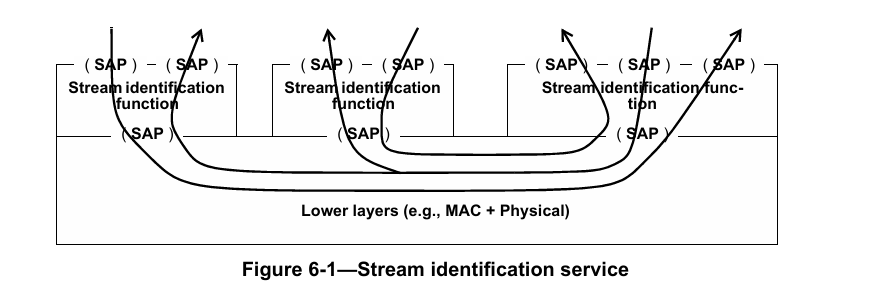

流标识可分为主动式（例如6.6）和被动式（例如6.4）。当接收来自上层的传输数据包时，主动式流标识功能（6.2）会修改数据参数以编码SAP选择，并将封装后的数据包提交给下层。在接收方向，主动式流标识功能从下层接收数据包，对其解封装，并根据从数据包中提取的流标识信息，通过相应的SAP将数据包传递给上层。被动式流标识功能不对来自上层的数据包进行任何修改，但会检查从下层接收的数据包，以识别数据包所属的流，并确定将其传递到哪个SAP。

**注**：原则上，可以定义任意数量的不同流标识和编码方法。以下子条款（6.4、6.5、6.6、6.7）规定了几种强制性方法。

流是接收服务质量（QoS）的实体。它是从一个发送方到一个或多个接收方的一系列数据包，既可以是单播数据包，也可以是多播数据包。图6-2展示了一个承载单个流的网络。

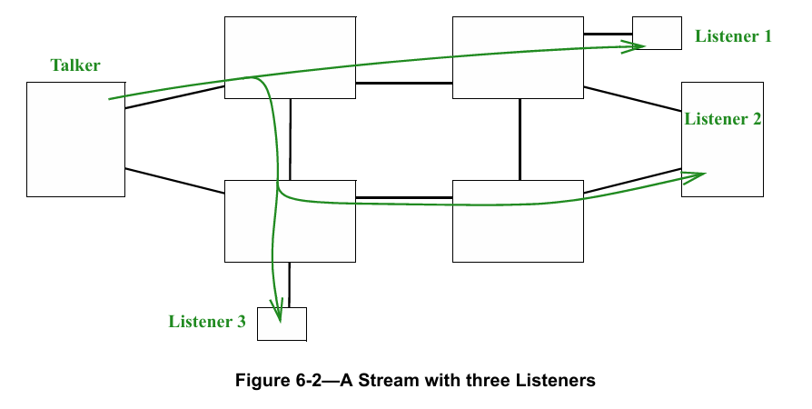

流标识的相关描述如下：
a) 流标识所需的附加服务子参数见6.1；
b) 流标识功能的描述见6.2，其在系统协议栈中的位置描述见6.3；
c) 规定了四种具体的流标识功能：空流标识（6.4）、源MAC和VLAN流标识（6.5）、主动目的MAC和VLAN流标识（6.6）以及IP流标识（6.7）。

这些流标识功能汇总于表6-1。

<html>
<table border="1">
<thead>
<tr>
<th>流标识功能</</th>
<th>主动/被动</</th>
<th>检查内容</</th>
<th>覆盖内容</</th>
<th>参考条款</</th>
</tr>
</thead>
<tbody>
<tr>
<td>空流标识</td>
<td>被动</td>
<td>目的地址、VLAN标识符</td>
<td>无</td>
<td>6.4、9.1.2</td>
</tr>
<tr>
<td>源MAC和VLAN流标识</td>
<td>被动</td>
<td>源地址、VLAN标识符</td>
<td>无</td>
<td>6.5、9.1.3</td>
</tr>
<tr>
<td>主动目的MAC和VLAN流标识</td>
<td>主动</td>
<td>目的地址、VLAN标识符</td>
<td>目的地址、VLAN标识符、优先级</td>
<td>6.6、9.1.4</td>
</tr>
<tr>
<td>IP流标识</td>
<td>被动</td>
<td>目的地址、VLAN标识符、IP源地址、IP目的地址、DSCP、IP下一层协议、源端口、目的端口</td>
<td>无</td>
<td>6.7、9.1.5</td>
</tr>
</tbody>
</table>
</html>

<p align="center">表6-1 - 流标识功能</p>

## 6.1 流服务子参数
IEEE Std 802.1AC中定义的ISS包含一个仅对系统具有本地意义的connection_identifier参数。该参数不会通过底层服务传输。流标识利用此参数承载参数化信息。流标识需要多个子参数，但实现者可以创建数学算法，将这些子参数（和/或其他层的子参数）组合成单个connection_identifier参数，尤其是因为connection_identifier的值在实现该参数的系统外部是未定义的。在本文件中，假定编码到connection_identifier中的参数被视为子参数。

流标识提供的服务参数包括流标识功能及本标准中定义的其他功能所需的以下子参数：
a) stream_handle：标识数据包所属流的整数；
b) sequence_number：无符号整数，标识数据包在同一复合流中相对于其他数据包的传输顺序。

stream_handle子参数的数值是系统本地的，不应与例如协议数据单元（PDU）中具有类似功能的字段混淆。stream_handle的值通过协议操作和网络管理与协议字段相关联，它与数据包中的显式字段之间可以存在但不一定存在一对一的对应关系。

并非FRER（第7章）所关注的每个数据包序列都要求其路径上的中继系统标识数据包所属的流。对于为某个流配置了序列恢复功能（7.4.2）或独立恢复功能（7.5）的系统，FRER要求必须具备stream_handle和sequence_number子参数。

sequence_number子参数的数值可由流标识功能（6.2）或序列编码/解码功能（7.6）显式编码到数据包中。

## 6.2 流标识功能
如图6-3所示，流标识功能可描述为具有两个SAP（见IEEE Std 802.1AC）。一个SAP将流标识功能与上层连接，该SAP包含stream_handle子参数，且可包含sequence_number子参数；另一个SAP与下层连接，该SAP可以但通常不包含stream_handle或sequence_number子参数。

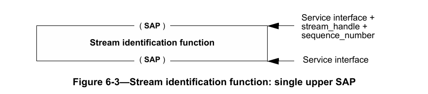

或者，流标识功能也可描述为与下层具有相同的SAP，但与上层具有一组SAP。每个stream_handle子参数值对应一个唯一的SAP，包括一个用于不属于任何已知流的数据包的SAP。一个SAP可以服务于多个stream_handle值，如图6-4所示。

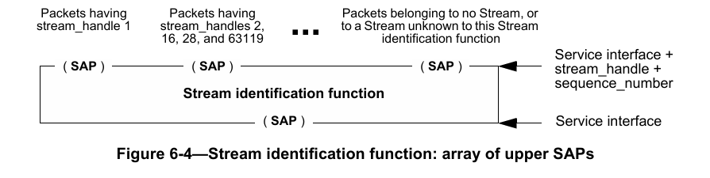

流标识功能执行以下两项操作：
a) 流标识功能检查从下层接收的数据包，以确定该数据包的stream_handle子参数值，即确定数据包所属的流：
1) 如果数据包属于该流标识功能已知的流，则将处理后的数据包连同从数据包中提取的stream_handle及其他子参数（例如sequence_number）一起传递给上层。根据所采用的特定流标识方法，流标识功能可能会修改数据包的参数（例如，移除标签或更改地址）；
2) 否则（数据包不属于任何已知流），将数据包原样传递给上一层，并将stream_handle和sequence_number子参数设置为空值。

b) 对于从上层传递下来用于传输的数据包，流标识功能使用数据包的stream_handle子参数来确定如何处理该数据包：
1) 如果数据包属于该流标识功能已知的流，则将处理后的数据包传递给下层。根据所采用的特定流标识方法，流标识功能可能会修改数据包的参数（例如，添加标签或更改地址）；
2) 否则（数据包不属于任何已知流），将数据包连同所有参数原样传递给下一层。

**注**：流标识方法不一定涉及对数据包的实际转换。6.4和6.6提供了两种情况的示例。

## 6.3 系统中的流标识
FRER（第7章）功能的正常运行通常需要流标识的支持。流标识功能（6.2）和各种FRER功能（7.4、7.6）的排列方式（以完成特定任务）及其在标准规范中的描述方式可能会有所不同。图6-5中的图a展示了一个具有两个端口的中继系统（例如，IEEE Std 802.1Q-2014的8.6），其FRER功能嵌入在转发功能中，未在图中明确显示。这种表述方式最为简洁，但至少在图中无法清晰体现操作的顺序。

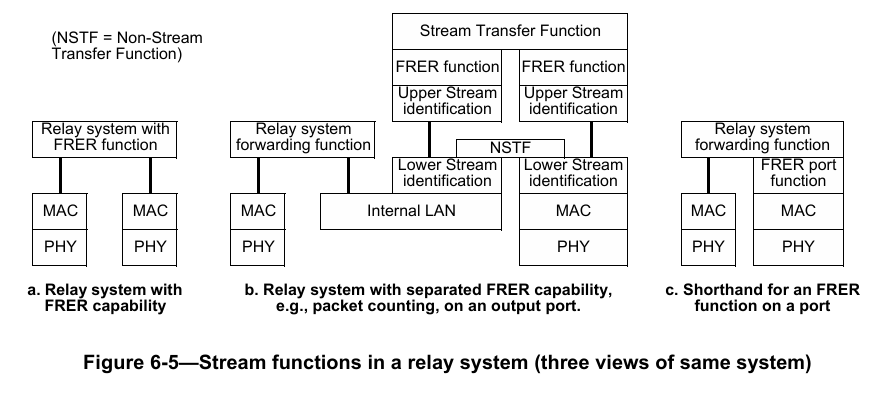

图6-5中的图b展示了同一个中继系统，此次将FRER功能明确放置在其中一个端口上，该端口的图示被大幅展开。在图b中，转发功能不具备FRER功能。流标识功能提取流标识功能子参数，以启用FRER功能。流传输功能作为双端口数据包中继器，完全位于中继系统的一个端口内部，负责中继属于流的数据包。非流传输功能（NSTF）的功能与此类似，但它连接到图6-4中的“未知”SAP，因此负责中继未被识别为属于任何流的数据包。下层流标识功能将FRER数据包与非FRER数据包分离；非FRER数据包通过NSTF进行中继，仿佛FRER功能不存在一样。上层流标识功能识别FRER数据包的流，以便其他FRER功能执行其任务。每个双端口传输功能都有一对SAP，并将所有数据包接收指示转换为另一个SAP上的数据包请求。这种表述方式准确地展示了各种功能之间的对等关系，但在许多情况下过于复杂。

图6-5中的图c展示了一种更简洁的方式来表示图b中的功能。与图a相比，图c中要执行的操作更为明确，但FRER子层并未处于正确的对等层级。

有时需要区分扩展端口图（图6-5中的图b）两侧的功能。图6-6展示了一个具有两个端口的中继系统（其中一个端口具有面向内部和面向外部的FRER功能）以及一个具有一个端口的终端系统（具有面向外部的FRER功能）。每个功能都通过其下层的真实或虚拟服务层发送和接收数据包，与对等功能进行通信。因此，面向内部的功能位于流传输功能朝向中继系统转发功能的一侧，而面向外部的功能位于流传输功能远离转发功能的一侧，或位于简单端口上的转发功能与底层真实或虚拟服务层之间。通常，面向内部的FRER功能用于代表不支持FRER的终端系统执行代理功能。有关面向内部和面向外部FRER功能的使用示例，见附录C。（MAC层和PHY层分别是媒体访问控制层和物理层。）

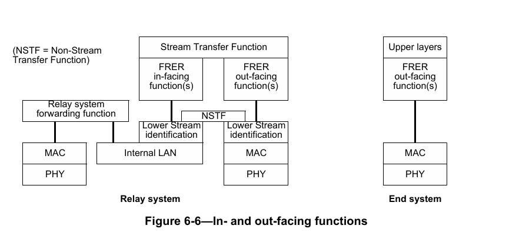

## 6.4 空流标识
空流标识是一种在帧级别运行的被动式流标识功能。它可以使用IEEE Std 802.1Q-2014的6.9中描述的增强型内部子层服务（EISS）来定义，在这种情况下，它会通过本标准6.1中规定的connection_identifier的附加stream_handle子参数进行增强。空流标识功能会丢弃沿协议栈向下传递的stream_handle子参数，并根据帧的目的MAC地址和VLAN ID，为沿协议栈向上传递的帧生成stream_handle子参数。它不会更改数据包的任何其他参数。空流标识功能适用于所有发送到特定{MAC地址，VLAN}对的数据包均为流数据包的应用场景。例如，AVB流（IEEE Std 802.1BA-2011 [B1]）的每个流都有唯一的{目的MAC地址，VLAN}对。为了实例化空流标识功能，tsnStreamIdIdentificationType被管理对象（9.1.1.6）应使用OUI（00-80-C2）和表9-1中所示的类型值进行编码。

空流标识的被管理对象见9.1.2。

**注**：IEEE 802.1Q VLAN标签中除了VLAN标识符和优先级外，还包含drop_eligible参数。FRER不影响该参数的使用，它会通过空流标识功能原样传递，未指定时默认值为False。

## 6.5 源MAC和VLAN流标识
源MAC和VLAN流标识是一种在帧级别运行的被动式流标识功能。它可以使用IEEE Std 802.1Q-2014的6.9中描述的EISS来定义，在这种情况下，它会通过本标准6.1中规定的connection_identifier的附加stream_handle子参数进行增强。源MAC和VLAN流标识功能会丢弃沿协议栈向下传递的stream_handle子参数，并根据帧的源MAC地址和VLAN ID，为沿协议栈向上传递的帧生成stream_handle子参数。它不会更改数据包的任何参数。源MAC和VLAN流标识功能适用于所有来自特定{源MAC地址，VLAN}对的数据包均为流数据包的应用场景。为了实例化源MAC和VLAN流标识功能，tsnStreamIdIdentificationType被管理对象（9.1.1.6）应使用OUI（00-80-C2）和表9-1中所示的类型值进行编码。

源MAC和VLAN流标识的被管理对象见9.1.3。

**注**：IEEE 802.1Q VLAN标签中除了VLAN标识符和优先级外，还包含drop_eligible参数。FRER不影响该参数的使用，它会通过源MAC和VLAN流标识功能原样传递，未指定时默认值为False。

## 6.6 主动目的MAC和VLAN流标识
主动目的MAC和VLAN流标识是一种在帧级别运行的主动式流标识功能。它可以使用IEEE Std 802.1Q-2014的6.9中描述的EISS来定义，在这种情况下，它会通过本标准6.1中规定的connection_identifier的附加stream_handle子参数进行增强。为了实例化主动目的MAC和VLAN流标识功能，tsnStreamIdIdentificationType被管理对象（9.1.1.6）应使用OUI（00-80-C2）和表9-1中所示的类型值进行编码。

在主动目的MAC和VLAN流标识功能中，沿协议栈从上层向下传递或从下层向上传递的帧的目的地址、VLAN标识符和优先级参数会被替换为替代值。沿协议栈向下传递到主动目的MAC和VLAN流标识功能的帧的替代值（用于识别沿协议栈向上传递到主动目的MAC和VLAN流标识功能的帧）见9.1.2；沿协议栈向上传递的帧的替代值（不包括优先级参数）见9.1.4。

主动目的MAC和VLAN流标识功能的用途包括：在发送方内部，将特定流转换为使用特定{MAC地址，VLAN}对，以便向网络中的IEEE 802.1Q网桥标识该流；在接收方内部，在将数据包沿协议栈向上传递之前，恢复原始的寻址信息。此外，该功能还可用于为接收方提供上述恢复功能作为代理服务的中继系统。

主动目的MAC和VLAN流标识的被管理对象见9.1.4。

**注1**：IEEE 802.1Q VLAN标签中除了VLAN标识符和优先级外，还包含drop_eligible参数。FRER不影响该参数的使用，它会通过主动目的MAC和VLAN流标识功能原样传递，未指定时默认值为False。

**注2**：如果希望接收方能够识别数据包，则更改目的MAC地址和/或VLAN时必须谨慎操作。例如，如果将主动目的MAC和VLAN流标识功能与IP流标识功能（6.7）结合使用，用户可以在接收端配置主动目的MAC和VLAN流标识功能，以便在将数据包沿协议栈向上交付之前恢复原始的目的MAC地址和VLAN。

## 6.7 IP流标识
IP流标识是一种在传输层和互联网协议（IP）接口层运行的被动式流标识功能。它可以使用9.1.5中列出的IP地址原语与IEEE Std 802.1Q-2014的6.9中描述的EISS所定义的参数的组合来定义，在这种情况下，它会通过本标准6.1中规定的connection_identifier的stream_handle子参数进行增强。在IP流标识功能中，IP及更高层地址参数和EISS参数用于确定沿协议栈向上传递的数据包的stream_handle子参数，并丢弃沿协议栈向下传递的数据包的stream_handle子参数。它不会更改数据包的任何其他参数。为了实例化IP流标识功能，tsnStreamIdIdentificationType被管理对象（9.1.1.6）应使用OUI（00-80-C2）和表9-1中所示的类型值进行编码。

例如，IP流标识功能可以与主动目的MAC和VLAN流标识功能（6.6）结合使用，为属于特定单播IP流的数据包分配特定的{MAC地址，VLAN，优先级}三元组，如图8-1的端口A所示，其中IP流标识功能位于标有“被动上层流标识功能（6.2）”的框内。

IP流标识的被管理对象见9.1.5。

**注**：IEEE 802.1Q VLAN标签中除了VLAN标识符和优先级外，还包含drop_eligible参数。FRER不影响该参数的使用，它会通过IP流标识功能原样传递，未指定时默认值为False。

# 7. 帧复制与消除可靠性机制
## 7.1 帧复制与消除可靠性机制概述
### 7.1.1 目标与目的
本章规定的帧复制与消除可靠性机制（FRER）通过在源端终端系统和/或网络中的中继系统对每个数据包进行编号和复制，并在目的端终端系统和/或其他中继系统中消除重复数据包，从而提高流的可靠性（降低数据包丢失率）。

图7-1展示了一个由四个成员流组成的复合流示例。在该示例中，最左侧的模块为每个数据包生成并编码序列号子参数（6.1）。在两个中间节点，序列恢复功能（7.4.2）消除重复数据包，并将非重复数据包复制为新的成员流（序列号保持不变）。最后两个成员流在右侧的目的端合并，重复数据包被消除。该配置可防范所有7种可能的单链路故障，以及21种可能的双链路故障中的16种。

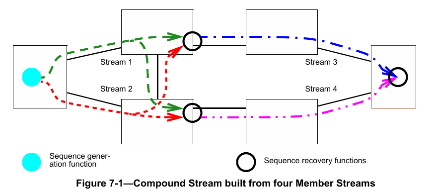

FRER 的目标与目的如下：
a) 数据包复制：通过复制数据包并在不同路径上传输，然后利用序列号消除重复数据包，降低数据包丢失的实际概率。
**注1**：创建多条路径的方法由其他标准规定，包括IEEE Std 802.1QTN、IEEE Std 802.1Qca™ 和 IEEE P802.1Qcc™¹⁰。
b) 多播或单播：传输流的路径可以是点对点路径或点对多点树状路径。
c) 间歇流：在任意给定路径上传输的数据包数量与其他路径相比，最多相差一个。
d) 批量流：在任意给定路径上传输的数据包数量可能远多于其他路径。
**注2**：批量流和间歇流的另一个区别是，在流合并点，间歇流在两条路径上的序列号差值不超过1。而批量流的序列号差值可能大于1，因此需要比间歇流更复杂的重复数据包删除能力。

¹⁰ 前缀为P的编号是IEEE授权的标准项目，在本标准出版时尚未获得IEEE-SA标准委员会批准。如需获取草案，请联系IEEE。

e) 灵活部署：FRER功能可在多种配置中使用（见附录C），包括但不限于：
1) 终端系统的协议栈中；
2) 中继系统的协议栈中（例如图C-4中的系统C和系统F）；
3) 中继系统的协议栈中，此时FRER功能作为相邻非FRER兼容终端系统的代理（例如图C-4中的系统B）。
f) 潜在错误检测：复制流时，若某条路径上的组件发生故障，接收方可能无法立即察觉，因为其他路径仍在传输数据。鉴于FRER可实现较高的可靠性，在丢弃重复数据包时，需要某种机制检测每个数据包的副本是否实际交付。
g) 互操作性：存在一些先于本标准的协议，它们提供类似功能但细节不同，导致难以或无法设计转换不同标准数据包格式的互通功能。本标准定义了少量控制机制，使此类互操作成为可能（见附录B）。
h) 向后兼容性：为扩大FRER的应用范围，符合本标准的终端系统集合在连接到非FRER感知网络时，应能获得FRER的大部分或全部优势；符合标准的中继系统网络也应能为非FRER感知终端系统提供这些优势。
i) 动态能力：某些应用需要在运行中的流上启用或禁用FRER，而非仅在流静止时操作。
j) 稳健性：在FRER目标的数据包丢失率下，某些类型的错误（例如发送器故障导致重复发送同一数据包）比简单的数据包丢失事件更为重要。FRER需能防范此类错误。
k) 零拥塞丢失：多种技术（例如IEEE 802.1BA-2011 [B1]、音视频桥接）可用于为流提供零（或极低）拥塞丢失。FRER需与这些技术兼容。
**注3**：时间敏感网络（TSN）还提供其他服务质量（QoS）功能。FRER与其他功能（尤其是零拥塞丢失）结合使用时，效果最佳。
l) 易用性：无需在每个中继系统中对每个流进行单独配置即可使用FRER。

除上述目标外，以下能力明确不属于本标准的目标：
m) 按序交付：FRER可能导致复合流的数据包交付顺序与传输顺序不一致。纠正此问题超出本标准的范围。

若组成复合流的成员流路径长度差异显著，且这些流为批量流（d项），则较短路径上丢失的数据包可能会通过较长路径的副本进行乱序交付，即使每个成员流在自身路径上保持按序交付。根据序列号按原始顺序交付复合流的数据包需要对数据包进行缓冲。由于存在此缓冲要求，复合流的按序交付明确不属于FRER的目标。IEEE Std 802.1Q中定义的桥接虚拟局域网（Bridged Virtual LANs）用户需了解，FRER可能会影响按序交付的常规预期。

FRER可配置为递归应用，即由成员流组成的复合流本身可作为外部复合流的成员流。

## 7.2 “流（Stream）”术语的使用
熟悉IEEE Std 802.1Q的读者会发现，本标准需要区分成员流和复合流。例如，在IEEE Std 802.1Q中，流既指整个发送方到接收方的路径，也是获得期望服务质量（QoS）前必须进行带宽预留的对象。对于图7-1中所示的四个成员流，可采用IEEE Std 802.1Q的机制进行带宽预留，而端到端的发送方到接收方路径则为整个复合流（见C.9）。

此外，IEEE Std 802.1Q定义了StreamID，用于标识发送方与一个或多个接收方之间的流。相比之下，本标准定义了stream_handle子参数，用于内部标识流。

某些终端系统按系统而非按流对数据包进行编号。此类终端系统可传输多个独立的流（数据流层面），每个流具有不同的目的MAC地址、IP地址、TCP端口号、VLAN等，且在中继系统的转发表中拥有各自的条目和/或各自的带宽预留。在接收方终端系统或中继系统中，源MAC和VLAN流标识（6.5）可用于组织独立恢复功能和序列恢复功能，因为序列号参数是按源MAC地址分配的，而非按目的MAC地址；每个状态机可将单个源发送的所有独立流作为一个流进行处理。因此，网络中的不同系统可将任意数量的独立流（带宽预留层面）视为单个流（源MAC地址层面）（见B.2）。

## 7.3 帧复制与消除可靠性机制功能
FRER提供图7-2所示的五种功能。并非每个协议栈都需要所有功能。

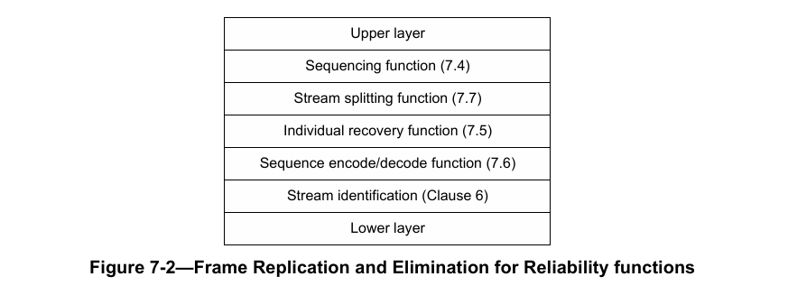

a) 排序功能（见7.4）：
1) 为从上层传递至下层传输的数据包提供序列号子参数的连续值（7.4.1）；
2) 检查从多个流接收并向上传递的数据包的序列号，丢弃序列号子参数表明为已接收数据包副本的数据包（7.4.2）；
3) 监控计数器变量，检测向上传递的流的潜在错误（7.4.4）。

b) 流拆分功能（见7.7）：
1) 复制每个从上层接收的数据包，为每个副本分配不同的stream_handle，最多一个副本的stream_handle可与原始数据包相同；
2) 向上传递数据包时不做任何修改。

c) 独立恢复功能（见7.5）：
1) 检查从成员流接收并向上传递的数据包的序列号，丢弃序列号子参数表明为已接收数据包副本的数据包。

d) 序列编码/解码功能（见7.6）：
1) 通过修改其他数据包参数，将序列号子参数编码到数据包中，确保对等排序功能可解码，通常通过某种方式将序列号编码到数据包数据中（例如冗余标签R-TAG，7.8）；
2) 从接收并向上传递的数据包中提取序列号。根据所使用的流标识功能，排序功能可从数据包中移除序列号封装。

若协议栈中使用的流标识功能已编码所有必需的子参数，则无需序列编码/解码功能。

FRER 还需要流标识功能（第6章）：
e) 流标识功能（见第6章）：
1) 向下传递每个数据包，若配置的特定封装方法有要求，使用stream_handle修改数据包；
2) 从接收的数据包中推导stream_handle并向上传递，若封装方法有要求，修改数据包。

## 7.4 排序功能
排序功能利用6.1中定义的stream_handle和sequence_number服务子参数。排序功能包含两种组件功能：序列生成功能（7.4.1）作用于图7-2中沿协议栈向下传输至物理层的数据包，生成序列号子参数的值；序列恢复功能（7.4.2）作用于沿协议栈向上传输至上层功能的数据包，利用序列号子参数决定传递或丢弃数据包。

在任意给定端口上，可实例化零个或多个序列生成功能和/或序列恢复功能实例。这些功能可实例化为面向内部或面向外部的功能。对于这两种功能，数据包的stream_handle子参数决定了数据包将通过哪个功能（若有）进行处理。每个功能实例都有其自身的状态变量集。

### 7.4.1 序列生成功能
序列生成功能属于排序功能（7.4）的一部分，为向下传递至下层的每个流数据包生成序列号子参数。如被管理对象（10.3）所规定，每个端口、每个stream_handle值、每个方向（面向内部或面向外部）最多存在一个序列生成功能实例。

序列生成功能的描述包括以下方面：
a) 控制序列生成功能且受其影响的被管理对象（10.3、10.8）；
b) 触发代码例程执行且可能由代码例程触发的事件（7.4.1.1）；
c) 由代码例程操作且在例程执行之间维持序列生成功能状态的变量（7.4.1.2）；
d) 与被管理对象、事件和变量交互的两个代码例程（7.4.1.3、7.4.1.4）。

#### 7.4.1.1 序列生成的事件
有两个事件会影响序列生成功能，且该功能会产生一个事件：
a) BEGIN：全局事件，重置所有功能（包括序列生成功能），触发SequenceGenerationReset例程（7.4.1.3）执行；
b) DATA_REQUEST：上层将数据包提交至序列生成功能以传输至下层的事件（例如IEEE Std 802.1AC的ISS的M_UNITDATA.request原语），触发SequenceGenerationAlgorithm例程（7.4.1.4）执行；
c) SEND_DATA：序列生成功能将数据包沿协议栈向下传递至下层的事件（例如IEEE Std 802.1AC的ISS的M_UNITDATA.request原语）。

#### 7.4.1.2 序列生成的变量
每个序列生成功能实例都有其独立的变量集，与其他实例无关。

##### 7.4.1.2.1 GenSeqSpace
指定序列号子参数及其他相关变量的取值范围，为常量，值为65536。

##### 7.4.1.2.2 GenSeqNum
存储序列生成功能向下传递至下层作为序列号子参数后将递增的值。该变量为无符号整数，取值范围为0至（GenSeqSpace - 1）。GenSeqSpace的定义见7.4.1.2.1。每次重置功能时（7.4.1.3），GenSeqNum初始化为0，其值复制到序列号子参数后递增1。当递增超过最大值时，新值为0。

#### 7.4.1.3 SequenceGenerationReset
当BEGIN事件发生（7.4.1.1的a项）或向frerSeqRcvyReset被管理对象（10.4.1.4）写入True值时，调用SequenceGenerationReset函数。该函数重置GenSeqNum（7.4.1.2.2）并递增frerCpsSeqGenResets（10.8.2）。

```c
void SequenceGenerationReset () {
    GenSeqNum = 0;
    frerCpsSeqGenResets = frerCpsSeqGenResets + 1;
}
```

#### 7.4.1.4 SequenceGenerationAlgorithm
当DATA_REQUEST事件发生（7.4.1.1的b项）时，调用SequenceGenerationAlgorithm函数。该函数将GenSeqNum（7.4.1.2.2）复制到序列号子参数（6.1的b项），递增GenSeqNum，然后触发SEND_DATA原语（7.4.1.1的c项），将数据包传递至下一层。

```c
void SequenceGenerationAlgorithm () {
    unsigned int sequence_number = GenSeqNum;
    if (GenSeqNum >= (GenSeqSpace - 1))
        GenSeqNum = 0;
    else
        GenSeqNum = GenSeqNum + 1;
    SEND_DATA; // 将数据包和序列号子参数向下传递
}
```

### 7.4.2 序列恢复功能
序列恢复功能作用于一组合并的成员流，这些成员流最初由单个序列生成功能实例（7.4.1）标记序列号（6.1）。该功能与仅适用于单个成员流的独立恢复功能（7.5）不同，尽管两者使用相同的基本算法。

序列恢复功能的实例包括：
a) 基础恢复功能（7.4.3）的实例，可选用向量恢复算法（7.4.3.4）或匹配恢复算法（7.4.3.5），其frerSeqRcvyIndividualRecovery对象（10.4.1.10）设置为False，配置为适用于一个或多个序列号子参数值；
b) 潜在错误检测功能（7.4.4）的实例。

通过被管理对象（第9章和第10章）在系统端口上实例化这些功能。

**注**：第9章和第10章中的被管理对象在每个端口上创建一个序列恢复功能实例。实际上，中继系统可选择将单个序列恢复功能实例创建为转发功能的一部分、每个线路卡创建一个实例，或采用其他分布式方式，且不违反本标准规定的外部可见行为。每个实例的变量是系统内部的，因此该选择不会影响其定义。关于该选择对序列恢复功能实例所引用的第9章和第10章中计数器的影响，见10.8.1的讨论。

### 7.4.3 基础恢复功能
基础恢复功能属于排序功能（7.4）的一部分，评估从下层传递上来的一个或多个成员流数据包的序列号子参数，以丢弃重复数据包。基础恢复功能的给定实例可作为序列恢复功能（7.4.2）或独立恢复功能（7.5）使用。该选择、实例适用的stream_handle子参数值、所在的端口和方向（面向内部或面向外部）以及其他操作参数均通过被管理对象（10.4）指定。

序列恢复功能的描述包括以下方面：
a) 控制序列恢复功能且受其影响的被管理对象（10.4、10.8）；
b) 触发代码例程执行且可能由代码例程触发的事件（7.4.3.1）；
c) 由代码例程操作且在例程执行之间维持序列恢复功能状态的变量（7.4.3.2）；
d) 与被管理对象、事件和变量交互的四个代码例程（7.4.3.3、7.4.3.4、7.4.3.5、7.4.3.6）。

序列恢复功能包含两种序列恢复算法（7.4.3.4、7.4.3.5），分别适用于间歇流（7.1.1的c项）和批量流（7.1.1的d项）。只要由特定序列恢复功能服务的成员流在所有路径上的在传数据包数量最大差值不超过SequenceHistory变量的大小（7.4.3.2.2、10.4.1.6），数据包即可无重复交付，但可能乱序交付。若差值超过该值，则可能交付重复数据包。

**注1**：本标准的一致性要求（尤其是5.9的c项和5.12的e项）规定，序列恢复功能只需支持批量流中重复数据包正确消除所需的最小路径长度差值。若特定网络中的实际路径差值超过序列恢复功能的能力，则会交付重复数据包。用户需确保所采购系统的能力符合其所在网络的需求。

除非下层数据包有效性检查（例如IEEE Std 802.3 [B2]的帧校验序列）已成功完成，否则FRER恢复功能不得处理该数据包。

**注2**：该限制导致在FRER恢复功能丢弃数据包的端口上不允许直通转发（cut through forwarding）。

#### 7.4.3.1 序列恢复的事件
有三个事件会影响序列恢复功能，基础恢复功能可触发一个事件：
a) BEGIN：全局事件，重置所有功能（包括序列恢复功能），触发SequenceRecoveryReset例程（7.4.3.3）执行；
b) DATA_INDICATION：下层将数据包沿协议栈向上传递至序列恢复功能的事件（例如IEEE Std 802.1AC的ISS的M_UNITDATA.indication原语）；
c) RECOVERY_TIMEOUT：RemainingTicks（7.4.3.2.4）变量达到0时发生的事件，触发SequenceRecoveryReset例程（7.4.3.3）执行；
d) PRESENT_DATA：序列恢复功能将数据包沿协议栈向上传递至上层的事件（例如IEEE Std 802.1AC的ISS的M_UNITDATA.indication原语），可由向量恢复算法例程（7.4.3.4）和匹配恢复算法例程（7.4.3.5）触发。

#### 7.4.3.2 序列恢复的变量
每个序列恢复功能实例都有其独立的变量集，与其他实例无关。

##### 7.4.3.2.1 RecovSeqSpace
指定序列号子参数及其他相关变量的取值范围，为常量，值为65536。

##### 7.4.3.2.2 SequenceHistory
维持最近接收数据包的序列号子参数历史记录。SequenceHistory是一个位向量，每个位对应从0到（frerSeqRcvyHistoryLength - 1）的一个值，对应序列号范围为RecovSeqNum（7.4.3.2.3）至（RecovSeqNum - frerSeqRcvyHistoryLength + 1）（含边界值），两个表达式中的算术运算均以frerSeqRcvyHistoryLength为模。SequenceHistory中的1表示对应的序列号已接收，0表示未接收。

##### 7.4.3.2.3 RecovSeqNum
存储已接收的最大序列号值（以RecovSeqSpace为模）；若自序列恢复功能重置后未接收任何数据包，则存储值为（RecovSeqSpace - 1）。该变量为无符号整数，取值范围为0至（RecovSeqSpace - 1）。RecovSeqSpace的定义见7.4.3.2.1。每次重置功能时（7.4.3.3），RecovSeqNum初始化为（RecovSeqSpace - 1）。当递增超过最大值时，新值为0。

##### 7.4.3.2.4 RemainingTicks
无符号整数变量，存储直至RECOVERY_TIMEOUT事件（7.4.3.1的c项）发生前剩余的时钟周期数。该变量按TicksPerSecond（7.4.3.2.5）指定的速率定期递减，可由向量恢复算法（7.4.3.4）和匹配恢复算法（7.4.3.5）重置。当RemainingTicks从1递减至0时，触发RECOVERY_TIMEOUT事件，且RemainingTicks保持为0。

##### 7.4.3.2.5 TicksPerSecond
无符号整数值，由实现提供，指示每秒递减RemainingTicks变量（7.4.3.2.4）的次数。TicksPerSecond的值应不小于100。

##### 7.4.3.2.6 TakeAny
布尔值，指示恢复算法（7.4.3.4或7.4.3.5）是否接受下一个数据包，无论其序列号子参数的值如何。

#### 7.4.3.3 SequenceRecoveryReset
当BEGIN事件发生（7.4.3.1的a项）或RECOVERY_TIMEOUT事件发生（7.4.3.1的c项）时，调用SequenceRecoveryReset函数。该函数将RecovSeqNum（7.4.3.2.3）和SequenceHistory（7.4.3.2.2）变量重置为初始状态，递增frerCpsSeqRcvyResets（10.8.9），并设置TakeAny（7.4.3.2.6）。请注意，仅当配置了向量恢复算法（7.4.3.4）时，才重置RecovSeqNum和SequenceHistory。

```c
void SequenceRecoveryReset () {
    if (frerSeqRcvyAlgorithm == Vector_Alg) {
        int i;
        RecovSeqNum = RecovSeqSpace - 1;
        for (i = 0; i < frerSeqRcvyHistoryLength; i = i + 1)
            SequenceHistory[i] = 0; // 所有位设为0（数据包未接收）
    }
    frerCpsSeqRcvyResets = frerCpsSeqRcvyResets + 1;
    TakeAny = true;
}
```

#### 7.4.3.4 向量恢复算法
当DATA_INDICATION事件发生（7.4.3.1的b项）且序列恢复功能配置为使用向量恢复算法（frerSeqRcvyAlgorithm = Vector_Alg，10.4.1.5）时，调用VectorRecoveryAlgorithm函数。若该函数执行完毕未触发PRESENT_DATA事件（7.4.3.1的d项），则数据包被视为已丢弃。每个函数实例由常量RecovSeqSpace（7.4.3.2.1）和被管理对象frerSeqRcvyHistoryLength（10.4.1.6）控制。

可以发现，若被管理对象frerSeqRcvyHistoryLength的值为1，则该算法适用于间歇流（7.1.1的c项）。此时，SequenceHistory变量（7.4.3.2.2）仅记录RecovSeqNum（7.4.3.2.3）是否记录了接收数据包的序列号子参数（调用SequenceRecoveryReset（7.4.3.3）后初始状态为未记录）。若frerSeqRcvyHistoryLength的值大于1，则向量恢复算法作为更复杂的算法，适用于批量流（7.1.1的d项）。

调用SequenceRecoveryReset（7.4.3.3）后，向量恢复算法接受接收的第一个数据包为有效数据包。接收第一个数据包后，所有序列号在“最后接收数据包编号±frerSeqRcvyHistoryLength”窗口内的后续数据包均被接受，序列号超出该范围的数据包被丢弃。每个被接受并向上传递的数据包会重置计时器变量RemainingTicks（7.4.3.2.4）。若该变量递减至0（即frerSeqRcvyResetMSec毫秒（10.4.1.7）内未接受任何数据包），则SequenceRecoveryReset再次重置算法，下一个接收的数据包将被接受。

该超时机制的作用如下：
a) “异常数据包”（即序列号超出frerSeqRcvyHistoryLength窗口的数据包）被视为无效并丢弃；
b) 若基础恢复功能与对应的序列生成功能不同步，则经过frerSeqRcvyResetMSec毫秒后，基础恢复功能将重置并恢复数据传递；
c) 若序列生成功能重置（例如系统重启），则未重置的基础恢复功能可能会丢弃数据包，直至超时发生；
d) 若发送方或中继系统发生故障，导致重复传输具有相同序列号子参数的数据包（可能重复传输完全相同的数据包），则这些数据包将持续被丢弃，至少直至序列号循环。

**注**：独立恢复功能（7.5）可配置为丢弃重复的序列号值（或序列号序列），甚至可防范此类循环问题。

基于d项的结果，建议接收方或中继系统配置为丢弃单个成员流中的重复数据包（见7.5和C.10）。

```c
void VectorRecoveryAlgorithm () {
    // 检查数据包中是否存在序列号
    unsigned int sequence_number;
    if (sequence_number == frerSeqRcvyInvalidSequenceValue) {
        frerCpsSeqRcvyTaglessPackets = frerCpsSeqRcvyTaglessPackets + 1;
        if (frerSeqRcvyTakeNoSequence) {
            frerCpsSeqRcvyPassedPackets = frerCpsSeqRcvyPassedPackets + 1;
            RemainingTicks = ((frerSeqRcvyResetMSec * TicksPerSecond) + 999) / 1000;
            PRESENT_DATA;
        } else {
            frerCpsSeqRcvyDiscardedPackets = frerCpsSeqRcvyDiscardedPackets + 1;
        }
        return;
    }

    // 计算带符号的模RecovSeqSpace差值
    int delta = (sequence_number - RecovSeqNum) & (RecovSeqSpace - 1);
    if (0 != (delta & (RecovSeqSpace / 2)))
        delta = delta - RecovSeqSpace;
    // 此处，-(RecovSeqSpace/2) ≤ delta ≤ ((RecovSeqSpace/2) - 1)

    // 重置后，接受任意数据包
    if (TakeAny) {
        TakeAny = false;
        SequenceHistory[0] = 1; // 移位，添加“已接收”位
        RecovSeqNum = sequence_number;
        frerCpsSeqRcvyPassedPackets = frerCpsSeqRcvyPassedPackets + 1;
        RemainingTicks = ((frerSeqRcvyResetMSec * TicksPerSecond) + 999) / 1000;
        PRESENT_DATA;
    } else if (delta >= frerSeqRcvyHistoryLength || delta <= -frerSeqRcvyHistoryLength) {
        // 数据包超出范围，计数并丢弃
        frerCpsSeqRcvyRoguePackets = frerCpsSeqRcvyRoguePackets + 1;
    } else if (delta <= 0) {
        // 数据包为历史数据包且在SequenceHistory中，检查是否已接收
        if (frerSeqRcvyIndividualRecovery)
            RemainingTicks = ((frerSeqRcvyResetMSec * TicksPerSecond) + 999) / 1000;
        if (0 == SequenceHistory[-delta]) {
            // 数据包未接收，接受该数据包
            SequenceHistory[-delta] = 1;
            frerCpsSeqRcvyOutOfOrderPackets = frerCpsSeqRcvyOutOfOrderPackets + 1;
            frerCpsSeqRcvyPassedPackets = frerCpsSeqRcvyPassedPackets + 1;
            RemainingTicks = ((frerSeqRcvyResetMSec * TicksPerSecond) + 999) / 1000;
            PRESENT_DATA;
        } else {
            // 数据包已接收，不转发，计数丢弃
            frerCpsSeqRcvyDiscardedPackets = frerCpsSeqRcvyDiscardedPackets + 1;
            // 若处理单个流，重置计时器
            if (frerSeqRcvyIndividualRecovery)
                RemainingTicks = ((frerSeqRcvyResetMSec * TicksPerSecond) + 999) / 1000;
        }
    } else {
        // 数据包未超出期望范围
        // 除非数据包紧跟RecovSeqNum，否则为乱序
        if (delta != 1)
            frerCpsSeqRcvyOutOfOrderPackets = frerCpsSeqRcvyOutOfOrderPackets + 1;
        // 移位历史记录，直至位0对应sequence_number
        while (0 != (delta = delta - 1))
            ShiftSequenceHistory(0); // 移位，添加“未接收”位
        ShiftSequenceHistory(1); // 移位，添加“已接收”位
        RecovSeqNum = sequence_number;
        frerCpsSeqRcvyPassedPackets = frerCpsSeqRcvyPassedPackets + 1;
        RemainingTicks = ((frerSeqRcvyResetMSec * TicksPerSecond) + 999) / 1000;
        PRESENT_DATA;
    }
}
```

#### 7.4.3.5 匹配恢复算法
当DATA_INDICATION事件发生（7.4.3.1的b项）且序列恢复功能配置为使用匹配恢复算法（frerSeqRcvyAlgorithm = Match_Alg，10.4.1.5）时，调用MatchRecoveryAlgorithm函数。若该函数执行完毕未触发PRESENT_DATA事件（7.4.3.1的d项），则数据包被视为已丢弃。

调用SequenceRecoveryReset（7.4.3.3）后，匹配恢复算法接受接收的第一个数据包为有效数据包。接收第一个数据包后，所有后续数据包中，序列号与最后接收数据包编号匹配的数据包被丢弃，不匹配的数据包被接受。每个被接受并向上传递的数据包会重置计时器变量RemainingTicks（7.4.3.2.4）。若该变量递减至0（即frerSeqRcvyResetMSec毫秒（10.4.1.7）内未接受任何数据包），则SequenceRecoveryReset再次重置算法，下一个接收的数据包将被接受。

计时器机制可防止匹配恢复算法在初始化后因发送方故障或重置而永久阻塞第一个数据包。

若发送方或中继系统发生故障，导致重复传输具有相同序列号子参数的数据包（可能重复传输完全相同的数据包），则这些数据包将持续被丢弃，至少直至序列号循环。此时，可能会传递故障数据包或正确数据包。因此，建议接收方或中继系统配置为丢弃单个成员流中的重复数据包（见7.5和C.10）。

**注**：独立恢复功能（7.5）可配置为丢弃重复的序列号值（或序列号序列），甚至可防范此类循环问题。

```c
void MatchRecoveryAlgorithm () {
    // 检查数据包中是否存在序列号
    unsigned int sequence_number;
    if (sequence_number == frerSeqRcvyInvalidSequenceValue) {
        frerCpsSeqRcvyTaglessPackets = frerCpsSeqRcvyTaglessPackets + 1;
        frerCpsSeqRcvyPassedPackets = frerCpsSeqRcvyPassedPackets + 1;
        PRESENT_DATA;
        return;
    }

    if (TakeAny) {
        // 重置后，接受任意数据包
        TakeAny = false;
        RecovSeqNum = sequence_number;
        frerCpsSeqRcvyPassedPackets = frerCpsSeqRcvyPassedPackets + 1;
        RemainingTicks = ((frerSeqRcvyResetMSec * TicksPerSecond) + 999) / 1000;
        PRESENT_DATA;
        return;
    }

    // 计算带符号的模RecovSeqSpace差值
    int delta = (sequence_number - RecovSeqNum) & (RecovSeqSpace - 1);
    if (delta == 0) {
        // 数据包已接收，不转发，计数丢弃
        frerCpsSeqRcvyDiscardedPackets = frerCpsSeqRcvyDiscardedPackets + 1;
        // 若处理单个流，重置计时器
        if (frerSeqRcvyIndividualRecovery)
            RemainingTicks = ((frerSeqRcvyResetMSec * TicksPerSecond) + 999) / 1000;
    } else {
        // 数据包未接收，接受该数据包
        if (delta != 1)
            // 除非数据包紧跟RecovSeqNum，否则为乱序
            frerCpsSeqRcvyOutOfOrderPackets = frerCpsSeqRcvyOutOfOrderPackets + 1;
        RecovSeqNum = sequence_number;
        frerCpsSeqRcvyPassedPackets = frerCpsSeqRcvyPassedPackets + 1;
        RemainingTicks = ((frerSeqRcvyResetMSec * TicksPerSecond) + 999) / 1000;
        PRESENT_DATA;
    }
}
```

#### 7.4.3.6 ShiftSequenceHistory
该例程由向量恢复算法例程（7.4.3.4）调用，用于更新SequenceHistory位数组（7.4.3.2.2）并计数丢失的数据包（frerCpsSeqRcvyLostPackets，10.8.7）。ShiftSequenceHistory接收一个参数，即SequenceHistory位数组索引0的新值。

```c
void ShiftSequenceHistory (int newZeroValue) {
    int i;
    if (0 == SequenceHistory[frerSeqRcvyHistoryLength - 1])
        frerCpsSeqRcvyLostPackets = frerCpsSeqRcvyLostPackets + 1;
    for (i = frerSeqRcvyHistoryLength - 1; i != 0; i = i - 1)
        SequenceHistory[i] = SequenceHistory[i - 1];
    SequenceHistory[0] = newZeroValue;
}
```

### 7.4.4 潜在错误检测功能
每个潜在错误检测功能实例都是序列恢复功能（7.4.2）的一部分，监控与单个基础恢复功能（7.4.3）实例相关联的被管理对象，以检测该功能丢弃的数据包数量相对较少的情况。潜在错误检测的工作原理是：在正常运行的复合流中，若当前系统存在n条输入路径，则基础恢复功能（7.4.3）每传递一个数据包，应丢弃n-1个数据包。当该假设不成立时，潜在错误检测功能触发SIGNAL_LATENT_ERROR事件（7.4.4.1的d项）。

如控制这两个功能的被管理对象（10.4）所规定，每个端口、每个stream_handle值、每个方向（面向内部或面向外部）最多存在一个潜在错误检测功能实例。每个配置的基础恢复功能最多可关联零个或一个潜在错误检测功能实例。支持基础恢复功能的所有实现都应支持潜在错误检测功能。

潜在错误检测通过两个周期性函数实现：第一个函数（LatentErrorTest，7.4.4.4）检查传递和丢弃的数据包数量，若计数器之间的差值超过设定阈值，则报告潜在错误；第二个周期性函数（LatentErrorReset，7.4.4.3）重置第一个函数使用的变量，以避免偶然的随机数据包丢失持续累积。这些函数由计时器驱动，而非由数据包的接收或传输触发。

潜在错误检测功能的描述包括以下方面：
a) 控制潜在错误检测功能且受其影响的被管理对象（10.4、10.8）；
b) 触发代码例程执行且可能由代码例程触发的事件（7.4.4.1）；
c) 由代码例程操作且在例程执行之间维持潜在错误检测功能状态的变量（7.4.4.2）；
d) 与被管理对象、事件和变量交互的两个代码例程（7.4.4.3、7.4.4.4）。

**注**：潜在错误检测算法（7.4.4.3、7.4.4.4）无法检测所有错误。例如，若一条路径错误地生成两倍于正常数量的副本，而另一条路径发生故障，LatentErrorTest将不会生成错误报告。因此，LatentErrorTest应与独立恢复功能（7.5）结合使用。

#### 7.4.4.1 潜在错误检测的事件
有三个事件会影响潜在错误检测功能：
a) BEGIN：全局事件，重置所有功能（包括潜在错误检测功能），触发LatentErrorReset例程（7.4.4.3）执行；
b) RESET_LATENT_ERROR：周期性生成的事件，由frerSeqRcvyLatentResetPeriod（10.4.1.12.4）控制，触发LatentErrorReset例程（7.4.4.3）执行；
c) TRIGGER_LATENT_ERROR_TEST：周期性生成的事件，由frerSeqRcvyLatentErrorPeriod（10.4.1.12.2）控制，触发LatentErrorTest例程（7.4.4.4）执行。

潜在错误检测功能可触发一个事件：
d) SIGNAL_LATENT_ERROR：潜在错误检测功能生成的事件，向上层指示可能存在错误状态。

#### 7.4.4.2 潜在错误检测的变量
每个潜在错误检测功能实例都有其独立的变量集，与其他实例无关。

##### 7.4.4.2.1 CurBaseDifference
无符号整数变量，大小与计算其值的计数器（例如frerCpsSeqRcvyPassedPackets，10.8.5）相同。存储上次调用LatentErrorReset函数（7.4.4.3）时，期望丢弃的数据包数量与实际丢弃的数据包数量之间的差值。

#### 7.4.4.3 LatentErrorReset
当BEGIN事件发生（7.4.4.1的a项）或RESET_LATENT_ERROR事件发生（7.4.4.1的b项）时，调用LatentErrorReset函数。该函数基于frerCpsSeqRcvyPassedPackets（10.8.5）、frerSeqRcvyLatentErrorPaths（10.4.1.12.3）和frerCpsSeqRcvyDiscardedPackets（10.8.6）重新计算CurBaseDifference变量（7.4.4.2.1），并递增frerCpsSeqRcvyLatentErrorResets（10.8.10）。

```c
void LatentErrorReset () {
    CurBaseDifference = (frerCpsSeqRcvyPassedPackets * (frerSeqRcvyLatentErrorPaths - 1)) - frerCpsSeqRcvyDiscardedPackets;
    frerCpsSeqRcvyLatentErrorResets = frerCpsSeqRcvyLatentErrorResets + 1;
}
```

#### 7.4.4.4 LatentErrorTest
当TRIGGER_LATENT_ERROR_TEST事件发生（7.4.4.1的c项）时，调用LatentErrorTest函数。该函数检查序列恢复功能丢弃的数据包数量是否与预期数量大致一致，若不一致则触发事件。函数使用CurBaseDifference（7.4.4.2.1）、frerCpsSeqRcvyPassedPackets（10.8.5）、frerSeqRcvyLatentErrorPaths（10.4.1.12.3）、frerCpsSeqRcvyDiscardedPackets（10.8.6）、frerSeqRcvyLatentErrorPeriod（10.4.1.12.2）和frerSeqRcvyLatentErrorDifference（10.4.1.12.1）。

```c
void LatentErrorTest () {
    int diff = CurBaseDifference - ((frerCpsSeqRcvyPassedPackets * (frerSeqRcvyLatentErrorPaths - 1)) - frerCpsSeqRcvyDiscardedPackets);
    if (frerSeqRcvyLatentErrorPaths > 1 && // 存在多条路径
        frerSeqRcvyLatentErrorPeriod > 0) { // 启用潜在错误检测
        if (diff < 0)
            diff = -diff;
        if (diff > frerSeqRcvyLatentErrorDifference) {
            SIGNAL_LATENT_ERROR;
        }
    }
}
```

**注**：该算法实际上存在量化误差2。即，若用户在LatentErrorTest和LatentErrorReset的时序上不够幸运，可能需要差值达到2倍的frerSeqRcvyLatentErrorDifference才能触发故障报告。

## 7.5 独立恢复功能
独立恢复功能的定义旨在满足稳健性目标（7.1.1中的j项）。它通过移除从故障发送器接收的重复序列号数据包来实现这一目标。独立恢复功能的实例包括基础恢复功能（7.4.3）的实例，其frerSeqRcvyIndividualRecovery对象（10.4.1.10）设置为True，配置为适用于单个成员流。[序列恢复功能（7.4.2）作用于复合流的所有成员流。]独立恢复功能的实例不包括潜在错误检测功能（7.4.4）的实例。独立恢复功能的实例可采用向量恢复算法（7.4.3.4）或匹配恢复算法（7.4.3.5）。

通过对成员流应用独立恢复功能（7.5）（无论是否先对复合流应用序列恢复功能（7.4.2）），可以及早发现错误流，避免合并流受到影响。图7-3展示了图7-1中的示例网络，其中添加了独立恢复功能实例（见C.10）。

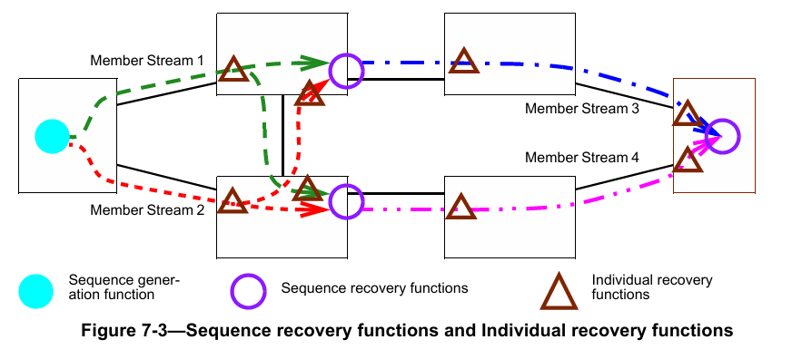

与建模为在特定端口实例化的序列恢复功能不同，单个独立恢复功能实例可应用于任意数量的端口（见C.11）。

## 7.6 序列编码/解码功能
序列编码/解码功能负责将序列号子参数（6.1中的b项）插入数据包，并从数据包中提取该参数。如果协议栈中使用的流标识功能也为特定端口和方向上的给定流编码和解码序列号子参数，则不需要序列编码/解码子层。通过被管理对象（10.5）实例化序列编码/解码功能的实例。

本标准规定的、独立于任何流标识功能的唯一必需序列编码/解码格式是冗余标签（R-TAG，7.8）。此外，还定义了两种可选格式（7.9、7.10）。

## 7.7 流拆分功能
流拆分功能从上层接收带有stream_handle子参数（6.1中的a项）的数据包，生成该数据包的零个或多个副本，每个副本具有可能与原始stream_handle不同的stream_handle子参数，并将这些数据包传递到下一层。这实际上从复合流创建了成员流。向上传递的数据包不会被流拆分功能修改。

通过流拆分表（10.6）被管理对象创建用于处理特定流的流拆分功能实例。仅当从上层传递的数据包的stream_handle子参数位于流拆分表（10.6）中某个条目为该端口和方向配置的frerSplitInputIdList（10.6.1.3）中时，特定端口（10.6.1.1）和方向（10.6.1.2）上的流拆分功能才会对该数据包进行处理。如果stream_handle与该列表中的任何条目匹配，则为同一个frerSplitEntry的frerSplitOutputIdList（10.6.1.4）中的每个条目生成一个数据包副本，每个副本的stream_handle子参数为对应的条目值。

## 7.8 冗余标签
冗余标签（R-TAG）是序列编码/解码功能（7.6）的一个示例。它在帧级别运行，可使用IEEE Std 802.1AC定义的ISS或IEEE Std 802.1Q-2014的6.9中描述的EISS（通过本标准6.1中规定的connection_identifier的附加stream_handle和sequence_number子参数进行增强）来定义。为了使用R-TAG实例化序列编码/解码功能，frerSeqEncEncapsType被管理对象（10.5.1.5）应使用OUI（00-80-C2）和表10-2中所示的类型值进行编码。R-TAG的格式如图7-4所示。R-TAG的以太类型（EtherType）值如表7-1所示。

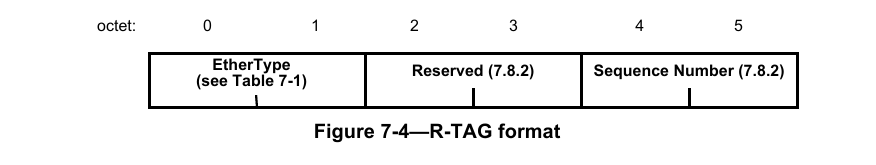

当上层通过服务请求（ISS M_UNITDATA.request或EISS EM_UNITDATA.request）提交数据包时，冗余标签序列编码/解码功能执行以下操作：
a) 通过将序列号子参数的低16位复制到冗余标签信息的序列号字段，并将保留字段填充为零，创建冗余标签信息字（7.8.2）。序列号低16位的最高有效字节放入第一个字节（图7-4中的第4个字节）。
**注1**：序列号子参数低16位以上的任何高序位均被忽略。
b) 将以太类型（7.8.1）和冗余标签信息插入到mac_service_data_unit参数的开头字节，从而使mac_service_data_unit参数的大小增加6个字节。

当下层通过服务指示（ISS M_UNITDATA.indication或EISS EM_UNITDATA.indication）提交数据包时，冗余标签序列编码/解码功能执行以下操作：
c) 检查mac_service_data_unit参数的前两个字节是否与7.8.1中规定的冗余标签以太类型相等。如果相等，且mac_service_data_unit的长度至少为6个字节，则冗余标签序列编码/解码功能执行以下操作：
1) 移除mac_service_data_unit的前6个字节，使其长度减少6个字节；
2) 将冗余标签信息的序列号字段复制到序列号子参数，忽略保留字段的内容。
d) 如果mac_service_data_unit参数的前两个字节与冗余标签以太类型不相等，或mac_service_data_unit的长度小于6个字节，则冗余标签序列编码/解码功能执行以下操作：
1) 将序列号子参数设置为frerSeqRcvyInvalidSequenceValue（10.4.1.8）；
2) 递增frerCpsSeqEncErroredPackets和frerCpSeqEncErroredPackets被管理对象（10.8.11、10.9.3）。

**注2**：R-TAG在帧中相对于其他标签的位置取决于网络各组件协议栈中序列编码/解码功能和其他功能的数量及相对位置。第9章和第10章中的被管理对象支持将序列编码/解码功能放置在任何位置，以满足应用需求。有关FRER在IEEE 802.1Q网桥上的典型应用，见第8章。

### 7.8.1 冗余标签以太类型
R-TAG的标签协议标识符（TPID）应使用表7-1中所示的值。

<html>
<table border="1">
<thead>
<tr>
<th>用途</</th>
<th>以太类型</</th>
</tr>
</thead>
<tbody>
<tr>
<td>冗余标签（R-TAG）</td>
<td>F1-C1</td>
</tr>
</tbody>
</table>
</html>

<p align="center">表7-1 - R-TAG以太类型</p>

### 7.8.2 冗余标签信息
R-TAG信息包含两个字段：
a) R-TAG信息的前两个字节是16位保留字段。该字段应全零传输，接收时应忽略。本标准的未来修订版可按照IEEE Std 802-2014的9.2.1中的描述，将保留字段的最高有效位用于子类型划分。
b) R-TAG信息的最后两个字节是16位值，即序列号字段。

## 7.9 HSR序列标签
可选的高可用性无缝冗余（HSR）序列标签是序列编码/解码功能（7.6）的一个示例。它在帧级别运行，可使用IEEE Std 802.1AC定义的ISS或IEEE Std 802.1Q-2014的6.9中描述的EISS（通过本标准6.1中规定的connection_identifier的附加stream_handle和sequence_number子参数进行增强）来定义。为了使用HSR序列标签实例化序列编码/解码功能，frerSeqEncEncapsType被管理对象（10.5.1.5）应使用OUI（00-80-C2）和表10-2中所示的类型值进行编码。HSR序列标签的描述见IEC 62439-3:2016的5.7.1。

当上层通过服务请求（ISS M_UNITDATA.request或EISS EM_UNITDATA.request）提交数据包时，HSR序列标签序列编码/解码功能执行以下操作：
a) 通过以下方式创建HSR序列标签：
1) 将序列号子参数的低16位复制到HSR序列标签的SeqNr字段；
2) 按照IEC 62439-3:2016的5.7.1设置LSDU大小字段；
3) 根据每个端口每个流的被管理对象frerSeqEncPathIdLanId（10.5.1.6）设置PathId字段；
4) 按照IEC 62439-3:2016的5.7.1设置以太类型字段。
**注1**：序列号子参数低16位以上的任何高序位均被忽略。
b) 将HSR序列标签插入到mac_service_data_unit参数的开头字节，从而使mac_service_data_unit参数的大小增加6个字节。

当下层通过服务指示（ISS M_UNITDATA.indication或EISS EM_UNITDATA.indication）提交数据包时，HSR序列标签序列编码/解码功能执行以下操作：
c) 检查mac_service_data_unit参数的前两个字节是否与IEC 62439-3:2016的5.7.1中规定的HSR序列标签以太类型相等。如果相等，且mac_service_data_unit的长度至少为6个字节，则HSR序列标签序列编码/解码功能执行以下操作：
1) 移除mac_service_data_unit的前6个字节，使其长度减少6个字节；
2) 将SeqNr字段复制到序列号子参数。
d) 如果mac_service_data_unit参数的前两个字节与HSR序列标签以太类型不相等，或mac_service_data_unit的长度小于6个字节，则HSR序列标签序列编码/解码功能执行以下操作：
1) 将序列号子参数设置为frerSeqRcvyInvalidSequenceValue（10.4.1.8）；
2) 递增frerCpsSeqEncErroredPackets和frerCpSeqEncErroredPackets被管理对象（10.8.11、10.9.3）。

**注2**：本标准的任何部分均不得被解释为修改IEC 62439-3:2016中的规范或意图，或以任何方式限制其未来发展。7.9的目的是支持创建采用R-TAG（7.8）和HSR序列标签的终端系统之间的互通功能。
**注3**：有关FRER和HSR之间互通的其他注意事项，见B.2。
**注4**：无论使用R-TAG、HSR标签还是PRP尾部，协议栈中序列编码/解码功能的位置都无需改变。

## 7.10 PRP序列尾部
可选的并行冗余协议（PRP）序列尾部是序列编码/解码功能（7.6）的一个示例。它在帧级别运行，可使用IEEE Std 802.1AC定义的ISS或IEEE Std 802.1Q-2014的6.9中描述的EISS（通过本标准6.1中规定的connection_identifier的附加stream_handle和sequence_number子参数进行增强）来定义。为了使用PRP序列尾部实例化序列编码/解码功能，frerSeqEncEncapsType被管理对象（10.5.1.5）应使用OUI（00-80-C2）和表10-2中所示的类型值进行编码。PRP序列尾部的描述见IEC 62439-3:2016的4.2.7.3。

当上层通过服务请求（ISS M_UNITDATA.request或EISS EM_UNITDATA.request）提交数据包时，PRP序列尾部序列编码/解码功能执行以下操作：
a) 通过以下方式创建PRP序列尾部：
1) 将序列号子参数的低16位复制到PRP序列尾部的SeqNr字段；
2) 按照IEC 62439-3:2016的4.2.7.3设置LSDU大小字段；
3) 根据每个端口每个流的被管理对象frerSeqEncPathIdLanId（10.5.1.6）设置LanId字段；
4) 按照IEC 62439-3:2016的4.2.7.3设置PRPsuffix字段。
**注1**：序列号子参数低16位以上的任何高序位均被忽略。
b) 将PRP序列尾部插入到mac_service_data_unit参数的最后字节，从而使mac_service_data_unit参数的大小增加6个字节。

当下层通过服务指示（ISS M_UNITDATA.indication或EISS EM_UNITDATA.indication）提交数据包时，PRP序列尾部序列编码/解码功能执行以下操作：
c) 检查mac_service_data_unit参数的最后两个字节是否与IEC 62439-3:2016的4.2.7.3中规定的PRP序列尾部PRPsuffix字段相等。如果相等，且mac_service_data_unit的长度至少为8个字节，则PRP序列尾部序列编码/解码功能执行以下操作：
1) 移除mac_service_data_unit的最后6个字节，使其长度减少6个字节；
2) 将SeqNr字段复制到序列号子参数。
d) 如果mac_service_data_unit参数的最后两个字节与PRP序列尾部以太类型不相等，或mac_service_data_unit的长度小于8个字节，则PRP序列尾部序列编码/解码功能执行以下操作：
1) 将序列号子参数设置为frerSeqRcvyInvalidSequenceValue（10.4.1.8）；
2) 递增frerCpsSeqEncErroredPackets和frerCpSeqEncErroredPackets被管理对象（10.8.11、10.9.3）。

**注2**：本标准的任何部分均不得被解释为修改IEC 62439-3:2016中的规范或意图，或以任何方式限制其未来发展。7.10的目的是支持创建采用R-TAG（7.8）和PRP序列尾部的终端系统之间的互通功能。
**注3**：有关FRER和PRP之间互通的其他注意事项，见B.2。

## 7.11 自动配置
### 7.11.1 自动配置概述
为满足易用性目标（7.1.1中的l项），系统中可通过两种方法配置流标识功能（6.2）、独立恢复功能（7.5）、序列恢复功能（7.4.2）和序列编码/解码功能（7.6）：
a) 显式配置流标识表（9.1）、序列恢复表（10.4）、序列标识表（10.5）和序列标识表（10.5）中的条目；
b) 使用序列自动配置表（10.7.1）和输出自动配置表（10.7.2）自动配置这些表中的条目。

自动配置仅可与源MAC和VLAN流标识（6.5）及匹配恢复算法（7.4.3.5）结合使用。

每当接收到的数据包的序列号子参数以序列自动配置表中某个条目指定的方式编码，但流标识表中没有对应的tsnStreamIdEntry（9.1.1）时，系统会为该数据包的流在流标识表中创建一个新条目，并可选地在序列恢复表中为该流创建一个用于独立恢复功能的新条目。如果创建的第二个或后续此类流标识表条目与另一个自动配置的tsnStreamIdEntry共享所有相同的关键参数，但端口号（tsnStreamIdOutFacInputPortList，9.1.1.5）和/或LanId/PathId（tsnStreamIdLanPathId，10.2.2）不同，则会在序列恢复表中创建一个新条目（用于第二个成员流）或扩展现有条目（用于后续成员流），因为此时该流已被确认为复合流。

序列自动配置表控制是否自动创建独立恢复功能、序列恢复功能、两者都创建或两者都不创建。流标识功能始终会被创建。如果使用R-TAG（7.8）对序列号进行编码，则序列标识表中自动配置的条目（以及由此创建的独立恢复功能）以每个成员流的第一个数据包所接收的端口和VLAN为关键字。如果使用HSR序列标签（7.9）或PRP序列尾部（7.10），则序列标识表中自动配置的条目和自动创建的独立恢复功能以每个成员流的第一个接收数据包的PathId或LanId为关键字，并覆盖所有可自动配置的端口。

为支持易用性目标（7.1.1中的l项）和使用HSR序列标签（7.9）、PRP序列尾部（7.10）和R-TAG（7.8）的系统之间的互操作性目标（7.1.1中的g项），系统还会在序列标识表中自动创建被动（数据包解码）条目，以根据序列自动配置表（10.7.1）实例化序列编码/解码功能。通常，输出自动配置表（10.7.2）配置为在流可能输出的每个端口上构建主动（数据包编码）序列编码/解码功能（见C.11）。

### 7.11.2 创建自动配置的流标识表条目
**注1**：如果直接按以下描述实现，可能会导致中继系统对成员流的第一个接收数据包的传输延迟过长，这是不可接受的。以下描述的目的仅在于根据第9章和第10章中的被管理对象描述系统的外部可见行为，而非限制实现方式。实际实现中，可能会在软件、固件和/或硬件中构建结合第9章和第10章中被管理对象元素的数据库，并执行预先初步配置，以优化实际接收数据包时的响应时间。

当接收到与序列自动配置表（10.7.1）中的条目匹配的数据包时，触发自动配置，具体过程如下：
a) 如果在面向外部的端口上接收的数据包与流标识表（9.1）中的某个条目匹配，则根据10.3、10.4、10.5和10.6中的被管理对象对该数据包进行处理。
**注2**：流标识表条目是显式配置的还是通过自动配置创建的，并不影响处理过程。
b) 如果该数据包与流标识表中的任何条目都不匹配，则检查该数据包是否与序列自动配置表中的某个条目匹配。当且仅当满足以下所有匹配条件时，数据包与序列自动配置表中的frerAutSeqEntry（10.7.1.1）匹配：
1) 数据包的序列号以frerAutSeqSeqEncaps（10.7.1.1.1）指定的方式封装；
2) 数据包在frerAutSeqReceivePortList（10.7.1.1.2）中的某个端口上接收；
3) 数据包的VLAN标签（或无标签）与frerAutSeqTagged（10.7.1.1.3）匹配；
4) VLAN标识符参数位于frerAutSeqVlan（10.7.1.1.4）列表中，或该列表为空。
c) 如果该数据包与序列自动配置表中的任何条目都不匹配，则不再进行进一步的自动配置处理。否则（该数据包与任何tsnStreamIdEntry都不匹配，但与某个frerAutSeqEntry匹配），继续进行自动配置处理。
d) 系统使用匹配的frerAutSeqEntry在流标识表、序列恢复表（10.4）和序列标识表（10.5）中创建（自动配置）新条目，具体如下：
1) 在流标识表中创建一个新的tsnStreamIdEntry（9.1.1），具体如下：
i) tsnStreamIdHandle（9.1.1.1）= 实现选择的未使用的stream_handle值；
ii) tsnStreamIdInFacOutputPortList（9.1.1.2）= 空；
iii) tsnStreamIdOutFacOutputPortList（9.1.1.3）= 空；
iv) tsnStreamIdInFacInputPortList（9.1.1.4）= 空；
v) 如果frerAutSeqSeqEncaps等于HSR或PRP，则tsnStreamIdOutFacInputPortList（9.1.1.5）= frerAutSeqReceivePortList（10.7.1.1.2）；否则，frerSeqRcvyPortList（10.4.1.2）= 仅接收该数据包的端口；
vi) tsnStreamIdIdentificationType（9.1.1.6）= 00-80-C2，2 = 源MAC和VLAN流标识（6.5）；
vii) tsnStreamIdAutoconfigured（10.2.1）= True；
viii) 如果frerAutSeqSeqEncaps等于HSR或PRP，则tsnStreamIdLanPathId（10.2.2）= 数据包中的PathId或LanId字段；否则，不使用tsnStreamIdLanPathId；
ix) tsnCpeSmacVlanDownSrcMac（9.1.3.1）= 接收数据包的source_mac_address参数；
x) tsnCpeSmacVlanDownTagged（9.1.3.2）= frerAutSeqTagged（10.7.1.1.3）；
xi) tsnCpeSmacVlanDownVlan（9.1.3.3）= 接收数据包的vlan_identifier参数。
2) 当且仅当frerAutSeqCreateIndividual（10.7.1.1.10）为True时，在序列恢复表（10.4）中创建一个frerSeqRcvyEntry（10.4.1），具体如下：
i) frerSeqRcvyStreamList（10.4.1.1）= 上述d:2:i中的stream_handle；
ii) frerSeqRcvyPortList（10.4.1.2）= 上述d:2:v中描述的与tsnStreamIdOutFacInputPortList（9.1.1.5）相同的列表（见C.11）；
iii) frerSeqRcvyDirection（10.4.1.3）= True（面向外部）；
iv) frerSeqRcvyReset（10.4.1.4）= True（创建时重置状态机）；
v) frerSeqRcvyAlgorithm（10.4.1.5）= Match_Alg（00-80-C2，1，见表10-1）；
vi) 不使用frerSeqRcvyHistoryLength（10.4.1.6）；
vii) frerSeqRcvyResetMSec（10.4.1.7）= frerAutSeqResetMSec（10.7.1.1.7）；
viii) frerSeqRcvyInvalidSequenceValue（10.4.1.8）= 系统选择的只读值；
ix) frerSeqRcvyTakeNoSequence（10.4.1.9）= True；
x) frerSeqRcvyIndividualRecovery（10.4.1.10）= True；
xi) frerSeqRcvyLatentErrorDetection（10.4.1.11）= False。
3) 在序列标识表中创建一个新的被动frerSeqEncEntry（10.5.1），用于解码后续接收的数据包，具体如下：
i) frerSeqEncStreamList（10.5.1.1）= 上述d:2:i中的stream_handle；
ii) frerSeqEncPort（10.5.1.2）= frerAutSeqReceivePortList（10.7.1.1.2）；
iii) frerSeqEncDirection（10.5.1.3）= True（面向外部）；
iv) frerSeqEncActive（10.5.1.4）= False（被动）；
v) frerSeqEncEncapsType（10.5.1.5）= frerAutSeqSeqEncaps（10.7.1.1.1）；
vi) 如果frerAutSeqSeqEncaps == 00-80-C2，2（HSR），则frerSeqEncPathIdLanId（10.5.1.6）= 数据包中找到的HSR序列标签（7.9）的PathId字段；如果frerAutSeqSeqEncaps == 00-80-C2，3（PRP），则frerSeqEncPathIdLanId = 数据包中找到的PRP序列尾部（7.10）的LanId字段；否则，不使用frerSeqEncPathIdLanId。
如果存在具有相同端口列表、方向和封装类型的frerSeqEncEntry，则无需创建新条目；可将该数据包的stream_handle添加到该frerSeqEncEntry的frerSeqEncStreamList中。
4) 为输出自动配置表（10.7.2）中的每个frerAutOutEntry（10.7.2.1）在序列标识表中创建一个新的主动frerSeqEncEntry（10.5.1），用于为此数据包的流格式化传输数据包，具体如下：
i) frerSeqEncStreamList（10.5.1.1）= 上述d:2:i中的stream_handle；
ii) frerSeqEncPort（10.5.1.2）= frerAutOutPortList（10.7.2.1.1）；
iii) frerSeqEncDirection（10.5.1.3）= True（面向外部）；
iv) frerSeqEncActive（10.5.1.4）= True（主动）；
v) frerSeqEncEncapsType（10.5.1.5）= frerAutOutEncaps（10.7.2.1.2）；
vi) frerSeqEncPathIdLanId（10.5.1.6）= frerAutOutLanPathId（10.7.2.1.3）。
如果存在具有相同端口列表、方向、封装类型和PathId/LanId的frerSeqEncEntry，则无需创建新条目；可将该数据包的stream_handle添加到该frerSeqEncEntry的frerSeqEncStreamList中。
e) 如果接收数据包要输出到的端口均未列在frerAutSeqEntry的frerAutSeqRecoveryPortList（10.7.1.1.5）中，或frerAutSeqCreateRecovery（10.7.1.1.11）为False，则终止自动配置处理，无需实例化序列恢复功能。
f) 系统接下来扫描流标识表，查找与接收数据包近乎匹配的tsnStreamIdEntry，以确定是否存在与接收数据包的流类似的其他流，使得它们均为复合流的成员流。“近乎匹配”是指满足以下所有条件：
1) tsnStreamIdIdentificationType（9.1.1.6）== 00-80-C2，2 == 源MAC和VLAN流标识（6.5）；
2) 数据包的stream_handle不等于tsnStreamIdHandle（9.1.1.1）；
3) 数据包的source_mac_address参数 == tsnCpeSmacVlanDownSrcMac（9.1.3.1）；
4) tsnCpeSmacVlanDownVlan（9.1.3.3）位于frerAutSeqVlan（10.7.1.1.4）列表中，或该列表为空。
如果未找到满足这些条件的tsnStreamIdEntry，则终止自动配置处理，无需实例化序列恢复功能。
g) 如果找到满足这些条件的tsnStreamIdEntry，则需要实例化序列恢复功能，或修改现有实例以包含接收数据包的成员流。为确定具体操作，系统搜索序列恢复表，查找满足以下所有条件的frerSeqRcvyEntry：
1) frerSeqRcvyStreamList包含找到的tsnStreamIdEntry的stream_handle；
2) frerSeqRcvyIndividualRecovery（10.4.1.10）== False == 序列恢复功能；
3) frerSeqRcvyPortList（10.4.1.2）== frerAutSeqRecoveryPortList（10.7.1.1.5）；
4) 对于中继系统，frerSeqRcvyDirection（10.4.1.3）为False（面向内部）；对于终端系统，为True（面向外部）。
h) 如果找到序列恢复表中的匹配条目（上述g项），则执行以下步骤：
1) 将数据包的stream_handle添加到frerSeqRcvyEntry的frerSeqRcvyStreamList（10.4.1.1）中；
2) 如果frerAutSeqLatErrDetection（10.7.1.1.12）为True，则执行以下步骤：
i) 将frerSeqRcvyLatentErrorPaths（10.4.1.12.3）递增1；
ii) 对frerSeqRcvyEntry的frerSeqRcvyPortList（10.4.1.2）中每个端口上的潜在错误检测功能（7.4.4）实例调用潜在错误重置函数（7.4.4.3）。
i) 否则（上述g项中未找到序列恢复表中的frerSeqRcvyEntry），创建一个新的frerSeqRcvyEntry，具体如下：
1) frerSeqRcvyStreamList（10.4.1.1）= 两个stream_handle值，即接收数据包的stream_handle（上述d:2:i）和上述f项中找到的tsnStreamIdEntry的tsnStreamIdHandle（9.1.1.1）；
2) frerSeqRcvyPortList（10.4.1.2）= frerAutSeqRecoveryPortList（10.7.1.1.5）；
3) 对于中继系统，frerSeqRcvyDirection（10.4.1.3）= False（面向内部）；对于终端系统，为True（面向外部）；
4) frerSeqRcvyReset（10.4.1.4）= True（创建时重置状态机）；
5) frerSeqRcvyAlgorithm（10.4.1.5）= frerAutSeqAlgorithm（10.7.1.1.8）；
6) frerSeqRcvyHistoryLength（10.4.1.6）= frerAutSeqAlgorithm（10.7.1.1.8）；如果frerSeqRcvyAlgorithm（10.4.1.5）== Match_Alg（00-80-C2，1，见表10-1），则不使用该值；
7) frerSeqRcvyResetMSec（10.4.1.7）= frerAutSeqResetMSec（10.7.1.1.7）；
8) frerSeqRcvyInvalidSequenceValue（10.4.1.8）= 系统选择的只读值；
9) frerSeqRcvyTakeNoSequence（10.4.1.9）= True；
10) frerSeqRcvyIndividualRecovery（10.4.1.10）= False；
11) frerSeqRcvyLatentErrorDetection（10.4.1.11）= frerAutSeqLatErrDetection（10.7.1.1.12）；
12) 如果frerAutSeqLatErrDetection为True，则执行以下赋值：
i) frerSeqRcvyLatentErrorDifference（10.4.1.12.1）= frerAutSeqLatErrDifference（10.7.1.1.13）；
ii) frerSeqRcvyLatentErrorPeriod（10.4.1.12.2）= frerAutSeqLatErrPeriod（10.7.1.1.14）；
iii) frerSeqRcvyLatentErrorPaths（10.4.1.12.3）= 2；
iv) frerSeqRcvyLatentResetPeriod（10.4.1.12.4）= frerAutSeqLatErrResetPeriod（10.7.1.1.15）。
j) 然后根据新创建的条目处理该数据包。
k) 在接收到触发某个stream_handle自动配置的数据包后，如果由某个frerAutSeqEntry（10.7.1.1）实例化的独立恢复功能（7.5）或序列恢复功能（7.4.2）在frerAutSeqEntry的frerAutSeqDestructMSec（10.7.1.1.6）对象指定的时间段内均未递增任何数据包计数器（10.8），则系统可销毁该frerAutSeqEntry创建的状态机。

**注3**：随着成员流的发现，会创建序列恢复功能实例，并增加成员流的数量以启用潜在错误检测。如果销毁计时器（frerAutSeqDestructMSec，10.7.1.1.6）并未比状态机的正常重置周期（frerSeqRcvyResetMSec，10.4.1.7）大太多，则可能会因暂时的服务中断而销毁状态机，导致一个或多个成员流在中断后无法恢复，从而无法实现潜在错误检测的目的。

# 8. 网桥中的帧复制与消除可靠性机制
## 8.1 限制选项
附录C中时间敏感网络（TSN）和帧复制与消除可靠性机制（FRER）各组件的排列方式表明，第6章和第7章描述的模型具有以下优势：遵循适当的分层原则、各功能的描述简洁，最重要的是，无需修改中继系统转发功能的定义即可添加TSN或FRER功能，所有TSN和FRER功能均可作为端口中的附加组件提供。然而，该模型为实际系统中功能的部署提供了多种选项。经验表明，这种灵活性通常并非必需，且如果直接实现，可能会增加系统对实现者和用户的复杂性。

如果将网桥限制为两个操作阶段，则第6章和第7章描述的模型的大部分灵活性可在IEEE 802.1Q网桥中实现：
1) 输入转换：扩展端口（例如图C-5），包含序列生成功能（7.4.1）和主动上层流标识功能（6.6），如图8-1中粗体白框所示；
2) 增强转发：IEEE Std 802.1Q-2014的8.6节中描述的网桥转发过程（如图8-1中白框所示），增强了流标识功能（6.2，包括入站和出站）、序列编码/解码功能（7.6，包括入站和出站）、序列恢复功能（7.4.2）、独立恢复功能（7.5）及其相关基础架构，均如图8-1中阴影框所示。

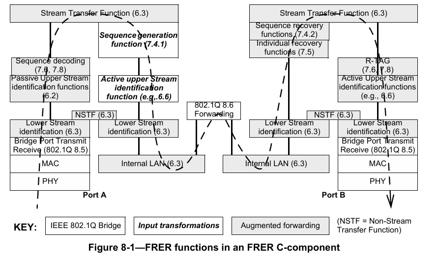

第1项（输入转换）使网桥能够：
a) 作为不支持FRER的发送方的代理；
b) 对进入网桥的流执行流标识或序列封装转换。

第2项（增强转发）使网桥能够：
c) 在提供多重故障防护的网络中充当中间序列恢复点（例如图C-4中的系统F）；
d) 作为不支持FRER的接收方的代理；
e) 对退出网桥的流执行流标识或序列封装转换。

如图8-1所示，其核心逻辑是：在输入时识别特定流（即提取stream_handle和sequence_number子参数），然后通过网桥正常转发帧。在输出端口，输入端口获取的stream_handle和sequence_number子参数用于驱动独立恢复功能、序列恢复功能、序列编码和流标识功能。

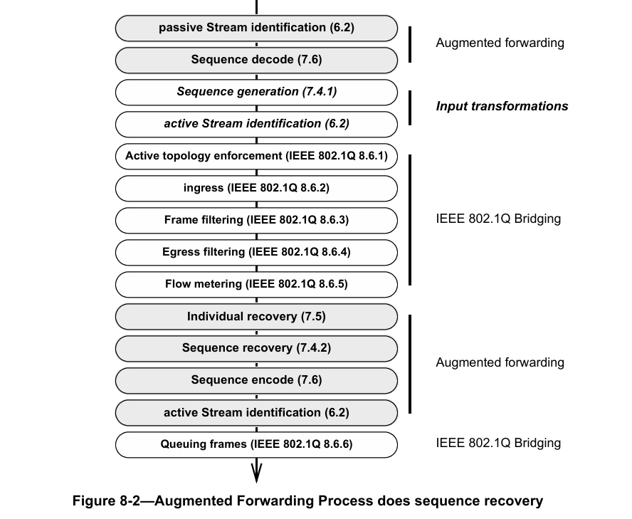

图8-1并不意味着增强转发功能必须部署在扩展端口中；它们可与网桥转发功能（IEEE Std 802.1Q-2014的8.6节）集成，如图8-2所示。这些功能相对于IEEE Std 802.1Q-2014的8.6节的顺序可能很重要。具体而言：
f) 按照模型设计，仅在入站时提取stream_handle子参数，即使输入转换修改了帧，也不会重新识别帧；
g) 按照模型设计，输入转换期间不会将sequence_number子参数编码到帧中，最终的输出编码决定帧格式。

**注**：无论实现是将stream_handle和sequence_number子参数编码到帧的mac_service_data_unit参数中并在转发后再次解码，还是将它们作为单独的子参数传递到转发过程中，只要外部可见行为与模型一致，均无影响。
h) 如果执行了输入转换，则根据转换后的参数转发帧（IEEE Std 802.1Q-2014的8.6节）；
i) 流量计量（IEEE Std 802.1Q-2014的8.6.5节）部署在被动流标识功能（6.2）之后、独立恢复功能（7.5）之前。这使得stream_handle子参数可用于流量计量，并意味着流量计量可应用于为序列恢复功能实例提供数据的各个流。因此，流量计量可应用于将被独立恢复功能或序列恢复功能丢弃的帧；
j) 序列恢复功能之后的输出转换在所有转发操作完成后执行（IEEE Std 802.1Q-2014的8.6.6节的帧排队除外）。因此，输出转换可能看似违反正常的转发规则（例如IEEE Std 802.1Q-2014的8.6.4节的出站过滤）。

使用图8-2的模型，无需显式的流拆分功能（7.7）。单个复合流中的帧可使用正常的多播机制进行复制，不同输出端口上的主动流标识功能（6.2）可使这些帧在下一跳被识别为不同的成员流。将单个序列编码/解码功能和流标识功能分配给多个stream_handle值，可使多个成员流在输出时采用完全相同的流标识方法，从而被下一个接收方合并为单个流。

理论上，如果使用图8-2的模型，则对于每个要输出相同流集的不同端口集，都存在独立恢复功能（7.5）和序列恢复功能（7.4.2）的实例。原则上，伴随数据包通过IEEE 802.1Q转发过程的输出端口向量指导帧向这些功能的分配。此阶段之后，可配置多组序列编码/解码功能（7.6）和/或流标识功能（6.2）进一步转换数据包。

## 8.2 FRER C组件的输入转换
图8-1中粗体白框标记的输入转换使网桥能够作为不支持FRER的终端系统的代理。扩展输入端口识别属于流的数据包（例如使用IP流标识，6.7），通过序列生成功能（7.4.1）对数据包进行序列化，通过冗余标签（R-TAG，7.8）对序列号进行编码，然后通过主动目的MAC和VLAN流标识（6.6）为属于该流的数据包分配至少在该网桥内唯一的{VLAN标识符，目的MAC地址}对。增强了独立恢复功能（7.5）和序列恢复功能（7.4.2）的IEEE 802.1Q转发过程随后转发该帧。

## 8.3 帧复制与消除可靠性机制和VLAN标签
如图8-1和图8-3所示，IEEE 802.1Q C-VLAN组件中的FRER位于协议栈中网桥端口发送和接收功能（IEEE Std 802.1Q-2014的8.5节）之上。由于这种部署位置，同时包含IEEE 802.1Q C-VLAN标签和冗余标签（R-TAG）但无其他IEEE 802.1Q标签的帧如图8-3所示。

<html>
<table border="1">
<thead>
<tr>
<th>字段</</</th>
<th>偏移量</</</th>
<th>长度</</</th>
</tr>
</thead>
<tbody>
<tr>
<td>目的MAC地址</td>
<td>0</td>
<td>6</td>
</tr>
<tr>
<td>源MAC地址</td>
<td>6</td>
<td>6</td>
</tr>
<tr>
<td>C-TAG以太类型</td>
<td>12</td>
<td>2</td>
</tr>
<tr>
<td>优先级、DE、VLAN ID</td>
<td>14</td>
<td>2</td>
</tr>
<tr>
<td>R-TAG以太类型</td>
<td>16</td>
<td>2</td>
</tr>
<tr>
<td>保留字段</td>
<td>18</td>
<td>2</td>
</tr>
<tr>
<td>序列号</td>
<td>20</td>
<td>2</td>
</tr>
<tr>
<td>有效载荷长度/以太类型</td>
<td>22</td>
<td>2</td>
</tr>
<tr>
<td>数据</td>
<td>24</td>
<td>n</td>
</tr>
<tr>
<td>帧校验序列</td>
<td>24 + n</td>
<td>4</td>
</tr>
</tbody>
</table>
</html>

<p align="center">图8-3 - 以太网帧格式示例</p>

## 8.4 配置网桥中的帧复制与消除可靠性机制
如8.1所述，可将输出转换（包括独立恢复功能（7.5）、序列恢复功能（7.4.2）、序列编码/解码功能（7.6）和流标识功能（6.2））描述为嵌入在IEEE 802.1Q转发过程中。然而，由于应用程序在不同输出端口上可能需要不同的操作，因此可使用第9章和第10章中的被管理对象配置FRER C组件。图8-1展示了第9章和第10章中的被管理对象所感知的输出网桥端口上FRER功能的允许排列方式。

FRER C组件应实现第9章和第10章中满足5.12和5.15的一致性要求所需的所有被管理对象，但表8-1中注明的除外。

<html>
<table border="1">
<thead>
<tr>
<th>变量</</</th>
<th>参考条款</</</th>
<th>限制</</</th>
<th>原因</</</th>
</tr>
</thead>
<tbody>
<tr>
<td>tsnStreamIdInFacOutputPortList</td>
<td>9.1.1.2</td>
<td>仅可配置主动目的MAC和VLAN流标识（或不配置）</td>
<td>仅输入转换需要</td>
</tr>
<tr>
<td>tsnStreamIdOutFacOutputPortList</td>
<td>9.1.1.3</td>
<td>仅可配置主动目的MAC和VLAN流标识（或不配置）</td>
<td>网桥可修改属于特定流的数据包的VLAN标识符和目的MAC地址</td>
</tr>
<tr>
<td>tsnStreamIdInFacInputPortList</td>
<td>9.1.1.4</td>
<td>不允许</td>
<td>无需在流退出网桥时重新识别</td>
</tr>
<tr>
<td>tsnStreamIdOutFacInputPortList</td>
<td>9.1.1.5</td>
<td>无限制</td>
<td>-</td>
</tr>
<tr>
<td>tsnCpeDmacVlanDownTagged</td>
<td>9.1.4.2</td>
<td>非必需</td>
<td>在IEEE 802.1Q网桥中，是否为出站帧添加标签由其他被管理对象决定</td>
</tr>
<tr>
<td>frerSeqGenDirection</td>
<td>10.3.1.2</td>
<td>必须为False（面向内部）</td>
<td>仅可向入站数据包添加序列号</td>
</tr>
<tr>
<td>frerSeqRcvyDirection</td>
<td>10.4.1.3</td>
<td>必须为False（面向内部）</td>
<td>仅可丢弃出站数据包中的重复数据包</td>
</tr>
<tr>
<td>frerSeqEncDirection</td>
<td>10.5.1.3</td>
<td>必须为True（面向外部）</td>
<td>数据包的序列号在退出时进行编码/解码</td>
</tr>
<tr>
<td>流拆分表</td>
<td>10.6</td>
<td>非必需</td>
<td>-</td>
</tr>
</tbody>
</table>
</html>

<p align="center">表8-1 - FRER C组件中FRER的被管理对象</p>

# 9. 流标识管理
控制流标识的被管理对象的描述如下：
a) 流标识表（9.1）为数据包分配stream_handle（6.1）；
b) 流标识功能为网络管理实体检查而保留的每端口每流数据包计数器见9.2，每端口（所有流合计）计数器见9.3。

9.2和9.3中流标识计数器行为的一般要求见10.1。

## 9.1 流标识表
流标识表由一组tsnStreamIdEntry对象（9.1.1）组成，每个对象对应一个流，指定系统中要实例化流标识功能（6.2）的位置。流标识表中的每个条目都有一个指定stream_handle值的tsnStreamIdHandle对象（9.1.1.1），以及一个或多个描述该流的一种标识方法的tsnStreamIdEntry对象（9.1.1）。如果单个流有多种标识方法（可能但不一定在不同端口上），则可能存在多个tsnStreamIdHandle值相同的tsnStreamIdEntry对象。如果对数据包应用HSR或PRP方法或序列编码/解码功能，则LanId或PathId字段也用于识别数据包所属的流。

### 9.1.1 tsnStreamIdEntry
一组被管理对象，均适用于tsnStreamIdHandle（9.1.1.1）指定的流，且均使用相同的流标识类型和参数（9.1.1.6、9.1.1.7）。

仅当使用自动配置（7.11）时，tsnStreamIdEntry中才存在附加的被管理对象，见10.2。

#### 9.1.1.1 tsnStreamIdHandle
流标识表中特定条目中的对象用于控制stream_handle子参数等于该条目tsnStreamIdHandle对象的数据包。tsnStreamIdHandle对象中使用的特定值不一定在系统中使用；它们仅用于关联第9章和第10章中的各种管理对象。

#### 9.1.1.2 tsnStreamIdInFacOutputPortList
在输出（朝向系统转发功能）方向上，为该流（9.1.1.1）部署使用此标识方法（9.1.1.6、9.1.1.7）的面向内部流标识功能（6.2）的端口列表。对于特定的tsnStreamIdHandle，最多只能有一个tsnStreamIdEntry在其tsnStreamIdInFacOutputPortList中列出特定端口。

#### 9.1.1.3 tsnStreamIdOutFacOutputPortList
在输出（朝向物理接口）方向上，为该流（9.1.1.1）部署使用此标识方法（9.1.1.6、9.1.1.7）的面向外部流标识功能（6.2）的端口列表。对于特定的tsnStreamIdHandle，最多只能有一个tsnStreamIdEntry在其tsnStreamIdOutFacOutputPortList中列出特定端口。

#### 9.1.1.4 tsnStreamIdInFacInputPortList
在输入（来自系统转发功能）方向上，为该流（9.1.1.1）部署使用此标识方法（9.1.1.6、9.1.1.7）的面向内部流标识功能（6.2）的端口列表。对于特定的tsnStreamIdHandle，多个tsnStreamIdEntry对象可在其tsnStreamIdInFacInputPortList中列出相同端口。

#### 9.1.1.5 tsnStreamIdOutFacInputPortList
在输入（来自物理接口）方向上，为该流（9.1.1.1）部署使用此标识方法（9.1.1.6、9.1.1.7）的面向外部流标识功能（6.2）的端口列表。对于特定的tsnStreamIdHandle，多个tsnStreamIdEntry对象可在其tsnStreamIdOutFacInputPortList中列出相同端口。

#### 9.1.1.6 tsnStreamIdIdentificationType
一个枚举值，指示用于识别属于该流的数据包的方法。枚举包含组织唯一标识符（OUI）或公司标识符（CID），用于标识定义该枚举类型的组织。本标准定义的值如表9-1所示。

<html>
<table border="1">
<thead>
<tr>
<th>OUI/CID</</</th>
<th>类型编号</</</th>
<th>流标识功能</</</th>
<th>控制参数</</</th>
</tr>
</thead>
<tbody>
<tr>
<td>00-80-C2</td>
<td>0</td>
<td>预留</td>
<td>-</td>
</tr>
<tr>
<td>00-80-C2</td>
<td>1</td>
<td>空流标识（6.4）</td>
<td>9.1.2</td>
</tr>
<tr>
<td>00-80-C2</td>
<td>2</td>
<td>源MAC和VLAN流标识（6.5）</td>
<td>9.1.3</td>
</tr>
<tr>
<td>00-80-C2</td>
<td>3</td>
<td>主动目的MAC和VLAN流标识（6.6）</td>
<td>9.1.4</td>
</tr>
<tr>
<td>00-80-C2</td>
<td>4</td>
<td>IP流标识（6.7）</td>
<td>9.1.5</td>
</tr>
<tr>
<td>00-80-C2</td>
<td>5-255</td>
<td>预留</td>
<td>-</td>
</tr>
<tr>
<td>其他</td>
<td>-</td>
<td>由拥有该OUI或CID的实体定义</td>
<td>-</td>
</tr>
</tbody>
</table>
</html>

<p align="center">表9-1 - 流标识类型</p>

#### 9.1.1.7 tsnStreamIdParameters
流标识方法的控制参数数量、类型和值特定于tsnStreamIdIdentificationType（9.1.1.6），并在表9-1中引用。

### 9.1.2 空流标识的被管理对象
为特定输入流实例化空流标识功能（6.4）时，以下子条款中的被管理对象用作tsnStreamIdParameters被管理对象（9.1.1.7）。

#### 9.1.2.1 tsnCpeNullDownDestMac
指定空流标识功能在EISS指示原语中识别数据包的目的地址。

#### 9.1.2.2 tsnCpeNullDownTagged
一个枚举值，指示空流标识功能的EISS指示原语中的数据包是否允许带有VLAN标签。它可以取以下值：
1) tagged：帧必须带有VLAN标签才能被识别为属于该流；
2) priority：帧必须是未标记的，或带有VLAN ID=0的VLAN标签才能被识别为属于该流；
3) all：无论帧是否带有标签，都能被识别为属于该流。

#### 9.1.2.3 tsnCpeNullDownVlan
指定空流标识功能在EISS指示原语中识别数据包的VLAN标识符参数。值为0表示在EISS指示原语中忽略VLAN标识符参数。

### 9.1.3 源MAC和VLAN流标识的被管理对象
为特定输入流实例化源MAC和VLAN流标识功能（6.5）时，以下子条款中的被管理对象用作tsnStreamIdParameters被管理对象（9.1.1.7）。

#### 9.1.3.1 tsnCpeSmacVlanDownSrcMac
指定源MAC和VLAN流标识功能在EISS指示原语中识别数据包的源地址。

#### 9.1.3.2 tsnCpeSmacVlanDownTagged
一个枚举值，指示源MAC和VLAN流标识功能的EISS指示原语中的数据包是否允许带有VLAN标签。它可以取以下值：
1) tagged：帧必须带有VLAN标签才能被识别为属于该流；
2) priority：帧必须是未标记的，或带有VLAN ID=0的VLAN标签才能被识别为属于该流；
3) all：无论帧是否带有标签，都能被识别为属于该流。

#### 9.1.3.3 tsnCpeSmacVlanDownVlan
指定源MAC和VLAN流标识功能在EISS指示原语中识别数据包的VLAN标识符参数。值为0表示在EISS指示原语中忽略VLAN标识符参数。

### 9.1.4 主动目的MAC和VLAN流标识的被管理对象
为特定输出流实例化主动目的MAC和VLAN流标识功能（6.6）时，以下子条款中的被管理对象与9.1.2中列出的被管理对象一起用作tsnStreamIdParameters被管理对象（9.1.1.7）。

#### 9.1.4.1 tsnCpeDmacVlanDownDestMac
指定主动目的MAC和VLAN流标识功能向下层发送输出数据包时在EISS请求原语中使用的目的地址参数，以及主动目的MAC和VLAN流标识功能在EISS指示原语中识别输入数据包的目的地址。

#### 9.1.4.2 tsnCpeDmacVlanDownTagged
一个枚举值，指示主动目的MAC和VLAN流标识功能与下层之间的EISS指示或请求原语中的数据包是否要带有VLAN标签。它可以取以下值：
1) tagged：输入帧必须带有VLAN标签才能被识别为属于该流；输出帧将添加VLAN标签；
2) priority：输入帧必须是未标记的，或带有VLAN ID=0的VLAN标签才能被识别为属于该流；输出帧将标记为带有VLAN ID=0的VLAN标签；
3) all：无论帧是否带有标签，都能被识别为属于该流；输出帧为未标记的。

此变量在FRER C组件中不使用，见8.4。

#### 9.1.4.3 tsnCpeDmacVlanDownVlan
指定主动目的MAC和VLAN流标识功能向下层发送输出数据包时在EISS请求原语中使用的VLAN标识符参数，以及主动目的MAC和VLAN流标识功能在EISS指示原语中识别输入数据包的VLAN标识符。值为0表示在EISS指示原语中忽略VLAN标识符参数。

#### 9.1.4.4 tsnCpeDmacVlanDownPriority
指定主动目的MAC和VLAN流标识功能为特定流中的所有数据包向下层发送输出数据包时在EISS请求原语中使用的优先级参数。

#### 9.1.4.5 tsnCpeDmacVlanUpDestMac
指定主动目的MAC和VLAN流标识层向上层提供输入数据包时在EISS指示原语中使用的目的地址参数。此地址替换用于识别数据包的地址（tsnCpeDmacVlanDownDestMac，9.1.4.1）。

#### 9.1.4.6 tsnCpeDmacVlanUpTagged
一个枚举值，指示主动目的MAC和VLAN流标识功能与上层之间的EISS指示或请求原语中的数据包是否要带有VLAN标签。它可以取以下值：
1) tagged：输出帧必须带有VLAN标签才能被识别为属于该流；输入帧将添加VLAN标签；
2) priority：输出帧必须是未标记的，或带有VLAN ID=0的VLAN标签才能被识别为属于该流；输入帧将标记为带有VLAN ID=0的VLAN标签；
3) all：无论帧是否带有标签，都能被识别为属于该流；输入帧为未标记的。

此变量仅由终端系统使用，中继系统不使用，见8.4。

#### 9.1.4.7 tsnCpeDmacVlanUpVlan
指定向上层提供数据包时在EISS指示原语中使用的VLAN标识符参数，或ISS mac_service_data_unit中IEEE 802.1Q标签的VLAN ID字段。此地址替换用于识别数据包的VLAN ID（tsnCpeDmacVlanDownVlan，9.1.4.3）。

#### 9.1.4.8 tsnCpeDmacVlanUpPriority
指定向上层提供数据包时在EISS指示原语中使用的优先级参数。

### 9.1.5 IP流标识的被管理对象
实例化IP流标识功能（6.7）时，以下子条款中的参数替换tsnStreamIdParameters被管理对象（9.1.1.7）。

#### 9.1.5.1 tsnCpeIpIdDestMac
指定EISS指示原语中识别数据包的目的地址参数。

#### 9.1.5.2 tsnCpeIpIdTagged
一个枚举值，指示IP流标识功能的EISS指示或请求原语中的数据包是否要带有VLAN标签。它可以取以下值：
1) tagged：输入帧必须带有VLAN标签才能被识别为属于该流；输出帧将添加VLAN标签；
2) priority：输入帧必须是未标记的，或带有VLAN ID=0的VLAN标签才能被识别为属于该流；输出帧将标记为带有VLAN ID=0的VLAN标签；
3) all：无论帧是否带有标签，都能被识别为属于该流；输出帧为未标记的。

#### 9.1.5.3 tsnCpeIpIdVlan
指定EISS指示原语中识别数据包的VLAN标识符参数。值为0表示帧不应带有VLAN标签。

#### 9.1.5.4 tsnCpeIpIdIpSource
指定识别从下层向上传递的数据包时必须匹配的IPv4（RFC 791）或IPv6（RFC 2460）源地址参数。全0地址表示忽略从下层接收的数据包的IP源地址。

#### 9.1.5.5 tsnCpeIpIdIpDestination
指定识别从下层向上传递的数据包时必须匹配的IPv4（RFC 791）或IPv6（RFC 2460）目的地址参数。

#### 9.1.5.6 tsnCpeIpIdDscp
指定识别从下层向上传递的数据包时必须匹配的IPv4（RFC 791）或IPv6（RFC 2460）区分服务代码点（DSCP，RFC 2474）。十进制值为64表示忽略从下层接收的数据包的DSCP。

#### 9.1.5.7 tsnCpeIpIdNextProtocol
指定识别从下层向上传递的数据包时必须匹配的IP下一层协议参数。该参数的值必须指定为无、UDP（RFC 768）、TCP（RFC 793）或SCTP（RFC 4960）。如果为“无”，则不使用tsnCpeIpIdSourcePort（9.1.5.8）和tsnCpeIpIdDestinationPort（9.1.5.9）被管理对象。

#### 9.1.5.8 tsnCpeIpIdSourcePort
指定识别从下层向上传递的数据包时必须匹配的TCP或UDP源端口参数。值为0表示忽略从下层接收的数据包的源端口号。

#### 9.1.5.9 tsnCpeIpIdDestinationPort
指定识别从下层向上传递的数据包时必须匹配的TCP或UDP目的端口参数。值为0表示忽略从下层接收的数据包的目的端口号。

### 9.2 操作型每端口每流流标识计数器
以下计数器在部署了流标识功能（6.2）的每个端口上实例化。计数器按端口号、朝向（面向内部或面向外部）和stream_handle值（tsnStreamIdHandle，9.1.1.1）进行索引。所有计数器均为无符号整数。如果用于速率超过650,000,000比特/秒的链路，计数器长度应为64位，以确保不会过快回滚。

#### 9.2.1 tsnCpsSidInputPackets
每次流标识功能（6.2）识别到一个数据包时，tsnCpsSidInputPackets计数器递增1。

#### 9.2.2 tsnCpsSidOutputPackets
每次流标识功能（6.2）将一个数据包向下传递时，tsnCpsSidOutputPackets计数器递增1。

### 9.3 操作型每端口流标识计数器
#### 9.3.1 tsnCpSidInputPackets
每次该端口上的任何流标识功能（6.2）识别到一个数据包时，tsnCpSidInputPackets计数器递增1。其值等于该端口上所有tsnCpsSidInputPackets（9.2.1）计数器的总和（以计数器大小为模）。

#### 9.3.2 tsnCpSidOutputPackets
每次该端口上的任何流标识功能（6.2）将一个数据包向下传递时，tsnCpSidOutputPackets计数器递增1。其值等于该端口上所有tsnCpsSidOutputPackets（9.2.2）计数器的总和（以计数器大小为模）。


# 10. 帧复制与消除可靠性机制管理
### 10.1 计数器行为
本标准定义的所有计数器（例如，frerCpsSeqEncErroredPackets，10.8.11）在递增超过其可表示的最大值时，应回滚到 0 并继续计数。本标准未规定将任何计数器重置为特定值（例如 0）的相关机制。系统重置时，计数器可被设置为任意值。本标准做出以下假设：
a) 任何管理实体应足够频繁地读取计数器，以确保在两次读取之间最多发生一次回滚；
b) 系统中存在“上次计数器重置时间”“自上次计数器重置以来的时间”或等效的被管理对象，管理实体可通过查看该对象来确定自上次读取后计数器是否已被重置；
c) 计数器被管理对象的容量应足够大，确保从 0 开始计数到再次回滚到 0 至少需要一分钟。

### 10.2 tsnStreamIdEntry 的附加被管理对象
当实现自动配置的被管理对象（7.11、10.7）时，流标识表（9.1）中的每个 tsnStreamIdEntry（9.1.1）会增加两个被管理对象。

#### 10.2.1 tsnStreamIdAutoconfigured
一个只读布尔值，由系统提供，用于指定该条目是显式创建（False）还是通过序列自动配置表创建（10.7.1，True）。

#### 10.2.2 tsnStreamIdLanPathId
一个指定路径或局域网（LAN）的整数。当且仅当数据包与序列标识表（10.5）中 frerSeqEncEncapsType（10.5.1.5）对象指定为 HSR 或 PRP 的条目匹配时，tsnStreamIdLanPathId 才会指定应用此 tsnStreamIdEntry 所需匹配的 LanId 或 PathId 值。值为 -1 表示忽略 LanId 或 PathId。

### 10.3 序列生成表
一个系统中存在一个序列生成表，每个序列生成函数（7.4.1）在该表中对应一个条目。

#### 10.3.1 frerSeqGenEntry
每个 frerSeqGenEntry 列出了要为其部署单个序列生成函数（7.4.1）实例的流（10.3.1.1）和方向（10.3.1.2）。

##### 10.3.1.1 frerSeqGenStreamList
一组流句柄值列表，对应于流标识表（9.1）中 tsnStreamIdHandle 对象（9.1.1.1）的值，此序列生成函数（7.4.1）实例将对属于这些流的所有数据包进行操作，无论数据包是在哪个端口接收的。

##### 10.3.1.2 frerSeqGenDirection
一个布尔对象，用于指示序列生成函数（7.4.1）是部署在端口的面向外部（True）还是面向内部（False）一侧（图 6-6）。

### 10.4 序列恢复表
一个系统中存在一个序列恢复表，每个序列恢复函数（7.4.2）或可能存在的独立恢复函数（7.5）在该表中对应一个条目。该条目描述了包含在序列恢复函数或独立恢复函数中的单个基础恢复函数（7.4.3）和潜在错误检测函数（7.4.4）的一组被管理对象。

#### 10.4.1 frerSeqRcvyEntry
每个 frerSeqRcvyEntry 列出了要为其部署序列恢复函数（7.4.2）或独立恢复函数（7.5）实例的流（10.4.1.1）、端口（10.4.1.2）和方向（10.4.1.3）。

##### 10.4.1.1 frerSeqRcvyStreamList
一组流句柄值列表，对应于流标识表（9.1）中 tsnStreamIdHandle 对象（9.1.1.1）的值，系统将对这些流应用序列恢复函数（7.4.2）或独立恢复函数（7.5）实例。

##### 10.4.1.2 frerSeqRcvyPortList
一组端口列表，系统将在每个端口上部署序列恢复函数（7.4.2）实例，或从这些端口接收数据包并输入到单个独立恢复函数（7.5）实例。

##### 10.4.1.3 frerSeqRcvyDirection
一个布尔对象，用于指示序列恢复函数（7.4.2）或独立恢复函数（7.5）是部署在端口的面向外部（True）还是面向内部（False）一侧（图 6-6）。

##### 10.4.1.4 frerSeqRcvyReset
一个布尔对象，用于指示序列恢复函数（7.4.2）或独立恢复函数（7.5）是否要通过调用其对应的 SequenceGenerationReset 函数（7.4.1.3）进行重置。向 frerSeqRcvyReset 写入 True 值将触发重置；写入 False 值则无任何效果。读取时，frerSeqRcvyReset 始终返回 False。

##### 10.4.1.5 frerSeqRcvyAlgorithm
该对象是一个枚举值，用于指定此序列恢复函数（7.4.2）实例要使用的序列恢复算法。枚举采用组织唯一标识符（OUI）或公司标识符（CID），如表 10-1 所示。frerSeqRcvyAlgorithm 的默认值为 Vector_Alg（00-80-C2，0）。

<html>
<table border="1">
<thead>
<tr>
<th>枚举值</</</th>
<th>OUI/CID</</</th>
<th>类型编号</</</th>
<th>序列恢复函数算法</</</th>
</tr>
</thead>
<tbody>
<tr>
<td>Vector_Alg</td>
<td>00-80-C2</td>
<td>0</td>
<td>向量恢复算法（7.4.3.4）</td>
</tr>
<tr>
<td>Match_Alg</td>
<td>00-80-C2</td>
<td>1</td>
<td>匹配恢复算法（7.4.3.5）</td>
</tr>
<tr>
<td>-</td>
<td>00-80-C2</td>
<td>2-255</td>
<td>预留</td>
</tr>
<tr>
<td>其他</td>
<td>其他</td>
<td>-</td>
<td>由拥有该 OUI 或 CID 的实体定义</td>
</tr>
</tbody>
</table>
</html>

<p align="center">表 10-1 - frerSeqRcvyAlgorithm 的枚举值</p>

##### 10.4.1.6 frerSeqRcvyHistoryLength
一个整数，用于指定要使用的 SequenceHistory 变量（7.4.3.2.2）的位数。最小值和默认值为 2，最大值为实现所允许的最大值。[如果 frerSeqRcvyAlgorithm（10.4.1.5）= Match_Alg（00-80-C2，1），则此参数不使用。]

##### 10.4.1.7 frerSeqRcvyResetMSec
一个无符号整数，用于指定恢复超时事件（7.4.3.1 中的 c 项）的超时时间（以毫秒为单位）。

##### 10.4.1.8 frerSeqRcvyInvalidSequenceValue
一个只读无符号整数值，不能作为序列号子参数（6.1 中的 b 项）的值编码到数据包中，即 frerSeqRcvyInvalidSequenceValue 大于或等于 RecovSeqSpace（7.4.3.2.1）。

##### 10.4.1.9 frerSeqRcvyTakeNoSequence
一个布尔值，用于指定是否接受没有序列号子参数的数据包（True）或不接受（False）。默认值为 False。见 7.1.1 中的 i 项。

##### 10.4.1.10 frerSeqRcvyIndividualRecovery
一个布尔值，用于指定此条目描述的是序列恢复函数（7.4.2）还是独立恢复函数（7.5）。
a) True：该条目描述的是独立恢复函数（7.5）。被 SequenceGenerationAlgorithm（7.4.1.4）丢弃的数据包将导致 RemainingTicks 变量（7.4.3.2.4）重置。此条目不关联潜在错误检测函数（7.4.4），因此 frerSeqRcvyLatentErrorDetection（10.4.1.11）不能同时设为 True；
b) False：该条目描述的是序列恢复函数（7.4.2）。被 SequenceGenerationAlgorithm（7.4.1.4）丢弃的数据包不会导致 RemainingTicks 变量（7.4.3.2.4）重置。

##### 10.4.1.11 frerSeqRcvyLatentErrorDetection
一个布尔值，用于指示是否要与基础恢复函数（7.4.3）一起在该序列恢复函数（7.4.2）或独立恢复函数（7.5）中部署潜在错误检测函数（7.4.4）实例。如果 frerSeqRcvyIndividualRecovery（10.4.1.10）为 True，则 frerSeqRcvyLatentErrorDetection 不能设为 True；独立恢复函数不包含潜在错误检测函数。

##### 10.4.1.12 潜在错误检测被管理对象
以下子条款中的对象仅在 frerSeqRcvyIndividualRecovery（10.4.1.10）为 False 时存在。

###### 10.4.1.12.1 frerSeqRcvyLatentErrorDifference
一个整数，用于指定允许的 frerCpsSeqRcvyDiscardedPackets（10.8.6）与 frerCpsSeqRcvyPassedPackets（10.8.5）和（frerSeqRcvyLatentErrorPaths - 1）（10.4.1.12.3）乘积之间的最大差值。任何超过此差值的情况都将触发潜在错误检测函数（7.4.4.4）检测到潜在错误。

###### 10.4.1.12.2 frerSeqRcvyLatentErrorPeriod
两次运行潜在错误检测函数（7.4.4.4）之间的时间间隔（以毫秒为单位）。实现可以为 frerSeqRcvyLatentErrorPeriod 设置最小值，低于该值则无法设置，但此最小值不得大于 1000 毫秒（1 秒）。默认值为 2000（2 秒）。

###### 10.4.1.12.3 frerSeqRcvyLatentErrorPaths
FRER 为该基础恢复函数（7.4.3）和潜在错误检测函数（7.4.4）实例运行时所涉及的路径数量（整数）。

###### 10.4.1.12.4 frerSeqRcvyLatentResetPeriod
两次运行潜在错误重置函数（7.4.4.3）之间的时间间隔（以毫秒为单位）。实现可以为潜在错误重置函数设置最小值，低于该值则无法设置，但此最小值不得大于 1000 毫秒（1 秒）。默认值为 30000（30 秒）。

### 10.5 序列标识表
一个系统中存在一个序列标识表，每个要为其部署序列编码/解码函数（7.6）实例的端口和方向在该表中对应一个条目。

#### 10.5.1 frerSeqEncEntry
序列标识表中的每个条目指定了要为其部署序列编码/解码函数实例的一组流（10.5.1.1）对应的端口（10.5.1.2）和方向（10.5.1.3）。

##### 10.5.1.1 frerSeqEncStreamList
一组流句柄列表，对应于流标识表（9.1）中 tsnStreamIdHandle 对象（9.1.1.1）的值，系统将为这些流的序列编码/解码函数使用相同的封装方式（10.5.1.5）。

##### 10.5.1.2 frerSeqEncPort
系统要在其上部署序列编码/解码函数（7.6）实例的端口。

##### 10.5.1.3 frerSeqEncDirection
一个布尔对象，用于指示序列编码/解码函数（7.6）是部署在端口的面向外部（True）还是面向内部（False）一侧（图 6-6）。

##### 10.5.1.4 frerSeqEncActive
一个布尔值，用于指定此 frerSeqEncEntry 是被动的（False），因此仅用于对向上传递的输入数据包进行解码（提取信息）；还是主动的（True），因此既用于识别输入数据包，也用于对向下传递的输出数据包进行编码。

##### 10.5.1.5 frerSeqEncEncapsType
一个枚举值，用于指示此序列编码/解码函数（7.6）实例所使用的封装类型。该类型包含 OUI 或 CID。本标准定义的值如表 10-2 所示。

##### 10.5.1.6 frerSeqEncPathIdLanId
一个 4 位整数值，将被放入添加到输出数据包的 HSR 序列标签（7.9）的 PathId 字段或 PRP 序列尾部（7.10）的 LanId 字段中。仅在以下情况下使用此被管理对象：
a) 序列编码/解码函数封装类型对象（10.5.1.5）选择了 HSR 序列标签或 PRP 序列尾部；
b) frerSeqEncActive（10.5.1.4）为 False（被动）。

<html>
<table border="1">
<thead>
<tr>
<th>OUI/CID</</</th>
<th>类型编号</</</th>
<th>序列编码/解码方式</</</th>
</tr>
</thead>
<tbody>
<tr>
<td>00-80-C2</td>
<td>0</td>
<td>预留</td>
</tr>
<tr>
<td>00-80-C2</td>
<td>1</td>
<td>冗余标签（R-TAG）（7.8）</td>
</tr>
<tr>
<td>00-80-C2</td>
<td>2</td>
<td>HSR 序列标签（7.9）</td>
</tr>
<tr>
<td>00-80-C2</td>
<td>3</td>
<td>PRP 序列尾部（7.10）</td>
</tr>
<tr>
<td>00-80-C2</td>
<td>4-255</td>
<td>预留</td>
</tr>
<tr>
<td>其他</td>
<td>-</td>
<td>由拥有该 OUI 或 CID 的实体定义</td>
</tr>
</tbody>
</table>
</html>

<p align="center">表 10-2 - 序列编码/解码类型</p>

### 10.6 流拆分表
一个系统中存在一个流拆分表，每组流句柄值对应的每个流拆分函数（7.7）在该表中对应一个 frerSplitEntry（10.6.1）。

#### 10.6.1 frerSplitEntry
流拆分表中的每个条目指定了要为其部署流拆分函数（7.7）实例的端口（10.6.1.1）和方向（10.6.1.2），以及指定其操作的流句柄列表。

##### 10.6.1.1 frerSplitPort
系统要在其上部署执行流句柄转换（由 frerSplitInputIdList 和 frerSplitOutputIdList（10.6.1.3、10.6.1.4 指定）的流拆分函数（7.7）实例的端口。

##### 10.6.1.2 frerSplitDirection
一个布尔对象，用于指示执行流句柄转换（由 frerSplitInputIdList 和 frerSplitOutputIdList（10.6.1.3、10.6.1.4 指定）的流拆分函数（7.7）实例是部署在端口的面向外部（True）还是面向内部（False）一侧（图 6-6）。

##### 10.6.1.3 frerSplitInputIdList
一组要进行拆分的流句柄（tsnStreamIdHandle 值，9.1.1.1）列表。

##### 10.6.1.4 frerSplitOutputIdList
一组流句柄（tsnStreamIdHandle 值，9.1.1.1）列表，输入数据包将被拆分为这些流句柄对应的数据包，frerSplitOutputIdList 中的每个条目对应一个数据包副本。

### 10.7 自动配置的被管理对象
#### 10.7.1 序列自动配置表
一个系统中存在一个序列自动配置表。该表包含任意数量的表条目（10.7.1.1）。在任意给定端口（10.7.1.1.2）上，序列自动配置表中不得有两个（或多个）条目具有相同的 frerAutSeqSeqEncaps（10.7.1.1.1）、frerAutSeqTagged（10.7.1.1.3）和 frerAutSeqVlan（10.7.1.1.4）值。

##### 10.7.1.1 frerAutSeqEntry
每个 frerAutSeqEntry 对象（10.7.1.1）对应一类流，并指定了如何在流标识表（9.1）、序列恢复表（10.4）和序列标识表（10.5）中创建（和销毁）条目。

###### 10.7.1.1.1 frerAutSeqSeqEncaps
表 10-2 中的一个枚举值，用于指定为实现自动配置要识别的序列编码/解码函数，进而确定要识别的序列号编码类型。

###### 10.7.1.1.2 frerAutSeqReceivePortList
此 frerAutSeqEntry 适用的端口列表，将在这些端口上自动创建流标识函数（6.2）、序列编码/解码函数（7.6）和独立恢复函数（7.5）。

###### 10.7.1.1.3 frerAutSeqTagged
一个枚举值，用于指示此 frerAutSeqEntry 要匹配的数据包是否允许带有 VLAN 标签。它可以取以下值：
1) tagged：帧必须带有 VLAN 标签才能被匹配；
2) priority：帧必须是未标记的，或带有 VLAN ID = 0 的 VLAN 标签才能被匹配；
3) all：无论帧是否带有标签，都能被匹配。

###### 10.7.1.1.4 frerAutSeqVlan
数据包要匹配的 VLAN 标识符列表。空列表表示匹配所有 VLAN 标识符。

###### 10.7.1.1.5 frerAutSeqRecoveryPortList
要通过此 frerAutSeqEntry 自动创建序列恢复功能（7.4.2）的端口列表。

###### 10.7.1.1.6 frerAutSeqDestructMSec
一个整数（以毫秒为单位），指定在该时间后，可销毁由该 frerAutSeqEntry 创建的闲置函数集。值为 0 表示不销毁闲置的自动配置函数。默认值为 86400000（一天）。

###### 10.7.1.1.7 frerAutSeqResetMSec
在自动配置序列恢复表中的条目时，用于填充 frerSeqRcvyResetMSec（10.4.1.7）的值。

###### 10.7.1.1.8 frerAutSeqAlgorithm
在自动配置序列恢复表中的条目时，用于填充 frerSeqRcvyAlgorithm（10.4.1.5）的值。

###### 10.7.1.1.9 frerAutSeqHistoryLength
在自动配置序列恢复表中的条目时，用于填充 frerSeqRcvyHistoryLength（10.4.1.6）的值。

###### 10.7.1.1.10 frerAutSeqCreateIndividual
一个布尔值。如果为 True，则接收触发自动配置新 tsnStreamIdEntry 的数据包时，也会触发部署用于独立恢复功能的 frerSeqRcvyEntry。

###### 10.7.1.1.11 frerAutSeqCreateRecovery
一个布尔值。如果为 True，则接收触发自动配置新 tsnStreamIdEntry 的数据包时，也可能触发部署用于序列恢复功能的 frerSeqRcvyEntry。

###### 10.7.1.1.12 frerAutSeqLatErrDetection
一个布尔值。如果为 True，则自动配置新的序列恢复功能时，也会创建相关联的潜在错误检测功能。

###### 10.7.1.1.13 frerAutSeqLatErrDifference
在自动配置序列恢复表中的条目时，用于填充 frerSeqRcvyLatentErrorDifference（10.4.1.12.1）的值。

###### 10.7.1.1.14 frerAutSeqLatErrPeriod
在自动配置序列恢复表中的条目时，用于填充 frerSeqRcvyLatentErrorPeriod（10.4.1.12.2）的值。

###### 10.7.1.1.15 frerAutSeqLatErrResetPeriod
在自动配置序列恢复表中的条目时，用于填充 frerSeqRcvyLatentResetPeriod（10.4.1.12.4）的值。

#### 10.7.2 输出自动配置表
一个系统中存在一个输出自动配置表。该表包含任意数量的 frerAutOutEntry 对象（10.7.2.1），每个对象对应一类流，并指定了如何在序列标识表（10.5）中创建主动条目。

##### 10.7.2.1 frerAutOutEntry
输出自动配置表中不得有两个（或多个）条目在其 frerAutSeqReceivePortList 对象（10.7.1.1.2）中包含相同的端口。

###### 10.7.2.1.1 frerAutOutPortList
此 frerAutOutEntry 适用的端口列表，将在这些端口上自动创建主动序列编码/解码功能（7.6）。

###### 10.7.2.1.2 frerAutOutEncaps
表 10-2 中的一个枚举值，用于指定要为 frerAutSeqReceivePortList（10.7.1.1.2）中的端口上的自动配置流使用的序列编码/解码函数，进而确定要使用的序列号编码类型。

###### 10.7.2.1.3 frerAutOutLanPathId
一个指定路径或局域网（LAN）的整数。当且仅当 frerAutOutEncaps（10.7.2.1.2）指定 HSR 或 PRP 时，frerAutOutLanPathId 才会指定要插入到在 frerAutSeqReceivePortList（10.7.1.1.2）中的端口上传输的自动配置数据包的 HSR 序列标签或 PRP 序列尾部中的 LanId 或 PathId 值。

### 10.8 操作型每端口每流 FRER 计数器
以下计数器将在部署了流标识功能（6.2）、序列功能（7.4）或序列编码/解码功能（7.6）的每个端口上实例化。计数器按端口号、朝向（面向内部或面向外部）和流句柄值（tsnStreamIdHandle，9.1.1.1）进行索引。所有计数器均为无符号整数。如果用于速率超过 650,000,000 比特/秒的链路，计数器长度应为 64 位，以确保不会过快回滚。

流标识组件（5.3）应实现前两个计数器 tsnCpsSidInputPackets（9.2.1）和 tsnCpsSidOutputPackets（9.2.2）；10.8 中的其余计数器对于此类系统是可选的。

#### 10.8.1 每流计数器与每端口每流计数器
前面的被管理对象在每个端口上创建一个序列恢复功能（7.4.2）实例。实际上，中继系统可以选择将单个序列恢复功能实例创建为其转发功能的一部分、每个线路卡创建一个实例，或采用其他分布式方式，而不会违反本标准规定的外部可见行为。第 7 章中定义的每个实例的变量是系统内部的，因此该选择不会影响其定义。

然而，当第 7 章中的算法[例如，匹配恢复算法（7.4.3.5）]引用以下定义的计数器[例如，frerCpsSeqRcvyPassedPackets（10.8.5）]时，该选择就变得重要了。每当第 7 章中的算法递增以下子条款中的计数器时，它会根据数据包要输出（或本应输出）的端口，递增每个相关计数器，无论实际存在多少个序列恢复功能实例。因此，如果一个本应在端口 1、6 和 27 上输出的重复数据包被驻留在中继系统转发功能中的单个序列恢复功能实例丢弃，则会递增三个 frerCpsSeqRcvyDiscardedPackets（10.8.6）计数器实例，每个端口对应一个。

#### 10.8.2 frerCpsSeqGenResets
每次调用 SequenceGenerationReset 函数（7.4.1.3）时，frerCpsSeqGenResets 计数器递增 1。

#### 10.8.3 frerCpsSeqRcvyOutOfOrderPackets
每次向量恢复算法（7.4.3.4）或匹配恢复算法（7.4.3.5）乱序接受数据包时，frerCpsSeqRcvyOutOfOrderPackets 计数器递增 1。乱序是指数据包的序列号并非比上一个接收的数据包的序列号大 1。（见 7.1.1 中的 m 项。）

#### 10.8.4 frerCpsSeqRcvyRoguePackets
每次向量恢复算法（7.4.3.4）因数据包的序列号子参数与 RecovSeqNum（7.4.3.2.3）的差值超过 frerSeqRcvyHistoryLength（10.4.1.6）而丢弃数据包时，frerCpsSeqRcvyRoguePackets 计数器递增 1。

#### 10.8.5 frerCpsSeqRcvyPassedPackets
每次向量恢复算法（7.4.3.4）或匹配恢复算法（7.4.3.5）将数据包向上传递时，frerCpsSeqRcvyPassedPackets 计数器递增 1。

#### 10.8.6 frerCpsSeqRcvyDiscardedPackets
每次向量恢复算法（7.4.3.4）或匹配恢复算法（7.4.3.5）因序列号重复而丢弃数据包时，frerCpsSeqRcvyDiscardedPackets 计数器递增 1。

#### 10.8.7 frerCpsSeqRcvyLostPackets
每次向量恢复算法（7.4.3.4）丢失数据包时，frerCpsSeqRcvyLostPackets 计数器递增 1。如果某个序列号未在任何入端口上接收到，则该数据包被视为丢失。

**注**：如果使用按源序列号编制方式，则 frerCpsSeqRcvyLostPackets 可能会将发送到其他目的地但未丢失的数据包计为丢失。见 B.2。

#### 10.8.8 frerCpsSeqRcvyTaglessPackets
每次向量恢复算法（7.4.3.4）接收到没有序列号子参数（6.1 中的 b 项）的数据包时，frerCpsSeqRcvyTaglessPackets 计数器递增 1。

#### 10.8.9 frerCpsSeqRcvyResets
每次调用 SequenceRecoveryReset 函数（7.4.3.3）时，frerCpsSeqRcvyResets 计数器递增 1。

#### 10.8.10 frerCpsSeqRcvyLatentErrorResets
每次调用潜在错误重置函数（7.4.4.3）时，frerCpsSeqRcvyLatentErrorResets 计数器递增 1。

#### 10.8.11 frerCpsSeqEncErroredPackets
每次序列编码/解码功能（7.6）接收到无法成功解码的数据包时，frerCpsSeqEncErroredPackets 计数器递增 1。

### 10.9 操作型每端口 FRER 计数器
以下计数器将在部署了流标识功能（6.2）、序列功能（7.4）或序列编码/解码功能（7.6）的每个端口上实例化。计数器按端口号和朝向（面向内部或面向外部）进行索引。所有计数器均为无符号整数。如果用于速率超过 650,000,000 比特/秒的链路，计数器长度应为 64 位，以确保不会过快回滚。

流标识组件（5.3）应实现前两个计数器 tsnCpSidInputPackets（9.3.1）和 tsnCpSidOutputPackets（9.3.2）；10.9 中的其余计数器对于此类系统是可选的。

#### 10.9.1 frerCpSeqRcvyPassedPackets
每次向量恢复算法（7.4.3.4）或匹配恢复算法（7.4.3.5）将数据包向上传递时，frerCpSeqRcvyPassedPackets 计数器递增 1。其值等于该端口上所有 frerCpsSeqRcvyPassedPackets（10.8.5）计数器的总和（以计数器大小为模）。

#### 10.9.2 frerCpSeqRcvyDiscardPackets
每次该端口上的任何向量恢复算法（7.4.3.4）或匹配恢复算法（7.4.3.5）因序列号重复或数据包为异常数据包而丢弃数据包时，frerCpSeqRcvyDiscardPackets 计数器递增 1。其值等于该端口上所有 frerCpsSeqRcvyRoguePackets（10.8.4）和 frerCpsSeqRcvyDiscardedPackets（10.8.6）计数器的总和（以计数器大小为模）。

#### 10.9.3 frerCpSeqEncErroredPackets
每次序列编码/解码功能（7.6）接收到无法成功解码的数据包时，frerCpSeqEncErroredPackets 计数器递增 1。其值等于该端口上所有 frerCpsSeqEncErroredPackets（10.8.11）计数器的总和（以计数器大小为模）。
# 附录A（规范性）协议实现一致性声明（PICS）表格
## A.1 引言¹¹
声称符合第7章要求的实现供应商应填写以下协议实现一致性声明（PICS）表格。

填写完整的PICS表格即为所涉及实现的PICS。PICS声明了该协议的哪些功能和选项已被实现。各章节末尾会根据需要附上相应的PICS表格。各方可将PICS用于多种用途，包括：
a) 协议实现者可将其用作检查清单，以减少因疏忽而不符合标准的风险；
b) 实现的供应商与采购方或潜在采购方可借助标准PICS表格提供的共同理解基础，详细说明该实现的功能；
c) 实现的用户或潜在用户可将其作为初步检查与其他实现互通可能性的基础（注：互通性无法保证，但通常可通过不兼容的PICS预测互通失败）；
d) 协议测试者可将其作为选择适当测试的基础，以评估该实现的一致性声明。

### A.1.1 缩略语和特殊符号
PICS表格中使用以下符号：

<html>
<table border="1">
<thead>
<tr>
<th>符号</</th>
<th>含义</</th>
</tr>
</thead>
<tbody>
<tr>
<td>M</td>
<td>强制性字段/功能</td>
</tr>
<tr>
<td>!</td>
<td>否定</td>
</tr>
<tr>
<td>O</td>
<td>可选字段/功能</td>
</tr>
<tr>
<td>O.<n></td>
<td>可选字段/功能，但同一数字<n>标记的选项组中至少需选择一项</td>
</tr>
<tr>
<td>O/<n></td>
<td>可选字段/功能，但同一数字<n>标记的选项组中需且仅需选择一项</td>
</tr>
<tr>
<td>X</td>
<td>禁止字段/功能</td>
</tr>
<tr>
<td><item>:</td>
<td>简单谓词条件，取决于为<item>标记的支持情况</td>
</tr>
<tr>
<td><item1>*<item2>:</td>
<td>与谓词条件，若两个可选项目均已实现，则需满足该要求</td>
</tr>
<tr>
<td><item1>+<item2>:</td>
<td>或谓词条件，若任一可选项目已实现，则需满足该要求</td>
</tr>
</tbody>
</table>
</html>

¹¹ PICS表格的版权声明：本标准的使用者可自由复制本小节中的PICS表格以实现其预期用途，并可进一步发布填写完整的PICS表格。

### A.1.2 填写PICS表格的说明
PICS表格的第一部分“实现标识与协议摘要”应按要求填写，提供足以明确识别供应商和实现的必要信息。

PICS表格的主体部分是固定格式的调查问卷，分为多个子条款，每个子条款包含一组项目。调查问卷项目的答案需填写在最右侧列中，可通过简单标记选择有限选项（通常为“是”“否”或“不适用”），或输入一个值、一组值或数值范围。（注：部分项目可能允许从一组可能答案中选择两个或多个选项，需标记所有相关选项。）

每个项目在第一列有一个项目编号；第二列包含待回答的问题；第三列包含标准正文中规定该项目的参考条款；第六列包含与待回答问题相关的值和/或说明；其余列记录项目状态（支持类型为强制性、可选或条件性），并提供填写答案的空间。

供应商还可提供或被要求提供进一步信息，分为“附加信息”或“例外信息”。若有此类信息，需分别在标记为A<i>或X<i>的子条款中提供（以便交叉引用，其中<i>为项目的唯一标识，例如简单数字），其格式和呈现方式无其他限制。

填写完整的PICS表格（包括任何附加信息和例外信息）即为所涉及实现的协议实现一致性声明。

注：若某实现可根据“主要功能/选项”下列出的项目配置为多种模式，单个PICS表格可能足以描述所有此类配置。但如果能使信息呈现更清晰易懂，供应商也可选择提供多个PICS表格，每个表格涵盖该实现配置功能的某个子集。

### A.1.3 附加信息
附加信息项允许供应商提供进一步信息，以帮助理解PICS表格。预计不会有大量附加信息，即使没有此类信息，PICS表格也可视为完整。例如，可概述（单个）实现如何设置以在多种环境和配置中运行；或基于特定应用需求，简要说明为何未实现某些虽为可选但在实现中通常存在的功能。

附加信息项的引用可填写在调查问卷的任何答案旁，也可包含在例外信息项中。

### A.1.4 例外信息
偶尔可能出现供应商希望以与指示要求冲突的方式回答具有强制性或禁止性状态的项目（应用所有条件后）。此时，“支持”列中无预打印答案，供应商需在“支持”列中填写例外信息项的X<i>引用，并在该例外信息项中提供相应的理由说明。

以这种方式要求例外信息项的实现不符合本标准。

注：出现上述情况的可能原因是已报告标准中的缺陷，且预计更正将修改该实现未满足的要求。

### A.1.5 条件性项目
PICS表格包含多个条件性项目。这些项目的适用性及其适用时的状态（强制性、可选或禁止）均取决于是否支持某些其他项目。

单个条件性项目在“状态”列中以“<item>:<s>”形式的条件符号表示，其中“<item>”是表格第一列中某个其他项目的项目编号，“<s>”是状态符号（M表示强制性、O表示可选、X表示不适用）。

若条件符号所引用的项目标记为支持，则：1）该条件性项目适用；2）其状态由“<s>”指定；3）需按常规方式填写“支持”列。否则，该条件性项目不相关，需标记“不适用（N/A）”。

所有在条件符号中被引用的项目在“项目”列中均标有星号。

### A.1.6 标识信息
#### A.1.6.1 实现标识
供应商（注1）
PICS相关咨询联系点（注1）
实现名称及版本（注1和注3）
完整标识所需的其他信息（例如，机器名称及版本和/或操作系统名称，注2）

注1：所有实现均需提供。
注2：可根据标识要求适当填写。
注3：“名称”和“版本”应根据供应商的术语（例如，类型、系列、型号）进行适当解释。

#### A.1.6.2 协议摘要
协议规范标识：IEEE Std 802.1CB-2017，《用于可靠性的帧复制与消除IEEE标准》
作为PICS一部分填写的PICS表格修订版和勘误表标识：
修订版：__________ 勘误表：__________
修订版：__________ 勘误表：__________
是否存在例外情况？（见A.1.4。答案为“是”表示该实现不符合IEEE Std 802.1CB。） 是 [ ] 否 [ ]

## A.2 用于可靠性的帧复制与消除PICS表格
### A.2.1 主要功能/选项

<html>
<table border="1">
<thead>
<tr>
<th>项目</</th>
<th>功能</</th>
<th>子条款</</th>
<th>值/说明</</th>
<th>状态</</th>
<th>支持情况</</th>
</tr>
</thead>
<tbody>
<tr>
<td>BG</td>
<td>是否实现FRER C组件？</td>
<td>5.15</td>
<td>-</td>
<td>O</td>
<td>是 [ ] 否 [ ]</td>
</tr>
<tr>
<td>IS</td>
<td>是否实现流标识系统？</td>
<td>5.3、5.4、5.5</td>
<td>IS、TE、LE和/或RS中至少有一项需回答“是”</td>
<td>O.1</td>
<td>是 [ ] 否 [ ]</td>
</tr>
<tr>
<td>TE</td>
<td>是否实现发送方终端系统？</td>
<td>5.6、5.7、5.8</td>
<td>-</td>
<td>O.1</td>
<td>是 [ ] 否 [ ]</td>
</tr>
<tr>
<td>LE</td>
<td>是否实现接收方终端系统？</td>
<td>5.9、5.10、5.11</td>
<td>-</td>
<td>O.1</td>
<td>是 [ ] 否 [ ]</td>
</tr>
<tr>
<td>RS</td>
<td>是否实现中继系统？</td>
<td>5.12、5.13、5.14、5.15:b、5.15:c</td>
<td>-</td>
<td>BG:M + O.1</td>
<td>是 [ ] 否 [ ]</td>
</tr>
</tbody>
</table>
</html>

### A.2.2 流标识组件

<html>
<table border="1">
<thead>
<tr>
<th>项目</</th>
<th>功能</</th>
<th>子条款</</th>
<th>值/说明</</th>
<th>状态</</th>
<th>支持情况</</th>
</tr>
</thead>
<tbody>
<tr>
<td>IS1</td>
<td>系统能否使用空流标识功能识别帧？</td>
<td>5.3:b、6.4</td>
<td>-</td>
<td>IS:M</td>
<td>是 [ ]</td>
</tr>
<tr>
<td>IS2</td>
<td>系统是否实现第9章要求的被管理对象？</td>
<td>5.3:c、9</td>
<td>-</td>
<td>IS:M</td>
<td>是 [ ]</td>
</tr>
<tr>
<td>IS3</td>
<td>系统能否使用主动目的MAC和VLAN流标识对帧进行编码？</td>
<td>5.4:a、6.6</td>
<td>-</td>
<td>IS:O</td>
<td>是 [ ] 否 [ ] - a</td>
</tr>
<tr>
<td>IS4</td>
<td>系统能否使用IP流标识识别数据包？</td>
<td>5.5:c、6.7</td>
<td>-</td>
<td>IS:O</td>
<td>是 [ ] 否 [ ]</td>
</tr>
<tr>
<td>IS5</td>
<td>系统可配置哪些附加流解码功能？</td>
<td>5.5:d</td>
<td>-</td>
<td>IS:O</td>
<td>-</td>
</tr>
<tr>
<td>IS6</td>
<td>说明上述功能可配置的端口限制。</td>
<td>5.5:a</td>
<td>-</td>
<td>IS:O</td>
<td>-</td>
</tr>
<tr>
<td>IS7</td>
<td>说明上述功能可配置的流数量限制。</td>
<td>5.5:b</td>
<td>-</td>
<td>IS:O</td>
<td>-</td>
</tr>
</tbody>
</table>
</html>

a 若回答“否”，请说明原因。

### A.2.3 发送方终端系统

<html>
<table border="1">
<thead>
<tr>
<th>项目</</th>
<th>功能</</th>
<th>子条款</</th>
<th>值/说明</</th>
<th>状态</</th>
<th>支持情况</</th>
</tr>
</thead>
<tbody>
<tr>
<td>TE8</td>
<td>系统能否使用空流标识功能识别帧？</td>
<td>5.6:b、6.4</td>
<td>-</td>
<td>TE:M</td>
<td>是 [ ]</td>
</tr>
<tr>
<td>TE9</td>
<td>系统能否配置序列生成功能？</td>
<td>5.6:c、7.4.1</td>
<td>-</td>
<td>TE:M</td>
<td>是 [ ]</td>
</tr>
<tr>
<td>TE10</td>
<td>系统能否配置序列编码/解码功能？</td>
<td>5.6:d、7.8</td>
<td>-</td>
<td>TE:M</td>
<td>是 [ ]</td>
</tr>
<tr>
<td>TE11</td>
<td>系统是否实现第9章和第10章的被管理对象（无需实现10.7）？</td>
<td>5.6:e、9、10</td>
<td>-</td>
<td>TE:M</td>
<td>是 [ ]</td>
</tr>
<tr>
<td>TE12</td>
<td>系统能否使用主动目的MAC和VLAN流标识对帧进行编码？</td>
<td>5.7:a、6.6</td>
<td>-</td>
<td>TE:O</td>
<td>是 [ ] 否 [ ] - a</td>
</tr>
<tr>
<td>TE13</td>
<td>系统能否配置流拆分功能？</td>
<td>5.7:b、7.7</td>
<td>-</td>
<td>TE:M</td>
<td>是 [ ] 否 [ ] - a</td>
</tr>
<tr>
<td>TE14</td>
<td>系统能否使用IP流标识识别数据包？</td>
<td>5.8:c、6.7</td>
<td>-</td>
<td>TE:O</td>
<td>是 [ ] 否 [ ]</td>
</tr>
<tr>
<td>TE15</td>
<td>系统可配置哪些附加流解码功能？</td>
<td>5.8:d</td>
<td>-</td>
<td>TE:O</td>
<td>-</td>
</tr>
<tr>
<td>TE16</td>
<td>系统能否使用HSR序列标签对帧进行编码？</td>
<td>5.8:e、7.9</td>
<td>-</td>
<td>TE:O</td>
<td>是 [ ] 否 [ ]</td>
</tr>
<tr>
<td>TE17</td>
<td>系统能否使用PRP序列尾部对帧进行编码？</td>
<td>5.8:f、7.10</td>
<td>-</td>
<td>TE:O</td>
<td>是 [ ] 否 [ ]</td>
</tr>
<tr>
<td>TE18</td>
<td>系统可配置哪些附加序列编码/解码功能？</td>
<td>5.8:g</td>
<td>-</td>
<td>TE:O</td>
<td>-</td>
</tr>
<tr>
<td>TE19</td>
<td>说明上述功能可配置的端口限制。</td>
<td>5.8:a</td>
<td>-</td>
<td>TE:O</td>
<td>-</td>
</tr>
<tr>
<td>TE20</td>
<td>说明上述功能可配置的流数量限制。</td>
<td>5.8:b</td>
<td>-</td>
<td>TE:O</td>
<td>-</td>
</tr>
</tbody>
</table>
</html>

a 若回答“否”，请说明原因。

### A.2.4 接收方终端系统

<html>
<table border="1">
<thead>
<tr>
<th>项目</</th>
<th>功能</</th>
<th>子条款</</th>
<th>值/说明</</th>
<th>状态</</th>
<th>支持情况</</th>
</tr>
</thead>
<tbody>
<tr>
<td>LE1</td>
<td>系统能否使用空流标识识别帧？</td>
<td>5.9:b、6.4</td>
<td>-</td>
<td>LE:M</td>
<td>是 [ ]</td>
</tr>
<tr>
<td>LE2</td>
<td>系统能否配置至少两个独立恢复功能？</td>
<td>5.9:c、7.5</td>
<td>-</td>
<td>LE:M</td>
<td>是 [ ]</td>
</tr>
<tr>
<td>LE3</td>
<td>系统能否配置至少一个使用匹配恢复算法的序列恢复功能？</td>
<td>5.9:c、7.4.2、7.4.3.5</td>
<td>-</td>
<td>LE:M</td>
<td>是 [ ]</td>
</tr>
<tr>
<td>LE4</td>
<td>系统是否支持使用向量恢复算法且frerSeqRcvyHistoryLength值≥2的序列恢复功能？</td>
<td>5.9:c、7.4.2、7.4.3.4</td>
<td>-</td>
<td>LE:M</td>
<td>是 [ ]</td>
</tr>
<tr>
<td>LE5</td>
<td>系统能否配置至少两个使用匹配恢复算法的独立恢复功能？</td>
<td>5.9:d、7.5、7.4.3.5</td>
<td>-</td>
<td>LE:M</td>
<td>是 [ ]</td>
</tr>
<tr>
<td>LE6</td>
<td>系统能否配置序列解码功能？</td>
<td>5.9:e、7.8</td>
<td>-</td>
<td>LE:M</td>
<td>是 [ ]</td>
</tr>
<tr>
<td>LE7</td>
<td>系统是否实现第9章和第10章的被管理对象（无需实现10.7）？</td>
<td>5.9:f、9、10</td>
<td>-</td>
<td>LE:M</td>
<td>是 [ ]</td>
</tr>
<tr>
<td>LE8</td>
<td>基础恢复功能是否在帧的FCS验证前处理该帧？</td>
<td>7.4.3</td>
<td>-</td>
<td>LE:M</td>
<td>否 [ ]</td>
</tr>
<tr>
<td>LE9</td>
<td>系统能否使用主动目的MAC和VLAN流标识对帧进行解码？</td>
<td>5.10:a、6.6</td>
<td>-</td>
<td>LE:O</td>
<td>是 [ ] 否 [ ] - a</td>
</tr>
<tr>
<td>LE10</td>
<td>系统能否使用IP流标识对数据包进行解码？</td>
<td>5.11:c、6.7</td>
<td>-</td>
<td>LE:O</td>
<td>是 [ ] 否 [ ]</td>
</tr>
<tr>
<td>LE11</td>
<td>系统可配置哪些附加流解码功能？</td>
<td>5.11:d</td>
<td>-</td>
<td>LE:O</td>
<td>-</td>
</tr>
<tr>
<td>LE12</td>
<td>系统能否使用HSR序列标签对帧进行解码？</td>
<td>5.11:e、7.9</td>
<td>-</td>
<td>LE:O</td>
<td>是 [ ] 否 [ ]</td>
</tr>
<tr>
<td>LE13</td>
<td>系统能否使用PRP序列尾部对帧进行解码？</td>
<td>5.11:f、7.10</td>
<td>-</td>
<td>LE:O</td>
<td>是 [ ] 否 [ ]</td>
</tr>
<tr>
<td>LE14</td>
<td>系统可配置哪些附加序列解码功能？</td>
<td>5.11:g</td>
<td>-</td>
<td>LE:O</td>
<td>-</td>
</tr>
<tr>
<td>LE15</td>
<td>系统能否配置至少两个使用向量恢复算法的独立恢复功能？</td>
<td>5.11:h、7.5、7.4.3.4</td>
<td>-</td>
<td>LE:O</td>
<td>是 [ ]</td>
</tr>
<tr>
<td>LE16</td>
<td>说明上述功能可配置的端口限制。</td>
<td>5.11:a</td>
<td>-</td>
<td>LE:O</td>
<td>-</td>
</tr>
<tr>
<td>LE17</td>
<td>说明上述功能可配置的流数量限制。</td>
<td>5.11:b</td>
<td>-</td>
<td>LE:O</td>
<td>-</td>
</tr>
</tbody>
</table>
</html>

a 若回答“否”，请说明原因。

### A.2.5 中继系统

<html>
<table border="1">
<thead>
<tr>
<th>项目</</th>
<th>功能</</th>
<th>子条款</</th>
<th>值/说明</</th>
<th>状态</</th>
<th>支持情况</</th>
</tr>
</thead>
<tbody>
<tr>
<td>RS1</td>
<td>系统能否使用空流标识功能识别帧？</td>
<td>5.12:b、6.4</td>
<td>-</td>
<td>RS:M</td>
<td>是 [ ]</td>
</tr>
<tr>
<td>RS2</td>
<td>系统能否配置序列生成功能？</td>
<td>5.12:c、7.4.1</td>
<td>-</td>
<td>RS:M</td>
<td>是 [ ]</td>
</tr>
<tr>
<td>RS3</td>
<td>系统能否配置至少两个独立恢复功能？</td>
<td>5.12:e、7.5</td>
<td>-</td>
<td>RS:M</td>
<td>是 [ ]</td>
</tr>
<tr>
<td>RS4</td>
<td>系统能否配置至少一个使用匹配恢复算法的序列恢复功能？</td>
<td>5.12:e、7.4.2、7.4.3.5</td>
<td>-</td>
<td>RS:M</td>
<td>是 [ ]</td>
</tr>
<tr>
<td>RS5</td>
<td>系统是否支持使用向量恢复算法且frerSeqRcvyHistoryLength值≥2的序列恢复功能？</td>
<td>5.12:e、7.4.2、7.4.3.4</td>
<td>-</td>
<td>RS:M</td>
<td>是 [ ]</td>
</tr>
<tr>
<td>RS6</td>
<td>系统能否配置至少两个使用匹配恢复算法的独立恢复功能？</td>
<td>5.12:f、7.5、7.4.3.5</td>
<td>-</td>
<td>RS:M</td>
<td>是 [ ]</td>
</tr>
<tr>
<td>RS7</td>
<td>系统能否配置序列编码/解码功能？</td>
<td>5.12:d、7.8</td>
<td>-</td>
<td>RS:M</td>
<td>是 [ ]</td>
</tr>
<tr>
<td>RS8</td>
<td>系统是否实现第9章和第10章的被管理对象（包括10.7）？</td>
<td>5.12:g、9、10</td>
<td>-</td>
<td>RS:M</td>
<td>是 [ ]</td>
</tr>
<tr>
<td>RS9</td>
<td>基础恢复功能是否在帧的FCS验证前处理该帧？</td>
<td>7.4.3</td>
<td>-</td>
<td>RS:M</td>
<td>否 [ ]</td>
</tr>
<tr>
<td>RS10</td>
<td>系统能否使用主动目的MAC和VLAN流标识对帧进行编码/解码？</td>
<td>5.13:a、6.6</td>
<td>-</td>
<td>RS:O</td>
<td>是 [ ] 否 [ ] - a</td>
</tr>
<tr>
<td>RS11</td>
<td>系统能否使用IP流标识识别数据包？</td>
<td>5.13:b、6.7</td>
<td>-</td>
<td>RS:O</td>
<td>是 [ ] 否 [ ] - a</td>
</tr>
<tr>
<td>RS12</td>
<td>系统可配置哪些附加流标识功能？</td>
<td>5.14:c</td>
<td>-</td>
<td>RS:O</td>
<td>-</td>
</tr>
<tr>
<td>RS13</td>
<td>系统能否配置流拆分功能？</td>
<td>5.14:d、7.7</td>
<td>-</td>
<td>RS:O</td>
<td>是 [ ] 否 [ ]</td>
</tr>
<tr>
<td>RS14</td>
<td>系统能否使用HSR序列标签对帧进行编码/解码？</td>
<td>5.14:e、7.9</td>
<td>-</td>
<td>RS:O</td>
<td>是 [ ] 否 [ ]</td>
</tr>
<tr>
<td>RS15</td>
<td>系统能否使用PRP序列尾部对帧进行编码/解码？</td>
<td>5.14:f、7.10</td>
<td>-</td>
<td>RS:O</td>
<td>是 [ ] 否 [ ]</td>
</tr>
<tr>
<td>RS16</td>
<td>系统可配置哪些附加序列编码/解码功能？</td>
<td>5.14:g</td>
<td>-</td>
<td>RS:O</td>
<td>-</td>
</tr>
<tr>
<td>RS17</td>
<td>系统能否配置至少两个使用向量恢复算法的独立恢复功能？</td>
<td>5.14:i、7.5、7.4.3.4</td>
<td>-</td>
<td>RS:O</td>
<td>是 [ ] 否 [ ]</td>
</tr>
<tr>
<td>RS18</td>
<td>系统能否通过自动配置被管理对象进行自动配置？</td>
<td>5.14:j、7.11、10.7</td>
<td>-</td>
<td>RS:O</td>
<td>是 [ ] 否 [ ]</td>
</tr>
<tr>
<td>RS19</td>
<td>说明上述功能可配置的端口限制。</td>
<td>5.14:a</td>
<td>-</td>
<td>RS:O</td>
<td>-</td>
</tr>
<tr>
<td>RS20</td>
<td>说明上述功能可配置的流数量限制。</td>
<td>5.14:b</td>
<td>-</td>
<td>RS:O</td>
<td>-</td>
</tr>
<tr>
<td>RS21</td>
<td>说明上述功能可配置为面向内部或面向外部的限制。</td>
<td>5.14:h</td>
<td>-</td>
<td>RS:O</td>
<td>-</td>
</tr>
</tbody>
</table>
</html>

a 若回答“否”，请说明原因。

### A.2.6 FRER 802.1Q C组件

<html>
<table border="1">
<thead>
<tr>
<th>项目</</th>
<th>功能</</th>
<th>子条款</</th>
<th>值/说明</</th>
<th>状态</</th>
<th>支持情况</</th>
</tr>
</thead>
<tbody>
<tr>
<td>CB1</td>
<td>FRER 802.1Q C组件是否符合IEEE 802.1Q C-VLAN组件的强制性和可选行为要求？</td>
<td>5.15:a</td>
<td>-</td>
<td>BG:M</td>
<td>是 [ ]</td>
</tr>
<tr>
<td>CB2</td>
<td>FRER 802.1Q C组件是否符合第8章的FRER功能部署要求？</td>
<td>5.15:d、8</td>
<td>-</td>
<td>BG:M</td>
<td>是 [ ]</td>
</tr>
<tr>
<td>CB3</td>
<td>FRER 802.1Q C组件是否实现所有必需的被管理对象？</td>
<td>8.4</td>
<td>-</td>
<td>BG:M</td>
<td>是 [ ]</td>
</tr>
</tbody>
</table>
</html>

### A.2.7 通用要求

<html>
<table border="1">
<thead>
<tr>
<th>项目</</th>
<th>功能</</th>
<th>子条款</</th>
<th>值/说明</</th>
<th>状态</</th>
<th>支持情况</</th>
</tr>
</thead>
<tbody>
<tr>
<td>COM1</td>
<td>R-TAG是否使用指定的以太类型？</td>
<td>7.8.1</td>
<td>-</td>
<td>M</td>
<td>是 [ ]</td>
</tr>
<tr>
<td>COM2</td>
<td>R-TAG的保留字段是否以0传输且接收时忽略？</td>
<td>7.8.2</td>
<td>-</td>
<td>M</td>
<td>是 [ ]</td>
</tr>
<tr>
<td>COM3</td>
<td>所有被管理对象计数器是否从最大值回滚到0？</td>
<td>10.1</td>
<td>-</td>
<td>M</td>
<td>是 [ ]</td>
</tr>
<tr>
<td>COM4</td>
<td>系统能否配置潜在错误检测功能？</td>
<td>7.4.4</td>
<td>若支持序列恢复，则需具备潜在错误检测功能</td>
<td>LE+RS:M</td>
<td>不适用 [ ] 是 [ ]</td>
</tr>
<tr>
<td>COM5</td>
<td>frerSeqRcvyLatentErrorPeriod的最小值是否不大于1秒？</td>
<td>10.4.1.12.2</td>
<td>-</td>
<td>LE+RS:M</td>
<td>不适用 [ ] 是 [ ]</td>
</tr>
<tr>
<td>COM6</td>
<td>RemainingTicks的递减速率是否至少为100次/秒？</td>
<td>7.4.3.2.5</td>
<td>-</td>
<td>LE+RS:M</td>
<td>不适用 [ ] 是 [ ]</td>
</tr>
<tr>
<td>COM7</td>
<td>若尝试配置冲突要求，系统是否返回错误？</td>
<td>10</td>
<td>-</td>
<td>M</td>
<td>是 [ ]</td>
</tr>
<tr>
<td>COM8</td>
<td>frerSeqRcvyLatentResetPeriod支持的最小值是否不大于1秒？</td>
<td>10.4.1.12.4</td>
<td>-</td>
<td>LE+RS:M</td>
<td>不适用 [ ] 是 [ ]</td>
</tr>
<tr>
<td>COM9</td>
<td>在速率超过650,000,000比特/秒的链路上，所有计数器是否为64位长度？</td>
<td>10.8、10.9</td>
<td>-</td>
<td>M</td>
<td>不适用 [ ] 是 [ ]</td>
</tr>
</tbody>
</table>
</html>

# 附录B（资料性）与其他标准的互操作性
IEC 62439-3定义了高可用性无缝冗余（HSR）和并行冗余协议（PRP）。IEEE 802.1CB帧复制与消除可靠性机制（FRER）具备相关功能，尽管本标准未规定具体流程，但可实现采用IEEE Std 802.1CB的系统与采用其他类似协议（包括HSR、PRP和RFC 3985伪线，见[B4]）的系统之间的一定程度互操作性。

## B.1 序列号大小
HSR、PRP和伪线均使用16位序列号。本标准支持相同大小的序列号子参数，以实现最大程度的兼容性。

## B.2 按流排序与按源排序
IEC 62439-3 HSR/PRP使用每个源MAC地址对应的一个变量对以太网帧进行排序。即，属于不同流且发送到不同目的端的帧共享一个序列号空间。本标准定义的FRER可配置为相同方式，也可配置为为每个流生成独立的序列号空间。为实现与HSR或PRP的互操作性，用户应配置按源序列号编制方式。

若配置向量恢复算法（7.4.3.4）以接收HSR/PRP终端系统传输的间歇流（7.1.1中的c项），需考虑一个问题：HSR/PRP终端系统使用单个序列号，而非每个流一个序列号。若该终端系统传输多个流，且某个接收方仅接收其中部分流，则该接收方可能会观察到接收数据包的序列号子参数存在间隙，这些间隙将计入frerCpsSeqRcvyLostPackets（10.8.7）。对于间歇流和批量流，基础恢复功能的frerSeqRcvyHistoryLength被管理对象（10.4.1.6）的大小必须足够大，以同时容纳传输时间差异和因数据包发送到其他目的端而产生的最大可能间隙，因为超出frerSeqRcvyHistoryLength定义窗口的接收数据包将被丢弃。若frerSeqRcvyHistoryLength不够大，则会交付重复数据包。

# 附录C（资料性）系统中的帧复制与消除可靠性机制
第6章和第7章描述的构建块可通过多种方式组合以实现特定目标。本附录提供了几个示例，这些示例随机选择以说明FRER的适用范围，并非限制其使用或描述实现特定目标的唯一方式。

## C.1 示例1：端到端FRER
图C-1展示了一个为单个复合流使用FRER的简单网络。在该示例中，所有FRER功能均局限于两个终端系统B和G。“拆分（Split）”表示流拆分功能（7.7）作用于传输的数据包；“序列生成（Seq.）”和“序列恢复（Rec.）”表示排序功能作用于传输数据包（序列生成功能，7.4.1）或接收数据包（序列恢复功能，7.4.2）。

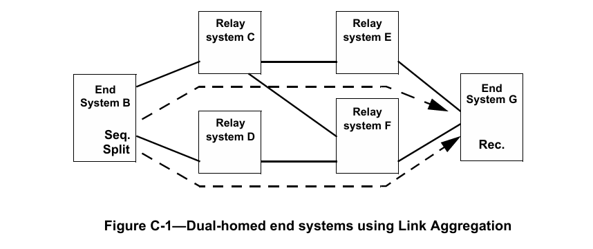

在该示例中，两个终端系统均结合使用IEEE 802.1AX链路聚合和FRER，将各自的两个端口连接到单个协议栈，如图C-2（终端系统B）和图C-3（终端系统G）所示。在终端系统B中，每个数据包被复制并分配两个不同的stream_handle子参数值，这两个stream_handle使两个数据包被分配两个不同的VLAN ID。基于这些VLAN ID，链路聚合在不同的物理端口上传输这两个数据包。IEEE Std 802.1AX-2014的分布式弹性网络互连（DRNI）功能允许每个终端系统的聚合在两个中继系统中终止。

在该示例中，双端口终端系统从不将数据包从一个端口中继到另一个端口；它们严格作为终端系统，从不充当中继系统。有关使用其他方法构建终端系统的类似示例，见C.2和C.6。

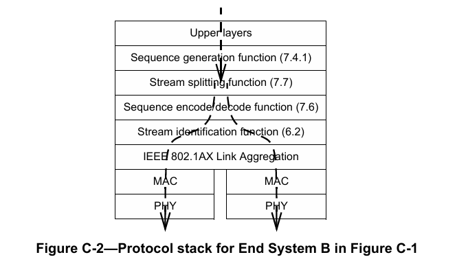

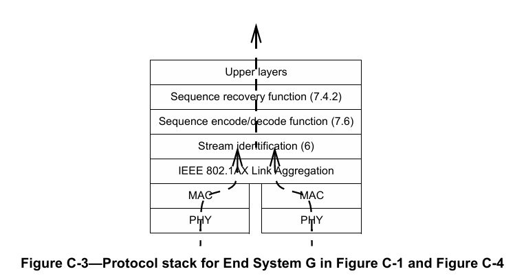

## C.2 示例2：多种栈位置
图C-4展示了一个为单个复合流使用FRER的简单网络，其中中继系统作为无FRER功能的终端系统的代理（见7.1.1中的h项）。图中的数字（1、2、3）对应7.1.1中e项的部署位置。“拆分（Split）”表示通过普通网桥多播机制将复合流拆分为两个流，输出时通过流标识功能修改{VLAN，目的地址}（不使用流拆分功能（7.7））；“序列生成（Seq.）”和“序列恢复（Rec.）”表示排序功能作用于传输数据包（序列生成）或接收数据包（序列恢复）。

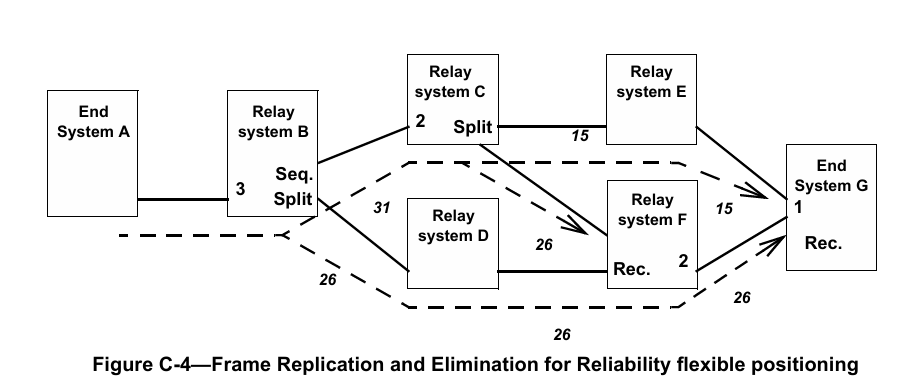

在图C-4中，终端系统A传输流但无FRER功能。中继系统B通过对数据包进行排序并将其拆分为成员流26和31，分别发送到中继系统C和D，从而将该流转换为复合流。中继系统C进一步将该流拆分为流15和26，分别发送到中继系统E和F（无需排序，数据包已由中继系统B排序）。中继系统F合并来自中继系统C和D的两个成员流26，在流26上向终端系统G输出每个数据包的单个副本。终端系统G合并剩余的两个成员流15和26，并丢弃重复数据包。

注：在该示例中，线路上显示的stream_handle值在系统间中继，仅为示例方便。在实际网络中，stream_handle是仅在系统内部有意义的任意整数，各系统中的流标识功能（6.2）将其映射到外部表示或从外部表示映射而来。该外部表示可以但不一定包含与stream_handle子参数对应的显式字段。

图C-5展示了图C-4中的中继系统B。数据包从左侧的终端系统A进入后，首先通过流标识功能[IP流标识（6.7）]识别流。流传输功能将包含所有TSN参数（包括stream_handle子参数）的数据包传递到序列生成功能（7.4.1，图C-4中标记为“Seq.”），该功能添加序列号子参数，其值为稳步递增的整数序列（以承载序列号的数据包字段大小为模）。序列编码/解码功能（7.6）将序列号子参数封装到数据包中。流标识功能[此次为主动目的MAC和VLAN流标识（6.6）]修改两个数据包的目的MAC地址和VLAN，以便通过桥接网络进行识别。中继系统B的转发功能随后在两个不同的端口上输出这两个数据包。数据包的外部形式标记不同，如图C-4中的斜体数字26和31所示。

图C-6展示了图C-4中的中继系统C。流31上的数据包从左侧的中继系统B进入。输出时，它们首先通过被动流标识（第6章）功能识别流。流传输功能将包含所有TSN参数（包括stream_handle子参数）的数据包传递到主动流标识（第6章）功能。无需排序功能、序列生成功能或序列恢复功能，因为数据包已（由中继系统B）排序且无需丢弃任何数据包。流标识在两个输出端口（图C-6中仅显示一个输出端口）上以不同方式封装这两个数据包，将其标记为属于流15和26，中继系统C的转发功能随后在两个不同的端口上输出这两个数据包。

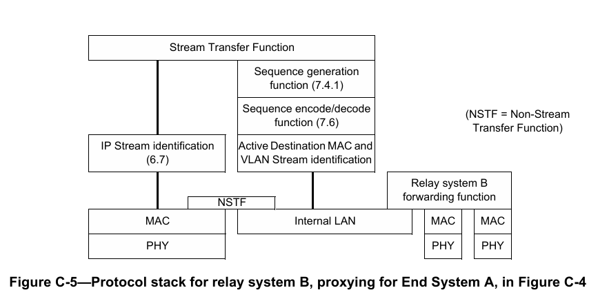

图C-7展示了图C-4中的中继系统F。在这种情况下，TSN层位于输出端口而非输入端口（与中继系统B的情况不同）。来自两个流26的数据包因均输出到同一端口而自然合并。在该端口上，流标识功能为它们分配相同的stream_handle子参数，有效地将其合并为单个流。序列编码/解码功能（7.6）从数据包中提取序列号子参数，以便序列恢复功能（7.4.2）丢弃重复数据包。流传输功能将所有这些参数传递到排序功能和流标识功能，这些功能对数据包重新封装，将其全部标记为属于流26（与接收时相同）。与图C-5不同，该特定示例中不执行流标识功能的转换。

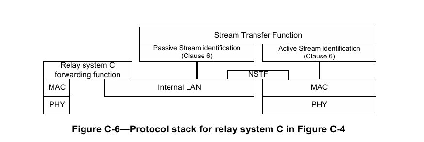

最后，图C-4右侧终端系统G的协议栈如图C-3所示。在该示例中，假设中继系统E和F使用IEEE 802.1AX分布式弹性网络接口（DRNI），终端系统G使用IEEE 802.1AX链路聚合，使终端系统G的两个物理端口（尽管连接到两个不同的中继系统）在网络中表现为单个端口。流15和26上的数据包通过链路聚合合并。流标识功能为两个流的数据包分配相同的stream_handle子参数，有效地将其合并为单个流。然后，它们通过序列恢复功能，该功能删除重复数据包后交付给上层。有关发送方的类似示例，见图C-2；有关另一种类型的双端口终端系统，见C.6。

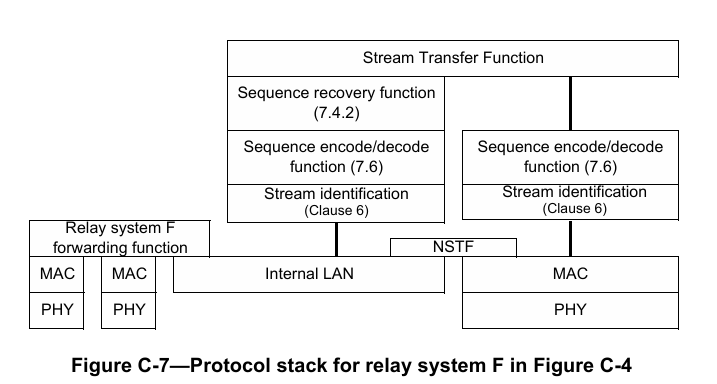

## C.3 示例3：阶梯冗余
图C-8展示了一个实现“阶梯冗余”的网络。该网络在发生多重故障时仍能继续运行，因为流被反复拆分和重新合并。

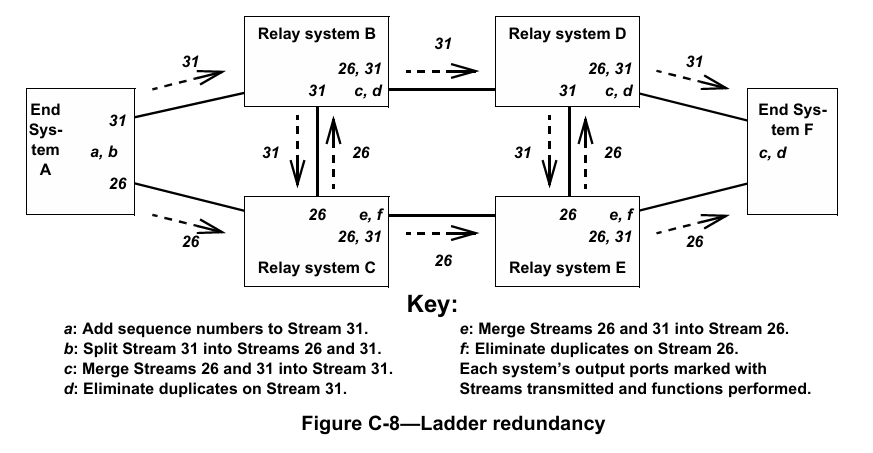

在图C-8中，发送方终端系统对数据流31进行排序，然后将其拆分为两个数据流26和31，分别通过其两个端口发送。网络“阶梯”有两个“轨道”：上轨道（中继系统B和D）和下轨道（中继系统C和E）；“梯级”是连接B-C和D-E的链路。每个中继系统将从左侧轨道接收的流既沿轨道向右发送，又通过梯级向上或向下发送；仅将从中继系统接收的数据包沿轨道向右发送。在轨道的每个输出端口，终端系统均具备序列恢复功能（7.4.2）以消除重复数据包。

图C-8中的每个中继系统均使用图C-7所示的协议栈。

## C.4 示例4：多播树
图C-9展示了一个多播FRER应用。每个流均为多播流。从发送方到每个接收方有两条路径；任何单个故障都不会中断到任何中继系统的两条路径。推测每个中继系统在通往每个接收方的每个端口上均具备序列恢复功能（7.4.2），因此每个接收方仅接收流的每个数据包的一个副本。

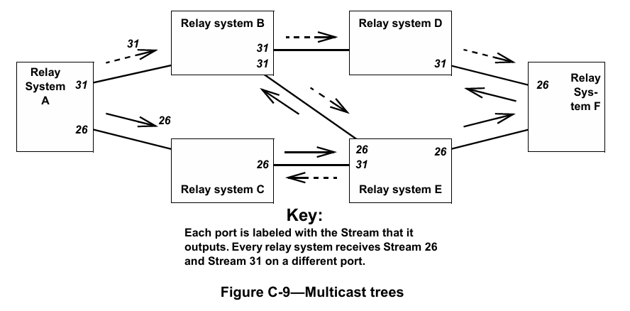

注：读者可能会发现，图C-9中并非所有链路上的数据包都被复制两次。无需在每条链路上使用两次；只需将每个数据包两次发送到每个中继系统即可。

## C.5 示例5：协议互通
图C-10展示了中继系统一个端口中的简单协议互通功能。在该示例中，流传输功能的两条支路使用两种不同的封装方案1和2，因此数据包通过该端口时从一种封装转换为另一种封装。图中未显示其他功能（例如序列恢复功能（7.4.2）），但这些功能完全允许存在。如果这是连接到终端系统的网桥端口，封装1可以是主动目的MAC和VLAN流标识（6.6），封装2可以是IP流标识（6.7）。对于终端系统而言，最终结果可能是将特定的单播IP流转换为使用特定的多播目的地址和VLAN，以便通过桥接网络中的特定路径引导数据包。推测流另一端的类似互通对将把数据包恢复为其原始目的MAC地址和VLAN。

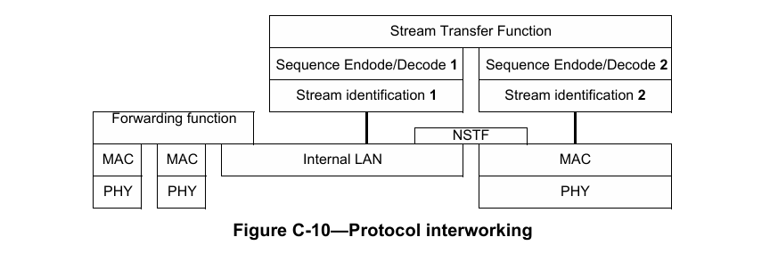

## C.6 示例6：链式双端口终端系统
图C-11展示了一个为单个复合流使用FRER的简单网络。在该示例中，所有FRER功能均局限于两个终端系统B和G。“序列生成（Seq.）”和“序列恢复（Rec.）”表示排序功能作用于传输数据包（序列生成）或接收数据包（序列恢复）。与C.1中的示例不同，该示例中的两个终端系统均为复合系统；每个系统使用单独的单端口终端系统（B1、G1）连接到三端口FRER C组件（B2、G2），以将各自的两个端口连接到单个协议栈，如图C-12所示。

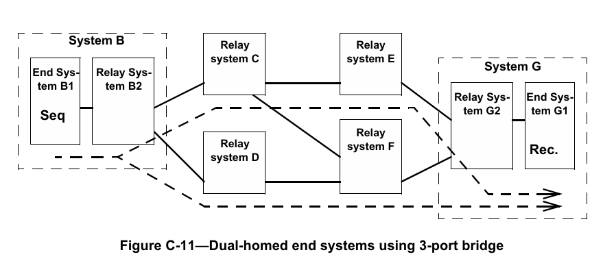

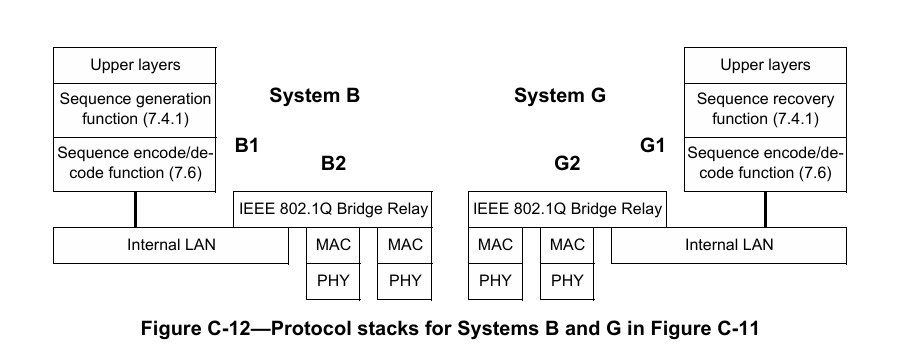

在该示例中，假设所有中继系统均为FRER C组件，且网络已配置为：
a) 流数据包携带多播目的MAC地址；
b) 网桥B2已配置为在两个端口上传输（多播）成员流；
c) 其他网桥（尤其是G2）已配置为允许两个成员流进入网桥G2，但网桥G2仅将流传递到终端系统G1（即打破多播树的常规规则）。

在该配置下，终端系统B1无需流拆分功能（7.7）；数据包复制由其关联的中继系统B2中的多播转发功能处理。

与C.1中的示例不同，双端口复合终端系统的网桥功能（B2、G2）需要在网络中充当网桥，运行协议并转发数据包。

## C.7 注意事项
当显式路径创建与自动网络转发（例如IEEE Std 802.1Q定义的转发）结合使用时，存在明显的环路风险。图C-13显示了在中继系统D中建立的显式树（虚线箭头），该树将特定流发送到中继系统B和终端系统F（可能曾经发送方连接到中继系统D，接收方朝向B和F）。现在，终端系统A开始沿IEEE 802.1Q生成树传输该流。当该流到达中继系统D时，它被导向回中继系统B，导致流环路，数据包不断倍增直至带宽饱和。此外，若这是桥接网络，中继系统B（网桥）将学习到关于流源端路径的冲突信息；系统A的源MAC地址既从终端系统A接收，也从中继系统D接收。

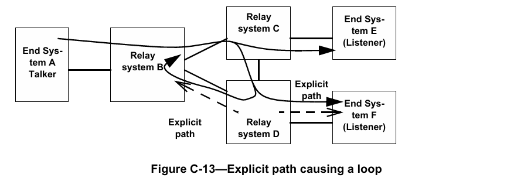

为避免桥接网络中的这种情况，设置显式路径的应用程序或人员可对其进行配置，使其端到端保持在与不遵循显式路径的流量分离的VLAN上。在显式路径VLAN上，不执行源学习，过滤数据库中未找到的目的地址将被丢弃而非泛洪。

## C.8 平衡标签插入与移除
序列编码/解码功能通常会向数据包添加某些内容。例如，7.8中描述的R-TAG添加6个字节。在并非所有终端系统都包含序列编码/解码功能（7.6）的网络中，可在缺乏该层的终端系统相邻的中继系统中配置该功能的实例，以便在将数据包交付给终端系统之前从中移除额外信息（例如R-TAG）。若未移除标签且终端系统无序列编码/解码功能，该终端系统将无法解析接收的数据包。网络管理员和/或配置管理软件需确保不会发生此类情况。

## C.9 FRER与预留带宽
满足零拥塞丢失目标（7.1.1中的k项）可能需要延迟数据包转发。问题在于，复合流中数据包所采用的不同路径到达各个序列恢复功能（7.4.2）的时间可能不同。若这些时间差异很大，且较快路径发生故障后恢复，接收序列恢复功能可能会面临双倍速率的数据包负载，所有这些数据包都必须交付。

例如，图C-14展示了一个网络，其中两个成员流通过序列恢复功能合并为单个流。两条路径长度不同，通常一条路径上的在传数据包比另一条路径多40个。

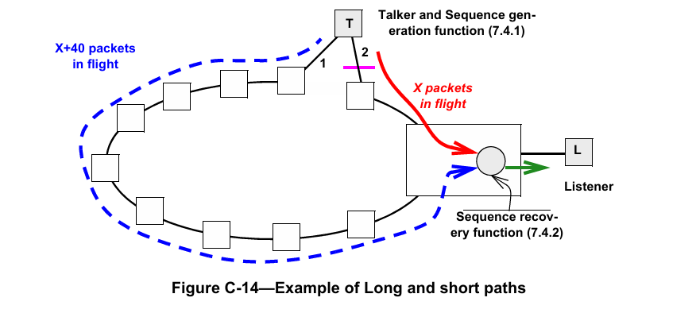

让我们分析图C-14中链路2发生故障然后恢复的假设事件序列。在以下列表中，通过链路2（短路径）的数据包序列号以斜体表示，被序列恢复功能丢弃的数据包标记为星号（*）：
a) 网络处于稳定状态。序列恢复功能接收数据包：1040、1000*、1041、1001*、1042、1002*……
即，除偶尔的随机数据包丢失（未显示）外，通过短路径（链路2）的数据包被传递，通过长路径（链路1）的数据包被丢弃。
b) 一段时间后（4000个数据包后）链路2发生故障。序列恢复功能接收：5040、5000*（故障发生）、5001*、5002*……
即，至少在一段时间内，无数据包被传递；慢路径上的数据包已被接收过。
c) 丢弃持续进行，无数据包传递，直至慢路径上的积压数据包清空：5038*、5039*、5040*、5041、5042、5043……
然后恢复正常输出速率，所有数据包均来自长路径（链路1）。
d) 当短路径（链路2）恢复时（3000个数据包后），序列恢复功能接收：7998、7999、（链路恢复）8040、8000、8041、8001、8042、8002……
注：此时序列恢复功能以两倍于正常速率传递数据包，直至长路径（链路1）上40个数据包的积压全部传递完毕。
e) 最后，积压数据包传输完成，序列恢复功能恢复正常输出速率，传递来自短路径（链路2）的数据包并丢弃来自长路径（链路1）的数据包：8078、8038、8079、8039、8080、8040*、8081、8041*、8082、8042*……

零拥塞丢失目标（7.1.1中的k项）可能要求在某个观察间隔（小于80个数据包突发传输时间）内以固定的最大速率向接收方输出数据包（例如，见IEEE Std 802.1Q-2014的第34章和第35章）。在这种情况下，需要在序列恢复功能处或其附近对该突发数据包进行缓冲（从而延迟）。

此类缓冲和/或延迟超出本标准的范围。然而，我们可以观察到，由于该问题，当采用带宽预留时，FRER为防止拥塞丢失所需的额外缓冲可基于复合流的带宽以及两条（或多条）成员流路径上最坏情况下的交付延迟差异，与非FRER情况所需的缓冲分开计算。

## C.10 独立恢复功能的使用
独立恢复功能在7.5中描述，采用独立恢复功能的示例网络如图7-3所示。独立恢复功能的主要用途是防止在复合流的某个成员流发生故障（导致重复发送相同数据包）时传输过期数据。假设在图7-3中，最左侧的系统在其上端端口发生故障，在成员流1上反复发送序列号为5的数据包。接收成员流1和2的两个系统中的序列恢复功能（7.4.2）将丢弃重复数据包，直至正常成员流2上的序列号子参数在65536个数据包后循环。之后，先接收到的序列号为5的数据包（可能是新的、正常的成员流2的数据包5，或旧的、故障的成员流1的数据包5）将被中继到下一阶段。若如图中接收该流的两个系统中的三角形所示，为成员流1配置独立恢复功能，则第一个序列号为5的数据包之后的所有此类数据包都将在那里被丢弃，永远不会到达序列恢复功能。

## C.11 自动配置的使用
可通过第9章和第10章中的被管理对象配置每个流上FRER操作的所有细节。然而，在网络中的多个流上使用FRER通常具有足够的规律性，因此可使用自动配置（7.11）。在给定的中继系统或终端系统中使用自动配置分为四个步骤：
a) 确定成员流数据包将在哪些端口上接收和传输，使用不需要主动流标识功能的所需转换（C.11.1）；
b) 确定哪些数据包可触发自动配置（C.11.2）；
c) 确定每个端口上输入和输出时将使用哪种序列号子参数编码方法（C.11.3）；
d) 确定是否自动实例化独立恢复功能、序列恢复功能或两者，并确定每个实例化将使用的控制参数（C.11.4）。

注：尽管以下示例描述了HSR/PRP与R-TAG之间的互操作性，但定义自动配置的主要原因并非此类互操作性。自动配置极大地简化了仅使用R-TAG的网络所需的配置量。

### C.11.1 成员流的路由和标记
图C-15展示了一个包含四个成员流（构成复合流）的示例网络。该示例与图7-3所示示例类似。

通常，成员流通过网络的路径选择不由FRER决定，而由其他标准决定。自动配置不提供建立主动流标识功能以执行按流标识转换的方法。在图C-15中，为便于示例，假设成员流1和成员流2均具有相同的目的MAC地址，但位于两个专用VLAN 1000和1001上，这些VLAN在该网络中专门用于完全管理的固定路径（即这些VLAN不受IEEE Std 802.1Q中定义的拓扑协议控制）。进一步假设成员流3和成员流4类似，但均使用相同的VLAN 2000（推测该VLAN上禁用源地址学习）。

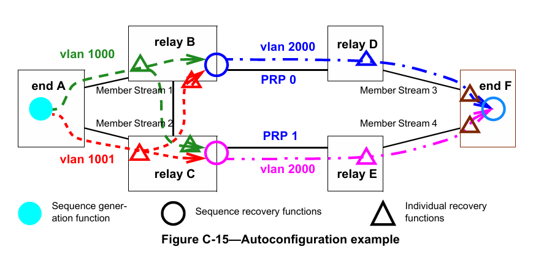

观察图C-15中的中继系统B，可见成员流3中的所有数据包均需在VLAN 2000上输出，并带有指定LanId 0的PRP序列尾部。这意味着中继系统B中序列恢复功能接受的来自成员流1和2的数据包必须从VLAN 1000或1001转换为VLAN 2000输出。7.11的自动配置功能不会自动设置或更改VLAN标识符。中继系统B必须配置为在其右侧端口上执行VLAN ID转换，将输出时的VLAN 1000和VLAN 1001均转换为VLAN 2000。若存在大量复合流，推测它们将共享相同的VLAN分配，从而利用相同的VLAN转换。IEEE 802.1Q网桥具备此类VLAN ID转换功能。

尽管图C-15中未显示，但我们可假设图右侧存在发送方、左侧存在接收方的流。此时，中继系统B的左侧和底部端口需要额外的VLAN映射，以将VLAN 2000映射到VLAN 1000和VLAN 1001。若VLAN情况明显更复杂，则该网络可能不适合自动配置。

### C.11.2 识别触发自动配置的数据包
在图C-15的示例中，仅考虑中继系统B以及沿成员流1和2相同路由的数据包。在这种情况下，预计中继系统B仅在其左侧和底部端口上接收适合自动配置的数据包，所有这些数据包均使用R-TAG（7.8）编码。因此，管理员将在序列自动配置表中构建frerAutSeqEntry（10.7.1.1），指定这些端口上VLAN 1000和1001的该标签。当接收到匹配的数据包时，该条目将使用源MAC和VLAN流标识（6.5）在序列标识表（10.5）中创建tsnStreamIdEntry（9.1.1）。由于R-TAG未指示数据包属于哪个成员流，因此该条目绑定到接收数据包的端口和VLAN。通过这种方式，来自终端系统A且沿成员流1路径的所有成员流被分配一个stream_handle，沿成员流2路径的所有成员流被分配第二个stream_handle。

同样，我们可假设图C-15右侧存在发送方、左侧存在接收方的流。此时，序列自动配置表中需要第二个frerAutSeqEntry，以识别从中继系统B右侧端口进入的数据包并触发自动配置，在序列标识表中创建条目。该单个条目指定使用PRP序列尾部编码的数据包（C.11.3中进一步解释），并包括所有PRP端口（本示例中仅一个）。该条目为HSR或PRP创建的tsnStreamIdEntry为数据包分配的stream_handle不绑定到接收数据包的端口和VLAN，而是绑定到该tsnStreamIdEntry涵盖的所有端口以及数据包中包含的LanId或PathId。即，HSR序列标签或PRP序列尾部的内容覆盖端口号。

### C.11.3 按端口数据包解码和编码
图C-15的示例还展示了自动配置的第二个用途。在该网络中，中继系统B和C右侧的所有设备（包括中继系统B和C的最右侧端口）使用PRP序列尾部（7.10），而中继系统A、B和C左侧的所有端口使用R-TAG（7.8）。中继系统B向右传输的数据包以及系统D和系统F上端端口传输的所有数据包均标记为LanId 0，图右侧其他端口传输的数据包标记为LanId 1。中继系统B和C的任何其他端口或系统A传输的数据包使用R-TAG。这些区别通过输出自动配置表（10.7.2）实现。使用该表，每个端口被分配输出封装，包括PRP或HSR各自的LanId或PathId。同样，若使用过于复杂（例如一个流在某个端口上为LanId 0，而另一个流在该同一端口上为LanId 1），则无法使用自动配置。

注：管理员可在中继系统D和E的序列自动配置表和输出自动配置表中进行配置，以在R-TAG、HSR序列标签和PRP序列尾部之间进行转换，实现互操作性，即使这些中继系统中不需要独立恢复功能或序列恢复功能。

### C.11.4 独立恢复功能和序列恢复功能
根据C.11.1、C.11.2和C.11.3中的说明，读者可查阅7.11.2，了解自动配置如何配置独立恢复功能和序列恢复功能。它们与输入（被动）流标识功能一起，通过序列自动配置表（10.7.1）中的条目设置。读者可能发现以下事实有所帮助：
a) 为与自动创建的tsnStreamIdEntry（9.1.1）相关联的每个stream_handle最多实例化一个独立恢复功能实例；
b) 为每个复合流在每个预期输出端口（frerAutSeqRecoveryPortList，10.7.1.1.5）上实例化一个序列恢复功能实例；
c) 通过将具有相同源MAC地址和VLAN ID的成员流相关联来推断复合流。

# 附录D（资料性）参考文献
参考文献提供了补充性或辅助性资料，但并非理解或实现本标准所必需。引用这些资料仅为提供信息参考。

[B1] IEEE Std 802.1BA™-2011，《IEEE局域网和城域网标准 - 音视频桥接（AVB）系统》¹²¹³  
[B2] IEEE Std 802.3™，《IEEE以太网标准》  
[B3] IEEE Std 1722™-2016，《IEEE桥接局域网中时间敏感应用的传输协议标准》  
[B4] IETF RFC 3985，Bryant, S.（编辑）、P. Pate（编辑），《端到端伪线仿真（PWE3）架构》，DOI 10.17487/RFC3985，2005年3月¹⁴  

¹² 附录D中提及的IEEE标准或产品是电气和电子工程师协会（IEEE）的注册商标。  
¹³ IEEE出版物可通过电气和电子工程师协会获取（网址：http://standards.ieee.org）。  
¹⁴ IETF文档（即RFC文档）可从以下网址下载：http://www.rfc-archive.org/。  
