# IEEE 标准 802.1Qav™-2009
（对 IEEE 标准 802.1Q™-2005 的修订）

# 局域网和城域网标准——虚拟桥接局域网
## 修订版 12：时间敏感流的转发和排队增强
### 主办机构
IEEE 计算机协会 局域网/城域网标准委员会

### 批准日期
2009年12月9日

### 发布日期
2010年1月5日

**摘要**：本对 IEEE 标准 802.1Q 的修订版，定义了对虚拟局域网（VLAN）桥接器转发和排队功能的增强，以支持时间敏感数据流的传输。

**关键词**：桥接局域网、局域网（LAN）、媒体访问控制（MAC）桥接器、城域网、时间敏感数据流、虚拟桥接局域网（虚拟局域网）

美国电气和电子工程师协会
地址：美国纽约州纽约市公园大道3号，邮编10016-5997

版权所有 © 2010 美国电气和电子工程师协会。保留所有权利。
2010年1月5日出版，美国印刷。

IEEE 和 802 是美国专利商标局注册的商标，归美国电气和电子工程师协会所有。

**PDF 版 ISBN**：978-0-7381-6143-3（标准编号：STD96007）
**印刷版 ISBN**：978-0-7381-6144-0（标准编号：STDPD96007）

本出版物的任何部分，不得以任何形式、在电子检索系统中或通过其他方式复制，除非事先获得出版商的书面许可。

---

## 重要声明
本标准并非旨在确保所有情况下的安全、安保、健康或环境保护。标准的实施者有责任确定适当的安全、安保、环境和健康实践或法规要求。

本 IEEE 文档的使用需遵守重要声明和法律免责声明。这些声明和免责声明包含在所有包含本文档的出版物中，可在“重要声明”或“关于 IEEE 文档的重要声明和免责声明”标题下找到。也可应要求从 IEEE 获取或在以下网址查看：http://standards.ieee.org/IPR/disclaimers.html。

---

## 编辑说明
本修订版规定了对 IEEE 标准 802.1Q™ 中描述的转发和排队功能的修改。修改适用于 IEEE 标准 802.1Q-2005 的基础文本，并结合了在本修订版批准时已获批准但尚未纳入标准基础文本的那些修订版，即（按时间顺序）：IEEE 标准 802.1ad™、IEEE 标准 802.1ak™、IEEE 标准 802.1ag™、IEEE 标准 802.1ah™、IEEE 标准 802.1Q-2005/Cor 1、IEEE 标准 802.1ap™、IEEE 标准 802.1Qaw™、IEEE 标准 802.1Qay™ 以及 IEEE 标准 802.1aj™。

本修订版中以粗斜体显示的文本，定义了对该基础文本进行修改所需的编辑说明。使用三种编辑说明：修改、删除和插入。“修改”用于更改现有内容，编辑说明会指明修改位置并描述修改内容；对现有文本的修改可能会通过删除线标记旧内容、下划线标记新内容的方式进行说明。“删除”用于移除现有内容。“插入”用于添加新内容，且不改变现有内容；插入操作可能需要重新编号，若有需要，会在编辑说明中给出编号规则。编辑说明不会保留到未来的 IEEE 标准 802.1Q 版本中。

---

# 1. 概述
## 1.1 范围
在 1.1 末尾插入以下文本，并根据需要重新编号列表项和注释：

本标准允许桥接器为时间敏感型（即有界延迟和延迟变化）、对丢失敏感的实时音频视频（AV）数据流传输（AV 流量）提供性能保证。它规定了优先级再生和受控带宽队列排空算法。虚拟局域网（VLAN）标签编码的优先级值被集中分配，用于在支持 AV 流量的队列和支持非 AV 流量的队列之间分离帧，从而允许在有线和无线局域网之间及内部同时支持 AV 流量和其他桥接流量。为此，本标准：

a) 定义状态参数，用于识别和维护流预留协议（SRP，见第 35 条¹）域（6.6.4）的边界；

b) 规定在 SRP 域边界端口接收的帧中的优先级信息如何再生；

> 注 1：从 SRP 域外传输到 SRP 域内桥接器的帧中的优先级会被重新映射，以确保与预留无关的流量不会干扰与预留相关的流量。因此，进入 SRP 域且使用与预留流量类别相关联的优先级编码点值的流量，将被重新映射到与预留流量类别无关联的优先级编码点值²。

c) 规定如何使用优先级信息来确定时间敏感流所要使用的流量类别；

d) 定义一种基于信用的整形器算法，以根据流预留对流量进行整形。

> 注 2：基于信用的整形器算法在出站队列上运行；为支持时间敏感 AV 流量而规定的机制不涉及任何形式的入站计量或 policing（流量监管）。

¹ 第 35 条在本标准发布时仍是处于开发阶段的草案标准 IEEE P802.1Qat™ [B31] 中定义。
² 文本、表格和图中的注释仅为提供信息，不包含实施该标准所需的要求。

---

# 2. 规范性引用文件
在第 2 条中按适当的排序插入以下引用文件：

IEEE 标准 802.1AX™-2008，《局域网和城域网标准——链路聚合》。

---

# 3. 定义
在第 3 条的第一段之后立即插入以下文本：

本标准使用 IEEE 标准 802 中定义的以下术语：
- 终端站（end station）
- 站（station）

在第 3 条中按字母顺序插入以下定义，并根据需要重新编号现有定义：

## 3.1 音频视频（AV）流量（audio video (AV) traffic）
与音频和/或视频应用相关联的流量，对传输延迟和延迟变化敏感，且对于某些应用而言，对数据包丢失也敏感。

## 3.2 延迟（latency）
帧在网络中从两点之间传播过程中经历的延迟，从帧中的某个已知参考点经过第一个点的时间开始，到该帧中的同一参考点经过第二个点的时间结束进行测量。

> 注 1：延迟有时也称为帧延迟。
> 注 2：本标准中使用的“帧”指数据帧，而非视频帧。

## 3.3 流预留（SR）类别（stream reservation (SR) class）
可为 AV 流量预留带宽的流量类别。每个 SR 类别都关联一个优先级值。SR 类别用连续的字母表示，从 A 开始，最多可包含 7 个类别。

## 3.4 流预留协议（SRP）域边界端口（Stream Reservation Protocol (SRP) domain boundary port）
某站的一个端口，该端口属于某个给定 SR 类别的 SRP 域，且通过单个局域网连接到另一个站的端口，该另一个站的端口要么属于该 SR 类别的不同 SRP 域，要么不属于任何 SRP 域。

> 注：SRP 域的术语在 6.6.4 中定义。

## 3.5 流预留协议（SRP）域核心端口（Stream Reservation Protocol (SRP) domain core port）
某站的一个端口，该端口属于某个给定 SR 类别的 SRP 域，且通过属于活动拓扑的单个局域网连接到同一 SR 类别的 SRP 域中另一个站的端口。

> 注：SRP 域的术语在 6.6.4 中定义。

## 3.6 时间敏感流（time-sensitive stream）
要求以有界延迟交付的数据帧流。

---

# 4. 缩写词
在第 4 条中按字母顺序插入以下缩写词：

<table>
  <tr>
    <td>AV</td>
    <td>audio/video（音频/视频）</td>
  </tr>
  <tr>
    <td>AVB</td>
    <td>audio/video bridging（音频/视频桥接）</td>
  </tr>
  <tr>
    <td>CSN</td>
    <td>Coordinated Shared Network（协调共享网络）</td>
  </tr>
  <tr>
    <td>FQTSS</td>
    <td>Forwarding and Queuing Enhancements for time-sensitive streams（时间敏感流的转发和排队增强）</td>
  </tr>
  <tr>
    <td>SR</td>
    <td>stream reservation（流预留）</td>
  </tr>
  <tr>
    <td>SRP</td>
    <td>Stream Reservation Protocol（流预留协议）</td>
  </tr>
  <tr>
    <td>TSpec</td>
    <td>traffic specification（流量规范）</td>
  </tr>
</table>

---

# 5. 一致性
## 5.4.1 支持 VLAN 的桥接器组件选项
在现有项目 o) 之后插入新的项目 p)，如下所示：

p) 支持时间敏感流的转发和排队（5.4.1.5）。

在现有 5.4.1.4 之后插入新的 5.4.1.5，如下所示：

### 5.4.1.5 时间敏感流的转发和排队——要求
符合本标准中时间敏感流转发和排队相关规定的支持 VLAN 的桥接器组件实现，应满足：

a) 在所有端口上支持至少两个流量类别，其中：
1) 至少一个流量类别支持严格优先级算法用于传输选择（8.6.8.1）；
2) 一个流量类别为 SR 类别。

b) 在所有端口上支持基于信用的整形器算法（8.6.8.2），并将其用作 SR 类别的传输选择算法。

c) 支持 6.9.4 中定义的 SRP 域边界端口优先级再生覆盖功能，以及表 6-6 中定义的针对 SR 类别“B”的默认优先级再生覆盖值。

d) 支持 34.5 中定义的用于将优先级映射到流量类别的表格和过程。

符合本标准中时间敏感流转发和排队相关规定的支持 VLAN 的桥接器组件实现，可选择满足：

e) 通过 17.7.13 中定义的简单网络管理协议（SNMP）管理信息库（MIB）模块，支持 12.21 中定义的管理实体。

f) 支持两个或更多 SR 类别（最多 7 个），并在所有端口上支持基于信用的整形器算法（8.6.8.2），将其用作这些 SR 类别的传输选择算法；支持的 SR 类别数量应在协议实现一致性声明（PICS）中说明。

g) 支持 6.9.4 中定义的 SRP 域边界端口优先级再生覆盖功能，以及表 6-6 中定义的针对 SR 类别“A”的默认优先级再生覆盖值；如果支持两个以上的 SR 类别，额外 SR 类别的默认优先级再生覆盖值应在 PICS 中说明。

在现有 5.17 之后插入以下新的子条款，并根据需要重新编号：

## 5.18 终端站要求——时间敏感流的转发和排队
符合本标准中时间敏感流转发和排队相关规定的终端站实现，应满足：

a) 在所有端口上支持至少两个流量类别，其中：
1) 至少一个流量类别支持严格优先级算法用于传输选择（8.6.8.1）；
2) 一个流量类别为 SR 类别。

b) 支持基于信用的整形器算法（8.6.8.2），将其用作与 SR 类别相关联的每个流所传输帧的传输选择算法。

c) 在所有端口上支持基于信用的整形器算法（8.6.8.2），并将其用作 SR 类别的传输选择算法。

d) 使用表 6-6 中所示的与 SR 类别“B”相关联的默认优先级，作为传输的 SR 类别“B”数据帧中携带的优先级值。

符合本标准中时间敏感流转发和排队相关规定的终端站实现，可选择满足：

e) 支持两个或更多 SR 类别（最多 7 个），并在所有端口上支持基于信用的整形器算法（8.6.8.2），将其用作这些 SR 类别的传输选择算法；支持的 SR 类别数量应在 PICS 中说明。

f) 使用表 6-6 中所示的与 SR 类别“A”相关联的默认优先级，作为传输的 SR 类别“A”数据帧中携带的优先级值；如果支持两个以上的 SR 类别，额外 SR 类别传输的数据帧中携带的优先级值应在 PICS 中说明。

---

# 6. 对媒体访问控制（MAC）服务的支持
## 6.6 内部子层服务（Internal Sublayer Service）
插入新的 6.6.4，如下所示：

### 6.6.4 流预留协议（SRP）域状态参数
流预留协议（SRP）域是一组站（终端站和/或桥接器）、它们的端口以及连接的单个局域网的集合，对于给定的 SR 类别，需满足以下所有条件：

a) 所有传输流的站，都支持基于信用的整形器算法（定义于 8.6.8）作为该 SR 类别的传输选择方法；

b) 所有站都支持 SRP（定义于第 35 条），将其用作该 SR 类别的带宽预留方式；

c) 所有传输流的站，都为该 SR 类别关联相同的优先级值；

d) 该集合中的每个端口要么是 SRP 域核心端口，要么是 SRP 域边界端口；

e) 该集合中的每个 SRP 域核心端口，都通过属于活动拓扑的单个局域网，连接到该集合中另一个站的 SRP 域核心端口。

在支持流预留协议（SRP）的桥接器中，对于该桥接器支持的每个 SR 类别，桥接器的每个端口都关联一个 SRP 域边界端口（SRPdomainBoundaryPort）参数。

每个 SRP 域边界端口（SRPdomainBoundaryPort）参数都有一个布尔值。对于给定的 SR 类别，如果 SRP 的运行确定该端口是该 SR 类别的 SRP 域边界端口（3.4），则 SRP 域边界端口（SRPdomainBoundaryPort）参数的值为 TRUE；否则，该端口要么是该 SR 类别的 SRP 域核心端口（3.5），要么不属于该 SRP 域，此时 SRP 域边界端口（SRPdomainBoundaryPort）参数的值为 FALSE。

## 6.9 对增强型内部子层服务（EISS）的支持
### 6.9.4 优先级再生
修改 6.9.4，并插入新的表 6-6，同时对后续表格重新编号，如下所示：

每个接收帧的优先级，通过帧中包含的优先级信息和接收端口的优先级再生表进行再生。对于每个接收端口，优先级再生表包含 8 个条目，对应 8 种可能的优先级值（0 至 7）。每个条目针对给定的接收优先级值，指定相应的再生值。

对于未标记帧，在相应的 M_UNITDATA.indication（MAC 服务数据单元指示）中用信号表示的优先级参数，被视为接收优先级；对于标记帧，在标签头部的优先级编码点（PCP）字段中用信号表示的优先级，被视为接收优先级。

> 注 1：IEEE 802 局域网技术最多用信号表示 8 个优先级值。附录 G 进一步说明了优先级值的使用及其如何映射到流量类别。

表 6-5 规定了针对 8 种可能的接收优先级值的默认再生优先级值。这些默认值应用作每个端口的优先级再生表相应条目的初始值。

优先级再生表中的值可通过管理进行修改（如第 12 条所述）。如果提供此功能，表条目的值应可针对每个接收端口和每个接收优先级值独立设置，且桥接器应能够使用表 6-5 中规定的参数范围内的所有值。

<table>
  <caption>表 6-5 优先级再生</caption>
  <tr>
    <td>接收优先级</td>
    <td>默认再生优先级</td>
    <td>范围</td>
  </tr>
  <tr>
    <td>0</td>
    <td>0</td>
    <td>0–7</td>
  </tr>
  <tr>
    <td>1</td>
    <td>1</td>
    <td>0–7</td>
  </tr>
  <tr>
    <td>2</td>
    <td>2</td>
    <td>0–7</td>
  </tr>
  <tr>
    <td>3</td>
    <td>3</td>
    <td>0–7</td>
  </tr>
  <tr>
    <td>4</td>
    <td>4</td>
    <td>0–7</td>
  </tr>
  <tr>
    <td>5</td>
    <td>5</td>
    <td>0–7</td>
  </tr>
  <tr>
    <td>6</td>
    <td>6</td>
    <td>0–7</td>
  </tr>
  <tr>
    <td>7</td>
    <td>7</td>
    <td>0–7</td>
  </tr>
</table>

> 注 2：桥接器内部的优先级再生和映射，应与该优先级在桥接局域网其余部分的端到端重要性保持一致。再生优先级值的用途包括：
> - 通过流量类别表（8.6.6）确定给定出站端口的流量类别；
> - 通过固定的、特定于 MAC 类型的映射（6.7），确定用于某些媒体访问方法的访问优先级。

在支持 SRP 的桥接器中，每个接收端口都维护一个 SRP 域边界端口优先级再生覆盖表。该表将桥接器支持的每个 SR 类别与一个优先级值相关联，并规定当该 SR 类别的 SRP 域边界端口（SRPdomainBoundaryPort）参数值为 TRUE 时，用作再生优先级的值（优先于优先级再生表中的值）。表 6-6 规定了两个 SR 类别（SR 类别 A 和 SR 类别 B）的优先级和默认再生优先级值。如果仅支持 SR 类别 B，则仅使用表中所示的 SR 类别 B 的默认值。

<table>
  <caption>表 6-6 SRP 域边界端口优先级再生覆盖默认值</caption>
  <tr>
    <td>SR 类别</td>
    <td>默认优先级</td>
    <td>SRP 域边界端口的默认再生优先级</td>
    <td>范围</td>
  </tr>
  <tr>
    <td>A</td>
    <td>3</td>
    <td>0</td>
    <td>0–7</td>
  </tr>
  <tr>
    <td>B</td>
    <td>2</td>
    <td>0</td>
    <td>0–7</td>
  </tr>
</table>

SRP 域边界端口优先级再生覆盖表中包含的优先级值，可通过管理进行修改（如第 12 条所述）。如果提供此功能，表条目的值应可针对每个接收端口和每个支持的 SR 类别独立设置，且桥接器应能够使用表 6-6 中规定的参数范围内的所有值。

> 注 3：SRP 域边界端口优先级再生表的默认值，将入站 PCP 值映射到可用的下一个最低优先级，同时保持其余优先级值不变。这种重新映射的结果是，进入 SRP 域且携带与该域相关联的优先级值的流量，在域边界处由桥接器以较低优先级转发。当帧从 SRP 域出站时，无法将这些优先级值映射回其原始值。默认映射基于以下假设：通常使用两个 SR 类别（A 和 B）来支持已预留带宽的流量；如果仅支持较低的类别（B），则不支持的 A 类别的默认覆盖值不适用。
> 注 4：管理可自由修改优先级再生表，这意味着可能会创建导致预留流量和非预留流量共享同一优先级的映射。这将对网络中预留流量的最坏情况延迟产生不可预测的影响。

---

# 7. 桥接器操作原理
## 7.6 转发过程
### 7.6.6 帧排队
修改 8.6.6 的文本，如下所示：

转发过程为排队的帧提供存储，等待提交传输的机会。在同一桥接器端口上接收的帧的顺序，应针对以下情况保持不变：

a) 具有给定 VLAN 标识符（VID）、优先级以及目的地址和源地址组合的单播帧；

b) 具有给定 VID、优先级和目的地址的多播帧。

转发过程为给定的桥接器端口提供一个或多个队列，每个队列对应一个不同的流量类别。每个帧通过该端口的流量类别表和帧的优先级，映射到一个流量类别。流量类别表可通过管理进行配置。表 8-3 展示了在不支持基于信用的整形器传输选择算法（8.6.8.2）的实现中，针对所实现的类别数量的推荐映射。支持基于信用的整形器传输选择算法的实现中，优先级到流量类别的映射要求在 34.5 中定义。最多可支持 8 个流量类别，允许为每个优先级设置单独的队列。

<table>
  <caption>表 8-3 优先级到流量类别的推荐映射</caption>
  <tr>
    <td rowspan="2">优先级</td>
    <td colspan="8">可用流量类别数量</td>
  </tr>
  <tr>
    <td>1</td>
    <td>2</td>
    <td>3</td>
    <td>4</td>
    <td>5</td>
    <td>6</td>
    <td>7</td>
    <td>8</td>
  </tr>
  <tr>
    <td>0（默认）</td>
    <td>0</td>
    <td>0</td>
    <td>0</td>
    <td>0</td>
    <td>0</td>
    <td>1</td>
    <td>1</td>
    <td>1</td>
  </tr>
  <tr>
    <td>1</td>
    <td>0</td>
    <td>0</td>
    <td>0</td>
    <td>0</td>
    <td>0</td>
    <td>0</td>
    <td>0</td>
    <td>0</td>
  </tr>
  <tr>
    <td>2</td>
    <td>0</td>
    <td>0</td>
    <td>0</td>
    <td>1</td>
    <td>1</td>
    <td>2</td>
    <td>2</td>
    <td>2</td>
  </tr>
  <tr>
    <td>3</td>
    <td>0</td>
    <td>0</td>
    <td>0</td>
    <td>1</td>
    <td>1</td>
    <td>2</td>
    <td>3</td>
    <td>3</td>
  </tr>
  <tr>
    <td>4</td>
    <td>0</td>
    <td>1</td>
    <td>1</td>
    <td>2</td>
    <td>2</td>
    <td>3</td>
    <td>4</td>
    <td>4</td>
  </tr>
  <tr>
    <td>5</td>
    <td>0</td>
    <td>1</td>
    <td>1</td>
    <td>2</td>
    <td>2</td>
    <td>3</td>
    <td>4</td>
    <td>5</td>
  </tr>
  <tr>
    <td>6</td>
    <td>0</td>
    <td>1</td>
    <td>2</td>
    <td>3</td>
    <td>3</td>
    <td>4</td>
    <td>5</td>
    <td>6</td>
  </tr>
  <tr>
    <td>7</td>
    <td>0</td>
    <td>1</td>
    <td>2</td>
    <td>3</td>
    <td>4</td>
    <td>5</td>
    <td>6</td>
    <td>7</td>
  </tr>
</table>

> 注：这些映射的基本原理在附录 G（资料性）中讨论。
> 注：不同端口可实现不同数量的流量类别。采用支持单一传输优先级的媒体访问方法（如载波监听多路访问/冲突检测（CSMA/CD））的端口，可支持多个流量类别。

### 7.6.8 传输选择
删除现有的 8.6.8，并插入新的 8.6.8、8.6.8.1、8.6.8.2 以及表 8-4，同时对后续表格重新编号，如下所示：

对于每个端口，根据该端口支持的流量类别以及该端口上相应队列支持的传输选择算法的运行情况，选择要传输的帧。对于给定的端口和支持的流量类别值，仅当满足以下两个条件时，才从相应的队列中选择帧进行传输：

a) 该队列支持的传输选择算法运行后，确定有可传输的帧；

b) 对于该端口支持的每个数值更高的流量类别对应的队列，其支持的传输选择算法运行后，确定没有可传输的帧。

所有桥接器都应支持 8.6.8.1 中定义的严格优先级传输选择算法，并将其作为选择帧进行传输的默认算法。除严格优先级算法外，还可选择支持 8.6.8.2 中定义的基于信用的整形器传输选择算法。作为实现选项，可通过管理方式选择其他传输选择算法，但需满足 8.6.6 中的要求。

给定端口的传输选择算法表，为该端口支持的每个流量类别分配用于从相应队列中选择帧进行传输的传输选择算法。传输选择算法表可通过管理进行配置，并允许标识特定供应商的传输选择算法。传输选择算法在传输选择算法表中通过整数标识符进行标识，如表 8-4 中定义。

<table>
  <caption>表 8-4 传输选择算法标识符</caption>
  <tr>
    <td>传输选择算法</td>
    <td>标识符</td>
  </tr>
  <tr>
    <td>严格优先级（8.6.8.1）</td>
    <td>0</td>
  </tr>
  <tr>
    <td>基于信用的整形器（8.6.8.2）</td>
    <td>1</td>
  </tr>
  <tr>
    <td>预留用于未来标准化</td>
    <td>2–255</td>
  </tr>
  <tr>
    <td>特定供应商</td>
    <td>一个四字节整数，其中最高三位字节为组织唯一标识符（OUI）值，最低位字节为 OUI 所有者分配的 0–255 范围内的整数</td>
  </tr>
</table>

在不支持基于信用的整形器传输选择算法的实现中，传输选择算法表的推荐默认配置是将严格优先级传输选择算法分配给所有支持的流量类别。在支持基于信用的整形器传输选择算法的实现中，传输选择算法表的推荐默认配置在 34.5 中定义。

#### 7.6.8.1 严格优先级算法
对于支持严格优先级传输选择的给定队列，若队列中包含一个或多个帧，则该算法确定有可传输的帧。从队列中选择帧进行传输的顺序，应保持 8.6.6 中规定的排序要求。

#### 7.6.8.2 基于信用的整形器算法
对于支持基于信用的整形器传输选择的给定队列，仅当满足以下所有条件时，该算法才确定有可传输的帧：

a) 队列中包含一个或多个帧；

b) 该队列的传输允许（transmitAllowed）信号为 TRUE。

从队列中选择帧进行传输的顺序，应保持 8.6.6 中规定的排序要求。

支持基于信用的整形器算法运行的每个队列，都关联以下外部参数：

c) 端口传输速率（portTransmitRate）：支持通过该端口传输的底层 MAC 服务提供的传输速率（以比特/秒为单位），该参数的值由 MAC 的运行情况确定；

d) 空闲斜率（idleSlope）：当信用（credit）值增加时（即传输（transmit）为 FALSE 时），信用的变化率（以比特/秒为单位），空闲斜率（idleSlope）的值永远不能超过端口传输速率（portTransmitRate），给定队列的空闲斜率（idleSlope）值由该队列的运行空闲斜率（operIdleSlope(N)）参数值确定（如 34.3 中定义）。

支持基于信用的整形器算法的每个队列，都关联以下内部参数：

e) 传输（transmit）：当从该队列传输帧时，值为 TRUE；当该队列的任何帧传输完成时，值为 FALSE；

f) 信用（credit）：该队列当前可用的传输信用（以比特为单位）；如果在任何时候，队列中没有帧、传输（transmit）参数为 FALSE 且信用（credit）为正数，则将信用（credit）设置为零；

g) 发送斜率（sendSlope）：当信用（credit）值减少时（即传输（transmit）为 TRUE 时），信用的变化率（以比特/秒为单位），发送斜率（sendSlope）的定义如下：
$sendSlope = (idleSlope - portTransmitRate)$

h) 传输允许（transmitAllowed）：当信用（credit）参数为零或正数时，值为 TRUE；当信用（credit）参数为负数时，值为 FALSE。

> 注 1：信用（credit）的值自然受到该算法的运行参数限制，也受到使用该算法的任何更高优先级队列的运行情况限制。信用（credit）能达到的最低值，取决于发送斜率（sendSlope）和将从该队列传输的最大帧大小。该最大帧大小是由使用该队列传输的流量类型决定的，而非由该算法或管理施加的限制。信用（credit）能累积的最高值，取决于空闲斜率（idleSlope）以及当队列非空且该端口有其他流量正在传输时，该算法可能需要等待的时间长度；对于给定的队列，该时间长度是有界的（如附录 L 中讨论），附录 L 还说明了该算法在不同条件下的运行情况，以及其运行对 SR 流量可能经历的最大延迟的影响。
> 注 2：为使基于信用的整形器算法按预期运行，所有支持该算法的流量类别，其数值应高于所有支持 8.6.8.1 中定义的严格优先级算法的流量类别。优先级到流量类别的映射，以及支持特定传输选择算法的流量类别的选择，在 34.5 中定义。

---
# 8.8.7 动态预留条目
动态预留条目规定以下内容：
a) 一个组媒体访问控制（MAC）地址或一个单独的媒体访问控制（MAC）地址；
b) 动态预留信息注册所在的虚拟局域网（VLAN）的虚拟局域网标识符（VID）；
c) 一个预留端口映射表，包含每个出站端口的控制元素，用于指定该端口的帧转发（该端口存在预留信息）或过滤（该端口不存在预留信息），初始值为过滤。

动态预留条目通过流预留协议（SRP）的运行创建、修改和删除。对于给定的媒体访问控制（MAC）地址和虚拟局域网标识符（VID）组合，过滤数据库中最多只能创建一个动态预留条目。

## 8.8.8 查询过滤数据库
修改 8.8.9 的文本，并插入新的表 8-8，同时对后续表格重新编号，如下所示：

<table>
  <caption>表 8-5 单个媒体访问控制（MAC）地址的静态和动态过滤条目的组合</caption>
  <tr>
    <td rowspan="2">过滤信息</td>
    <td colspan="5">任何针对该单个媒体访问控制（MAC）地址、过滤标识符（FID）和出站端口的静态过滤条目中的控制元素指定：</td>
  </tr>
  <tr>
    <td>转发（针对该地址/过滤标识符（FID）/端口的任何静态过滤条目均指定转发）</td>
    <td>过滤（针对该地址/过滤标识符（FID）/端口的静态过滤条目均未指定转发）</td>
    <td colspan="3">使用动态过滤信息（针对该地址/过滤标识符（FID）/端口的静态过滤条目均未指定转发或过滤），或无静态过滤条目。针对该单个媒体访问控制（MAC）地址、过滤标识符（FID）和出站端口的动态过滤条目中的控制元素指定：</td>
  </tr>
  <tr>
    <td></td>
    <td></td>
    <td>转发</td>
    <td>过滤</td>
    <td>无动态过滤条目</td>
  </tr>
  <tr>
    <td>结果</td>
    <td>转发</td>
    <td>过滤</td>
    <td>转发</td>
    <td>过滤</td>
    <td>转发</td>
  </tr>
</table>

如果分配给中继帧的虚拟局域网标识符（VID）标识了一个虚拟局域网（VLAN）或扩展服务访问点（ESP），且该虚拟局域网（VLAN）或扩展服务访问点（ESP）的成员集中包含给定的出站桥接器端口（8.8.9），则适用于该帧的目的媒体访问控制（MAC）地址和虚拟局域网标识符（VID）的过滤数据库条目，将决定该帧是否通过该桥接器端口被过滤或转发。多个条目可能适用于同一个帧。本条款（8.8.8）规定了组合适用条目以及缺少特定类型条目（并非所有可能的条目都必然存在）的影响。有关不同类型条目的概述，请参见第 8.8 条的引言文本。

适用于目的媒体访问控制（MAC）地址为特定单个媒体访问控制（MAC）地址的帧的过滤数据库条目包括：具有该媒体访问控制（MAC）地址和该帧的虚拟局域网标识符（VID）所分配到的过滤标识符（FID）的动态过滤条目（如果存在）；以及所有具有该媒体访问控制（MAC）地址或“所有单个媒体访问控制（MAC）地址”作为其媒体访问控制（MAC）地址规范、且具有同样分配到该过滤标识符（FID）的虚拟局域网标识符（VID）作为其虚拟局域网标识符规范的静态过滤条目（如果有）。通配符虚拟局域网标识符（VID）的条目仅在没有适用于特定虚拟局域网标识符（VID）的静态过滤条目时适用。表 8-5 规定了针对单个媒体访问控制（MAC）地址和给定出站桥接器端口组合此信息的结果，可总结如下：
- 如果分配到该过滤标识符（FID）的某个虚拟局域网标识符（VID）的任何静态条目指定转发，则转发；
- 否则，如果分配到该过滤标识符（FID）的某个虚拟局域网标识符（VID）的任何静态条目指定过滤，则过滤；
- 否则，如果通配符虚拟局域网标识符（VID）的某个静态条目指定转发，则转发；
- 否则，如果通配符虚拟局域网标识符（VID）的某个静态条目指定过滤，则过滤；
- 否则，如果该过滤标识符（FID）的动态（已学习的过滤信息）条目指定过滤，则过滤；
- 否则，转发。

适用于目的媒体访问控制（MAC）地址为特定组媒体访问控制（MAC）地址的帧的过滤数据库条目（如果存在）包括：针对该帧的虚拟局域网标识符（VID）和通配符虚拟局域网标识符（VID）的静态过滤条目和媒体访问控制（MAC）地址注册条目，其地址规范为该组媒体访问控制（MAC）地址、“所有组地址”或“所有未注册组地址”。通配符虚拟局域网标识符（VID）的静态过滤条目仅在没有适用于特定虚拟局域网标识符（VID）的静态过滤条目时适用；媒体访问控制（MAC）地址注册条目不使用通配符虚拟局域网标识符（VID）。表 8-6 规定了针对“所有组地址”的条目组合结果以及针对“所有未注册组地址”的条目组合结果（针对给定的出站桥接器端口，结果为已注册或未注册）。表 8-7 将这些结果与针对该特定组媒体访问控制（MAC）地址的条目相结合。表 8-6 中“所有组地址”的结果可总结如下：

<table>
  <caption>表 8-6 “所有组地址”和“所有未注册组地址”的静态过滤条目和媒体访问控制（MAC）地址注册条目的组合</caption>
  <tr>
    <td rowspan="2">过滤信息</td>
    <td colspan="5">针对该组媒体访问控制（MAC）地址、虚拟局域网标识符（VID）和出站端口的静态过滤条目中的控制元素指定：</td>
  </tr>
  <tr>
    <td>注册固定（转发）</td>
    <td>注册禁止（过滤）</td>
    <td colspan="3">使用媒体访问控制（MAC）地址注册信息，或无静态过滤条目。针对该组媒体访问控制（MAC）地址、虚拟局域网标识符（VID）和出站端口的媒体访问控制（MAC）地址注册条目中的控制元素指定：</td>
  </tr>
  <tr>
    <td></td>
    <td></td>
    <td>已注册（转发）</td>
    <td>未注册（过滤）</td>
    <td>无组注册条目</td>
  </tr>
  <tr>
    <td>结果</td>
    <td>已注册</td>
    <td>未注册</td>
    <td>已注册</td>
    <td>未注册</td>
    <td>未注册</td>
  </tr>
</table>

- 如果“所有组地址”和该帧的虚拟局域网标识符（VID）的某个静态条目指定转发（注册固定），则“所有组地址”为已注册；
- 否则，如果“所有组地址”和该帧的虚拟局域网标识符（VID）的某个静态条目指定过滤（注册禁止），则“所有组地址”为未注册；
- 否则，如果“所有组地址”和该帧的虚拟局域网标识符（VID）的某个动态（媒体访问控制（MAC）地址注册）条目指定转发（已注册），则“所有组地址”为已注册；
- 否则，“所有组地址”为未注册。

> 注 1：“所有未注册组地址”的结果可通过在整个总结中用该地址规范替换“所有组地址”得到。

表 8-7 的结果可总结如下：
- 如果该特定组地址和该帧的虚拟局域网标识符（VID）的某个静态条目指定转发，则转发；
- 否则，如果该特定组地址和该帧的虚拟局域网标识符（VID）的某个静态条目指定过滤，则过滤；
- 否则，如果该特定组地址和通配符虚拟局域网标识符（VID）的某个静态条目指定转发，则转发；
- 否则，如果该特定组地址和通配符虚拟局域网标识符（VID）的某个静态条目指定过滤，则过滤；
- 否则，如果表 8-6 中“所有组地址”的结果为已注册，则转发；
- 否则，如果表 8-6 中“所有未注册组地址”的结果为已注册，则转发；
- 否则，如果该特定组地址和该帧的虚拟局域网标识符（VID）的某个动态（媒体访问控制（MAC）地址注册）条目指定转发，则转发；
- 否则，过滤。

<table>
  <caption>表 8-7 特定组媒体访问控制（MAC）地址的转发或过滤</caption>
  <tr>
    <td rowspan="2">静态过滤条目中针对该组媒体访问控制（MAC）地址、虚拟局域网标识符（VID）和出站端口的控制元素指定：</td>
    <td colspan="8">“所有组地址”针对该虚拟局域网标识符（VID）和端口的控制元素指定（表 8-6）：</td>
  </tr>
  <tr>
    <td colspan="4">已注册</td>
    <td colspan="4">未注册</td>
  </tr>
  <tr>
    <td></td>
    <td colspan="2">“所有未注册组地址”针对该虚拟局域网标识符（VID）和端口的控制元素指定（表 8-6）：已注册</td>
    <td colspan="2">“所有未注册组地址”针对该虚拟局域网标识符（VID）和端口的控制元素指定（表 8-6）：未注册</td>
    <td colspan="2">“所有未注册组地址”针对该虚拟局域网标识符（VID）和端口的控制元素指定（表 8-6）：已注册</td>
    <td colspan="2">“所有未注册组地址”针对该虚拟局域网标识符（VID）和端口的控制元素指定（表 8-6）：未注册</td>
  </tr>
  <tr>
    <td>注册固定（转发）</td>
    <td colspan="2">转发</td>
    <td colspan="2">转发</td>
    <td colspan="2">转发</td>
    <td colspan="2">转发</td>
  </tr>
  <tr>
    <td>注册禁止（过滤）</td>
    <td colspan="2">过滤</td>
    <td colspan="2">过滤</td>
    <td colspan="2">过滤</td>
    <td colspan="2">过滤</td>
  </tr>
  <tr>
    <td rowspan="3">使用组注册信息，或无静态过滤条目。针对该组媒体访问控制（MAC）地址、虚拟局域网标识符（VID）和出站端口的组注册条目中的控制元素指定：</td>
    <td>已注册（转发）</td>
    <td>未注册（过滤）</td>
    <td>已注册（转发）</td>
    <td>未注册（过滤）</td>
    <td>已注册（转发）</td>
    <td>未注册（过滤）</td>
    <td>已注册（转发）</td>
    <td>未注册（过滤）</td>
  </tr>
  <tr>
    <td>转发</td>
    <td>转发（所有未注册组）</td>
    <td>转发</td>
    <td>过滤（所有未注册组）</td>
    <td>转发</td>
    <td>过滤（所有未注册组）</td>
    <td>转发</td>
    <td>过滤</td>
  </tr>
  <tr>
    <td>转发</td>
    <td>转发（所有未注册组）</td>
    <td>转发</td>
    <td>过滤（所有未注册组）</td>
    <td>转发</td>
    <td>过滤（所有未注册组）</td>
    <td>无组注册条目</td>
    <td>过滤</td>
  </tr>
</table>

当转发或过滤目的媒体访问控制（MAC）地址为组媒体访问控制（MAC）地址的帧时，支持虚拟局域网（VLAN）的桥接器可选择：
a) 忽略虚拟局域网标识符（VID）到过滤标识符（FID）的分配，直接对该帧的虚拟局域网标识符（VID）使用表 8-7；
b) 对分配到任何给定过滤标识符（FID）的所有虚拟局域网标识符（VID）做出相同的决定：如果表 8-7 对分配到与该帧的虚拟局域网标识符（VID）相同的过滤标识符（FID）的任何虚拟局域网标识符（VID）指定转发，则转发；否则，过滤。

对于给定的目的媒体访问控制（MAC）地址和虚拟局域网标识符（VID），过滤数据库中可能存在一个动态预留条目（8.8.7），通过其端口映射表指示哪些端口具有有效的带宽预留。如果过滤数据库中存在针对该媒体访问控制（MAC）地址和虚拟局域网标识符（VID）的动态预留条目，则该动态预留条目中的端口映射表将用于防止在没有预留的端口上转发帧。表 8-8 将表 8-5（针对单个媒体访问控制（MAC）地址）或表 8-7（针对组媒体访问控制（MAC）地址）的输出与动态预留条目相结合，规定了具有该目的媒体访问控制（MAC）地址和虚拟局域网标识符（VID）的帧通过出站端口的转发或过滤方式。

> 注 2：如果组媒体访问控制（MAC）地址用作预留流量的目的地址，则流预留协议（SRP）使用的预留机制将防止为使用相同媒体访问控制（MAC）地址和虚拟局域网标识符（VID）组合的多个流进行预留。此时，动态预留条目可控制与该媒体访问控制（MAC）地址和虚拟局域网标识符（VID）相关联的流允许通过哪些端口传输。禁止多个流使用相同的组媒体访问控制（MAC）地址/虚拟局域网标识符（VID）是必要的，因为这些不同的流可能指向不同的目的端口；如果不施加此限制，将无法区分哪些帧属于哪些流，从而无法确定它们应通过哪些端口传输。

<table>
  <caption>表 8-8 带有动态预留条目的转发或过滤</caption>
  <tr>
    <td rowspan="2">动态预留条目中的端口映射表针对该媒体访问控制（MAC）地址、虚拟局域网标识符（VID）和出站端口指定：</td>
    <td colspan="6">表 8-5（单个媒体访问控制（MAC）地址）或表 8-7（组媒体访问控制（MAC）地址）针对该组或单个媒体访问控制（MAC）地址、虚拟局域网标识符（VID）和出站端口的输出指定：</td>
  </tr>
  <tr>
    <td>转发</td>
    <td>转发</td>
    <td>转发</td>
    <td>过滤</td>
    <td>过滤</td>
    <td>过滤</td>
  </tr>
  <tr>
    <td>转发</td>
    <td>转发</td>
    <td>-</td>
    <td>-</td>
    <td>过滤</td>
    <td>-</td>
    <td>-</td>
  </tr>
  <tr>
    <td>过滤</td>
    <td>过滤</td>
    <td>-</td>
    <td>-</td>
    <td>过滤</td>
    <td>-</td>
    <td>-</td>
  </tr>
</table>

---

# 12. 桥接器管理
在现有 12.20 之后立即插入以下文本和表格作为新的 12.21，并根据需要重新编号：

## 12.21 时间敏感流的转发和排队管理实体
支持时间敏感流转发和排队的桥接器增强功能在第 34 条中定义。

构成此被管理资源的对象如下：
a) 带宽可用性参数表（12.21.1）；
b) 传输选择算法表（12.21.2）；
c) 优先级再生覆盖表（12.21.3）。

### 12.21.1 带宽可用性参数表
桥接器组件的每个端口都有一个带宽可用性参数表。每个表行包含一组针对支持基于信用的整形器算法（8.6.8.2）的每个流量类别的参数，详见表 12-1。在支持端口和组件动态配置的实现中，可动态创建或删除表中的行。

<table>
  <caption>表 12-1 带宽可用性参数表行元素</caption>
  <tr>
    <td>名称</td>
    <td>数据类型</td>
    <td>支持的操作*</td>
    <td>一致性†</td>
    <td>参考文献</td>
  </tr>
  <tr>
    <td>流量类别</td>
    <td>无符号整数 [0..7]</td>
    <td>R</td>
    <td>B、E</td>
    <td>34.3</td>
  </tr>
  <tr>
    <td>增量带宽（deltaBandwidth）</td>
    <td>百分比</td>
    <td>RW</td>
    <td>B、E</td>
    <td>34.3</td>
  </tr>
  <tr>
    <td>管理空闲斜率（adminIdleSlope）</td>
    <td>无符号整数</td>
    <td>RW</td>
    <td>B、E</td>
    <td>34.3</td>
  </tr>
  <tr>
    <td>运行空闲斜率（operIdleSlope）</td>
    <td>无符号整数</td>
    <td>R</td>
    <td>B、E</td>
    <td>34.3</td>
  </tr>
</table>

*R = 只读访问；RW = 读写访问。
†B = 桥接器或桥接器组件支持时间敏感流的转发和排队所需；E = 终端站支持时间敏感流的转发和排队所需。

### 12.21.2 传输选择算法表
桥接器组件的每个端口都有一个传输选择算法表。此外，桥接器组件的每个端口还存在流量类别表被管理对象（12.6.3）。每个表行包含一组针对该端口支持的每个流量类别的参数，详见表 12-2。

<table>
  <caption>表 12-2 传输选择算法表行元素</caption>
  <tr>
    <td>名称</td>
    <td>数据类型</td>
    <td>支持的操作*</td>
    <td>一致性†</td>
    <td>参考文献</td>
  </tr>
  <tr>
    <td>流量类别</td>
    <td>无符号整数 [0..7]</td>
    <td>R</td>
    <td>B</td>
    <td>8.6.8</td>
  </tr>
  <tr>
    <td>传输选择算法</td>
    <td>枚举（见表 8-4）</td>
    <td>RW</td>
    <td>B</td>
    <td>8.6.8、表 8-4</td>
  </tr>
</table>

*R = 只读访问；RW = 读写访问。
†B = 桥接器或桥接器组件支持时间敏感流的转发和排队所需。

### 12.21.3 优先级再生覆盖表
桥接器组件的每个端口都有一个优先级再生覆盖表。此外，桥接器组件的每个端口还存在优先级处理被管理对象（12.6.2）。每个表行包含一组针对与流预留（SR）类别（3.3、6.9.4）相关联的每个优先级值的参数，详见表 12-3。

<table>
  <caption>表 12-3 优先级再生覆盖表行元素</caption>
  <tr>
    <td>名称</td>
    <td>数据类型</td>
    <td>支持的操作*</td>
    <td>一致性†</td>
    <td>参考文献</td>
  </tr>
  <tr>
    <td>接收优先级</td>
    <td>整数 [0..7]</td>
    <td>R</td>
    <td>B</td>
    <td>6.9.4</td>
  </tr>
  <tr>
    <td>再生优先级</td>
    <td>整数 [0..7]</td>
    <td>RW</td>
    <td>B</td>
    <td>6.9.4</td>
  </tr>
  <tr>
    <td>流预留协议（SRP）域边界端口（SRPdomainBoundaryPort）</td>
    <td>布尔值</td>
    <td>R</td>
    <td>B</td>
    <td>6.6.4</td>
  </tr>
</table>

*R = 只读访问；RW = 读写访问。
†B = 桥接器或桥接器组件支持时间敏感流的转发和排队所需。

---

# 17. 管理协议
## 17.2 管理信息库（MIB）的结构
在表 17-1 中的适当位置插入一行，如下所示：

<table>
  <caption>表 17-1 管理信息库（MIB）模块的结构</caption>
  <tr>
    <td>模块</td>
    <td>子条款</td>
    <td>定义该模块的 IEEE 标准</td>
    <td>参考文献</td>
    <td>注释</td>
  </tr>
  <tr>
    <td>IEEE8021-TC MIB</td>
    <td>17.7.1</td>
    <td>802.1ap</td>
    <td>-</td>
    <td>所有模块的文本约定</td>
  </tr>
  <tr>
    <td>IEEE8021-BRIDGE MIB</td>
    <td>17.7.2</td>
    <td>802.1D、802.1p 和 802.1t</td>
    <td>802.1D</td>
    <td>改编自互联网工程任务组（IETF）请求注解（RFC）4188 和互联网工程任务组（IETF）请求注解（RFC）4363</td>
  </tr>
  <tr>
    <td>IEEE8021-SPANNING-TREE MIB</td>
    <td>17.7.3</td>
    <td>802.1w</td>
    <td>802.1D 17</td>
    <td>改编自互联网工程任务组（IETF）请求注解（RFC）4318</td>
  </tr>
  <tr>
    <td>IEEE8021-Q-BRIDGE MIB</td>
    <td>17.7.4</td>
    <td>802.1Q、802.1u 和 802.1v</td>
    <td>8</td>
    <td>改编自互联网工程任务组（IETF）请求注解（RFC）4363</td>
  </tr>
  <tr>
    <td>IEEE8021-PB MIB</td>
    <td>17.7.5</td>
    <td>802.1ad</td>
    <td>16</td>
    <td>初始版本在 IEEE 标准 802.1ap 中</td>
  </tr>
  <tr>
    <td>IEEE8021-MSTP MIB</td>
    <td>17.7.6</td>
    <td>802.1s</td>
    <td>13</td>
    <td>初始版本在 IEEE 标准 802.1ap 中</td>
  </tr>
  <tr>
    <td>IEEE8021-CFM MIB</td>
    <td>17.7.7.1</td>
    <td>802.1ag</td>
    <td>20</td>
    <td>初始版本在 IEEE 标准 802.1ag 中</td>
  </tr>
  <tr>
    <td>IEEE8021-CFM MIBV2</td>
    <td>17.7.7.2</td>
    <td>802.1ag</td>
    <td>20</td>
    <td>初始版本在 IEEE 标准 802.1ap 中</td>
  </tr>
  <tr>
    <td>IEEE8021-PBB MIB</td>
    <td>17.7.8</td>
    <td>802.1ah</td>
    <td>26</td>
    <td>初始版本在 IEEE 标准 802.1ap 中</td>
  </tr>
  <tr>
    <td>...</td>
    <td>...</td>
    <td>...</td>
    <td>...</td>
    <td>...</td>
  </tr>
  <tr>
    <td>IEEE8021-FQTSS MIB</td>
    <td>17.7.13</td>
    <td>802.1Qav</td>
    <td>34</td>
    <td>初始版本在 IEEE 标准 802.1Qav 中</td>
  </tr>
</table>

### 17.2.1 IEEE8021-TC 管理信息库（MIB）的结构
在第一段之后插入以下注释：

> 注：17.7.13 中的 IEEE8021-FQTSS 管理信息库（MIB）模块定义了额外的文本约定，这些约定由支持基于信用的整形器算法（8.6.8.2、34）的被管理对象使用。

插入新的 17.2.13 和表 17-18，如下所示；根据需要重新编号表 17-18，使其紧跟在 17.2.13 之前文本中引用的任何表格之后；并对后续表格/段落重新编号：

#### 17.2.13 IEEE8021-FQTSS 管理信息库（MIB）的结构
IEEE8021-FQTSS 管理信息库（MIB）提供用于配置和管理支持虚拟局域网（VLAN）的桥接器中与时间敏感流的转发和排队相关方面的对象（见第 34 条）。

此管理信息库（MIB）模块中的对象按子树排列。每个子树由一组相关对象组成。适当时，还会包含对应的第 12 条管理参考文献。

表 17-18 给出了 IEEE8021-FQTSS 管理信息库（MIB）模块的结构。

<table>
  <caption>表 17-18 时间敏感流的转发和排队增强（FQTSS）管理信息库（MIB）结构和对象交叉引用</caption>
  <tr>
    <td>管理信息库（MIB）表</td>
    <td>管理信息库（MIB）对象</td>
    <td>参考文献</td>
  </tr>
  <tr>
    <td rowspan="7">ieee8021FqtssBap 子树</td>
    <td>-</td>
    <td>-</td>
  </tr>
  <tr>
    <td>ieee8021FqtssBapTable</td>
    <td>带宽可用性参数表、12.21.1、34.3</td>
  </tr>
  <tr>
    <td>ieee8021FqtssBAPTrafficClass</td>
    <td>流量类别（表索引）</td>
  </tr>
  <tr>
    <td>ieee8021FqtssDeltaBandwidth</td>
    <td>增量带宽（deltaBandwidth）、12.21.1、34.3</td>
  </tr>
  <tr>
    <td>ieee8021FqtssOperIdleSlopeMs</td>
    <td>运行空闲斜率（operIdleSlope）、12.21.1、34.3</td>
  </tr>
  <tr>
    <td>ieee8021FqtssOperIdleSlopeLs</td>
    <td>运行空闲斜率（operIdleSlope）、12.21.1、34.3</td>
  </tr>
  <tr>
    <td>ieee8021FqtssAdminIdleSlopeMs</td>
    <td>管理空闲斜率（adminIdleSlope）、12.21.1、34.3</td>
  </tr>
  <tr>
    <td></td>
    <td>ieee8021FqtssAdminIdleSlopeLs</td>
    <td>管理空闲斜率（adminIdleSlope）、12.21.1、34.3</td>
  </tr>
  <tr>
    <td rowspan="3">ieee8021FqtssMappings 子树</td>
    <td>-</td>
    <td>-</td>
  </tr>
  <tr>
    <td>ieee8021FqtssTxSelectionAlgorithmTable</td>
    <td>传输选择算法表、12.21.2、8.6.8</td>
  </tr>
  <tr>
    <td>ieee8021FqtssTrafficClass</td>
    <td>流量类别（表索引）</td>
  </tr>
  <tr>
    <td></td>
    <td>ieee8021FqtssTxSelectionAlgorithmID</td>
    <td>传输选择算法、12.21.2、8.6.8</td>
  </tr>
  <tr>
    <td rowspan="4">ieee8021FqtssSrpRegenOverrideTable</td>
    <td>-</td>
    <td>流预留协议（SRP）域边界端口优先级再生覆盖表、12.21.3、6.6.4、6.9.4</td>
  </tr>
  <tr>
    <td>ieee8021FqtssSrClassPriority</td>
    <td>接收优先级（表索引）</td>
  </tr>
  <tr>
    <td>ieee8021FqtssPriorityRegenOverride</td>
    <td>再生优先级、12.21.3、6.9.4</td>
  </tr>
  <tr>
    <td>ieee8021FqtssSrpBoundaryPort</td>
    <td>流预留协议（SRP）域边界端口（SRPdomainBoundaryPort）、12.21.3、6.6.4</td>
  </tr>
</table>

## 17.3 与其他管理信息库（MIB）的关系
插入新的 17.3.13，如下所示，并根据需要重新编号：

### 17.3.13 IEEE8021-FQTSS 管理信息库（MIB）与其他管理信息库（MIB）模块的关系
IEEE8021-FQTSS 管理信息库（MIB）提供了扩展桥接器核心管理功能的对象（如 IEEE8021-BRIDGE-MIB（17.7.2）所定义），以支持当桥接器支持第 34 条中定义的时间敏感流转发和排队增强功能时所需的额外管理功能。由于支持 IEEE8021-FQTSS 管理信息库（MIB）中定义的对象还需要支持 IEEE8021-BRIDGE-MIB，因此 17.3.2 中的规定适用于声称支持 IEEE8021-FQTSS 管理信息库（MIB）的实现。

## 17.4 安全考虑事项
插入新的 17.4.13，如下所示，并根据需要重新编号：

### 17.4.13 IEEE8021-FQTSS 管理信息库（MIB）的安全考虑事项
IEEE8021-FQTSS 管理信息库（MIB）模块中定义了多个具有读写（read-write）和/或读创建（read-create）最大访问（MAX-ACCESS）子句的管理对象。此类对象在某些网络环境中可能被视为敏感或易受攻击。在非安全环境中，若没有适当保护就支持设置（SET）操作，可能会对网络运行产生负面影响。

此管理信息库（MIB）模块中的一些可读对象（即最大访问（MAX-ACCESS）不是不可访问（not-accessible）的对象）在某些网络环境中可能被视为敏感或易受攻击。因此，控制对这些对象的所有类型的访问（包括获取（GET）和/或通知（NOTIFY））至关重要，甚至在通过简单网络管理协议（SNMP）在网络上发送这些对象的值时可能需要对其进行加密。

IEEE8021-FQTSS 管理信息库（MIB）中的以下表格和对象可被操纵，以干扰转发和排队机制的运行，从而对时间敏感流的传输造成损害：
- ieee8021FqtssDeltaBandwidth（增量带宽）
- ieee8021FqtssAdminIdleSlopeMs（管理空闲斜率高位）
- ieee8021FqtssAdminIdleSlopeLs（管理空闲斜率低位）
- ieee8021FqtssTxSelectionAlgorithmID（传输选择算法标识符）
- ieee8021FqtssPriorityRegenOverride（优先级再生覆盖）

a) ieee8021FqtssDeltaBandwidth（增量带宽）可被操纵，以减少给定流预留（SR）类别的可用带宽；
b) 在未使用流预留协议（SRP）进行流预留的网络中，ieee8021FqtssAdminIdleSlopeMs（管理空闲斜率高位）和 ieee8021FqtssAdminIdleSlopeLs（管理空闲斜率低位）可被操纵，以更改端口上流流量的总体可用带宽；
c) ieee8021FqtssTxSelectionAlgorithmID（传输选择算法标识符）可被操纵，以便将错误的传输选择算法应用于正被流流量使用的流量类别；
d) ieee8021FqtssPriorityRegenOverride（优先级再生覆盖）可被操纵，以利用从流预留协议（SRP）域边界外部进入的非流流量，干扰流预留协议（SRP）域内的流流量。

## 17.7 管理信息库（MIB）模块
插入新的 17.7.13，如下所示，并根据需要重新编号：

### 17.7.13 IEEE8021-FQTSS 管理信息库（MIB）模块的定义
```
IEEE8021-FQTSS-MIB DEFINITIONS ::= BEGIN
...
-- 用于支持 802.1Q 桥接器中 802.1Qav 时间敏感流转发和排队增强（FQTSS）的管理信息库（MIB）。

IMPORTS
    MODULE-IDENTITY, OBJECT-TYPE, Unsigned32, TEXTUAL-CONVENTION FROM SNMPv2-SMI
    TruthValue, RowStatus FROM SNMPv2-TC
    MODULE-COMPLIANCE, OBJECT-GROUP FROM SNMPv2-CONF
    ieee802dot1mibs, IEEE8021PriorityValue FROM IEEE8021-TC-MIB
    ieee8021BridgeBaseComponentId, ieee8021BridgeBasePort FROM IEEE8021-BRIDGE-MIB;

ieee8021FqtssMib MODULE-IDENTITY
    LAST-UPDATED "200910010000Z" -- 2009年10月1日
    ORGANIZATION "IEEE 802.1 工作组"
    CONTACT-INFO
        "工作组电子邮件：stds-802-1@ieee.org
         工作组网址：http://grouper.ieee.org/groups/802/1/index.html
         联系人：Tony Jeffree
         通信地址：英国柴郡塞尔市波普拉格罗夫 11A 号，邮编 M33 3AX
         电子邮件：tony@jeffree.co.uk
         电话：+44-161-973-4278"
    DESCRIPTION
        "用于管理支持 IEEE 802.1Qav 时间敏感流转发和排队增强功能的设备的桥接器管理信息库（MIB）模块。
         除非另有说明，本管理信息库（MIB）模块中的参考文献均指经 IEEE 标准 802.1ad、IEEE 标准 802.1ak、IEEE 标准 802.1ag、IEEE 标准 802.1ah、IEEE 标准 802.1ap 和 IEEE 标准 802.1Qav 修订后的 IEEE 标准 802.1Q-2005。
         版权所有（C）IEEE。本管理信息库（MIB）模块的此版本是 IEEE 802.1Q 的一部分；
         有关完整的法律声明，请参见草案本身。"
    REVISION "200910010000Z" -- 2009年10月1日
    DESCRIPTION "初始版本，包含在 IEEE 标准 802.1Qav 中。"
    ::= { ieee802dot1mibs 16 }

-- 文本约定
-- =============================================================
IEEE8021FqtssTrafficClassValue ::= TEXTUAL-CONVENTION
    DISPLAY-HINT "d"
    STATUS current
    DESCRIPTION
        "一种 802.1 时间敏感流的转发和排队增强（FQTSS）流量类别值。
         这是与桥接器中的流量类别相关联的数值。
         数值越大，对应的流量类别优先级越高。"
    REFERENCE "12.21"
    SYNTAX Unsigned32 (0..7)

IEEE8021FqtssDeltaBandwidthValue ::= TEXTUAL-CONVENTION
    DISPLAY-HINT "d"
    STATUS current
    DESCRIPTION
        "一种 802.1 时间敏感流的转发和排队增强（FQTSS）增量带宽百分比，
         表示为乘以 1,000,000 的定点数。"
    REFERENCE "12.21, 34.4"
    SYNTAX Unsigned32 (0..100000000)

IEEE8021FtqssTxSelectionAlgorithmIDValue ::= TEXTUAL-CONVENTION
    DISPLAY-HINT "d"
    STATUS current
    DESCRIPTION
        "一种 802.1 传输选择算法标识符值。
         这是一个整数，对该值的解释如下：
         0：严格优先级算法；
         1：基于信用的整形器算法；
         2-255：预留用于未来标准化；
         256-4294967295：特定供应商的传输选择算法标识符，
         由一个四字节整数组成，其中最高三位字节为组织唯一标识符（OUI）值，
         最低位字节为组织唯一标识符（OUI）所有者分配的 0-255 范围内的整数。"
    REFERENCE "8.6.8, 12.21"
    SYNTAX Unsigned32

-- 时间敏感流的转发和排队增强（FQTSS）管理信息库（MIB）中的子树
-- =============================================================
ieee8021FqtssNotifications OBJECT IDENTIFIER ::= { ieee8021FqtssMib 0 }
ieee8021FqtssObjects OBJECT IDENTIFIER ::= { ieee8021FqtssMib 1 }
ieee8021FqtssConformance OBJECT IDENTIFIER ::= { ieee8021FqtssMib 2 }
ieee8021FqtssBap OBJECT IDENTIFIER ::= { ieee8021FqtssObjects 1 }
ieee8021FqtssMappings OBJECT IDENTIFIER ::= { ieee8021FqtssObjects 2 }

-- =============================================================
-- ieee8021FqtssBap 子树
-- 此子树定义了管理支持时间敏感流的转发和排队增强（FQTSS）的队列带宽分配所需的对象。
-- =============================================================
-- ieee8021FqtssBapTable
-- =============================================================
ieee8021FqtssBapTable OBJECT-TYPE
    SYNTAX SEQUENCE OF Ieee8021FqtssBapEntry
    MAX-ACCESS not-accessible
    STATUS current
    DESCRIPTION
        "一个包含支持基于信用的整形器算法的每个流量类别的一组带宽可用性参数的表。
         此表中的所有可写对象在电源重启/重新引导后必须保持持久性。"
    REFERENCE "12.21.1"
    ::= { ieee8021FqtssBap 1 }

ieee8021FqtssBapEntry OBJECT-TYPE
    SYNTAX Ieee8021FqtssBapEntry
    MAX-ACCESS not-accessible
    STATUS current
    DESCRIPTION
        "一个包含支持基于信用的整形器算法的每个流量类别的带宽分配信息的对象列表。
         表中的行通过 34.5 中描述的算法的运行自动创建和删除。"
    INDEX { ieee8021BridgeBaseComponentId, ieee8021BridgeBasePort, ieee8021FqtssBAPTrafficClass }
    ::= { ieee8021FqtssBapTable 1 }

Ieee8021FqtssBapEntry ::= SEQUENCE {
    ieee8021FqtssBAPTrafficClass IEEE8021FqtssTrafficClassValue,
    ieee8021FqtssDeltaBandwidth IEEE8021FqtssDeltaBandwidthValue,
    ieee8021FqtssOperIdleSlopeMs Unsigned32,
    ieee8021FqtssOperIdleSlopeLs Unsigned32,
    ieee8021FqtssAdminIdleSlopeMs Unsigned32,
    ieee8021FqtssAdminIdleSlopeLs Unsigned32,
    ieee8021FqtssBapRowStatus RowStatus
}

ieee8021FqtssBAPTrafficClass OBJECT-TYPE
    SYNTAX IEEE8021FqtssTrafficClassValue
    MAX-ACCESS not-accessible
    STATUS current
    DESCRIPTION
        "与该表行相关联的流量类别编号。
         为每个支持基于信用的整形器算法的流量类别创建此表中的一行。
         支持基于信用的整形器算法的优先级到流量类别的推荐映射在 34.5 中描述。"
    REFERENCE "12.21.1, 34.3, 34.5"
    ::= { ieee8021FqtssBapEntry 1 }

ieee8021FqtssDeltaBandwidth OBJECT-TYPE
    SYNTAX IEEE8021FqtssDeltaBandwidthValue
    UNITS "percent"
    MAX-ACCESS read-write
    STATUS current
    DESCRIPTION
        "该流量类别的增量带宽（deltaBandwidth）参数值。
         此值表示为乘以 1,000,000 的定点数；例如，100,000,000（最大值）表示 100%。
         支持基于信用的整形器算法的编号最高的流量类别的增量带宽（deltaBandwidth）参数的默认值为 75%；
         支持基于信用的整形器算法的所有其他编号较低的流量类别的默认值为 0%。
         此对象的值在管理系统重新初始化后必须保持持久性。"
    REFERENCE "12.21.1, 34.3"
    ::= { ieee8021FqtssBapEntry 2 }

ieee8021FqtssOperIdleSlopeMs OBJECT-TYPE
    SYNTAX Unsigned32
    UNITS "bits per second"
    MAX-ACCESS read-only
    STATUS current
    DESCRIPTION
        "当前分配给该流量类别的带宽的最高 32 位（以比特/秒为单位）（空闲斜率（idleSlope(N)））。
         为使读取操作成功，必须与表示该值最低 32 位的 ieee8021FqtssOperIdleSlopeLs 同时读取此对象。
         如果支持流预留协议（SRP）且其处于运行状态，则预留带宽由流预留协议（SRP）的运行确定；
         否则，ieee8021FqtssOperIdleSlopeMs 的值等于 ieee8021FqtssAdminIdleSlopeMs 的值。
         此对象的值在管理系统重新初始化后必须保持持久性。"
    REFERENCE "12.21.1, 34.3"
    ::= { ieee8021FqtssBapEntry 3 }

ieee8021FqtssOperIdleSlopeLs OBJECT-TYPE
    SYNTAX Unsigned32
    UNITS "bits per second"
    MAX-ACCESS read-only
    STATUS current
    DESCRIPTION
        "当前分配给该流量类别的带宽的最低 32 位（以比特/秒为单位）（空闲斜率（idleSlope(N)））。
         为使读取操作成功，必须与表示该值最高 32 位的 ieee8021FqtssOperIdleSlopeMs 同时读取此对象。
         如果支持流预留协议（SRP）且其处于运行状态，则预留带宽由流预留协议（SRP）的运行确定；
         否则，ieee8021FqtssOperIdleSlopeLs 的值等于 ieee8021FqtssAdminIdleSlopeLs 的值。
         此对象的值在管理系统重新初始化后必须保持持久性。"
    REFERENCE "12.21.1, 34.3"
    ::= { ieee8021FqtssBapEntry 4 }

ieee8021FqtssAdminIdleSlopeMs OBJECT-TYPE
    SYNTAX Unsigned32
    UNITS "bits per second"
    MAX-ACCESS read-write
    STATUS current
    DESCRIPTION
        "管理者希望分配给该流量类别作为空闲斜率（idleSlope(N)）的带宽的最高 32 位（以比特/秒为单位）。
         为使读取或写入操作成功，必须与表示该值最低 32 位的 ieee8021FqtssAdminIdleSlopeLs 同时读取或写入此对象。
         如果支持流预留协议（SRP）且其处于运行状态，则预留带宽由流预留协议（SRP）的运行确定，
         且对此对象值的任何更改都不会影响空闲斜率（idleSlope(N)）的运行值。
         此对象的值在管理系统重新初始化后必须保持持久性。"
    REFERENCE "12.21.1, 34.3"
    DEFVAL { 0 }
    ::= { ieee8021FqtssBapEntry 5 }

ieee8021FqtssAdminIdleSlopeLs OBJECT-TYPE
    SYNTAX Unsigned32
    UNITS "bits per second"
    MAX-ACCESS read-write
    STATUS current
    DESCRIPTION
        "管理者希望分配给该流量类别作为空闲斜率（idleSlope(N)）的带宽的最低 32 位（以比特/秒为单位）。
         为使读取或写入操作成功，必须与表示该值最高 32 位的 ieee8021FqtssAdminIdleSlopeMs 同时读取或写入此对象。
         如果支持流预留协议（SRP）且其处于运行状态，则预留带宽由流预留协议（SRP）的运行确定，
         且对此对象值的任何更改都不会影响空闲斜率（idleSlope(N)）的运行值。
         此对象的值在管理系统重新初始化后必须保持持久性。"
    REFERENCE "12.21.1, 34.3"
    DEFVAL { 0 }
    ::= { ieee8021FqtssBapEntry 6 }

ieee8021FqtssBapRowStatus OBJECT-TYPE
    SYNTAX RowStatus
    MAX-ACCESS read-create
    STATUS current
    DESCRIPTION
        "指示此表中某个条目（行）的状态，并用于创建/删除条目。
         在使此对象处于活动（1）状态之前，必须设置以下对象的相应实例：
             ieee8021FqtssBAPTrafficClass
             ieee8021FqtssDeltaBandwidth
             ieee8021FqtssOperIdleSlopeMs
             ieee8021FqtssOperIdleSlopeLs
             ieee8021FqtssAdminIdleSlopeMs
             ieee8021FqtssAdminIdleSlopeLs
         当此对象处于活动（1）状态时，不得更改以下对象的相应实例：
             ieee8021FqtssBAPTrafficClass"
    ::= { ieee8021FqtssBapEntry 7 }

-- =============================================================
-- ieee8021FqtssMappings 子树
-- 此子树定义了将传输选择算法分配给流量类别以及定义再生表覆盖值所需的对象。
-- =============================================================
-- ieee8021FqtssTxSelectionAlgorithmTable
-- =============================================================
ieee8021FqtssTxSelectionAlgorithmTable OBJECT-TYPE
    SYNTAX SEQUENCE OF Ieee8021FqtssTxSelectionAlgorithmEntry
    MAX-ACCESS not-accessible
    STATUS current
    DESCRIPTION
        "一个包含该端口的流量类别到传输选择算法的分配的表。
         此表提供对 8.6.8 中定义的传输选择算法表的管理。
         对于给定的端口，该表中为该端口支持的每个流量类别存在一行。
         表中流量类别到传输选择算法的默认分配在表实例化时进行，
         符合 8.6.8 和 34.5 中定义的默认值。
         此表中的所有可写对象在电源重启/重新引导后必须保持持久性。"
    REFERENCE "8.6.8, 12.21.2, 34.5"
    ::= { ieee8021FqtssMappings 1 }

ieee8021FqtssTxSelectionAlgorithmEntry OBJECT-TYPE
    SYNTAX Ieee8021FqtssTxSelectionAlgorithmEntry
    MAX-ACCESS not-accessible
    STATUS current
    DESCRIPTION
        "一个包含流量类别值到传输选择算法值的映射的对象列表。"
    INDEX { ieee8021BridgeBaseComponentId, ieee8021BridgeBasePort, ieee8021FqtssTrafficClass }
    ::= { ieee8021FqtssTxSelectionAlgorithmTable 1 }

Ieee8021FqtssTxSelectionAlgorithmEntry ::= SEQUENCE {
    ieee8021FqtssTrafficClass IEEE8021FqtssTrafficClassValue,
    ieee8021FqtssTxSelectionAlgorithmID IEEE8021FtqssTxSelectionAlgorithmIDValue
}

ieee8021FqtssTrafficClass OBJECT-TYPE
    SYNTAX IEEE8021FqtssTrafficClassValue
    MAX-ACCESS not-accessible
    STATUS current
    DESCRIPTION
        "分配了传输选择算法的流量类别。
         此对象的值在管理系统重新初始化后必须保持持久性。"
    REFERENCE "8.6.8, 12.21.2, 34.5"
    ::= { ieee8021FqtssTxSelectionAlgorithmEntry 1 }

ieee8021FqtssTxSelectionAlgorithmID OBJECT-TYPE
    SYNTAX IEEE8021FtqssTxSelectionAlgorithmIDValue
    MAX-ACCESS read-write
    STATUS current
    DESCRIPTION
        "分配给该流量类别的传输选择算法的标识符。
         此对象的值在管理系统重新初始化后必须保持持久性。"
    REFERENCE "8.6.8, 12.21.2, 34.5"
    ::= { ieee8021FqtssTxSelectionAlgorithmEntry 2 }

-- =============================================================
-- ieee8021FqtssSrpRegenOverrideTable
-- =============================================================
ieee8021FqtssSrpRegenOverrideTable OBJECT-TYPE
    SYNTAX SEQUENCE OF Ieee8021FqtssSrpRegenOverrideEntry
    MAX-ACCESS not-accessible
    STATUS current
    DESCRIPTION
        "一个包含该端口的一组优先级再生表覆盖值的表。
         与流预留（SR）类别相关联的优先级的推荐默认值以及相应的覆盖值在 6.9.4 中定义。
         此表中的所有可写对象在电源重启/重新引导后必须保持持久性。"
    REFERENCE "12.21.3, 6.6.4, 6.9.4"
    ::= { ieee8021FqtssMappings 2 }

ieee8021FqtssSrpRegenOverrideEntry OBJECT-TYPE
    SYNTAX Ieee8021FqtssSrpRegenOverrideEntry
    MAX-ACCESS not-accessible
    STATUS current
    DESCRIPTION
        "一个包含优先级值到优先级再生覆盖值以及边界端口指示的映射的对象列表。
         该表中为所有与流预留（SR）类别相关联的优先级存在行。"
    INDEX { ieee8021BridgeBaseComponentId, ieee8021BridgeBasePort, ieee8021FqtssSrClassPriority }
    ::= { ieee8021FqtssSrpRegenOverrideTable 1 }

Ieee8021FqtssSrpRegenOverrideEntry ::= SEQUENCE {
    ieee8021FqtssSrClassPriority IEEE8021PriorityValue,
    ieee8021FqtssPriorityRegenOverride IEEE8021PriorityValue,
    ieee8021FqtssSrpBoundaryPort TruthValue
}

ieee8021FqtssSrClassPriority OBJECT-TYPE
    SYNTAX IEEE8021PriorityValue
    MAX-ACCESS not-accessible
    STATUS current
    DESCRIPTION
        "在流预留协议（SRP）域边界处被覆盖的优先级值。"
    REFERENCE "12.21.3, 6.6.4, 6.9.4"
    ::= { ieee8021FqtssSrpRegenOverrideEntry 1 }

ieee8021FqtssPriorityRegenOverride OBJECT-TYPE
    SYNTAX IEEE8021PriorityValue
    MAX-ACCESS read-write
    STATUS current
    DESCRIPTION
        "在流预留协议（SRP）域边界处用于覆盖优先级再生表条目的优先级值。
         此对象的值在管理系统重新初始化后必须保持持久性。"
    REFERENCE "12.21.3, 6.6.4, 6.9.4"
    ::= { ieee8021FqtssSrpRegenOverrideEntry 2 }

ieee8021FqtssSrpBoundaryPort OBJECT-TYPE
    SYNTAX TruthValue
    MAX-ACCESS read-only
    STATUS current
    DESCRIPTION
        "该优先级的流预留协议（SRP）域边界端口（SRPdomainBoundaryPort）参数的值（6.6.4）。"
    REFERENCE "12.21.3, 6.6.4, 6.9.4"
    ::= { ieee8021FqtssSrpRegenOverrideEntry 3 }

-- =============================================================
-- IEEE8021 时间敏感流的转发和排队增强（FQTSS）管理信息库（MIB）- 一致性信息
-- =============================================================
ieee8021FqtssCompliances OBJECT IDENTIFIER ::= { ieee8021FqtssConformance 1 }
ieee8021FqtssGroups OBJECT IDENTIFIER ::= { ieee8021FqtssConformance 2 }

-- =============================================================
-- 一致性单元
-- =============================================================
-- ieee8021FqtssBap 组
-- =============================================================
ieee8021FqtssBapGroup OBJECT-GROUP
    OBJECTS {
        ieee8021FqtssDeltaBandwidth,
        ieee8021FqtssOperIdleSlopeMs,
        ieee8021FqtssOperIdleSlopeLs,
        ieee8021FqtssAdminIdleSlopeMs,
        ieee8021FqtssAdminIdleSlopeLs,
        ieee8021FqtssBapRowStatus
    }
    STATUS current
    DESCRIPTION
        "定义时间敏感流的转发和排队增强（FQTSS）带宽分配的对象。"
    ::= { ieee8021FqtssGroups 1 }

-- =============================================================
-- ieee8021FqtssTxSelectionAlgorithm 组
-- =============================================================
ieee8021FqtssTxSelectionAlgorithmGroup OBJECT-GROUP
    OBJECTS {
        ieee8021FqtssTxSelectionAlgorithmID
    }
    STATUS current
    DESCRIPTION
        "定义时间敏感流的转发和排队增强（FQTSS）传输选择映射的对象。"
    ::= { ieee8021FqtssGroups 2 }

-- =============================================================
-- ieee8021FqtssBoundaryPort 组
-- =============================================================
ieee8021FqtssBoundaryPortGroup OBJECT-GROUP
    OBJECTS {
        ieee8021FqtssPriorityRegenOverride,
        ieee8021FqtssSrpBoundaryPort
    }
    STATUS current
    DESCRIPTION
        "定义时间敏感流的转发和排队增强（FQTSS）边界端口优先级覆盖映射的对象。"
    ::= { ieee8021FqtssGroups 3 }

-- =============================================================
-- 一致性声明
-- =============================================================
ieee8021FqtssCompliance MODULE-COMPLIANCE
    STATUS current
    DESCRIPTION
        "支持时间敏感流转发和排队的设备的一致性声明。
         支持 IEEE8021-FQTSS 管理信息库（MIB）中定义的对象还需要支持 IEEE8021-BRIDGE-MIB；
         17.3.2 中的规定适用于声称支持 IEEE8021-FQTSS 管理信息库（MIB）的实现。"
    MODULE -- 此模块
        MANDATORY-GROUPS {
            ieee8021FqtssBapGroup,
            ieee8021FqtssTxSelectionAlgorithmGroup,
            ieee8021FqtssBoundaryPortGroup
        }
    ::= { ieee8021FqtssCompliances 1 }

END
```

---
# 34. 时间敏感流的转发和排队
## 34.1 概述
本条款描述了一组可用于支持时间敏感流转发和排队需求的工具。在此背景下，“时间敏感流”指从单个源站传输、发往一个或多个目的站的流量流，这类流量对及时交付敏感，尤其要求传输延迟具有界。此类流包括视频或音频数据流，这类应用中通常希望限制接收站所需的缓冲量。

> 注 1：此类需求的一个示例是现场表演，表演的视频图像同时投射在礼堂的屏幕上，此时希望声音和图像与表演“同步”。

为满足桥接器中此类流量的需求，本标准提供以下内容：
a) 一种检测支持流预留协议（SRP）的一组桥接器（一个 SRP 域）与周围不支持 SRP 的桥接器之间边界的方法，该机制在 34.2 中描述；
> 注 2：这些功能的主要目的是支持 SRP，但这些功能与 SRP 之间没有特定的相互依赖关系，因此如果实现了其他准入控制机制，它们也可用于支持这些机制。

b) 每个端口的一组带宽可用性参数，用于记录给定出站队列的最大可用带宽以及该队列的实际预留带宽，这些参数在 34.3 中描述；

c) 一种基于信用的整形器算法（定义于 8.6.8.1），用于根据给定出站队列上的预留带宽对基于流的流量传输进行整形；

d) 讨论帧中携带的第 2 层“有效载荷”（媒体访问控制服务数据单元（MSDU））大小与该媒体访问控制服务数据单元（MSDU）在特定端口上传输时实际消耗带宽之间的关系（34.4）；

e) 一种将接收到的帧相关联的优先级映射到桥接器传输端口上可用流量类别的算法（34.5）；

f) 定义作为时间敏感数据流源的终端站所需的行为（34.6）。

## 34.2 流预留协议（SRP）域的检测
音频视频（AV）流、流预留协议（SRP）以及支持流传输的流量转发和整形功能（见 6.9.4 和 8.6.8.1）的实现，依赖于每个桥接器检测其每个端口是否位于支持特定优先级 SRP 的互联桥接器区域边缘的能力，以便如 6.9.4 中所述，在域边界正确再生与进入 SRP 域（3.4）的流量相关联的优先级编码点（PCP）值。

桥接器通过观察 SRP 行为来检测 SRP 域的边缘。如果桥接器使用特定优先级接收 SRP 注册信息，则有理由认为这些注册信息来自支持 SRP 的设备；因此，SRP 引擎可以指示桥接器的哪些端口位于 SRP 域的边界。每个端口、每个流预留（SR）类别的 SRP 域边界端口（SRPdomainBoundaryPort）参数，决定了该端口是被视为位于 SRP 域的边缘还是域的核心（如 6.6.4 中定义），该参数由 SRP 的运行控制。

> 注 1：SRP 域检测基于以下假设：连接到某个端口的设备要么支持给定 SR 类别的 SRP，要么不支持该 SR 类别的 SRP。检测基于当前的预留活动；因此，随着 SRP 属性的声明，域的边界将扩展以包含相关端口。域边界的位置对 SRP 帧的传输没有影响，而是反映了 SRP 活动发生的位置。当端口从活动拓扑中移除时，这些端口也会从 SRP 域中移除。

## 34.3 带宽可用性参数
对于每个端口以及支持基于信用的整形器算法的每个流量类别 N，存在以下带宽可用性参数：
a) 端口传输速率（portTransmitRate），如 8.6.8.2 中定义；

b) 增量带宽（deltaBandwidth(N)）：除了与更高优先级队列相关联的增量带宽（deltaBandwidth(N)）值之外，可额外预留给与流量类别 N 相关联的队列使用的带宽，以端口传输速率（portTransmitRate）的百分比表示。对于给定的流量类别 N，可预留的总带宽为流量类别 N 和所有更高优先级流量类别的增量带宽（deltaBandwidth）值之和，减去支持基于信用的整形器算法的更高优先级流量类别所预留的任何带宽（见 34.3.1）；

c) 管理空闲斜率（adminIdleSlope(N)）：管理者请求预留给与流量类别 N 相关联的队列使用的带宽（以比特/秒为单位）。如果 SRP 处于运行状态，此参数无效；如果 SRP 未处于运行状态，则运行空闲斜率（operIdleSlope(N)）的值始终等于管理空闲斜率（adminIdleSlope(N)）的值；

d) 运行空闲斜率（operIdleSlope(N)）：当前预留给与流量类别 N 相关联的队列使用的实际带宽（以比特/秒为单位），此值被基于信用的整形器算法（8.6.8.2）用作相应队列的空闲斜率（idleSlope）。

在所有情况下，带宽均根据通过端口传输帧时实际消耗的带宽来定义，而非这些帧中携带的媒体访问控制服务数据单元（MSDU）“有效载荷”的大小。34.4 讨论了媒体访问控制服务数据单元（MSDU）大小与实际消耗带宽之间的关系。

> 注：尽管增量带宽（deltaBandwidth）值是针对特定流量类别指定的，并且指示了可预留给属于该特定流量类别的流量的带宽量，但这并不意味着这些流量类别对该部分带宽具有优先访问权。例如，给定流量类别的优先级并不暗示使用该类别的数据流的重要性；因此，预留策略可能会优先为使用较低优先级流量类别的高重要性流分配带宽，而非为使用较高优先级流量类别的低重要性流分配带宽。

### 34.3.1 带宽可用性参数之间的关系
支持的编号最高的流量类别的增量带宽（deltaBandwidth(N)）推荐默认值为 75%，所有其他编号较低的流量类别的推荐默认值为 0%。给定 N 的增量带宽（deltaBandwidth(N)），加上任何更高优先级队列（N 的值更大）的增量带宽（deltaBandwidth(N)）值，定义了可预留给该队列和所有更高优先级队列的端口带宽总百分比。对于最高优先级队列，这意味着运行空闲斜率（operIdleSlope(N)）的最大值为端口传输速率（portTransmitRate）的增量带宽（deltaBandwidth(N)）%。然而，如果运行空闲斜率（operIdleSlope(N)）实际小于此最大值，则支持基于信用的整形器算法的任何较低优先级队列都可以利用更高优先级队列未使用的可预留带宽。因此，对于队列 N-1，（运行空闲斜率（operIdleSlope(N)）+ 运行空闲斜率（operIdleSlope(N-1)））的最大值为端口传输速率（portTransmitRate）的（增量带宽（deltaBandwidth(N)）+ 增量带宽（deltaBandwidth(N-1)））%。

> 注 1：例如，假设队列 3 和队列 2 分别支持 SR 类别 A 和 SR 类别 B 的基于信用的整形器算法。假设 SR 类别 A 的增量带宽（deltaBandwidth(3)）当前为 20%，SR 类别 B 的增量带宽（deltaBandwidth(2)）当前为 30%。如果运行空闲斜率（operIdleSlope(3)）当前为端口传输速率（portTransmitRate）的 10%，则队列 3 的最大分配带宽有一半未被使用，因此运行空闲斜率（operIdleSlope(2)）的最大值当前为端口传输速率（portTransmitRate）的 40%。然而，如果运行空闲斜率（operIdleSlope(3)）增加到其有权使用的完整 20%，则运行空闲斜率（operIdleSlope(2)）的最大值将减少到端口传输速率（portTransmitRate）的 30%。

> 注 2：所有 N 值的增量带宽（deltaBandwidth(N)）值之和的选择应确保有足够的带宽可用于任何非预留（尽力而为、严格优先级）流量；默认值的选择使得增量带宽（deltaBandwidth(N)）值之和为 75%，因此允许预留的端口可用带宽不超过 75%。这确保了在使用默认设置时，至少有 25% 的端口带宽可用于非预留流量。然而，由于这些默认设置可能不适用于某些情况（例如，提供极高带宽的链路或非预留流量水平极低的网络），管理者可以修改这些默认设置。

### 34.3.2 带宽可用性参数的管理
增量带宽（deltaBandwidth(N)）和管理空闲斜率（adminIdleSlope(N)）的值可由管理者通过 12.21 中定义的管理操作进行更改。如果支持 SRP 中定义的流预留机制，则运行空闲斜率（operIdleSlope(N)）的值完全由 SRP 的运行决定；如果不支持 SRP 中定义的流预留机制，则运行空闲斜率（operIdleSlope(N)）的值等于管理者在相应的管理空闲斜率（adminIdleSlope(N)）参数中请求的值。

端口的端口传输速率（portTransmitRate）值可能会由于底层 MAC 服务的正常运行而发生变化（例如，由于 IEEE 标准 802.1AX 链路聚合的运行，或由于物理层技术本身的带宽动态变化，如无线局域网技术中可能发生的情况）；管理者也可能通过操作更改端口的增量带宽（deltaBandwidth(N)）值。在这两种情况下，可能会产生以下后果之一：
a) 端口的运行空闲斜率（operIdleSlope(N)）值之和现在可能超过该端口允许的总可预留带宽，或者给定队列的运行空闲斜率（operIdleSlope(N)）值现在可能超过该队列允许的可预留带宽（如 34.3.1 中定义），因此，该端口上当前活跃的某些流可能不再能得到支持；

b) 给定队列现在可用的带宽可能意味着该端口上当前未活跃的某些流可以得到支持；

c) 更改后继续得到支持的活跃流，其延迟保证可能会发生变化。

在任何一种情况下，都需要管理者或 SRP 中定义的流预留机制采取纠正措施，以将参数恢复到一组一致的值。为了指示带宽可用性数据库发生了变化，每当带宽可用性参数端口传输速率（portTransmitRate）或增量带宽（deltaBandwidth(N)）发生变化时，都会为每个端口生成一个带宽可用性已更改（bandwidthAvailabilityChanged）信号；SRP 使用此信号触发重新计算该端口上可预留的流集合。

> 注：在重新计算流预留期间，桥接器可能暂时无法履行带宽预留承诺或转发尽力而为流量。

## 34.4 从媒体访问控制服务数据单元（MSDU）大小推导实际带宽需求
本条款中定义的转发和排队机制使用的带宽参数，基于支持通过端口提供 MAC 服务的介质上传输帧时实际使用的带宽。相比之下，流预留协议（SRP）为每个流使用流量规范（TSpec），该规范定义了桥接器的中继功能所中继的媒体访问控制服务数据单元（MSDU）参数的每帧最大比特数（最大帧大小（MaxFrameSize）），以及该流的每类测量间隔的最大帧率（最大间隔帧数（MaxIntervalFrames））；即，流量规范（TSpec）不考虑在给定介质上传输媒体访问控制服务数据单元（MSDU）相关的每帧开销。然而，当 SRP 确定与给定队列相关联的运行空闲斜率（operIdleSlope(N)）参数所要使用的值时，该值需要包含在该端口上传输帧时将产生的每帧开销。

> 注 1：流量规范（TSpec）中的帧率是在“类测量间隔”内测量的，该间隔取决于与流相关联的 SR 类别。SR 类别 A 对应的类测量间隔为 125 µs；SR 类别 B 对应的类测量间隔为 250 µs。这些类测量间隔适用于流的源端（即“发送方”终端站），并不一定适用于流在桥接局域网中传输的后续阶段。

为了计算流的带宽消耗，假设流数据的大小和传输速率基本恒定，因此可以使用这些最大值直接定义假设的最大有效载荷大小和每秒帧数的最大帧率；即：
$assumedPayloadSize = MaxFrameSize$
$maxFrameRate = MaxIntervalFrames × (1 / classMeasurementInterval)$
其中，类测量间隔（classMeasurementInterval）以秒为单位。

> 注 2：如前所述，从流量规范（TSpec）参数计算带宽的前提是流数据的帧大小基本恒定，因此本节中所示的近似值是有效的。如果数据的帧大小变化显著，则使用这些假设计算的每帧开销可能会存在较大误差。

基于此，以及支持桥接器端口的协议栈的本地知识，可以确定传输帧时添加到每帧媒体访问控制服务数据单元（MSDU）有效载荷的开销。每帧开销至少来源于以下几个方面：
a) 当第 2 层有效载荷通过端口协议栈中的各种服务接口时添加的任何虚拟局域网（VLAN）标签和安全标签（见 IEEE 标准 802.1AE）；

b) 底层 MAC 服务添加的 MAC 成帧（头部和尾部字节，以及满足最小帧大小限制所需的任何填充字节）；

c) 任何物理层开销，如前导字符和帧间间隙。

因此，精确的每帧开销将取决于协议栈和底层 MAC 技术。

因此，支持给定流所需的实际带宽定义如下（使用公式（1）中的假设有效载荷大小（assumedPayloadSize））：
$actualBandwidth = (perFrameOverhead + assumedPayloadSize) × maxFrameRate$

## 34.5 时间敏感流的优先级到流量类别的映射
在支持时间敏感流转发和排队的桥接器中，优先级到流量类别的默认映射满足以下约束：
a) 与 SR 类别对应的优先级值映射到支持基于信用的整形器算法作为传输选择算法的流量类别；

b) 支持基于信用的整形器算法的流量类别，其优先级高于支持严格优先级（或任何其他）传输选择算法的流量类别；

c) 至少有一个流量类别支持基于信用的整形器算法，且至少有一个流量类别支持严格优先级传输选择算法。

> 注 1：至少有一个流量类别支持严格优先级传输选择的约束，确保了至少有一个流量类别可以支持不受带宽预留约束的流量（如“尽力而为”流量）。

支持 SR 类别 A（使用优先级 3）和 SR 类别 B（使用优先级 2）的系统的优先级到流量类别的推荐默认映射如表 34-1 所示。仅支持 SR 类别 B（使用优先级 2）的系统的优先级到流量类别的推荐默认映射如表 34-2 所示。传输选择算法表（见 8.6.8）的相应默认配置为：表中阴影标记的流量类别配置为使用基于信用的整形器算法，其余流量类别配置为使用严格优先级算法。

<table>
  <caption>表 34-1 SR 类别 A 和 B 的优先级到流量类别的推荐映射</caption>
  <tr>
    <td rowspan="2">优先级</td>
    <td colspan="7">可用流量类别数量</td>
  </tr>
  <tr>
    <td>2</td>
    <td>3</td>
    <td>4</td>
    <td>5</td>
    <td>6</td>
    <td>7</td>
    <td>8</td>
  </tr>
  <tr>
    <td>0（默认）</td>
    <td>0</td>
    <td>0</td>
    <td>0</td>
    <td>0</td>
    <td>0</td>
    <td>0</td>
    <td>1</td>
  </tr>
  <tr>
    <td>1</td>
    <td>0</td>
    <td>0</td>
    <td>0</td>
    <td>0</td>
    <td>0</td>
    <td>0</td>
    <td>0</td>
  </tr>
  <tr>
    <td>2</td>
    <td>1</td>
    <td>1</td>
    <td>2</td>
    <td>3</td>
    <td>4</td>
    <td>5</td>
    <td>6</td>
  </tr>
  <tr>
    <td>3</td>
    <td>1</td>
    <td>2</td>
    <td>3</td>
    <td>4</td>
    <td>5</td>
    <td>6</td>
    <td>7</td>
  </tr>
  <tr>
    <td>4</td>
    <td>0</td>
    <td>0</td>
    <td>1</td>
    <td>1</td>
    <td>1</td>
    <td>1</td>
    <td>2</td>
  </tr>
  <tr>
    <td>5</td>
    <td>0</td>
    <td>0</td>
    <td>1</td>
    <td>1</td>
    <td>1</td>
    <td>2</td>
    <td>3</td>
  </tr>
  <tr>
    <td>6</td>
    <td>0</td>
    <td>0</td>
    <td>1</td>
    <td>2</td>
    <td>2</td>
    <td>3</td>
    <td>4</td>
  </tr>
  <tr>
    <td>7</td>
    <td>0</td>
    <td>0</td>
    <td>1</td>
    <td>2</td>
    <td>3</td>
    <td>4</td>
    <td>5</td>
  </tr>
</table>

<table>
  <caption>表 34-2 仅 SR 类别 B 的优先级到流量类别的推荐映射</caption>
  <tr>
    <td rowspan="2">优先级</td>
    <td colspan="7">可用流量类别数量</td>
  </tr>
  <tr>
    <td>2</td>
    <td>3</td>
    <td>4</td>
    <td>5</td>
    <td>6</td>
    <td>7</td>
    <td>8</td>
  </tr>
  <tr>
    <td>0（默认）</td>
    <td>0</td>
    <td>0</td>
    <td>0</td>
    <td>0</td>
    <td>0</td>
    <td>1</td>
    <td>1</td>
  </tr>
  <tr>
    <td>1</td>
    <td>0</td>
    <td>0</td>
    <td>0</td>
    <td>0</td>
    <td>0</td>
    <td>0</td>
    <td>0</td>
  </tr>
  <tr>
    <td>2</td>
    <td>1</td>
    <td>2</td>
    <td>3</td>
    <td>4</td>
    <td>5</td>
    <td>6</td>
    <td>7</td>
  </tr>
  <tr>
    <td>3</td>
    <td>0</td>
    <td>0</td>
    <td>0</td>
    <td>1</td>
    <td>1</td>
    <td>2</td>
    <td>2</td>
  </tr>
  <tr>
    <td>4</td>
    <td>0</td>
    <td>1</td>
    <td>1</td>
    <td>2</td>
    <td>2</td>
    <td>3</td>
    <td>3</td>
  </tr>
  <tr>
    <td>5</td>
    <td>0</td>
    <td>1</td>
    <td>1</td>
    <td>2</td>
    <td>2</td>
    <td>3</td>
    <td>4</td>
  </tr>
  <tr>
    <td>6</td>
    <td>0</td>
    <td>1</td>
    <td>2</td>
    <td>3</td>
    <td>3</td>
    <td>4</td>
    <td>5</td>
  </tr>
  <tr>
    <td>7</td>
    <td>0</td>
    <td>1</td>
    <td>2</td>
    <td>3</td>
    <td>4</td>
    <td>5</td>
    <td>6</td>
  </tr>
</table>

> 注 2：表 34-1 中针对仅两个可用流量类别的映射，将两个 SR 类别映射到单个流量类别。虽然这是允许的配置，但通常希望（在某些应用中可能是要求）将 SR 类别分配给不同的流量类别，如表中针对三个或更多可用流量类别的情况所示。所示映射仅涉及一个或两个支持的 SR 类别；如果支持两个以上的 SR 类别，可采用类似的映射策略。

## 34.6 终端站行为
为了使终端站能够成功参与时间敏感流的传输和接收，其行为必须与桥接器中采用的转发和排队机制的运行兼容。作为“发送方”（即时间敏感流的源端）的终端站的要求，与作为“接收方”（即流的目的站）的终端站的要求不同。

### 34.6.1 发送方行为
为了使发送方发起的数据流能够利用桥接器中的基于信用的整形器行为，发送方必须将网络中桥接器识别为与 SR 类别相关联的优先级专门用于传输流数据。发送方和通往接收方路径上的桥接器，还必须对传输发送方流所需的带宽有一致的认知，并且该带宽必须沿通往接收方的路径进行预留。后一项要求可通过流预留机制（如 SRP 中定义的机制）或其他管理方式来满足。

作为发送方的终端站，其属于时间敏感流的帧的传输行为，应与基于信用的整形器算法的运行一致，无论是在传输单个数据流的帧的方式方面，还是在从端口传输流数据帧的方式方面。实际上，发送方端口的排队模型（针对给定优先级）可视为如图 34-1 所示。

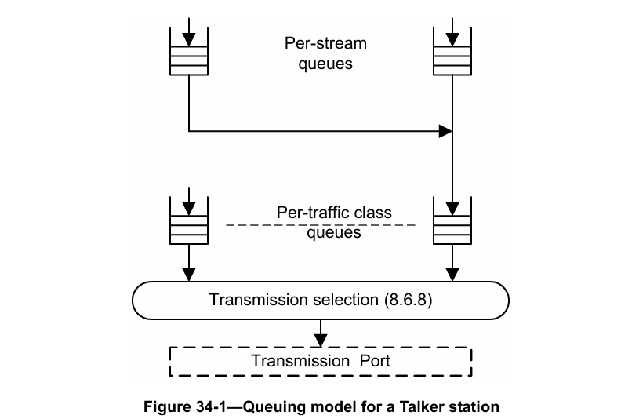
图 34-1 发送方站的排队模型

发送方根据流的流量规范（TSpec）将帧放入与单个流相关联的队列中；即，在每个类测量间隔内，发送方最多可将 MaxIntervalFrames 个数据帧（每个帧的长度不超过 MaxFrameSize）放入该流的队列中。

与每个单个流相关联的队列使用基于信用的整形器算法，其空闲斜率（idleSlope）设置为该流在该传输端口上的带宽需求，以此确定该流的数据帧被放入该流所使用的优先级的出站队列的速率。该优先级的出站队列进而使用基于信用的整形器算法，其空闲斜率（idleSlope）设置为该传输端口上使用该优先级的所有流的空闲斜率（idleSlope）值之和，以此确定该流的数据帧被选择进行传输的速率。

发送方中的传输选择与桥接器中的传输选择以相同的方式运行；从这个角度来看，发送方可以被视为一个单端口桥接器。

对于使用 SR 类别 A 或 SR 类别 B 的流，要求任何给定流的帧被选择放入其逐流队列的速率，不超过该流的预留带宽（在该 SR 类别的类测量间隔内测量：SR 类别 A 为 125 µs，SR 类别 B 为 250 µs）。对于流带宽需求和传输端口数据速率的某些组合，这可能会对传输流数据时可使用的帧大小施加限制。

> 注：观察间隔的唯一影响是其对帧大小的影响，因为整形器行为本身与观察间隔无关。限制观察间隔的目的是限制帧大小，因为这是帧在音频视频桥接（AVB）网络中传输时所经历延迟的主要影响因素（见附录 L 中的讨论）。

### 34.6.2 接收方行为
接收方站的主要要求是，其能够缓冲在发送方和接收方之间传输过程中，流数据帧可能经历的累积最大抖动对应的时间段内，该流可能传输的数据量。从时间敏感流的转发和排队要求规范的角度来看，假设接收方会将流所需的缓冲量评估作为实现所采用的流带宽预留机制的一部分。

---
# 附录 A（规范性）协议实现一致性声明（PICS）表格——桥接器实现³
## A.5 主要功能
修改表 A.5 的第一行，如下所示：

在表 A.5 的末尾插入以下行：

<table>
  <tr>
    <td>FQTSS</td>
    <td>该实现是否支持时间敏感流的转发和排队？</td>
    <td>5.4.1.5、34</td>
    <td>是 [ ]</td>
    <td>否 [ ]</td>
  </tr>
</table>

## A.14 桥接器管理
在表 A.14 的末尾插入以下行，并根据需要重新编号 MGT-97：

<table>
  <tr>
    <td>项目</td>
    <td>功能</td>
    <td>状态</td>
    <td>参考文献</td>
    <td colspan="2">支持情况</td>
  </tr>
  <tr>
    <td>MGT-97</td>
    <td>该实现是否支持 12.21 中定义的管理实体？</td>
    <td>FQTSS：可选（O）</td>
    <td>5.4.1.5 项 e)、12.21、17.7.13、34</td>
    <td>是 [ ]</td>
    <td>不适用 [ ]</td>
  </tr>
</table>

## A.24 管理信息库（MIB）
在表 A.24 的末尾插入以下行，并根据需要重新编号 MIB-21：

<table>
  <tr>
    <td>项目</td>
    <td>功能</td>
    <td>状态</td>
    <td>参考文献</td>
    <td colspan="2">支持情况</td>
  </tr>
  <tr>
    <td>MIB-21</td>
    <td>是否完全支持 IEEE8021-FQTSS-MIB 模块（按照其模块一致性（MODULE-COMPLIANCE）要求）？</td>
    <td>FQTSS：可选（O）</td>
    <td>5.4.1.5 项 e)、12.21、17.7.13、34</td>
    <td>是 [ ]</td>
    <td>不适用 [ ]</td>
  </tr>
</table>

³ 协议实现一致性声明（PICS）表格的版权许可：本标准的使用者可自由复制本附录中的协议实现一致性声明（PICS）表格，以实现其预期用途，也可进一步发布已填写完成的协议实现一致性声明（PICS）。

## A.31 时间敏感流的转发和排队
插入新表 A.31，如下所示：

<table>
  <tr>
    <td>项目</td>
    <td>功能</td>
    <td>状态</td>
    <td>参考文献</td>
    <td>支持情况</td>
  </tr>
  <tr>
    <td></td>
    <td>如果不支持时间敏感流的转发和排队（表 A.31 中的 FQTSS），请标记为不适用（N/A），并忽略本表格的其余部分。</td>
    <td></td>
    <td>5.4.1.5、34</td>
    <td>不适用 [ ]</td>
  </tr>
  <tr>
    <td>FQTSSE1</td>
    <td>支持至少两个流量类别，其中一个支持严格优先级算法，另一个为流预留（SR）类别。</td>
    <td>FQTSS：必选（M）</td>
    <td>5.4.1.5、8.6.8.1、34</td>
    <td>是 [ ] 不适用 [ ]</td>
  </tr>
  <tr>
    <td>FQTSSE2</td>
    <td>在所有端口上支持基于信用的整形器算法，将其用作流预留（SR）类别的传输选择算法。</td>
    <td>FQTSS：必选（M）</td>
    <td>5.4.1.5、8.6.8.2、34</td>
    <td>是 [ ] 不适用 [ ]</td>
  </tr>
  <tr>
    <td>FQTSSE3</td>
    <td>支持 6.9.4 中定义的流预留协议（SRP）域边界端口优先级再生覆盖功能，以及表 6-6 中定义的针对流预留（SR）类别“B”的默认优先级再生覆盖值。</td>
    <td>FQTSS：必选（M）</td>
    <td>5.4.1.5、6.9.4、表 6-6、34</td>
    <td>是 [ ] 不适用 [ ]</td>
  </tr>
  <tr>
    <td>FQTSSE4</td>
    <td>支持 34.5 中定义的用于将优先级映射到流量类别的表格和过程。</td>
    <td>FQTSS：必选（M）</td>
    <td>5.4.1.5、34、34.5</td>
    <td>是 [ ] 不适用 [ ]</td>
  </tr>
  <tr>
    <td>FQTSSE5</td>
    <td>支持两个或更多流预留（SR）类别（最多 7 个），并在所有端口上支持基于信用的整形器算法，将其用作这些流预留（SR）类别的传输选择算法；支持的流预留（SR）类别数量应在协议实现一致性声明（PICS）中说明。</td>
    <td>FQTSS：可选（O）</td>
    <td>5.4.1.5、8.6.8.2、34.6</td>
    <td>是 [ ] 否 [ ] 数量：____</td>
  </tr>
  <tr>
    <td>FQTSSE6</td>
    <td>支持 6.9.4 中定义的流预留协议（SRP）域边界端口优先级再生覆盖功能，以及表 6-6 中定义的针对流预留（SR）类别“A”的默认优先级再生覆盖值；如果支持两个以上的流预留（SR）类别，额外流预留（SR）类别的默认优先级再生覆盖值应在协议实现一致性声明（PICS）中说明。</td>
    <td>FQTSS：可选（O）</td>
    <td>5.4.1.5、6.9.4、表 6-6、34.6</td>
    <td>是 [ ] 否 [ ] 优先级覆盖值：_______</td>
  </tr>
</table>

---

# 附录 H（资料性）参考文献
在现有列表的末尾插入以下参考文献条目，并根据需要重新编号：
- [B29] 《计算 Qav 流队列添加的延迟》（参见 http://www.ieee802.org/1/files/public/docs2009/av-fuller-queue-delay-calculation-0809-v02.pdf）。
- [B30] IEEE P802.1AS/D6.1，《局域网和城域网标准——桥接局域网中时间敏感应用的定时与同步》草案标准。
- [B31] IEEE P802.1Qat/D4.2，《局域网和城域网标准——虚拟桥接局域网——修订版 XX：流预留协议（SRP）》草案标准。

---

# 附录 I（规范性）协议实现一致性声明（PICS）表格——终端站实现⁴
修改表 I.5，如下所示：

## I.5 主要功能
<table>
  <tr>
    <td>项目</td>
    <td>功能</td>
    <td>状态</td>
    <td>参考文献</td>
    <td colspan="2">支持情况</td>
  </tr>
  <tr>
    <td>MRPAP</td>
    <td>该实现是否支持任何多属性注册协议（MRP）应用？如果标记为“否”，请跳至 FQTSSE。</td>
    <td>可选（O）</td>
    <td>5.12.1</td>
    <td>是 [ ]</td>
    <td>否 [ ]</td>
  </tr>
  <tr>
    <td>MMRP</td>
    <td>是否支持多播地址注册协议（MMRP）的运行？</td>
    <td>O.1</td>
    <td>5.12.1、I.9</td>
    <td>是 [ ]</td>
    <td>否 [ ]</td>
  </tr>
  <tr>
    <td>MVRP</td>
    <td>是否支持使用虚拟局域网注册协议（MVRP）自动配置和管理虚拟局域网（VLAN）拓扑？</td>
    <td>O.1</td>
    <td>5.12.1、I.7</td>
    <td>是 [ ]</td>
    <td>否 [ ]</td>
  </tr>
  <tr>
    <td>MRP</td>
    <td>是否实现了多属性注册协议（MRP）以支持多属性注册协议（MRP）应用？</td>
    <td>必选（M）</td>
    <td>10、I.9、I.7、I.8</td>
    <td>是 [ ]</td>
    <td></td>
  </tr>
  <tr>
    <td>SPRU</td>
    <td>该实现是否支持源剪枝（Source Pruning）？</td>
    <td>EMRP：可选（O）</td>
    <td>5.12、10.10.3、11.2.1.1</td>
    <td>是 [ ]</td>
    <td>否 [ ]</td>
  </tr>
  <tr>
    <td>MRP1</td>
    <td>多属性注册协议（MRP）实现是否支持完全参与者（Full Participant）的运行？</td>
    <td>SPRU：O.2；非 SPRU：O.3</td>
    <td>10、I.8</td>
    <td>是 [ ]</td>
    <td>否 [ ]</td>
  </tr>
  <tr>
    <td>MRP2</td>
    <td>多属性注册协议（MRP）实现是否支持完全参与者（Full Participant）的点对点子集运行？</td>
    <td>SPRU：O.2；非 SPRU：O.3</td>
    <td>10、I.8</td>
    <td>是 [ ]</td>
    <td>否 [ ]</td>
  </tr>
  <tr>
    <td>MRP3</td>
    <td>多属性注册协议（MRP）实现是否支持仅申请者参与者（Applicant-Only Participant）的运行？</td>
    <td>非 SPRU：O.3</td>
    <td>10、I.8</td>
    <td>是 [ ]</td>
    <td>否 [ ]</td>
  </tr>
  <tr>
    <td>MRP4</td>
    <td>多属性注册协议（MRP）实现是否支持简单申请者参与者（Simple-Applicant Participant）的点对点子集运行？</td>
    <td>非 SPRU：O.3</td>
    <td>10、I.8</td>
    <td>是 [ ]</td>
    <td>否 [ ]</td>
  </tr>
  <tr>
    <td>FQTSSE</td>
    <td>该实现是否支持时间敏感流的转发和排队？</td>
    <td>可选（O）</td>
    <td>5.18、34.6</td>
    <td>是 [ ]</td>
    <td>否 [ ]</td>
  </tr>
</table>

⁴ 协议实现一致性声明（PICS）表格的版权许可：本标准的使用者可自由复制本附录中的协议实现一致性声明（PICS）表格，以实现其预期用途，也可进一步发布已填写完成的协议实现一致性声明（PICS）。

## I.9 时间敏感流的转发和排队
插入新表 I.9，如下所示：

<table>
  <tr>
    <td>项目</td>
    <td>功能</td>
    <td>状态</td>
    <td>参考文献</td>
    <td>支持情况</td>
  </tr>
  <tr>
    <td>FQTSSE1</td>
    <td>是否支持至少两个流量类别，其中一个支持严格优先级算法，另一个为流预留（SR）类别？</td>
    <td>FQTSS：必选（M）</td>
    <td>5.18、8.6.8.1、34.6</td>
    <td>是 [ ] 不适用 [ ]</td>
  </tr>
  <tr>
    <td>FQTSSE2</td>
    <td>是否支持基于信用的整形器算法，将其用作与流预留（SR）类别相关联的每个流所传输帧的传输选择算法？</td>
    <td>FQTSS：必选（M）</td>
    <td>5.18、8.6.8.2、34.6</td>
    <td>是 [ ] 不适用 [ ]</td>
  </tr>
  <tr>
    <td>FQTSSE3</td>
    <td>是否在所有端口上支持基于信用的整形器算法，将其用作流预留（SR）类别的传输选择算法？</td>
    <td>FQTSS：必选（M）</td>
    <td>5.18、8.6.8.2、34.6</td>
    <td>是 [ ] 不适用 [ ]</td>
  </tr>
  <tr>
    <td>FQTSSE4</td>
    <td>是否使用表 6-6 中所示的与流预留（SR）类别“B”相关联的默认优先级，作为传输的流预留（SR）类别“B”数据帧中携带的优先级值？</td>
    <td>FQTSS：必选（M）</td>
    <td>5.18、表 6-6、34.6</td>
    <td>是 [ ] 不适用 [ ]</td>
  </tr>
  <tr>
    <td>FQTSSE5</td>
    <td>是否支持两个或更多流预留（SR）类别（最多 7 个），并在所有端口上支持基于信用的整形器算法，将其用作这些流预留（SR）类别的传输选择算法？支持的流预留（SR）类别数量应在协议实现一致性声明（PICS）中说明。</td>
    <td>FQTSS：可选（O）</td>
    <td>5.18、8.6.8.2、34.6</td>
    <td>是 [ ] 否 [ ] 数量：____</td>
  </tr>
  <tr>
    <td>FQTSSE6</td>
    <td>是否使用表 6-6 中所示的与流预留（SR）类别“A”相关联的默认优先级，作为传输的流预留（SR）类别“A”数据帧中携带的优先级值？如果支持两个以上的流预留（SR）类别，额外流预留（SR）类别传输的数据帧中携带的优先级值应在协议实现一致性声明（PICS）中说明。</td>
    <td>FQTSS：可选（O）</td>
    <td>5.18、表 6-6、34.6</td>
    <td>是 [ ] 否 [ ] 优先级覆盖值：_______</td>
  </tr>
</table>

---
# 附录 L（资料性）基于信用的整形器算法的运行
本附录包含对基于信用的整形器算法（8.6.8.2）运行方式的详细分析，以及从使用基于信用的整形队列的流量角度和该端口相关联的其他队列角度，分析其运行对网络性能的影响。

## L.1 基于信用的整形器算法运行概述
基于信用的整形器算法有一个外部确定的参数——$idleSlope$（见 8.6.8.2），该参数决定了队列关联的流量类别可使用的$portTransmitRate$的最大比例（$bandwidthFraction$），如下式（L.1）所示：
$$bandwidthFraction = idleSlope / portTransmitRate \quad (L.1)$$
其中，$portTransmitRate$是支持出站队列的端口能够提供的最大传输数据速率。式（L.1）的详细推导可参见式（L.5）至式（L.8）。

如果支持基于信用的整形器算法的流量类别使用的带宽小于分配给它的带宽，则未使用的带宽可由其他流量类别根据其相对优先级和关联的传输选择算法进行使用。

> 注 1：传输选择的运行机制决定了，若给定流量类别没有可传输的帧，则有可传输帧的较低优先级流量类别能够进行传输。因此，若使用基于信用的整形器算法的给定流量类别已分配到端口的 X% 可用带宽，但仅使用了（X-Y）%，则其分配中未使用的部分（Y%）可由其他有能力使用的流量类别使用。流量类别能否使用该未分配带宽，取决于其关联的传输选择算法。例如，已分配特定带宽的流量类别（如使用基于信用的整形器算法的流量类别）无法使用更高优先级流量类别未使用的带宽分配，否则会超出其自身带宽分配；而未关联带宽分配的流量类别（如使用严格优先级算法的流量类别）则可以使用更高优先级流量类别已分配但未使用的带宽。

$idleSlope$参数，结合使用该队列传输的帧大小以及队列在传输排队帧之前可能经历的最大时间延迟，为使用该算法的队列可传输的突发大小设定了上限。

为了描述该算法的运行，除 8.6.8.2 中描述的算法正式参数外，还需定义以下值：
a) $maxFrameSize$：可通过该端口为相关流量类别传输的最大帧大小。该值可由准入控制算法确定，或仅为流量源传输行为的函数。无论哪种情况，该值都可能小于底层 MAC 服务正常运行所允许的最大帧大小。
b) $hiCredit$：$credit$参数可累积的最大值。该参数是算法运行的函数，无法通过管理进行控制。
c) $loCredit$：$credit$参数可累积的最小值。$loCredit$的值是$maxFrameSize$、$portTransmitRate$和$sendSlope$的函数，如下式（L.2）所示：
$$loCredit = maxFrameSize \times (sendSlope / portTransmitRate) \quad (L.2)$$
d) $maxInterferenceSize$：可能延迟该流量类别可传输帧传输的任何流量突发的最大大小（以比特为单位）。对于数值最高的流量类别，$maxInterferenceSize$恰好等于可通过该端口传输的最大帧大小（底层 MAC 支持的最大帧大小）。对于所有其他流量类别，由于支持基于信用的整形器算法的任何更高优先级流量类别都可能延迟帧的传输，因此$maxInterferenceSize$的推导更为复杂。$maxInterferenceSize$还必须考虑任何媒体访问延迟（如节能以太网（Energy Efficient Ethernet）中的恢复时间）。详细分析见 L.3.1.1。

> 注 2：$maxInterferenceSize$的定义假设，支持整形器算法的任何流量类别，其数值都高于支持默认严格优先级算法（8.6.8.1）的任何流量类别。若不满足该假设，则$maxInterferenceSize$的值为无穷大，且基于信用的整形器算法的运行无法提供已预留的带宽。L.3 包含了针对给定流量类别确定$maxInterferenceSize$的详细分析。

$hiCredit$的值由最坏情况的干扰流量决定，如下式（L.3）所示：
$$hiCredit = maxInterferenceSize \times (idleSlope / portTransmitRate) \quad (L.3)$$

因此，$hiCredit$可被视为“高水位线”；该算法的运行机制确保$credit$参数的值永远不会超过$hiCredit$。

$idleSlope$的取值以及计算得出的$hiCredit$值，可用于确定队列可输出的最大突发大小，如下式（L.4）所示：
$$maxBurstSize = (portTransmitRate \times ((hiCredit - loCredit) / (-sendSlope))) \quad (L.4)$$

> 注 3：$maxBurstSize$与流量类别可用的缓冲区大小之间存在相互关系。累积的信用超过流量类别在排队帧中能够处理的信用毫无意义，因为队列溢出时帧会被丢弃，这是限制因素。这意味着，给定端口上给定流量类别可预留的带宽量，取决于该流量类别可用的缓冲量。而这一点，结合端口的传输速率，将决定该端口上该流量类别可支持的$idleSlope$的最大值。

图 L-1 至图 L-3 中的示例说明了基于信用的整形器算法的运行。在图 L-1 中，帧在$credit$值为零时排队，且无冲突流量（无更高优先级流量等待传输，且该端口无正在传输的帧）。该帧立即被选择进行传输，且在传输过程中$credit$以$sendSlope$的速率减少。帧传输完成后，$credit$以$idleSlope$的速率回升至零，此时可选择传输下一个帧。

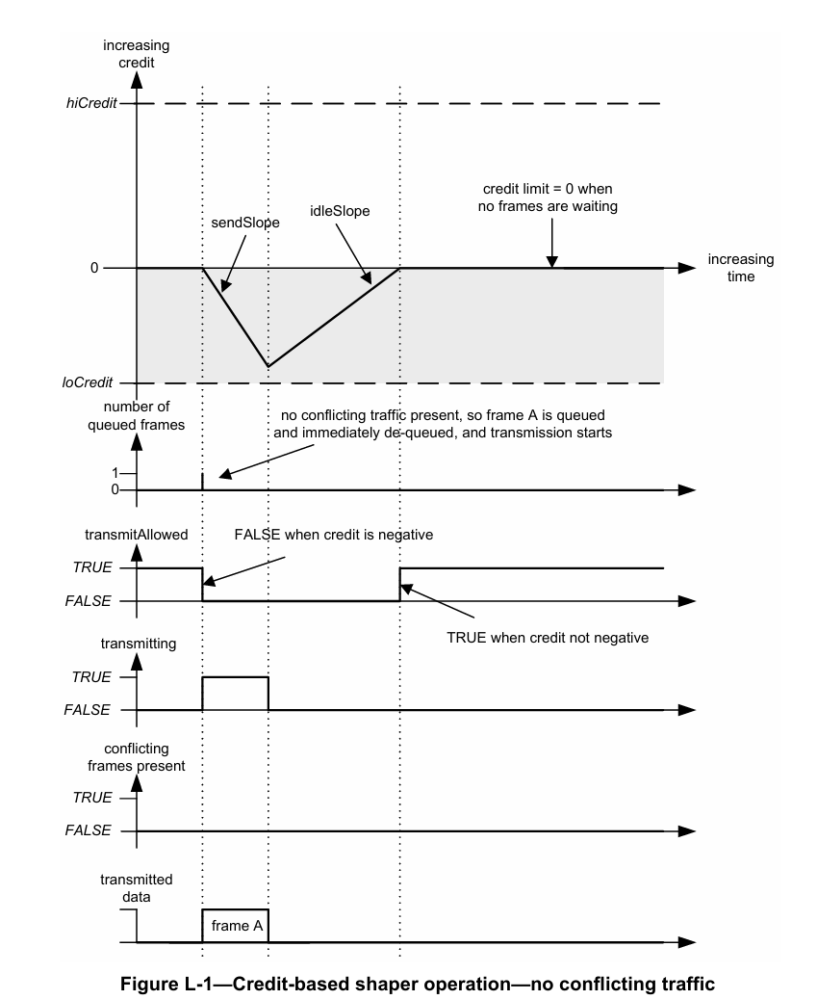
图 L-1 基于信用的整形器运行——无冲突流量

如果整形器算法有连续的帧流可用（即当$credit$值达到零时，始终有一个帧排队等待传输），则队列可使用的$portTransmitRate$比例（$bandwidthFraction$）等于帧从该队列传输的时间比例。假设每个帧传输结束时$credit$减少到$loCredit$值，则式（L.1）的详细推导如下：
$$bandwidthFraction = (-loCredit / sendSlope) / [(-loCredit / sendSlope) + (loCredit / idleSlope)] \quad (L.5)$$
$$= (-1 / sendSlope) / [(1 / idleSlope) - (1 / sendSlope)] \quad (L.6)$$
$$= (-idleSlope) / (sendSlope - idleSlope) \quad (L.7)$$
$$= idleSlope / portTransmitRate \quad (L.8)$$

即使存在冲突流量，该带宽比例也可用于流传输，如下列示例所示。在图 L-2 中，帧在端口传输冲突流量时排队。排队帧等待端口可用期间，$credit$以$idleSlope$的速率增加。冲突流量的传输在$credit$值达到$hiCredit$限制之前完成，且排队帧的传输开始。$credit$开始以$sendSlope$的速率减少；然而，由于该帧的大小不足以耗尽所有可用$credit$，且无更多帧排队，因此传输完成时$credit$减少至零。

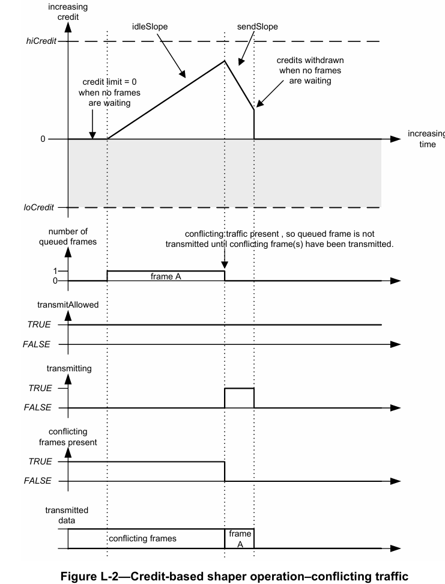
图 L-2 基于信用的整形器运行——冲突流量

在图 L-3 中，三个帧在端口传输冲突流量时排队，且$credit$以$idleSlope$的速率累积。冲突流量传输完成后，第一帧和第二帧背靠背传输，因为传输第一帧后$credit ≥ 0$。然而，由于传输第二帧导致$credit$变为负数，第三帧的传输需延迟至$credit$回升至零。

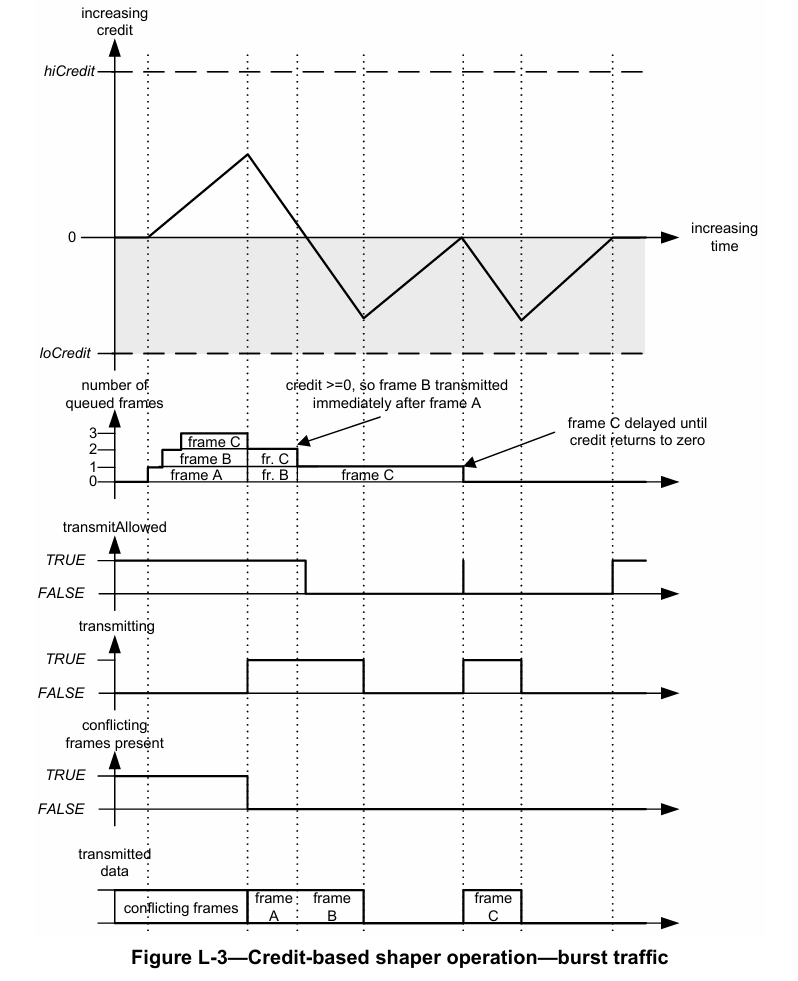
图 L-3 基于信用的整形器运行——突发流量

## L.2 桥接器中的“类别测量间隔”
“类别测量间隔”定义了发送方（Talker）在逐流传输方面的可接受行为（见 34.6.1）；然而，它并不直接影响桥接器中基于信用的整形器算法的运行。

如 L.1 中所述，运行基于信用的整形器算法的队列消耗的可用带宽最大比例由$idleSlope$决定；若$idleSlope$为链路传输速率的 75%，则该算法最多可获得链路的 75%（在发送方（Talker）的某个时间周期（类别测量间隔）内取平均值）。对于桥接器，由于其他流量类别的干扰传输，传输会变得突发，因此有意义的最小测量间隔（即仍可观察到 75% 最大带宽未被超出的最小周期）为相关流量类别传输最大大小突发所需的时间乘以 100/75。对于 SR 类别 A 流量的 125 微秒类别测量间隔，在 100 Mbit/s 以太网且预留 75% 带宽的情况下，近似计算如下（忽略帧间间隙）：
a) $maxInterferenceSize$为一个最大大小的以太网帧（2000 字节，即 16000 比特），因此$hiCredit$为其 75%（即 12000 比特）。
> 注 1：媒体访问延迟（如节能以太网（Energy Efficient Ethernet）施加的延迟）可能比最大大小帧产生的干扰更为显著。
> 注 2：2000 字节是以太网的最大值，因此是干扰帧的最坏情况；在特定实现中，使用的$maxFrameSize$可能更小。若已知实现中的$maxFrameSize$小于 2000 字节，则可使用该较小值。

b) 该流量类别的$maxFrameSize$为 125 µs 内可传输比特数的 75%，因此对于 100 Mbit/s 局域网，为 12500 比特的 75%（即 9375 比特，包括最多约 500 个可能的“开销”字节——用于标签头部、物理层开销等）。由于该数值不是整数个字节，因此向下取整为 9368 比特。$loCredit$为其 25%（即 -2342 比特）。

c) 对于长度不超过 9368 比特的帧，$maxBurstSize$出现在$credit$达到 12000 比特时——先传输一系列帧将$credit$恰好降至 0，然后传输最后一个 9368 比特的帧将$credit$降至 -2342 比特。因此，该$maxBurstSize$的计算如下：$(12000 + 2342) × (portTransmitRate / (-sendSlope))$，即 57368 比特。

d) 因此，可预期能够测量 SR 类别 A 的带宽利用率并观察到其未超出 75% 分配的最小测量间隔为 57368 比特时间乘以 100/75（即 76491 比特时间），向上取整为整数后为 764.91 µs。

> 注 3：最大大小的突发之前会发生$maxInterferenceSize$事件，且突发结束时$credit$将降至 -2342 比特；因此，$credit$回升至零并允许 SR 类别 A 再次传输所需的时间为$2342/idleSlope$秒（约 3123 比特时间）。此外，SR 类别 A 的实际利用率为 $57368 / (57368 + 16000 + (2342 / 0.75)) = 75\%$。

对于 SR 类别 B 流量，实际变化的仅为干扰的潜在大小——从 SR 类别 A 的$maxInterferenceSize$增加到 SR 类别 A 的$maxBurstSize$加上 SR 类别 A 的$maxInterferenceSize$。

因此，$idleSlope/portTransmitRate$比例能够成立的最小可能测量间隔，取决于 SR 类别的$maxInterferenceSize$、SR 类别的$maxFrameSize$以及$idleSlope$的值。

## L.3 确定最坏情况延迟贡献和缓冲要求
从 AVB 桥接器的运行角度来看，评估每个桥接器对数据流帧在从发送方（Talker）到接收方（Listener）的传输路径中可能经历的最坏情况延迟的贡献至关重要。与桥接器的延迟贡献密切相关的是，为避免延迟导致帧丢弃，桥接器所需的缓冲要求；若桥接器可能将给定 SR 类别的帧延迟特定时间段，则其必须能够缓冲该 SR 类别在每个端口上可能接收的最坏情况帧数，以进行后续传输。以下讨论分析了帧通过桥接器时可能经历的延迟的影响因素，以及如何准确确定该延迟。

> 注 1：该讨论也有助于指导发送方（Talker）站的设计者确定发送方（Talker）网络接口添加的延迟。

桥接器之间单跳的最坏情况延迟（从桥接器 A 的端口 n 接收最后一个比特的时间到桥接器 B 的端口 m 接收最后一个比特的时间）可分解为以下组件：
a) 入站排队延迟（IEEE 802.1 体系结构中没有入站队列，但如果存在，实现必须对其进行说明）；
b) 干扰延迟（L.3.1）；
c) 帧传输延迟（以$portTransmitRate$传输一个最大大小帧所需的时间）；
d) 局域网传播延迟（取决于到下一个桥接器的局域网连接长度的可变延迟，可使用 IEEE P802.1AS™⁵ [B30] 中定义的机制进行测量）；
e) 存储转发延迟：包括假设入站和出站队列为空时，桥接器内部处理导致的所有其他转发延迟组件，例如：
1) 假设队列为空时，将帧从入站端口传递到出站端口所需的时间；
2) 帧可在端口上传输与端口准备好传输该帧之间的时间延迟；
> 注 2：例如，若 MAC/PHY 已进入节能模式，则将端口切换回正常运行可能会产生延迟。

3) 绕过空队列的帧与必须排队的帧之间的延迟差异（如有）；
4) 由于添加（或移除）帧头部（如 Q 标签或 MACSec 标签）导致帧长度增加（或缩短）而添加（或减少）的时间；
5) 加密 MACSec 帧所需的时间。

在本条款的其余部分，使用以下缩写：
- $M_0$：非 SR 类别的最大帧大小；
- $M_x$：SR 类别 x 的最大帧大小；
- $R_0$：$portTransmitRate$；
- $R_x$：SR 类别 x 的$idleSlope$；
- $T_{xy}$：事件 x 和事件 y 之间的时间间隔；
- $W_x$：$-sendSlope_x$；
- $变量_{<X}$：所有优先级高于 X（因此在排序序列中字母更早）的 SR 类别的指定变量值之和。

### L.3.1 干扰延迟
帧 X 的干扰延迟可分解为以下组件：
a) 排队延迟：在帧 X 有资格被选择传输之前，任意短时间内被选择传输的帧所导致的延迟，加上所有优先级高于帧 X 类别的流帧的排队帧所导致的延迟（即优先级高于 X 的 SR 类别的“$maxBurstSize$”——见 L.1）。这就是 L.1 中所指的$maxInterferenceSize$。排队延迟的详细分析见 L.3.1.1。
b) 扇入延迟：与帧 X 属于同一类别的其他帧从不同入站端口几乎同时到达所导致的延迟。扇入延迟的详细分析见 L.3.1.2。
c) 永久延迟：由于网络中的活动历史，帧在缓冲区中停留的时间相对于出站排队延迟较长而导致的延迟。永久延迟的详细分析见 L.3.1.3。

#### L.3.1.1 排队延迟
帧 X 的排队延迟可分解为以下组件：
a) $maxInterferenceTime$：为 SR 类别排队且有资格传输的帧 X 实际能够传输之前的延迟。当任意优先级的帧在帧 X 有资格传输之前的任意短时间内被选择传输时，会经历该延迟；在局域网媒体（如以太网）中也会经历该延迟——以太网在空闲条件下会进入低能耗模式，且局域网恢复正常运行并能够传输之前会有显著的$mediumAccessDelay$。因此，$maxInterferenceTime$等于以下两者中的较大值：
1) 传输媒体支持的最大帧大小所需的时间，即$maxFrameSize(m) / portTransmitRate$；
2) 媒体的$mediumAccessDelay$。

b) 若帧 X 不属于最高优先级的 SR 类别，则由与帧 X 的 SR 类别紧邻的更高优先级 SR 类别相关联的任何排队帧所导致的延迟（即紧邻的更高优先级 SR 类别的$maxBurstSize$）。

对于 SR 类别 A，由于没有更高的 SR 类别，因此仅适用第一个组件。

假设 SR 类别 A 的队列为满，且已累积最大$credit$（$hiCredit$）。由于 SR 类别 A 的帧优先级高于所有其他流量（甚至 BPDU），因此 SR 类别 A 的$hiCredit$仅为传输低优先级帧所需的$maxInterferenceTime$内累积的$credit$。在该累积$credit$耗尽之前，SR 类别 B（C、D……）的帧无法传输。

若允许 SR 类别 A 使用 100% 的局域网带宽，则 SR 类别 A 的队列永远无法赶上——因为它会以获得$credit$的速度消耗$credit$，其他流量类别永远没有机会传输帧。若允许 SR 类别 A 使用 99% 的局域网带宽，则 SR 类别 A 可以背靠背传输帧，且累积$credit$会以局域网带宽的 1% 速率耗尽，直至变为负数；此时，SR 类别 A 需等待$credit$回升至非负值后才能继续传输帧，这确保了至少 1% 的带宽可用于其他流量类别。

> 注：一般而言，若允许 SR 类别 A 使用 X% 的带宽，则仅有（100-X）% 的带宽可用于较低优先级的流量类别。实际上，由于所有 SR 类别可使用的$portTransmitRate$的最高百分比默认值为 75%，因此总有至少 25% 的$portTransmitRate$可用于非 SR 流量类别。

图 L-4 说明了这种突发传输行为，以及$maxInterferenceTime$对 SR 类别帧延迟的影响。在时间轴的点 a 处，SR 类别 A 和 B 的队列为空，且属于非 SR 流量类别的最大大小帧（$M_0$比特长）开始传输。片刻之后，SR 类别 A 和 B 的帧到达（分别为这些类别当前的最大大小$M_A$和$M_B$比特）；然而，由于已有帧正在传输，这些帧被排队。在点 b 处，非 SR 类别帧的传输完成，且 SR 类别 A 的突发四帧中的第一帧开始传输。在点 d 处，SR 类别 A 的$credit$因传输突发帧的最后一帧而变为负数，因此 SR 类别 A 的帧需等待$credit$回升至非负值后才能继续传输；这使得 SR 类别 B 能够传输一个帧。SR 类别 B 的帧传输结束时的情况，取决于等待传输的排队帧以及任一流预留（SR）类别的可用$credit$是否为非负值。

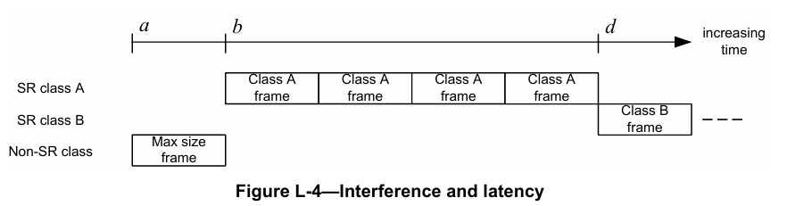
图 L-4 干扰和延迟

因此，第一个 SR 类别 A 帧经历的排队延迟为点 a 和点 b 之间的时间间隔$T_{ab}$。若$R_0$为传输速率（$portTransmitRate$），则：
$$T_{ab} = M_0 / R_0 = maxInterferenceTime \quad (L.9)$$

图 L-5 展示了该序列中 SR 类别 A 的$credit$变化。$R_A$为 SR 类别 A 的预留数据速率（即类别 A 的$idleSlope$），$R_B$为 SR 类别 B 的预留数据速率，以此类推。在传输最大大小的非 SR 帧期间，$credit_A$累积至$hiCredit_A$，因此：
$$hiCredit_A = R_A × M_0 / R_0 = idleSlope_A × maxInterferenceTime \quad (L.10)$$
在传输 SR 类别 A 的帧期间，$credit$以$sendSlope_A$的速率耗尽：
$$sendSlope_A = (R_A - R_0) \quad (L.11)$$
$credit$在图 L-5 中的点 c 处达到零（本讨论假设该情况恰好发生在第三帧 SR 类别 A 的帧传输完成时）。由于$credit=0$时可传输帧，因此类别 A 的$credit$继续耗尽至以下值：
$$credit_A = (R_A - R_0) × M_A / R_0 \quad (L.12)$$

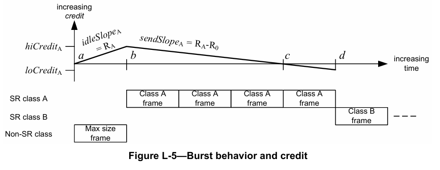
图 L-5 突发行为和信用

该过程发生在第四帧 SR 类别 A 的帧传输期间（$M_A$比特长，传输时间为$M_A / R_0$）。在点 d 处，第四帧的传输完成；由于$credit_A$现在为负数，因此无法再传输 SR 类别 A 的帧，且 SR 类别 B 的帧开始传输。

因此，对于类别 A，$maxBurstSize$等于传输速率$R_0$乘以图 L-5 中点 b 和点 d 之间的时间间隔：
$$max\ Class\ A\ burst\ size = R_0 × \left(-(hiCredit_A - loCredit_A) / sendSlope_A\right) \quad (L.13)$$

将式（L.10）、式（L.11）和式（L.12）中的$hiCredit_A$、$sendSlope_A$和$loCredit_A$代入，得到：
$$max\ Class\ A\ burst\ size = R_0 × \left(-(R_A × M_0 / R_0 - (R_A - R_0) × M_A / R_0) / (R_A - R_0)\right) \quad (L.14)$$
$$= R_0 × (R_A × M_0 / R_0) / (R_0 - R_A) + M_A / R_0 × R_0 \quad (L.15)$$
$$= (R_A × M_0) / (R_0 - R_A) + M_A \quad (L.16)$$

SR 类别 B 经历的排队延迟为图 L-5 中点 a 和点 d 之间的时间间隔$T_{ad}$：
$$T_{ad} = T_{ab} + T_{bc} + T_{cd} \quad (L.17)$$
$$= M_0 / R_0 + hiCredit_A / sendSlope_A + M_A / R_0 \quad (L.18)$$
$$= M_0 / R_0 + (R_A × M_0 / R_0) / (R_0 - R_A) + M_A / R_0 \quad (L.19)$$
$$= M_0 / (R_0 - R_A) + M_A / R_0 \quad (L.20)$$

通过使用所有更高优先级 SR 类别的可用$credit$之和，可将其推广到计算任何 SR 类别 x 经历的排队延迟。在以下内容中，下标“<X”用于表示所有优先级高于 X（因此在排序序列中字母更早）的 SR 类别的值之和。

SR 类别 A 至 X-1 的$credit$获取速率$idleSlope_{<X}$为所有更高优先级类别的数据速率之和，因此：
$$idleSlope_{<X} = \sum_{K<X} R_K \quad (L.21)$$

这仅是更高类别的$idleSlope_K$值之和。然而，组合类别仅在单个干扰非 SR 干扰帧停止传输前累积$credit$，之后$credit$开始线性减少。因此，组合$credit$的上限并非单个类别的$credit$之和，而是比特数除以斜率，即：
$$hiCredit_{<X} = \left(\sum_{K<X} R_K\right) × M_0 / R_0 \quad (L.22)$$

类似地，组合$sendSlope_{<X}$为：
$$sendSlope_{<X} = -\left(R_0 - \sum_{K<X} R_K\right) \quad (L.23)$$

这些组合速率在某个类别的缓冲区为空且其$credit$被迫归零之前一直有效。在我们所分析的最坏情况中，不会发生这种情况。

定义：
$$W_{<X} = -sendSlope_{<X} = R_0 - \sum_{K<X} R_K \quad (L.24)$$
则有：
$$sendSlope_{<X} = -W_{<X} \quad (L.25)$$
以及：
$$hiCredit_{<X} = (R_0 - W_{<X}) × M_0 / R_0 \quad (L.26)$$

对于所有组合类别，$T_{ab}$与 SR 类别 A 相同，即非 SR 帧的传输时间：
$$T_{ab} = M_0 / R_0 \quad (L.27)$$

组合类别 A 至 X-1 在时间$hiCredit_{<X} / W_{<X}$内从$hiCredit_{<X}$耗尽至 0，因此：
$$T_{bc} = \left((R_0 - W_{<X}) × M_0 / R_0\right) / W_{<X} \quad (L.28)$$

组合类别 <X 的$loCredit_{<X}$的最坏情况值并非总和$\sum_{K<X} loCredit_K$（因为这会高估最坏情况）。在给定时间点，仅有一个 <X 类别能够传输帧，因此 <X 类别的突发结束发生在某个 <X 类别（假设为 Q）开始传输帧时——此时所有其他 <X 类别的$credit$均为负数，且其$credit$因此正在上升。若在 Q 的帧传输完成时，其他 <X 类别的$credit$仍为负数，则 Q 的帧为 <X 类别的最后一个帧；但此时，根据定义，所有其他 <X 类别的$credit$必须高于其各自的$loCredit$值（即对于这些其他类别，$credit > loCredit$）——因为即使它们在 Q 开始传输时处于各自的$loCredit$值，在 Q 的帧传输期间它们也一直在累积$credit$。

也不能简单地认为$loCredit_{<X}$是传输每个类别的一个最大长度帧所需的时间；对于某些类别，即使所有类别的$credit$同时达到 0，在总$credit=0$后也可能传输多个最后帧。例如，类别 A 和 B 同时达到$credit=0$；A 传输一个帧，然后 B 传输一个帧。在 B 的帧传输完成时，A 的$credit$已回升至零，因此 A 可以传输另一个“最后”帧。

某个类别必须传输最后一个帧，且为了达到最坏情况，该最后一个帧应为最大长度帧。若不是，则要么：
c) 将其扩展至最大长度仍使其他类别保持$credit$为负数；
d) 将其扩展至最大长度使一个或多个其他类别的$credit$为 0 或正数（在这种情况下，它们将传输更多帧）。

因此，若类别 Q 是传输 <X 类别最后一个帧的类别，则对于所有其他 <X 类别 P，必须满足以下条件：
$$M_q × R_P > (R_0 - R_P) × M_p \quad (L.29)$$

式（L.29）源于以下事实：在$M_q$的传输期间，类别 P 的$credit$增加量（等于$(M_q / R_0) × R_P$）大于$loCredit_P$的绝对值（等于$(R_0 - R_P) × M_p$）。因此：
$$(M_q / R_0) × R_P > (R_0 - R_P) × M_p / R_0 \quad (L.30)$$

该陈述成立的原因是，其他类别 P 的$credit$必须足够低，以确保在$M_q$的传输期间其$credit$无法攀升至 0 以上。

对于三个 SR 类别 Q、P 和 S，$credit_{<X}$可能达到的最低值如下式（L.31）所示：
$$loCredit_{<X} \geq loCredit_Q + loCredit_P + loCredit_S + R_S × M_q / R_0 + R_P × M_q / R_0 \quad (L.31)$$

然而，这仍然过于悲观——因为它假设多个类别可同时处于其$loCredit$值，而实际情况并非如此。但这表明，若所有$K<X$的$R_K$都很小（即$R_K << R_0$），则所有$R_K × M_q / R_0$项都趋近于零，因此$loCredit_{<X}$趋近于总和$\sum_{K<X} loCredit_K$。因此：
$$loCredit_{<X} = \sum_{K<X} loCredit_K \quad (L.32)$$
$$= \sum_{K<X} (R_K - R_0) × M_K / R_0 \quad (L.33)$$

但在该最坏情况中，$R_K << R_0$，因此：
$$loCredit_{<X} = \sum_{K<X} (-M_K) \quad (L.34)$$

综合这些不同组件，SR 类别 X 的排队延迟$qDelay_X$如下：
$$qDelay_X = M_0 / R_0 + (hiCredit_{<X} - loCredit_{<X}) / |sendSlope_{<X}| \quad (L.35)$$
$$= M_0 / R_0 + \left((R_0 - W_{<X}) × M_0 / R_0 + \sum_{K<X} M_K\right) / W_{<X} \quad (L.36)$$
$$qDelay_X = (M_0 + \sum_{K<X} M_K) / W_{<X} \quad (L.37)$$

对于 SR 类别 A，该式简化为式（L.38）：
$$qDelay_A = M_0 / W_{<A} \quad (L.38)$$

由于不存在“<A”类别（A 是最高优先级类别），因此$W_{<A}$即为$R_0$，因此该式进一步简化为式（L.39）：
$$qDelay_A = M_0 / R_0 \quad (L.39)$$

这与 L.1 中的早期讨论一致。

对于 SR 类别 B，该式简化为式（L.40）：
$$qDelay_B = (M_0 + M_A) / W_A \quad (L.40)$$

由于$W_A$为$-sendSlope_A$（即$R_0 - R_A$），因此可重写为式（L.41）：
$$qDelay_B = (M_0 + M_A) / (R_0 - R_A) \quad (L.41)$$

给定类别 x 的$maxBurstSize$，是类别 X 的帧能够背靠背传输的比特数。$maxBurst$发生在该类别经历了其最坏情况排队延迟$qDelay_X$后，能够在不受任何更高优先级类别干扰的情况下传输帧，直至达到$loCredit_X$。该突发大小（$maxBurst_X$）等于在$credit_X$从$hiCredit_X$减少至$-loCredit_X$的时间内，以线路速率$R_0$可传输的比特数，如下式（L.42）所示：
$$maxBurst_X = (hiCredit_X - loCredit_X) × R_0 / W_X \quad (L.42)$$

根据早期结果，$loCredit_X$的最坏情况值为$(-M_X)$，因此：
$$maxBurst_X = hiCredit_X × R_0 / W_X + M_X × R_0 / W_X \quad (L.43)$$

而$hiCredit_X$是在$qDelay_X$秒内可累积的$credit$量（即$qDelay_X$乘以$idleSlope$ $R_X$），因此：
$$maxBurst_X = (M_0 + \sum_{K<X} M_K) × R_X × R_0 / (W_{<X} × W_X) + M_X × R_0 / W_X \quad (L.44)$$
#### L.3.1.2 扇入延迟
扇入延迟是指与帧 X 属于同一 SR 类别的其他帧，从不同入站端口几乎同时到达而导致的延迟。考虑图 L-6 中的场景：桥接器有多个端口接收给定 SR 类别的帧，且这些帧将在单个出站端口排队。假设为桥接器每个接收端口提供数据的“上游”桥接器端口，均同时遭遇针对类别 X 的最大干扰事件，那么出站端口将面临数据匮乏。当干扰事件结束后，“上游”桥接器开始传输帧，所有入站端口同时接收一个帧，且所有接收的帧都会被投递到出站队列。

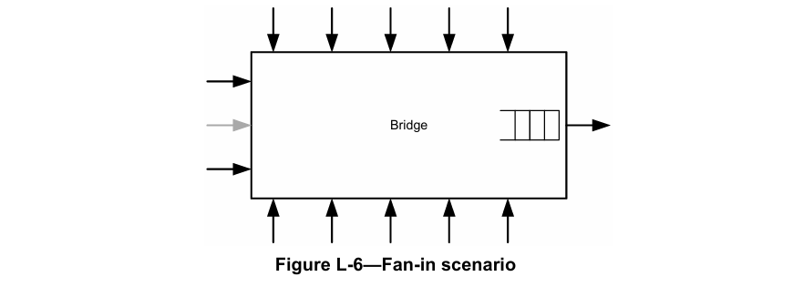
图 L-6 扇入场景

假设桥接器的所有端口支持相同的数据速率，且上游桥接器的出站队列与该桥接器的出站队列配置相同，那么出站端口将无法以入站流量所需的组合数据速率从其队列传输帧——例如，这可能要求出站端口以其预留数据速率的 20 倍进行传输，而这是流预留协议（SRP）所不允许的。因此，出站端口上的预留数据速率必须与输入到入站端口的预留数据速率之和相等。

通过将大部分预留带宽分配给其中一个入站端口（图 L-6 中灰色标记的端口），并为所有其他入站端口分配极少量带宽，可以最大化接收的扇入数据量：灰色端口将接收 \(maxBurst_X\) 大小的突发数据，而所有其他端口将接收一个长度为 \(M_X\) 的帧。因此，在此场景下，出站队列需要处理的扇入数据量为 \(maxBurst_X + 12×M_X\) 比特。

> 注 1：选择这种方式能最大化扇入数据突发大小的原因是，无论分配给黑色端口的带宽多么少，它们仍能突发传输一个完整的帧。

以下是确定给定 SR 类别和输出端口的最大扇入数据量的步骤（非公式）：
a) 确定输出端口上类别 X 的最大可能带宽 \(B_O\)；
b) 对于每个可能的入站端口 i，确定类别 X 的最大可能带宽 \(B_i\)——假设该信息可通过某种方式（如通过链路层发现协议（LLDP））从发送帧到 i 的传输桥接器获取；
c) 对于入站端口 i，使用带宽 \(max(B_O, B_i)\) 计算 \(maxBurst_{X,i}\)（在 \(maxBurst\) 公式中，使用 \(W_X = R_0 - max(B_O, B_i)\)）；
d) 将 \(max(maxBurst_{X,i})\) 累加到总扇入数据量中；
e) 设置 \(B_O = B_O - B_i\)，并从步骤 c) 重复，直到 \(B_O = 0\)；
f) 对于每个剩余端口，将 \(M_{X,i}\) 累加到总扇入数据量中。

扇入延迟等于以输出端口的线路速率，输出上述计算得出的总扇入突发数据所需的时间。

> 注 2：流流量规范的测量间隔定义意味着存在最小帧传输速率（SR 类别 A 的 125 µs 测量间隔对应 8000 帧/秒）。在此帧传输速率下，帧尺寸更小，且由于小帧的开销，可支持的流数量更少（100 Mb 端口最多支持 13 个流）。在确定 \(M_X\) 的取值以及参与扇入延迟的最大端口数量时，应充分考虑这些约束条件。
> 扇入延迟的示例计算可参见论文《计算 Qav 流队列添加的延迟》[B29]。

#### L.3.1.3 永久延迟
永久延迟反映了这样一个事实：如果网络中的某条路径针对特定 SR 类别持续满容量使用，那么干扰流量可能会在拥塞点导致“永久性”的缓冲区占用。图 L-7 至图 L-11 及相关文本对此进行了说明。

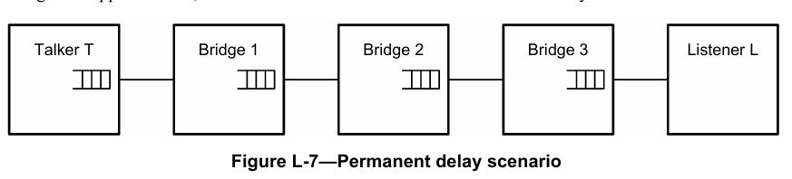
图 L-7 永久延迟场景

在图 L-7 中，发送方（Talker）站 T 为通过 3 个桥接器到达接收方（Listener）站 L 的 SR 类别 X 流，预留了尽可能高的带宽 \(R_X\)。为便于讨论，假设 \(R_X\) 是所有三个桥接器出站端口上类别 X 的最大可预留数据速率，且发送方（Talker）T 开始以预留数据速率 \(R_X\) 传输流。假设局域网距离较短且无干扰流量（即仅处理该特定流），则每个桥接器中的缓冲区占用量将趋近于零，因为帧一被接收即可转发。

在图 L-8 中，第二次传输 Q 对类别 X 产生了最大可能的干扰（即类别 X 的下一个待传输帧被延迟了 \(qDelay\)）。发送方（Talker）T 的类别 X 队列被填满，其信用（credit）增加到 \(hiCredit_X\)（图中显示为 \(C = C_X\)）。由于 T 不再传输类别 X 的帧，下游桥接器面临帧匮乏，其缓冲区为空且信用（credit）为零（\(C = 0\)）。

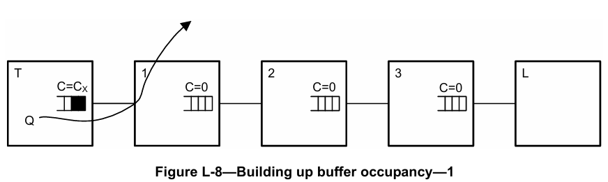
图 L-8 缓冲区占用累积-1

在图 L-9 中，干扰流量消失，T 能够以线路速率传输最大大小的类别 X 突发帧；突发传输结束后，T 恢复以预留速率 \(R_X\) 传输流。由于桥接器 1 没有信用（credit），它必须缓冲大部分突发帧，且由于 T 发送帧的速度与桥接器 1 处理帧的速度相同，其缓冲区占用量将保持在该水平（除非有其他因素影响此稳态）。最终，桥接器 1 的信用（credit）值徘徊在 \(hiCredit\) 水平附近；其他桥接器的信用（credit）值将为 0 或介于 0 和 \(loCredit\) 之间（取决于桥接器接收和传输帧的情况）。

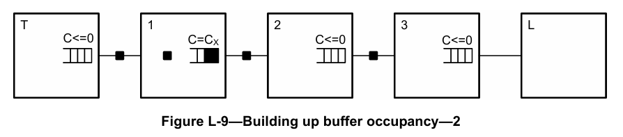
图 L-9 缓冲区占用累积-2

如果干扰流量 Q 再次启动，发送方（Talker）T 的缓冲区占用量将再次累积；然而，由于桥接器 1 仍有缓冲帧，它可以继续传输，下游桥接器不会面临帧匮乏，且桥接器 1 的缓冲区占用量和信用（credit）将恢复到约 0。当干扰停止时，T 会像之前一样以线路速率传输突发帧，这只会将桥接器 1 的队列恢复到图 L-9 所示的状态。

如果新的干扰帧源 S 启动并影响桥接器 1 中的类别 X，那么桥接器 2 和 3 可能再次面临流量匮乏，桥接器 1 中的缓冲区占用量和信用（credit）可能暂时增加到 \(2C_X\)（见图 L-10）。当 S 停止传输时，桥接器 2 可以生成线路速率的突发流量，将其缓冲区恢复到之前的稳态（图 L-9），但此时桥接器 2 会出现如图 L-10 所示的永久性缓冲区负载。

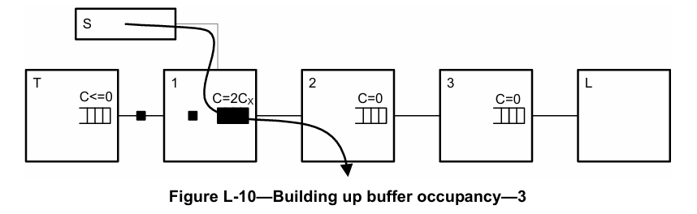
图 L-10 缓冲区占用累积-3

当然，这种情况也可能发生在路径中的其他桥接器上，最终导致每个桥接器都存在一定程度的永久性缓冲区占用。但此后情况不会进一步恶化，因为没有桥接器会面临帧匮乏（即没有桥接器会因无帧可发送而将信用（credit）设为零）——而帧匮乏是产生永久性部分占用的必要条件。

因此，可能有人认为，所有桥接器都应预留比发送方（Talker）实际总预留带宽多一点的带宽，以便这种“永久性”的缓冲区累积能够耗尽。然而，这在出站排队延迟的时间尺度上并不会显著改善问题，因此不会纳入这些计算；当然，这种额外容量会增加每个跳点的排队延迟。

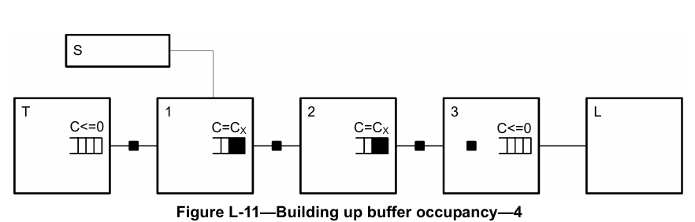
图 L-11 缓冲区占用累积-4

> 注：许多应用的媒体时钟与用于确定类别测量间隔的自由运行时钟不同步。由于这两个时钟可能在其允许的变化范围内处于极端值，因此需要预留比名义上所需更多的带宽，以应对潜在的时钟速率差异。

由于此类事件可能同时在多个入站端口发生，因此“永久性缓冲”的数据量等于最坏情况下的扇入数据量。

### L.3.2 最大干扰延迟和最大缓冲要求
如 L.3.1 所述，给定端口上 SR 类别 X 的最坏情况干扰延迟是以下三部分之和：
a) \(qDelay_X\)（见 L.3.1.1 中的式（L.35））；
b) 扇入延迟（见 L.3.1.2）；
c) “永久性”缓冲区内容贡献（见 L.3.1.3），等于最坏情况下的扇入延迟。

SR 类别 X 的缓冲要求包括以下三部分：
d) 来自排队延迟的贡献，等于 \(maxBurst_X\)；
e) 扇入突发数据大小（按 L.3.1.2 中的描述计算）；
f) “永久性”缓冲区内容，等于扇入突发数据大小。

扇入突发大小和永久性缓冲区内容不会重复计算：如果发生扇入突发，则扇入突发数据将成为永久性缓冲区内容；如果再次发生扇入突发，则必须在永久性缓冲区负载耗尽后才能发生。因此，SR 类别 X 的最坏情况缓冲要求是前两个元素之和——\(maxBurst_X\) [式（L.42）] 和扇入突发数据大小，即：
\[maxBuffer_{X} = maxBurst_{X} + (fan-in\ burst\ data\ size)_{X} \quad (L.45)\]

给定端口上所有 SR 类别的最坏情况总缓冲要求是以下两部分之和：
g) 该端口上最低优先级 SR 类别的最坏情况缓冲要求；
h) 每个入站端口 i 对应每个优先级高于类别 X 的类别 Z 的一个最大大小帧 \(M_{i,Z}\)。

由于类别 X 的最坏情况缓冲要求出现在它占用了几乎所有来自更高优先级类别的带宽时，因此 SR 优先级级别可以共享缓冲空间。唯一的额外要求是来自其他端口更高优先级的扇入数据。因此，SR 类别最好在每个端口上共享其缓冲空间。

## L.4 协调共享网络中基于信用的整形器的运行
协调共享网络（CSN）是一种无竞争、支持服务质量（QoS）、时分多路访问的网络。网络中的一个节点充当网络协调器（NC）节点，为网络中的其他节点分配传输机会。网络协调器（NC）节点还充当网络的服务质量（QoS）管理器。

从基于信用的整形器的规范角度来看，协调共享网络（CSN）相当于一个分布式桥接器。与其在可能缺乏缓冲资源的出口节点中对音频视频（AV）流量进行整形，不如在网络协调器（NC）调度从协调共享网络（CSN）入口到协调共享网络（CSN）出口节点的传输机会时，由网络协调器（NC）按服务类别对流量进行整形。无论整形器如何实现，协调共享网络（CSN）出口到其他媒体访问控制（MAC）技术的行为都应与本标准中规定的行为一致。

---
