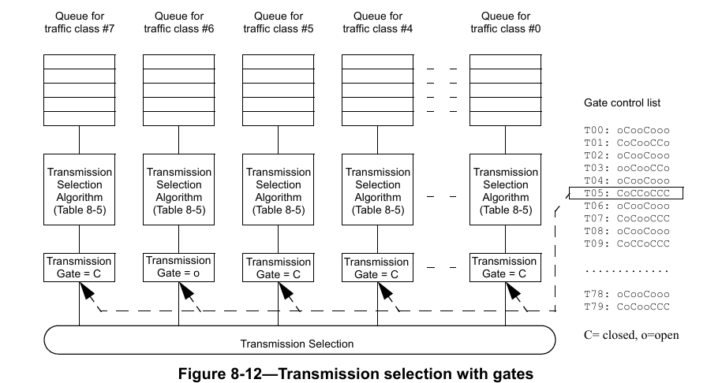
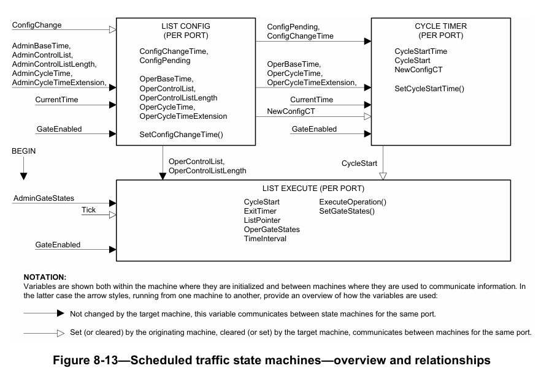
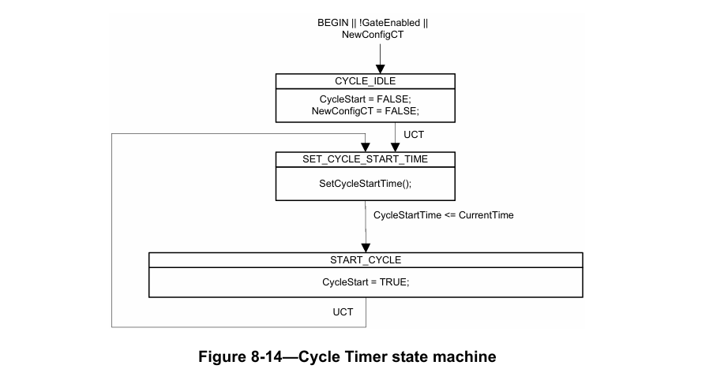
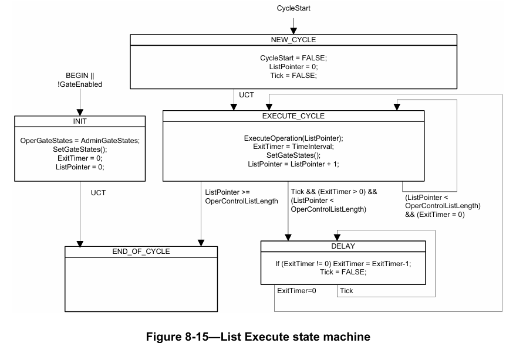
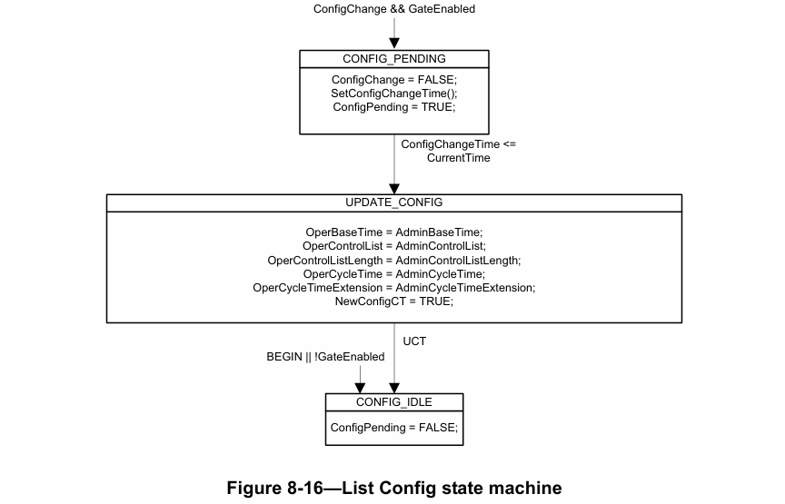
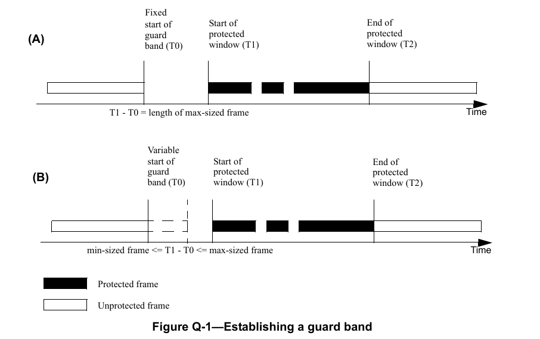
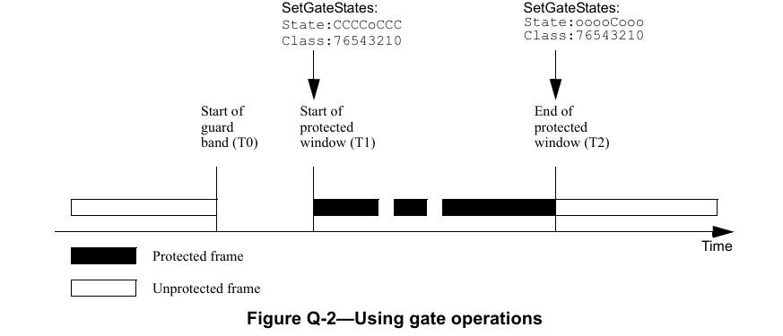

# 电气和电子工程师协会标准局域网和城域网标准 —— 网桥和桥接网络 修正案 25：调度流量增强功能

**重要声明**：IEEE标准文档并非旨在确保安全、健康或环境保护，也不保证避免与其他设备或网络的干扰。IEEE标准文档的实施者有责任确定并遵守所有适用的安全、安全、环境、健康和干扰保护规范以及所有适用的法律法规。

本IEEE文档的使用遵循重要声明和法律免责声明。这些声明和免责声明会出现在所有包含本文档的出版物中，通常位于“重要声明”或“关于IEEE文档的重要声明和免责声明”标题下。也可应要求从IEEE获取或访问网址：http://standards.ieee.org/IPR/disclaimers.html 查看。

（本修正案基于IEEE Std 802.1Q™-2014，并经IEEE Std 802.1Qca™-2015、IEEE Std 802.1Qcd™-2015和IEEE Std 802.1Q-2014/Cor 1-2015修订。）

注：本修正案中包含的编辑说明规定了如何将其中的内容与现有基础标准及其修正案合并，以形成完整的标准。

编辑说明以粗斜体显示。共使用四种编辑说明：修改（change）、删除（delete）、插入（insert）和替换（replace）。修改（change）用于修正现有文本或表格中的内容，编辑说明会指明修改位置，并通过删除线（删除旧内容）和下划线（添加新内容）描述修改内容。删除（delete）用于移除现有内容。插入（insert）用于在不影响现有内容的情况下添加新内容。删除和插入操作可能需要重新编号，若需重新编号，编辑说明中会给出相关指示。替换（replace）用于修改图或公式，即移除现有图或公式并替换为新的图或公式。编辑说明、修改标记和本注不会保留到未来版本中，因为相关修改将被整合到基础标准中。

# 2. 规范性引用文件
按字母数字顺序插入以下引用文件：
IEEE Std 802.1AS™《局域网和城域网标准——桥接局域网中时间敏感应用的定时与同步》

# 3. 定义
按字母顺序插入以下定义，并酌情重新编号，后续术语也相应重新编号：
3.1 闸门关闭事件（gate-close event）：当与队列关联的传输闸门从开启状态切换到关闭状态时发生的事件，该事件会断开转发过程的传输选择功能与队列的连接，阻止其从该队列中选择帧。
3.2 闸门开启事件（gate-open event）：当与队列关联的传输闸门从关闭状态切换到开启状态时发生的事件，该事件会将转发过程的传输选择功能与队列连接，允许其从该队列中选择帧。
3.3 闸门周期（gating cycle）：闸门控制列表中的操作序列重复执行的时间周期。
3.4 传输闸门（transmission gate）：用于连接或断开转发过程的传输选择功能与队列的闸门，可允许或阻止传输选择功能从该队列中选择帧。该闸门有两种状态：开启（Open）和关闭（Closed）。

# 4. 缩略语
按字母顺序插入以下缩略语：
- PTP：IEEE 1588™ 精确时间协议（precision time protocol）
- TAI：国际原子时（Temps Atomic International-International Atomic Time）

# 5. 一致性
## 5.4 虚拟局域网（VLAN）网桥组件要求
### 5.4.1 虚拟局域网（VLAN）网桥组件选项
在字母列表末尾插入以下项目，并酌情重新编号：
ac) 支持 8.6.8.4 中规定的调度流量增强功能；
ad) 支持 12.29 中规定的调度流量管理实体。

## 5.13 介质访问控制（MAC）网桥组件要求
### 5.13.1 介质访问控制（MAC）网桥组件选项
在字母列表末尾插入以下项目，并酌情重新编号：
l) 支持 8.6.8.4 中规定的调度流量增强功能；
m) 支持 8.6.9 中规定的调度流量状态机。

## 5.24 边缘虚拟桥接（EVB）站要求
在第 5 条末尾、5.24.1.2 之后插入以下新子条款：
### 5.25 终端站要求——调度流量增强功能
符合本标准中调度流量增强功能规定的终端站实现应满足：
a) 支持 8.6.8.4 中规定的调度流量增强功能；
b) 支持 8.6.9 中规定的调度流量状态机。

# 6. 介质访问控制（MAC）服务支持
## 6.5 服务质量（QoS）维护
### 6.5.2 帧丢失
在编号列表末尾插入新的列表项 b8)：
8) 网桥支持调度流量增强功能（8.6.8.4），且服务数据单元的大小超过该帧将要入队的流量类别队列的 $queueMaxSDU$（8.6.8.4）值。

# 8. 网桥操作原理
## 8.6 转发过程
### 8.6.6 帧排队
删除 8.6.6 的第四段（原文已删除，此处不翻译）。
修改 8.6.6 的注 2 如下：
注 2：不同端口可实现不同数量的流量类别。支持单一传输优先级的介质访问方式（如以太网）的端口，可支持多个流量类别。

### 8.6.8 传输选择
修改 8.6.8 的第一段如下：
对于每个端口，帧的传输选择基于该端口支持的流量类别以及该端口上对应队列所支持的传输选择算法的运行情况。对于给定端口和支持的流量类别值，仅当满足以下条件时，才会从对应队列中选择帧进行传输：

在 8.6.8 末尾插入新段落如下：
当支持调度流量增强功能时，需额外满足 8.6.8.4 中规定的用于确定帧是否可传输的要求。

#### 8.6.8.2 基于信用的整形器算法
修改 8.6.8.2 列表项 d) 的文本，并添加注如下：
d) 空闲斜率（idleSlope）：当信用值增加时（即传输状态为 FALSE 且队列的传输闸门处于开启状态[8.6.8.4]），信用的变化率（以比特/秒为单位）。空闲斜率的值不得超过端口传输速率（portTransmitRate）。如果不支持调度流量增强功能（8.6.8.4），或闸门使能（GateEnabled）为 FALSE（8.6.9.4.14），则给定队列的空闲斜率值等于该队列的操作空闲斜率（operIdleSlope(N)）参数值（见 34.3 中的定义）。如果支持调度流量增强功能（8.6.8.4），且闸门使能（GateEnabled）为 TRUE（8.6.9.4.14），则：
$idleSlope = (operIdleSlope(N) \times OperCycleTime / GateOpenTime)$
其中，操作周期时间（OperCycleTime）见 8.6.9.4.20 中的定义，闸门开启时间（GateOpenTime）等于闸门周期内该队列的闸门处于开启状态的总时间。

注：当启用调度流量操作时，仅在闸门开启期间积累信用；因此，空闲斜率的有效数据速率会相应提高，以反映与该队列关联的传输闸门的工作周期；但该队列的操作空闲斜率（operIdleSlope(N)）值保持不变。

修改 8.6.8.2 列表项 f) 的文本如下：
f) 信用（credit）：当前可用于队列的传输信用（以比特为单位）。如果在任何时刻，队列中无帧、传输参数为 FALSE、队列的传输闸门处于开启状态（8.6.8.4）且信用为正值，则将信用设置为零。

#### 8.6.8.3 增强传输选择（ETS）算法
在 8.6.8.3 之后插入新子条款 8.6.8.4，并酌情重新编号：
##### 8.6.8.4 调度流量增强功能
网桥或终端站可支持增强功能，使每个队列的传输能够相对于已知时间尺度进行调度。为实现这一功能，每个队列均关联一个传输闸门；传输闸门的状态决定了排队的帧是否可被选择进行传输（见图 8-12）。对于给定队列，传输闸门可处于以下两种状态之一：



图 8-12 带闸门的传输选择
（注：图中 C=关闭（closed），o=开启（open）；闸门控制列表包含不同时刻各流量类别队列的闸门状态，传输选择算法根据闸门状态和队列优先级选择待传输帧）

a) 开启（Open）：根据与队列关联的传输选择算法的定义，选择排队的帧进行传输；
b) 关闭（Closed）：不选择排队的帧进行传输。

每个端口关联的闸门控制列表包含有序的闸门操作序列。每个闸门操作会改变该端口各流量类别队列所关联闸门的传输闸门状态。在不支持调度流量增强功能的实现中，所有闸门均默认永久处于开启状态。表 8-6 列出了闸门操作类型、其参数以及执行后产生的操作。控制闸门控制列表执行的状态机及其变量和过程，见 8.6.9 中的规定。

除传输选择算法执行的其他检查外，若流量类别队列上的帧满足以下条件，则该帧不可用于传输[如 8.6.8 中的测试(a)和(b)所要求]：传输闸门处于关闭状态，或在该队列的下一个闸门关闭事件（3.1）之前，没有足够的时间传输整个帧。如果实现检测到当队列的闸门关闭事件发生时，该队列中的某一帧仍在通过介质访问控制（MAC）进行传输，则递增该流量类别的传输溢出（TransmissionOverrun）计数器（12.29.1.1.2）。

<html>
<table border="1">
<caption>表 8-6 闸门操作</caption>
<thead>
<tr>
<th>操作名称</</th>
<th>参数</</th>
<th>操作</</th>
</tr>
</thead>
<tbody>
<tr>
<td>设置闸门状态（SetGateStates）</td>
<td>闸门状态（GateState）、时间间隔（TimeInterval）</td>
<td>闸门状态（GateState）参数指定每个端口队列的状态（开启或关闭）。立即将闸门设置为闸门状态（GateState）参数指定的状态。对于任何新闸门状态相对于当前闸门状态发生变化的队列，这将导致闸门关闭事件（3.1）和/或闸门开启事件（3.2）发生。自闸门控制列表中前一个闸门操作完成后，经过时间间隔（TimeInterval）个时钟周期（8.6.9.4.16），控制权传递至下一个闸门操作。</td>
</tr>
</tbody>
</table>
</html>

注 1：假设实现已知在给定端口传输帧所涉及的传输开销，因此能够确定帧的传输时间。但在某些情况下，帧的大小（进而其传输所需的时间）可能未知；例如，支持直通转发（cut-through）的情况，或支持帧抢占（frame preemption）且无法提前确定某一帧在传输完成前会被抢占多少次的情况。对于此类流量，其调度应设计为能够适应预期的传输模式，且不会超出相关流量类别的下一个闸门关闭事件。

注 2：假设实现可根据闸门事件序列确定下一个闸门关闭事件的发生时间。在正常情况下，这可通过检查操作控制列表（OperControlList）（8.6.9.4.19）及相关变量中的闸门操作序列来实现。然而，当即将安装新配置时，需同时检查操作控制列表（OperControlList）和管理控制列表（AdminControlList）（8.6.9.4.2）及相关变量的内容，以确定下一个闸门关闭事件的时间，因为新配置的闸门周期在大小和相位上可能与旧周期不同。

每个流量类别队列的队列最大服务数据单元（queueMaxSDU）参数定义了该队列支持的最大服务数据单元（SDU）大小；超过队列最大服务数据单元（queueMaxSDU）的帧将被丢弃[6.5.2 b8)]。每个队列的队列最大服务数据单元（queueMaxSDU）值可通过管理配置（12.29）；其默认值为该帧将要转发到的局域网上所采用的介质访问控制（MAC）规程支持的最大服务数据单元（SDU）大小[6.5.2 b3)]。

注 3：优先级流控制（PFC）的使用可能会干扰流量调度，因为优先级流控制（PFC）由更高层实体传输（见第 36 条）。

为使终端站支持帧的调度传输，其行为需与所连接的网桥中采用的转发和排队机制的操作兼容。实际上，终端站的要求是其传输选择功能的运行方式应等同于支持调度流量的网桥的单个出站端口。终端站对调度流量的接收无特殊要求，仅对调度流量的传输有要求。

在 8.6.8 之后插入新子条款 8.6.9，并酌情重新编号：
### 8.6.9 调度流量状态机
端口的闸门控制列表（8.6.8.4）中的闸门操作的执行由三个状态机控制：
a) 周期计时器状态机（8.6.9.1）；
b) 列表执行状态机（8.6.9.2）；
c) 列表配置状态机（8.6.9.3）。

每个支持调度流量增强功能的端口均实例化一个上述状态机。

周期计时器状态机启动闸门控制列表的执行，并确保维持为该端口定义的闸门周期时间。

列表执行状态机按顺序执行闸门控制列表中的闸门操作，并在每个操作之间建立适当的时间延迟。

列表配置状态机管理当前活动调度的更新过程，在执行更新过程时中断其他两个状态机的操作，并在新调度安装完成后重新启动它们。

状态机的表示法见附录 E 中的规定。

状态机的概述（包括它们之间的关系以及所使用的变量）见图 8-13。



图 8-13 调度流量状态机——概述与关系
（注：图中展示了周期计时器状态机、列表配置状态机和列表执行状态机之间的变量交互关系，包括管理配置参数、操作配置参数、状态控制信号等）

#### 8.6.9.1 周期计时器状态机
周期计时器状态机应实现图 8-14 中的状态图以及 8.6.9.1.1 和 8.6.9.4 中的相关定义所规定的功能。



图 8-14 周期计时器状态机
（注：状态机包含空闲状态（CYCLE_IDLE）、设置周期开始时间状态（SET_CYCLE_START_TIME）和启动周期状态（START_CYCLE），通过状态转移条件和动作实现周期控制）

##### 8.6.9.1.1 设置周期开始时间（SetCycleStartTime()）
设置周期开始时间（SetCycleStartTime()）过程确定下一个闸门控制列表执行周期的开始时间。该过程基于当前时间（CurrentTime）（8.6.9.4.10）、操作基准时间（OperBaseTime）（8.6.9.4.18）、操作周期时间（OperCycleTime）（8.6.9.4.20）、操作周期时间扩展（OperCycleTimeExtension）（8.6.9.4.21）、配置更改时间（ConfigChangeTime）（8.6.9.4.9）和配置挂起（ConfigPending）（8.6.9.4.8）的值，按照以下规则将周期开始时间（CycleStartTime）变量（8.6.9.4.12）设置为开始时间：

a) 如果：
配置挂起（ConfigPending）= FALSE，且
操作基准时间（OperBaseTime）≥ 当前时间（CurrentTime）
（即操作基准时间（OperBaseTime）指定当前时间或未来时间）
则：
周期开始时间（CycleStartTime）= 操作基准时间（OperBaseTime）。

b) 如果：
配置挂起（ConfigPending）= FALSE，且
操作基准时间（OperBaseTime）< 当前时间（CurrentTime）
（即操作基准时间（OperBaseTime）指定过去的时间）
则：
$CycleStartTime = (OperBaseTime + N \times OperCycleTime)$
其中，N 是满足以下关系的最小整数：
周期开始时间（CycleStartTime）≥ 当前时间（CurrentTime）。

c) 如果：
配置挂起（ConfigPending）= TRUE，且
配置更改时间（ConfigChangeTime）>（当前时间（CurrentTime）+ 操作周期时间（OperCycleTime）+ 操作周期时间扩展（OperCycleTimeExtension））
则：
$CycleStartTime = (OperBaseTime + N \times OperCycleTime)$
其中，N 是满足以下关系的最小整数：
周期开始时间（CycleStartTime）≥ 当前时间（CurrentTime）。

d) 如果：
配置挂起（ConfigPending）= TRUE，且
配置更改时间（ConfigChangeTime）≤（当前时间（CurrentTime）+ 操作周期时间（OperCycleTime）+ 操作周期时间扩展（OperCycleTimeExtension））
则：
周期开始时间（CycleStartTime）= 配置更改时间（ConfigChangeTime）。

注 1：由于精确时间协议（PTP）时间尺度的起点为 1970 年 1 月 1 日 00:00:00（国际原子时（TAI）），因此周期开始时间（CycleStartTime）将大于 1.3×10^18 纳秒。如果计算 N 时未保持足够的精度，周期开始时间（CycleStartTime）将不会是操作周期时间（OperCycleTime）的整数倍，这可能导致不同网桥上端口的周期不一致。

注 2：如果所有网桥和终端站的管理基准时间（AdminBaseTime）都设置为过去的同一时间，则操作基准时间（OperBaseTime）始终处于过去，且所有周期同步启动。当能够在启动使用调度的应用程序之前启动调度时，将管理基准时间（AdminBaseTime）设置为过去的时间是合适的。将管理基准时间（AdminBaseTime）设置为未来的时间，旨在将所有网桥和终端站中当前运行的调度在未来某个时间更改为新调度。当需要在不停止应用程序的情况下更改调度时，将管理基准时间（AdminBaseTime）设置为未来的时间是合适的。
# 8.6.9.2 列表执行状态机
列表执行状态机应实现图 8-15 中的状态图以及 8.6.9.2.1、8.6.9.2.2 和 8.6.9.4 中的相关定义所规定的功能。



图 8-15 列表执行状态机
（注：状态机包含初始化状态（INIT）、新周期状态（NEW_CYCLE）、执行周期状态（EXECUTE_CYCLE）、延迟状态（DELAY）和周期结束状态（END_OF_CYCLE），通过状态转移和动作实现闸门控制列表的有序执行）

## 8.6.9.2.1 执行操作（ExecuteOperation()）
执行操作（ExecuteOperation()）过程负责从操作控制列表（OperControlList）中获取下一个闸门操作及其相关参数，并根据所获取的闸门操作执行相应动作。列表指针（ListPointer）变量（8.6.9.4.15）的值用作操作控制列表（OperControlList）的索引。该过程根据操作名称（表 8-6）对操作进行处理，具体如下：

a) 如果操作名称为设置闸门状态（SetGateStates），则将该操作关联的闸门状态（GateState）参数值赋给操作闸门状态（OperGateStates）变量（8.6.9.4.22），并将该操作关联的时间间隔（TimeInterval）参数值赋给时间间隔（TimeInterval）变量（8.6.9.4.24）。如果该操作关联的时间间隔（TimeInterval）参数值为 0，则将时间间隔（TimeInterval）变量赋值为 1。

b) 如果操作名称无法识别，则将列表指针（ListPointer）变量（8.6.9.4.15）赋值为操作控制列表长度（OperControlListLength）变量（8.6.9.4.23）的值，并将时间间隔（TimeInterval）变量（8.6.9.4.24）赋值为 0。

c) 如果操作没有关联的时间间隔（TimeInterval）参数，则将时间间隔（TimeInterval）变量赋值为 0。

## 8.6.9.2.2 设置闸门状态（SetGateStates()）
该过程根据操作闸门状态（OperGateStates）变量（8.6.9.4.22）的值，设置端口各队列的闸门状态。

注：如果操作闸门状态（OperGateStates）值与之前的闸门状态不同，设置闸门状态（SetGateStates()）过程将触发闸门开启事件和/或闸门关闭事件（3.1、3.2）。对于某个给定队列，闸门开启事件与后续闸门关闭事件之间的最大时间间隔可能小于队列最大服务数据单元（queueMaxSDU）的值，在这种情况下，那些长度超过传输时间限制但小于队列最大服务数据单元（queueMaxSDU）的帧可能会被排入该队列。此类帧将永远无法传输，但最终会因超过最大帧生存期而被丢弃（6.5.2、6.5.6）。此外，网桥允许丢弃那些永远无法传输的帧[6.5.2 b8)]。

### 8.6.9.3 列表配置状态机
列表配置状态机应实现图 8-16 中的状态图以及 8.6.9.3.1 和 8.6.9.4 中的相关定义所规定的功能。



图 8-16 列表配置状态机
（注：状态机包含配置空闲状态（CONFIG_IDLE）、配置挂起状态（CONFIG_PENDING）和更新配置状态（UPDATE_CONFIG），用于管理调度配置的更新过程）

## 8.6.9.3.1 设置配置更改时间（SetConfigChangeTime()）
设置配置更改时间（SetConfigChangeTime()）过程确定周期配置变量的管理值复制到操作值的时间。该过程基于管理基准时间（AdminBaseTime）（8.6.9.4.1）和管理周期时间（AdminCycleTime）（8.6.9.4.3）的值，按照以下规则将配置更改时间（ConfigChangeTime）变量（8.6.9.4.9）设置为开始时间：

a) 如果：
管理基准时间（AdminBaseTime）≥ 当前时间（CurrentTime）（8.6.9.4.10）（即管理基准时间（AdminBaseTime）指定当前时间或未来时间）
则：
配置更改时间（ConfigChangeTime）= 管理基准时间（AdminBaseTime）

b) 如果：
（管理基准时间（AdminBaseTime）< 当前时间（CurrentTime））且（闸门使能（GateEnabled）= FALSE）（即管理基准时间（AdminBaseTime）指定过去的时间，且当前调度已停止）
则：
$ConfigChangeTime = (AdminBaseTime + N \times AdminCycleTime)$
其中，N 是满足以下关系的最小整数：
配置更改时间（ConfigChangeTime）≥ 当前时间（CurrentTime）

c) 如果：
（管理基准时间（AdminBaseTime）< 当前时间（CurrentTime））且（闸门使能（GateEnabled）= TRUE）（即管理基准时间（AdminBaseTime）指定过去的时间，且当前调度正在运行）
则：
递增配置更改错误（ConfigChangeError）计数器（12.29.1）
$ConfigChangeTime = (AdminBaseTime + N \times AdminCycleTime)$
其中，N 是满足以下关系的最小整数：
配置更改时间（ConfigChangeTime）≥ 当前时间（CurrentTime）

### 8.6.9.4 状态机变量
#### 8.6.9.4.1 管理基准时间（AdminBaseTime）
基准时间的管理值，以 IEEE 1588 精确时间协议（PTP）时间尺度表示（见 IEEE Std 802.1AS-2011 的 8.2）。该值可通过管理进行更改，并被列表配置状态机（8.6.9.3）用于设置操作基准时间（OperBaseTime）（8.6.9.4.18）的值。

注：精确时间协议（PTP）时间尺度中的时间表示为自 1970 年 1 月 1 日 00:00:00（国际原子时（TAI））起经过的秒数、纳秒数和分数纳秒数。

#### 8.6.9.4.2 管理控制列表（AdminControlList）
端口的闸门控制列表的管理版本。该值可通过管理进行更改，并被列表配置状态机（8.6.9.3）用于设置操作控制列表（OperControlList）（8.6.9.4.19）的值。

#### 8.6.9.4.3 管理周期时间（AdminCycleTime）
端口的闸门周期的管理值（3.3）。该值可通过管理进行更改，并被列表配置状态机（8.6.9.3）用于设置操作周期时间（OperCycleTime）（8.6.9.4.20）的值。管理周期时间（AdminCycleTime）变量是一个以秒为单位的有理数，由整数分子和整数分母定义。

#### 8.6.9.4.4 管理周期时间扩展（AdminCycleTimeExtension）
以纳秒为单位的整数，定义安装新周期配置时端口的闸门周期（3.3）允许延长的最大时间。该管理值可通过管理进行更改，并被列表配置状态机（8.6.9.3）用于设置操作周期时间扩展（OperCycleTimeExtension）（8.6.9.4.21）的值。

#### 8.6.9.4.5 管理闸门状态（AdminGateStates）
端口各队列关联的闸门的初始状态由列表执行状态机（8.6.9.2）设置，并由管理闸门状态（AdminGateStates）变量的值确定。管理闸门状态（AdminGateStates）的默认值为所有队列均处于开启状态。该值可通过管理进行更改。

#### 8.6.9.4.6 管理控制列表长度（AdminControlListLength）
该值可通过管理进行更改，并被列表配置状态机（8.6.9.3）用于设置操作控制列表长度（OperControlListLength）（8.6.9.4.23）的值。

#### 8.6.9.4.7 配置更改（ConfigChange）
一个布尔变量，用作列表配置状态机（8.6.9.3）的启动信号，指示端口的管理变量值已准备好复制到对应的操作变量中。该变量由管理设置为 TRUE，由列表配置状态机设置为 FALSE。

#### 8.6.9.4.8 配置挂起（ConfigPending）
一个布尔变量，由列表配置状态机（8.6.9.3）设置为 TRUE，以指示存在等待安装的新周期配置。当列表配置状态机完成新配置的安装后，该变量被设置为 FALSE。该变量被设置周期开始时间（SetCycleStartTime()）过程（8.6.9.1.1）用于控制使用新配置值的第一个周期之前的那个周期的长度。该值可按照 12.29.1 中的规定通过管理进行读取。

#### 8.6.9.4.9 配置更改时间（ConfigChangeTime）
周期配置的管理变量复制到对应操作变量的时间，以精确时间协议（PTP）时间尺度表示。该变量的值由列表配置状态机（8.6.9.3）中的设置配置更改时间（SetConfigChangeTime()）过程（8.6.9.3.1）设置。

#### 8.6.9.4.10 当前时间（CurrentTime）
本地系统维护的当前时间，以精确时间协议（PTP）时间尺度表示（见 IEEE Std 802.1AS-2011 的 8.2）。

注 1：可使用其他时间源提供时间值。实现必须确保实现与负责制定时间调度的实体共享相同的时间视图。所描述的机制也适用于其他时间格式。

注 2：根据状态机的定义，时间不连续性会对状态机的操作产生可预测的影响。建议实现者和/或用户了解这些影响可能是什么，并要么限制此类不连续性，要么确保其结果不会对应用产生不利影响。

#### 8.6.9.4.11 周期启动（CycleStart）
一个布尔变量，用作周期计时器状态机（8.6.9.1）向列表执行状态机发送的启动信号，指示开始执行闸门控制列表。该变量由周期计时器状态机设置为 TRUE，由列表执行状态机（8.6.9.2）设置为 FALSE。

#### 8.6.9.4.12 周期开始时间（CycleStartTime）
下一个闸门控制列表执行周期的开始时间，以精确时间协议（PTP）时间尺度表示。该参数的值由周期计时器状态机（8.6.9.1）中的设置周期开始时间（SetCycleStartTime()）过程（8.6.9.1.1）设置。

#### 8.6.9.4.13 退出计时器（ExitTimer）
一个计时器，用于实现当前执行的闸门操作相关的延迟，以纳秒为单位的整数表示。该值由列表执行状态机（8.6.9.2）的操作进行设置。

#### 8.6.9.4.14 闸门使能（GateEnabled）
一个布尔变量，指示状态机的操作是否启用（TRUE）或禁用（FALSE）。该变量由管理进行设置。其默认值为 FALSE。

#### 8.6.9.4.15 列表指针（ListPointer）
一个整数，用作操作控制列表（OperControlList）（8.6.9.4.19）中条目的指针，每个条目包含一个闸门操作及其相关参数（表 8-6）。值为 0 指向列表中的第一个条目；值为（操作控制列表长度（OperControlListLength）- 1）指向列表中的最后一个条目。

#### 8.6.9.4.16 时钟滴答（Tick）
一个布尔变量，由特定于实现的系统时钟函数以 1 纳秒的间隔设置为 TRUE，用于控制退出计时器（ExitTimer）变量（8.6.9.4.13）的递减。该变量由列表执行状态机（8.6.9.2）的操作设置为 FALSE。

注：虽然状态机的文档基于纳秒级时钟“滴答”，但预计实际实现将使用各种频率精度和粒度不同的时钟。因此，12.29 中规定的管理参数允许管理站发现实现的周期计时器时钟的特性（时钟滴答粒度（TickGranularity）），并相应地设置闸门周期的参数。

#### 8.6.9.4.17 新配置周期计时器（NewConfigCT）
一个布尔变量，用作列表配置状态机（8.6.9.3）向周期计时器状态机（8.6.9.1）发送的信号，指示正在处理新配置。该变量由列表配置状态机的操作设置为 TRUE，由周期计时器状态机（8.6.9.1）的操作设置为 FALSE。

#### 8.6.9.4.18 操作基准时间（OperBaseTime）
基准时间的操作值，以精确时间协议（PTP）时间尺度表示（见 IEEE Std 802.1AS-2011 的 8.2）。该变量被列表配置状态机（8.6.9.3）使用。

#### 8.6.9.4.19 操作控制列表（OperControlList）
端口的活动闸门控制列表；列表执行状态机执行该列表。列表的内容在列表配置状态机（8.6.9.3）的控制下，从管理控制列表（AdminControlList）（8.6.9.4.2）动态填充。

#### 8.6.9.4.20 操作周期时间（OperCycleTime）
端口的闸门周期的操作值（3.3）。该变量在列表配置状态机（8.6.9.3）的控制下，从管理周期时间（AdminCycleTime）变量（8.6.9.4.3）动态设置。操作周期时间（OperCycleTime）被周期计时器状态机（8.6.9.1）用于强制端口的周期时间。操作周期时间（OperCycleTime）变量是一个以秒为单位的有理数，由整数分子和整数分母定义。

#### 8.6.9.4.21 操作周期时间扩展（OperCycleTimeExtension）
以纳秒为单位的整数，定义安装新周期配置时端口的闸门周期（3.3）允许延长的最大时间。该操作值由列表配置状态机（8.6.9.3）设置为管理周期时间扩展（AdminCycleTimeExtension）（8.6.9.4.4）的值。操作周期时间扩展（OperCycleTimeExtension）的值被设置周期开始时间（SetCycleStartTime()）过程（8.6.9.1.1）使用。

#### 8.6.9.4.22 操作闸门状态（OperGateStates）
端口各队列关联的闸门的当前状态。操作闸门状态（OperGateStates）由列表执行状态机（8.6.9.2）设置，其初始值由管理闸门状态（AdminGateStates）变量（8.6.9.4.5）确定。

#### 8.6.9.4.23 操作控制列表长度（OperControlListLength）
该变量在列表配置状态机（8.6.9.3）的控制下，从管理控制列表长度（AdminControlListLength）参数（8.6.9.4.6）动态设置。操作控制列表长度（OperControlListLength）指示操作控制列表（OperControlList）中的条目数量，并被列表执行状态机（8.6.9.2）用于确定是否已到达列表末尾。

#### 8.6.9.4.24 时间间隔（TimeInterval）
设置为当前执行的闸门操作所关联的时间间隔（TimeInterval）参数的值。用于列表执行状态机（8.6.9.2）的操作。

# 12. 网桥管理
在 12.28 之后插入新子条款 12.29，并酌情重新编号：

## 12.29 调度流量管理对象
支持调度流量的网桥增强功能在 8.6.8 和 8.6.8.4 中定义。

构成该管理资源的对象如下：
a) 闸门参数表（12.29.1）

### 12.29.1 闸门参数表
网桥组件的每个端口都有一个闸门参数表。每个表行包含一组支持调度流量增强功能（8.6.8.4）的参数，详见表 12-28。在支持端口和组件动态配置的实现中，可动态创建或删除表中的行。

<html>
<table border="1">
<caption>表 12-28 闸门参数表</caption>
<thead>
<tr>
<th>名称</</th>
<th>数据类型</</th>
<th>支持的操作<sup>a</sup></</th>
<th>一致性<sup>b</sup></</th>
<th>引用</</th>
</tr>
</thead>
<tbody>
<tr>
<td>队列最大服务数据单元表（queueMaxSDUTable）<sup>c</sup></td>
<td>队列最大服务数据单元（queueMaxSDU）的序列</td>
<td>读/写（RW）</td>
<td>网桥/终端站（BE）</td>
<td>8.6.8.4、12.29.1.1、12.29.1.1.1</td>
</tr>
<tr>
<td>闸门使能（GateEnabled）</td>
<td>布尔（Boolean）</td>
<td>读/写（RW）</td>
<td>网桥/终端站（BE）</td>
<td>8.6.9.4.14</td>
</tr>
<tr>
<td>管理闸门状态（AdminGateStates）</td>
<td>闸门状态值（gateStatesValue）</td>
<td>读/写（RW）</td>
<td>网桥/终端站（BE）</td>
<td>8.6.9.4.5、12.29.1.2、12.29.1.2.2</td>
</tr>
<tr>
<td>操作闸门状态（OperGateStates）</td>
<td>闸门状态值（gateStatesValue）</td>
<td>只读（R）</td>
<td>网桥/终端站（BE）</td>
<td>8.6.9.4.22、12.29.1.2、12.29.1.2.2</td>
</tr>
<tr>
<td>管理控制列表长度（AdminControlListLength）</td>
<td>无符号整数（unsigned integer）</td>
<td>读/写（RW）</td>
<td>网桥/终端站（BE）</td>
<td>8.6.9.4.6、12.29.1.2</td>
</tr>
<tr>
<td>操作控制列表长度（OperControlListLength）</td>
<td>无符号整数（unsigned integer）</td>
<td>只读（R）</td>
<td>网桥/终端站（BE）</td>
<td>8.6.9.4.23、12.29.1.2</td>
</tr>
<tr>
<td>管理控制列表（AdminControlList）</td>
<td>闸门控制条目（GateControlEntry）的序列</td>
<td>读/写（RW）</td>
<td>网桥/终端站（BE）</td>
<td>8.6.9.4.2、12.29.1.2、12.29.1.2.1</td>
</tr>
<tr>
<td>操作控制列表（OperControlList）</td>
<td>闸门控制条目（GateControlEntry）的序列</td>
<td>只读（R）</td>
<td>网桥/终端站（BE）</td>
<td>8.6.9.4.19、12.29.1.2、12.29.1.2.1</td>
</tr>
<tr>
<td>管理周期时间（AdminCycleTime）</td>
<td>有理数（RationalNumber）</td>
<td>读/写（RW）</td>
<td>网桥/终端站（BE）</td>
<td>8.6.9.4.3、12.29.1.3</td>
</tr>
<tr>
<td>操作周期时间（OperCycleTime）</td>
<td>有理数（秒）（RationalNumber (seconds)）</td>
<td>只读（R）</td>
<td>网桥/终端站（BE）</td>
<td>8.6.9.4.20、12.29.1.3</td>
</tr>
<tr>
<td>管理周期时间扩展（AdminCycleTimeExtension）</td>
<td>整数（纳秒）（Integer (nanoseconds)）</td>
<td>读/写（RW）</td>
<td>网桥/终端站（BE）</td>
<td>8.6.9.4.4</td>
</tr>
<tr>
<td>操作周期时间扩展（OperCycleTimeExtension）</td>
<td>整数（纳秒）（Integer (nanoseconds)）</td>
<td>只读（R）</td>
<td>网桥/终端站（BE）</td>
<td>8.6.9.4.21</td>
</tr>
<tr>
<td>管理基准时间（AdminBaseTime）</td>
<td>精确时间协议时间（PTPtime）</td>
<td>读/写（RW）</td>
<td>网桥/终端站（BE）</td>
<td>8.6.9.4.1、12.29.1.4</td>
</tr>
<tr>
<td>操作基准时间（OperBaseTime）</td>
<td>精确时间协议时间（PTPtime）</td>
<td>只读（R）</td>
<td>网桥/终端站（BE）</td>
<td>8.6.9.4.18、12.29.1.4</td>
</tr>
<tr>
<td>配置更改（ConfigChange）</td>
<td>布尔（Boolean）</td>
<td>读/写（RW）</td>
<td>网桥/终端站（BE）</td>
<td>8.6.9.4.7</td>
</tr>
<tr>
<td>配置更改时间（ConfigChangeTime）</td>
<td>精确时间协议时间（PTPtime）</td>
<td>只读（R）</td>
<td>网桥/终端站（BE）</td>
<td>8.6.9.4.9、12.29.1.4</td>
</tr>
<tr>
<td>时钟滴答粒度（TickGranularity）</td>
<td>整数（十分之一纳秒）（Integer (tenths of nanoseconds)）</td>
<td>只读（R）</td>
<td>网桥/终端站（BE）</td>
<td>8.6.9.4.16</td>
</tr>
<tr>
<td>当前时间（CurrentTime）</td>
<td>精确时间协议时间（PTPtime）</td>
<td>只读（R）</td>
<td>网桥/终端站（BE）</td>
<td>8.6.9.4.10、12.29.1.4</td>
</tr>
<tr>
<td>配置挂起（ConfigPending）</td>
<td>布尔（Boolean）</td>
<td>只读（R）</td>
<td>网桥/终端站（BE）</td>
<td>8.6.9.3、8.6.9.4.8</td>
</tr>
<tr>
<td>配置更改错误（ConfigChangeError）</td>
<td>整数（Integer）</td>
<td>只读（R）</td>
<td>网桥/终端站（BE）</td>
<td>8.6.9.3.1</td>
</tr>
<tr>
<td>支持的列表最大值（SupportedListMax）</td>
<td>整数（Integer）</td>
<td>只读（R）</td>
<td>网桥/终端站（BE）</td>
<td>12.29.1.5</td>
</tr>
</tbody>
<<tfoot>
<tr>
<td colspan="5"><sup>a</sup> R = 只读访问；RW = 读/写访问。<br>
<sup>b</sup> B = 网桥或网桥组件支持调度流量增强功能所需。E = 终端站支持调度流量增强功能所需。<br>
<sup>c</sup> 端口支持的队列数量可从流量类别表（12.6.3）中获取。</td>
</tr>
</</tfoot>
</table>
</html>

## 12.29.1.1 队列最大服务数据单元表（queueMaxSDUTable）结构和数据类型
队列最大服务数据单元表（queueMaxSDUTable）最多包含 8 个条目，每个条目对应实现支持的一个流量类别，每个条目包含一个队列最大服务数据单元（queueMaxSDU）值（12.29.1.1.1）和一个传输溢出（TransmissionOverrun）计数器。

### 12.29.1.1.1 队列最大服务数据单元（queueMaxSDU）
一个无符号整数值，表示队列支持的最大服务数据单元（SDU）大小。

### 12.29.1.1.2 传输溢出（TransmissionOverrun）
一个计数器，当实现检测到与队列关联的传输闸门已关闭，但该队列中的某一帧仍在通过介质访问控制（MAC）进行传输时，该计数器递增。

## 12.29.1.2 闸门控制列表结构和数据类型
管理控制列表（AdminControlList）和操作控制列表（OperControlList）是有序列表，分别包含管理控制列表长度（AdminControlListLength）或操作控制列表长度（OperControlListLength）个条目。每个条目代表表 8-6 中定义的一个闸门操作。列表中的每个条目结构为闸门控制条目（GateControlEntry）（12.29.1.2.1）。

### 12.29.1.2.1 闸门控制条目（GateControlEntry）
闸门控制条目（GateControlEntry）包含一个操作名称，后跟该操作关联的最多 2 个参数（详见表 8-6）。如果存在第一个参数，则该参数为闸门状态值（gateStatesValue）（12.29.1.2.2）；如果存在第二个参数，则该参数为时间间隔值（timeIntervalValue）（12.29.1.2.3）。

### 12.29.1.2.2 闸门状态值（gateStatesValue）
一个最多包含 8 个元组的列表，每个元组对应端口支持的一个流量类别，每个元组由一个 0-7 范围内的流量类别编号和一个枚举值（表示该流量类别的闸门状态：开启或关闭）组成（见表 8-6 中的闸门状态（GateState））。

### 12.29.1.2.3 时间间隔值（timeIntervalValue）
一个无符号整数，表示以纳秒为单位的时间间隔（TimeInterval）（见表 8-6 中的时间间隔（TimeInterval））。

## 12.29.1.3 有理数（RationalNumber）
由整数分子和整数分母表示的有理数。

## 12.29.1.4 精确时间协议时间（PTPtime）
一个时间值，以精确时间协议（PTP）时间尺度表示（见 IEEE Std 802.1AS-2011 的 8.2）。

## 12.29.1.5 支持的列表最大值（SupportedListMax）
该端口支持的管理控制列表长度（AdminControlListLength）和操作控制列表长度（OperControlListLength）参数的最大值。调度计算软件可在计算前使用该值确定端口的控制列表容量。
# 17. 管理信息库（MIB）
## 17.2 管理信息库（MIB）结构
在 17.2 末尾插入新子条款 17.2.22，并酌情重新编号：

### 17.2.22 IEEE8021-ST-MIB 的结构
IEEE8021-ST-MIB 用于配置端口上的调度流量（8.6.8、8.6.8.4）。表 17-28 说明了该 MIB 模块（17.7.22）中定义的 SMIv2 对象与 12.29 中定义的管理对象之间的关系。

<html>
<table border="1">
<caption>表 17-28 IEEE8021-ST-MIB 结构及其与本标准的关系</caption>
<thead>
<tr>
<th>MIB 表</</th>
<th>MIB 对象</</th>
<th>引用</</th>
</tr>
</thead>
<tbody>
<tr>
<td rowspan="4">ieee8021STMaxSDU 子树</td>
<td></td>
<td></td>
</tr>
<tr>
<td>ieee8021STMaxSDUTable</td>
<td>最大服务数据单元（SDU）表，8.6.8.4、8.6.9、12.29.1</td>
</tr>
<tr>
<td>ieee8021STTrafficClass</td>
<td>流量类别（表索引）</td>
</tr>
<tr>
<td>ieee8021STMaxSDU</td>
<td>队列最大服务数据单元（queueMaxSDU），8.6.8.4、8.6.9、12.29.1、12.29.1.1.1</td>
</tr>
<tr>
<td></td>
<td>ieee8021TransmissionOverrun</td>
<td>传输溢出（TransmissionOverrun），8.6.8.4、8.6.9、12.29.1、12.29.1.1.2</td>
</tr>
<tr>
<td rowspan="14">ieee8021STParameters</td>
<td></td>
<td></td>
</tr>
<tr>
<td>ieee8021STParametersTable</td>
<td>调度流量参数表，8.6.8.4、8.6.9、12.29.1</td>
</tr>
<tr>
<td>ieee8021STGateEnabled</td>
<td>闸门使能（GateEnabled），8.6.8.4、8.6.9、8.6.9.4.14、12.29.1</td>
</tr>
<tr>
<td>ieee8021STAdminGateStates</td>
<td>管理闸门状态（AdminGateStates），8.6.8.4、8.6.9、8.6.9.4.5、12.29.1</td>
</tr>
<tr>
<td>ieee8021STOperGateStates</td>
<td>操作闸门状态（OperGateStates），8.6.8.4、8.6.9、8.6.9.4.22、12.29.1</td>
</tr>
<tr>
<td>ieee8021STAdminControlListLength</td>
<td>管理控制列表长度（AdminControlListLength），8.6.8.4、8.6.9、8.6.9.4.6、12.29.1</td>
</tr>
<tr>
<td>ieee8021STOperControlListLength</td>
<td>操作控制列表长度（OperControlListLength），8.6.8.4、8.6.9、8.6.9.4.23、12.29.1</td>
</tr>
<tr>
<td>ieee8021STAdminControlList</td>
<td>管理控制列表（AdminControlList），8.6.8.4、8.6.9、8.6.9.4.2、12.29.1</td>
</tr>
<tr>
<td>ieee8021STOperControlList</td>
<td>操作控制列表（OperControlList），8.6.8.4、8.6.9、8.6.9.4.19、12.29.1</td>
</tr>
<tr>
<td>ieee8021STAdminCycleTimeNumerator</td>
<td>分子 - 管理周期时间（AdminCycleTime），8.6.8.4、8.6.9、8.6.9.4.3、12.29.1</td>
</tr>
<tr>
<td>ieee8021STAdminCycleTimeDenominator</td>
<td>分母 - 管理周期时间（AdminCycleTime），8.6.8.4、8.6.9、8.6.9.4.3、12.29.1</td>
</tr>
<tr>
<td>ieee8021STOperCycleTimeNumerator</td>
<td>分子 - 操作周期时间（OperCycleTime），8.6.8.4、8.6.9、8.6.9.4.20、12.29.1</td>
</tr>
<tr>
<td>ieee8021STOperCycleTimeDenominator</td>
<td>分母 - 操作周期时间（OperCycleTime），8.6.8.4、8.6.9、8.6.9.4.20、12.29.1</td>
</tr>
<tr>
<td>ieee8021STAdminCycleTimeExtension</td>
<td>管理周期时间扩展（AdminCycleTimeExtension），8.6.8.4、8.6.9、8.6.9.4.4、12.29.1</td>
</tr>
<tr>
<td></td>
<td>ieee8021STOperCycleTimeExtension</td>
<td>操作周期时间扩展（OperCycleTimeExtension），8.6.8.4、8.6.9、8.6.9.4.21、12.29.1</td>
</tr>
<tr>
<td></td>
<td>ieee8021STAdminBaseTime</td>
<td>管理基准时间（AdminBaseTime），8.6.8.4、8.6.9、8.6.9.4.1、12.29.1</td>
</tr>
<tr>
<td></td>
<td>ieee8021STOperBaseTime</td>
<td>操作基准时间（OperBaseTime），8.6.8.4、8.6.9、8.6.9.4.18、12.29.1</td>
</tr>
<tr>
<td></td>
<td>ieee8021STConfigChange</td>
<td>配置更改（ConfigChange），8.6.8.4、8.6.9、8.6.9.4.7、12.29.1</td>
</tr>
<tr>
<td></td>
<td>ieee8021STConfigChangeTime</td>
<td>配置更改时间（ConfigChangeTime），8.6.8.4、8.6.9、8.6.9.4.9、12.29.1</td>
</tr>
<tr>
<td colspan="2">ieee8021STTickGranularity</td>
<td>时钟滴答粒度（TickGranularity），8.6.8.4、8.6.9、12.29.1</td>
</tr>
<tr>
<td colspan="2">ieee8021STCurrentTime</td>
<td>当前时间（CurrentTime），8.6.8.4、8.6.9、8.6.9.4.10、12.29.1</td>
</tr>
<tr>
<td colspan="2">ieee802STConfigPending</td>
<td>配置挂起（ConfigPending），8.6.9.4.8</td>
</tr>
<tr>
<td colspan="2">ieee8021STSupportedListMax</td>
<td>支持的列表最大值（SupportedListMax），12.29.1.5</td>
</tr>
</tbody>
</table>
</html>

## 17.3 与其他管理信息库（MIB）的关系
在 17.3 末尾插入新子条款 17.3.23，并酌情重新编号：

### 17.3.23 IEEE8021-ST-MIB 与其他 MIB 的关系
IEEE8021-ST-MIB 提供的对象扩展了 IEEE8021-BRIDGE-MIB（17.7.2）中定义的网桥核心管理功能，以支持网桥在启用 8.6.8.4 中定义的调度流量扩展时所需的额外管理功能。由于支持 IEEE8021-ST-MIB 中定义的对象还需要支持 IEEE8021-BRIDGE-MIB，因此 17.3.2 中的规定适用于声称支持 IEEE8021-ST-MIB 的实现。

## 17.4 安全注意事项
在 17.4 末尾插入新子条款 17.4.23，并酌情重新编号：

### 17.4.23 IEEE8021-ST-MIB 的安全注意事项
IEEE8021-ST-MIB 模块中定义了多个具有读/写（MAXACCESS）权限的管理对象。此类对象在某些网络环境中可能被视为敏感或易受攻击。在非安全环境中，若未采取适当保护就支持设置（SET）操作，可能会对网络运行产生不利影响。

IEEE8021-ST-MIB 中的以下表和对象若配置不当，可能会干扰转发和排队机制的运行，从而损害调度流量的传输：
- ieee8021STMaxSDU
- ieee8021STGateEnabled
- ieee8021STAdminGateStates
- ieee8021STAdminControlListLength
- ieee8021STAdminControlList
- ieee8021STAdminCycleTimeNumerator
- ieee8021STAdminCycleTimeDenominator
- ieee8021STAdminCycleTimeExtension
- ieee8021STAdminBaseTime
- ieee8021STConfigChange
- ieee8021STConfigChangeTime

a) ieee8021STMaxSDU 配置不当可能会影响端口传输大于给定服务数据单元（SDU）大小的帧的能力；
b) ieee8021STGateEnabled 配置不当可能会启用/禁用调度流量处理；
c) ieee8021STAdminGateStates 配置不当可能会影响端口启动时的闸门状态；
d) ieee8021STAdminControlListLength、ieee8021STAdminControlList、ieee8021STAdminCycleTimeNumerator、ieee8021STAdminCycleTimeDenominator、ieee8021STAdminCycleTimeExtension、ieee8021STAdminBaseTime、ieee8021STConfigChange 和 ieee8021STConfigChangeTime 配置不当可能会影响端口的流量调度。

该 MIB 模块中的部分可读对象（即访问权限（MAX-ACCESS）并非不可访问的对象）在某些网络环境中可能被视为敏感或易受攻击。因此，控制对这些对象的所有类型访问（包括获取（GET）和/或通知（NOTIFY））至关重要，并且在通过简单网络管理协议（SNMP）在网络上传输这些对象的值时，可能需要对其进行加密。

## 17.7 管理信息库（MIB）模块
在 17.7.21 之后、17.7 末尾插入新子条款 17.7.22，内容如下：

### 17.7.22 IEEE8021-ST-MIB 模块的定义
```
IEEE8021-ST-MIB DEFINITIONS ::= BEGIN
-- 用于支持 802.1Q 网桥调度流量增强功能的 MIB
IMPORTS
    MODULE-IDENTITY,
    OBJECT-TYPE,
    Unsigned32,
    Counter64 FROM SNMPv2-SMI
    TEXTUAL-CONVENTION, TruthValue
    FROM SNMPv2-TC
    MODULE-COMPLIANCE,
    OBJECT-GROUP FROM SNMPv2-CONF
    ieee802dot1mibs FROM IEEE8021-TC-MIB
    ieee8021BridgeBaseComponentId, ieee8021BridgeBasePort FROM IEEE8021-BRIDGE-MIB
;

ieee8021STMib MODULE-IDENTITY
    LAST-UPDATED "201602190000Z" -- 2016年2月19日
    ORGANIZATION "IEEE 802.1 工作组"
    CONTACT-INFO
        " 工作组网址：www.ieee802.org/1
          工作组邮箱：stds-802-1-L@ieee.org
          联系人：IEEE 802.1 工作组主席
          通信地址：美国新泽西州皮斯卡塔韦市霍斯巷445号
                    IEEE 标准协会 IEEE 802.1 工作组
                    邮编：08854"
    DESCRIPTION "用于管理支持 802.1Q 网桥调度流量增强功能的设备的网桥 MIB 模块。
                邮箱：stds-802-1-L@ieee.org"
    -- 除非另有说明，本 MIB 模块中的引用均指向 IEEE Std 802.1Q-2014。
    -- 版权所有（C）IEEE（2016）。本 MIB 模块版本是 IEEE802.1Q 的一部分；
    -- 有关完整法律声明，请参阅草案本身。
    REVISION "201602190000Z" -- 2016年2月19日
    DESCRIPTION
        "作为 IEEE Std 802.1Qbv 的一部分发布的初始版本。"
    ::= { ieee802dot1mibs 30 }

-- 文本约定
IEEE8021STTrafficClassValue ::= TEXTUAL-CONVENTION
    DISPLAY-HINT "d"
    STATUS current
    DESCRIPTION "流量类别值。
                这是网桥中与流量类别相关联的数值。
                数值越大，对应的流量类别优先级越高。"
    REFERENCE "12.29.1"
    SYNTAX Unsigned32 (0..7)

IEEE8021STPTPtimeValue ::= TEXTUAL-CONVENTION
    STATUS current
    DESCRIPTION
        "精确时间协议（PTP）时间值，表示为 48 位无符号整数秒数和 32 位无符号整数纳秒数。
        前 6 个字节表示秒数：第一个字节是 48 位秒数值的最高有效字节，
        第六个字节是秒数值的最低有效字节。
        剩余字节（第 7 至 10 个字节）表示纳秒数：
        第七个字节是 32 位纳秒值的最高有效字节，
        第十个字节是纳秒值的最低有效字节。"
    REFERENCE "8.6.8.4, 8.6.9.4, 12.29.1"
    SYNTAX OCTET STRING (SIZE(10))

-- ST MIB 中的子树
ieee8021STNotifications OBJECT IDENTIFIER ::= { ieee8021STMib 0 }
ieee8021STObjects OBJECT IDENTIFIER ::= { ieee8021STMib 1 }
ieee8021STConformance OBJECT IDENTIFIER ::= { ieee8021STMib 2 }
ieee8021STMaxSDUSubtree OBJECT IDENTIFIER ::= { ieee8021STObjects 1 }
ieee8021STParameters OBJECT IDENTIFIER ::= { ieee8021STObjects 2 }

-- ieee8021STMaxSDUSubtree 子树
-- 该子树定义了管理端口上每个流量类别的最大服务数据单元（SDU）大小参数所需的对象。
-- =============================================================
-- ieee8021STMaxSDUTable
-- =============================================================
ieee8021STMaxSDUTable OBJECT-TYPE
    SYNTAX SEQUENCE OF Ieee8021STMaxSDUEntry
    MAX-ACCESS not-accessible
    STATUS current
    DESCRIPTION "包含一组最大服务数据单元（SDU）参数的表，每个流量类别对应一个参数。
                该表中所有可写对象在电源重启/重新启动后必须保持持久化。"
    REFERENCE "8.6.8.4, 8.6.9.4, 12.29.1"
    ::= { ieee8021STMaxSDUSubtree 1 }

ieee8021STMaxSDUEntry OBJECT-TYPE
    SYNTAX Ieee8021STMaxSDUEntry
    MAX-ACCESS not-accessible
    STATUS current
    DESCRIPTION "包含端口支持的每个流量类别的最大服务数据单元（SDU）大小的对象列表。"
    INDEX { ieee8021BridgeBaseComponentId,
            ieee8021BridgeBasePort,
            ieee8021STTrafficClass }
    ::= { ieee8021STMaxSDUTable 1 }

Ieee8021STMaxSDUEntry ::= SEQUENCE {
    ieee8021STTrafficClass IEEE8021STTrafficClassValue,
    ieee8021STMaxSDU Unsigned32,
    ieee8021TransmissionOverrun Counter64
}

ieee8021STTrafficClass OBJECT-TYPE
    SYNTAX IEEE8021STTrafficClassValue
    MAX-ACCESS not-accessible
    STATUS current
    DESCRIPTION
        "与表中行关联的流量类别编号。
        端口支持的每个流量类别在该表中都对应一行。"
    REFERENCE "8.6.8.4, 8.6.9.4, 12.29.1"
    ::= { ieee8021STMaxSDUEntry 1 }

ieee8021STMaxSDU OBJECT-TYPE
    SYNTAX Unsigned32
    UNITS "字节（octets）"
    MAX-ACCESS read-write
    STATUS current
    DESCRIPTION
        "流量类别的最大服务数据单元（MaxSDU）参数值。
        该值表示为无符号整数。值为 0 时，表示底层介质访问控制（MAC）支持的最大服务数据单元（SDU）大小。
        最大服务数据单元（MaxSDU）参数的默认值为 0。
        该对象的值在管理系统重新初始化后必须保持不变。"
    REFERENCE "8.6.8.4, 8.6.9.4, 12.29.1"
    DEFVAL { 0 }
    ::= { ieee8021STMaxSDUEntry 2 }

ieee8021TransmissionOverrun OBJECT-TYPE
    SYNTAX Counter64
    MAX-ACCESS read-only
    STATUS current
    DESCRIPTION
        "传输溢出事件计数器，用于统计当队列的传输闸门关闭时，
        协议数据单元（PDU）仍在通过介质访问控制（MAC）传输的事件次数。"
    REFERENCE "8.6.8.4, 8.6.9.4, 12.29.1, 12.29.1.1.2"
    DEFVAL { 0 }
    ::= { ieee8021STMaxSDUEntry 3 }

-- ieee8021STParameters 子树
-- 该子树定义了管理 IEEE Std 802.1Q 流量调度机制所需的对象。
-- =============================================================
-- ieee8021STParametersTable
-- =============================================================
ieee8021STParametersTable OBJECT-TYPE
    SYNTAX SEQUENCE OF Ieee8021STParametersEntry
    MAX-ACCESS not-accessible
    STATUS current
    DESCRIPTION "包含端口流量调度可管理参数的表。
                每个端口在该表中都对应一行。
                该表中所有可写对象在电源重启/重新启动后必须保持持久化。"
    REFERENCE "8.6.8.4, 8.6.9.4, 12.29.1"
    ::= { ieee8021STParameters 1 }

ieee8021STParametersEntry OBJECT-TYPE
    SYNTAX Ieee8021STParametersEntry
    MAX-ACCESS not-accessible
    STATUS current
    DESCRIPTION "包含端口流量调度可管理参数的对象列表。"
    INDEX { ieee8021BridgeBaseComponentId,
            ieee8021BridgeBasePort }
    ::= { ieee8021STParametersTable 1 }

Ieee8021STParametersEntry ::= SEQUENCE {
    ieee8021STGateEnabled TruthValue,
    ieee8021STAdminGateStates OCTET STRING,
    ieee8021STOperGateStates OCTET STRING,
    ieee8021STAdminControlListLength Unsigned32,
    ieee8021STOperControlListLength Unsigned32,
    ieee8021STAdminControlList OCTET STRING,
    ieee8021STOperControlList OCTET STRING,
    ieee8021STAdminCycleTimeNumerator Unsigned32,
    ieee8021STAdminCycleTimeDenominator Unsigned32,
    ieee8021STOperCycleTimeNumerator Unsigned32,
    ieee8021STOperCycleTimeDenominator Unsigned32,
    ieee8021STAdminCycleTimeExtension Unsigned32,
    ieee8021STOperCycleTimeExtension Unsigned32,
    ieee8021STAdminBaseTime IEEE8021STPTPtimeValue,
    ieee8021STOperBaseTime IEEE8021STPTPtimeValue,
    ieee8021STConfigChange TruthValue,
    ieee8021STConfigChangeTime IEEE8021STPTPtimeValue,
    ieee8021STTickGranularity Unsigned32,
    ieee8021STCurrentTime IEEE8021STPTPtimeValue,
    ieee8021STConfigPending TruthValue,
    ieee8021STConfigChangeError Counter64,
    ieee8021STSupportedListMax Unsigned32
}

ieee8021STGateEnabled OBJECT-TYPE
    SYNTAX TruthValue
    MAX-ACCESS read-write
    STATUS current
    DESCRIPTION "闸门使能（GateEnabled）参数用于确定流量调度是否激活（true）或未激活（false）。
                该对象的值在管理系统重新初始化后必须保持不变。"
    REFERENCE "8.6.8.4, 8.6.9.4, 12.29.1"
    DEFVAL { false }
    ::= { ieee8021STParametersEntry 1 }

ieee8021STAdminGateStates OBJECT-TYPE
    SYNTAX OCTET STRING (SIZE(1))
    MAX-ACCESS read-write
    STATUS current
    DESCRIPTION "端口的闸门状态（GateStates）参数的管理值。
                字节中的位表示对应流量类别的闸门状态；最高有效位（MS bit）对应流量类别 7，
                最低有效位（LS bit）对应流量类别 0。位值为 0 表示关闭；位值为 1 表示开启。
                该对象的值在管理系统重新初始化后必须保持不变。"
    REFERENCE "8.6.8.4, 8.6.9.4, 12.29.1"
    ::= { ieee8021STParametersEntry 2 }

ieee8021STOperGateStates OBJECT-TYPE
    SYNTAX OCTET STRING (SIZE(1))
    MAX-ACCESS read-only
    STATUS current
    DESCRIPTION
        "端口的闸门状态（GateStates）参数的操作值。
        字节中的位表示对应流量类别的闸门状态；最高有效位（MS bit）对应流量类别 7，
        最低有效位（LS bit）对应流量类别 0。位值为 0 表示关闭；位值为 1 表示开启。"
    REFERENCE "8.6.8.4, 8.6.9.4, 12.29.1"
    ::= { ieee8021STParametersEntry 3 }

ieee8021STAdminControlListLength OBJECT-TYPE
    SYNTAX Unsigned32
    MAX-ACCESS read-write
    STATUS current
    DESCRIPTION
        "端口的列表最大值（ListMax）参数的管理值。
        该整数值表示管理控制列表（AdminControlList）中的条目（TLV）数量。
        该对象的值在管理系统重新初始化后必须保持不变。"
    REFERENCE "8.6.8.4, 8.6.9.4, 12.29.1"
    ::= { ieee8021STParametersEntry 4 }

ieee8021STOperControlListLength OBJECT-TYPE
    SYNTAX Unsigned32
    MAX-ACCESS read-only
    STATUS current
    DESCRIPTION
        "端口的列表最大值（ListMax）参数的操作值。
        该整数值表示操作控制列表（OperControlList）中的条目（TLV）数量。"
    REFERENCE "8.6.8.4, 8.6.9.4, 12.29.1"
    ::= { ieee8021STParametersEntry 5 }

ieee8021STAdminControlList OBJECT-TYPE
    SYNTAX OCTET STRING
    MAX-ACCESS read-write
    STATUS current
    DESCRIPTION "端口的控制列表（ControlList）参数的管理值。
                该字节字符串值表示控制列表的内容，为有序条目列表，每个条目编码为 TLV，格式如下：
                每个 TLV 的第一个字节解释为无符号整数，表示闸门操作名称：
                0：设置闸门状态（SetGateStates）
                1-255：保留用于未来的闸门操作
                TLV 的第二个字节是长度字段，解释为无符号整数，
                表示长度字段之后的值的字节数。长度为 0 表示无值（即闸门操作无参数）。
                第三个至第（3 + 长度 - 1）个字节编码闸门操作的参数，
                顺序与表 8-6 中操作定义的参数顺序一致。
                目前定义了两种参数类型：
                - 闸门状态（GateState）：闸门状态（GateState）参数编码为单个字节。
                字节中的位表示对应流量类别的闸门状态；最高有效位（MS bit）对应流量类别 7，
                最低有效位（LS bit）对应流量类别 0。位值为 0 表示关闭；位值为 1 表示开启。
                - 时间间隔（TimeInterval）：时间间隔（TimeInterval）编码为 4 个字节的 32 位无符号整数，
                表示纳秒数。第一个字节编码整数的最高 8 位，第四个字节编码整数的最低 8 位。
                该对象的值在管理系统重新初始化后必须保持不变。"
    REFERENCE "8.6.8.4, 8.6.9.4, 12.29.1"
    ::= { ieee8021STParametersEntry 6 }

ieee8021STOperControlList OBJECT-TYPE
    SYNTAX OCTET STRING
    MAX-ACCESS read-only
    STATUS current
    DESCRIPTION
        "端口的列表最大值（ListMax）参数的操作值。
        该字节字符串值表示控制列表的内容，为有序 TLV 列表，格式如下：
        每个 TLV 的第一个字节解释为闸门操作名称：
        0：设置闸门状态（SetGateStates）
        1-255：保留用于未来的闸门操作
        TLV 的第二个字节是长度字段，解释为无符号整数，
        表示长度字段之后的值的字节数。长度为 0 表示无值（即闸门操作无参数）。
        第三个至第（3 + 长度 - 1）个字节编码闸门操作的参数，
        顺序与表 8-6 中操作定义的参数顺序一致。
        目前定义了两种参数类型：
        - 闸门状态（GateState）：闸门状态（GateState）参数编码为单个字节。
        字节中的位表示对应流量类别的闸门状态；最高有效位（MS bit）对应流量类别 7，
        最低有效位（LS bit）对应流量类别 0。位值为 0 表示关闭；位值为 1 表示开启。
        - 时间间隔（TimeInterval）：时间间隔（TimeInterval）编码为 4 个字节的 32 位无符号整数，
        表示纳秒数。第一个字节编码整数的最高 8 位，第四个字节编码整数的最低 8 位。"
    REFERENCE "8.6.8.4, 8.6.9.4, 12.29.1"
    ::= { ieee8021STParametersEntry 7 }

ieee8021STAdminCycleTimeNumerator OBJECT-TYPE
    SYNTAX Unsigned32
    MAX-ACCESS read-write
    STATUS current
    DESCRIPTION
        "端口的周期时间（CycleTime）参数的分子的管理值。
        分子和分母共同将周期时间表示为以秒为单位的有理数。
        该对象的值在管理系统重新初始化后必须保持不变。"
    REFERENCE "8.6.8.4, 8.6.9.4, 12.29.1"
    ::= { ieee8021STParametersEntry 8 }

ieee8021STAdminCycleTimeDenominator OBJECT-TYPE
    SYNTAX Unsigned32
    MAX-ACCESS read-write
    STATUS current
    DESCRIPTION "端口的周期时间（CycleTime）参数的分母的管理值。
                分子和分母共同将周期时间表示为以秒为单位的有理数。
                该对象的值在管理系统重新初始化后必须保持不变。"
    REFERENCE "8.6.8.4, 8.6.9.4, 12.29.1"
    ::= { ieee8021STParametersEntry 9 }

ieee8021STOperCycleTimeNumerator OBJECT-TYPE
    SYNTAX Unsigned32
    MAX-ACCESS read-only
    STATUS current
    DESCRIPTION
        "端口的周期时间（CycleTime）参数的分子的操作值。
        分子和分母共同将周期时间表示为以秒为单位的有理数。"
    REFERENCE "8.6.8.4, 8.6.9.4, 12.29.1"
    ::= { ieee8021STParametersEntry 10 }

ieee8021STOperCycleTimeDenominator OBJECT-TYPE
    SYNTAX Unsigned32
    MAX-ACCESS read-only
    STATUS current
    DESCRIPTION
        "端口的周期时间（CycleTime）参数的分母的操作值。
        分子和分母共同将周期时间表示为以秒为单位的有理数。"
    REFERENCE "8.6.8.4, 8.6.9.4, 12.29.1"
    ::= { ieee8021STParametersEntry 11 }

ieee8021STAdminCycleTimeExtension OBJECT-TYPE
    SYNTAX Unsigned32
    UNITS "纳秒（nanoseconds）"
    MAX-ACCESS read-write
    STATUS current
    DESCRIPTION
        "端口的周期时间扩展（CycleTimeExtension）参数的管理值。
        该值为以纳秒为单位的无符号整数。
        该对象的值在管理系统重新初始化后必须保持不变。"
    REFERENCE "8.6.8.4, 8.6.9.4, 12.29.1"
    ::= { ieee8021STParametersEntry 12 }

ieee8021STOperCycleTimeExtension OBJECT-TYPE
    SYNTAX Unsigned32
    UNITS "纳秒（nanoseconds）"
    MAX-ACCESS read-only
    STATUS current
    DESCRIPTION
        "端口的周期时间扩展（CycleTimeExtension）参数的操作值。
        该值为以纳秒为单位的无符号整数。"
    REFERENCE "8.6.8.4, 8.6.9.4, 12.29.1"
    ::= { ieee8021STParametersEntry 13 }

ieee8021STAdminBaseTime OBJECT-TYPE
    SYNTAX IEEE8021STPTPtimeValue
    UNITS "精确时间协议（PTP）时间"
    MAX-ACCESS read-write
    STATUS current
    DESCRIPTION
        "端口的基准时间（BaseTime）参数的管理值。
        该值为精确时间协议（PTP）时间值的表示形式，
        由 48 位整数秒数和 32 位整数纳秒数组成。
        该对象的值在管理系统重新初始化后必须保持不变。"
    REFERENCE "8.6.8.4, 8.6.9.4, 12.29.1"
    ::= { ieee8021STParametersEntry 14 }

ieee8021STOperBaseTime OBJECT-TYPE
    SYNTAX IEEE8021STPTPtimeValue
    UNITS "精确时间协议（PTP）时间"
    MAX-ACCESS read-only
    STATUS current
    DESCRIPTION
        "端口的基准时间（BaseTime）参数的操作值。
        该值为精确时间协议（PTP）时间值的表示形式，
        由 48 位整数秒数和 32 位整数纳秒数组成。"
    REFERENCE "8.6.8.4, 8.6.9.4, 12.29.1"
    ::= { ieee8021STParametersEntry 15 }

ieee8021STConfigChange OBJECT-TYPE
    SYNTAX TruthValue
    MAX-ACCESS read-write
    STATUS current
    DESCRIPTION "配置更改（ConfigChange）参数在设置为 TRUE 时，
                表示启动配置更改。
                仅当各种管理参数均设置为适当值时，才应执行此操作。"
    REFERENCE "8.6.8.4, 8.6.9.4, 12.29.1"
    ::= { ieee8021STParametersEntry 16 }

ieee8021STConfigChangeTime OBJECT-TYPE
    SYNTAX IEEE8021STPTPtimeValue
    UNITS "精确时间协议（PTP）时间"
    MAX-ACCESS read-only
    STATUS current
    DESCRIPTION
        "下一次配置更改计划发生的精确时间协议（PTP）时间。
        该值为精确时间协议（PTP）时间值的表示形式，
        由 48 位整数秒数和 32 位整数纳秒数组成。
        该对象的值在管理系统重新初始化后必须保持不变。"
    REFERENCE "8.6.8.4, 8.6.9.4, 12.29.1"
    ::= { ieee8021STParametersEntry 17 }

ieee8021STTickGranularity OBJECT-TYPE
    SYNTAX Unsigned32
    MAX-ACCESS read-only
    STATUS current
    DESCRIPTION
        "周期时间时钟的粒度，表示为以十分之一纳秒为单位的无符号数。
        该对象的值在管理系统重新初始化后必须保持不变。"
    REFERENCE "8.6.8.4, 8.6.9.4, 12.29.1"
    ::= { ieee8021STParametersEntry 18 }

ieee8021STCurrentTime OBJECT-TYPE
    SYNTAX IEEE8021STPTPtimeValue
    MAX-ACCESS read-only
    STATUS current
    DESCRIPTION
        "本地系统维护的当前时间，以精确时间协议（PTP）时间表示。
        该值为精确时间协议（PTP）时间值的表示形式，
        由 48 位整数秒数和 32 位整数纳秒数组成。"
    REFERENCE "8.6.8.4, 8.6.9.4, 12.29.1"
    ::= { ieee8021STParametersEntry 19 }

ieee8021STConfigPending OBJECT-TYPE
    SYNTAX TruthValue
    MAX-ACCESS read-only
    STATUS current
    DESCRIPTION "配置挂起（ConfigPending）状态机变量的值。
                如果配置更改正在进行但尚未完成，则该值为 TRUE。"
    REFERENCE "8.6.8.4, 8.6.9.4, 12.29.1"
    ::= { ieee8021STParametersEntry 20 }

ieee8021STConfigChangeError OBJECT-TYPE
    SYNTAX Counter64
    MAX-ACCESS read-only
    STATUS current
    DESCRIPTION "流量调度重新配置的请求次数计数器，
                该请求发生在旧调度仍在运行且请求的基准时间处于过去的情况下。"
    REFERENCE "8.6.8.4, 8.6.9.3, 8.6.9.1.1, 12.29.1"
    ::= { ieee8021STParametersEntry 21 }

ieee8021STSupportedListMax OBJECT-TYPE
    SYNTAX Unsigned32
    MAX-ACCESS read-only
    STATUS current
    DESCRIPTION "该端口支持的管理控制列表长度（AdminControlListLength）
                和操作控制列表长度（OperControlListLength）参数的最大值。"
    REFERENCE "12.29.1.5"
    ::= { ieee8021STParametersEntry 22 }

-- IEEE8021 FQTSS MIB - 一致性信息
ieee8021STCompliances OBJECT IDENTIFIER ::= { ieee8021STConformance 1 }
ieee8021STGroups OBJECT IDENTIFIER ::= { ieee8021STConformance 2 }

-- =============================================================
-- 一致性单元
-- =============================================================
-- ieee8021STObjectsGroup 组
-- =============================================================
ieee8021STObjectsGroup OBJECT-GROUP
    OBJECTS { ieee8021STMaxSDU,
              ieee8021TransmissionOverrun,
              ieee8021STGateEnabled,
              ieee8021STAdminGateStates,
              ieee8021STOperGateStates,
              ieee8021STAdminControlListLength,
              ieee8021STOperControlListLength,
              ieee8021STAdminControlList,
              ieee8021STOperControlList,
              ieee8021STAdminCycleTimeNumerator,
              ieee8021STOperCycleTimeNumerator,
              ieee8021STAdminCycleTimeDenominator,
              ieee8021STOperCycleTimeDenominator,
              ieee8021STAdminCycleTimeExtension,
              ieee8021STOperCycleTimeExtension,
              ieee8021STAdminBaseTime,
              ieee8021STOperBaseTime,
              ieee8021STConfigChange,
              ieee8021STConfigChangeTime,
              ieee8021STTickGranularity,
              ieee8021STCurrentTime,
              ieee8021STConfigPending,
              ieee8021STConfigChangeError,
              ieee8021STSupportedListMax }
    STATUS current
    DESCRIPTION
        "用于管理调度流量的对象。"
    ::= { ieee8021STGroups 1 }

-- 一致性声明
ieee8021STCompliance MODULE-COMPLIANCE
    STATUS current
    DESCRIPTION
        "支持调度流量的设备的一致性声明。
        支持本 MIB 模块中定义的对象还需要支持 IEEE8021-BRIDGE-MIB；
        声称支持本 MIB 的实现应遵循 17.3.2 中的规定。"
    MODULE -- 本模块
        MANDATORY-GROUPS { ieee8021STObjectsGroup }
    ::= { ieee8021STCompliances 1 }

END
```
# 附录A（规范性）PICS 表格—网桥实现2
## A.5 主要功能
在表A.5末尾插入以下行：

<html>
<table border="1">
<thead>
<tr>
<th>项目</</th>
<th>功能</</th>
<th>状态</</th>
<th>引用</</th>
<th>支持情况</</th>
</tr>
</thead>
<tbody>
<tr>
<td>SCHED</td>
<td>实现是否支持调度流量？</td>
<td>可选（O）</td>
<td>5.4.1、5.13.1、8.6.8、8.6.9、12.29、17.7.22</td>
<td>是 [ ] 否 [ ]</td>
</tr>
</tbody>
</table>
</html>

## A.14 网桥管理
在表A.14末尾插入以下行，必要时重新编号MGT-220：

<html>
<table border="1">
<thead>
<tr>
<th>项目</</th>
<th>功能</</th>
<th>状态</</th>
<th>引用</</th>
<th>支持情况</</th>
</tr>
</thead>
<tbody>
<tr>
<td>MGT-248</td>
<td>实现是否支持12.29中定义的管理实体？</td>
<td>SCHED：必选（M）</td>
<td>5.4.1 ad）项、12.29</td>
<td>是 [ ] 不适用 [ ]</td>
</tr>
</tbody>
</table>
</html>

## A.24 管理信息库（MIB）
在表A.24末尾插入以下行，必要时重新编号MIB-41：

<html>
<table border="1">
<thead>
<tr>
<th>项目</</th>
<th>功能</</th>
<th>状态</</th>
<th>引用</</th>
<th>支持情况</</th>
</tr>
</thead>
<tbody>
<tr>
<td>MIB-42</td>
<td>是否完全支持IEEE8021-ST-MIB模块（按照其MODULE-COMPLIANCE要求）？</td>
<td>MIB 和 SCHED：可选（O）</td>
<td>5.4.1 ad）项、12.29、17.7.22</td>
<td>是 [ ] 否 [ ] 不适用 [ ]</td>
</tr>
</tbody>
</table>
</html>

2 PICS表格的版权许可：本标准的用户可自由复制本附录中的PICS表格，以用于其预期用途，并可进一步发布已填写的PICS表格。

在附录A末尾插入新表A.44，必要时重新编号：
### A.44 调度流量

<html>
<table border="1">
<tbody>
<tr>
<td>是否支持8.6.9中规定的状态机及相关定义？</td>
<td>8.6.8、8.6.9</td>
</tr>
<tr>
<td>是否支持12.29中定义的管理实体？</td>
<td>SCHED：必选（M） 5.4.1 ad）项、12.29 是 [ ] 不适用 [ ]</td>
</tr>
<tr>
<td>是否完全支持IEEE8021-ST-MIB模块（按照其MODULE-COMPLIANCE要求）？</td>
<td>MIB 和 SCHED：可选（O） 5.4.1 ad）项、12.29、17.7.22 是 [ ] 否 [ ] 不适用 [ ]</td>
</tr>
</tbody>
</table>
</html>

# 附录B（规范性）PICS 表格—终端站实现3
## B.5 主要功能
在表B.5末尾插入以下行：

<html>
<table border="1">
<thead>
<tr>
<th>项目</</th>
<th>功能</</th>
<th>状态</</th>
<th>引用</</th>
<th>支持情况</</th>
</tr>
</thead>
<tbody>
<tr>
<td>SCHED</td>
<td>实现是否支持调度流量？</td>
<td>可选（O）</td>
<td>5.4.1、5.13.1、8.6.8、8.6.9、12.29、17.7.22</td>
<td>是 [ ] 否 [ ]</td>
</tr>
</tbody>
</table>
</html>

在附录B末尾插入新表B.15，必要时重新编号：
### B.15 调度流量

<html>
<table border="1">
<thead>
<tr>
<th>项目</</th>
<th>功能</</th>
<th>状态</</th>
<th>引用</</th>
<th>支持情况</</th>
</tr>
</thead>
<tbody>
<tr>
<td></td>
<td>如果不支持调度流量（表B.5中的SCHED），标记为不适用（N/A），并忽略本表格的其余部分。</td>
<td></td>
<td>5.4.1、5.13.1、8.6.8、8.6.9、12.29、17.7.22</td>
<td>不适用 [ ]</td>
</tr>
<tr>
<td>SCHED1</td>
<td>支持8.6.9中规定的状态机及相关定义</td>
<td>SCHED：必选（M）</td>
<td>5.4.1、5.13.1、8.6.8、8.6.9</td>
<td>是 [ ] 不适用 [ ]</td>
</tr>
<tr>
<td>SCHED2</td>
<td>实现是否支持12.29中定义的管理实体？</td>
<td>SCHED：必选（M）</td>
<td>5.4.1 ad）项、12.29</td>
<td>是 [ ] 不适用 [ ]</td>
</tr>
<tr>
<td>SCHED3</td>
<td>是否完全支持IEEE8021-ST-MIB模块（按照其MODULE-COMPLIANCE要求）？</td>
<td>MIB 和 SCHED：可选（O）</td>
<td>5.4.1 ad）项、12.29、17.7.22</td>
<td>是 [ ] 否 [ ] 不适用 [ ]</td>
</tr>
</tbody>
</table>
</html>

3 PICS表格的版权许可：本标准的用户可自由复制本附录中的PICS表格，以用于其预期用途，并可进一步发布已填写的PICS表格。

# 附录Q（资料性）流量调度
本附录提供了本标准中流量调度机制的相关背景信息，旨在帮助读者理解提供流量调度机制的动机以及这些机制的部分使用方式。

## Q.1 动机
某些应用对帧传输有极高的可预测性要求，包括帧传输的时间、帧传输到目的地过程中的总体延迟和抖动。例如，工业和汽车控制应用中，网络上传输的数据用于为控制回路提供参数，这些控制回路对工厂或机械的运行至关重要，且承载控制数据的帧按重复的时间调度进行传输；此类帧的延迟交付可能导致相关控制回路运行不稳定、不准确或失效。在某些实现中，通过提供专用的、精心设计的网络（仅用于传输时间敏感的控制流量）来满足这一需求；然而，由于此类流量占用的带宽通常较低，而专用控制网络的成本可能较高，因此在满足时间敏感流量的时序要求的前提下，将时间敏感流量与其他类别的流量在同一网络中混合传输是较为理想的选择。

仅依靠优先级划分不足以满足此类流量的需求；如果低优先级帧正在传输，则必须等其传输完成后，高优先级帧才能访问传输介质，因此高优先级帧的传输启动可能会出现最大可达一个最大尺寸帧的延迟。如果每个跳点都存在此类延迟，则累积延迟可能会过大而无法接受。

干扰流量本身也可能是时间敏感的；例如，可能存在多个与不同控制系统相关的时间敏感流量流。因此，协调不同时间敏感流量流以避免相互干扰也至关重要。

实现上述目标的一种方法是确保在特定时间内，只有一个流量类别（或一组流量类别）能够访问网络；实际上，这是为该流量类别创建了一个专用的“通道”。然而，为确保其余非保护流量不会影响保护流量的传输，必须在保护时间段开始前足够早地停止非保护流量的传输，以确保最后一个非保护流量在保护流量传输开始前完成传输。在最坏情况下，这意味着最后一个非保护流量的传输必须在保护流量“窗口”开始前的一个最大尺寸帧传输时间启动。实际上，在保护流量传输即将开始前会创建一个保护带；保护带开始到保护流量窗口开始期间，不允许非保护流量传输。最简单的方法是将保护带设置为与最大尺寸帧的传输时间相同；然而，如果实现能够根据已排队帧的大小确定在保护流量窗口开始前有足够的时间完整传输一个帧，则保护带的开始时间无需固定。这种方法如图Q-1所示。如果采用简单方法，则T0和T1之间的时间差等于该端口上最大尺寸帧的传输时间（图Q-1，A部分）；如果实现能够动态确定帧传输时间，则根据端口上可用的非保护帧情况，T0可在T1之前的最大帧传输时间到最小帧传输时间之间变化（图Q-1，B部分）。



图Q-1 建立保护带

## Q.2 使用闸门操作创建保护窗口
8.6.8.4中描述的调度流量增强功能允许根据时间为端口上实现的每个流量类别开启或关闭传输。这种切换通过与每个流量类别关联的独立开/关传输闸门以及控制这些闸门的闸门操作列表实现；单个设置闸门状态（SetGateStates）操作包含一个时间延迟参数（指示闸门操作执行后到下一个操作执行前的延迟）和一个闸门状态（GateState）参数（定义操作执行时应用于每个闸门的最多8个状态值（开启或关闭））。闸门操作允许定义任何开启/关闭状态组合，且该机制不假设哪些流量类别是“受保护的”，哪些是“非受保护的”；此类假设由闸门操作序列的设计者确定。闸门操作序列在列表末尾终止，并在序列开始后经过操作周期时间（OperCycleTime）（8.6.9.4.20）纳秒后重新启动，从而实现闸门状态变化的重复周期。如果操作周期时间（OperCycleTime）短于操作序列的总执行时间，则序列会被截断，并在操作周期时间（OperCycleTime）时重新启动。

无需明确定义保护带的开始，因为闸门的操作规范规定，只有当流量类别的关联闸门处于开启状态，且在闸门即将关闭前有足够的时间完整传输整个帧时，该流量类别的帧才能被传输。图Q-2展示了如何使用闸门操作为流量类别3创建保护窗口，以实现图Q-1所示的效果。时间T1处的设置闸门状态（SetGateStates）操作将流量类别7、6、5、4、2、1和0的闸门状态设置为关闭（C），将流量类别3的闸门状态设置为开启（o），因此T1之后只有流量类别3可以传输。时间T2处的设置闸门状态（SetGateStates）操作反转所有8个流量类别的状态，因此T1之后流量类别3不再能传输，而所有其他流量类别可以传输。



图Q-2 使用闸门操作

如前所述，由于“保护带”行为是闸门定义行为的固有特性，因此无需明确定义T0的位置。

## Q.3 精确时间协议（PTP）的可用性
8.6.8.4中规定的闸门操作时序假设精确时间协议（PTP）正在运行，因此网桥或终端站可获取精确时间协议（PTP）时间。然而，在初始启动时或由于某种原因导致精确时间协议（PTP）通信中断时，情况显然并非如此；特定实现也可选择使用替代（非精确时间协议（PTP））机制，以确保多个系统之间具有统一的时间视图。在这些情况下采用的方法很大程度上取决于应用场景，因此属于实现选择；8.6.8.4中描述的机制本身不受该选择的影响。

## Q.4 调度流量与终端站
网桥可能支持调度流量增强功能，而连接到这些网桥的终端站可能不支持。通常，仅作为调度流量接收方的终端站不需要调度机制。

## Q.5 周期时间扩展（CycleTimeExtension）变量
管理周期时间扩展（AdminCycleTimeExtension）（8.6.9.4.4）和操作周期时间扩展（OperCycleTimeExtension）（8.6.9.4.21）状态机变量为操作员提供了一种方式，用于控制如何将新的闸门周期配置到已在运行现有闸门周期的系统中。

如果新闸门周期的周期时间（管理周期时间（AdminCycleTime））与旧闸门周期的周期时间（操作周期时间（OperCycleTime））相同，且新闸门周期选择的基准时间（管理基准时间（AdminBaseTime））与操作基准时间（OperBaseTime）相差操作周期时间（OperCycleTime）的整数倍，则新闸门周期将与旧闸门周期完全“对齐”，即新闸门周期的启动时间与旧配置的启动时间相同。这可被视为理想情况，新闸门周期的安装和执行不会出现时序问题。

然而，如果管理周期时间（AdminCycleTime）与操作周期时间（OperCycleTime）不同，和/或管理基准时间（AdminBaseTime）在未来且与操作基准时间（OperBaseTime）相差不是操作周期时间（OperCycleTime）的整数倍，则旧周期和新周期不会对齐，当达到管理基准时间（AdminBaseTime）时（即安装并开始执行新配置时），为了启动第一个新周期，通常会截断最后一个旧周期。如果这导致最后一个旧周期非常短，则可能不符合预期；可以说，与其启动一个非常短的周期，不如将倒数第二个旧周期延长该短时间。周期时间扩展（CycleTimeExtension）变量允许以规定的方式延长最后一个旧周期；如果最后一个完整的旧周期通常在新基准时间之前不到操作周期时间扩展（OperCycleTimeExtension）纳秒结束，则延长管理基准时间（AdminBaseTime）之前的最后一个完整周期，使其在管理基准时间（AdminBaseTime）结束。