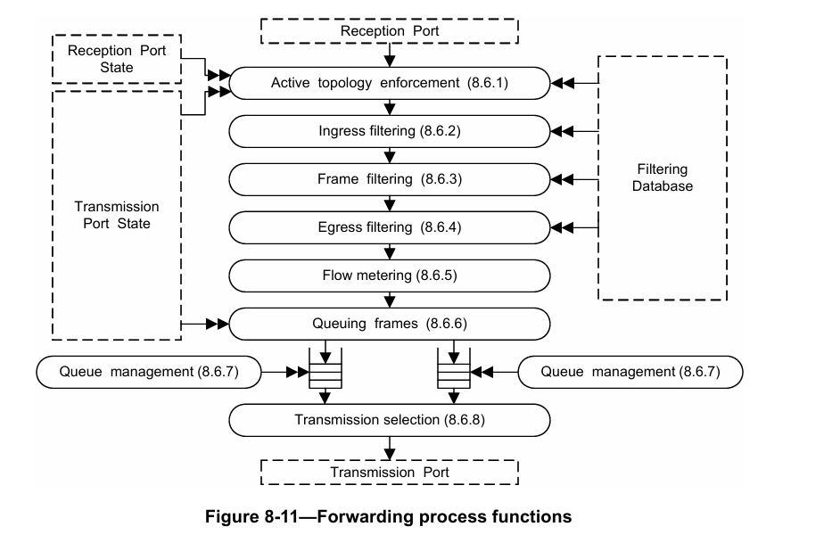
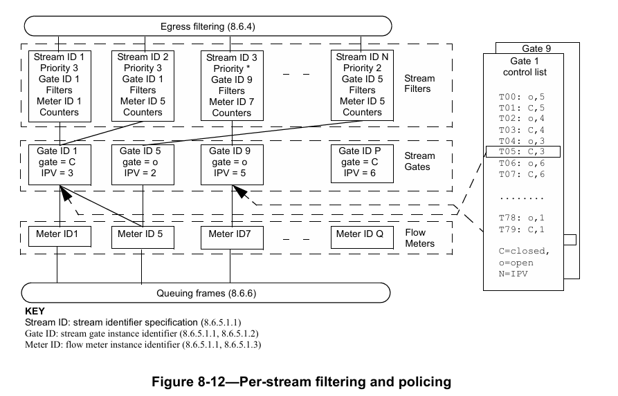

# IEEE 标准 802.1Qci™-2017
（对 IEEE 标准 802.1Q™-2014 的修订，
经以下标准修订而成：
IEEE 标准 802.1Qca™-2015、
IEEE 标准 802.1Qcd™-2015、
IEEE 标准 802.1Q-2014/Cor 1-2015、
IEEE 标准 802.1Qbv™-2015、
IEEE 标准 802.1Qbu™-2016 以及
IEEE 标准 802.1Qbz™-2016）

# 局域网和城域网标准——
网桥和桥接网络——
修订案 28：逐流过滤和管制

注：本修订案中包含的编辑说明规定了如何将其中的内容合并到现有的基础标准及其修订案中，以形成完整的标准。
编辑说明以粗斜体显示。共使用四种编辑说明：修改（change）、删除（delete）、插入（insert）和替换（replace）。修改用于更正现有文本或表格中的内容，编辑说明会指明修改位置，并通过删除线（删除旧内容）和下划线（添加新内容）描述修改内容。删除用于移除现有内容。插入用于添加新内容，不影响现有内容。删除和插入操作可能需要重新编号，若有需要，编辑说明中会给出重新编号的要求。替换用于修改图表或公式，即移除现有图表或公式并替换为新的图表或公式。编辑说明、修改标记以及本注不会保留到未来版本中，因为相关修改将被整合到基础标准中。
1 文本、表格和图表中的注释仅为提供信息，不包含实施该标准所需的要求。

## IEEE 标准 802.1Qci-2017 局域网和城域网标准——网桥和桥接网络 修订案 28：逐流过滤和管制
### 1. 概述
#### 1.3 引言
在带字母标记的列表末尾插入以下内容，并根据需要重新编号：
ch) 本标准规定了允许对单个业务流进行过滤和管制的协议、程序及被管理对象。

### 2. 规范性引用文件
按字母数字顺序插入以下引用文件：
IEEE 标准 802.1CB™《局域网和城域网标准——用于可靠性的帧复制和消除》
MEF 技术规范 10.3（MEF 10.3）《以太网业务属性 第 3.2 阶段》
从参考文献[B45]中删除对 MEF 10.3 的引用，并相应修改文本中对其的提及内容。
2 MEF 技术规范可从 MEF 网站（http://www.mef.net）获取。

### 4. 缩写词
按字母数字顺序插入以下缩写词：
IPV：内部优先级值规范（internal priority value specification）
PSFP：逐流过滤和管制（per-stream filtering and policing）

### 5. 一致性
#### 5.4 虚拟局域网（VLAN）网桥组件要求
##### 5.4.1 虚拟局域网（VLAN）网桥组件选项
插入新的子条款 5.4.1.8，如下所示，并根据需要重新编号：
##### 5.4.1.8 逐流过滤和管制（PSFP）要求
符合本标准中 PSFP 相关规定的 VLAN 网桥组件实现应：
a) 支持 8.6.5.1 和 8.6.6.1 中规定的 PSFP；
b) 支持 8.6.10 中规定的流门控制状态机；
c) 支持 12.31 中规定的 PSFP 管理实体。

#### 5.13 介质访问控制（MAC）网桥组件要求
##### 5.13.1 介质访问控制（MAC）网桥组件选项
插入新的子条款 5.13.1.1，如下所示，并根据需要重新编号：
##### 5.13.1.1 逐流过滤和管制（PSFP）要求
符合本标准中 PSFP 相关规定的 MAC 网桥组件实现应：
a) 支持 8.6.5.1 和 8.6.6.1 中规定的 PSFP；
b) 支持 8.6.10 中规定的流门控制状态机；
c) 支持 12.31 中规定的 PSFP 管理实体。

在第 5 条末尾插入以下新的子条款，并根据需要重新编号：
#### 5.27 终端站要求——逐流过滤和管制（PSFP）
符合本标准中 PSFP 相关规定的终端站实现应：
a) 支持 8.6.5.1 和 8.6.6.1 中规定的 PSFP；
b) 支持 8.6.10 中规定的流门控制状态机；
c) 支持 12.31 中规定的 PSFP 管理实体。

### 8. 网桥操作原理
#### 8.6 转发过程
将图 8-11 替换为以下图表。此次替换的作用是将“入口（8.6.2）”改为“入口过滤（8.6.2）”，将“出口（8.6.4）”改为“出口过滤（8.6.4）”，以与子条款标题保持一致。


图 8-11 转发过程功能

#### 8.6.5 流分类和计量
在列表项 d) 之后立即插入新的列表项 e)，并修改新项 e) 之后的句子，同时对后续列表项重新编号，如下所示：
e) 连接标识符（connection_identifier）
指定虚拟局域网标识符（VID）值的项 c) 不适用于不支持 VLAN 的 MAC 中继器。指定连接标识符（connection_identifier）的项 e) 仅适用于支持 PSFP 的网桥。

插入新的子条款 8.6.5.1、图 8-12 和表 8-5，如下所示，并根据需要对后续图表重新编号：
##### 8.6.5.1 逐流过滤和管制
网桥或终端站可支持 PSFP 功能，该功能允许基于逐流方式对接收的帧做出过滤和管制决策，以及后续的帧排队决策（8.6.6.1）。
支持 PSFP 需实现 IEEE 标准 802.1CB 第 6 条中规定的流标识功能，因为该功能提供的流句柄（stream_handle）将用于 PSFP 执行的管制和排队决策。

注：IEEE 标准 802.1CB 第 6 条中规定的流句柄（stream_handle）是 ISS 的连接标识符（connection_identifier）参数的子参数。

PSFP 由以下表格支持：
a) 流过滤实例表（8.6.5.1.1）；
b) 流门实例表（8.6.5.1.2）；
c) 流量计实例表（8.6.5.1.3）。

这些表格之间的关系如图 8-12 所示。表格及其参数可通过 12.31 中规定的管理方式进行修改。


图 8-12 逐流过滤和管制
注：C=关闭（closed），O=打开（open）；N=内部优先级值（IPV）
关键说明：
- 流量计标识符（Meter ID）：流量计实例标识符（8.6.5.1.1、8.6.5.1.3）；
- 流标识符（Stream ID）：流标识规范（8.6.5.1.1）；
- 流门标识符（Gate ID）：流门实例标识符（8.6.5.1.1、8.6.5.1.2）。

##### 8.6.5.1.1 流过滤实例表
流过滤实例表由一系列有序的流过滤器组成，这些过滤器决定了应用于特定流上接收帧的过滤和管制操作。每个流过滤器包含以下元素：
a) 流过滤实例标识符：一个整数值，用于唯一标识该过滤实例，并作为表格的索引。标识符值的顺序定义了流过滤器列表的顺序，较小的标识符值在有序列表中靠前。
b) 流句柄（stream_handle）规范：可以是以下两种情况之一：
1) IEEE 标准 802.1CB 中规定的单个流句柄（stream_handle）值；
2) 可匹配任何流句柄（stream_handle）值的通配符值。
c) 优先级规范：可以是以下两种情况之一：
1) 单个优先级值；
2) 可匹配任何优先级值的通配符值。
d) 流门实例标识符：标识该流过滤器所使用的流门实例（8.6.5.1.2）。流门有两种状态：
1) 打开（Open）：帧可通过流门；
2) 关闭（Closed）：帧不可通过流门。
e) 零个或多个过滤规范：过滤规范中规定的操作可导致帧通过或未通过指定的过滤器。未通过过滤器的帧将被丢弃。过滤规范还可包含其他操作，例如将丢弃合格（drop_eligible）参数设置为真（TRUE）。目前定义的过滤规范如下：
1) 最大服务数据单元（SDU）大小：超过该 SDU 大小的帧不能通过流过滤器；未超过该 SDU 大小的帧，若满足其他所有过滤条件，则可通过流过滤器。
注 1：最大 SDU 大小是按流定义的，因此可能与 IEEE 标准 802.1Qbv 8.6.8.4 中规定的队列最大 SDU（queueMaxSDU）不同。由于队列最大 SDU（queueMaxSDU）在流过滤器之后应用，因此可能出现某帧通过了最大 SDU 大小流过滤器，但随后因其 SDU 大小超过队列最大 SDU（queueMaxSDU）而被丢弃的情况。
2) 流量计实例标识符：8.6.5 中规定的流量计功能实例的标识符。流量计实例是流量计实例表（8.6.5.1.3）的索引，该表格规定了每个流量计实例的操作参数。流量计总是在其他可能导致帧丢弃的过滤规范之后应用。
f) 帧计数器：
1) 匹配流句柄（stream_handle）和优先级规范的帧数；
2) 通过流门的帧数；
3) 未通过流门的帧数；
4) 通过最大 SDU 大小过滤器的帧数；
5) 未通过最大 SDU 大小过滤器的帧数；
6) 因流量计操作而被丢弃的帧数。
g) 因超大帧导致流阻塞启用（StreamBlockedDueToOversizeFrameEnable）参数：取值为真（TRUE）或假（FALSE）。取值为真（TRUE）表示启用因超大帧导致流阻塞（StreamBlockedDueToOversizeFrame）功能；取值为假（FALSE）表示禁用该功能。该参数的默认值为假（FALSE）。
h) 因超大帧导致流阻塞（StreamBlockedDueToOversizeFrame）参数：取值为真（TRUE）或假（FALSE）。若因超大帧导致流阻塞启用（StreamBlockedDueToOversizeFrameEnable）参数为真（TRUE），则当因超大帧导致流阻塞（StreamBlockedDueToOversizeFrame）参数为真（TRUE）时，所有帧都将被丢弃（即流过滤器的行为等同于将最大 SDU 大小设置为 0 字节）；若该参数为假（FALSE），则无影响。该参数的默认值为假（FALSE）；若任何帧因超过流的最大 SDU 大小而被丢弃，则该参数将被设置为真（TRUE）。

接收帧所关联的流句柄（stream_handle）和优先级参数决定了该帧选择哪个流过滤器，进而决定了应用于该帧的过滤和管制操作组合。若接收帧的流句柄（stream_handle）和优先级参数匹配多个流过滤器，则选择有序列表中靠前的那个流过滤器。若接收帧的流句柄（stream_handle）和优先级不匹配表格中的任何流过滤器，则该帧将按照不支持 PSFP 的情况进行处理。

注 2：结合前面所述的通配规则，使用流标识符和优先级可实现超出本子条款标题所隐含的 PSFP 配置功能；例如，可通过这些规则配置基于优先级的过滤和管制，或基于优先级和入口端口的过滤和管制。
注 3：若希望丢弃不匹配任何其他流过滤器的帧，而非不对其进行过滤就直接处理，可在表格末尾放置一个流过滤器，其中流句柄（stream_handle）和优先级均设置为通配符（空值），且流门实例标识符指向一个永久关闭的流门。

##### 8.6.5.1.2 流门实例表
流门实例表包含每个流门实例的一组参数。每个流门实例的参数如下：
a) 流门实例标识符：标识流门实例的整数值。
b) 操作和管理流门状态（8.6.10.4、8.6.10.5、12.31.3）：流门有两种状态：
1) 打开（Open）：允许帧通过流门；
2) 关闭（Closed）：不允许帧通过流门。
c) 操作和管理内部优先级值规范（IPV）（8.6.10.6、8.6.10.7、12.31.3）：IPV 可以是以下两种情况之一：
1) 空值：对于通过流门的帧，使用该帧关联的优先级值，通过 8.6.6 中规定的业务类别表（Traffic Class Table）确定该帧的业务类别；
2) 内部优先级值：对于通过流门的帧，使用 IPV 替代该帧关联的优先级值，通过 8.6.6 中规定的业务类别表（Traffic Class Table）确定该帧的业务类别。
注 1：关于分配内部优先级值功能的应用场景，可参见 IEEE 标准 802.1Qch™[B1]。
d) 因无效接收导致流门关闭启用（GateClosedDueToInvalidRxEnable）参数：取值为真（TRUE）或假（FALSE）。取值为真（TRUE）表示启用因无效接收导致流门关闭（GateClosedDueToInvalidRx）功能；取值为假（FALSE）表示禁用该功能。该参数的默认值为假（FALSE）。
e) 因无效接收导致流门关闭（GateClosedDueToInvalidRx）参数：取值为真（TRUE）或假（FALSE）。若因无效接收导致流门关闭启用（GateClosedDueToInvalidRxEnable）参数为真（TRUE），则当因无效接收导致流门关闭（GateClosedDueToInvalidRx）参数为真（TRUE）时，所有帧都将被丢弃（即流门的行为等同于操作流门状态为关闭（Closed））；若该参数为假（FALSE），则无影响。该参数的默认值为假（FALSE）；若任何帧因流门处于关闭（Closed）状态而被丢弃，则该参数将被设置为真（TRUE）。
注 2：该参数与其启用参数配合使用，可实现当流门处于关闭状态期间检测到入站帧时，将流门永久设置为关闭状态，直至通过管理操作重置该状态。其目的是支持那些网络中帧的发送和接收经过协调的应用，即仅当流门打开时才接收帧，因此当流门处于关闭状态时接收到的帧视为无效接收情况。
f) 因字节数超出导致流门关闭启用（GateClosedDueToOctetsExceededEnable）参数：取值为真（TRUE）或假（FALSE）。取值为真（TRUE）表示启用因字节数超出导致流门关闭（GateClosedDueToOctetsExceeded）功能；取值为假（FALSE）表示禁用该功能。该参数的默认值为假（FALSE）。
g) 因字节数超出导致流门关闭（GateClosedDueToOctetsExceeded）参数：取值为真（TRUE）或假（FALSE）。若因字节数超出导致流门关闭启用（GateClosedDueToOctetsExceededEnable）参数为真（TRUE），则当因字节数超出导致流门关闭（GateClosedDueToOctetsExceeded）参数为真（TRUE）时，所有帧都将被丢弃（即流门的行为等同于操作流门状态为关闭（Closed））；若该参数为假（FALSE），则无影响。该参数的默认值为假（FALSE）；若任何帧因剩余间隔字节数（IntervalOctetsLeft）（8.6.10.8）不足而被丢弃，则该参数将被设置为真（TRUE）。
h) 可选的操作和管理流门控制列表：若存在，这些列表是一系列有序的流控制操作，如表 8-7 所示。控制操作流门控制列表执行的状态机及其变量和程序在 8.6.10 中规定。

##### 表 8-7 流门控制操作
| 参数 | 说明 |
| ---- | ---- |
| 间隔字节最大值（IntervalOctetMax） | 该参数值与内部优先级值（IPV）参数值一起用于设置流门状态和内部优先级规范参数的操作值。在完成流门控制列表中的上一个流门控制操作后，若指定的时间间隔（TimeInterval）（8.6.9.4.16 中的时钟周期（ticks））已过，则控制将传递到下一个流门控制操作。可选的间隔字节最大值（IntervalOctetMax）参数规定了在指定的时间间隔（TimeInterval）内允许通过流门的最大 MSDU 字节数。若省略间隔字节最大值（IntervalOctetMax）参数，则无此限制。 |
| 管理值说明 | 这些参数的管理值用于确定相应操作参数的初始值；对于管理流门控制列表参数，其管理值用于在将新的控制列表安装到运行中的系统之前提供一种配置方式。 |

##### 8.6.5.1.3 流量计实例表
流量计实例表包含每个流量计实例的一组参数。每个流量计实例的参数如 MEF 10.3 中的带宽配置文件参数和算法所规定，此外还包括以下附加参数：
注：MEF 10.3 中定义的包络（Envelope）和等级（Rank）不适用于 PSFP；即 PSFP 使用 MEF 10.3 第 12.2 条中描述的简化功能算法。
a) 流量计实例标识符：标识流量计实例的整数值。
b) 承诺信息速率（CIR）：以比特/秒为单位。
c) 承诺突发大小（CBS）：以字节为单位。
d) 超额信息速率（EIR）：以比特/秒为单位。
e) 每个带宽配置文件流的超额突发大小（EBS）：以字节为单位。
f) 耦合标志（CF）：取值为 0 或 1。
g) 颜色模式（CM）：取值为色盲（color-blind）或色敏（color-aware）。
h) 黄帧丢弃（DropOnYellow）：取值为真（TRUE）或假（FALSE）。取值为真（TRUE）表示丢弃黄帧（即丢弃）；取值为假（FALSE）表示将黄帧的丢弃合格（drop_eligible）参数设置为真（TRUE）。
i) 所有帧标记为红帧启用（MarkAllFramesRedEnable）：取值为真（TRUE）或假（FALSE）。取值为真（TRUE）表示启用所有帧标记为红帧（MarkAllFramesRed）功能；取值为假（FALSE）表示禁用该功能。该参数的默认值为假（FALSE）。
j) 所有帧标记为红帧（MarkAllFramesRed）：取值为真（TRUE）或假（FALSE）。若所有帧标记为红帧启用（MarkAllFramesRedEnable）参数为真（TRUE），则当所有帧标记为红帧（MarkAllFramesRed）参数为真（TRUE）时，所有帧都将被丢弃（即丢弃）；若该参数为假（FALSE），则无影响。该参数的默认值为假（FALSE）；若流量计的操作导致任何帧被丢弃，则该参数将被设置为真（TRUE）。

#### 8.6.6 帧排队
插入新的子条款 8.6.6.1，如下所示：
##### 8.6.6.1 PSFP 排队
若支持 PSFP（8.6.5.1），且通过该帧的流过滤器所关联的 IPV 不为空值，则使用该 IPV 替代帧的优先级，通过 8.6.6 中规定的业务类别表（Traffic Class Table）确定该帧的业务类别。在其他所有方面，8.6.6 中规定的排队操作保持不变。
IPV 仅用于确定与帧相关联的业务类别，进而选择出站队列；在所有其他情况下，使用接收的优先级。

插入新的子条款 8.6.10 及其子条款和表 8-8，如下所示，并根据需要重新编号：

##### 表 8-8 调度业务和 PSFP 程序/变量
| 8.6.9 中的程序/变量名称 | PSFP 程序/变量名称 |
| ---- | ---- |
| 执行操作（ExecuteOperation()）（8.6.9.2.1） | 执行 PSFP 操作（ExecutePSFPOperation()）（8.6.10.1） |
| 设置流门状态（SetGateStates()）（8.6.9.2.2） | 设置 PSFP 流门状态（SetPSFPGateStates()）（8.6.10.2） |
| 列表指针（ListPointer）（8.6.9.4.15） | PSFP 列表指针（PSFPListPointer）（8.6.10.3） |
| 管理流门状态（AdminGateStates）（8.6.9.4.5） | PSFP 管理流门状态（PSFPAdminGateStates）（8.6.10.4） |
| 操作流门状态（OperGateStates）（8.6.9.4.22） | PSFP 操作流门状态（PSFPOperGateStates）（8.6.10.5） |

#### 8.6.10 流门控制状态机
流门控制列表（8.6.5.1.2）中流门操作的执行由 8.6.9 中规定的三个状态机控制：
a) 周期计时器状态机（8.6.9.1）；
b) 列表执行状态机（8.6.9.2）；
c) 列表配置状态机（8.6.9.3）。

在支持 PSFP 的网桥组件中，每个与流门实例相关联的流门控制列表都将实例化一个上述状态机。这些状态机的操作概述如图 8-13 所示。
这些状态机的操作如 8.6.9 中所定义，但执行操作（ExecuteOperation()）程序、设置流门状态（SetGateStates()）程序、列表指针（ListPointer）变量、管理流门状态（AdminGateStates）变量和操作流门状态（OperGateStates）变量的定义除外；这些定义的修订版本见 8.6.10.1 至 8.6.10.5。表 8-8 展示了 8.6.9 中使用的程序/变量与这些程序/变量的 PSFP 版本之间的对应关系。
执行 PSFP 操作（ExecutePSFPOperation）程序所需的三个附加变量在 8.6.10.6 和 8.6.10.7 中定义。
3 图 8-13 和 8.6.9 可参见 IEEE 标准 802.1Qbv，该标准也是对 IEEE 标准 802.1Q 的一项修订。

##### 8.6.10.1 执行 PSFP 操作（ExecutePSFPOperation()）
执行 PSFP 操作（ExecutePSFPOperation()）程序负责从操作控制列表（OperControlList）中获取下一个流门操作及其相关的任何参数，并基于所获取的流门操作执行相应操作。PSFP 列表指针（PSFPListPointer）变量（8.6.10.3）用作操作控制列表（OperControlList）的索引。该程序根据操作名称（表 8-7）处理操作，具体如下：
a) 若操作名称为设置流门和 IPV（SetGateAndIPV），则将与该操作相关联的流门状态（StreamGateState）参数值分配给 PSFP 操作流门状态（PSFPOperGateStates）变量（8.6.10.5），将 IPV 参数值分配给操作 IPV（OperIPV）变量（8.6.10.7），并将与该操作相关联的时间间隔（TimeInterval）参数值分配给时间间隔（TimeInterval）变量（8.6.9.4.24）。若与该操作相关联的时间间隔（TimeInterval）参数值为 0，则将时间间隔（TimeInterval）变量分配为 1。若该流门操作关联有间隔字节最大值（IntervalOctetMax）参数，则使用该参数值设置剩余间隔字节数（IntervalOctetsLeft）变量（8.6.10.8）；否则，将剩余间隔字节数（IntervalOctetsLeft）变量设置为一个大于该流门在时间间隔（TimeInterval）内可能通过的最大字节数的值。
b) 若操作名称无法识别，则将 PSFP 列表指针（PSFPListPointer）变量（8.6.9.4.15）分配为操作控制列表长度（OperControlListLength）变量（8.6.9.4.23）的值，并将时间间隔（TimeInterval）变量（8.6.9.4.24）分配为 0。
c) 若该操作未关联时间间隔（TimeInterval）参数，则将时间间隔（TimeInterval）变量分配为 0。

##### 8.6.10.2 设置 PSFP 流门状态（SetPSFPGateStates()）
该程序根据 PSFP 操作流门状态（PSFPOperGateStates）变量（8.6.9.4.22）的值设置流门状态。

##### 8.6.10.3 PSFP 列表指针（PSFPListPointer）
一个整数，用作操作控制列表（OperControlList）（8.6.9.4.19）中条目的指针，每个条目包含一个流门控制操作及其相关参数（表 8-7）。值为 0 指向列表中的第一个条目；值为（操作控制列表长度（OperControlListLength））-1 指向列表中的最后一个条目。

##### 8.6.10.4 PSFP 管理流门状态（PSFPAdminGateStates）
与流门相关联的流门的初始状态由列表执行状态机（8.6.9.2）设置，并由 PSFP 管理流门状态（PSFPAdminGateStates）变量的值决定。PSFP 管理流门状态（PSFPAdminGateStates）变量的默认值为打开（open）。该变量的值可通过管理方式修改。

##### 8.6.10.5 PSFP 操作流门状态（PSFPOperGateStates）
与流门相关联的流门的当前状态。PSFP 操作流门状态（PSFPOperGateStates）由列表执行状态机（8.6.9.2）设置，其初始值由 PSFP 管理流门状态（PSFPAdminGateStates）变量（8.6.10.4）的值决定。

##### 8.6.10.6 管理 IPV（AdminIPV）
与流门相关联的操作 IPV（OperIPV）变量（8.6.10.7）的初始值由管理 IPV（AdminIPV）变量的值决定。管理 IPV（AdminIPV）变量的默认值为空值。该变量的值可通过管理方式修改。

##### 8.6.10.7 操作 IPV（OperIPV）
与流门相关联的 IPV 的当前值。操作 IPV（OperIPV）的初始值设置为管理 IPV（AdminIPV）变量（8.6.10.6）的值。随后，若该流门实例关联有流门控制列表，则其值由操作流门控制列表的内容和列表执行状态机（8.6.9.2）的操作控制。

##### 8.6.10.8 剩余间隔字节数（IntervalOctetsLeft）
剩余间隔字节数（IntervalOctetsLeft）参数的当前值表示在当前时间间隔（TimeInterval）内，该流门还能通过多少个 MSDU 字节。该变量由执行 PSFP 操作（ExecutePSFPOperation()）程序（8.6.10.1）初始化。若某帧原本可通过流门，但该帧的大小大于剩余间隔字节数（IntervalOctetsLeft）的当前值，则将该帧视为流门处于关闭（Closed）状态的情况处理，即丢弃该帧。若某帧原本可通过流门，且该帧的大小小于剩余间隔字节数（IntervalOctetsLeft）的当前值，则从剩余间隔字节数（IntervalOctetsLeft）的值中减去该 MSDU 的字节数。
### 12. 网桥管理
插入新的子条款 12.31 及其子条款和表格，如下所示，并根据需要重新编号：

#### 12.31 逐流过滤和管制的被管理对象
支持逐流过滤和管制（PSFP）的网桥增强功能在 8.6.5.1 中定义，相关状态机在 8.6.10 中定义。
构成此被管理资源的对象如下：
a) 流参数表（12.31.1）；
b) 流过滤实例表（12.31.2）；
c) 流门实例表（12.31.3）；
d) 流量计实例表（12.31.4）。

##### 12.31.1 流参数表
每个网桥组件对应一个流参数表。该表包含支持 PSFP（8.6.5.1）的一组参数，详见表 12-30。在支持网桥组件动态配置的实现中，可动态创建或删除该表。

<table border="1">
  <caption>表 12-30 流参数表</caption>
  <thead>
    <tr>
      <th>名称</</th>
      <th>数据类型</</th>
      <th>支持的操作<a></a></</th>
      <th>一致性<b></b></</th>
      <th>引用</</th>
    </tr>
  </thead>
  <tbody>
    <tr>
      <td>最大流过滤实例数（MaxStreamFilterInstances）</td>
      <td>整数（integer）</td>
      <td>只读（R）</td>
      <td>网桥/终端站（BE）</td>
      <td>8.6.5.1、12.31.2</td>
    </tr>
    <tr>
      <td>最大流门实例数（MaxStreamGateInstances）</td>
      <td>整数（integer）</td>
      <td>只读（R）</td>
      <td>网桥/终端站（BE）</td>
      <td>8.6.5.1、12.31.3</td>
    </tr>
    <tr>
      <td>最大流量计实例数（MaxFlowMeterInstances）</td>
      <td>整数（integer）</td>
      <td>只读（R）</td>
      <td>网桥/终端站（BE）</td>
      <td>8.6.5.1、12.31.4</td>
    </tr>
    <tr>
      <td>支持的列表最大值（SupportedListMax）</td>
      <td>整数（integer）</td>
      <td>只读（R）</td>
      <td>网桥/终端站（BE）</td>
      <td>8.6.5.1、12.31.4</td>
    </tr>
  </tbody>
  <tfoot>
    <tr>
      <td colspan="5">
        <a> R = 只读访问；RW = 读写访问。</a><br>
        <b> B = 网桥或网桥组件支持 PSFP 所需；E = 终端站支持 PSFP 所需。</b>
      </td>
    </tr>
  </</tfoot>
</table>

###### 12.31.1.1 最大流过滤实例数（MaxStreamFilterInstances）
该网桥组件支持的最大流过滤实例数量。

###### 12.31.1.2 最大流门实例数（MaxStreamGateInstances）
该网桥组件支持的最大流门实例数量。

###### 12.31.1.3 最大流量计实例数（MaxFlowMeterInstances）
该网桥组件支持的最大流量计实例数量。

###### 12.31.1.4 支持的列表最大值（SupportedListMax）
该网桥组件支持的管理控制列表长度（AdminControlListLength）和操作控制列表长度（OperControlListLength）参数的最大值。调度计算软件可在计算前使用该值确定网桥组件的控制列表容量。

##### 12.31.2 流过滤实例表
每个网桥组件对应一个流过滤实例表。表中每行包含定义单个流过滤器（8.6.5.1）的一组参数，详见表 12-31。表行构成有序的过滤实例列表，顺序由流过滤实例（StreamFilterInstance）参数确定。在支持网桥组件动态配置的实现中，可动态创建或删除该表；在支持流过滤器动态配置的实现中，可动态创建或删除表中的行。

<table border="1">
  <caption>表 12-31 流过滤实例表</caption>
  <thead>
    <tr>
      <th>名称</</th>
      <th>数据类型</</th>
      <th>支持的操作<a></a></</th>
      <th>一致性<b></b></</th>
      <th>引用</</th>
    </tr>
  </thead>
  <tbody>
    <tr>
      <td>流过滤实例（StreamFilterInstance）</td>
      <td>整数（integer）</td>
      <td>只读（R）</td>
      <td>网桥/终端站（BE）</td>
      <td>8.6.5.1</td>
    </tr>
    <tr>
      <td>流句柄规范（StreamHandleSpec）</td>
      <td>流句柄（stream_handle）规范</td>
      <td>读写（RW）</td>
      <td>网桥/终端站（BE）</td>
      <td>8.6.5.1</td>
    </tr>
    <tr>
      <td>优先级规范（PrioritySpec）</td>
      <td>优先级规范</td>
      <td>读写（RW）</td>
      <td>网桥/终端站（BE）</td>
      <td>8.6.5.1</td>
    </tr>
    <tr>
      <td>流门实例标识符（StreamGateInstanceID）</td>
      <td>整数（integer）</td>
      <td>读写（RW）</td>
      <td>网桥/终端站（BE）</td>
      <td>8.6.5.1、8.6.5.1.2</td>
    </tr>
    <tr>
      <td>过滤规范列表（FilterSpecificationList）</td>
      <td>过滤规范（FilterSpecification）序列</td>
      <td>读写（RW）</td>
      <td>网桥/终端站（BE）</td>
      <td>8.6.5.1、8.6.5.1.3、12.31.2.5</td>
    </tr>
    <tr>
      <td>匹配帧数计数器（MatchingFramesCount）</td>
      <td>计数器（counter）</td>
      <td>只读（R）</td>
      <td>网桥/终端站（BE）</td>
      <td>8.6.5.1</td>
    </tr>
    <tr>
      <td>通过帧数计数器（PassingFramesCount）</td>
      <td>计数器（counter）</td>
      <td>只读（R）</td>
      <td>网桥/终端站（BE）</td>
      <td>8.6.5.1</td>
    </tr>
    <tr>
      <td>未通过帧数计数器（NotPassingFramesCount）</td>
      <td>计数器（counter）</td>
      <td>只读（R）</td>
      <td>网桥/终端站（BE）</td>
      <td>8.6.5.1</td>
    </tr>
    <tr>
      <td>通过 SDU 数计数器（PassingSDUCount）</td>
      <td>计数器（counter）</td>
      <td>只读（R）</td>
      <td>网桥/终端站（BE）</td>
      <td>8.6.5.1</td>
    </tr>
    <tr>
      <td>未通过 SDU 数计数器（NotPassingSDUCount）</td>
      <td>计数器（counter）</td>
      <td>只读（R）</td>
      <td>网桥/终端站（BE）</td>
      <td>8.6.5.1</td>
    </tr>
    <tr>
      <td>红帧计数器（REDFramesCount）</td>
      <td>计数器（counter）</td>
      <td>只读（R）</td>
      <td>网桥/终端站（BE）</td>
      <td>8.6.5.1</td>
    </tr>
    <tr>
      <td>因超大帧导致流阻塞启用（StreamBlockedDueToOversizeFrameEnable）</td>
      <td>布尔值（Boolean）</td>
      <td>读写（RW）</td>
      <td>网桥/终端站（BE）</td>
      <td>8.6.5.1、8.6.5.1.1</td>
    </tr>
    <tr>
      <td>因超大帧导致流阻塞（StreamBlockedDueToOversizeFrame）</td>
      <td>布尔值（Boolean）</td>
      <td>读写（RW）</td>
      <td>网桥/终端站（BE）</td>
      <td>8.6.5.1、8.6.5.1.1</td>
    </tr>
  </tbody>
  <tfoot>
    <tr>
      <td colspan="5">
        <a> R = 只读访问；RW = 读写访问。</a><br>
        <b> B = 网桥或网桥组件支持 PSFP 所需；E = 终端站支持 PSFP 所需。</b>
      </td>
    </tr>
  </</tfoot>
</table>

###### 12.31.2.1 流过滤实例（StreamFilterInstance）
一个整数索引值，用于确定流过滤器在有序流过滤实例列表中的位置。流过滤实例（StreamFilterInstance）的值按整数大小排序，较小的值在有序列表中靠前。

###### 12.31.2.2 流句柄（stream_handle）规范数据类型
流句柄（stream_handle）规范数据类型可表示以下两种情况之一：
a) 整数表示的单个流句柄（stream_handle）值；
b) 通配符值。

###### 12.31.2.3 优先级规范数据类型
优先级规范数据类型可表示以下两种情况之一：
a) 整数表示的单个优先级值；
b) 通配符值。

###### 12.31.2.4 流门实例（StreamGateInstance）
流门实例（StreamGateInstance）参数标识与该流过滤器相关联的流门（12.31.3）。流过滤器与流门之间为多对一关系：一个流过滤器仅可关联一个流门，但多个流过滤器可关联同一个流门。

###### 12.31.2.5 过滤规范（FilterSpecification）数据类型
过滤规范（FilterSpecification）数据类型可表示以下内容：
a) 表示最大 SDU 大小（8.6.5.1）的整数值；
b) 表示流量计实例标识符（8.6.5.1、8.6.5.1.3）的整数值。

##### 12.31.3 流门实例表
每个网桥组件对应一个流门实例表。表中每行包含定义单个流门（8.6.5.1.2）的一组参数，详见表 12-32。在支持网桥组件动态配置的实现中，可动态创建或删除该表；在支持流门动态配置的实现中，可动态创建或删除表中的行。

<table border="1">
  <caption>表 12-32 流门实例表</caption>
  <thead>
    <tr>
      <th>名称</</th>
      <th>数据类型</</th>
      <th>支持的操作<a></a></</th>
      <th>一致性<b></b></</th>
      <th>引用</</th>
    </tr>
  </thead>
  <tbody>
    <tr>
      <td>流门实例（StreamGateInstance）</td>
      <td>整数（integer）</td>
      <td>只读（R）</td>
      <td>网桥/终端站（BE）</td>
      <td>8.6.5.1、8.6.5.1.2</td>
    </tr>
    <tr>
      <td>PSFP 流门启用（PSFPGateEnabled）</td>
      <td>布尔值（Boolean）</td>
      <td>读写（RW）</td>
      <td>网桥/终端站（BE）</td>
      <td>8.6.9.4.14</td>
    </tr>
    <tr>
      <td>PSFP 管理流门状态（PSFPAdminGateStates）</td>
      <td>PSFP 流门状态值（PSFPgateStatesValue）</td>
      <td>读写（RW）</td>
      <td>网桥/终端站（BE）</td>
      <td>8.6.10.4、12.31.3.2.1</td>
    </tr>
    <tr>
      <td>PSFP 操作流门状态（PSFPOperGateStates）</td>
      <td>PSFP 流门状态值（PSFPgateStatesValue）</td>
      <td>只读（R）</td>
      <td>网桥/终端站（BE）</td>
      <td>8.6.10.5、12.31.3.2.1</td>
    </tr>
    <tr>
      <td>PSFP 管理控制列表长度（PSFPAdminControlListLength）</td>
      <td>无符号整数（unsigned integer）</td>
      <td>读写（RW）</td>
      <td>网桥/终端站（BE）</td>
      <td>8.6.9.4.6、12.31.3.2</td>
    </tr>
    <tr>
      <td>PSFP 操作控制列表长度（PSFPOperControlListLength）</td>
      <td>无符号整数（unsigned integer）</td>
      <td>只读（R）</td>
      <td>网桥/终端站（BE）</td>
      <td>8.6.9.4.23、12.31.3.2</td>
    </tr>
    <tr>
      <td>PSFP 管理控制列表（PSFPAdminControlList）</td>
      <td>PSFP 流门控制条目（PSFPGateControlEntry）序列</td>
      <td>读写（RW）</td>
      <td>网桥/终端站（BE）</td>
      <td>8.6.9.4.2、12.31.3.2、12.31.3.2.2</td>
    </tr>
    <tr>
      <td>PSFP 操作控制列表（PSFPOperControlList）</td>
      <td>PSFP 流门控制条目（PSFPGateControlEntry）序列</td>
      <td>只读（R）</td>
      <td>网桥/终端站（BE）</td>
      <td>8.6.9.4.19、12.31.3.2、12.31.3.2.2</td>
    </tr>
    <tr>
      <td>PSFP 管理周期时间（PSFPAdminCycleTime）</td>
      <td>有理数（RationalNumber）</td>
      <td>读写（RW）</td>
      <td>网桥/终端站（BE）</td>
      <td>8.6.9.4.3、12.29.1.3</td>
    </tr>
    <tr>
      <td>PSFP 操作周期时间（PSFPOperCycleTime）</td>
      <td>有理数（RationalNumber）（秒）</td>
      <td>只读（R）</td>
      <td>网桥/终端站（BE）</td>
      <td>8.6.9.4.20、12.29.1.3</td>
    </tr>
    <tr>
      <td>PSFP 管理周期时间扩展（PSFPAdminCycleTimeExtension）</td>
      <td>整数（Integer）（纳秒）</td>
      <td>读写（RW）</td>
      <td>网桥/终端站（BE）</td>
      <td>8.6.9.4.4</td>
    </tr>
    <tr>
      <td>PSFP 操作周期时间扩展（PSFPOperCycleTimeExtension）</td>
      <td>整数（Integer）（纳秒）</td>
      <td>只读（R）</td>
      <td>网桥/终端站（BE）</td>
      <td>8.6.9.4.21</td>
    </tr>
    <tr>
      <td>PSFP 管理基准时间（PSFPAdminBaseTime）</td>
      <td>精密时间协议（PTP）时间（PTPtime）</td>
      <td>读写（RW）</td>
      <td>网桥/终端站（BE）</td>
      <td>8.6.9.4.1、12.29.1.4</td>
    </tr>
    <tr>
      <td>PSFP 操作基准时间（PSFPOperBaseTime）</td>
      <td>精密时间协议（PTP）时间（PTPtime）</td>
      <td>只读（R）</td>
      <td>网桥/终端站（BE）</td>
      <td>8.6.9.4.18、12.29.1.4</td>
    </tr>
    <tr>
      <td>PSFP 配置更改（PSFPConfigChange）</td>
      <td>布尔值（Boolean）</td>
      <td>读写（RW）</td>
      <td>网桥/终端站（BE）</td>
      <td>8.6.9.4.7</td>
    </tr>
    <tr>
      <td>PSFP 配置更改时间（PSFPConfigChangeTime）</td>
      <td>精密时间协议（PTP）时间（PTPtime）</td>
      <td>只读（R）</td>
      <td>网桥/终端站（BE）</td>
      <td>8.6.9.4.9、12.29.1.4</td>
    </tr>
    <tr>
      <td>PSFP 时钟周期粒度（PSFPTickGranularity）</td>
      <td>整数（Integer）（十分之一纳秒）</td>
      <td>只读（R）</td>
      <td>网桥/终端站（BE）</td>
      <td>8.6.9.4.16</td>
    </tr>
    <tr>
      <td>PSFP 当前时间（PSFPCurrentTime）</td>
      <td>精密时间协议（PTP）时间（PTPtime）</td>
      <td>只读（R）</td>
      <td>网桥/终端站（BE）</td>
      <td>8.6.9.4.10、12.29.1.4</td>
    </tr>
    <tr>
      <td>PSFP 配置挂起（PSFPConfigPending）</td>
      <td>布尔值（Boolean）</td>
      <td>只读（R）</td>
      <td>网桥/终端站（BE）</td>
      <td>8.6.9.3、8.6.9.4.8</td>
    </tr>
    <tr>
      <td>PSFP 配置更改错误（PSFPConfigChangeError）</td>
      <td>整数（Integer）</td>
      <td>只读（R）</td>
      <td>网桥/终端站（BE）</td>
      <td>8.6.9.3.1</td>
    </tr>
    <tr>
      <td>PSFP 管理内部优先级值（PSFPAdminIPV）</td>
      <td>内部优先级值（IPV）</td>
      <td>读写（RW）</td>
      <td>网桥/终端站（BE）</td>
      <td>8.6.5.1.2、8.6.10.6、12.31.3.3</td>
    </tr>
    <tr>
      <td>PSFP 操作内部优先级值（PSFPOperIPV）</td>
      <td>内部优先级值（IPV）</td>
      <td>读写（RW）</td>
      <td>网桥/终端站（BE）</td>
      <td>8.6.5.1.2、8.6.10.7、12.31.3.3</td>
    </tr>
    <tr>
      <td>因无效接收导致 PSFP 流门关闭启用（PSFPGateClosedDueToInvalidRxEnable）</td>
      <td>布尔值（Boolean）</td>
      <td>读写（RW）</td>
      <td>网桥/终端站（BE）</td>
      <td>8.6.5.1.2</td>
    </tr>
    <tr>
      <td>因无效接收导致 PSFP 流门关闭（PSFPGateClosedDueToInvalidRx）</td>
      <td>布尔值（Boolean）</td>
      <td>读写（RW）</td>
      <td>网桥/终端站（BE）</td>
      <td>8.6.5.1.2</td>
    </tr>
    <tr>
      <td>因字节数超出导致 PSFP 流门关闭启用（PSFPGateClosedDueToOctetsExceededEnable）</td>
      <td>布尔值（Boolean）</td>
      <td>读写（RW）</td>
      <td>网桥/终端站（BE）</td>
      <td>8.6.5.1.2</td>
    </tr>
    <tr>
      <td>因字节数超出导致 PSFP 流门关闭（PSFPGateClosedDueToOctetsExceeded）</td>
      <td>布尔值（Boolean）</td>
      <td>读写（RW）</td>
      <td>网桥/终端站（BE）</td>
      <td>8.6.5.1.2</td>
    </tr>
  </tbody>
  <tfoot>
    <tr>
      <td colspan="5">
        <a> R = 只读访问；RW = 读写访问。</a><br>
        <b> B = 网桥或网桥组件支持 PSFP 所需；E = 终端站支持 PSFP 所需。</b>
      </td>
    </tr>
  </</tfoot>
</table>

###### 12.31.3.1 流门实例（StreamGateInstance）
一个整数表索引，允许从流过滤实例表的条目中引用该流门。

###### 12.31.3.2 流门控制列表结构和数据类型
管理控制列表（AdminControlList）和操作控制列表（OperControlList）是分别包含管理控制列表长度（AdminControlListLength）或操作控制列表长度（OperControlListLength）个条目的有序列表。每个条目表示表 8-7 中定义的一个流门操作。列表中的每个条目结构为流门控制条目（GateControlEntry）（12.31.3.2.2）。

###### 12.31.3.2.1 PSFP 流门状态值（PSFPgateStatesValue）
PSFP 流门状态值（PSFPgateStatesValue）指示流门的期望状态（打开或关闭）。

###### 12.31.3.2.2 PSFP 流门控制条目（PSFPGateControlEntry）
PSFP 流门控制条目（PSFPGateControlEntry）由一个操作名称和该操作相关联的三个参数组成，详见表 8-7。第一个参数是 PSFP 流门状态值（PSFPgateStatesValue）（12.31.3.2.1）；第二个参数是内部优先级值（IPV）值（12.31.3.2.3）；第三个参数是时间间隔值（timeIntervalValue）（12.31.3.2.4）。

###### 12.31.3.2.3 内部优先级值（IPV）值
内部优先级值（IPV）值指示与通过流门的帧相关联的内部优先级值（IPV）（12.31.3.3）（8.6.10.7）。

###### 12.31.3.2.4 时间间隔值（timeIntervalValue）
一个无符号整数，表示以纳秒为单位的时间间隔（TimeInterval）（见表 8-7 中的时间间隔（TimeInterval））。

###### 12.31.3.3 内部优先级值规范（IPV）数据类型
内部优先级值规范（IPV）数据类型表示内部优先级值（IPV）值（8.6.5.1.2）；该值可以是空值或内部优先级值。

##### 12.31.4 流量计实例表
每个网桥组件对应一个流量计实例表。表中每行包含定义单个流量计实例（8.6.5.1）的一组参数，详见表 12-33。在支持网桥组件动态配置的实现中，可动态创建或删除该表；在支持流量计动态配置的实现中，可动态创建或删除表中的行。

<table border="1">
  <caption>表 12-33 流量计实例表</caption>
  <thead>
    <tr>
      <th>名称</</th>
      <th>数据类型</</th>
      <th>支持的操作<a></a></</th>
      <th>一致性<b></b></</th>
      <th>引用</</th>
    </tr>
  </thead>
  <tbody>
    <tr>
      <td>流量计实例标识符（FlowMeterInstanceID）</td>
      <td>整数（integer）</td>
      <td>只读（R）</td>
      <td>网桥/终端站（BE）</td>
      <td>8.6.5.1、8.6.5.1.3</td>
    </tr>
    <tr>
      <td>承诺信息速率（CIR）</td>
      <td>整数（integer），比特/秒（bit/s）</td>
      <td>读写（RW）</td>
      <td>网桥/终端站（BE）</td>
      <td>8.6.5.1、8.6.5.1.3</td>
    </tr>
    <tr>
      <td>承诺突发大小（CBS）</td>
      <td>整数（integer），字节（octets）</td>
      <td>读写（RW）</td>
      <td>网桥/终端站（BE）</td>
      <td>8.6.5.1、8.6.5.1.3</td>
    </tr>
    <tr>
      <td>超额信息速率（EIR）</td>
      <td>整数（integer），比特/秒（bit/s）</td>
      <td>读写（RW）</td>
      <td>网桥/终端站（BE）</td>
      <td>8.6.5.1、8.6.5.1.3</td>
    </tr>
    <tr>
      <td>超额突发大小（EBS）</td>
      <td>整数（integer），字节（octets）</td>
      <td>读写（RW）</td>
      <td>网桥/终端站（BE）</td>
      <td>8.6.5.1、8.6.5.1.3</td>
    </tr>
    <tr>
      <td>耦合标志（CF）</td>
      <td>整数（integer），0 或 1</td>
      <td>读写（RW）</td>
      <td>网桥/终端站（BE）</td>
      <td>8.6.5.1、8.6.5.1.3</td>
    </tr>
    <tr>
      <td>颜色模式（CM）</td>
      <td>枚举值（enumerated），色盲（color-blind）或色敏（color-aware）</td>
      <td>读写（RW）</td>
      <td>网桥/终端站（BE）</td>
      <td>8.6.5.1、8.6.5.1.3</td>
    </tr>
    <tr>
      <td>黄帧丢弃（DropOnYellow）</td>
      <td>布尔值（Boolean）</td>
      <td>读写（RW）</td>
      <td>网桥/终端站（BE）</td>
      <td>8.6.5.1、8.6.5.1.3</td>
    </tr>
    <tr>
      <td>所有帧标记为红帧启用（MarkAllFramesRedEnable）</td>
      <td>布尔值（Boolean）</td>
      <td>读写（RW）</td>
      <td>网桥/终端站（BE）</td>
      <td>8.6.5.1、8.6.5.1.3</td>
    </tr>
    <tr>
      <td>所有帧标记为红帧（MarkAllFramesRed）</td>
      <td>布尔值（Boolean）</td>
      <td>读写（RW）</td>
      <td>网桥/终端站（BE）</td>
      <td>8.6.5.1、8.6.5.1.3</td>
    </tr>
  </tbody>
  <tfoot>
    <tr>
      <td colspan="5">
        <a> R = 只读访问；RW = 读写访问。</a><br>
        <b> B = 网桥或网桥组件支持 PSFP 所需；E = 终端站支持 PSFP 所需。</b>
      </td>
    </tr>
  </</tfoot>
</table>

### 17. 管理信息库（MIB）
### 17.2 管理信息库（MIB）的结构
在 17.2 末尾插入新的子条款 17.2.24 和表 17-30，如下所示，并根据需要重新编号：
#### 17.2.24 IEEE8021-PSFP-MIB 的结构
IEEE8021-PSFP-MIB 用于在接收端口上配置 PSFP（8.6.5、8.6.5.1、8.6.10）。表 17-30 展示了该管理信息库（MIB）模块（17.7.24）中定义的 SMIv2 对象与 12.31 中定义的被管理对象之间的关系。
<table border="1">
  <caption>表 17-30 IEEE8021-PSFP-MIB 结构及其与本标准的关系</caption>
  <thead>
    <tr>
      <th>管理信息库（MIB）表</</th>
      <th>管理信息库（MIB）对象</</th>
      <th>引用</</th>
    </tr>
  </thead>
  <tbody>
    <tr>
      <td rowspan="13">ieee8021PSFPStreamFilterParameters 子树</td>
      <td>-</td>
      <td>-</td>
    </tr>
    <tr>
      <td>ieee8021PSFPStreamFilterTable</td>
      <td>流过滤实例表、8.6.5、8.6.5.1、12.31.2</td>
    </tr>
    <tr>
      <td>ieee8021PSFPStreamFilterInstance</td>
      <td>流过滤实例（StreamFilterInstance）、8.6.5、8.6.5.1、12.31.2</td>
    </tr>
    <tr>
      <td>ieee8021PSFPStreamHandleSpec</td>
      <td>流句柄规范（StreamHandleSpec）、8.6.5、8.6.5.1、12.31.2</td>
    </tr>
    <tr>
      <td>ieee8021PSFPPrioritySpec</td>
      <td>优先级规范（PrioritySpec）、8.6.5、8.6.5.1、12.31.2</td>
    </tr>
    <tr>
      <td>ieee8021PSFPStreamGateInstanceID</td>
      <td>流门实例标识符（StreamGateInstanceID）、8.6.5、8.6.5.1、12.31.2</td>
    </tr>
    <tr>
      <td>ieee8021PSFPFilterSpecificationList</td>
      <td>过滤规范列表（FilterSpecificationList）、8.6.5、8.6.5.1、12.31.2</td>
    </tr>
    <tr>
      <td>ieee8021PSFPMatchingFramesCount</td>
      <td>匹配帧数计数器（MatchingFramesCount）、8.6.5、8.6.5.1、12.31.2</td>
    </tr>
    <tr>
      <td>ieee8021PSFPPassingFramesCount</td>
      <td>通过帧数计数器（PassingFramesCount）、8.6.5、8.6.5.1、12.31.2</td>
    </tr>
    <tr>
      <td>ieee8021PSFPNotPassingFramesCount</td>
      <td>未通过帧数计数器（NotPassingFramesCount）、8.6.5、8.6.5.1、12.31.2</td>
    </tr>
    <tr>
      <td>ieee8021PSFPPassingSDUCount</td>
      <td>通过 SDU 数计数器（PassingSDUCount）、8.6.5、8.6.5.1、12.31.2</td>
    </tr>
    <tr>
      <td>ieee8021PSFPNotPassingSDUCount</td>
      <td>未通过 SDU 数计数器（NotPassingSDUCount）、8.6.5、8.6.5.1、12.31.2</td>
    </tr>
    <tr>
      <td>ieee8021PSFPREDFramesCount</td>
      <td>红帧计数器（REDFramesCount）、8.6.5、8.6.5.1、12.31.2</td>
    </tr>
    <tr>
      <td></td>
      <td>ieee8021PSFPStreamBlockedDueToOversizeFrameEnable</td>
      <td>因超大帧导致流阻塞启用（StreamBlockedDueToOversizeFrameEnable）、8.6.5.1、8.6.5.1.1、12.31.2</td>
    </tr>
    <tr>
      <td></td>
      <td>ieee8021PSFPStreamBlockedDueToOversizeFrame</td>
      <td>因超大帧导致流阻塞（StreamBlockedDueToOversizeFrame）、8.6.5.1、8.6.5.1.1、12.31.2</td>
    </tr>
    <tr>
      <td rowspan="23">ieee8021PSFPStreamGateParameters 子树</td>
      <td>ieee8021PSFPStreamGateTable</td>
      <td>流门实例表、8.6.5、8.6.5.1、12.31.3</td>
    </tr>
    <tr>
      <td>ieee8021PSFPStreamGateInstance</td>
      <td>流门实例（StreamGateInstance）、8.6.5、8.6.5.1、12.31.3</td>
    </tr>
    <tr>
      <td>ieee8021PSFPGateEnabled</td>
      <td>PSFP 流门启用（PSFPGateEnabled）、8.6.5、8.6.5.1、8.6.10、12.31.3</td>
    </tr>
    <tr>
      <td>ieee8021PSFPAdminGateStates</td>
      <td>PSFP 管理流门状态（PSFPAdminGateStates）、8.6.5、8.6.5.1、8.6.10、12.31.3</td>
    </tr>
    <tr>
      <td>ieee8021PSFPOperGateStates</td>
      <td>PSFP 操作流门状态（PSFPOperGateStates）、8.6.5、8.6.5.1、8.6.10、12.31.3</td>
    </tr>
    <tr>
      <td>ieee8021PSFPAdminControlListLength</td>
      <td>PSFP 管理控制列表长度（PSFPAdminControlListLength）、8.6.5、8.6.5.1、8.6.10、12.31.3</td>
    </tr>
    <tr>
      <td>ieee8021PSFPOperControlListLength</td>
      <td>PSFP 操作控制列表长度（PSFPOperControlListLength）、8.6.5、8.6.5.1、8.6.10、12.31.3</td>
    </tr>
    <tr>
      <td>ieee8021PSFPAdminControlList</td>
      <td>PSFP 管理控制列表（PSFPAdminControlList）、8.6.5、8.6.5.1、8.6.10、12.31.3</td>
    </tr>
    <tr>
      <td>ieee8021PSFPOperControlList</td>
      <td>PSFP 操作控制列表（PSFPOperControlList）、8.6.5、8.6.5.1、8.6.10、12.31.3</td>
    </tr>
    <tr>
      <td>ieee8021PSFPAdminCycleTimeNumerator</td>
      <td>PSFP 管理周期时间（PSFPAdminCycleTime）、8.6.5、8.6.5.1、8.6.10、12.31.3</td>
    </tr>
    <tr>
      <td>ieee8021PSFPAdminCycleTimeDenominator</td>
      <td>PSFP 管理周期时间（PSFPAdminCycleTime）、8.6.5、8.6.5.1、8.6.10、12.31.3</td>
    </tr>
    <tr>
      <td>ieee8021PSFPOperCycleTimeNumerator</td>
      <td>PSFP 操作周期时间（PSFPOperCycleTime）、8.6.5、8.6.5.1、8.6.10、12.31.3</td>
    </tr>
    <tr>
      <td>ieee8021PSFPOperCycleTimeDenominator</td>
      <td>PSFP 操作周期时间（PSFPOperCycleTime）、8.6.5、8.6.5.1、8.6.10、12.31.3</td>
    </tr>
    <tr>
      <td>ieee8021PSFPAdminCycleTimeExtension</td>
      <td>PSFP 管理周期时间扩展（PSFPAdminCycleTimeExtension）、8.6.5、8.6.5.1、8.6.10、12.31.3</td>
    </tr>
    <tr>
      <td>ieee8021PSFPOperCycleTimeExtension</td>
      <td>PSFP 操作周期时间扩展（PSFPOperCycleTimeExtension）、8.6.5、8.6.5.1、8.6.10、12.31.3</td>
    </tr>
    <tr>
      <td>ieee8021PSFPAdminBaseTime</td>
      <td>PSFP 管理基准时间（PSFPAdminBaseTime）、8.6.5、8.6.5.1、8.6.10、12.31.3</td>
    </tr>
    <tr>
      <td>ieee8021PSFPOperBaseTime</td>
      <td>PSFP 操作基准时间（PSFPOperBaseTime）、8.6.5、8.6.5.1、8.6.10、12.31.3</td>
    </tr>
    <tr>
      <td>ieee8021PSFPConfigChange</td>
      <td>PSFP 配置更改（PSFPConfigChange）、8.6.5、8.6.5.1、8.6.10、12.31.3</td>
    </tr>
    <tr>
      <td>ieee8021PSFPConfigChangeTime</td>
      <td>PSFP 配置更改时间（PSFPConfigChangeTime）、8.6.5、8.6.5.1、8.6.10、12.31.3</td>
    </tr>
    <tr>
      <td>ieee8021PSFPTickGranularity</td>
      <td>PSFP 时钟周期粒度（PSFPTickGranularity）、8.6.5、8.6.5.1、8.6.10、12.31.3</td>
    </tr>
    <tr>
      <td>ieee8021PSFPCurrentTime</td>
      <td>PSFP 当前时间（PSFPCurrentTime）、8.6.5、8.6.5.1、8.6.10、12.31.3</td>
    </tr>
    <tr>
      <td>ieee8021PSFPConfigPending</td>
      <td>PSFP 配置挂起（PSFPConfigPending）、8.6.5、8.6.5.1、8.6.10、12.31.3</td>
    </tr>
    <tr>
      <td>ieee8021PSFPConfigChangeError</td>
      <td>PSFP 配置更改错误（PSFPConfigChangeError）、8.6.5、8.6.5.1、8.6.10、12.31.3</td>
    </tr>
    <tr>
      <td rowspan="11">ieee8021PSFPStreamGateParameters 子树（续）</td>
      <td>ieee8021PSFPAdminIPV</td>
      <td>PSFP 管理 IPV（PSFPAdminIPV）、8.6.5、8.6.5.1、12.31.3</td>
    </tr>
    <tr>
      <td>ieee8021PSFPOperIPV</td>
      <td>PSFP 操作 IPV（PSFPOperIPV）、8.6.5、8.6.5.1、12.31.3</td>
    </tr>
    <tr>
      <td>ieee8021PSFPGateClosedDueToInvalidRxEnable</td>
      <td>因无效接收导致 PSFP 流门关闭启用（PSFPGateClosedDueToInvalidRxEnable）、8.6.5.1.2</td>
    </tr>
    <tr>
      <td>ieee8021PSFPGateClosedDueToInvalidRx</td>
      <td>因无效接收导致 PSFP 流门关闭（PSFPGateClosedDueToInvalidRx）、8.6.5.1.2</td>
    </tr>
    <tr>
      <td>ieee8021PSFPGateClosedDueToOctetsExceededEnable</td>
      <td>因字节数超出导致 PSFP 流门关闭启用（PSFPGateClosedDueToOctetsExceededEnable）、8.6.5.1.2</td>
    </tr>
    <tr>
      <td>ieee8021PSFPGateClosedDueToOctetsExceeded</td>
      <td>因字节数超出导致 PSFP 流门关闭（PSFPGateClosedDueToOctetsExceeded）、8.6.5.1.2</td>
    </tr>
    <tr>
      <td>ieee8021PSFPFlowMeterTable</td>
      <td>流量计实例表、8.6.5、8.6.5.1、12.31.4</td>
    </tr>
    <tr>
      <td>ieee8021PSFPFlowMeterInstance</td>
      <td>流量计实例标识符（FlowMeterInstanceID）、8.6.5、8.6.5.1、12.31.4</td>
    </tr>
    <tr>
      <td>ieee8021PSFPFlowMeterCIR</td>
      <td>承诺信息速率（CIR）、8.6.5、8.6.5.1、12.31.4</td>
    </tr>
    <tr>
      <td>ieee8021PSFPFlowMeterCBS</td>
      <td>承诺突发大小（CBS）、8.6.5、8.6.5.1、12.31.4</td>
    </tr>
    <tr>
      <td>ieee8021PSFPFlowMeterEIR</td>
      <td>超额信息速率（EIR）、8.6.5、8.6.5.1、12.31.4</td>
    </tr>
    <tr>
      <td></td>
      <td>ieee8021PSFPFlowMeterEBS</td>
      <td>超额突发大小（EBS）、8.6.5、8.6.5.1、12.31.4</td>
    </tr>
    <tr>
      <td></td>
      <td>ieee8021PSFPFlowMeterCF</td>
      <td>耦合标志（CF）、8.6.5、8.6.5.1、12.31.4</td>
    </tr>
    <tr>
      <td></td>
      <td>ieee8021PSFPFlowMeterCM</td>
      <td>颜色模式（CM）、8.6.5、8.6.5.1、12.31.4</td>
    </tr>
    <tr>
      <td></td>
      <td>ieee8021PSFPFlowMeterDropOnYellow</td>
      <td>黄帧丢弃（DropOnYellow）、8.6.5、8.6.5.1、12.31.4</td>
    </tr>
    <tr>
      <td></td>
      <td>ieee8021PSFPFlowMeterMarkAllFramesRedEnable</td>
      <td>所有帧标记为红帧启用（MarkAllFramesRedEnable）、8.6.5、8.6.5.1、12.31.4</td>
    </tr>
    <tr>
      <td></td>
      <td>ieee8021PSFPFlowMeterMarkAllFramesRed</td>
      <td>所有帧标记为红帧（MarkAllFramesRed）、8.6.5、8.6.5.1、12.31.4</td>
    </tr>
    <tr>
      <td rowspan="4">ieee8021PSFPStreamParameters 子树</td>
      <td>ieee8021PSFPStreamParameterTable</td>
      <td>流参数表（StreamParameterTable）、8.6.5、8.6.5.1、12.31.1</td>
    </tr>
    <tr>
      <td>ieee8021PSFPMaxStreamFilterInstances</td>
      <td>最大流过滤实例数（MaxStreamFilterInstances）、8.6.5、8.6.5.1、12.31.1</td>
    </tr>
    <tr>
      <td>ieee8021PSFPMaxStreamGateInstances</td>
      <td>最大流门实例数（MaxStreamGateInstances）、8.6.5、8.6.5.1、12.31.1</td>
    </tr>
    <tr>
      <td>ieee8021PSFPMaxFlowMeterInstances</td>
      <td>最大流量计实例数（MaxFlowMeterInstances）、8.6.5、8.6.5.1、12.31.1</td>
    </tr>
    <tr>
      <td></td>
      <td>ieee8021PSFPSupportedListMax</td>
      <td>支持的列表最大值（SupportedListMax）、8.6.5、8.6.5.1、12.31.1</td>
    </tr>
  </tbody>
</table>

### 17.3 与其他管理信息库（MIB）的关系
在 17.3 末尾插入新的子条款 17.3.24，如下所示，并根据需要重新编号：

#### 17.3.24 IEEE8021-PSFP-MIB 与其他管理信息库（MIB）的关系
IEEE8021-PSFP-MIB 提供的对象扩展了 IEEE8021-BRIDGE-MIB（17.7.2）中定义的网桥核心管理功能，以支持当网桥支持 8.6.5 和 8.6.10 中定义的 PSFP 扩展时所需的额外管理功能。由于支持 IEEE8021-PSFP-MIB 中定义的对象还需要支持 IEEE8021-BRIDGE-MIB，因此 17.3.2 中的规定适用于声称支持 IEEE8021-PSFP-MIB 的实现。

### 17.4 安全注意事项
在 17.4 末尾插入新的子条款 17.4.24，如下所示，并根据需要重新编号：

#### 17.4.24 IEEE8021-PSFP-MIB 的安全注意事项
IEEE8021-PSFP-MIB 模块中定义了多个具有读写（read-write）或读创建（read-create）访问权限（MAX-ACCESS）的管理对象。此类对象在某些网络环境中可能被视为敏感或易受攻击。在非安全环境中，若未采取适当保护就支持设置（SET）操作，可能会对网络运行产生负面影响。

IEEE8021-PSFP-MIB 中的以下表格和对象若配置不当，可能会干扰转发和排队机制的运行，从而损害 PSFP 的运行：
- ieee8021PSFPStreamHandleSpec
- ieee8021PSFPPrioritySpec
- ieee8021PSFPStreamGateInstanceID
- ieee8021PSFPFilterSpecificationList
- ieee8021PSFPStreamBlockedDueToOversizeFrameEnable
- ieee8021PSFPStreamBlockedDueToOversizeFrame
- ieee8021PSFPGateEnabled
- ieee8021PSFPAdminGateStates
- ieee8021PSFPAdminControlListLength
- ieee8021PSFPAdminControlList
- ieee8021PSFPAdminCycleTimeNumerator
- ieee8021PSFPAdminCycleTimeDenominator
- ieee8021PSFPAdminCycleTimeExtension
- ieee8021PSFPAdminBaseTime
- ieee8021PSFPConfigChange
- ieee8021PSFPConfigChangeTime
- ieee8021PSFPAdminIPV
- ieee8021PSFPOperIPV
- ieee8021PSFPGateClosedDueToInvalidRxEnable
- ieee8021PSFPGateClosedDueToInvalidRx
- ieee8021PSFPGateClosedDueToOctetsExceededEnable
- ieee8021PSFPGateClosedDueToOctetsExceeded
- ieee8021PSFPFlowMeterInstance
- ieee8021PSFPFlowMeterCIR
- ieee8021PSFFlowMeterCBS
- ieee8021PSFPFlowMeterEIR
- ieee8021PSFPFlowMeterCF
- ieee8021PSFPFlowMeterCM
- ieee8021PSFPFlowMeterDropOnYellow
- ieee8021PSFPFlowMeterMarkAllFramesRedEnable
- ieee8021PSFPFlowMeterMarkAllFramesRed

a) ieee8021PSFPStreamHandleSpec、ieee8021PSFPPrioritySpec、ieee8021PSFPStreamGateInstanceID 和 ieee8021PSFPFilterSpecificationList 若配置不当，可能会对应用于接收帧的管制功能产生不利影响。
b) ieee8021PSFPGateEnabled 若配置不当，可能会启用或禁用调度业务处理。
c) ieee8021PSFPAdminGateStates 若配置不当，可能会影响流过滤器启动时的流门状态。
d) ieee8021PSFPAdminControlListLength、ieee8021PSFPAdminControlList、ieee8021PSFPAdminCycleTimeNumerator、ieee8021PSFPAdminCycleTimeDenominator、ieee8021PSFPAdminCycleTimeExtension、ieee8021PSFPAdminBaseTime、ieee8021PSFPConfigChange 和 ieee8021PSFPConfigChangeTime 若配置不当，可能会影响端口的过滤调度。
e) ieee8021PSFPFlowMeterInstance、ieee8021PSFPFlowMeterCIR、ieee8021PSFFlowMeterCBS、ieee8021PSFPFlowMeterEIR、ieee8021PSFPFlowMeterCF、ieee8021PSFPFlowMeterCM、ieee8021PSFPFlowMeterDropOnYellow、ieee8021PSFPFlowMeterMarkAllFramesRedEnable、ieee8021PSFPFlowMeterMarkAllFramesRed、ieee8021PSFPGateClosedDueToInvalidRxEnable、ieee8021PSFPGateClosedDueToInvalidRx、ieee8021PSFPGateClosedDueToOctetsExceededEnable、ieee8021PSFPGateClosedDueToOctetsExceeded、ieee8021PSFPStreamBlockedDueToOversizeFrameEnable 和 ieee8021PSFPStreamBlockedDueToOversizeFrame 若配置不当，可能会对流量计的运行方式产生不利影响。

此管理信息库（MIB）模块中的部分可读对象（即访问权限（MAX-ACCESS）不为不可访问（not accessible）的对象）在某些网络环境中可能被视为敏感或易受攻击。因此，控制对这些对象的所有类型访问（包括获取（GET）和/或通知（NOTIFY））至关重要，并且在通过简单网络管理协议（SNMP）在网络上传输这些对象的值时，可能需要对其进行加密。

### 17.7 管理信息库（MIB）模块
在 17.7 末尾插入新的子条款 17.7.24，如下所示，并根据需要重新编号：

#### 17.7.24 IEEE8021-PSFP-MIB 模块的定义
```
IEEE8021-PSFP-MIB DEFINITIONS ::= BEGIN
-- 支持 802.1Q 网桥逐流过滤和管制增强功能的管理信息库（MIB）
-- =============================================================
IMPORTS
    MODULE-IDENTITY, OBJECT-TYPE,
    Unsigned32, Integer32, Counter64
        FROM SNMPv2-SMI
    TruthValue, RowStatus
        FROM SNMPv2-TC
    MODULE-COMPLIANCE, OBJECT-GROUP
        FROM SNMPv2-CONF
    ieee802dot1mibs, ieee8021BridgeBaseComponentId
        FROM IEEE8021-TC-MIB
    IEEE8021STPTPtimeValue
        FROM IEEE8021-BRIDGE-MIB
    FROM IEEE8021-ST-MIB
;

ieee8021PSFPMib MODULE-IDENTITY
    LAST-UPDATED "201709080000Z" -- 2017年10月6日
    ORGANIZATION "IEEE 802.1 工作组"
    CONTACT-INFO
        " 工作组网址（WG-URL）：http://www.ieee802.org/1/
          工作组邮箱（WG-EMail）：stds-802-1-L@ieee.org
          联系人：IEEE 802.1 工作组主席
          邮政地址：C/O IEEE 802.1 工作组
                    IEEE 标准协会
                    445 Hoes Lane
                    P.O. Box 1331
                    Piscataway NJ 08855-1331
                    美国
          邮箱：stds-802-1-L@ieee.org"
    DESCRIPTION
        "用于管理支持 802.1Q 网桥逐流过滤和管制增强功能的设备的网桥管理信息库（MIB）模块。
         除非另有说明，本管理信息库（MIB）模块中的引用均指向 IEEE 标准 802.1Q-2014。
         版权所有（C）IEEE（2017年）。
         本管理信息库（MIB）模块的本版本是 IEEE 802.1Q 的一部分；完整法律声明见草案本身。"
    REVISION "201709080000Z" -- 2017年10月6日
    DESCRIPTION "作为 IEEE 标准 802.1Qci 的一部分发布的初始版本。"
    ::= { ieee802dot1mibs 31 }

-- PSFP 管理信息库（MIB）中的子树
-- =============================================================
ieee8021PSFPNotifications OBJECT IDENTIFIER ::= { ieee8021PSFPMib 0 }
ieee8021PSFPObjects       OBJECT IDENTIFIER ::= { ieee8021PSFPMib 1 }
ieee8021PSFPConformance   OBJECT IDENTIFIER ::= { ieee8021PSFPMib 2 }

ieee8021PSFPStreamFilterParameters OBJECT IDENTIFIER ::= { ieee8021PSFPObjects 1 }
ieee8021PSFPStreamGateParameters   OBJECT IDENTIFIER ::= { ieee8021PSFPObjects 2 }
ieee8021PSFPFlowMeterParameters   OBJECT IDENTIFIER ::= { ieee8021PSFPObjects 3 }
ieee8021PSFPStreamParameters       OBJECT IDENTIFIER ::= { ieee8021PSFPObjects 4 }

-- ieee8021PSFPStreamFilterParameters 子树
-- 本子树定义了管理 IEEE 标准 802.1Q 流过滤器所需的对象
-- =============================================================
-- ieee8021PSFPStreamFilterTable
ieee8021PSFPStreamFilterTable OBJECT-TYPE
    SYNTAX SEQUENCE OF Ieee8021PSFPStreamFilterEntry
    MAX-ACCESS not-accessible
    STATUS current
    DESCRIPTION
        "包含流过滤器的每过滤实例可管理参数的表格。
         网桥组件的每个流过滤实例在表格中对应一行。
         本表格中所有可写对象在电源重启后必须保持持久化。"
    REFERENCE "8.6.5, 8.6.5.1, 12.31.2"
    ::= { ieee8021PSFPStreamFilterParameters 1 }

ieee8021PSFPStreamFilterEntry OBJECT-TYPE
    SYNTAX Ieee8021PSFPStreamFilterEntry
    MAX-ACCESS not-accessible
    STATUS current
    DESCRIPTION "包含网桥组件流过滤器可管理参数的对象列表。"
    INDEX { ieee8021BridgeBaseComponentId, ieee8021PSFPStreamFilterInstance }
    ::= { ieee8021PSFPStreamFilterTable 1 }

Ieee8021PSFPStreamFilterEntry ::= SEQUENCE {
    ieee8021PSFPStreamFilterInstance                   Unsigned32,
    ieee8021PSFPStreamHandleSpec                      Integer32,
    ieee8021PSFPPrioritySpec                          Integer32,
    ieee8021PSFPStreamGateInstanceID                  Unsigned32,
    ieee8021PSFPFilterSpecificationList                OCTET STRING,
    ieee8021PSFPMatchingFramesCount                   Counter64,
    ieee8021PSFPPassingFramesCount                    Counter64,
    ieee8021PSFPNotPassingFramesCount                 Counter64,
    ieee8021PSFPPassingSDUCount                       Counter64,
    ieee8021PSFPNotPassingSDUCount                    Counter64,
    ieee8021PSFPREDFramesCount                        Counter64,
    ieee8021PSFPStreamBlockedDueToOversizeFrameEnable TruthValue,
    ieee8021PSFPStreamBlockedDueToOversizeFrame       TruthValue,
    ieee8021PSFPStreamFilterEntryRowStatus            RowStatus
}

ieee8021PSFPStreamFilterInstance OBJECT-TYPE
    SYNTAX Unsigned32
    MAX-ACCESS not-accessible
    STATUS current
    DESCRIPTION
        "流过滤实例（StreamFilterInstance）参数是流过滤表（StreamFilterTable）的索引。
         本对象的值在管理系统重新初始化后必须保留。"
    REFERENCE "8.6.5.1, 12.31.2"
    ::= { ieee8021PSFPStreamFilterEntry 1 }

ieee8021PSFPStreamHandleSpec OBJECT-TYPE
    SYNTAX Integer32 (-1..2147483647)
    MAX-ACCESS read-create
    STATUS current
    DESCRIPTION
        "流句柄规范（StreamHandleSpec）参数包含流标识规范值。
         值为 -1 表示通配符值；所有正值表示流标识值。
         本对象的值在管理系统重新初始化后必须保留。"
    REFERENCE "8.6.5.1, 12.31.2"
    ::= { ieee8021PSFPStreamFilterEntry 2 }

ieee8021PSFPPrioritySpec OBJECT-TYPE
    SYNTAX Integer32 (-1..2147483647)
    MAX-ACCESS read-create
    STATUS current
    DESCRIPTION
        "优先级规范（PrioritySpec）参数包含优先级规范值。
         值为 -1 表示通配符值；零或正值表示优先级值。
         本对象的值在管理系统重新初始化后必须保留。"
    REFERENCE "8.6.5.1, 12.31.2"
    ::= { ieee8021PSFPStreamFilterEntry 3 }

ieee8021PSFPStreamGateInstanceID OBJECT-TYPE
    SYNTAX Unsigned32
    MAX-ACCESS read-create
    STATUS current
    DESCRIPTION
        "流门实例（StreamGateInstance）参数包含流门表（Stream Gate Table）中条目的索引。
         本对象的值在管理系统重新初始化后必须保留。"
    REFERENCE "8.6.5.1, 12.31.2"
    ::= { ieee8021PSFPStreamFilterEntry 4 }

ieee8021PSFPFilterSpecificationList OBJECT-TYPE
    SYNTAX OCTET STRING
    MAX-ACCESS read-create
    STATUS current
    DESCRIPTION
        "过滤规范列表（FilterSpecificationList）参数包含与该流过滤器相关联的过滤规范列表。
         八位字节字符串值将列表内容表示为有序的条目列表，每个条目编码为 TLV，格式如下：
         每个 TLV 的第一个八位字节解释为无符号整数，表示过滤规范类型：
             0：最大服务数据单元（SDU）大小
             1：流量计实例标识符
             2-255：预留用于未来流门操作
         TLV 的第二个和第三个八位字节是长度字段，解释为无符号整数，表示长度后的值的八位字节数。
         长度为零表示无值（即过滤规范无参数）。
         第四个至第（4 + 长度 - 1）个八位字节编码过滤规范的参数，具体按每种过滤规范类型定义：
             - 最大服务数据单元（SDU）大小：单个服务数据单元（SDU）大小参数编码为四个八位字节，
               解释为无符号整数值。
             - 流量计实例标识符：单个流量计实例标识符编码为四个八位字节，
               解释为无符号整数值。
         本对象的值在管理系统重新初始化后必须保留。"
    REFERENCE "8.6.5.1, 12.31.2"
    ::= { ieee8021PSFPStreamFilterEntry 5 }

ieee8021PSFPMatchingFramesCount OBJECT-TYPE
    SYNTAX Counter64
    MAX-ACCESS read-only
    STATUS current
    DESCRIPTION "匹配帧数计数器（MatchingFramesCount）统计匹配该流过滤器的接收帧数。"
    REFERENCE "8.6.5.1, 12.31.2"
    ::= { ieee8021PSFPStreamFilterEntry 6 }

ieee8021PSFPPassingFramesCount OBJECT-TYPE
    SYNTAX Counter64
    MAX-ACCESS read-only
    STATUS current
    DESCRIPTION "通过帧数计数器（PassingFramesCount）统计通过该流过滤器相关联流门的接收帧数。"
    REFERENCE "8.6.5.1, 12.31.2"
    ::= { ieee8021PSFPStreamFilterEntry 7 }

ieee8021PSFPNotPassingFramesCount OBJECT-TYPE
    SYNTAX Counter64
    MAX-ACCESS read-only
    STATUS current
    DESCRIPTION "未通过帧数计数器（NotPassingFramesCount）统计未通过该流过滤器相关联流门的接收帧数。"
    REFERENCE "8.6.5.1, 12.31.2"
    ::= { ieee8021PSFPStreamFilterEntry 8 }

ieee8021PSFPPassingSDUCount OBJECT-TYPE
    SYNTAX Counter64
    MAX-ACCESS read-only
    STATUS current
    DESCRIPTION "通过服务数据单元（SDU）数计数器（PassingSDUCount）统计通过该流过滤器相关联服务数据单元（SDU）大小过滤规范的接收帧数。"
    REFERENCE "8.6.5.1, 12.31.2"
    ::= { ieee8021PSFPStreamFilterEntry 9 }

ieee8021PSFPNotPassingSDUCount OBJECT-TYPE
    SYNTAX Counter64
    MAX-ACCESS read-only
    STATUS current
    DESCRIPTION "未通过服务数据单元（SDU）数计数器（NotPassingSDUCount）统计未通过该流过滤器相关联服务数据单元（SDU）大小过滤规范的接收帧数。"
    REFERENCE "8.6.5.1, 12.31.2"
    ::= { ieee8021PSFPStreamFilterEntry 10 }

ieee8021PSFPREDFramesCount OBJECT-TYPE
    SYNTAX Counter64
    MAX-ACCESS read-only
    STATUS current
    DESCRIPTION "红帧计数器（REDFramesCount）统计该流过滤器相关联的接收随机早期检测（RED）帧数。"
    REFERENCE "8.6.5.1, 12.31.2"
    ::= { ieee8021PSFPStreamFilterEntry 11 }

ieee8021PSFPStreamBlockedDueToOversizeFrameEnable OBJECT-TYPE
    SYNTAX TruthValue
    MAX-ACCESS read-create
    STATUS current
    DESCRIPTION
        "ieee8021PSFPStreamBlockedDueToOversizeFrameEnable 对象包含一个布尔值，
         指示因超大帧导致流阻塞（StreamBlockedDueToOversizeFrame）功能是否启用（真（TRUE））或禁用（假（FALSE））。
         本对象的值在管理系统重新初始化后必须保留。"
    REFERENCE "8.6.5.1, 8.6.5.1.1, 12.31.2"
    DEFVAL { false }
    ::= { ieee8021PSFPStreamFilterEntry 12 }

ieee8021PSFPStreamBlockedDueToOversizeFrame OBJECT-TYPE
    SYNTAX TruthValue
    MAX-ACCESS read-create
    STATUS current
    DESCRIPTION
        "ieee8021PSFPStreamBlockedDueToOversizeFrame 对象包含一个布尔值，
         指示若因超大帧导致流阻塞（StreamBlockedDueToOversizeFrame）功能启用，是否所有帧都将被丢弃（真（TRUE））或不丢弃（假（FALSE））。
         本对象的值在管理系统重新初始化后必须保留。"
    REFERENCE "8.6.5.1, 8.6.5.1.1, 12.31.2"
    DEFVAL { false }
    ::= { ieee8021PSFPStreamFilterEntry 13 }

ieee8021PSFPStreamFilterEntryRowStatus OBJECT-TYPE
    SYNTAX RowStatus
    MAX-ACCESS read-create
    STATUS current
    DESCRIPTION
        "行状态。
         若行处于活动状态，则无法修改行中的可写列。
         行激活前，所有列必须具有有效值。"
    ::= { ieee8021PSFPStreamFilterEntry 14 }

-- ieee8021PSFPStreamGateParameters 子树
-- 本子树定义了管理 IEEE 标准 802.1Q 流门调度机制所需的对象
-- =============================================================
-- ieee8021PSFPStreamGateTable
ieee8021PSFPStreamGateTable OBJECT-TYPE
    SYNTAX SEQUENCE OF Ieee8021PSFPStreamGateEntry
    MAX-ACCESS not-accessible
    STATUS current
    DESCRIPTION
        "包含流门调度的每流门实例可管理参数的表格。
         网桥组件的每个流门实例在表格中对应一行。
         本表格中所有可写对象在电源重启后必须保持持久化。"
    REFERENCE "8.6.8.4, 8.6.9.4, 12.31.3"
    ::= { ieee8021PSFPStreamGateParameters 1 }

ieee8021PSFPStreamGateEntry OBJECT-TYPE
    SYNTAX Ieee8021PSFPStreamGateEntry
    MAX-ACCESS not-accessible
    STATUS current
    DESCRIPTION "包含网桥组件流门调度可管理参数的对象列表。"
    INDEX { ieee8021BridgeBaseComponentId, ieee8021PSFPStreamGateInstance }
    ::= { ieee8021PSFPStreamGateTable 1 }

Ieee8021PSFPStreamGateEntry ::= SEQUENCE {
    ieee8021PSFPStreamGateInstance                     Unsigned32,
    ieee8021PSFPGateEnabled                           TruthValue,
    ieee8021PSFPAdminGateStates                       INTEGER,
    ieee8021PSFPOperGateStates                        INTEGER,
    ieee8021PSFPAdminControlListLength                Unsigned32,
    ieee8021PSFPOperControlListLength                 Unsigned32,
    ieee8021PSFPAdminControlList                      OCTET STRING,
    ieee8021PSFPOperControlList                       OCTET STRING,
    ieee8021PSFPAdminCycleTimeNumerator               Unsigned32,
    ieee8021PSFPAdminCycleTimeDenominator             Unsigned32,
    ieee8021PSFPOperCycleTimeNumerator                Unsigned32,
    ieee8021PSFPOperCycleTimeDenominator              Unsigned32,
    ieee8021PSFPAdminCycleTimeExtension               Unsigned32,
    ieee8021PSFPOperCycleTimeExtension                Unsigned32,
    ieee8021PSFPAdminBaseTime                         IEEE8021STPTPtimeValue,
    ieee8021PSFPOperBaseTime                          IEEE8021STPTPtimeValue,
    ieee8021PSFPConfigChange                          TruthValue,
    ieee8021PSFPConfigChangeTime                      IEEE8021STPTPtimeValue,
    ieee8021PSFPTickGranularity                       Unsigned32,
    ieee8021PSFPCurrentTime                           IEEE8021STPTPtimeValue,
    ieee8021PSFPConfigPending                         TruthValue,
    ieee8021PSFPConfigChangeError                     Counter64,
    ieee8021PSFPAdminIPV                              Integer32,
    ieee8021PSFPOperIPV                               Integer32,
    ieee8021PSFPGateClosedDueToInvalidRxEnable        TruthValue,
    ieee8021PSFPGateClosedDueToInvalidRx              TruthValue,
    ieee8021PSFPGateClosedDueToOctetsExceededEnable   TruthValue,
    ieee8021PSFPGateClosedDueToOctetsExceeded         TruthValue,
    ieee8021PSFPStreamGateEntryRowStatus              RowStatus
}

ieee8021PSFPStreamGateInstance OBJECT-TYPE
    SYNTAX Unsigned32
    MAX-ACCESS not-accessible
    STATUS current
    DESCRIPTION
        "流门实例（StreamGateInstance）参数是流门表（StreamGateTable）的索引。
         本对象的值在管理系统重新初始化后必须保留。"
    REFERENCE "8.6.5.1, 8.6.5.1.2, 12.31.3"
    ::= { ieee8021PSFPStreamGateEntry 1 }

ieee8021PSFPGateEnabled OBJECT-TYPE
    SYNTAX TruthValue
    MAX-ACCESS read-create
    STATUS current
    DESCRIPTION
        "流门启用（GateEnabled）参数确定流门是否激活（真（true））或未激活（假（false））。
         本对象的值在管理系统重新初始化后必须保留。"
    REFERENCE "8.6.8.4, 8.6.9.4, 12.31.3"
    DEFVAL { false }
    ::= { ieee8021PSFPStreamGateEntry 2 }

ieee8021PSFPAdminGateStates OBJECT-TYPE
    SYNTAX INTEGER { open(1), closed(2) }
    MAX-ACCESS read-create
    STATUS current
    DESCRIPTION
        "流门的流门状态（GateStates）参数的管理值。
         打开（open）值表示流门打开，关闭（closed）值表示流门关闭。
         本对象的值在管理系统重新初始化后必须保留。"
    REFERENCE "8.6.8.4, 8.6.9.4, 12.31.3"
    ::= { ieee8021PSFPStreamGateEntry 3 }

ieee8021PSFPOperGateStates OBJECT-TYPE
    SYNTAX INTEGER { open(1), closed(2) }
    MAX-ACCESS read-only
    STATUS current
    DESCRIPTION
        "流门的流门状态（GateStates）参数的操作值。
         打开（open）值表示流门打开，关闭（closed）值表示流门关闭。"
    REFERENCE "8.6.8.4, 8.6.9.4, 12.31.3"
    ::= { ieee8021PSFPStreamGateEntry 4 }

ieee8021PSFPAdminControlListLength OBJECT-TYPE
    SYNTAX Unsigned32
    MAX-ACCESS read-create
    STATUS current
    DESCRIPTION
        "流门的列表最大值（ListMax）参数的管理值。
         整数值表示管理控制列表（AdminControlList）中的条目（TLV）数量。
         本对象的值在管理系统重新初始化后必须保留。"
    REFERENCE "8.6.8.4, 8.6.9.4, 12.31.3"
    ::= { ieee8021PSFPStreamGateEntry 5 }

ieee8021PSFPOperControlListLength OBJECT-TYPE
    SYNTAX Unsigned32
    MAX-ACCESS read-only
    STATUS current
    DESCRIPTION "流门的列表最大值（ListMax）参数的操作值。整数值表示操作控制列表（OperControlList）中的条目（TLV）数量。"
    REFERENCE "8.6.8.4, 8.6.9.4, 12.31.3"
    ::= { ieee8021PSFPStreamGateEntry 6 }

ieee8021PSFPAdminControlList OBJECT-TYPE
    SYNTAX OCTET STRING
    MAX-ACCESS read-create
    STATUS current
    DESCRIPTION
        "流门的控制列表（ControlList）参数的管理值。
         八位字节字符串值将控制列表内容表示为有序的条目列表，每个条目编码为 TLV，格式如下：
         每个 TLV 的第一个八位字节解释为无符号整数，表示流门操作名称：
             0：设置流门和内部优先级值（SetGateAndIPV）
             1-255：预留用于未来流门操作
         TLV 的第二个八位字节是长度字段，解释为无符号整数，表示长度后的值的八位字节数。
         长度为零表示无值（即流门操作无参数）。
         第三个至第（3 + 长度 - 1）个八位字节编码流门操作的参数，顺序与表 8-7 中操作定义的顺序一致。
         定义了三种参数类型：
             - 流门状态（StreamGateState）：流门状态（GateState）参数编码为单个八位字节，
               解释为整数值。值 1 表示打开；值 2 表示关闭。
             - 内部优先级值（IPV）：内部优先级值（IPV）编码为四个八位字节，作为 32 位有符号整数。
               负值表示空值；零或正值表示内部优先级值。
             - 时间间隔（TimeInterval）：时间间隔（TimeInterval）编码为四个八位字节，作为 32 位无符号整数，
               表示纳秒数。第一个八位字节编码整数的最高 8 位，第四个八位字节编码整数的最低 8 位。
             - 间隔字节最大值（IntervalOctetMax）：表示指定时间间隔（TimeInterval）内允许通过流门的最大 MSDU 字节数的整数。
               若省略此参数，则无最大值限制。
         本对象的值在管理系统重新初始化后必须保留。"
    REFERENCE "8.6.8.4, 8.6.9.4, 12.31.3"
    ::= { ieee8021PSFPStreamGateEntry 7 }

ieee8021PSFPOperControlList OBJECT-TYPE
    SYNTAX OCTET STRING
    MAX-ACCESS read-only
    STATUS current
    DESCRIPTION
        "流门的控制列表（ControlList）参数的操作值。
         八位字节字符串值将控制列表内容表示为有序的条目列表，每个条目编码为 TLV，格式如下：
         每个 TLV 的第一个八位字节解释为无符号整数，表示流门操作名称：
             0：设置流门和内部优先级值（SetGateAndIPV）
             1-255：预留用于未来流门操作
         TLV 的第二个八位字节是长度字段，解释为无符号整数，表示长度后的值的八位字节数。
         长度为零表示无值（即流门操作无参数）。
         第三个至第（3 + 长度 - 1）个八位字节编码流门操作的参数，顺序与表 8-7 中操作定义的顺序一致。
         定义了三种参数类型：
             - 流门状态（StreamGateState）：流门状态（GateState）参数编码为单个八位字节，
               解释为整数值。值 1 表示打开；值 2 表示关闭。
             - 内部优先级值（IPV）：内部优先级值（IPV）编码为四个八位字节，作为 32 位有符号整数。
               负值表示空值；零或正值表示内部优先级值。
             - 时间间隔（TimeInterval）：时间间隔（TimeInterval）编码为四个八位字节，作为 32 位无符号整数，
               表示纳秒数。第一个八位字节编码整数的最高 8 位，第四个八位字节编码整数的最低 8 位。
             - 间隔字节最大值（IntervalOctetMax）：表示指定时间间隔（TimeInterval）内允许通过流门的最大 MSDU 字节数的整数。
               若省略此参数，则无最大值限制。"
    REFERENCE "8.6.8.4, 8.6.9.4, 12.31.3"
    ::= { ieee8021PSFPStreamGateEntry 8 }

ieee8021PSFPAdminCycleTimeNumerator OBJECT-TYPE
    SYNTAX Unsigned32
    MAX-ACCESS read-create
    STATUS current
    DESCRIPTION
        "流门的周期时间（CycleTime）参数的分子的管理值。
         分子和分母共同将周期时间表示为有理数（以秒为单位）。
         本对象的值在管理系统重新初始化后必须保留。"
    REFERENCE "8.6.8.4, 8.6.9.4, 12.31.3"
    ::= { ieee8021PSFPStreamGateEntry 9 }

ieee8021PSFPAdminCycleTimeDenominator OBJECT-TYPE
    SYNTAX Unsigned32
    MAX-ACCESS read-create
    STATUS current
    DESCRIPTION
        "流门的周期时间（CycleTime）参数的分母的管理值。
         分子和分母共同将周期时间表示为有理数（以秒为单位）。
         本对象的值在管理系统重新初始化后必须保留。"
    REFERENCE "8.6.8.4, 8.6.9.4, 12.31.3"
    ::= { ieee8021PSFPStreamGateEntry 10 }

ieee8021PSFPOperCycleTimeNumerator OBJECT-TYPE
    SYNTAX Unsigned32
    MAX-ACCESS read-only
    STATUS current
    DESCRIPTION "流门的周期时间（CycleTime）参数的分子的操作值。分子和分母共同将周期时间表示为有理数（以秒为单位）。"
    REFERENCE "8.6.8.4, 8.6.9.4, 12.31.3"
    ::= { ieee8021PSFPStreamGateEntry 11 }

ieee8021PSFPOperCycleTimeDenominator OBJECT-TYPE
    SYNTAX Unsigned32
    MAX-ACCESS read-only
    STATUS current
    DESCRIPTION "流门的周期时间（CycleTime）参数的分母的操作值。分子和分母共同将周期时间表示为有理数（以秒为单位）。"
    REFERENCE "8.6.8.4, 8.6.9.4, 12.31.3"
    ::= { ieee8021PSFPStreamGateEntry 12 }

ieee8021PSFPAdminCycleTimeExtension OBJECT-TYPE
    SYNTAX Unsigned32
    UNITS "nanoseconds"
    MAX-ACCESS read-create
    STATUS current
    DESCRIPTION
        "流门的周期时间扩展（CycleTimeExtension）参数的管理值。
         值为无符号整数，单位为纳秒。
         本对象的值在管理系统重新初始化后必须保留。"
    REFERENCE "8.6.8.4, 8.6.9.4, 12.31.3"
    ::= { ieee8021PSFPStreamGateEntry 13 }

ieee8021PSFPOperCycleTimeExtension OBJECT-TYPE
    SYNTAX Unsigned32
    UNITS "nanoseconds"
    MAX-ACCESS read-only
    STATUS current
    DESCRIPTION "流门的周期时间扩展（CycleTimeExtension）参数的操作值。值为无符号整数，单位为纳秒。"
    REFERENCE "8.6.8.4, 8.6.9.4, 12.31.3"
    ::= { ieee8021PSFPStreamGateEntry 14 }

ieee8021PSFPAdminBaseTime OBJECT-TYPE
    SYNTAX IEEE8021STPTPtimeValue
    UNITS "PTP time"
    MAX-ACCESS read-create
    STATUS current
    DESCRIPTION
        "流门的基准时间（BaseTime）参数的管理值。
         值表示为精密时间协议（PTP）时间（PTPtime）值，由 48 位整数秒数和 32 位整数纳秒数组成。
         本对象的值在管理系统重新初始化后必须保留。"
    REFERENCE "8.6.8.4, 8.6.9.4, 12.31.3"
    ::= { ieee8021PSFPStreamGateEntry 15 }

ieee8021PSFPOperBaseTime OBJECT-TYPE
    SYNTAX IEEE8021STPTPtimeValue
    UNITS "PTP time"
    MAX-ACCESS read-only
    STATUS current
    DESCRIPTION "流门的基准时间（BaseTime）参数的操作值。值表示为精密时间协议（PTP）时间（PTPtime）值，由 48 位整数秒数和 32 位整数纳秒数组成。"
    REFERENCE "8.6.8.4, 8.6.9.4, 12.31.3"
    ::= { ieee8021PSFPStreamGateEntry 16 }

ieee8021PSFPConfigChange OBJECT-TYPE
    SYNTAX TruthValue
    MAX-ACCESS read-create
    STATUS current
    DESCRIPTION
        "配置更改（ConfigChange）参数设置为真（TRUE）时，标志着流门配置更改的开始。
         仅当各种管理参数均设置为适当值时，才可执行此操作。"
    REFERENCE "8.6.8.4, 8.6.9.4, 12.31.3"
    ::= { ieee8021PSFPStreamGateEntry 17 }

ieee8021PSFPConfigChangeTime OBJECT-TYPE
    SYNTAX IEEE8021STPTPtimeValue
    UNITS "PTP time"
    MAX-ACCESS read-only
    STATUS current
    DESCRIPTION
        "下一次配置更改计划发生的精密时间协议（PTP）时间（PTPtime）。
         值表示为精密时间协议（PTP）时间（PTPtime）值，由 48 位整数秒数和 32 位整数纳秒数组成。
         本对象的值在管理系统重新初始化后必须保留。"
    REFERENCE "8.6.8.4, 8.6.9.4, 12.31.3"
    ::= { ieee8021PSFPStreamGateEntry 18 }

ieee8021PSFPTickGranularity OBJECT-TYPE
    SYNTAX Unsigned32
    MAX-ACCESS read-only
    STATUS current
    DESCRIPTION
        "周期时间时钟的粒度，表示为无符号的十分之一纳秒数。
         本对象的值在管理系统重新初始化后必须保留。"
    REFERENCE "8.6.8.4, 8.6.9.4, 12.31.3"
    ::= { ieee8021PSFPStreamGateEntry 19 }

ieee8021PSFPCurrentTime OBJECT-TYPE
    SYNTAX IEEE8021STPTPtimeValue
    UNITS "PTP time"
    MAX-ACCESS read-only
    STATUS current
    DESCRIPTION "本地系统维护的当前时间，以精密时间协议（PTP）时间（PTPtime）表示。值由 48 位整数秒数和 32 位整数纳秒数组成。"
    REFERENCE "8.6.8.4, 8.6.9.4, 12.31.3"
    ::= { ieee8021PSFPStreamGateEntry 20 }

ieee8021PSFPConfigPending OBJECT-TYPE
    SYNTAX TruthValue
    MAX-ACCESS read-only
    STATUS current
    DESCRIPTION "配置挂起（ConfigPending）状态机变量的值。若配置更改正在进行但尚未完成，则值为真（TRUE）。"
    REFERENCE "8.6.8.4, 8.6.9.4, 12.31.3"
    ::= { ieee8021PSFPStreamGateEntry 21 }

ieee8021PSFPConfigChangeError OBJECT-TYPE
    SYNTAX Counter64
    MAX-ACCESS read-only
    STATUS current
    DESCRIPTION "统计在旧调度仍在运行且请求的基准时间已过期的情况下，请求重新配置业务调度的次数的计数器。"
    REFERENCE "8.6.8.4, 8.6.9.3, 8.6.9.1.1, 12.31.3"
    ::= { ieee8021PSFPStreamGateEntry 23 }

ieee8021PSFPAdminIPV OBJECT-TYPE
    SYNTAX Integer32 (-1..2147483647)
    MAX-ACCESS read-create
    STATUS current
    DESCRIPTION
        "流门的内部优先级值（IPV）参数的管理值。
         值为 -1 表示空值。"
    REFERENCE "8.6.5.1.2, 8.6.10, 12.31.3"
    ::= { ieee8021PSFPStreamGateEntry 24 }

ieee8021PSFPOperIPV OBJECT-TYPE
    SYNTAX Integer32 (-1..2147483647)
    MAX-ACCESS read-create
    STATUS current
    DESCRIPTION
        "流门的内部优先级值（IPV）参数的操作值。
         值为 -1 表示空值。"
    REFERENCE "8.6.5.1.2, 8.6.10, 12.31.3"
    ::= { ieee8021PSFPStreamGateEntry 25 }

ieee8021PSFPGateClosedDueToInvalidRxEnable OBJECT-TYPE
    SYNTAX TruthValue
    MAX-ACCESS read-create
    STATUS current
    DESCRIPTION
        "因无效接收导致 PSFP 流门关闭启用（PSFPGateClosedDueToInvalidRxEnable）对象包含一个布尔值，
         指示因无效接收导致 PSFP 流门关闭（PSFPGateClosedDueToInvalidRx）功能是否启用（真（TRUE））或禁用（假（FALSE））。
         本对象的值在管理系统重新初始化后必须保留。"
    REFERENCE "8.6.5.1, 8.6.5.1.2, 12.31.3"
    DEFVAL { false }
    ::= { ieee8021PSFPStreamGateEntry 26 }

ieee8021PSFPGateClosedDueToInvalidRx OBJECT-TYPE
    SYNTAX TruthValue
    MAX-ACCESS read-create
    STATUS current
    DESCRIPTION
        "因无效接收导致 PSFP 流门关闭（PSFPGateClosedDueToInvalidRx）对象包含一个布尔值，
         指示若因无效接收导致 PSFP 流门关闭（PSFPGateClosedDueToInvalidRx）功能启用，是否所有帧都将被丢弃（真（TRUE））或不丢弃（假（FALSE））。
         本对象的值在管理系统重新初始化后必须保留。"
    REFERENCE "8.6.5.1, 8.6.5.1.2, 12.31.3"
    DEFVAL { false }
    ::= { ieee8021PSFPStreamGateEntry 27 }

ieee8021PSFPGateClosedDueToOctetsExceededEnable OBJECT-TYPE
    SYNTAX TruthValue
    MAX-ACCESS read-create
    STATUS current
    DESCRIPTION
        "因字节数超出导致 PSFP 流门关闭启用（PSFPGateClosedDueToOctetsExceededEnable）对象包含一个布尔值，
         指示因字节数超出导致 PSFP 流门关闭（PSFPGateClosedDueToOctetsExceeded）功能是否启用（真（TRUE））或禁用（假（FALSE））。
         本对象的值在管理系统重新初始化后必须保留。"
    REFERENCE "8.6.5.1, 8.6.5.1.2, 12.31.3"
    DEFVAL { false }
    ::= { ieee8021PSFPStreamGateEntry 28 }

ieee8021PSFPGateClosedDueToOctetsExceeded OBJECT-TYPE
    SYNTAX TruthValue
    MAX-ACCESS read-create
    STATUS current
    DESCRIPTION
        "因字节数超出导致 PSFP 流门关闭（PSFPGateClosedDueToOctetsExceeded）参数包含一个布尔值，
         指示若因字节数超出导致 PSFP 流门关闭（PSFPGateClosedDueToOctetsExceeded）功能启用，是否所有帧都将被丢弃（真（TRUE））或不丢弃（假（FALSE））。
         本对象的值在管理系统重新初始化后必须保留。"
    REFERENCE "8.6.5.1, 8.6.5.1.2, 12.31.3"
    DEFVAL { false }
    ::= { ieee8021PSFPStreamGateEntry 29 }

ieee8021PSFPStreamGateEntryRowStatus OBJECT-TYPE
    SYNTAX RowStatus
    MAX-ACCESS read-create
    STATUS current
    DESCRIPTION
        "行状态。
         若行处于活动状态，则无法修改行中的可写列。
         行激活前，所有列必须具有有效值。"
    ::= { ieee8021PSFPStreamGateEntry 30 }

-- ieee8021PSFPFlowMeterParameters 子树
-- 本子树定义了管理 IEEE 标准 802.1Q 流量计所需的对象
-- =============================================================
-- ieee8021PSFPFlowMeterTable
ieee8021PSFPFlowMeterTable OBJECT-TYPE
    SYNTAX SEQUENCE OF Ieee8021PSFPFlowMeterEntry
    MAX-ACCESS not-accessible
    STATUS current
    DESCRIPTION
        "包含流量计的每流量计实例可管理参数的表格。
         网桥组件的每个流量计实例在表格中对应一行。
         本表格中所有可写对象在电源重启后必须保持持久化。"
    REFERENCE "8.6.5, 8.6.5.1, 12.31.4"
    ::= { ieee8021PSFPFlowMeterParameters 1 }

ieee8021PSFPFlowMeterEntry OBJECT-TYPE
    SYNTAX Ieee8021PSFPFlowMeterEntry
    MAX-ACCESS not-accessible
    STATUS current
    DESCRIPTION "包含网桥组件流量计可管理参数的对象列表。"
    INDEX { ieee8021BridgeBaseComponentId, ieee8021PSFPFlowMeterInstance }
    ::= { ieee8021PSFPFlowMeterTable 1 }

Ieee8021PSFPFlowMeterEntry ::= SEQUENCE {
    ieee8021PSFPFlowMeterInstance                     Unsigned32,
    ieee8021PSFPFlowMeterCIR                          Unsigned32,
    ieee8021PSFPFlowMeterCBS                         Unsigned32,
    ieee8021PSFPFlowMeterEIR                          Unsigned32,
    ieee8021PSFPFlowMeterEBS                          Unsigned32,
    ieee8021PSFPFlowMeterCF                           Integer32,
    ieee8021PSFPFlowMeterCM                           INTEGER,
    ieee8021PSFPFlowMeterDropOnYellow                 TruthValue,
    ieee8021PSFPFlowMeterMarkAllFramesRedEnable       TruthValue,
    ieee8021PSFPFlowMeterMarkAllFramesRed             TruthValue,
    ieee8021PSFPFlowMeterEntryRowStatus              RowStatus
}

ieee8021PSFPFlowMeterInstance OBJECT-TYPE
    SYNTAX Unsigned32
    MAX-ACCESS not-accessible
    STATUS current
    DESCRIPTION
        "流量计实例（FlowMeterInstance）参数是流量计表（FlowMeterTable）的索引。
         本对象的值在管理系统重新初始化后必须保留。"
    REFERENCE "8.6.5.1, 12.31.4"
    ::= { ieee8021PSFPFlowMeterEntry 1 }

ieee8021PSFPFlowMeterCIR OBJECT-TYPE
    SYNTAX Unsigned32
    MAX-ACCESS read-create
    STATUS current
    DESCRIPTION
        "流量计承诺信息速率（FlowMeterCIR）参数包含一个整数值，表示流量计的承诺信息速率（CIR）值，单位为比特/秒（bit/s）。
         本对象的值在管理系统重新初始化后必须保留。"
    REFERENCE "8.6.5.1, 12.31.4"
    ::= { ieee8021PSFPFlowMeterEntry 2 }

ieee8021PSFPFlowMeterCBS OBJECT-TYPE
    SYNTAX Unsigned32
    MAX-ACCESS read-create
    STATUS current
    DESCRIPTION
        "流量计承诺突发大小（FlowMeterCBS）参数包含一个整数值，表示流量计的承诺突发大小（CBS）值，单位为字节（octets）。
         本对象的值在管理系统重新初始化后必须保留。"
    REFERENCE "8.6.5.1, 12.31.4"
    ::= { ieee8021PSFPFlowMeterEntry 3 }

ieee8021PSFPFlowMeterEIR OBJECT-TYPE
    SYNTAX Unsigned32
    MAX-ACCESS read-create
    STATUS current
    DESCRIPTION
        "流量计超额信息速率（FlowMeterEIR）参数包含一个整数值，表示流量计的超额信息速率（EIR）值，单位为比特/秒（bit/s）。
         本对象的值在管理系统重新初始化后必须保留。"
    REFERENCE "8.6.5.1, 12.31.4"
    ::= { ieee8021PSFPFlowMeterEntry 4 }

ieee8021PSFPFlowMeterEBS OBJECT-TYPE
    SYNTAX Unsigned32
    MAX-ACCESS read-create
    STATUS current
    DESCRIPTION
        "流量计超额突发大小（FlowMeterEBS）参数包含一个整数值，表示每个带宽配置文件流的流量计超额突发大小（EBS）值，单位为字节（octets）。
         本对象的值在管理系统重新初始化后必须保留。"
    REFERENCE "8.6.5.1, 12.31.4"
    ::= { ieee8021PSFPFlowMeterEntry 5 }

ieee8021PSFPFlowMeterCF OBJECT-TYPE
    SYNTAX Integer32 (0..1)
    MAX-ACCESS read-create
    STATUS current
    DESCRIPTION
        "流量计耦合标志（FlowMeterCF）参数包含一个整数值，表示流量计的耦合标志（CF）值，为整数 0 或 1。
         本对象的值在管理系统重新初始化后必须保留。"
    REFERENCE "8.6.5.1, 12.31.4"
    ::= { ieee8021PSFPFlowMeterEntry 6 }

ieee8021PSFPFlowMeterCM OBJECT-TYPE
    SYNTAX INTEGER { colorBlind(1), colorAware(2) }
    MAX-ACCESS read-create
    STATUS current
    DESCRIPTION
        "流量计颜色模式（FlowMeterCM）参数包含一个整数值，表示流量计的颜色模式（CM）值，
         为枚举值，指示色盲（colorBlind(1)）或色敏（colorAware(2)）。
         本对象的值在管理系统重新初始化后必须保留。"
    REFERENCE "8.6.5.1, 12.31.4"
    ::= { ieee8021PSFPFlowMeterEntry 7 }

ieee8021PSFPFlowMeterDropOnYellow OBJECT-TYPE
    SYNTAX TruthValue
    MAX-ACCESS read-create
    STATUS current
    DESCRIPTION
        "流量计黄帧丢弃（FlowMeterDropOnYellow）参数包含一个布尔值，
         指示黄帧是否被丢弃（真（TRUE））或设置丢弃合格（drop_eligible）为真（TRUE）（假（FALSE））。
         本对象的值在管理系统重新初始化后必须保留。"
    REFERENCE "8.6.5.1, 12.31.4"
    ::= { ieee8021PSFPFlowMeterEntry 8 }

ieee8021PSFPFlowMeterMarkAllFramesRedEnable OBJECT-TYPE
    SYNTAX TruthValue
    MAX-ACCESS read-create
    STATUS current
    DESCRIPTION
        "流量计所有帧标记为红帧启用（FlowMeterMarkAllFramesRedEnable）参数包含一个布尔值，
         指示所有帧标记为红帧（MarkAllFramesRed）功能是否启用（真（TRUE））或禁用（假（FALSE））。
         本对象的值在管理系统重新初始化后必须保留。"
    REFERENCE "8.6.5.1, 8.6.5.1.3, 12.31.4"
    DEFVAL { false }
    ::= { ieee8021PSFPFlowMeterEntry 9 }

ieee8021PSFPFlowMeterMarkAllFramesRed OBJECT-TYPE
    SYNTAX TruthValue
    MAX-ACCESS read-create
    STATUS current
    DESCRIPTION
        "流量计所有帧标记为红帧（FlowMeterMarkAllFramesRed）参数包含一个布尔值，
         指示若所有帧标记为红帧（MarkAllFramesRed）功能启用，是否所有帧都将被丢弃（真（TRUE））或不丢弃（假（FALSE））。
         本对象的值在管理系统重新初始化后必须保留。"
    REFERENCE "8.6.5.1, 8.6.5.1.3, 12.31.4"
    DEFVAL { false }
    ::= { ieee8021PSFPFlowMeterEntry 10 }

ieee8021PSFPFlowMeterEntryRowStatus OBJECT-TYPE
    SYNTAX RowStatus
    MAX-ACCESS read-create
    STATUS current
    DESCRIPTION
        "行状态。
         若行处于活动状态，则无法修改行中的可写列。
         行激活前，所有列必须具有有效值。"
    ::= { ieee8021PSFPFlowMeterEntry 11 }

-- ieee8021PSFPStreamParameters 子树
-- 本子树定义了管理 IEEE 标准 802.1Q 流量计所需的对象
-- =============================================================
-- ieee8021PSFPStreamParameterTable
ieee8021PSFPStreamParameterTable OBJECT-TYPE
    SYNTAX SEQUENCE OF Ieee8021PSFPStreamParameterEntry
    MAX-ACCESS not-accessible
    STATUS current
    DESCRIPTION
        "包含逐网桥组件 PSFP 可管理参数的表格。
         每个网桥组件在表格中对应一行。
         本表格中所有可写对象在电源重启后必须保持持久化。"
    REFERENCE "8.6.5, 8.6.5.1, 12.31.4"
    ::= { ieee8021PSFPStreamParameters 1 }

ieee8021PSFPStreamParameterEntry OBJECT-TYPE
    SYNTAX Ieee8021PSFPStreamParameterEntry
    MAX-ACCESS not-accessible
    STATUS current
    DESCRIPTION "包含网桥组件流量计可管理参数的对象列表。"
    INDEX { ieee8021BridgeBaseComponentId }
    ::= { ieee8021PSFPStreamParameterTable 1 }

Ieee8021PSFPStreamParameterEntry ::= SEQUENCE {
    ieee8021PSFPMaxStreamFilterInstances              Unsigned32,
    ieee8021PSFPMaxStreamGateInstances                Unsigned32,
    ieee8021PSFPMaxFlowMeterInstances                Unsigned32,
    ieee8021PSFPSupportedListMax                     Unsigned32
}

ieee8021PSFPMaxStreamFilterInstances OBJECT-TYPE
    SYNTAX Unsigned32
    MAX-ACCESS read-only
    STATUS current
    DESCRIPTION "最大流过滤实例数（MaxStreamFilterInstances）参数定义该网桥组件支持的最大流过滤实例数量。"
    REFERENCE "8.6.5.1, 12.31.2"
    ::= { ieee8021PSFPStreamParameterEntry 1 }

ieee8021PSFPMaxStreamGateInstances OBJECT-TYPE
    SYNTAX Unsigned32
    MAX-ACCESS read-only
    STATUS current
    DESCRIPTION "最大流门实例数（MaxStreamGateInstances）参数定义该网桥组件支持的最大流门实例数量。"
    REFERENCE "8.6.5.1, 12.31.3"
    ::= { ieee8021PSFPStreamParameterEntry 2 }

ieee8021PSFPMaxFlowMeterInstances OBJECT-TYPE
    SYNTAX Unsigned32
    MAX-ACCESS read-only
    STATUS current
    DESCRIPTION "最大流量计实例数（MaxFlowMeterInstances）参数定义该网桥组件支持的最大流量计实例数量。"
    REFERENCE "8.6.5.1, 12.31.4"
    ::= { ieee8021PSFPStreamParameterEntry 3 }

ieee8021PSFPSupportedListMax OBJECT-TYPE
    SYNTAX Unsigned32
    MAX-ACCESS read-only
    STATUS current
    DESCRIPTION "支持的列表最大值（SupportedListMax）参数定义该网桥组件支持的管理控制列表长度（AdminControlListLength）和操作控制列表长度（OperControlListLength）参数的最大值。"
    REFERENCE "8.6.5.1, 12.31.3"
    ::= { ieee8021PSFPStreamParameterEntry 4 }

-- IEEE8021 PSFP 管理信息库（MIB）- 一致性信息
-- =============================================================
ieee8021PSFPCompliances OBJECT IDENTIFIER ::= { ieee8021PSFPConformance 1 }
ieee8021PSFPGroups       OBJECT IDENTIFIER ::= { ieee8021PSFPConformance 2 }

-- =============================================================
-- 一致性单元
-- =============================================================
-- ieee8021PSFPObjectsGroup 组
-- =============================================================
ieee8021PSFPObjectsGroup OBJECT-GROUP
    OBJECTS {
        ieee8021PSFPStreamHandleSpec,
        ieee8021PSFPPrioritySpec,
        ieee8021PSFPStreamGateInstanceID,
        ieee8021PSFPFilterSpecificationList,
        ieee8021PSFPMatchingFramesCount,
        ieee8021PSFPPassingFramesCount,
        ieee8021PSFPNotPassingFramesCount,
        ieee8021PSFPPassingSDUCount,
        ieee8021PSFPNotPassingSDUCount,
        ieee8021PSFPREDFramesCount,
        ieee8021PSFPStreamBlockedDueToOversizeFrameEnable,
        ieee8021PSFPStreamBlockedDueToOversizeFrame,
        ieee8021PSFPStreamFilterEntryRowStatus,
        ieee8021PSFPGateEnabled,
        ieee8021PSFPAdminGateStates,
        ieee8021PSFPOperGateStates,
        ieee8021PSFPAdminControlListLength,
        ieee8021PSFPOperControlListLength,
        ieee8021PSFPAdminControlList,
        ieee8021PSFPOperControlList,
        ieee8021PSFPAdminCycleTimeNumerator,
        ieee8021PSFPAdminCycleTimeDenominator,
        ieee8021PSFPOperCycleTimeNumerator,
        ieee8021PSFPOperCycleTimeDenominator,
        ieee8021PSFPAdminCycleTimeExtension,
        ieee8021PSFPOperCycleTimeExtension,
        ieee8021PSFPAdminBaseTime,
        ieee8021PSFPOperBaseTime,
        ieee8021PSFPConfigChange,
        ieee8021PSFPConfigChangeTime,
        ieee8021PSFPTickGranularity,
        ieee8021PSFPCurrentTime,
        ieee8021PSFPConfigPending,
        ieee8021PSFPConfigChangeError,
        ieee8021PSFPAdminIPV,
        ieee8021PSFPOperIPV,
        ieee8021PSFPGateClosedDueToInvalidRxEnable,
        ieee8021PSFPGateClosedDueToInvalidRx,
        ieee8021PSFPGateClosedDueToOctetsExceededEnable,
        ieee8021PSFPGateClosedDueToOctetsExceeded,
        ieee8021PSFPStreamGateEntryRowStatus,
        ieee8021PSFPFlowMeterCIR,
        ieee8021PSFPFlowMeterCBS,
        ieee8021PSFPFlowMeterEIR,
        ieee8021PSFPFlowMeterEBS,
        ieee8021PSFPFlowMeterCF,
        ieee8021PSFPFlowMeterCM,
        ieee8021PSFPFlowMeterDropOnYellow,
        ieee8021PSFPFlowMeterMarkAllFramesRedEnable,
        ieee8021PSFPFlowMeterMarkAllFramesRed,
        ieee8021PSFPFlowMeterEntryRowStatus,
        ieee8021PSFPMaxStreamFilterInstances,
        ieee8021PSFPMaxStreamGateInstances,
        ieee8021PSFPMaxFlowMeterInstances,
        ieee8021PSFPSupportedListMax
    }
    STATUS current
    DESCRIPTION "允许管理 PSFP 的对象。"
    ::= { ieee8021PSFPGroups 1 }

-- 一致性声明
-- =============================================================
ieee8021PSFPCompliance MODULE-COMPLIANCE
    STATUS current
    DESCRIPTION
        "支持 PSFP 的设备的一致性声明。
         支持本管理信息库（MIB）模块中定义的对象还需要支持 IEEE8021-BRIDGE-MIB；
         声称支持本管理信息库（MIB）的实现需遵守 17.3.2 中的规定。"
    MODULE -- 本模块
        MANDATORY-GROUPS { ieee8021PSFPObjectsGroup }
    ::= { ieee8021PSFPCompliances 1 }

END
```

### 附录 A（规范性）PICS 表 - 网桥实现4
#### A.5 主要功能
在表 A.5 末尾插入以下行：

<table border="1">
  <tbody>
    <tr>
      <td>PSFP</td>
      <td>是否支持 PSFP？</td>
      <td>可选（O）</td>
      <td>8.6.5.1、8.6.6.1、8.6.10、12.31</td>
      <td>是 [ ] 否 [ ]</td>
    </tr>
  </tbody>
</table>

#### A.14 网桥管理
在表 A.14 末尾插入以下行，并根据需要重新编号 MGT-249 项：

<table border="1">
  <tbody>
    <tr>
      <td>MGT-249</td>
      <td>是否支持 12.31 中定义的 PSFP 管理实体？</td>
      <td>PSFP：必选（M）</td>
      <td>8.6.5.1、8.6.6.1、8.6.10、12.31</td>
      <td>是 [ ] 不适用 [ ]</td>
    </tr>
  </tbody>
</table>

#### A.24 管理信息库（MIB）
在表 A.24 末尾插入以下行，并根据需要重新编号 MIB-43 项：

<table border="1">
  <tbody>
    <tr>
      <td>MIB-43</td>
      <td>是否完全支持 IEEE8021-PSFP-MIB 模块（按照其模块一致性（MODULE-COMPLIANCE）要求）？</td>
      <td>PSFP：可选（O）</td>
      <td>8.6.5.1、8.6.6.1、8.6.10、12.31、17.7.24</td>
      <td>是 [ ] 不适用 [ ]</td>
    </tr>
  </tbody>
</table>

4 PICS 表的版权声明：本标准的使用者可自由复制本附录中的 PICS 表，以用于其预期用途，并可进一步发布填写完整的 PICS 表。

在附录 A 末尾插入新表 A.46，如下所示，并根据需要重新编号：

#### A.46 逐流过滤和管制
<table border="1">
  <thead>
    <tr>
      <th>项</</th>
      <th>功能</</th>
      <th>状态</</th>
      <th>引用</</th>
      <th>支持</</th>
    </tr>
  </thead>
  <tbody>
    <tr>
      <td></td>
      <td>若不支持逐流过滤和管制（PSFP，见表 A.5），标记为不适用（N/A），并忽略本表格的其余部分。</td>
      <td></td>
      <td>8.6.5.1、8.6.6.1、8.6.10、12.31、17.7.24</td>
      <td>不适用 [ ]</td>
    </tr>
    <tr>
      <td>PSFP1</td>
      <td>是否支持 8.6.10 中规定的状态机及相关定义？</td>
      <td>PSFP：必选（M）</td>
      <td>8.6.5、8.6.10</td>
      <td>是 [ ] 不适用 [ ]</td>
    </tr>
    <tr>
      <td>PSFP2</td>
      <td>是否支持 12.31 中定义的管理实体？</td>
      <td>PSFP：必选（M）</td>
      <td>8.6.5.1、8.6.6.1、8.6.10、12.31</td>
      <td>是 [ ] 不适用 [ ]</td>
    </tr>
    <tr>
      <td>PSFP3</td>
      <td>是否完全支持 IEEE8021-PSFP-MIB 模块（按照其模块一致性（MODULE-COMPLIANCE）要求）？</td>
      <td>管理信息库（MIB）且 PSFP：可选（O）</td>
      <td>12.31、17.7.24</td>
      <td>是 [ ] 否 [ ] 不适用 [ ]</td>
    </tr>
  </tbody>
</table>
### 附录 B（规范性）PICS 表 - 终端站实现5
#### B.5 主要功能
在表 B.5 末尾插入以下行：

<table border="1">
  <tbody>
    <tr>
      <td>PSFP</td>
      <td>是否支持 PSFP？</td>
      <td>可选（O）</td>
      <td>8.6.5.1、8.6.6.1、8.6.10、12.31</td>
      <td>是 [ ] 否 [ ]</td>
    </tr>
  </tbody>
</table>

在附录 B 末尾插入新表 B.17，如下所示，并根据需要重新编号：

#### B.17 逐流过滤和管制
<table border="1">
  <thead>
    <tr>
      <th>项</</</th>
      <th>功能</</</th>
      <th>状态</</</th>
      <th>引用</</</th>
      <th>支持</</</th>
    </tr>
  </thead>
  <tbody>
    <tr>
      <td></td>
      <td>若不支持逐流过滤和管制（PSFP，见表 B.5），标记为不适用（N/A），并忽略本表格的其余部分。</td>
      <td></td>
      <td>8.6.5.1、8.6.6.1、8.6.10、12.31、17.7.24</td>
      <td>不适用 [ ]</td>
    </tr>
    <tr>
      <td>PSFP1</td>
      <td>是否支持 8.6.10 中规定的状态机及相关定义？</td>
      <td>PSFP：必选（M）</td>
      <td>8.6.5、8.6.10</td>
      <td>是 [ ] 不适用 [ ]</td>
    </tr>
    <tr>
      <td>PSFP2</td>
      <td>是否支持 12.31 中定义的管理实体？</td>
      <td>PSFP：必选（M）</td>
      <td>8.6.5.1、8.6.6.1、8.6.10、12.31</td>
      <td>是 [ ] 不适用 [ ]</td>
    </tr>
    <tr>
      <td>PSFP3</td>
      <td>是否完全支持 IEEE8021-PSFP-MIB 模块（按照其模块一致性（MODULE-COMPLIANCE）要求）？</td>
      <td>管理信息库（MIB）且 PSFP：可选（O）</td>
      <td>12.31、17.7.24</td>
      <td>是 [ ] 否 [ ] 不适用 [ ]</td>
    </tr>
  </tbody>
</table>

5 PICS 表的版权声明：本标准的使用者可自由复制本附录中的 PICS 表，以用于其预期用途，并可进一步发布填写完整的 PICS 表。

### 附录 U（资料性）参考文献
在参考文献中插入以下条目，并根据需要重新编号：
[B1] IEEE 标准 802.1Qch《局域网和城域网标准——网桥和桥接网络——修订案 29：循环排队和转发》

---